# 04 App 核心与契约层代码地图

> 扫描范围：`internal/app/*.go`、`internal/contract/*.go`。交叉核对实现包：`internal/platform/{rpc,hooks,mcpcontrol,cachekeepalive}`、`internal/provider/{unified,claudecli,codexapp}`、`internal/module/{thread,turn,prompt,memory}`、`internal/store/{hookstore,thread}`、`internal/ui/wails`、`cmd/mcp-orch/{fx.go,runtime.go,orchestration,memory}`。
> 切线：**04 只记录 root Fx 组装、稳定契约、桥接绑定；07 讲 `internal/module/*` 的实现细节；09 讲 `internal/provider/*` 的 driver/session/transport 细节。**

---

## 1. `internal/app`：root Fx 组装层

### 1.1 根模块树（按 `Module` 粒度）

```mermaid
flowchart TD
  app["app.Module\nfx.Options"]
  app --> local["fx.Provide\nNewLogger\npidregistry.New\nAsRPCRunner\nnewThreadOrchestrationFacade\nnewRuntimeReporter"]
  app --> config["config.Module"]
  app --> db["db.Module"]
  app --> bus["bus.Module"]
  app --> rpc["rpc.Module"]
  app --> hooks["platform.hooks.Module"]
  app --> keepalive["platform.cachekeepalive.Module"]
  app --> mcpcontrol["mcpcontrol.Module"]
  app --> runner["runner.Module"]
  app --> sm["statemachine.Module"]
  app --> store["store.Module"]
  store --> s1["store.agentstatus"]
  store --> s2["store.ailog"]
  store --> s3["store.auditlog"]
  store --> s4["store.binding"]
  store --> s5["store.buslog"]
  store --> s6["store.commandcard"]
  store --> s7["store.cwdlock"]
  store --> s8["store.dbquery"]
  store --> s9["store.hookstore"]
  store --> s10["store.interaction"]
  store --> s11["store.prompt"]
  store --> s12["store.sharedfile"]
  store --> s13["store.systemlog"]
  store --> s14["store.tasktrace"]
  store --> s15["store.thread"]
  store --> s16["store.topologyapproval"]
  store --> s17["store.uipreference"]
  app --> dashboard["dashboard.Module\nfx.Options"]
  app --> memory["memory.Module"]
  memory --> mema["memory-agent.Module"]
  memory --> memn["memory.nested.Module"]
  memory --> memr["memory.retrieval.Module"]
  memory --> memt["memory.team.Module"]
  app --> prompt["prompt.Module"]
  app --> skill["skill.Module"]
  app --> thread["thread.Module"]
  app --> turn["turn.Module"]
  app --> uistate["uistate.Module\nfx.Options"]
  app --> unified["provider.unified.Module"]
  app --> claude["provider.claudecli.Module"]
  app --> codex["provider.codexapp.Module"]
  app --> toolbridge["toolbridge.Module"]
  app -. desktop only .-> wails["ui.wails.Module"]
  app -. not embedded .-> orch["cmd/mcp-orch/orchestration.Module"]
```



### 1.2 启动变体

- `NewApp/newFXApp`：`app.Module + fx.Invoke(BindRuntime)`。
- `RunDesktop/newDesktopFXApp`：`app.Module + uiwails.Module + fx.Invoke(BindRuntime)`，再 `fx.Populate(&wailsApp, &lifecycle)`。
- `BindRuntime` 统一消费 `group:"runners"`；当前固定来源：`AsRPCRunner(*rpc.Server)`，桌面态再叠加 `uiwails.NewHTTPAssetServer()`。
- `app.Module` 明确**不嵌入** `cmd/mcp-orch/orchestration.Module`；这与 `docs/契约/modularity-convention.md` §2.4 的 MCP binary 边界一致。

### 1.3 `app` 里真正保留的桥接职责

| bridge | `app` 内实现 | 上游依赖 | 下游消费者 | 说明 |
|---|---|---|---|---|
| `thread.OrchestrationFacade` | `newThreadOrchestrationFacade` | `contract.OrchestrationService` `optional:"true"` | `internal/module/thread` | 大编排接口裁成 thread 只要的 `Launch/Stop/Recover/BindSessionGeneration`；无 orchestration 时退化为 noop。 |
| `contract.RuntimeReporter` | `newRuntimeReporter` | `contract.OrchestrationService` `optional:"true"` | `internal/provider/{claudecli,codexapp}` | 只暴露 `ReportRuntime`；有 service 时转调 `UpdateRuntime`，无 service 时 debug noop。 |
| `group:"runners"` | `AsRPCRunner` | `*rpc.Server` | `BindRuntime` | 纯 Fx 结果适配，不承载业务语义。 |

---

## 2. `internal/contract`：稳定契约面

### 2.1 控制面 / RPC / orchestration 契约

| 接口 | 方法签名 | 使用者（RPC / Module / Store / 其它） | 实现所在包 |
|---|---|---|---|
| `ApprovalResponder` | `Respond(callID string, requestID *int64, decision ApprovalDecision) error` | Module：`internal/module/turn` RPC 审批回调 | `internal/platform/rpc` (`ApprovalManager`) |
| `ApprovalRequester` | `RequestApproval(ctx context.Context, req ApprovalRequest) (ApprovalDecision, error)` | Module：`internal/module/skill` | `internal/platform/rpc` (`approvalRequester`) |
| `HookManager` | `Subscribe(...); DispatchBefore(...); DispatchCheck(...); DispatchAfter(...); Resolve(...); GetPendingReviews(...)` | Platform：`internal/platform/mcpcontrol` | `internal/platform/hooks` (`Manager`) |
| `HookLifecycle` | `ShutdownHooks(ctx context.Context, lease mcp.LeaseKey) error` | Platform：`internal/platform/mcpcontrol` registry cleanup | `internal/platform/hooks` (`Manager`) |
| `HookReviewStore` | `SavePendingReview(...); GetPendingReview(...); GetResolvedReview(...); ListPendingReviews(...); ResolvePendingReview(...); CancelPendingReviewsByLease(...); CancelPendingReviewsByAgent(...); CancelExpiredReviews(...); RecoverOnStartup(...)` | Platform：`internal/platform/hooks` | `internal/store/hookstore` |
| `ToolRegistry` | `Register(...); Heartbeat(...); GetInstance(...); ShutdownInstance(...)` | Module：`internal/module/thread`；Platform：`internal/platform/mcpcontrol` | `internal/platform/mcpcontrol` (`ToolRegistry`) |
| `ToolNotifier` | `NotifyBySubscription(...); NotifyByCapability(...); NotifyBySelector(...); NotifyConfigChanged(...)` | Platform：`internal/platform/mcpcontrol` config change | `internal/platform/mcpcontrol` (`ToolRegistry`) |
| `ToolHookCallback` | `CallbackHookBefore(...); CallbackHookCheck(...); CallbackHookAfter(...)` | Platform：`internal/platform/mcpcontrol` | `internal/platform/mcpcontrol` (`ToolRegistry`) |
| `PeerCallback` | `CallbackBefore(...); CallbackCheck(...); CallbackAfter(...)` | Platform：`internal/platform/hooks` dispatcher | `internal/platform/mcpcontrol` (`ToolRegistry`) |
| `ToolControlPlane` | `ToolRegistry + ToolNotifier + ToolHookCallback + PeerCallback` | 当前主要作为组合别名；无独立消费面 | `internal/platform/mcpcontrol` (`ToolRegistry`) |
| `OrchestrationService` | `LaunchAgent(...); ListAgents(...); StopAgent(...); SubmitTurn(...); CompleteTurn(...); Recover(...); BindSessionGeneration(...); Snapshot(...); UpdateRuntime(...); GetState(...); GetReport(...); RememberReportRequest(...); HandleReportEvent(...); CreateDAG(...); GetDAG(...); ListDAGs(...); UpdateNodeStatus(...)` | App：`internal/app`；Module：`dashboard/uistate`；UI：`internal/ui/wails`；Platform：`mcpcontrol`；cmd：`cmd/mcp-orch/tools` | `cmd/mcp-orch/orchestration` (`service`) |
| `OrchestrationSessionCleaner` | `RemoveSession(agentID string)` | cmd：`cmd/mcp-orch/orchestration` | `internal/provider/unified` (`sessionCleanerAdapter`)；standalone fallback：`cmd/mcp-orch` (`noopSessionCleaner`) |
| `OrchestrationTurnStarter` | `StartTurn(ctx context.Context, submission TurnSubmission) (string, error)` | cmd：`cmd/mcp-orch/orchestration` | `internal/module/turn` (`orchestrationTurnStarter`)；standalone fallback：`cmd/mcp-orch` (`noopTurnStarter`) |
| `RuntimeReporter` | `ReportRuntime(ctx context.Context, report RuntimeReport) error` | Provider：`internal/provider/{claudecli,codexapp}` | `internal/app` (`orchestrationRuntimeReporter` / `noopRuntimeReporter`)；`cmd/mcp-orch/orchestration.runtimeReporter` 仅辅类型，未导出到 app 图 |
| `SessionResolver` | `ResolveSession(ctx context.Context, threadID string) (Session, error)` | RPC：`internal/platform/rpc` capability gate；Module：`internal/module/turn`；Platform：`internal/platform/cachekeepalive` | `internal/provider/unified` (`sessionResolver`) |
| `MemoryService` | `Read(ctx context.Context, req MemoryReadRequest) (MemoryReadResult, error)` | cmd：`cmd/mcp-orch/tools` / `tools.Registry` | `cmd/mcp-orch/memory` (`service`) |

### 2.2 Prompt / memory / attachment 契约

| 接口 | 方法签名 | 使用者（RPC / Module / Store / 其它） | 实现所在包 |
|---|---|---|---|
| `PromptAssemblyService` | `AssembleStart(ctx context.Context, in StartInput) (StartAssembly, error); AssembleTurn(ctx context.Context, in TurnInput) (TurnAssembly, error); Invalidate(ctx context.Context, reason InvalidateReason) error` | Module：`internal/module/{thread,turn,memory/team}` | `internal/module/prompt` (`service`) |
| `DynamicSectionProvider` | `SectionName() string; Resolve(ctx context.Context, input SectionContext) (*string, error)` | Module：`internal/module/prompt` registry；Module：`internal/module/memory` 注册 prompt provider | `internal/module/prompt`（内建 providers）、`internal/module/memory`、`internal/module/memory/agent` |
| `InvalidationAwareProvider` | `OnPromptInvalidate(reason InvalidateReason)` | Module：`internal/module/prompt` invalidation pipeline | `internal/module/memory`、`internal/module/memory/nested` |
| `SectionInvalidator` | `InvalidateSections(reason InvalidateReason, names ...string) uint64` | Module：`internal/module/memory` lifecycle / extractor | `internal/module/prompt` (`service`) |
| `DynamicSectionRegistrar` | `RegisterDynamicProvider(provider DynamicSectionProvider) error` | Module：`internal/module/prompt` skill-catalog 注册；Module：`internal/module/memory` registerPromptProviders | `internal/module/prompt` (`service`) |
| `ClaudeMdSourceProviderRegistrar` | `RegisterClaudeMdSourceProvider(provider ClaudeMdSourceProvider) error` | Module：`internal/module/memory` registerPromptProviders | `internal/module/prompt` (`service`) |
| `ClaudeMdSourceProvider` | `ResolveClaudeMdSources(ctx context.Context, buildCtx BuildCtx) []ClaudeMdSource` | Module：`internal/module/prompt` build ctx / assembly；Module：`internal/module/memory` | `internal/module/memory/nested` (`ClaudeMdSourcesProvider`) |
| `TurnAttachmentProvider` | `ResolveTurnAttachments(ctx context.Context, buildCtx BuildCtx, turn TurnInput, baseSources []ClaudeMdSource) []dto.AttachmentEnvelope` | Module：`internal/module/prompt` assembler 通过 type assertion 消费 | `internal/module/memory/nested` (`ClaudeMdSourcesProvider`) |
| `TurnContextProvider` | `PrepareTurnContext(ctx context.Context, session Session, buildCtx BuildCtx, threadID, query string) TurnContextPayload` | Module：`internal/module/turn` | `internal/module/memory` (`MemoryContextProvider`) |
| `DreamExecutor` | `ExecuteDream(ctx context.Context, prompt string) (string, error)` | Module：`internal/module/memory` auto-dream consolidation | 聚合器：`internal/provider/unified`；provider 侧执行器：`internal/provider/{claudecli,codexapp}` |
| `SkillInjectionPort` | `DetectNativeSkills(cwd string) []string; ReservedTokens() int` | Module：`internal/module/prompt` skill catalog / native detector | `internal/provider/{claudecli,codexapp}` |
| `TeamMemoryManager` | `GetTeamMemPath(buildCtx ...BuildCtx) string; GetTeamMemEntrypoint(buildCtx ...BuildCtx) string` | Module：`internal/module/memory/nested` | `internal/module/memory/team` (`TeamMemoryManager`) |
| `ThreadMetadataStore` | `GetByThreadID(ctx context.Context, threadID string) (*ThreadMetadata, error); ListAll(ctx context.Context) ([]ThreadMetadata, error)` | Module：`internal/module/memory/team` | `internal/store/thread` (`metadataStoreAdapter`) |

### 2.3 Provider runtime 契约

| 接口 | 方法签名 | 使用者（RPC / Module / Store / 其它） | 实现所在包 |
|---|---|---|---|
| `Driver` | `Name() string; StartSession(ctx context.Context, req dto.StartSessionRequest) (Session, error); ResumeSession(ctx context.Context, req dto.ResumeSessionRequest) (Session, error)` | Provider：`internal/provider/unified` registry/client/session_resolver | `internal/provider/{claudecli,codexapp}` |
| `Session` | `ThreadID() string; RolloutPath() string; Capabilities() dto.CapabilitySet; StartTurn(...); Interrupt(...); ForceComplete(...); ListThreads(...); ForkThread(...); ReadHistory(...); Configure(...); Close(...); ForceStop() error` | Module：`internal/module/{thread,turn}`；RPC：`platform/rpc`；Provider：`internal/provider/unified` | `internal/provider/{claudecli,codexapp}` |
| `TurnHandle` | `LocalID() string; ProviderID() string; Done() <-chan struct{}; Err() error` | Module：`internal/module/turn` tracker/service | `internal/provider/{claudecli,codexapp}` |

---

## 3. Provider / bridge 契约映射表

| 契约 | Fx 接线位置 | 实现映射 | 备注 |
|---|---|---|---|
| `contract.ApprovalResponder` | `internal/platform/rpc/module.go` | `func(m *ApprovalManager) contract.ApprovalResponder { return m }` | `turn` 只依赖契约，不碰 RPC concrete。 |
| `contract.ApprovalRequester` | `internal/platform/rpc/module.go` | `approvalRequester{manager, bridge, server}` | `skill` 发审批请求的反向桥。 |
| `contract.SessionResolver` | `internal/provider/unified/module.go` | `NewSessionResolver -> *sessionResolver` | 由 threadID / binding / providerThreadID 自动恢复 session。 |
| `contract.OrchestrationSessionCleaner` | `internal/provider/unified/module.go`；`cmd/mcp-orch/fx.go` | 真实：`sessionCleanerAdapter`；standalone：`noopSessionCleaner` | standalone 图只保留占位，不回连桌面 runtime。 |
| `contract.OrchestrationTurnStarter` | `internal/module/turn/module.go`；`cmd/mcp-orch/fx.go` | 真实：`NewOrchestrationTurnStarter`；standalone：`noopTurnStarter` | 同一契约，两张 Fx 图不同实现。 |
| `contract.RuntimeReporter` | `internal/app/modules.go` | `newRuntimeReporter -> orchestrationRuntimeReporter/noopRuntimeReporter` | provider 只依赖最小 runtime 上报口。 |
| `contract.ClaudeMdSourceProvider` | `internal/module/memory/nested/module.go` | `fx.Annotate(NewClaudeMdSourcesProvider, fx.As(new(contract.ClaudeMdSourceProvider)))` | 同一 concrete 额外实现 `TurnAttachmentProvider`，由 prompt assembler 用 type assertion 消费。 |
| `contract.TurnContextProvider` | `internal/module/memory/module.go` | `AsTurnContextProvider(*MemoryContextProvider)` | turn 模块不直接 import memory concrete。 |
| `contract.DynamicSectionRegistrar` / `SectionInvalidator` / `PromptAssemblyService` | `internal/module/prompt/module.go` | `AsDynamicSectionRegistrar/AsSectionInvalidator/AsPromptAssemblyService` -> `*prompt.service` | prompt 模块一份实现对外投影三种契约面。 |
| `group:"drivers"` | `internal/provider/{claudecli,codexapp}/module.go` | `contract.DriverFactory` fan-in 到 `internal/provider/unified.RegistryParams` | 新 provider 走 group 扩展，不改 thread/turn。 |
| `group:"dream_executors"` | `internal/provider/{claudecli,codexapp}/module.go` | `contract.DreamExecutorProvider` fan-in 到 `unified.NewDreamExecutor` | dream 执行器也是 group 聚合。 |
| `group:"skill_injection_ports"` | `internal/provider/{claudecli,codexapp}/module.go` | `contract.SkillInjectionPort` fan-in 到 `prompt.NewCompositeNativeSkillDetector` | provider 原生 skill 能力以 group 聚合。 |

---

## 4. 与 07 / 09 的边界

| 问题 | 留在 04 | 去 07 / 09 |
|---|---|---|
| `app` 根装了哪些模块？ | `internal/app/modules.go` root 图、`BindRuntime`、desktop 差异 | 各模块内部 provider / handler / 生命周期细节不在本卷展开 |
| `internal/contract` 暴露了什么稳定面？ | 接口、DTO、哨兵错误、桥接关系 | 具体 service 字段、状态机、事件翻译器不在本卷 |
| `thread/turn/prompt/memory` 怎么实现？ | 只写“谁消费哪个 contract” | 实现细节、handler、事件、缓存，去 07 / 11 |
| `claudecli/codexapp/unified` 怎么跑 session / turn？ | 只写 `Driver/Session/TurnHandle/RuntimeReporter` 等契约面 | driver/session/transport/event map 去 09 |
| `cmd/mcp-orch` 为什么需要这些 contract？ | 只写 `OrchestrationService/MemoryService` 与 fallback 契约 | DAG/store/runtime/tool server 细节去 02 / 09 / 10 |

**切线规则：**

1. **契约留在这里**：`internal/contract/*` 中真正跨 root 包复用、且需要被 `app / module / provider / cmd` 共同理解的接口。  
2. **实现留在模块包**：谁拥有运行时状态、生命周期、缓存、transport、store，就把 concrete 留在自己的 `internal/module/*` / `internal/provider/*` / `internal/platform/*` / `cmd/mcp-orch/*`。  
3. **不是所有 outward interface 都该进 `internal/contract`**：若接口只属于单个业务模块内部 outward surface，应留在拥有者模块（看 07 / 09），不要把 module-local 接口抬升成全局 contract。  

---

## 5. 新增契约如何接线（`fx.Provide` + `fx.Group`）

### 5.1 单实现绑定：`fx.As` / 返回接口

1. 先判断是否真的需要放进 `internal/contract`：只有跨 root 包稳定复用时才提升。
2. 在拥有实现的包里保留 concrete，导出构造器。
3. 用 `fx.As(new(contract.X))` 或显式 provider 把 concrete 投影成 contract。

```go
var Module = fx.Module("provider.unified",
    fx.Provide(
        fx.Annotate(NewSessionCleaner, fx.As(new(contract.OrchestrationSessionCleaner))),
        NewSessionResolver, // 直接返回 contract.SessionResolver
    ),
)
```

### 5.2 多实现 fan-in：`fx.Group`

适合“多 provider、多插件、多桥接端口”场景；新增实现时**不改消费者**。

```go
// producer
fx.Provide(
    fx.Annotate(NewDriverFactory, fx.ResultTags(`group:"drivers"`)),
)

// consumer
type RegistryParams struct {
    fx.In
    Drivers []contract.DriverFactory `group:"drivers"`
}
```

当前仓内已落地三种 group 模式：

- `group:"drivers"`：`claudecli/codexapp -> unified.Registry`
- `group:"dream_executors"`：`claudecli/codexapp -> unified.NewDreamExecutor`
- `group:"skill_injection_ports"`：`claudecli/codexapp -> prompt.NewCompositeNativeSkillDetector`

### 5.3 standalone / optional 场景

若某契约只在另一张 Fx 图里有真实实现，当前图必须显式声明**fallback**，而不是偷 import 对方模块 concrete：

```go
fx.Provide(
    newNoopSessionCleaner,
    newNoopTurnStarter,
)
```

这就是 `app` 与 `cmd/mcp-orch` 的切线：**04 记录同一 contract 在不同 Fx 图的绑定差异；实现逻辑仍各自留在模块包。**
