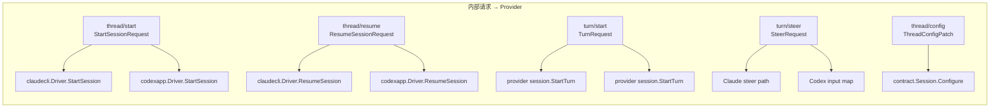
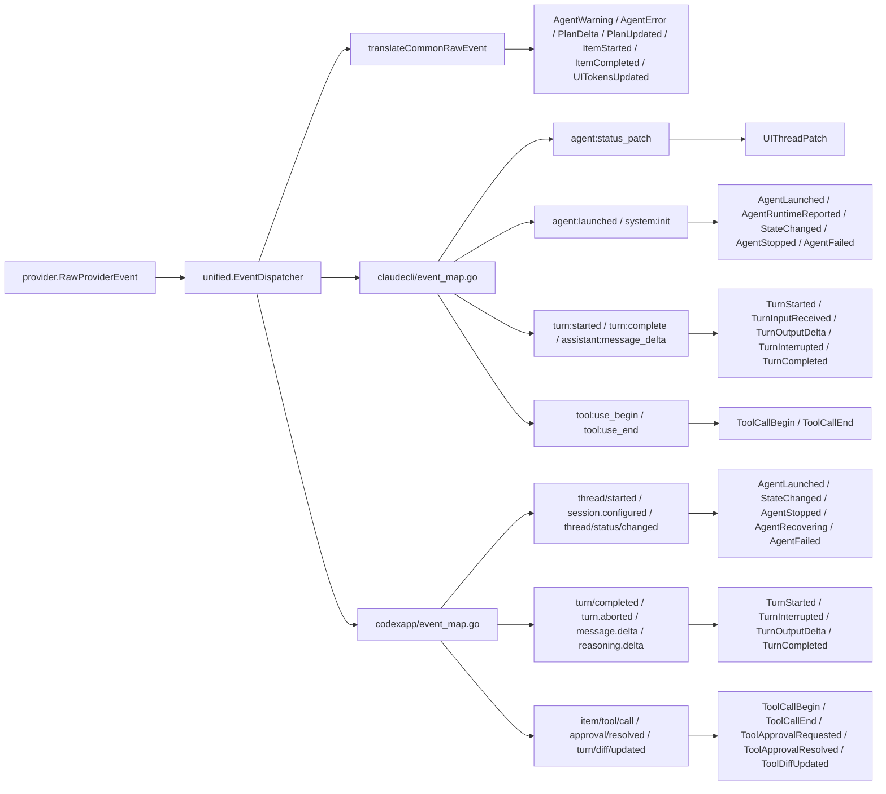
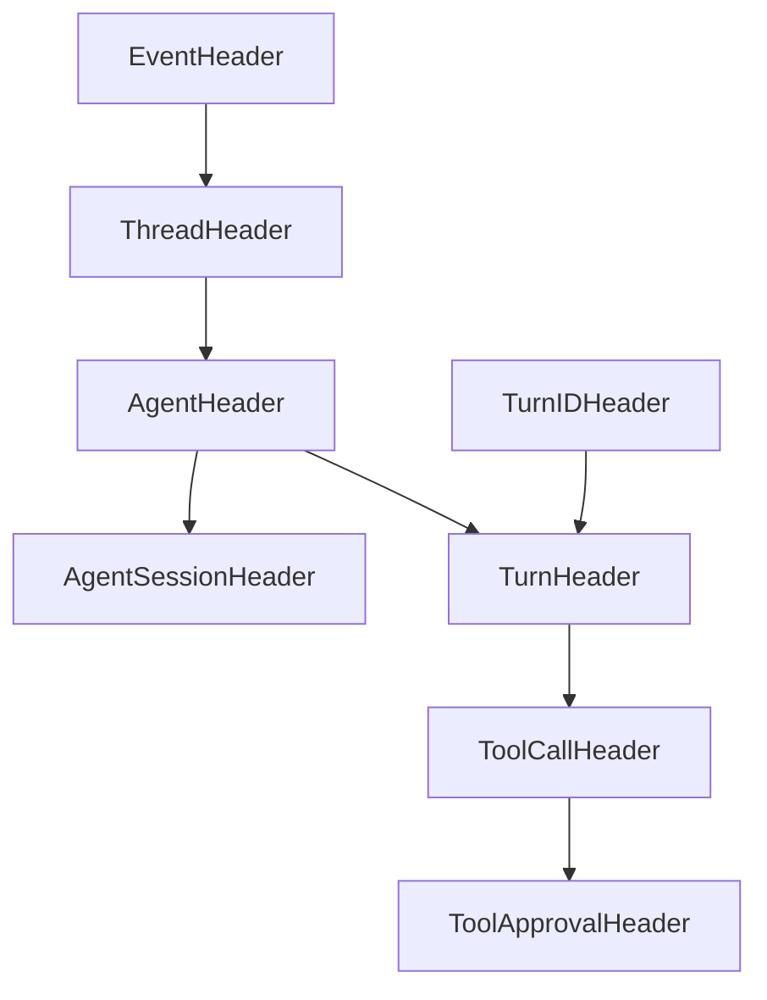
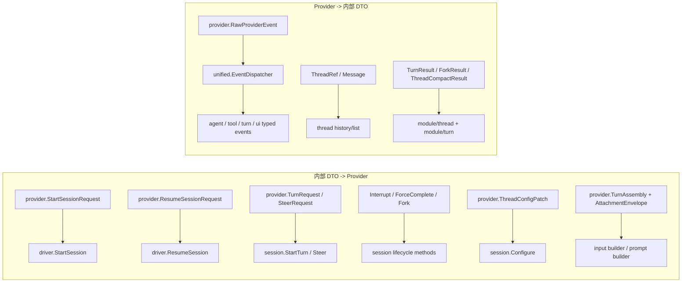
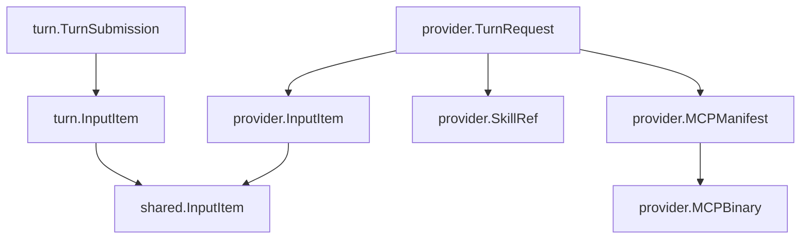

# 05 DTO 数据传输对象层代码地图

> 扫描范围：`internal/dto/` 下所有直接子包。
>
> 校验方式：`structure` 遍历 11 个子包；`grep` 校对 DTO/锚点；`xref(references)` 核对核心 DTO 的生产/消费两侧；`file` 精读定义。
>
> 当前快照：**11 个子包 / 37 个生产 Go 文件 / 15 个 DTO 合约测试**。
>
> <!-- codemap-count path="internal/dto" kind="go-child-dirs" expected="11" -->
> <!-- codemap-count path="internal/dto" kind="go-files-recursive" expected="37" -->
> <!-- codemap-count path="internal/dto" kind="go-test-files-recursive" expected="15" -->
>
> 重要说明：当前代码里**没有**名为 `ThreadEvent` / `TurnEvent` / `SkillEvent` 的总和类型；实际是若干 concrete DTO family。本文按 family 展开。

## 1. 子包矩阵

| 子包 | 用途 | 消费方（RPC / 事件总线 / UI 投影） | 产出方 | 代表锚点 |
|---|---|---|---|---|
| `shared` | 事件编号、Header 骨架、通用输入/错误 | 事件总线：`agent/thread/tool/turn/task/ui` 全部嵌入；Provider translator 复用 Header | 各模块 emitter / translator 在构造事件时嵌入 | `internal/dto/shared/event.go:5` |
| `agent` | Agent 生命周期、运行态、告警/错误 DTO | 事件总线：orchestration / memory / uistate；UI：eventsurface 下发 agent 相关投影 | `claudecli` / `codexapp` translator；orchestration 生命周期 | `internal/dto/agent/event.go:6` |
| `cron` | Cron job 运行事件 DTO | 事件总线、cron service 与 UI 投影 | cron scheduler / store | `internal/dto/cron/event.go:6` |
| `mcp` | `ctl/*` 控制面 RPC/notify/hook/report 协议 | RPC：`cmd/mcp-orch/orchestration`、`internal/platform/mcpcontrol` | orch 控制面、sidecar/peer 客户端 | `internal/dto/mcp/protocol.go:6` |
| `observation` | 跨模块观测记录 carrier | observation producer / consumer ports | runtime observation pipeline | `internal/dto/observation/types.go:3` |
| `provider` | Provider 启停/turn/config/history/raw-event 边界 | RPC：`contract.Driver` / `contract.Session`；事件总线：`RawProviderEvent` 进 `unified.EventDispatcher`；UI：历史/线程配置查询 | `thread` 模块、`turn` 模块、`prompt` 装配、provider drivers | `internal/dto/provider/session.go:55` |
| `task` | DAG / node / wakeup typed event | 事件总线：task watcher / orchestration / UI projector | task DAG service / watcher | `internal/dto/task/event.go:6` |
| `thread` | Thread 生命周期 typed event | 事件总线：memory team sync、uistate、eventsurface；UI：sidebar/state patch | `internal/module/thread` service/factory | `internal/dto/thread/event.go:6` |
| `tool` | Tool 调用/审批/DIFF typed event | 事件总线：uistate timeline、eventsurface、memory/FRC 相关模块 | provider translators、toolbridge diff fallback | `internal/dto/tool/event.go:10` |
| `turn` | Turn 生命周期、计划进度、提交模型 | 事件总线：orchestration hook consumer、memory hooks、uistate；RPC：turn submit payload | provider translators、unified common translator、orchestration turn lifecycle | `internal/dto/turn/event.go:6` |
| `ui` | UI projection event 与 thread live patch | UI 投影：eventsurface / rpc push / frontend live patch；事件总线：uistate projector | `uistate`、`skill` 服务、Claude status patch translator | `internal/dto/ui/event.go:6` |

## 2. 文件锚点索引（grep 1-based）

### 2.1 `shared`
- `errors.go`：统一错误变量。锚点：`internal/dto/shared/errors.go:5`
- `event.go`：`EventType*` 常量 + Header 骨架。锚点：`internal/dto/shared/event.go:5`, `:55`
- `input.go`：共享输入条目 `InputItem`。锚点：`internal/dto/shared/input.go:3`

### 2.2 `agent`
- `diagnostic.go`：`AgentWarning` / `AgentError`。锚点：`internal/dto/agent/diagnostic.go:10`, `:19`
- `event.go`：`StateChanged` / `AgentLaunched` / `AgentStopped` / `AgentRecovering` / `AgentFailed`。锚点：`internal/dto/agent/event.go:6`, `:14`, `:23`, `:29`, `:36`
- `runtime.go`：`RuntimeReport` / `AgentRuntimeReported`。锚点：`internal/dto/agent/runtime.go:5`, `:11`
- `state.go`：状态/触发器/转移矩阵。锚点：`internal/dto/agent/state.go:3`, `:16`, `:30`, `:35`, `:40`

### 2.3 `mcp`
- `approval_response.go`：审批响应 DTO。锚点：`internal/dto/mcp/approval_response.go:6`
- `constants.go`：`ctl/*` 方法、状态、hook decision 常量。锚点：`internal/dto/mcp/constants.go:3`
- `errors.go`：协议错误码。锚点：`internal/dto/mcp/errors.go:4`
- `hook.go`：hook subscribe / resolve / pending DTO。锚点：`internal/dto/mcp/hook.go:11`, `:25`, `:57`, `:76`, `:93`, `:105`
- `protocol.go`：register / heartbeat / context / event / report / shutdown / selector DTO。锚点：`internal/dto/mcp/protocol.go:6`, `:12`, `:29`, `:46`, `:66`, `:85`, `:108`, `:123`, `:153`, `:162`, `:182`, `:192`, `:200`, `:207`

### 2.4 `provider`
- `attachment.go`：`AttachmentEnvelope`。锚点：`internal/dto/provider/attachment.go:8`
- `capability.go`：`CapabilitySet`。锚点：`internal/dto/provider/capability.go:3`
- `event.go`：`RawProviderEvent` / `BusRawProviderEvent`。锚点：`internal/dto/provider/event.go:6`, `:14`
- `manifest.go`：`ToolFamily` / `MCPBinary` / `MCPManifest` / `ManifestContext`。锚点：`internal/dto/provider/manifest.go:3`, `:11`, `:20`, `:24`
- `message.go`：`Message` / `ThreadMessagesResult`。锚点：`internal/dto/provider/message.go:5`, `:16`
- `session.go`：prompt assembly / session start-resume carrier。锚点：`internal/dto/provider/session.go:12`, `:19`, `:21`, `:26`, `:38`, `:47`, `:55`, `:73`
- `thread.go`：`ThreadRef`。锚点：`internal/dto/provider/thread.go:3`
- `thread_config.go`：thread override/config/compact DTO。锚点：`internal/dto/provider/thread_config.go:3`, `:10`, `:16`, `:24`
- `turn.go`：turn/steer/skill/fork carrier。锚点：`internal/dto/provider/turn.go:11`, `:31`, `:57`, `:70`, `:100`, `:108`, `:116`, `:128`, `:134`, `:139`
- `message_test.go`：`createdAt` JSON 契约测试。锚点：`internal/dto/provider/message_test.go:10`
- `turn_test.go`：`SkillRef` 兼容/枚举/嵌入契约测试。锚点：`internal/dto/provider/turn_test.go:12`

### 2.5 其余事件包
- `task/event.go`：`TaskDagCreated` / `TaskNodeStatusChanged` / `TaskWakeupDispatched` / `TaskWakeupCompleted`。锚点：`internal/dto/task/event.go:6`, `:14`, `:24`, `:31`
- `thread/event.go`：`Started` / `Stopped` / `MessagesPage` / `Compacted` / `Updated`。锚点：`internal/dto/thread/event.go:6`, `:18`, `:27`, `:35`, `:46`
- `tool/event.go`：tool begin/end/approval/diff。锚点：`internal/dto/tool/event.go:10`, `:17`, `:29`, `:37`, `:46`
- `turn/event.go`：turn lifecycle。锚点：`internal/dto/turn/event.go:6`, `:11`, `:24`, `:30`, `:37`, `:43`, `:52`
- `turn/model.go`：`TurnSubmission`。锚点：`internal/dto/turn/model.go:11`
- `turn/progress.go`：plan/item 进度事件。锚点：`internal/dto/turn/progress.go:10`, `:18`, `:25`, `:37`
- `ui/event.go`：projection/tokens/skills/preferences/patch。锚点：`internal/dto/ui/event.go:6`, `:12`, `:21`, `:30`, `:40`, `:47`, `:53`, `:60`
- `ui/patch_types.go`：`PatchActivityStats` / `PatchTimelineItem` / `PatchAlert`。锚点：`internal/dto/ui/patch_types.go:4`, `:12`, `:33`

## 3. 核心事件 DTO（按 family 展开）

### 3.1 ThreadEvent family

> 当前没有单独 `ThreadEvent` struct；实际是 `thread.Started/Stopped/MessagesPage/Compacted/Updated` 五个 concrete DTO。定义锚点：`internal/dto/thread/event.go:6/18/27/35/46`。
>
> 生产侧：`internal/module/thread/factory.go:138`、`internal/module/thread/service.go:128`。
>
> 消费侧：`internal/module/uistate/projector_handlers.go:182`、`internal/module/memory/module.go:450`、`internal/platform/eventsurface/bind.go:127`。

| concrete DTO | 字段 | JSON | 说明 |
|---|---|---|---|
| 全部 | `EventHeader.Timestamp` | `timestamp` | 统一事件时间 |
| `Started` | `ThreadID` | `thread_id` | public thread id |
| `Started` | `AgentID` | `agent_id` | 归属 agent |
| `Started` | `Provider` | `provider` | provider 名 |
| `Started` | `ProviderThreadID` | `provider_thread_id` | provider 侧 thread id |
| `Started` | `CWD` / `Model` / `Name` | `cwd` / `model` / `name` | 初始化运行态与展示名 |
| `Stopped` | `ThreadID` / `AgentID` | `thread_id` / `agent_id` | 停止对象 |
| `Stopped` | `Status` / `Reason` | `status` / `reason` | 停止状态与原因 |
| `MessagesPage` | `ThreadID` | `thread_id` | 历史页刷新目标 |
| `MessagesPage` | `TotalCount` / `Pages` | `total_count` / `pages` | 历史分页摘要 |
| `Compacted` | `ThreadID` | `thread_id` | compact 目标 |
| `Compacted` | `Command` | `command` | compact 命令 |
| `Compacted` | `BeforeTokens` / `AfterTokens` | `before_tokens` / `after_tokens` | 压缩前后 token |
| `Compacted` | `Compacted` / `Estimated` | `compacted` / `estimated` | 是否真的压缩 / 是否估算 |
| `Updated` | `ThreadID` | `thread_id` | 更新目标 |
| `Updated` | `Name` / `Model` | `name` / `model` | thread 名或模型变更 |

### 3.2 TurnEvent family

> 当前没有单独 `TurnEvent` struct；实际由 `turn/event.go` 的生命周期事件和 `turn/progress.go` 的计划/条目进度事件组成。定义锚点：`internal/dto/turn/event.go:6/11/24/30/37/43/52`、`internal/dto/turn/progress.go:10/18/25/37`。
>
> 生产侧：`internal/provider/claudecli/event_map.go:92`、`internal/provider/codexapp/event_map.go:148`、`internal/provider/unified/event_map.go:151`、`cmd/mcp-orch/orchestration/turn_lifecycle.go:21`。
>
> 消费侧：`cmd/mcp-orch/orchestration/hook_consumer.go:97`、`internal/module/memory/service.go:201`、`internal/module/uistate/projector_handlers.go:296`。

| concrete DTO | 字段 | JSON | 说明 |
|---|---|---|---|
| 全部 | `TurnHeader` | `timestamp/thread_id/agent_id/turn_id` | turn 级统一 Header |
| `TurnStarted` | — | — | 只有 Header，无附加字段 |
| `TurnCompleted` | `Success` | `success` | 是否成功结束 |
| `TurnCompleted` | `Error` / `Status` / `Reason` | `error` / `status` / `reason` | 终态原因 |
| `TurnCompleted` | `Result` / `Summary` / `Message` | `result` / `summary` / `message` | 文本结果摘要 |
| `TurnCompleted` | `StopReason` | `stop_reason` | provider stop reason |
| `TurnInterrupted` | `Reason` | `reason` | 中断原因 |
| `TurnStalled` | `Reason` / `StalledMS` | `reason` / `stalled_ms` | 卡住原因与时长 |
| `TurnResumed` | `Reason` | `reason` | 恢复原因 |
| `TurnInputReceived` | `InputType` | `input_type` | 输入类型 |
| `TurnInputReceived` | `RequestID` / `Source` / `Text` | `request_id` / `source` / `text` | 输入来源与文本 |
| `TurnOutputDelta` | `Stream` / `Delta` | `stream` / `delta` | 流式输出分片 |
| `PlanDelta` | `RawType` / `Delta` / `Payload` | `raw_type` / `delta` / `payload` | 增量计划事件 |
| `PlanUpdated` | `RawType` / `Payload` | `raw_type` / `payload` | 全量计划快照 |
| `ItemStarted` | `RawType` / `ItemType` | `raw_type` / `item_type` | item 起始类型 |
| `ItemStarted` | `Command` / `File` / `ToolName` / `CallID` | `command` / `file` / `tool_name` / `call_id` | 命令/文件/工具锚点 |
| `ItemStarted` | `Payload` | `payload` | 原始载荷保留槽 |
| `ItemCompleted` | `RawType` / `ItemType` | `raw_type` / `item_type` | item 终态类型 |
| `ItemCompleted` | `Command` / `File` / `ToolName` / `CallID` | `command` / `file` / `tool_name` / `call_id` | 对齐起始 item |
| `ItemCompleted` | `ExitCode` / `Success` / `Error` | `exit_code` / `success` / `error` | 完成结果 |
| `ItemCompleted` | `Payload` | `payload` | 原始载荷保留槽 |

### 3.3 SkillEvent family

> 当前没有 `skill.Event` DTO；技能目录变更通过 **`ui.SkillsChanged`** 承载。定义锚点：`internal/dto/ui/event.go:30`。
>
> 生产侧：`internal/module/skill/events.go:31`。
>
> 消费侧：`internal/platform/eventsurface/bind.go:164`、`internal/platform/rpc/push.go:74`。

| 字段 | JSON | 说明 |
|---|---|---|
| `EventHeader.Timestamp` | `timestamp` | 事件时间 |
| `SkillsDir` | `skillsDir` | 技能根目录 |
| `Name` | `name` | 被改动 skill 名 |
| `Action` | `action` | 聚合后单动作；多动作时可为空 |
| `Actions` | `actions` | 去重后的动作集合 |
| `Count` | `count` | 本次聚合动作数 |

### 3.4 UIState Patch family

> 当前 UI 状态补丁就是 `ui.UIThreadPatch`；定义锚点：`internal/dto/ui/event.go:60`，嵌套类型锚点：`internal/dto/ui/event.go:47/53`、`internal/dto/ui/patch_types.go:4/12/33`。
>
> 生产侧：`internal/module/uistate/patch.go:114`、`internal/module/uistate/projector_handlers.go:49`、`internal/provider/claudecli/event_map.go:44`。
>
> 消费侧：`internal/platform/eventsurface/bind.go:170`、`internal/platform/rpc/push.go:75`、frontend `ui/thread/patch` 订阅面。

| 字段 | JSON | 说明 |
|---|---|---|
| `ThreadID` / `Source` / `Sequence` | `threadId` / `source` / `sequence` | patch 目标、来源、单线程递增序号 |
| `Thread` | `thread` | `ThreadPatchThread{id,name,state}` 摘要 |
| `Status` / `StatusHeader` / `StatusDetails` | `status` / `statusHeader` / `statusDetails` | UI 主状态文案 |
| `OverlayText` / `OverlayType` / `OverlayPriority` | `overlayText` / `overlayType` / `overlayPriority` | 覆层文本与优先级 |
| `TokenUsage` | `tokenUsage` | `ThreadPatchTokenUsage{usedTokens,contextWindowTokens,usedPercent}` |
| `DiffText` / `DiffRevision` | `diffText` / `diffRevision` | 当前 diff 文本与版本 |
| `Interruptible` | `interruptible` | 当前状态是否可中断 |
| `AgentMeta` | `agentMeta` | 附加 agent 元数据 |
| `ActivityStats` | `activityStats` | `PatchActivityStats{lspCalls,commands,fileEdits,toolCalls}` |
| `Alerts` | `alerts` | `[]PatchAlert{id,time,level,message}` |
| `TimelineItems` | `timelineItems` | `[]PatchTimelineItem` 增量 timeline |
| `RemovedItemIds` / `TimelineOrder` | `removedItemIds` / `timelineOrder` | timeline 删除/排序 |
| `Recover` / `RefreshRequired` / `FallbackReason` | `recover` / `refreshRequired` / `fallbackReason` | 降级恢复信号 |
| `ActiveThreadID` / `ActiveCmdThreadID` | `activeThreadId` / `activeCmdThreadId` | 当前激活线程/命令线程 |
| `MainAgentID` / `MainAgentState` | `mainAgentId` / `mainAgentState` | 主 agent 身份与状态 |
| `Partial` | `partial` | 是否为部分 patch |

## 4. Provider 协议 DTO 与映射

### 4.1 出站：内部 DTO → provider 驱动 / RPC

| DTO | 生产侧 | 消费侧 | 锚点 |
|---|---|---|---|
| `StartSessionRequest` | `internal/module/thread/start_session.go:152` | `internal/provider/claudecli/driver.go:106`、`internal/provider/codexapp/driver.go:157` | `internal/dto/provider/session.go:55` |
| `ResumeSessionRequest` | `thread` 恢复链路 | `claudecli.Driver.ResumeSession`、`codexapp.Driver.ResumeSession` | `internal/dto/provider/session.go:73` |
| `TurnAssembly` | `internal/module/turn/prompt_assembly.go:13` | `internal/dto/provider/turn.go:17`, `:121`、`internal/provider/codexapp/session_turn.go:77` | `internal/dto/provider/session.go:47` |
| `AttachmentEnvelope` | `internal/module/memory/retrieval/render.go:33`、`internal/module/memory/nested/nested_rules.go:18` | `contract.RenderAttachmentText`、provider turn input builder | `internal/dto/provider/attachment.go:8` |
| `TurnRequest` / `SteerRequest` | `turn` 提交/引导 | provider session turn builder | `internal/dto/provider/turn.go:11`, `:116` |
| `InterruptRequest` / `ForceCompleteRequest` / `ForkRequest` | thread/turn 管理命令 | `contract.Session` 实现 | `internal/dto/provider/turn.go:108`, `:128`, `:134` |
| `ThreadConfigPatch` | thread config/set RPC | `contract.Session.Configure` | `internal/dto/provider/thread_config.go:3` |
| `ThreadRef` / `Message` | provider history/list API | thread/history 查询面 | `internal/dto/provider/thread.go:3`, `internal/dto/provider/message.go:5` |

### 4.2 入站：Claude / Codex raw event → 内部事件

> `provider.RawProviderEvent` 先进入 `internal/provider/unified/event_map.go:103`；公共 translator 先处理 warning/error/plan/item，再进入 provider 专属 translator。

| Raw 事件 | 内部 DTO | 映射锚点 |
|---|---|---|
| Claude `agent:status_patch` | `ui.UIThreadPatch` | `internal/provider/claudecli/event_map.go:44` |
| Claude `agent:launched` | `agent.AgentLaunched` | `internal/provider/claudecli/event_map.go:62` |
| Claude `system:init` | `agent.AgentRuntimeReported` | `internal/provider/claudecli/event_map.go:68` |
| Claude `turn:complete` | `turn.TurnCompleted` | `internal/provider/claudecli/event_map.go:121` |
| Claude `tool:use_end` | `tool.ToolCallEnd` | `internal/provider/claudecli/event_map.go:147` |
| Codex `thread/started` / `session.configured` | `agent.AgentLaunched` | `internal/provider/codexapp/event_map.go:116` |
| Codex `thread/status/changed` | `agent.StateChanged` | `internal/provider/codexapp/event_map.go:124` |
| Codex `turn/completed` / `turn/aborted` | `turn.TurnCompleted` | `internal/provider/codexapp/event_map.go:149` |
| Codex `item/tool/call` | `tool.ToolCallBegin` | `internal/provider/codexapp/event_map.go:257` |
| Codex `approval/resolved` | `tool.ToolApprovalResolved` | `internal/provider/codexapp/event_map.go:285` |
| Codex `turn/diff/updated` | `tool.ToolDiffUpdated` | `internal/provider/codexapp/event_map.go:292` |
| Common raw warning/error | `agent.AgentWarning` / `agent.AgentError` | `internal/provider/unified/event_map.go:161` |
| Common plan/item raw | `turn.PlanDelta` / `PlanUpdated` / `ItemStarted` / `ItemCompleted` | `internal/provider/unified/event_map.go:178`, `:185`, `:191`, `:202` |

## 5. 新增 DTO 如何落地（3 步）

1. **定义 struct**：在 `internal/dto/<pkg>` 新增 DTO；若是 typed event，同步补 `shared.EventType*` 和 `Type() uint32`，并给出稳定 JSON tag。
2. **添加转换函数**：
   - 入站 provider/raw 事件：改 `internal/provider/{claudecli,codexapp}/event_map.go` 或 `internal/provider/unified/event_map.go`；
   - 出站请求 DTO：改 `thread/start_session.go`、`turn/prompt_assembly.go`、provider driver 的参数投影函数。
3. **注册 bus / endpoint**：
   - 事件总线：把 typed event 接入 `internal/provider/unified/event_map.go:28` 的 `typedEventPublishers`，或在模块里增加 emitter；
   - UI / RPC：需要外发时补 `internal/platform/eventsurface/bind.go`，需要投影时补 `internal/module/uistate/*` handler。

## 6. 近期稳定 API（P18 / P19 / P20 落地后）

| Phase | 稳定 DTO / 变更 | 现状 | 锚点 |
|---|---|---|---|
| P18（prompt/memory bridge） | `PromptAssemblyBoundary`、`PromptAssemblySnapshot{Boundary,SectionSnapshot,Generation}`、`StartAssembly`、`TurnAssembly{UserContext,SystemContext,Attachments,ResolvedSections}` | 已成为 thread→provider 主链稳定 carrier | `internal/dto/provider/session.go:21`, `:26`, `:38`, `:47` |
| P18（memory attachment） | `AttachmentEnvelope` + `AttachmentKindRelevantMemory/NestedMemory` | 已被 retrieval/nested memory 生产、provider turn 消费 | `internal/dto/provider/attachment.go:3`, `:8` |
| P18（大结果降级） | `tool.ToolCallEnd` 新增 `PersistedPath` / `Truncated` / `OriginalSize` | UI timeline / diff fallback / tool result store 已消费 | `internal/dto/tool/event.go:17` |
| P19（DTO 纯化） | `ManifestContext` 保留为 carrier，`BuildManifest` 移到 `internal/provider/manifestbuilder/manifest.go:10` | **P19 没有新增 wire 字段，但稳定了 DTO 只承载数据的边界** | `internal/dto/provider/manifest.go:24` |
| P19（DTO 纯化） | `RawProviderEvent` / `BusRawProviderEvent` 保留，`EventTranslator` 移到 `internal/provider/unified/event_map.go:26` | raw carrier 与 translator contract 彻底分层 | `internal/dto/provider/event.go:6`, `:14` |
| P19（DTO 纯化） | `shared.EventHeader` 家族保留，事件时间 helper 移到 `internal/platform/shared/timeparse.go:43` | shared DTO 现仅保留常量与 Header | `internal/dto/shared/event.go:55` |
| P20.1（skill progressive disclosure） | `SkillRef` 保留稳定引用元数据与兼容 `Prompt`，新增 `SkillSource`；旧 `Mode` 字段已退出 wire carrier | DTO 合约测试锁定旧 `mode` 输入被忽略、marshal 不再输出该字段 | `internal/dto/provider/turn.go:39-70`; `internal/dto/provider/turn_test.go:28-48` |
| P20.3（legacy launch skill carrier） | `StartSessionRequest` 保留 `LaunchSkillNames` / `ForceLaunchSkills` | 仅作 backward-compatible wire carrier；V1 生产链路不再把它转成 prompt catalog / manifest / dynamic skill tool，Claude/Codex 由 provider-native mirror 发现 skill | `internal/dto/provider/session.go:64`, `:68`; `internal/module/thread/start_session.go:152` |

## 7. 文档 / 代码不符项（本轮核对结论）

1. **thread 事件不是 4 个而是 5 个**：当前多了 `thread.Updated`，对应 `EventTypeThreadUpdated=1354`（`internal/dto/shared/event.go:42`, `internal/dto/thread/event.go:46`）。
2. **`provider/manifest.go` 已不再包含 `BuildManifest`**：组装入口已迁到 `internal/provider/manifestbuilder/manifest.go:10`；DTO 层只保留 `ToolFamily/MCPBinary/MCPManifest/ManifestContext`。
3. **`provider/event.go` 已不再定义 `EventTranslator`**：translator contract 在 `internal/provider/unified/event_map.go:26`。
4. **`shared/event.go` 已不再放事件时间 helper**：`WithEventTime/ResolveEventTime/...` 已迁到 `internal/platform/shared/timeparse.go:43`。
5. **当前仓库没有 `agent/guard.go`、`provider/user_context.go`**；旧地图若仍引用这两个文件，已过期。
6. **当前代码没有名为 `ThreadEvent` / `TurnEvent` / `SkillEvent` 的统一 DTO**；若文档继续把它们写成单一 struct，会和源码不符。

## 8. 深化补遗（2026-04-20）

### 8.1 十一个子包逐包矩阵（按文件展开）

#### 8.1.1 `shared`

| 文件 | 用途 | 消费方 | 产出方 | 锚点 |
|---|---|---|---|---|
| `errors.go` | 导出 DTO 层共用错误变量，给上层 wrap / compare | `thread/turn/provider` 相关调用链、契约测试 | `shared` 包自身初始化 | `internal/dto/shared/errors.go:5` |
| `event.go` | 定义 `EventType*` 常量与 Header 继承骨架 | `agent/thread/tool/turn/task/ui` 全部 typed event；`internal/provider/unified/event_map.go:28` 的 publisher 注册表 | 所有 emitter / translator 在构造 typed event 时嵌入 | `internal/dto/shared/event.go:5`, `:55`, `:83`, `:125` |
| `input.go` | 定义唯一共享输入条目 `InputItem` | `turn/model.go`、`provider/turn.go` 别名复用；thread/turn 提交链 | UI turn submit、thread start/steer 请求装配 | `internal/dto/shared/input.go:3` |

#### 8.1.2 `agent`

| 文件 | 用途 | 消费方 | 产出方 | 锚点 |
|---|---|---|---|---|
| `diagnostic.go` | `AgentWarning` / `AgentError` typed diagnostic DTO | memory hooks、uistate、eventsurface、日志/审计下游 | `internal/provider/unified/event_map.go:161`, `:169` 公共 raw translator | `internal/dto/agent/diagnostic.go:10`, `:19` |
| `event.go` | Agent 生命周期 typed event：launch/state/stop/recover/fail | orchestration、uistate sidebar、eventsurface push | `internal/provider/claudecli/event_map.go:62`, `internal/provider/codexapp/event_map.go:116` | `internal/dto/agent/event.go:6`, `:14`, `:23`, `:29`, `:36` |
| `runtime.go` | 运行时端口/provider runtime report DTO | uistate runtime patch、mcp report 对账 | `claudecli system:init` / mcp runtime report 生产 | `internal/dto/agent/runtime.go:5`, `:11` |
| `state.go` | agent 状态常量、触发器、转移矩阵 | `codexapp.validatedStateChangedEvent`、orchestration 状态机、测试断言 | 生命周期实现与状态校验逻辑 | `internal/dto/agent/state.go:3`, `:16`, `:30`, `:40` |

#### 8.1.3 `mcp`

| 文件 | 用途 | 消费方 | 产出方 | 锚点 |
|---|---|---|---|---|
| `approval_response.go` | 统一 approval 回调响应 DTO | peer callback、approval bridge | UI / orch 审批结果写回方 | `internal/dto/mcp/approval_response.go:6` |
| `constants.go` | `ctl/*` 方法、scope、status、report variant、hook decision 常量 | `cmd/mcp-orch`、`internal/mcpserver/common/bootstrap`、peer 客户端 | 所有协议调用方按常量拼装 | `internal/dto/mcp/constants.go:3` |
| `errors.go` | MCP 协议稳定错误码 | server 错误映射、客户端重试/分流 | protocol handler 返回错误时引用 | `internal/dto/mcp/errors.go:4` |
| `hook.go` | hook subscribe / resolve / pending review 全套 DTO | hookstore、bootstrap lifecycle、peer review UI | tool sidecar / orch hook peer | `internal/dto/mcp/hook.go:11`, `:57`, `:76`, `:105` |
| `protocol.go` | register / heartbeat / context / event / report / shutdown / selector 核心 wire contract | `cmd/mcp-orch/runtime.go`、`internal/mcpserver/common/server.go`、sidecar client | tool / orch / lsp / ida 进程 | `internal/dto/mcp/protocol.go:12`, `:46`, `:85`, `:153`, `:182`, `:200` |

#### 8.1.4 `provider`

| 文件 | 用途 | 消费方 | 产出方 | 锚点 |
|---|---|---|---|---|
| `attachment.go` | prompt / memory 附件信封 | provider turn input builder、attachment renderer | `memory/retrieval`、`memory/nested` | `internal/dto/provider/attachment.go:8` |
| `capability.go` | `CapabilitySet` 与 capability 常量 | manifest builder、thread capability 判断 | thread start / provider factory 配置 | `internal/dto/provider/capability.go:3`, `:5` |
| `event.go` | `RawProviderEvent` / `BusRawProviderEvent` raw carrier | `internal/provider/unified/event_map.go`、bus sink、事件审计 | claude/codex session read loop | `internal/dto/provider/event.go:6`, `:14` |
| `manifest.go` | provider 可见的 `ToolFamily/MCPBinary/MCPManifest/ManifestContext` | `internal/provider/manifestbuilder/manifest.go:10`、drivers、manifest tests | thread 启动配置组装 | `internal/dto/provider/manifest.go:3`, `:11`, `:20`, `:24` |
| `message.go` | provider history message / thread message page 结果 | thread/history API、UI 历史页 | provider history loader | `internal/dto/provider/message.go:5`, `:16` |
| `session.go` | prompt assembly snapshot、start/resume session carrier | `contract.Driver.StartSession/ResumeSession`、driver config builder | `internal/module/thread/start_session.go:152`、prompt assembly | `internal/dto/provider/session.go:21`, `:26`, `:47`, `:55`, `:73` |
| `thread.go` | provider thread 轻量引用 | thread list/history 查询 | provider list/history 实现 | `internal/dto/provider/thread.go:3` |
| `thread_config.go` | thread override/config/compact result carrier | thread config/set RPC、session.Configure、compact UI | `internal/module/thread` config 读写链 | `internal/dto/provider/thread_config.go:3`, `:16`, `:24` |
| `turn.go` | turn / steer / interrupt / force-complete / fork / skill 引用 carrier | `internal/module/turn`、provider session methods、契约测试 | turn service / thread service / tests | `internal/dto/provider/turn.go:11`, `:57`, `:100`, `:108`, `:116`, `:128`, `:134`, `:139` |

#### 8.1.5 `task`

| 文件 | 用途 | 消费方 | 产出方 | 锚点 |
|---|---|---|---|---|
| `event.go` | DAG / node / wakeup typed event | watcher、orchestration、UI task 投影 | taskdag store / watcher / scheduler | `internal/dto/task/event.go:6`, `:14`, `:24`, `:31` |

#### 8.1.6 `thread`

| 文件 | 用途 | 消费方 | 产出方 | 锚点 |
|---|---|---|---|---|
| `event.go` | thread start/stop/messages/compact/update typed event | memory、uistate、eventsurface、hooks relay | `internal/module/thread/factory.go:138`, `internal/module/thread/service.go:128` | `internal/dto/thread/event.go:6`, `:18`, `:27`, `:35`, `:46` |

#### 8.1.7 `tool`

| 文件 | 用途 | 消费方 | 产出方 | 锚点 |
|---|---|---|---|---|
| `event.go` | tool begin/end/approval/diff typed event | uistate timeline、eventsurface、approval bridge、diff 展示 | provider translators、toolbridge diff emitter | `internal/dto/tool/event.go:10`, `:17`, `:29`, `:37`, `:46` |

#### 8.1.8 `turn`

| 文件 | 用途 | 消费方 | 产出方 | 锚点 |
|---|---|---|---|---|
| `event.go` | turn 生命周期 DTO | orchestration hook consumer、memory hooks、uistate | provider translators、orchestration lifecycle | `internal/dto/turn/event.go:6`, `:11`, `:24`, `:30`, `:37`, `:43`, `:52` |
| `model.go` | UI / RPC 提交模型 `TurnSubmission` | turn RPC handler、service 层 | 前端 composer / rpc client | `internal/dto/turn/model.go:11` |
| `progress.go` | plan/item 增量事件 DTO | uistate timeline、memory metadata、eventsurface | `internal/provider/unified/event_map.go:178`, `:191`, `:202` | `internal/dto/turn/progress.go:10`, `:18`, `:25`, `:37` |

#### 8.1.9 `ui`

| 文件 | 用途 | 消费方 | 产出方 | 锚点 |
|---|---|---|---|---|
| `event.go` | projection revision、timeline、tokens、skills、preferences、thread patch DTO | eventsurface、rpc push、frontend 订阅端 | `uistate` projector、skill watcher、provider translator | `internal/dto/ui/event.go:6`, `:21`, `:30`, `:40`, `:60` |
| `patch_types.go` | `UIThreadPatch` 嵌套 patch 结构 | `uistate/patch.go`、前端 patch reducer | uistate patch builder | `internal/dto/ui/patch_types.go:4`, `:12`, `:33` |

### 8.2 Header 继承关系（对应 B17 §3.2 Mermaid）

| Header | 直接嵌入 / 继承 | 新增字段 | 主要承载场景 | 锚点 |
|---|---|---|---|---|
| `EventHeader` | — | `Timestamp` | 所有 typed event 的统一事件时间 | `internal/dto/shared/event.go:55` |
| `ThreadHeader` | `EventHeader` | `ThreadID` | thread / UI projection 级事件 | `internal/dto/shared/event.go:60` |
| `AgentHeader` | `ThreadHeader` | `AgentID` | agent / turn / tool 事件 | `internal/dto/shared/event.go:66` |
| `AgentSessionHeader` | `AgentHeader` | `SessionID` | provider session 绑定的 agent 事件 | `internal/dto/shared/event.go:72` |
| `TurnIDHeader` | — | `TurnID` | 作为可复用 turn 标识碎片被二次组合 | `internal/dto/shared/event.go:78` |
| `TurnHeader` | `AgentHeader` + `TurnIDHeader` | — | turn 生命周期、plan/item 进度 | `internal/dto/shared/event.go:83` |
| `ToolCallHeader` | `TurnHeader` | `CallID`、`ToolName` | tool begin/end | `internal/dto/shared/event.go:89` |
| `ToolApprovalHeader` | `ToolCallHeader` | `ApprovalID` | tool approval request / resolve | `internal/dto/shared/event.go:96` |
| `DAGHeader` | `EventHeader` | `DagKey` | task DAG 级事件 | `internal/dto/shared/event.go:102` |
| `TaskNodeHeader` | `TaskDAGHeader` | `NodeKey` | task node 状态变化 | `internal/dto/shared/event.go:113` |
| `TaskWakeupHeader` | `TaskNodeHeader` | `WakeupID` | task wakeup 派发 / 完成 | `internal/dto/shared/event.go:119` |
| `UIProjectionHeader` | `ThreadHeader` | `Projection` | UI projection revision / tokens | `internal/dto/shared/event.go:125` |
| `UITurnHeader` | `UIProjectionHeader` + `TurnIDHeader` | — | UI turn timeline / token usage | `internal/dto/shared/event.go:131` |

### 8.3 `Thread` 字段级展开（补全继承字段）

> 对应源码：`internal/dto/thread/event.go:6/18/27/35/46`。这里把嵌入的 `EventHeader.Timestamp` 一并展开，不再只写“公共 Header”。

| DTO | 字段 | JSON | 来源 | 说明 |
|---|---|---|---|---|
| `Started` / `Stopped` / `MessagesPage` / `Compacted` / `Updated` | `Timestamp` | `timestamp` | `shared.EventHeader` | typed event 统一事件时间 |
| `Started` | `ThreadID` | `thread_id` | 直接字段 | 内部 thread id |
| `Started` | `AgentID` | `agent_id` | 直接字段 | 启动该 thread 的 agent |
| `Started` | `Provider` | `provider` | 直接字段 | provider 名 |
| `Started` | `ProviderThreadID` | `provider_thread_id` | 直接字段 | provider 侧 thread id |
| `Started` | `CWD` | `cwd` | 直接字段 | 会话 cwd |
| `Started` | `Model` | `model` | 直接字段 | 启动模型 |
| `Started` | `Name` | `name` | 直接字段 | UI 展示名 |
| `Stopped` | `ThreadID` | `thread_id` | 直接字段 | 被停止 thread |
| `Stopped` | `AgentID` | `agent_id` | 直接字段 | 所属 agent |
| `Stopped` | `Status` | `status` | 直接字段 | 停止后的线程状态 |
| `Stopped` | `Reason` | `reason` | 直接字段 | 停止原因 |
| `MessagesPage` | `ThreadID` | `thread_id` | 直接字段 | 历史分页所属 thread |
| `MessagesPage` | `TotalCount` | `total_count` | 直接字段 | 历史消息总数 |
| `MessagesPage` | `Pages` | `pages` | 直接字段 | 历史分页页数 |
| `Compacted` | `ThreadID` | `thread_id` | 直接字段 | 被 compact 的 thread |
| `Compacted` | `Command` | `command` | 直接字段 | 触发 compact 的命令 |
| `Compacted` | `BeforeTokens` | `before_tokens` | 直接字段 | 压缩前 token |
| `Compacted` | `AfterTokens` | `after_tokens` | 直接字段 | 压缩后 token |
| `Compacted` | `Compacted` | `compacted` | 直接字段 | 是否真的发生压缩 |
| `Compacted` | `Estimated` | `estimated` | 直接字段 | token 是否为估算值 |
| `Updated` | `ThreadID` | `thread_id` | 直接字段 | 被更新 thread |
| `Updated` | `Name` | `name` | 直接字段 | thread 名变更 |
| `Updated` | `Model` | `model` | 直接字段 | 模型变更；可空表示未改 |

### 8.4 `Turn` 字段级展开（补全继承字段）

> 对应源码：`internal/dto/turn/event.go:6/11/24/30/37/43/52`、`internal/dto/turn/progress.go:10/18/25/37`。

| DTO | 字段 | JSON | 来源 | 说明 |
|---|---|---|---|---|
| 全部 turn family | `Timestamp` | `timestamp` | `shared.EventHeader` | 统一事件时间 |
| 全部 turn family | `ThreadID` | `thread_id` | `shared.ThreadHeader` | 所属 thread |
| 全部 turn family | `AgentID` | `agent_id` | `shared.AgentHeader` | 所属 agent |
| 全部 turn family | `TurnID` | `turn_id` | `shared.TurnIDHeader` | 所属 turn |
| `TurnStarted` | — | — | `TurnHeader` only | 无附加业务字段 |
| `TurnCompleted` | `Success` | `success` | 直接字段 | 是否成功终止 |
| `TurnCompleted` | `Error` | `error` | 直接字段 | 错误文本 |
| `TurnCompleted` | `Status` | `status` | 直接字段 | provider 返回的终态 |
| `TurnCompleted` | `Reason` | `reason` | 直接字段 | 中止/完成原因 |
| `TurnCompleted` | `Result` | `result` | 直接字段 | 结果摘要文本 |
| `TurnCompleted` | `Summary` | `summary` | 直接字段 | provider summary |
| `TurnCompleted` | `Message` | `message` | 直接字段 | 完整消息或简化文本 |
| `TurnCompleted` | `StopReason` | `stop_reason` | 直接字段 | provider stop reason |
| `TurnInterrupted` | `Reason` | `reason` | 直接字段 | 中断原因 |
| `TurnStalled` | `Reason` | `reason` | 直接字段 | 卡住原因 |
| `TurnStalled` | `StalledMS` | `stalled_ms` | 直接字段 | 卡住时长毫秒 |
| `TurnResumed` | `Reason` | `reason` | 直接字段 | 恢复原因 |
| `TurnInputReceived` | `InputType` | `input_type` | 直接字段 | 输入类别 |
| `TurnInputReceived` | `RequestID` | `request_id` | 直接字段 | 审批/输入 request id |
| `TurnInputReceived` | `Source` | `source` | 直接字段 | 输入来源 |
| `TurnInputReceived` | `Text` | `text` | 直接字段 | 文本输入 |
| `TurnOutputDelta` | `Stream` | `stream` | 直接字段 | `message` / `reasoning` / `stdout` |
| `TurnOutputDelta` | `Delta` | `delta` | 直接字段 | 增量文本 |
| `PlanDelta` | `RawType` | `raw_type` | 直接字段 | 原始 provider raw type |
| `PlanDelta` | `Delta` | `delta` | 直接字段 | 增量 plan 文本 |
| `PlanDelta` | `Payload` | `payload` | 直接字段 | 原始 JSON 保留槽 |
| `PlanUpdated` | `RawType` | `raw_type` | 直接字段 | 原始 raw type |
| `PlanUpdated` | `Payload` | `payload` | 直接字段 | 全量 plan JSON |
| `ItemStarted` | `RawType` | `raw_type` | 直接字段 | 原始 item started 类型 |
| `ItemStarted` | `ItemType` | `item_type` | 直接字段 | item 子类型 |
| `ItemStarted` | `Command` | `command` | 直接字段 | 命令项命令文本 |
| `ItemStarted` | `File` | `file` | 直接字段 | 文件路径 |
| `ItemStarted` | `ToolName` | `tool_name` | 直接字段 | 工具名 |
| `ItemStarted` | `CallID` | `call_id` | 直接字段 | tool call id |
| `ItemStarted` | `Payload` | `payload` | 直接字段 | 原始 JSON 保留槽 |
| `ItemCompleted` | `RawType` | `raw_type` | 直接字段 | 原始 item completed 类型 |
| `ItemCompleted` | `ItemType` | `item_type` | 直接字段 | item 子类型 |
| `ItemCompleted` | `Command` | `command` | 直接字段 | 命令文本 |
| `ItemCompleted` | `File` | `file` | 直接字段 | 文件路径 |
| `ItemCompleted` | `ToolName` | `tool_name` | 直接字段 | 工具名 |
| `ItemCompleted` | `CallID` | `call_id` | 直接字段 | tool call id |
| `ItemCompleted` | `ExitCode` | `exit_code` | 直接字段 | 退出码 |
| `ItemCompleted` | `Success` | `success` | 直接字段 | 是否成功 |
| `ItemCompleted` | `Error` | `error` | 直接字段 | 错误文本 |
| `ItemCompleted` | `Payload` | `payload` | 直接字段 | 原始 JSON 保留槽 |

### 8.5 `Skill` / `UIThreadPatch` / `UIState` 字段级展开

#### 8.5.1 `Skill`（实际 carrier=`ui.SkillsChanged`）

| 字段 | JSON | 来源 | 说明 | 锚点 |
|---|---|---|---|---|
| `Timestamp` | `timestamp` | `shared.EventHeader` | 事件时间 | `internal/dto/ui/event.go:30` |
| `SkillsDir` | `skillsDir` | 直接字段 | 发生变更的 skills 根目录 | `internal/dto/ui/event.go:32` |
| `Name` | `name` | 直接字段 | 被改动的 skill 名 | `internal/dto/ui/event.go:33` |
| `Action` | `action` | 直接字段 | 单动作聚合值 | `internal/dto/ui/event.go:34` |
| `Actions` | `actions` | 直接字段 | 去重后的动作集合 | `internal/dto/ui/event.go:35` |
| `Count` | `count` | 直接字段 | 动作数量 | `internal/dto/ui/event.go:36` |

#### 8.5.2 `UIThreadPatch` 顶层字段

| 字段 | JSON | 类型 | 说明 | 锚点 |
|---|---|---|---|---|
| `ThreadID` | `threadId` | `string` | patch 目标 thread | `internal/dto/ui/event.go:61` |
| `Source` | `source` | `string` | patch 来源（uistate / provider / recover） | `internal/dto/ui/event.go:62` |
| `Sequence` | `sequence` | `int64` | 单线程增量序号 | `internal/dto/ui/event.go:63` |
| `Thread` | `thread` | `*ThreadPatchThread` | thread 摘要 | `internal/dto/ui/event.go:64` |
| `Status` | `status` | `string` | 主状态文案 | `internal/dto/ui/event.go:65` |
| `StatusHeader` | `statusHeader` | `string` | 状态标题 | `internal/dto/ui/event.go:66` |
| `StatusDetails` | `statusDetails` | `string` | 状态详情 | `internal/dto/ui/event.go:67` |
| `OverlayText` | `overlayText` | `string` | 覆层文本 | `internal/dto/ui/event.go:68` |
| `OverlayType` | `overlayType` | `string` | 覆层类别 | `internal/dto/ui/event.go:69` |
| `OverlayPriority` | `overlayPriority` | `int` | 覆层优先级 | `internal/dto/ui/event.go:70` |
| `TokenUsage` | `tokenUsage` | `*ThreadPatchTokenUsage` | token 百分比摘要 | `internal/dto/ui/event.go:71` |
| `DiffText` | `diffText` | `string` | 当前 diff 预览 | `internal/dto/ui/event.go:72` |
| `DiffRevision` | `diffRevision` | `int64` | diff 修订号 | `internal/dto/ui/event.go:73` |
| `Interruptible` | `interruptible` | `*bool` | 是否可中断 | `internal/dto/ui/event.go:74` |
| `AgentMeta` | `agentMeta` | `map[string]any` | 附加 agent metadata | `internal/dto/ui/event.go:75` |
| `ActivityStats` | `activityStats` | `*PatchActivityStats` | 活动统计 | `internal/dto/ui/event.go:76` |
| `Alerts` | `alerts` | `[]PatchAlert` | 告警列表 | `internal/dto/ui/event.go:77` |
| `TimelineItems` | `timelineItems` | `[]PatchTimelineItem` | timeline 增量条目 | `internal/dto/ui/event.go:78` |
| `RemovedItemIds` | `removedItemIds` | `[]string` | 需要删除的 timeline item id | `internal/dto/ui/event.go:79` |
| `TimelineOrder` | `timelineOrder` | `[]string` | timeline 排序结果 | `internal/dto/ui/event.go:80` |
| `Recover` | `recover` | `bool` | 标记为恢复性 patch | `internal/dto/ui/event.go:81` |
| `RefreshRequired` | `refreshRequired` | `bool` | 前端需全量刷新 | `internal/dto/ui/event.go:82` |
| `FallbackReason` | `fallbackReason` | `string` | fallback 原因 | `internal/dto/ui/event.go:83` |
| `ActiveThreadID` | `activeThreadId` | `string` | 当前激活聊天线程 | `internal/dto/ui/event.go:84` |
| `ActiveCmdThreadID` | `activeCmdThreadId` | `string` | 当前激活命令线程 | `internal/dto/ui/event.go:85` |
| `MainAgentID` | `mainAgentId` | `string` | 当前主 agent | `internal/dto/ui/event.go:86` |
| `MainAgentState` | `mainAgentState` | `string` | 当前主 agent 状态 | `internal/dto/ui/event.go:87` |
| `Partial` | `partial` | `bool` | 是否为部分 patch | `internal/dto/ui/event.go:88` |

#### 8.5.3 `UIThreadPatch` 嵌套补丁类型

| 类型 | 字段 | JSON | 说明 | 锚点 |
|---|---|---|---|---|
| `ThreadPatchThread` | `ID` | `id` | thread id | `internal/dto/ui/event.go:47` |
| `ThreadPatchThread` | `Name` | `name` | thread 名 | `internal/dto/ui/event.go:49` |
| `ThreadPatchThread` | `State` | `state` | thread/state 聚合状态 | `internal/dto/ui/event.go:50` |
| `ThreadPatchTokenUsage` | `UsedTokens` | `usedTokens` | 已用 token | `internal/dto/ui/event.go:53` |
| `ThreadPatchTokenUsage` | `ContextWindowTokens` | `contextWindowTokens` | 上下文窗口 | `internal/dto/ui/event.go:55` |
| `ThreadPatchTokenUsage` | `UsedPercent` | `usedPercent` | 使用百分比 | `internal/dto/ui/event.go:56` |
| `PatchActivityStats` | `LSPCalls` | `lspCalls` | LSP 调用次数 | `internal/dto/ui/patch_types.go:4` |
| `PatchActivityStats` | `Commands` | `commands` | command 次数 | `internal/dto/ui/patch_types.go:6` |
| `PatchActivityStats` | `FileEdits` | `fileEdits` | 文件编辑次数 | `internal/dto/ui/patch_types.go:7` |
| `PatchActivityStats` | `ToolCalls` | `toolCalls` | 每工具调用计数 | `internal/dto/ui/patch_types.go:8` |
| `PatchTimelineItem` | `ID` | `id` | item id | `internal/dto/ui/patch_types.go:12` |
| `PatchTimelineItem` | `Ts` | `ts` | 时间戳字符串 | `internal/dto/ui/patch_types.go:14` |
| `PatchTimelineItem` | `Kind` | `kind` | item 种类 | `internal/dto/ui/patch_types.go:15` |
| `PatchTimelineItem` | `Tool` | `tool` | 工具名 | `internal/dto/ui/patch_types.go:16` |
| `PatchTimelineItem` | `Text` | `text` | 文本内容 | `internal/dto/ui/patch_types.go:17` |
| `PatchTimelineItem` | `Command` | `command` | 命令文本 | `internal/dto/ui/patch_types.go:18` |
| `PatchTimelineItem` | `File` | `file` | 文件路径 | `internal/dto/ui/patch_types.go:19` |
| `PatchTimelineItem` | `Status` | `status` | 条目状态 | `internal/dto/ui/patch_types.go:20` |
| `PatchTimelineItem` | `CallID` | `callId` | 工具调用 id | `internal/dto/ui/patch_types.go:21` |
| `PatchTimelineItem` | `RequestID` | `requestId` | 审批/输入请求 id | `internal/dto/ui/patch_types.go:22` |
| `PatchTimelineItem` | `ElapsedMS` | `elapsedMs` | 耗时毫秒 | `internal/dto/ui/patch_types.go:23` |
| `PatchTimelineItem` | `Preview` | `preview` | 预览文本 | `internal/dto/ui/patch_types.go:24` |
| `PatchTimelineItem` | `Output` | `output` | 输出全文/截断文本 | `internal/dto/ui/patch_types.go:25` |
| `PatchTimelineItem` | `ExitCode` | `exitCode` | 退出码 | `internal/dto/ui/patch_types.go:26` |
| `PatchTimelineItem` | `Done` | `done` | 是否完成 | `internal/dto/ui/patch_types.go:27` |
| `PatchTimelineItem` | `Internal` | `internal` | 是否内部条目 | `internal/dto/ui/patch_types.go:28` |
| `PatchTimelineItem` | `Attachments` | `attachments` | 附件列表 | `internal/dto/ui/patch_types.go:29` |
| `PatchAlert` | `ID` | `id` | alert id | `internal/dto/ui/patch_types.go:33` |
| `PatchAlert` | `Time` | `time` | 时间字符串 | `internal/dto/ui/patch_types.go:35` |
| `PatchAlert` | `Level` | `level` | 告警级别 | `internal/dto/ui/patch_types.go:36` |
| `PatchAlert` | `Message` | `message` | 告警文本 | `internal/dto/ui/patch_types.go:37` |

#### 8.5.4 `UIState`（下游投影快照，不在 `internal/dto/`，但 `05-dto` 需要补全消费者视角）

> 对应源码：`internal/module/uistate/state.go:13`。该结构不是 wire DTO，而是 `ui/state/get` / `ui/state/changed` 消费端最终快照。

| 字段 | JSON | 说明 | 锚点 |
|---|---|---|---|
| `Threads` | `threads` | sidebar thread 摘要列表 | `internal/module/uistate/state.go:14` |
| `Agents` | `agents` | agent 摘要列表 | `internal/module/uistate/state.go:15` |
| `ActiveTurn` | `active_turn` | 当前活动 turn 摘要 | `internal/module/uistate/state.go:16` |
| `RecentTurns` | `recent_turns` | 最近 turn 摘要 | `internal/module/uistate/state.go:17` |
| `TokenUsage` | `token_usage` | 聚合 token 使用量 | `internal/module/uistate/state.go:18` |
| `Statuses` | `statuses` | 各 thread 状态文本 map | `internal/module/uistate/state.go:19` |
| `InterruptibleByThread` | `interruptibleByThread` | thread 是否可中断 | `internal/module/uistate/state.go:20` |
| `StatusHeadersByThread` | `statusHeadersByThread` | thread 状态标题 | `internal/module/uistate/state.go:21` |
| `StatusDetailsByThread` | `statusDetailsByThread` | thread 状态详情 | `internal/module/uistate/state.go:22` |
| `TokenUsageByThread` | `tokenUsageByThread` | thread 级 token patch 缓存 | `internal/module/uistate/state.go:23` |
| `AgentMetaByID` | `agentMetaById` | agent metadata map | `internal/module/uistate/state.go:24` |
| `AgentRuntimeByID` | `agentRuntimeById` | agent runtime map | `internal/module/uistate/state.go:25` |
| `DiffTextByAgent` | `diffTextByThread` | thread/agent diff 文本缓存 | `internal/module/uistate/state.go:26` |
| `DiffRevisionByAgent` | `diffRevisionByThread` | diff revision 缓存 | `internal/module/uistate/state.go:27` |
| `TimelineByThread` | `timelinesByThread` | 每 thread 的 timeline item | `internal/module/uistate/state.go:28` |
| `ActivityStatsByThread` | `activityStatsByThread` | 每 thread 的活动统计 | `internal/module/uistate/state.go:29` |
| `AlertsByThread` | `alertsByThread` | 每 thread 的 alert 列表 | `internal/module/uistate/state.go:30` |
| `Unchanged` | `unchanged` | 是否本次投影无变化 | `internal/module/uistate/state.go:31` |
| `ActiveThreadID` | `activeThreadId` | 当前激活 chat thread | `internal/module/uistate/state.go:32` |
| `ActiveCmdThreadID` | `activeCmdThreadId` | 当前激活 cmd thread | `internal/module/uistate/state.go:33` |
| `MainAgentID` | `mainAgentId` | 主 agent id | `internal/module/uistate/state.go:34` |
| `MainAgentState` | `mainAgentState` | 主 agent 状态 | `internal/module/uistate/state.go:35` |
| `StallThresholdSec` | `-` | 仅服务端内部阈值，不下发 JSON | `internal/module/uistate/state.go:36` |
| `ShowInjectedPromptInChat` | `settings.showInjectedPromptInChat` | 聊天中是否显示注入 prompt | `internal/module/uistate/state.go:37` |
| `ViewPrefsChat` | `viewPrefs.chat` | chat 视图偏好 | `internal/module/uistate/state.go:38` |
| `ViewPrefsCmd` | `viewPrefs.cmd` | cmd 视图偏好 | `internal/module/uistate/state.go:39` |
| `ThreadPinsChat` | `threadPins.chat` | chat pin 时间戳 | `internal/module/uistate/state.go:40` |
| `ThreadArchivesChat` | `threadArchives.chat` | chat archive 时间戳 | `internal/module/uistate/state.go:41` |
| `Groups` | `groups` | thread 分组 | `internal/module/uistate/state.go:42` |

### 8.6 Provider 协议双向映射（对应 B17 §5.1）

#### 8.6.1 主链双向矩阵

| 方向 | DTO / carrier | 生产侧 | 消费侧 | 锚点 |
|---|---|---|---|---|
| 出站 | `StartSessionRequest` | `internal/module/thread/start_session.go:152` | `claudecli.Driver.StartSession` / `codexapp.Driver.StartSession` | `internal/dto/provider/session.go:55` |
| 出站 | `ResumeSessionRequest` | thread resume 链路 | `claudecli.Driver.ResumeSession` / `codexapp.Driver.ResumeSession` | `internal/dto/provider/session.go:73` |
| 出站 | `TurnRequest` | `internal/module/turn/service.go:119` | provider `session.StartTurn` | `internal/dto/provider/turn.go:11` |
| 出站 | `SteerRequest` | `internal/module/turn/service.go:153` | provider `session.Steer` | `internal/dto/provider/turn.go:116` |
| 出站 | `InterruptRequest` | interrupt / approval / input flow | provider `session.Interrupt` | `internal/dto/provider/turn.go:108` |
| 出站 | `ForceCompleteRequest` | turn 终止/清理流 | provider `session.ForceComplete` | `internal/dto/provider/turn.go:128` |
| 出站 | `ForkRequest` | thread fork 流 | provider `session.Fork` | `internal/dto/provider/turn.go:134` |
| 出站 | `ThreadConfigPatch` | thread config/set | provider `session.Configure` | `internal/dto/provider/thread_config.go:3` |
| 出站 | `AttachmentEnvelope` / `TurnAssembly` | prompt assembly / memory retrieval | provider prompt/input builder | `internal/dto/provider/attachment.go:8`, `internal/dto/provider/session.go:47` |
| 入站 | `RawProviderEvent` | claude/codex read loop | `internal/provider/unified/event_map.go:103` | `internal/dto/provider/event.go:6` |
| 入站 | `BusRawProviderEvent` | unified dispatcher raw bus bridge | bus raw 订阅方 / 审计 | `internal/dto/provider/event.go:14` |
| 入站 | `TurnResult` | provider turn/start 返回值 | `internal/module/turn/service.go` | `internal/dto/provider/turn.go:100` |
| 入站 | `ForkResult` | provider fork 返回值 | thread fork 调用方 | `internal/dto/provider/turn.go:139` |
| 入站 | `ThreadRef` / `Message` / `ThreadMessagesResult` | provider history/list API | thread/history、UI 历史页 | `internal/dto/provider/thread.go:3`, `internal/dto/provider/message.go:5`, `:16` |
| 入站 | `ThreadCompactResult` | compact 执行结果 | thread compact / UI thread summary | `internal/dto/provider/thread_config.go:24` |

#### 8.6.2 类型引用图（B17 §5.1 Mermaid）

### 8.7 Claude / Codex raw event → 内部事件全量映射

#### 8.7.1 公共 raw translator（两家 provider 都会先走）

| Raw event type | 内部 DTO | 映射锚点 | 备注 |
|---|---|---|---|
| 任意 payload 含 `usage` / `tokenUsage` / `contextWindowTokens` 等 token 字段 | `ui.UITokensUpdated` | `internal/provider/unified/ui_tokens.go:14` | `claudecli/event_map.go:26` 与 `codexapp/event_map.go:47` 都会先调用 |
| `warning` / `configWarning` / `windows/worldWritableWarning` / `deprecationNotice` | `agent.AgentWarning` | `internal/provider/unified/event_map.go:161` | 统一落 `RawType/Message/Code/Payload` |
| `error` / `stream_error` | `agent.AgentError` | `internal/provider/unified/event_map.go:169` | 统一 recoverable 判定 |
| `item/plan/delta` / `plan_delta` / `agent/event/plan_delta` | `turn.PlanDelta` | `internal/provider/unified/event_map.go:178` | 保留原始 `Payload` |
| `turn/plan/updated` / `plan_update` / `turn_plan` | `turn.PlanUpdated` | `internal/provider/unified/event_map.go:185` | 全量 plan 快照 |
| `item/started` / `item_started` / `agent/event/item_started` | `turn.ItemStarted` | `internal/provider/unified/event_map.go:191` | command/file/tool/call 聚合 |
| `item/completed` / `item_completed` / `agent/event/item_completed` / `rawResponseItem/completed` | `turn.ItemCompleted` | `internal/provider/unified/event_map.go:202` | 若 payload 同时像 tool call，codex 侧还会再产出 `ToolCallEnd` |

#### 8.7.2 Claude raw translator

| Claude raw event type | 内部 DTO | 锚点 | 备注 |
|---|---|---|---|
| `agent:status_patch` | `ui.UIThreadPatch` | `internal/provider/claudecli/event_map.go:44` | 仅填 `ThreadID/Source/Status/StatusHeader/StatusDetails/Partial` |
| `agent:launched` | `agent.AgentLaunched` | `internal/provider/claudecli/event_map.go:62` | 会话启动 |
| `system:init` | `agent.AgentRuntimeReported` | `internal/provider/claudecli/event_map.go:68` | 用真实 session UUID 回填 runtime |
| `agent:state_changed` | `agent.StateChanged` | `internal/provider/claudecli/event_map.go:74` | old/new state 来自 payload |
| `agent:stopped` | `agent.AgentStopped` | `internal/provider/claudecli/event_map.go:80` | 停止事件 |
| `agent:failed` | `agent.AgentFailed` | `internal/provider/claudecli/event_map.go:82` | 错误文本映射到 `Error` |
| `turn:started` | `turn.TurnStarted` | `internal/provider/claudecli/event_map.go:94` | 仅 header |
| `turn:input_received` | `turn.TurnInputReceived` | `internal/provider/claudecli/event_map.go:96` | 输入类型/来源/文本 |
| `assistant:message_delta` | `turn.TurnOutputDelta` | `internal/provider/claudecli/event_map.go:103` | `stream` 原样透传 |
| `turn:interrupted` | `turn.TurnInterrupted` | `internal/provider/claudecli/event_map.go:116` | 原因文本 |
| `turn:complete` | `turn.TurnCompleted` | `internal/provider/claudecli/event_map.go:121` | 先 reset tool result scope 再发布 |
| `tool:use_begin` | `tool.ToolCallBegin` | `internal/provider/claudecli/event_map.go:142` | `ArgumentsPreview` 直接取 payload |
| `tool:use_end` | `tool.ToolCallEnd` | `internal/provider/claudecli/event_map.go:147` | 结果会经 `CaptureToolResult` 得到 `PersistedPath/Truncated/OriginalSize` |

#### 8.7.3 Codex raw translator

| Codex raw event type | 内部 DTO | 锚点 | 备注 |
|---|---|---|---|
| `thread/started` / `session.configured` | `agent.AgentLaunched` | `internal/provider/codexapp/event_map.go:116` | 启动/配置完成共用一个 launch DTO |
| `thread/status/changed` | `agent.StateChanged` | `internal/provider/codexapp/event_map.go:124` | `active/idle` 会规范化成 `turn_running/idle` |
| `shutdown.complete` / `shutdown_complete` | `agent.AgentStopped` | `internal/provider/codexapp/event_map.go:126` | 停止原因来自 `reason/message` |
| `recovery.attempt` | `agent.AgentRecovering` | `internal/provider/codexapp/event_map.go:131` | `Attempt` 来自 payload |
| `connection.dead` | `agent.AgentFailed` | `internal/provider/codexapp/event_map.go:137` | recoverable 读 `recoverable/willRetry` |
| `turn/completed` / `turn.completed` | `turn.TurnCompleted` | `internal/provider/codexapp/factory.go:156`, `internal/provider/codexapp/event_map.go:148` | `turnTerminalSuccess` 判定成功 |
| `turn/aborted` / `turn.aborted` | `turn.TurnCompleted` | `internal/provider/codexapp/factory.go:156`, `internal/provider/codexapp/event_map.go:148` | 同 DTO，但 `Success=false` |
| `turn/started` / `turn.started` | `turn.TurnStarted` | `internal/provider/codexapp/event_map.go:161` | turn 开始 |
| `turn/interrupted` / `turn.interrupted` | `turn.TurnInterrupted` | `internal/provider/codexapp/event_map.go:163` | turn 被打断 |
| `item/agentMessage/delta` / `message.delta` / `agent_message_delta` | `turn.TurnOutputDelta` | `internal/provider/codexapp/event_map.go:168` | `Stream=message` |
| `item/reasoning/summaryTextDelta` / `item/reasoning/textDelta` / `reasoning.delta` | `turn.TurnOutputDelta` | `internal/provider/codexapp/event_map.go:177` | `Stream=reasoning` |
| `item/commandExecution/outputDelta` / `exec_output_delta` | `turn.TurnOutputDelta` | `internal/provider/codexapp/event_map.go:186` | `Stream=stdout` |
| `approval/request` / `tool/approval/request` / `item/commandExecution/requestApproval` / `item/fileChange/requestApproval` / `skill/requestApproval` / `tool.approval.requested` / `request_user_input` / `codex/event/request_user_input` / `item/commandExecution/requestUserInput` / `item/commandExecution/request_user_input` / `item/tool/requestUserInput` / `item/tool/request_user_input` / `mcpServer/elicitation/request` | `tool.ToolApprovalRequested` | `internal/provider/codexapp/factory.go:41`, `internal/provider/codexapp/event_map.go:249`, `internal/provider/codexapp/session_approval.go:214` | 全部经 `approvalBridgeMethods` 归一；`request_user_input` 也走同一 DTO |
| `item/tool/call` / `dynamic_tool_call` / `tool.call.begin` | `tool.ToolCallBegin` | `internal/provider/codexapp/event_map.go:257` | tool begin |
| `item/completed` / `tool.call.end` | `tool.ToolCallEnd` | `internal/provider/codexapp/event_map.go:263` | 仅当 payload 同时有 `call_id + tool_name`；否则只保留公共 `ItemCompleted` |
| `approval/resolved` / `tool.approval.resolved` | `tool.ToolApprovalResolved` | `internal/provider/codexapp/event_map.go:285` | 最终审批决策 |
| `turn/diff/updated` | `tool.ToolDiffUpdated` | `internal/provider/codexapp/event_map.go:292` | diff 文本直出 |
| `mcpServer/startupStatus/update` / `mcpServer/startupStatus/updated` | — | `internal/provider/codexapp/event_map.go:70` | 只写日志，不生成 typed event |

### 8.8 P18 / P19 / P20 稳定 API 补充注记

| Phase | 稳定点 | 为什么现在可视为稳定 | 复核锚点 |
|---|---|---|---|
| P18 | `PromptAssemblyBoundary` / `PromptAssemblySnapshot` / `StartAssembly` / `TurnAssembly` | 已成为 thread→provider prompt 组装的唯一路径；start/resume/turn 三条链都复用 | `internal/dto/provider/session.go:21`, `:26`, `:38`, `:47` |
| P18 | `AttachmentEnvelope` | retrieval / nested memory 都产出它，provider input builder 统一消费它 | `internal/dto/provider/attachment.go:8` |
| P18 | `ToolCallEnd.PersistedPath/Truncated/OriginalSize` | Claude/Codex 两条 tool end 路径都经 `CaptureToolResult` 回填，已被 timeline/UI 消费 | `internal/dto/tool/event.go:17`, `internal/provider/claudecli/event_map.go:147`, `internal/provider/codexapp/event_map.go:263` |
| P19 | `ManifestContext` 只承载数据 | `BuildManifest` 已迁出 DTO 层，DTO 不再夹带组装逻辑 | `internal/dto/provider/manifest.go:24`, `internal/provider/manifestbuilder/manifest.go:10` |
| P19 | `RawProviderEvent` / `BusRawProviderEvent` 与 `EventTranslator` 分层 | raw carrier 与 translator contract 已彻底拆开，职责稳定 | `internal/dto/provider/event.go:6`, `:14`, `internal/provider/unified/event_map.go:26` |
| P19 | `shared.EventHeader` 家族只保留头结构 | 事件时间 helper 已迁到 platform 层，DTO 纯数据边界稳定 | `internal/dto/shared/event.go:55`, `internal/platform/shared/timeparse.go:43` |
| P20 | `SkillRef/SkillSource` | DTO 合约测试已锁定旧 `mode` 丢弃、稳定引用元数据 round-trip 与 source 校验 | `internal/dto/provider/turn.go:39-97`, `internal/dto/provider/turn_test.go:28-78`, `:128-142` |
| P20 | `StartSessionRequest.LaunchSkillNames/ForceLaunchSkills` | legacy launch skill carrier 已打通 thread→driver；旧 caller 不写时行为保持不变，当前不参与 skill 注入 | `internal/dto/provider/session.go:67`, `:70`, `internal/module/thread/start_session.go:152` |

### 8.9 旧名纠偏复核

1. `BuildManifest` **不在** `internal/dto/provider/manifest.go`；公开组装入口在 `internal/provider/manifestbuilder/manifest.go:10`。
   <!-- codemap-absent path="internal/dto/provider/manifest.go.BuildManifest" -->
2. `EventTranslator` **不在** `internal/dto/provider/event.go`；当前定义在 `internal/provider/unified/event_map.go:26`。
3. 仓内没有旧 `agent/guard.go`；agent 状态/触发器真实入口是 `internal/dto/agent/state.go:3`。
4. 仓内没有旧 `provider/user_context.go`；user/system context 已并入 `internal/dto/provider/session.go:47` 的 `TurnAssembly`。
5. `shared` 包也不再放事件时间 helper；若需要时间解析，看 `internal/platform/shared/timeparse.go:43`，不是 DTO 层。

### 8.10 核心文件补充锚点

> 下表全部锚点都已按 `grep` 的 1-based 行号口径复核。

| 包 | 文件 | 可 grep 锚点（1-based） | 覆盖说明 |
|---|---|---|---|
| `agent` | `diagnostic.go` | `internal/dto/agent/diagnostic.go:10`, `:19` | warning / error |
| `agent` | `event.go` | `internal/dto/agent/event.go:6`, `:14`, `:23`, `:29`, `:36` | 五个生命周期事件 |
| `agent` | `runtime.go` | `internal/dto/agent/runtime.go:5`, `:11` | runtime report |
| `agent` | `state.go` | `internal/dto/agent/state.go:3`, `:16`, `:30`, `:35`, `:40` | 状态、触发器、转移 |
| `mcp` | `approval_response.go` | `internal/dto/mcp/approval_response.go:6` | approval response |
| `mcp` | `constants.go` | `internal/dto/mcp/constants.go:3` | ctl 常量块 |
| `mcp` | `errors.go` | `internal/dto/mcp/errors.go:4` | error code 常量块 |
| `mcp` | `hook.go` | `internal/dto/mcp/hook.go:11`, `:25`, `:44`, `:57`, `:76`, `:105` | hook payload / decision / request / pending |
| `mcp` | `protocol.go` | `internal/dto/mcp/protocol.go:6`, `:12`, `:29`, `:46`, `:66`, `:85`, `:108`, `:153`, `:182`, `:200`, `:207` | register/heartbeat/context/event/report/shutdown/selector |
| `provider` | `attachment.go` | `internal/dto/provider/attachment.go:3`, `:8` | kind 常量 + envelope |
| `provider` | `capability.go` | `internal/dto/provider/capability.go:3`, `:5` | capability set + const |
| `provider` | `event.go` | `internal/dto/provider/event.go:6`, `:14` | raw/bus raw |
| `provider` | `manifest.go` | `internal/dto/provider/manifest.go:3`, `:11`, `:20`, `:24` | family/binary/manifest/context |
| `provider` | `message.go` | `internal/dto/provider/message.go:5`, `:16` | message/history result |
| `provider` | `message_test.go` | `internal/dto/provider/message_test.go:10` | JSON 契约测试 |
| `provider` | `session.go` | `internal/dto/provider/session.go:5`, `:12`, `:21`, `:26`, `:38`, `:47`, `:55`, `:73` | prompt assembly + start/resume |
| `provider` | `thread.go` | `internal/dto/provider/thread.go:3` | thread ref |
| `provider` | `thread_config.go` | `internal/dto/provider/thread_config.go:3`, `:10`, `:16`, `:24` | patch/values/config/compact |
| `provider` | `turn.go` | `internal/dto/provider/turn.go:11`, `:31`, `:57`, `:70`, `:100`, `:108`, `:116`, `:128`, `:134`, `:139` | turn/skill/control DTO |
| `provider` | `turn_test.go` | `internal/dto/provider/turn_test.go:11`, `:32`, `:51`, `:81`, `:101`, `:129`, `:145`, `:179` | SkillRef / retired mode / SkillSource 契约测试 |
| `shared` | `errors.go` | `internal/dto/shared/errors.go:5` | 共享错误变量 |
| `shared` | `event.go` | `internal/dto/shared/event.go:5`, `:55`, `:60`, `:66`, `:72`, `:78`, `:83`, `:89`, `:96`, `:102`, `:108`, `:113`, `:119`, `:125`, `:131` | event type + 全套 header |
| `shared` | `input.go` | `internal/dto/shared/input.go:3` | InputItem |
| `task` | `event.go` | `internal/dto/task/event.go:6`, `:14`, `:24`, `:31` | DAG/node/wakeup |
| `thread` | `event.go` | `internal/dto/thread/event.go:6`, `:18`, `:27`, `:35`, `:46` | started/stopped/messages/compact/updated |
| `tool` | `event.go` | `internal/dto/tool/event.go:10`, `:17`, `:29`, `:37`, `:46` | tool begin/end/approval/diff |
| `turn` | `event.go` | `internal/dto/turn/event.go:6`, `:11`, `:24`, `:30`, `:37`, `:43`, `:52` | lifecycle 七个事件 |
| `turn` | `model.go` | `internal/dto/turn/model.go:9`, `:11` | Input alias + submission |
| `turn` | `progress.go` | `internal/dto/turn/progress.go:10`, `:18`, `:25`, `:37` | plan/item 进度 |
| `ui` | `event.go` | `internal/dto/ui/event.go:6`, `:12`, `:21`, `:30`, `:40`, `:47`, `:53`, `:60` | projection/timeline/tokens/skills/preferences/patch |
| `ui` | `patch_types.go` | `internal/dto/ui/patch_types.go:4`, `:12`, `:33` | activity/timeline/alert |

## 9. 测试入口 + archtest freeze 映射

| 包 | 测试文件 | 核心 Test* | freeze |
|---|---|---|---|
| `provider` | `internal/dto/provider/turn_test.go:1` | `TestSkillRef_LegacyUnmarshalStillWorks`（`internal/dto/provider/turn_test.go:12`） | — |

## 10. how-to 三条

| 场景 | 触发 | 步骤 | 锚点 | 验证 |
|---|---|---|---|---|
| typed event | 新增强类型事件 | 1) 在对应 `internal/dto/<pkg>` 定义 struct；2) 如需总线分发，同步补 `shared.EventType*` 与 `Type()`；3) 生产侧补 emitter / translator | `EventTypeUIThreadPatch@internal/dto/shared/event.go:48` | `grep "EventType..."` + `Type()` |
| session 字段 | start / resume 扩字段 | 1) 改 `StartSessionRequest` / `ResumeSessionRequest`；2) 改 thread snapshot / prompt assembly 构造；3) 对齐 driver 消费 | `type StartSessionRequest struct@internal/dto/provider/session.go:55` | `grep` 三层字段透传 |
| turn / ui 字段 | 输入或 patch additive 扩展 | 1) 改 `turn/model.go` 或 `ui/event.go`；2) 同步 producer / consumer；3) 必要时补前端 reducer | `type TurnSubmission struct@internal/dto/turn/model.go:11` | `grep` DTO + producer + consumer |
