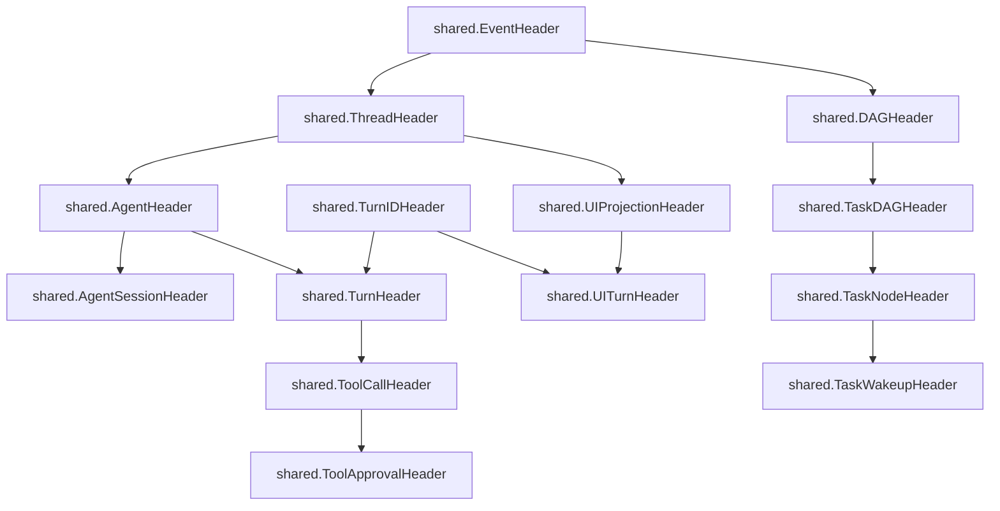

# super-agent-v3 DTO 数据传输对象层代码地图

> 扫描范围：`internal/dto/agent/`、`internal/dto/mcp/`、`internal/dto/provider/`、`internal/dto/shared/`、`internal/dto/task/`、`internal/dto/thread/`、`internal/dto/tool/`、`internal/dto/turn/`、`internal/dto/ui/`
>
> 审查基准：以仓库当前源码逐文件核对 30 个 Go 文件：29 个生产定义文件 + `internal/dto/provider/message_test.go`（用于校验 `provider.Message` 的 JSON 字段名契约）。
>
> 审查目标：补齐 `struct` / 常量 / 事件类型，校正事件编号表，核对 Header 继承关系，并补完 DTO 间引用关系。

## 1. 模块概览

DTO 层是 super-agent-v3 在 **运行时事件总线、Provider 驱动边界、MCP 控制协议、任务编排、UI 投影** 之间的统一数据边界层，特点如下：

1. **共享骨架集中在 `shared`**：事件编号、Header 继承链、通用输入项、通用错误、事件时间解析都放在一个包里。
2. **内部事件与外部协议分层明确**：`agent/turn/tool/task/thread/ui` 主要承载事件总线 DTO；`provider/mcp` 主要承载驱动协议与控制面协议 DTO。
3. **大部分文件是纯数据定义**：少量辅助逻辑集中在 `shared/event.go`、`agent/state.go`、`provider/capability.go`、`provider/manifest.go`；`provider/message_test.go` 是唯一测试文件。
4. **字段风格按边界区分但并非单一规则**：内部事件多为 `snake_case`；Provider DTO 与 `ui.UIThreadPatch` 多为 `camelCase`；UI 投影事件仍混用 `snake_case` Header/字段与个别 `camelCase` 字段。
5. **兼容性显式保留**：`mcp` 中存在若干 deprecated 字段；`turn`/`agent`/`mcp`/`provider` 中使用 `json.RawMessage` 保留协议扩展槽位。

---

## 2. 子包与文件索引

### 2.1 子包职责

| 子包 | 责任边界 | 代表文件 | 说明 |
|---|---|---|---|
| `shared` | DTO 公共基座 | `event.go`, `input.go`, `errors.go` | 统一事件编号、Header、通用输入项、通用错误、时间辅助 |
| `agent` | Agent 生命周期/状态机/诊断 | `event.go`, `diagnostic.go`, `runtime.go`, `state.go` | 描述 agent 的生命周期事件与状态转移定义 |
| `mcp` | 控制面 RPC/通知协议 | `protocol.go`, `constants.go`, `hook.go`, `errors.go` | 定义 `ctl/*` 协议方法、Hook DTO、错误码与 report 载荷 |
| `provider` | Provider 驱动边界 | `session.go`, `turn.go`, `thread_config.go`, `manifest.go`, `event.go`, `message.go` | 会话、Turn、线程配置、消息分页、MCP manifest、原始 provider 事件 |
| `task` | DAG/节点/wakeup 事件 | `event.go` | 面向任务编排系统的强类型事件 |
| `thread` | Thread 生命周期摘要 | `event.go` | 线程启动/停止/消息分页/压缩事件 |
| `tool` | 工具调用与审批事件 | `event.go` | 工具调用开始/结束/审批/DIFF 更新 |
| `turn` | Turn 输入与执行进度 | `model.go`, `event.go`, `progress.go` | Turn 提交模型与 turn 级生命周期/计划进度事件 |
| `ui` | UI 投影与线程 patch | `event.go`, `patch_types.go` | UI 投影视图事件与线程 patch 契约 |

### 2.2 逐文件职责

#### `shared`
- `errors.go`：通用错误变量 `ErrNotFound` / `ErrAlreadyExists` / `ErrInvalidState` / `ErrRequired`
- `event.go`：全部 `EventType*` 常量、Header 继承链、事件时间工具
- `input.go`：统一输入条目 `InputItem`

#### `agent`
- `diagnostic.go`：`AgentWarning`、`AgentError`
- `event.go`：`StateChanged`、`AgentLaunched`、`AgentStopped`、`AgentRecovering`、`AgentFailed`
- `guard.go`：`TransitionGuard`
- `runtime.go`：`RuntimeReport`、`AgentRuntimeReported`
- `state.go`：状态/触发器常量、定义切片、转移矩阵、`AllowedTriggers`

#### `mcp`
- `approval_response.go`：`ApprovalResponse`
- `constants.go`：协议方法、状态、report variant、decision source、hook 常量
- `errors.go`：协议错误码
- `hook.go`：Hook 订阅、决策、待审列表 DTO
- `protocol.go`：注册、心跳、上下文、事件、日志、审批、report、shutdown、selector DTO

#### `provider`
- `capability.go`：`CapabilitySet`、能力常量、`CapabilityError`
- `event.go`：`RawProviderEvent`、`BusRawProviderEvent`、`EventTranslator`
- `manifest.go`：`ToolFamily`、`MCPBinary`、`MCPManifest`、`ManifestContext`、`BuildManifest`
- `message.go`：`Message`、`ThreadMessagesResult`
- `message_test.go`：验证 `Message.Timestamp` 序列化为 `createdAt`，且不输出 `timestamp`
- `session.go`：`StartSessionRequest`、`ResumeSessionRequest`
- `thread.go`：`ThreadRef`
- `thread_config.go`：`ThreadConfigPatch`、`ThreadConfigValues`、`ThreadConfig`、`ThreadCompactResult`
- `turn.go`：`TurnRequest`、`TurnOverrides`、`InputItem` 别名、`SkillRef`、`TurnResult`、`InterruptRequest`、`SteerRequest`、`ForceCompleteRequest`、`ForkRequest`、`ForkResult`

#### `task` / `thread` / `tool` / `turn` / `ui`
- `task/event.go`：`TaskDagCreated`、`TaskNodeStatusChanged`、`TaskWakeupDispatched`、`TaskWakeupCompleted`
- `thread/event.go`：`Started`、`Stopped`、`MessagesPage`、`Compacted`
- `tool/event.go`：`ToolCallBegin`、`ToolCallEnd`、`ToolApprovalRequested`、`ToolApprovalResolved`、`ToolDiffUpdated`
- `turn/event.go`：`TurnStarted`、`TurnCompleted`、`TurnInterrupted`、`TurnStalled`、`TurnResumed`、`TurnInputReceived`、`TurnOutputDelta`
- `turn/model.go`：`InputItem` 别名、`TurnSubmission`
- `turn/progress.go`：`PlanDelta`、`PlanUpdated`、`ItemStarted`、`ItemCompleted`
- `ui/event.go`：`UIProjectionUpdated`、`UITimelineAppended`、`UITokensUpdated`、`SkillsChanged`、`UIPreferencesChanged`、`ThreadPatchThread`、`ThreadPatchTokenUsage`、`UIThreadPatch`
- `ui/patch_types.go`：`PatchActivityStats`、`PatchTimelineItem`、`PatchAlert`

---

## 3. `shared`：事件编号、Header 继承与公共骨架

### 3.1 事件编号核对表

下表按 `internal/dto/shared/event.go` 的实际定义列出全部 `EventType*` 常量，并核对每个 concrete event 的 `Type()` 返回值：

| 编号 | 常量 | concrete 类型 | Header / 载荷骨架 |
|---:|---|---|---|
| 1000 | `EventTypeAgentStateChanged` | `agent.StateChanged` | `shared.AgentSessionHeader` |
| 1001 | `EventTypeAgentLaunched` | `agent.AgentLaunched` | `shared.AgentSessionHeader` |
| 1002 | `EventTypeAgentStopped` | `agent.AgentStopped` | `shared.AgentSessionHeader` |
| 1003 | `EventTypeAgentRecovering` | `agent.AgentRecovering` | `shared.AgentSessionHeader` |
| 1004 | `EventTypeAgentFailed` | `agent.AgentFailed` | `shared.AgentSessionHeader` |
| 1005 | `EventTypeAgentRuntimeReported` | `agent.AgentRuntimeReported` | `shared.AgentSessionHeader` |
| 1006 | `EventTypeAgentWarning` | `agent.AgentWarning` | `shared.AgentSessionHeader` |
| 1007 | `EventTypeAgentError` | `agent.AgentError` | `shared.AgentSessionHeader` |
| 1100 | `EventTypeTurnStarted` | `turn.TurnStarted` | `shared.TurnHeader` |
| 1101 | `EventTypeTurnCompleted` | `turn.TurnCompleted` | `shared.TurnHeader` |
| 1102 | `EventTypeTurnInterrupted` | `turn.TurnInterrupted` | `shared.TurnHeader` |
| 1103 | `EventTypeTurnStalled` | `turn.TurnStalled` | `shared.TurnHeader` |
| 1104 | `EventTypeTurnResumed` | `turn.TurnResumed` | `shared.TurnHeader` |
| 1105 | `EventTypeTurnInputReceived` | `turn.TurnInputReceived` | `shared.TurnHeader` |
| 1106 | `EventTypeTurnOutputDelta` | `turn.TurnOutputDelta` | `shared.TurnHeader` |
| 1107 | `EventTypeTurnPlanDelta` | `turn.PlanDelta` | `shared.TurnHeader` |
| 1108 | `EventTypeTurnPlanUpdated` | `turn.PlanUpdated` | `shared.TurnHeader` |
| 1109 | `EventTypeTurnItemStarted` | `turn.ItemStarted` | `shared.TurnHeader` |
| 1110 | `EventTypeTurnItemCompleted` | `turn.ItemCompleted` | `shared.TurnHeader` |
| 1200 | `EventTypeToolCallBegin` | `tool.ToolCallBegin` | `shared.ToolCallHeader` |
| 1201 | `EventTypeToolCallEnd` | `tool.ToolCallEnd` | `shared.ToolCallHeader` |
| 1202 | `EventTypeToolApprovalRequested` | `tool.ToolApprovalRequested` | `shared.ToolApprovalHeader` |
| 1203 | `EventTypeToolApprovalResolved` | `tool.ToolApprovalResolved` | `shared.ToolApprovalHeader` |
| 1204 | `EventTypeToolDiffUpdated` | `tool.ToolDiffUpdated` | 独立字段：`Timestamp/ThreadID/AgentID/CallID/ToolName/DiffText/Files/Revision`，**未嵌入** `shared.*Header` |
| 1300 | `EventTypeTaskDagCreated` | `task.TaskDagCreated` | `shared.TaskDAGHeader` |
| 1301 | `EventTypeTaskNodeStatusChanged` | `task.TaskNodeStatusChanged` | `shared.TaskNodeHeader` |
| 1302 | `EventTypeTaskWakeupDispatched` | `task.TaskWakeupDispatched` | `shared.TaskWakeupHeader` |
| 1303 | `EventTypeTaskWakeupCompleted` | `task.TaskWakeupCompleted` | `shared.TaskWakeupHeader` |
| 1350 | `EventTypeThreadStarted` | `thread.Started` | `shared.EventHeader` + 扁平 `ThreadID/...` 字段 |
| 1351 | `EventTypeThreadStopped` | `thread.Stopped` | `shared.EventHeader` + 扁平 `ThreadID/...` 字段 |
| 1352 | `EventTypeThreadMessagesPage` | `thread.MessagesPage` | `shared.EventHeader` + 扁平 `ThreadID/...` 字段 |
| 1353 | `EventTypeThreadCompacted` | `thread.Compacted` | `shared.EventHeader` + 扁平 `ThreadID/...` 字段 |
| 1500 | `EventTypeUIProjectionUpdated` | `ui.UIProjectionUpdated` | `shared.UIProjectionHeader` |
| 1501 | `EventTypeUITimelineAppended` | `ui.UITimelineAppended` | `shared.UITurnHeader` |
| 1502 | `EventTypeUITokensUpdated` | `ui.UITokensUpdated` | `shared.UITurnHeader` |
| 1503 | `EventTypeUISkillsChanged` | `ui.SkillsChanged` | `shared.EventHeader` |
| 1504 | `EventTypeUIThreadPatch` | `ui.UIThreadPatch` | 独立 patch 载荷，**未嵌入** `shared.*Header` |
| 1505 | `EventTypeUIPreferencesChanged` | `ui.UIPreferencesChanged` | `shared.EventHeader` |
| 1600 | `EventTypeProviderRaw` | `provider.RawProviderEvent`、`provider.BusRawProviderEvent` | 无公共 Header；原始 provider 事件封装 |

**核对结果**：源码中的 `Type() uint32` 实现与上述编号表完全一致，没有发现错号或漏号。

### 3.2 Header 继承关系

需要特别注意的四类例外/旁路：

1. `thread.*` 事件没有复用 `shared.ThreadHeader`，而是 `shared.EventHeader + 扁平 ThreadID/...`。
2. `tool.ToolDiffUpdated` 虽然是事件，但没有复用 `shared.ToolCallHeader`。
3. `ui.UIThreadPatch` 虽然实现了 `Type()`，但本体是 UI patch 契约，不携带 `timestamp`/`projection` 等共享 Header 字段。
4. `provider.RawProviderEvent` / `provider.BusRawProviderEvent` 都返回 `EventTypeProviderRaw`，但不嵌入任何 `shared.*Header`。

### 3.3 `shared` 类型、变量与工具函数

#### 结构体
- `EventHeader`：仅含 `Timestamp`
- `ThreadHeader`：`EventHeader + ThreadID`
- `AgentHeader`：`ThreadHeader + AgentID`
- `AgentSessionHeader`：`AgentHeader + SessionID`
- `TurnIDHeader`：仅含 `TurnID`
- `TurnHeader`：`AgentHeader + TurnIDHeader`
- `ToolCallHeader`：`TurnHeader + CallID + ToolName`
- `ToolApprovalHeader`：`ToolCallHeader + ApprovalID`
- `DAGHeader`：`EventHeader + DagKey`
- `TaskDAGHeader`：空包装，单纯继承 `DAGHeader`
- `TaskNodeHeader`：`TaskDAGHeader + NodeKey`
- `TaskWakeupHeader`：`TaskNodeHeader + WakeupID`
- `UIProjectionHeader`：`ThreadHeader + Projection`
- `UITurnHeader`：`UIProjectionHeader + TurnIDHeader`
- `InputItem`：统一输入条目，字段为 `Type` / `Content` / `Path` / `Name` / `URL`
- `eventTimeKey`：`shared/event.go` 内部使用的零字段 struct context key（非导出）

#### 错误变量
- `ErrNotFound`
- `ErrAlreadyExists`
- `ErrInvalidState`
- `ErrRequired`

#### 时间辅助函数
- `WithEventTime(ctx, timestamp)`：向 context 注入事件时间
- `ResolveEventTime(ctx, payload, fallbacks...)`：依次从 context、payload、fallbacks 解析事件时间
- `FirstEventTime(fallbacks...)`：返回第一项非零时间，否则回退到 `time.Now()`
- `EventTimeFromPayload(payload)`：从 `timestamp`、`ts`、`createdAt`、`created_at`、`updatedAt`、`updated_at` 提取时间字符串
- `ParseEventTime(raw)`：按 `time.RFC3339Nano` / `time.RFC3339` 解析
- `eventTimeFromContext(ctx)`：`shared/event.go` 内部非导出辅助函数，从 context 读取 `eventTimeKey{}` 注入的 `time.Time`

---

## 4. 各子包明细

### 4.1 `agent`

#### 事件类型
| 类型 | Header | 关键字段 |
|---|---|---|
| `StateChanged` | `shared.AgentSessionHeader` | `OldState`、`NewState`、`Trigger` |
| `AgentLaunched` | `shared.AgentSessionHeader` | `Model`、`CWD`、`Name`、`Provider` |
| `AgentStopped` | `shared.AgentSessionHeader` | `Reason` |
| `AgentRecovering` | `shared.AgentSessionHeader` | `Reason`、`Attempt` |
| `AgentFailed` | `shared.AgentSessionHeader` | `Error`、`Recoverable` |
| `AgentRuntimeReported` | `shared.AgentSessionHeader` | `Port`、`Provider` |
| `AgentWarning` | `shared.AgentSessionHeader` | `RawType`、`Message`、`Code`、`Payload` |
| `AgentError` | `shared.AgentSessionHeader` | `RawType`、`Message`、`Code`、`Recoverable`、`Payload` |

#### 其他类型
- `RuntimeReport`：普通 DTO，字段为 `AgentID` / `Port` / `Provider`，**不是** typed event。
- `StateDefinition`：`Name` / `Description`
- `TriggerDefinition`：`Name` / `Description`
- `TransitionDefinition`：`From` / `Trigger` / `To`
- `TransitionGuard`：`func(ctx context.Context, agentID string) bool`

#### 常量
- 状态常量：`StateProvisioning="provisioning"`、`StateIdle="idle"`、`StateTurnQueued="turn_queued"`、`StateTurnStarting="turn_starting"`、`StateTurnRunning="turn_running"`、`StateAwaitingUserInput="awaiting_user_input"`、`StateRecovering="recovering"`、`StateStopping="stopping"`、`StateStopped="stopped"`、`StateFailed="failed"`
- 触发器常量：`TriggerLaunchSucceeded="launch_succeeded"`、`TriggerLaunchFailed="launch_failed"`、`TriggerTurnEnqueued="turn_enqueued"`、`TriggerTurnAccepted="turn_accepted"`、`TriggerTurnCompleted="turn_completed"`、`TriggerTurnAborted="turn_aborted"`、`TriggerUserInputRequested="user_input_requested"`、`TriggerUserInputResolved="user_input_resolved"`、`TriggerRecoverRequested="recover_requested"`、`TriggerStopRequested="stop_requested"`、`TriggerProcessExited="process_exited"`

#### 导出变量与函数
- `StateDefinitions []StateDefinition`
- `TriggerDefinitions []TriggerDefinition`
- `TransitionDefinitions []TransitionDefinition`：源码当前 33 条转移定义，`AllowedTriggers` 直接遍历该切片过滤 `From == state`
- `AllowedTriggers(state string) []string`

**核对修正**：源码中 **没有** `AllStates()`、`AllTriggers()`、`StateLabel()`；旧地图这里有误。

### 4.2 `mcp`

#### 协议/方法常量（`constants.go`）
- 主协议方法：`MethodRegister="ctl/register"`、`MethodHeartbeat="ctl/heartbeat"`、`MethodContext="ctl/context"`、`MethodEvent="ctl/event"`、`MethodLog="ctl/log"`、`MethodApproval="ctl/approval/request"`、`MethodReport="ctl/report"`、`MethodShutdown="ctl/shutdown"`、`MethodConfigChanged="ctl/config/changed"`
- 协议版本：`ProtocolVersion="ctl/v1"`
- Client kind：`ClientKindOrch="orch"`、`ClientKindLSP="lsp"`、`ClientKindIDA="ida"`、`ClientKindCustom="custom"`
- Peer kind：`PeerKindTool="tool"`、`PeerKindUI="ui"`
- Context scope：`ScopeAgentRuntime="agent.runtime"`、`ScopeThreadBinding="thread.binding"`、`ScopeWorkspaceRun="workspace.run"`、`ScopeConfigSnapshot="config.snapshot"`
- Context source：`ContextSourceLive="live"`、`ContextSourceBootSnapshot="boot_snapshot"`、`ContextSourceDBRebuild="db_rebuild"`
- lease/runtime 状态：`StatusActive="active"`、`StatusStale="stale"`、`StatusDisconnected="disconnected"`
- report variant：`ReportVariantRuntime="runtime"`、`ReportVariantCompletion="completion"`、`ReportVariantProgress="progress"`、`ReportVariantDiagnostic="diagnostic"`
- decision source：`DecisionSourceUI="ui"`、`DecisionSourceAutoApprove="auto_approve"`、`DecisionSourceStatic="static"`
- Hook 方法：`MethodHookSubscribe="ctl/hook/subscribe"`、`MethodHookBefore="ctl/hook/before"`、`MethodHookCheck="ctl/hook/check"`、`MethodHookAfter="ctl/hook/after"`、`MethodHookResolve="ctl/hook/resolve"`、`MethodHookPending="ctl/hook/pending"`
- Hook 决策：`HookDecisionAllow="allow"`、`HookDecisionDeny="deny"`、`HookDecisionWait="wait"`、`HookDecisionModify="modify"`、`HookDecisionContinue="continue"`、`HookDecisionWarn="warn"`、`HookDecisionAbort="abort"`、`HookDecisionApprove="approve"`、`HookDecisionReject="reject"`、`HookDecisionEscalate="escalate"`

#### 错误码（`errors.go`）
| 常量 | 数值 |
|---|---:|
| `ErrCodeInternal` | -32603 |
| `ErrCodeInvalidParams` | -32602 |
| `ErrCodeLeaseNotFound` | 4101 |
| `ErrCodeLeaseStale` | 4102 |
| `ErrCodeCapabilityMismatch` | 4103 |
| `ErrCodeScopeNotAllowed` | 4104 |
| `ErrCodeApprovalUnavailable` | 4105 |
| `ErrCodePersistFailed` | 4106 |
| `ErrCodePeerUnavailable` | 4107 |
| `ErrCodeAuthFailed` | 4108 |
| `ErrCodeBusy` | 4109 |
| `ErrCodeTimeout` | 4110 |
| `ErrCodeReportConflict` | `ErrCodePersistFailed` 的兼容别名 |

#### 结构体与协议 DTO
- `ApprovalResponse`：`ctl/approval/request` 的响应；字段为 `Approved`、`Reason`、`Detail`、`DecisionSource`
- Hook 体系：
  - `HookPayload`
  - `BeforeDecision`
  - `CheckDecision`
  - `AfterDecision`
  - `HookSubscribeRequest`
  - `HookSubscribeResponse`
  - `HookResolveRequest`
  - `HookResolveResponse`
  - `HookPendingRequest`
  - `HookPendingResponse`
  - `PendingHookReview`
- 核心协议 DTO：
  - `LeaseKey`
  - `RegisterRequest` / `RegisterResponse`
  - `HeartbeatRequest` / `HeartbeatResponse`
  - `ContextRequest` / `ContextResponse`
  - `EventNotify` / `LogNotify`
  - `ApprovalRequest`
  - `ReportRequest` / `ReportResponse`
  - `ShutdownRequest`
  - `SelectorScope`
  - `Selector`
  - `ConfigChangedNotify`
- report 变体：
  - `RuntimeReport`
  - `CompletionReport`
  - `ProgressReport`
  - `DiagnosticReport`
  - `ReportEnvelope`

#### 类型引用关系
- `RegisterResponse.Lease`、`HeartbeatRequest.Lease`、`ContextRequest.Lease`、`EventNotify.Lease`、`LogNotify.Lease`、`ApprovalRequest.Lease`、`ReportRequest.Lease`、`ShutdownRequest.Lease` 都直接引用 `LeaseKey`
- `Selector.Scope` 是 `*SelectorScope`
- `HookSubscribeRequest.Scope` / `HookSubscribeResponse.EffectiveScope` / `ConfigChangedNotify.Selector` 都直接引用 `Selector`
- `HookPendingResponse.Reviews` 是 `[]PendingHookReview`
- `ReportEnvelope` 是判别联合：`Runtime` / `Completion` / `Progress` / `Diagnostic`
- `ReportRequest.Report` 直接引用 `ReportEnvelope`

#### 兼容性字段
- `RegisterResponse.LeaseID` 标记为 deprecated，将在 **2026-06-30** 后移除
- `HeartbeatRequest.LeaseID` 标记为 deprecated，将在 **2026-06-30** 后移除
- `ApprovalRequest.LeaseID` 标记为 deprecated，将在 **2026-06-30** 后移除
- `ReportRequest.LeaseID` 标记为 deprecated，将在 **2026-06-30** 后移除
- `ContextRequest.InstanceID/AgentID`、`EventNotify.InstanceID`、`LogNotify.InstanceID`、`ApprovalRequest.InstanceID`、`ReportRequest.InstanceID` 属于兼容镜像字段

### 4.3 `provider`

#### 常量与基础类型
- `CapabilitySet`：`map[string]bool`
- 能力常量：`CapMessageSend="message_send"`、`CapThreadList="thread_list"`、`CapThreadFork="thread_fork"`、`CapThreadRealtime="realtime"`、`CapModelSwitch="model_switch"`、`CapContextCompact="context_compact"`、`CapTurnOverride="turn_override"`
- `CapabilityError`
- `ToolFamily`：底层类型为 `string`
- 工具家族常量：`FamilyLSP="lsp"`、`FamilyOrch="orch"`、`FamilyIDA="ida"`

#### 原始 provider 事件
- `RawProviderEvent`：字段为 `EventType string`、`Data any`
- `BusRawProviderEvent`：字段为 `Event RawProviderEvent`
- `EventTranslator`：`func(raw RawProviderEvent, publish func(ev any))`

#### Manifest / MCP 配置 DTO
- `MCPBinary`：`Name`、`Type`、`URL`、`Command`、`Env`、`AutoApprove`
- `MCPManifest`：`Binaries []MCPBinary`
- `ManifestContext`：`AgentID`、`CWD`、`ThreadCaps CapabilitySet`、`BinaryDir`、`Env`、`AutoApprove`、`PeerHTTPAddrs map[ToolFamily]string`
- `BuildManifest(ctx ManifestContext) MCPManifest`

#### 其他结构体
- 会话：`StartSessionRequest`、`ResumeSessionRequest`
- 线程：`ThreadRef`、`ThreadConfigPatch`、`ThreadConfigValues`、`ThreadConfig`、`ThreadCompactResult`
- 消息：`Message`、`ThreadMessagesResult`
- Turn：`InputItem = shareddto.InputItem`、`TurnRequest`、`TurnOverrides`、`SkillRef`、`TurnResult`、`InterruptRequest`、`SteerRequest`、`ForceCompleteRequest`、`ForkRequest`、`ForkResult`

#### 关键字段与关系
- `TurnRequest` 引用：`[]InputItem`、`[]SkillRef`、`TurnOverrides`、`MCPManifest`
- `SteerRequest` 引用：`[]InputItem`、`[]SkillRef`、`TurnOverrides`（**不含** `MCPManifest`）
- `ThreadConfig.Override` / `ThreadConfig.Effective` 都是 `ThreadConfigValues`
- `ThreadMessagesResult.Messages` 是 `[]Message`
- `Message.Timestamp` 的 JSON tag 是 `createdAt`；`message_test.go` 断言序列化输出包含 `createdAt` 且不包含 `timestamp`
- `ManifestContext.ThreadCaps` 是 `CapabilitySet`
- `ManifestContext.PeerHTTPAddrs` 是 `map[ToolFamily]string`

#### 辅助变量/函数
- 方法：`(*CapabilityError).Error()`、`NewCapabilityError(cap, driver)`、`(CapabilitySet).Has(cap)`、`(CapabilitySet).All(caps...)`
- manifest 包级变量：`mcpRequiredEnvKeys`、`mcpPassthroughEnvKeys`、`mcpLegacyEnvAliases`
- manifest 非导出辅助函数：`cloneManifestEnv`、`normalizeManifestEnv`、`promoteManifestEnv`

#### 需要特别标注的源码事实
- `ThreadConfigPatch` 有 `Personality *string`，但 `ThreadConfigValues` **没有** `Personality` 字段；地图中需要保留这个不对称事实。
- `TurnRequest.LocalID` / `TurnResult.LocalID` / `TurnResult.ProviderID` 采用 `camelCase` JSON。
- `ResumeSessionRequest` 比旧地图多出 `Path`、`CWD`、`Model` 三个恢复上下文字段。
- `BuildManifest` 默认只放入 `FamilyLSP` 与 `FamilyOrch`；仅当 `ctx.ThreadCaps.Has("ida")` 为真时才追加 `FamilyIDA`。
- `CapThreadRealtime` 的源码值是 `"realtime"`，不是 `"thread_realtime"`；`BuildManifest` 对 IDA 的判断使用字符串 `"ida"`，不是上述 `Cap*` 常量。

### 4.4 `task`

`task/event.go` 只包含 4 个 typed event：

| 类型 | Header | 关键字段 |
|---|---|---|
| `TaskDagCreated` | `shared.TaskDAGHeader` | `Title`、`Status`、`CreatedBy` |
| `TaskNodeStatusChanged` | `shared.TaskNodeHeader` | `AssignedTo`、`OldStatus`、`NewStatus`、`ActiveTurnID`、`ActiveWakeupID` |
| `TaskWakeupDispatched` | `shared.TaskWakeupHeader` | `WakeupKind`、`TargetAgentID` |
| `TaskWakeupCompleted` | `shared.TaskWakeupHeader` | `TargetAgentID`、`Status`、`BoundTurnID` |

### 4.5 `thread`

`thread/event.go` 包含 4 个线程事件，全部以 `shared.EventHeader` 为基础，再显式铺平线程字段：

| 类型 | Header | 关键字段 |
|---|---|---|
| `Started` | `shared.EventHeader` | `ThreadID`、`AgentID`、`Provider`、`ProviderThreadID`、`CWD`、`Model`、`Name` |
| `Stopped` | `shared.EventHeader` | `ThreadID`、`AgentID`、`Status`、`Reason` |
| `MessagesPage` | `shared.EventHeader` | `ThreadID`、`TotalCount`、`Pages` |
| `Compacted` | `shared.EventHeader` | `ThreadID`、`Command`、`BeforeTokens`、`AfterTokens`、`Compacted`、`Estimated` |

补充：`thread.Compacted` 与 `provider.ThreadCompactResult` 语义相近，但前者是事件 DTO（带 `timestamp`），后者是 provider 接口返回 DTO（`camelCase` 字段、无 Header）。

### 4.6 `tool`

| 类型 | Header | 关键字段 |
|---|---|---|
| `ToolCallBegin` | `shared.ToolCallHeader` | `RequestID`、`ArgumentsPreview` |
| `ToolCallEnd` | `shared.ToolCallHeader` | `Success`、`Error`、`Result`、`ElapsedMS` |
| `ToolApprovalRequested` | `shared.ToolApprovalHeader` | `RequestID`、`Reason`、`Kind` |
| `ToolApprovalResolved` | `shared.ToolApprovalHeader` | `Approved`、`Decision`、`ReviewedBy`、`Kind` |
| `ToolDiffUpdated` | 无 | `Timestamp`、`ThreadID`、`AgentID`、`CallID`、`ToolName`、`DiffText`、`Files`、`Revision` |

### 4.7 `turn`

#### 输入模型
- `InputItem = shareddto.InputItem`
- `TurnSubmission`
  - 字段：`AgentID`、`ThreadID`、`ExpectedTurnID`、`Inputs`、`SelectedSkills`、`ManualSkillSelection`、`OutputSchema`
  - 需要注意：`Inputs` 的 JSON tag 是 **`input`**，不是 `inputs`

#### 生命周期与进度事件
| 类型 | Header | 关键字段 |
|---|---|---|
| `TurnStarted` | `shared.TurnHeader` | 无附加字段 |
| `TurnCompleted` | `shared.TurnHeader` | `Success`、`Error`、`Status`、`Reason`、`Result`、`Summary`、`Message`、`StopReason` |
| `TurnInterrupted` | `shared.TurnHeader` | `Reason` |
| `TurnStalled` | `shared.TurnHeader` | `Reason`、`StalledMS` |
| `TurnResumed` | `shared.TurnHeader` | `Reason` |
| `TurnInputReceived` | `shared.TurnHeader` | `InputType`、`RequestID`、`Source` |
| `TurnOutputDelta` | `shared.TurnHeader` | `Stream`、`Delta` |
| `PlanDelta` | `shared.TurnHeader` | `RawType`、`Delta`、`Payload` |
| `PlanUpdated` | `shared.TurnHeader` | `RawType`、`Payload` |
| `ItemStarted` | `shared.TurnHeader` | `RawType`、`ItemType`、`Command`、`File`、`ToolName`、`CallID`、`Payload` |
| `ItemCompleted` | `shared.TurnHeader` | `RawType`、`ItemType`、`Command`、`File`、`ToolName`、`CallID`、`ExitCode`、`Success`、`Error`、`Payload` |

### 4.8 `ui`

#### 事件类型
| 类型 | Header | 关键字段 |
|---|---|---|
| `UIProjectionUpdated` | `shared.UIProjectionHeader` | `Revision` |
| `UITimelineAppended` | `shared.UITurnHeader` | `ItemID`、`ItemKind`、`RequestID`、`CallID` |
| `UITokensUpdated` | `shared.UITurnHeader` | `InputTokens`、`OutputTokens`、`TotalTokens`、`ContextWindowTokens` |
| `SkillsChanged` | `shared.EventHeader` | `SkillsDir`、`Name`、`Action`、`Actions`、`Count` |
| `UIPreferencesChanged` | `shared.EventHeader` | `Cwd`、`Key`、`Value` |
| `UIThreadPatch` | 无 | 面向 UI 的线程 patch 载荷 |

#### Patch 相关结构体
- `ThreadPatchThread`：`ID`、`Name`、`State`
- `ThreadPatchTokenUsage`：`UsedTokens`、`ContextWindowTokens`、`UsedPercent`
- `PatchActivityStats`：`LSPCalls`、`Commands`、`FileEdits`、`ToolCalls`
- `PatchTimelineItem`：`ID`、`Ts`、`Kind`、`Tool`、`Text`、`Command`、`File`、`Status`、`CallID`、`RequestID`、`ElapsedMS`、`Preview`、`Output`、`ExitCode`、`Done`、`Internal`、`Attachments`
- `PatchAlert`：`ID`、`Time`、`Level`、`Message`

#### `UIThreadPatch` 引用关系
`UIThreadPatch` 的字段直接引用以下嵌套类型：
- `Thread *ThreadPatchThread`
- `TokenUsage *ThreadPatchTokenUsage`
- `ActivityStats *PatchActivityStats`
- `Alerts []PatchAlert`
- `TimelineItems []PatchTimelineItem`

此外它还承载：`ThreadID`、`Source`、`Sequence`、`Status`、`StatusHeader`、`StatusDetails`、`OverlayText`、`OverlayType`、`OverlayPriority`、`DiffText`、`DiffRevision`、`Interruptible`、`AgentMeta`、`RemovedItemIds`、`TimelineOrder`、`Recover`、`RefreshRequired`、`FallbackReason`、`ActiveThreadID`、`ActiveCmdThreadID`、`MainAgentID`、`MainAgentState`、`Partial`。

---

## 5. 跨包关系与审查结论

### 5.1 类型引用关系总表

| 来源类型 | 目标类型 | 关系 |
|---|---|---|
| `provider.InputItem` | `shared.InputItem` | 类型别名 |
| `turn.InputItem` | `shared.InputItem` | 类型别名 |
| `turn.TurnSubmission` | `turn.InputItem`（即 `shared.InputItem`） | `Inputs []InputItem` |
| `provider.TurnRequest` | `provider.InputItem`（即 `shared.InputItem`）、`provider.SkillRef`、`provider.TurnOverrides`、`provider.MCPManifest` | 字段引用 |
| `provider.SteerRequest` | `provider.InputItem`（即 `shared.InputItem`）、`provider.SkillRef`、`provider.TurnOverrides` | 字段引用 |
| `provider.MCPManifest` | `provider.MCPBinary` | `Binaries []MCPBinary` |
| `provider.ManifestContext` | `provider.CapabilitySet`、`provider.ToolFamily` | `ThreadCaps`、`PeerHTTPAddrs map[ToolFamily]string` |
| `provider.ThreadConfig` | `provider.ThreadConfigValues` | `Override`、`Effective` |
| `provider.ThreadMessagesResult` | `provider.Message` | `Messages []Message` |
| `provider.BusRawProviderEvent` | `provider.RawProviderEvent` | `Event RawProviderEvent` |
| `mcp.RegisterResponse` 等 8 个协议 DTO | `mcp.LeaseKey` | `Lease` 字段复用 |
| `mcp.Selector` | `mcp.SelectorScope` | `Scope *SelectorScope` |
| `mcp.HookSubscribeRequest` / `HookSubscribeResponse` / `ConfigChangedNotify` | `mcp.Selector` | 字段引用 |
| `mcp.HookPendingResponse` | `mcp.PendingHookReview` | `Reviews []PendingHookReview` |
| `mcp.ReportEnvelope` | `mcp.RuntimeReport` / `mcp.CompletionReport` / `mcp.ProgressReport` / `mcp.DiagnosticReport` | 判别联合 |
| `mcp.ReportRequest` | `mcp.ReportEnvelope` | `Report` 字段 |
| `agent.*` typed events | `shared.AgentSessionHeader` | 事件 Header |
| `task.*` | `shared.TaskDAGHeader` / `shared.TaskNodeHeader` / `shared.TaskWakeupHeader` | 事件 Header |
| `thread.*` | `shared.EventHeader` | 事件 Header（未使用 `shared.ThreadHeader`） |
| `tool.ToolCall*` | `shared.ToolCallHeader` | 事件 Header |
| `tool.ToolApproval*` | `shared.ToolApprovalHeader` | 事件 Header |
| `turn.*` | `shared.TurnHeader` | 事件 Header |
| `ui.UIProjectionUpdated` | `shared.UIProjectionHeader` | 事件 Header |
| `ui.UITimelineAppended` / `ui.UITokensUpdated` | `shared.UITurnHeader` | 事件 Header |
| `ui.UIThreadPatch` | `ui.ThreadPatchThread`、`ui.ThreadPatchTokenUsage`、`ui.PatchActivityStats`、`ui.PatchAlert`、`ui.PatchTimelineItem` | patch 嵌套模型 |

### 5.2 名称相近但并非同一类型的 DTO

这部分在源码里很容易看漏，地图需要明确区分：

- `agent.RuntimeReport`：agent 运行态普通 DTO
- `agent.AgentRuntimeReported`：agent 运行态 typed event
- `mcp.RuntimeReport`：`ctl/report` 的 runtime variant
- `mcp.ApprovalResponse`：控制面协议响应
- `tool.ToolApprovalResolved`：内部事件总线里的工具审批结果事件

### 5.3 审查结论

1. **事件编号表已核对无误**：`shared/event.go` 中的 39 个事件编号，与各包的 `Type()` 实现完全一致。
2. **Header 继承关系已修正为源码真实情况**：尤其补正了 `thread.*`、`tool.ToolDiffUpdated`、`ui.UIThreadPatch`、`provider.RawProviderEvent` / `provider.BusRawProviderEvent` 这些“非标准 Header”事件/旁路事件。
3. **原地图存在遗漏**：`agent.RuntimeReport`、`provider.ToolFamily`、`provider.BusRawProviderEvent`、`ui.ThreadPatchThread`、`ui.ThreadPatchTokenUsage`、`shared.FirstEventTime`、`mcp.Status*`、`mcp.ReportVariant*`、`mcp.DecisionSource*` 等已补齐。
4. **原地图存在错误描述**：`agent/state.go` 并没有 `AllStates()`、`AllTriggers()`、`StateLabel()`；现已按源码修正。
5. **类型引用关系已补完**：尤其是 `provider` / `mcp` / `turn` / `ui` 组合 DTO 与 `provider.BusRawProviderEvent` 的嵌套关系，旧图描述不完整。

## 审查补遗

- 本次审查以 **2026-04-12** 的仓库本地源码为准，未引入外部资料；逐文件覆盖 30 个 `.go` 文件，其中 `provider/message_test.go` 用作 `Message` JSON 契约佐证。
- 已补记 `mcp` 中带明确移除日期的 deprecated 字段：`LeaseID` 相关兼容字段计划在 **2026-06-30** 后移除。
- 已补记三个容易误读的字段事实：
  - `turn.TurnSubmission.Inputs` 的 JSON tag 是 `input`
  - `provider.ThreadConfigPatch` 有 `Personality`，但 `provider.ThreadConfigValues` 没有对应字段
  - `provider.Message.Timestamp` 的 JSON tag 是 `createdAt`，并由 `provider/message_test.go` 验证不会输出 `timestamp`
- 已补记四类 Header 例外/旁路：`thread.*`、`tool.ToolDiffUpdated`、`ui.UIThreadPatch`、`provider.RawProviderEvent` / `provider.BusRawProviderEvent`。
