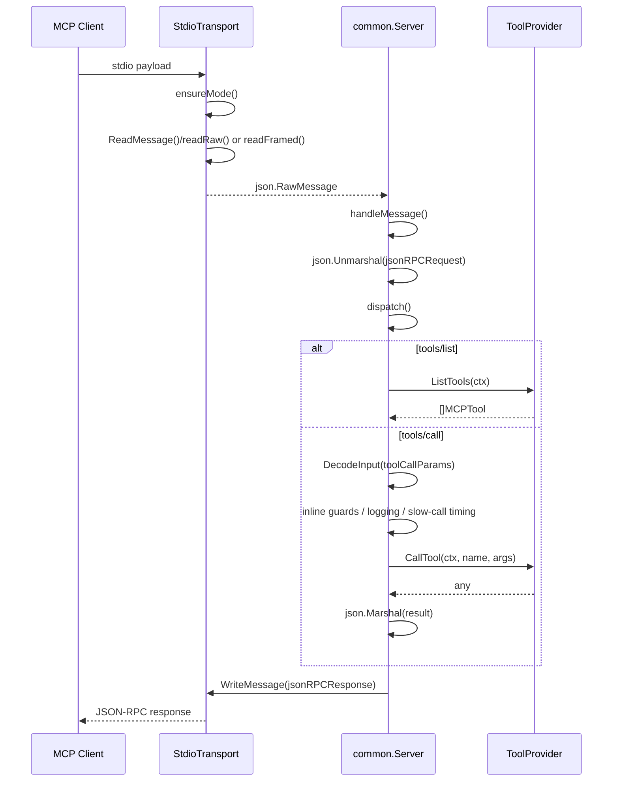
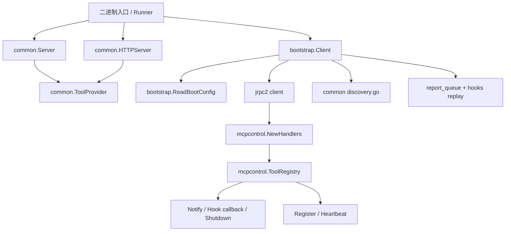

# 06 MCP Server 框架层代码地图

> 阅读边界：本卷只覆盖 `internal/mcpserver/**`，以及解释控制面依赖时最少引用 `internal/platform/mcpcontrol/**`。
> 不展开具体 Tool 实现，也不回溯任何旧 LSP 路径。

---

## 1. 模块概览

`internal/mcpserver` 目前只有两层：

1. `common/`
   - 对外提供 MCP front-door：`common.Server`（stdio）与 `common.HTTPServer`（HTTP）。
   - 真正稳定的扩展点只有 `common.ToolProvider`。
2. `common/bootstrap/`
   - 负责工具进程反连 control plane：register、heartbeat、report、hook、approval、reconnect。

当前目录里**没有**独立的 `Router` / `Dispatcher` / `Middleware` interface；真实分发都是具体方法：

- `internal/mcpserver/common/server.go` — `(*Server).dispatch`
- `internal/mcpserver/common/http_transport.go` — `(*HTTPServer).dispatch`
- `internal/mcpserver/common/bootstrap/lifecycle.go` — `(*Client).dispatchRequest`

---

## 2. 请求生命周期

### 2.1 stdio 主时序（stdio → decode → middleware → tool dispatch → response）

### 2.2 代码锚点

- transport decode：`internal/mcpserver/common/stdio.go` — `ReadMessage`、`ensureMode`、`readRaw`、`readFramed`
- server entry：`internal/mcpserver/common/server.go` — `Run`、`readLoop`、`handleMessage`、`dispatch`
- param decode：`internal/platform/shared/jsonutil.go` — `DecodeInput`
- tool dispatch：`internal/mcpserver/common/server.go` — `handleToolsList`、`handleToolsCall`、`callTool`、`reply`

### 2.3 HTTP 变体

`common.HTTPServer` 复用同一组 JSON-RPC method 语义，但入口改为 `POST /mcp`：

- `handleMCP` 先限流读取 body（10MB）
- `dispatch` / `handleInitialize` / `handleToolsList` / `handleToolsCall` 与 stdio 版同构
- notification 无返回体时直接 `202 Accepted`

---

## 3. 包 / 文件职责

### 3.1 `internal/mcpserver/common/`

| 文件 | 关键符号 | 职责 |
|---|---|---|
| `server.go` | `ToolProvider`、`Server`、`Run`、`dispatch` | stdio JSON-RPC server；只识别 `initialize/tools/*/ping/shutdown/exit` |
| `stdio.go` | `StdioTransport`、`ensureMode` | 兼容 raw JSON 与 `Content-Length` framed stdio |
| `http_transport.go` | `HTTPServer`、`handleMCP` | Streamable HTTP MCP server |
| `discovery.go` | `WritePeerDiscovery`、`ReadDiscoveryAddr` | peer-mode HTTP 发现文件读写，采用 temp+rename 原子写入 |

### 3.2 `internal/mcpserver/common/bootstrap/`

| 文件 | 关键符号 | 职责 |
|---|---|---|
| `client.go` | `Client`、`Config`、`Start`、`Context`、`Report`、`RequestApproval` | 生命周期主入口；持有 lease / conn / queue / hooks state |
| `lifecycle.go` | `connectAndRegister`、`registerConn`、`handleCallback`、`dispatchRequest` | TCP+jrpc2 建链、register、控制面回调分发 |
| `heartbeat.go` | `runHeartbeat`、`sendHeartbeat`、`refreshLease` | heartbeat、lease 刷新、动态 heartbeat interval |
| `reconnect.go` | `handleStop`、`reconnectLoop` | 断线标记、指数退避重连、恢复后补发 |
| `report_queue.go` | `enqueueReport`、`flushQueuedReportsWithConn` | 离线报告队列与重放 |
| `hooks.go` | `HookConfig`、`SubscribeHooks`、`ResolveHook`、`PendingHooks`、`replayHookSubscriptions` | hook callback 入口 + 重连 replay |
| `env.go` | `ReadBootConfig`、`normalizeConfig`、`envContext` | 环境变量启动配置、boot snapshot、离线 context fallback |

---

## 4. 中间件 / 横切层现状

> `internal/mcpserver/**` 未定义独立 `Middleware` 接口；下表里的“中间件”都是**内联挂载点**，不是可插拔链。

| 横切项 | 职责 | 挂载点 | 依赖 |
|---|---|---|---|
| logging | 记录 server start/stop、tools/call begin/done/slow、bootstrap reconnect/hook replay/report drop | `common/server.go`、`common/http_transport.go`、`bootstrap/*` 中的 `pkglogger.*` | `pkg/logger` |
| auth / lease | register 时带 `SessionToken`，后续 `Context/Approval/Report/Heartbeat` 全依赖 `LeaseKey` | `bootstrap/registerConn`、`RequestApproval`、`Report`、`sendHeartbeat` | `internal/dto/mcp`、`jrpc2` |
| tracing / correlation | 仅有日志字段级关联（`instance_id` / `lease` / `req_id`），没有 span / trace middleware | 同上 | `context.Context`、`pkg/logger` |
| backpressure / buffering | 串行 read loop、HTTP 10MB 限流、离线 report queue、`queued_reports` metric | `Server.Run` 的 `results` channel；`HTTPServer.handleMCP`；`bootstrap/report_queue.go`；`heartbeatMetrics` | `chan`、`net/http`、`internal/platform/shared` |
| recovery | transport stop 后自动 reconnect，成功后 `flushQueuedReports` + `replayHookSubscriptions` | `bootstrap/handleStop`、`reconnectLoop` | `jrpc2`、`platform/config`、hook/report queue |

### 4.1 明确缺席项

- **auth middleware（入站）**：stdio / HTTP front-door 不做独立认证；鉴权只体现在 control-plane register / lease。
- **tracing middleware**：未见 tracing interface 或 span 注入。
- **middleware chain / dispatcher abstraction**：未见 `type Middleware`、`type Router interface`、`type Dispatcher interface`。

---

## 5. bootstrap 与 control plane

### 5.1 Start → Register → Heartbeat

1. `ReadBootConfig` 读取 `GO_AGENT_CTL_*` 与 boot snapshot。
2. `Client.Start` 校验 `RPCAddr`，建立 root context。
3. `connectAndRegister` 经 `dial` 建 TCP+jrpc2 client，再 `registerConn` 发送 `mcp.MethodRegister`。
4. control plane 侧由 `internal/platform/mcpcontrol/handlers.go` 将 `MethodRegister` / `MethodHeartbeat` 路由到 `ToolRegistry.Register` / `Heartbeat`。
5. 注册成功后 `applyRegisterLocked` 写入 lease / config version / capabilities / timeout，并启动 heartbeat goroutine。

### 5.2 断线退化与恢复

- `Context()`：live RPC 不可用时退回 `envContext()`
- `EmitEvent()` / `Log()`：transport error 时退回本地审计 / 本地日志
- `Report()`：离线时 `enqueueReport()`，返回 `queued_offline`
- `handleStop()`：标记断线并启动 `reconnectLoop()`
- 重连成功后：`activateLocked()` → `flushQueuedReports()` → `replayHookSubscriptions()`

### 5.3 Hook 与反向回调

control plane 可反向调工具进程：

- `tools/list` / `tools/call`：走 `bootstrap.Config.OnToolsList` / `OnToolsCall`
- `ctl/hook/*`：走 `dispatchHookCallback()` → `handleHookBefore` / `handleHookCheck` / `handleHookAfter`
- 普通 notify：走 `dispatchRequest()` → `fireShutdown` / `fireConfigChanged`

---

## 6. ToolProvider / ToolRegistry / ToolSearch

### 6.1 框架真正对外暴露的只有 `ToolProvider`

`common.Server` 与 `common.HTTPServer` 都只依赖：

- `ListTools(ctx) ([]MCPTool, error)`
- `CallTool(ctx, name, args) (any, error)`

这意味着 `internal/mcpserver` **不拥有**具体 tool 定义表；具体进程只需把自己的 registry / definition list 适配为 `ToolProvider` 即可接入。

### 6.2 `ToolRegistry` 的位置与注册方

`internal/mcpserver` 自身没有 tool-definition registry；当前与它强相关的 registry 有两种，职责不同：

1. **控制面 registry**：`internal/platform/mcpcontrol.ToolRegistry`
   - 负责 peer `Register` / `Heartbeat` / `Shutdown` / `Notify` / `Hook callback`
   - 由 `internal/platform/mcpcontrol.Module` 提供：`NewRegistry`、`provideToolRegistry`、`provideToolNotifier`、`provideToolHookCallback`、`providePeerCallback`、`provideToolControlPlane`
2. **进程内 tool registry / definition list**
   - 位于各二进制入口层，不在 `internal/mcpserver`
   - 只有被适配成 `common.ToolProvider` 后，才会进入本卷的 server/front-door

### 6.3 `ToolSearch` deferred 机制

截至 2026-04-20，本卷与相邻 registry 路径中：

- 未检出 `ToolSearch` 符号
- 未检出以 `deferred` 命名的 tool search 延迟装配 / 延迟执行机制
- 因此当前 framework 只有**即时 `ListTools/CallTool` 分发**，没有独立的 deferred search pipeline 可描述

---

## 7. gopls / `internal/mcpserver/lsp/` 接入状态

截至 2026-04-20，仓内未检出 `internal/mcpserver/lsp/`：

- `find internal/mcpserver -type f` 仅有 `common/` 与 `common/bootstrap/`
- `grep` 未命中 `internal/mcpserver/lsp`
- 本卷因此只能确认：framework 层已经为 LSP 类进程预留了 **ToolProvider + bootstrap callback + HTTP discovery** 三个接入点，但 **gopls manager / ToolSearch / Router** 尚未进入 `internal/mcpserver` 目录树

这也是本卷与任务说明的主要落差：LSP 迁入点在代码中尚未落地，本卷不能用旧路径充数。

---

## 8. 组件依赖图

---

## 9. 结论

- `internal/mcpserver` 现在是**薄框架**：入站只做 MCP transport + JSON-RPC dispatch，出站只做 control-plane lifecycle。
- 真实“中间件链”并不存在；横切能力以内联 logging / lease / buffering / recovery 方式散落在 `common` 与 `bootstrap`。
- `ToolProvider` 是唯一稳定扩展点；`ToolRegistry` 的强实现位于 control plane，而不是本卷。
- `internal/mcpserver/lsp/` 与 gopls 集成尚未落地，本卷不能把旧 LSP 实现当成当前目录事实。
