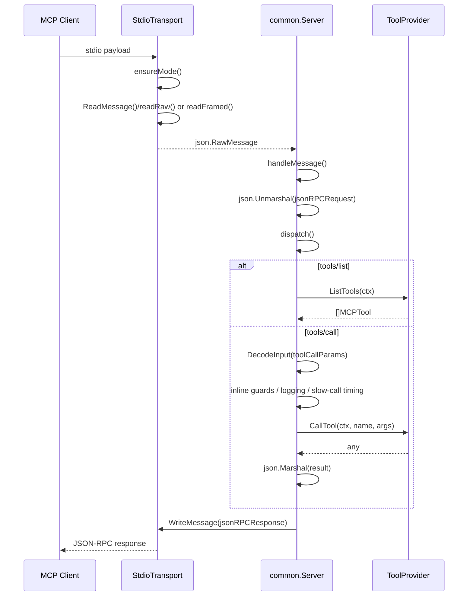
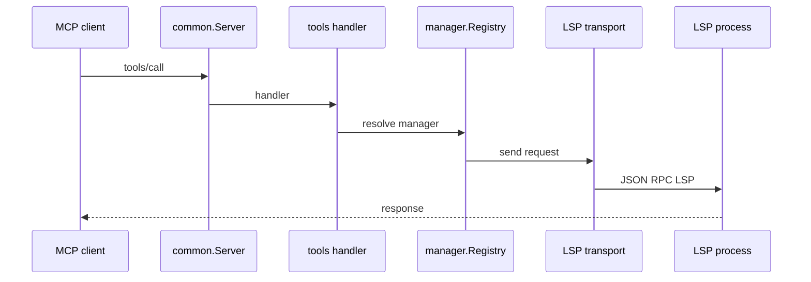
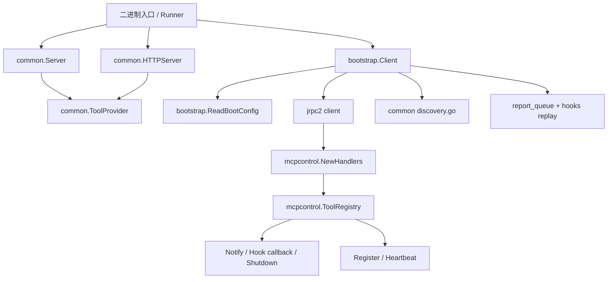

# 06 MCP Server 框架层代码地图

> 阅读边界：本卷只覆盖 `internal/mcpserver/**`，以及解释控制面依赖时最少引用 `internal/platform/mcpcontrol/**`。
> 不展开具体 Tool 实现，也不回溯任何旧 LSP 路径。

---

## 1. 模块概览

`internal/mcpserver` 目前只有两层：

1. `common/`
   - 对外提供 MCP front-door：`common.Server`（stdio）与 `common.HTTPServer`（HTTP）。
   - 真正稳定的扩展点只有 `common.ToolProvider`。
2. `common/bootstrap/`
   - 负责工具进程反连 control plane：register、heartbeat、report、hook、approval、reconnect。

当前目录里**没有**独立的 `Router` / `Dispatcher` / `Middleware` interface；真实分发都是具体方法：

- `internal/mcpserver/common/server.go` — `(*Server).dispatch`
- `internal/mcpserver/common/http_transport.go` — `(*HTTPServer).dispatch`
- `internal/mcpserver/common/bootstrap/lifecycle.go` — `(*Client).dispatchRequest`

---

## 2. 请求生命周期

### 2.1 stdio 主时序（stdio → decode → middleware → tool dispatch → response）

### 2.2 Bootstrap 生命周期调用链

- transport decode：`internal/mcpserver/common/stdio.go` — `ReadMessage`、`ensureMode`、`readRaw`、`readFramed`
- server entry：`internal/mcpserver/common/server.go` — `Run`、`readLoop`、`handleMessage`、`dispatch`
- param decode：`internal/platform/shared/jsonutil.go` — `DecodeInput`
- tool dispatch：`internal/mcpserver/common/server.go` — `handleToolsList`、`handleToolsCall`、`callTool`、`reply`

### 2.3 HTTP 变体

`common.HTTPServer` 复用同一组 JSON-RPC method 语义，但入口改为 `POST /mcp`：

- `handleMCP` 先限流读取 body（10MB）
- `dispatch` / `handleInitialize` / `handleToolsList` / `handleToolsCall` 与 stdio 版同构
- notification 无返回体时直接 `202 Accepted`

---

## 3. 包 / 文件职责

### 3.1 `internal/mcpserver/common/`

| 文件 | 关键符号 | 职责 |
|---|---|---|
| `server.go` | `ToolProvider`、`Server`、`Run`、`dispatch` | stdio JSON-RPC server；只识别 `initialize/tools/*/ping/shutdown/exit` |
| `stdio.go` | `StdioTransport`、`ensureMode` | 兼容 raw JSON 与 `Content-Length` framed stdio |
| `http_transport.go` | `HTTPServer`、`handleMCP` | Streamable HTTP MCP server |
| `discovery.go` | `WritePeerDiscovery`、`ReadDiscoveryAddr` | peer-mode HTTP 发现文件读写，采用 temp+rename 原子写入 |

### 3.2 `internal/mcpserver/common/bootstrap/`

- `client.go`
  - `bootstrap.Client` 与 `Config` 定义。
  - 对外暴露构造函数 `New()`，以及核心方法 `Start / Context / EmitEvent / Log / RequestApproval / Report / Close`。
  - hook 相关公开方法 `SubscribeHooks / ResolveHook / PendingHooks` 定义在 `hooks.go`，不是 `client.go` 文件本体。
  - `Config` 还提供 `FinalReport / OnShutdown / OnConfigChanged / OnToolsList / OnToolsCall / Hooks` 等注入点。
  - 内部维护：lease、当前 `jrpc2.Client`、重连状态、心跳/日志序号、协商后的能力集合、config version、resume generation、boot snapshot、hook 状态、report queue。
  - `AgentID` 允许为空；空值意味着该 MCP 进程可工作在 shared service 模式。
- `env.go`
  - 读取 `GO_AGENT_CTL_*` 环境变量；`RPCAddr` 兼容旧的 `RPC_ADDR`，其它 bootstrap 字段兼容对应 `GO_AGENT_MCP_*` 键（如 `GO_AGENT_MCP_INSTANCE_ID`、`GO_AGENT_MCP_BOOT_CONTEXT`）。
  - 解析 `BootSnapshot`，补齐 `InstanceID / BootID / BinaryName / ClientKind`。
  - `Context()` 在断连时会退化到 `envContext()`，按 scope 组装 boot snapshot 视图。
  - 旧环境变量会打印弃用警告，代码里写死了迁移截止提示 `2026-06-30`。
- `lifecycle.go`
  - `beginStart()`、`dial()`、`registerConn()`、`activateLocked()` 等启动流程。
  - 传输层是 **TCP + `jrpc2/channel.Line`**。
  - `handleCallback()` 会把 `tools/list` / `tools/call` 转发给 `Config.OnToolsList / OnToolsCall`。
  - `dispatchRequest()` 只识别 lifecycle 侧的 `ctl/shutdown` / `ctl/config/changed`（即 `MethodShutdown` / `MethodConfigChanged`）。
- `heartbeat.go`
  - 心跳循环、抖动等待、失败告警、下一次心跳间隔更新。
  - lease 被 core 判为 stale/not found 时，会走 `refreshLease()` 在**同一连接**上重新 register。
  - 心跳 metrics 会携带 `queued_reports` 与 `client_kind`。
- `hooks.go`
  - 定义 `HookBeforeHandler / HookCheckHandler / HookAfterHandler` 与 `HookConfig`。
  - 缺省 handler 的默认决策不是空操作：
    - `before` 默认 `deny`
    - `check` 默认 `continue`
    - `after` 默认 `reject`
  - 提供 `SubscribeHooks / ResolveHook / PendingHooks / replayHookSubscriptions`。
  - `SubscribeHooks()` 断连时会缓存订阅参数但返回 unavailable 错误；`PendingHooks()` 需要 `AgentID`（来自 `Config` 或 boot snapshot）。
  - 订阅参数会缓存到 `hookState`，重连后最多重放 3 次。
- `reconnect.go`
  - `handleStop()` 触发断线标记。
  - `reconnectLoop()` 做指数退避重连，最大退避 30s。
  - 重连成功后会重新激活连接、flush 队列、重放 hook 订阅。
- `report_queue.go`
  - **离线 report queue 是“有界内存队列”，不是磁盘 durable queue。**
  - 以 `report_id` 去重覆盖；默认上限 128。
  - `Config.ReportQueueLimit` 可覆盖默认值；`New()` 只保证小于 1 时回落默认值，并没有额外硬性最大值。
  - 连接恢复时补发；`Close()` 时还可发送 `FinalReport()`。
  - 断网时 `Report()` 返回 `queued_offline` 响应。

## 2.2 `cmd/mcp-lsp/`

> 当前 `cmd/mcp-lsp/` 下共有 141 个生产 Go 文件：根目录 20 个，后代目录 121 个（测试文件不计入统计）。具体目录分布以同页代码地图索引和项目地图为准，避免手写分布与自动索引产生第二真相源。
>
> <!-- codemap-count path="cmd/mcp-lsp" kind="go-files" expected="20" -->
> <!-- codemap-count path="cmd/mcp-lsp" kind="go-files-recursive" expected="141" -->
>
> 迁移补记：当前仓库 `internal/mcpserver/` 仅保留 `common/` 与 `common/bootstrap/`；LSP 真实落点已经迁到 `cmd/mcp-lsp/{tools,manager,multilsp,middleware,...}`，旧 internal/mcpserver/lsp 子包已删除。

### 2.2.0 入口层（`cmd/mcp-lsp/*.go`）
- `main.go`（36 行，入口）
  - 进程入口；限制 `GOMAXPROCS`、重定向 MCP stdout/stderr，并把 `run()` 的错误转换为退出码。
- `fx.go`（237 行，DI 组装）
  - Fx 装配根文件；注册 bootstrap / stdio / HTTP runners，并把 tool manifest 通过 `registryToolProvider` 暴露给 `common` 层。
- `runtime.go`（生命周期）
  - 运行时资源装配；构建全部语言的 manager registry、installer 与 stdio runner，并在退出时统一关闭 manager。
- `runtime_client_factory.go`（语言服务进程工厂）
  - 每个 workspace 保持独立协议 session，并注入共享 RSS cohort、兼容缓存目录及语言专属初始化参数。
- `cmd/mcp-lsp/runtime_server_cache.go`（跨 worktree 资源 cohort）
  - 所有非 gopls 服务进入同一个跨 worktree 资源池，汇总实际 RSS；全池默认高水位 15GiB、回收目标 12GiB。该水位只回收无活跃租约的 owner，不会中断正在执行的请求。
  - gopls 的二进制内容、Go 构建环境和 daemon 参数共同派生唯一 remote ID；资源目录直接使用同一 ID，避免 daemon 与 RSS 总账身份漂移。
  - Node 系服务的单进程 old-space 默认 2GiB；仅 Node 24.12+ 才启用 portable `NODE_COMPILE_CACHE`。它只优化启动编译成本，不作为语义内存复用证据，也不会全局覆盖 `XDG_CACHE_HOME`。
- `http_runner.go`（58 行，HTTP transport runner）
  - peer mode 下启动 HTTP MCP server，写入/清理 discovery 文件，并处理优雅停机。
- `schema.go`（138 行，工具 schema 注册）
  - 集中定义 9 个 MCP tool 的 input schema 与字段 helper。
- `tools.go`（87 行，tool handler 绑定）
  - 声明 tool manifest 列表，并把 cmd 层 handler 名称映射到 `cmd/mcp-lsp/tools` 的具体实现。

### `cmd/mcp-lsp/internal/hiddenexec/`：跨平台子进程树控制
- `cmd/mcp-lsp/internal/hiddenexec/process.go`
  - 统一构造普通/可取消命令；context 取消也会终止整棵派生进程树。
- `cmd/mcp-lsp/internal/hiddenexec/process_default.go`、`cmd/mcp-lsp/internal/hiddenexec/process_tree_unix.go`
  - Darwin/Linux 启动独立进程组，并通过组信号回收语言服务器及其 worker。
- `cmd/mcp-lsp/internal/hiddenexec/process_windows.go`、`cmd/mcp-lsp/internal/hiddenexec/process_tree_windows.go`
  - Windows 先创建 KillOnClose Job Object，再以 `CREATE_SUSPENDED` 启动语言服务器，按 `AssignProcessToJobObject → ResumeThread` 顺序消除 Start→Assign 逃逸窗口；绑定或恢复失败会终止进程并关闭 Job/进程/线程句柄。仅旧进程无 Job 时使用 `taskkill /T`，其失败不会被父 PID kill 伪装成整树成功。
- `cmd/mcp-lsp/internal/hiddenexec/process_other.go`
  - 其他平台保留父进程回收实现，避免平台文件缺失导致构建失败。

### `edit/`：补丁与 replace_range 算法层
- `patchparse.go`
  - 解析单/多 hunk patch，限制 patch 尺寸、行数、hunk 数。
- `patchmatch.go`
  - 用上下文去匹配 patch hunk 在当前文件中的真实落点，输出 `resolved offsets / matched_by / edit_context`。
- `replaceutil.go`
  - `replace_range` 的内容大小保护、offset/line 映射、编辑上下文构造。
  - 定义：
    - 内容上限 4MB
    - 替换内容上限 256KB
    - 超过 2MB 走 large-content bypass
    - 最多 20 个 edits
- `seeksequence.go`
  - `SeekSequence()` 是 5-pass **按行序列**匹配器：`exact / trim_right / trim_both / unicode_normalized / escape_normalized`。
  - `substring_exact` 不是 `seeksequence.go` 的一档；它是 `patchmatch.go` 在行序列匹配失败后的 raw substring fallback。

### `exec/`：受控命令执行
- `sandbox.go`
  - `Sandbox` 限定 root 目录，并校验 `work_dir` 必须留在 root 内。
  - 统一收集 stdout/stderr，默认输出上限 256KB。
  - 超时后会 kill 整个进程组（`Setpgid + SIGKILL`）。
  - `ShellRequest()` 默认用 `$SHELL -lc`，无环境变量时退化到 `/bin/sh -lc`。

### `format/`：结果展示与坐标转换
- `compact.go`
  - `compact/full` 结果模式与默认紧凑上限：
    - references 30
    - completion 20
    - workspace symbol 20
  - 定义 `CompactList`、紧凑 completion/workspace symbol 结构。
- `display.go`
  - 把协议内部 0-based 坐标统一转成对外 1-based。
  - 把 `file://` URI 转成相对路径显示。
- `funcrange.go`
  - 提供 `FindEnclosingFunction()`、`ResolveEnclosingFunctionRange()`。
  - 为 grep/xref 结果补 `func_start / func_end`。
  - 也负责 `AbsolutePathFromURI()`。
- `render.go`
  - JSON pretty render、带行号文本 render、grouped location render。
  - `NormalizeForDisplay()` 用反射统一处理多种 LSP 返回结构。

### `multilsp/`：通用 LSP 子进程管理骨架
- `client.go`
  - `Client` 接口与默认实现。
  - 负责 `initialize/shutdown/request/notify/didOpen/didChange/didClose`。
  - 组装 client capabilities、workspace folders、默认 init options。
- `transport.go`
  - 子进程 JSON-RPC transport。
  - 维护 pending request map、自增 request id。
  - 区分 response / notification / server request。
  - 为常见 server request 提供默认应答，如：
    - `workspace/configuration`
    - `client/registerCapability`
    - `client/unregisterCapability`
    - `window/workDoneProgress/create`
    - `workspace/semanticTokens/refresh`
    - `workspace/codeLens/refresh`
    - `workspace/inlayHint/refresh`
    - `workspace/diagnostic/refresh`
- `transport_conn.go`
  - 启动独立语言服务器进程组、绑定平台进程树所有权、读写 `Content-Length` framed 消息、收集 stderr（8KB ring buffer）、关闭/kill 整棵进程树并等待父进程退出。
- `manager.go`
  - `multilsp.Manager` 现在只组合三段端口：`ClientEnsurer + lspmanager.Manager + BackgroundRunnerProvider`；具体 LSP 能力来自 `lspmanager.Manager`，不再在本接口里直铺方法签名。
  - `manager` 主结构：workspace root、workspace->client 映射、diagnostics generation、logger、pool。
  - 构造时会规范化 root，并初始化 `ManagerPool`。
- `factory.go`
  - 这里不是“工厂模式注册器”，而是 `multilsp` 包内部的**泛型公共管线**。
  - 提供 `requestDocument()`、`queryHierarchy()`、union decode、cache persistence、bootstrap sync 辅助函数。
  - 也是 `bootstrap_doc.go / cache.go / manager_symbols.go` 的共享胶水层。
- `manager_lifecycle.go`
  - `EnsureClient()`、client 创建/复用/关闭。
  - 按 file/language 解析 workspace root。
  - JS/TS 与 Java 在仅按 language 建 client 时，会主动打开首个源文件，为 tsserver/jdtls 建立项目上下文。
- `manager_symbols.go`
  - definition / implementation / typeDefinition / hover / signatureHelp / references / callHierarchy / typeHierarchy / documentSymbol / workspaceSymbol / foldingRange / semanticTokens / completion / rename / codeAction / format 的 LSP 请求封装。
  - `locationQuery()` 还会调用 `format.EnrichLocationResultsWithFuncRange()`。
- `manager_diagnostics.go`
  - diagnostics snapshot 缓存、generation 隔离、稳定等待逻辑。
  - `AdvanceDiagnosticGeneration()` 会清空旧快照。
- `manager_symbols_fallback.go`
  - markdown/json/yaml 的 document symbol fallback；这些语言被路由到此 manager 时无需启动 LSP 进程。
- `bootstrap_doc.go`
  - 文档 bootstrap 协调器。
  - 读取磁盘快照并做 `DidOpen/DidChange` 同步。
  - 可刷新同 workspace 已缓存文档；对 Go 还会预热同目录兄弟 `.go` 文件。
  - 支撑 `BootstrapDocument()` 与 `BootstrapDocumentOpenOnly()` 两条路径。
- `cache.go`
  - `lspCacheStore`：文档 bootstrap cache。
  - 默认 TTL 7 天。
  - 可选持久化：
    - `AGENT_LSP_CACHE_PERSISTENT=1`
    - `AGENT_LSP_CACHE_DIR`
  - 持久化不可用时会自动回退到内存模式。
- `state.go`
  - per-workspace / per-URI bootstrap 状态机：
    - `pending / bootstrapping / ready / stale / error`
  - 决定当前文档是 `skip / wait / run`。
- `gomod.go`
  - 不是只处理 Go：
    - Go workspace root 探测
    - JS/TS project marker 探测与 bootstrap file 搜索
    - Java project marker 探测与 bootstrap file 搜索
  - 同时定义：
    - `shouldUseClientForLanguage()`
    - `fileURIFromPath()`
    - `absolutePathFromURI()`
- `pool.go`
  - `ManagerPool` 会跟踪 client lease 计数并启动 recycler。
  - `AGENT_LSP_POOL_SIZE` 控制 size（默认 10，最大 20），但当前 `snapshotManagers()` 只返回 primary manager，说明多 shard 仍处于预留态。
- `recycler.go`
  - 每 30 秒由 owner 汇总自己语言服务器的整棵进程树 RSS，Node 派生的 tsserver/worker 会计入同一 client；非 gopls 默认单 client 紧急阈值与 15GiB 全局高水位一致，不会在 2.5GiB 提前重启，POSIX gopls 轻 forwarder 阈值为 512MiB。
  - gopls daemon heap 软限默认 3.5GiB，与 forwarder 阈值分离；POSIX 上共享 daemon 的实际 RSS 也计入对应 cohort，cohort 回收高水位默认 4GiB。
  - 所有语言的 worktree client 连续 15 分钟没有客户端请求且没有活跃租约后关闭，不因服务端后台 progress 延长，并且不立即重建；下一次真实 LSP 调用才懒启动。最后一个 gopls forwarder 关闭后，共享 daemon 默认再等待 1 秒退出。
  - 跨 worktree cohort 超过回收高水位（gopls 默认 4GiB，其他服务默认 15GiB）时按 idle LRU 选择各 owner 自己的 client，关闭到 80% 目标水位且不立即重建。该值是 30 秒采样的空闲回收阈值，不会中断活跃请求，因此不是操作系统级硬内存上限。
- `resource_cohort.go`
  - 使用权限收紧的原子成员报告维护跨 mcp-lsp/worktree RSS 总账；报告包含 owner/client PID 与启动身份、语言、匿名 workspace hash、租约、活动时间和当前进程树 RSS。
  - owner 只探测并发布自己的 RSS；其他 reader 在两分钟新鲜窗口内只读报告，避免多 worktree 下形成平方级远端进程树探测。陈旧 live 报告会原位刷新并标成不可跨 owner 驱逐；坏报告当轮按整个高水位保守计量并改为 `.bad` 隔离，使下一轮恢复而不永久毒化总账。
  - 总账动态校验所有 JSON 必填字段并拒绝未知字段；只发布 owner-only 回收决策，不允许一个 mcp-lsp 直接 kill 另一个进程拥有的语言服务器。
  - POSIX 上按 canonical `-remote=auto;<cohort>` 归集独立 gopls daemon RSS，避免只看到 forwarder；Windows 不使用不受支持的带 ID auto daemon，而是独立 gopls + 4GiB cohort 约束。
- `cmd/mcp-lsp/internal/hiddenexec/process_tree_unix.go`、`cmd/mcp-lsp/internal/hiddenexec/process_tree_windows.go`
  - 汇总受管进程组/Job 对应语言服务器树 RSS；Windows 通过 `JobObjectBasicProcessIdList` 枚举 Job 成员并汇总 working set，Linux 进程启动身份使用 boot ID 加 `/proc/<pid>/stat` start time。Windows 先以 `CREATE_SUSPENDED` 启动，绑定 KillOnClose Job 后再恢复初始线程；真机 Win32 运行时验证仍需 Windows runner。

### `installer/`：LSP 安装器
- `installer.go`
  - `Provider` 维护语言 -> 安装配置映射。
  - `EnsureInstalled()`：
    1. 先 `LookPath`
    2. 若不存在则执行安装命令
    3. 再次校验 binary 是否已进入 PATH

### `manager/`：语言路由层
- `manager.go`
  - 定义对工具层暴露的统一 `Manager` 接口；当前由 `LifecycleManager/NavigationManager/XRefManager/StructureManager/CompletionManager/EditManager/DocumentLifecycleManager/DiagnosticsManager` 八个小接口嵌入组成。
- `registry.go`
  - `dynamicRegistry` 按文件扩展名/基础名识别语言。
  - `GetManagerForFile/GetManagerForLanguage` 在返回 manager 前可触发 installer。
  - 聚合 diagnostics，并把 URI 按 manager 分组。
  - `BootstrapDocument()` 是显式 bootstrap 入口。

### `middleware/`：工具调用中间件
- `logging.go`
  - `Handler` / `Middleware` / `Chain()`。
  - 记录压缩后的请求体、响应摘要、耗时。
- `recovery.go`
  - panic recovery，并打印 stack。
- `timeout.go`
  - tier timeout：`Fast/Normal/Slow/Exec`。
  - `ClampTimeout()` 用于把用户给的秒数夹在允许范围内。
- `budget.go`
  - 输出预算裁剪器。
  - 默认预算 64KB。
  - 不在 `wrapToolHandler()` 默认链里，而是由个别工具自行外挂。

### `protocol/`：LSP / JSON-RPC 协议模型
- `codec.go`
  - request/notification/response/envelope 编解码。
  - 对 JSON-RPC envelope 做严格校验。
- `methods.go`
  - LSP method 常量。
- `notification.go`
  - 只分发两类 notification：
    - `textDocument/publishDiagnostics`
    - `window/logMessage`
- `types.go`
  - LSP 常用结构体定义。
- `ext.go`
  - 初始化能力模型、统一 result wrapper、以及 `XRefResultLimit` / `SemanticTokenResultLimit` 等常量。

### `search/`：文件与搜索基础设施
- `fileutil.go`
  - workspace root 规范化、路径安全校验、root containment、二进制探测、symlink 禁止、语言别名推断。
  - `text_search` 的 Go-side walk 会跳过：`.cache`、`.git`、`__pycache__`、`build`、`coverage`、`dist`、`node_modules`、`vendor` 等目录。
- `searchutil.go`
  - 文本搜索：逐行扫描。
  - AST 搜索：依赖 `sg`（ast-grep）。
  - 普通 AST 查询走 `sg run --pattern`。
  - 若 query 看起来像 tree-sitter node kind（如 `function_declaration`），则生成临时 rule 文件走 `sg scan --rule`。
  - `ast_search` 会校验目标路径并拒绝目标 symlink，但实际递归遍历交给 `sg`；Go 侧不会像 `text_search` 一样统一应用二进制/超大文件/跳目录过滤。
  - `FilterAndCapSearchMatches()` 负责去重、排序、截断。

### `tools/`：具体 MCP 工具实现
- `factory.go`
  - `newManagerTool()`。
  - 参数解码策略：`decodeRaw / decodeLenient / decodeStrict`。
  - `wrapToolHandler()` 只挂 `Recovery + Logging + Timeout`。
- `tool_file.go`
  - `file`：`open_file / read_file / diagnostics`。
- `tool_diagnostics.go`
  - diagnostics 子流程：稳定等待、reactive bootstrap、表格化输出。
- `tool_grep.go`
  - `grep`：`text_search / ast_search`。
- `tool_inspect.go`
  - `inspect`：`hover / definition / implementation / type_definition / signature_help`。
- `tool_xref.go`
  - `xref`：`references / call_hierarchy / type_hierarchy`。
- `tool_structure.go`
  - `structure`：`document_symbol / workspace_symbol / folding_range / semantic_tokens`。
- `tool_completion.go`
  - `completion`。
- `tool_edit.go`
  - `patch_edit`：`rename / code_action / format / replace_range` 总入口。
- `tool_edit_replace.go`
  - replace_range 计划生成、写盘、回滚、LSP 同步、函数上下文回显。
- `tool_edit_support.go`
  - patch/hunk 辅助、workspace edit 收集与应用、line ending 保留、rollback 辅助。

---

## 4. 中间件 / 横切层现状

> `internal/mcpserver/**` 未定义独立 `Middleware` 接口；下表里的“中间件”都是**内联挂载点**，不是可插拔链。

| 类型 | 位置 | 作用 |
|---|---|---|
| `ToolProvider` | `common/server.go` | MCP Server 与真实工具实现之间的唯一稳定抽象：`ListTools` + `CallTool` |
| `MCPTool` | `common/server.go` | 对外暴露的工具项，包含 `name/description/inputSchema` |
| `Server` | `common/server.go` | stdio MCP Server 主体 |
| `StdioTransport` | `common/stdio.go` | stdio 消息读写器，支持 raw JSON / framed JSON-RPC |
| `HTTPServer` | `common/http_transport.go` | HTTP MCP Server，暴露 `POST /mcp` |
| `jsonRPCRequest` / `jsonRPCResponse` | `common/server.go` | stdio / HTTP 两条入口共享的 JSON-RPC envelope |

**设计观察：**
- `common` 层没有单独的 `Transport` interface。
- `ToolProvider.CallTool()` 返回 `any`，由 `common` 层统一序列化后包装成 MCP text content。
- stdio/HTTP 入口没有独立的 Router/Dispatcher interface；真实分发点就是 `Server.dispatch()` / `HTTPServer.dispatch()`，而 control-plane 对已注册 peer 的 fanout / callback 则落在 `internal/platform/mcpcontrol.ToolRegistry`。

### 3.2 Bootstrap 生命周期抽象

| 类型 | 位置 | 作用 |
|---|---|---|
| `bootstrap.Client` | `bootstrap/client.go` | 通用 lifecycle RPC 客户端，负责 register / heartbeat / reconnect / context / event / log / approval / report / hooks |
| `bootstrap.Config` | `bootstrap/client.go` | bootstrap 配置与回调注入点 |
| `HookConfig` | `bootstrap/hooks.go` | tool 侧 hook 处理器集合 |
| `hookState` | `bootstrap/hooks.go` | 保存 hook 订阅参数，供重连后 replay |

**补充事实：**
- `AgentID` 可以为空，表示 shared service 模式。
- `registerConn()` 当前固定 `RegisterRequest.AgentID` 为空串；`Config.AgentID` 仍会用于 `Context()` 请求与 `PendingHooks()` 的 agent 选择。
- `RequestApproval()` 在断连时不会降级，只会返回 `approval unavailable` 错误。
- report queue 是有界内存队列，不会跨进程持久化。

### 3.3 LSP 路由与管理抽象

| 类型 | 位置 | 作用 |
|---|---|---|
| `manager.Manager` | `cmd/mcp-lsp/manager/manager.go` | 对工具层暴露统一 LSP 能力接口；当前聚合 8 个细分端口，非直铺方法签名 |
| `manager.Registry` | `cmd/mcp-lsp/manager/registry.go` | 按文件/语言路由 manager，并聚合 diagnostics |
| `installer.Provider` | `cmd/mcp-lsp/installer/installer.go` | 确保语言服务器 binary 可用 |
| `middleware.Handler` | `cmd/mcp-lsp/middleware/logging.go` | 工具处理器统一签名 |
| `middleware.Middleware` | `cmd/mcp-lsp/middleware/logging.go` | 工具中间件签名 |

### 3.4 `multilsp/` 内部核心抽象

| 类型 | 位置 | 作用 |
|---|---|---|
| `multilsp.Client` | `multilsp/client.go` | 单个 LSP 子进程客户端抽象 |
| `multilsp.Manager` | `multilsp/manager.go` | 对外组合 `ClientEnsurer + lspmanager.Manager + BackgroundRunnerProvider` |
| `ClientEnsurer` | `multilsp/manager.go` | 只暴露 `EnsureClient()`，作为惰性拉起 LSP client 的端口 |
| `BackgroundRunnerProvider` | `multilsp/manager.go` | 只暴露 recycler 等后台 runner 入口 |
| `ClientFactory` | `multilsp/manager.go` | 注入具体 LSP binary 的 client 构造器 |
| `manager` | `multilsp/manager.go` | workspace -> client 管理核心 |
| `workspaceClient` | `multilsp/manager.go` | 一个 workspace 对应一个 LSP client |
| `transport` | `multilsp/transport.go` | 子进程 JSON-RPC 传输层 |
| `lspCacheStore` | `multilsp/cache.go` | bootstrap 文档缓存 |
| `bootstrapStateStore` | `multilsp/state.go` | bootstrap 状态机 |
| `ManagerPool` | `multilsp/pool.go` | client lease 计数与 recycler 容器 |
| `poolRecycler` | `multilsp/recycler.go` | 基于 RSS 的 client 回收器 |
| `bootstrapCoordinator` | `multilsp/bootstrap_doc.go` | 文档 bootstrap 协调器 |

**关键事实：** `multilsp/` 是通用 LSP 进程管理层；`cmd/mcp-lsp/runtime.go` 已把它复用于 Go、JS/TS、Python、CSS、Rust、Java 等语言场景。

---

## 4. 工具实现：`cmd/mcp-lsp` 下各子包如何落成具体能力

## 4.1 工具装配方式

`tools/factory.go` 的核心职责：

- `newManagerTool()`：给依赖 `Registry` 的工具生成统一 handler。
- 三种解码模式：
  - `decodeRaw`：直接 `json.Unmarshal`
  - `decodeLenient`：把空 / `null` 视为 `{}`
  - `decodeStrict`：同样容忍空 / `null`，但会 `DisallowUnknownFields`，并拒绝 trailing JSON
- `wrapToolHandler()`：统一挂载 `Recovery -> Logging -> Timeout`。
- **注意：`budget.go` 不在默认链里。**
  - `file`、`grep` 额外挂了 `WithOutputBudget()`。
  - `patch_edit` 也没有走 `newManagerTool()`，而是保留了自定义 handler 以支持多文件 apply/rollback 流程。

> 实际 MCP tool name / schema / handler 注册在 `cmd/mcp-lsp/tools.go`；`cmd/mcp-lsp/tools` 负责“工具逻辑”，装配层负责“把逻辑暴露成 MCP tool”。

## 4.2 工具能力总表

| 工具 | 实现入口 | 动作/能力 | 主要依赖 |
|---|---|---|---|
| logging | 记录 server start/stop、tools/call begin/done/slow、bootstrap reconnect/hook replay/report drop | `common/server.go`、`common/http_transport.go`、`bootstrap/*` 中的 `pkglogger.*` | `pkg/logger` |
| auth / lease | register 时带 `SessionToken`，后续 `Context/Approval/Report/Heartbeat` 全依赖 `LeaseKey` | `bootstrap/registerConn`、`RequestApproval`、`Report`、`sendHeartbeat` | `internal/dto/mcp`、`jrpc2` |
| tracing / correlation | 仅有日志字段级关联（`instance_id` / `lease` / `req_id`），没有 span / trace middleware | 同上 | `context.Context`、`pkg/logger` |
| backpressure / buffering | 串行 read loop、HTTP 10MB 限流、离线 report queue、`queued_reports` metric | `Server.Run` 的 `results` channel；`HTTPServer.handleMCP`；`bootstrap/report_queue.go`；`heartbeatMetrics` | `chan`、`net/http`、`internal/platform/shared` |
| recovery | transport stop 后自动 reconnect，成功后 `flushQueuedReports` + `replayHookSubscriptions` | `bootstrap/handleStop`、`reconnectLoop` | `jrpc2`、`platform/config`、hook/report queue |

### 4.1 明确缺席项

- **auth middleware（入站）**：stdio / HTTP front-door 不做独立认证；鉴权只体现在 control-plane register / lease。
- **tracing middleware**：未见 tracing interface 或 span 注入。
- **middleware chain / dispatcher abstraction**：未见 `type Middleware`、`type Router interface`、`type Dispatcher interface`。

---

## 5. bootstrap 与 control plane

### 5.1 Start → Register → Heartbeat

1. `ReadBootConfig` 读取 `GO_AGENT_CTL_*` 与 boot snapshot。
2. `Client.Start` 校验 `RPCAddr`，建立 root context。
3. `connectAndRegister` 经 `dial` 建 TCP+jrpc2 client，再 `registerConn` 发送 `mcp.MethodRegister`。
4. control plane 侧由 `internal/platform/mcpcontrol/handlers.go` 将 `MethodRegister` / `MethodHeartbeat` 路由到 `ToolRegistry.Register` / `Heartbeat`。
5. 注册成功后 `applyRegisterLocked` 写入 lease / config version / capabilities / timeout，并启动 heartbeat goroutine。

### 5.2 断线退化与恢复

- `Context()`：live RPC 不可用时退回 `envContext()`
- `EmitEvent()` / `Log()`：transport error 时退回本地审计 / 本地日志
- `Report()`：离线时 `enqueueReport()`，返回 `queued_offline`
- `handleStop()`：标记断线并启动 `reconnectLoop()`
- 重连成功后：`activateLocked()` → `flushQueuedReports()` → `replayHookSubscriptions()`

### 5.3 Hook 与反向回调

control plane 可反向调工具进程：

- `tools/list` / `tools/call`：走 `bootstrap.Config.OnToolsList` / `OnToolsCall`
- `ctl/hook/*`：走 `dispatchHookCallback()` → `handleHookBefore` / `handleHookCheck` / `handleHookAfter`
- 普通 notify：走 `dispatchRequest()` → `fireShutdown` / `fireConfigChanged`

---

## 6. ToolProvider / ToolRegistry / ToolSearch

### 6.1 框架真正对外暴露的只有 `ToolProvider`

`common.Server` 与 `common.HTTPServer` 都只依赖：

- `ListTools(ctx) ([]MCPTool, error)`
- `CallTool(ctx, name, args) (any, error)`

这意味着 `internal/mcpserver` **不拥有**具体 tool 定义表；具体进程只需把自己的 registry / definition list 适配为 `ToolProvider` 即可接入。

### 6.2 `ToolRegistry` 的位置与注册方

`internal/mcpserver` 自身没有 tool-definition registry；当前与它强相关的 registry 有两种，职责不同：

1. **控制面 registry**：`internal/platform/mcpcontrol.ToolRegistry`
   - 负责 peer `Register` / `Heartbeat` / `Shutdown` / `Notify` / `Hook callback`
   - 由 `internal/platform/mcpcontrol.Module` 提供：`NewRegistry`、`provideToolRegistry`、`provideToolNotifier`、`provideToolHookCallback`、`providePeerCallback`、`provideToolControlPlane`
2. **进程内 tool registry / definition list**
   - 位于各二进制入口层，不在 `internal/mcpserver`
   - 只有被适配成 `common.ToolProvider` 后，才会进入本卷的 server/front-door

### 6.3 `ToolSearch` deferred 机制

截至 2026-04-20，本卷与相邻 registry 路径中：

- 未检出 `ToolSearch` 符号
- 未检出以 `deferred` 命名的 tool search 延迟装配 / 延迟执行机制
- 因此当前 framework 只有**即时 `ListTools/CallTool` 分发**，没有独立的 deferred search pipeline 可描述

---

## 7. `multilsp` 与旧 LSP 接入路径状态

仓内已无旧 internal/mcpserver/lsp 目录：

- `find internal/mcpserver -type f` 仅有 `common/` 与 `common/bootstrap/`
- 定向检索不再命中旧目录
- 本卷因此只能确认：framework 层已经为 LSP 类进程预留了 **ToolProvider + bootstrap callback + HTTP discovery** 三个接入点，但 **multilsp manager / ToolSearch / Router** 尚未进入 `internal/mcpserver` 目录树

这也是本卷与任务说明的主要落差：LSP 迁入点在代码中尚未落地，本卷不能用旧路径充数。

---

## 8. 组件依赖图

---

## 9. 结论

## 6.1 MCP stdio transport（`common/stdio.go`）

`StdioTransport` 同时支持两种输入协议：

1. **Raw JSON**
   - 读取首个非空白字节若是 `{` 或 `[`，则启用 `json.Decoder` 连续解码。
2. **Framed JSON-RPC**
   - 读取 `Content-Length: N\r\n\r\n<body>`。

输出时：
- 若当前模式是 framed，就写 `Content-Length` 头；
- 否则直接写 JSON + `\n`；
- `StdioTransport` 没有公开 `Flush()` 方法；`WriteMessage()` 仅在底层 writer 实现 `Flush() error` 时顺手 flush。

## 6.2 MCP server dispatch（`common/server.go`）

`Server.dispatch()` 当前完整方法列表为：

- `initialize`
- `notifications/initialized`
- `ping`
- `shutdown`
- `exit`
- `tools/list`
- `tools/call`

协议特征：
- `initialize` 默认协议版本是 `2024-11-05`
- 通知（无 id）不回包
- `tools/call` 结果统一包装成 MCP text content：
  `{"content":[{"type":"text","text":"<json-string>"}]}`

## 6.3 MCP HTTP transport（`common/http_transport.go`）

- 入口：`POST /mcp`
- 单请求体上限：10MB
- 每个 HTTP 请求只处理一个 JSON-RPC envelope
- 通知请求不回结果，返回 `202 Accepted`
- `tools/call` 同样把返回值 marshal 成 text content
- 适合 shared service / 多客户端复用场景

## 6.4 Peer HTTP 发现（`common/discovery.go`）

- 把 HTTP 监听地址写到 `/tmp` 下的 discovery file。
- 命名中带 `binary + parentPID`，用于父进程或同伴进程定位 peer MCP HTTP 服务。
- 写入使用 `tmp + rename`，避免半写入文件。

## 6.5 Bootstrap 控制面通道（`common/bootstrap/*.go`）

- 连接方式：TCP + `jrpc2/channel.Line`
- 客户端注册时会上报：
  - `instance_id`
  - `boot_id`
  - `binary_name`
  - `client_kind`
  - `thread_id`
  - `pid`
  - `session_token`
  - `peer_kind=tool`
  - `capabilities_offered/required`
  - `subscriptions`
  - `resume_from_generation`（若存在）
  - 注意：`registerConn()` 当前不把 `Config.AgentID` 写入注册请求，`RegisterRequest.AgentID` 固定为空串。
- 运行时通道包含：
  - request：`register / heartbeat / context / approval / report / hook/subscribe / hook/resolve / hook/pending`
  - notify：`event / log`
  - callback：`tools/list / tools/call / hook/before / hook/check / hook/after / ctl/shutdown / ctl/config/changed`
- core/control-plane 侧真实发起点在 `internal/platform/mcpcontrol.ToolRegistry`：
  - `NotifyConfigChanged()` 通过 notify 下发 `ctl/config/changed`
  - `ShutdownInstance()` 通过 callback 下发 `ctl/shutdown`
- 断连后会：
  - mark disconnected
  - reconnect with exponential backoff
  - flush report queue
  - replay hook subscriptions
- `Context()` 断连时可退化为 boot snapshot；`RequestApproval()` 不退化。

## 6.6 LSP 子进程 transport（`multilsp/transport*.go`）

这一套与上面的 MCP transport 是另一层协议：用于本进程与 LSP server 子进程之间通信。

- 永远使用 **Content-Length framed JSON-RPC**。
- `transport.request()`
  - 生成自增 request id
  - 在 `pending map` 中登记 channel
  - 写入子进程 stdin
  - 等待 response 或 context timeout
- `dispatchMessage()`
  - 无 `method`：response
  - 有 `method` 且无 `id`：notification
  - 有 `method` 且有 `id`：server request（反向请求）
- `defaultServerRequestResult()`
  - 对常见 LSP server 反向请求给出默认应答，如：
    - `workspace/configuration`
    - `client/registerCapability`
    - `client/unregisterCapability`
    - `window/workDoneProgress/create`
    - `workspace/semanticTokens/refresh`
    - `workspace/codeLens/refresh`
    - `workspace/inlayHint/refresh`
    - `workspace/diagnostic/refresh`
- `transport_conn.go`
  - 负责启动子进程、读写 framed 消息、汇总 stderr、在异常时清空 pending、kill 进程。

---

## 7. 关键设计观察

1. **`common` 层非常薄，真正复杂度在 `bootstrap/` 与 `cmd/mcp-lsp/`。**
2. **`ToolProvider` 是 MCP server 与工具框架的关键解耦点。**
3. **`common` 没有统一 transport 抽象，而是 `Server + StdioTransport` 与 `HTTPServer` 双实现并存。**
4. **`bootstrap.Client` 已经不只是 register/heartbeat 客户端，而是完整的 control-plane peer。**
5. **`multilsp/` 实际上是通用 LSP 进程管理层，不只服务 Go。**
6. **`markdown/json/yaml` 的 fallback 能力存在于 `multilsp` manager 内部**，但当前 `cmd/mcp-lsp/runtime.go` 未注册这些语言；要触发 fallback 需要装配层显式把这些语言路由到该 manager。
7. **`replace_range` 是本层最复杂的写路径**：匹配、落盘、LSP 同步、回滚、函数上下文回显都在这里收束。
8. **Output Budget 不是默认全局中间件**，当前仅 `file` / `grep` 使用。
9. **`ManagerPool` / `recycler` 基础设施已经存在，但当前仍明显偏 primary-manager 模式。**

---

## 8. 建议从哪里继续读

若要继续深入，推荐顺序：

1. `common/server.go` + `stdio.go`
2. `common/bootstrap/client.go` + `lifecycle.go` + `reconnect.go`
3. `cmd/mcp-lsp/tools/factory.go` + `cmd/mcp-lsp/tools.go`
4. `cmd/mcp-lsp/manager/registry.go` + `cmd/mcp-lsp/multilsp/manager*.go`
5. `cmd/mcp-lsp/multilsp/client.go` + `cmd/mcp-lsp/multilsp/transport*.go`
6. `cmd/mcp-lsp/tools/tool_edit*.go` + `cmd/mcp-lsp/edit/*.go`

这样能最快建立“从 MCP 调用入口到 LSP 子进程，再到控制面生命周期”的完整心智模型。

## 审查补遗

1. **已更正 `report_queue.go` 的性质**：当前实现是**有界内存队列**，并不会落磁盘；原地图里“durable queue”的说法不准确。
2. **已补齐 bootstrap 生命周期缺口**：`Context/EmitEvent/Log/Approval`、`ctl/shutdown + ctl/config/changed` 回调、hook 默认决策、断连退化/不可退化行为，现在都已写入地图。
3. **已补齐 `multilsp/factory.go` 的职责**：它不是对外注册工厂，而是 `multilsp` 包内的泛型公共胶水层；原地图缺了这一层。
4. **已更正 `StdioTransport` 描述**：它只有 raw JSON / framed 两种探测模式；没有公开 `Flush()` API，只是在底层 writer 支持时由 `WriteMessage()` 顺手 flush。
5. **已补齐 bootstrap API 与注册细节**：
   - `client.go` 的公开入口补上了 `New()`
   - hook 公开 API 位于 `hooks.go`
   - `ctl/register` 的实际字段、`AgentID` 当前不入注册请求的事实，已按源码写明
6. **已更正中间件链描述**：`wrapToolHandler()` 默认只挂 `Recovery + Logging + Timeout`；`Budget` 是工具级 opt-in，不是全局默认链。
7. **已补齐工具细节遗漏**：
    - `file diagnostics` 支持“不传路径时读取所有当前 diagnostics”
    - `grep` 的 `text_search` 与 `ast_search` 过滤边界并不相同；前者走 Go-side 文件筛选，后者主要委托给 `sg`
    - `patch_edit` 会保留文件权限与行尾风格，并在 LSP 同步失败时回滚
    - `replace_range` 的匹配策略已按 `seeksequence.go + patchmatch.go` 更正，补上了 `substring_exact` fallback 与多候选歧义行为
8. **已补齐 `multilsp` 子包遗漏职责**：JSTS/Java bootstrap、cache 持久化开关、bootstrap 文档协调器、fallback-only 语言策略都已纳入，并注明当前 runtime 尚未注册 markdown/json/yaml manager。
9. **保留一条实现观察**：`ManagerPool.snapshotManagers()` 当前只返回 primary manager；`recycler` 的重建路径也仍带明显 Go-centric 痕迹，说明池化/回收基础设施仍在演进中。

---

## 9. 测试入口 + archtest freeze 映射

| 包 | 测试文件 | 核心 Test* | freeze |
|---|---|---|---|
| `common` | `server_test.go` | `TestServerHandlesToolsList` / +1 | — |
| `common/bootstrap` | `hooks_test.go` / +2 | `TestResolveHook_CallsHookResolveRPC` / +10 | — |

补记：
- `common/bootstrap` 当前另有 `env_test.go` 与 `shared_mode_test.go`，覆盖环境变量兼容与 shared-service/空 `AgentID` 路径。
- 本层当前未见独立 archtest freeze 条目；freeze 列保持 `—`。

## 10. How-to：本层常见扩展入口

| 场景 | 触发 | 步骤 | 源码锚点 | 验证 |
|---|---|---|---|---|
| common server | 新 sidecar / binary 需要暴露 MCP 工具 | 1) 实现 `ToolProvider` 2) 选择 `NewServer()` 或 `NewHTTPServer()` 3) 在 runner/Fx 装配里入组 | `type ToolProvider interface`@`internal/mcpserver/common/server.go`；`registryToolProvider`@`cmd/mcp-lsp/fx.go` | grep `NewServer` / `NewHTTPServer` builder |
| callback | peer 需要承接 `tools/list` / `tools/call` / `ctl/shutdown` / `ctl/config/changed` 等回调 | 1) 扩 `bootstrap.Config` 2) 在启动装配时填充回调 3) 由 `handleCallback()` + `dispatchRequest()` 接住 | `handleCallback()` / `dispatchRequest()`@`internal/mcpserver/common/bootstrap/lifecycle.go` | grep callback route + 常量名 |
| middleware | tool 需要 timeout / budget 治理 | 1) 在 `middleware/` 增补中间件 2) 经 `wrapToolHandler()` 挂链 3) 需要输出裁剪时显式接 `WithOutputBudget()` | `wrapToolHandler()`@`cmd/mcp-lsp/tools/factory.go`；`WithOutputBudget()`@`cmd/mcp-lsp/middleware/budget.go` | `tool_middleware_test.go` / 相关 tool 测试 |
