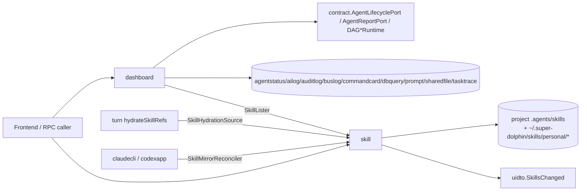
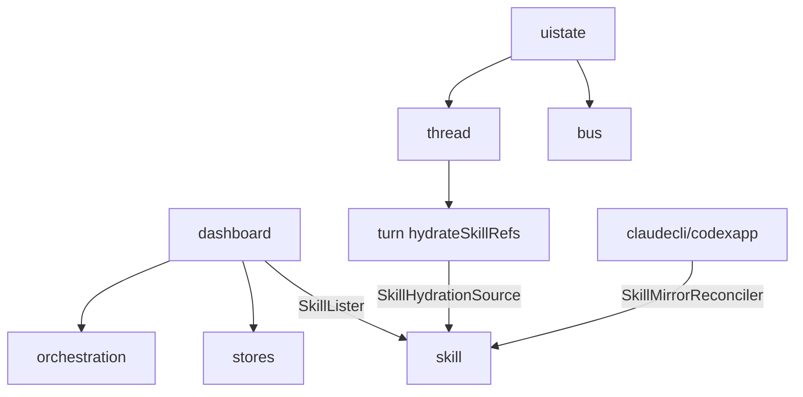
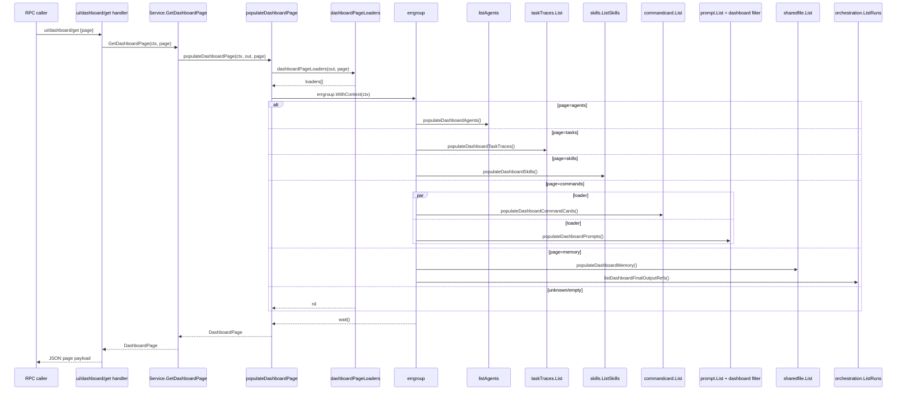
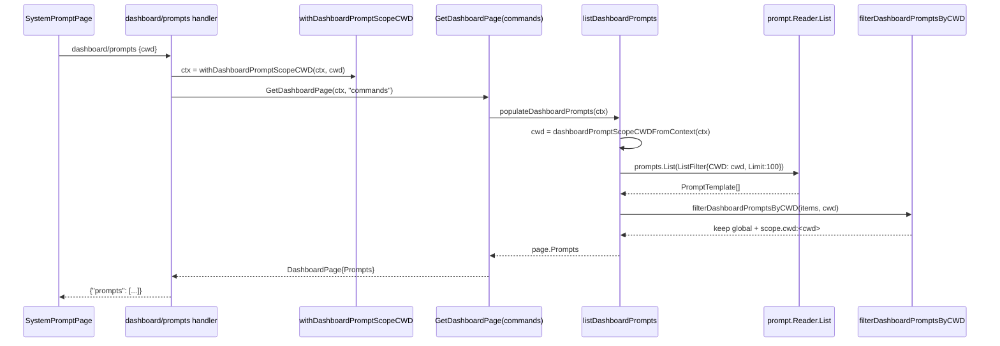
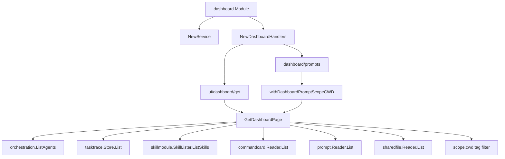
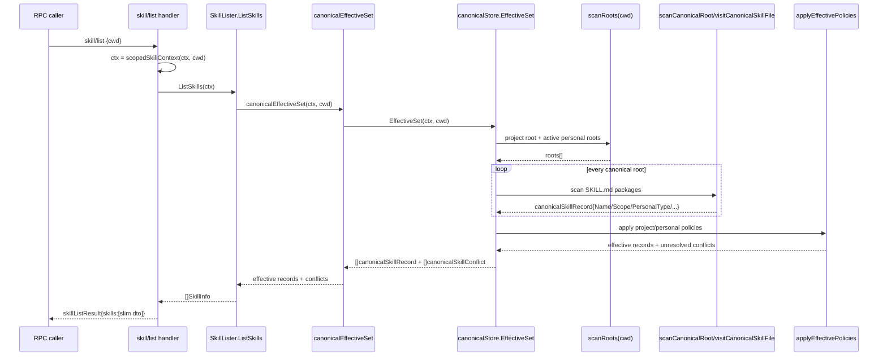
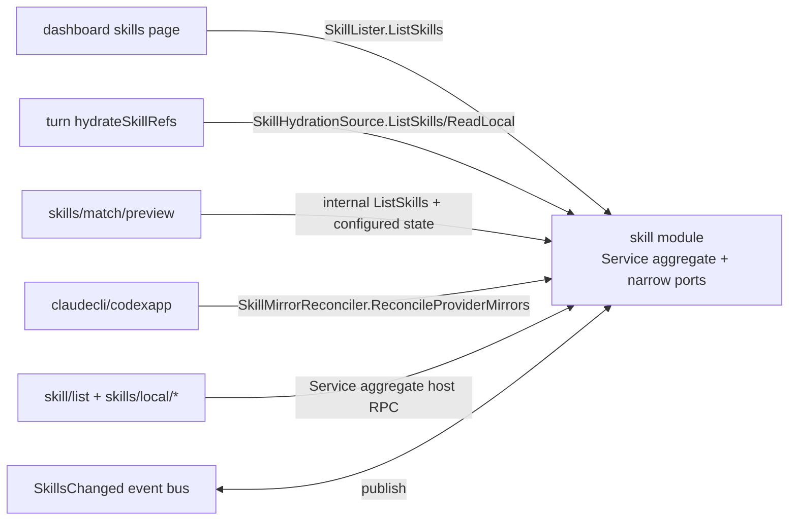

# 07A 业务模块层代码地图（读侧）

> 范围：`internal/module/dashboard/`、`internal/module/skill/`，以及旧 lspgui 模块的现状核对。
> 关联入口：[07-module.md](07-module.md) / [07-module-write.md](07-module-write.md)。

---

## 1. 读侧总览

读侧模块只做两类事：

1. **聚合已有只读数据**：`dashboard` 把 orchestration + stores + `skillmodule.SkillLister` 窄端口拼成页面化查询面。
2. **管理 canonical skill 与 provider mirror**：`skill` 维护项目级 / 个人级 canonical 目录、本地文件、冲突解析与 provider-native mirror 发布；同时保留 `Service` 兼容聚合面，向 dashboard / turn / provider mirror 提供窄端口。

### 1.1 跨卷一致性备忘

- prompt 不再维护独立数字 freeze；`internal/module/prompt/` 的生产文件数由下面的机器计数声明直接锁定为 30。统一冻结真值位于 `internal/archtest/freeze_baseline.json`。
  <!-- codemap-count path="internal/module/prompt" kind="go-files" expected="30" -->
- 旧 prompt skill-catalog 注入链已退出生产路径；prompt 不再读取 skill catalog 或 canonical skill 来生成正文、目录发现或 native suppression hints，正文/目录发现交给 provider-native mirror。
- 旧 lspgui 模块当前在仓内不存在；旧文档若仍把它写成真实包，需要按代码真值纠偏。

### 1.2 模块间主线关系（补）

- `dashboard` 站在 UI / RPC 查询面，向下只聚合 agent 生命周期读端口、report 读端口、DAG runtime 窄端口、stores 与 `skillmodule.SkillLister`，本身不持有技能内容。
- `skill.Service` 现在是兼容聚合接口；`turn` 走 `SkillHydrationSource`，`dashboard` 走 `SkillLister`，provider 走 `SkillMirrorReconciler`，`toolbridge` 不再把 skill reader 暴露为 Codex 生产工具。
- `uistate` 虽不在本卷展开，但它和 `thread` / `bus` 的 projection 链一起构成 dashboard 之外的另一条读侧 UI 面。

### 1.3 依赖图

---

## 2. dashboard（仪表盘读模型）

### 2.1 角色与边界

`dashboard` 是纯查询聚合层：

- **Fx 装配**：`module.go:19-54`
  - 注入 `dashboard.OrchestrationReader`、`dashboard.OrchestrationReportReader` 与 DAG runtime 窄端口
  - 注入 `agentstatus / ailog / auditlog / buslog / commandcard / dbquery / prompt / sharedfile / systemlog / tasktrace`
  - 注入 `skillmodule.SkillLister`（不是完整 `skill.Service`）
  - `fx.Provide(NewDashboardHandlers)` 暴露 RPC
- **RPC 面**：`rpc.go:155-270`
  - 页面聚合：`ui/dashboard/get`
  - 细分读取：`dashboard/{agentStatus,taskTraces,commandCards,prompts,sharedFiles,skills,agent/detail,system/info,query,aiLogs,auditLogs,busLogs,dags,dagDetail,dagRuns,logs}`
- **服务核心**：`service.go:35-340`
  - `GetDashboardPage` / `GetAgentDetail` / `GetLogs` / `Query`
  - `GetAgentDetail` 里用 `errgroup` 并发 `Snapshot + GetReport`
- **页内装配**：`ui_page.go:17-340`
  - `DashboardPage` 聚合 `Agents/DAGs/TaskTraces/Skills/CommandCards/Prompts/Memory/FinalOutputRefs`
  - `commands` 页是唯一多 loader 并发页（`commandCards + prompts`）
  - `memory` 页在 sharedfile 列表外额外提取近期 DAG run 的 file 型 `metadata.final_output`，只作为高亮/筛选索引

### 2.2 `ui/dashboard/get` 分发链

`ui/dashboard/get` 只是薄 RPC：`rpc.go:84-86` 直接进 `svc.GetDashboardPage(ctx, p.Page)`，真正的页面分发都在 `ui_page.go`。

### 2.3 页面到数据源映射

| 页面 | loader | 真正数据源 | 备注 |
|---|---|---|---|
| `agents` | `populateDashboardAgents` | `orchestration.ListAgents` | `service.go:listAgents` |
| `tasks` | `populateDashboardTaskTraces` | `tasktrace.Store.List` | 固定 `Limit=100` |
| `skills` | `populateDashboardSkills` | `skillmodule.SkillLister.ListSkills` | 只读窄端口复用技能扫描层 |
| `commands` | `populateDashboardCommandCards` + `populateDashboardPrompts` | `commandcard.Reader.List` + `prompt.Reader.List` | 两路并发 |
| `memory` | `populateDashboardMemory` | `sharedfile.Reader.List` + `orchestration.ListDAGs/ListRuns` | sharedfile 固定 `Limit=500`；`FinalOutputRefs` 只扫最近 20 个 DAG、每 DAG 最近 3 个 run |

补充：

- `dashboard/commandCards` 只是 `GetDashboardPage("commands")` 后取 `page.CommandCards`。
- `dashboard/prompts` **不是**简单的 page-field wrapper：`rpc.go:102-108` 会先写入 `withDashboardPromptScopeCWD(ctx, p.Cwd)`，再返回 `page.Prompts`。
- `dashboard/sharedFiles` 只是 `GetDashboardPage("memory")` 后取 `page.Memory`，返回 key 为 `files`；`finalOutputRefs` 只在 `ui/dashboard/get?page=memory` 的页面 payload 暴露。
- `dashboard/skills` 也会继承同一份 `{cwd}`：`rpc.go:113-115` → `ui_page.go:158-162` → `skillmodule.SkillLister.ListSkills(skillmodule.WithCWD(...))`。

### 2.4 `dashboard/prompts` 的 `{cwd}` 过滤接线

这条链是 p20.15 补通的重点，当前 prod caller 已由 `xref(references)` 核实：

- `service.go:86-91` `withDashboardPromptScopeCWD(ctx, cwd)`
- **prod callers 现有 3 个**：`rpc.go:85-87`（`ui/dashboard/get`）、`rpc.go:102-108`（`dashboard/prompts`）、`rpc.go:113-115`（`dashboard/skills`）
- 测试 caller 见 `service_test.go:62`

关键细节：

1. **`dashboard/prompts` handler 已不再走旧 `dashboardPageField("commands", ...)` 包装**：`rpc.go:102-108` 直接返回 `{"prompts": page.Prompts}`。
2. **ctx 传递链不是测试专用 helper，而是三条读侧入口共享的 prod 入口**：`uiDashboardGetParams{Cwd}` / `dashboardPromptsParams{Cwd}` → `withDashboardPromptScopeCWD` → `dashboardPromptScopeCWDFromContext`。
3. **最终生效过滤仍在 dashboard 模块内**：`ui_page.go:149-196`
   - 先把 `cwd` 带进 `promptstore.ListFilter`
   - 再按 tag `scope.cwd:<value>` 做 `filterDashboardPromptsByCWD`
4. **store contract 与实现存在一层“名义支持 / 实际忽略”的落差**：
   - `internal/store/prompt/contract.go:24-29` 有 `ListFilter.CWD`
   - 但 `internal/store/prompt/store.go:61-75` 当前只下发 `AgentKey/Keyword/Limit`，未真正用到 `CWD`
   - 所以今天的可见性仍由 `dashboardPromptVisibleForCWD()` 控制，而不是 prompt store SQL 过滤
5. 测试锚点：`dashboard/service_test.go:36-126` 已覆盖 `repo-a/repo-b` 作用域与 `prompts` 顶层 key。

### 2.5 其它查询面

- **Agent 详情**：`service.go:114-158`
  - `orchestration.Snapshot` 与 `orchestration.GetReport` 并发
  - `LastReport` 以 `GetReport` 结果优先，缺失时回退 snapshot 内缓存
- **统一日志**：`service.go:173-198` + `logs.go`
  - `resolveLogSource` 把 `all/system/ai` 归一成组合读取模式
  - `appendSystemLogs` / `appendAILogs` 合流后统一排序与裁剪
- **DAG 查询**：`rpc.go:132-136` / `detail.go`
  - `dashboard/dags` 与 `dashboard/dagDetail` 透传 `contract.DAGRuntime` 的 list/detail 能力
  - `dashboard/dagRuns` 走 `ListDAGRuns()`，内部 clamp limit 后调用 `orchestration.ListRuns`（`detail.go:61-80`, `rpc.go:260-266`）
- **final_output 索引**：`ui_page.go:250-340`
  - `listDashboardFinalOutputRefs()` 先取最近 DAG，再并发取每个 DAG 最近 run，解析 `run.metadata.final_output`
  - 只接收 `kind=file` 或未显式 kind 但有 `path/sharedfile.path` 的输出；text/json 最终产物留 DAG detail 展示，不进入 Shared Files 文件筛选
  - enrichment 错误不阻断 memory page：`populateDashboardMemory()` 对 refErr 静默降级为空列表（`ui_page.go:163-172`）
- **任意 DB 查询**：`rpc.go:120-122` → `service.Query()` → `dbquery.Store.Query`

### 2.6 依赖图

### 2.7 文件地图

| 文件 | 作用 |
|---|---|
| `module.go` | Fx 注入 orchestration / stores / `skillmodule.SkillLister`，并提供 RPC handlers。 |
| `rpc.go` | `ui/dashboard/get` 与各细分 `dashboard/*` 路由。 |
| `service.go` | `GetDashboard` / `GetAgentDetail` / `GetLogs` / `Query` / cwd-scope ctx helper。 |
| `ui_page.go` | `DashboardPage`、loader switch、页内并发装配、prompt tag 过滤。 |
| `detail.go` | DAG list/detail/run-list 与 Agent turn history 辅助逻辑。 |
| `logs.go` / `ai_logs.go` / `factory.go` | 日志统一包装、过滤与 DTO 组装。 |
| `agent_status.go` / `types.go` / `contract.go` | DTO 与查询接口定义。 |

---

## 3. lspgui（历史章节，当前代码缺席）

### 3.1 当前代码真值

当前仓库已删除旧 lspgui 子包：

- `find internal/module -maxdepth 2 -type d | grep lsp` → 空
- `grep path=. query="package lspgui"` → 0 命中
- `grep path=. query="lsp/gui_" glob="**/*.go"` → 0 命中

### 3.2 对 codemap 的影响

- 旧版 `07-module.md` 把 `lspgui` 写成真实存在的 GUI-LSP 包，现已与代码失真。
- 本次拆卷后只保留 **现状说明**，不再捏造文件地图 / RPC 列表 / stub 能力。
- 若未来重新引入该包，应在本节补回：`module.go / rpc.go / service.go / stubs.go` 等真实锚点后再展开。

---

## 4. skill（canonical 管理 / provider mirror）

### 4.1 角色与边界

`skill` 同时承担四类职责：

1. **canonical skill 扫描与有效集**：项目级 `<cwd>/.agents/skills` + 个人级 `~/.super-dolphin/skills/personal/{user,agent,imported}`；`personal/hub` 仅作目录/市场来源，不参与扫描、mirror 或 provider 调用。
2. **provider-native mirror**：把有效集发布到 `<cwd>/.claude/skills` / `<cwd>/.agents/skills`，以及个人默认 `~/.claude/skills` / `~/.agents/skills` 或显式 provider home `skills`，让 Claude/Codex 原生发现。
3. **本地文件与冲突处理 RPC**：`skills/local/*`、`skills/resolution_*`、`skills/summary/suggest`、`skill/list` 等 host/UI 面继续保留；`skill/expand` 和旧 `skills/candidate/*` 候选审批入口已退出 V1 生产面。
4. **受限命令执行与事件**：`command/exec` + `uidto.SkillsChanged` debounce 发布。

Fx 装配见 `module.go:15-30`：

- `newService(cfg, dispatcher)` 从 `platform/config.Config.ProjectRoot` 注入构造期 project root
- 若底层 `Service` 是具体 `*service`，再 `bindDispatcher(dispatcher)` 开启 `SkillsChanged` 事件发射器
- `fx.As(new(contract.SkillMirrorReconciler))` 导出 provider mirror reconcile；`ProvideSkillLister / ProvideSkillHydrationSource` 暴露 dashboard / turn 所需窄端口；`ProvideSkillCatalogSource` 仅保留 legacy 兼容接口，不是当前生产 prompt 注入链。
- `fx.Provide(NewSkillHandlers)` 暴露 host RPC

### 4.2 根目录与 `cwd` 作用域

`skill.Service` 兼容聚合面及其窄端口的作用域不是全局常量，而是 **构造期 projectRoot + 请求期 cwd** 的叠加：

- `contract.go:12-25`：`WithCWD(ctx, cwd)` / `cwdFromContext(ctx)`
- `skills_fs.go:25-39`：`ListSkills(ctx)` 强制要求 cwd，并委托 `canonicalEffectiveSet(ctx, cwd)`
- `canonical_store.go:123-160`：`EffectiveSet(ctx, cwd)` 扫描 project + active personal roots，再套用 policy 并剔除未处理同名冲突

当前 root 规则：

| 层级 | 规则 |
|---|---|
| 项目根 | `<cwd>/.agents/skills`；请求缺少 `cwd` 时返回 `ErrMissingCWD`，不回退到构造期 project root |
| 个人根 | `~/.super-dolphin/skills/personal/{user,agent,imported}`，可由 `SUPER_DOLPHIN_HOME` 改变 home；`personal/hub` 是 catalog-only，不是 active canonical root |
| project policy | `<cwd>/.agents/skills/.super-dolphin-skill-policy.json` 可禁用某个 personal source 对当前项目生效 |
| personal policy | `~/.super-dolphin/skills/.super-dolphin-personal-skill-policy.json` 可在个人同名冲突中 keep selected |
| provider mirror | `<cwd>/.claude/skills` / `<cwd>/.agents/skills` 及个人默认 `~/.claude/skills` / `~/.agents/skills`；显式 provider home 可使用其 `skills` 子目录；这些是生成物，不是 canonical 真值 |

provider mirror 是生成物，不是 canonical 真值；人工修改应先落到 canonical，再由 mirror reconcile 或同步流程发布。

`cwd_scope_test.go:14-119` 已验证：

- 带 `cwd` 时可隔离同名 skill（`projectA` 与 `projectB`）
- 空 `cwd` 时返回 `ErrMissingCWD`，避免跨项目泄漏 canonical skill 列表
- `DeleteLocal` 会按 scope 删除 project/personal skill，personal 删除会归档；同名冲突通过 resolution RPC 或 policy 收敛。

### 4.3 host/UI skill RPC

`skillCoreHandlers@rpc.go` 把 host-facing `skill/list` 与 legacy `skills/list` 一起挂进 `newSkillHandlers()`；`skillResolutionHandlers@rpc.go` 额外挂 mirror/canonical 冲突处理面：

| RPC | 入参/返回 | 真实流程 |
|---|---|---|
| `skill/list` | `skillListParams{cwd}` → `skillListResult{skills[]}` | `skillListHandler` → `scopedSkillContext` → `ListSkills` → `canonicalEffectiveSet` → 只返回瘦身 DTO |
| `skills/resolution_list` | `{cwd}` → conflict items | 扫 canonical effective set + provider mirrors，返回 same-name / mirror drift / unmanaged provider skill 等冲突 |
| `skills/resolution_preview` | conflict + action → preview/proof | 生成 diff / preview hash / backup path，不写 canonical 或 mirror |
| `skills/resolution_apply` | preview proof + action → report | 对 mirror drift / unmanaged provider skill 执行 sync back / overwrite / save as new / takeover / confirm delete |

DTO / caller 链补充：

- `rpc_skill_types.go` 当前显式定义 `skillListResult`，host 返回结构与 legacy `skills/list` 已分流。
- `skill/expand` 不再注册，旧调用会得到 JSON-RPC method not found；生产读取链路不能再依赖 Service aggregate 上的 expand 能力。

与 legacy `skills/list` 的区别：

- `skill/list` 只暴露 `name/summary/description/trust/content_hash/disable_model_invocation`
- `skills/list` 继续返回完整 `SkillInfo` 数组（原形态不变）

`skill/list` 的 prod caller / 消费者可由 `xref(references)` 追到：

- `dashboard/ui_page.go:158-162`：技能页通过 `skillmodule.SkillLister.ListSkills` 读取元数据
- `turn/service.go:80-95` + `turn/skills.go:201-241,326-339`：hydrate 手动 skill ref 通过 `skillpkg.SkillHydrationSource` 调 `ListSkills` / `ReadLocal`
- `skills_match.go:43-50`：`skills/match/preview` 内部先列全量 skills 再做 local matcher

### 4.4 `skill/list` 读取链

要点：

- `canonical_store.go:160-207` 会把每个 root 下的 skill package 转成 canonical record；底层仍复用 SKILL.md frontmatter 解析，把 `name/description/summary/trigger_words/force_words/trust/allowed_tools/disable_model_invocation` 规范化进 `SkillInfo`。
- 若没写 `summary`，会从正文自动抽取摘要；`TriggerWords` 默认补 `@name` 与 `[skill:name]`。
- `ContentHash` 是整份 `SKILL.md` 的 SHA-256，全文件任一变动都会触发重新审批。

### 4.5 `skill/expand` 退出生产面

`skill/expand` 已从 host/UI RPC 注册表、`Service` 聚合接口和 `skills_fs.go` 展开实现中移除。当前生产链路不再由本项目把 skill 正文注入 turn input，也不再通过 `skill/expand` 做二次展开审批。

现状边界：

- provider runtime 主链是 canonical skill → provider-native mirror → Claude/Codex 原生发现与调用。
- `skill/list`、`skills/list`、`skills/local/read` 仍用于 UI 展示、编辑、手动 hydration fallback，不承担 provider runtime 注入。
- `rpc_types_test.go::TestSkillExpandHostRPCIsNotRegistered` 锁定旧 `skill/expand` 调用只能得到 method not found，防止旧入口被重新挂回生产面。

### 4.6 legacy RPC 共存面

`newSkillHandlers()` 当前通过 `mergeSkillHandlerMaps()` 同时暴露 host 新键与 legacy 老键；legacy 入口主要分布在 `skillLocalHandlers / skillRemoteHandlers / skillPreviewHandlers` 与 `skillsListHandler`：

| 分组 | 现存键 | 说明 |
|---|---|---|
| 旧列表/匹配 | `skills/list`、`skills/match/preview` | 老客户端继续可用；`match/preview` 仍走 local matcher + configured state |
| 本地 FS | `skills/local/read`、`skills/local/listFiles`、`skills/local/write`、`skills/local/importDir`、`skills/local/delete` | 统一走 `resolveSkillPath` / `writeSkill` / import/delete 逻辑 |
| 远端/配置 | `skills/remote/{list,read,write,export}`、`skills/config/{read,write}`、`skills/summary/write` | `config/read` 仍偏 stub，`config/write` 还是 legacy 主 skill 文件写口 |
| 冲突处理 | `skills/resolution_list`、`skills/resolution_preview`、`skills/resolution_apply` | 处理 canonical 同名、project mirror drift、personal mirror drift、unmanaged provider skill 等 |
| 命令执行 | `command/exec` | 独立于 provider mirror，但同属 skill module |

### 4.7 事件与副作用

- `events.go:27-70`
  - `publishSkillsChanged(action, name)` 在写入/导入/删除后触发
  - 100ms debounce 合并 burst，最终发出 `uidto.SkillsChanged`
- `skills_match.go:14-187`
  - `skills/match/preview` 先算 configured skills，再做 local `force / explicit / trigger` 匹配
  - 显式 `@skill` 与 `[skill:skill]` 优先级高于普通 trigger words
- `exec.go` / `exec_tokenizer_safety.go`
  - `command/exec` 会拒绝 shell 解释器、危险包装器与 shell metacharacters

### 4.8 prompt / turn / dashboard 的消费关系

注意：

- prompt 不再通过 skill catalog 注入 skill body、目录或 native suppression hints；provider-native mirror 是 Claude/Codex 发现 skill 的唯一生产主链。
- provider 启动/acquire 前调用 `SkillMirrorReconciler` 发布 mirror；Claude/Codex 原生发现 mirror 里的 skills。
- `turn` 只消费 `SkillHydrationSource.ListSkills/ReadLocal` 做 hydration，不会直接走 `skill/expand` RPC，也不依赖完整 `skill.Service` 的旧展开能力。
- `dashboard` 仅把 `SkillLister.ListSkills` 当作只读列表来源，不参与 approval / resource read。

### 4.9 文件地图

| 文件 | 作用 |
|---|---|
| `module.go` | Fx 装配、dispatcher 绑定。 |
| `contract.go` | `WithCWD`、`Service` 兼容聚合接口、`SkillMirrorReconciler` 实现，以及 `SkillCommandExecutor` / `SkillLister` / `SkillHydrationSource` / legacy `SkillCatalogSource` 等窄端口。 |
| `rpc.go` | 新旧 RPC 共存入口。 |
| `service.go` | roots、approval cache、cwd-scoped root 决策。 |
| `skills_meta.go` | 扫描 `SKILL.md`、frontmatter 解析、默认 trust / content hash。 |
| `skills_fs.go` | `ListSkills`、`ReadLocal`、本地读写/导入/删除主流程。 |
| `mirror_*.go` | provider mirror 发布、manifest、drift 检测、preview/apply resolution。 |
| `skills_match.go` | `skills/match/preview`、configured + local matcher。 |
| `events.go` | `SkillsChanged` debounce 事件。 |
| `exec*.go` | `command/exec` 安全执行与 token 化检查。 |
| `approval*.go` / `trust.go` | 审批缓存、trust scope。 |
| `pkg/skillblocks/skillblocks.go` | Claude/Codex 共用的 rollout marker 解析与裁剪纯函数；位于公共叶子包，skill 模块不再通过全局 hook 注入。 |

---

## 5. 本卷需要牢记的代码真值

1. `dashboard/prompts` 的 `{cwd}` 作用域已经接到 **prod handler**；`withDashboardPromptScopeCWD` 不再只是测试 helper。
2. `promptstore.ListFilter.CWD` 只在 contract 层露出；当前 store 实现未真正下推过滤，实际筛选仍在 `dashboard/ui_page.go`。
3. `skill/list` 是 host/UI RPC，不是 provider runtime 的 skill 调用主链；`skill/expand` 已退出注册表，只保留 method-not-found 回归测试。
4. 旧 prompt skill-catalog 注入链已退出生产路径；provider runtime 主链是 canonical skill -> provider-native mirror。
5. `lspgui` 在当前仓内 **无源码目录**；旧 codemap 对它的实现级描述已过时。

---

## 6. 测试入口 + how-to 补遗

### 6.1 测试入口

> freeze 口径：本卷直接涉及的 `dashboard / skill / uistate` 当前无独立 freeze 项；相邻 `prompt` 真值仍以 §1.1 的 `30` 为准。

| 包 | 测试文件 | 核心 Test* | 锁定点 |
|---|---|---|---|
| `dashboard` | `service_test.go` | `TestGetDashboardPageFiltersPromptsByScopedCWD` / `TestDashboardPromptsHandlerScopesByCWDAndReturnsPromptsKey` | 锁定 `dashboard/prompts` 的 `{cwd}` 透传、`prompts` 顶层 key 与 scope 过滤。 |
| `skill` | `cwd_scope_test.go` | `TestListSkillsScopesByRequestCWD` / `TestAllSkillServiceMethodsRequireCWD` | 锁定 roots 按请求 `cwd` 隔离，以及 host/UI skill 方法要求 cwd。 |
| `skill` | `rpc_types_test.go` | `TestSkillListHostRPCResponseHidesLegacyFields` / `TestSkillExpandHostRPCIsNotRegistered` | 锁定 host `skill/list` 的瘦身返回，并防止 `skill/expand` 旧入口重新注册。 |
| `skill` | `rpc_resolution_test.go` / `rpc_resolution_apply_test.go` | resolution list/preview/apply 相关测试 | 锁定 project/personal mirror drift、多 mirror drift、preview proof、sync back / overwrite / save as new / confirm delete。 |
| `uistate` | `phase2_stats_patch_pending_test.go` / `sidebar_test.go` | `TestActivityStats_CommandIncrementsCommands` / `TestProjectionSubscriptionsUpdateSidebarFromLifecycleAndOutputEvents` | 锁定 sidebar / activity stats 的 projection 读侧更新。 |
| `uistate/timeline` | `timeline/timeline_test.go` | `TestAppendAndGetByThread` | 锁定 timeline 读模型 append/get 基线。 |

### 6.2 how-to 三条

1. **dashboard 页**
   - 触发：新增只读聚合 page / tab。
   - 步骤：`DashboardPage` 扩字段 → `dashboardPageLoaders@dashboard/ui_page.go:66-92` 挂 loader → `NewDashboardHandlers@dashboard/rpc.go:83-150` 接 `ui/dashboard/get` 或专门 `dashboard/*` 路由。
   - 验证：优先补 `dashboard/service_test.go`。
2. **skill RPC**
   - 触发：新增 `skill/*` 或 `skills/*` 且需要 `cwd` 作用域。
   - 步骤：先补 service/helper，再接 `skillCoreHandlers / skillPreviewHandlers / skillLocalHandlers / skillRemoteHandlers@skill/rpc.go`；host 口保持 `skillListResult` 这类单独 DTO，并通过 `scopedSkillContext` 统一写入 `WithCWD`。
   - 验证：`cwd_scope_test.go` + `rpc_types_test.go`。
3. **uistate**
   - 触发：线程 / 回合事件要进 sidebar、timeline 或 stats。
   - 步骤：先有事件 emit，再由 `registerProjections@uistate/module.go:46-66` 挂生命周期，最后在 `registerProjectionSubscriptions@uistate/projector.go:17-60` 订阅并落读模型。
   - 验证：`sidebar_test.go` / `timeline/timeline_test.go`。
