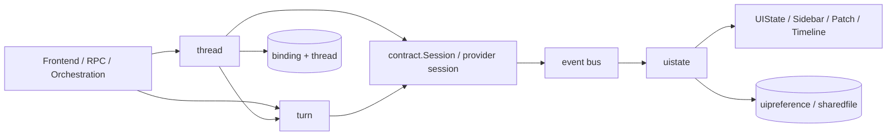
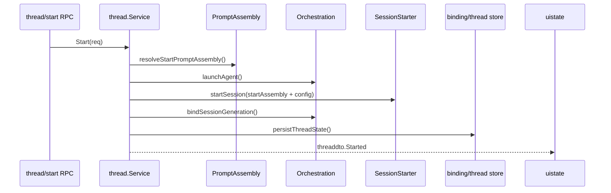
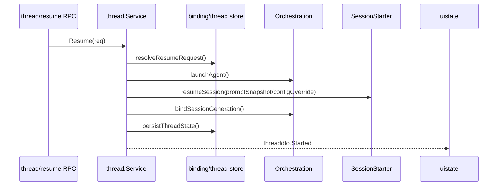
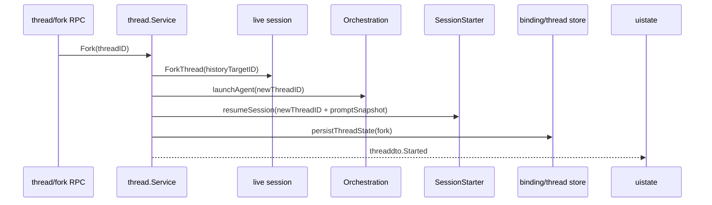
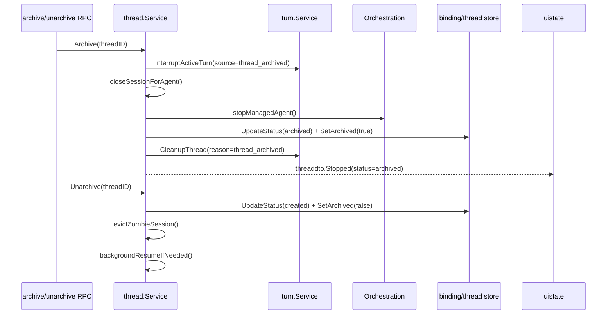
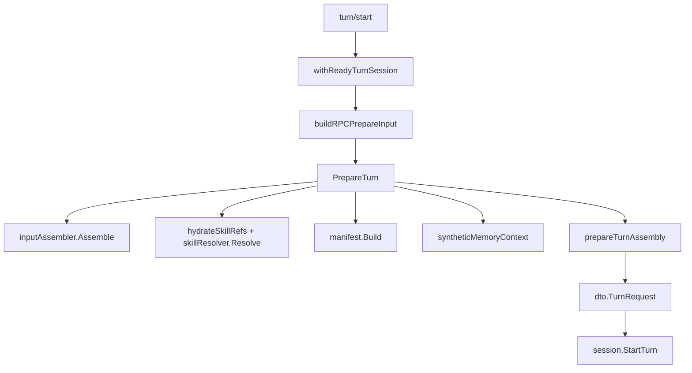
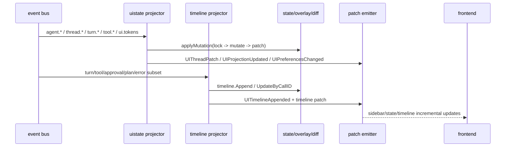
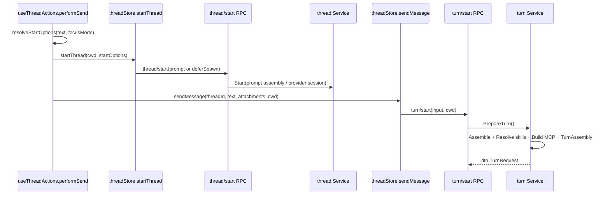

# 07B 业务模块层代码地图（写侧）

> 范围：`internal/module/thread/`、`internal/module/turn/`、`internal/module/uistate/`（含 `timeline/`）。  
> 关联入口：[07-module.md](07-module.md) / [07-module-read.md](07-module-read.md)。
> UI 路径校正（2026-06-28）：当前 UI 源码只在 `frontend-app/`；桌面宿主嵌入产物同步到 `cmd/agent-terminal/web-dist`。当前 React UI 入口见 [01-terminal-ui-react.md](01-terminal-ui-react.md)。

---

## 1. 写侧总览

写侧模块负责把“线程生命周期 + 单回合执行 + 事件投影”串成真正可交互的运行链：

### 1.1 分工边界

- `thread`：管 **thread / agent / provider-thread / session UUID** 绑定、`start/resume/fork/archive` 生命周期、历史/配置读取，以及停线程前后的 turn 协调。
- `turn`：管 **一次 turn** 的输入组装、技能解析、manifest / turn assembly、启动/中断/强制完成与 tracker。
- `uistate`：管 **事件 → UI 投影**；把 provider / thread / turn / tool 事件折叠成 `UIState / Sidebar / Patch / Timeline / Preferences / Projects`。

### 1.2 跨卷提醒

- `thread/start` 与 `turn/prepareTurnAssembly` 都会消费 prompt 相关 contract，但 **prompt/memory 的内部装配规则不在本卷展开**；详见第 11 卷。
- `turn.* / tool.*` 事件 **不是 turn 模块自己发的**，而是 provider/session 层在 `internal/provider/*/event_map.go` 里翻译后发布；本卷只记录消费边界。

---

## 2. thread（线程生命周期与绑定真相源）

### 2.1 角色与边界

- **RPC 入口**：`internal/module/thread/rpc.go:23-339`
- **服务主入口**：`internal/module/thread/lifecycle.go:77-141`、`internal/module/thread/lifecycle_fork.go:14-168`
- **停机协同**：`internal/module/thread/stop.go:22-148`、`internal/module/thread/archive.go:12-80`
- **绑定事件订阅**：`internal/module/thread/events.go:25-152`

`thread` 的边界很清晰：

1. 它负责把 public thread id、agent id、provider thread id、session UUID 绑定到 `binding/thread store`。
2. 它负责把 `thread/start`、`resume`、`fork`、`recover`、`archive/unarchive` 落到 provider session 与 orchestration。
3. 它**消费** prompt assembly / prompt snapshot，但不拥有 prompt section registry。
4. 它在停线程前先抢占 turn，在停线程后再清 tracker / scratchpad / binding。

### 2.2 文件地图（核心生产文件）

| 文件 | 作用 |
|---|---|
| `service.go` | 主 service 容器、session/binding 解析、事件发射、后台 resume。 |
| `service_constructor.go` | Fx 构造；把 `PromptAssemblyService`、`turn.Service`、thread emitters 接进来。 |
| `lifecycle.go` | `Start` / `Resume` 主流程。 |
| `lifecycle_fork.go` | `Fork` / `Recover` 主流程。 |
| `start_session.go` | start/resume provider request 构造、`PromptSnapshot` 透传。 |
| `start_session_helpers.go` | `StartInput` / start config / provider DTO 投影。 |
| `binding_registration.go` | binding upsert、不可变字段校验、回滚。 |
| `factory.go` | thread event 构造、offline config、binding chain 解析。 |
| `history.go` | `thread/read`、`thread/messages`、runtime config、compact。 |
| `stop.go` | `Stop`、turn 中断、session close、agent stop、tracker cleanup。 |
| `archive.go` | `Archive` / `Unarchive`；保留 UUID 并触发后台 resume 预热。 |
| `events.go` | 订阅 `AgentLaunched` / `AgentFailed`，回写 `SessionUUID` 与被动恢复。 |
| `compact_event.go` | 发布 `threaddto.Compacted`。 |
| `rpc_types.go` | `thread/*` 参数兼容解码；含 launch skill 字段别名。 |

补充校正：

- 旧稿若提过 `thread/launch_request.go` / `session_generation.go`，**现码已无该文件**；对应职责分别并入 `internal/module/thread/lifecycle_helpers.go:114-138` 的 `buildLaunchRequest(...)` 与 `internal/module/thread/lifecycle.go:62-75` 的 `bindSessionGeneration(...)`。

### 2.3 关键类型

- `StartRequest` / `ResumeRequest`：`internal/module/thread/contract.go:35-93`
- `threadState`：`internal/module/thread/lifecycle.go:28-45`
- `bindingRegistration`：`internal/module/thread/binding_registration.go:14-32`
- `threadStopState`：`internal/module/thread/stop.go:15-20`
- `threaddto.Started / Stopped / MessagesPage / Compacted`：`internal/module/thread/factory.go:138-185`

### 2.4 生命周期时序

#### A. `thread/start`

关键点：

- `Start` 真正入口是 `internal/module/thread/lifecycle.go:77-124`。
- `PromptAssemblyService` 只在 start 路径前置装配；`buildStartAssemblyInput` 先经 wrapper 准备 scratchpad build ctx，再把 launch 技能、cwd、git/worktree、MCP snapshot 一次性带入 `contract.StartInput`：`internal/module/thread/start_session_helpers.go:28-35`、`internal/module/thread/start_session_helpers.go:37-72`；对应 runtime config 落盘/透传由 `buildStartSessionConfig(...)` 负责：`internal/module/thread/start_session_helpers.go:134-189`。
- `startSession` 再把 `StartAssembly + Config + LaunchSkillNames/ForceLaunchSkills` 投影到 provider DTO；其中 `LaunchSkillNames/ForceLaunchSkills` 是 legacy carrier，不触发 prompt catalog 注入：`internal/module/thread/start_session.go:142-166`。
- 真正的 `thread.Started` 发布点是 `persistStartedThread -> publishThreadStarted`，不是 RPC handler：`internal/module/thread/lifecycle_helpers.go:218-229`、`internal/module/thread/service.go:352-361`。

#### B. `thread/resume`

关键点：

- `Resume` 入口：`internal/module/thread/lifecycle.go:126-141`。
- `hydrateResumeSessionRequest` 会补 `ProviderThreadID / CWD / Model / Effort / PromptSnapshot / ConfigOverride`：`internal/module/thread/start_session.go:270-306`。
- `resumeSession` 明确把 `PromptSnapshot` 透传给 provider：`internal/module/thread/start_session.go:168-193`。
- `Resume` 的 started 事件成功路径仍走公共链 `persistThreadState -> persistStartedThread -> publishThreadStarted`：`internal/module/thread/lifecycle.go:314-344`、`internal/module/thread/lifecycle_helpers.go:218-229`。
- `persistResumedSession(...)` 里唯一显式的 `publishThreadStarted` 只是 persist 失败后的 warning fallback，且只补发一次：`internal/module/thread/lifecycle.go:257-301`。

#### C. `thread/fork`

关键点：

- `Fork` 入口：`internal/module/thread/lifecycle_fork.go:14-91`。
- 新 thread id 直接充当新的 public thread id 与 agent id。
- 与旧文档不同，fork 不是“完全不传 `PromptSnapshot`”；当前代码会先 `resolveStablePromptSnapshot(...)`，再把 **返回值变量** `snapshot` 带进 `ResumeRequest.PromptSnapshot`：`internal/module/thread/lifecycle_fork.go:34-57`。
- `contract.PromptAssemblySnapshot{}` 只是 `resolveStablePromptSnapshot(...)` 的 fallback 入参；真值优先取已存快照，不命中才规范化 caller fallback：`internal/module/thread/prompt_snapshot.go:198-215`。

#### D. `thread/archive` / `unarchive`

关键点：

- `Archive`：`internal/module/thread/archive.go:12-53`
- `Unarchive`：`internal/module/thread/archive.go:55-80`
- archive 不清 `SessionUUID`，只打 archived 标记；这是 unarchive 能靠 UUID 自动恢复 provider thread 的前提。
- unarchive **不发 thread 事件**，只是预热 session；真正的 `Started` 要等后台 resume 成功后才出现。

#### E. `thread/recover`

- `Recover` 入口：`internal/module/thread/lifecycle_fork.go:93-168`。
- 它先 `recoverAgent()`；若内存里已有 session，则 mode=`restore_launch`；否则补走 `resumeSession(...) + bindSessionGeneration()`，mode 变成 `relaunch_resume`：`internal/module/thread/lifecycle_fork.go:105-131`。
- `Recover` 自身 **没有** `publishThreadStarted` 直接命中；started 事件仍依赖公共的 `persistThreadState -> persistStartedThread -> publishThreadStarted` 链：`internal/module/thread/lifecycle_fork.go:136-154`、`internal/module/thread/lifecycle.go:314-344`、`internal/module/thread/lifecycle_helpers.go:218-229`。
- 所以 `Resume` vs `Recover` 的差别是：前者多了 persist 失败时的显式 fallback 补发；后者没有额外补发分支。

### 2.5 与 turn cleanup 的协同边界

停线程不是一次调用，而是两段式：

1. **先抢占活跃 turn**：`interruptStoppingThread()` 调 `turns.InterruptActiveTurn(...)`：`internal/module/thread/stop.go:94-105`
2. **再停 session / agent**：`stopThreadRuntime()` 内部依次 `closeSessionForAgent -> stopManagedAgent`：`internal/module/thread/stop.go:63-92`
3. **最后清 tracker**：`cleanupThreadTurns()` 调 `turns.CleanupThread(...)`：`internal/module/thread/stop.go:141-148`

这里的设计含义是：

- `InterruptActiveTurn` 依赖 live session，必须发生在 `Close/StopAgent` 之前。
- `CleanupThread` 只负责把本地 tracker 与 tool-result lifecycle 置终态：`internal/module/turn/thread_cleanup.go:24-28`。
- cleanup 目标不是单一 public thread id，而是 `threadID / providerThreadID / codexThreadID / agentID` 去重后的全集，避免 tracker 键漂移漏清：`internal/module/thread/stop.go:150-202`。

### 2.6 依赖特点

- **contract**：`Session`、`PromptAssemblyService`、`ToolRegistry`；对 provider 只见抽象，不直接 import 某个 driver。
- **store**：`binding` + `thread` 是真相源；`historyjsonl` 只是离线回退。
- **module**：唯一直接业务依赖是 `turn.Service`；thread 负责停机协同，但不接管 turn 细节。
- **event bus**：既是生产者也是少量消费者：
  - 消费 `AgentLaunched` 同步 `SessionUUID/CWD`：`internal/module/thread/events.go:35-94`
  - 消费 `AgentFailed` 触发被动 session-level recovery：`internal/module/thread/events.go:118-152`
  - 生产 `Started/Stopped/MessagesPage/Compacted`：`internal/module/thread/service.go:352-400`、`internal/module/thread/compact_event.go:10-26`

### 2.7 关键锚点

- `Start`：`internal/module/thread/lifecycle.go:77-124`
- `Resume`：`internal/module/thread/lifecycle.go:126-141`
- `Fork`：`internal/module/thread/lifecycle_fork.go:14-91`
- `Recover`：`internal/module/thread/lifecycle_fork.go:93-168`
- `Archive/Unarchive`：`internal/module/thread/archive.go:12-80`
- `buildStartAssemblyInput`：`internal/module/thread/start_session_helpers.go:28-72`
- `buildStartSessionConfig`：`internal/module/thread/start_session_helpers.go:134-189`
- `persistThreadState`：`internal/module/thread/lifecycle.go:314-344`
- `stopThreadRuntime`：`internal/module/thread/stop.go:63-92`
- `interruptStoppingThread`：`internal/module/thread/stop.go:94-105`
- `cleanupThreadTurns`：`internal/module/thread/stop.go:141-148`
- `backgroundResumeIfNeeded`：`internal/module/thread/service.go:291-324`
- `resolveBindingChain`：`internal/module/thread/factory.go:457-472`

---

## 3. turn（一次回合的组装、执行与本地追踪）

### 3.1 角色与边界

- **RPC 入口**：`internal/module/turn/rpc.go:10-25`
- **RPC 辅助**：`internal/module/turn/rpc_helpers.go:19-262`
- **服务主入口**：`internal/module/turn/service.go:116-446`
- **中断/清理**：`internal/module/turn/interrupt_service.go:11-97`、`internal/module/turn/thread_cleanup.go:9-28`

`turn` 的边界同样是 provider-neutral：

- 它只面向 `contract.Session / TurnHandle / SessionResolver / ApprovalResponder` 编程：`internal/contract/provider.go:23-48`、`internal/contract/session_resolver.go:5-7`、`internal/contract/approval.go:8-12`。
- 它**不翻译 provider 原始事件**；`turn.* / tool.*` 事件来自 `internal/provider/{codexapp,claudecli,unified}/event_map.go`。
- 它负责把“用户这一次输入”变成 `dto.TurnRequest`，再交给 session 去执行。

### 3.2 文件地图（核心生产文件）

| 文件 | 作用 |
|---|---|
| `service.go` | `PrepareTurn`、`StartTurn`、`SteerTurn`、`ForceCompleteTurn`、tracker watcher。 |
| `rpc_helpers.go` | `turn/start` / `turn/steer` 输入拼装、session ready wait、capability gate。 |
| `assembler.go` | 输入 item 规范化、白名单、去重、截断。 |
| `skills.go` | 显式技能合并、auto-match、手选技能 hydrate。 |
| `prompt_assembly.go` | `PrepareTurn` 阶段的 `TurnAssembly` 装配。 |
| `service_memory.go` | synthetic memory/turn context 注入。 |
| `manifest.go` | MCP manifest 构造。 |
| `interrupt_service.go` | interrupt envelope、等待 settle。 |
| `thread_cleanup.go` | 线程停机时的 turn 终止与 tool result reset。 |
| `tracker.go` | 本地 turn tracker。 |
| `orchestration_starter.go` | 给 orchestration 提供 `TurnSubmission -> PrepareTurn -> StartTurn` 适配。 |

### 3.3 关键类型

- `PrepareInput`：`internal/module/turn/contract.go:33-62`
- `TurnStatus`：`internal/module/turn/contract.go:64-70`
- `turnTracker / trackedTurn / activeTurn`：`internal/module/turn/tracker.go:13-31`
- `dto.TurnRequest` 组装点：`internal/module/turn/service.go:141-159`

### 3.4 输入组装（含技能选择）

分层要点：

1. **RPC 层**先把 payload 归一化成 `PrepareInput`：`buildRPCPrepareInput()` 会把 `prompt/input/images/files/selectedSkills/manualSkillSelection/cwd/model/...` 合并：`internal/module/turn/rpc_helpers.go:19-44`
2. **输入 item 规范化**由 `inputAssembler.Assemble()` 完成：
   - 文本、图片、本地图片、mention/filecontent 统一归一：`internal/module/turn/assembler.go:48-190`
   - 最多 256 items；文本 64KB；拒绝可执行扩展名：`internal/module/turn/assembler.go:12-44`
3. **技能选择**分三层：
   - 显式 `selectedSkills`：RPC 直接传入
   - `input.type=skill`：`buildTurnStartInputs()` 会抽出来并并入显式技能：`internal/module/turn/rpc_helpers.go:46-60`
   - `CandidateSkills`：只在 service 层字段存在；`ManualSkillSelection=true` 时会被清空，不再 auto-match：`internal/module/turn/service.go:128-136`
4. **技能 hydrate** 是 turn 对 `module/skill.SkillHydrationSource` 窄端口的唯一直接业务依赖：
   - 注入点是 `NewServiceWithPromptAssemblyAndTurnContext(...)` 的第 4 个参数，类型为 `skillpkg.SkillHydrationSource`；`fx` 也标成 `optional:"true"`，缺失时 `skillLookup==nil` 直接跳过 hydrate：`internal/module/turn/service.go:25-30,80-95`、`internal/module/turn/module.go:12-19`
   - `PrepareTurn` 实际在 `service.go:141-146` 先把 ctx 包成 `skillpkg.WithCWD(ctx, input.CWD)`，再调用 `hydrateSkillRefs(...)`
   - 只给 name-only manual skill 补 `Prompt/Summary/Version`
   - 入口：`internal/module/turn/skills.go:201-241`，正文读取走 `ReadLocal`：`skills.go:326-339`
5. **turn assembly** 是 turn 侧 prompt 拼装边界，不等于 thread/start 的 start assembly；`PrepareTurn` 在 `internal/module/turn/service.go:176` 调 `prepareTurnAssembly(...)`，其定义在 `internal/module/turn/prompt_assembly.go:13-43`
6. **memory context** 通过 `TurnContextProvider` 可选注入，不让 `turn` 直接依赖 memory 实现：`internal/module/turn/service_memory.go:11-34`

### 3.5 启动、转向、中断、强制完成

#### A. 启动

- `turn/start` handler：`internal/module/turn/rpc_helpers.go:159-182`
- `PrepareTurn`：`internal/module/turn/service.go:116-160`
- `StartTurn`：`internal/module/turn/service.go:211-235`

执行顺序：

1. `withReadyTurnSession()` 先轮询 session 就绪，避免 blank-thread 首发刚起线程时 session 尚未挂上：`internal/module/turn/rpc_helpers.go:84-149`
2. `CapMessageSend` gate 通过后才进入 service：`internal/module/turn/rpc_helpers.go:162-180`
3. `StartTurn` 先 `tracker.Start(preparing)`，拿到 `TurnHandle` 后再 `AttachHandle -> BindProviderID -> Update(running)`：`internal/module/turn/service.go:211-235`
4. `watchTurn()` 异步盯 `handle.Done()`，超时 30 分钟会标成 `stalled`：`internal/module/turn/service.go:317-355`、`internal/module/turn/tracker.go:11-166`

#### B. `turn/steer`

- `SteerTurn`：`internal/module/turn/service.go:237-258`
- 它不会新建 tracker 条目，而是复用当前活跃 handle，并把新的 `PrepareTurn` 结果转成 `SteerRequest`。

#### C. `turn/interrupt` / `turn/forceComplete`

- `InterruptTurn`：`internal/module/turn/interrupt_service.go:11-97`
- `ForceCompleteTurn`：`internal/module/turn/service.go:283-303`

设计点：

- interrupt 先看 tracker 的 `ActiveByThread`，构造 `before/after` envelope；若 provider 已终态则直接返回确认态。
- force-complete 会把 tracker 状态先置为 `force_completing`，随后等待 `handle.Done + tracker terminal`，避免前端误判“按钮点了但没收口”。

#### D. 线程停机协同

- `InterruptActiveTurn`：`internal/module/turn/thread_cleanup.go:9-22`
- `CleanupThread`：`internal/module/turn/thread_cleanup.go:24-28`

含义：

- `InterruptActiveTurn` 需要 live session，给 thread stop/archive 用。
- `CleanupThread` 只是本地补账：把 tracker 下未终态的 turn 全部改成 interrupted，并 reset tool-result lifecycle。

### 3.6 tracker 与 provider session 的解耦边界

tracker 只保存 **本地真相**：

- 键：`localID`
- 关联：`providerID / threadID / handle`
- 状态：`preparing/running/interrupting/force_completing/completed/interrupted/failed/stalled`

边界上要注意两点：

1. `turn` 不关心 provider 如何发事件；它只需要 `session.StartTurn/Interrupt/ForceComplete` 与 `TurnHandle.Done()`。
2. `uistate` 消费的 `TurnStarted/TurnCompleted/ToolCallBegin/...` 并不是 tracker 发的，而是 provider event map 发的：
   - Codex：`internal/provider/codexapp/event_map.go:148-302`
   - Claude：`internal/provider/claudecli/event_map.go:92-168`
   - Unified 补 plan/item/error：`internal/provider/unified/event_map.go:151-217`

### 3.7 依赖特点

- **contract**：`Session`、`TurnHandle`、`SessionResolver`、`ApprovalResponder`
- **module**：可选依赖 `skillpkg.SkillHydrationSource`（仅手选技能 hydrate），不直接依赖完整 `skill.Service` / thread / uistate
- **store**：无直接 store 依赖；运行态主要靠 session + tracker
- **provider boundary**：所有 provider 差异都被 contract/session interface 吞掉

### 3.8 关键锚点

- `PrepareTurn`：`internal/module/turn/service.go:116-160`
- `StartTurn`：`internal/module/turn/service.go:211-235`
- `InterruptTurn`：`internal/module/turn/interrupt_service.go:11-27`
- `ForceCompleteTurn`：`internal/module/turn/service.go:283-303`
- `watchTurn`：`internal/module/turn/service.go:317-355`
- `turn/start` handler：`internal/module/turn/rpc_helpers.go:159-182`
- `buildRPCPrepareInput`：`internal/module/turn/rpc_helpers.go:19-44`
- `skillResolver.Resolve`：`internal/module/turn/skills.go:14-40`
- `PrepareTurn -> hydrateSkillRefs`：`internal/module/turn/service.go:141-146`
- `hydrateSkillRefs`：`internal/module/turn/skills.go:201-241`
- `PrepareTurn -> prepareTurnAssembly`：`internal/module/turn/service.go:176`
- `prepareTurnAssembly`：`internal/module/turn/prompt_assembly.go:13-43`
- `orchestrationTurnStarter.StartTurn`：`internal/module/turn/orchestration_starter.go:61-93`

---

## 4. uistate（事件投影中心 + timeline 子系统）

### 4.1 角色与边界

- **Fx 装配**：`internal/module/uistate/module.go:37-66`
- **初始化快照**：`internal/module/uistate/service.go:58-113`
- **主状态读取**：`internal/module/uistate/service.go:144-220`
- **投影订阅**：`internal/module/uistate/projector.go:17-60`
- **timeline 子订阅**：`internal/module/uistate/timeline/projector.go:16-45`

`uistate` 是写侧里最“事件中心”的模块：

- 上游收 agent/thread/turn/tool/ui token 事件。
- 内部维护 `state + overlay + diff + timeline + preferences + projects`。
- 下游只发 UI 事件：`UIThreadPatch / UIPreferencesChanged / UIProjectionUpdated / UITimelineAppended`。

### 4.2 文件地图（含 timeline）

| 文件 | 作用 |
|---|---|
| `service.go` | state 容器、GetState/GetSidebar/GetPreferences/SetPreference。 |
| `module.go` | Fx 装配、binding adapter、registerProjections。 |
| `rpc.go` | `ui/state/*`、`ui/preferences/*`、`ui/projects/*`。 |
| `config_rpc.go` | `config/read`、`config/lspPromptHint/read|write`。 |
| `projector.go` | item/tool/token 事件投影。 |
| `projector_handlers.go` | agent/thread/turn 生命周期投影。 |
| `factory.go` | `applyMutation`、状态派生辅助。 |
| `patch.go` | patch / projection 事件发射、64KB 守卫。 |
| `patch_timeline.go` | timeline 增量 diff。 |
| `diff_state.go` | diff text / revision 按 agent 存、按 thread 投影。 |
| `preferences.go` | cwd scope 偏好、thread pins/archives 分组。 |
| `projects.go` | `projects.state` 偏好读写。 |
| `sidebar_compat.go` | overlay/status/runtime 派生。 |
| `timeline/timeline.go` | timeline 存储、去重、容量 200、append emitter。 |
| `timeline/projector.go` | turn/tool/approval/reasoning -> timeline item。 |
| `timeline/projector_parity.go` | user/plan/error/item/tool fallback 投影。 |
| `timeline/merge.go` | 重复项合并规则。 |

### 4.3 关键类型

- `UIState / Sidebar / Preferences`：`internal/module/uistate/state.go:13-171`
- `ThreadSummary / AgentSummary / TurnSummary`：`internal/module/uistate/state.go:44-85`
- `ActivityStats`：`internal/module/uistate/state.go:87-101`
- `timeline.Item`：`internal/module/uistate/timeline/timeline.go:14-40`

### 4.4 投影主干：agent/thread/turn/tool -> UIState/Sidebar/Patch/Timeline

代码真值：

- `registerProjections(...)` 先 `bindDispatcher(dispatcher)`，再把订阅注册放进 fx `OnStart/OnStop`：`internal/module/uistate/module.go:46-66`、`internal/module/uistate/patch.go:19-30`
- 主投影订阅注册：`internal/module/uistate/projector.go:17-60`
- timeline 子订阅注册：`internal/module/uistate/timeline/projector.go:16-45`
- 统一 mutate 流：`internal/module/uistate/factory.go:12-29`
- patch 构造：`internal/module/uistate/patch.go:114-210`

完整投影链补充：

1. `registerProjections` 在模块启动时保存 `dispatcher`，`OnStart` 调 `registerProjectionSubscriptions(...)`，`OnStop` 逐个 cancel：`internal/module/uistate/module.go:46-66`
2. `registerProjectionSubscriptions` 先挂 agent/thread/turn/tool/token 主投影，再在 `svc.timeline != nil` 时追加 `timeline.RegisterSubscriptions(...)`；它还定义了 `onTimelineUpdated`，统一回补 `threadPatchLocked(..., "timeline/updated") + projectionUpdatedLocked("timeline")`：`internal/module/uistate/projector.go:17-60`
3. `timeline.RegisterSubscriptions` 把 turn/tool/approval/reasoning 主线订阅在 `timeline/projector.go`，而 plan/user/error parity 由 `timeline/projector_parity.go` 提供 handler 实现：`internal/module/uistate/timeline/projector.go:16-45`、`internal/module/uistate/timeline/projector_parity.go:41-96`
4. timeline store 真实写入点是 `Append / UpdateByCallID`；随后 `applyThreadTimelineLocked(...)` 基于 `timeline.GetByThread(...)` 生成增量 patch，真正把 append/update 折叠进 UI patch：`internal/module/uistate/timeline/timeline.go:99-131`、`internal/module/uistate/patch_timeline.go:16-44`

### 4.5 读快照与“DB 真相纠偏”

`GetState()` 不是直接把内存态丢给前端，而是一个四段流水：

1. `GetPreferences()` 读取 cwd scope 偏好：`internal/module/uistate/service.go:168-220`
2. `stateSnapshot()` 克隆内存态并叠 overlay / sidebar 派生字段：`internal/module/uistate/service.go:295-330`
3. 可选叠加 diff / timeline snapshot：`internal/module/uistate/service.go:149-155`、`internal/module/uistate/diff_state.go:88-125`
4. `enrichFromDB()` 用 binding store 覆盖 provider / providerThreadID / cwd：`internal/module/uistate/module.go:98-179`

这意味着：

- UI 的 runtime 视图最终以 binding store 为准，而不是完全信任内存事件流。
- `GetSidebar()` 走同样的 DB 纠偏，只是不带 diff/timeline 全量：`internal/module/uistate/service.go:158-167`

### 4.6 事件消费分工

#### A. 主状态投影

- agent/thread/turn 生命周期：`internal/module/uistate/projector_handlers.go:14-421`
- item/tool/token/diff：`internal/module/uistate/projector.go:62-267`、`internal/module/uistate/diff_state.go:41-86`

几个容易写错的边界：

- `applyTurnOutputDelta()` **只处理 `stream=message`**，用于 `ThreadSummary/AgentSummary.LastMessage`：`internal/module/uistate/projector_handlers.go:406-421`
- `stream=reasoning` 不进主状态，只进 timeline：`internal/module/uistate/timeline/projector.go:120-162`
- `ToolDiffUpdated` 只进主 UI diff，不进 timeline：`internal/module/uistate/diff_state.go:41-56`

#### B. timeline 子系统

- 订阅 turn start/end/interrupted、user input、plan、item、tool、approval、agent error：`internal/module/uistate/timeline/projector.go:16-45`、`internal/module/uistate/timeline/projector_parity.go:14-299`
- `timeline.Service.Append()` 会按 `lookupKey` 去重合并，默认容量 200：`internal/module/uistate/timeline/timeline.go:66-160`、`internal/module/uistate/timeline/timeline.go:199-280`
- 只有真正 append 才发 `UITimelineAppended`；更新已有 item 只靠 patch/projection revision：`internal/module/uistate/timeline/timeline.go:99-118`、`internal/module/uistate/patch_timeline.go:16-44`

#### C. overlay / sidebar 派生

- overlay 类型只有两个：`mcp_startup`、`terminal_wait`：`internal/module/uistate/sidebar_compat.go:11-19`
- `request_user_input` approval 会置 `terminal_wait` overlay：`internal/module/uistate/projector.go:217-267`
- Sidebar 的 `Statuses / InterruptibleByThread / StatusHeadersByThread / AgentRuntimeByID` 全是派生，不是单独存储：`internal/module/uistate/sidebar_compat.go:115-279`

### 4.7 Preferences / Projects / 配置提示链

- **Preferences**：按 `cwd` scope；`activeThreadId / mainAgentId / threadPins.chat / threadArchives.chat` 直接影响 thread groups：`internal/module/uistate/preferences.go:13-193`
- **Projects**：只是 `projects.state` 这个 preference 的结构化包装：`internal/module/uistate/projects.go:11-125`
- **config/read**：默认 runtime config + activeThread 对应 `ReadRuntimeConfig + GetConfig` 叠加：`internal/module/uistate/config_rpc.go:67-114`
- **config/lspPromptHint**：默认值来自 sharedfile `prompts/lsp-mandatory-prefix.md`，覆写值来自 scoped preference `config/lspPromptHint.override`：`internal/module/uistate/config_rpc.go:295-387`

补充：`workspaceByKey` 当前在本扫描面里只有容器，没有看到配套写入者：`internal/module/uistate/service.go:27-33`、`internal/module/uistate/service.go:234-241`。

### 4.8 依赖特点

- **contract**：只直接依赖 `contract.AgentLifecyclePort` 的列表/快照读面初始化 agent 快照
- **store**：`uipreference`、`binding`、`sharedfile`
- **module**：依赖 `thread.Service` 初始化 threads；timeline 作为子包内聚在本模块里
- **event bus**：写侧最重的消费者，也是 UI 事件生产者

### 4.9 关键锚点

- `NewService`：`internal/module/uistate/service.go:58-87`
- `GetState`：`internal/module/uistate/service.go:144-157`
- `SetPreference`：`internal/module/uistate/service.go:186-220`
- `registerProjections`：`internal/module/uistate/module.go:46-66`
- `registerProjectionSubscriptions`：`internal/module/uistate/projector.go:17-60`
- `applyMutation`：`internal/module/uistate/factory.go:12-29`
- `applyTurnOutputDelta`：`internal/module/uistate/projector_handlers.go:406-421`
- `applyToolDiffUpdated`：`internal/module/uistate/diff_state.go:41-56`
- `threadPatchLocked`：`internal/module/uistate/patch.go:114-152`
- `timeline.RegisterSubscriptions`：`internal/module/uistate/timeline/projector.go:16-45`
- `reasoningDeltaHandler`：`internal/module/uistate/timeline/projector.go:120-162`
- `readLSPPromptHint`：`internal/module/uistate/config_rpc.go:295-310`
- `GetProjects`：`internal/module/uistate/projects.go:18-24`

---

## 5. blank-thread `sendMessage` 首发顺序（p20.14 前端 -> turn 后端）

对应锚点：

1. 当前 React 新 UI 的 blank-thread 分支在 `frontend-app/src/entities/client/model/useClientStore.js`：
   - `sendDraft()` 先调用 `frontend-app/src/shared/api/backendApi.js` 的 `startThread()`。
   - 拿到 `threadId` 后再调用 `startTurn()`，保持 `thread/start -> turn/start` 两段式。
2. 当前 React blank-thread 分支由 `frontend-app/src/entities/client/model/composerSlice.js` 的 `sendDraft()` 驱动：
   - 没有当前 thread 时先调用 `startNewDraftThread()`。
   - `startNewDraftThread()` 在 `frontend-app/src/entities/client/model/useClientStore.js` 中调用 `sessionApi.start()`，等价进入 `thread/start`，并设置 `deferSpawn: true`。
   - 拿到 `threadId` 后，`sendDraft()` 再调用 `startTurnWithStoppedThreadRecovery()`，最终进入 `turn/start`。
3. `thread/start` RPC 仍保留历史 wire 字段兼容，但当前 React 新 UI 不再传入 launch-time skill selection；V1 生产 skill 发现不再经 prompt catalog 注入：`internal/module/thread/rpc.go:94-148`
4. `buildStartAssemblyInput()` / `startSession()` 负责 start prompt assembly 与 provider session 启动：`internal/module/thread/start_session_helpers.go:37-72`、`internal/module/thread/start_session.go:142-166`
5. React `turn/start` payload 固定带 cwd、threadId、input，并设置 `manualSkillSelection=false`。
6. `turn/start` handler 组 `PrepareInput`，再由 `PrepareTurn()` 产出真正的 `dto.TurnRequest`，其中 `prepareTurnAssembly(...)` 的对接点正是 `service.go:176`：`internal/module/turn/rpc_helpers.go:159-182`、`internal/module/turn/service.go:135-186`

### 5.1 这条链里有两套“技能”语义

- **provider-native skill**：当前生产路径是 canonical skills -> provider mirror，provider 按自身规则发现并调用。
- **legacy wire 字段**：`thread/start` / `turn/start` 仍保留兼容字段，但聊天页不再通过它们做 skill 注入。

生产 provider skill 发现链路在 provider 启动/acquire 前完成：canonical skills 先同步到项目级 `.claude/skills` / `.agents/skills`，以及个人级 `~/.claude/skills` / `~/.agents/skills` 或显式 provider home `skills` mirror，再由 Claude/Codex 原生发现。

这也是 blank-thread 首发最容易看错的地方：**先起线程不等于已经发出首条 turn**；真正消息发送仍然要再走一次 `turn/start`。

---

## 6. 测试入口 + how-to

### 6.1 测试入口

| 子模块 | 测试文件 | 代表 Test* | 关注点 |
|---|---|---|---|
| `thread` | `start_session_helpers_test.go` / `resume_test.go` / `fork_isolation_test.go` / `stop_test.go` | `TestBuildStartAssemblyInputCarriesChildAgentMetadata` / `TestServiceResumeInfersProviderAndRebuildsSession` / `TestServiceForkCreatesIndependentAgentAndBinding` / `TestStopInterruptsTurnAndCleansThreadState` | start input、resume/fork、stop cleanup |
| `turn` | `service_test.go` / `service_skill_hydrate_test.go` / `orchestration_starter_test.go` | `TestPrepareTurnKeepsSkillPromptsAndNormalizesInputs` / `TestPrepareTurnHydratesNameOnlySkill` / `TestOrchestrationTurnStarterStartsQueuedTurn` | PrepareTurn、skill hydrate、orchestration starter |
| `uistate` | `sidebar_test.go` / `phase2_stats_patch_pending_test.go` / `config_rpc_test.go` | `TestGetSidebarBuildsCompatibilitySnapshot` / `TestActivityStats_CommandIncrementsCommands` / `TestConfigHandlersReadAndWriteLSPPromptHint` | sidebar 派生、activity stats、config hint |
| `uistate/timeline` | `timeline_test.go` / `projector_parity_test.go` / `phase2_projector_pending_test.go` | `TestAppendAndGetByThread` / `TestRegisterSubscriptions_PlanAndUserParity` / `TestItemStarted_CommandKind` | timeline append、parity 投影、command/tool item |

补充：本卷当前无额外 archtest freeze 真值项，freeze 列按 `—` 处理即可。

### 6.2 how-to

| 场景 | 步骤 | 锚点 | 验证 |
|---|---|---|---|
| blank-thread 首发消息 | 1) `performSend()` blank-thread 分支起线程 2) `threadStore.sendMessage()` 组 `turn/start` payload 3) `turnStartHandler -> PrepareTurn -> prepareTurnAssembly` | `useThreadActions.js:139-158` / `thread-actions-helpers.js:423-442` / `internal/module/turn/rpc_helpers.go:159-182` / `internal/module/turn/service.go:176` | `service_test.go` / 前端首发联调 |
| 手选 skill hydrate | 1) 保持 `skillpkg.SkillHydrationSource` 可选注入 2) `PrepareTurn` 里 `hydrateSkillRefs` 先跑 3) 再交 `skillResolver.Resolve` + `prepareTurnAssembly` | `internal/module/turn/module.go:12-19` / `internal/module/turn/service.go:141-146` / `internal/module/turn/skills.go:201-241` | `service_skill_hydrate_test.go` |
| 线程/回合事件进 sidebar/timeline | 1) 上游 emit typed event 2) `registerProjections` 装订阅 3) `registerProjectionSubscriptions` + `timeline.RegisterSubscriptions` 落状态与 timeline 4) `threadPatchLocked`/timeline patch 推 UI | `internal/module/uistate/module.go:46-66` / `internal/module/uistate/projector.go:17-60` / `internal/module/uistate/timeline/projector.go:16-45` | `sidebar_test.go` / `timeline_test.go` |
