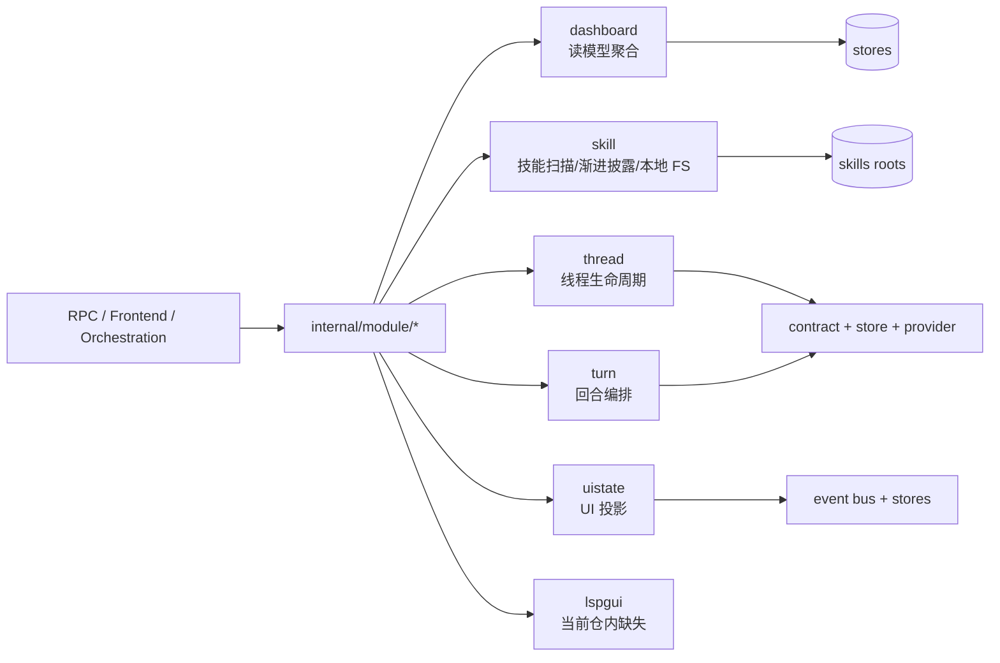

# 07 业务模块层代码地图（拆卷索引）

> 扫描范围：`internal/module/dashboard/`、`skill/`、`thread/`、`turn/`、`uistate/`；`internal/module/lspgui/` 当前在仓内无源码目录。  
> 2026-04-20 起按 **读侧 / 写侧** 拆卷；本页只保留导航、边界与总览，避免单文件继续超过 600 行。

---

## 1. 阅读顺序

| 子卷 | 文件 | 覆盖范围 |
|---|---|---|
| 07A（读侧） | [07-module-read.md](07-module-read.md) | `dashboard` / `lspgui`（现状核对）/ `skill` |
| 07B（写侧） | [07-module-write.md](07-module-write.md) | `thread` / `turn` / `uistate` |

## 2. 本卷边界

- **本卷只讲业务模块层**：RPC handler、Fx 装配、服务编排、UI/前端消费面。
- **第 11 卷承接 prompt / memory 主链**：`internal/module/prompt`、`internal/module/memory` 的内部组装、provider bridge、snapshot 语义仍以第 11 卷为准。
- **lspgui 现状以代码真值为准**：当前仓内不存在 `internal/module/lspgui/`，因此 07A 只保留“历史章节失真”说明，不再虚构文件地图。

## 3. 模块总览

## 4. 模块分工速查

| 模块 | 定位 | 主要消费者 |
|---|---|---|
| `dashboard` | 运维/只读聚合页、日志、DAG、Agent 详情 | Wails/前端、诊断页 |
| `skill` | 本地技能目录、渐进披露、匹配预览、受限命令执行；`Service` 仅保留兼容聚合面 | prompt(`SkillCatalogSource`)、turn(`SkillHydrationSource`)、dashboard(`SkillLister`)、toolbridge(`SkillHostToolReader`)、host RPC |
| `thread` | 线程启动/恢复/fork/归档/配置 | RPC、uistate、turn |
| `turn` | 回合输入组装、启动/打断/强制完成 | RPC、thread、provider |
| `uistate` | UIState / Sidebar / Timeline / Preferences 投影 | Wails 前端 |
| `lspgui` | 历史 GUI-LSP 包；**当前仓内缺失** | — |

## 5. 拆卷说明

- 07A 先把 `dashboard / skill` 按当前代码真值重写，并把 `lspgui` 标注为缺口。
- 07B 预留给 `thread / turn / uistate` 深化；此页仅作为稳定入口，便于 README / 外链继续指向 `07-module.md`。

## 6. 拆卷映射表

| 卷 | 重点章节 | 讲什么 |
|---|---|---|
| [07-module-read.md](07-module-read.md) | §2、§3、§4、§5 | dashboard 查询聚合、`dashboard/prompts` cwd 过滤、`lspgui` 缺席真值、`skill/list` / provider-native mirror / legacy 技能面 |
| [07-module-write.md](07-module-write.md) | §2、§3、§4、§5 | thread 生命周期、turn 输入组装与执行、uistate 投影、blank-thread `sendMessage` 首发顺序 |

## 7. 阅读顺序补充

1. 先读 [07-module-read.md](07-module-read.md) §2，确认 dashboard 真相源与查询分发。
2. 再读 [07-module-read.md](07-module-read.md) §4，确认 skill 目录、`skill/list`、provider-native mirror、legacy RPC 共存面。
3. 需要线程/回合执行链时，转到 [07-module-write.md](07-module-write.md) §2 → §3 → §4。
4. 遇到 blank-thread 首发、聊天页技能边界、前后端接缝问题，最后再读 [07-module-write.md](07-module-write.md) §5，并回看 [01-terminal-ui-react.md](01-terminal-ui-react.md)。

## 8. 跨卷跳转锚点

- 看 dashboard cwd 去 [07-module-read.md](07-module-read.md) §2.4。
- 看 `skill/list` / provider-native mirror 去 [07-module-read.md](07-module-read.md) §4.3、§4.4、§4.5。
- 看 blank-thread `thread/start -> turn/start` 去 [07-module-write.md](07-module-write.md) §5，再回 [01-terminal-ui-react.md](01-terminal-ui-react.md)。
- 看 prompt snapshot / memory 注入为什么不在 07 展开，去 [11-memory.md](11-memory.md) §5.5 B；prompt/thread 入口位见 [11-prompt-thread.md](11-prompt-thread.md)。

## 9. 最近一次重大变更摘要

- **2026-04-17**：07 从单卷改成“稳定索引 + 读侧 / 写侧双卷”，本页不再承载正文。
- **2026-04-20**：07A/07B 按当时代码真值重写，补回 `dashboard/prompts` cwd、`skill/list` / `skill/expand`、`lspgui` 缺席、thread/turn/uistate 真链路。
- **2026-05-18**：Skill V1 切到 provider-native mirror 后，`skill/expand` 已退出 host RPC 注册表，文档改按 canonical/mirror 链路描述。
- **2026-04-29**：接口隔离后，`skill.Service` 是兼容聚合接口；跨模块消费改按 `SkillLister` / `SkillCatalogSource` / `SkillHydrationSource` / `SkillHostToolReader` 等窄端口描述。

## 10. 常见误导

- `07-module.md` 现在只是稳定索引页，**不代表业务模块内容少**；真实正文已进 `07-module-read.md` / `07-module-write.md`。
- `dashboard/prompts` 已不是旧版“简单 page-field wrapper”；真实入口是 ctx 带 `cwd` 后再过滤。
- `skill` 不只剩 legacy `skills/*`；host 侧保留 `skill/list`，provider runtime 走 provider-native mirror，跨模块不要再按完整 `skill.Service` 胖接口理解。
- `lspgui` 在当前仓内并不存在；看到旧文档提它时，一律以 `07-module-read.md` §3 为准。

## 11. 新增符号入口

| 符号 / 主题 | 去哪看 |
|---|---|
| `withDashboardPromptScopeCWD` / `dashboard/prompts` | [07-module-read.md](07-module-read.md) §2.4 |
| `filterDashboardPromptsByCWD` / `scope.cwd:<cwd>` | [07-module-read.md](07-module-read.md) §2.4 |
| `skill/list` | [07-module-read.md](07-module-read.md) §4.3、§4.4 |
| provider-native skill mirror / `skill/expand` 退役边界 | [07-module-read.md](07-module-read.md) §4.3、§4.5 |
| `thread/start` / `turn/start` / blank-thread `sendMessage` | [07-module-write.md](07-module-write.md) §2.4 A、§3.4、§5 |
