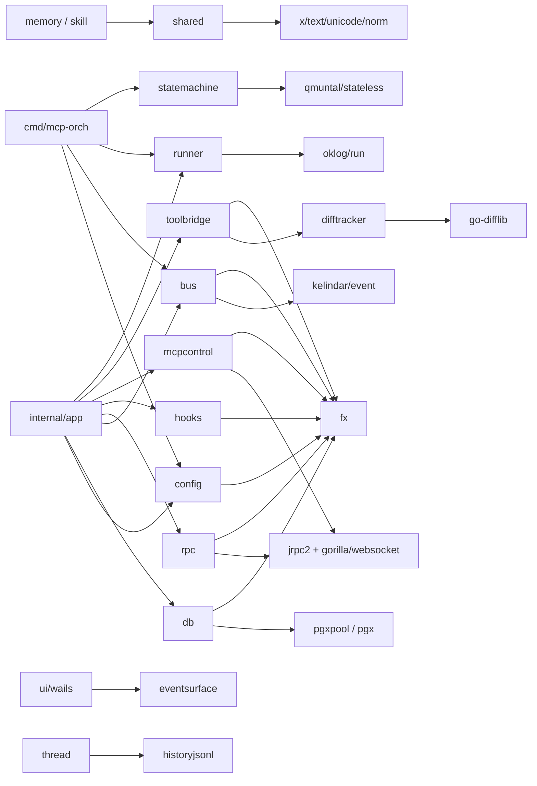

# 08 Platform 基础设施层代码地图

## 1. 边界与现状

- `internal/platform/*` 当前实际有 17 个子包：`bus` / `cachekeepalive` / `config` / `db` / `difftracker` / `eventsurface` / `historyjsonl` / `hooks` / `mcpcontrol` / `pidregistry` / `rlimit` / `rpc` / `runner` / `runtimesafe` / `shared` / `statemachine` / `toolbridge`。
- **不存在**独立的 `log` / `metric` / `time` / `fs` / `env` 子包：
  - `log` 主要落在 `bus.LogSink`、`runtimesafe.SafeGo`，真正 logger 在 `pkg/logger`。
  - `time` / `env` 主要在 `config` + `shared/timeparse.go`。
  - `fs/path` 主要在 `shared` + `difftracker` + `pidregistry`。
  - `metric` 当前没有 platform 级专包。
- LOC 口径：下表均为**非 `_test.go` 的 Go 文件数 / 行数**。
- “薄适配”现状：17 包里 **12 包 ≤600 LOC**；`hooks(1993)` / `rpc(2200)` / `mcpcontrol(2632)` / `toolbridge(1054)` 已是平台协调器，不再是纯 façade；其余大多仍是薄包装或小型工具包。

## 2. 子包矩阵（职责 / 第三方库 / 暴露面 / 薄适配）

| 子包 | 文件/LOC | 职责 | 包装的第三方库 | 暴露给谁 | 薄适配判断 |
|---|---:|---|---|---|---|
| `bus` | 7 / 297 | 进程内 typed event bus、订阅托管、日志镜像 | `kelindar/event`, `fx` | `internal/app`、`cmd/mcp-orch` 装配；`hooks`/`rpc`/`eventsurface`/`mcpcontrol`/`toolbridge`/`memory`/`thread`/`uistate` 经 `*event.Dispatcher` 消费 | **薄 façade**：核心仍是 dispatcher，平台只补 typed emitter / resilient subscribe / sink |
| `cachekeepalive` | 3 / 414 | 监听 agent/thread/turn 事件，给支持 silent keepalive 的 provider 会话保活 | `kelindar/event`, `fx` | 仅 `internal/app` 装配；下游依赖 `contract.SessionResolver`、binding/thread store | **薄适配 + 少量状态**：围绕 timer map 管理 |
| `config` | 3 / 162 | 环境变量读取、默认值、统一 timeout helper、必要时回写 env 供子进程继承 | `fx` | `internal/app`、`cmd/mcp-orch`、`db`/`rpc`/`toolbridge`/providers/shared helper | **纯 façade** |
| `db` | 4 / 405 | 创建 `pgxpool`、自动建库/迁移、事务模板、store error 归一化 | `pgx/v5`, `pgxpool`, `fx` | `internal/app`、`cmd/mcp-orch`；`internal/store/*` 与 `mcpcontrol` 复用错误模型 | **薄适配**：带启动建库/迁移 side effect |
| `difftracker` | 5 / 554 | Git snapshot / diff 生成、文件限制、binary/size guard | `go-difflib/difflib` | 仅 `toolbridge` 使用；不走 fx | **薄适配**：当前已收敛为 git diff 原语包 |
| `eventsurface` | 3 / 593 | 把 bus DTO 事件映射为前端/RPC notification method + payload | `kelindar/event` | `rpc.PushBridge`、`ui/wails.EventBridge` | **薄适配**：厚在协议枚举，不厚在状态 |
| `historyjsonl` | 1 / 210 | 读取 Codex/Claude JSONL 历史，做实时会话失联时的旁路回退 | — | `thread` 模块 fallback 读取历史 | **薄包装** |
| `hooks` | 13 / 1993 | Hook 订阅注册、before/check/after fanout、pending review 持久化与恢复、事件转 hook | `kelindar/event`, `fx` | `internal/app` 装配；向 `mcpcontrol` 暴露 `contract.HookManager` / `HookLifecycle` | **协调器，非纯 façade** |
| `mcpcontrol` | 15 / 2632 | 外部 MCP peer 注册、heartbeat、hook callback、config change 通知、runtime/completion report、stale sweeper | `jrpc2`, `handler`, `kelindar/event`, `fx` | `internal/app` 装配；向外部 MCP peer 暴露 `ctl/*` RPC handler；向内部暴露 `ToolRegistry`/`ToolNotifier`/`PeerCallback` 等 contract | **核心协调器，非纯 façade** |
| `pidregistry` | 1 / 350 | 子进程 PID 文件登记、崩溃后 stale orphan 清理 | — | `internal/app` 通过 `fx.Provide(pidregistry.New)` 注入；provider 进程治理场景复用 | **小型工具包** |
| `rlimit` | 2 / 61 | 进程启动时提升 `RLIMIT_NOFILE`（Windows no-op） | — | 各 `cmd/*/main.go` 通过 side-effect import 使用 | **纯 side-effect façade** |
| `rpc` | 14 / 2200 | jrpc2 server、WS transport、strict handler、approval lifecycle、event push bridge、capability gate | `jrpc2`, `gorilla/websocket`, `kelindar/event`, `fx` | `internal/app` 装配；`dashboard`/`prompt`/`skill`/`thread`/`turn`/`uistate`/`codexapp`/`ui/wails` 都接这个 RPC 面 | **协调器，非纯 façade** |
| `runner` | 2 / 92 | `oklog/run.Group` 包装，统一 ctx/signal/runner actor | `oklog/run`, `fx` | `internal/app`、`cmd/mcp-orch`、`cmd/mcp-lsp`、`cmd/mcp-ida` | **纯 façade** |
| `runtimesafe` | 1 / 53 | 带 `ctx + label + panic recover` 的统一 goroutine launcher | — | `app`、`rpc`、`memory`、`skill`、`thread`、`turn`、providers、`ui/wails` | **纯工具 façade** |
| `shared` | 13 / 742 | path/json/id/retry/search/time/context 校验等横切 helper；平台公共小原语集中地 | `x/text/unicode/norm` | `memory`、`skill`、`turn`、`mcpcontrol`、`rpc`、`hooks`、`provider`、`mcpserver/common`、`cmd/mcp-orch/memory`、`cmd/mcp-lsp/search` | **工具聚合包**：不是单一 façade，但仍偏薄 |
| `statemachine` | 2 / 85 | 对 `stateless` 的配置包装与 `AllowedTriggers` helper | `qmuntal/stateless`, `fx` | 主要被 `cmd/mcp-orch/orchestration` 状态机使用；`internal/app` 仅挂 module 占位 | **纯 façade** |
| `toolbridge` | 6 / 1054 | Codex 动态工具桥接、tools/list+call 代理、diff fallback、HTTP proxy、peer 发现 | `kelindar/event`, `fx` | `internal/app` 装配；`codexapp.ServerManager` / `DriverFactory` 直接接它；下游连 `mcpcontrol` + `difftracker` | **中型协调器** |

## 3. 生命周期：哪些包真的参与 `fx.Lifecycle`

| 子包 | OnStart | OnStop |
|---|---|---|
| `bus` | 无 | 关闭 `LogSink` 与 `event.Dispatcher` |
| `cachekeepalive` | 订阅 `AgentLaunched/StateChanged/TurnCompleted/ThreadStopped` relay | 取消 relay + `Manager.Shutdown()` |
| `db` | `pool.Ping()`，记录 `db pool ready` | `pool.Close()` |
| `hooks` | `RecoverOnStartup()`；启动 bus→hook event relay | 取消 event relay |
| `mcpcontrol` | 注册 config-change 订阅；启动 sweeper | 停止 active leases、取消 config-change 订阅、取消 sweeper ctx |
| `rpc` | 订阅 bus→push bridge；恢复 active approvals 并起 cleanup loop | 取消 push 订阅；等待/清理 pending approvals |
| `toolbridge` | 订阅 diff fallback；启动本地 proxy listener | 取消 diff fallback；关闭 proxy listener |
| 其它 (`config`/`difftracker`/`eventsurface`/`historyjsonl`/`pidregistry`/`rlimit`/`runner`/`runtimesafe`/`shared`/`statemachine`) | **不直接挂 `fx.Hook`** | — |

> 细节：`runner` 虽然有 `Module`，但不挂 `OnStart/OnStop`；真正 runtime 生命周期在 `internal/app/runner.go` 与 `cmd/mcp-orch/runtime.go` 里通过 `platformrunner.RunGroup(...)` 接入。

## 4. “薄适配”原则：哪些真的薄，哪些已经长成协调器

- **纯 façade / 小工具**：`config`、`runner`、`statemachine`、`rlimit`、`runtimesafe`。
- **薄包装但带少量 glue**：`bus`、`db`、`difftracker`、`eventsurface`、`historyjsonl`、`pidregistry`、`cachekeepalive`。
- **工具聚合，不算单一 façade**：`shared`。
- **已成长为平台协调器**：`hooks`、`rpc`、`mcpcontrol`、`toolbridge`。

结论：platform 层仍坚持“**优先包第三方能力，不重写轮子**”，但凡涉及 **跨进程协议、审批恢复、MCP peer 生命周期、tool fanout** 时，代码已从薄适配升级为协调层；文档不能再把这 4 包写成“只是一层 wrapper”。

## 5. 代码锚点（每项都可 grep/xref 复核）

- `bus`：`module.go:10` `var Module`；`bus.go:14` `func NewDispatcher`；`sink.go:21` `func NewLogSink`；xref `internal/app/modules.go:37`、`cmd/mcp-orch/fx.go:35`。
- `cachekeepalive`：`module.go:19` `var Module`；`relay.go:14` `startKeepaliveRelay`；`manager.go:58` `HandleAgentLaunched`；xref `internal/app/modules.go:40`。
- `config`：`module.go:5` `var Module`；`config.go:16` `func New`；`timeouts.go:62` `WithRPCRequestTimeout`；xref `internal/app/modules.go:35`、`cmd/mcp-orch/fx.go:34`。
- `db`：`module.go:25` `func NewPool`；`module.go:197` `registerLifecycle`；`tx.go:26` `WithTx`；xref `internal/app/modules.go:36`、`cmd/mcp-orch/runtime.go:66`。
- `difftracker`：`git_diff.go:14` `BeginSnapshot`；`git_diff.go:44` `EmitGitDiff`；xref `internal/platform/toolbridge/diff_gen.go:22,30`。
- `eventsurface`：`bind.go:72` `Bind`；`legacy.go:18` `ExpandNotifications`；xref `internal/platform/rpc/push.go:59`、`internal/ui/wails/bridge.go:47`。
- `historyjsonl`：`history.go:29` `ReadProviderMessages`；xref `internal/module/thread/lifecycle_helpers.go:343`。
- `hooks`：`module.go:12` `var Module`；`manager.go:52` `NewManager`；`dispatcher.go:59` `NewHookDispatcher`；`resolver.go:51` `NewHookResolver`；xref `internal/app/modules.go:39`。
- `mcpcontrol`：`module.go:19` `var Module`；`registry.go:93` `NewRegistry`；`handlers.go:55` `NewHandlers`；`sweeper.go:43` `NewSweeper`；xref `internal/app/modules.go:41`。
- `pidregistry`：`pidregistry.go:52` `New`；`pidregistry.go:110` `CleanupStale`；xref `internal/app/modules.go:34`。
- `rlimit`：`rlimit_unix.go:11` `init()`；grep import `cmd/agent-terminal/main.go:8`、`cmd/mcp-lsp/main.go:8`、`cmd/mcp-orch/main.go:8`、`cmd/mcp-ida/main.go:7`。
- `rpc`：`module.go:18` `var Module`；`server.go:238` `NewServer`；`push.go:23` `NewPushBridge`；`approval.go:66` `NewApprovalManager`；xref `internal/app/modules.go:38` + 多个 `internal/module/*/rpc.go`。
- `runner`：`group.go:23` `RunGroup`；xref `internal/app/runner.go:52`、`cmd/mcp-orch/runtime.go:238`、`cmd/mcp-lsp/fx.go:213`、`cmd/mcp-ida/fx.go:109`。
- `runtimesafe`：`safego.go:25` `SafeGo`；xref `internal/app/runner.go:51`、`internal/platform/rpc/server.go:337`、`internal/module/memory/team/team_sync_watcher.go:76` 等。
- `shared`：`pathscope.go:12` `ContainsPath`；`project_key.go:25` `ProjectKeyFromCwd`；`jsonutil.go:13` `DecodeInput`；`timeparse.go:10` `ParseRFC3339Loose`；xref 覆盖 `memory` / `skill` / `turn` / `mcpcontrol` / `rpc` / providers / `cmd/mcp-orch/memory`。
- `statemachine`：`factory.go:28` `New`；xref `cmd/mcp-orch/orchestration/launch_helpers.go:116`。
- `toolbridge`：`module.go:25` `var Module`；`handler.go:36` `NewHandler`；`handler.go:51` `HandleToolCall`；`proxy.go:53` `ServeProxy`；xref `internal/app/modules.go:55`、`internal/platform/toolbridge/diff_gen.go:22`。

## 6. Mermaid：上层模块 → platform → 第三方库

## 7. 近期改动（只列与当前代码形态强相关者）

- **2026-04-20 / `7a1f49c`**：`internal/platform/rpc/module.go` 增补 approval restore / cleanup 生命周期，给 `skill/expand` 新接入的 approval cache 生产链兜底。
- **2026-04-18 / `af7f81a`**：新增 `runtimesafe.SafeGo`，`shared.SafeGo` 改为 deprecated wrapper；`rpc.Server`、`memory/team`、`skill/events`、`thread`、`turn` 等后台 goroutine 改走统一安全启动。
- **2026-04-17 / `8172367`**：memory 路径/项目 key helper 收敛，`internal/module/memory/*` 与 `cmd/mcp-orch/memory/path.go` 统一复用 `platform/shared.ContainsPath` / `SanitizeProjectKey` / `ProjectKeyFromCwd`。
- **2026-04-14 ~ 2026-04-12**：`cachekeepalive` 补齐注册后首轮 timer 调度；`difftracker` 收敛成 git snapshot/diff 原语，`toolbridge` 只负责接线和 fallback。

## 8. 读图结论

- platform 不是单一“工具层”，而是 **薄适配 + 协议整形 + 生命周期协调** 三层混合体。
- 真正仍然“很薄”的，是 `config` / `runner` / `statemachine` / `rlimit` / `runtimesafe`。
- 一旦涉及 **MCP peer、approval、hook、tool proxy、RPC push**，对应包已经是运行时骨架，阅读时应按“协调器”而非“helper”理解。
