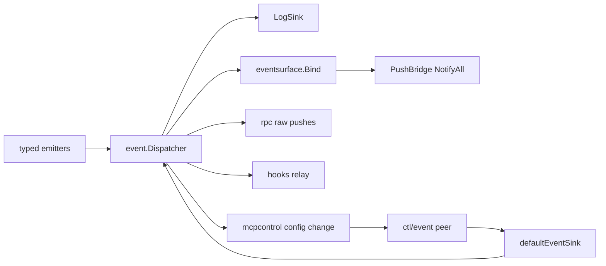

# 08 Platform 基础设施层代码地图

## 1. 模块概述：platform 层设计哲学

`internal/platform/*` 是 super-agent-v3 的基础设施底座，负责把第三方库、进程/连接生命周期、事件传播、RPC 分发、MCP 控制面、状态机与通用工具统一收敛成一组可复用的“薄适配层”。

它的设计特征很明确：

- **薄封装**：尽量直接复用成熟库，而不是重写轮子。典型例子：
  - `bus` 封装 `github.com/kelindar/event`
  - `rpc` 封装 `github.com/creachadair/jrpc2`
  - `statemachine` 封装 `github.com/qmuntal/stateless`
  - `runner` 封装 `github.com/oklog/run`
  - `db` 封装 SQLite `*sql.DB`、迁移、schema 校验与连接生命周期
- **统一生命周期**：大量通过 `fx.Module` 暴露，并在 `OnStart/OnStop` 中做清理、恢复、扫尾。
- **事件优先**：业务状态变化先进入 `bus`，再由 `eventsurface`、`hooks`、`rpc.PushBridge`、`mcpcontrol` 等模块消费。
- **强上下文语义**：超时、取消、线程上下文、审批上下文、Hook 深度、差异追踪上下文都以 `context.Context` 传递。
- **故障自愈/降级**：常见模式包括 panic recovery、丢失订阅者自动清理、审批恢复、MCP stale peer 清扫、PID 僵尸进程清理、diff 提取失败回退到 git diff。
- **面向“桌面主进程 + 外部 MCP 进程 + Provider 会话”三方协作**：这是 platform 层最核心的架构角色。

可以把 platform 层粗分为三组：

1. **基础原语**：`config`、`db`、`shared`、`runner`、`statemachine`、`pidregistry`、`rlimit`、`runtimesafe`
2. **通信/控制基础设施**：`bus`、`eventsurface`、`rpc`、`hooks`、`mcpcontrol`、`toolbridge`
3. **运行时维持 / 旁路数据**：`cachekeepalive`、`difftracker`、`historyjsonl`

---

## 2. 各子包详述

## 2.1 `bus/`：事件总线

**职责**

- 提供进程内 typed event pub/sub
- 为上层模块提供统一事件发布入口
- 管理订阅生命周期与日志镜像

**核心类型**

- `Bus`：对 `*event.Dispatcher` 的注入包装（`bus.go`）
- `ThreadEmitters` / `domainEmitters`：typed emitter 容器（`emitters.go`）
- `Router`：只负责托管订阅 cancel func（`router.go`）
- `Subscription`：批量管理 cancel func（`subscription.go`）
- `LogSink`：订阅已知 DTO 事件并写结构化日志（`sink.go`）

**关键 API**

- `New()` / `NewDispatcher()` / `(*Bus).Dispatcher()`
- `NewThreadEmitters()` / `NewEmitter[T event.Event](dispatcher)`
- `NewRouter(_ *event.Dispatcher)` / `Route[T]()` / `ResilientSubscribe[T]()` / `(*Router).Handle()` / `(*Router).Close()`
- `NewSubscription()` / `(*Subscription).Add()` / `(*Subscription).CancelAll()`
- `NewLogSink(dispatcher, logger)` / `(*LogSink).Close()`

**文件导览**

- `bus.go`：`event.Dispatcher` 注入包装
- `emitters.go`：typed emitter 工厂与 `ThreadEmitters`
- `resilient.go`：订阅回调 panic 保护，防止单个 handler 拉垮总线
- `router.go`：订阅托管器
- `subscription.go`：cancel 聚合器
- `sink.go`：订阅 agent/thread/turn/tool/task/ui DTO 并打日志；高频事件走 `DEBUG`
- `module.go`：fx 装配与 stop 时 `sink.Close()` / `dispatcher.Close()`

**实现要点**

- bus 本身极薄，语义主要来自 `kelindar/event`
- 平台层额外补的是：**typed emitter**、**panic-safe subscribe**、**统一清理**、**日志镜像**
- `Router` 只管理生命周期，不做 topic 路由；`NewRouter(_ *event.Dispatcher)` 的 dispatcher 参数当前只是对齐调用点
- `ResilientSubscribe` 在 handler 边界做 `recover()`，panic 只记日志，不会污染整个 bus
- 测试覆盖了并发 publish、类型隔离、取消订阅、批量清理

---

## 2.2 `config/`：配置与超时策略

**职责**

- 统一读取环境变量配置
- 统一定义平台级 timeout 常量与包装函数
- 在必要时把解析后的关键配置回写到进程环境，供子进程继承

**核心类型**

- `Config`（`config.go`）

**关键 API**

- `New()`
- `WithTimeout()` / `WithTimeoutIfNone()`
- `WithInitialThreadIDTimeout()` / `WithSessionCloseTimeout()`
- `WithDBQueryTimeout()` / `WithRPCRequestTimeout()` / `WithPeerTimeout()`
- timeout 常量：`LaunchTimeout`、`StartupTimeout`、`ShutdownTimeout`、`InitialThreadIDTimeout`、`SessionCloseTimeout`、`HealthCheckPeriod`、`StallDetectDelay`、`DBQueryTimeout`、`RPCRequestTimeout`、`InterruptSettleTimeout`、`AsyncLaunchTimeout`

**文件导览**

- `config.go`：读取 `SUPER_DOLPHIN_SQLITE_PATH`、`GO_AGENT_CTL_RPC_ADDR`（兼容旧名 `RPC_ADDR`）、`LOG_LEVEL`、`PROJECT_ROOT`，并把解析出的 RPC 地址按需回写到进程环境；`DATABASE_URL` / `POSTGRES_CONNECTION_STRING` 不再作为产品 DB 配置源
- `timeouts.go`：统一平台 timeout 常量与 context 包装器
- `module.go`：fx 提供 `*Config`

**实现要点**

- 环境变量完整列表：
  - `SUPER_DOLPHIN_SQLITE_PATH`：显式 SQLite 数据库文件路径；为空时默认 `<SUPER_DOLPHIN_HOME>/super-dolphin.db`
  - `GO_AGENT_CTL_RPC_ADDR`：RPC 地址，默认 `127.0.0.1:8090`
  - `RPC_ADDR`：仅作为 `GO_AGENT_CTL_RPC_ADDR` 为空时的兼容旧名，会打印“2026-06-30 前迁移”的弃用警告
  - `LOG_LEVEL`：默认 `info`
  - `PROJECT_ROOT`：默认 `os.Getwd()`
- `exportRPCAddrIfMissing()` 只有在 `GO_AGENT_CTL_RPC_ADDR` 与 `RPC_ADDR` 都为空时写回 canonical `GO_AGENT_CTL_RPC_ADDR`
- SQLite 路径只通过受信任的内部配置传入主进程 / mcp-orch，不透传给普通 provider/tool 环境
- `WithTimeoutIfNone` 很重要：避免重复覆盖已有 deadline
- 多个子系统（RPC、Hook peer callback、DB、Provider 会话、MCP bootstrap）都复用这里的 timeout 语义

---

## 2.3 `db/`：数据库连接与错误归一化

**职责**

- 提供 SQLite `*sql.DB`
- 统一 store 错误分类
- 提供事务包装器

**核心类型**

- `StoreError`
- `*sql.DB`（产品运行时 SQLite 连接）

**关键 API**

- `NewPool(cfg)`
- `WrapStoreError(err, op, entity)`
- `IsNotFound()` / `IsConflict()` / `IsTimeout()` / `IsUniqueViolation()`
- `WithTx(ctx, pool, fn)`

**文件导览**

- `errors.go`：把底层 pg/ctx 错误归一化成 `ErrNotFound/ErrConflict/ErrTimeout`
- `module.go`：创建 pool、启动时 ping、停止时 close
- `pool.go`：保留历史定位说明；产品运行时不再暴露 `pgxpool.Pool`
- `tx.go`：事务模板

**实现要点**

- store 层与 `mcpcontrol` 的错误映射都依赖这里的 `StoreError`
- `NewPool` 固定 `MaxConns=100`
- `WithTx` 是最薄的一层 begin/rollback/commit 模板，本身不额外包装业务错误

---

## 2.4 `difftracker/`：工具调用差异追踪

**职责**

- 提供 git-backed snapshot/diff 原语，供 `toolbridge` 在工具调用前后提取改动
- 记录调用前工作树状态，并在调用后渲染 unified diff
- 提供“无 snapshot 时直接看当前 working tree”的 fallback diff 能力

**核心类型**

- `Snapshot`
- `DiffResult`
- `DiffEmitter`
- `WorkDirResolver`
- `FileDiff`

**关键 API**

- `BeginSnapshot(ctx, path)`
- `EmitGitDiff(ctx, snapshot)`
- `EmitCurrentGitDiff(ctx, path)`

**文件导览**

- `doc.go`：说明当前包只保留 git snapshot/diff 原语与少量支撑类型，供 `toolbridge` 复用
- `git_diff.go`：拍快照、比较调用前后 working tree，与 `HEAD` 渲染 unified diff
- `git_ops.go`：git root/dirty file/HEAD 内容读取，带 timeout 和 `index.lock` retry
- `resolver.go`：工作目录解析接口
- `types.go`：`Snapshot` / `DiffResult` / 限流常量 / 二进制扩展名黑名单

**实现要点**

- `BeginSnapshot()` 会先找 git root，再记录当前 dirty 文件集与调用前 working tree / `HEAD` 状态
- `EmitGitDiff()` 会重新计算调用后 dirty 路径，对每个受影响文件生成 unified diff，并返回 `affected files`
- `EmitCurrentGitDiff()` 是无前置 snapshot 的兜底路径，供 `diffFallbackTracker.handleToolCallEnd()` 在 bus 侧补发 diff
- 当前主链路是：`toolbridge.Handler.beginToolDiffSnapshot()` -> `difftracker.BeginSnapshot()`；peer callback 返回后由 `toolbridge.Handler.emitToolDiff()` -> `difftracker.EmitGitDiff()`
- 若 Phase 1 未发出 diff，则由 `diffFallbackTracker` 配合 `shouldFallbackDiffTool()` 改走 git diff fallback
- git 模式有安全阈值：`MaxTrackedFiles=200`、单文件 `1MB`、总 diff `5MB`
- fallback 遇到 `ErrNotGitRepository` 视为“当前 cwd 不在 git 仓库”，直接静默退出；其他 git 错误只记 warning
- 测试覆盖了 git root 解析、dirty file 枚举，以及 toolbridge 侧的 Phase 1 / fallback diff 发射

---

## 2.5 `eventsurface/`：事件表面 / 推送协议映射

**职责**

- 把 bus 上的内部 DTO 事件映射成前端/客户端可消费的方法名和 payload
- 为 agent/thread/turn/tool/UI 事件补齐统一 JSON 负载
- 在新协议之外追加 legacy 刷新通知

**核心类型**

- `PublishFunc`
- `Notification`

**关键 API**

- `Bind(dispatcher, logger, publish)`
- `ExpandNotifications(method, payload)`

**文件导览**

- `bind.go`：核心映射，定义 surface method 常量，并订阅 agent/thread/turn/tool/ui 事件
- `bind_payloads.go`：agent 生命周期 payload 组装
- `legacy.go`：在新通知之外追加 `ui/thread/changed`、`ui/sidebar/changed` 兼容刷新事件

**实现要点**

- `Bind()` 覆盖的不只是 thread/turn/tool，也包括 `AgentLaunched/Stopped/Recovering/Failed/RuntimeReported`、`SkillsChanged`、`UIPreferencesChanged`、`UIProjectionUpdated`、`UIThreadPatch`
- `TurnOutputDelta` 会按 `stream` 细分：`message -> item/agentMessage/delta`、`reasoning -> item/reasoning/textDelta`、`stdout -> item/commandExecution/outputDelta`，其他 stream 仍走 `turn/output/delta`
- `ToolApprovalRequested` 会按 `Kind` 路由到 command/fileChange/skill 不同方法名
- `UIProjectionUpdated` 会直接映射到 `ui/thread/changed` 或 `ui/sidebar/changed`
- `UITokensUpdated` 仍会发出兼容性方法 `thread/tokenusage/updated`
- `legacy.go` 会跳过 `ui/thread/patch`、`thread/compacted`、token usage 与 streaming delta 的 legacy refresh；`workspace/run/*` 不发 thread refresh，但会追加 `ui/sidebar/changed`
- 这是 `rpc.PushBridge` 对外推送时最重要的协议整形层

---

## 2.6 `historyjsonl/`：Provider 持久化历史读取

**职责**

- 从 Codex / Claude 的 JSONL 历史文件中恢复消息页
- 在实时 session 不可用时提供持久化历史旁路读取

**核心类型**

- `ReadRequest`

**关键 API**

- `ReadProviderMessages(req)`

**文件导览**

- `history.go`：路径发现、逐行扫描、Codex/Claude 两种 JSONL 格式解析、消息正文抽取、时间解析

**实现要点**

- `ReadRequest.RolloutPath` 非空时会直接绕过自动发现逻辑
- Claude 从 sessionDir / `CLAUDE_CONFIG_DIR` / 兼容 `CLAUDE_HOME`（默认 `~/.claude`）下的 `projects/*/<id>.jsonl` 找文件，候选 ID 顺序是 `SessionUUID -> ProviderThreadID -> ThreadID`
- Codex 从 `~/.codex/sessions/.../rollout-*-<id>.jsonl` 找最新匹配，候选 ID 是 `ProviderThreadID -> ThreadID`
- 只保留 `user/assistant` 且非空消息
- 上层主要由 thread 模块在 session 不可用时做“持久化历史回退读取”

---

## 2.7 `hooks/`：Hook 三阶段拦截系统

**职责**

- 提供 `before / check / after` 三阶段 Hook 订阅、分发、合并、升级（escalate）与 resolve
- 提供从 bus 观察事件到 hook topic 的 observed-after relay
- 管理订阅 lease、连续失败 peer 清理、pending review 持久化

**核心类型**

- `HookRegistry`
- `HookDispatcher`
- `HookResolver`
- `Manager`
- `Subscription`
- `MergeResult[T]`
- `DispatcherOption` / `ManagerOption` / `ResolverOption`

**关键 API**

- Registry：`NewHookRegistry()` / `Subscribe()` / `GetSubscribers()` / `GetSubscribersBySelector()` / `GetSubscription()` / `Unsubscribe()`
- Dispatcher：`NewHookDispatcher(registry, peerCallback, opts...)` / `WithDispatcherParallelism()` / `WithPeerTimeout()` / `DispatchBefore()` / `DispatchCheck()` / `DispatchAfter()`
- Resolver：`NewHookResolver(store, opts...)` / `WithResolverTTL()` / `WithResolverLogger()` / `Escalate()` / `Resolve()` / `ListPendingReviews()` / `CancelByLease()` / `CancelByAgent()` / `SweepExpired()` / `RecoverOnStartup()`
- Manager：`NewManager(registry, dispatcher, resolver, opts...)` / `WithMaxHookDepth()` / `WithManagerLogger()` / `Subscribe()` / `DispatchBefore()` / `DispatchCheck()` / `DispatchAfter()` / `Resolve()` / `GetPendingReviews()` / `ShutdownHooks()`

**文件导览**

- `points.go`：定义平台 hook topic 常量，如 `agent.turn.before`、`agent.tool.after` 等
- `registry.go`：按 lease 存储订阅，请求 hash 幂等、版本递增、scope 过滤
- `dispatcher.go`：并行 fanout、peer timeout、panic recovery、连续失败计数
- `factory.go`：阶段通用模板、selector 构造、决策归一化、丢失订阅者清理
- `merge.go` / `merge_check.go` / `merge_after.go`：三阶段决策合并
- `merge_common.go` / `merge_support.go`：lease 去重、tool set 交并处理
- `resolver.go`：`escalate -> pending review -> resolve` 的持久化闭环
- `manager.go`：把 registry/dispatcher/resolver 组合成对外 `HookManager`
- `event_relay.go`：把总线观察事件映射到 after hooks：`Started -> TopicSessionStart`、`Stopped -> TopicProcessExit`、`StateChanged -> TopicStateChange`、`TurnCompleted -> TopicTurnAfter`、`TurnInterrupted -> TopicTurnFailed`、最终答复 `ItemCompleted -> TopicTurnProgress`
- `module.go`：fx 装配、启动时读回 pending review、注册 event relay

**实现要点**

- `registry.Subscribe()` 用 `subscription_id + requestHash` 做幂等；同 lease 新订阅会递增版本并替换旧订阅
- scope 过滤不是泛泛而谈，而是精确匹配 `agentID/threadID/clientKind/instanceID`
- `prepareDispatch` 会 clone payload、`Depth++`、补 `Topic` 与 `HookCallID`
- dispatcher 默认并发度 `8`、peer callback timeout `2s`；默认最大 Hook 深度 `defaultMaxHookDepth = 3`，用于防递归
- after/escalate pending review 默认 TTL 是 `5m`；`AfterDecision.TTLMs` 优先，其次用 payload `DeadlineMs`，最后才用默认 TTL
- **before 合并优先级**：`deny > wait > modify > allow`；`AllowedTools` 取交集，`DeniedTools` 取并集
- **check 合并优先级**：`abort > warn > continue`
- **after 合并优先级**：`reject > escalate > approve`
- before 阶段若出现局部失败，`Manager` 采取 **fail closed（拒绝）**
- check 阶段即使有局部失败，也只在 `MergeResult` 中保留 `PartialFailure/FailedLeases` 元信息，不额外改写 merged decision
- after 阶段局部失败会保留成功决策；若最终为 `escalate`，则把获胜订阅者 lease 与 TTL 持久化成 pending review
- 连续失败达到阈值（3）会把订阅者视为 lost，并自动 `Unsubscribe + CancelPendingReviewsByLease`
- `RecoverOnStartup()` 负责从 store 读回 pending review 供后续查询/恢复；模块启动时只是记录已恢复数量，不会主动重放审批回调
- 测试覆盖了多订阅者冲突合并、escalate/resolve、scope 过滤、丢失订阅者自动清理、并发 dispatch/shutdown

---

## 2.8 `mcpcontrol/`：MCP 控制平面

**职责**

- 管理外部 MCP tool peer 的注册、心跳、上下文查询、事件/日志上报、审批、hook RPC、报告上报
- 维护租约（lease）、选择器索引、fanout、stale peer 清扫
- 把外部 peer 的控制面输入衔接到 bus、hook、orchestration 等内部系统

**核心类型**

- `ToolRegistry`
- `ToolInstance`
- `LeaseKey`
- `Peer`
- `RegistryOptions`
- `Sweeper` / `SweepResult` / `SweeperOptions`
- `RuntimeReportHandler` / `CompletionReportHandler`
- `HandlerDeps`
- `AgentContextSource` / `ContextProvider` / `EventSink` / `LogSink`

**关键 API**

- Registry：`NewRegistry()` / `NewToolRegistry(opts)` / `Register()` / `Heartbeat()` / `GetInstance()` / `ShutdownInstance()` / `OnDisconnect()` / `FindActiveByKind()` / `IntersectTargets()`
- Notify/Callback：`NotifyBySubscription()` / `NotifyByCapability()` / `NotifyBySelector()` / `NotifyConfigChanged()` / `CallbackBefore()` / `CallbackCheck()` / `CallbackAfter()` / `CallbackHookBefore()` / `CallbackHookCheck()` / `CallbackHookAfter()`
- Sweeper：`NewSweeper(registry, logger)` / `NewSweeperWithOptions(registry, logger, opts)` / `Run()` / `Sweep()`
- RPC handlers：`NewHandlers(deps)`

**文件导览**

- `registry.go`：租约表、索引表、register/heartbeat/shutdown 主流程
- `registry_support.go`：注册请求规范化、lease 校验、report receipt 幂等、索引维护
- `registry_helpers.go`：hook cleanup、config version、active lease 清理辅助
- `fanout.go`：selector 交集求活跃 target、fanout worker、失败计数/驱逐
- `router.go`：`NotifyBySelector()`、`NotifyConfigChanged()`，以及 hook callback 到指定 topic/lease
- `handlers.go`：注册 `ctl/*` RPC 处理器：register、heartbeat、context、event、log、approval、hook、report
- `handlers_hooks.go`：hook subscribe/resolve/pending 的 RPC 封装与“当前 jrpc 连接对应 lease”解析
- `resolution.go`：context payload 组装、按 client kind 查找 active instance
- `report_handlers.go`：runtime/completion report 分发到 orchestration service
- `config_change.go`：监听 bus 的 agent/thread 生命周期事件，提升 `configVersion` 并通知相关 peer
- `peers.go`：`jrpcPeer`，把当前 jrpc2 server 包装成 `Peer`
- `sweeper.go`：heartbeat TTL/stale grace 定时清扫
- `errors.go` / `factory.go`：错误码工厂、通用 handler 适配、hook 错误映射、fanout 执行器
- `module.go`：fx 装配、生命周期注册

**实现要点**

- `ToolRegistry` 同时按 `subscription/capability/agent/thread/clientKind/instance/peerKind` 建索引
- 同一 `InstanceID` 重注册会递增 generation，并驱逐旧连接
- `IntersectTargets` 会优先走最小 bucket，再做 O(1) 交集检查
- `Heartbeat(status=disconnected)` 与 `OnDisconnect()` 都会触发 lease 驱逐与 hook 清理
- `ContextProvider` 默认支持 `agent runtime`、`thread binding`、`workspace run`、`config snapshot` 四类 scope
- `defaultEventSink` 会把 `ctl/event` 事件转成总线内的 `controlEvent`；`defaultLogSink` 则做结构化日志镜像
- report 支持幂等 receipt：相同 `report_id + fingerprint` 直接复用响应；冲突则报错
- 默认 report handler 只接受 `runtime` / `completion`，`progress` / `diagnostic` 当前明确返回 unsupported
- hook RPC 处理器通过 `jrpc2.ServerFromContext(ctx)` 反查“当前连接对应的 lease”
- `config_change.go` 让 MCP peer 拿到 agent/thread 绑定变化，而不需要轮询
- 注册/心跳/清扫默认参数来自源码常量：
  - registry：`HeartbeatInterval=10s`、`NotifyTimeout/SendTimeout=2s`、`FanoutParallelism=8`、`PeerFailureThreshold=3`、`defaultCleanupTimeout=3s`、初始 `configVersion=1`
  - register response：`HeartbeatIntervalMs=10s`、`HeartbeatTimeoutMs=30s`、`SendTimeoutMs=2s`、`SweeperIntervalMs=5s`、`ServerProtocolVersion=dto.ProtocolVersion`
  - heartbeat response：`NextHeartbeatMs=10s`，并返回当前 instance 的 `ConfigVersion`
  - sweeper：`Tick=5s`、`Jitter=1s`、`HeartbeatTTL/Timeout=30s`、`StaleGrace=5s`
  - module stop 清理 active leases 使用 `activeLeaseCleanupTimeout=5s`

---

## 2.9 `pidregistry/`：子进程 PID 注册与孤儿清理

**职责**

- 把 app 派生子进程登记到 `/tmp/super-agent-pids-<appPid>.json`
- 在应用重启时清理死应用实例遗留的子进程
- 提供兼容旧清理逻辑的 stale 文件扫描辅助

**核心类型**

- `Registry`
- `ChildInfo`

**关键 API**

- `New()`
- `Register(pid, kind, meta)` / `Unregister(pid)` / `Close()`
- `CleanupStale()` / `HasStaleFiles()` / `StaleChildCount()` / `StaleAppPIDs()`
- `RegistryFilesMatchingKind(kind)` / `ParsePIDFromFilename(name)`

**文件导览**

- `pidregistry.go`：全部实现都在一个文件里，包含持久化、stale 文件扫描、SIGTERM/SIGKILL 清理、文件名 PID 解析

**实现要点**

- 先批量 `SIGTERM`，统一等待 `orphanKillGrace=3s`，再对存活进程 `SIGKILL`
- `forceKill` 先杀进程组，再杀单 PID
- 文件落盘采用 `tmp + rename` 原子替换
- `codexapp.ServerManager` / `claudecli` 会使用它做 crash-safe 清理

---

## 2.10 `rpc/`：JSON-RPC 框架与推送/审批体系

**职责**

- 提供统一 jrpc2 服务端、handler middleware、WebSocket/TCP transport、客户端推送桥、审批生命周期

**核心类型**

- `Server`
- `PushBridge`
- `ApprovalManager`
- `ApprovalRequest`
- `Middleware`
- `CapabilityResolver`
- `PayloadEncoder`

**关键 API**

- `NewServer(params)` / `(*Server).Register()` / `Run()` / `Dispatch()` / `NotifyAll()` / `OnConnect()` / `OnConnectUI()` / `PeerKind()`
- `Wrap()` / `Logging()` / `Validate()` / `ThreadScope()` / `CapabilityGate()` / `ThreadHandler()` / `CapabilityThreadHandler()` / `StrictHandler()` / `RawHandler()`
- `NewPushBridge(dispatcher, logger)` / `NotifyClient()` / `CallbackClient()`
- `NewApprovalManager(logger, dispatcher)` / `RequestApproval()` / `RequestUserInput()` / `Respond()` / `AutoApprove()` / `RestorePending()` / `Cleanup()` / `PendingSnapshot()`
- `WithApprovalDeadline()` / `WithApprovalAutoDeclineOnCancel()`
- `WSHandler(server, opts)`

**文件导览**

- `server.go`：核心服务端；管理 active peer、`OnConnect` hook、本地 dispatch、请求跟踪与日志
- `transport_ws.go`：WebSocket -> jrpc2 channel 适配；UI peer 通过这里接入
- `handler.go`：middleware 体系；`ThreadScope` 注入 threadId，`CapabilityGate` 做 provider capability 校验
- `strict.go`：严格 object-only typed handler 与 `RawHandler`
- `push.go`：把 bus/eventsurface/provider raw event 桥接成 RPC push
- `approval.go`：审批主状态机（pending 注册、去重、dispatch、wait、finish）
- `approval_support.go`：审批 request 规范化、默认超时、payload 解码、自动批准/自动拒绝逻辑
- `approval_events.go`：审批请求/决议映射成 bus 事件，并维护 callback method catalog
- `approval_lifecycle.go`：过期清理、重连恢复 pending approvals、`PendingSnapshot()`
- `module.go`：fx 装配，注册 grouped handlers、event bridge、approval lifecycle
- `factory.go`：通用工具函数、approval method alias、RPC error 包装
- `codec.go`：统一 success/error payload 包装
- `errors.go` / `errors_helper.go`：平台自定义 RPC 错误码

**实现要点**

- `Server.Run` 监听 TCP，使用 `channel.Line` 接 MCP/tool peer；`WSHandler` 给 UI 用，peer kind 标为 `ui`
- `Server.Dispatch` 允许本地进程内直调 handler，Wails 层会用到
- `prepareServerOptions` 强制 `AllowPush=true`
- `Server` 会维护 active peer 表，并支持 `OnConnect` / `OnConnectUI` 回调；审批恢复就挂在这里
- `rpcRequestTracker` 会记录 pending request，在连接异常退出时打印未完成请求清单
- `baseThreadHandler()` 的默认链路是 `Validate + ThreadScope + extras`；`Logging` 是可选 middleware，不是默认强制项
- 具体执行顺序是 `Validate -> ThreadScope -> extras（例如 CapabilityGate） -> StrictHandler`，其中 `StrictHandler` 是 object-only strict decode 的内层 typed handler
- `CapabilityGate` 通过 `contract.SessionResolver` 反查线程当前 provider session 的 capability set
- `PushBridge` 有两条输入：`eventsurface.Bind()` 生成的 typed surface 事件，以及 `providerdto.BusRawProviderEvent` 的白名单直推；已知 typed method 会被过滤以避免重复推送
- 审批系统支持：
  - 基于 `callID + requestID` 的 pending 去重；同一 pending 的“首个 owner”负责真正 dispatch，后续调用者只等待结果
  - callback method alias 归一化：默认 `approval/request`，`request_user_input` 默认映射到 `item/commandExecution/requestApproval`
  - UI callback 返回值可以是 `bool`、`string` 或 object payload
  - `Respond()` 可按 `callID` 或 `requestID` 收敛 pending；`AutoApprove()` 是快捷封装
  - `approvalPolicy=never` + `request_user_input` 自动批准
  - 无前端/桥接缺失时自动拒绝；可选 `WithApprovalAutoDeclineOnCancel()` 在取消时 fail-closed
  - 可恢复的连接中断不会立刻丢失 pending，而是交给 `RestorePending()` 在 UI 重连后重放
  - `ToolApprovalRequested` / `ToolApprovalResolved` 会通过 bus 发事件

---

## 2.11 `runner/`：并发运行器编排

**职责**

- 用 `oklog/run.Group` 统一运行多个 runner，并处理 ctx 取消与 OS signal

**核心类型**

- `Runner`
- `GroupOptions`

**关键 API**

- `RunGroup(ctx, runners, options)`

**文件导览**

- `group.go`：context actor、signal actor、runner actor 组装；actor panic 保护
- `module.go`：空 fx module，占位用于装配

**实现要点**

- `EnableSignals` 开启时会监听 `SIGINT/SIGTERM`
- 常用于 app、Wails、MCP sidecar 的主循环编排

---

## 2.12 `shared/`：共享基础工具

**职责**

- 提供跨平台层/模块通用的小型纯函数与安全辅助

**文件导览**

- `ctxutil.go`：`NonNilContext`、`CheckCtx`
- `hookutil.go`：`NormalizeSelectorScope`
- `idgen.go`：`NewID(prefix)`
- `jsonutil.go`：JSON decode/clone、selector/hook payload clone、`FilterKeys`、runtime config clone、绝对路径规范化
- `log_error.go`：忽略错误但保留日志
- `pathscope.go`：`NormalizeRelativePath` 与 `ContainsPath`
- `retry.go`：`Retry` / `RetryWithPolicy`，支持指数退避 + jitter + OnRetry
- `safe_go.go`：goroutine panic recovery
- `search.go`：逐行 literal/regex 搜索器
- `timeparse.go`：宽松 RFC3339 解析、历史 metadata 解码、time clone
- `turnutil.go`：远程 turn 输入 URL 检测
- `validation.go`：`FirstNonEmpty`、`FirstTrimmed`、`ClampLimit`、payload string 提取

**实现要点**

- `shared` 是全平台复用频率最高的工具箱
- 很多平台包的“拷贝防变异”语义都依赖 `CloneRawMessage/CloneJSONMap/CloneStrings/CloneSelector/CloneHookPayload`

---

## 2.13 `statemachine/`：状态机薄封装

**职责**

- 把 `stateless` 包装成更贴近项目风格的配置结构
- 允许外部存储状态，而不是内嵌状态字段

**核心类型**

- `Permit`
- `StateConfig`
- `Config`

**关键 API**

- `New(cfg, accessor, mutator)`
- `AllowedTriggers(sm, ctx)`

**文件导览**

- `factory.go`：全部实现；支持 guard、OnEntry、OnExit，使用 `FiringQueued`
- `module.go`：空 fx module

**实现要点**

- 平台包本身不定义业务状态，只定义**状态机搭建方式**
- 真实状态图来自上层 DTO/业务定义，再经这里装配

---

## 2.14 `toolbridge/`：Provider <-> MCP Tool 桥接

> 2026-04-24 debt banner / authoritative pointer：本节描述 `platform/toolbridge` 的稳定职责，不再是 toolbridge 依赖方向的权威记录。`toolbridge` 直连 provider concrete 与业务 store 的 hidden-contract / 依赖反向问题，authoritative 入口是 [`docs/plans/迁移/p22/README.md`](../../plans/迁移/p22/README.md) 与 [`docs/plans/迁移/p22/P4_DependencyDirectionAndHiddenContracts.md`](../../plans/迁移/p22/P4_DependencyDirectionAndHiddenContracts.md)。

**职责**

- 把 Provider（当前主要是 `codexapp`）收到的 tool call / list tools 请求，转发给 MCP tool peer
- 在调用前后挂接 `difftracker`，并在必要时走 ToolCallEnd fallback
- 对外暴露本地 MCP proxy，给 `/mcp/{family}/{agentID}` 提供 `tools/list` / `tools/call`

**核心类型**

- `Handler`
- `ToolCallRequest`
- `ToolCallResult`
- `diffFallbackTracker`
- `HostToolRegistry`

**关键 API**

- `NewHandler(in)`
- `HandleToolCall(ctx, codexapp.RawMessage)`
- `ListToolsForCodex(ctx)`
- `ServeProxy(ln)`

**文件导览**

- `handler.go`：tool call 解析、peer 路由、`beginToolDiffSnapshot()` / `emitToolDiff()`
- `handler_host_tools.go`：memory host tools 列表合并、去重/shadow warning、`callHostTool()`、结果脱敏与 metrics
- `host_tools.go`：`HostToolRegistry` 接口 + `skill_read_section` 保留名称；旧 `SkillReadSectionRegistry` 实现已物理删除，生产 Codex graph 不再接入该工具
- `memory_read_tool.go`：`MemoryReadHostToolRegistry`（memory_read host-direct）
- `memory_write_tool.go`：`MemoryWriteHostToolRegistry` + `CompositeHostToolRegistry`（多 registry 聚合）
- `diff_gen.go`：Phase 1 snapshot 触发条件、`emitToolDiff()`、`shouldTrackDiff()`
- `diff_fallback.go`：`diffFallbackTracker`、`handleToolCallEnd()`、`shouldFallbackDiffTool()`
- `proxy.go`：HTTP JSON-RPC proxy，支持 `initialize` / `notifications/initialized` / `tools/list` / `tools/call`
- `types.go`：请求/响应结构、错误、tool -> clientKind 分类、timeout 常量

**实现要点**

- `decodeToolCallRequest()` 会兼容多种字段别名，并能从嵌套 `item` / `thread` 结构里补出 `name/threadId/callId`
- `classifyTool()` 目前把 7 个 LSP 短名路由到 `ClientKindLSP`，其余走 `ClientKindOrch`
- Codex 生产 host-direct 只保留 memory tools：`routeToolCall()` 顶层 switch 拦截 `memory_read`/`memory_write` → `routeHostOnlyToolCall()`（只走 host，绝不 fallback peer）
- `skill_read_section` 已退出 Codex 动态工具主链；若历史请求仍命中，`routeToolCall()` 顶层 switch 返回不可用结果，不应把它当成当前 skill 读取链路
- `CompositeHostToolRegistry` 聚合当前生产 registry：`MemoryReadHostToolRegistry` + `MemoryWriteHostToolRegistry`
- `routeToolCall()` 对非 host-direct 工具通过 `mcpcontrol.ToolRegistry.FindActiveByKind()` 找活跃 peer；0 个报 `ErrNoPeerAvailable`，多个报 `ErrAmbiguousPeer`
- 对 `tools/call` 的 peer callback 若返回错误，不会上抛 Go error，而是转换成 `ToolCallResult{Success:false}` 返给 Provider
- `ListToolsForCodex()` 先加入 memory host tools，再并发等待 orch / lsp peer 就绪（默认最多 10s、300ms 轮询），同名工具保留先出现者并记录 shadow warning，最后转换成 `codexapp.DynamicToolSchema`
- `tools/call` peer callback 的 timeout 是 `toolCallTimeout = 120s`
- peer 侧 `tools/list` 只取每类 client kind 的第一个活跃 peer；而 peer `tools/call` 则要求同类 peer 唯一；memory host tools 不参与 peer 唯一性判定
- Phase 1 只有 `patch_edit(rename/replace_range)` 会在调用前进入 `beginToolDiffSnapshot()`；`patch_edit` 的 bus 侧 fallback 负责补发未捕获 diff
- `emitToolDiff()` 成功发出 `ToolDiffUpdated` 后会 `MarkSeen(callID)`，避免 fallback 重复补发
- `diffFallbackTracker.handleToolCallEnd()` 会在 `ToolCallEnd` 上检查 `shouldFallbackDiffTool()`，命中时走 `difftracker.EmitCurrentGitDiff()`
- `toolbridge.Module` 会额外装配 `provideHostToolRegistry()`、`provideDiffEmitter()`、`bindCodexHandlers()`、`registerDiffFallbackLifecycle()`、`registerProxyLifecycle()`
- `ServeProxy()` 会校验 family 与 tool 分类一致性；`lookupProxyThreadID()` 则通过 binding store 给 proxy 补 thread 语义

---

## 2.15 `cachekeepalive/`：长会话静默保活

**职责**

- 为支持静默保活的 provider session 定时发送 keepalive turn，避免长 idle 会话被动掉线
- 维护 `sessionUUID -> timer` 映射，并根据 agent/thread 绑定恢复 agent 语义
- 通过 bus 事件把 launched / idle / turn completed / stopped 生命周期接入定时器管理

**核心类型**

- `Manager`
- `KeepaliveCapable`

**关键 API**

- `NewManager(...)`
- `HandleAgentLaunched(ev)`
- `ResetTimerByAgent(agentID)` / `StopTimerByAgent(agentID)`
- `Shutdown()`

**文件导览**

- `manager.go`：timer 注册/重置/停用、binding/thread fallback、`SendKeepalive()` 执行
- `relay.go`：把 `AgentLaunched` / idle `StateChanged` / `TurnCompleted` / `Stopped` 接到 manager
- `module.go`：fx 装配，启动时注册 relay，停止时统一 `Shutdown()`

**实现要点**

- 定时周期固定为 `keepaliveInterval = 55m`
- `HandleAgentLaunched()` 在事件缺少有效 agent 绑定时，会回退到 `threadStore.GetByThreadID()` 恢复 agentID
- 只有“binding 仍存在且未 archived、session 实现了 `SendKeepalive(ctx)`”时才真正发静默保活
- keepalive 成功后会再次 `ResetTimerByAgent()`，失败仅记 warning，不会把主进程拖死

---

## 2.16 `rlimit/`：进程文件句柄上限提升

**职责**

- 通过 blank import 副作用在进程启动早期提升 `RLIMIT_NOFILE`
- 给桌面端与 MCP sidecar 统一提供更高的 fd 上限，降低大量 socket / pipe / watcher 并发下的句柄耗尽风险

**关键入口**

- `init()` -> `raiseLimit()`
- `applyFallbackLimit(rLimit, oldLimit)`

**文件导览**

- `rlimit_unix.go`：非 Windows 平台的实际提额逻辑
- `rlimit_windows.go`：Windows 空实现占位

**实现要点**

- `cmd/agent-terminal`、`cmd/mcp-orch`、`cmd/mcp-lsp`、`cmd/mcp-ida` 都会 blank-import 这个包
- Unix 路径优先把 soft limit 提到 `rLimit.Max`，但会把目标值封顶在 `1048576`
- 若直接提到 max 失败，会依次回退尝试 `250000 / 65535 / 10240 / 4096`
- 结果直接写 `stderr`，便于在最早启动阶段留下诊断痕迹

---

## 2.17 `runtimesafe/`：panic-safe goroutine 入口

**职责**

- 统一封装后台 goroutine 的 panic recovery，避免业务 goroutine 直接崩掉整个主进程
- 把 `ctx + label + panic + stack` 打到 logger，便于后续 grep 与归因

**关键 API**

- `SafeGo(ctx, logger, label, fn)`

**文件导览**

- `safego.go`：全部实现，当前是单文件包

**实现要点**

- `fn == nil` 时直接 no-op；`ctx == nil` 时会回退成 `context.Background()`
- panic 时优先使用调用者传入 logger；若 logger 为空则回退全局 logger
- `label` 设计成短且稳定的 grep 锚点，当前被 `app`、`rpc`、`thread`、`turn`、`claudecli`、`codexapp`、`unified` 等路径广泛使用
- `internal/archtest/safego_guard_test.go` 会强制新 goroutine 走 `runtimesafe.SafeGo(...)`，避免继续扩散到旧 `shared/safe_go.go`

---

## 3. 事件系统：bus 的 pub/sub 机制

platform 的事件链路大致是：

```text
上层模块 emit / event.Publish
  -> bus.Dispatcher
  -> 订阅者：
     - bus.LogSink
     - eventsurface.Bind（DTO -> surface method）
     - rpc.subscribeRawProviderEventPushes（provider raw event -> push 白名单）
     - hooks.startEventRelay
     - mcpcontrol.registerConfigChangeSubscriptions
     - toolbridge diff fallback lifecycle
  -> rpc.PushBridge.NotifyAll / Hook after / MCP config changed / fallback diff / structured logs

MCP peer ctl/event
  -> mcpcontrol.defaultEventSink
  -> bus controlEvent
```

### B17 Mermaid：bus 数据流



补充：图里没展开 `toolbridge` 的 `registerDiffFallbackLifecycle()` 支路；它也是挂在同一个 `event.Dispatcher` 上，消费 `ToolCallEnd` 后再补发 `ToolDiffUpdated`。

### 3.1 发布

- **2026-04-20 / `7a1f49c`**：`internal/platform/rpc/module.go` 增补 approval restore / cleanup 生命周期，给 `skill/expand` 新接入的 approval cache 生产链兜底。
- **2026-04-18 / `af7f81a`**：新增 `runtimesafe.SafeGo`，`shared.SafeGo` 改为 deprecated wrapper；`rpc.Server`、`memory/team`、`skill/events`、`thread`、`turn` 等后台 goroutine 改走统一安全启动。
- **2026-04-17 / `8172367`**：memory 路径/项目 key helper 收敛，`internal/module/memory/*` 与 `cmd/mcp-orch/memory/path.go` 统一复用 `platform/shared.ContainsPath` / `SanitizeProjectKey` / `ProjectKeyFromCwd`。
- **2026-04-14 ~ 2026-04-12**：`cachekeepalive` 补齐注册后首轮 timer 调度；`difftracker` 收敛成 git snapshot/diff 原语，`toolbridge` 只负责接线和 fallback。

## 8. 读图结论

- 基础订阅：`event.Subscribe(dispatcher, handler)`
- 平台推荐订阅：`bus.ResilientSubscribe[T]`
  - 自动 `recover()`
  - 将 panic 记录为日志，不让单个 handler 破坏 bus
- `bus.Route[T]` 只是 `event.Subscribe` 的薄包装；真正负责批量解绑的是 `Router/Subscription`

### 3.3 生命周期管理

- `Subscription` 聚合 cancel func，适合批量解绑
- `Router` 进一步把“处理函数注册”和“统一关闭”组织起来
- `bus.Module` 在 `OnStop` 里关闭 `LogSink` 与 `Dispatcher`

### 3.4 总线上的主要下游

- **`eventsurface`**：内部 DTO -> 对外推送方法
- **`rpc.PushBridge`**：把 `eventsurface` 通知和 provider raw event 白名单广播给 UI/RPC 客户端
- **`hooks.event_relay`**：把 bus 观察事件转成 Hook after topic
- **`mcpcontrol.config_change`**：把 agent/thread 生命周期变化通知到已注册的 MCP peer
- **`toolbridge` diff fallback lifecycle**：在 `ToolCallEnd` 上执行 `handleToolCallEnd()`，必要时补发 git diff fallback
- **`LogSink`**：统一日志落盘

---

## 4. RPC 框架：transport 与 dispatch 设计

## 4.1 Transport 层

### 4.1.1 Tool/MCP peer 传输

- `Server.Run()` 在 `Config.RPCAddr` 上启动 TCP listener
- `acceptLoop()` 使用 `jrpc2/server.NetAccepter(listener, channel.Line)` 接收连接
- `serveConn()` 为每个连接启动一个 jrpc2 server
- 这些连接被标记为 `PeerKindTool`

### 4.1.2 UI 传输

- `WSHandler()` 把 WebSocket 包装为 `wsChannel`（实现 `channel.Channel`）
- 建立连接后创建 jrpc2 server，并把 peer kind 标记为 `ui`
- UI 连接建立后会触发 `Server.notifyConnected()`，从而恢复 pending approvals 等

### 4.1.3 本地直调

- `Server.Dispatch(ctx, method, params)` 基于 `jrpcserver.NewLocal()` 做进程内 dispatch
- 这是 Wails/本地 binding 层的重要桥接点

## 4.2 Dispatch 层

### 4.2.1 Handler 注册

- 每个模块通过 `rpc.HandlerMapResult` 向 fx group `rpc_handlers` 提供 `handler.Map`
- `rpc.Module` 中 `registerAllHandlers()` 把这些 map 合并进 `Server.methods`

### 4.2.2 严格解码与 middleware

- `StrictHandler()`：只接受 object params，且 strict decode
- `RawHandler()`：保留原始 `*jrpc2.Request`
- `ThreadScope()`：从 `threadId/threadID/thread_id` 参数里提取 threadId 注入 context
- `CapabilityGate()`：基于当前线程 session 的 capability 拦截请求
- `ThreadHandler()` / `CapabilityThreadHandler()` 的基础链路来自 `baseThreadHandler()`；执行顺序是 `Validate -> ThreadScope -> extras -> StrictHandler`
- `CapabilityThreadHandler()` 传入的 `CapabilityGate()` 属于 extras，因此会在 `ThreadScope` 已注入 threadId 后、`StrictHandler` typed decode 前执行
- `Logging()` 是可选 middleware，不是默认强制链路的一部分

### 4.2.3 连接管理与请求跟踪

- `Server.active` 跟踪所有活跃 jrpc2 server，并记录 peer kind
- `OnConnect` / `OnConnectUI` 支持注册连接到达 hook；注册时也会立即遍历当前已活跃连接
- `rpcRequestTracker` 记录 pending request；连接异常退出时打印未完成请求元信息
- `prepareServerOptions()` 强制 `AllowPush=true`

## 4.3 Push 与审批

### 4.3.1 Push

- `PushBridge.NotifyClient()` / `CallbackClient()` 封装 jrpc2 push/callback
- `subscribeCoreEventPushes()` = `eventsurface.Bind()` + `subscribeRawProviderEventPushes()`
- typed DTO 事件会先经过 `eventsurface.ExpandNotifications()`，因此除主通知外还可能追加 legacy `ui/thread/changed` / `ui/sidebar/changed`
- provider raw event 会先做 method 归一化和白名单过滤；已知 typed method 会被 `typedPushMethods` 排除，避免重复直推
- `broadcastNotifications()` 最终通过 `Server.NotifyAll()` 广播到所有活跃 peer

### 4.3.2 Approval

- `ApprovalManager.RequestApproval()` 会：
  1. 规范化 `ApprovalRequest` 并应用默认 deadline
  2. 以 `callID + requestID` 注册/复用 pending
  3. 发布 `ToolApprovalRequested` 总线事件
  4. 选择 callback method 并向 UI 发 callback，或走自动决策分支
  5. 等待响应并发布 `ToolApprovalResolved`
- callback method 由 alias catalog 统一归一化：默认 `approval/request`，`request_user_input` 缺省走 `item/commandExecution/requestApproval`
- callback 结果支持 `bool`、`string`、object 三种解码形式
- `Respond()` 可按 `callID` 或 `requestID` 命中 pending；`AutoApprove()` / `RequestUserInput()` 是便捷封装
- 无前端/桥接缺失时会自动拒绝；`approvalPolicy=never` + `request_user_input` 会自动批准
- 可恢复的断线不会立即 fail，而是保留 pending，交给 `RestorePending()` 在 UI 重连时重放
- 生命周期层会在启动时尝试恢复、后台定时清理过期 approval，并在停机时给一个 5s grace 再强制 cleanup

**一句话总结**：`rpc` 包把“连接方式”“handler 编排”“服务端推送”“审批协作”四件事统一到了同一套 jrpc2 基础设施上。

---

## 5. 状态机：`statemachine` 的状态转换设计

`statemachine` 包本身是**通用状态机搭建器**，而不是业务状态定义者。

### 5.1 建模方式

- `Config.Initial`：初始状态
- `StateConfig`：每个状态的定义
  - `Name`
  - `Permits []Permit`
  - `OnEntry/OnExit`
- `Permit`：一条边
  - `Trigger`
  - `Dest`
  - `Guard(ctx, args...)`

### 5.2 运行时设计

- `New(cfg, accessor, mutator)` 使用 **外部状态存储** 构造 `stateless.StateMachine`
- 若未提供 accessor/mutator，会退化为内部局部变量状态
- 使用 `stateless.FiringQueued`，避免 reentrant fire 造成混乱
- `AllowedTriggers()` 提供当前状态可触发 trigger 列表

### 5.3 上层实际用法

在 `cmd/mcp-orch/orchestration/service.go` 中：

- `service.machineCfg` 来自 `agentdto.TransitionDefinitions`
- `newAgentLocked()` 为每个 `agentRuntime` 创建一个状态机
- 状态实际存放在 `agentRuntime.state`
- 平台层只负责“状态机运行框架”，业务层负责“状态图定义与触发时机”

因此，这个包的定位是：**为 orchestration 等上层模块提供一致、可外置状态存储的状态机语义**。

---

## 6. 工具桥接：`toolbridge` 如何连接 MCP tool 和 Provider

当前主要桥接链路发生在 `codexapp` Provider：

```text
Codex session 收到 inbound tool request
  -> codexapp.session.onInboundMessage()
  -> ServerManager.getToolHandler()
  -> toolbridge.Handler.HandleToolCall()
  -> decodeToolCallRequest()
   -> routeToolCall()
        ├─ memory_read/write: routeHostOnlyToolCall() -> callHostTool()
        │   -> MemoryReadHostToolRegistry / MemoryWriteHostToolRegistry
        ├─ skill_read_section: return unavailable (historical/non-production residual)
        ├─ routePrePeerToolCall()
        │   └─ non-host tool continues to peer route
        └─ peer route: classifyTool() -> FindActiveByKind() -> callPeerTool()
  -> beginToolDiffSnapshot() [仅 `patch_edit(rename/replace_range)`]
  -> mcpcontrol.ToolRegistry.FindActiveByKind()
  -> 选中 MCP peer，发起 peer.Callback("tools/call")
  -> adaptMCPResponse()
  -> emitToolDiff() -> difftracker.EmitGitDiff()
  -> emit tooldto.ToolDiffUpdated

未命中 Phase 1 时的补偿链路：
  ToolCallEnd on bus
  -> diffFallbackTracker.handleToolCallEnd()
  -> shouldFallbackDiffTool()
  -> difftracker.EmitCurrentGitDiff()
  -> emit tooldto.ToolDiffUpdated
```

### 6.1 Provider 侧接入点

- `toolbridge.Module` 在 `bindCodexHandlers()` 中调用：
  - `codexapp.ServerManager.SetToolHandler(h.HandleToolCall)`
  - `codexapp.DriverFactory.SetListTools(h.ListToolsForCodex)`
- 同一模块还会通过 `registerProxyLifecycle()` 起一个本地 TCP listener，把 `ServeProxy()` 暴露给外部 `/mcp/{family}/{agentID}` 路径
- `codexapp.session.onInboundMessage()` 遇到 `item/tool/call` / `dynamic_tool_call` / `tool.call.begin` 时，会异步转给 `toolHandler`

### 6.2 MCP tool 侧接入点

- `cmd/mcp-orch/fx.go` 在 bootstrap config 中显式注册：
  - `OnToolsList`
  - `OnToolsCall`
- proxy 模式下，非 host-direct 工具仍然回到 `routeToolCall()` -> `mcpcontrol.ToolRegistry.FindActiveByKind()` -> peer callback 这条路径
- 生产 host-direct 工具只包括 `memory_read`、`memory_write`，由主进程内 `CompositeHostToolRegistry` 执行，不经过 mcp-orch 子进程；其余工具仍面向一组**注册到 mcpcontrol 的外部工具 peer**
- `skill_read_section` 仅保留名称用于历史/错误态拒绝，不再作为 Codex dynamic tools 或 skill 主链路暴露

### 6.2.1 工具路由表

| 工具名 | 执行路径 | 实现位置 |
|--------|---------|----------|
| `memory_read` | host-direct (routeHostOnlyToolCall) | `memory_read_tool.go` |
| `memory_write` | host-direct (routeHostOnlyToolCall) | `memory_write_tool.go` |
| `skill_read_section` | stale-call rejection only; unavailable to Codex production path | `host_tools.go` / `handler.go` |
| `orchestration_*` (5) | peer → mcp-orch | `cmd/mcp-orch/tools/orchestration_tools.go` |
| `task_*` (3) | peer → mcp-orch | `cmd/mcp-orch/tools/task_tools.go` |
| `workspace_*` (5) | peer → mcp-orch | `cmd/mcp-orch/tools/workspace_tools.go` |
| `prompt_*` (2) | peer → mcp-orch | `cmd/mcp-orch/tools/prompt_tools.go` |
| `command_*` (2) | peer → mcp-orch | `cmd/mcp-orch/tools/command_tools.go` |
| `shared_file_*` (2) | peer → mcp-orch | `cmd/mcp-orch/tools/shared_file_tools.go` |
| `lsp_*` (7) | peer → mcp-lsp | `cmd/mcp-lsp/tools/` |

> 注：Claude CLI 通过 proxy HTTP endpoint 进入，所有工具前缀为 `mcp__orch__`（orch family）或 `mcp__lsp__`（lsp family）。memory host tools 虽然前缀是 `mcp__orch__`，但从不经过 mcp-orch 子进程。

### 6.3 路由规则

- `classifyTool(name)` 决定应该找哪类 peer：
  - `lsp_*` 及 7 个 LSP 短名 -> `ClientKindLSP`
  - 其他 -> `ClientKindOrch`
- 非 host-direct 的 `routeToolCall()` peer 路径要求同类活跃 peer 唯一；否则直接 fail fast
- `ListToolsForCodex()` 会先加入 memory host tools，再分别等待 orch / lsp peer 就绪后调 `tools/list`；默认最多等待 10 秒，每 300ms 轮询一次
- peer `tools/list` 当前只使用每类 client kind 的第一个活跃 peer；host-direct 与 peer 同名时保留 host 入口并记录 shadow warning
- `ServeProxy()` 还会校验 URL family 与 tool 归属是否一致，避免把 `orch` tool 误打到 `lsp` family

### 6.4 与 difftracker 的耦合

- Phase 1 先走 `emitToolDiff()`：前提是 `beginToolDiffSnapshot()` 成功拿到 snapshot，且当前调用命中 `patch_edit(rename/replace_range)`
- `emitToolDiff()` 内部调用 `difftracker.EmitGitDiff()`，成功后经 `provideDiffEmitter()` 发布 `ToolDiffUpdated`
- Phase 1 未命中时，不再依赖任何旧 sentinel；而是由 `diffFallbackTracker` + `shouldFallbackDiffTool()` 在 `ToolCallEnd` 后做 git diff fallback
- fallback 覆盖 `patch_edit`；内部改走 `difftracker.EmitCurrentGitDiff()`
- `MarkSeen(callID)` 会在 Phase 1 与 fallback 之间做去重，防止同一次工具调用重复推送 diff

### 6.5 错误语义

- 找不到 peer / peer 歧义时，`toolbridge` 返回 Go error
- 已找到 peer 但 `tools/call` callback 失败时，会返回 `Success=false` 的 `ToolCallResult` 给 Provider，而不是直接上抛异常
- diff 发射是 best-effort：无论是 `emitToolDiff()` 还是 fallback 失败，都只记 warning，不影响主工具结果

**结论**：`toolbridge` 不是通用工具执行器；生产 Codex path 只保留 memory host tools，skills 由 provider-native mirror 让 Claude/Codex 自己发现，不再通过 `skill_read_section` host-direct 动态暴露。

---

## 7. 跨模块依赖：platform 被上层哪些模块使用

## 7.1 应用装配层

- `internal/app/modules.go` 直接装配：
  - `config.Module`
  - `db.Module`
  - `bus.Module`
  - `rpc.Module`
  - `hooks.Module`
  - `cachekeepalive.Module`
  - `mcpcontrol.Module`
  - `runner.Module`
  - `statemachine.Module`
  - `pidregistry.New`
  - `toolbridge.Module`

这说明 platform 层就是 desktop app 的基础底盘。

## 7.2 核心业务模块

- `internal/module/thread`：大量使用 `bus`、`db`、`rpc`、`historyjsonl`、`shared`
- `internal/module/turn`：使用 `config`、`rpc`、`shared`
- `internal/module/uistate`：使用 `bus`、`config`、`db`、`rpc`、`shared`
- `internal/module/skill`：使用 `bus`、`config`、`rpc`、`shared`
- `internal/module/dashboard`：使用 `rpc`、`shared`
- `internal/module/lspgui`：使用 `config`、`rpc`、`shared`

## 7.3 Provider 层

- `internal/provider/codexapp`：依赖 `rpc`、`shared`、`config`、`pidregistry`，并通过 `toolbridge` 注入 tool handler / list tools
- `internal/provider/claudecli`：依赖 `config`、`shared`、`pidregistry`
- `internal/provider/unified`：依赖 `config`、`shared`、`db`

## 7.4 MCP/Sidecar 进程

- `cmd/mcp-orch`：根进程装配依赖 `config`、`bus`、`db`、`runner`；其 orchestration/workspace/store 子包还会用到 `rpc`、`shared`、`statemachine`
- `cmd/mcp-lsp` / `cmd/mcp-ida`：依赖 `config`、`runner`
- `cmd/agent-terminal` / `cmd/mcp-orch` / `cmd/mcp-lsp` / `cmd/mcp-ida` 都会 blank-import `internal/platform/rlimit`

## 7.5 Store 与基础 IO 层

- `internal/store/*` 广泛依赖 `db`
- `internal/ui/wails/*` 依赖 `rpc`、`eventsurface`、`shared`、`config`、`runner`

## 7.6 关键跨模块链路

1. **thread / skill / uistate emit bus events**
   - `bus` -> `eventsurface` -> `rpc.PushBridge` -> UI
2. **bus events -> hooks event relay**
   - 运行态事件 -> Hook after
3. **bus events -> mcpcontrol config change**
   - agent/thread 生命周期变化 -> MCP peer 配置更新通知
4. **codexapp tool calls -> toolbridge -> mcpcontrol registry -> MCP peer**
5. **tool call result -> difftracker -> ToolDiffUpdated -> UI push**
6. **orchestration service -> statemachine**
   - agent runtime state 由平台状态机承载
7. **agent launched / idle / turn completed / stopped -> cachekeepalive**
   - bus 生命周期事件 -> `Manager` timer -> provider `SendKeepalive(ctx)`

---

## 7.7 测试入口 + archtest freeze 映射（13 子包）

| 包 | 测试文件 | 核心 Test* | freeze |
|---|---|---|---|
| `bus` | `bus_test.go` / +2 | `TestPublishSubscribe` / +7 | — |
| `cachekeepalive` | `manager_test.go` | `TestRegisterSchedulesInitialTimer` / +6 | — |
| `config` | `config_test.go` / +1 | `TestNew_PrefersCanonicalRPCAddr` / +5 | — |
| `db` | `agent_provider_binding_migration_test.go` / +1 | `TestBaselineAgentProviderBindingIncludesConflictTargetSupport` / +3 | — |
| `difftracker` | `git_ops_test.go` | `TestFindGitRoot_InGitRepo` / +2 | — |
| `eventsurface` | `bind_test.go` / +1 | `TestBindPublishesExpandedSurface` / +6 | — |
| `hooks` | `merge_test.go` / +14 | `TestMergeBeforePrefersDenyOverAllow` / +58 | — |
| `mcpcontrol` | `handlers_test.go` / +8 | `TestRegistryContextProvider_UsesRequestedAgentSnapshotForRuntimeScope` / +34 | — |
| `pidregistry` | `pidregistry_test.go` | `TestRegistryRegisterAndPersist` / +8 | — |
| `rpc` | `approval_test.go` / +8 | `TestRegisterPendingAssignsUniqueRequestIDForDuplicateCallID` / +41 | — |
| `runtimesafe` | `safego_test.go` | `TestSafeGoRunsFn` / +3 | — |
| `shared` | `retry_test.go` / +7 | `TestRetryWithPolicyCallsOnRetry` / +23 | — |
| `toolbridge` | `handler_test.go` / +2 | `TestToolBridge_FreshSession_ToolCallForward` / +16 | — |

## 7.8 How-to：platform 常见改动落点

| 场景 | 步骤 | 锚点 | 验证 |
|---|---|---|---|
| bus 链 | 1. DTO 2. emit/publish 3. `ResilientSubscribe()` 4. `eventsurface.Bind()` | `ResilientSubscribe` @ `internal/platform/bus/resilient.go` | bus tests / `bind_test.go` |
| push/approval | 1. `HandlerMapResult` 2. `registerAllHandlers()` 3. `bindApprovalLifecycle()` | `bindApprovalLifecycle` @ `internal/platform/rpc/module.go` | `approval_lifecycle_test.go` |
| toolbridge | 1. `handler.go` / `handler_host_tools.go` 2. `provideHostToolRegistry()` 3. `bindCodexHandlers()` 4. `provideDiffEmitter()` / `registerProxyLifecycle()` | `provideHostToolRegistry` / `registerProxyLifecycle` @ `internal/platform/toolbridge/module.go` | `handler_test.go` / `host_tools_test.go` / `phase1_diff_test.go` / `diff_fallback_test.go` |

---

## 8. 总结

platform 层不是单一“工具包”，而是一组彼此协作的基础设施：

- `bus + eventsurface + rpc` 负责**事件传播与对外推送**
- `hooks + mcpcontrol` 负责**外部进程协作与控制面治理**
- `toolbridge + difftracker` 负责**Provider 到 MCP/host tool 的执行桥与改动回流**
- `config + db + shared + runner + statemachine + pidregistry + rlimit + runtimesafe` 负责**基础运行时语义**
- `cachekeepalive + historyjsonl` 负责**长会话维持与 Provider 历史旁路**

如果从项目架构角度看，platform 层承担的是 super-agent-v3 的“内核底座”角色：

- 向上给业务模块提供稳定的基础语义
- 向外给 UI、Provider、MCP sidecar 提供统一接入面
- 向下隔离第三方库与运行时细节

## 审查补遗

- 补全了 `eventsurface` 对 agent 生命周期、`thread/compacted`、UI projection 与 legacy refresh 抑制条件的说明。
- 修正了 Hook 章节里“启动恢复”的语义：`RecoverOnStartup()` 是读回 pending review 供查询/恢复，不是主动重放审批回调；同时补上了 event relay 的精确 topic 映射。
- 补充了 RPC 章节中 push 双通道（typed surface + provider raw whitelist）、approval alias/catalog、断线恢复、停机清理与 `Respond(callID/requestID)` 语义。
- 补充了 `mcpcontrol` 的 selector 交集、context scope、`ctl/event` 入总线、report 幂等与 unsupported variant 说明。
- 补充了 `toolbridge` 的 peer 就绪轮询、`tools/call` 失败返回 `Success=false`、以及 snapshot 触发条件的精确范围。
- 本轮又按源码补全了 `config` 的完整环境变量/默认值、`mcpcontrol` 的注册/心跳/清扫常量、`rpc` 的 middleware 实际执行顺序、`historyjsonl` 的路径发现候选顺序，以及 `toolbridge` 的 `120s` callback timeout。
- 本轮同步清理了 `difftracker/toolbridge` 的旧聚合器口径，改成 `Handler + BeginSnapshot/EmitGitDiff + diffFallbackTracker` 的现状描述。
- 追加了 `cachekeepalive`、`rlimit`、`runtimesafe` 三个漏记子包，以及 §3 的 B17 bus Mermaid 数据流图。
- 追加了 platform 13 子包测试入口 / freeze 表与 3 条 how-to 改动手册。
