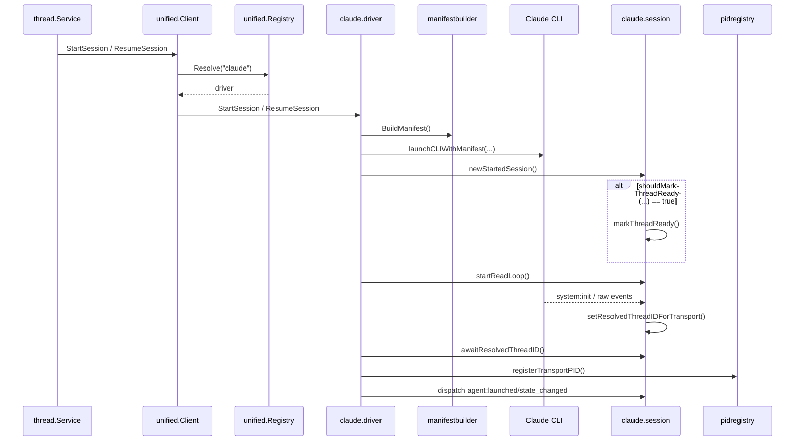
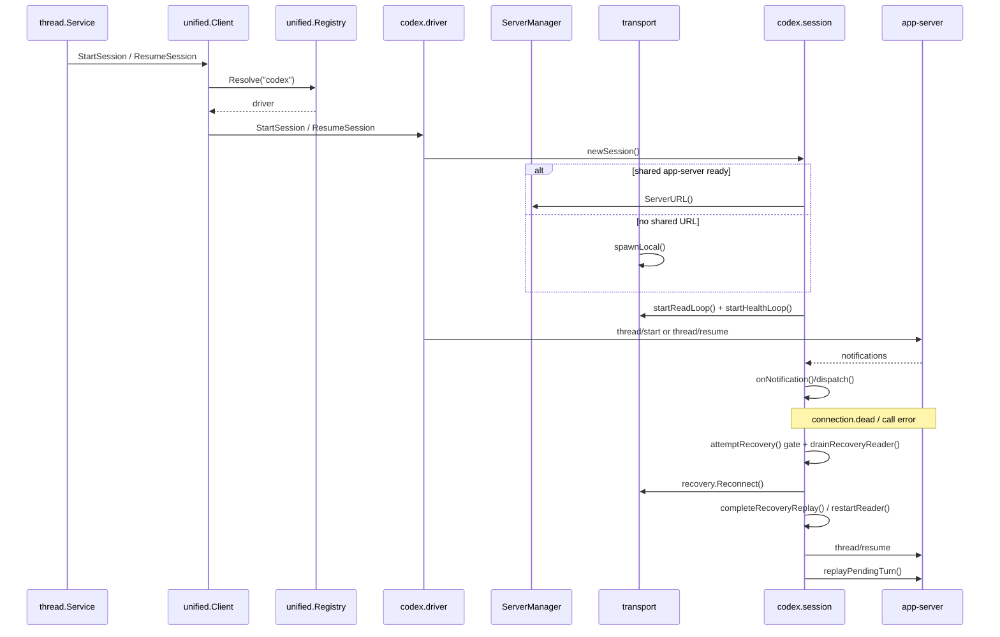
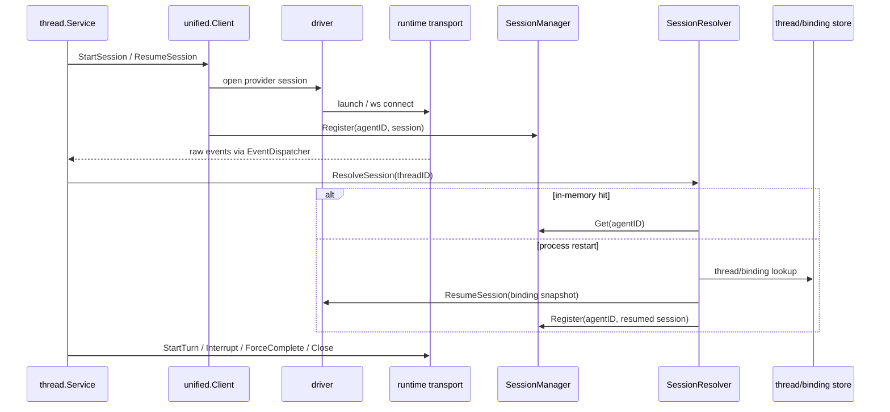

# 09 Provider 集成层代码地图

> 覆盖 `internal/provider/unified/`、`internal/provider/claudecli/`、`internal/provider/codexapp/`。本文所有锚点均为 `grep` 校验后的 **1-based** 行号。

## 0. 结论速记

1. Provider 层不是“两套实现并列”，而是 **统一编排层（contract+unified）→ provider 适配层（claude/codex）→ 运行时桥接层（thread/rpc/prompt/runtime）** 三层。锚点：`internal/provider/unified/module.go:24`、`internal/provider/claudecli/module.go:23`、`internal/provider/codexapp/module.go:24`。
2. **Claude CLI** 是 `1 session = 1 CLI 进程 + stdio stream-json`；启动时可在 public thread 已知时提前 ready，不必死等 `system:init`。锚点：`internal/provider/claudecli/driver.go:160-175`、`internal/provider/claudecli/thread_identity.go:17-19`。
3. **Codex App** 是 `1 session = 1 WS`；底层 app-server 可以由 `ServerManager` 共享，也可以在无共享 URL 时由 session 自起本地 `codex app-server`。锚点：`internal/provider/codexapp/module.go:79-86`、`internal/provider/codexapp/transport.go:39-53`、`internal/provider/codexapp/transport_process.go:217-265`。
4. **SessionResolver** 的实现归 `provider/unified`，但恢复动作最终会回调具体 provider 的 `ResumeSession`；因此它是“统一入口 + provider 落地”。锚点：`internal/provider/unified/session_resolver.go:58-74`、`internal/provider/unified/session_resolver.go:172-222`。
5. **ApprovalResponder** 的契约实现归 `platform/rpc.ApprovalManager`；provider 侧只有 Codex 直接拿 `*rpc.ApprovalManager` 做 outbound approval bridge，Claude 只有 approval policy，没有 approval callback bridge。锚点：`internal/platform/rpc/module.go:25`、`internal/platform/rpc/approval.go:29`、`internal/provider/codexapp/session_approval.go:28-38`。
6. P18.3 / P18.4 提到的 **memory / prompt parity**，当前真正落点在 `StartAssembly / PromptSnapshot -> provider bridge`：thread 层会把 `Boundary / SectionSnapshot / PrefixShape` 等字段克隆进 provider DTO；Claude 物化成 CLI launch config 与 `--system-prompt` block，Codex 物化成 `thread/start|resume` 的 `baseInstructions/developerInstructions`。Codex app-server RPC schema 不暴露原始 `Boundary / SectionSnapshot` 字段，不能把这两项说成 Codex raw provider payload；两边都把 `system-reminder/SystemContext` 改成 **session-start 注入**，不再逐 turn 注入。锚点：`internal/module/thread/start_session.go:142-194`、`internal/module/thread/start_session_helpers.go:308-347`、`internal/dto/provider/session.go:29`、`internal/dto/provider/session.go:41`、`internal/provider/claudecli/session_turn.go:273-283`、`internal/provider/codexapp/session_turn.go:77-94`。

---

## 1. 三层集成架构

### 1.1 三层图

```text
Layer 1 统一编排层
  thread.Service / turn RPC / rpc.CapabilityResolver
    -> unified.Client / SessionManager / SessionResolver / EventDispatcher
    -> contract.Driver / contract.Session

Layer 2 provider 适配层
  claudecli.driver + claudecli.session + claudecli.event_map
  codexapp.driver + codexapp.session + codexapp.event_map

Layer 3 runtime 桥接层
  prompt snapshot / StartAssembly / binding store / thread store
rpc.ApprovalManager / provider-native skill mirrors / toolbridge(dynamic MCP + memory host tools) / pidregistry / ServerManager / local process
```

- `unified.Module` 负责注册 `Registry / Client / SessionManager / SessionResolver / EventDispatcher`，并在 `OnStop` 统一 `CloseAll()`。锚点：`internal/provider/unified/module.go:24`、`internal/provider/unified/session.go:110-127`。
- `EventDispatcher` 的固定顺序是：`BusRawProviderEvent` → 公共 translator → provider translator；UI token 统计不靠 raw-type switch，而是额外调用 `PublishUITokensUpdated()`。锚点：`internal/provider/unified/event_map.go:103-124`、`internal/provider/unified/ui_tokens.go:14-27`。
- thread 层把 prompt assembly 统一压成 provider DTO，再交给 provider。锚点：`internal/module/thread/start_session.go:142-194`、`internal/module/thread/start_session_helpers.go:96-116`。

### 1.2 Claude / Codex 启动模式对照

| 维度 | Claude CLI | Codex App |
|---|---|---|
| 启动入口 | `driver.StartSession/ResumeSession` | `driver.StartSession/ResumeSession` |
| 传输 | stdio `stream-json` | WebSocket JSON-RPC |
| 进程模型 | `launchCLIWithManifest()` 启一个 CLI 子进程 | `newTransport()` 先连共享 URL；无共享 URL 时 `spawnLocal()` |
| 会话 ready | public thread 或 provider thread 已知即可提前 ready；后续 `system:init` 再回填真实 id | `newSession()` 成功建立 WS 后，再 `thread/start` 或 `thread/resume` |
| 会话管理 | `SessionManager.Register()` 以 agentID 管在线 session | 同左；session 内部再自管 `turns/pendingTurn/recovery` |
| 事件入口 | `startReadLoop()` 逐行 decode CLI 输出 | `startReadLoop()` 读 WS，notification 进入 `onNotification()` |

锚点：Claude `internal/provider/claudecli/driver.go:106-175`、`internal/provider/claudecli/transport_config.go:34-55`、`internal/provider/claudecli/transport.go:34-64`；Codex `internal/provider/codexapp/driver.go:162-227`、`internal/provider/codexapp/session.go:63-105`、`internal/provider/codexapp/transport.go:39-53`、`internal/provider/codexapp/transport_process.go:217-265`。

### 1.3 时序图 A：Claude start / resume

```text
thread.Service.startSession / resumeSession
  -> unified.Client.StartSession / ResumeSession
  -> Registry.Resolve("claude")
  -> claude.driver.StartSession / ResumeSession
  -> BuildManifest + launchCLIWithManifest(..., --resume?)
  -> new session(placeholder thread/public thread)
  -> shouldMarkThreadReady()? yes: 提前 ready
  -> startReadLoop()
  -> awaitResolvedThreadID()
  -> dispatch agent:launched + agent:state_changed
  -> EventDispatcher.Dispatch(raw)
  -> common translator + Claude translator
  -> agent/turn/tool/ui DTO
```

关键语义：
- `StartSession` 从 `req.Config` 带 `env/auto_approve/binaryDir` 进 manifest；`ResumeSession` 主要依赖 `ProviderThreadID/ThreadID` 重建 resume id。锚点：`internal/provider/claudecli/driver.go:106-128`、`internal/provider/claudecli/driver.go:130-158`。
- CLI 参数真实会带 `--model`、`--permission-mode`、`--effort`、`--resume`；system prompt 由 base/developer instructions 与 `summary/personality` 元数据拼成。锚点：`internal/provider/claudecli/transport_config.go:102-121`、`internal/provider/claudecli/transport_config.go:139-155`。
- `system:init` 只负责回填真实 session/thread id 与 runtime report；若真实 id 变化，会再补发一次 `agent:launched`。锚点：`internal/provider/claudecli/session_events.go:115-145`。

### 1.4 时序图 B：Codex start / recover

```text
thread.Service.startSession / resumeSession
  -> unified.Client.StartSession / ResumeSession
  -> Registry.Resolve("codex")
  -> codex.driver.StartSession / ResumeSession
  -> newSession() -> newTransport(shared URL or spawnLocal)
  -> startReadLoop() + startHealthLoop()
  -> thread/start or thread/resume
  -> onNotification()/dispatch()
  -> EventDispatcher.Dispatch(raw)
  -> common translator + Codex translator
  -> agent/turn/tool/ui DTO

transport break / health failure
  -> attemptRecovery()
  -> shutdown / generation / mutex / retry-budget gate
  -> drainRecoveryReader()
  -> recovery.Reconnect()
  -> completeRecoveryReplay()
     -> restartReader()
     -> thread/resume
     -> replayPendingTurn()
```

关键语义：
- `dispatch()` 会把 payload 中的 provider `threadId` 改写为 public `agentID`，避免 UI 看到 provider 内部 thread uuid。锚点：`internal/provider/codexapp/session.go:302-325`。
- 恢复链路不是“只重连 WS”：`attemptRecovery()` 先经过关闭、代际、串行和重试预算门禁，drain 旧 reader 后才 `Reconnect()`；随后 `completeRecoveryReplay()` 固定执行 `restartReader -> thread/resume -> replayPendingTurn`。锚点：`internal/provider/codexapp/recovery.go:318-409`、`internal/provider/codexapp/recovery.go:413-440`、`internal/provider/codexapp/recovery.go:464-523`。
- `endReadLoop()` 会注入 synthetic `connection.dead` notification 进入 session。锚点：`internal/provider/codexapp/transport_helpers.go:230-241`。

---

## 2. 统一会话管理与公共事件面

### 2.1 SessionManager / SessionResolver

- `SessionManager.Register()` 以 `agentID` 为 key 保存在线 session；同 agent 重注册时会 `ForceStop()` 旧 session。锚点：`internal/provider/unified/session.go:39-57`。
- `Remove(agentID, generation)` 与 `RemoveCurrent(agentID)` 都会先删 map，再尝试 `Close()`，失败再 `ForceStop()`。锚点：`internal/provider/unified/session.go:80-108`。
- `ResolveSession(threadID)` 依次尝试：`agentID 直查内存` → `threadStore(threadID->agentID)` → `bindingStore(providerThreadID->binding)`；最后由 `autoResumeSession()` 走具体 provider 的 `ResumeSession`。锚点：`internal/provider/unified/session_resolver.go:58-74`、`internal/provider/unified/session_resolver.go:109-167`、`internal/provider/unified/session_resolver.go:172-222`。

### 2.2 公共事件面

- `EventDispatcher.Dispatch()` 先发 `dto.BusRawProviderEvent`，再依次执行 translator。锚点：`internal/provider/unified/event_map.go:103-124`。
- 公共 translator 只处理 warning / error / plan / item，不处理 provider 特有的 session/turn/tool 事件。锚点：`internal/provider/unified/event_map.go:151-216`。
- `PublishUITokensUpdated()` 从 payload `usage/tokenUsage` 抽 token 数，不依赖 provider raw type 名字。锚点：`internal/provider/unified/ui_tokens.go:14-27`。

---

## 3. Provider 四列表

> 说明：Event 映射表只列 provider 专属 translator；公共 `PlanDelta / PlanUpdated / ItemStarted / ItemCompleted / AgentWarning / AgentError / UITokensUpdated` 见上一节。

| Provider | Session 生命周期 | Event 映射表（provider 事件 → 内部 DTO） | 审批通道 | 中断通道 |
|---|---|---|---|---|
| Claude CLI | `StartSession`/`ResumeSession` -> `launchCLIWithManifest` -> placeholder session -> `startReadLoop` -> `awaitResolvedThreadID`。<br>`StartTurn` 前若 transport 不可用、model/effort 改变、manifest 改变，则 `restartIfNeededLocked()` 触发 **重启 CLI + --resume**。<br>`Configure()` 仅支持 model/effort staged override；`Close/ForceStop` 直接结束 CLI。<br>锚点：`internal/provider/claudecli/driver.go:106-175`、`internal/provider/claudecli/session_turn.go:170-199`、`internal/provider/claudecli/session_log_watcher_integration.go:165-181`、`internal/provider/claudecli/session_config.go:17-34`。 | `agent:launched -> AgentLaunched`；`system:init -> AgentRuntimeReported`；`agent:state_changed -> StateChanged`；`agent:stopped -> AgentStopped`；`agent:failed -> AgentFailed`；`turn:started -> TurnStarted`；`turn:input_received -> TurnInputReceived`；`assistant:message_delta -> TurnOutputDelta`；`turn:interrupted -> TurnInterrupted`；`turn:complete -> TurnCompleted`；`tool:use_begin/end -> ToolCallBegin/End`。<br>锚点：`internal/provider/claudecli/event_map.go:25-42`、`internal/provider/claudecli/event_map.go:60-90`、`internal/provider/claudecli/event_map.go:92-138`、`internal/provider/claudecli/event_map.go:140-168`。 | 无 provider->UI 审批回调桥。Claude 只把 `approvalPolicy` 映射成 CLI `--permission-mode`；运行时 `ReadConfig()` 可回报 approvals，但没有 `ApprovalManager` 回调链。<br>锚点：`internal/provider/claudecli/transport_config.go:102-121`、`internal/provider/claudecli/session_config.go:138-159`。 | `Interrupt()` 本地摘走 `activeTurn`，补发 `turn:interrupted`，随后对旧 transport `SIGINT`，最多等 2 秒，不退出则 `SIGKILL`；下一 turn 触发 restart。`ForceComplete()` 先 `SIGINT`，再本地补 `turn:complete{reason=force_complete}`。<br>锚点：`internal/provider/claudecli/session.go:228-278`、`internal/provider/claudecli/session_interrupt_cleanup.go:34-48`、`internal/provider/claudecli/session_config.go:170-197`。 |
| Codex App | `StartSession`/`ResumeSession` 先 `newSession()` 建 WS 与 read/health loop，再 `thread/start` 或 `thread/resume`。<br>`StartTurn` 记 `turns + activeTurnID + pendingTurn`。<br>连接异常时 `attemptRecovery()` 经门禁与旧 reader drain，随后 `Reconnect -> restartReader -> thread/resume -> replayPendingTurn`。<br>`Configure()` 中 model/effort 只存本地 runtimeConfig，在下一次 `turn/start` 带出；personality/approvals 走 slash-config RPC。<br>锚点：`internal/provider/codexapp/driver.go:162-227`、`internal/provider/codexapp/session.go:170-205`、`internal/provider/codexapp/recovery.go:318-409`、`internal/provider/codexapp/recovery.go:413-440`、`internal/provider/codexapp/recovery.go:464-523`、`internal/provider/codexapp/support.go:109-162`。 | `thread/started|session.configured -> AgentLaunched`；`thread/status/changed -> StateChanged`；`shutdown.complete|shutdown_complete -> AgentStopped`；`recovery.attempt -> AgentRecovering`；`connection.dead -> AgentFailed`；`turn/completed|turn.completed|turn/aborted|turn.aborted -> TurnCompleted`；`turn/interrupted|turn.interrupted -> TurnInterrupted`；`turn/started|turn.started -> TurnStarted`；`message.delta/reasoning.delta/exec_output_delta -> TurnOutputDelta`；approval bridge methods -> `ToolApprovalRequested`；`item/tool/call|dynamic_tool_call|tool.call.begin -> ToolCallBegin`；`item/completed|tool.call.end -> ToolCallEnd`；`approval/resolved -> ToolApprovalResolved`；`turn/diff/updated -> ToolDiffUpdated`。<br>锚点：`internal/provider/codexapp/event_map.go:44-66`、`internal/provider/codexapp/event_map.go:114-146`、`internal/provider/codexapp/event_map.go:148-198`、`internal/provider/codexapp/event_map.go:248-302`。 | approval request methods 在 `approvalBridgeMethods` 中集中定义；`onNotification()` 对 approval 事件默认 **不再 dispatch raw**，而是 `handleApprovalRequest()` -> `buildApprovalRequest()` -> `ApprovalManager.RequestApproval/RequestUserInput()` -> `approval/respond`。重复请求按 `callID+requestID` 去重。<br>锚点：`internal/provider/codexapp/factory.go:41`、`internal/provider/codexapp/session_approval.go:28-70`、`internal/provider/codexapp/session_approval.go:148-191`、`internal/provider/codexapp/session_approval.go:222-240`。 | `Interrupt()` 直接发 `turn/interrupt`；`ForceComplete()` 发 `turn/forceComplete` 后本地补 `turn/completed{reason=force_complete}` 并 suppress 后续真实终态；恢复后 `replayPendingTurn()` 会更新同一 `TurnHandle` 的 provider turn id。<br>锚点：`internal/provider/codexapp/session.go:220-243`、`internal/provider/codexapp/session.go:368-385`、`internal/provider/codexapp/recovery.go:464-523`、`internal/provider/codexapp/recovery.go:708-728`。 |

---

## 4. ApprovalResponder / SessionResolver 契约绑定（对齐 04）

| 契约 | 具体实现 / 提供者 | Fx 装配 | 主要消费者 | 与 provider 的绑定关系 |
|---|---|---|---|---|
| `contract.SessionResolver` | `*unified.sessionResolver` | `unified.Module` 提供 `NewSessionResolver`。锚点：`internal/provider/unified/module.go:24`、`internal/provider/unified/session_resolver.go:44-56`。 | `rpc.NewCapabilityResolver`、`turn.NewTurnHandlers`。锚点：`internal/platform/rpc/handler.go:22-40`、`internal/module/turn/rpc.go:10-24`。 | `sessionResolver` 本身不实现 provider 细节；真正恢复时通过 `registry.Resolve(provider)` 调用 `driver.ResumeSession()`，因此间接绑定 `claude/codex` 两个 driver。锚点：`internal/provider/unified/session_resolver.go:172-222`。 |
| `contract.ApprovalResponder` | `*rpc.ApprovalManager` | `rpc.Module` 中显式 `func(m *ApprovalManager) contract.ApprovalResponder { return m }`。锚点：`internal/platform/rpc/module.go:25`、`internal/platform/rpc/approval.go:29`。 | turn RPC `approval/respond`。锚点：`internal/module/turn/rpc.go:10-24`、`internal/module/turn/rpc_helpers.go:249-262`。 | provider 层没有新的实现：Claude 不消费该接口；Codex 直接注入同一个 concrete `*rpc.ApprovalManager` 做 outbound approval bridge，因此它与契约实现是 **同源对象、双入口**。锚点：`internal/provider/codexapp/driver.go:93-121`、`internal/provider/codexapp/session_approval.go:62-70`。 |

可直接按 04 卷理解为两条桥：

```text
unified.NewSessionResolver -> contract.SessionResolver -> rpc.NewCapabilityResolver / turn.NewTurnHandlers
rpc.NewApprovalManager -> contract.ApprovalResponder -> turn approval/respond
rpc.NewApprovalManager -(concrete injection)-> codex provider approval bridge
```

---

## 5. Claude parity / memory prompt mapping 细节

### 5.1 provider bridge 已统一承接 prompt snapshot 与边界字段

- thread 层在 `startSession()` / `resumeSession()` 统一把 `StartAssembly`、`PromptSnapshot` 转成 provider DTO；当前主链会克隆 `Boundary`、`ResolvedSections`、`SectionSnapshot`、`PrefixShape`、`UserContext`、`SystemContext` 等字段，而不是只透传旧核心字段。锚点：`internal/module/thread/start_session.go:142-194`、`internal/module/thread/start_session_helpers.go:308-347`。
- Claude `resolveStartAssembly()` 会补齐 `BaseInstructions / DeveloperInstructions / Snapshot.Provider / Snapshot.Version`，并在有 `Boundary` 时把 runtime context 追加到 snapshot boundary 的 uncached tail；这条链路最终落在 CLI launch config 与 `--system-prompt` block。Codex 的实际 provider payload 是 `thread/start|resume` 参数，里面只携带 materialized `baseInstructions/developerInstructions`，不携带原始 `Boundary / SectionSnapshot` 字段。锚点：`internal/provider/claudecli/config.go:283-325`、`internal/provider/codexapp/support.go:307-320`、`internal/provider/codexapp/driver.go:278-287`。
- Wave 4 provider 契约测试用 checked-in golden 固定 provider carrier：Claude 证据来自真实 driver launch carrier，Codex 证据来自可控 app-server RPC harness 捕获到的 `thread/start` / `thread/resume` materialized payload；原始 `Boundary / SectionSnapshot` 的 provider DTO 证明由 thread 层 contract test 覆盖。锚点：`internal/provider/contracttest/evidence.go:31-39`、`internal/provider/contracttest/suite.go:85-91`、`internal/provider/codexapp/provider_contract_test.go:198-243`、`internal/provider/claudecli/provider_contract_test.go:188-235`、`internal/module/thread/start_session_guard_test.go:518`。

### 5.2 Claude parity 的当前物化方式

- Claude provider 代码本身支持 boundary：若 snapshot 携带 `CachedPrefix / UncachedTail`，`transport_config.go` 会拆成多个 `--system-prompt` block。锚点：`internal/provider/claudecli/transport_config.go:139-162`。
- thread 主链已经把 `Boundary / SectionSnapshot` 从 contract snapshot 克隆进 provider DTO；Claude 再按 CLI block 物化。Codex 与 Claude transport 不同：Codex raw JSON-RPC 参数不暴露 `Boundary / SectionSnapshot` 字段，只暴露物化后的 `baseInstructions/developerInstructions`。因此 Codex prompt parity 只能证明 provider payload 的物化内容，raw boundary 字段要看 thread->provider DTO 测试。锚点：`internal/module/thread/start_session_helpers.go:308-347`、`internal/provider/claudecli/provider_contract_test.go:103-113`、`internal/provider/codexapp/provider_contract_test.go:81-92`。

### 5.3 per-turn 注入已收口到 session-start carrier

- Claude turn 侧注释已明确：`system-reminder(currentDate/runtimeExtras)` 与 `SystemContext(git status)` 改为 session start 注入，不再每轮重复附带。锚点：`internal/provider/claudecli/session_turn.go:273-283`。
- Codex turn 侧同样注明这些内容改由 `baseInstructions in thread/start` 注入。锚点：`internal/provider/codexapp/session_turn.go:77-94`。
- 这正是 P18.3 / P18.4 memory/prompt parity 在 provider 层的现状：**统一 carrier、不同物化方式**。

### 5.4 仍需记住的 provider 差异

- Claude 仍是“CLI manifest + `--resume` + stdio event decode”；memory/prompt parity 不改变其 transport 模型。锚点：`internal/provider/claudecli/transport_config.go:34-55`。
- Codex 的 dynamic tools 由 app-server 自己暴露给模型，源码注释明确 **不再把工具目录重复塞进 `developerInstructions`**。锚点：`internal/provider/codexapp/support.go:365-370`。
- Codex model/effort 也没有 `thread/config/set` RPC；它们保存在 runtimeConfig，并在下一次 `turn/start` 带出。锚点：`internal/provider/codexapp/support.go:124-132`、`internal/provider/codexapp/session.go:175-188`。

---

## 6. 新增 provider 如何接入

从 `internal/provider/_template` 复制脚手架开始，而不是手写一套相似但缺契约的 provider：

1. **注册统一入口**：新包暴露 `Module`，用 `fx.Annotate(NewDriverFactory, fx.ResultTags(\`group:"drivers"\`))` 注册 `contract.DriverFactory`，并显式 `fx.Invoke(RegisterEventTranslators)`。如果 provider 支持 dream executor，再单独注册到 `group:"dream_executors"`。参考锚点：`internal/provider/_template/module.go.txt`、`internal/provider/claudecli/module.go:23-31`、`internal/provider/codexapp/module.go:24-36`。
2. **声明生产依赖契约**：`driverFactoryParams` 必须把 runtime reporter、toolbridge/proxy、provider mirror、session recovery、dependency profile 作为可见依赖面；`NewDriverFactory` 先调用 `ValidateProviderDependencies`，production 缺关键依赖要 fail-fast，desktop/test 允许的缺省必须通过 typed dependency outcome 表达。参考锚点：`internal/provider/_template/module.go.txt`、`internal/app/dependency_contract_test.go:12-72`、`internal/app/modules_graph_test.go:193-251`。
3. **实现 session 闭环**：至少实现 `StartSession / ResumeSession / StartTurn / Interrupt / ForceComplete / Close / ForceStop / ThreadID / Capabilities / RuntimeConfigSnapshot`；区分 public thread id 与 provider thread id，并决定恢复策略（CLI resume、WS reconnect、HTTP reconnect 等）。参考锚点：`internal/contract/provider.go:10-48`、`internal/provider/claudecli/session.go:99-327`、`internal/provider/codexapp/session.go:170-325`。
4. **声明 NativeTools 治理**：provider-native 工具必须通过 `DriverFactory.NativeTools` 暴露 ID、provider、filter mode 和默认禁用策略，不能绕过项目文件工具、命令治理和 toolbridge。参考锚点：`internal/provider/_template/module.go.txt`、`internal/provider/claudecli/module.go:39-89`、`internal/provider/codexapp/driver.go:135-160`。
5. **实现 event translation 与 prompt parity**：provider transport 只负责吐 raw event；统一 `EventDispatcher` 负责公共 translator，provider 自己补 `translateXxxEvent()`。prompt parity 必须用 `contracttest.LoadExpectedPromptSnapshot()` 对比 checked-in golden，且证据要来自真实 provider carrier 或 thread->provider DTO；如果 provider RPC 不暴露原始 `Boundary / SectionSnapshot`，只能证明 materialized payload，不能把 request echo 当作 raw provider payload。参考锚点：`internal/provider/unified/event_map.go:103-124`、`internal/provider/contracttest/snapshot.go:17-57`、`internal/provider/claudecli/provider_contract_test.go:93-113`、`internal/provider/codexapp/provider_contract_test.go:71-92`。
6. **跑标准验收**：新增 provider 必须先通过 `contracttest.Run`，覆盖 event translation、prompt parity、approval 或 approval policy、interrupt、force-complete、resume identity、toolbridge/proxy、runtime report。脚手架和清单守卫由 `internal/provider/provider_template_compile_test.go` 与 `internal/provider/provider_contract_manifest_test.go` 固定。

最小命令：

```bash
./scripts/test_with_guard.sh ./internal/provider -run 'TestProviderTemplateSnippetsCompile|TestProviderPackagesHaveContractTests' -count=1
./scripts/test_with_guard.sh ./internal/app ./internal/provider/contracttest ./internal/provider/codexapp ./internal/provider/claudecli ./internal/provider -run 'ProviderScaffoldProductionGraphRequiresCriticalDependencies|ProviderContract|TestProviderPackagesHaveContractTests' -count=1
make codemap-check
make project-map-check
```

---

## 7. 本次校正的旧文档误差

1. 旧文档写 Claude “当前不会传 `--model`”；代码实际会在 `buildCLIArgs()` 中追加 `--model`。锚点：`internal/provider/claudecli/transport_config.go:109`。
2. 旧文档写 Claude 会把 `approval_policy / sandbox / effort` 作为 `--system-prompt` 元数据拼进去；代码实际只拼 `summary / personality`，权限与 effort 走独立 flag。锚点：`internal/provider/claudecli/transport_config.go:111-112`、`internal/provider/claudecli/transport_config.go:144-145`。
3. 旧文档写 Codex 会把 dynamic tools 文本再注入 `DeveloperInstructions`；代码注释明确“不再重复塞进 developerInstructions”。锚点：`internal/provider/codexapp/support.go:365-370`。
4. 旧文档写 Codex `Configure()` 走 `thread/config/set`；代码实际注明 app-server **没有** 这个 RPC，model/effort 只存本地 runtimeConfig。锚点：`internal/provider/codexapp/support.go:124-132`。
5. P18.4 cache boundary 的 provider DTO 主链已经克隆 `Boundary / SectionSnapshot`，Claude adapter 也能把 boundary 拆成 CLI prompt block；但 Codex app-server RPC 不暴露原始 boundary 字段，只消费物化后的 `baseInstructions/developerInstructions`。因此“boundary 全链路生效”应限定为 DTO clone + provider-specific materialization，不能夸大成所有 provider transport 都有 raw boundary 字段。锚点：`internal/dto/provider/session.go:29`、`internal/dto/provider/session.go:41`、`internal/module/thread/start_session_helpers.go:308-347`。

---

## 8. Mermaid 补图：启动与 Session 生命周期

### 8.1 Claude start / resume 时序



- 主链入口是 `driver.start()`，只做四件事：`prepareSessionStart()`、`newStartedSession()`、`awaitStartedSession()`、`dispatchStartEvents()`。锚点：`internal/provider/claudecli/driver.go:160-175`。
- `StartSession` 与 `ResumeSession` 的差异不在 `start()` 本身，而在 `startSpec` 的填充：前者从 `req.Config` 组装 manifest 与 launch config，后者从 `PromptSnapshot + ProviderThreadID/ThreadID` 重建 resume 参数。锚点：`internal/provider/claudecli/driver.go:106-128`、`internal/provider/claudecli/driver.go:130-158`。
- 线程 ready 不必等 `system:init`：`shouldMarkThreadReady(specThreadID, publicThreadID)` 只要“spec 不是 placeholder”或“public thread 已不是 placeholder”就会提前 ready。锚点：`internal/provider/claudecli/thread_identity.go:17-19`。
- 真正的 provider session id / thread id 回填在 `handleSystemInitRaw()`：若新旧 id 改变，还会补发一次 `agent:launched`，让 UI/绑定层看到真实 thread。锚点：`internal/provider/claudecli/session_events.go:115-145`。

### 8.2 Codex start / recover 时序



- `newSession()` 负责建立 transport、构造 `session`、启动 read loop 与 health loop；driver 只做 runtimeConfig 初始化和 `thread/start|resume`。锚点：`internal/provider/codexapp/session.go:63-105`、`internal/provider/codexapp/driver.go:162-227`。
- `attemptRecovery()` 不是“重连一下就完”，而是 `gate -> drainRecoveryReader -> Reconnect -> completeRecoveryReplay(restartReader -> resumeThreadAfterRecovery -> replayPendingTurn)` 的完整恢复链。锚点：`internal/provider/codexapp/recovery.go:318-409`、`internal/provider/codexapp/recovery.go:413-440`、`internal/provider/codexapp/recovery.go:464-523`。
- `dispatch()` 会把 payload 里的 provider `threadId` 改写成 public `agentID`，这正是 UI 不生成重复 agent 节点的关键。锚点：`internal/provider/codexapp/session.go:302-325`。

### 8.3 Session 生命周期（B17 §3.2）



- 统一视角下，session 生命周期只有三段：**创建/恢复**、**在线复用**、**失内存后 auto-resume**。锚点：`internal/provider/unified/client.go:30-68`、`internal/provider/unified/session.go:39-127`、`internal/provider/unified/session_resolver.go:58-74`、`internal/provider/unified/session_resolver.go:172-222`。
- `SessionManager` 用 generation 防止旧 session 的异步清理误删新 session；`Remove(agentID, generation)` 只会移除匹配代际的 entry。锚点：`internal/provider/unified/session.go:24-27`、`internal/provider/unified/session.go:39-57`、`internal/provider/unified/session.go:80-108`。

---

## 9. `provider/unified` 深描：统一入口、统一回收、统一事件面

### 9.1 文件地图

| 文件 | 角色 | 锚点 |
|---|---|---|
| `module.go` | Fx 根装配：提供 `EventDispatcher / Registry / Client / SessionManager / SessionResolver / dreamExecutor`，并注册 `OnStop -> CloseAll()` | `internal/provider/unified/module.go:24-37`、`internal/provider/unified/module.go:43-53` |
| `registry.go` | 按 `group:"drivers"` 收编 provider factory，统一做 provider name normalize 与 `Resolve()` | `internal/provider/unified/registry.go:11-25`、`internal/provider/unified/registry.go:27-40` |
| `client.go` | `StartSession / ResumeSession` 的统一入口；成功后自动 `SessionManager.Register(agentID, session)` | `internal/provider/unified/client.go:13-27`、`internal/provider/unified/client.go:30-68` |
| `session.go` | 在线 session map、generation、replace old session、remove/close/fallback force stop | `internal/provider/unified/session.go:17-27`、`internal/provider/unified/session.go:39-57`、`internal/provider/unified/session.go:80-127` |
| `session_adapter.go` | 把 `SessionManager` 适配成 `thread.SessionProvider / turn.SessionProvider / contract.OrchestrationSessionCleaner` | `internal/provider/unified/session_adapter.go:8-27`、`internal/provider/unified/session_adapter.go:29-59` |
| `session_resolver.go` | `threadID -> session` 的统一解析与 auto-resume 主链 | `internal/provider/unified/session_resolver.go:35-56`、`internal/provider/unified/session_resolver.go:58-74`、`internal/provider/unified/session_resolver.go:172-222` |
| `event_map.go` | typed publisher 注册表、translator 注册、raw dispatch、公用 warning/error/plan/item 翻译 | `internal/provider/unified/event_map.go:28-69`、`internal/provider/unified/event_map.go:91-124`、`internal/provider/unified/event_map.go:151-217` |
| `ui_tokens.go` | 抽取 token usage 并补发 `UITokensUpdated` | `internal/provider/unified/ui_tokens.go:14-27` |
| `dream_executor.go` | 聚合 provider 侧 `DreamExecutorProvider`，按 provider 顺序 failover 执行 | `internal/provider/unified/dream_executor.go:13-32`、`internal/provider/unified/dream_executor.go:34-61` |

### 9.2 关键类型

- `Registry`：只认 `contract.DriverFactory`，不关心 driver 的内部 transport；因此 unified 自己不携带 Claude/Codex 的实现分支。锚点：`internal/provider/unified/registry.go:11-40`。
- `Client`：provider 启动入口，统一日志与 `SessionManager.Register()` 都在这里。锚点：`internal/provider/unified/client.go:13-27`、`internal/provider/unified/client.go:48-68`。
- `SessionManager`：只负责“在线 session 生命周期”，不负责 durable lookup。锚点：`internal/provider/unified/session.go:17-27`、`internal/provider/unified/session.go:129-189`。
- `sessionResolver`：bridge 点在于“先试内存、再试 thread store、再试 binding store、最后 `driver.ResumeSession()`”。锚点：`internal/provider/unified/session_resolver.go:76-97`、`internal/provider/unified/session_resolver.go:109-167`、`internal/provider/unified/session_resolver.go:172-222`。
- `EventDispatcher`：唯一的 raw event fan-out 面；provider translator 一律挂在这里，不直接向 bus 发 typed event。锚点：`internal/provider/unified/event_map.go:72-124`。
- `sessionProviderAdapter / sessionCleanerAdapter`：把 provider 生命周期向 thread/turn/orchestration 暴露成最小接口，避免业务层依赖完整 `SessionManager`。锚点：`internal/provider/unified/session_adapter.go:8-59`。

### 9.3 关键流程

#### 9.3.1 Start/Resume 统一入口

1. `thread.Service` 调用 `SessionStarter`，实际落到 `unified.Client`。锚点：`internal/provider/unified/module.go:28-33`、`internal/module/thread/start_session.go:152-165`。
2. `Client.open()` 先 `registry.Resolve(provider)`，再执行 `driver.StartSession/ResumeSession`。锚点：`internal/provider/unified/client.go:48-68`、`internal/provider/unified/registry.go:27-40`。
3. 启动成功后，`SessionManager.Register(agentID, session)` 写在线表，并在重注册时 `ForceStop()` 旧 session。锚点：`internal/provider/unified/session.go:39-57`。

#### 9.3.2 ResolveSession 统一恢复链

1. `ResolveSession(threadID)` 先假定调用方传的是 public `agentID`，直接查 `sessions.Get()`。锚点：`internal/provider/unified/session_resolver.go:58-80`。
2. 若 miss，则用 `threadStore.GetByThreadID()` 把 public thread 还原成 agent 绑定；若仍 miss，则遍历 provider 名，用 `bindingStore.GetByProviderThread()` 反查。锚点：`internal/provider/unified/session_resolver.go:84-97`、`internal/provider/unified/session_resolver.go:109-167`。
3. 真正的恢复动作在 `autoResumeSession()`：组装 `dto.ResumeSessionRequest`，再回调对应 provider driver 的 `ResumeSession()`。锚点：`internal/provider/unified/session_resolver.go:172-222`。

#### 9.3.3 Raw event 统一派发

1. `EventDispatcher.Dispatch(raw)` 先发 `dto.BusRawProviderEvent`，再调用 translator 列表。锚点：`internal/provider/unified/event_map.go:103-124`。
2. translator 默认第一个总是 `translateCommonRawEvent`，所以 provider 不必重复翻 warning/error/plan/item。锚点：`internal/provider/unified/event_map.go:79-88`、`internal/provider/unified/event_map.go:151-217`。
3. provider 自己只需 `dispatcher.Register(translateClaudeEvent)` 或 `dispatcher.Register(translateCodexEvent)`。锚点：`internal/provider/claudecli/event_map.go:18-23`、`internal/provider/codexapp/event_map.go:20-24`。

#### 9.3.4 UI token 统一补丁

- `PublishUITokensUpdated()` 专门做 token usage 归一化；这也是 Claude 的 `tokens:log_watcher` 与 Codex 的 `thread/tokenUsage/updated` 能共用 UI token surface 的原因。锚点：`internal/provider/unified/ui_tokens.go:14-27`。
- 这一步发生在 provider translator 的最前面：Claude `translateClaudeEvent()`、Codex `translateCodexEvent()` 都先调用它。锚点：`internal/provider/claudecli/event_map.go:25-27`、`internal/provider/codexapp/event_map.go:44-48`。

---

## 10. `provider/claudecli` 深描：CLI 进程、placeholder thread、重启式配置生效

### 10.1 文件地图

| 分组 | 文件 | 作用 | 锚点 |
|---|---|---|---|
| 装配 | `module.go` | 提供 Claude driver factory、dream executor provider、skill mirror reconciler 注入，并注册 translator | `internal/provider/claudecli/module.go:14-31` |
| 启动 | `driver.go` | `StartSession / ResumeSession / start()` 主链，`startSpec`、PID 注册、首发 launch/state 事件都在这里 | `internal/provider/claudecli/driver.go:27-79`、`internal/provider/claudecli/driver.go:106-175`、`internal/provider/claudecli/driver.go:221-292` |
| 启动归一 | `config.go` | `configFromMap()`、`resolveStartAssembly()`、`normalizePromptSnapshot()`、`fallbackThreadID()` | `internal/provider/claudecli/config.go:41-69`、`internal/provider/claudecli/config.go:71-90`、`internal/provider/claudecli/config.go:116-124` |
| CLI 参数/MCP | `transport_config.go` | `launchCLIWithManifest()`、`buildCLIArgs()`、`composeLaunchSystemPromptBlocks()`、`writeManifestConfig()` | `internal/provider/claudecli/transport_config.go:34-55`、`internal/provider/claudecli/transport_config.go:102-121`、`internal/provider/claudecli/transport_config.go:139-162`、`internal/provider/claudecli/transport_config.go:280-306` |
| 传输 | `transport.go` | 启 CLI 子进程并建立 stdio read/write | `internal/provider/claudecli/transport.go:22`、`internal/provider/claudecli/transport.go:34-64` |
| thread 身份 | `thread_identity.go` | placeholder/public thread 判定、`awaitResolvedThreadID()`、ready channel 语义 | `internal/provider/claudecli/thread_identity.go:11-19`、`internal/provider/claudecli/thread_identity.go:30-50`、`internal/provider/claudecli/thread_identity.go:95-158` |
| session 核心 | `session.go` | session 状态、`StartTurn / Interrupt / stop()`、runtime config snapshot | `internal/provider/claudecli/session.go:19-59`、`internal/provider/claudecli/session.go:117-167`、`internal/provider/claudecli/session.go:170-278`、`internal/provider/claudecli/session.go:288-347` |
| turn 发送 | `session_turn.go` | 组 turn payload、skill block、重试、attachment 渲染 | `internal/provider/claudecli/session_turn.go:24-28`、`internal/provider/claudecli/session_turn.go:60-104`、`internal/provider/claudecli/session_turn.go:170-199`、`internal/provider/claudecli/session_turn.go:273-365` |
| 运行时配置 | `session_config.go` | `Configure / ReadConfig / AllowedModels / ForceComplete` | `internal/provider/claudecli/session_config.go:17-34`、`internal/provider/claudecli/session_config.go:118-159`、`internal/provider/claudecli/session_config.go:170-197` |
| 事件读环 | `session_events.go` | `startReadLoop()`、`applyRaw()`、`handleSystemInitRaw()`、tool interrupt 补事件 | `internal/provider/claudecli/session_events.go:18-36`、`internal/provider/claudecli/session_events.go:82-114`、`internal/provider/claudecli/session_events.go:115-145`、`internal/provider/claudecli/session_events.go:203-241` |
| restart/token | `session_log_watcher_integration.go` / `session_log_watcher.go` | log watcher 生命周期、restart staged swap/rollback、token usage 补发 | `internal/provider/claudecli/session_log_watcher.go:19-40`、`internal/provider/claudecli/session_log_watcher_integration.go:59-73`、`internal/provider/claudecli/session_log_watcher_integration.go:165-205`、`internal/provider/claudecli/session_log_watcher_integration.go:230-323` |
| 历史/上下文窗 | `history.go` / `context_window.go` | 读 CLI history.jsonl、settings model、context window 推断 | `internal/provider/claudecli/history.go:16-85`、`internal/provider/claudecli/history.go:87-110`、`internal/provider/claudecli/context_window.go:10-22`、`internal/provider/claudecli/context_window.go:40-59` |
| 事件翻译 | `event_map.go` | Claude raw event -> DTO；含 `translateStatusPatchEvent` 与 `translateToolEvent` | `internal/provider/claudecli/event_map.go:18-42`、`internal/provider/claudecli/event_map.go:44-58`、`internal/provider/claudecli/event_map.go:92-138`、`internal/provider/claudecli/event_map.go:140-168` |
| skill mirror / keepalive | `driver.go` / `session_silent_turn.go` | 启动/acquire 前 reconcile provider-native mirrors（project + provider home），让 Claude 原生发现；缺少 reconciler、reconcile error、发布目标不可用或 mirror root symlink 等基础设施错误才阻断启动；普通同名/drift/unmanaged 内容冲突交给技能管理页用户处理；silent keepalive turn | `internal/provider/claudecli/driver.go:228-260`、`internal/provider/shared/provider_home.go:51-93`、`internal/provider/claudecli/session_silent_turn.go:21-55` |

### 10.2 关键类型

- `driver`：只关心五个外部依赖：logger、eventDispatcher、runtimeReporter、pidRegistry、proxy HTTP 地址。锚点：`internal/provider/claudecli/driver.go:27-34`。
- `startSpec`：Claude 启动全量输入载体，含 public thread、provider thread、historyDir、manifest、configOverride。锚点：`internal/provider/claudecli/driver.go:36-48`。
- `preparedStartSession`：把 `prepareSessionStart()` 产物集中成 `history / requestedModel / launchModel / launchConfig / transport / cleanup`。锚点：`internal/provider/claudecli/driver.go:50-57`。
- `session`：状态很重，既持有 transport/config/history/logWatcher，也持有 activeTurn/pendingRetry/activeToolCalls。Claude 的“配置即时生效”实际上靠 session 内部 restart。锚点：`internal/provider/claudecli/session.go:19-59`。
- `turnHandle`：provider/local turn id 在 Claude 场景通常相同，但结构仍保留二者，给 restart/replay/force-complete 留接口。锚点：`internal/provider/claudecli/session.go:61-97`。
- `cliLaunchConfig`：是 CLI flag + system-prompt 元数据的桥；不是 thread config 的完整镜像。锚点：`internal/provider/claudecli/transport_config.go:22-30`。
- `historyBackend` / `sessionLogWatcher`：一个管离线 history 文件，一个管在线 token usage 追踪。锚点：`internal/provider/claudecli/history.go:16-85`、`internal/provider/claudecli/session_log_watcher.go:19-40`。
- `SkillMirrorReconciler`：provider 启动/acquire 前把 canonical skills 生成到 provider-native mirror。Claude project mirror 是 `<cwd>/.claude/skills`，默认 personal mirror 是用户自己的 `~/.claude/skills`；如果请求配置显式传入 `claude_home` / `claudeHome` / `history_dir`，则先归一化为 provider home，再使用该 home 下的 `skills`，launcher 随后把这个 home 写入 `CLAUDE_CONFIG_DIR`。mirror 是生成物；缺少 reconciler、reconcile error、发布目标不可用或 mirror root symlink 等基础设施错误会阻断启动/acquire；普通 same-name、drift、unmanaged provider skill 等内容冲突仅上报给技能管理页，用户自行处理，不拖死聊天主链。锚点：`internal/provider/claudecli/driver.go:228-260`、`internal/provider/shared/provider_home.go:51-93`、`internal/module/skill/contract.go:235-260`。

### 10.3 Claude 启动主链

#### 10.3.1 `StartSession`

1. 先从 `req.Config` 提取 `approval_policy / sandbox / summary / effort / personality / developer_instructions`。锚点：`internal/provider/claudecli/config.go:41-49`。
2. 再以 `ManifestContext{AgentID,CWD,ThreadCaps,BinaryDir,Env,AutoApprove,ProxyHTTPAddr}` 生成 MCP manifest。锚点：`internal/provider/claudecli/driver.go:106-116`、`internal/contract/manifest.go:20-74`。
3. `resolveStartAssembly()` 保证 `BaseInstructions / DeveloperInstructions / Snapshot.Provider / Snapshot.Version` 有值。锚点：`internal/provider/claudecli/config.go:52-69`、`internal/provider/claudecli/config.go:71-90`。
4. 最终统一落到 `driver.start()`，并在 CLI launch 前完成 mirror reconcile；只有显式配置 Claude home 时才创建/归一化 provider home。锚点：`internal/provider/claudecli/driver.go:117-128`、`internal/provider/claudecli/driver.go:160-175`、`internal/provider/claudecli/driver.go:184-205`、`internal/provider/claudecli/driver.go:254-276`。

#### 10.3.2 `ResumeSession`

1. resume 不走 raw `req.Config`；主输入是 `ProviderThreadID/ThreadID + PromptSnapshot + ConfigOverride`。锚点：`internal/provider/claudecli/driver.go:130-158`。
2. `threadID` 优先取 `ProviderThreadID`，public thread 则保留 `req.ThreadID`。这正是“public thread / provider thread 双轨”的来源。锚点：`internal/provider/claudecli/driver.go:139-149`。
3. `configOverride` 只先挂到 `startSpec`，真正是否触发 restart 由 turn 时 `restartIfNeededLocked()` 决定。锚点：`internal/provider/claudecli/driver.go:152-157`、`internal/provider/claudecli/session_log_watcher_integration.go:165-205`。

#### 10.3.3 `driver.start()` 展开

- `prepareProviderHomeAndMirrors()` + `prepareSessionStart()`：默认不设置 `CLAUDE_CONFIG_DIR`，让 Claude CLI 使用用户自己的登录身份；启动前 reconcile `<cwd>/.claude/skills` 与 `~/.claude/skills`。显式配置 Claude home 时才规范化该 home 并使用其 `skills` mirror。旧 `SetupWorkspaceSkills` symlink 注入代码已删除；mirror reconcile 调用失败或发现阻断级 mirror 基础设施错误才返回 error，普通内容冲突交给技能管理页处理。锚点：`internal/provider/claudecli/driver.go:184-232`、`internal/provider/claudecli/driver.go:254-276`、`internal/provider/shared/provider_home.go:51-91`。
- `newStartedSession()`：构造 placeholder session，设置 `publicThreadID`、`transportModel`、`transportManifest`、`suppressedTurns` 等，并在必要时提前 `markThreadReady()`。锚点：`internal/provider/claudecli/driver.go:221-256`、`internal/provider/claudecli/thread_identity.go:17-19`。
- `awaitStartedSession()`：阻塞到真实 thread ready，再把 transport PID 注册到 `pidregistry`。锚点：`internal/provider/claudecli/driver.go:258-265`、`internal/provider/claudecli/session_restart_control.go:9-21`。
- `dispatchStartEvents()`：先合成 `agent:launched`，再发 `agent:state_changed{idling}`。锚点：`internal/provider/claudecli/driver.go:267-292`。

### 10.4 Claude turn / restart / keepalive 流

#### 10.4.1 正常 turn

1. `StartTurn()` 进入 `prepareTurnLocked()`。锚点：`internal/provider/claudecli/session.go:170-207`、`internal/provider/claudecli/session_turn.go:170-199`。
2. `prepareTurnLocked()` 会依次检查 activeTurn、调用 `restartIfNeededLocked()`、校验 transport、分配 `turnHandle`、marshal payload。锚点：`internal/provider/claudecli/session_turn.go:170-199`。
3. payload 只发 `user/message/content[text]`；per-turn 的 system-reminder / SystemContext 已从 turn 注入移到 session start。锚点：`internal/provider/claudecli/session_turn.go:260-283`。
4. 发送成功后本地先补 `turn:started` 和 `turn:input_received`。锚点：`internal/provider/claudecli/session.go:186-206`。

#### 10.4.2 restart 才是 Claude runtime config 的真正生效点

- `Configure()` 只允许 `model/effort`，且只是 staged override，不直接打 CLI 命令。锚点：`internal/provider/claudecli/session_config.go:17-34`。
- 真正判断是否要 restart 在 `restartIfNeededLocked()`：配置变更或 transport 不 ready 都会走 restart。锚点：`internal/provider/claudecli/session_log_watcher_integration.go:165-205`、`internal/provider/claudecli/session_log_watcher_integration.go:193-205`。
- restart 过程是“先拉起新 CLI，再 swap transport，再等待 ready；失败则 rollback 恢复旧 transport”。锚点：`internal/provider/claudecli/session_log_watcher_integration.go:230-323`。
- `statusPatchRawEventLocked()` + `translateStatusPatchEvent()` 组成 Claude 重启中的 UI patch 通道。锚点：`internal/provider/claudecli/driver.go:312-321`、`internal/provider/claudecli/event_map.go:44-58`。

#### 10.4.3 log watcher / token / keepalive

- `system:init` 会启动 `startLogWatcherIfCurrent()`；watcher 从 history/session 文件读 usage，再发 `tokens:log_watcher` raw event。锚点：`internal/provider/claudecli/session_events.go:115-129`、`internal/provider/claudecli/session_log_watcher_integration.go:99-110`、`internal/provider/claudecli/session_log_watcher_integration.go:129-163`。
- `PublishUITokensUpdated()` 会把这类 raw usage 统一转成 UI token 增量。锚点：`internal/provider/unified/ui_tokens.go:14-27`、`internal/provider/claudecli/event_map.go:25-27`。
- `SendKeepalive()` 会发一个 silent turn，30 秒超时则 kill transport。锚点：`internal/provider/claudecli/session_silent_turn.go:21-55`、`internal/provider/claudecli/session_silent_turn.go:57-105`。

### 10.5 Claude event map：从 raw 到 typed DTO

| 翻译函数 | 输入 raw | 输出 DTO | 锚点 |
|---|---|---|---|
| `translateStatusPatchEvent` | `agent:status_patch` | `uidto.UIThreadPatch` | `internal/provider/claudecli/event_map.go:44-58` |
| `translateAgentEvent` | `agent:launched/system:init/agent:state_changed/agent:stopped/agent:failed` | `AgentLaunched / AgentRuntimeReported / StateChanged / AgentStopped / AgentFailed` | `internal/provider/claudecli/event_map.go:60-90` |
| `translateTurnEvent` | `turn:started / input_received / assistant:message_delta / interrupted / complete` | `TurnStarted / TurnInputReceived / TurnOutputDelta / TurnInterrupted / TurnCompleted` | `internal/provider/claudecli/event_map.go:92-138` |
| `translateToolEvent` | `tool:use_begin / tool:use_end` | `ToolCallBegin / ToolCallEnd`，并经 `turnpkg.CaptureToolResult` 持久化长结果 | `internal/provider/claudecli/event_map.go:140-168` |

补充说明：

- Claude provider 不处理 approval callback bridge；只有 permission mode / sandbox 决定 CLI 启动 flag。锚点：`internal/provider/claudecli/transport_config.go:109-118`。
- `assistant:message_delta` 与 Codex 的 message/reasoning/stdout delta 不同，Claude 只有单路 delta stream。锚点：`internal/provider/claudecli/event_map.go:103-115`。

### 10.6 Claude 文档/代码不符项，放到实现层看更清楚

1. **Claude 实际会传 `--model`**：`buildCLIArgs()` 里直接 `appendFlagIfSet(args, "--model", model)`。锚点：`internal/provider/claudecli/transport_config.go:102-113`。
2. **`--system-prompt` 元数据只拼 `summary/personality`**：approval/sandbox/effort 全都走独立 flag，不进 metadata block。锚点：`internal/provider/claudecli/transport_config.go:139-155`。
3. **Boundary provider-ready，transport 物化方式不同**：`promptBaseInstructionBlocks()` 支持 `snapshot.Boundary`，thread helper 会克隆 `Boundary / SectionSnapshot` 到 provider DTO；Claude 能把它拆成 repeated `--system-prompt` block，Codex 则只在 RPC payload 里暴露物化后的 `baseInstructions/developerInstructions`。锚点：`internal/provider/claudecli/transport_config.go:157-162`、`internal/module/thread/start_session_helpers.go:308-347`、`internal/dto/provider/session.go:26-45`。
4. **skills 不再由 Claude provider 注入**：生产路径是 canonical skills -> provider-native mirror；Claude 通过 `<cwd>/.claude/skills` 与默认 `~/.claude/skills` 自己发现，显式 provider home 才使用其 `skills`。旧 `SetupWorkspaceSkills`/symlink 注入已物理删除，不是当前启动链路。锚点：`internal/provider/claudecli/driver.go:184-205`、`internal/provider/claudecli/driver.go:254-276`、`internal/provider/shared/provider_home.go:51-91`。

---

## 11. `provider/codexapp` 深描：共享 app-server、WS session、approval bridge、重放恢复

### 11.1 文件地图

| 分组 | 文件 | 作用 | 锚点 |
|---|---|---|---|
| 装配 | `module.go` | 提供 `ServerManager`、`DriverFactory`、dream executor provider、skill mirror reconciler 注入，并在 `OnStart/OnStop` 管共享 app-server | `internal/provider/codexapp/module.go:23-45`、`internal/provider/codexapp/module.go:64-90`、`internal/provider/codexapp/module.go:126-276` |
| driver | `driver.go` / `driver_pool_routing.go` | `DriverFactory`、`driver`、`StartSession / ResumeSession`、pool/acquire 前 provider home + mirror reconcile、`startAssemblyInstructions()`、resume 参数组装 | `internal/provider/codexapp/driver.go:23-42`、`internal/provider/codexapp/driver.go:93-121`、`internal/provider/codexapp/driver.go:162-227`、`internal/provider/codexapp/driver_pool_routing.go:33-77`、`internal/provider/codexapp/driver.go:259-287` |
| session 核心 | `session.go` | session 状态、read/health loop、turn map、runtimeConfig、dispatch threadId 改写 | `internal/provider/codexapp/session.go:22-50`、`internal/provider/codexapp/session.go:63-105`、`internal/provider/codexapp/session.go:136-205`、`internal/provider/codexapp/session.go:302-325` |
| recovery | `recovery.go` | health check、重连、恢复门禁、旧 reader drain、reader 重建、thread/resume、pending turn replay | `internal/provider/codexapp/recovery.go:105-132`、`internal/provider/codexapp/recovery.go:318-409`、`internal/provider/codexapp/recovery.go:413-440`、`internal/provider/codexapp/recovery.go:464-523` |
| approval bridge | `session_approval.go` | approval/request_user_input 桥接、去重、decision 回写、`onNotification()` | `internal/provider/codexapp/session_approval.go:28-70`、`internal/provider/codexapp/session_approval.go:91-137`、`internal/provider/codexapp/session_approval.go:148-190`、`internal/provider/codexapp/session_approval.go:222-272` |
| support | `support.go` | `configureThread()`、runtimeConfig、`buildThreadStartParams()`、dynamicTools thread/start | `internal/provider/codexapp/support.go:109-162`、`internal/provider/codexapp/support.go:157-188`、`internal/provider/codexapp/support.go:307-320`、`internal/provider/codexapp/support.go:365-420` |
| transport | `transport.go` | transport 结构、WS connect/call/notify/read loop、reconnect | `internal/provider/codexapp/transport.go:25-37`、`internal/provider/codexapp/transport.go:39-53`、`internal/provider/codexapp/transport.go:55-86`、`internal/provider/codexapp/transport.go:134-158` |
| local process | `transport_process.go` | 本地 `codex app-server` 拉起、listen URL 解析、stderr 收集、进程观察 | `internal/provider/codexapp/transport_process.go:21-36`、`internal/provider/codexapp/transport_process.go:141-177`、`internal/provider/codexapp/transport_process.go:217-265`、`internal/provider/codexapp/transport_process.go:267-311` |
| RPC helpers | `factory.go` | method set、timeout call helper、shutdown 流、payload 解码 | `internal/provider/codexapp/factory.go:32-55`、`internal/provider/codexapp/factory.go:57-61`、`internal/provider/codexapp/factory.go:156-214`、`internal/provider/codexapp/factory.go:216-235` |
| turn 输入 | `session_turn.go` | `turn/start` 输入模型、skills/attachments/input item 映射 | `internal/provider/codexapp/session_turn.go:13-21`、`internal/provider/codexapp/session_turn.go:38-50`、`internal/provider/codexapp/session_turn.go:77-94` |
| 翻译 | `event_map.go` | Codex raw event -> agent/turn/tool DTO | `internal/provider/codexapp/event_map.go:20-24`、`internal/provider/codexapp/event_map.go:44-66`、`internal/provider/codexapp/event_map.go:114-146`、`internal/provider/codexapp/event_map.go:148-302` |
| skill mirror | `driver_pool_routing.go` | 启动/acquire 前 reconcile Codex provider-native mirrors；project mirror 为 `<cwd>/.agents/skills`，默认 personal mirror 为 `~/.agents/skills`，显式 provider home 才使用其 `skills`；缺少 reconciler、reconcile error 或阻断级 mirror 基础设施错误才失败，普通内容冲突交给技能管理页用户处理 | `internal/provider/codexapp/driver_pool_routing.go:31-93`、`internal/provider/shared/provider_home.go:51-93` |

### 11.2 关键类型

- `DriverFactory`：自身既是 fx 单例，又包装出 `contract.DriverFactory{Name:"codex", Create:...}`；dynamic tools 的 provider 通过 `SetListTools()` 注入。锚点：`internal/provider/codexapp/driver.go:23-31`、`internal/provider/codexapp/driver.go:91-121`。
- Provider 不直接依赖胖 `skill.Service`：Codex 通过必需的 `SkillMirrorReconciler` 只接收 provider-native mirror reconcile 能力，生成 `<cwd>/.agents/skills` 与默认 `~/.agents/skills`，让 Codex 自己发现 skills；显式 provider home 才使用其 `skills`。普通 same-name/drift/unmanaged 内容冲突不会阻断 provider 启动，只在技能管理页提示用户处理。`toolbridge` 仍注入 dynamic MCP tools 与 memory host tools，但不再把 `skill_read_section` 暴露为 Codex 生产工具。锚点：`internal/provider/codexapp/module.go:53-64`、`internal/provider/codexapp/driver_pool_routing.go:31-93`、`internal/provider/shared/provider_home.go:51-93`、`internal/platform/toolbridge/module.go:75-83`。
- `ServerManager`：共享 `codex app-server` 的 owner；session 只借它的 `ServerURL()`，不会共享 WS。锚点：`internal/provider/codexapp/module.go:64-79`、`internal/provider/codexapp/module.go:140-175`。
- `session`：比 Claude 更像 RPC client runtime，内部有 `transport / recovery / approvals / readLoop / runtimeConfig / turns / pendingTurn`。锚点：`internal/provider/codexapp/session.go:22-50`。
- `threadStartParams / threadResumeParams`：是 start/resume JSON-RPC 的精确 schema，也是 prompt parity 的 Codex 物化面。锚点：`internal/provider/codexapp/driver.go:64-89`。
- `recoveryManager`：只有 `CheckHealth()` 和 `Reconnect()`，真正恢复编排仍在 `session.attemptRecovery()`。锚点：`internal/provider/codexapp/recovery.go:105-132`、`internal/provider/codexapp/recovery.go:318-409`。
- `processedApprovalEntry`：Codex approval 去重缓存，确保重复 request 不重复打 UI。锚点：`internal/provider/codexapp/session_approval.go:19-26`、`internal/provider/codexapp/session_approval.go:91-137`。
- `transport` / `localProcess`：前者管 WS/RPC，后者管本地 app-server 进程；这是 Codex 明显不同于 Claude 的双层 transport。锚点：`internal/provider/codexapp/transport.go:25-37`、`internal/provider/codexapp/transport_process.go:21-36`。

### 11.3 Codex 启动/恢复主链

#### 11.3.1 `StartSession`

1. `resolveSessionOptions()` 先决定 pool / legacy shared server 路由，`StartSession()` 再调用 `newSessionWithOptions()` 建 transport。锚点：`internal/provider/codexapp/driver_pool_routing.go:38-77`、`internal/provider/codexapp/driver.go:162-189`、`internal/provider/codexapp/session.go:92-105`、`internal/provider/codexapp/transport.go:39-53`。
2. `startAssemblyInstructions()` 从 `StartAssembly.BaseInstructions / Snapshot.BaseInstructions / req.Instructions` 和 developer instructions 里做优先级合并。锚点：`internal/provider/codexapp/driver.go:259-271`。
3. `setRuntimeConfig()` + `setApprovalPolicy()` 先把本地 runtimeConfig 填好，再进入 dynamic tool 启动链。锚点：`internal/provider/codexapp/driver.go:162-189`、`internal/provider/codexapp/session.go:136-167`。
4. `startDynamicSession()` 调 `listTools()` 拿动态工具 schema，写入 `threadStartParams.DynamicTools` 后发 `thread/start`；这里的 dynamic tools 不包含生产 skill reader，skills 已通过 `.agents/skills` mirror 交给 Codex native discovery。锚点：`internal/provider/codexapp/support.go:365-420`、`internal/provider/codexapp/driver_pool_routing.go:33-77`。

#### 11.3.2 `ResumeSession`

1. 先 `resolveResumeOptions()` + `newSessionWithOptions()` 重建 WS client。锚点：`internal/provider/codexapp/driver_pool_routing.go:79-113`、`internal/provider/codexapp/driver.go:192-197`。
2. 再 `resumeRemoteThread()` 发 `thread/resume`；`resumeID` 优先 `ProviderThreadID`，退化才用 `ThreadID`。锚点：`internal/provider/codexapp/driver.go:208-225`。
3. `buildThreadResumeParams()` 只携带 `cwd/model/baseInstructions/developerInstructions/effort`，approval policy 通过恢复配置另行回补。锚点：`internal/provider/codexapp/driver.go:278-287`。
4. `restoreApprovalPolicy()` 尝试 `thread/config/get`；失败则回退本地 approvalPolicy。锚点：`internal/provider/codexapp/support.go:422-449`。

#### 11.3.3 `attemptRecovery()` 明确是完整恢复，不是轻量重连

- 触发源包括 `callTransport()` 里的 reconnectable error、`connection.dead` notification、health loop 检测；异步信号由 runtime worker 串行消费。锚点：`internal/provider/codexapp/recovery.go:177-263`、`internal/provider/codexapp/session_runtime.go:211-235`、`internal/provider/codexapp/session_runtime.go:243-258`。
- 实施步骤固定为：
  1. 检查 shutdown、generation、`recoveryMu` 与恢复次数预算；
  2. 发 `recovery.attempt` raw event；
  3. `drainRecoveryReader()`，取消旧 reader、关闭旧 socket 并等待退出；
  4. `recovery.Reconnect()`；
  5. `completeRecoveryReplay()`：`restartReader()`，清空 suppressed 与 approval 去重状态；
  6. `resumeThreadAfterRecovery()`；
  7. `replayPendingTurn()`；
  8. 成功后重置次数、推进 generation 并记录读活动。
  锚点：`internal/provider/codexapp/recovery.go:318-409`、`internal/provider/codexapp/recovery.go:413-440`、`internal/provider/codexapp/recovery.go:464-523`。
- `applyReplayedTurn()` 会把老的 provider turn id 替换成新的 provider turn id，但复用原 `TurnHandle`，因此上层等待句柄不丢。锚点：`internal/provider/codexapp/recovery.go:708-728`。

### 11.4 Approval bridge：Codex provider 与 `rpc.ApprovalManager` 的直接耦合点

- 入口是 `handleApprovalRequest(method, params)`；它不是 contract 层抽象，而是直接持有 concrete `*rpc.ApprovalManager`。锚点：`internal/provider/codexapp/session_approval.go:28-38`。
- `buildApprovalRequest()` 从 payload 里抽 `requestId / callId / approvalId / toolName / threadId / turnId / reason`，再拼成 `rpc.ApprovalRequest`。锚点：`internal/provider/codexapp/session_approval.go:148-171`。
- 去重 key 是 `callID:requestID`；若同一个 approval 重复到达，后来的 goroutine 直接等待第一次决策结果并复用。锚点：`internal/provider/codexapp/session_approval.go:45-59`、`internal/provider/codexapp/session_approval.go:91-137`、`internal/provider/codexapp/session_approval.go:198-211`。
- `onNotification()` 对 approval bridge method 的默认行为是：**不 dispatch raw 到普通事件面**，而是先走 `handleApprovalRequest()`；这与 Claude 完全不同。锚点：`internal/provider/codexapp/session_approval.go:222-250`。
- `request_user_input` 也被纳入 approval bridge methods / requestUserInputMethods 两张表，最后走 `ApprovalManager.RequestUserInput()`。锚点：`internal/provider/codexapp/factory.go:32-55`、`internal/provider/codexapp/session_approval.go:62-70`、`internal/provider/codexapp/session_approval.go:218-220`。

### 11.5 Codex 启动参数与 turn 输入：prompt parity 的真实落点

- `buildThreadStartParams()` 才是 Codex session-start prompt carrier：`cwd/model/modelProvider/baseInstructions/developerInstructions/approvalPolicy/personality/summary/effort/sandbox` 全在这里。锚点：`internal/provider/codexapp/support.go:307-320`。
- `startRemoteThreadWithDynamicTools()` 明确说明：dynamic tools 已由 app-server 暴露给模型，**不再把工具目录重复塞进 `developerInstructions`**。锚点：`internal/provider/codexapp/support.go:365-370`。
- `session_turn.go` 里也注明：per-turn 的 system-reminder / SystemContext 已迁到 `thread/start` 的 `baseInstructions`。锚点：`internal/provider/codexapp/session_turn.go:77-94`。
- Codex skills 的生产入口是 provider-native mirror，不是 prompt 正文注入或 host-direct reader；`.agents/skills` 与默认 `~/.agents/skills` mirror 由启动/acquire 前 reconcile 生成，显式 provider home 才使用其 `skills` mirror，Codex 自己发现并调用。锚点：`internal/provider/codexapp/driver_pool_routing.go:33-77`、`internal/provider/shared/provider_home.go:51-91`、`internal/module/skill/contract.go:219-246`。

### 11.6 Codex event map 与 transport 细节

| 翻译函数 / 位置 | 语义 | 锚点 |
|---|---|---|
| `translateAgentEvent` | `thread/started`、`thread/status/changed`、`shutdown.complete`、`recovery.attempt`、`connection.dead` -> agent DTO | `internal/provider/codexapp/event_map.go:114-146` |
| `translateTurnEvent` | `turn.started/interrupted/completed` 与 message/reasoning/stdout delta -> turn DTO | `internal/provider/codexapp/event_map.go:148-198` |
| `translateToolEvent` | approval request、tool begin/end、approval resolved、diff updated | `internal/provider/codexapp/event_map.go:248-302` |
| `dispatch()` | 把 provider `threadId` 改写成 public `agentID` | `internal/provider/codexapp/session.go:302-325` |
| `transport.reconnect()` | 清 closed flag、重连 WS；若是本地 transport 且进程死了则重拉 app-server | `internal/provider/codexapp/transport.go:134-150` |
| `spawnLocal()` | `codex app-server --listen` 本地拉起，包一层 shell 提升 fd limit | `internal/provider/codexapp/transport_process.go:217-265` |

### 11.7 Codex 文档/代码不符项

1. **没有 `thread/config/set` RPC**：model/effort 只写本地 runtimeConfig，并在下一次 `turn/start` 带出去。锚点：`internal/provider/codexapp/support.go:124-132`、`internal/provider/codexapp/session.go:175-183`。
2. **approval 不是普通 raw event 流的一部分**：只要 `approvals != nil`，approval bridge method 默认不会进入 `dispatch(raw)`。锚点：`internal/provider/codexapp/session_approval.go:234-239`。
3. **dynamic tools 不回填 developerInstructions**：这不是遗漏，而是显式节省上下文窗口的设计。锚点：`internal/provider/codexapp/support.go:365-370`。
4. **resume 后 approval policy 要二次恢复**：`thread/resume` 的 params 不携带完整 config，需要 `restoreApprovalPolicy()` 再读一次 `thread/config/get`。锚点：`internal/provider/codexapp/driver.go:192-227`、`internal/provider/codexapp/support.go:422-449`。

---

## 12. supporting packages 深描：`manifestbuilder / shared / toolfilter / e2e`

### 12.1 `provider/manifestbuilder`

#### 文件地图

| 文件 | 作用 | 锚点 |
|---|---|---|
| `manifest.go` | provider 外部执行器的兼容入口，委托 canonical contract owner | `internal/provider/manifestbuilder/manifest.go:10-12`、`internal/contract/manifest.go:20-74` |

#### 关键类型 / 数据面

- 入口输入是 `dto.ManifestContext`，产物是 `dto.MCPManifest{Binaries: []dto.MCPBinary}`；DTO schema 在 `internal/dto/provider`，canonical 装配实现位于 contract owner。锚点：`internal/provider/manifestbuilder/manifest.go:10-12`、`internal/contract/manifest.go:20-74`。
- `mcpRequiredEnvKeys` 明确了 sidecar 能回连控制面的最小 GO_AGENT_CTL_* 环境变量集合。锚点：`internal/contract/manifest.go:257-269`。

#### 关键流程

1. 默认 family 固定为 `lsp + orch`。锚点：`internal/contract/manifest.go:20-21`。
2. 优先级是 `ProxyHTTPAddr` > `PeerHTTPAddrs[fam]` > 本地 `BinaryDir/mcp-<family>`。锚点：`internal/contract/manifest.go:26-73`。
3. `normalizeManifestEnv()` 会把 legacy env alias 提升为 canonical `GO_AGENT_CTL_*`，并在缺省时从进程环境补齐。锚点：`internal/contract/manifest.go:336-367`。

### 12.2 `provider/shared`

#### 文件地图

| 文件 | 作用 | 锚点 |
|---|---|---|
| `config_helpers.go` | provider 共用配置 helper：binary dir 解析、字符串/切片/字典标准化 | `internal/provider/shared/config_helpers.go:17-40`、`internal/provider/shared/config_helpers.go:74-83`、`internal/provider/shared/config_helpers.go:85-121`、`internal/provider/shared/config_helpers.go:123-172` |

#### 关键流程

- `ResolveBinaryDir()` 的优先级是：显式 config -> 当前可执行目录 -> cwd -> PATH 中的 managed binary -> 任意非空 candidate。锚点：`internal/provider/shared/config_helpers.go:17-40`。
- `StringMap()` / `ConfigString()` / `ConfigStringSlice()` / `NormalizeConfigStringSlice()` 是 Claude/Codex 共用的 config 入口，避免两个 provider 各写一遍弱类型 map 解析。锚点：`internal/provider/shared/config_helpers.go:74-83`、`internal/provider/shared/config_helpers.go:85-121`、`internal/provider/shared/config_helpers.go:123-172`。

### 12.3 `provider/toolfilter`

#### 文件地图

| 文件 | 作用 | 锚点 |
|---|---|---|
| `presets.go` | reviewer / worker / full-access 三套 `mcp.BeforeDecision` 预设 | `internal/provider/toolfilter/presets.go:5-19`、`internal/provider/toolfilter/presets.go:26-45` |

#### 关键类型 / 流程

- `ReviewerDecision()`：允许只读 LSP/共享文件读；显式禁止 `patch_edit / orchestration_launch_agent` 等会改变系统状态的工具。锚点：`internal/provider/toolfilter/presets.go:26-32`。
- `WorkerDecision()`：保留大部分能力，但封锁 orchestration 系列，防止 worker 自己再拉起/操作 agent。锚点：`internal/provider/toolfilter/presets.go:35-40`。
- `FullAccessDecision()`：只回 `HookDecisionAllow`，不附加 allow/deny 列表。锚点：`internal/provider/toolfilter/presets.go:43-45`。

### 12.4 `provider/e2e`

#### 文件地图

| 文件 | 作用 | 锚点 |
|---|---|---|
| `doc.go` | 说明包范围：验证 Claude manifest 注入与 Codex dynamic tools 注入 | `internal/provider/e2e/doc.go:1-9` |
| `claude_mcp_test.go` | 验证 `BuildManifest -> writeManifestConfig -> --mcp-config` 的最终 JSON 形态 | `internal/provider/e2e/claude_mcp_test.go:32-97` |
| `codex_mcp_test.go` | 验证 `thread/start(dynamicTools)` 与用户 config 字段透传 | `internal/provider/e2e/codex_mcp_test.go:20-71` |

#### 关键结论

- 这个包不是 provider runtime 的一部分，而是“启动协议真值”回归层。锚点：`internal/provider/e2e/doc.go:1-9`。
- Claude e2e 关心 manifest 文件内容，不关心真实 CLI 执行。锚点：`internal/provider/e2e/claude_mcp_test.go:32-97`。
- Codex e2e 通过 mock RPC server 观察 `thread/start` 参数，验证 dynamic tools、approvalPolicy、prompt instructions、sandbox 等是否在 JSON-RPC 请求里出现。锚点：`internal/provider/e2e/codex_mcp_test.go:20-71`、`internal/provider/codexapp/support.go:307-420`。

---

## 13. 契约装配 / 事件映射 / P18.3-P18.4 parity 落点补表

### 13.1 ApprovalResponder / SessionResolver 绑定扩展表

| 契约 | 接口定义 | Fx 提供者 | 直接消费者 | provider 侧真实效果 |
|---|---|---|---|---|
| `contract.SessionResolver` | `internal/contract/session.go:28` | `unified.NewSessionResolver()` | `rpc.NewCapabilityResolver()`、`turn.NewTurnHandlers()` | `ResolveSession()` 先查内存，再查 thread/binding store，必要时回调具体 provider `ResumeSession()`。锚点：`internal/provider/unified/session_resolver.go:44-56`、`internal/platform/rpc/handler.go:22-39`、`internal/module/turn/rpc.go:10-24` |
| `contract.ApprovalResponder` | `internal/contract/approval.go:10` | `rpc.Module` 里 `func(m *ApprovalManager) contract.ApprovalResponder { return m }` | turn RPC `approval/respond` | Claude 不消费；Codex 直接把同一个 concrete `*ApprovalManager` 注入 provider outbound approval bridge，因此是“契约入口 + provider 回调入口”同源对象。锚点：`internal/platform/rpc/module.go:18-37`、`internal/platform/rpc/module.go:25`、`internal/provider/codexapp/session_approval.go:28-70` |

### 13.2 Session 契约与 provider 对应关系

| `contract.Session` 方法 | Claude 实现 | Codex 实现 | 说明 |
|---|---|---|---|
| `StartTurn` | `session.go + session_turn.go` | `session.go + session_turn.go` | Claude 直接发 CLI stream-json；Codex 发 `turn/start` RPC。锚点：`internal/contract/provider.go:24`、`internal/provider/claudecli/session.go:170-207`、`internal/provider/codexapp/session.go:170-205` |
| `Interrupt` | 本地摘 active turn + `SIGINT/KILL` transport | 发 `turn/interrupt` RPC | Claude 是进程级中断，Codex 是协议级中断。锚点：`internal/provider/claudecli/session.go:228-278`、`internal/provider/codexapp/session.go:220-230` |
| `ForceComplete` | `SIGINT` 后本地补 `turn:complete` | `turn/forceComplete` 后本地补 `turn/completed` | 两侧都用 suppress 防止真实终态重复。锚点：`internal/provider/claudecli/session_config.go:170-197`、`internal/provider/codexapp/session.go:233-243`、`internal/provider/codexapp/session.go:368-385` |
| `Configure` | 仅 staged `model/effort`，靠 restart 生效 | `model/effort` 只写 runtimeConfig；personality/approvals 走 slash RPC | 这正是两侧 runtime config 模式差异。锚点：`internal/provider/claudecli/session_config.go:17-34`、`internal/provider/codexapp/support.go:109-162` |

### 13.3 event 映射补总表

| 层 | 函数 | 覆盖面 | 锚点 |
|---|---|---|---|
| unified 公共层 | `translateCommonRawEvent` | warning / error / plan delta / plan updated / item started / item completed | `internal/provider/unified/event_map.go:151-217` |
| Claude 专属 | `translateStatusPatchEvent` | restart/status patch -> `UIThreadPatch` | `internal/provider/claudecli/event_map.go:44-58` |
| Claude 专属 | `translateToolEvent` | `tool:use_begin/end` -> `ToolCallBegin/End` | `internal/provider/claudecli/event_map.go:140-168` |
| Codex 专属 | `translateAgentEvent` | `thread/started`、`recovery.attempt`、`connection.dead` 等 | `internal/provider/codexapp/event_map.go:114-146` |
| Codex 专属 | `translateTurnEvent` | `turn.*` + message/reasoning/stdout delta | `internal/provider/codexapp/event_map.go:148-198` |
| Codex 专属 | `translateToolEvent` | approval / tool begin/end / diff update | `internal/provider/codexapp/event_map.go:248-302` |

### 13.4 `buildThreadStartParams()` 是 Codex 的 prompt / config 装配关键点

- `buildThreadStartParams(req)` 把 `StartAssembly` 与 runtime config 真正压成 `thread/start` 参数；这是 Codex 启动口的“config 汇流点”。锚点：`internal/provider/codexapp/support.go:307-320`。
- `DeveloperInstructions` 来源不是 dynamic tools 目录拼接，而是 `startAssemblyInstructions(req)` 的优先级合并结果。锚点：`internal/provider/codexapp/driver.go:259-271`、`internal/provider/codexapp/support.go:307-318`。
- 这也解释了“Codex 不把 dynamic tools 塞回 developerInstructions”：工具 schema 已在 `DynamicTools` 字段里。锚点：`internal/provider/codexapp/support.go:365-370`。

### 13.5 P18.3 / P18.4 memory parity 当前落点

| carrier | thread 层来源 | Claude 落点 | Codex 落点 | 当前缺口 |
|---|---|---|---|---|
| `BaseInstructions` | `resolveStartPromptAssembly()` / `toProviderStartAssembly()` | `--system-prompt` base block | `thread/start.baseInstructions` | 已通。锚点：`internal/module/thread/start_session_helpers.go:96-103`、`internal/provider/claudecli/transport_config.go:157-162`、`internal/provider/codexapp/support.go:307-314` |
| `DeveloperInstructions` | 同上 | `--system-prompt` developer block | `thread/start.developerInstructions` | 已通。锚点：`internal/module/thread/start_session_helpers.go:96-103`、`internal/provider/claudecli/transport_config.go:139-155`、`internal/provider/codexapp/driver.go:259-271` |
| `PromptSnapshot.Provider/Version/Hash/Generation` | `toProviderPromptSnapshot()` | Claude session snapshot/config | Codex resume/start runtimeConfig | 已通。锚点：`internal/module/thread/start_session_helpers.go:106-116` |
| `Boundary` | `toProviderStartAssembly()` / `toProviderPromptSnapshot()` 克隆 | Claude adapter 可拆成 repeated `--system-prompt` block | Codex raw RPC 不暴露 boundary block，只消费 materialized instructions | DTO 已通；transport 侧不能跨 provider 统一成 raw boundary 字段。锚点：`internal/dto/provider/session.go:21-35`、`internal/provider/claudecli/transport_config.go:157-162`、`internal/module/thread/start_session_helpers.go:308-347` |
| `SectionSnapshot` | `toProviderPromptSnapshot()` 克隆 | Claude adapter 可读 snapshot | Codex raw RPC 不暴露 section snapshot | DTO 已通；Codex provider payload 只证明物化内容。锚点：`internal/dto/provider/session.go:34`、`internal/module/thread/start_session_helpers.go:337-347` |
| per-turn `system-reminder/SystemContext` | 过去在 turn | 注释说明改为 session-start 注入 | 注释说明改为 `thread/start.baseInstructions` | 已迁移。锚点：`internal/provider/claudecli/session_turn.go:273-283`、`internal/provider/codexapp/session_turn.go:77-94` |

### 13.6 补充的文档/代码不符清单

1. Claude CLI 参数层真实带 `--model`，旧文误写“无模型 flag”。锚点：`internal/provider/claudecli/transport_config.go:102-113`。
2. Claude `--system-prompt` 元数据只拼 `summary/personality`，approval/sandbox/effort 均独立传递。锚点：`internal/provider/claudecli/transport_config.go:109-118`、`internal/provider/claudecli/transport_config.go:139-155`。
3. Codex dynamic tools 不回填 `developerInstructions`。锚点：`internal/provider/codexapp/support.go:365-370`。
4. Codex 不存在 `thread/config/set` RPC。锚点：`internal/provider/codexapp/support.go:124-132`。
5. `Boundary/SectionSnapshot` 已由 `thread/start_session_helpers.go` 克隆到 provider DTO；需要注意的是 Codex RPC payload 不暴露这两个 raw 字段，只验证 materialized instructions。锚点：`internal/dto/provider/session.go:29`、`internal/dto/provider/session.go:34`、`internal/module/thread/start_session_helpers.go:308-347`。

---

## 14. how-to（新增 provider 三步）+ 测试入口 / freeze 表

### 14.1 新增 provider 3 步骤 how-to（B21）

| 场景 | 触发 | 三步 | 锚点 | 验证 |
|---|---|---|---|---|
| `driver` | 引入新 backend | 1) 提供 `NewDriverFactory` + `Module`；2) 以 `group:"drivers"` 注册；3) 视需要接入 reporter / pid / dream executor；skills 应接入 provider-native mirror reconcile，memory host tools 归 `platform/toolbridge` 窄端口装配 | `internal/provider/claudecli/module.go:14-31`、`internal/provider/codexapp/module.go:23-45`、`internal/provider/unified/registry.go:15-25` | `registry.Resolve(newProvider)` 可命中；`StartSession` 冒烟 |
| `raw event` | provider 有新 raw event 需要进 bus/UI | 1) provider 自己写 translator；2) `RegisterTranslators()` 注入 `EventDispatcher`；3) 如需公共 UI token 则先调 `PublishUITokensUpdated()` | `internal/provider/unified/event_map.go:91-124`、`internal/provider/claudecli/event_map.go:18-42`、`internal/provider/codexapp/event_map.go:20-66` | `event_map_test.go` / bus typed event 断言 |
| `start/resume` | 新增 provider config/snapshot/carrier | 1) 先扩 `dto.StartSessionRequest/ResumeSessionRequest`；2) thread 层 `buildStartSessionConfig()/toProviderPromptSnapshot()` 透传；3) provider `StartSession/ResumeSession` 真正消费 | `internal/dto/provider/session.go:55-84`、`internal/module/thread/start_session_helpers.go:134-180`、`internal/provider/claudecli/driver.go:106-158`、`internal/provider/codexapp/driver.go:162-227` | `driver_session_test.go` / `resume` 冒烟 / grep 三层字段 |

### 14.2 测试入口 + freeze 表（6 子包）

> 口径沿用 `tmp/codemap-test-freeze.md`；provider 目录当前无独立 freeze 值，`freeze` 列均为 `—`。

| 包 | 测试文件 | 核心 Test* | freeze |
|---|---|---|---|
| `claudecli` | `driver_mirror_test.go / +33` | `TestStartSessionReconcilesMirrorsBeforeLaunchWithoutDefaultClaudeHome` | — |
| `codexapp` | `driver_pool_routing_test.go / +45` | `TestStartSessionReconcilesMirrorsBeforePoolAcquireAndDefaultsIdentity` | — |
| `e2e` | `claude_mcp_test.go / +1` | `TestClaudeMCPManifest_E2E` | — |
| `shared` | `config_helpers_test.go` | `TestResolveBinaryDirPrefersExplicitConfig` | — |
| `toolfilter` | `presets_test.go` | `TestReviewerPreset_AllowsReadOnlyTools` | — |
| `unified` | `contract_test.go / +7` | `TestSessionContract_StartTurn` | — |

对应锚点：

- `claudecli`: `internal/provider/claudecli/driver_mirror_test.go:33`
- `codexapp`: `internal/provider/codexapp/driver_pool_routing_test.go:45`
- `e2e`: `internal/provider/e2e/claude_mcp_test.go:32`
- `shared`: `internal/provider/shared/config_helpers_test.go:13`
- `toolfilter`: `internal/provider/toolfilter/presets_test.go:17`
- `unified`: `internal/provider/unified/contract_test.go:102`

### 14.3 推荐核对顺序（按 §10.21 / §10.25 执行）

1. 先 `grep` 核对文中关键函数/测试名真存在，尤其是 `driver.start`、`attemptRecovery`、`handleApprovalRequest`、`buildThreadStartParams`、`TestSessionContract_StartTurn`。
2. 再 `grep` 核对“旧说法已失真”的反例字符串：`thread/config/set` 只应出现在注释/否定语境，Claude `--model` 与 summary/personality 必须真实命中。
3. 最后 `wc -l` 确认本卷已从瘦身态恢复到可读深度。
