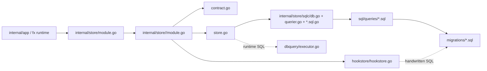

# 10. 数据存储层代码地图

> 范围：`internal/store/*` + `internal/store/sqlc/*` + `sql/queries/*` + `migrations/*`
>
> caller 列均已用 `lsp_xref(references)` 核过；若当前没有跨包 prod consumer，就记为 `internal/store.Module`（代表“已接进生产 root store，但尚未被上层模块直接注入”）。

## 1. 总览

### 1.1 root wire-up
- `internal/store/module.go:31` 定义 root `store` fx module。
- root module 先提供共享 `*sqlc.Queries`，再接 17 个子包；其中 `promptstore.Module` 在 `internal/store/module.go:43`，`thread.Module` 在 `internal/store/module.go:47`。
- 目录实况是 **17 个 store 子包 + 1 个 `sqlc/` 生成目录**；`workspace_run.sql(.go)` 只停留在 `sql/queries/` 与 `internal/store/sqlc/`，当前没有 `internal/store/workspace*` 子包。

### 1.2 `contract.go` / `store.go` / `sqlc.*` / SQL 分层
| 层 | 典型文件 | 角色 |
|---|---|---|
| domain contract | `internal/store/<pkg>/contract.go` | 定义领域接口、DTO、过滤参数；上层优先依赖它，而不是直接依赖 sqlc 生成类型。 |
| store impl | `internal/store/<pkg>/store.go` | 真正仓储实现：调用 `sqlc.Queries` / `sqlc.Querier`，做 DTO 映射、错误包装、必要的事务边界。 |
| generated sqlc | `internal/store/sqlc/db.go` / `querier.go` / `*.sql.go` | `db.go` 持有 `Queries` 与 `WithTx`；`querier.go` 汇总 typed method surface；每个 `*.sql.go` 与一个 SQL 文件一一对应，生成 `Params/Row/Method`。 |
| raw SQL | `sql/queries/*.sql` | 持久化真实语句来源；决定 where/order/limit/returning 形态。 |
| schema input | `migrations/*.sql` + `sqlc.yaml` | 迁移驱动 runtime schema；`sqlc.yaml` 决定 sqlc 代码生成时真正读取的 schema 子集。 |

### 1.3 例外与补充
- `hookstore` 是 **显式 sqlc 例外**：`internal/store/hookstore/hookstore.go:15` 说明它直接用 `platformdb.Queryable` + 手写 SQL；`internal/store/hookstore/module.go:11` 直接提供 `contract.HookReviewStore`。
- `dbquery` 是 **半例外**：`sql/queries/db_query.sql` 只保留 placeholder，真正动态查询走 `dbquery/executor.go`。
- `thread` 除 `Store` 外还额外提供 metadata adapter：`internal/store/thread/module.go:7` 注册 `NewMetadataStore`，把 store/thread 收窄成 `contract.ThreadMetadataStore`。

### 1.4 Mermaid 总图

## 2. `prompt` 新接线（p20.1）

### 2.1 contract 面
- `internal/store/prompt/contract.go:11`：`Reader` 只保留读面 `List(...)`。
- `internal/store/prompt/contract.go:15`：新增 `Store`，把 `Reader`、`WithTx`、`Get`、`Delete`、`InsertVersion`、`Upsert` 合在一起。
- `internal/store/prompt/contract.go:24` + `:27`：`ListFilter` 现在带 `CWD string`。
- `internal/store/prompt/contract.go:49`：新增 `PromptTemplateVersion`，承接 prompt 归档版本写入。

### 2.2 store 面
- `internal/store/prompt/store.go:40-42`：`NewStore(q *sqlc.Queries) Store`。
- `internal/store/prompt/store.go:61-75`：`List` 读 `sqlc.ListPromptTemplates(...)`。
- `internal/store/prompt/store.go:77-85`：`WithTx` 以 `Store` 递归包装事务内 store。
- `internal/store/prompt/store.go:102-121`：`InsertVersion` 写 `prompt_versions`。
- `internal/store/prompt/store.go:123-146`：`Upsert` 写 `prompt_templates`。

### 2.3 `Store -> Reader` adapter 与 tx wiring
- `internal/store/prompt/module.go:13`：`store.prompt` module。
- `internal/store/prompt/module.go:20-22`：`AsReader(store Store) Reader`，保证 dashboard 继续注入只读接口。
- `internal/store/prompt/module.go:24-42`：`newStoreWithPool(pool, q)`；这里不是直接把 pool 暴露给上层，而是预装事务 runner 后再返回 `Store`。
- `internal/store/prompt/module.go:53`：真正把 tx 绑定回 sqlc 的动作是反射调用 `Queries.WithTx(...)`。

### 2.4 SQL 面与 caller split
- `sql/queries/prompt_template.sql:1`：`GetPromptTemplate`。
- `sql/queries/prompt_template.sql:10`：`InsertPromptVersion`。
- `sql/queries/prompt_template.sql:16`：`UpsertPromptTemplate`。
- `sql/queries/prompt_template.sql:34`：`ListPromptTemplates`。
- xref 结果分两路：
  - `promptstore.Store` 主要被 `internal/module/prompt` 消费（写 / 删 / 版本归档 / tx）。
  - `promptstore.Reader` 主要被 `internal/module/dashboard` 消费；这就是 `AsReader` 存在的原因。

### 2.5 当前真实状态
- **`ListFilter.CWD` 已进入 contract，但还没下推到 SQL**：
  - store 侧 `List` 只把 `AgentKey/Keyword/Limit` 传给 sqlc（`internal/store/prompt/store.go:62`）；
  - SQL 侧 `ListPromptTemplates` 只有 `$1/$2/$3`（`sql/queries/prompt_template.sql:43`）；
  - 当前 CWD scope 仍由 caller 后置过滤：dashboard 在 `internal/module/dashboard/ui_page.go:151` 传 `CWD` 后再本地过滤，prompt service 列表面仍在 `internal/module/prompt/service.go:259` 先全量查再过滤可见性。

## 3. 17 个 store 子包一览

| 包名 | 核心实体 | 对应 SQL 文件 | 主要 caller 模块 |
|---|---|---|---|
| `agentstatus` | `AgentStatus` | `agent_status.sql` | `internal/module/dashboard` |
| `ailog` | `AILog` / `StatusCount` | `ai_log.sql` | `internal/module/dashboard` |
| `auditlog` | `AuditEvent` | `audit_log.sql` | `internal/module/dashboard` |
| `binding` | `Binding` | `agent_provider_binding.sql` + `thread_binding.sql` | `internal/module/thread` / `internal/module/uistate` / `internal/platform/toolbridge` / `internal/provider/unified` / `internal/platform/cachekeepalive` |
| `buslog` | `BusExceptionLog` | `bus_log.sql` | `internal/module/dashboard` |
| `commandcard` | `CommandCard` | `command_card.sql` | `internal/module/dashboard` |
| `cwdlock` | `LockHolder` / cwd lock | `cwd_lock.sql` | `internal/store.Module` |
| `dbquery` | runtime query result / `PlaceholderRow` | `db_query.sql` + `executor.go` | `internal/module/dashboard` |
| `hookstore` | `mcp.PendingHookReview` | **无 sqlc SQL 文件；手写 SQL 在 `hookstore.go`** | `internal/platform/hooks` |
| `interaction` | `Interaction` | `interaction.sql` | `internal/store.Module` |
| `prompt` | `PromptTemplate` / `PromptTemplateVersion` | `prompt_template.sql` | `internal/module/prompt` / `internal/module/dashboard` / `cmd/mcp-orch/tools` |
| `sharedfile` | `SharedFile` | `shared_file.sql` | `internal/module/dashboard` / `internal/module/uistate` |
| `systemlog` | `SystemLog` | `system_log.sql` | `internal/module/dashboard` |
| `tasktrace` | `TaskTrace` | `task_trace.sql` | `internal/module/dashboard` |
| `thread` | `Thread` / `PromptSnapshot` / `ThreadCwd` | `agent_thread.sql` + `agent_thread_prompt_snapshot.sql` | `internal/module/thread` / `internal/provider/unified` / `internal/platform/cachekeepalive` / `internal/module/memory`（经 metadata adapter） |
| `topologyapproval` | `TopologyApproval` | `topology_approval.sql` | `internal/store.Module` |
| `uipreference` | `UIPreference` | `ui_preference.sql` | `internal/module/uistate` |

### 3.1 读面/写面小结
- `commandcard`、`sharedfile`：`NewStore()` 直接返回 `Reader`，所以不需要额外 adapter。
- `prompt`：同时存在 `Reader + Store`，所以必须在 module 层补 `Store -> Reader` adapter。
- `hookstore`：没有本地 `contract.go`，直接实现 `internal/contract.HookReviewStore`（`internal/contract/hooks.go:38`）。

## 4. `thread` 与 snapshot 补充
- `internal/store/thread/contract.go:78`：`PromptSnapshot` 已是**运行时字段更完整**的结构，带 `DisplayName / Boundary / Provider / Version / Hash / SectionSnapshot / Generation`。
- `internal/store/thread/contract.go:95`：保留 `legacyPromptSnapshot`，说明 load 路径仍兼容旧 snake_case payload。
- `internal/store/thread/store.go:117-136`：`SavePromptSnapshot` 把 snapshot JSON 落到 `agent_threads.prompt_snapshot`。
- `internal/store/thread/store.go:138-157`：`LoadPromptSnapshot` 负责反序列化并补齐空 `SectionSnapshot`。
- `sql/queries/agent_thread_prompt_snapshot.sql:1` / `:7`：snapshot 的 load/save 是单独 SQL 文件。
- `migrations/0031_prompt_snapshot.sql:2`：真正加列点是 `agent_threads.prompt_snapshot jsonb`。

## 5. sqlc 实现面
- `sqlc.yaml:4`：queries 输入目录是 `sql/queries/`。
- `sqlc.yaml:16`：生成输出目录是 `internal/store/sqlc`。
- `internal/store/sqlc/querier.go:11`：`Querier` 是跨所有 query 文件的总接口。
- `internal/store/sqlc/db.go:24`：`Queries` 持有底层 `DBTX`。
- `internal/store/sqlc/db.go:28-32`：`Queries.WithTx(tx pgx.Tx)` 负责把同一组 query 方法重绑到事务句柄上。
- `sqlc.yaml:12`：当前 sqlc schema 输入已包含 `migrations/0032_agent_memory_identity.sql`；因此“sqlc 只读到 0031”为旧结论，不再成立。

## 6. 最近 5 条 migrations

| 编号 | 文件 | 作用 |
|---|---|---|
| `0028` | `0028_binding_provider_thread_nullable.sql` | 允许 `agent_provider_binding.provider_thread_id` 初始为空，改成 partial unique index，适配首启后补真实 provider thread id。 |
| `0029` | `0029_agent_provider_binding_schema_repair.sql` | 修复 baseline 安装路径遗漏的 `agent_provider_binding` 主键 / check / unique 约束。 |
| `0030` | `0030_baseline_schema_repair.sql` | 批量修 baseline 快照遗漏的 PK / UNIQUE，保证 `ON CONFLICT` 型 upsert 真能成立。 |
| `0031` | `0031_prompt_snapshot.sql` | 给 `agent_threads` 增加 `prompt_snapshot jsonb`。 |
| `0032` | `0032_agent_memory_identity.sql` | 给 `agent_threads` 与 `agent_provider_binding` 增加 `parent_agent_id / agent_type / agent_memory_scope`。 |

## 7. 当前文档/代码不符点（已按现码修正）
- `prompt.ListFilter.CWD` **有 contract、无 SQL 下推**；真实行为仍是 caller 后置过滤，不是 DB 侧过滤。
- `thread.PromptSnapshot` 已不是“只含 base/developer/section/generation 的极简 store DTO”；现在有 modern 字段 + legacy 兼容层。
- `sqlc.yaml` 现在已经把 `0032_agent_memory_identity.sql` 纳入 schema 输入；只列到 `0031` 的说法已过期。
- `hookstore` 仍是手写 SQL 例外，不走 `internal/store/sqlc/*.sql.go`。
