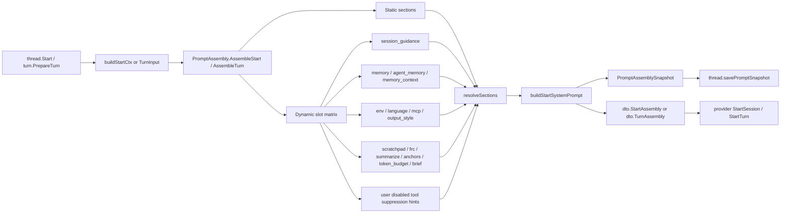
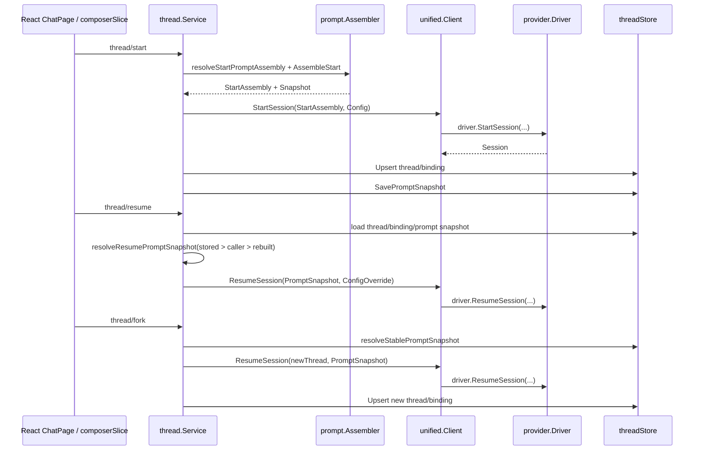
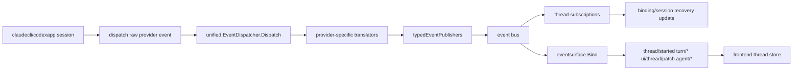

# 11B Prompt / Thread 代码地图

> 拆卷说明：本卷只覆盖 `internal/module/prompt/`、`internal/module/thread/`、provider bridge、以及 blank-thread 首发链；memory 深水区另见 [`11-memory.md`](11-memory.md)。
> 当前口径：以 2026-06-17 HEAD 为准；用于收口 prompt / thread / provider `start / resume / fork`、prompt store、prompt 模板路由、snapshot、以及前端 blank-thread 首发真值。
> UI 路径校正（2026-06-02）：当前新 UI 的聊天页面在 `frontend-app/`，见 [`01-terminal-ui-react.md`](01-terminal-ui-react.md)。本卷中的 `cmd/agent-terminal/frontend/vue-app/` 锚点保留为 legacy Vue/package-embed 参考。
> 必读搭配：`docs/会话习惯.md` §10.21 / §10.25；shared patches：`tmp/codemap-missing-coverage.md`、`tmp/codemap-mermaid-patches.md`、`tmp/codemap-test-freeze.md`、`tmp/codemap-howto-patches.md`。

## 1. 这卷回答什么

- `thread/start` 到 provider `StartSession` 之间，**system prompt 是怎样组装、下发、落盘**的。
- `PROMPT_START_CURRENT_DATE`、dynamic sections、memory providers、native-tool replacement hints，**分别插在哪个层级**。
- `thread/resume` / `thread/fork` / `thread/recover` 时，**prompt snapshot 与 runtime config snapshot 各自如何复用**。
- provider raw event 经过 unified event map、session manager、thread 订阅、eventsurface，**最终怎样变成 UI 可见事件**。
- blank-thread 首发时，当前 React 前端为什么一定是 **`sendDraft -> startNewDraftThread -> startTurn`** 两段式，而不是一次 RPC 直发；legacy Vue 的 `resolveStartOptions -> startThread -> sendMessage` 只保留为旧路径参考。

## 2. 当前源码结论

1. **start prompt 的正式入口不在 prompt 包里单独命名，而在 thread helper**：`internal/module/thread/start_session_helpers.go:82-94` 的 `resolveStartPromptAssembly()` 调 `PromptAssemblyRef.AssembleStart()`。
2. **turn prompt 没有同名 helper**：仓内 `resolveTurnPromptAssembly` 为 0 命中；turn 侧真实入口是 `internal/module/turn/prompt_assembly.go:13-43` 的 `prepareTurnAssembly()`，再调 `prompt.AssembleTurn()`。
3. **`PROMPT_START_CURRENT_DATE` 已上线且只影响 start 一次性 system block**：常量在 `internal/module/prompt/assembler.go:25`，读 env 在 `:289-291`，注入 “Today's date is ...” 在 `:273`。
4. **dynamic section 不是固定 5 个 slot**：真实矩阵来自 `internal/module/prompt/dynamic.go:43-61`，当前不含旧 prompt 注入式 skill 列表 slot。
5. **skill 不再经 prompt catalog 注入**：V1 生产路径是 canonical skills -> provider-native mirrors；prompt 不从 skill store 读取 native replacement，native/tool suppression hints 只来自用户禁用工具配置。
6. **prompt config 不再承载旧 skill 列表开关**：`internal/module/prompt/config.go` 只保留 registry / assembly / system-context cache breaker 等 prompt 开关。
7. **prompt store 不是只读**：`internal/store/prompt/contract.go:15-22` 已暴露 `WithTx / Get / Delete / InsertVersion / Upsert`；写路径在 `internal/module/prompt/service.go:290-340,382-488`。
8. **freeze 真值是 `prompt = 27`**：`internal/archtest/freeze_registry.go:29-35` 明写 `internal/module/prompt` 包文件数 freeze 到 27。
9. **resume 没有独立 `resume.go`**：resume 主链分散在 `thread/lifecycle.go`、`start_session.go`、`prompt_snapshot.go`、`rpc.go`；文件树里只有 `resume_test.go`、`resume_session_uuid_test.go`。
10. **memory 与 prompt 的交点不是共用一个 snapshot 结构**：prompt snapshot 单独存 `agent_thread_prompt_snapshot`；memory 侧读的是 thread `ConfigOverride.Runtime`，由 `MemoryLifecycleHooks.resolveThreadRuntimeMetadata()` 解释。
11. **provider bridge 的主干是 bus，不是 thread 直接监听 driver**：driver session 只 dispatch raw event；统一翻译发生在 `internal/provider/unified/event_map.go:71-124`；thread 只订阅 bus 上的 typed event。
12. **blank-thread 首发天然是两跳**：前端先 `thread/start` 拿 thread id，再 `turn/start` 发用户输入；这保证 start-only prompt 只在创线时注入一次。
13. **prompt 模板路由已从 thread 根包拆成纯规则子包**：`internal/module/thread/router_resolve.go` 仍负责 catalog 调用、runtime asset fallback、日志和 StartRequest 写入；`internal/module/thread/promptrouting` 只负责模板筛选、match_when 候选分组和 sections 到 BaseInstructionBlock 的转换。

## 3. 文件与入口索引

### 3.1 Prompt 侧文件图

| 路径 | 角色 | 本卷重点 |
|---|---|---|
| `internal/module/prompt/module.go` | fx 装配、prompt service wiring | `Module`、`NewServiceFx`、`DisabledToolsFn` optional injection |
| `internal/module/prompt/config.go` | env config | registry / assembly / system-context cache breaker |
| `internal/module/prompt/service.go` | registry + prompt CRUD service | built-in providers、prompt store 写入口 |
| `internal/module/prompt/assembler.go` | start/turn assembly 真身 | start system prompt、current date hook、snapshot 生成 |
| `internal/module/prompt/section.go` | static section specs | static slots 真实列表 |
| `internal/module/prompt/dynamic.go` | dynamic slot 矩阵 | dynamic section specs、slot -> provider 解析 |
| `internal/module/prompt/registry.go` | ordered section registry | `Sections()` 按 `Order` 输出 |

### 3.2 Thread 侧文件图

| 路径 | 角色 | 本卷重点 |
|---|---|---|
| `internal/module/thread/contract.go` | service contract / DTO | `StartRequest`、`ResumeRequest`、`PromptSnapshot` 字段 |
| `internal/module/thread/rpc.go` | `thread/*` RPC handlers | `thread/start`、`thread/resume`、`thread/fork` |
| `internal/module/thread/lifecycle.go` | `Start / Resume` service 主链 | launch、persist、save prompt snapshot |
| `internal/module/thread/router_resolve.go` | prompt 模板路由编排 | catalog list、runtime asset fallback、日志、StartRequest 写入 |
| `internal/module/thread/promptrouting/` | prompt 模板纯路由规则 | match_when 分组、prompt_key / agent_key 查询、sections 转 block |
| `internal/module/thread/start_prompt_context.go` | start BuildCtx 组装 | cwd / gitRoot / MCP / session flags 注入 |
| `internal/module/thread/start_session_helpers.go` | start helper | `resolveStartPromptAssembly`、`buildStartSessionConfig` |
| `internal/module/thread/start_session.go` | provider DTO 物化 | `StartSession` / `ResumeSession` 请求拼装 |
| `internal/module/thread/prompt_snapshot.go` | snapshot 持久化与恢复 | hash、load/save、resume/fork fallback |
| `internal/module/thread/lifecycle_fork.go` | `Fork / Recover` | stable snapshot 继承、resume reuse |
| `internal/module/thread/factory.go` | offline/runtime config snapshot | `storedThreadConfig` encode/decode |
| `internal/module/thread/events.go` | thread 订阅 provider lifecycle | `onAgentLaunched`、`onAgentFailed` |
| `internal/module/thread/module.go` | fx wiring | `registerSubscriptions` |

### 3.3 Provider bridge 侧文件图

| 路径 | 角色 | 本卷重点 |
|---|---|---|
| `internal/provider/unified/module.go` | unified 总装配 | `EventDispatcher`、`SessionManager`、`Client` |
| `internal/provider/unified/client.go` | thread 的 `SessionStarter` 适配 | `StartSession` / `ResumeSession` 统一入口 |
| `internal/provider/unified/session.go` | in-memory session registry | register / generation / close all |
| `internal/provider/unified/session_resolver.go` | durable binding -> auto resume | app 重启后 session 重建 |
| `internal/provider/unified/event_map.go` | raw -> typed event 发布 | `typedEventPublishers`、`Dispatch()` |
| `internal/provider/claudecli/event_map.go` | Claude raw translator | `translateClaudeEvent` |
| `internal/provider/codexapp/event_map.go` | Codex raw translator | `translateCodexEvent` |
| `internal/platform/eventsurface/bind.go` | typed event -> RPC/UI method | `thread/started`、`turn/*`、`ui/thread/patch` |

### 3.4 Frontend blank-thread 文件图

当前 React 新 UI：

| 路径 | 角色 | 本卷重点 |
|---|---|---|
| `frontend-app/src/pages/chat/ChatPage.jsx` | 当前 React 聊天页 shell、composer 挂载、timeline 渲染 | composer 输入、发送按钮、历史消息与执行计划展示 |
| `frontend-app/src/entities/client/model/composerSlice.js` | composer 状态与发送动作 | `sendDraft()` 负责 blank-thread 两段式入口 |
| `frontend-app/src/entities/client/model/useClientStore.js` | Zustand 客户端状态与 thread/turn action | `startNewDraftThread()` 负责 blank-thread 的 `thread/start` 第一跳 |
| `frontend-app/src/shared/api/backendApi.js` | RPC facade 与 payload 校验 | `startThread()`、`startTurn()`、cwd / threadId fail-fast |
| `frontend-app/src/shared/api/wailsBridge.js` | Wails runtime bridge | `callAPI()`、runtime event、前端日志回传 |

Legacy Vue 参考：

| 路径 | 角色 | 本卷重点 |
|---|---|---|
| `cmd/agent-terminal/frontend/vue-app/composables/useThreadActions.js` | 首发 send orchestration | `resolveStartOptions()` + `performSend()` |
| `cmd/agent-terminal/frontend/vue-app/stores/thread-actions-helpers.js` | `thread/start` / `turn/start` 客户端 | `startThread()`、`sendMessage()` |
| `cmd/agent-terminal/frontend/vue-app/components/ComposerBar.js` | composer UI | 输入、附件、发送、停止、压缩与线程配置；不再展示聊天内技能建议 |
| `cmd/agent-terminal/frontend/vue-app/pages/UnifiedChatPage.template.js` | chat/workspace 模板 | composer、timeline、diff、task handoff 装配 |
| `cmd/agent-terminal/frontend/vue-app/services/skills-api.js` | local skill write/import + resolution RPC | cwd-aware skill 管理、mirror conflict actions |

### 3.5 三个容易误读的“缺席真值”

| 主题 | 真相 | 锚点 |
|---|---|---|
| `resolveTurnPromptAssembly` | 仓内无此符号；真实入口是 `turn.prepareTurnAssembly()` | `lsp_grep internal resolveTurnPromptAssembly = 0`；`internal/module/turn/prompt_assembly.go:13-43` |
| `resume.go` | thread 包无独立实现文件；resume 逻辑拆在 `rpc.go + lifecycle.go + start_session.go + prompt_snapshot.go` | `find internal/module/thread ...` 文件树；`internal/module/thread/rpc.go:308-333` |
| 旧独立 skill-catalog fx 文件 | 已删除；当前承载点并入 `prompt/module.go:14-26` | `internal/module/prompt/module.go:14-26` |

## 4. Prompt 主链

### 4.1 Prompt 模块装配入口

- `internal/module/prompt/module.go:14-27` 定义 `prompt.Module`。
- `fx.Provide(...)` 里同时放入：
  - `NewConfig`
  - `NewServiceFx`
  - `AsPromptRegistry`
  - `AsPromptAssemblyService`
  - `AsDynamicSectionRegistrar`
  - `AsSectionInvalidator`
  - `registerPromptHandlers`
- `ServiceFxParams` 当前只接入 prompt config、logger、UI preference store、shared-file reader 和可选 `DisabledToolsFn`；没有 skill store 接线。
- `DisabledToolsFn` 只把用户禁用工具配置传给 prompt assembler，作为 native/tool suppression hints 的当前来源。
- 也就是说，**section slot 的“定义”与 provider 的“注入”是两段式**：
  1. `NewService()` 先注册静态 section + dynamic slot。
  2. 各 provider 再通过 `RegisterDynamicProvider()` 把实现挂到 slot 名上。

### 4.2 Registry 与 built-in provider 的组装方式

- `internal/module/prompt/service.go:118-144` 的 `NewService()` 会：
  - 初始化 `SectionRegistry`
  - 初始化 section cache / userContext cache
  - 调 `registerBuiltInSections()`
  - 用 `mustRegisterDynamicProvider()` 注册 built-in dynamic providers
- `registerBuiltInSections()` 在 `service.go:344-350`：
  - 先注册 `StaticSections()`
  - 再注册 `dynamicSlotSections()`
- `SectionRegistry.Sections()` 在 `internal/module/prompt/registry.go:35-50`：
  - 按 `Order` 排序
  - 同 order 时按 `Name` 排序
- 这意味着：**最终 assembler 看到的是完整有序 section 列表，不是写死在 assembler.go 里的 if/else**。

### 4.3 Static sections：固定骨架

`internal/module/prompt/section.go:24-32` 当前 static matrix 如下：

| order | name | 说明 |
|---|---|---|
| 10 | `identity` | agent 身份与默认定位 |
| 20 | `system_constraints` | 系统约束 |
| 30 | `engineering` | 工程规则 |
| 40 | `actions` | 动作规范 |
| 50 | `tool_preferences` | 仓库内优先用 LSP / code tools |
| 60 | `style` | 风格约束 |
| 70 | `output_efficiency` | 输出效率约束 |

这 7 个 static section 会进入 start assembly。

### 4.4 Dynamic sections：真实 slot 矩阵

`internal/module/prompt/dynamic.go:43-61` 当前真实 dynamic matrix 如下。

| order | name | cachePolicy | startOnly | 生产 provider 入口 |
|---|---|---|---|---|
| 110 | `session_guidance` | `InputScoped` | 否 | `SessionGuidanceProvider`，`service.go:131` |
| 120 | `memory` | `InputScoped` | 是 | `MemoryRulesProvider`，memory 模块注册 |
| 122 | `memory_entrypoint` | `InputScoped` | 是 | memory entrypoint provider |
| 125 | `memory_context` | `InputScoped` | 否 | `MemoryContextProvider`，turn lane |
| 130 | `env_info_simple` | `InputScoped` | 否 | `EnvInfoProvider`，`service.go:132` |
| 140 | `language` | `InputScoped` | 否 | `LanguageProvider`，`service.go:133` |
| 150 | `mcp_instructions` | `Uncached` | 否 | `MCPInstructionsProvider`，`service.go:134` |
| 200 | `output_style` | `CacheByName` | 否 | `OutputStyleProvider`，`service.go:135` |
| 210 | `scratchpad` | `CacheByName` | 否 | `ScratchpadProvider`，`service.go:136` |
| 220 | `frc` | `CacheByName` | 否 | `FRCProvider`，`service.go:137` |
| 230 | `summarize_tool_results` | `CacheByName` | 否 | `SummarizeToolResultsProvider`，`service.go:138` |
| 240 | `numeric_length_anchors` | `CacheByName` | 否 | `NumericLengthAnchorsProvider`，`service.go:139` |
| 250 | `token_budget` | `CacheByName` | 否 | `TokenBudgetProvider`，`service.go:140` |
| 260 | `brief` | `CacheByName` | 否 | `BriefProvider`，`service.go:141` |
| 270 | `ant_model_override` | `CacheByName` | 否 | `AntModelOverrideStubProvider`，`service.go` |

结论：**这不是“固定 5 个 dynamic slot”**。旧 prompt 注入式 skill 列表 slot 已退出生产链，skills 通过 provider-native mirrors 让 Claude/Codex 自己发现。

### 4.5 `dynamicSlotSections()` 如何把 slot 变成真正 section

- `internal/module/prompt/dynamic.go:333-352` 的 `dynamicSlotSections()` 遍历 `dynamicSectionSpecs`。
- 每个 spec 都被映射成一个 `PromptSection`：
  - `Name = spec.name`
  - `Order = spec.order`
  - `Region = PromptRegionDynamic`
  - `Volatile = spec.cachePolicy == Uncached`
  - `StartOnly = spec.startOnly`
  - `Compute = s.resolveDynamicSection(...)`
- `resolveDynamicSection()` 在 `dynamic.go:355-363`：
  - 只按名字从 `s.dynamic` map 取 provider
  - provider 为 nil 时直接返回 nil
- 所以即使 slot 已存在，只要 provider 没注册，**该 section 仍会渲染为空**。
- 旧 prompt 注入式 skill 列表已不在 slot 矩阵内；新增 dynamic provider 仍遵循“slot 注册 + provider 解析”的通用模式。

### 4.6 start 入口：`resolveStartPromptAssembly()`

`internal/module/thread/start_session_helpers.go:82-94` 是 start assembly 的真正 thread 侧入口。

具体步骤：

1. `thread.Start()` 在 `internal/module/thread/lifecycle.go:77-124` 先做 request normalize。
2. `buildStartAssemblyInput()` 在 `start_session_helpers.go:28-35` 调 `buildStartCtx()`，把 cwd / gitRoot / MCP / sessionFlags / scratchpad / FRC 全部放进 `contract.BuildCtx`。
3. `buildStartAssemblyInput(req, threadID, buildCtx)` 在 `start_session_helpers.go:37-72` 生成 `contract.StartInput`。
4. `resolveStartPromptAssembly()` 再调用 `req.PromptAssemblyRef.AssembleStart(ctx, input)`。
5. 如果 caller 没传 `PromptAssemblyRef`，helper 会回落到 `buildStartAssembly(req)`，只用 request 自带 base/dev instruction。
6. helper 最后会用 `ensureStartAssemblySnapshot()` 确保 snapshot 补齐 `DisplayName / BaseInstructions / DeveloperInstructions / Provider / Version / Hash / SectionSnapshot`。

这条链说明：**assembler 是 prompt 包实现，入口却由 thread helper 拥有**。

### 4.6.1 prompt 模板路由入口与边界

prompt 模板路由发生在 `thread/start` 的 start assembly 之前，但它不是 prompt assembler 本体。当前分成两层：

| 层 | 文件 | 职责 |
|---|---|---|
| 编排层 | `internal/module/thread/router_resolve.go:37-76`、`:141-163`、`:190-238`、`:256-318` | 读取 runtime prompt catalog，处理 pinned prompt、agent_key、match_when、main/default fallback、runtime asset stale 标记、日志和 StartRequest 字段写入。 |
| 纯规则层 | `internal/module/thread/promptrouting/routing.go:11-138` | 不访问 store/provider/logging，只对已加载模板做 launchable 判断、prompt_key / agent_key 查询、match_when specific/fallback 分组、sections 转 `BaseInstructionBlock`。 |

关键语义：

- `AutoRouteCandidates()` 只接受 `Enabled && !runtime asset` 且带 `match_when` 的模板，并把非空条件放入 specific pool，把 `{}` 放入 fallback pool，两组都按 `Priority` 降序。
- `TemplateLaunchable()` 明确排除 runtime asset，避免 runtime fallback 被误当成可启动模板。
- `ConvertSectionsToBlocks()` 只转换 enabled、非 recall、正文非空的 section；是否按 `enable_when` 再过滤由 thread 根包调用 `contract.PrepareBaseInstructionBlocks(...)` 完成。
- `router_resolve.go` 保留 `pkglogger.Info/Warn`，因为路由命中、stale pin、version materialize 失败属于运行时可观测边界，不放进纯规则子包。

### 4.7 `AssembleStart()` 的真实工作

`internal/module/prompt/assembler.go:28-58` 的 `AssembleStart()` 做了 5 件事：

1. `resolveSections()` 解析 `startSections()`。
2. `startSections()` = `staticSections()` + `dynamicSections()`，见 `assembler.go:225-231`。
3. `startAssemblyBoundary(...)` 计算 cached prefix / uncached tail。
4. `buildStartSystemPrompt(...)` 组装 start-only system block。
5. `newSnapshot(...)` 生成 `PromptAssemblySnapshot`，后续由 thread 保存。

注意：

- `AssembleStart()` 输出的 `BaseInstructions` 已经包含一次性的 system prompt block。
- `DeveloperInstructions` 保持单独字段。
- `ResolvedSections` 会被连同 snapshot 一起带给 provider 与 thread store。

### 4.8 `PROMPT_START_CURRENT_DATE`：一次性日期注入钩子

相关锚点都在 `internal/module/prompt/assembler.go`：

| 锚点 | 作用 |
|---|---|
| `:25` | 常量 `envPromptStartCurrentDate = "PROMPT_START_CURRENT_DATE"` |
| `:268-285` | `buildStartSystemPrompt()` 负责构造一次性 system block |
| `:273` | 注入 `Today's date is ...` |
| `:288-293` | `startPromptCurrentDate()` 优先读 env，否则回落 `time.Now()` |

真实语义：

- 这条日期句子只在 **start** 阶段注入一次。
- 它被包装进 `runtimeExtras + currentDate + system context` 的 system reminder block。
- 目的不是给 turn 每次重复喂时间，而是给 thread 建立稳定的起始 system frame。
- 如果测试或回放需要冻结日期，只需设置 `PROMPT_START_CURRENT_DATE`。

### 4.9 start system prompt 为什么不放在每个 turn 里

`internal/module/prompt/assembler.go:268-285` 上方注释已经明确：

- current date
- runtime extras
- system context

会被并到 start 的 `BaseInstructions`，避免旧实现里“每个 turn 都重复注入同一块 system prompt”的 token 浪费。

换句话说：

- **thread/start 负责一次性系统上下文**。
- **turn/start 负责本轮 user context / runtime user context / attachments**。

### 4.10 turn 入口：仓内无 `resolveTurnPromptAssembly`

这条一定要记：

- `lsp_grep internal resolveTurnPromptAssembly = 0`。
- turn 侧真实入口在 `internal/module/turn/prompt_assembly.go:13-43`。

真实链路是：

1. `turnStartHandler()` 在 `internal/module/turn/rpc_helpers.go:159-180`。
2. handler 先 `svc.PrepareTurn()`。
3. `PrepareTurn()` 在 `internal/module/turn/service.go:116-160` 内部调 `prepareTurnAssembly()`。
4. `prepareTurnAssembly()` 构造 `contract.TurnInput` 后调用 `prompt.AssembleTurn()`。

因此，本卷里“start 入口 helper”与“turn 入口 helper”并不对称：

- start：有 `resolveStartPromptAssembly()`。
- turn：无同名 helper，直接在 turn 模块的 `prepareTurnAssembly()` 中进 assembler。

### 4.11 `AssembleTurn()` 的真实工作

`internal/module/prompt/assembler.go:91-118` 的 `AssembleTurn()` 只解析 dynamic sections，不再拼 static sections。

它做的事是：

1. `resolveSections(ctx, s.dynamicSections(), buildTurnSectionContext(in))`
2. `resolveClaudeMdSources()` 收集 ClaudeMd sources
3. `buildBaseUserContext()` 生成基础 user context
4. `CollectRuntimeUserContext(in, resolved)` 把 dynamic section 产物投影到 runtime user context
5. `MergeRuntimeUserContext(...)`
6. `resolveDynamicTurnAttachments(...)`
7. 返回 `TurnAssembly{UserContext, UserContextText, SystemContext, Attachments, ResolvedSections}`

重点：

- turn 路径不会重复拼 static prompt 骨架。
- turn 路径更像“在 start 已建立的 system frame 上追加本轮 runtime 载荷”。

### 4.12 turn 侧传入 assembler 的字段

`internal/module/turn/prompt_assembly.go:17-38` 会把这些内容组装进 `contract.TurnInput`：

- `ThreadID`
- `Provider`
- `UserText`
- `SkillPrompt`
- `Attachments`
- `CurrentDate`
- `Summary`
- `CWD / GitRoot / IsWorktree`
- `Language / Model`
- `EnabledTools / AdditionalWorkingDirectories`
- `MCPSnapshot`
- `SessionFlags`
- `RuntimeUserContext`
- `OutputStyleConfig`
- `ScratchpadDir`
- `FRCConfig`

这说明：**turn 装配的输入面更接近“本轮动态状态”而不是“线程创建元数据”**。

### 4.13 Skills 与 prompt 的当前边界

- 生产 skill 发现链路不再走 prompt catalog，也不把 skill body 注入 start/turn prompt。
- `skill.Module` 通过 `contract.SkillMirrorReconciler` 向 provider 暴露 mirror reconcile 窄端口；Claude/Codex provider 在启动/acquire 前生成项目级 `.claude/skills`、`.agents/skills` 与个人级 `~/.claude/skills`、`~/.agents/skills` mirrors；显式 provider home 才使用其 `skills`。
- prompt 不从 skill store 读取 native replacement；`ServiceFxParams` 已无 skill store 注入，`assembler_support.go` 的 `aggregateSuppressedTools()` 只聚合用户禁用工具配置。
- provider-native skill mirror 不再通过 prompt assembly metadata 产生 native/tool suppression hints；provider-native mirror 主链看 09 provider / skill module。
- turn 侧仍用 `SkillHydrationSource` 对显式 `SkillRef` 补版本/hash/summary 等元数据，但 provider 实际发现和调用交给 native mirror。

结论：本卷只记录 prompt/thread 如何携带运行时上下文；skill runtime 主链请看 09 provider mirror 与 skill module mirror reconciler。

### 4.14 Prompt snapshot：start 时一起生成的第二产物

`internal/module/prompt/assembler.go:295-312` 的 `newSnapshot()` 会填这些字段：

| 字段 | 来源 |
|---|---|
| `DisplayName` | start assembly 结果 |
| `BaseInstructions` | 已拼好 start system prompt 的 base |
| `Boundary` | cached prefix / uncached tail |
| `DeveloperInstructions` | developer layer |
| `Provider` | start input provider |
| `Version` | `contract.PromptAssemblySnapshotVersion` |
| `Hash` | `snapshotHash(...)` |
| `SectionSnapshot` | 各 resolved section 的文本快照 |
| `Generation` | prompt cache generation |

这份 snapshot 随后会被 thread 保存到持久层，并在 resume / fork / recover 时复用。

## 5. Prompt store + freeze

### 5.1 Store contract 已是读写口

`internal/store/prompt/contract.go:15-22` 当前 `Store` 接口如下：

| 方法 | 用途 |
|---|---|
| `WithTx` | 事务性写 prompt |
| `Get` | 读当前模板 |
| `Delete` | 删除当前模板 |
| `InsertVersion` | 存档旧版本 |
| `Upsert` | 新增或覆盖当前版本 |
| `List` | dashboard 读取模板列表 |

这意味着 codemap 不能再把 prompt store 写成“只读查询”。

### 5.2 `PromptTemplateVersion` 的结构

`internal/store/prompt/contract.go:49-65` 定义 `PromptTemplateVersion`：

- `PromptKey`
- `Title`
- `AgentKey`
- `ToolName`
- `PromptText`
- `Variables`
- `Tags`
- `Description`
- `Enabled`
- `CreatedBy`
- `UpdatedBy`
- `SourceUpdatedAt`
- `CreatedAt`
- `ArchivedAt`

它承担的是“旧模板归档”而不是“当前模板正文”。

### 5.3 写路径：`WritePrompt()`

`internal/module/prompt/service.go:290-314` 的 `WritePrompt()`：

1. `requirePromptCWD(cwd)` 确认 scope。
2. `store.WithTx(...)` 开事务。
3. `upsertPrompt(...)` 做当前模板写入。
4. 如果当前模板已存在，先 `archivePrompt(...)`。

而 `upsertPrompt(...)` 在 `service.go:382-408` 做这几件事：

- 校验 name / content / description
- 查当前模板
- 校验 scope
- 如有当前版本，先归档
- 解析 prompt key
- 调 `store.Upsert(...)`

### 5.4 归档旧版本：`archivePrompt()`

`internal/module/prompt/service.go:473-488`：

- 直接构造 `promptstore.PromptTemplateVersion`
- 填入当前模板全部字段
- `SourceUpdatedAt` 指向当前模板的 `UpdatedAt`
- 调 `store.InsertVersion(ctx, version)`

对应 store 实现：

- `internal/store/prompt/store.go:102-121` 负责 `InsertVersion()`
- `internal/store/prompt/store.go:123-146` 负责 `Upsert()`

### 5.5 删除路径也会先归档

`internal/module/prompt/service.go:317-341` 的 `DeletePrompt()`：

1. 校验 cwd scope
2. `txStore.Get(ctx, promptKey)`
3. `validatePromptScope(...)`
4. `archivePrompt(ctx, txStore, *current)`
5. `txStore.Delete(ctx, promptKey)`

所以 prompt delete 不是裸删，而是 **先 archive，再 delete**。

### 5.6 这层与 thread/prompt assembly 的关系

prompt store 保存的是 dashboard / prompts 页面可编辑模板。

它与 `PromptAssemblySnapshot` 的关系是：

- prompt store：**模板内容仓库**
- prompt assembly snapshot：**某次 thread/start 组装完成后的运行时快照**

两者都叫 prompt，但语义不同，不能混写。

### 5.7 freeze：prompt 包文件数当前锁到 27

`internal/archtest/freeze_registry.go:29-35`：

| Path | Kind | Limit | Owner | 当前注释 |
|---|---|---|---|---|
| `internal/module/prompt` | `ViolationPackageCount` | `27` | `P20.1-Phase-10` | prompt 迁移期文件数高于默认预算 |

相邻参考：

| Path | Kind | Limit |
|---|---|---|
| `internal/module/memory` | `ViolationPackageCount` | `27` |

但本卷只对 prompt freeze 负责。

### 5.8 freeze 与测试入口的对应关系

shared patch 已把本卷 freeze 口径收成：

- `prompt = 27*`
- `thread = —`

其中 `27*` 的星号含义是：**本轮已从旧数值校正到 27，并与 `freeze_registry.go` 对齐**。

## 6. Thread start / resume / fork 主链

### 6.1 Service surface

`internal/module/thread/contract.go:11-33` 的 `Service` 暴露：

- `Start`
- `Stop`
- `Resume`
- `Fork`
- `Recover`
- `ReadHistory / ReadMessages`
- `GetConfig / SetConfig`
- `Compact / Archive / Unarchive / Delete`

本卷只展开前 4 个生命周期口。

### 6.2 `thread/start` RPC -> `Service.Start()`

`internal/module/thread/rpc.go:94-147` 的 `newStartHandler()` 会把 `startParams` 映射成 `StartRequest`。

重要字段映射：

| RPC 字段 | `StartRequest` 字段 |
|---|---|
| `provider` | `Provider` |
| `cwd` | `CWD` |
| `model` | `Model` |
| `model_provider` / `modelProvider` | `ModelProvider` |
| `approval_policy` / `approvalPolicy` | `ApprovalPolicy` |
| `parent_agent_id` | `ParentAgentID` |
| `agent_type` | `AgentType` |
| `agent_memory_scope` | `AgentMemoryScope` |
| `base_instructions` | `BaseInstructions` |
| `developer_instructions` | `DeveloperInstructions` |
| `selected_skills` / `selectedSkills` | `LaunchSkillNames` |
| `manual_skill_selection` / `manualSkillSelection` | `ForceLaunchSkills` |

### 6.3 `Service.Start()` 的分段流程

`internal/module/thread/lifecycle.go:77-124`：

1. `normalizeStartRequest(req)`
2. 若 `PromptAssemblyRef == nil`，注入 `s.promptAssembly`
3. `buildStartAssemblyInput(req, agentID)`
4. `resolveStartPromptAssembly(...)`
5. `launchAgent(...)`
6. `establishStartedSession(...)`
7. `persistStartedSession(...)`

这 7 步里，第 3-4 步是 prompt 主链，第 5-7 步是 thread/provider 主链。

### 6.4 `buildStartCtx()`：start 时真正写进 BuildCtx 的东西

`internal/module/thread/start_prompt_context.go:24-52` 当前会注入：

- `CWD`
- `GitRoot`
- `IsWorktree`
- `Language`
- `Provider`
- `Model`
- `EnabledTools`
- `AdditionalWorkingDirectories`
- `ClaudeMdExcludes`
- `MCPSnapshot`
- `SessionFlags`
- `Summary`
- `OutputStyleConfig`
- `ScratchpadDir`
- `FRCConfig`
- `KeepCodingInstructions`

因此，memory、MCP、language、output style、scratchpad 这些 prompt provider，**在创线时拿到的是 thread start context，而不是 provider session runtime 自己再补**。

### 6.5 `buildStartAssemblyInput()`：StartRequest -> StartInput

`internal/module/thread/start_session_helpers.go:37-72` 把 BuildCtx + request 元数据投影成 `contract.StartInput`。

关键字段：

- `ThreadID`
- `ParentAgentID`
- `AgentType`
- `AgentMemoryScope`
- `Name / Prompt`
- `BaseInstructions / DeveloperInstructions`
- `Summary`
- `Provider / CWD / GitRoot / IsWorktree / Language / Model`
- `EnabledTools / AdditionalWorkingDirectories / ClaudeMdExcludes`
- `MCPSnapshot / SessionFlags / OutputStyleConfig / ScratchpadDir / FRCConfig`
- `LaunchSkillNames / ForceLaunchSkills`（legacy payload field；不再触发 prompt catalog 注入）

这一步只保留 legacy launch-time skill 选择字段的运输形状；V1 生产链路不再通过 prompt catalog 注入 skill。

### 6.6 `startSession()`：thread -> provider DTO 物化

`internal/module/thread/start_session.go:142-166` 的 `startSession()` 调 `SessionStarter.StartSession()`，传 `dto.StartSessionRequest`。

它传出的字段有 4 组：

#### A. 基础会话字段

- `Provider`
- `AgentID`
- `CWD`
- `Model`

#### B. prompt 字段

- `Instructions = assembly.BaseInstructions`
- `StartAssembly = toProviderStartAssembly(assembly)`

#### C. runtime config 字段

- `Config = buildStartSessionConfig(req, input, assembly)`

#### D. launch skill additive carrier

- `LaunchSkillNames`
- `ForceLaunchSkills`

### 6.7 `buildStartSessionConfig()`：真正下发给 provider 的 runtime config

`internal/module/thread/start_session_helpers.go:134-189` 会写入很多 alias key。

最重要的几组如下：

| 语义 | key |
|---|---|
| approvals | `approvalPolicy` / `approval_policy` / `approvals` |
| model provider | `modelProvider` |
| developer instructions | `developerInstructions` / `developer_instructions` |
| summary | `summary` |
| effort | `effort` |
| personality | `personality` |
| parent agent | `parentAgentId` / `parent_agent_id` |
| agent type | `agentType` / `agent_type` |
| agent memory scope | `agentMemoryScope` / `agent_memory_scope` |
| provider | `provider` |
| cwd | `cwd` |
| model | `model` |
| git root | `gitRoot` |
| language | `language` |
| scratchpad dir | `scratchpadDir` / `scratchpad_dir` |
| mcp snapshot | `mcpServers` / `mcpTools` / `mcpInstructions` |
| session flags | `sessionFlags` |
| output style | `outputStyleConfig` / `output_style_config` |
| sandbox | `sandbox` |

所以 provider 收到的不只是“prompt 文本”，还有一份完整 runtime config snapshot。

### 6.8 `persistStartedSession()`：线程状态与 prompt snapshot 同时落盘

`internal/module/thread/lifecycle.go:166-217` 的 `persistStartedSession()`：

1. `enrichFromSessionConfig(session, req.Model, req.CWD)` 读 session runtime snapshot，拿真实 model/cwd。
2. `encodeStoredThreadConfig(buildStartStoredThreadConfig(...))` 生成 `ConfigOverride`。
3. `persistThreadState(ctx, state, true)` 写 thread + binding。
4. `savePromptSnapshot(ctx, publicThreadID, assembly)` 单独存 prompt snapshot。

这里有一个关键事实：

- **thread runtime config snapshot** 进 `thread.ConfigOverride`
- **prompt assembly snapshot** 进单独 prompt snapshot store

它们不是同一个 JSON 字段。

### 6.9 `storedThreadConfig`：thread 持久化里的 runtime snapshot

`internal/module/thread/factory.go:194-200`：

```go
type storedThreadConfig struct {
    Model       string
    Effort      string
    Approvals   string
    Personality string
    Runtime     map[string]any
}
```

而 `buildStartStoredThreadConfig()` 在 `start_session_helpers.go:191-199` 会填：

- `Model`
- `Effort`
- `Approvals`
- `Personality`
- `Runtime = buildStartSessionConfig(...)`

这就是 memory hooks 后续读取的“线程 runtime 元数据快照”。

### 6.10 `savePromptSnapshot()`：单独保存 prompt assembly 快照

`internal/module/thread/prompt_snapshot.go:173-181`：

- snapshot 为空则跳过
- 否则 `threadStore.SavePromptSnapshot(threadID, toStoredPromptSnapshot(assembly.Snapshot))`

store 侧落盘在：

- `internal/store/thread/contract.go:17-18`
- `internal/store/thread/store.go:117-156`

这层保存的是：

- `DisplayName`
- `BaseInstructions`
- `Boundary`
- `DeveloperInstructions`
- `Provider`
- `Version`
- `Hash`
- `SectionSnapshot`
- `Generation`

### 6.11 `thread/resume` RPC -> `Service.Resume()`

`internal/module/thread/rpc.go:308-333` 的 `newResumeHandler()`：

- 用 `rpc.ThreadHandler` 包一层
- 把 `resumeParams` 映射到 `ResumeRequest`
- 最终调用 `svc.Resume(ctx, ResumeRequest{...})`

这一步不会重新组装 start prompt；它更像“恢复某个现存线程的 session”。

### 6.12 `Service.Resume()` 的分段流程

`internal/module/thread/lifecycle.go:126-141`：

1. `resolveResumeRequest(ctx, req)`
2. 补齐 `Provider / Model / CWD`
3. `establishResumedSession(ctx, req, state, displayName)`
4. `persistResumedSession(ctx, req, state, displayName, session)`

这里 display name 直接取 `state.Prompt`，而不是重新生成。

### 6.13 `resolveResumeRequest()`：先补 thread/binding 元数据

`internal/module/thread/start_session.go:223-250` 会从 thread/binding 持久层补全：

- `AgentID`
- `Provider`
- `ProviderThreadID`
- `CWD`
- `ConfigOverride`
- `Model`
- `Effort`
- `ThreadID`

所以 resume 对 DB binding / thread metadata 的依赖很重。

### 6.14 `hydrateResumeSessionRequest()`：resume 真正把 prompt snapshot 填进去

`internal/module/thread/start_session.go:270-307`：

- trim request
- lookup state
- 补 `AgentID / Provider / ProviderThreadID / CWD`
- `req.PromptSnapshot = s.resolveResumePromptSnapshot(ctx, req, state)`
- 补 `ConfigOverride.Model / Effort`
- 补 `Model / Effort`

重点：**resume 的 prompt snapshot 不是 handler 直接透传，而是经过优先级决策之后才进入 provider DTO**。

### 6.15 `resolveResumePromptSnapshot()`：stored > caller > rebuilt

`internal/module/thread/prompt_snapshot.go:217-237` 的优先级很关键：

1. `preferredStoredPromptSnapshot(ctx, state.PublicThreadID, provider)`
2. `normalizeCallerPromptSnapshot(req.PromptSnapshot, provider)`
3. `rebuildResumePromptSnapshot(ctx, state, provider)`
4. 全都失败 -> 空 snapshot

这条逻辑是本卷 resume 真值的核心。

### 6.16 stored snapshot 的有效性校验

`internal/module/thread/prompt_snapshot.go:348-363` 的 `storedPromptSnapshotValid()` 会检查：

- 非空
- `Version != 0`
- `Provider != ""`
- `Hash != ""`
- 若 caller 指定了 provider，则 provider 必须匹配
- hash 需等于 `promptSnapshotHash(...)`

所以 resume 不会盲吃损坏 snapshot。

### 6.17 rebuild fallback：为什么 resume 还能“重构 prompt snapshot”

`internal/module/thread/prompt_snapshot.go:239-275` 的 `rebuildResumePromptSnapshot()`：

- 只有当这些字段都存在才尝试 rebuild：
  - `ParentAgentID`
  - `AgentType`
  - `AgentMemoryScope`
- 它会构造一个最小 `StartRequest`
- 再走一次 `buildStartAssemblyInput()`
- 再调 `resolveStartPromptAssembly()`
- 最后拿 `assembly.Snapshot`

这意味着：**resume fallback 本质上是在“用持久化 agent 身份元数据重放一次 start assembly”**。

### 6.18 provider resume 请求里的 prompt snapshot

`internal/module/thread/start_session.go:182-193` 传给 provider 的 `dto.ResumeSessionRequest` 包含：

- `Provider`
- `AgentID`
- `ThreadID`
- `ProviderThreadID`
- `Path`
- `CWD`
- `Model`
- `Effort`
- `PromptSnapshot`
- `ConfigOverride`

provider 侧不需要再理解 thread store；它只消费 resume DTO。

### 6.19 `persistResumedSession()`：resume 后仍会回写 thread state

`internal/module/thread/lifecycle.go:257-300`：

- 重新构造 `threadState`
- `persistThreadState(ctx, threadState, true)`
- 若 cwd 涉及 worktree 恢复，则 `invalidatePromptAssembly(ctx, contract.InvalidateResumeRestore)`

所以 resume 不是只在内存恢复 session，也会同步 durable state。

### 6.20 `Fork()`：复用 stable prompt snapshot 的新线程分叉

`internal/module/thread/lifecycle_fork.go:14-91` 的流程：

1. `resolveSession(ctx, threadID)` 拿当前 session/binding
2. `session.ForkThread(ctx, dto.ForkRequest{ThreadID: historyTargetID(...)})`
3. `lookupThreadMeta(ctx, threadID)` 拿原线程 meta
4. `snapshot := s.resolveStablePromptSnapshot(ctx, threadID, provider, emptySnapshot)`
5. `launchAgent(...)`
6. `resumeSession(ctx, ResumeRequest{..., PromptSnapshot: snapshot})`
7. `persistThreadState(...)`

所以 fork 不是重新 assemble start prompt，而是**优先继承稳定 snapshot**。

### 6.21 `resolveStablePromptSnapshot()`：fork / recover 的共用快照口

`internal/module/thread/prompt_snapshot.go:198-215`：

- 先尝试 load stored snapshot
- 通过 `storedPromptSnapshotValid()` 就直接返回
- 否则用 caller fallback

跟 resume 不同的是：

- fork 的 fallback 不会主动 rebuild
- 它更像“已有 snapshot 就继承，没有就尽量沿 caller 传入值”

### 6.22 `Recover()`：优先修复 agent，缺 session 再 resume

`internal/module/thread/lifecycle_fork.go:93-168`：

1. `resolveBinding()`
2. `recoverAgent(...)`
3. 若 `lookupSession(agentID)` 失败：
   - 进入 `mode = "relaunch_resume"`
   - 调 `resumeSession(ctx, ResumeRequest{...})`
4. 回写 `persistThreadState(...)`
5. 按需 `InvalidateResumeRestore`

虽然 `Recover()` 没有手工传 `PromptSnapshot`，但它一旦落到 `resumeSession()`，仍会触发 `hydrateResumeSessionRequest()`，于是照样走 stored snapshot 优先级。

### 6.23 “resume.go 缺席”意味着什么

这不是漏文件，而是职责拆分后的结果：

| 子职责 | 现存文件 |
|---|---|
| resume RPC 入口 | `thread/rpc.go:308-333` |
| resume state hydrate | `thread/start_session.go:223-307` |
| prompt snapshot 选择 | `thread/prompt_snapshot.go:217-275` |
| service 主流程 | `thread/lifecycle.go:126-141,219-300` |

因此文档若继续写“看 `resume.go`”，就是旧口径漂移。

## 7. memory snapshot / prompt snapshot 的结合点

### 7.1 先区分两种 snapshot

| 名称 | 存储位置 | 生产时机 | 消费方 |
|---|---|---|---|
| prompt snapshot | `threadStore.SavePromptSnapshot()` | `persistStartedSession()` | resume / fork / recover / provider resume |
| runtime config snapshot | `thread.ConfigOverride.Runtime` | `buildStartStoredThreadConfig()` | thread config read / memory lifecycle hooks / offline config |

本仓当前并没有一个名叫 `MemorySnapshot` 的共享 DTO。

### 7.2 prompt snapshot 负责“恢复 prompt frame”

prompt snapshot 记录：

- 已组装的 `BaseInstructions`
- `DeveloperInstructions`
- `Boundary`
- `Provider`
- `Hash`
- `SectionSnapshot`

所以它服务的是：

- fork 时沿用原线程 prompt frame
- resume/recover 时在 provider 层恢复 base/developer instructions

### 7.3 runtime config snapshot 负责“恢复 memory gate 与 thread runtime 元数据”

`internal/module/thread/factory.go:194-200` 的 `storedThreadConfig.Runtime` 里会保存：

- cwd
- gitRoot
- language
- summary
- sessionFlags
- mcp snapshot
- scratchpadDir
- output style
- approvals / effort / personality 等 runtime 相关信息

这份 runtime map 不是拿来还原 prompt 文本，而是拿来让 thread / memory / config 相关逻辑知道“这个线程当时是怎么启动的”。

### 7.4 MemoryLifecycleHooks 读的是 thread runtime metadata

`internal/module/memory/extract_metadata.go:33-42`：

- `resolveThreadRuntimeMetadata(ctx, threadID)` 会从 `threadStore.GetByThreadID()` 读线程元数据。
- 它再用 `decodeStoredThreadRuntime(thread)` 解析 `thread.ConfigOverride`。

后续字段抽取在 `extract_metadata.go:44-65`：

- `parentAgentID`
- `threadKind`
- `ownerThreadID`
- `agentMemoryScope`
- `sessionFlags`
- `bareMode`

这些信息会进一步影响 `ResolveMemoryGate(...)`。

### 7.5 真正的结合点：start 时一次写双份

start 主链中有两个并行落盘动作：

1. `encodeStoredThreadConfig(buildStartStoredThreadConfig(...))`
2. `savePromptSnapshot(ctx, publicThreadID, assembly)`

第 1 个让 memory hooks 未来能按 thread runtime metadata 决策。
第 2 个让 provider resume/fork 未来能复用 prompt frame。

**结合点不是“存一份共用 snapshot”，而是“start 时同步持久化 runtime + prompt 两种视角”**。

### 7.6 memory -> prompt 的 handoff 在哪

memory 模块把 prompt handoff 分成两条：

#### A. prompt 注入侧

- `memory.Module` 在 `internal/module/memory/module.go:218-245` 里 `fx.Invoke(registerPromptProviders, registerMemoryHooks)`。
- `registerPromptProviders()` 在 `memory/rules_provider.go:465-487` 注册：
  - `MemoryRulesProvider`
  - `AgentProvider`
  - `MemoryContextProvider`
  - ClaudeMd provider

#### B. durable write 侧

- `registerMemoryHooks()` 在 `memory/module.go:369-393`
- `registerThreadHookSubscriptions()` 在 `:423-447`
- 它订阅：
  - `threaddto.Started`
  - `turndto.TurnInputReceived`
  - `turndto.TurnCompleted`
- `MemoryLifecycleHooks.onTurnCompleted()` 最终落到 durable write，见 `memory/extract_runtime.go:29-57` 与 `memory/service.go:201-266`

所以 memory 与 prompt 的关系是：

- **start / turn 注入** 走 prompt providers
- **turn completed 写入** 走 lifecycle hooks

## 8. Provider bridge：runtime event 如何进 thread 与 UI

### 8.1 unified 模块是 bridge 根

`internal/provider/unified/module.go:24-37` 提供：

- `NewEventDispatcher`
- `NewRegistry`
- `NewClient` 作为 `thread.SessionStarter`
- `NewSessionManager`
- `NewSessionProvider` 作为 `thread.SessionProvider`
- `NewTurnSessionProvider`
- `NewSessionCleaner`
- `NewSessionResolver`

所以 thread 模块与 provider 的耦合面并不直接绑某个 driver，而是绑 unified 抽象。

### 8.2 `Client`：thread 的 `SessionStarter` 适配层

`internal/provider/unified/client.go:30-67`：

- `StartSession()` / `ResumeSession()` 统一走 `open(...)`
- `open(...)`：
  1. `registry.Resolve(provider)`
  2. 调 driver 的 `StartSession` 或 `ResumeSession`
  3. `sessions.Register(agentID, session)`

所以 thread 看见的是一个统一 `SessionStarter`；具体 provider 分支被藏在 unified.Client 后面。

### 8.3 `SessionManager`：agentID -> live session 的 in-memory 总表

`internal/provider/unified/session.go:39-57` 的 `Register()`：

- 每注册一个 session，都生成新的 generation
- 若老 session 不是同一实例，会先 `ForceStop()` 老 session

其他关键能力：

| 方法 | 作用 |
|---|---|
| `Get()` | 按 agentID 取 live session |
| `SessionGeneration()` | 供 thread 绑定 generation |
| `Remove()` | 按 generation 精确删除 |
| `RemoveCurrent()` | 不比 generation，直接删除当前 |
| `CloseAll()` | app stop 时统一 close |

### 8.4 SessionResolver：durable binding -> auto resume

`internal/provider/unified/session_resolver.go:58-74` 的 `ResolveSession()` 逻辑：

1. 先试 `sessions.Get(threadID)`，兼容 caller 直接传 agentID 的快捷路径。
2. 再走 `resolveThreadSession()`：
   - `threadStore.GetByThreadID()`
   - 拿 agentID
   - `sessions.Get(agentID)`
   - 若内存 miss，则看 binding 自动 resume
3. 再走 `resolveProviderThreadSession()`：
   - 枚举 provider 名
   - `bindingStore.GetByProviderThread()`
   - 仍 miss 则 `autoResumeSession()`

这条链解释了：为什么 app 重启后，仅靠 durable binding 也能自动恢复 live provider session。

### 8.5 raw event 的统一翻译口：`EventDispatcher.Dispatch()`

`internal/provider/unified/event_map.go:103-124`：

1. 先把 raw event 发成 `dto.BusRawProviderEvent`
2. 再遍历 translators
3. translator 每产出一个 typed event，就调用 `publishTypedEvent()`
4. `publishTypedEvent()` 再根据 `typedEventPublishers` 找对应 emitter

### 8.6 `typedEventPublishers`：统一事件名册

`internal/provider/unified/event_map.go:28-69` 当前至少覆盖这些大类：

- agent lifecycle：`AgentLaunched / AgentStopped / AgentRecovering / AgentFailed / AgentRuntimeReported / Warning / Error`
- thread：`Started / Stopped / MessagesPage / Compacted`
- tool：`ToolCallBegin / ToolCallEnd / ToolApprovalRequested / ToolApprovalResolved / ToolDiffUpdated`
- turn：`TurnStarted / TurnCompleted / TurnInterrupted / TurnStalled / TurnResumed / TurnInputReceived / TurnOutputDelta / PlanDelta / PlanUpdated / ItemStarted / ItemCompleted`
- ui：`UIProjectionUpdated / UITimelineAppended / UITokensUpdated / SkillsChanged / UIThreadPatch / UIPreferencesChanged`

这就是 provider runtime event map 的统一真值。

### 8.7 各 provider 只负责注册自己的 translator

- `internal/provider/claudecli/module.go:23-31`：`fx.Invoke(RegisterTranslators)`
- `internal/provider/codexapp/module.go:24-36`：`fx.Invoke(RegisterTranslators)`
- Claude translator 注册点：`internal/provider/claudecli/event_map.go:18-23`
- Codex translator 注册点：`internal/provider/codexapp/event_map.go:20-24`

换句话说：

- translator 由 provider 自己定义
- typed bus publish 由 unified 共用

### 8.8 raw event 是在哪里 dispatch 的

两个 session 都直接把 raw event 喂给 unified dispatcher：

| provider | 锚点 |
|---|---|
| Claude | `internal/provider/claudecli/session_events.go:60-64` |
| Codex | `internal/provider/codexapp/session.go:302-325` |

这就是 provider -> unified bridge 的“桥头堡”。

### 8.9 thread 模块真正订阅的是 typed event

`internal/module/thread/module.go:32-57`：

- service 启动时 `registerThreadSubscriptions(svc)`
- 停止时 cancel 全部订阅

`internal/module/thread/events.go:25-33` 当前注册了：

- `svc.onAgentLaunched`
- `svc.onAgentFailed`

也就是说，thread 只关心**恢复 / binding / session UUID / cwd 这类 lifecycle 级别事件**。

### 8.10 `onAgentLaunched()`：补 session UUID 与 cwd

`internal/module/thread/events.go:35-94`：

- 先根据 `agentID` 或 `threadID` 找 binding
- `syncAgentLaunchCWD()` 会在 cwd 变化时更新 binding，并在 worktree 变化时触发 prompt invalidation
- 若 event 携带真实 `sessionID`，则更新 binding 的 `SessionUUID`

这也是 provider runtime event 与 thread durable binding 的关键接缝。

### 8.11 `onAgentFailed()`：触发 session-level recovery

`internal/module/thread/events.go:112-152`：

- 只处理 `Recoverable=true` 的失败
- 每 agent 最多做两次 session-level recovery
- 先 `evictZombieSession()`
- 再延迟 3 秒 `backgroundResumeIfNeeded()`

所以 thread 并不只是“被动记录失败”，而是会基于 provider event 主动触发恢复逻辑。

### 8.12 事件最终怎样进 UI：`eventsurface.Bind()`

`internal/platform/eventsurface/bind.go:72-87`：

- `Bind()` 会把一个 dispatcher 绑成 5 组 surface：
  - core
  - thread
  - tool
  - ui
  - agent lifecycle

几个关键映射：

| typed event | UI/RPC method |
|---|---|
| `threaddto.Started` | `thread/started` |
| `threaddto.Stopped` | `thread/stopped` |
| `threaddto.MessagesPage` | `thread/messages/page` |
| `turndto.TurnStarted` | `turn/started` |
| `turndto.TurnCompleted` | `turn/completed` |
| `turndto.TurnOutputDelta` | `turn/output/delta` 或 item delta |
| `uidto.UIThreadPatch` | `ui/thread/patch` |
| `agentdto.AgentLaunched` | `agent/launched` |
| `agentdto.AgentFailed` | `agent/failed` |

这就是 provider runtime event 最终被前端消费的统一出口。

## 9. Blank-thread 首发：为什么一定先 start 再 send

### 9.1 前端 blank-thread 首发挂点

当前 React 新 UI 的主链在 `frontend-app/src/entities/client/model/composerSlice.js:232-258`：

- `sendDraft()` 先构造当前 composer 输入。
- 若没有已有 thread，先调用 `startNewDraftThread(...)`。
- 拿到 `threadId` 后，再调用 `startTurnWithStoppedThreadRecovery(...)`。

`frontend-app/src/entities/client/model/useClientStore.js:1341-1352`：

- `startNewDraftThread()` 调 `startThread({ ..., deferSpawn: true })`。
- `normalizeThreadIdentity()` 校验后端返回的 thread identity。
- 返回的 `threadId` 才会进入第二跳 `turn/start`。

`frontend-app/src/shared/api/backendApi.js:1132-1142` 是当前 React UI 的 `startThread()` / `startTurn()` RPC facade。

Legacy Vue 的 `cmd/agent-terminal/frontend/vue-app/composables/useThreadActions.js` 仍可作为旧/package-embed 参考，但不再是当前新 UI 的主入口。

### 9.2 `sendDraft()`：先把 composer 输入变成两段式请求

`frontend-app/src/entities/client/model/composerSlice.js:232-290` 明确写死了顺序：

1. `createSendDraftRequest(...)` 读取文本、附件、cwd 和 launch intent。
2. `optimisticSendDraftState(...)` 先落本地 optimistic timeline。
3. 空 thread 时先 `startNewDraftThread(...)`。
4. 然后调用 `startTurnWithStoppedThreadRecovery({ cwd, threadId, input, manualSkillSelection: false })`。
5. 若旧 thread 自动恢复失败，会回滚并重建 fresh thread，再重新发 `turn/start`。

### 9.3 `startNewDraftThread()`：第一跳只做 `thread/start`

`frontend-app/src/entities/client/model/useClientStore.js:1341-1352`：

- 先解析 launch preferences。
- 调 `startThread({ cwd, name, ...launchPreferences, deferSpawn: true, launchIntentId })`。
- 校验 `thread/start` 返回的 `threadId`。
- 不在这里发送本轮输入。

这一步只负责“建线程 + 建 session + 建 start prompt frame + 返回 thread identity”。

### 9.4 `startTurnWithStoppedThreadRecovery()`：第二跳才真正进 `turn/start`

`frontend-app/src/entities/client/model/composerSlice.js:252-274`：

- 正常路径调用 `startTurnWithStoppedThreadRecovery({ cwd, threadId, input, manualSkillSelection: false })`。
- stale session / stopped thread 恢复失败时，会 fresh retry：先回滚，再新建 thread，再发 `turn/start`。
- 当前聊天页不再通过 blank-thread launch UI 注入 selected skills；skill 发现走 provider-native mirror。

`frontend-app/src/shared/api/backendApi.js:1141-1142` 只是 thin facade：`startThread` 发 `THREAD_START`，`startTurn` 发 `TURN_START`。

### 9.5 Legacy Vue 参考链

旧/package-embed Vue 链路仍保持两段式，可用于回看历史兼容逻辑：

- `cmd/agent-terminal/frontend/vue-app/composables/useThreadActions.js:126-174`：`resolveStartOptions -> startThread -> sendMessage`
- `cmd/agent-terminal/frontend/vue-app/stores/thread-actions-helpers.js:288-318`：legacy `thread/start`
- `cmd/agent-terminal/frontend/vue-app/stores/thread-actions-helpers.js:380-463`：legacy `turn/start`

这条链不再作为当前 React UI 主证据。

### 9.6 blank-thread 首发落到后端 turn 的完整链

链路如下：

1. React `composerSlice.sendDraft()` 检测没有现有 thread。
2. `startNewDraftThread()` -> `backendApi.startThread()` -> `thread/start`
2. 后端 `thread/rpc.go:newStartHandler()` -> `svc.Start()`
3. `svc.Start()` 完成 prompt assembly、provider session start、thread state persist、prompt snapshot persist
4. 前端拿到 `threadId`
5. React `startTurnWithStoppedThreadRecovery()` -> `backendApi.startTurn()` -> `turn/start`
6. 后端 `turn/rpc.go:NewTurnHandlers()` 注册的 `turn/start` handler 被命中
7. `turnStartHandler()` -> `svc.PrepareTurn()` -> `svc.StartTurn()`
8. `session.StartTurn(ctx, req)` 真正把本轮输入送进 provider session

### 9.7 为什么不能把 blank-thread 首发合并成一次 RPC

因为两层语义不同：

- `thread/start`：建立长期 session、start prompt、snapshot、binding、thread id。
- `turn/start`：发送本轮输入，并依赖 thread id / active session 已存在。

如果把两者强行揉成一次 RPC，会破坏：

- start-only system prompt 的一次性注入边界
- durable prompt snapshot 的持久化时机
- 聊天页不再挂技能选择器，skill 发现交给 provider-native mirror 的边界

## 10. Mermaid

### 10.1 Prompt 组装主链（Prompt 数据流）



### 10.2 start / resume / fork 时序



### 10.3 Provider bridge 事件流



## 11. 测试入口 + freeze 映射

### 11.1 prompt / thread / provider / store 测试表

| 包 | 测试文件 | 核心用例 | 说明 | freeze |
|---|---|---|---|---|
| `prompt` | `assembler_test.go` | `TestAssembleStartIncludesBuiltinsAndDynamicSections` | 验 start assembly 真正包含 built-in + dynamic sections | `27*` |
| `prompt` | `user_context_builder_untrusted_test.go` | untrusted context escaping | 验 prompt user-context 安全边界 | `27*` |
| `prompt` | `golden_test.go` | golden start assembly | 验输出稳定性 | `27*` |
| `thread` | `service_handlers_test.go` | `TestNewServiceInitializesDefaults` | 验 thread service 默认 wiring | — |
| `thread` | `resume_test.go` | `TestServiceResumePrefersStoredPromptSnapshot` | 验 resume 优先使用 stored prompt snapshot | — |
| `thread` | `fork_isolation_test.go` | `TestServiceForkCreatesIndependentAgentAndBinding` | 验 fork 复用 snapshot 且持久化新 binding | — |
| `thread` | `start_session_helpers_test.go` | start helper 组装测试 | 验 start config / prompt snapshot 物化 | — |
| `thread` | `prompt_lifecycle_cache_test.go` | prompt lifecycle cache | 验 prompt assembly 生命周期缓存 | — |
| `provider.unified` | `contract_test.go` | `TestSessionContract_StartTurn` | 验 unified session contract | — |
| `claudecli` | `session_restart_config_test.go` | prompt snapshot restart 用例 | 验 Claude resume/start snapshot 消费 | — |
| `codexapp` | `driver_session_test.go` | start/resume assembly instructions 用例 | 验 Codex driver 读 StartAssembly / PromptSnapshot | — |
| `store/thread` | `snapshot_test.go` | prompt snapshot round trip | 验 thread prompt snapshot 存取与兼容 | — |
| `archtest` | `code_size_guard_test.go` | `TestCodeSizeGuard` | 验 freeze registry 真值 | `prompt=27` |

### 11.2 本卷最值得先跑的回归集

建议顺序：

1. `internal/module/prompt/assembler_test.go`
2. `internal/module/prompt/user_context_builder_untrusted_test.go`
3. `internal/module/thread/resume_test.go`
4. `internal/module/thread/fork_isolation_test.go`
5. `internal/store/thread/snapshot_test.go`
6. `internal/archtest/code_size_guard_test.go`

### 11.3 freeze 阅读口径

- `prompt = 27*`：表示本轮文档已按 `freeze_registry.go` 收敛到 27。
- `thread = —`：当前 thread 包无独立 freeze 条目。
- 如果 archtest 未来自动回收 freeze，本卷应同步改 `11.1` 与 `5.7`。

## 12. How-to

### 12.1 新增一个 dynamic section

目标：增加新的 prompt dynamic slot，而不是把逻辑硬塞进 assembler。

步骤：

1. 在 `internal/contract/prompt.go` 增加 `DynamicSectionXxx` 常量。
2. 在 `internal/module/prompt/dynamic.go:54-78` 的 `dynamicSectionSpecs` 追加一行，确定：
   - `name`
   - `order`
   - `cachePolicy`
   - `startOnly`
3. 写 provider，实现 `contract.DynamicSectionProvider`。
4. 如果是 built-in provider，放到 `prompt.NewService()` 的 `mustRegisterDynamicProvider(...)` 列表；如果是跨模块 provider，则在 owning module 用 `RegisterDynamicProvider()` 注入。
5. 若需要条件开关，保持 slot/section 定义稳定，把 provider 注册放到 owning module 的条件装配里。
6. 加测试：
   - assembler / golden
   - provider 自测
   - 如涉及条件开关，再补 config/module 测试

验证：

- `lsp_grep internal/module/prompt dynamicSectionSpecs`
- `lsp_grep internal/module/prompt mustRegisterDynamicProvider`
- `lsp_grep internal/module/prompt RegisterDynamicProvider`

### 12.2 新增一条 memory -> prompt 通道

目标：让 memory 能影响 start 或 turn prompt，而不是直接在 thread 里拼文案。

步骤：

1. 判断它属于：
   - start-only 规则 -> `MemoryRulesProvider`
   - turn runtime context -> `MemoryContextProvider`
   - ClaudeMd source -> ClaudeMd provider
2. 在 memory 模块实现 provider。
3. 在 `memory.Module` 的 `registerPromptProviders()` 中注册。
4. 如有 durable write 需要，再在 `registerMemoryHooks()` 增加相应 bus 订阅。
5. 如果写侧会改变 prompt 可见内容，记得触发 section invalidation。

验证：

- `lsp_grep internal/module/memory registerPromptProviders`
- `lsp_xref references memory/rules_provider.go:465`
- `lsp_grep internal/module/memory TurnCompleted`

### 12.3 扩展 snapshot / resume / fork 字段

目标：给 start/resume/fork 增加新的 runtime 配置或 prompt 恢复字段。

步骤：

1. 先判定字段属于哪一类：
   - prompt frame -> `PromptAssemblySnapshot`
   - runtime metadata -> `storedThreadConfig.Runtime` / start config
   - provider resume override -> `dto.ResumeSessionRequest`
2. 如果是 start 输入，先扩 `thread.StartRequest` / `contract.StartInput` / `buildStartCtx()` / `buildStartAssemblyInput()`。
3. 如果要跨 resume/fork 保留：
   - prompt 相关加到 `PromptAssemblySnapshot` 与 `threadStore.PromptSnapshot`
   - runtime 相关加到 `buildStartSessionConfig()` 与 `storedThreadConfig.Runtime`
4. 更新：
   - `toProviderPromptSnapshot()` 或 provider DTO
   - `resolveResumePromptSnapshot()` / `resolveStablePromptSnapshot()`
   - provider driver 的 `StartSession` / `ResumeSession` 消费路径
5. 补测试：
   - start helper
   - resume prefers stored snapshot
   - fork isolation
   - thread store snapshot round trip

验证：

- `lsp_grep internal/module/thread PromptSnapshot`
- `lsp_grep internal/store/thread SavePromptSnapshot`
- `lsp_grep internal/provider/codexapp PromptSnapshot`
- `lsp_grep internal/provider/claudecli PromptSnapshot`

## 13. 审核 checklist

### 13.1 Prompt 主链 checklist

- [ ] `PROMPT_START_CURRENT_DATE` 已写明常量、env 读取点、注入文案位置。
- [ ] `resolveStartPromptAssembly()` 已写成 start 真入口。
- [ ] 已明确说明仓内无 `resolveTurnPromptAssembly`，turn 真入口是 `prepareTurnAssembly()`。
- [ ] `dynamicSectionSpecs` 已按当前 slot 列全，不再写“固定 5 个”。
- [ ] 已写明 skill 不再经 prompt catalog 注入，生产链路走 provider-native mirror，prompt 侧 native/tool suppression hints 只来自用户禁用工具配置。

### 13.2 Thread 生命周期 checklist

- [ ] `thread/start` -> `Start()` -> `startSession()` -> `persistStartedSession()` 已串起来。
- [ ] `thread/resume` -> `resolveResumePromptSnapshot()` 优先级已写清。
- [ ] `Fork()` 与 `Recover()` 如何复用 stable/stored snapshot 已写清。
- [ ] 已指出 thread 包没有独立 `resume.go`。
- [ ] 已写清 prompt snapshot 与 runtime config snapshot 是两份持久化。

### 13.3 Provider bridge checklist

- [ ] unified module、client、session manager、session resolver 已覆盖。
- [ ] raw -> typed event map 已覆盖 translator + dispatch + typedEventPublishers。
- [ ] thread subscriptions 已覆盖 `onAgentLaunched` / `onAgentFailed`。
- [ ] eventsurface `Bind()` 到 UI method 映射已覆盖。

### 13.4 Blank-thread checklist

- [ ] 已写明聊天页不再挂 blank-thread 技能选择器。
- [ ] 已写明当前 React `sendDraft -> startNewDraftThread -> startTurn` 顺序，并把 legacy Vue 链路标成参考。
- [ ] 已落到 `thread/start` 与 `turn/start` 两个后端 handler。

## 14. 一句话索引

- 想看 current date hook：看 `prompt/assembler.go:25,273,289-291`。
- 想看 start 真入口：看 `thread/start_session_helpers.go:82-94`。
- 想看 turn 真入口：看 `turn/prompt_assembly.go:13-43`。
- 想看 skill 与 prompt 当前边界：看 `prompt/module.go:50-69`、`prompt/assembler_support.go:201-212` 与 `skill/module.go:17-27`。
- 想看 prompt store 写口：看 `store/prompt/contract.go:15-22` 与 `prompt/service.go:290-340,473-488`。
- 想看 prompt snapshot 保存/恢复：看 `thread/prompt_snapshot.go:173-215,217-275,320-399`。
- 想看 provider bridge：看 `provider/unified/event_map.go:28-124`、`thread/events.go:25-152`、`eventsurface/bind.go:72-197`。
- 想看 prompt 模板路由：看 `thread/router_resolve.go:37-76,141-163,190-238,256-318` 与 `thread/promptrouting/routing.go:11-138`。
- 想看 blank-thread 首发：看 `frontend-app/src/entities/client/model/composerSlice.js:232-290`、`frontend-app/src/entities/client/model/useClientStore.js:1341-1352` 与 `frontend-app/src/shared/api/backendApi.js:1132-1142`。
