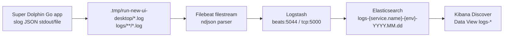

# ELK Logging

## Current Project Logging

Super Dolphin is a Go desktop/backend application with a Wails HTTP host and a React/Vite frontend. The main backend entrypoint is `cmd/agent-terminal`; the local Windows launcher is `run-new-ui-desktop.ps1`.

The backend already uses `pkg/logger`, a thin wrapper around Go `log/slog`. Application startup initializes file logging through `internal/app.NewLogger`, and the local launcher redirects backend stdout/stderr to `.tmp/run-new-ui-desktop/backend.log` and `.tmp/run-new-ui-desktop/backend.err.log`.

Existing observability support includes request/trace context in `pkg/logger`, Wails RPC trace propagation, and a local JSONL trace service under `internal/platform/observability`. The main gaps before this ELK setup were:

- stdout/file logs were not documented as an Elastic Stack ingestion contract;
- core JSON fields used mixed names such as `trace_id`, `duration_ms`, and `stacktrace`;
- the HTTP asset server did not emit one structured request log per request;
- no repository-local Filebeat/Logstash/Kibana startup config existed in this worktree.

## Recommended Architecture

The default path is file/stdout JSON logs collected by Filebeat and parsed by Logstash before indexing into Elasticsearch.



This fits the current project because the launcher already writes backend logs to files, production processes can keep writing the same JSON to stdout or file, and Filebeat handles rotation/restarts without requiring the application to know about Elasticsearch.

The optional direct input is:

```text
application or smoke test -> Logstash TCP JSON-lines :5000 -> Elasticsearch -> Kibana
```

## Log Fields

Application JSON logs use ECS-friendly field names:

```json
{
  "@timestamp": "2026-06-09T10:00:00.000Z",
  "service.name": "super-dolphin",
  "service.version": "dev",
  "env": "dev",
  "log.level": "info",
  "message": "http request",
  "trace.id": "32 lowercase hex chars",
  "span.id": "16 lowercase hex chars",
  "request_id": "request id",
  "request.method": "GET",
  "url.path": "/metrics",
  "http.response.status_code": 200,
  "event.duration": 12,
  "client.ip": "127.0.0.1",
  "error.message": "",
  "error.stack_trace": ""
}
```

Rules:

- `service.name` defaults to `super-dolphin`; override with `SUPER_DOLPHIN_SERVICE_NAME`.
- `service.version` defaults to `SUPER_DOLPHIN_SERVICE_VERSION`, `SUPER_DOLPHIN_UPDATE_VERSION`, or `dev`.
- `env` uses `SUPER_DOLPHIN_ENV`, `APP_ENV`, or `SUPER_DOLPHIN_RUNTIME_MODE`; supported values are `dev`, `test`, and `prod`.
- For ELK ingestion use `LOG_LEVEL=debug`, `info`, `warn`, or `error`; these keep JSON output. `LOG_LEVEL=development` is the explicit human-readable text mode.
- Error logs include `error.stack_trace` in JSON production logging mode.
- Sensitive keys and common token/password/API key patterns are redacted as `[REDACTED]`.
- HTTP request logs include method, path, status code, duration, client IP, request id, trace id, and response size.

## Start ELK

From the repository root:

```bash
docker compose -f docker-compose.elk.yml up -d
```

Default local ports:

- Elasticsearch: `9200`
- Logstash Beats input: `5044`
- Logstash JSON-lines TCP input: `5000`
- Kibana: `5601`

## Check Component Status

```bash
curl http://localhost:9200
curl http://localhost:9200/_cat/indices?v
docker compose -f docker-compose.elk.yml logs -f logstash
docker compose -f docker-compose.elk.yml logs -f filebeat
```

The main chain to verify is:

```text
application outputs JSON logs
-> Filebeat collects files
-> Logstash parses JSON
-> Elasticsearch creates logs-* index
-> Kibana Discover shows events
```

## Start The App Locally

In PowerShell:

```powershell
.\run-new-ui-desktop.ps1
```

The local launcher writes logs under:

```text
.tmp/run-new-ui-desktop/backend.log
.tmp/run-new-ui-desktop/backend.err.log
.tmp/run-new-ui-desktop/frontend.log
.tmp/run-new-ui-desktop/frontend.err.log
```

Filebeat watches `.tmp/**/*.log` and `logs/**/*.log`.

## Kibana

1. Open Kibana: [http://localhost:5601](http://localhost:5601)
2. Go to `Stack Management` -> `Data Views`
3. Create a Data View named `logs-*`
4. Select `@timestamp` as the time field
5. Open `Discover`

## Common KQL

Service:

```kql
service.name : "super-dolphin"
```

Environment:

```kql
env : "dev"
```

Errors:

```kql
log.level : "error"
```

Trace:

```kql
trace.id : "具体 trace id"
```

Endpoint:

```kql
url.path : "/metrics"
```

HTTP 500:

```kql
http.response.status_code >= 500
```

Slow requests, where `event.duration` is milliseconds:

```kql
event.duration > 1000
```

## Validation Checklist

- [ ] Start ELK with `docker compose -f docker-compose.elk.yml up -d`.
- [ ] Start the app with `.\run-new-ui-desktop.ps1`.
- [ ] Confirm backend logs are JSON lines in `.tmp/run-new-ui-desktop/backend.log`.
- [ ] Confirm Filebeat sees files: `docker compose -f docker-compose.elk.yml logs -f filebeat`.
- [ ] Confirm Logstash receives events: `docker compose -f docker-compose.elk.yml logs -f logstash`.
- [ ] Confirm Elasticsearch creates an index: `curl http://localhost:9200/_cat/indices?v`.
- [ ] Confirm Kibana Discover shows `logs-*`.
- [ ] Visit `http://127.0.0.1:4512/metrics` and query `url.path : "/metrics"`.
- [ ] Trigger or inspect an HTTP 500 path and verify `log.level : "error"` plus `error.stack_trace`.
- [ ] Copy a `trace.id` from a request log and query all logs for that trace id.

## Production Notes

- Keep the application JSON log format unchanged.
- Set `SUPER_DOLPHIN_ENV=prod`, `SUPER_DOLPHIN_SERVICE_NAME`, and `SUPER_DOLPHIN_SERVICE_VERSION`.
- Use a production-grade Filebeat or Elastic Agent deployment.
- Enable Elasticsearch and Kibana authentication, TLS, index lifecycle policies, and backups.
- Do not mount local `.tmp` paths in production; collect stdout or the production log directory.

## Rollback

To roll back the ELK integration:

1. Revert `pkg/logger`, `internal/app`, and `internal/ui/wails` changes to restore the previous JSON/text field behavior.
2. Remove `docker-compose.elk.yml`, `filebeat/filebeat.yml`, `logstash/pipeline/logstash.conf`, and this document.
3. Remove the ELK-related variables added to `.env.example`.

The application does not depend on ELK at runtime; if Filebeat, Logstash, Elasticsearch, or Kibana are down, Super Dolphin continues to run and write local logs.
