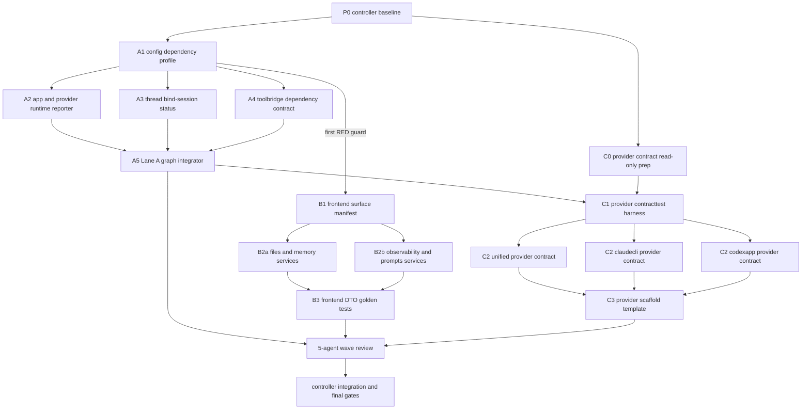

# AI Maintenance Boundaries Parallel Agent Orchestration

> Source of truth: [2026-07-07-ai-maintenance-boundaries.md](./2026-07-07-ai-maintenance-boundaries.md). This companion only defines dispatch, ownership, recovery, and adjudication. It must not weaken or replace any technical acceptance criteria in the source plan.

**Goal:** Turn the AI-maintenance-boundaries plan into executable multi-agent work while preserving fail-fast boundaries, file ownership, exact `agentid` provenance, and evidence-based review.

**Dispatch rule:** Use platform-native parallel agents directly for ordinary execution. Use `task_create_dag`, `task_start_dag`, `task_dispatch_node`, and `task_update_node` only when the controller needs durable DAG state, retry leases, or structured handoff records.

**Parallelism budget:** Run at most 5 implementation agents at the same time. Run a 5-agent read-only review ring after Wave 2, after Wave 4, and before final integration.

---

## Controller Contract

The controller owns orchestration, not implementation. It must:

1. Freeze the starting point with `git status --short`, `git rev-parse HEAD`, and a list of unrelated dirty files.
2. Assign one work package per agent and record the returned exact `agentid`.
3. Keep shared files serialized according to this document and the source plan.
4. Require every worker to report owned files, exact commands, LSP diagnostics evidence, blockers, and final diff summary.
5. Verify reports against the real worktree before accepting `DONE`, `PASS`, or `DONE_ALREADY_COMMITTED`.
6. Resume missing or late workers by their original `agentid`; do not replace them unless the agent is unrecoverable and the replacement is recorded.

Controller-only files:

| File or area | Rule |
|---|---|
| `docs/plans/2026-07-07-ai-maintenance-boundaries.md` | Update only when implementation discovers the source plan is wrong. |
| Generated code-map and project-map outputs | Update only after `make codemap-check` or `make project-map-check` reports drift and the generator refresh is run. |
| Shared final report or adjudication notes | Controller writes after validating worker evidence. |
| Cross-lane staging and commits | Controller stages hunk-by-hunk and excludes unrelated dirty work. |

---

## Execution Graph

Use this graph as the default DAG. A node may be split further only when the split keeps exclusive file ownership and has its own verification command.



Wave gates:

| Wave | Agents | Start condition | Stop condition |
|---|---|---|---|
| P0 | Controller only | Clean understanding of current worktree | Baseline report and owner table are written. |
| Wave 1 | A1, C0; B1 after A1 opens the first RED guard | P0 complete | A1 dependency types are available; B1 surface guard is ready; C0 has no code diff. |
| Wave 2 | A2, A3, A4, B2a, B2b | A1 complete; B1 complete for B2 nodes | Lane A subcontracts and frontend page services are independently tested. |
| Wave 3 | A5, B3; C1 after A5 finishes | A2/A3/A4 complete for A5; B2 complete for B3; C1 may prep read-only but must not write until A5 completes | Graph wiring, DTO golden tests, and provider harness are ready. |
| Wave 4 | C2u, C2c, C2x, C3 | C1 complete | All provider packages satisfy shared contract tests and template compiles. |
| Wave 5 | Five read-only reviewers, then controller | All implementation nodes report evidence | Final gates pass or blockers are explicitly recorded. |

---

## Work Packages

Each package below is a dispatchable unit. The source-plan task IDs are authoritative; if a worker finds a mismatch, the worker must stop and report `PLAN_BLOCKER`.

| Package | Source tasks | Agent role | Owned paths | May run with | Blocks |
|---|---|---|---|---|---|
| P0-controller-baseline | Current Boundary, Shared Ownership, Final Verification | Controller | No production source writes | None | All implementation |
| A1-config-profile | A1 | Go dependency-profile worker | `internal/contract/dependency.go`, `internal/contract/config.go`, `internal/platform/config/config.go`, `internal/platform/config/dependency_profile_test.go`, scoped config tests in `cmd/mcp-lsp` and `cmd/mcp-orch` | C0 read-only | A2, A3, A4, B1 |
| B1-frontend-surface | B1 | Frontend boundary worker | `frontend-app/src/pages/importSurfaceGuard.test-helper.js`, `frontend-app/src/pages/pageSurfaceManifest.js`, `frontend-app/src/pages/pageSurfaceManifest.test.js`, `frontend-app/src/pages/backendApiConsumer.surface.test.js` | C0; after A1 first RED guard | B2a, B2b |
| C0-provider-prep | C1-C3 read-only prep | Provider reviewer/prep worker | No writes, report only | A1, B1 | C1 |
| A2-app-runtime | A2, A3 runtime report subset | Go app/provider runtime-report worker | `internal/app/dependency_contract.go`, `internal/app/dependency_contract_test.go`, `internal/app/runtime_reporter_adapter.go`, `internal/provider/claudecli/module.go`, `internal/provider/claudecli/driver.go`, `internal/provider/claudecli/driver_capability_test.go`, `internal/provider/codexapp/module.go`, `internal/provider/codexapp/support.go`, `internal/provider/codexapp/driver_session_test.go`, `internal/provider/codexapp/runtime_report_session_url_test.go` | A3, A4, B2a, B2b | A5, C2c, C2x |
| A3-thread-bind | A4 source-plan task name: BindSessionGeneration behavior | Go thread worker | `internal/app/thread_orchestration_adapter.go`, `internal/app/thread_orchestration_adapter_test.go`, `internal/module/thread/lifecycle.go`, `internal/module/thread/bind_session_generation_status.go`, `internal/module/thread/lifecycle_bind_session_generation_test.go`, `internal/module/thread/module.go`, `internal/module/thread/service_constructor.go` | A2, A4, B2a, B2b | A5 |
| A4-toolbridge-contract | A5 source-plan task name: Toolbridge dependency contract | Go toolbridge worker | `internal/platform/toolbridge/module.go`, `internal/platform/toolbridge/handler.go`, `internal/platform/toolbridge/diff_gen.go`, `internal/platform/toolbridge/handler_managed_launch.go`, `internal/app/toolbridge_adapters.go` | A2, A3, B2a, B2b | A5 |
| B2a-files-memory | B2 | Frontend page-service worker | `frontend-app/src/pages/files/**`, `frontend-app/src/pages/memory/**`, matching adapters/services/tests | A2, A3, A4, B2b | B3 |
| B2b-observability-prompts | B2 | Frontend page-service worker | `frontend-app/src/pages/observability/**`, `frontend-app/src/pages/prompts/**`, `frontend-app/src/features/prompts/PromptPageView.jsx`, matching services/tests | A2, A3, A4, B2a | B3 |
| A5-lane-a-integrator | A2-A5 graph wiring | Go Fx graph integrator | `internal/app/modules.go`, `internal/app/modules_graph_test.go`, `internal/archtest/fx_graph_test.go`, Lane A graph-only hunk integration | B3 only if files do not overlap | C1 |
| B3-frontend-dto-golden | B3 | Frontend contract-test worker | `frontend-app/src/pages/shared/pageShared.js`, `frontend-app/src/pages/shared/sharedSurfaceBoundary.test.js`, `frontend-app/src/pages/shared/pageComponents.test.jsx`, `frontend-app/src/services/modules/fileService*`, `frontend-app/src/adapters/fileAdapter*`, `frontend-app/src/shared/api/backendApi.contractMatrix.test.js`, package parser dependency if required | A5 | Review |
| C1-contracttest-harness | C1 | Provider contract harness worker | `internal/provider/contracttest/suite.go`, `internal/provider/contracttest/suite_test.go`, provider snapshot fixture globs | None after A5 | C2u, C2c, C2x |
| C2u-unified-provider | C2 | Unified provider worker | `internal/provider/unified/contract_test.go`, `internal/provider/unified/provider_contract_test.go`, unified snapshots | C2c, C2x | C3 |
| C2c-claudecli-provider | C2 | Claude provider contract worker | `internal/provider/claudecli/provider_contract_test.go`, claudecli snapshots | C2u, C2x; after A2 provider runtime-report hunks are green | C3 |
| C2x-codexapp-provider | C2 | Codex provider contract worker | `internal/provider/codexapp/provider_contract_test.go`, codexapp snapshots | C2u, C2c; after A2 provider runtime-report hunks are green | C3 |
| C3-provider-template | C3 | Provider scaffold worker | `internal/provider/_template/**`, `internal/provider/provider_template_compile_test.go`, `internal/provider/provider_contract_manifest_test.go`, provider code-map text if source-plan requires it | None after C2 packages | Review |
| R-wave-review | All completed packages | Five independent read-only reviewers | No writes | Reviewers run in parallel | Controller integration |
| I-final-integration | Final Verification | Controller | Staging, generated maps only when checks require refresh, final report | None | Commit or push |

Shared-file serialization:

| Shared file | Writer sequence | Rule |
|---|---|---|
| `internal/app/modules.go` | A5 only | A2/A3/A4 must not patch this directly; they report needed providers and constructors. |
| `internal/app/modules_graph_test.go` | A5 first, then C3 only if provider scaffold graph coverage is needed | C3 must rebase on A5 and rerun graph tests. |
| `internal/archtest/fx_graph_test.go` | A5 only unless C3 requires a provider-scaffold guard | Any C3 change needs A5 owner review. |
| `internal/provider/claudecli/module.go`, `internal/provider/claudecli/driver.go`, `internal/provider/claudecli/driver_capability_test.go` | A2 only | C2c may read these files and add contract tests, but it must not rewrite provider runtime-report semantics without a source-plan patch. |
| `internal/provider/codexapp/module.go`, `internal/provider/codexapp/support.go`, `internal/provider/codexapp/driver_session_test.go`, `internal/provider/codexapp/runtime_report_session_url_test.go` | A2 only | C2x may read these files and add contract tests, but it must not rewrite provider runtime-report semantics without a source-plan patch. |
| `frontend-app/package.json`, `frontend-app/package-lock.json` | B3 only | Capture baseline diff before editing and stage only parser/DTO-test hunks. |
| Provider snapshot fixtures | C1/C2 provider workers only | Every changed JSON fixture must be inside the allowed `event_snapshots` or `prompt_snapshots` globs. |

---

## Dispatch Prompts

Use these prompt shapes when launching workers. Replace `<PACKAGE>` and `<SOURCE_TASKS>` with the package row above, and preserve the exact owned paths.

Implementation prompt:

```text
You are <PACKAGE> for docs/plans/2026-07-07-ai-maintenance-boundaries.md.

Scope:
- Implement only <SOURCE_TASKS>.
- Own only the paths listed in docs/plans/2026-07-07-ai-maintenance-boundaries-parallel-agents.md for <PACKAGE>.
- Preserve unrelated dirty files.
- Use LSP evidence before source behavior edits: locate, inspect, xref, read_file, diagnostics.
- Write RED tests first unless the source plan marks the step as read-only.
- Treat every LSP Error/Warning/Information/Hint in modified files as blocking.
- Do not edit generated code-map/project-map output directly.

Return:
- status: DONE_WITH_EVIDENCE, BLOCKED, or PLAN_BLOCKER
- agentid: exact platform id
- owned_files_changed:
- commands_run:
- lsp_evidence:
- tests_or_guards:
- blockers:
- next_required_package:
```

Read-only review prompt:

```text
You are review agent <REVIEW_ID> for the AI maintenance boundaries execution.

Review only. Do not edit files.
Focus:
- Verify reported owned files match the orchestration document.
- Check whether fail-fast, feature boundary, provider contract, LSP, and generated-file gates are actually satisfied.
- Look for hidden optional/noop/fallback behavior, frontend cross-feature leakage, provider scaffold gaps, and fake PASS evidence.
- Treat unsupported diagnostics or missing artifacts as blockers, not pass.

Return:
- verdict: PASS_WITH_GATES, PASS_FOR_EXECUTION_WITH_GATES, or FAIL_BLOCKING
- agentid:
- findings ordered by severity:
- required fixes:
- evidence checked:
```

Recovery prompt for late workers:

```text
Resume agentid <AGENTID>.
Report current status for package <PACKAGE> immediately.
Do not continue editing until you provide:
- last completed step
- current dirty files
- commands already run
- blockers or next command
```

---

## Required Worker Report

Every implementation worker must end with this block. The controller rejects reports that omit exact `agentid` or diagnostics status.

```text
PACKAGE:
STATUS: DONE_WITH_EVIDENCE | BLOCKED | PLAN_BLOCKER
AGENTID:
BASE_HEAD:
OWNED_FILES_CHANGED:
UNRELATED_DIRTY_FILES_PRESERVED:
LSP_EVIDENCE:
  locate:
  inspect:
  xref:
  read_file:
  diagnostics:
COMMANDS_RUN:
RED_TEST_EVIDENCE:
GREEN_TEST_EVIDENCE:
GENERATED_FILES:
BLOCKERS:
NEXT_PACKAGE:
```

Status meanings:

| Status | Meaning | Controller action |
|---|---|---|
| `DONE_WITH_EVIDENCE` | Worker produced diff and fresh verification evidence for all owned files. | Inspect diff, rerun focused checks, then advance dependent nodes. |
| `BLOCKED` | Source plan is still valid, but execution cannot continue. | Fix blocker, resume same `agentid`, or split package if ownership remains clean. |
| `PLAN_BLOCKER` | The source plan is incorrect, incomplete, or unsafe. | Stop implementation and patch the plan before continuing. |
| `NO_REPORT` | Worker did not return usable evidence. | Resume by exact `agentid`; do not infer PASS from silence. |

---

## Five-Agent Review Ring

Run this review ring after Wave 2, after Wave 4, and before final integration. Reviewers are read-only and parallel.

| Reviewer | Focus | Must check |
|---|---|---|
| R1 fail-fast/backend | Lane A contracts | Production-critical dependencies cannot silently degrade; typed unsupported behavior is explicit and observable. |
| R2 frontend boundary | Lane B surfaces | Pages call feature-owned services, DTO shaping is covered by golden tests, and entity store exceptions are not accidentally widened. |
| R3 provider contracts | Lane C | Every provider package has shared contract tests for event translation, prompt snapshot parity, approval, interrupt, resume, toolbridge, and runtime report. |
| R4 integration gates | Cross-lane verification | Owned files, generated maps, LSP diagnostics, guard commands, and snapshot artifact globs all match the source plan. |
| R5 adversarial review | False PASS and ownership drift | Worker claims match actual diffs; unrelated dirty files are not staged; missing diagnostics are blockers. |

Adjudication rule:

- `FAIL_BLOCKING` from any reviewer blocks the next wave until the controller either fixes it or records why it is out of scope with source evidence.
- `PASS_WITH_GATES` can advance only if all named gates are concrete commands or file checks in the next controller checklist.
- Empty, late, or unrecoverable reviewer reports are recorded as `NO_REPORT` and do not count as PASS.

---

## Verification Matrix

Workers run focused commands; the controller runs the full final surface.

| Package family | Focused verification |
|---|---|
| Lane A config/app/thread/toolbridge | `./scripts/test_with_guard.sh ./internal/platform/config ./internal/app ./internal/module/thread ./internal/platform/toolbridge ./internal/archtest -count=1` plus LSP diagnostics for modified Go files. |
| Lane B frontend | `cd frontend-app && npm run lint && npm test && npm run build` plus LSP diagnostics for modified JS/JSX source and test files. |
| Lane C provider contracts | `./scripts/test_with_guard.sh ./internal/provider/contracttest ./internal/provider/unified ./internal/provider/codexapp ./internal/provider/claudecli ./internal/provider ./internal/archtest -count=1` plus LSP diagnostics for modified Go files. |
| Generated docs/maps | `make codemap-check`, `make project-map-check`; refresh only when those checks report drift. |
| Final integration | Run every command in the source plan Final Verification section, then `git diff --check`. |

Controller final checklist:

- [ ] `git status --short` confirms unrelated dirty files are known and preserved.
- [ ] Every completed package has exact `agentid`, owned-file list, commands, and LSP diagnostics evidence.
- [ ] Every shared file follows the writer sequence above.
- [ ] Every read-only reviewer reported a verdict or was explicitly marked `NO_REPORT`.
- [ ] All `FAIL_BLOCKING` and `PLAN_BLOCKER` items are resolved before staging.
- [ ] Generated map files are either unchanged or produced by the documented refresh command.
- [ ] Final verification commands from the source plan pass, or blockers are recorded with exact command output.
