# V3 迁移执行工作流

版本：`2026-03-19`

状态：`已批准方案的执行版工作流`

适用仓库：`/Volumes/bot/super-agent-v3`

来源：

- `docs/plans/v3-migration-plan.md`
- `docs/契约/fx-convention.md`
- `docs/契约/rungroup-convention.md`
- `docs/契约/jrpc2-convention.md`
- `docs/契约/sqlc-convention.md`
- `docs/契约/statemachine-event-convention.md`

## 0. 执行基线

本文不是新的架构提案，而是把已经批准的 V3 迁移方案落成每日可执行的工程手册。

本文使用以下执行约定：

- `1 人天 = 1 个标准任务单元`。
- 多人并行时，可以在同一天领取多个 `Day N` 任务，但必须满足依赖关系。
- 本文沿用已批准方案中的 `internal/store/sqlcgen` 命名。
- 若当前工作树暂时仍存在 `internal/store/sqlc`，则 `P1 Day 1` 必须先统一命名，不允许长期双轨。
- `fx = 工厂`，只负责构造和生命周期。
- `oklog/run = 引擎`，只负责托管长跑 actor。
- 统一 `Runner` 接口：`Run(ctx context.Context) error`。
- 包结构执行 `platform/module/store/provider/tool/mcpserver` 混合方案。
- Codex/Claude 必须收敛到统一 Provider 语义层。
- MCP Server 最终只能收敛为三个独立 family binary：`mcp-lsp`、`mcp-orch`、`mcp-ida`。
- `sqlc` 是 20 个手写 Store 的替代方案，不允许出现长期双轨存活。

### 0.1 六个框架基线

| 领域 | 框架 | 版本 | 执行口径 |
|---|---|---:|---|
| DI + 生命周期 | `go.uber.org/fx` | `v1.24.0` | 工厂，不跑无限循环 |
| goroutine 编排 | `github.com/oklog/run` | `v1.2.0` | 引擎，统一退出语义 |
| RPC | `github.com/creachadair/jrpc2` | `v1.3.5` | 单一注册表、单一错误语义 |
| 状态机 | `github.com/qmuntal/stateless` | `v1.8.0` | 声明式迁移表 + matrix test |
| typed event | `github.com/kelindar/event` | `v1.5.2` | 进程内 typed bus |
| Store 生成 | `sqlc` | 方案锁定 | SQL 为源码，生成代码只读 |

### 0.2 全局禁止项

- [ ] 禁止在 constructor 中偷跑 goroutine。
- [ ] 禁止在 `fx.OnStart` 中塞无限循环。
- [ ] 禁止在 V3 中保留第二套 RPC 注册链。
- [ ] 禁止 `module/*` 直接 import `internal/store/sqlcgen`。
- [ ] 禁止通过 `DynamicTools` 穿过 runtime/service/provider 主链路。
- [ ] 禁止让 UI 层直接拥有 provider、store、transport concrete type。
- [ ] 禁止新建全量混编的 `cmd/mcp-server` 终态。
- [ ] 禁止出现 `effectiveState` 这类第二状态表示。

### 0.3 批次依赖总览

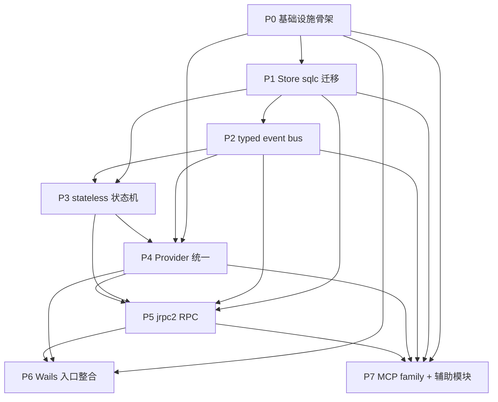

## 1. 每日工作流（Daily Workflow）

### 1.1 开发者每日标准流程

#### 开工前

- [ ] 拉取主干并确认当天基线分支是最新：`git fetch --all --prune && git rebase origin/main` 或团队约定的等价流程。
- [ ] 查看当前批次看板，确认自己领取的是哪个 `P{N}/Day{N}` 任务单元。
- [ ] 阅读前一天交接记录，确认未解决 blocker、风险、已知失败用例。
- [ ] 检查当天任务的输入是否齐全：接口、DTO、SQL、事件、状态机 spec、RPC contract、测试夹具。
- [ ] 先跑一轮最小基线校验：`go test ./...`、`go vet ./...`、`sqlc generate`。

#### 开发中

- [ ] 先补规格，再补实现；任何行为变化必须先落在测试或契约更新上。
- [ ] 先写模块边界，再写内部实现；避免先把 concrete type 拉通再回头抽象。
- [ ] 每完成一个子块，就本地做一次编译和最小测试，不把半失效状态拖到晚上。
- [ ] 若当日涉及 Store、RPC、状态机、事件其中任一关键面，必须同步补本面对应测试。
- [ ] 当天新增目录或模块时，必须同时补 `module.go`、测试、README 式注释或工作流记录。

#### 收工前

- [ ] 跑完当天任务要求的验证命令，不把“我本地还没测”留给下游。
- [ ] 更新批次记录：今天做了什么、产出了什么、剩余什么风险。
- [ ] 整理 commit，使每个 commit 对应一个可审查意图。
- [ ] 清理临时调试代码、临时日志、临时脚本、未使用 import。
- [ ] 把未完工项写成明确 blocker，不允许下游靠阅读 diff 猜测状态。

### 1.2 每日开发流图

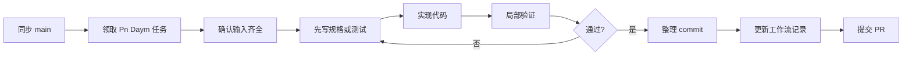

### 1.3 代码提交规范

#### 分支命名

- `feat/p0-skeleton-day3`
- `feat/p1-store-logging-day4`
- `feat/p5-rpc-thread-day4`
- `fix/p3-recovery-guard`
- `chore/p7-family-boundary-check`

#### commit 规范

- 一个 commit 只表达一个意图：例如“新增 thread repo adapter”而不是“顺手把 6 个模块都改了”。
- commit 标题格式建议：`P1: add thread runtime sqlc adapter`。
- 若变更同时包含代码和迁移文档，标题后半句必须说明主意图，而不是写“update files”。
- 大规模机械生成代码应单独提交，例如 `P1: regenerate sqlc output after query split`。
- 严禁把无关格式化、重命名、行为改动混在同一个 commit。

#### 提交前最低门槛

- [ ] `go test ./...` 通过或已记录明确例外。
- [ ] `go vet ./...` 通过。
- [ ] 若改了 SQL 或 migration，`sqlc generate` 已执行且生成物已纳入 diff。
- [ ] 若改了 module 边界，`fx.ValidateApp` 或等价对象图测试已通过。
- [ ] 若改了状态机或 RPC，matrix/contract/golden 至少新增一组覆盖。

### 1.4 PR 规范

#### PR 标题格式

- `P0: scaffold fx/run/sqlc skeleton`
- `P3: migrate recovery flow to stateless`
- `P5: register thread and turn handlers in jrpc2 map`

#### PR 描述必须包含

- 变更属于哪个批次、哪个 Day 单元。
- 本 PR 的输入依赖是否已经在主干。
- 输出文件或模块清单。
- 验证命令与结果。
- 风险点与回滚点。
- 是否影响其他批次并行工作。

#### PR 大小约束

- 单个 PR 优先控制在一个 Day 单元范围内。
- 超过 `800` 行手写差异时，必须拆 PR 或在描述中解释不可拆理由。
- 生成代码可单独放大，但必须与手写代码分层审查。
- 任何跨两个批次的 PR 都必须显式标记 `cross-batch`。

### 1.5 代码审查规范

#### 评审优先级

1. 先看行为风险：是否改变已批准契约。
2. 再看边界风险：是否违反模块依赖方向。
3. 再看生命周期：是否把运行逻辑塞回 `fx` 或把构造逻辑塞进 `run.Group`。
4. 再看可验证性：是否补了对应测试和封板证据。
5. 最后才看命名、格式和可读性微调。

#### 阻塞级问题

- 新增第二套 RPC 注册链。
- 业务模块直接 import `sqlcgen`。
- 在 constructor 中启动 goroutine。
- 事件总线重新落回 `map[string]any` payload。
- 状态机外另起一套可变状态字段。
- provider 重新携带 `DynamicTools` 贯穿主链路。
- MCP family 二进制相互链接。

#### 审查结论标签

- `blocker`：必须改，不改不能合并。
- `major`：应在本 PR 解决，除非明确记账到下一 Day。
- `minor`：可以跟进，不阻塞本次合并。
- `note`：仅作为知识同步，不要求修改。

### 1.6 PR 生命周期图

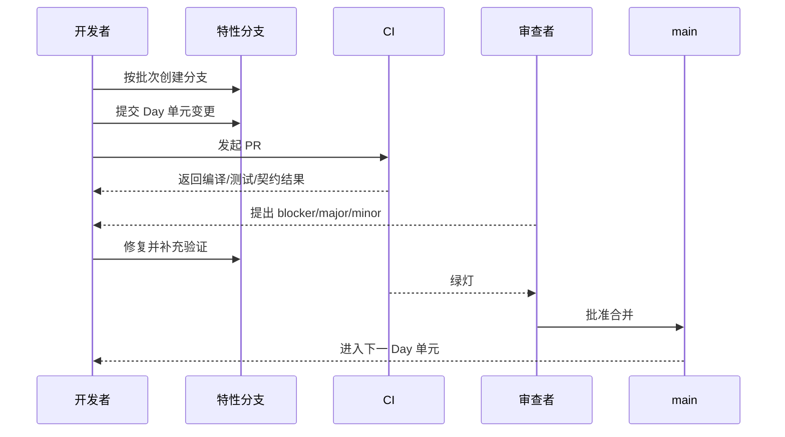

## 2. 批次工作流（Batch Workflow）

### 2.0 批次执行说明

- 批次内部按 `Day 1..Day N` 编排。
- 若团队并行执行，必须保证上游 `Day` 的输出已经进入主干或通过明确分支依赖固定。
- 每个 `Day` 块都是一个可提交、可审查、可验证的最小单元。
- 每个批次结束时必须满足本文的 `Done Criteria`，而不是只满足“代码大致写完”。

### 2.1 P0：基础设施骨架

依赖：无

目标：建立 `fx + run.Group + sqlc + 4 个 binary` 的 V3 可启动骨架。

#### Start Checklist

- [ ] 6 个框架版本已经锁定在 `go.mod`。
- [ ] 仓库根目录已存在 `sqlc.yaml`，且明确由 V3 使用。
- [ ] 目标目录树已经确认采用 `platform/module/store/provider/tool/mcpserver`。
- [ ] 团队已确认 `Runner` 统一接口为 `Run(ctx context.Context) error`。
- [ ] 团队已确认 MCP family 终态只有 `mcp-lsp`、`mcp-orch`、`mcp-ida`。
- [ ] 已确认不再以 `cmd/mcp-server` 作为 V3 终态。

#### Task Breakdown

##### Day 1

- 任务描述：锁定依赖版本、统一仓库根配置、建立基础目录树和 build target 占位。
- 输入：已批准框架版本表、`v3-migration-plan.md`、现有仓库根目录。
- 输出：`go.mod`、`go.sum`、`sqlc.yaml`、`Makefile` 中的 V3 构建入口约定、目标目录占位。
- 验证方式：`go mod tidy`、`go test ./...` 最小通过、依赖版本 grep 与批准列表一致。
- 预估时间：`1 人天`。

##### Day 2

- 任务描述：建立 `internal/app`、`internal/platform/config`、`internal/platform/runner` 骨架，并落 `Runner` value-group 宿主。
- 输入：Day 1 目录树、`fx` 与 `run.Group` 契约文档。
- 输出：`internal/app/module.go`、`internal/app/bootstrap.go`、`internal/platform/config/*`、`internal/platform/runner/*`、`internal/contract/runner/runner.go`。
- 验证方式：新增 `fx.ValidateApp` 或等价对象图测试，确认 `runners` group 可被收集且未启动业务循环。
- 预估时间：`1 人天`。

##### Day 3

- 任务描述：建立数据库生命周期、基线 migration 导入、`sql/queries` 目录和 `sqlc` 健康查询样例。
- 输入：现有 `migrations/*.sql`、`sqlc` 契约、Day 2 app/platform skeleton。
- 输出：`internal/platform/db/*`、`migrations/` 基线整理、`sql/queries/health.sql`、`internal/store/sqlcgen/` 生成占位。
- 验证方式：`sqlc generate` 成功、migration dry-run 成功、数据库 health query 可编译。
- 预估时间：`1 人天`。

##### Day 4

- 任务描述：建立 `cmd/agent-terminal` 与三个 MCP family 二进制骨架，并抽出 `internal/mcpserver/common`。
- 输入：Day 2 app skeleton、Day 3 db skeleton、MCP family 拆分决策。
- 输出：`cmd/agent-terminal/main.go`、`cmd/mcp-lsp/main.go`、`cmd/mcp-orch/main.go`、`cmd/mcp-ida/main.go`、`internal/mcpserver/common/*`。
- 验证方式：`go build ./cmd/agent-terminal ./cmd/mcp-lsp ./cmd/mcp-orch ./cmd/mcp-ida` 成功。
- 预估时间：`1 人天`。

##### Day 5

- 任务描述：补齐空启动/空退出 smoke、`fx` 对象图守护、family binary 构建守护和 import boundary 初版。
- 输入：Day 1-4 骨架代码。
- 输出：`internal/archtest/fx_graph_test.go`、`internal/archtest/import_boundary_test.go`、批次 smoke 脚本或测试夹具。
- 验证方式：四个目标二进制可构建、空启动/空退出通过、无 `sync.WaitGroup` 启停编排残留。
- 预估时间：`1 人天`。

#### Daily Checkpoints

- [ ] 当天新增模块都暴露 `Module`，没有手写大装配函数回潮。
- [ ] 当天新增 long-running 组件都通过 `Runner` 或 actor 桥接，不在 constructor 自启。
- [ ] `sqlc generate` 在当日结束前可以成功执行。
- [ ] 四个目标 binary 至少保持编译不退化。

#### Done Criteria

- [ ] `make build` 或等价构建可产出 `agent-terminal`、`mcp-lsp`、`mcp-orch`、`mcp-ida`。
- [ ] `internal/app` 中不存在手写对象大拼装。
- [ ] `cmd/*` 中不存在 `sync.WaitGroup` 启停编排。
- [ ] V3 仓库能空启动并优雅退出。

#### Risk Checks

- [ ] 风险：把 `fx` 当引擎使用。检查：搜索 `OnStart` 中是否存在无限循环或匿名 goroutine。
- [ ] 风险：把 `run.Group` 当 DI 容器使用。检查：确认 actor 只接收已构造依赖，不自行 new 资源。
- [ ] 风险：MCP family 名义拆分、实际混编。检查：`go list -deps ./cmd/mcp-lsp` 不得包含 IDA 包。
- [ ] 风险：sqlc 目录只是摆设。检查：Day 3 起每次 PR 都执行 `sqlc generate`。

### 2.2 P1：Store 层 sqlc 迁移

依赖：`P0`

目标：把 20 个手写 Store 收敛为 `sqlc + repo adapter`，并建立可持续演进的 repo integration 流程。

#### Start Checklist

- [ ] P0 已完成，`sqlc generate` 可在主干运行。
- [ ] 已确认 `internal/store/sqlcgen` 是 V3 唯一生成目录命名。
- [ ] 20 个 Store 已完成 inventory，并有 V2→V3 归宿表。
- [ ] 已确认 `DBQueryStore` 是唯一允许保留动态 SQL 的显式例外。
- [ ] 已确认 `module/*` 不允许直接 import `sqlcgen`。
- [ ] 已确认 `query_guard.go` 作为 SQL 安全策略统一入口。

#### Task Breakdown

##### Day 1

- 任务描述：完成 20 个 Store 的盘点、分组、命名统一和 `sqlcgen` 路径统一，消除 `sqlc/sqlcgen` 双轨命名风险。
- 输入：V2 `internal/store/*.go`、迁移归宿表、P0 目录骨架。
- 输出：Store 迁移清单、`internal/contract/store/*` 初版接口、命名统一 PR。
- 验证方式：仓库内对生成包的引用只保留一种命名；归宿清单覆盖 20 个 Store 无遗漏。
- 预估时间：`1 人天`。

##### Day 2

- 任务描述：完善 `sqlc.yaml`、queries 目录分层和通用 repo/tx/query guard 脚手架。
- 输入：Day 1 清单、`sqlc` 契约文档、现有 migration。
- 输出：最终版 `sqlc.yaml`、`sql/queries/` 分层目录、`internal/platform/db/query_guard.go`、事务辅助代码。
- 验证方式：`sqlc generate` 成功；`query_parameter_limit=0`、`emit_interface=true` 等关键配置符合约定。
- 预估时间：`1 人天`。

##### Day 3

- 任务描述：迁移日志与偏好组的 SQL 查询定义，包括 `system_log`、`audit_log`、`ai_log`、`bus_log`、`ui_preference`、`shared_file`。
- 输入：Day 2 queries 脚手架、现有表结构与 V2 Store 行为。
- 输出：`sql/queries/logging/*.sql`、`sql/queries/preference/*.sql`、对应生成代码。
- 验证方式：`sqlc generate` 无报错；关键查询可生成参数结构与返回模型。
- 预估时间：`1 人天`。

##### Day 4

- 任务描述：为日志与偏好组建立 repo adapter、接口、集成测试和 zero-row 语义测试。
- 输入：Day 3 生成代码、V2 行为规格、测试数据库夹具。
- 输出：`internal/store/logging/*`、`internal/store/preference/*`、对应 integration tests。
- 验证方式：happy path 与 zero-row/error path 测试通过；业务模块不直接依赖 `sqlcgen`。
- 预估时间：`1 人天`。

##### Day 5

- 任务描述：迁移线程与运行时组的 SQL 查询，包括 `agent_provider_binding`、`agent_thread`、`agent_status`、`cwd_lock`。
- 输入：Day 2 脚手架、V2 runtime/thread store 行为。
- 输出：`sql/queries/thread/*.sql`、`sql/queries/runtime/*.sql`、对应生成代码。
- 验证方式：查询生成通过；主键、索引与返回字段命名和 V3 DTO 对齐。
- 预估时间：`1 人天`。

##### Day 6

- 任务描述：为线程与运行时组建立 repo adapter、事务边界和并发语义测试。
- 输入：Day 5 生成代码、线程状态相关 DTO、并发约束需求。
- 输出：`internal/store/thread/*`、`internal/store/runtime/*`、锁语义与 upsert 行为测试。
- 验证方式：关键 repo 在真实 Postgres 上通过 happy path、conflict path、lock path 测试。
- 预估时间：`1 人天`。

##### Day 7

- 任务描述：迁移协作与编排组的 SQL 查询，包括 `task_ack`、`task_dag`、`task_dag_wakeup`、`task_trace`、`workspace_run`、`topology_approval`。
- 输入：Day 2 脚手架、DAG/workspace/orchestration 数据模型。
- 输出：`sql/queries/task/*.sql`、`sql/queries/workspace/*.sql`、`sql/queries/approval/*.sql`。
- 验证方式：所有关键表均有对应 query 文件；`sqlc generate` 生成期无歧义命名冲突。
- 预估时间：`1 人天`。

##### Day 8

- 任务描述：为协作与编排组建立 repo adapter，并补事务一致性、分页、幂等和 wakeup 语义测试。
- 输入：Day 7 生成代码、V2 行为 guard、workspace/DAG 使用面。
- 输出：`internal/store/task/*`、`internal/store/workspace/*`、`internal/store/approval/*`、integration tests。
- 验证方式：关键 repo 通过事务一致性测试；DAG/workspace 主流程可在 repo 层独立回放。
- 预估时间：`1 人天`。

##### Day 9

- 任务描述：迁移模板与交互组的 SQL 查询，包括 `prompt_template`、`command_card`、`interaction`、`db_query`。
- 输入：Day 2 脚手架、模板与交互模型、`DBQueryStore` 例外规则。
- 输出：`sql/queries/template/*.sql`、`sql/queries/interaction/*.sql`、`sql/queries/dbquery/*.sql`。
- 验证方式：常规查询由 `sqlc` 生成；动态 SQL 仅保留在明确例外封装中。
- 预估时间：`1 人天`。

##### Day 10

- 任务描述：为模板与交互组建立 repo adapter，并把 `DBQueryStore` 限定为只读、可审计、受 `query_guard` 保护的例外。
- 输入：Day 9 生成代码、查询安全策略、V2 交互行为测试。
- 输出：`internal/store/template/*`、`internal/store/interaction/*`、`internal/store/dbquery/*`、安全 guard 测试。
- 验证方式：动态 SQL 入口只有一处；危险语句、跨 schema、未授权查询均被 guard 拒绝。
- 预估时间：`1 人天`。

##### Day 11

- 任务描述：清理 legacy Store 调用面，统一 repo 接口导出、事务注入方式和共享错误语义。
- 输入：Day 4/6/8/10 适配层、业务模块调用点。
- 输出：统一版 `internal/store/*/module.go`、repo 接口、错误包装与 Tx helper。
- 验证方式：`rg` 搜索不再出现手写 SQL builder 式新实现；业务模块依赖的是 repo 接口而非表细节。
- 预估时间：`1 人天`。

##### Day 12

- 任务描述：跑完整 repo integration、schema drift、行为契约，并切断 V2 手写 Store 的主路径使用。
- 输入：Day 1-11 全量迁移结果。
- 输出：repo integration 套件、schema drift test、迁移完成记录与剩余例外表。
- 验证方式：20 个 repo 均有 query + adapter + test；`store_schema_guard` 等价验证通过；主流程不再走 legacy store。
- 预估时间：`1 人天`。

#### Daily Checkpoints

- [ ] 当天新增 `.sql` 都能通过 `sqlc generate`。
- [ ] 当天迁移的 repo 至少有一条 happy path integration test。
- [ ] 关键 repo 同时覆盖 zero-row 或 error path。
- [ ] `module/*` 没有新增对 `sqlcgen` 的直接依赖。

#### Done Criteria

- [ ] 20 个 repo 均有 `sqlc query + repo adapter`。
- [ ] V3 中不存在新的手写 SQL builder 式 Store。
- [ ] 所有写路径都通过 `internal/store/*` 或 `sqlcgen.Querier` 封装。
- [ ] schema drift、repo integration、行为契约全部通过。

#### Risk Checks

- [ ] 风险：生成目录命名双轨。检查：全仓只允许一种 `sqlcgen` 生成包引用路径。
- [ ] 风险：业务模块越层。检查：`rg "internal/store/sqlcgen" internal/module` 结果必须为 0。
- [ ] 风险：动态 SQL 回潮。检查：动态 SQL 仅允许在 `DBQueryStore` 例外封装内出现。
- [ ] 风险：schema/query 漂移。检查：CI 强制 `sqlc generate && git diff --exit-code`。

### 2.3 P2：事件总线 typed event

依赖：`P1`

目标：把总线从字符串 topic + 手写 payload 收敛到 `typed event + projection`。

#### Start Checklist

- [ ] P1 已完成，业务数据访问面稳定。
- [ ] 已完成 V2 事件 inventory，包含生命周期、turn、tool、task、workspace、UI projection 六类。
- [ ] 已确认事件总线只做分发，不承载持久化和 UI 变异逻辑。
- [ ] 已确认 `event.Publish(bus, ev)` / `event.Subscribe(bus, handler)` 是标准调用口径。
- [ ] 已确认不使用全局 `event.Default` 承担业务主流程。

#### Task Breakdown

##### Day 1

- 任务描述：完成事件 inventory、事件编号策略、typed event 定义和路由约定。
- 输入：V2 `internal/bus/*`、`server_event_handler.go`、P1 领域 DTO。
- 输出：`internal/contract/agent/event.go`、`internal/contract/task/event.go`、事件 type 编号表与 route 命名约定。
- 验证方式：所有业务事件都有显式 struct；不存在 `map[string]any` 作为公开业务 payload。
- 预估时间：`1 人天`。

##### Day 2

- 任务描述：建立 `internal/platform/bus` 包装层、发布/订阅 API、取消订阅协议和 module 暴露。
- 输入：Day 1 typed events、`kelindar/event` 契约、P0 `fx` 骨架。
- 输出：`internal/platform/bus/module.go`、`publisher.go`、`subscriber.go`、`registry.go`。
- 验证方式：publish/subscribe contract test 通过；订阅取消不会泄漏 goroutine。
- 预估时间：`1 人天`。

##### Day 3

- 任务描述：把 UI 投影、bus log sink、workspace/task 投影从总线主干中拆出来做独立订阅器。
- 输入：Day 2 bus wrapper、V2 事件处理大文件、P1 repo。
- 输出：`internal/module/uistate/projection.go`、`internal/module/*/subscriber.go`、bus log sink。
- 验证方式：`server_event_handler.go` 等价大管道被拆分；投影器只消费 typed events。
- 预估时间：`1 人天`。

##### Day 4

- 任务描述：补齐 event routing tests、typed payload 编译期检查并切断 legacy topic 常量主路径。
- 输入：Day 1-3 typed bus 结果。
- 输出：事件路由快照测试、projection contract tests、legacy bus 去主路径化改动。
- 验证方式：topic 常量不再作为公开主模型；主流程对 typed events 全链打通。
- 预估时间：`1 人天`。

#### Daily Checkpoints

- [ ] 总线主链路中没有新的 `map[string]any` 或 `json.RawMessage` 业务载荷。
- [ ] 订阅器都有明确取消路径，不依赖进程退出回收。
- [ ] 事件定义在 `contract` 或等价核心层，而不是散落在 UI/transport 层。
- [ ] 当天涉及的事件路由都有 snapshot 或 contract test。

#### Done Criteria

- [ ] 总线内部没有业务 `map[string]any` payload。
- [ ] topic 常量不再是公开主模型。
- [ ] 大型事件变异管道已拆成多个投影订阅器。
- [ ] 业务主流程走 typed event bus。

#### Risk Checks

- [ ] 风险：误用 `event.Default`。检查：搜索 `event.Emit` / `event.On` 是否进入业务主路径。
- [ ] 风险：事件只是换壳未分层。检查：投影、持久化、通知必须分订阅器实现。
- [ ] 风险：消息类型爆炸但未收口。检查：事件分类必须落在批准的六类中。
- [ ] 风险：取消订阅遗漏。检查：每个订阅器都要在 `interrupt` 或 `ctx.Done` 上释放。

### 2.4 P3：状态机 stateless 迁移

依赖：`P1`、`P2`

目标：把 AgentManager 及相关流程收敛为 `stateless + explicit actions + full matrix`。

#### Start Checklist

- [ ] P1、P2 已完成，repo 和 typed event 可用。
- [ ] 已完成 V2 状态与触发器 inventory。
- [ ] 已确认不允许保留 `effectiveState` 双表示。
- [ ] 已确认 `stateless.NewStateMachineWithMode(..., stateless.FiringQueued)` 作为默认 firing 模式。
- [ ] 已确认状态迁移表、动作、副作用、恢复入口分离存放。

#### Task Breakdown

##### Day 1

- 任务描述：盘点现有状态、触发器、恢复入口和隐式侧状态机，输出 V3 transition spec。
- 输入：V2 `internal/runner/manager*.go`、事件流、恢复逻辑。
- 输出：`transitions_spec.md` 或等价资产、V3 状态清单、V3 trigger 清单。
- 验证方式：每个 V2 主流程都能映射到至少一个 V3 state/trigger；无漏项。
- 预估时间：`1 人天`。

##### Day 2

- 任务描述：建立 `internal/platform/statemachine` 工厂和 `internal/sidecar/orch/orchestration` 中的 transition table。
- 输入：Day 1 transition spec、`stateless` 契约、P0 模块骨架。
- 输出：`internal/platform/statemachine/*`、`internal/sidecar/orch/orchestration/transitions.go`。
- 验证方式：状态机构造期可通过；未处理 trigger 返回 error 而非分散 panic。
- 预估时间：`1 人天`。

##### Day 3

- 任务描述：把 entry/exit/action/recovery side effects 从迁移表中分离到 `actions.go` 与 `recovery.go`。
- 输入：Day 2 状态机骨架、P2 typed events、P1 repo。
- 输出：`internal/sidecar/orch/orchestration/actions.go`、`recovery.go`、动作依赖接口。
- 验证方式：迁移表只表达 state/trigger/guard；副作用不内嵌在 table 构造链。
- 预估时间：`1 人天`。

##### Day 4

- 任务描述：实现 submission queue、turn accept/run/abort 流程，并接入 `run.Group` 托管 actor。
- 输入：Day 2-3 状态机与动作层、P0 Runner 宿主、P2 事件。
- 输出：`submission_queue.go`、队列 actor、turn 生命周期桥接代码。
- 验证方式：排队、受理、执行、停止路径均通过统一 trigger 驱动。
- 预估时间：`1 人天`。

##### Day 5

- 任务描述：建立外部状态存储与 UI 可见状态派生逻辑，删除 `effectiveState` 等价字段。
- 输入：Day 4 队列流程、UI 状态需求、P2 projection。
- 输出：状态持有器、`view.go` 或等价派生层、去双状态字段的改动。
- 验证方式：UI 可见状态仅由状态机状态 + queue 派生；搜索不到新的第二状态表示。
- 预估时间：`1 人天`。

##### Day 6

- 任务描述：补齐 full transition matrix、非法 trigger 测试、Mermaid/DOT 导出器和快照。
- 输入：Day 1-5 状态机实现。
- 输出：matrix tests、graph export tests、transition snapshot。
- 验证方式：每个状态的合法 trigger 集可枚举；导出的图与 spec 一致。
- 预估时间：`1 人天`。

##### Day 7

- 任务描述：补齐 recover、stop、queued firing、并发 fire、race 测试。
- 输入：Day 4-6 队列与状态机实现。
- 输出：recover matrix tests、stop ordering tests、race suite。
- 验证方式：恢复和停止路径不再依赖裸 goroutine；`-race` 通过。
- 预估时间：`1 人天`。

##### Day 8

- 任务描述：切断 legacy AgentManager 主路径，统一恢复入口和状态查询入口。
- 输入：Day 1-7 新实现、旧 manager 调用点。
- 输出：legacy manager 精简或替换、统一状态 facade、迁移完成说明。
- 验证方式：主流程不再依赖旧 `manager*.go` 隐式分支；矩阵测试全绿。
- 预估时间：`1 人天`。

#### Daily Checkpoints

- [ ] 所有状态切换都源于显式 trigger，而不是隐式字段赋值。
- [ ] 动作与迁移表分离，不在 `Configure(...).Permit(...)` 链里塞业务逻辑。
- [ ] `recover` 只有一个正式入口，不出现旁路 `go func()`。
- [ ] 每天新增的 trigger 都配对应合法/非法测试。

#### Done Criteria

- [ ] V3 中没有 `effectiveState` 这类并列可变状态字段。
- [ ] 所有合法状态迁移都能导出一张 matrix。
- [ ] recover 行为只在一个状态机入口上建模。
- [ ] queued firing、recover、stop、race 全部通过。

#### Risk Checks

- [ ] 风险：guard 不互斥导致 panic。检查：每个多 guard 迁移都写 true/false 双面测试。
- [ ] 风险：状态图和代码漂移。检查：Mermaid/DOT 来自同一份 transition spec。
- [ ] 风险：副作用回流到状态字段。检查：entry/exit/action 内不再手工维护第二状态。
- [ ] 风险：恢复路径旁路。检查：搜索裸 `triggerRecoverAsync` 等价代码必须为 0。

### 2.5 P4：Provider 统一

依赖：`P0`、`P2`、`P3`

目标：让 Claude/Codex 在统一 provider 语义层下运行，共享 turn prepare、skill resolve、prompt compose、manifest。

#### Start Checklist

- [ ] P0、P2、P3 已完成，Runner、typed event、状态机稳定。
- [ ] 已确认 provider 统一后的公共接口与 DTO 边界。
- [ ] 已确认 `SubmitWithSkillsAndOverrides` 不再作为 V3 公共接口存活。
- [ ] 已确认 `DynamicTools` 不允许穿透 runtime/service/provider 主链路。
- [ ] 已确认 MCP manifest 来自 family binary，而不是 driver 私下拼 schema。

#### Task Breakdown

##### Day 1

- 任务描述：梳理 Claude/Codex 能力矩阵、共性/差异表，落统一 provider contract。
- 输入：现有 Claude/Codex provider transport slices、迁移方案第 3 章。
- 输出：`internal/contract/provider/*`、capability matrix、统一 driver 接口定义。
- 验证方式：所有现有主流程能力都可在统一 contract 中表达；无 provider 特定语义泄漏到上层。
- 预估时间：`1 人天`。

##### Day 2

- 任务描述：建立 provider-neutral DTO、session/turn/request/result 模型和统一 service skeleton。
- 输入：Day 1 contract、P3 状态机需求、P2 事件模型。
- 输出：`internal/provider/unified/types.go`、`service.go`、`capabilities.go`。
- 验证方式：上层 orchestration 只依赖 unified DTO，不依赖 Claude/Codex concrete type。
- 预估时间：`1 人天`。

##### Day 3

- 任务描述：把 Claude transport/runtime 接到统一 driver 接口，保留其 provider-specific 细节在 driver 内部。
- 输入：Day 1-2 unified contract、现有 Claude transport。
- 输出：`internal/provider/claudecli/driver.go`、`module.go`、适配层初版。
- 验证方式：Claude driver 可被 unified service 调起；上层不需知道 CLI 细节。
- 预估时间：`1 人天`。

##### Day 4

- 任务描述：完成 Claude event normalization，把原始 stream/CLI event 映射到统一 typed event。
- 输入：Day 3 Claude driver、P2 typed event 模型。
- 输出：`internal/provider/claudecli/event_map.go`、event contract tests。
- 验证方式：Claude 生命周期事件可映射到统一事件集；快照测试通过。
- 预估时间：`1 人天`。

##### Day 5

- 任务描述：把 Codex transport/runtime 接到统一 driver 接口，并隔离 app-server / JSON-RPC 细节。
- 输入：Day 1-2 unified contract、现有 Codex transport。
- 输出：`internal/provider/codexapp/driver.go`、`module.go`、适配层初版。
- 验证方式：Codex driver 可通过 unified service 调起；transport 细节未泄漏到 orchestration。
- 预估时间：`1 人天`。

##### Day 6

- 任务描述：完成 Codex event normalization，把 notification/callback/output 事件统一映射到 typed event。
- 输入：Day 5 Codex driver、P2 typed event 模型。
- 输出：`internal/provider/codexapp/event_map.go`、parity snapshot tests。
- 验证方式：Codex 和 Claude 的统一事件视图可以走同一套 contract suite。
- 预估时间：`1 人天`。

##### Day 7

- 任务描述：收敛 turn prepare 流程，包括 request normalization、thread binding、上下文准备、启动参数装配。
- 输入：Day 2 unified service、P1 repo、P3 状态机。
- 输出：`internal/provider/unified/prepare.go`、turn request pipeline。
- 验证方式：两个 provider 都通过同一套 prepare 流程，driver 只接收已归一化请求。
- 预估时间：`1 人天`。

##### Day 8

- 任务描述：收敛 skill resolve、prompt compose、history merge、override merge，删除 `SubmitWithSkillsAndOverrides` 残余路径。
- 输入：Day 7 request pipeline、技能与模板模块、旧公共 API。
- 输出：`internal/provider/unified/prompt_compose.go`、`skill_resolve.go`、`history.go`。
- 验证方式：公共入口不再暴露 `SubmitWithSkillsAndOverrides`；功能保留在 unified service 内部。
- 预估时间：`1 人天`。

##### Day 9

- 任务描述：建立统一 MCP manifest builder，按 `mcp-lsp`、`mcp-orch`、`mcp-ida` family 组装工具面。
- 输入：MCP family 拆分决策、P7 目标边界、Day 7-8 unified pipeline。
- 输出：`internal/provider/unified/mcp_manifest.go`、family capability filters。
- 验证方式：driver 不再私下拼 tool schema；manifest tests 通过。
- 预估时间：`1 人天`。

##### Day 10

- 任务描述：把 unified provider 接入 orchestration 模块、状态机和 Runner，形成完整 runtime 主链。
- 输入：Day 3-9 driver/unified 结果、P3 orchestration。
- 输出：`internal/sidecar/orch/orchestration/provider_bridge.go`、统一 provider registry。
- 验证方式：orchestration 只依赖 unified provider facade；Claude/Codex 可热切换或按能力选择。
- 预估时间：`1 人天`。

##### Day 11

- 任务描述：建立 dual-provider parity tests，覆盖 turn request、typed event、manifest、error shape。
- 输入：Day 1-10 provider 统一结果、V2 行为规格、P2 事件模型。
- 输出：driver contract suite、parity snapshots、regression cases。
- 验证方式：Claude/Codex 对同一输入满足统一 contract，不允许主链语义分叉。
- 预估时间：`1 人天`。

##### Day 12

- 任务描述：切断 legacy adapter、`DynamicTools` 直传和 provider-specific 主链分支，完成 P4 封板验证。
- 输入：Day 1-11 结果、legacy 入口与调用点。
- 输出：legacy 适配层裁剪、迁移完成说明、封板证据。
- 验证方式：搜索不到公共链路 `DynamicTools`；两端 provider 共走 unified pipeline。
- 预估时间：`1 人天`。

#### Daily Checkpoints

- [ ] 当天新增公共接口不带 provider-specific 字段。
- [ ] 上层 orchestration 只依赖 unified facade。
- [ ] 任意工具面都来自 MCP manifest，而不是 driver 私下组装。
- [ ] 每天至少补一组 Claude/Codex parity 或 contract 测试。

#### Done Criteria

- [ ] `SubmitWithSkillsAndOverrides` 不再出现在 V3 公共接口中。
- [ ] `DynamicTools []...` 不再穿过 runtime/service/provider 主链路。
- [ ] Claude/Codex 共走统一 turn prepare、skill resolve、prompt compose、MCP manifest。
- [ ] dual-provider parity tests 通过。

#### Risk Checks

- [ ] 风险：统一层只包了名字，语义仍分叉。检查：同一 contract suite 同时跑 Claude/Codex。
- [ ] 风险：driver 私下拼 schema。检查：manifest builder 必须在 unified 层而非 driver 内。
- [ ] 风险：兼容 API 借壳复活。检查：搜索 `SubmitWithSkillsAndOverrides` 与 `DynamicTools` 主链结果必须归零。
- [ ] 风险：provider 判断泄漏到业务层。检查：`provider == "codex"` 只能出现在 driver registry 或 capability table。

### 2.6 P5：RPC 层 jrpc2 迁移

依赖：`P1`、`P2`、`P3`、`P4`

目标：把 129 个方法全部收敛到统一 `handler.Map`，并建立中间件化的 JSON-RPC 语义层。

#### Start Checklist

- [ ] P1-P4 已完成，repo、typed event、状态机、provider unified 可用。
- [ ] 已完成 129 个方法 inventory 和分组。
- [ ] 已确认只允许一个统一注册表。
- [ ] 已确认公共参数默认采用对象参数，禁用长期数组参数契约。
- [ ] 已确认错误统一映射到 `*jrpc2.Error`。
- [ ] 已确认 `threadId` 这类必填约束走 middleware 或 request `Validate()`，不手工散落在 handler。

#### Task Breakdown

##### Day 1

- 任务描述：完成 129 方法 inventory、V2→V3 注册归宿表和 handler 分组计划。
- 输入：V2 `methods*.go`、dashboard/workspace/orchestration 方法集、迁移清单。
- 输出：RPC 方法矩阵、模块归属表、handler 分组计划。
- 验证方式：129 个方法全部有归宿；无“以后再看”的未分类方法。
- 预估时间：`1 人天`。

##### Day 2

- 任务描述：建立 `internal/platform/rpc` 基础设施，包括 server、registry、transport、middleware 链、request context。
- 输入：Day 1 方法矩阵、`jrpc2` 契约、P0/P4 skeleton。
- 输出：`internal/platform/rpc/module.go`、`server.go`、`registry.go`、`middleware.go`、`errors.go`。
- 验证方式：可启动空 `jrpc2.Server`；中间件链可装配到统一 assigner。
- 预估时间：`1 人天`。

##### Day 3

- 任务描述：迁移 `initialize` 与 `config` 相关方法，建立基础 request/response 模板和严格参数检查。
- 输入：Day 1 矩阵、Day 2 rpc 平台、初始化与配置模块 facade。
- 输出：`internal/module/*/rpc_initialize.go`、`rpc_config.go`、strict request validators。
- 验证方式：`handler.Check(...).AllowArray(false).SetStrict(true)` 生效；schema contract 通过。
- 预估时间：`1 人天`。

##### Day 4

- 任务描述：迁移 `thread` 相关方法，建立 thread scope middleware 与 thread facade 绑定。
- 输入：Day 2 rpc 平台、thread module facade、P1 thread repo。
- 输出：`rpc_thread.go`、thread scope middleware、thread request/response DTO。
- 验证方式：thread 相关方法全部进入统一注册表；不在 handler 内散落手工 threadId 检查。
- 预估时间：`1 人天`。

##### Day 5

- 任务描述：迁移 `turn` 相关方法，打通 turn start/stop/input/recover 与 orchestration/provider unified。
- 输入：Day 4 thread handlers、P3 orchestration、P4 provider unified。
- 输出：`rpc_turn.go`、turn validators、turn golden cases。
- 验证方式：turn 主流程走统一 facade；response shape contract 通过。
- 预估时间：`1 人天`。

##### Day 6

- 任务描述：迁移 `skills` 与 `command` 相关方法，统一模板/命令卡/技能入口。
- 输入：Day 2 rpc 平台、P1 template repo、技能模块 facade。
- 输出：`rpc_skills.go`、`rpc_command.go`、对应 contract tests。
- 验证方式：技能与命令方法走模块 facade，不直接触碰 store concrete type。
- 预估时间：`1 人天`。

##### Day 7

- 任务描述：迁移 `workspace` 相关方法，打通 workspace run/create/list/merge/abort 流程。
- 输入：workspace module facade、P1 workspace repo、Day 2 rpc 平台。
- 输出：`rpc_workspace.go`、workspace response contracts、integration-backed rpc tests。
- 验证方式：workspace 方法全部在注册表中可枚举；关键 happy path contract 通过。
- 预估时间：`1 人天`。

##### Day 8

- 任务描述：迁移 `ui` 与 `dashboard` 相关方法，把 UI 观察面接到 facade，而不是 server God Object。
- 输入：UI runtime facade、dashboard facade、Day 2 rpc 平台。
- 输出：`rpc_ui.go`、`rpc_dashboard.go`、UI response/golden tests。
- 验证方式：handler 只依赖 UI facade；不存在 `Server` 型大对象贯穿。
- 预估时间：`1 人天`。

##### Day 9

- 任务描述：迁移 `orchestration` 相关方法，接通 DAG、agent、task 管理入口。
- 输入：orchestration module facade、P1 task/workspace repo、P3 状态机。
- 输出：`rpc_orchestration.go`、DAG/agent contract tests。
- 验证方式：编排方法在统一注册表中完整出现；调用链不穿透到底层 transport。
- 预估时间：`1 人天`。

##### Day 10

- 任务描述：迁移 `log`、`debug`、内部管理类方法，统一错误和审计日志映射。
- 输入：log/debug 模块、Day 2 rpc 平台。
- 输出：`rpc_log.go`、`rpc_debug.go`、审计中间件接入点。
- 验证方式：敏感方法走统一审计链；错误 shape 一致。
- 预估时间：`1 人天`。

##### Day 11

- 任务描述：实现 capability guard、approval、logging、thread scope 等通用 middleware，并从 handler 中删掉重复包装代码。
- 输入：Day 3-10 handlers、V2 手写包装逻辑、审批与能力规则。
- 输出：`internal/platform/rpc/middleware_*.go`、通用装饰器链。
- 验证方式：`withRequiredThreadID` 等价逻辑从 handler 中移除；中间件单测通过。
- 预估时间：`1 人天`。

##### Day 12

- 任务描述：统一 `*jrpc2.Error` 映射、invalid params 处理、strict object param 规则和 callback/notify 语义。
- 输入：Day 2 rpc errors/middleware、现有错误处理逻辑。
- 输出：错误码映射表、request validator helper、通知/回调支持代码。
- 验证方式：所有公共错误都能映射为清晰 JSON-RPC 语义；协议测试通过。
- 预估时间：`1 人天`。

##### Day 13

- 任务描述：建立 registry completeness test，确保 129 方法全部在统一注册表中可枚举。
- 输入：Day 1 方法矩阵、Day 3-12 全量 handlers。
- 输出：registry completeness test、方法快照、缺失方法 guard。
- 验证方式：测试明确比较 inventory 与注册表；无遗漏无重复。
- 预估时间：`1 人天`。

##### Day 14

- 任务描述：建立 schema contract、golden response tests，迁移 V2 的 RPC 行为规格。
- 输入：V2 golden/contract tests、Day 3-13 handlers。
- 输出：RPC schema contract suite、golden responses、更新说明。
- 验证方式：关键方法 response shape 与批准规格一致；不再依赖 AST guard 锁行为。
- 预估时间：`1 人天`。

##### Day 15

- 任务描述：补齐 JSON-RPC protocol tests，包括 batch、notify、callback、transport framing、server local harness。
- 输入：Day 2 rpc 平台、Day 12 notify/callback 支持、`jrpc2` 测试夹具。
- 输出：protocol tests、local server harness、transport smoke tests。
- 验证方式：batch/notify/callback 路径都可验证；`server.Local` 或等价夹具通过。
- 预估时间：`1 人天`。

##### Day 16

- 任务描述：切断 legacy 注册链、`server_context.go` 等 nil-guard 汇总逻辑，并完成 RPC 封板验收。
- 输入：Day 1-15 全量迁移结果、legacy server 入口。
- 输出：legacy registration path 清理、封板证据、迁移完成记录。
- 验证方式：统一注册表枚举 129 方法；不存在第二套注册链；God Object server 不再承担主路径。
- 预估时间：`1 人天`。

#### Daily Checkpoints

- [ ] 当天新增方法都进入统一 `handler.Map`。
- [ ] handler 只依赖模块 facade，不依赖 store concrete type。
- [ ] 必填校验优先放在 middleware 或 request `Validate()`。
- [ ] 当天方法都至少补一条 schema/golden/contract/protocol 覆盖。

#### Done Criteria

- [ ] 129 方法都能在统一注册表中被枚举。
- [ ] V3 没有第二套手写注册链。
- [ ] `server_context.go` 一类 nil-guard 汇总文件不存在等价物。
- [ ] schema contract、golden response、protocol tests 全部通过。

#### Risk Checks

- [ ] 风险：方法虽然迁了，但仍靠 God Object。检查：handler 依赖必须是 facade 接口或 service，而不是 `*Server`。
- [ ] 风险：threadId 校验继续散落。检查：搜索手工 threadId 判空代码并收敛到 middleware/validator。
- [ ] 风险：错误语义漂移。检查：公共错误统一经过 `*jrpc2.Error` 映射函数。
- [ ] 风险：第二注册链复活。检查：全仓只允许一个 registry 聚合入口。

### 2.7 P6：入口层 Wails 集成

依赖：`P0`、`P4`、`P5`

目标：把入口层收敛为薄装配层，让 Wails 只拿 facade，不重新持有整台后端对象图。

#### Start Checklist

- [ ] P0、P4、P5 已完成，四个 binary、provider unified、RPC 层稳定。
- [ ] 已确认 `cmd/agent-terminal` 是桌面入口主命令。
- [ ] 已确认 Wails 只通过 facade 与后端交互。
- [ ] 已确认 dashboard server 下沉到 `internal/ui/dashboard`。
- [ ] 已确认入口层不再使用手写 `sync.WaitGroup` 启停链。

#### Task Breakdown

##### Day 1

- 任务描述：盘点现有入口、Wails app、dashboard、server 命令的职责，输出新的启动/停止序列图。
- 输入：现有 `cmd/agent-terminal/*`、`cmd/server/*`、`internal/dashboard/*`。
- 输出：入口职责表、启动序列图、旧命令归宿表。
- 验证方式：每个入口职责在新结构中有明确落点；不再让 app struct 直接拥有后端大对象图。
- 预估时间：`1 人天`。

##### Day 2

- 任务描述：把 `cmd/agent-terminal` 改造成 `fx` app + Wails app 的薄组合入口。
- 输入：Day 1 序列图、P0 app skeleton、P5 RPC facade。
- 输出：`cmd/agent-terminal/main.go`、bootstrap wiring、debug flag 接线。
- 验证方式：入口只负责创建 app 和生命周期衔接；不直接 new 各模块。
- 预估时间：`1 人天`。

##### Day 3

- 任务描述：建立 `internal/ui/runtime` facade，把 UI 需要的动作和投影口从后端模块收口出来。
- 输入：P2 projection、P5 RPC/UI handlers、Wails 绑定需求。
- 输出：`internal/ui/runtime/*`、UI facade 接口、Wails bindings。
- 验证方式：Wails 只依赖 UI facade；不越层访问 store/provider/transport。
- 预估时间：`1 人天`。

##### Day 4

- 任务描述：把 dashboard server、SSE/WS bridge 下沉到 `internal/ui/dashboard`，与主 app 生命周期对齐。
- 输入：Day 2 agent-terminal 入口、现有 dashboard 服务、P5 RPC 层。
- 输出：`internal/ui/dashboard/*`、bridge actor、dashboard module。
- 验证方式：dashboard 可以独立跟随 app 启停；桥接逻辑由 `run.Group` 托管。
- 预估时间：`1 人天`。

##### Day 5

- 任务描述：统一 signal shutdown、Wails close、actor interrupt、fx stop 顺序，消除手写 WaitGroup 收尾。
- 输入：Day 2-4 入口整合结果、`run.Group` 契约。
- 输出：关闭序列实现、shutdown tests、debug logs。
- 验证方式：`SIGINT/SIGTERM`、窗口关闭、RPC server stop 都能优雅收敛。
- 预估时间：`1 人天`。

##### Day 6

- 任务描述：补齐 desktop smoke，验证 `thread/start`、`turn/start`、`workspace/run/create`、`agent.launch` 四条主路径。
- 输入：Day 2-5 入口与 UI 整合结果、P5 handlers、P4 provider。
- 输出：desktop smoke suite、关键路径记录、失败诊断说明。
- 验证方式：四条主路径在桌面环境可实际驱动；UI 观察面更新正常。
- 预估时间：`1 人天`。

##### Day 7

- 任务描述：清理 legacy 入口、构建/打包脚本、debug 启动脚本，完成 P6 封板。
- 输入：Day 1-6 成果、Makefile/脚本现状。
- 输出：入口清理 PR、构建命令说明、封板证据。
- 验证方式：桌面 app 能完整启动 V3 后端；无手写 WaitGroup 启停；旧命令不再承担主路径。
- 预估时间：`1 人天`。

#### Daily Checkpoints

- [ ] `cmd/agent-terminal` 只做装配，不做业务编排。
- [ ] UI 层只拿 facade，不拿具体 store/provider/transport。
- [ ] 所有长跑部件都由 `run.Group` 托管。
- [ ] 每天至少跑一次桌面或入口 smoke。

#### Done Criteria

- [ ] Desktop app 能完整启动 V3 后端。
- [ ] UI 能正常发起 `thread/start`、`turn/start`、`workspace/run/create`、`agent.launch`。
- [ ] 启停链不依赖 `sync.WaitGroup` 人工收尾。
- [ ] Wails 与后端边界清晰，入口层为薄装配层。

#### Risk Checks

- [ ] 风险：Wails 重新绑定整台对象图。检查：UI 只依赖 facade，禁止下钻 concrete type。
- [ ] 风险：dashboard 独立出第二生命周期。检查：dashboard actor 进入统一 `run.Group`。
- [ ] 风险：关闭顺序死锁。检查：signal、window close、rpc stop 都跑 shutdown smoke。
- [ ] 风险：旧入口“暂时保留”变长期共存。检查：主路径只允许一个桌面入口。

### 2.8 P7：辅助模块 MCP family

依赖：`P0`、`P1`、`P2`、`P4`、`P5`

目标：把工具与边缘复杂度重构为 family binary + module/tool/mcpserver 分层体系。

#### Start Checklist

- [ ] P0、P1、P2、P4、P5 已完成。
- [ ] 已确认 family binary 只有 `mcp-lsp`、`mcp-orch`、`mcp-ida`。
- [ ] 已确认三者只能共享 `internal/mcpserver/common`。
- [ ] 已确认 tool registry 必须按 family 导出固定 schema 集。
- [ ] 已确认 workspace、skills、DAG、IDA 的归宿模块和调用边界。

#### Task Breakdown

##### Day 1

- 任务描述：建立 `internal/mcpserver/common` 的标准 runtime、stdio framing、common request/response、family contract。
- 输入：P0 skeleton、P5 RPC/MCP contract、family 拆分决策。
- 输出：`internal/mcpserver/common/*`、family shared harness、stdio contract 夹具。
- 验证方式：common runtime 可被三个 family 复用；未泄漏 family-specific 依赖。
- 预估时间：`1 人天`。

##### Day 2

- 任务描述：建立 LSP family 的 tool registry、module wiring 和 `cmd/mcp-lsp` 二进制。
- 输入：Day 1 common runtime、LSP/RUN 工具清单、P4 manifest 需求。
- 输出：`cmd/mcp-lsp/*`、`internal/tool/lsp/*`。
- 验证方式：`mcp-lsp` 仅导出 LSP + RUN 工具；可独立 build。
- 预估时间：`1 人天`。

##### Day 3

- 任务描述：补齐 LSP family 的 `tools/list` schema snapshot、`tools/call` contract、stdio framing 和 build smoke。
- 输入：Day 2 LSP family 实现、P5 MCP contract 规则。
- 输出：LSP family contract suite、schema snapshot、build smoke。
- 验证方式：`go build ./cmd/mcp-lsp` 通过；schema snapshot 稳定。
- 预估时间：`1 人天`。

##### Day 4

- 任务描述：建立 orchestration family 的 tool registry、module wiring 和 `cmd/mcp-orch` 二进制。
- 输入：Day 1 common runtime、workspace/DAG/编排工具清单。
- 输出：`internal/mcpserver/orch/*`、`internal/tool/orchestration/*`、`cmd/mcp-orch/main.go`。
- 验证方式：`mcp-orch` 仅导出 orchestration、DAG、workspace 相关工具；可独立 build。
- 预估时间：`1 人天`。

##### Day 5

- 任务描述：把 workspace、skills、approval、DAG 节点操作接入 orchestration family，形成完整工具闭环。
- 输入：Day 4 orch family、P1 workspace/task repo、P5 orchestration RPC。
- 输出：workspace/skills/dag tools、approval 集成、family manifests。
- 验证方式：编排 family 工具面能实际驱动 DAG/workspace 主流程。
- 预估时间：`1 人天`。

##### Day 6

- 任务描述：补齐 orchestration family 的 schema contract、stdio contract、workspace integration 和 build smoke。
- 输入：Day 4-5 orch family 结果。
- 输出：orch family contract suite、workspace integration tests、build smoke。
- 验证方式：`go build ./cmd/mcp-orch` 通过；workspace 主路径测试通过。
- 预估时间：`1 人天`。

##### Day 7

- 任务描述：建立 IDA family 的 tool registry、module wiring 和 `cmd/mcp-ida` 二进制，接入 capability-based attach。
- 输入：Day 1 common runtime、IDA 能力与挂载规则、P4 capability matrix。
- 输出：`internal/mcpserver/ida/*`、`internal/tool/ida/*`、`cmd/mcp-ida/main.go`。
- 验证方式：IDA 仅按线程能力挂载；二进制可独立 build。
- 预估时间：`1 人天`。

##### Day 8

- 任务描述：补齐 IDA smoke、`tools/list`/`tools/call` contract、heavy path 例外说明和隔离策略。
- 输入：Day 7 IDA family 结果、IDA 运行前置条件。
- 输出：IDA family contract suite、smoke tests、环境前提文档。
- 验证方式：`go build ./cmd/mcp-ida` 通过；IDA attach 与 capability 逻辑符合预期。
- 预估时间：`1 人天`。

##### Day 9

- 任务描述：建立 family boundary CI 检查，验证三者依赖互不串线，并清理“运行时注册所有工具”的残余设计。
- 输入：Day 2-8 family 实现、依赖边界规则。
- 输出：boundary check 脚本、`go list -deps` 守护、残余混编清理 PR。
- 验证方式：`mcp-lsp` 不依赖 IDA；`mcp-ida` 不依赖 LSP/orch；family registry 固定化。
- 预估时间：`1 人天`。

##### Day 10

- 任务描述：做三 family 全链路 smoke、provider manifest 联调、封板记录和运维说明。
- 输入：Day 1-9 family 结果、P4 manifest builder、P6 桌面入口。
- 输出：family 全链 smoke、manifest 联调记录、封板证据。
- 验证方式：三个 binary 独立构建、独立契约通过；桌面与 provider 能正确感知 family 健康状态。
- 预估时间：`1 人天`。

#### Daily Checkpoints

- [ ] family 之间只共享 `internal/mcpserver/common`。
- [ ] 每天至少有一个 family build smoke 通过。
- [ ] tool schema 从固定 registry 导出，而不是运行时全量拼装。
- [ ] `go list -deps` 边界检查每天更新一次。

#### Done Criteria

- [ ] `go build ./cmd/mcp-lsp`、`go build ./cmd/mcp-orch`、`go build ./cmd/mcp-ida` 全部通过。
- [ ] 三个 family 的 schema contract、stdio contract、build smoke 全部通过。
- [ ] `mcp-lsp` 不链接 IDA 依赖。
- [ ] `mcp-ida` 不链接 orchestration/LSP 依赖。

#### Risk Checks

- [ ] 风险：名义拆分、运行时混编。检查：工具注册必须按 family 固定导出，不跑全量注册。
- [ ] 风险：common 模块被塞进业务逻辑。检查：`internal/mcpserver/common` 只能承载 framing/runtime/common helper。
- [ ] 风险：family 依赖串线。检查：CI 跑 `go list -deps` 断言。
- [ ] 风险：IDA 变成默认常驻工具面。检查：只能按 capability 显式挂载。

## 3. CI/CD 工作流

### 3.1 PR 必过检查

#### 所有 PR 的统一门槛

- [ ] `go test ./...`
- [ ] `go vet ./...`
- [ ] `sqlc generate`
- [ ] `git diff --exit-code` 校验生成物未漂移
- [ ] import boundary check
- [ ] 最小构建 smoke：`go build ./cmd/agent-terminal`

#### PR 检查补充要求

- 涉及 P0/P6/P7 的 PR，必须再跑：`go build ./cmd/mcp-lsp ./cmd/mcp-orch ./cmd/mcp-ida`。
- 涉及 P1 的 PR，必须再跑：repo integration tests + schema drift tests。
- 涉及 P2/P3 的 PR，必须再跑：typed event routing tests + state matrix tests。
- 涉及 P4 的 PR，必须再跑：driver contract suite + parity tests。
- 涉及 P5 的 PR，必须再跑：registry completeness + schema contract + protocol tests。

### 3.2 PR 流水线建议阶段

| 阶段 | 内容 | 失败后动作 |
|---|---|---|
| `lint` | `go vet`、import boundary、grep guards | 立即阻塞 |
| `generate` | `sqlc generate`、快照漂移检查 | 立即阻塞 |
| `unit` | pure unit、fx graph、validator tests | 立即阻塞 |
| `integration` | repo integration、workspace integration | 允许重跑一次 |
| `contract` | RPC schema、MCP contract、parity tests | 立即阻塞 |
| `smoke` | binary build、desktop/entry smoke | 阻塞合并 |

### 3.3 批次封板 CI 门槛

| 批次 | 封板必过项 |
|---|---|
| `P0` | `fx.ValidateApp`、空启动/空退出 smoke、四个 binary build |
| `P1` | repo integration、schema drift、行为契约、禁止手写 SQL builder grep |
| `P2` | typed event routing snapshot、projection tests、global event default 禁用检查 |
| `P3` | full matrix、recover matrix、queued firing、`-race` |
| `P4` | driver contract suite、dual-provider parity、MCP manifest tests |
| `P5` | registry completeness、RPC schema contract、golden response、protocol tests |
| `P6` | desktop boot smoke、signal shutdown、WS bridge smoke、dashboard smoke |
| `P7` | 三 family build smoke、schema snapshot、stdio contract、workspace/IDA smoke |

### 3.4 最终切换前验收流程

1. 冻结 V2 结构性改动，只允许 bugfix。
2. 跑完整 V2↔V3 行为对比套件。
3. 跑 provider dual-run parity。
4. 跑 shadow replay。
5. 做 canary desktop 发布。
6. 切换默认入口到 V3。
7. V2 进入只读维护期。

### 3.5 CI 序列图

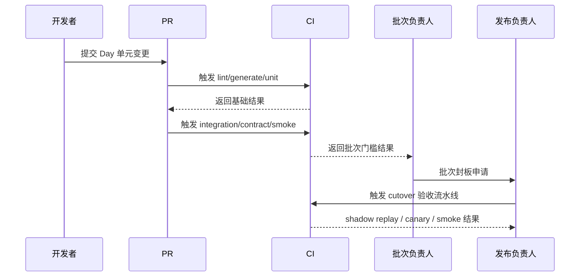

### 3.6 grep 级守护建议

- [ ] `grep -R "DynamicTools" internal/provider internal/module internal/platform internal/app`
- [ ] `grep -R "withRequiredThreadID" .`
- [ ] `grep -R 'provider == "codex"' internal`
- [ ] `grep -R "context.WithTimeout" internal`
- [ ] `go list -deps ./cmd/mcp-lsp`
- [ ] `go list -deps ./cmd/mcp-ida`

## 4. 文件创建工作流

### 4.1 新建 Go 文件标准流程（fx.Module 模板）

#### 标准步骤

- [ ] 先定义边界：该包输出的是 interface、DTO 还是 Runner。
- [ ] 先建 `service.go` 或 `repo.go`，再建 `module.go`。
- [ ] 如果该模块有长跑逻辑，单独建 `runner.go`，不要塞进 constructor。
- [ ] 如果该模块只提供 facade，对外只暴露 interface。
- [ ] 新文件创建完成后，马上补单测或 `fx.ValidateApp` 测试。

#### 模板

```go
package thread

import (
    "context"

    "go.uber.org/fx"
)

type Store interface {
    MarkStarted(ctx context.Context, threadID string) error
}

type Service interface {
    Start(ctx context.Context, threadID string) error
}

type service struct {
    store Store
}

func NewService(store Store) *service {
    return &service{store: store}
}

func (s *service) Start(ctx context.Context, threadID string) error {
    return s.store.MarkStarted(ctx, threadID)
}

var Module = fx.Module(
    "thread",
    fx.Provide(
        fx.Annotate(NewService, fx.As(new(Service))),
    ),
)
```

#### 若该模块要输出 Runner

```go
package runtime

import (
    "context"

    "go.uber.org/fx"
)

type Runner interface {
    Run(ctx context.Context) error
}

type runnerOut struct {
    fx.Out
    Runner Runner `group:"runners"`
}

type Server struct{}

func (s *Server) Run(ctx context.Context) error {
    <-ctx.Done()
    return nil
}

func NewServer() *Server {
    return &Server{}
}

func AsRunner(s *Server) runnerOut {
    return runnerOut{Runner: s}
}

var Module = fx.Module(
    "runtime",
    fx.Provide(NewServer, AsRunner),
)
```

### 4.2 新建 SQL 查询标准流程（sqlc 工作流）

#### 标准步骤

- [ ] 先确认是否需要新增 migration；没有 schema 变化就不要顺手改表。
- [ ] 把 SQL 写到 `sql/queries/<domain>/*.sql`，SQL 文件是源码。
- [ ] 写清 annotation：`:one`、`:many`、`:exec`、`:execrows`、`:copyfrom`。
- [ ] 运行 `sqlc generate`，检查生成代码和参数结构。
- [ ] 在 `internal/store/<domain>/repo.go` 写薄 adapter，而不是让业务层直接依赖生成层。
- [ ] 用真实 Postgres 补 integration test，不 mock `sqlc` 层。

#### SQL 模板

```sql
-- name: GetWorkspaceRun :one
SELECT
  run_key,
  status,
  created_at,
  updated_at
FROM workspace_runs
WHERE run_key = sqlc.arg(run_key)
LIMIT 1;
```

#### Repo Adapter 模板

```go
package workspace

import (
    "context"

    dbgen "github.com/anthropic-ai/super-agent-v3/internal/store/sqlcgen"
)

type Repo struct {
    q dbgen.Querier
}

func NewRepo(q dbgen.Querier) *Repo {
    return &Repo{q: q}
}

func (r *Repo) Get(ctx context.Context, runKey string) (dbgen.WorkspaceRun, error) {
    return r.q.GetWorkspaceRun(ctx, dbgen.GetWorkspaceRunParams{RunKey: runKey})
}
```

#### 验证顺序

1. `sqlc generate`
2. `go test ./internal/store/...`
3. schema drift test
4. `git diff --exit-code` 确认生成物已纳入 PR

### 4.3 新建 RPC 方法标准流程（jrpc2 handler 模板）

#### 标准步骤

- [ ] 先决定方法归属的模块 facade，不允许 handler 直接 new 依赖。
- [ ] 先定义 `Request` 和 `Response` 结构体，再写 handler。
- [ ] 必填校验优先放 `Validate()` 或 middleware。
- [ ] 默认使用对象参数，禁止新增公共数组参数契约。
- [ ] 方法注册必须进入统一 `handler.Map`。
- [ ] 补 schema contract 和至少一条 golden/protocol 测试。

#### Handler 模板

```go
package rpc

import (
    "context"
    "fmt"

    "github.com/creachadair/jrpc2"
    "github.com/creachadair/jrpc2/handler"
)

type ThreadStartService interface {
    Start(context.Context, ThreadStartRequest) (ThreadStartResponse, error)
}

type ThreadStartRequest struct {
    ThreadID string `json:"threadId"`
    Prompt   string `json:"prompt"`
}

type ThreadStartResponse struct {
    Accepted bool `json:"accepted"`
}

func (r ThreadStartRequest) Validate() error {
    if r.ThreadID == "" {
        return fmt.Errorf("threadId is required")
    }
    return nil
}

func NewThreadHandlers(svc ThreadStartService) handler.Map {
    checked := handler.Check(func(ctx context.Context, req ThreadStartRequest) (ThreadStartResponse, error) {
        if err := req.Validate(); err != nil {
            return ThreadStartResponse{}, &jrpc2.Error{Code: jrpc2.InvalidParams, Message: err.Error()}
        }
        return svc.Start(ctx, req)
    }).AllowArray(false).SetStrict(true)

    return handler.Map{
        "thread/start": checked.Wrap(),
    }
}
```

### 4.4 新建状态机标准流程（stateless 模板）

#### 标准步骤

- [ ] 先写状态与触发器枚举，不要先写 `switch/case`。
- [ ] 先写 transition spec，再写 `Configure(...).Permit(...)`。
- [ ] 动作和副作用单独放 `actions.go`。
- [ ] 使用 `FiringQueued` 作为默认 firing 模式。
- [ ] 补合法/非法 trigger matrix、recover/stop/race 测试。
- [ ] 用同一份 spec 导出 Mermaid/DOT，不手画第二份图。

#### 模板

```go
package orchestration

import (
    "context"

    "github.com/qmuntal/stateless"
)

type State string
type Trigger string

const (
    StateIdle    State = "idle"
    StateQueued  State = "queued"
    StateRunning State = "running"
)

const (
    TriggerEnqueue Trigger = "enqueue"
    TriggerStart   Trigger = "start"
    TriggerFinish  Trigger = "finish"
)

type Runtime struct {
    state State
}

func NewMachine(rt *Runtime) *stateless.StateMachine {
    sm := stateless.NewStateMachineWithExternalStorage(
        func(context.Context) (stateless.State, error) { return rt.state, nil },
        func(_ context.Context, st stateless.State) error {
            rt.state = st.(State)
            return nil
        },
        stateless.FiringQueued,
    )

    sm.Configure(StateIdle).
        Permit(TriggerEnqueue, StateQueued)

    sm.Configure(StateQueued).
        Permit(TriggerStart, StateRunning)

    sm.Configure(StateRunning).
        Permit(TriggerFinish, StateIdle)

    return sm
}
```

### 4.5 新建事件标准流程（kelindar/event 模板）

#### 标准步骤

- [ ] 先给事件编号和命名空间，不允许裸字符串 topic 作为主模型。
- [ ] 事件定义放核心层，订阅器定义放消费方。
- [ ] 发布和订阅都使用显式 dispatcher，不依赖全局默认总线。
- [ ] UI 投影、持久化 sink、通知桥接分开实现。
- [ ] 补 route snapshot 或 subscriber contract 测试。

#### 模板

```go
package agentevent

import "github.com/kelindar/event"

const EventTypeTurnStarted uint32 = 0x0100_1001

type TurnStarted struct {
    ThreadID string
    TurnID   string
}

func (TurnStarted) Type() uint32 { return EventTypeTurnStarted }

func PublishTurnStarted(bus event.Dispatcher, ev TurnStarted) {
    event.Publish(bus, ev)
}

func SubscribeTurnStarted(bus event.Dispatcher, fn func(TurnStarted)) func() {
    return event.Subscribe(bus, fn)
}
```

## 5. 测试工作流

### 5.1 单元测试标准流程

#### 适用范围

- `contract/*`
- `dto/*`
- `module/*` 中无 IO 逻辑
- `provider/unified` 中纯编排逻辑
- validator、mapper、middleware、小型 action 逻辑

#### 执行步骤

- [ ] 先定义输入输出和失败条件。
- [ ] 单测只 mock 上下游边界，不 mock 当前层内部实现。
- [ ] 一条单测只验证一个语义点。
- [ ] 对错误消息、错误码、状态转移结果做显式断言。
- [ ] 默认加 `-count=1` 避免缓存掩盖不稳定行为。

#### 推荐命令

```bash
go test ./internal/module/... -count=1
go test ./internal/provider/unified/... -count=1
go test ./internal/platform/rpc/... -count=1
```

### 5.2 集成测试标准流程

#### 适用范围

- repo integration
- workspace/DAG 主路径
- provider driver contract 中有真实进程/真实 IO 的部分
- desktop/entry smoke 前的后端拼接验证

#### 执行步骤

- [ ] Store 层优先真实 Postgres，不 mock `sqlc`。
- [ ] 每个 repo 至少要覆盖 happy path + zero-row/error path。
- [ ] 集成测试必须有清晰的 fixture 初始化和 teardown。
- [ ] 任何事务语义、锁语义、upsert 语义都必须在真实数据库上验证。
- [ ] 若本地没有固定数据库实例，优先使用 testcontainers 或团队统一测试库。

#### 推荐命令

```bash
go test ./internal/store/... -count=1
go test ./internal/module/workspace/... -count=1
go test ./internal/sidecar/orch/orchestration/... -count=1
```

### 5.3 契约测试标准流程

#### 适用范围

- `jrpc2` request/response schema
- golden response
- MCP `tools/list` / `tools/call`
- provider parity
- event routing snapshot

#### 执行步骤

- [ ] 先固化 contract，再允许实现改动。
- [ ] golden 文件必须注明来源场景，不允许“看起来像对的”快照。
- [ ] 更新 snapshot 必须在 PR 描述中解释行为变化原因。
- [ ] 同一 contract suite 必须同时覆盖 Claude/Codex 或 V2/V3 对照面。
- [ ] snapshot 更新后必须人工抽样审阅关键字段。

#### 推荐命令

```bash
go test ./internal/platform/rpc/... -run Contract -count=1
go test ./internal/mcpserver/... -run Contract -count=1
go test ./internal/provider/... -run Parity -count=1
```

### 5.4 全矩阵测试标准流程（状态机）

#### 强制覆盖项

- [ ] 每个状态的合法 trigger 集。
- [ ] 每个 trigger 的非法状态集。
- [ ] 每个 guard 的 true/false 双面。
- [ ] 每个 entry/exit/action 的执行断言。
- [ ] recover、stop、并发 fire 顺序。
- [ ] queued firing 下的重入与顺序性。

#### 推荐步骤

1. 先写 transition table。
2. 从 transition table 自动生成 matrix fixture。
3. 对每个状态跑合法/非法触发器集合。
4. 对 guard 组合跑真/假两面。
5. 跑 `-race`。
6. 导出 graph 并和 spec 对照。

#### 推荐命令

```bash
go test ./internal/sidecar/orch/orchestration/... -run Matrix -count=1
go test ./internal/sidecar/orch/orchestration/... -run Recover -count=1
go test ./internal/sidecar/orch/orchestration/... -race -count=1
```

### 5.5 测试分层总表

| 层级 | 目标 | 代表批次 |
|---|---|---|
| Pure unit | 纯逻辑稳定 | P0-P7 |
| Repo integration | Store 正确性 | P1, P7 |
| State machine matrix | 生命周期正确性 | P3 |
| Driver contract | Provider 收敛正确性 | P4 |
| RPC/MCP contract | 协议正确性 | P5, P7 |
| Desktop smoke | 入口正确性 | P6 |

## 6. 调试工作流

### 6.1 V3 本地开发环境搭建

#### 基线环境

- Go 版本跟随仓库 `go.mod`：当前为 `go 1.25.7`。
- 环境变量从 `.env.example` 起步。
- 数据库默认使用 `POSTGRES_CONNECTION_STRING` 指向的 Postgres。
- 代码生成依赖 `sqlc generate`。
- 桌面调试可优先使用当前仓库的 `make run-agent-terminal-debug-plain` 或等价 `go run ./cmd/agent-terminal --debug --debug-port 4501`。

#### 标准步骤

- [ ] `cp .env.example .env`
- [ ] 按需修正 `POSTGRES_CONNECTION_STRING`
- [ ] `go mod download`
- [ ] `sqlc generate`
- [ ] `go test ./... -count=1`
- [ ] `make build-plain` 或 `go build ./...`
- [ ] `make run-agent-terminal-debug-plain`

### 6.2 调试 fx 依赖图问题

#### 常见症状

- 启动时报 missing type。
- 某个模块 provider 冲突。
- `runners` group 收不到对象。
- 某模块构造期 panic。

#### 排查步骤

- [ ] 先跑 `fx.ValidateApp` 或等价对象图测试。
- [ ] 定位缺失的是 interface 还是 concrete type。
- [ ] 检查 `fx.Annotate(..., fx.As(...))` 是否遗漏。
- [ ] 检查 value-group tag 是否一致，例如都是 `group:"runners"`。
- [ ] 检查 constructor 是否偷偷依赖未导出的具体类型。
- [ ] 把问题缩小到单模块 `Module` 级别，而不是全仓一起猜。

#### 快速判断口径

- constructor 负责造对象，不负责跑流程。
- `fx.Invoke` 只做接线，不做业务主循环。
- `Module` 对外导出的应该是接口，不是内部实现细节。

### 6.3 调试 run.Group actor 问题

#### 常见症状

- actor 退出后进程不收敛。
- 一个 actor 卡死拖住整体退出。
- `interrupt` 不生效。
- 某模块在 constructor 中已经偷偷跑起来。

#### 排查步骤

- [ ] 确认每个 actor 都实现 `Run(ctx) error`。
- [ ] 检查 `execute` 是否又内部起了裸 goroutine。
- [ ] 检查 `interrupt` 是否显式关闭 listener、ticker、subscription。
- [ ] 检查是否所有 actor 共用顶层 cancel 语义。
- [ ] 给 `execute` 和 `interrupt` 打对称日志，确认进入顺序。
- [ ] 若某 actor 无法被外部中断，先修中断协议，再调业务逻辑。

### 6.4 调试 jrpc2 handler 问题

#### 常见症状

- 方法已实现，但注册表找不到。
- 参数解析失败或 silently 接受多余字段。
- 错误返回不是 JSON-RPC 标准语义。
- notify/callback 行为与预期不一致。

#### 排查步骤

- [ ] 先确认方法是否进入统一 `handler.Map`。
- [ ] 检查是否用了 `handler.Check(...).AllowArray(false).SetStrict(true)`。
- [ ] 检查 request `Validate()` 是否覆盖必填字段。
- [ ] 检查错误是否统一包成 `*jrpc2.Error`。
- [ ] 用 `server.Local` 或等价本地 harness 写最小复现。
- [ ] 若是 callback/notify 问题，确认 transport 双端都支持该语义。

### 6.5 调试 sqlc 生成代码问题

#### 常见症状

- `sqlc generate` 报 schema/query 错误。
- 生成方法名冲突。
- 参数结构与预期不符。
- null 类型映射不符合项目约定。

#### 排查步骤

- [ ] 先看 `.sql` annotation 是否正确。
- [ ] 检查 schema 与 queries 路径是否指向仓库根目录约定。
- [ ] 检查 `sqlc.yaml` 中 `emit_interface`、`query_parameter_limit`、overrides 是否正确。
- [ ] 检查 SQL 是否使用了 `sqlc.arg(...)` 等显式参数。
- [ ] 确认 migration 已包含新增列或表。
- [ ] 生成后把 adapter 层编译一遍，而不是只看生成目录。

### 6.6 调试状态机转换问题

#### 常见症状

- 合法 trigger 返回 error。
- 某 guard 触发冲突导致 panic。
- UI 状态和内部状态不一致。
- recover/stop 顺序错乱。

#### 排查步骤

- [ ] 先对照 transition spec，而不是直接读 action 代码。
- [ ] 跑 matrix test，定位是哪一个 `state -> trigger` 失败。
- [ ] 检查 guard 是否互斥。
- [ ] 检查 action 是否越权修改状态外字段。
- [ ] 检查是否仍残留 `effectiveState` 等价逻辑。
- [ ] 导出 DOT/Mermaid 图，确认代码和图一致。

## 7. 跨批次协调工作流

### 7.1 批次之间的交接流程

#### 交接必须产出

- [ ] 上一批次的封板证据。
- [ ] 下一批次需要的输入接口或 contract。
- [ ] 已知风险列表和暂未处理的边角项。
- [ ] 若有例外项，必须有明确 owner 和截止批次。
- [ ] 对应的测试入口和命令说明。

#### 交接顺序

1. 上一批次负责人准备交接记录。
2. 下游批次负责人逐项确认输入完整。
3. 对任何不完整输入，立刻记为 blocker，而不是开发中间再回头追。
4. 交接完成后，冻结上游批次的结构性变更，避免“边交边改”。

### 7.2 批次并行时的冲突解决

#### 冲突优先级

1. 模块边界冲突优先解决。
2. 目录归属冲突其次。
3. 命名冲突再次。
4. 实现细节冲突最后。

#### 解决规则

- [ ] 以已批准迁移方案为上位准则。
- [ ] 若两个批次同时改同一 facade，必须先收敛接口，再各自实现。
- [ ] 若两个批次同时改同一目录，按“谁拥有目录，谁决定结构；另一方只提接口诉求”。
- [ ] 若冲突影响验证链，优先保证上游批次封板，不让下游把门槛打散。
- [ ] 不允许通过复制一份新目录来回避冲突。

### 7.3 架构决策变更流程

#### 触发条件

- 新需求直接冲撞已批准六框架基线。
- 某批次实施后证明批准方案不可执行。
- CI/验证数据证明既有决策产生不可接受回归。
- family binary、provider unified、RPC registry 其中任一基础收敛点被证伪。

#### 变更步骤

1. 提交 `ADR-delta` 文档，明确变更原因。
2. 列出受影响批次、受影响文件树、受影响 CI 门槛。
3. 给出“继续沿旧方案”的成本和“切到新方案”的成本。
4. 由架构 owner 审批后更新本工作流和迁移方案。
5. 未审批前，任何实现分支都不得偷偷按新口径推进。

### 7.4 交接与变更序列图

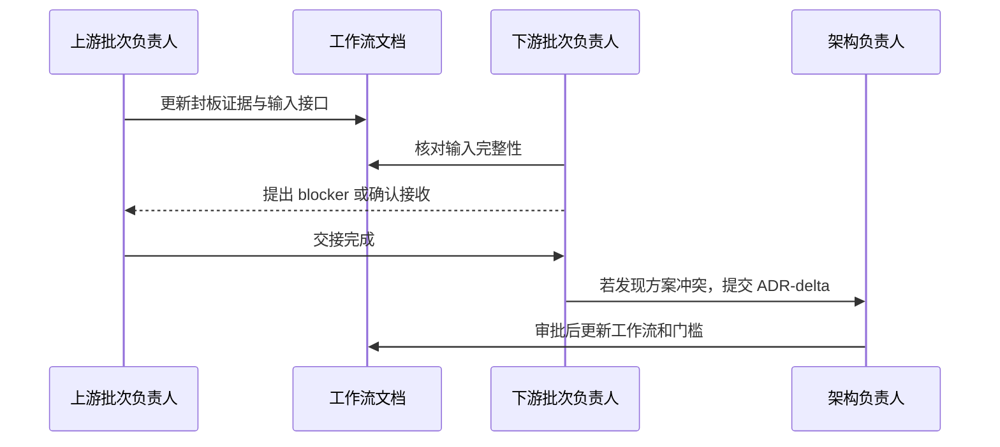

## 8. V2↔V3 对照验证工作流

### 8.1 行为对比测试流程

#### 目标

确保 V3 迁移的是行为，而不是仅仅把代码挪位置。

#### 执行步骤

- [ ] 从 V2 现有 golden、contract、matrix、behavior 测试中提炼“行为规格”。
- [ ] 按领域分组建立 V3 对照测试：store、state machine、provider、RPC、MCP、desktop。
- [ ] 每迁一批，先补该批对应的对照规格，再补实现。
- [ ] 若 V2 存在已知 bug 行为，必须在对照用例上显式标记“不继承 bug”。
- [ ] 若 V3 与 V2 不一致，必须记录是“缺陷”还是“已批准行为修正”。

### 8.2 Golden response 对比流程

#### 适用范围

- `jrpc2` response shape
- MCP `tools/list` / `tools/call`
- provider normalized event stream
- UI projection snapshots

#### 执行步骤

- [ ] 固化输入夹具。
- [ ] 同时运行 V2 和 V3，收集输出。
- [ ] 对比结构和关键字段，不只对比字符串全文。
- [ ] 对故意变化字段写白名单，例如时间戳、生成 ID、trace id。
- [ ] 对任何 golden 更新，补说明并由 reviewer 抽样审阅。

### 8.3 Shadow replay 流程

#### 目标

用真实或准真实轨迹同时驱动 V2 和 V3，对比行为而不切用户入口。

#### 标准步骤

- [ ] 采集代表性请求轨迹：thread、turn、workspace、DAG、provider、MCP。
- [ ] 在不影响线上主路径的前提下，离线或 shadow 地同时回放到 V2/V3。
- [ ] 收集状态转移、RPC 输出、事件序列、工具调用序列。
- [ ] 建立 diff 分类：可接受差异、需要修复、需要 ADR。
- [ ] 对 blocker 级差异禁止进入切换阶段。

### 8.4 最终切换流程

1. 所有批次封板完成。
2. V2↔V3 行为对比无 blocker。
3. shadow replay 连续稳定。
4. canary desktop 放量。
5. 默认入口切到 V3。
6. V2 进入只读维护期。

### 8.5 行为对比与切换序列图

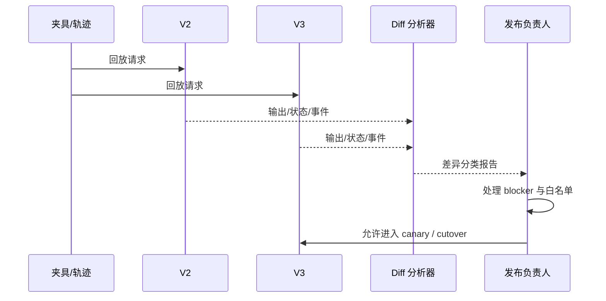

### 8.6 Shadow replay 流程图

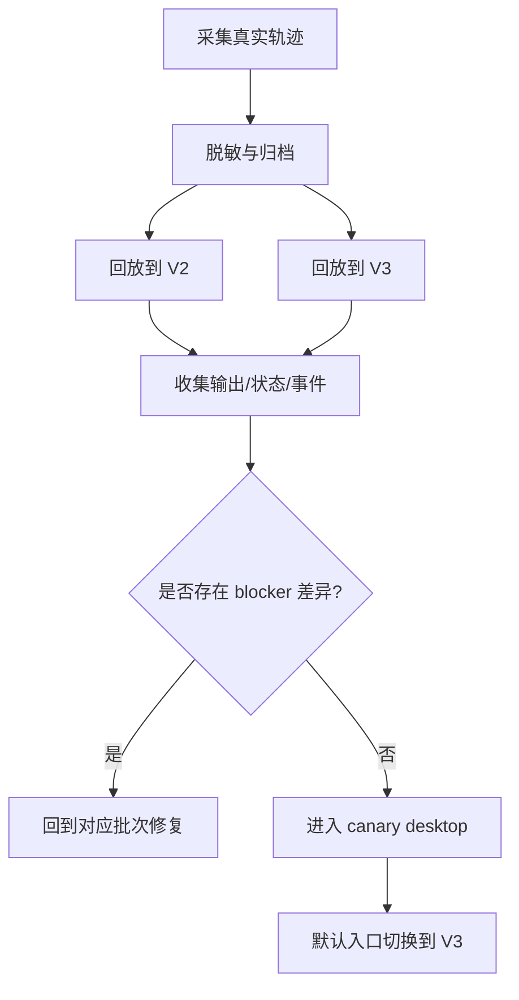

## 9. Mermaid 甘特图

### 9.1 V3 迁移时间线

说明：以下 gantt 以 `2026-03-23` 作为首个工作日示意。若实际启动日不同，整体平移即可，依赖关系保持不变。

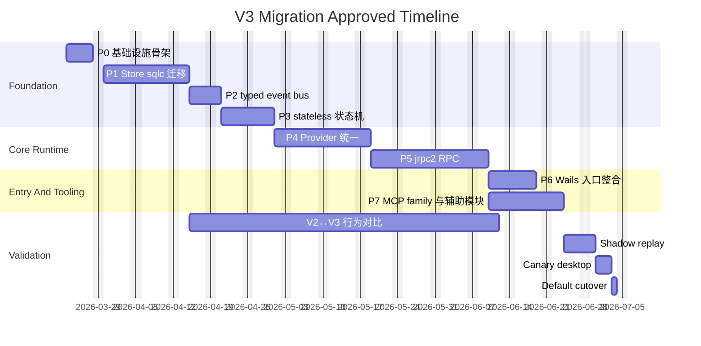

### 9.2 并行说明

- `P6` 与 `P7` 可以在 `P5` 封板后并行推进。
- `V2↔V3` 行为对比不应等到最后才开始，最迟在 `P1` 后启动基线收集。
- `Shadow replay` 必须在 `P6` 与 `P7` 都达到封板态后再开始。

## 10. 每个批次的 Mermaid 流程图

### 10.1 P0 内部工作流

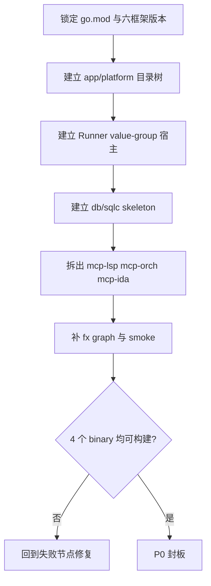

### 10.2 P1 内部工作流

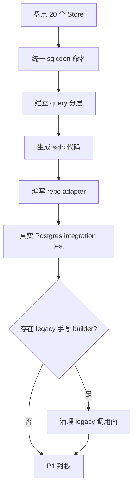

### 10.3 P2 内部工作流

```mermaid
flowchart TD
    A[盘点 V2 topic 与 payload] --> B[定义 typed events]
    B --> C[建立 platform bus wrapper]
    C --> D[拆分 projection/sink]
    D --> E[补 event routing tests]
    E --> F{总线内仍有 map[string]any ?}
    F -- 是 --> G[回收并改为 typed struct]
    F -- 否 --> H[P2 封板]
```

### 10.4 P3 内部工作流

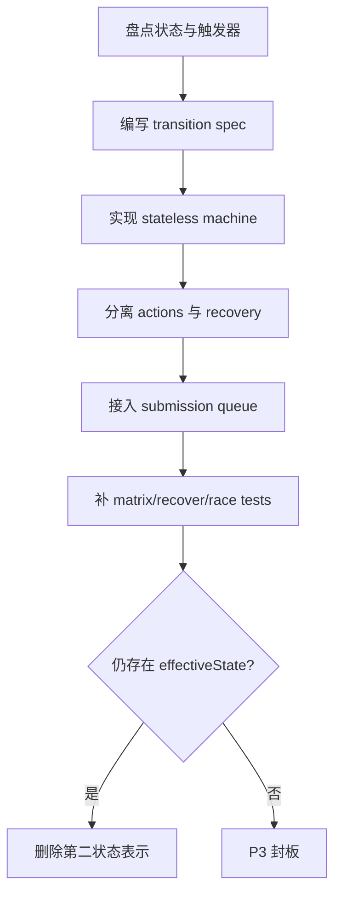

### 10.5 P4 内部工作流

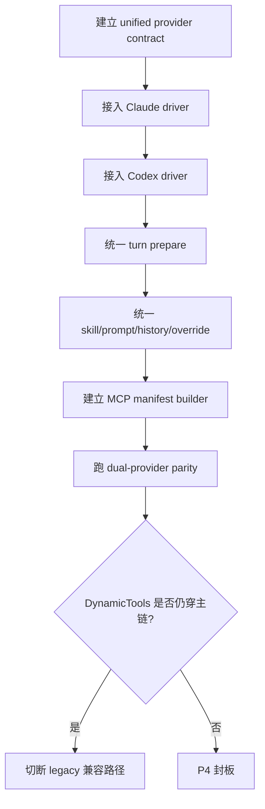

### 10.6 P5 内部工作流

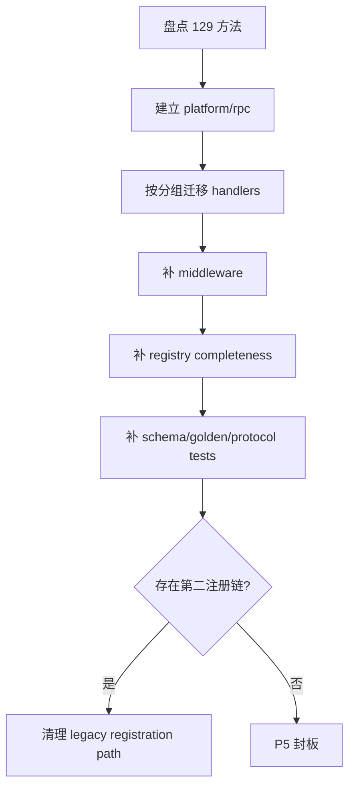

### 10.7 P6 内部工作流

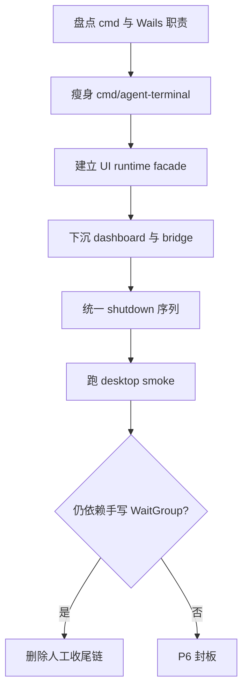

### 10.8 P7 内部工作流

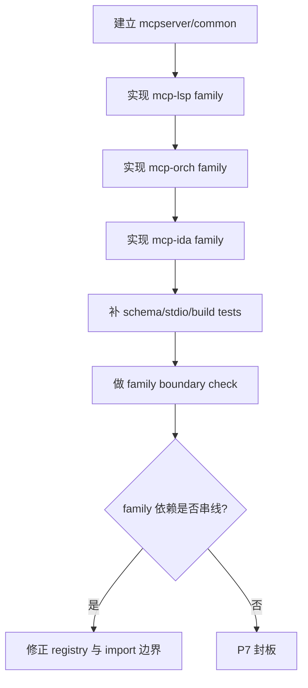

## 附录 A：批次封板汇总清单

### A.1 总封板清单

- [ ] `P0`：`fx` 对象图成立；4 个目标二进制可构建；空启动/空退出通过。
- [ ] `P1`：20 个 repo 均有 sqlc query + repo adapter；行为测试通过。
- [ ] `P2`：typed event bus 接通；旧 bus 不再承担业务主流程。
- [ ] `P3`：runner 状态迁移表完整；matrix 测试通过；无双状态表示。
- [ ] `P4`：Claude/Codex 共走统一 turn request + MCP manifest；无 `DynamicTools` 直传。
- [ ] `P5`：129 方法统一注册；schema contract 通过；无 God Object server。
- [ ] `P6`：Wails 可驱动主流程；入口优雅关闭；无手写 WaitGroup 启停。
- [ ] `P7`：`mcp-lsp`、`mcp-orch`、`mcp-ida` 独立构建和独立契约通过。

### A.2 最终交付清单

- [ ] `fx = 工厂`
- [ ] `run.Group = 引擎`
- [ ] `stateless = 状态机`
- [ ] `jrpc2 = RPC`
- [ ] `sqlc = Store`
- [ ] `kelindar/event = typed bus`
- [ ] Provider 收敛完成
- [ ] MCP 拆分完成
- [ ] 契约迁移完成
- [ ] 默认入口切换到 V3

## 附录 B：一句话执行摘要

执行顺序只有一句话：

`先用 P0 建骨架，再用 P1/P2/P3/P4/P5 把核心运行时收敛，最后由 P6/P7 收尾入口与工具面，并用 V2↔V3 对照验证、shadow replay 和 canary 完成切换。`
