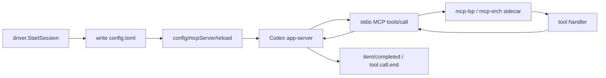

# P15 - Codex dynamicTools 直接注入迁移实施计划（最终修订版）

## 1. 目标与范围

### 1.1 核心方向
- **Codex 走 dynamicTools 直接注入**；**注入协议参考 V2，执行拓扑为 V3 新设计**，不再依赖 Codex provider 进程内的 MCP sidecar 调度链路。
- **Claude 保持原来的 MCP 方式不变**，继续通过 `--mcp-config` 启动 `mcp-orch` / `mcp-lsp` sidecar。

### 1.2 关键修正结论
1. **Codex session 的 28 个工具在 `DynamicToolsEnabled=true` 时统一走 app 内 `toolbridge` 回调链**，Codex provider 进程内不直接执行工具；实际执行仍发生在 `mcp-orch` / `mcp-lsp` peer 内。
2. **schema 真源改为 live `tools/list` 代理**：主进程通过已注册 peer 的 `Peer.Callback(ctx, "tools/list", nil, &result)` 拉 live schema；不新建共享 `schema.go` 真源文件。
3. **保留共享 app-server owner `ServerManager` 语义**，P15 只新增 `toolHandler` / `SetToolHandler` / `Responder` / `onInboundMessage` 分支，并统一为 **session 唯一回包点**；legacy sidecar config / watcher 职责延后到 Phase 3 清理。
4. **toolbridge 逻辑不再塞进 `internal/platform/mcpcontrol/` 新文件**；选择新 sibling package `internal/platform/toolbridge/` 承载 `ListToolsForCodex` / `HandleToolCall` / `SetToolHandler` + `SetListTools` 接线，`mcpcontrol` 仅补充查询 active peer 的只读方法。
5. **Phase 编号统一为 0/1/2/3**，且 Phase 1 必须同步完成：`onInboundMessage + toolHandler` 接线、feature flag 双路径、超时隔离与预算收口；legacy sidecar 删除动作只放到 Phase 3。

### 1.3 非目标
- 不改 `internal/provider/claudecli/` 的行为与协议。
- 不删除 `cmd/mcp-orch/`、`cmd/mcp-lsp/`、`internal/mcpserver/`。
- 不在 Codex provider 进程内重建 orch/LSP 业务执行栈。

## 2. 已核对的源码事实

1. **主 app 不 embed orchestration module**  
   `internal/app/modules.go:28-57` 明确保留 `mcpcontrol.Module`，同时注明 orchestration 由 standalone `mcp-orch` 处理。
2. **Claude 仍通过 `--mcp-config` 走 MCP sidecar**  
   `internal/provider/claudecli/transport_config.go:89-108` 在 CLI 参数中追加 `--mcp-config`。
3. **主进程 ctl RPC server 默认监听 `127.0.0.1:8090`**  
   `internal/platform/config/config.go:9-26` 的 `Config.RPCAddr` 默认值是 `127.0.0.1:8090`。
4. **`ServerManager` 当前真实方法集合**  
   `internal/provider/codexapp/module.go:52-155` 当前只有 `NewServerManager`、`ServerURL()`、`Running()`、`start(ctx)`、`writeMCPConfig()`、`stop(ctx)`；**当前代码还没有** `RegisterSession` / `UnregisterSession` / `routeEvent`。
5. **`ToolRegistry` 已有 `byClientKind` 索引与默认 2s timeout**  
   `internal/platform/mcpcontrol/registry.go:56-75` 定义了 `byClientKind map[string]map[LeaseKey]struct{}`；`registry.go:14-20` 定义 `defaultNotifyTimeout = 2 * time.Second`。
6. **按 selector 取 active peer 的底层能力已存在**  
   `internal/platform/mcpcontrol/fanout.go:65-117` 已有 `snapshotTargets` / `activeTargetLocked`，可以在不走 fanout worker 的前提下做按 kind 精确取 peer。
7. **peer callback 的真实签名已满足 live list/call 代理**  
   `internal/platform/mcpcontrol/peers.go:23-35`：`func (p jrpcPeer) Callback(ctx context.Context, method string, params any, result any) error`。
8. **MCP common server 原生支持 `tools/list` / `tools/call`**  
   `internal/mcpserver/common/server.go:208-219` 处理 `tools/list`，`221-251` 处理 `tools/call`；返回 `tools/list -> {"tools": []common.MCPTool}`，`tools/call -> {"content": [{"type":"text","text":...}]}`。
9. **`cmd/mcp-lsp` 的 schema 分布已经固定**  
   `cmd/mcp-lsp/schema.go` 定义 9 个 schema 变量；`internal/sidecar/lsp/tools.go` 定义 `lspToolManifests`；`cmd/mcp-lsp/fx.go:113-142` 负责 `ListTools()` 把 schema marshal 成 `common.MCPTool`；`cmd/mcp-lsp/runtime.go` 当前**没有** schema 定义。
10. **V3 当前 transport 会丢掉 inbound JSON-RPC request id**  
   `internal/provider/codexapp/transport.go:87-94` + `transport_helpers.go:210-222` 当前 `ReadLoop` 只向上抛 `method/params`，没有把 `json.RawMessage id` 继续往 session 传。
11. **当前守卫预算（LSP 实测）**  
   - `internal/provider/codexapp`：非测试文件 **15**，包总行数 **4398**，其中 `driver.go` **420** 行、`mcp_config.go` **371** 行。  
   - `internal/platform/mcpcontrol`：非测试文件 **15**，包总行数 **2618**。  
   - `cmd/mcp-lsp`：非测试文件 **5**，包总行数 **623**（`fx.go` 222、`main.go` 30、`runtime.go` 149、`schema.go` 139、`tools.go` 83）。
12. **`session` 当前没有保存 `manager`**  
   `internal/provider/codexapp/session.go:21-49` 的 `session struct` 目前没有 `manager *ServerManager` 字段；`newSession(..., manager *ServerManager)` 在 `62-102` 行也还没有把参数保存到 struct。**Phase 1 必须补上这个字段与赋值。**

### 官方 dynamicTools 协议（来源：OpenAI Codex App Server 文档）

来源：
- https://developers.openai.com/codex/app-server
- https://github.com/openai/codex/blob/main/codex-rs/app-server/README.md

1. **实验性 API 开关**
```json
{ "initialize": { "params": { "capabilities": { "experimentalApi": true } } } }
```

2. **dynamicTools 在 `thread/start` 中传入**
```json
{
  "method": "thread/start",
  "id": 10,
  "params": {
    "dynamicTools": [{
      "name": "lookup_ticket",
      "description": "Fetch a ticket by id",
      "deferLoading": true,
      "inputSchema": {
        "type": "object",
        "properties": { "id": { "type": "string" } },
        "required": ["id"]
      }
    }]
  }
}
```

3. **dynamicTools 会自动持久化并在 `thread/resume` 自动恢复**
> "Codex persists these dynamic tools in the thread rollout metadata and restores them on thread/resume when you don't supply new dynamic tools."

- 这意味着 resume 后工具不会丢失，**不需要**在 `threadResumeParams` 中重复注入 `DynamicTools`。
- 如果 resume 时显式提供新的 `dynamicTools`，新的集合会覆盖旧集合。

4. **工具调用是 JSON-RPC request/response，不是 notification**
服务端发送 `item/tool/call` request（带 `id`）：
```json
{
  "method": "item/tool/call",
  "id": 60,
  "params": {
    "threadId": "thr_123",
    "turnId": "turn_123",
    "callId": "call_123",
    "tool": "lookup_ticket",
    "arguments": { "id": "ABC-123" }
  }
}
```

客户端必须回复同一个 `id`：
```json
{
  "id": 60,
  "result": {
    "contentItems": [{ "type": "inputText", "text": "Ticket ABC-123 is open." }],
    "success": true
  }
}
```

5. **事件生命周期**
```text
1. item/started      (notification, type="dynamicToolCall", status="inProgress")
2. item/tool/call    (request, 带 id；客户端必须响应)
3. client response   (回复同一个 id + contentItems + success)
4. item/completed    (notification, type="dynamicToolCall", 最终状态)
```

6. **`deferLoading` 选项**
- `deferLoading: true`：工具已注册，但不进入模型 tool list，适合运行时能力（例如 `js_repl`）。
- `deferLoading: false`（默认）：工具正常进入模型 tool list。

7. **对 P15 的影响**
- initialize 阶段必须设置 `experimentalApi: true`，否则 dynamicTools 能力不会开启。
- resume 后工具自动恢复，**不需要**在 `threadResumeParams` 中新增 `DynamicTools` 字段。
- 官方 method 是 `item/tool/call`，`isToolCallMethod(...)` 白名单必须覆盖它。
- 官方返回格式是 `{contentItems:[...], success:true|false}`，`adaptMCPResponse(...)` 需要把 peer 的 MCP `content` 结果转成这个格式再回写给 Codex。
- `deferLoading` 需要保留在 `DynamicToolSchema` 中，不能在桥接层丢掉。

## 3. Claude 保持不变的部分
- Claude CLI 仍然通过 `--mcp-config` 启动 `mcp-orch` / `mcp-lsp` sidecar。
- `internal/provider/claudecli/` 不改。
- `cmd/mcp-orch/` 和 `cmd/mcp-lsp/` 保留，Claude 还需要。
- `internal/mcpserver/` 保留，Claude MCP server 实现仍然依赖它。

## 4. 目标架构

### 4.1 当前：Codex MCP sidecar


### 4.2 目标：每 session 独立 WS，工具调用在 session 级拦截
```mermaid
flowchart LR
    A[session WS message] --> B[transport.ReadLoop]
    B --> C[session.onInboundMessage(ctx, resp, msg)]
    C --> D{msg.ID != nil && toolHandler != nil && isToolCallMethod}
    D -- yes --> E[toolHandler(ctx, msg)]
    E --> F[routeToolCall -> peer.Callback tools/call]
    F --> G[session resp.RespondWithID(id, result, err)]
    D -- no --> H{msg.ID != nil}
    H -- yes --> I[session resp.RespondWithID(id, nil, method not supported)]
    H -- no --> J[session.onNotification(method, params)]
```

### 4.3 app 启动职责边界
- `internal/provider/codexapp/module.go` 中的 **`ServerManager` 保留**，管理共享 app-server 进程生命周期 + 持有 `toolHandler` 回调引用。每个 session 独立持有 WS 连接，工具调用拦截发生在 session 级别。
- `internal/platform/toolbridge/` 不再通过 `rpc_handlers` 暴露第二套路由；只通过 `SetToolHandler(...)` 挂到 `ServerManager`，并通过 `SetListTools(...)` 把 dynamicTools schema 注入 `codexapp.DriverFactory`。
- `internal/platform/mcpcontrol/` 只提供 live peer 查询与 `Peer.Callback(...)`，不承接新的 toolbridge route 注册。

## 5. H1 + N1 — 保留共享 app-server owner，session 级别拦截工具调用

### 5.1 当前代码 → Phase 1 目标
| 文件 | 当前现状（LSP 实测） | Phase 1 目标 |
|---|---|---|
| `internal/provider/codexapp/module.go` | `ServerManager` 只有 `ServerURL()` / `Running()` / `start(ctx)` / `writeMCPConfig()` / `stop(ctx)` | 新增 `toolHandler` 字段 + `SetToolHandler/getToolHandler` + `Responder` 接口 |
| `internal/provider/codexapp/session.go` | `session struct` 当前**没有** `manager *ServerManager` 字段；`newSession(..., manager)` 也还没有保存参数 | Phase 1 必须补上 `manager` 字段，并在 `newSession` 中保存，才能在 `onInboundMessage` 里调用 `s.manager.getToolHandler()` |
| `internal/provider/codexapp/session_approval.go` | `func (s *session) onNotification(method string, params json.RawMessage)` | **保持这个签名**；session 只接收通知/事件，不处理工具调用请求 |
| `internal/provider/codexapp/transport_helpers.go` | `ReadLoop` 当前只上抛 `method/params` | 改成上抛完整 `RawMessage` + `Responder` 给 `session.onInboundMessage` |

### 5.2 当前进程模型（重要前提）

> **当前是「共享 app-server 进程 + 每 session 独立 WebSocket」模型。**
> `ServerManager` 只管 app-server 进程生命周期（`start/stop/ServerURL`），每个 session 自己建独立 WS 连接。
> **P15 不改变这个模型**：session 仍各自持有 WS。工具调用拦截发生在每个 session 的 ReadLoop 回调中。

### 5.3 `ServerManager` + session 路由目标代码

**核心设计**：
- `ServerManager` 只持有 `toolHandler` 回调引用，不持有共享 WS/transport
- 每个 session 的 `ReadLoop` 回调通过 `s.manager.getToolHandler()` 获取回调
- 回包通过 `Responder` 接口（由 session 的 transport 实现），天然绑定正确 WS
- `SetToolHandler` 接收纯函数签名，避免 `codexapp ↔ toolbridge` 循环依赖

> **回包职责规则（唯一）**
> - `toolHandler` 签名统一为 `func(ctx context.Context, msg RawMessage) (any, error)`：只负责执行业务并返回 `result/error`
> - `session.onInboundMessage(...)` 负责调用 `resp.RespondWithID(msg.ID, result, err)`：**唯一回包点**
> - `toolHandler` **不接收 `Responder`**，也**不自己回包**

```go
// internal/provider/codexapp/module.go — ServerManager 只新增 toolHandler 持有
type ServerManager struct {
    mu        sync.Mutex
    process   *transport // app-server 进程（只此一个）
    serverURL string
    ready     bool
    err       error
    // P15 新增：toolbridge 注入的回调。使用 func 类型，不引用 toolbridge 包。
    toolHandler func(ctx context.Context, msg RawMessage) (any, error)
}

// Responder 封装回包能力，由 session 的 transport 实现。
type Responder interface {
    RespondWithID(id json.RawMessage, result any, callErr error) error
}

func (m *ServerManager) SetToolHandler(h func(context.Context, RawMessage) (any, error)) {
    m.mu.Lock()
    defer m.mu.Unlock()
    m.toolHandler = h
}

func (m *ServerManager) getToolHandler() func(context.Context, RawMessage) (any, error) {
    m.mu.Lock()
    defer m.mu.Unlock()
    return m.toolHandler
}
```

```go
// internal/provider/codexapp/transport_helpers.go
type RawMessage struct {
    ID     json.RawMessage // JSON-RPC request id；通知则为空
    Method string
    Params json.RawMessage
}

func (m RawMessage) ThreadID() string // 从 Params 中提取 threadId

// ReadLoop 改为上抛完整 RawMessage + Responder。
// transport 自身实现 Responder，天然绑定到本 session 的 WS 连接。
func (t *transport) ReadLoop(ctx context.Context, handler func(ctx context.Context, resp Responder, msg RawMessage))
func (t *transport) RespondWithID(id json.RawMessage, result any, callErr error) error
```

```go
// internal/provider/codexapp/session.go — 每个 session 的 ReadLoop 回调
func (s *session) onInboundMessage(ctx context.Context, resp Responder, msg RawMessage) {
    // ── 第一优先级：flag=true 且命中 tool call method ──
    toolHandler := s.manager.getToolHandler()
    if len(msg.ID) != 0 && toolHandler != nil && isToolCallMethod(msg.Method) {
        // 异步执行，不阻塞 ReadLoop（tool call 可能耗时 120s）
        go func() {
            result, err := toolHandler(ctx, msg)
            _ = resp.RespondWithID(msg.ID, result, err)
        }()
        return
    }
    // ── 第二优先级：已知的 request/response 协议（approval / input / elicitation）──
    // 这些 request 当前由 session approval bridge 处理（factory.go:30-52），
    // 它们也带 id，但不是工具调用，不能被 error 拦截。
    if isKnownRequestMethod(msg.Method) {
        s.onNotification(msg.Method, msg.Params) // 走现有 approval bridge 链路
        return
    }
    // ── 第三优先级：带 id 但完全未知的 method ── 回 JSON-RPC error，防止协议黑洞
    if len(msg.ID) != 0 {
        _ = resp.RespondWithID(msg.ID, nil, fmt.Errorf("method not supported: %s", msg.Method))
        return
    }
    // ── 第四优先级：无 id 的通知/事件 ──
    s.onNotification(msg.Method, msg.Params)
}

// isKnownRequestMethod 识别已知的非工具 request/response 协议。
// 这些 request 可能带 id，但由现有 approval bridge / requestUserInput 处理，
// 不能被工具拦截或 error 拒绝。
// 来源：factory.go:30-52 的 approvalBridgeMethods + requestUserInputMethods
// 实现时应直接复用这两张 map，不要手写白名单，避免漂移。
func isKnownRequestMethod(method string) bool {
    // 实现时复用 factory.go 的 approvalBridgeMethods + requestUserInputMethods：
    // _, ok1 := approvalBridgeMethods[method]
    // _, ok2 := requestUserInputMethods[method]
    // return ok1 || ok2
    //
    // 以下为当前完整列表（LSP 实测 factory.go:30-52 + rpc.DefaultApprovalCallbackMethod）：
    switch method {
    // ── approvalBridgeMethods (factory.go:39-53) ──
    case "approval/request",                       // rpc.DefaultApprovalCallbackMethod
         "tool/approval/request",
         "item/commandExecution/requestApproval",
         "item/fileChange/requestApproval",
         "skill/requestApproval",
         "tool.approval.requested",
         "mcpServer/elicitation/request",
    // ── requestUserInputMethods (factory.go:30-37) ──
         "request_user_input",
         "codex/event/request_user_input",
         "item/commandExecution/requestUserInput",
         "item/commandExecution/request_user_input",
         "item/tool/requestUserInput",
         "item/tool/request_user_input":
        return true
    default:
        return false
    }
}

// isToolCallMethod 白名单：覆盖 Codex app-server 实际发出的所有工具调用 method。
// 来源：event_map.go:229 — case "item/tool/call", "dynamic_tool_call", "tool.call.begin"
func isToolCallMethod(method string) bool {
    switch method {
    case "item/tool/call", "dynamic_tool_call", "tool.call.begin":
        return true
    default:
        return false
    }
}
```

**H2 循环依赖解法**：
- `SetToolHandler` 接收 `func(context.Context, RawMessage) (any, error)` — 纯函数签名
- `RawMessage` 和 `Responder` 都定义在 `codexapp` 包内
- `toolbridge.Handler` 实现这个签名，但 `codexapp` 不引用 `toolbridge` 包
- **依赖方向**：`toolbridge → codexapp`（单向），`codexapp → toolbridge`（零引用）✅

**H3 回包 transport 解法**：
- `Responder` 由每个 session 的 `transport` 实现（`transport` 已持有 WS conn）
- `ReadLoop` 把 `transport` 自身作为 `resp` 传入回调
- `session.onInboundMessage(...)` 统一通过 `resp.RespondWithID(...)` 回包，天然绑定正确 WS
- 不需要 ServerManager 持有“共享 transport”或知道消息来自哪条 WS

### 5.4 保留/删除口径
- **保留**：`ServerManager` 进程 owner 语义、每 session 独立 WS、`onNotification` 通知入口
- **新增**：`ServerManager.toolHandler` 字段 + `SetToolHandler/getToolHandler`、`Responder` 接口、`RawMessage` 结构体、`session.onInboundMessage` 回调、`isToolCallMethod` 白名单
- **不在 Phase 1 删除**：`writeMCPConfig`、legacy MCP 注入链路、`mcpWatcher` 相关逻辑
- **只在 Phase 3 删除**：`writeMCPConfig`、legacy MCP sidecar 路径，以及相关 watcher/status forwarding

### 5.5 路由流程图
```text
session 独立 WS 消息
    ↓
transport.ReadLoop(ctx, handler)
    ↓
session.onInboundMessage(ctx, resp, msg)
    │
    ├── 1) msg.ID != nil && toolHandler != nil && isToolCallMethod(msg.Method)
    │       ↓
    │   go func() {                            ← 异步执行，不阻塞 ReadLoop
    │       result, err := toolHandler(ctx, msg) ← toolbridge.HandleToolCall
    │       resp.RespondWithID(id, result, err)  ← session 统一回包
    │   }()
    │
    ├── 2) isKnownRequestMethod(msg.Method)（approval / input / elicitation）
    │       ↓
    │   session.onNotification(method, params)   ← 走现有 approval bridge
    │
    ├── 3) msg.ID != nil && 完全未知 method
    │       ↓
    │   resp.RespondWithID(id, nil, "method not supported") ← 防协议黑洞
    │
    └── 4) 无 id 通知/事件 → session.onNotification(method, params)
```

### 5.6 session 工具调用入口说明
- 工具调用拦截发生在每个 session 的 `onInboundMessage` 中，不是 ServerManager 集中路由。
- `onNotification` 保持现有签名：`func (s *session) onNotification(method string, params json.RawMessage)`。
- `onInboundMessage` 是新增的 ReadLoop 回调，替代现有的 `handler(method, params)` 回调。
- **带 id 的工具调用请求由每个 session 的 `onInboundMessage` 拦截，通过 `s.manager.getToolHandler()` 获取回调并转发；真正的回包也只在这里完成。**
- **带 id 的消息分三类处理：工具调用 → toolHandler；已知 request（approval/input/elicitation）→ 现有 approval bridge；完全未知 method → JSON-RPC error。**

## 6. H2 + M1 + M3 + M5 + M6 + N2 — toolbridge.Module、本地接线、live schema、精准 peer 路由

### 6.1 选定方案：新 sibling package `internal/platform/toolbridge/`
**不在 `internal/platform/mcpcontrol/` 新增文件，也不新增 `codexapp` 非测试文件。**

| 包/文件 | Phase 1 动作 | 预期行数 |
|---|---|---:|
| `internal/platform/toolbridge/module.go` | 新增 fx Module；只做 `SetToolHandler` + `SetListTools` 接线 | ~40 |
| `internal/platform/toolbridge/types.go` | 新增 request / result / bridge DTO；**不再放 `DynamicToolSchema`** | ~70 |
| `internal/platform/toolbridge/handler.go` | 新增 `ListToolsForCodex` / `HandleToolCall` / `routeToolCall` / `adaptMCPResponse` | ~240 |
| `internal/provider/codexapp/driver.go` | 在同包现有文件内新增 `DynamicToolSchema` 与 `listTools func`，避免包文件数从 15 涨到 16 | `420 -> ~395` |
| `internal/platform/mcpcontrol/resolution.go` | 新增 `FindActiveByKind` 只读查询 | `78 -> ~120` |
| `internal/platform/mcpcontrol` 包 | **不新增文件** | 仍为 15 个非测试文件 |

### 6.2 N2：toolbridge 接线只通过 `SetToolHandler` + `SetListTools`
```go
// internal/platform/toolbridge/module.go
var Module = fx.Module("toolbridge",
    fx.Provide(NewPeerBootstrap),
    fx.Provide(NewHandler),
    fx.Invoke(func(cfg *config.Config, mgr *codexapp.ServerManager, factory *codexapp.DriverFactory, h *Handler) {
        if cfg.Provider.DynamicToolsEnabled {
            mgr.SetToolHandler(h.HandleToolCall)
            factory.SetListTools(h.ListToolsForCodex)
        }
        // flag=false 时不注入；toolHandler / listTools 都保持 nil
        // session.onInboundMessage 遇到 toolHandler==nil 不拦截，driver.StartSession 遇到 listTools==nil 走 legacy 路径
    }),
)
```

```go
// internal/provider/codexapp/driver.go（同包现有文件即可，不新增第 16 个非测试文件）
type DriverFactory struct { /* 持有 listTools func 与 Create() 所需依赖 */ }
func (f *DriverFactory) SetListTools(fn func(context.Context) ([]DynamicToolSchema, error))
```
- `toolbridge.Module` **始终加载**。
- `SetToolHandler(...)` 与 `SetListTools(...)` 只在 `cfg.Provider.DynamicToolsEnabled == true` 时调用。
- `codexapp` 需要暴露可变的 `*DriverFactory`，再由它产出 `group:"drivers"` 的 `contract.DriverFactory`；这样 toolbridge 才能通过 fx.Invoke 注入 `listTools func`。
- **不走 `rpc_handlers` group**。

### 6.3 `ListToolsForCodex`：直接向 live peer 拉 schema，并转换成 `codexapp.DynamicToolSchema`
```go
// internal/provider/codexapp/driver.go（同包现有文件，避免新增第 16 个非测试文件）
type DynamicToolSchema struct {
    Name         string          `json:"name"`
    Description  string          `json:"description,omitempty"`
    DeferLoading bool            `json:"deferLoading,omitempty"`
    InputSchema  json.RawMessage `json:"inputSchema"`
}

// internal/platform/toolbridge/types.go
type peerToolsListResult struct {
    Tools []common.MCPTool `json:"tools"`
}

// internal/platform/toolbridge/handler.go
type Handler struct {
    registry *mcpcontrol.ToolRegistry
}

func NewHandler(registry *mcpcontrol.ToolRegistry) *Handler
func (h *Handler) ListToolsForCodex(ctx context.Context) ([]codexapp.DynamicToolSchema, error)
func (h *Handler) listPeerTools(ctx context.Context, clientKind string) ([]common.MCPTool, error)
```

```go
func (h *Handler) listPeerTools(ctx context.Context, clientKind string) ([]common.MCPTool, error) {
    peers := h.registry.FindActiveByKind(clientKind)
    if len(peers) == 0 {
        return nil, ErrNoPeerAvailable
    }
    if len(peers) > 1 {
        return nil, ErrAmbiguousPeer
    }
    var result peerToolsListResult
    if err := peers[0].Peer.Callback(ctx, "tools/list", nil, &result); err != nil {
        return nil, err
    }
    return result.Tools, nil
}
```

```go
func (h *Handler) ListToolsForCodex(ctx context.Context) ([]codexapp.DynamicToolSchema, error) {
    orchTools, err := h.listPeerTools(ctx, dto.ClientKindOrch)
    if err != nil {
        return nil, err
    }
    lspTools, err := h.listPeerTools(ctx, dto.ClientKindLSP)
    if err != nil {
        return nil, err
    }
    merged := append(append([]common.MCPTool(nil), orchTools...), lspTools...)
    return toCodexDynamicTools(merged), nil
}
```
- `toolbridge` 可以保留自己的内部 DTO，但**对外返回给 codexapp 的类型必须是 `codexapp.DynamicToolSchema`**。
- `deferLoading` 需要在 `toCodexDynamicTools(...)` 中保留下来，不能在桥接时丢失。

### 6.4 `HandleToolCall` / `routeToolCall`：exactly-1 active peer
```go
// internal/platform/toolbridge/types.go
const toolCallTimeout = 120 * time.Second

var (
    ErrNoPeerAvailable = errors.New("toolbridge: no active peer")
    ErrAmbiguousPeer   = errors.New("toolbridge: multiple active peers")
)

type ToolCallRequest struct {
    Name      string          `json:"name"`
    Arguments json.RawMessage `json:"arguments"`
    AgentID   string          `json:"agentId,omitempty"`
    ThreadID  string          `json:"threadId,omitempty"`
    CallID    string          `json:"callId,omitempty"`
}

type ToolCallContentItem struct {
    Type string `json:"type"`
    Text string `json:"text,omitempty"`
}

type ToolCallResult struct {
    ContentItems []ToolCallContentItem `json:"contentItems,omitempty"`
    Success      bool                  `json:"success"`
}

// internal/platform/toolbridge/handler.go
func (h *Handler) HandleToolCall(ctx context.Context, msg codexapp.RawMessage) (any, error)
func (h *Handler) routeToolCall(ctx context.Context, req ToolCallRequest) (*ToolCallResult, error) {
    kind := classifyTool(req.Name) // "lsp_*"/"code_run"/"code_run_test" -> ClientKindLSP；其他 -> ClientKindOrch
    peers := h.registry.FindActiveByKind(kind)
    if len(peers) == 0 {
        return nil, ErrNoPeerAvailable
    }
    if len(peers) > 1 {
        return nil, ErrAmbiguousPeer
    }
    callCtx, cancel := context.WithTimeout(ctx, toolCallTimeout)
    defer cancel()
    var mcpResp peerToolCallResponse
    if err := peers[0].Peer.Callback(callCtx, "tools/call", map[string]any{
        "name":      req.Name,
        "arguments": req.Arguments,
    }, &mcpResp); err != nil {
        return &ToolCallResult{
            Success: false,
            ContentItems: []ToolCallContentItem{{Type: "inputText", Text: err.Error()}},
        }, nil
    }
    return adaptMCPResponse(mcpResp), nil
}
```

```go
// internal/platform/mcpcontrol/resolution.go
func (r *ToolRegistry) FindActiveByKind(clientKind string) []*ToolInstance
```
- `FindActiveByKind` 只读使用 `registry.byClientKind` + `instance.Status == dto.StatusActive` 过滤。
- `routeToolCall` 是 **唯一** tools/call 执行入口；exactly-1 断言失败时立即返回错误。
- `HandleToolCall(...)` 只做解析、路由、结果适配；**不接收 `Responder`，也不负责回包**。

### 6.5 `tools/call` 返回适配层
```go
type peerToolCallContent struct {
    Type string `json:"type"`
    Text string `json:"text,omitempty"`
}

type peerToolCallResponse struct {
    Content []peerToolCallContent `json:"content"`
}

func adaptMCPResponse(resp peerToolCallResponse) *ToolCallResult {
    items := make([]ToolCallContentItem, 0, len(resp.Content))
    for _, item := range resp.Content {
        items = append(items, ToolCallContentItem{
            Type: "inputText",
            Text: strings.TrimSpace(item.Text),
        })
    }
    return &ToolCallResult{ContentItems: items, Success: true}
}
```
- MCP success：`resp.Content[*].Text -> ToolCallResult{ContentItems:[{type:"inputText", text:...}], Success:true}`。
- peer `tools/call` error：转成 `ToolCallResult{ContentItems:[{type:"inputText", text:err.Error()}], Success:false}`，再由 `session.onInboundMessage(...)` 用同一个 JSON-RPC `id` 回包。

### 6.6 host 侧 timeout 隔离
- 当前默认值：`internal/platform/mcpcontrol/registry.go:16` -> `defaultNotifyTimeout = 2 * time.Second`
- P15 新增常量：`toolCallTimeout = 120 * time.Second`
- `HandleToolCall` / `routeToolCall` **直接** `peer.Peer.Callback(callCtx, ...)`，使用独立 `context.WithTimeout(ctx, toolCallTimeout)`；**不走** `fanoutTargets` / `notifyTimeout` 链路

## 7. transport / ServerManager / session 改造

### 7.1 transport 改造：上抛完整 RawMessage + Responder
```go
// internal/provider/codexapp/transport_helpers.go
// RawMessage 和 Responder 定义见 §5.3
func (t *transport) ReadLoop(ctx context.Context, handler func(ctx context.Context, resp Responder, msg RawMessage))
func (t *transport) RespondWithID(id json.RawMessage, result any, callErr error) error
// transport 自身实现 Responder 接口：RespondWithID 写回本 session 的 WS 连接。
```
- `dispatchReadMessage()`：解出完整 `RawMessage`，把 `transport` 自身作为 `Responder` 传入 handler
- 每个 session 的 ReadLoop handler 就是 `s.onInboundMessage`
- `RespondWithID` 负责根据 `callErr` 统一回写 JSON-RPC result / error

### 7.2 session：新增 `onInboundMessage`，保留 `onNotification`
- 新增 `onInboundMessage(ctx, resp, msg)`：ReadLoop 的新回调，替代现有 `handler(method, params)`
- `onInboundMessage` 内部四分支路由（见 §5.3 伪代码）：
  1. 工具调用（`isToolCallMethod`）→ **异步** `go func(){ toolHandler(ctx, msg); resp.RespondWithID(...) }()`，不阻塞 ReadLoop
  2. 已知 request（`isKnownRequestMethod`：approval/input/elicitation）→ `onNotification` → 现有 approval bridge
  3. 未知带 id request → JSON-RPC error "method not supported"
  4. 无 id 通知 → `onNotification`
- `onNotification` 保持现有签名：`func (s *session) onNotification(method string, params json.RawMessage)`
- `session` 通知职责不变：turn 事件、approval、`request_user_input`、`connection.dead` 等
- **工具调用拦截和最终回包都发生在 session 级别的 `onInboundMessage` 中，通过 `s.manager.getToolHandler()` 获取回调**

## 8. N3 — feature flag 与 legacy 路径

### 8.1 `internal/app/modules.go`：`toolbridge.Module` 始终加载
```go
// internal/app/modules.go — toolbridge.Module 始终加载，不按 flag 条件装配
var Module = fx.Options(
    // ...existing modules...
    toolbridge.Module, // 始终加载
)
```
- 好处：`app.Module` 保持静态 `var Module = fx.Options(...)` 结构，不需要改 `fx.ValidateApp`，archtest 也不受影响。
- feature flag 只控制 `SetToolHandler(...)` / `SetListTools(...)` 是否被调用，不控制 module 是否装配。
- **不需要 `rpc_handlers` group**。

### 8.2 DynamicToolsEnabled 仅支持全局配置
```go
// internal/platform/config/config.go
type ProviderConfig struct {
    DynamicToolsEnabled bool `json:"dynamic_tools_enabled" default:"false"`
}

// internal/provider/codexapp/driver.go
type driver struct {
    logger          *slog.Logger
    serverURL       string
    eventDispatcher *unified.EventDispatcher
    approvals       *rpc.ApprovalManager
    reporter        contract.RuntimeReporter
    manager         *ServerManager
    cfg             *platformconfig.Config
    // P15 新增：func 类型注入，codexapp 不引用 toolbridge 包
    listTools       func(ctx context.Context) ([]DynamicToolSchema, error)
}

type threadStartParams struct {
    // ── 现有字段（必须完整保留，不得裁剪）──
    Cwd                   string          `json:"cwd,omitempty"`
    Model                 string          `json:"model,omitempty"`
    ModelProvider         string          `json:"modelProvider,omitempty"`
    BaseInstructions      string          `json:"baseInstructions,omitempty"`
    DeveloperInstructions string          `json:"developerInstructions,omitempty"`
    ApprovalPolicy        string          `json:"approvalPolicy,omitempty"`
    Personality           string          `json:"personality,omitempty"`
    Summary               string          `json:"summary,omitempty"`
    Effort                string          `json:"effort,omitempty"`
    Sandbox               json.RawMessage `json:"sandbox,omitempty"`
    // ── P15 新增 ──
    DynamicTools []DynamicToolSchema `json:"dynamicTools,omitempty"`
}

// 官方协议要求 resume 自动恢复 dynamicTools，因此 threadResumeParams 不新增 DynamicTools。
type threadResumeParams struct {
    ThreadID string `json:"threadId"`
    Cwd      string `json:"cwd,omitempty"`
    Model    string `json:"model,omitempty"`
}
```

> `DynamicToolsEnabled` 仅支持全局配置，不支持按单次请求切换。原因：`toolbridge.Module` 的 `SetToolHandler(...)` / `SetListTools(...)` 在 app 启动时一次性决定，运行时无法切换。

```go
func startRemoteThread(ctx context.Context, t *transport, req dto.StartSessionRequest) (startResult, error)
func buildThreadStartParams(req dto.StartSessionRequest) threadStartParams

func (d *driver) StartSession(ctx context.Context, req dto.StartSessionRequest) (contract.Session, error) {
    s, err := newSession(ctx, d.logger, d.serverURL, req.AgentID, d.eventDispatcher, d.approvals, d.manager)
    if err != nil {
        return nil, err
    }
    // ── 现有初始化（两条路径都必须执行，不得跳过）──
    s.setRuntimeConfig(req.Config)
    s.setApprovalPolicy(resolveApprovalPolicy(req.Config))

    if d.cfg.Provider.DynamicToolsEnabled && d.listTools != nil {
        // ── dynamic path：复用现有 thread/start 参数组装，只额外填充 DynamicTools ──
        tools, err := d.listTools(ctx)
        if err != nil {
            cleanupFailedSession(s, "force stop failed on dynamic tools list error")
            return nil, fmt.Errorf("dynamic tools list: %w", err)
        }
        result, err := startRemoteThreadWithDynamicTools(ctx, s.transport, req, tools)
        if err != nil {
            cleanupFailedSession(s, "force stop failed on start error")
            return nil, err
        }
        s.setThreadID(result.threadID)
        d.postStartSetup(s, result)
        return s, nil
    }
    // ── legacy path：保持现有 MCP sidecar 注入 + startRemoteThread 不变 ──
    if !d.usingManagedServer() {
        if err := d.injectCodexMCPServers(ctx, s, req); err != nil {
            cleanupFailedSession(s, "force stop failed on mcp injection error")
            return nil, err
        }
    }
    result, err := startRemoteThread(ctx, s.transport, req)
    if err != nil {
        cleanupFailedSession(s, "force stop failed on start error")
        return nil, err
    }
    s.setThreadID(result.threadID)
    d.postStartSetup(s, result)
    return s, nil
}

// startRemoteThreadWithDynamicTools 复用现有 buildThreadStartParams/startRemoteThread 组装逻辑，
// 只额外填充 DynamicTools 字段。
func startRemoteThreadWithDynamicTools(ctx context.Context, t *transport, req dto.StartSessionRequest, tools []DynamicToolSchema) (startResult, error) {
    params := buildThreadStartParams(req)
    params.DynamicTools = tools
    raw, err := callWithTimeout(ctx, t, 30*time.Second, "thread/start", params)
    if err != nil {
        return startResult{}, err
    }
    return decodeStartResult(raw)
}

// postStartSetup 提取 StartSession 中 thread/start 成功后的通用设置逻辑，
// 避免 dynamic/legacy 两条路径重复写。
func (d *driver) postStartSetup(s *session, result startResult) {
    if result.model != "" { s.setRuntimeConfigValue("model", result.model) }
    if result.cwd != "" { s.setRuntimeConfigValue("cwd", result.cwd) }
    if port := parsePortFromURL(s.transport.serverURL); port > 0 {
        s.setRuntimeConfigValue("port", port)
    }
    d.reportRuntime(s.agentID)
}
```

### 8.3 flag=true / flag=false 的行为边界
- `DynamicToolsEnabled=true`
  - `toolbridge.Module` **始终已加载**
  - `mgr.SetToolHandler(h.HandleToolCall)` 与 `factory.SetListTools(h.ListToolsForCodex)` 都会被调用
  - `session.onInboundMessage` 拦截带 id 且命中 `isToolCallMethod(msg.Method)` 的请求并转发给 `toolHandler`
  - `driver.StartSession` 用 `d.listTools(ctx)` 填充 `thread/start.dynamicTools`
  - `thread/resume` **不重传** `dynamicTools`；依赖官方自动恢复语义
- `DynamicToolsEnabled=false`
  - `toolbridge.Module` 仍然加载
  - 但 `SetToolHandler(...)` / `SetListTools(...)` **都不会**被调用
  - `toolHandler == nil` 且 `listTools == nil`
  - `session.onInboundMessage` 中 `toolHandler==nil` → 工具调用拦截分支不生效 → 消息流向：
    - 已知 request（approval/input）→ `onNotification` → 现有 approval bridge
    - 未知带 id request → JSON-RPC error（防协议黑洞）
    - 无 id 通知 → `onNotification`
    - **总之：flag=false 时整个行为等价于 P15 之前，加上未知 request 的安全兵底**
  - `driver.StartSession` 中 `listTools==nil` → 继续走 legacy MCP 注入路径
- **legacy 路径下 `writeMCPConfig` 保留**，只在 flag=true 稳定后的 Phase 3 才删。

### 8.4 H3：在不增加 codexapp 文件数的前提下守住预算
为避免 `driver.go` 因 feature flag 再超线，Phase 1 只做**现有文件内搬移**：

| 当前函数/符号 | 当前文件 | Phase 1 去向 | 预期变化 |
|---|---|---|---|
| `(*driver).restoreApprovalPolicy` | `internal/provider/codexapp/driver.go` | 移到 `internal/provider/codexapp/support.go` | `driver.go -29` |
| `(*driver).reportRuntime` | `driver.go` | 移到 `support.go` | `driver.go -22` |
| `(*driver).StartSession` | `driver.go` | 保留 | 增加 feature flag 分支约 `+18~20` 行 |
| `writeMCPConfig` / `injectCodexMCPServers` / `reloadCodexMCPServers` | `module.go` / `driver.go` | **Phase 1 保留** | Phase 3 再删 |

### 8.5 预算表（LSP 重新实测 + Phase 1 预期）
| 包/文件 | 当前实测 | Phase 1 预期 | 说明 |
|---|---:|---:|---|
| `internal/provider/codexapp` 包非测试文件数 | 15 | 15 | 不新增包内文件 |
| `internal/provider/codexapp` 包总行数 | 4398 | ~4445 | 新增 `toolHandler` / `RawMessage` / 条件分支，但仍低于 4500 |
| `internal/provider/codexapp/driver.go` | 420 | ~389 | 把 `restoreApprovalPolicy` / `reportRuntime` 挪到 `support.go` |
| `internal/provider/codexapp/support.go` | 260 | ~311 | 承接两个 driver helper |
| `internal/platform/mcpcontrol` 包非测试文件数 | 15 | 15 | **禁止新增文件** |
| `internal/platform/mcpcontrol` 包总行数 | 2618 | ~2660 | 仅 `resolution.go` 增长 |
| `cmd/mcp-lsp` 包非测试文件数 | 5 | 5 | 不变 |
| `cmd/mcp-lsp` 包总行数 | 623 | 623 | 不变 |
| 新 `internal/platform/toolbridge` 包 | 0 | 3 / ~335 | 单文件/单包均不过线 |

## 9. Phase 时序

### Phase 0：preflight
1. 验证 `session_approval.go` 当前仍是 `onNotification(method, params)` 签名。
2. 验证 `session.go` 当前确实还没有 `manager *ServerManager` 字段，`newSession(..., manager)` 也尚未保存该参数。
3. 验证 `toolbridge.ListToolsForCodex()` 能分别从 1 个 `ClientKindOrch` 和 1 个 `ClientKindLSP` active peer 拉到 live schema，并保留 `deferLoading`。
4. 抓一条真实 `item/tool/call`，确认带 `id` 的消息会被 `session.onInboundMessage` + `isToolCallMethod` 识别。
5. 验证无 `id` 的通知仍走 `session.onNotification(...)`，带 `id` 但非 tool request 的消息会回 JSON-RPC error。
6. 验证 initialize 链路可以带上 `experimentalApi: true`。

### Phase 1：实现
> **Phase 1 前置任务：**  
> 当前 `ServerManager` 只管进程生命周期（`Start/Stop/ServerURL`），不涉及 WS 路由。Phase 1 需要补全：  
> 1. `ServerManager` 新增 `toolHandler func(ctx, msg) (any, error)` 字段 + `SetToolHandler/getToolHandler` + `Responder` 接口  
> 2. `transport_helpers.go` 新增 `RawMessage` 结构体、`ReadLoop` 改为上抛 `(ctx, Responder, RawMessage)`、`RespondWithID`  
> 3. `session.go` 新增 `manager *ServerManager` 字段，并在 `newSession(..., manager)` 中保存参数  
> 4. `session.go` 新增 `onInboundMessage(ctx, resp, msg)` 回调 + `isToolCallMethod` 白名单 + “非 tool request 且带 id 返回 JSON-RPC error” 分支  
> 5. `session` 的 ReadLoop 启动改为传入 `s.onInboundMessage`  
> 这些改动是 P15 toolbridge 的硬前置，必须先合入再做后续步骤。
1. 先完成上述 session 级别路由基础补全。
2. 新增 `internal/platform/toolbridge/{module.go,types.go,handler.go}`。
3. 在 `internal/platform/mcpcontrol/resolution.go` 新增 `FindActiveByKind`。
4. 改 `transport_helpers.go`：`ReadLoop` 上抛 `RawMessage`，`RespondWithID` 支持 `(id, result, err)` 统一回写。
5. 改 `internal/app/modules.go`：静态包含 `toolbridge.Module`；`SetToolHandler(...)` / `SetListTools(...)` 由 module 内部按 flag 决定是否调用。
6. 改 `driver.go` / `support.go`：把 `DynamicToolSchema` 留在 `codexapp` 同包现有文件、引入 `listTools func`、仅按全局 `DynamicToolsEnabled` 选择 dynamic tools 或 legacy 路径，并把两个 helper 挪出 `driver.go`。
7. 在 initialize 链路中设置 `experimentalApi: true`。
8. **Phase 1 不删除 legacy MCP 路径**。

### Phase 2：验证
1. 跑第 10 节完整测试清单。
2. 验证 fresh session / resume / recovery / approval / request_user_input。
3. 验证 `thread/resume` 不重传 `dynamicTools` 也能自动恢复工具。
4. 验证 Claude 的 `--mcp-config` 冒烟仍通过。

### Phase 3：删除 legacy 路径
- 条件：`DynamicToolsEnabled=true` 连续 2 个版本默认开启且无回退。
- 动作：删除 `writeMCPConfig`、`injectCodexMCPServers`、`reloadCodexMCPServers`、`mcpWatcher`、`forwardMCPStatus` 及相关 sidecar/watcher 胶水。

## 10. 测试清单（正式必测）

| 文件 | 测试函数 | 场景 | 关键断言 |
|---|---|---|---|
| `internal/platform/toolbridge/handler_test.go` | `TestToolBridge_FreshSession_ToolCallForward` | 新 session 工具调用转发到 peer | `routeToolCall` 命中 exactly 1 peer，返回官方 `ToolCallResult{contentItems, success:true}` |
| `internal/platform/toolbridge/handler_test.go` | `TestToolBridge_Resume_ToolCallStillWorks` | resume 后工具仍可用 | `HandleToolCall` 仍可经 `onInboundMessage` 转发，且不需要重新注入 `dynamicTools` |
| `internal/platform/toolbridge/handler_test.go` | `TestToolBridge_NoPeer_FailFast` | 无 active peer | 返回 `ErrNoPeerAvailable` |
| `internal/platform/toolbridge/handler_test.go` | `TestToolBridge_MultiplePeers_Ambiguous` | 多 peer 冲突 | 返回 `ErrAmbiguousPeer` |
| `internal/platform/toolbridge/handler_test.go` | `TestToolBridge_Timeout_120s` | 长工具不被 2s 默认超时杀 | `toolCallTimeout == 120s`，不走 `notifyTimeout` |
| `internal/platform/toolbridge/handler_test.go` | `TestToolBridge_PeerError_AdaptToResult` | peer.Callback 返回 error | `ToolCallResult{ContentItems:[{type:"inputText", text:...}], Success:false}` |
| `internal/platform/toolbridge/handler_test.go` | `TestOnInboundMessage_NonToolRequest_WithID_NotIntercepted` | 带 id 但非 tool request | 返回 JSON-RPC error response，而不是落到 `onNotification` |
| `internal/provider/codexapp/session_test.go` | `TestOnInboundMessage_Approval_ViaApprovalBridge` | approval request 经 `onInboundMessage -> isKnownRequestMethod -> onNotification` | 走现有 approval bridge，**不**经 toolHandler，不被 error 拦截 |
| `internal/provider/codexapp/session_test.go` | `TestOnInboundMessage_RequestUserInput_ViaApprovalBridge` | `requestUserInput` 经 `onInboundMessage -> isKnownRequestMethod -> onNotification` | 走现有 approval bridge，**不**经 toolHandler |
| `internal/provider/codexapp/session_test.go` | `TestOnInboundMessage_ToolCall_AsyncNoBlockReadLoop` | 工具调用异步执行，不阻塞 ReadLoop | 发送 tool call 后立即能收到下一条消息，不用等 120s |
| `internal/provider/codexapp/driver_session_test.go` | `TestToolBridge_Initialize_ExperimentalAPI` | dynamicTools 初始化开关 | initialize 请求包含 `experimentalApi: true` |
| `internal/provider/codexapp/recovery_transport_test.go` | `TestToolBridge_Recovery_CancelInflight` | recovery 取消 in-flight tool call | session ctx 取消会传播到 `peer.Callback` |
| `internal/provider/codexapp/recovery_transport_test.go` | `TestToolBridge_Recovery_ResumeToolCall` | recovery 后恢复调用 | reconnect 后再次 `HandleToolCall` 成功 |
| `internal/provider/codexapp/driver_session_test.go` | `TestToolBridge_FeatureFlag_FallbackToMCP` | `dynamic_tools_enabled=false` 走 legacy 路径 | `toolHandler=nil`、`listTools=nil`，并继续调用 `injectCodexMCPServers` |
| `internal/provider/e2e/claude_mcp_smoke_test.go` | `TestClaude_MCP_SmokeTest` | Claude MCP 冒烟 | `--mcp-config` 路径不受影响 |

### 推荐命令矩阵
- `go test ./internal/platform/toolbridge/...`
- `go test ./internal/provider/codexapp/...`
- `go test ./internal/platform/mcpcontrol/...`
- `go test ./cmd/mcp-lsp/...`
- `go test ./internal/provider/e2e/... -run 'Codex|Claude'`

## 11. 守卫预算与 Phase 3 清理清单

### 11.1 守卫预算
| 维度 | 当前实测 | Phase 1 目标 | 结论 |
|---|---:|---:|---|
| `codexapp` 包非测试文件数 | 15 | 15 | 不超红线 |
| `codexapp` 包总行数 | 4398 | ~4445 | 不超 4500 |
| `driver.go` | 420 | ~389 | 通过 helper 搬移回到 ≤400 |
| `mcpcontrol` 包非测试文件数 | 15 | 15 | **禁止新增文件** |
| `mcpcontrol` 包总行数 | 2618 | ~2660 | 不超 4500 |
| `cmd/mcp-lsp` 包非测试文件数 | 5 | 5 | 不变 |
| `cmd/mcp-lsp` 包总行数 | 623 | 623 | 不变 |
| 新 `toolbridge` 包 | 0 | 3 / ~335 | 单文件/单包均安全 |

### 11.2 Phase 3 清理清单
| 项 | 文件路径 | Phase 1 动作 | Phase 3 动作 | 备注 |
|---|---|---|---|---|
| 1 | `internal/provider/codexapp/module.go` | 新增 `toolHandler` / `SetToolHandler` / `getToolHandler` / `Responder`；**保留** `writeMCPConfig` | 删除 `writeMCPConfig` 与仅服务 legacy 的状态分支 | `toolHandler` 长期保留 |
| 2 | `internal/provider/codexapp/driver.go` | 增加 feature flag、`DynamicToolSchema`、`listTools func`；**保留** `injectCodexMCPServers` / `reloadCodexMCPServers` | 删除 legacy MCP 注入调用 | flag 稳定后只留 dynamic tools |
| 3 | `internal/provider/codexapp/mcp_config.go` | Phase 1 保留 | 整文件删除 | 只在 legacy 下有用 |
| 4 | `internal/provider/codexapp/session.go` / `session_approval.go` | Phase 1 增加 `manager` 保存与 `onInboundMessage`；保持 legacy watcher 路径可用 | 删除 `mcpWatcher` / `forwardMCPStatus` / `extractStartupStatus` | 与 legacy sidecar 一起移除 |
| 5 | `internal/platform/toolbridge/` | 新增 package | 保留 | 长期承担 tool handler / dynamicTools schema bridge |
| 6 | `internal/platform/mcpcontrol/resolution.go` | 新增 `FindActiveByKind` | 保留 | toolbridge 只读依赖 |

## 12. 最终执行口径
1. **每 session 独立 WS，工具调用拦截发生在 session 级别的 `onInboundMessage` 中，通过 `s.manager.getToolHandler()` 获取回调。**
2. **`toolHandler` 只负责执行并返回 `(result, error)`；唯一回包点是 `session.onInboundMessage -> resp.RespondWithID(...)`。**
3. **带 id 的消息分三类：工具调用 → toolHandler（异步执行）；已知 request（approval/input/elicitation）→ 现有 approval bridge；完全未知 method → JSON-RPC error。**
4. **toolbridge 接线只通过 `SetToolHandler(...)` + `SetListTools(...)`；`codexapp` 不引用 `toolbridge` 包，`DynamicToolSchema` 留在 `codexapp` 同包，依赖方向保持 `toolbridge → codexapp` 单向。**
5. **`toolbridge.Module` 始终加载，但只有 `DynamicToolsEnabled=true` 时才调用 `SetToolHandler(...)` / `SetListTools(...)` 进入新链路；`false` 时继续走 legacy MCP sidecar。**
6. **initialize 必须带 `experimentalApi: true`；`thread/start` 传 `dynamicTools`，`thread/resume` 不重复注入并依赖官方自动恢复。**
7. **dynamic tool 成功/失败结果都要适配成官方 `{contentItems:[...], success:true|false}` 结构后再回写给 Codex。**
8. **`writeMCPConfig` 与 legacy sidecar 路径只在 Phase 3 才删除。**

## 13. 后续待办（Phase 1 不阻塞，实施后跟进）

| # | 优先级 | 项 | 说明 |
|---|:------:|------|------|
| 1 | Medium | **DynamicToolSchema 补 DeferLoading 字段** | 当前 MCPTool 也没有这个字段，先全部默认 false。后续扫 common.MCPTool + tools/list DTO 统一补上，再在 toCodexDynamicTools 中保留 |
| 2 | Medium | **peer 路由按 AgentID/ThreadID 精确选择** | 当前 FindActiveByKind 只按 ClientKind，单实例够用。多 Agent 场景下需要升级为 ClientKind + AgentID/ThreadID 多维索引，复用现有 registry.byThread/byAgent |
| 3 | Medium | **tool call 并发限流** | 当前 go func() 无 semaphore，120s 下可能堆积。后续补 inflight cap（建议 8-16）|
| 4 | Medium | **recovery 时 in-flight tool call 的 ctx cancel 传播** | 当前 recovery 不 cancel session ctx，旧 goroutine 最长挂 120s。后续补 per-generation ctx 或 inflight tracker |
| 5 | Low | **预算表数字刷新** | 实施完成后重新 LSP 实测并更新文档中的行数 |
