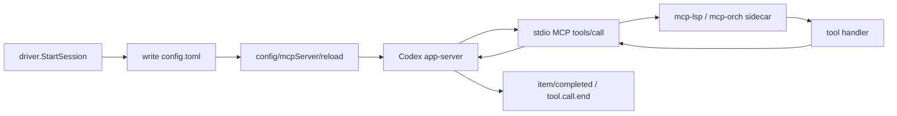

# P15 - Codex dynamicTools 直接注入迁移实施计划（最终修订版）

## 1. 目标与范围

### 1.1 核心方向
- **Codex 走 dynamicTools 直接注入**，与 V2 一致，不再依赖 MCP sidecar。
- **Claude 保持原来的 MCP 方式不变**，继续通过 `--mcp-config` 启动 `mcp-orch` / `mcp-lsp` sidecar。

### 1.2 关键修正结论
1. **Codex session 的 28 个工具全部走 RPC 回调主进程的 ctl RPC server（默认 `127.0.0.1:8090`）**。Codex provider 进程内**不直接执行任何工具**。
2. **LSP 9 个工具也走 RPC 回调**，不在 Codex session 进程内执行；这样 28 个工具统一走一条链路。
3. **Phase 编号统一为 0/1/2/3**：
   - Phase 0：协议 preflight
   - Phase 1：实现
   - Phase 2：验证
   - Phase 3：Codex 老实现清理
4. **`cleanOrphanedMCPProcesses` 函数本体保留**，只删除 `ServerManager.start()` / `stop()` 里的调用点；启动时 orphan cleanup 仍保留为独立 invoke/hook，服务 Claude 场景。

### 1.3 非目标
- 不改 `internal/provider/claudecli/` 的行为与协议。
- 不删除 `cmd/mcp-orch/`、`cmd/mcp-lsp/`、`internal/mcpserver/`。
- 不在 Codex provider 进程内重建 orch/LSP 业务执行栈。

## 2. 已核对的源码事实

1. **主 app 不 embed orchestration module**  
   `internal/app/modules.go:48-55` 明确说明 orchestration 由 standalone `mcp-orch` 处理，desktop app 不应 embed 它。
2. **Claude 仍通过 `--mcp-config` 走 MCP sidecar**  
   `internal/provider/claudecli/transport_config.go:89-108` 在 CLI 参数中追加 `--mcp-config`。
3. **主进程 ctl RPC server 默认监听 `127.0.0.1:8090`**  
   `internal/platform/config/config.go:16-26` 中 `RPCAddr` 默认值为 `127.0.0.1:8090`。
4. **主进程已有完整 ctl RPC server 与 MCP control plane**  
   `internal/platform/rpc/module.go:18-30`、`internal/platform/mcpcontrol/module.go:19-35`、`handlers.go:55-123` 都已就位。
5. **MCP control plane 能回调已注册 MCP peer**  
   `internal/platform/mcpcontrol/router.go:46-56,93-100` 里的 `ToolRegistry.CallbackBefore/After` 与 `callbackTargets` 最终都走 `Peer.Callback(...)`。
6. **MCP common server 原生支持 `tools/list` / `tools/call`**  
   `internal/mcpserver/common/server.go:160-183,208-273` 明确处理了 `tools/list` 与 `tools/call`。
7. **V3 当前 transport 会丢掉 inbound JSON-RPC request id**  
   `internal/provider/codexapp/transport.go:87-94` + `transport_helpers.go:210-222` 只把 `method/params` 向上抛，没有保留原始 `id`。
8. **`mcpStartupStatusMethods` 当前仍被 UI 翻译链使用，不能删除**  
   `internal/provider/codexapp/factory.go:55-58` 定义；`event_map.go:67-80` 与 `session_approval.go:273-275` 都引用它。
9. **当前 `internal/provider/codexapp` 非测试文件数是 15，包总行数约 4383**。删除 `mcp_config.go`（370 行）后，Codex 主包预算仍可守住。

## 3. Claude 保持不变的部分
- Claude CLI 仍然通过 `--mcp-config` 启动 `mcp-orch` / `mcp-lsp` sidecar。
- `internal/provider/claudecli/` 不改。
- `cmd/mcp-orch/` 和 `cmd/mcp-lsp/` 保留，Claude 还需要。
- `internal/mcpserver/` 保留，Claude MCP server 实现仍然依赖它。

## 4. 目标架构

### 4.1 当前：Codex MCP sidecar


### 4.2 目标：Codex dynamicTools + 主进程 RPC 回调


### 4.3 最终边界
- **Codex provider 只负责：schema 拉取、tool call 转发、结果回写。**
- **主进程 ctl RPC server 负责：选择目标 MCP peer 并转发 `tools/call`。**
- **实际业务执行发生在 `mcp-orch` / `mcp-lsp` 进程内。**

## 5. 依赖闭环：28 个工具全部走 RPC 回调

### 5.1 统一口径
Codex session 收到 `item/tool/call` 后：
1. 本地解析 tool call envelope。
2. 通过 jRPC2 TCP client 调主进程 ctl RPC server。
3. 主进程根据工具名选择目标 peer：
   - `lsp_*`、`code_run`、`code_run_test` → `ClientKindLSP`
   - 其他 → `ClientKindOrch`
4. 主进程通过 `ToolRegistry` 找到对应 lease/peer。
5. 主进程对目标 peer 发 `Peer.Callback(ctx, "tools/call", ...)`。
6. 结果经主进程返回给 Codex session，再由 Codex session 回写给 app-server。

### 5.2 为什么 LSP 也走 RPC
- LSP manager/LSP 进程本来就是主进程体系持有的资源。
- 28 个工具统一走 RPC，有利于：
  - 一致的权限与可观测性
  - 一致的超时/取消/错误处理
  - 避免在 Codex provider 再复制一套 LSP 生命周期管理

### 5.3 主进程 route 设计
当前代码里**没有现成名为 `lsp_tool_event` 的 RPC route**；P15 采用更明确的统一接口：
- `toolbridge/tool/list`：返回 28 个 dynamicTools schema
- `toolbridge/tool/call`：执行单次工具调用并返回结果

> 如后续需要兼容旧命名，可把 `lsp_tool_event` 做成 `toolbridge/tool/call` 的别名，但计划不把一个当前不存在的 route 当作实现前提。

## 6. schema 来源与 dynamicTools 注入

### 6.1 schema 真源
- **orch 19 个 schema**：复用 `cmd/mcp-orch/tools.Registry.List()` 暴露出来的 schema 元数据。
- **lsp 9 个 schema**：抽出共享 `internal/mcpserver/lsp/catalog/schema.go`，让 `cmd/mcp-lsp/` 与主进程 `toolbridge/tool/list` 共用一套真源。

### 6.2 注入流程
1. `StartSession` 前先调主进程 RPC：`toolbridge/tool/list`
2. 得到 28 个 schema：
   - `name`
   - `description`
   - `inputSchema`
3. 原样写入 `thread/start.dynamicTools`
4. `thread/resume` 不传 `dynamicTools`

## 7. Codex toolbridge 设计

### 7.1 新增文件
| 文件 | 职责 |
|---|---|
| `internal/provider/codexapp/toolbridge/rpc_dispatcher.go` | 统一的 RPC schema 拉取 + tool 调用调度器 |
| `internal/platform/mcpcontrol/toolbridge_rpc.go` | 主进程 ctl RPC route：`toolbridge/tool/list` / `toolbridge/tool/call` |
| `internal/mcpserver/lsp/catalog/schema.go` | 共享 LSP 9 schema 真源 |

### 7.2 dispatcher 统一接口
```go
type Dispatcher interface {
    ListTools(ctx context.Context) ([]DynamicToolSchema, error)
    CallTool(ctx context.Context, req ToolCallRequest) (ToolCallResult, error)
}
```

### 7.3 Host 侧调用模型
`toolbridge/tool/call` 的 host handler：
- 输入：`tool`, `arguments`, `agentId`, `threadId`, `callId`, `requestId`
- 路由：按工具名前缀决定目标 `ClientKind`
- 转发：`Peer.Callback(ctx, "tools/call", {name, arguments}, &result)`
- 返回：统一的 `ToolCallResult`

## 8. 防重执行与统一 dispatch 保护

### 8.1 防重执行
只有带 JSON-RPC request `id` 的 inbound message 才执行工具：
- `RawID != nil`：允许执行
- `RawID == nil`：只做 UI 观察，不执行

### 8.2 统一 dispatch 保护
本地 `rpc_dispatcher.go` 统一承担：
1. **panic recovery**：panic 转为失败结果，不让 read loop 崩溃
2. **per-call timeout**：默认 120s；超时返回失败结果
3. **result truncation**：对返回文本做工具级长度限制
4. **cancel tracking**：session 关闭/断链时取消 in-flight 调用
5. **unknown tool**：直接返回失败结果，不走 JSON-RPC error
6. **malformed payload**：仅 payload 无法解析时返回 `-32602`

### 8.3 结果回传
- 优先：`RespondWithID(rawID, result)`
- fallback：`dynamic_tool_result` notification
- 业务失败也走 `result.success=false`，不走 JSON-RPC error

## 9. 协议 preflight 验证（Phase 0）
1. 验证 `thread/start.dynamicTools` 被 app-server 接受。
2. 抓一条真实 `item/tool/call`，确认有 JSON-RPC `id`、`tool`、`arguments`。
3. 验证纯 notification 的工具事件无 `id`，且不会被执行。
4. 验证主进程存在活跃 `ClientKindLSP` 与 `ClientKindOrch` lease；若没有，Codex 启动前直接报 unavailable。
5. 验证主进程通过 `Peer.Callback("tools/call", ...)` 能实际拿到 `mcp-lsp` / `mcp-orch` 返回值。
6. 验证 `thread/resume` 后 backend 仍会继续发送带 `id` 的 tool request。

## 10. Session / transport / recovery 改造

### 10.1 StartSession
1. `newSession()` 建立 transport
2. 调 `toolbridge/tool/list`
3. 把 28 个 schema 写入 `thread/start.dynamicTools`
4. start 成功后绑定真实 thread id
5. 如响应返回真实 cwd，则写回 runtime config（仅记录，不本地建 LSP runtime）

### 10.2 ResumeSession
- 本地只恢复 dispatcher / transport
- `thread/resume` **不传 `dynamicTools`**
- 之后收到的 tool request 继续统一走 RPC dispatcher

### 10.3 transport.go / transport_helpers.go
- `transport.ReadLoop` 回调改为接收完整 inbound request envelope
- 增加 `RespondWithID` / `RespondErrorWithID`
- `dispatchReadMessage()` 保留 `RawID`
- `endReadLoop()` 纳入改动：触发 session 级 `cancelInflightTools()`，但 `connection.dead` 不参与工具执行

### 10.4 session_approval.go / onNotification
- `onNotification` 改收完整 request
- 先分发 raw event 给 UI
- 再按“仅有 `RawID` 才执行”规则走 `rpc_dispatcher.CallTool(...)`
- `forwardMCPStatus` 等 sidecar status 转发逻辑在 Phase 3 清理

### 10.5 recovery.go
- `resumeThreadAfterRecovery()` 纳入改动，但**不补发 dynamicTools**
- 恢复后继续通过 RPC dispatcher 处理工具调用

## 11. 文件规划

### 11.1 新增文件
| 文件 | 说明 |
|---|---|
| `internal/provider/codexapp/toolbridge/rpc_dispatcher.go` | Codex 本地 RPC dispatcher |
| `internal/platform/mcpcontrol/toolbridge_rpc.go` | 主进程 ctl RPC 的 toolbridge host route |
| `internal/mcpserver/lsp/catalog/schema.go` | LSP schema 真源 |

### 11.2 需要修改的文件（含当前行号范围）
| 文件 | 当前范围 | 改动 |
|---|---:|---|
| `internal/provider/codexapp/driver.go` | `24-31,74-105,113-161,230-419` | 接入 RPC dispatcher；移除 sidecar/manager/manifest 注入 |
| `internal/provider/codexapp/session.go` | `21-49,62-102,242-265` | 增加 dispatcher/cancel state；移除 mcpWatcher 字段 |
| `internal/provider/codexapp/session_approval.go` | `221-305` | `onNotification` 改收完整 request；后续清理 sidecar status forwarding |
| `internal/provider/codexapp/recovery.go` | `154-172,341-368` | 恢复后继续走 RPC dispatcher；read loop 回调类型更新 |
| `internal/provider/codexapp/transport.go` | `54-94` | `RespondWithID` / `RespondErrorWithID` 与新 ReadLoop 签名 |
| `internal/provider/codexapp/transport_helpers.go` | `19-38,197-240` | 保留 raw id；`endReadLoop` 与 `dispatchReadMessage` 更新 |
| `internal/platform/mcpcontrol/handlers.go` | `55-123` | 保持现有 ctl handler 面；新增 toolbridge host route 组装点 |
| `internal/platform/mcpcontrol/router.go` | `46-56,93-100` | 复用 peer callback 机制，增加通用 tools/call 转发 |
| `internal/app/modules.go` | `52-56` | 注册 toolbridge host route provider，不引入 orchestration module |
| `cmd/mcp-lsp/fx.go` / `runtime.go` | `37-78,98-156` / `24-149` | 改用共享 LSP schema 真源 |

### 11.3 需要删除/替换的旧描述
- 删除“Codex provider 进程内直接执行 LSP 9 个工具”的所有表述
- 删除旧的 Phase 1-6 细分编号
- 删除“module.go orphan cleanup 全删”的旧说法，改为“函数保留、ServerManager 调用点删除”

## 12. 实施顺序

### Phase 0：协议 preflight 验证
完成第 9 节 6 项 preflight，确认 tool request/peer callback/RPC 闭环成立。

### Phase 1：实现
1. 抽出 `internal/mcpserver/lsp/catalog/schema.go`
2. 新增 `internal/platform/mcpcontrol/toolbridge_rpc.go`
3. 新增 `internal/provider/codexapp/toolbridge/rpc_dispatcher.go`
4. 改 `driver.go`，`thread/start` 前通过 `toolbridge/tool/list` 拉 schema
5. 改 `transport.go` / `transport_helpers.go` / `session_approval.go` / `session.go` / `recovery.go`
6. 打通 `item/tool/call -> ctl RPC -> mcp peer tools/call -> result 回写`

### Phase 2：验证
1. 单元测试：schema surface、防重执行、timeout/cancel/unknown tool、transport raw id
2. 集成测试：Codex fresh session、resume、tool call 转发
3. 回归测试：Claude `--mcp-config` 不受影响

### Phase 3：Codex 老实现清理
按第 17 节清理 `ServerManager`、`mcp_config.go`、manager/sidecar/mcpWatcher/status forwarding 等遗留代码。

## 13. 验证策略

### 13.1 单元测试
- `thread/start.params.dynamicTools` 数量=28
- notification 工具事件不执行；带 `id` request 才执行
- `rpc_dispatcher` 的 panic/timeout/cancel/unknown tool/truncation 全覆盖
- host route 能按 `ClientKindLSP/ClientKindOrch` 正确选 peer
- `RespondWithID` 保留原始 `json.RawMessage` id

### 13.2 集成/E2E
- Codex fresh session：`shared_file_read`、`lsp_file`、`code_run_test`
- Codex resumed session：resume 后执行 `lsp_grep`
- Host route 抽样验证：`shared_file_read`、`workspace_get_run`、`orchestration_list_agents`
- Claude regression：验证 `--mcp-config` 路径仍正常

### 13.3 推荐命令矩阵
- `go test ./internal/provider/codexapp/...`
- `go test ./internal/provider/codexapp/toolbridge/...`
- `go test ./internal/platform/mcpcontrol/...`
- `go test ./internal/mcpserver/lsp/...`
- `go test ./cmd/mcp-lsp/...`
- `go test ./internal/provider/e2e/... -run 'Codex|Claude'`

## 14. 风险评估

| 风险 | 说明 | 缓解 |
|---|---|---|
| 主进程不存在活跃 orch/lsp lease | Host route 无法转发 `tools/call` | preflight 先验证 lease 存在，否则直接 fail fast |
| app-server 同时发 request + notification | 造成重复执行 | 严格执行“无 `RawID` 不执行” |
| request id 可能是 string/int 两种 | 回写丢类型会失败 | 保留 `json.RawMessage` 原样回写 |
| Host route 选错 peer | LSP/orch 工具被发往错误子进程 | 工具名前缀 + `ClientKind` 双重断言 |
| sidecar 清理误伤 Claude | Claude 仍依赖 sidecar | 清理仅限 Codex 老实现，保留 `cmd/mcp-*` 与 `internal/mcpserver/` |

## 15. 改动量估计与约束预算
- 生产代码新增：3 个核心文件（另含少量测试文件）
- 生产代码修改：10~12 个文件
- 生产代码删除：1 个整文件（`mcp_config.go`）+ 多段 Codex sidecar/manager 胶水
- 当前 `codexapp` 非测试文件数：15；删 `mcp_config.go` 后变 14；新增代码放子包 `toolbridge/`，主包文件数预算不变
- 当前 `codexapp` 非测试包总行数约 4383；删 `mcp_config.go` 370 行后约 4013，仍低于 4500
- 单文件 ≤400 行、单函数 ≤80 行、CC ≤10 作为实现阶段强约束执行

## 16. 最终执行口径
1. **Codex 的 28 个工具全部走主进程 ctl RPC 回调，不在 Codex provider 进程内直接执行。**
2. **Claude 完全保持原 MCP sidecar 模式不变。**
3. **Phase 编号严格固定为 0/1/2/3。**
4. **`cleanOrphanedMCPProcesses` 函数本体保留；只删除 ServerManager 调用点。**
5. **`mcpStartupStatusMethods` 保留，不删。**

## 17. Phase 3: Codex 老实现清理
> 执行时机：放在 Phase 1（实现）和 Phase 2（验证）之后。

| 项 | 文件路径 | 行号范围 | 删除/清理内容 | 删除理由 | 是否影响 Claude |
|---|---|---:|---|---|---|
| 1 | `internal/provider/codexapp/module.go` | `37-155` | 删除 `ServerManager` struct、`NewServerManager`、`ServerURL/Running/start/writeMCPConfig/stop` | Codex 不再需要 shared MCP sidecar/config 注入 | 否；Claude 不依赖 Codex 的 ServerManager |
| 2 | `internal/provider/codexapp/driver.go` | `24-31,74-105,109-111,323-388` | 删除 `d.manager`、`usingManagedServer()`、`injectCodexMCPServers()`、`skipCodexMCPInjection()`、`reloadCodexMCPServers()` | dynamicTools + RPC 路径不再需要 manager/sidecar 注入 | 否 |
| 3 | `internal/provider/codexapp/mcp_config.go` | `1-370` | 整文件删除 | Codex 不再写 `config.toml`、不再等待 MCP startup ready | 否；Claude 保留自己的 `--mcp-config` 路径 |
| 4 | `internal/provider/codexapp/session.go` + `session_approval.go` | `session.go:21-49`；`session_approval.go:221-232` | 删除 `mcpWatcher` 字段、`setMCPWatcher()`、`getMCPWatcher()` | watcher 只服务于 sidecar startup 观察 | 否 |
| 5 | `internal/provider/codexapp/session_approval.go` | `255-284` | 删除 `forwardMCPStatus()`、`isMCPStartupStatus()`、`extractStartupStatus()` | Codex 不再消费 sidecar startup status 转发 | 否；Claude 状态链路不受影响 |
| 6 | `internal/provider/codexapp/factory.go` + `internal/provider/codexapp/mcp_config.go` | `factory.go:256-268`；`mcp_config.go:22,317-327` | 删除 `collectManagedBinaries`、`managedMCPPrefix`、`isManagedBinary`；**保留** `mcpStartupStatusMethods` | managed binary 判定只为 Codex sidecar 服务 | 否；但 `mcpStartupStatusMethods` 继续保留给 UI/Claude 兼容 |
| 7 | `internal/provider/codexapp/driver.go` | `44` | 删除 `buildCodexMCPManifest` 变量 | Codex 不再需要 manifest/config 注入 | 否 |
| 8 | `internal/provider/codexapp/module.go` | `75-112,128-155`（调用点删除）；`202-343`（函数保留） | **保留** `cleanOrphanedMCPProcesses` 函数本体；删除 `ServerManager.start()` / `stop()` 里的调用；新增/保留独立的 `cleanOrphanedMCPProcessesOnStart` invoke/hook 负责启动时清理 orphan | 启动时 cleanup 仍要服务 Claude，但不应再绑在被删除的 ServerManager 上 | 是；**函数与启动清理保留**，仅删除 Codex 专属调用点 |
| 9 | `internal/provider/codexapp/transport_process.go` | 条件项（当前未发现 `sanitizeProcessEnv` / `isControlPlaneEnv`） | 若 Phase 1 之后彻底不再保留 Codex 独立进程模式，再删除对应环境清洗逻辑；若仍保留本地 `codex app-server` 启动能力，则不删 | 用户要求的条件清理项，当前 HEAD 无该符号 | 视最终是否保留独立进程模式而定 |
| 10 | `internal/dto/provider/manifest.go` | 条件项（当前未发现 `SanitizeStandaloneEnv`） | 若后续存在专门给 Codex standalone env 清洗的遗留函数，则在 Phase 3 一并删除；当前 HEAD 记为 no-op 检查项 | 当前代码无该符号 | 否 |
