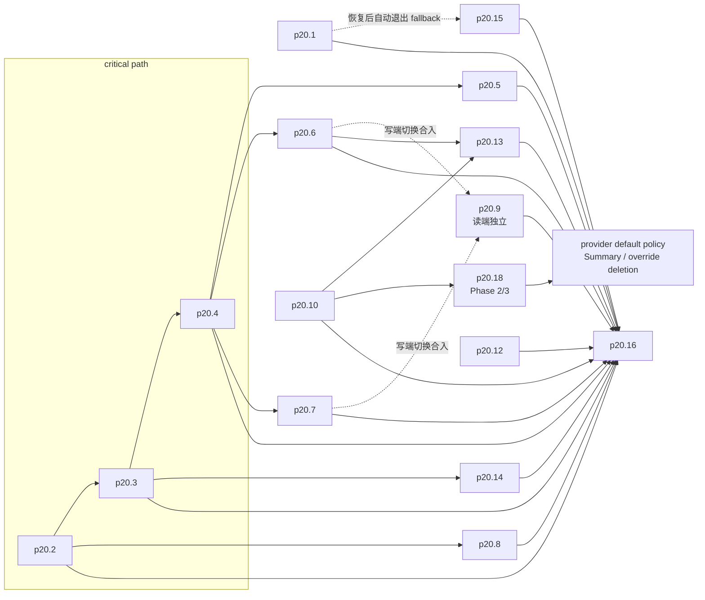
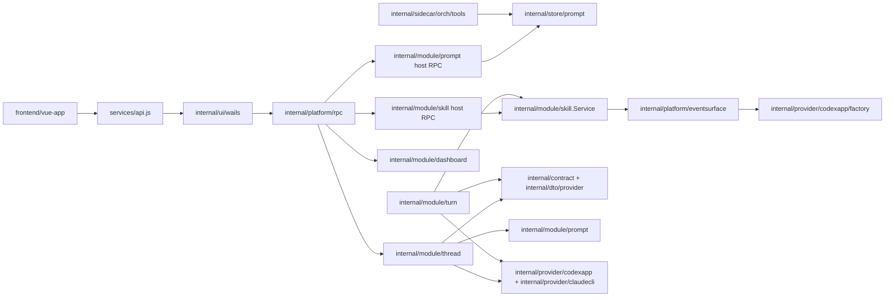

# P20 Skill 渐进披露迁移拆分

> 创建时间：2026-04-19 | 更新时间：2026-04-26 | 状态：**critical-path + α 组全部关闭 / p20.18 Phase 0/1/1.5 已在 P25 worktree 落地 / Phase 2+3 待做**
> 当前 authoritative 文档：`README.md`、`status-checkpoint-2026-04-19.md`、`source-refs-appendix.md`、各 `p20.X-*.md`，以及上层修订文档 `../p20.1-skill-progressive-disclosure-hardening.md` / `../p20.1-hardening-implementation-checklist.md` / `../p25skill优化/p25skill优化.md`
> 历史总纲留档：`p20-original-plan.md`

## 最新施工快照（2026-04-20 第十一轮 · α 组收口）

- **α 组 4 单本轮全部 PASS**：P20.1 / P20.10 / P20.14 / P20.15 实施 + 1:3 互审 + E/F 独立终审（双 BLOCK）+ 双轮补修全部闭环，等待合入 main。
- **基线顺手修复**：archtest `rule2/rule10` fx import → 合并 `skill_catalog_fx.go` 进 `module.go`，prompt prod 文件 **28 → 27**；`TestStartAssemblyGolden` 日期漂移 → `PROMPT_START_CURRENT_DATE` env hook + `t.Setenv`。
- **Critical-path 保持绿**：P20.2 (`78c6907`) → P20.3 (`cec26fe`) → P20.4 (`b0d2555`) 已合入 `main`。
- **P20.1 Phase 1-11 保持**：SkillCatalogProvider（`c1ead48`）、元指令（`3cd3144`）、fx 灰度 + 5 counter（`00b073f`）、文档同步（`a07067c`）；功能闸门默认关闭。
- **P20.1 加固连带实质性完成**：P20.5 / P20.6 / P20.7 / P20.8 / P20.9 / P20.12（见拆分总表）。
- ~~P20.13（审批缓存接线，前置核查已完成结论 **NEEDS-DOC-FIX**，需先修订任务单）曾标 **仍未开工**、~~ P20.16（集成测试，等所有前置合入）。
  - ⚠️ HEAD 2026-04-25 drift：P20.13 已实施待终验（commit `7a1f49c`，2026-04-24 接入生产 `skill/expand` approval 链；任务单已同步 NEEDS-DOC-FIX 3 处）。
- **已废弃**：P20.11（MCP 工具）— skill 是宿主独有能力。
- **2026-04-26 P25 drift**：P20.18 Phase 0/1/1.5 已在独立 worktree 落地；codexapp host-direct 能力链已接线，普通 name-only/selected skill 路径已代码级验证可走 Summary；harness 级 PR-ready 仍待 Phase 2 claudecli stdio MCP server、模型视角 E2E、observability/approval 结构化。
- **验证**：`go build ./...` ✅；`go test ./internal/archtest/...` ✅；`go test ./...` ✅；`vitest` 前端全绿。

---

## 目标

把 P20 的两个已知 Bug（宿主 prompt surface 缺失、launch skill 断链）与后续 progressive-disclosure 能力拆成 16 个可独立派单、可回归、可做架构守卫的任务单；并保持与 P18 README 的“总表 → 依赖图 → 调度 → 合规”风格一致。

## 实施边界（给开工同学）

- authoritative 口径只认本目录 `README.md`、`source-refs-appendix.md`、`status-checkpoint-2026-04-19.md` 与各 `p20.X-*.md`，以及上层 `../p20.1-skill-progressive-disclosure-hardening.md` / `../p20.1-hardening-implementation-checklist.md` / `../p25skill优化/p25skill优化.md`。
- P20 不做“顺手重构”；写集只允许落在任务单显式列出的包/目录内。
- launch 主链 authoritative path：`frontend thread/start` → `internal/module/thread` → `contract.StartInput` / `dto.StartSessionRequest` → `provider start`。
- per-turn 主链 authoritative path：`Composer / useSkillPreview` → `thread/send` → `internal/module/turn` → `provider skill inject / rollout trim`。
- `cmd/mcp-orch` 只能经本地 facade / store / tool definition 扩展；禁止直接复用 `internal/module/*/rpc.go` 作为 MCP registry。

## 1. 拆分总表（16 / 16）

| 任务单 | 目标 | 状态 | 关闭提交 | 备注 |
|---|---|---|---|---|
| `p20.1` | 恢复 `prompts/list\|write\|delete` 宿主 handler | ✅ 本轮完成 | 待合入 | 方案 B merge-in-place；顺手解 rule2/rule10：prompt `28 → 27` |
| `p20.2` | 修 Bug #2 断点 B：PrepareTurn hydrate + codex fallback | ✅ 已完成 | `78c6907` | hydrate + codex name-list fallback 全部关闭 |
| `p20.3` | 修 Bug #2 断点 A：`thread/start` 增 `selectedSkills` 契约 | ✅ 已完成 | `cec26fe` | 前后端 + DTO + thread 合同全部打通 |
| `p20.4` | 把 launch skill 接进 StartAssembly / provider 启动链 | ✅ 已完成 | `b0d2555` | pin/force policy 消费 LaunchSkillNames |
| `p20.5` | 新增 L1 `SkillCatalogProvider` + dynamic slot | ✅ P20.1 Phase 8-10 已完成 | `c1ead48`→`00b073f` | 安全投影 + 元指令 + fx 灰度 + 5 counter；落点改到 `prompt` 包 |
| `p20.6` | claudecli `SkillInjectionPort` + native 降级 | ⚠️ 基础已落地 | `9b0f7e1`/`9707764` | Port 契约 + claude 实现 + native scan 已落地；per-turn carrier/registry 集成待收口 |
| `p20.7` | codexapp `SkillInjectionPort` + 三分支 marker | ⚠️ 基础已落地 | `9b0f7e1` | Port 契约 + codex 实现已落地；per-turn carrier/registry 集成待收口 |
| `p20.8` | resolver 决策矩阵 + expanded TTL | ⚠️ 基础已落地 | `3fbed75`/`b12df84` | `expanded_state.go` 数据结构已落地；resolver 矩阵升级 + runtime matcher 待完成 |
| `p20.9` | rollout marker 扩容与共享 trim | ⚠️ 读端已落地 | `e5947dc`/`25af3d7`/`9f0f4bd` | `rollout_markers.go` 读端 helper 已落地；provider 读端切换 + 写端分流待 p20.6/7 |
| `p20.10` | `skill/list` + `skill/expand` host RPC | ✅ 本轮完成 | 待合入 | name-based DTO；legacy `skills/*` 共存；skill 包 prod 新增 0 |
| `p20.11` | ~~MCP `skill_list` / `skill_expand` tool 注册~~ | 🚫 已废弃 | — | skill 是宿主独有能力，不由 mcp-orch 持有；模型可调工具暴露改由 p20.18 的 codexapp host-direct / claudecli stdio 子进程承接 |
| `p20.12` | config + policy + metrics 基础设施 | ✅ 被 P20.1 Phase 10 吸收 | `00b073f`/`9f0f4bd` | env flag + token budget + 5 counter 落在 `prompt/config.go` + `pkg/skillmetrics/` |
| `p20.13` | `(name,hash)` 审批缓存生产化接线 | 🟡 已实施待终验 | `7a1f49c` | 2026-04-24 落入生产 `skill/expand` approval 链；任务单已同步 NEEDS-DOC-FIX 3 处 |
| `p20.14` | 前端 LaunchSkillPicker | ✅ 本轮完成 | 待合入 | 字段级 feature gate；feature-off 恢复旧 blank-thread 行为 |
| `p20.15` | 前端 SystemPromptPage 404 降级 + 后端 dashboard cwd scope | ✅ 本轮完成 | 待合入 | detector 仅结构化白名单；dashboard handler 吃 `{cwd}` 活化 context |
| `p20.16` | 集成测试与尾部收口 | ❌ 未开工 | — | 全部前置任务完成后 |
| `p20.18` | provider 暴露 host RPC 为模型可调工具（填 P20.11 废弃后留下的责任真空） | 🟡 Phase 0/1/1.5 已落地，Phase 2/3 待做 | 当前分支待合入 | codexapp 普通路径已代码级验证 Summary + host-direct；harness 级 PR-ready 仍缺 claudecli stdio MCP、模型视角 E2E、observability/approval 结构化；详见 `p20.18-host-direct-skill-tool-exposure.md` 与 `../p25skill优化/p25skill优化.md` |

> 表中 “16 / 16” 为最初拆分总数；p20.18 为后续补丁任务，未纳入历史 16 单主 DAG，但逻辑依赖 `p20.10` host RPC / `skill.Service`，并作为 Phase 3 provider default policy / override 删除的硬前置。

## 2. 依赖图（DAG，无环）

## 依赖图合规 / 历史校验

- 2026-04-19 本地按 Mermaid 边做 DAG 校验：原 16 单主 DAG **无环**。
- 2026-04-26 P25 drift 后补依赖边：`p20.10 → p20.18`、`p20.18 → provider-default-policy/Summary`；按当前边集结构复审无明显环，但如把本 README 用作 PR-ready gate，需重新跑自动 DAG 校验并贴证据。
- 修订依赖边：`p20.10 → p20.13`、`p20.10 → p20.18`、`p20.18 → provider-default-policy/Summary`、`p20.6 → p20.13`、`p20.6 → p20.9`、`p20.7 → p20.9`、`p20.3 → p20.14`；`p20.10 → p20.11` 已随 P20.11 废弃移除。
- 解释：`p20.9` 的**读端独立**，但写端切换必须随 `p20.6/p20.7` provider 单合入；`p20.18` 依赖 `p20.10` 的 host RPC / `skill.Service` 消费点，并作为后续 Summary default policy / override 删除的硬前置；`p20.11` 已废弃；`p20.13` 还要额外等待 `p20.6` 固定审批事件链 / `skill/requestApproval` 兼容面；`p20.14` 只依赖 launch-time contract 打通（`p20.3`），不再错误挂到 `p20.4`（见 `docs/plans/迁移/p20/p20.18-host-direct-skill-tool-exposure.md`、`docs/plans/迁移/p20/p20.13-approval-cache-wiring.md:3,16-18,67-71`、`docs/plans/迁移/p20/p20.14-frontend-launch-skill-ui.md:3,17-20`）。

## 3. 历史可并行分组（2026-04-19 记录，非当前待派清单）

- **α（历史立即可派，当前多项已收口）**：`p20.9`（仅读端） / `p20.10` / `p20.12`（已缩到 1 文件） / `p20.15`，以及**带 archtest 前置核查**的 `p20.1`
- **critical**：`p20.2`（PrepareTurn hydrate + codex fallback） → `p20.3` → `p20.4`
- **β（`p20.4` 完成）**：`p20.5` / `p20.6` / `p20.7`
- **γ（`p20.2` 完成）**：`p20.8`
- **γ'（`p20.3` 完成）**：`p20.14`
- ~~**δ（`p20.10` 完成）**：`p20.11`~~ — 已废弃
- **ε（`p20.10` + `p20.6` 完成）**：`p20.13`
- **ζ（`p20.10` 完成，P25 worktree 已部分落地）**：`p20.18` Phase 2 claudecli stdio MCP server；Phase 3 provider default policy / override 删除另设 red gates
- **终**：`p20.16`

## 4. Agent 派发表（历史记录，含包归属 / 预算 / 难度 / 优先级）

> ⚠️ 本节是 2026-04-19 拆单时的历史派发表；表内“当前 / 安全 / 仅允 +N”等包预算结论不代表 2026-04-26 P25 worktree 真值。若用于开工或 PR-ready gate，必须先按 §5.1 重新跑包计数与 archtest / freeze 校验。

| 任务单 | 主包/主目录 | 预算 | 难度 | 优先级 | 包预算结论 |
|---|---|---|---|---|---|
| `p20.1` | `internal/module/prompt` + `internal/store/prompt` | ≤6 文件 | M | P1 | `prompt` archtest 真值 `27` prod / `2858` EL；方案 B 保持 **0 新增 prompt prod 文件** |
| `p20.2` | `internal/module/turn` + `internal/provider/codexapp` | ≤6 文件 | H | P0 | `turn` `22→24` 区间安全；本单先走 hydrate + fallback，不新开 thread/prompt 文件 |
| `p20.3` | `internal/module/thread` + `internal/dto/provider` + frontend helper + `codexapp` driver | ≤7 文件 | M | P0 | `thread` 当前 `25`，**禁止新增 prod 文件** |
| `p20.4` | `internal/module/thread` + `internal/contract` + provider start path | ≤6 文件 | H | P0 | `thread` 继续只改现有文件；`internal/contract` `15→16` 安全 |
| `p20.5` | `internal/module/skill` + `internal/module/prompt/dynamic.go` | ≤5 文件 | M | P1 | catalog provider 已改落 `skill`；`prompt` 侧只改既有 slot/spec |
| `p20.6` | `internal/provider/claudecli` + `internal/contract` | ≤5 文件 | M | P1 | `claudecli` `24→25`，仅允 +1 prod 文件；共享 `SkillInjectionPort` |
| `p20.7` | `internal/provider/codexapp` + `internal/contract` | ≤6 文件 | M | P1 | `codexapp` `19→20`，安全 |
| `p20.8` | `internal/module/turn` | ≤6 文件 | M | P2 | `turn` 最终预计 `24`；`expanded_state` 内存态，TTL 5 turns |
| `p20.9` | `internal/module/skill` + provider rollout trim path | ≤4 文件 | M | P1 | 读端可先落；写端切换并入 `p20.6/p20.7` |
| `p20.10` | `internal/module/skill` | ≤6 文件 | M | P1 | host RPC 新增 `skill/list` / `skill/expand`；保留 `skills/match/preview` 共存 |
| `p20.11` | ~~`internal/sidecar/orch/tools`~~ | — | — | 🚫 废弃 | skill 是宿主独有能力，mcp-orch 不应持有 skill 工具 |
| `p20.12` | `internal/platform/config` + `internal/module/skill` | ≤5 文件 | M | P2 | `internal/module/skill` 目录当前 `24` 个 `.go`（含 tests），本单**只允 +1** `policy_metrics.go` |
| `p20.13` | `internal/module/skill` + `eventsurface` + `codexapp/factory` | ≤6 文件 | H | P2 | 依赖 `p20.10` + `p20.6`；默认 `(name,hash)` 全局批准，`scope=session` 只走内存态 |
| `p20.14` | frontend `vue-app` | ≤9 文件 | M | P2 | 依赖 `p20.3`；`thread-actions-helpers.js` 已 613 行，只做极小 payload diff |
| `p20.15` | frontend `SystemPromptPage` | ≤4 文件 | L | P1 | 不需要 feature flag；`dashboard/prompts` 仅 list-only 旁路 |
| `p20.16` | 多包测试 / frontend test / MCP test | ≤10 文件 | H | P0-终验 | 测试文件不计入包文件守卫；文件清单需与子单一致（≤10-15 硬上限） |

### 4.1 历史建议调度顺序
1. 先跑 `p20.1` 的 archtest 权威核查，同时起 `p20.2` critical 首段。
2. 并行派 α：`p20.9`（读端）/ `p20.10` / `p20.12` / `p20.15`；`p20.1` 在确认方案 B 后并入实施。
3. `p20.2` 合入后立即分叉：`p20.3` 与 `p20.8`。
4. `p20.3` 合入后先起 γ'：`p20.14`；`p20.4` 合入后再平行派 β：`p20.5 / p20.6 / p20.7`。
5. 待 `p20.10` + `p20.6` 合流后起 ε：`p20.13`。（~~`p20.11` 已废弃~~）
6. 所有 feature 合流后，单独派未参与实装的 agent 做 `p20.16`。

## 5. 合规结论

### 5.1 包文件预算 / freeze registry（历史参考）

> 本 README 只保留结论，不继续维护 2026-04-19 的具体包计数 / freeze 数字。Phase 2 开工前必须以当时源码重新跑包计数、archtest / freeze 校验；若 `p20.18` 新增 claudecli 文件，需要在任务单中说明豁免、更新守卫，或合并到既有文件。

### 5.2 架构口径

- `p20.3/p20.4` 是 launch contract 的 authoritative owner：`frontend` 只能传字段，真正消费必须落在 `thread + contract + provider start path`。
- `p20.2/p20.8/p20.6/p20.7/p20.9` 是 per-turn chain 的 authoritative owner：`turn` 返回结构化 `SkillRef`，provider 只负责 provider-specific render / inject / trim。
- `p20.2` 已锁定为 **PrepareTurn hydrate + codex fallback**；禁止新建 `skill_hydrator.go`。
- `p20.9` 采用 **dual-read / single-write**：读端独立落地，写端切换跟随 `p20.6/p20.7`。
- `p20.10` 提供 `skill/list` / `skill/expand` host API；`p20.13` 依赖 `p20.10` 的 service 能力，还额外依赖 `p20.6` 提供稳定的审批事件链 / `skill/requestApproval` 兼容面；不直接复用 host handler map。（`p20.11` 已废弃：skill 是宿主独有能力，不属于编排层。）

## 6. 跨模块依赖总图

> 守卫结论：允许 `turn → skill.Service`、`thread → promptAssembly → provider DTO`；允许 mcp-orch 经既有 facade/store 处理非 skill 宿主能力。skill 工具暴露由 provider host-direct / claudecli stdio 子进程承接，不允许 `cmd/mcp-orch` 直接持有 skill tools，也不允许 `provider ↔ prompt` 成环。

## 7. 必读文档

1. `../p20.1-skill-progressive-disclosure-hardening.md` — P20.1 风险修订与最新设计基线
2. `../p20.1-hardening-implementation-checklist.md` — P20.1 可执行实施清单 / 验收勾选表
3. `p20-original-plan.md` — 历史总纲与原始阶段设计
4. `status-checkpoint-2026-04-19.md` — 当前落地真相 / 两个 Bug / 优先级
5. `source-refs-appendix.md` — 经 LSP 复核后的全量锚点索引与合规结论
6. `docs/plans/迁移/p18/README.md` — 风格基线
7. `../p25skill优化/p25skill优化.md` — P25 skill progressive-disclosure Phase 0/1/1.5 落地与 Phase 2/3 gate
8. `docs/1/会话习惯.md` — 仓库契约 / agent 派单规范 / LSP 强制要求
