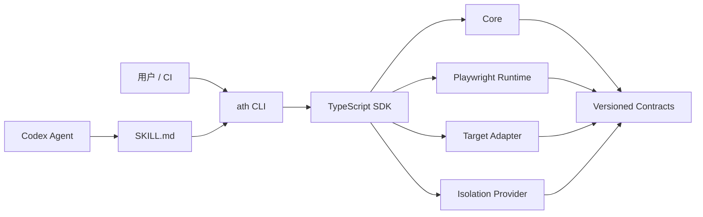
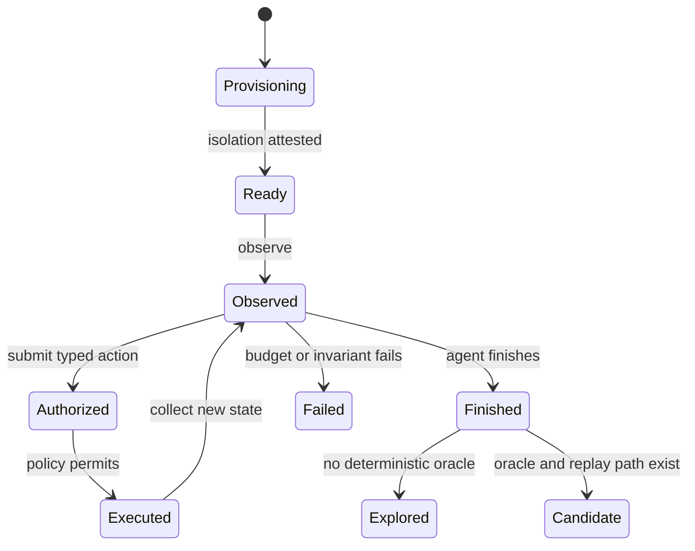

# Agentic Testing Harness 独立项目设计

日期：2026-07-11

状态：已批准；长连接 CLI session 修订已确认

项目名：`agentic-testing-harness`

CLI 命令：`ath`

## 1. 背景

Super-Dolphin 当前包含一套实验性的 Agentic E2E trial。它已经验证了 Playwright 驱动、页面事实采集、固定目标规划、Wails bridge mock、sandbox 和逐步证据等思路，但仍与产品路由、选择器、RPC、设置字段和仓库生命周期紧密耦合。

现有 trial 适合作为需求与回归样本，不适合作为通用框架的直接代码基线。已确认的主要风险包括 mock 缺失时假通过、隐藏 DOM 被当作可见、网络未真正隔离、证据可能泄露敏感值、symlink 逃逸、成功 oracle 过弱、错误 worktree 服务复用，以及 CI 浏览器 provisioning 不完整。

本设计将这些问题转化为新项目必须先满足的契约和对抗测试，并将 Super-Dolphin 特定行为留在产品仓库。

## 2. 产品定位

`agentic-testing-harness` 是一个独立的 TypeScript 测试 harness，用于让外部 Agent 在受控环境中自主观察、选择并执行 UI 操作，同时由 harness 统一负责：

- session 状态与并发控制；
- target 生命周期和身份验证；
- 动作授权与执行；
- 轻隔离和硬隔离；
- 证据采集、脱敏和预算；
- 结果分类和 candidate 生成；
- 确定性 candidate 重放。

首版以外部 Codex Agent 作为 planner。Harness 不内置 LLM，不保存模型凭据，也不让 Agent 直接取得 Playwright、宿主 shell 或 adapter 内部对象。

CLI 是统一用户接口；TypeScript SDK 是 CLI 和受信任集成代码共用的能力层；Codex/Super-Dolphin `SKILL.md` 是只调用 CLI 的薄适配层。

## 3. 目标

首个可试用版本必须：

1. 位于独立 Git 仓库，能够通过本地包或 Git 依赖在 Super-Dolphin 中 dogfood。
2. 提供稳定、版本化、可机器读取的 CLI JSON 协议。
3. 提供与 CLI 能力一一对应的 TypeScript SDK。
4. 支持真实浏览器 Web target、真实 Electron 进程和严格 Wails mock target。
5. 以 Agent 自主探索作为主要执行模式，以 candidate replay 作为确定性门禁模式。
6. 允许只读轻隔离；只有容器或 VM 级隔离证明有效时才允许任意 UI 写探索。
7. 在采集边界完成敏感数据脱敏，禁止原文先落盘再清洗。
8. 将当前 trial 的已知 P1 问题固化为对抗回归。
9. 不导入任何 Super-Dolphin 源码或产品常量。

## 4. 首版非目标

首版不提供：

- 真实 Wails WebView 自动化；
- 内置 LLM 或 provider adapter；
- MCP server、HTTP daemon 或远程 worker；
- Claude Code 等其他 Skill 格式；
- 真实 provider 凭证或生产环境测试；
- 分布式执行或云端控制面；
- 像素级视觉回归；
- candidate 自动晋升为 CI 测试；
- Agent 任意 JavaScript 注入、宿主 shell 或原始 Playwright page 访问。

## 5. 仓库结构

独立仓库采用 npm workspaces：

```text
agentic-testing-harness/
├── packages/
│   ├── contracts/
│   ├── core/
│   ├── sdk/
│   ├── cli/
│   ├── runtime-playwright/
│   ├── isolation/
│   ├── adapter-web/
│   ├── adapter-electron/
│   └── adapter-wails-mock/
├── skills/
│   └── codex-agentic-testing-harness/
├── examples/
│   ├── web-fixture/
│   ├── electron-fixture/
│   └── wails-mock-fixture/
└── tests/
    ├── contracts/
    └── adversarial/
```

在公开 npm 发布前，workspace 包使用私有的 `@agentic-testing-harness/*` 名称；CLI 包名为 `agentic-testing-harness`，提供 `ath` bin。

### 5.1 依赖方向



强制规则：

- Skill 只能调用 CLI。
- CLI 只负责参数、JSON envelope、stderr 日志和退出码。
- Core 不依赖 Playwright、Electron、Wails 或具体产品。
- Runtime、adapter 和 isolation 通过 `contracts` 交互。
- 产品 adapter 是受信任的项目代码，但不能向 Agent 暴露原始 runtime 对象。
- Super-Dolphin 的 goals、选择器、RPC 名称、fixture 和 oracle 不进入通用仓库。

## 6. CLI 和 SDK 契约

### 6.1 CLI 命令

```bash
ath init
ath doctor
ath session stream --target <profile> --mode read --jsonl
ath replay <candidate-id> --json
ath report <session-id>
```

Foundation 只接受 `--mode read`。`write` 保留给后续具备 container/VM hard isolation 的阶段，不能在 light isolation 下通过参数开启。

`ath session stream` 是一个前台长连接进程。它拥有 session、Playwright browser、页面、Electron 进程和 adapter handle；进程生命周期与 session 生命周期完全一致。它不监听端口，不创建后台 daemon，也不要求后续 CLI 进程恢复不可序列化的 runtime handle。

进程完成 target provisioning 后，先以保留 request ID `ath:bootstrap` 输出一个 `session.ready` envelope。此后 Agent 通过 stdin 逐行发送 `observe`、`act`、`status` 和 `finish` 请求，每个有效请求恰好产生一个 stdout JSON envelope。无法归属于有效 client request 的格式错误或异步 runtime failure 在 stdout 仍可用时使用保留 ID `ath:terminal`；EOF、signal 或输出失效不会伪造一个 client response。运行时事件进入有界缓冲区，并由后续 observation 或 status 返回。

```json
{"schemaVersion":"1","requestId":"r1","type":"observe"}
{"schemaVersion":"1","requestId":"r2","type":"act","revision":4,"data":{"action":{"type":"click","target":{"kind":"role","role":"button","name":"Save","strict":true}}}}
{"schemaVersion":"1","requestId":"r3","type":"finish"}
```

`act` 消息是授权和执行的原子操作。Agent 不能先取得独立授权凭据，再绕开 Core 直接执行动作。Action payload 只通过 stdin JSONL 传入，避免敏感输入进入进程参数、shell history 或诊断日志；首版不提供内联 action 参数。

stdin EOF、premature close、`SIGINT`、`SIGTERM`、格式错误的 JSONL、stdout ownership violation、输出失效或未捕获的 runtime 错误都触发同一 fail-fast shutdown：停止 target、关闭 browser、验证 cleanup、写入失败结果，然后退出。格式错误的协议行不会被跳过或猜测修复。已被接受的 `finish` 拥有 first-terminal 权威；后到的 EOF、signal 或 runtime event 不能把已经完成的 durable success 改写成失败，但真正无法交付 finish response 的 stdout failure 仍以 infrastructure exit 结束且不发送矛盾 envelope。

每个动作必须携带 observation revision。页面或 target 状态变化导致 revision 失效时，CLI 返回明确错误，要求重新观察。

### 6.2 JSON envelope

`--jsonl` 模式的 stdout 每行只能包含一个版本化 JSON envelope；诊断日志只能写入 stderr。入口在加载用户配置前保留一个私有 stdout write capability，并阻断公开 `process.stdout.write`，包括 process exit handlers；SDK、配置或依赖不能用普通 stdout API 污染协议。初始 `session.ready` 和每个请求响应都使用相同 envelope。

stdin 使用 fatal UTF-8、LF/CRLF JSONL framing，并在换行前执行 1 MiB 原始字节上限；超限、无效 UTF-8、unterminated final record、未知字段或未知请求类型都作为 `CONTRACT_ERROR` fail-fast。请求串行执行，响应 writer 必须等待 callback 和 backpressure drain，并能被 shutdown 取消。

```json
{
  "schemaVersion": "1",
  "requestId": "request-uuid",
  "sessionId": "session-uuid",
  "revision": 4,
  "ok": true,
  "data": {},
  "evidenceRefs": []
}
```

失败 envelope 使用相同顶层字段，并包含稳定错误码、可操作消息和安全的 details。Envelope 与其他持久化/跨进程开放值只接受 `JSON.parse` 可产生的有限递归数据；不得把 `undefined`、非有限数、函数、`bigint`、循环引用、稀疏数组、symbol/accessor 属性、class instance、`Map`、`Set`、`RegExp`、`Date` 或自定义 `toJSON` 伪装成 JSON object。未知字段、未知动作、失效 session、缺少隔离证明或版本不兼容都 fail-fast。

### 6.3 SDK

SDK 提供 stream 进程内部使用的能力：

- `startSession`
- `observe`
- `act`
- `getSessionStatus`
- `finishSession`
- `replayCandidate`
- `readReport`

CLI 必须调用 SDK，不得维护第二套执行逻辑。

SDK 对象和 runtime handle 只存在于 `ath session stream` 进程内。首版不支持把 live session 序列化后交给另一个 CLI 进程继续执行。

### 6.4 项目配置

使用方通过 `agentic-testing-harness.config.ts` 声明：

- target profiles；
- adapter；
- 启动与健康检查；
- isolation provider；
- 网络允许列表；
- 动作、时间和资源预算；
- evidence 与 retention 策略；
- 产品 observation 扩展和 oracle；
- Wails mock RPC contract。

配置文件不得包含明文 secret。

## 7. Agent 自主探索循环

外部 Agent 负责推理，Harness 负责事实和权限：



每轮执行：

1. Harness 采集真实可见语义、target identity、URL、窗口、console/network/bridge 摘要和 evidence refs。
2. Agent 从当前 observation 选择一个类型化动作。
3. Core 验证 revision、隔离等级、预算、网络策略和 adapter capabilities。
4. Runtime 原子执行动作。
5. Harness 重新验证页面、进程、bridge、网络、挂载和 adapter invariant。
6. Harness 返回带 before/after 摘要的 action receipt。
7. Agent 决定继续、重新观察、结束或声明无法继续。

一个 session 同时只能执行一个动作。

### 7.1 首版动作集合

- `navigate`
- `click`
- `fill`
- `select`
- `check`
- `press`
- `upload`
- `window`
- `waitFor`
- `finish`

“任意写探索”仅指 Agent 可通过目标应用执行任意 UI 写路径。它不允许任意 JavaScript、shell、宿主文件访问或绕过 action receipt。

## 8. 双级隔离

### 8.1 Read mode

Read mode 使用轻隔离：

- 临时 HOME、项目目录和浏览器 profile；
- Harness 分配的独占端口；
- 随机 target identity nonce；
- 不继承宿主 credentials、tokens、cookies 或浏览器状态；
- 网络仅允许声明的 target origins；
- session 完成后终止整个进程组并清理临时目录。

Read mode 只允许观察、导航，以及受信任 adapter 通过稳定 action identity 显式声明为只读的动作。`click`、`fill`、`select`、`check`、`press`、`upload` 和未分类动作默认按写动作处理；按钮文案、ARIA label 或 Agent 自述不能降低风险等级。

Read session 请求任何写动作时必须返回 `POLICY_BLOCKED`。Harness 不得静默升级隔离等级；调用方必须新建 write session。

### 8.2 Write mode

Write mode 要求容器或 VM 级硬隔离。首版实现 Docker provider，并定义但不实现 VM provider contract。

硬隔离必须：

- 使用一次性文件系统、浏览器状态和应用数据；
- 禁止 Docker socket、宿主 HOME、SSH agent 和云凭证目录；
- 禁止可写宿主挂载；
- 网络默认拒绝，仅开放 target 配置中的服务；
- 限制 CPU、内存、时长、动作数、网络量和证据大小；
- Electron 运行在隔离域内的虚拟显示环境；
- Wails mock 和目标前端位于同一隔离域；
- 证据经过脱敏和大小检查后才能导出到宿主。

### 8.3 Isolation attestation

每个 write session 必须持有与 session nonce 绑定的证明：

```json
{
  "level": "hard",
  "provider": "docker",
  "instanceId": "instance-id",
  "imageDigest": "sha256:digest",
  "mountPolicyHash": "sha256:digest",
  "networkPolicyHash": "sha256:digest",
  "nonce": "session-nonce",
  "verified": true
}
```

证明缺失、过期、不匹配或验证失败时，任何写动作都必须被阻断。路径验证使用真实路径并拒绝 symlink escape。

## 9. Evidence 和结果模型

每个 session 生成：

```text
runs/<session-id>/
├── manifest.json
├── events.jsonl
├── result.json
├── report.md
├── candidate.yaml
└── artifacts/
```

`events.jsonl` 是追加式事件账本。每个 action receipt 包含前一事件 hash，以发现意外修改；该 hash chain 不被描述为对恶意宿主的密码学防护。

Action receipt 至少记录：

- observation revision；
- Agent 请求；
- 策略裁决；
- 实际执行动作；
- locator 唯一性和可见性；
- before/after 状态摘要；
- 页面、窗口、进程、网络、bridge 和隔离状态；
- artifact refs。

### 9.1 脱敏

脱敏发生在采集边界：

- password、token、API key、cookie、授权头和声明的敏感字段永不保存原文；
- 敏感输入只保留类型、长度和 session 内临时标识；
- DOM、ARIA、console、URL query、RPC payload 和截图元数据统一经过 redactor；
- 截图在捕获时遮罩声明或识别出的敏感元素；无法可靠遮罩时不导出截图，不能依赖事后 OCR 作为主要脱敏手段；
- 网络与日志使用有 dropped-count 的有界缓冲区；
- 单 artifact、单 session 和 retention 都有硬预算。

`candidate.yaml` 和 Markdown 报告只能引用已经脱敏的事件及 artifact，不能重新读取原始 target 数据拼装报告。

### 9.2 结果状态

- `explored`：完成探索但没有确定性 oracle；
- `candidate`：形成了可重放路径和明确 oracle；
- `replay_passed`：candidate 在全新隔离环境中通过；
- `product_failed`；
- `policy_blocked`；
- `infrastructure_failed`。

Agent 不能单方面把结果标为通过。Oracle 可验证 URL、可见元素、精确 bridge/RPC 集合、文件快照、进程状态和 adapter invariant。

Candidate 默认必须在三个全新隔离 session 中连续重放成功且无策略违规，才能申请人工批准进入 CI。

## 10. Target adapter

统一生命周期：

```ts
interface TargetAdapter {
  describe(): TargetDescriptor
  provision(context: ProvisionContext): Promise<ProvisionReceipt>
  launch(context: LaunchContext): Promise<LaunchReceipt>
  verifyIdentity(context: IdentityContext): Promise<TargetIdentity>
  capabilities(context: CapabilityContext): Promise<TargetCapabilities>
  classifyAction(context: ActionClassificationContext): Promise<ActionRisk>
  checkInvariants(context: InvariantContext): Promise<InvariantResult[]>
  collectEvidence(context: EvidenceContext): Promise<EvidenceFragment[]>
  shutdown(context: ShutdownContext): Promise<ShutdownReceipt>
}
```

### 10.1 Web adapter

- Harness 分配端口并启动目标服务。
- 使用 nonce、源码根或 build identity 验证目标身份。
- 默认禁止复用已有服务器。
- 管理健康检查、浏览器 profile 和完整进程组。

### 10.2 Electron adapter

- 通过 Playwright Electron runtime 启动真实进程。
- 强制临时 `userDataDir`、窗口身份和退出检查。
- 写探索只允许在 hard isolation 中运行。
- 禁止连接用户正在运行的 Electron 实例。

### 10.3 Wails mock adapter

- 在页面脚本执行前注入严格 bridge。
- 使用方提供 RPC schema、fixture、允许的副作用和 invariant。
- 未知 RPC、mock 缺失、payload 不匹配或预期调用缺失都失败。
- 通用包不包含 Super-Dolphin RPC 名称或响应。

## 11. Codex Skill

`skills/codex-agentic-testing-harness/SKILL.md` 负责：

- 检查 `ath doctor`；
- 根据用户意图选择 read 或 write session；
- 在写探索前解释并验证 hard isolation；
- 启动并保持一个 `ath session stream` 子进程或 PTY handle；
- 驱动 `observe → act → observe` 循环；
- 尊重预算和 fail-fast 错误；
- 完成 session 并向用户展示报告与 candidate；
- 明确区分 explored、candidate 和 replay_passed。

Skill 不复制 contracts，不直接导入 SDK，不读取 harness 内部状态文件，也不提供策略旁路。

## 12. 错误模型

稳定错误分类：

- `CONFIG_ERROR`
- `CONTRACT_ERROR`
- `POLICY_BLOCKED`
- `ISOLATION_ERROR`
- `TARGET_ERROR`
- `ACTION_ERROR`
- `ORACLE_FAILED`
- `INFRASTRUCTURE_ERROR`

错误必须在 SDK、CLI JSON 和进程退出码之间保持一致。禁止吞错、补默认值或从 hard isolation 降级到 light isolation。

CLI 退出码固定为：success `0`、`CONFIG_ERROR=2`、`CONTRACT_ERROR=3`、`POLICY_BLOCKED=4`、`TARGET_ERROR=5`、`ACTION_ERROR=6`、`ORACLE_FAILED=7`、`ISOLATION_ERROR=8`、`INFRASTRUCTURE_ERROR=9`。错误对象只信任 SDK 模块私有品牌确认的精确冻结实例；对外消息使用固定安全文本，不转发任意 caught error message、stack 或 accessor/proxy 值。

## 13. 测试和 CI

### 13.1 测试层级

1. Contract tests：JSON Schema、SDK 类型、CLI envelope、错误码和版本兼容性。
2. Core model tests：状态机、revision、预算、授权、事件 hash chain、stream shutdown 和 candidate promotion。
3. Adversarial tests：mock 缺失、隐藏 DOM、外部网络、secret 泄漏、symlink escape、越权 RPC、错误 target 复用和过期 observation。
4. Adapter conformance tests：lifecycle、identity、cleanup、evidence 和 invariant。
5. Fixture E2E：Web、Electron 和 Wails mock 的真实 CLI 循环与 replay。

### 13.2 CI 分层

- 每次提交：lint、typecheck、unit、contract，以及 `npm pack` 后的全新目录安装测试。
- Linux：Docker hard-isolation 和安全对抗测试。
- Linux/macOS/Windows：Web 与 Electron adapter 基础矩阵。
- Linux/macOS/Windows：Wails mock bridge contract。
- 夜间任务：长时间探索、资源上限和 candidate replay 稳定性。
- Super-Dolphin dogfood 在产品仓库运行，不成为通用仓库依赖。

测试环境必须显式安装并缓存所需 Playwright 浏览器。直接 import 的 package 必须直接声明为依赖。

## 14. Super-Dolphin 集成边界

Super-Dolphin 保留产品层文件：

```text
tests/agentic-harness/
├── agentic-testing-harness.config.ts
├── adapter.ts
├── rpc-contracts.ts
├── observations.ts
├── oracles.ts
└── promoted/
```

现有 14 个 goals 转换为 `promoted` scenarios。产品仓库不再维护第二套通用 runner、sandbox、reporter 或 Wails mock。

## 15. 迁移计划

1. 新建 `agentic-testing-harness` 独立仓库和 workspace。
2. 定义 contracts、错误码、CLI envelope 和 adapter conformance suite。
3. 将现有 P1 问题转化为 adversarial tests。
4. 实现 Web runtime、轻隔离和只读 Agent 循环。
5. 实现 Docker hard-isolation，再开放写动作。
6. 实现 Electron fixture 和通用 Wails mock fixture。
7. 在 Super-Dolphin 中通过本地包或 Git 依赖接入产品 adapter。
8. 将 14 个 goals 转换为 promoted scenarios，新旧 harness 并行运行。
9. 新 harness 稳定后，以独立可回滚提交删除旧 scripts 和重复 mock。

迁移不要求先在旧 trial 内完成大规模通用化；旧 trial 只作为行为样本、风险清单和 parity 基线。

## 16. 首个可试用版本验收标准

必须同时满足：

- 独立仓库不导入 Super-Dolphin 源码。
- CLI 和 SDK 契约一一对应。
- JSONL 请求/响应、stdout/stderr、EOF/signal cleanup 和退出码契约通过全新安装测试。
- Web、Electron 和 Wails mock fixture 通过 adapter conformance 与 E2E。
- Read session 无法执行写动作。
- Write session 无有效 hard-isolation attestation 时无法启动或执行动作。
- 所有已知 P1 假阳性、安全和泄密路径都有失败回归。
- Candidate 能在三个全新 session 中重放并生成一致 oracle 结果。
- Super-Dolphin 14 个现有目标在产品 adapter 中保持覆盖。
- 新旧 harness 结果可按 scenario、action receipt 和 oracle 对照。
- 干净开发机按文档可完成依赖和 Playwright 浏览器 provisioning。

达到上述标准后，项目仍以本地包或 Git 依赖 dogfood；公开 npm 发布是后续独立决策。
