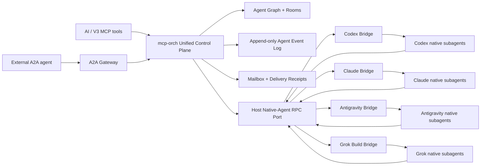

# 统一原生 Subagent 控制面设计

Date: 2026-07-11

Last revised: 2026-07-16

Status: fifteenth three-agent adversarial review integrated; `GO` only for Gate S0 fourteen-spec decomposition and user re-review, `NO-GO` for unified implementation/production until section 2.2 blockers and every applicable machine-DAG ancestor/gate are closed

Original design baseline: `a4334bc8884c29303568fe6461794856e910d1b8`

Implementation revalidated against: `a72d239f983f4d21d275ffc54a3337f6888ae058`

Second adversarial review input: HEAD above + unstaged document blob `86f0f66b88d9cece97b7e2cb21d35cf00375278b` (`sha256:a30cf02ae1798be199cea57800fa5bfc006d8ebb46b0af8b414c28bab8773742`); HEAD alone is not the review object

Third adversarial review input: HEAD above + unstaged document blob `2139d8594e5503ca959f33fc59a6427a8d90287c` (`sha256:50adfa18c448b5e3b22df4c38015d4906aa369c87d032ffc0f716ca558fdfd83`); review lanes did not edit the file while evaluating this object

Fourth adversarial review input: HEAD above + unstaged document blob `f4ce1566f86f823b4216a89265db10ff644120dc` (`sha256:84ce5745c0656cc258b2a42cb5f3c2ea47d669bea22c073fb945e4dd1a50dd65`); three independent lanes did not edit the file while evaluating this object

Fifth adversarial review input: HEAD above + fourth-round repair candidate blob `0f4f1270dcc24459b9bf5d27c87d32b92020f4b1` (`sha256:884961f76d86e1ef14c2d5a5b633c476f923fe9f34bf01cc37615fb4dd29f95b`); three independent lanes confirmed the exact object and did not edit it

Sixth adversarial review input: HEAD above + unstaged document blob `e142147864858d22be4d22ca4ad58c143bb740ec` (`sha256:377d7cb9a9d9e940fa6f961a61d7a51ad5ed982d72c3300404be47109a392a63`); all three agents were newly created and reviewed line 1 through EOF without editing

Seventh adversarial review input: HEAD above + unstaged document blob `16d7c6131a18f83e960435cf53d9c7ca9887803c` (`sha256:049bc42317801c2e1bac5069dee5f23d010f982b6248c790175d2c79981994bc`, 1757 lines); all three agents were newly created for this round, independently verified the exact object, reviewed line 1 through EOF, and made no edits

Eighth adversarial review input: HEAD above + unstaged document blob `33e8ced3ba8c47a47c212344382f6b237fd823b1` (`sha256:f4e5a58c6d7388d92ac6ea4692637f08e73e38c2f3df0eb456a1c2153efce0fb`, 1779 lines); `round8_full_arch_protocol`、`round8_full_crash_security`、`round8_full_verification_release` were three newly created agents, each independently verified the exact object, reviewed line 1 through EOF, and made no edits

Ninth adversarial review input: HEAD above + unstaged document blob `4e28d39d009964cae5031dc60c5d4be3c8cadfd8` (`sha256:45d4f6e0676ea0d027b61ff74624b4361f7481320983b56db712e9f6044f5ce9`, 1798 lines); `round9_full_arch_protocol`、`round9_full_crash_security`、`round9_full_verification_release` were three newly created agents, each independently verified the exact object before and after review, reviewed line 1 through EOF, and made no edits

Tenth adversarial review input: HEAD above + unstaged document blob `25e9459b6175a8241ac3ded8653b0d0c36f9682c` (`sha256:b7b4392c276ce2b0a3e24fe6f1bc214494cf45ff9fff319ce760c314035e30cb`, 1806 lines); `round10_full_arch_protocol`、`round10_full_crash_security`、`round10_full_verification_release` were three newly created agents, each independently verified the exact object before and after review, reviewed line 1 through EOF, and made no edits

Eleventh adversarial review input: HEAD above + unstaged document blob `07d8575f4ce751a29e32184f8efd1860525abb50` (`sha256:54b060746f9a1f3c445efd41e083e6df1826ab094997d1d28404566e5e4375a4`, 1834 lines); `round11_full_arch_protocol`、`round11_full_crash_security`、`round11_full_verification_release` were three newly created agents, each independently verified the exact object before and after review, reviewed line 1 through EOF, and made no edits

Twelfth adversarial review input: HEAD above + unstaged document blob `a96d24e671d2bf58aa61a06d86c930fd3cc003fe` (`sha256:d2461d255136f53c93ba774202c751025d87be816c44fc45df5d9b60241d68cf`, 1854 lines); `round12_full_arch_protocol`、`round12_full_crash_security`、`round12_full_verification_release` were three newly created agents, each independently verified the exact object before and after review, reviewed line 1 through EOF, and made no edits

Thirteenth adversarial review input: HEAD above + unstaged document blob `f36ddf83f8e4fb1fe2098af8d622cc7133cba9e8` (`sha256:421b27522921150075d8cf218c7b4fe3e41ce629046c1b03e61839d814bcd46e`, 1861 lines); `round13_full_arch_protocol`、`round13_full_crash_security`、`round13_full_verification_release` were three newly created agents used only for this round, each independently verified the exact object before and after review, reviewed line 1 through EOF rather than a diff or sample, and made no edits

Fourteenth adversarial review input: HEAD above + unstaged document blob `f0943d96731cfd5794b7fc8a5515a2e7ad26d402` (`sha256:69f4074e8fcea8788fb9064bc0a8ab2b0ebceacae44474bb1b6457867fb0d3da`, 1871 lines); `round14_full_arch_protocol`、`round14_full_crash_security`、`round14_full_verification_release` were three newly created agents used only for this round, each independently verified the exact object before and after review, reviewed line 1 through EOF rather than a diff or sample, and made no edits

Fifteenth adversarial review input: HEAD above + unstaged document blob `4efb01fba7f13b881d07943078632ef1f793036f` (`sha256:4ebefd27ce631ecdda768c250b9f276a6ffcc620a94ea754ff41af2656966a98`, 1874 lines); `round15_full_arch_protocol`、`round15_full_crash_security`、`round15_full_verification_release` were three newly created agents used only for this round, each independently verified the exact object before and after review, reviewed line 1 through exact EOF rather than a diff or sample, and made no edits

Provider evidence snapshot: official CLI/MCP/A2A sources rechecked on 2026-07-16; all native-child control claims remain `probe_required` until version-pinned V3 conformance evidence exists.

Scope: V3 对 Codex、Claude Code、Google Antigravity、Grok Build 官方 CLI 及其原生 subagent 的统一编排控制面。

## 1. 决策摘要

采用方案 C：**强制统一控制面**。

官方 CLI 继续拥有模型调用、上下文压缩、工具循环和原生 subagent 执行优化；V3 不用任何 SDK、Desktop App、Web App 或独立 API runtime 重写、旁路或替换这些 CLI 执行引擎。V3 只在官方 CLI executable 及其自身暴露的子命令、机器协议、插件和 hook 上增加 provider CLI-native bridge，把根会话、官方原生 subagent 和 V3 托管 CLI agent 映射进同一棵 Agent Graph，并统一提供身份、事件、消息、打断、历史、等待、恢复和会议能力。

“强制统一”具有三个不可拆分的含义：

1. 所有可观察到的官方原生 subagent 都必须登记为稳定的 V3 `agent_id`，不得留在控制面之外形成影子 agent。
2. AI 只使用一套 V3 编排工具；provider 差异通过显式 capability 暴露，不让模型猜测厂商行为。
3. V3 不伪造厂商没有提供的控制能力。缺少中途注入、打断、实时输出或恢复能力时，相关操作必须返回结构化 `capability_not_supported`，不得通过 TUI 抓取、终端按键模拟或静默降级制造假成功。

它还受二十五个硬前置约束：

1. all-kind external execution identity、状态/控制健康/capability 历史和命令意图分别只能有一个可写 owner；其他表、内存态和 UI 只能是带 source cursor 的可重建投影。
2. 所有会改变 external runtime 或控制面状态的跨进程命令必须先形成 durable command intent，并通过 lease/outbox/saga 执行；每个会影响“是否允许调用external side effect或是否可安全重试”的关键phase都固定 `local phase intent -> recovery_custody head CAS + availability receipt -> local phase finalize -> external call`。至少command accepted与attempt `dispatch_started/resource_claimed`必须各自有恢复域外receipt。accept resolution固定 `pending|accepted|aborted` 单赢家CAS：远端CAS是否提交不确定时只能返回stable non-authorizing submission handle/indeterminate，同key查询；只有恢复域外abort/tombstone已阻止迟到receipt的证明才能返回definitive unavailable。dispatch receipt返回后先生成pending call-permit intent。v1固定 `authorization_domain_id == security_domain_id`，禁止分片；恢复域外 `side_effect_authorization_head/{security_domain_id}` 唯一指向active authorization generation/state root，部署successor只能以predecessor exact head CAS并完整继承unresolved pending、candidate/redemption、effect authorization、abort-cleanup set/status、consume floor与outcome-unknown集合，禁止fresh genesis或双active owner。sequencer current vector必须exact覆盖target/turn/room/grant/auth/capability/resource/tool/bridge/writer/deployment、stable-family runtime-effect lease及process-tree/authority successor、global artifact/partition roots、exact §1.24 runtime subject/measurement successor与stable active-process head、scoped build evidence head、namespace negative head、lineage negative head、eligibility-unit snapshot/namespaced epoch assignment、artifact-excluding stable rollout-family separate candidate/epoch state+atomic history/immutable operation query+commit、generated exposure/timing/same-epoch predecessor profile、candidate-scoped admission/canonical initial member+current projection+full expectation state+terminal expectation/window、required source-scope/pre-T0 snapshot/frozen exclusive-start/admission-start allocation及security-domain/lineage/source-owner-generation cursor-mapping completeness与§1.24 `applicable_exposure_gate`判别联合，以及security authoritative+local-applied/recovery-health。漏source/receipt、offline/expiry-only、跨store拼读或普通SQLite commit均不授权；scheduler/wakeup/room/internal不得绕过。

   每个普通source变更先由sequencer create-if-absent `mutation_pending={mutation_id,mutation_kind,mutation_schema_version,canonical_mutation_request_digest,mutation_canonicalizer_profile_digest,source_id,boundary_profile_id,boundary_id,pre_generation,expected_post_generation,expected_pre_state_root,expected_post_state_root,source_receipt_status,owner_generation}`；pending安装与redeem/issue同owner单赢家。generated mutation profile固定判别联合、规范化/排序/duplicate规则与pre/post root算法；source线性化点必须携ticket并从真实payload/current state重算request digest与pre/post root，availability receipt exact绑定mutation id、digest、boundary、pre/post generation/root。恢复只能以权威post-state root+同receipt finalize vector，或以权威non-commit proof且source仍exact为pre-generation/root执行abort；只到expected generation但post root或digest不同仍保持pending并撤权。response unknown只query同mutation id，TTL、worker丢失或checkpoint回滚均不得清pending；unknown持续阻断新redeem/issue，successor必须继承并收口。

   `redeem_call_permit`不得凭请求临时发明permit。generated `effect_request_profile` registry按`effect_kind+boundary_profile_id`固定exact判别schema、schema version、canonicalizer digest、algorithm/domain/key-profile-or-absent、JSON/env/header duplicate policy、list order/set sort、Unicode/path/URL/FD/DB-set normalization；candidate与actual boundary必须复用同一生成实现，unknown/duplicate/不可canonicalize输入在授权前失败。dispatch local finalize先记录稳定`call_permit_id`与non-authorizing candidate intent，exact绑定command/attempt、dispatch recovery receipt、bridge/process/start identity、完整generation vector/逐源receipt、`effect_request_profile_digest`、domain-separated `canonical_effect_request_digest`、boundary profile/id/audience、security-time generation、generated `(command_kind,effect_kind,phase_schema)`所确定的`authorized_transition_set`、`effect_authorization_id`与expiry；candidate不能自选、省略或增加transition。随后online向sequencer执行create-if-absent，同canonical digest幂等，response unknown只查询同id，本地不得声称跨store原子。redeem以同permit id原子create/query redemption record并consume已存在candidate，但不签effect token；同一CAS创建 `effect_authorization_pending`、集合内attempt-owned `redeemed_transition_pending` tickets与generated `abort_cleanup_set`，后者把每个transition及reservation/resource/runtime lease/content/ref依赖配对到expected-current cleanup ticket；逐项固定expected pre/post generation/root、expected final vector digest与dispatch receipt。cleanup-set固定 `{cleanup_set_id,cleanup_set_root,state,cleanup_pending_count,cleanup_cleared_count,item_count,items}`，state只能`armed|cleanup_pending|cleanup_cleared|transferred_to_effect_lifecycle|effect_outcome_unknown`；redeem初始`armed`且每项`dormant`、pending/cleared count均为0。只有这些transition可携ticket本地finalize并由sequencer绑定source receipt清除；其他source mutation仍走普通`mutation_pending`。

   所有authorized transition receipt清零后，bridge只能调用幂等 `issue_effect_fence_token(effect_authorization_id,issuance_id)`；sequencer以单赢家CAS重读active authorization head、transition pending=0、cleanup-set仍`armed`且cleanup pending=0、全部current release/security/recovery/runtime-effect事实与真实post-transition vector，要求等于candidate的expected final digest且尚未issue/abort，才把状态从`effect_authorization_pending`推进为`effect_token_issued`。该issue与新的`mutation_pending`安装同owner单赢家，response unknown只query同issuance id。token固定为 `effect_fence_token={security_domain_id,authorization_head_generation,effect_authorization_id,issuance_id,call_permit_id,command_id,attempt_generation,effect_fence_generation,current_generation_vector_digest,effect_request_profile_digest,canonical_effect_request_digest,boundary_profile_id,boundary_id,boundary_audience,bridge_identity,process_start_identity,security_time_generation,effect_kind,effect_subject,issued_at,must_start_effect_by,expiry,one_use_nonce}`，`must_start_effect_by<=min(issued_at+1000ms,全部上游permit/lease expiry,applicable stage cutoff或GA时absent)`且从issue成功时起算；stage分支在issue时还必须比较current security time严格小于cutoff。generated状态图只允许 `effect_authorization_pending -> effect_token_issued|effect_aborted_before_issue`、`effect_token_issued -> effect_started|effect_aborted_before_start|effect_outcome_unknown`及`effect_outcome_unknown -> effect_started|effect_aborted_before_start`的receipt-backed reconcile。pending abort必须与cleanup-set `armed->cleanup_pending`、全部dormant item安装为cleanup-pending同一sequencer CAS。issued分支的consume receipt与non-consume tombstone必须在同一个`{effect_authorization_id,issuance_id,one_use_nonce,effect_fence_generation}` slot上CAS，二者恰一赢家：actual boundary可在deadline前按真实边界请求CAS；sequencer-owned `expire_or_abandon_effect_token`只能在受信security time严格晚于`must_start_effect_by`且slot仍empty时CAS non-consume，actual consume在同slot原子比较deadline，因而二者不能双赢。non-consume赢家同一CAS把cleanup set推进`armed|effect_outcome_unknown -> cleanup_pending`并安装全部items；consume+首个不可逆effect start赢家同一CAS推进`armed|effect_outcome_unknown -> transferred_to_effect_lifecycle`，其后由effect生命周期释放依赖。response unknown只query该slot；暂不可读时command projection与cleanup set可保持`effect_outcome_unknown`并阻断第二token，幂等`reconcile_effect_outcome`只接受权威non-consume receipt或consume/start receipt驱动上述两条出口，slot仍未决则不变，禁止凭timeout猜赢家。actual boundary必须按绑定profile从真实method/params、authority-complete spawn request、content ref/hash或DB mutation/commit set重算request digest；stage分支还须重读security time仍严格早于cutoff，并在同一受信排序点原子完成上述consume、set移交与effect start。不能先consume后排队另一个无围栏worker。只有pending abort或issued non-consume exact tombstone与cleanup-set进入`cleanup_pending`共同赢得后才可启动cleanup；每项expected-current receipt clear使count单调推进，全部item clear后才能CAS为`cleanup_cleared`。在此之前command不得terminal；否则保持cleanup-pending或outcome-unknown，绝不回到`dispatch_aborted_before_call`或签第二token。

   strict production的长期execution还必须持有稳定key的单链可撤销 `runtime_effect_lease/{security_domain_id,runtime_effect_lease_family_id}`；family id与planned execution incarnation id由identity/reservation owner在launch intent时预留，终生不因subject转换而改变。record固定 `{runtime_effect_lease_family_id,lease_generation,previous_lease_generation,lease_operation_kind,lease_operation_id,lease_operation_digest,state,subject,owner_generation,process_tree_generation,previous_authority_inventory_root,authority_inventory_root,authorization_head_generation,issued_at,expiry}`。subject是exact判别联合：`launch_pending|launch_current`使用`launch_reservation{reservation_id,attempt_generation,planned_execution_incarnation_id}`，`conversion_pending`使用`conversion_subject{launch_reservation,incarnation_prepared_digest,process_start_identity}`，`execution_current`使用`execution_incarnation{execution_incarnation_id,process_start_identity}`，`revoked`只保留last-subject digest/floor。base state顺序只能 `launch_pending -> launch_current -> conversion_pending -> execution_current -> revoked`；generated operation判别联合除base transition/revoke外，必须生成 `renew_launch_current|renew_conversion_pending|renew_execution_current` 三种same-state successor、单独的`advance_descendant_authority`、`replace_execution_process`及stop专用`revoke_with_authority_receipt` successor。renewal exact绑定expected previous generation/state/subject/owner/process-tree/authority/current authorization+release/security/recovery tuple，且只可写`lease_generation=previous+1`并保持state、subject、process-tree generation与authority root逐字相同；renewal不得改变或声称扩大/缩小任何physical authority。普通authority增加、关闭、撤销或安全收窄必须走`advance_descendant_authority`，按下段预授权plan、actual kernel/credential post-state read-back与availability receipt改变process-tree/authority root；全family stop不得再生成普通authority successor，而只能由独立stop revoke operation以`revoke_with_authority_receipt`原子消费同一physical close receipt、清除pending transition并生成唯一`revoked` lease successor。`replace_execution_process`只按后述P1→P2协议改变execution subject，三者都不能冒充renewal或共享operation id。相同operation id+digest幂等返回同一record，相同id异digest冲突，不同operation竞争同一previous generation只有一赢家；旧generation、旧state、旧owner、任何无actual receipt的authority变化或缺current tuple均不得续租或产生effect。candidate registration以planned ids和reservation digest向sequencer create-if-absent不可授权、不可续租、不可用于effect的generation-0 `launch_pending` base；response unknown只query同lease operation id。首次`launch_pending->launch_current`是launch candidate generated transition，redeem ticket与receipt清零后issue读取post-transition provisional generation，因而不存在“无lease不能issue、未issue不能建lease”的bootstrap环。launch actual boundary只能在launch-current时按authority-complete schema重读executable identity、argv/env/cwd/sandbox、namespace/cgroup/mount/network/rlimit以及全部继承fd/socket/handle rights/CLOEXEC、credential/decrypt/storage authority，关闭未登记handle并重算digest，然后只创建suspended/quarantined child。取得process start receipt后identity owner先以planned id写不可active的`incarnation_prepared`；sequencer以stable conversion id先CAS `launch_current->conversion_pending`并绑定prepared-record digest/start identity，再以同id幂等CAS `conversion_pending->execution_current`并签current-generation conversion receipt。measurement owner随后签process-specific measurement并以prepared record、conversion receipt和suspend proof执行active-process `prepare_candidate`。identity owner只消费该prepared head receipt创建下述不可授权`binding_prepared_non_authorizing`，不写current binding或activation event；active-process owner消费binding-prepared receipt执行`bind_current`。最后identity owner在一个SQLite transaction中重读active-process current receipt、expected previous binding/source fence与binding preparation，原子写current binding、activation events并把preparation标为finalized；replacement分支还在同一transaction create immutable local `identity_finalization_intent/{security_domain_id,runtime_effect_lease_family_id,replacement_reservation_id}`，record exact为 `{intent_generation=1,identity_finalization_operation_id,identity_finalization_operation_digest,replacement_head_expected_generation,replacement_head_expected_digest,active_process_current_receipt_digest,binding_preparation_key,binding_preparation_generation,binding_preparation_digest,current_binding_generation,activation_event_root,activation_event_count}`，不得伪装恢复域availability。恢复owner随后create-if-absent `identity_finalization_availability/{security_domain_id,runtime_effect_lease_family_id,replacement_reservation_id}`，record exact为 `{availability_generation=1,identity_finalization_operation_id,identity_finalization_operation_digest,identity_finalization_intent_key,identity_finalization_intent_generation,identity_finalization_intent_digest,availability_receipt}`；identity repository再create-if-absent immutable `identity_finalization_local_finalize/{security_domain_id,runtime_effect_lease_family_id,replacement_reservation_id}`，record exact为 `{local_finalize_generation=1,identity_finalization_operation_id,identity_finalization_operation_digest,identity_finalization_intent_key,identity_finalization_intent_generation,identity_finalization_intent_digest,identity_finalization_availability_key,identity_finalization_availability_generation,identity_finalization_availability_digest,active_process_current_receipt_digest,current_binding_generation,current_binding_digest,activation_event_root,activation_event_count,replacement_head_expected_generation,replacement_head_expected_digest,local_storage_commit_receipt_digest}`；same id/digest幂等，异digest冲突，response unknown只query原operation，且identity repository始终不得写replacement head。sequencer只在intent、availability与local-finalize key/generation/digest逐字段current时，以identity-finalization operation id/digest执行一次expected-current CAS `replacement_head (active,active_current)->(finalized,absent)`；相同id/digest只返回该唯一finalized record，异digest冲突，response unknown只query原identity-finalization operation，期间effect join fail closed，replacement head finalized且三owner全部read-back current后才resume。非replacement launch仍在三ownerread-back current后resume。任一base-create/transition/conversion/measurement/active-prepare/binding-prepare/`bind_current`/binding-finalize不确定都只query原id、保持suspended并reconcile/kill，任一时刻至多一个authorizing current组合。execution lease及其每次renewal exact绑定process-tree/descendant generation、authority inventory、egress/provider/tool/I/O/decrypt/storage boundary profile、current authorization head与release/security/recovery tuple，TTL不超过5000ms；renewal成功立即使前代generation不可用于新effect，response unknown只query原renewal id。

   同一logical execution的process restart固定使用same-family `replace_execution_process`，禁止由renewal偷换`process_start_identity`或复用不可变execution incarnation。identity owner先create-if-absent non-authorizing `replacement_incarnation_reservation={security_domain_id,replacement_reservation_id,replacement_plan_operation_id,replacement_plan_operation_digest,old_execution_incarnation_id,planned_new_execution_incarnation_id,runtime_effect_lease_family_id,base_lease_generation,state=reserved,availability_receipt}`；它只预留id，严禁在P2物理进程尚不存在时写`incarnation_prepared`、process-start identity或prepared digest。sequencer同时独占稳定 `replacement_incarnation_head/{security_domain_id,runtime_effect_lease_family_id}`，record exact为 `{replacement_head_generation,previous_replacement_head_generation,replacement_head_operation_id,replacement_head_operation_digest,state,current_replacement_reservation_id,current_replacement_plan_digest,current_phase_kind_or_absent,current_effect_phase_head_key_or_absent,current_effect_phase_head_generation_or_absent,current_effect_phase_head_digest_or_absent,current_phase_terminal_record_key_or_absent,current_phase_terminal_record_generation_or_absent,current_phase_terminal_record_digest_or_absent,committed_phase_record_set_root,committed_phase_record_set_count,current_runtime_effect_lease_generation,current_runtime_effect_lease_record_digest,terminal_resolution_or_absent,availability_receipt}`；state只`active|finalized|aborted`；合法pair固定为active时`current_phase_kind`必须是 `reserved|add_p2_pending|add_p2_committed|p2_prepared|measured|remove_p1_pending|remove_p1_committed|lease_replaced|active_prepared|binding_prepared|active_current|aborting`之一，finalized/aborted时必须absent。normal顺序只按前述列表推进，identity-finalization receipt只允许单CAS `(active,active_current)->(finalized,absent)`；任一非terminal active pair只可先进入`(active,aborting)`，再单赢家进入`(aborted,absent)`。同family同一时刻只允许一个active replacement；每次phase successor要求head generation+1、exact predecessor与receipt。presence固定：active时`current_phase_kind`必填且`terminal_resolution` absent，finalized/aborted时`current_phase_kind` absent且`terminal_resolution`必填；reserved的committed phase set为generated empty root/count=0；`add_p2_pending`要求add phase-head key/generation/digest完整且terminal record absent，`add_p2_committed`再要求terminal key/generation=1/digest并令canonical committed set count=1；p2_prepared/measured保留该set但current phase-head/terminal字段absent；`remove_p1_pending`要求remove phase-head完整、terminal absent且set count仍1，`remove_p1_committed`再要求remove terminal完整并令set count=2；lease_replaced及后续active phase保留count=2且current effect字段absent。active+aborting及aborted tombstone保留最后适用phase-head、terminal及0..2 committed set以供cleanup，绝不授权；finalized必须count=2。missing/extra/mixed phase字段、root/count与member不一致或phase-head/terminal digest不匹配拒绝。finalized/aborted保留tombstone后才可用新reservation开始下一次replacement。两次物理effect各自先由sequencer独占稳定 `replacement_effect_phase_head/{security_domain_id,runtime_effect_lease_family_id,replacement_reservation_id,phase_kind=add_p2|remove_p1}`；current record exact为 `{phase_head_generation,previous_phase_head_generation,phase_state,phase_operation_id,phase_operation_digest,phase_recovery_owner_id,phase_recovery_owner_generation,phase_recovery_owner_record_digest,phase_recovery_head_key,phase_recovery_head_generation,phase_recovery_head_digest,recovery_operation_id,recovery_request_digest,replacement_plan_operation_id,replacement_plan_operation_digest,expected_lease_generation,expected_lease_record_digest,effect_authorization_id_or_absent,issuance_id_or_absent,effect_request_profile_digest,canonical_effect_request_digest,one_use_nonce_slot_digest_or_absent,cleanup_set_id,cleanup_set_root,authority_transition_id,authority_transition_digest,authorization_receipt_digest_or_absent,issuance_receipt_digest_or_absent,consume_or_nonconsume_receipt_digest_or_absent,physical_effect_receipt_digest_or_absent,result_lease_generation_or_absent,result_lease_record_digest_or_absent,result_process_tree_generation_or_absent,result_authority_inventory_root_or_absent,abort_cleanup_receipt_set_root_or_absent,abort_cleanup_receipt_set_count_or_absent,recovery_abort_tombstone_receipt_digest_or_absent,effect_aborted_before_issue_receipt_digest_or_absent,availability_receipt}`，`phase_state`只允许`planned|authorized|issued|effect_started|committed|aborted`。每个successor要求generation=previous+1、expected-current CAS和same operation id/digest；planned固定authorization/issuance/consume-or-nonconsume/physical/result/abort receipt字段absent且phase-head自身`availability_receipt`必填，authorized只新增authorization receipt，issued再新增issuance receipt，effect_started只允许consume winner且physical/result仍absent，committed必须完整physical/result且abort字段absent，aborted若来自planned只填原phase recovery operation的`recovery_abort_tombstone_receipt_digest`，若来自authorized只填`effect_aborted_before_issue_receipt_digest`，若来自issued则前两字段absent并必须由同nonce slot non-consume winner；三者都要求canonical cleanup receipt set且physical/result absent，receipt缺失、互换或跨phase重放拒绝，effect_started不得转aborted而只能按原nonce查询后commit或保持unknown fenced；missing/extra/mixed state字段拒绝。response unknown只query该phase的recovery/authorization/issuance/nonce/head id，不能建立另一phase。只有head committed后，sequencer才create immutable terminal `replacement_effect_phase/{security_domain_id,runtime_effect_lease_family_id,replacement_reservation_id,phase_kind}`，record exact为 `{phase_record_generation=1,phase_kind,phase_operation_id,phase_operation_digest,phase_head_final_generation,phase_head_final_digest,phase_recovery_owner_id,phase_recovery_owner_generation,phase_recovery_owner_record_digest,recovery_operation_id,recovery_request_digest,replacement_plan_operation_id,replacement_plan_operation_digest,expected_lease_generation,expected_lease_record_digest,effect_authorization_id,issuance_id,effect_request_profile_digest,canonical_effect_request_digest,one_use_nonce_slot_digest,cleanup_set_id,cleanup_set_root,authority_transition_id,authority_transition_digest,authorization_receipt_digest,issuance_receipt_digest,consume_receipt_digest,physical_effect_receipt_digest,result_lease_generation,result_lease_record_digest,result_process_tree_generation,result_authority_inventory_root,availability_receipt}`；terminal digest覆盖head、全部stable id及actual receipt。两phase的head、recovery owner/operation、authorization/issuance/nonce/cleanup/request与receipt不得复用、覆盖或并发issue；command/replacement head保存current phase-head/terminal key/generation/digest与canonical committed phase-record root/count，final replace digest必须绑定两份terminal phase key/digest。supervisor只凭`add_p2` phase token按planned id创建suspended P2，取得真实process-start receipt，并以该phase唯一`advance_descendant_authority` successor推进到包含P1+P2的actual root；identity owner只有同时消费reservation、真实start receipt、完整add phase record与authority successor receipt后，才一次性create immutable P2 `incarnation_prepared`，其process-start identity此后不可补写或修改；measurement owner随后才可为P2写process-specific measurement但不得把它标成active。随后持续freeze P1，并以add-P2 successor或其只保持same subject/process-tree/authority root的合法renewal descendant为expected-current，create-if-absent独立`remove_p1` phase的`close_or_revoke` plan、取得recovery-custody receipt、redeem并issue绑定planned P2-only root的一次性token；只有actual boundary消费该phase自己的token后才可终止P1、撤销其全部credential/fd/socket/egress/storage authority并读回kernel/process-tree post-state，再以该phase transition id/digest幂等CAS生成只含P2的`advance_descendant_authority` successor。禁止先物理kill/revoke再补transition，也禁止把“创建P2后的root”冒充“撤销P1后的root”。replacement步骤序号固定而lease generation不固定：reservation保存base `G`；add-P2保存实际`add_expected_generation`并只产生`add_result_generation=add_expected+1`；其后可穿插任意次保持P1+P2 root逐字不变的same-state renewal，remove-P1保存当时实际`remove_expected_generation`并只产生`remove_result_generation=remove_expected+1`；其后可穿插任意次保持P2-only root逐字不变的same-state renewal，final replace保存实际`final_expected_generation`并只产生`final_result_generation=final_expected+1`。每个后续phase必须证明其expected lease是前一phase result经generated exact-root renewal ancestry得到，不能只比较数值或假设`base+1|2|3`。reservation的plan digest只覆盖base generation、planned ids与immutable plan，严禁覆盖未来receipt；add-P2、remove-P1及final各有独立operation id/digest。最终`replace_execution_process` exact绑定 `{replace_operation_id,replace_operation_digest,replacement_reservation_id,replacement_reservation_record_digest,replacement_plan_operation_id,replacement_plan_operation_digest,replacement_phase_record_set_root,replacement_phase_record_set_count,base_lease_generation,final_expected_previous_lease_generation,final_result_lease_generation,old_execution_incarnation_id,new_execution_incarnation_id,old_process_start_identity,new_process_start_identity,new_process_start_receipt_digest,new_incarnation_prepared_digest,new_measurement_key,new_measurement_generation,new_measurement_record_digest,old_process_revoke_receipt_digest,add_p2_phase_record_key,add_p2_phase_record_digest,add_p2_authority_expected_lease_generation,add_p2_authority_result_lease_generation,add_p2_authority_successor_receipt_digest,remove_p1_phase_record_key,remove_p1_phase_record_digest,remove_p1_authority_expected_lease_generation,remove_p1_authority_result_lease_generation,remove_p1_authority_successor_receipt_digest,expected_process_tree_generation,expected_authority_inventory_root}`；其digest排除自身字段并覆盖全部actual receipt key/digest、两phase terminal record与plan digest；`replacement_phase_record_set_root/count`必须逐字等于replacement head的committed set且count=2，只允许actual expected-current `execution_current(P1)->execution_current(P2)`、`final_result_lease_generation=final_expected_previous_lease_generation+1`且保持remove-P1 successor或其合法same-root renewal descendant确认的P2-only root。相同final operation id+digest幂等，同id异digest冲突；response unknown只query原plan、phase或final id。active-process owner随后以P1 exact current head、replacement receipt、P2 prepared incarnation/measurement与suspend proof执行`prepare_replacement`，把head推进为P2 `prepared_non_authorizing`而非直接current；identity owner创建expected-previous=P1的binding preparation，active-process owner再`bind_current`，最后identity transaction只原子close P1、replace current binding、activate P2、finalize preparation并提交identity-finalization intent，再经recovery availability与local finalize；sequencer消费该intent+availability+local-finalize证据后才独占以单CAS推进replacement head finalized。最终transaction前P1 binding与P2 active head不一致，所有effect join均fail closed；事务后才resume P2。stop/recover无论当前active-process仍为P1还是已经P2 prepared，都必须先查询replacement head及适用effect-phase head，从planned/authorized/issued/effect-started/committed任一窗口精确收口原phase；consume前可由non-consume单赢家并完成cleanup后aborted，effect_started只能查询原nonce/physical outcome并commit或保持unknown fenced，绝不能改判non-consume、补call或另建phase；随后走whole-family revoke、P2 prepared/physical cleanup、binding abort与replacement head aborted；不得只靠public P2 handle或仅在`prepared_non_authorizing`分支才发现replacement。任一步不明只query原id，保持P2 suspended且P1 revoked/frozen，不能回退P1、复用旧incarnation或另建family。

   process/thread/container fork/clone/exec/attach、fd/socket/credential/handle delegation，以及任何authority close/revoke/narrowing，都必须先生成recovery-receipt-backed `descendant_authority_successor={authority_transition_id,authority_transition_digest,authority_change_kind,parent_execution_incarnation_id,runtime_effect_lease_family_id,expected_lease_generation,expected_process_tree_generation,expected_authority_inventory_root,planned_descendant_or_delegation_id_or_absent,planned_process_start_identity_or_absent,delegation_escrow_id_or_absent,expected_post_process_tree_generation,expected_post_authority_inventory_root,boundary_profile_id}`；`authority_change_kind`是`create_descendant|exec_or_attach|delegate|close_or_revoke` exact联合。该successor同时是generated effect-request/authorized-transition：redeem在same-family expected lease generation安装`authority_transition_pending`并阻断该family新的renew/issue（safety/reconcile除外），issue只签绑定planned post root的one-use token；parent在transition收口前保持fenced。actual boundary只能消费该token创建suspended/quarantined descendant、把delegated right保持在不可用escrow，或实际close/revoke目标authority，并重读CLOEXEC/fd/socket/handle/credential与kernel/process-tree事实发布exact pre/post root、live-handle inventory与availability receipt；sequencer随后以同family、expected-current单赢家CAS清除pending并生成绑定实际post root/process-tree generation的`advance_descendant_authority` lease successor。identity/measurement owner消费successor receipt并绑定descendant identity、file/container/assets measurement后，supervisor才resume child或释放delegation；`close_or_revoke`也只有post-state read-back证明目标authority不再live后才能current。任一步不确定都query同transition id且保持suspended/escrowed或整family不可授权；不能证明physical effect尚未发生时必须撤销整棵tree/authority并进入reconcile，禁止用旧lease继续。

   每个provider-originated模型请求、tool、network、file、DB、decrypt/storage effect，都必须先由受信supervisor/admission fence创建recovery-receipt-backed `descendant_effect_intent={descendant_effect_id,parent_execution_incarnation_id,runtime_effect_lease_family_id,runtime_effect_lease_generation,parent_turn_or_command_fence,effect_request_profile_digest,canonical_effect_request_digest,effect_kind,boundary_profile_id,authority_inventory_root}`，再走同一candidate/redeem/issue协议；不得把child自主动作、preopened authority或grandchild delegation当成launch的隐含尾部。actual boundaryonline比较current execution lease并消费该intent自己的token，或由外部supervisor在T0+5前kill/freeze整棵process tree、撤销继承authority并rollback writer。已provider-ack但尚未执行的任务同样在真正effect边界重验。仅安全收紧、审计与reconcile且generated allowlist证明不能扩大授权的内部提交可走独立safety TCB；业务/外部授权COMMIT不得借此旁路。无法以stateful fixture证明suspended bootstrap、authority inventory、lease same-state renewal、descendant authority successor、descendant interception与持续围栏的CLI/provider/runtime/storage profile必须标记`unsupported`，不得签strict production enable。
3. control level 由重启后仍可证明的最弱原子 capability 决定，不由产品 UI 演示、父 agent 内部能力或单次正常路径成功决定。
4. SQLite transaction 只覆盖同一数据库 owner 内的 reservation、command、event 和 CAS 更新；host/gateway RPC 与 external execution 永远不被描述成跨进程原子事务。
5. event log 只能重建逻辑状态与持久投影；`exec.Cmd`、process guard、queue、连接和状态机实例必须重新创建或 attach，不能伪装成已从事件恢复。
6. peer read、room、send、interrupt 和工具调用都从 transport-authenticated principal 授权；工具面只在不可变 server profile bootstrap 选择。当前长连接协议可以绑定 connection，未来 sessionless 协议必须逐请求验证。普通客户端 metadata、工具 arguments 和可猜测的 `agent_id` 不能建立调用者身份；共享 connection 也不能自动证明某个 native child。唯一例外是经 profile 协商、由 auth middleware 在 ToolScope 之前验证的 namespaced signed credential carrier，它产生独立 child caller attribution 证据。逐请求 signed child token 必须有明确的防重放线性化点：v1 只能绑定 verifier boot epoch + connection/session nonce并在同一进程原子redeem，任何重启/重连即失效；需要跨连接、跨副本或sessionless时必须改用恢复域外防回滚的durable redemption registry。两种profile不得混称。
7. 每条 capability lease 都必须声明 `scope`、`subject`、`constraints`、evidence 和 expiry。connection、provider instance/session、runtime profile、gateway、agent、turn 各 scope 不互相继承；control level/admission 只能对目标 operation 求适用证据的显式 join。
8. 稳定逻辑 `agent_id` 与一次 kind-specific external execution incarnation 分离。新 session/runtime/task、recover/relaunch 和旧 epoch 迟到事件都通过不可变 incarnation fence 裁决，不能覆盖历史 binding 后继续把旧事件投影到当前状态。
9. external source -> bridge/launcher/gateway -> sidecar 的事件进入 event SSOT 前必须有 raw custody/materialization ack 与可重放来源。上游 replay 或有界 durable relay spool 至少存在一个；两者都没有时不得宣称 at-least-once、live cursor 或 fully controlled。任何event/content/receipt/command/resource等普通数据一旦向上游返回custody ack或可能授权external side effect，还必须已经在独立 `recovery_custody/{security_domain_id}` 连续head上取得恢复域外quorum availability receipt，或证明恢复域外上游replay在checkpoint吸收前不会释放；仅本机SQLite/WAL、同故障域object、稍后checkpoint或“客户端尚未收到响应”都不能证明 `RPO=0`。
10. `get_agent_events(follow=true)` 与 `wait_agents` 不得占住同一控制连接的读循环；cancel、timeout和transport生命周期必须按binding裁决并释放相应资源，等待中的 agent 仍可被 `interrupt_agent` 或 `send_message` 控制。stdio EOF可以终止该进程connection绑定的request；Streamable HTTP断流只detach response delivery，不等于协议取消，请求只能由显式 `notifications/cancelled`、deadline、session DELETE/expiry或内部撤权结束，并支持同session按stream event id恢复。
11. passive probe 只产生无副作用 discovery 证据。任何需要真实 session/child/output/receipt 的 identity/list/lifecycle/launch/fork/stop/recover/message/interrupt/output/caller-attribution/resume/reconcile 能力，都只能由隔离、可清理、有预算上限的 stateful conformance fixture 证明。
12. room 与 round 的 create/start/close/expire/abort、participant snapshot 和 delivery plan 都必须进入事件历史；room 表和 UI 只能从这些事件重建，不能成为第二套会议事实源。
13. 所有本地模型 execution surface 固定为 `official_cli`。每条 provider session、native child 或 managed CLI capability evidence 都必须证明命令与事件来自 version-pinned 官方 CLI executable 及同一 CLI runtime/session identity；`codex app-server`、`grok agent stdio` 这类 CLI 自身子命令属于 CLI surface。dispatch必须把该证据原子绑定到实际spawn：禁止验证后再经shell/PATH/symlink重新解析；启动前后都要验证canonical executable、平台file identity/签名、process start token与runtime closure。脚本/shim还绑定interpreter、script/package/dependency closure；平台无法防止probe-to-spawn替换时该profile unsupported。SDK、Desktop App、Web App、共享 harness、同模型 API 或另起的 runtime 即使由同一厂商发布，也不得进入 bridge、probe、capability lease 或 production fallback。A2A remote execution 是独立北向 kind，不伪造本地 CLI surface。
14. host 与 `cmd/mcp-orch` 之间的 native-agent command/event 必须服从仓库已接受的双通道契约：`stdio` 只承载 MCP tool execution，版本化 `ctl/native-agent/*` capability family 承载 lifecycle/control，并继续使用 server-issued `LeaseKey{instance_id,generation}`。当前 HEAD 在 ctl peer 上反向复用标准 `tools/list|tools/call` 属于待先修的 contract drift，不得被本设计继承为既成边界；不得把 native-agent 控制命令塞进 stdio，也不得另起第三条 ad-hoc transport。Gate S0 必须先对 `docs/契约/mcp-service-convention.md` 提交并批准覆盖 transport-close eviction、one-connection-one-lease、Register/Heartbeat/config ack字段、capability negotiation和 versioned cancel的新 revision，不能把本设计文字冒充 accepted contract。
15. generated canonical tool registry、workspace lifecycle admission与connection effective tool surface必须分离。`tool_manifest_hash`覆盖锁定revision全部wire-visible字段：`name/title/description/icons/inputSchema/outputSchema/annotations/execution.taskSupport/_meta`，未来新增字段自动进入hash。构建从同一registry生成与binary/profile/hash绑定、签名且non-authorizing的canonical manifest artifact；签名使用domain-separated canonical envelope、release/build signer scope、host-pinned trust root及独立的rotation/revocation/anti-rollback floor，不能信任artifact内嵌公钥或借用evidence signer而不声明用途。host只用已验证artifact seed/reconcile lifecycle；不得用reverse `tools/list`或UX cache补canonical ids。每个success/partial/timeout/error `structuredContent`在writer enqueue前还必须由同一registry的canonical `outputSchema`验证，漂移只能产生符合schema的内部错误或JSON-RPC internal error。strict `unified_v2`只有完整policy与native/external exact-set通过才启用；policy/version变化撤销lease并drain，list filtering与direct deny始终独立。
16. 所有可能增加或延长 external execution 的 launch/fork/recover/respawn、provider-originated child 和 room fan-out 必须经过 durable resource admission。reservation 至少绑定 principal、workspace/run、provider/runtime、parent/depth、active/in-flight agent 数、fan-out、并发、wall-time、token/cost budget 与 command/reservation fence；纯内存计数不能授权 external side effect。已先发生的 provider-originated child 仍必须登记，超限时进入 quarantine/stop-reconcile 并阻断后续 spawn，不能通过“不登记”制造影子 agent。
17. provider/peer/A2A output、transcript、artifact 与 room history 一律是带 provenance/trust-class 的不可信数据，不因来自 fully controlled agent 而升级成 system/developer instruction、credential、grant、tool result 或 control intent。ordered round/peer read 注入下一 agent 时必须使用版本化的 quoted-data envelope；只有 caller-authenticated、controller-signed command content 能表达控制指令。
18. content object 的 retention、GC 与 crypto-erasure 必须受 durable reference fence 约束：被 non-terminal command/mailbox/room operation、unmaterialized ingress、backup/rollback checkpoint 或未过审计保留期引用时不得删除。获批删除后保留不含正文的 immutable tombstone 与 `content.redacted|content.expired` 事件，读取返回结构化 unavailable reason；append-only event history 不等于永久保留明文内容。
19. 所有可删除、敏感或不可信正文不分大小都必须在首次 durable byte 之前进入 content-owner ingest reservation，并只持久化为 versioned AEAD、per-object DEK 加密的 prepared/active content object/ref；64KiB 只决定 encrypted single chunk 或分块，不允许把小 prompt/output/tool result/secret 以内联明文写进 relay、raw/staging、event、projection、temp或backup。nonce唯一性、algorithm/key-wrap version与 AAD 对 workspace/object/version/source fence/frame offset 的绑定是强制字段；key不可用、unknown algorithm/version或认证失败在 custody ack 前阻断。ref acquire/renew、delete admission、prepared promotion/orphan GC 与 DEK destroy 必须以 `content_state/key_state/ref_version` 的同库 CAS 互斥，`delete_pending` 后永不新增 live ref。
20. principal credential、capability/tool lease、route/page handle、command claim 和 policy snapshot 的 TTL/expiry 使用统一 security-time contract：同 boot 内以 monotonic deadline 裁决，跨进程/重启同时绑定 issuer/boot epoch、持久 wall-clock high-water 与最大容忍 skew；时钟回拨、来源不一致或 freshness 不可证明时失效/阻断，不得延长授权。
21. checkpoint/restore按不可变installation/recovery lineage `security_domain_id`使用隔离的typed事实：`security_checkpoint/{security_domain_id}`、append-only/WORM security-delta journal及其恢复域外 `security_journal_head/{security_domain_id}` live record，以及高频 `recovery_custody/{security_domain_id}` ordinary head；`deployment`只是record字段，不能创建fresh genesis。journal owner以expected `{journal_generation,current_cursor/root}` CAS追加typed delta并签availability receipt。checkpoint-security owner独占checkpoint generation/manifest与原子security projection tuple `{security_journal_applied_through/root,release_semantic_generation/root,operational_safety_generation/head/root}`；每次只按journal连续下一delta推进applied cursor并更新恰好一个subhead，另一subhead必须原样carry，因而live journal、semantic与operational有可重算关系。`release_semantic_generation/root`覆盖policy、signer/trust、`build_artifact_root`/`deployable_closure_root`/runtime-partition registry roots、tool/capability/config、compatibility-registry等行为/扩权delta并由permit exact绑定；`operational_safety_generation/head/root`只接受generated allowlist中可证明单调不扩权的idempotency consume、deletion/crypto-erasure、grant revoke、security-time high-water、writer floor和安全key retire/destroy。unknown/mixed/non-monotonic delta按semantic change撤权。

不可逆安全动作固定 `local deny-first intent -> journal quorum receipt -> security projection tuple CAS -> local finalize`；intent必须先在全部本地消费者共享的owner中安装deny-first fence。permit/claim/decrypt/DB进入及COMMIT不仅验证semantic exact与operational合法descendant，还必须在副作用线性化点重读authoritative current tuple，并证明 `authoritative current == local_applied_semantic/operational == permit observed` 且security-critical pending range为零；live/projection head领先本地applied、cached permit仍未过期或authoritative head不可读都必须零新副作用直到reconcile。operational tightening因此不要求重签GA decision，但不能在本地旧grant/idempotency/time/writer状态上继续执行。idempotency tombstone另固定digest domain/algorithm/key id/version，旧HMAC key在全部horizon越过前不得销毁。

ordinary recovery-custody owner独占 `recovery_custody/{security_domain_id}` 的 `{data_generation,prev_head,current_committed_head/root,availability_receipt,profile_generation/digest,checkpoint_absorbed_through}`；每个event/content/receipt/command/resource或关键command phase batch以expected-head CAS推进并取得namespaced receipt，既不改security semantic generation，也不成为业务查询SSOT。checkpoint只记录其已吸收的 `checkpoint_absorbed_through` 与当时snapshot head；restore必须读取恢复域外current recovery-custody head并连续重放 `(manifest.checkpoint_absorbed_through,recovery_custody.current_committed_head]`，不能停在checkpoint内陈旧data head。journal、data tail与各anchor分别跨故障域复制、读回、failover、恢复和retention；未达quorum/可读性不得签receipt，segment直到全部可恢复checkpoint吸收且rollback/audit越过后才删。unquiesceable source先原子rotate/seal post-barrier generation再入checkpoint。gap、fork、cross-domain、stale receipt、artifact/replica缺失、unauthorized successor或anchor不可用在decrypt/read/write前阻断；domain迁移只允许外部successor registry以旧exact lineage heads到新key的单赢家CAS。

restore/open不宣称跨SQLite与恢复域外的魔法分布式transaction。恢复域外唯一current apply owner固定为全security-domain稳定key `recovery_apply_head/{security_domain_id}`；deployment只在record内，禁止按deployment或attempt形成fresh genesis。record exact保存 `{head_generation,previous_head_generation,operation_kind,operation_id,operation_digest,state,current_deployment_id_or_absent,current_restore_attempt_id_or_absent,current_apply_grant_id_or_absent,current_apply_grant_generation,previous_apply_grant_generation,current_apply_grant_digest_or_absent,current_apply_grant_issued_at_or_absent,current_apply_grant_expiry_or_absent,apply_revoke_receipt_or_absent,restore_apply_receipt_digest_or_absent,checkpoint_manifest_root_or_absent,ordinary_security_authorization_vector_or_absent,tail_range_or_absent,restore_namespace_or_absent,deployment_writer_epoch,security_time,availability_receipt}`。generated operation联合只允许`start_restore`从genesis/revoked floor以expected-current安装新deployment/attempt的`active`、current attempt的`renew_active`、`begin_revoke`与`finish_revoke`推进`active -> revoking -> revoked`；`revoked`保留最后deployment/attempt/grant tombstone和generation floor，不能删除后fresh genesis。attempt-local幂等索引另为 `recovery_apply_operation/{security_domain_id,deployment,restore_attempt_id,operation_id}`，deployment仅用于查询分区，该索引只记录请求/结果，不拥有current truth。

冷恢复`start_restore`必须expected-CAS全域stable head的current revoked/genesis floor，并在同一compare group证明stable `production_open_head/{security_domain_id}`已经由其唯一owner初始化为`revoked`、current open grant不存在或已撤、deployment/writer fence已切到该restore attempt，才单赢家写`state=active`及新`current_deployment_id/current_restore_attempt_id`；production-open head缺失时先执行下述`initialize_revoked`，不得把缺失解释为revoked。只有全域genesis可写`current_apply_grant_generation=1,previous_apply_grant_generation=0`；revoked floor上的后续deployment/attempt必须写`previous_apply_grant_generation=old.current_apply_grant_generation,current_apply_grant_generation=previous+1`，不同deployment或attempt不能各自取得generation 1。长restore只能由current attempt以idempotent renewal id/digest、expected head generation、expected current grant generation/digest生成`head_generation=previous+1`且同样`current_apply_grant_generation=previous_apply_grant_generation+1`的successor；renewal必须逐字段保持security domain/deployment/attempt/manifest/namespace/writer scope exact，tail只允许generated“已验证前缀推进/安全收窄”，ordinary/security/authorization向量只允许读到同head CAS时的合法current successor，禁止扩大读写范围。相同operation id+digest返回同record，相同id异digest冲突，不同operation、deployment或attempt竞争同一head只有一赢家；旧grant、旧attempt和`revoking|revoked` head均不可续租或复活。

apply grant只允许recovery-only TCB读取/解密exact manifest/tail并向隔离restore DB幂等apply；每个chunk的read/decrypt/DB enter+COMMIT与`closed_namespace_promote`都必须online比较全域stable head仍为active、record内deployment/attempt及current/previous grant generation+digest exact且在expiry前完成，过期transaction rollback后才可用successor继续。完成read-back后还可在deny-first `production_open_head.state=revoked`与writer/deployment fence已安装的同一local owner内执行一次promote，把已验证restore namespace切为生产候选但仍不开放业务访问。业务query/listener、command accept/claim、external effect与ambient credential始终不可达。结束时同一全域stable head先以expected-current CAS进入`revoking`，确认所有apply transaction/credential已撤且发布revoke receipt后再CAS `revoked`；任一步response unknown只query同operation id。越scope/expiry/旧generation/复用全部拒绝。没有current active grant时冷启动不得借production open-grant旁路读取或写入。

local restore/safety owner完成durable apply并读回后，由稳定apply-head owner在`revoking->revoked`最终CAS中原子发布恢复域外immutable `restore_apply/{security_domain_id,deployment,restore_attempt_id}` receipt，exact绑定`deployment,restore_attempt_id,current/previous_apply_grant_generation,current_apply_grant_id/digest,recovery_apply_head_generation,state=revoked,apply_revoke_receipt,checkpoint_manifest_root,tail_range,restore_namespace,namespace_read_back_root/count`，以及ordinary reconciled、security journal applied、semantic/operational local-applied、side-effect authorization current head/vector/pending=0与deployment/bridge/writer epochs；同deployment的后续attempt必须写自己的key并让两份receipt并存，不能覆盖或别名到旧attempt。相同attempt response unknown只query该exact key；其他deployment/attempt、旧grant或仅revoking状态不能复用。

恢复域外唯一production-open owner独占全域stable `production_open_head/{security_domain_id}`，deployment同样只在record内。record固定 `{open_head_generation,previous_open_head_generation,open_operation_kind,open_operation_id,open_operation_digest,state,current_deployment_id_or_absent,current_grant_id_or_absent,current_grant_generation,previous_grant_generation,current_grant_digest_or_absent,compare_vector_digest_or_absent,issued_at_or_absent,expiry_or_absent,open_revoke_receipt_or_absent,security_time_generation,availability_receipt}`，state只为`open|revoked`。generated operation联合只允许：key absent的全域genesis以`initialize_revoked`写`state=revoked,open_head_generation=1,previous_open_head_generation=0,current_grant_generation=0,previous_grant_generation=0`，且deployment/grant/digest/expiry/revoke receipt均absent；`initial_open`只可从这个exact initialized revoked floor签首个grant，写`open_head_generation=2,previous_open_head_generation=1,current_grant_generation=1,previous_grant_generation=0`；同deployment exact-current `renew_open`；从后续revoked floor并带旧deployment open/runtime/writer revoke receipt的`advance_deployment_open`；以及open state的`revoke_open`。每个operation都令`open_head_generation=previous+1`；只有签发grant的initial/renew/advance才推进grant单链，其中renew/advance固定`previous_grant_generation=old.current_grant_generation,current_grant_generation=previous+1`，revoke则清除current grant id/expiry并保留last grant generation/digest floor。revoked record不可删除或按deployment重建；`initial_open`永不允许从非零grant floor重放。相同operation id+digest返回同record，相同id异digest冲突，response unknown只query原id。

`restore_open` owner必须在与ordinary/security/side-effect-authorization/checkpoint、全域apply head、全域production-open head及epoch registration同一linearizable compare-key group中，要求current apply head仍为该deployment/attempt exact revoked generation、restore-apply/revoke receipt可读且production-open head仍为expected revoked floor，再multi-key CAS短TTL一次性open candidate permit；本地不得消费这个恢复域外permit。local owner先在DB transaction exact比较实际applied/epochs并写不可授权的 `open_prepared`，随后online调用同一owner执行 `redeem_restore_open`；owner原子重读全部compare keys、compare-and-consume一次性permit，并在initialized grant floor为0时以唯一`initial_open`、否则以`advance_deployment_open`推进全域production-open head，签发steady-state renewable `open_grant` receipt。receipt base固定 `{security_domain_id,deployment,production_open_head_generation,grant_generation,previous_grant_generation,compare_vector_digest,issued_at,expiry<=5000ms}`；首个initial grant要求1/0，deployment advance与renewal都要求`previous_grant_generation==expected_previous_grant_generation`且`grant_generation=previous+1`。最后本地transaction只在`open_prepared`与实际applied/epochs仍exact时记录bound `local_open_generation/production_open_head_generation/open_grant_generation`。每次续租先create-if-absent `open_grant_renewal/{security_domain_id,deployment,renewal_id}`；该key只是查询索引，不拥有current truth。同id同digest返回同receipt，同id异digest冲突；不同id竞争全域head同一expected previous只有一个赢家。owner在旧grant到期前重读全部current keys后以`renew_open`签successor，local owner再以expected old generation CAS绑定；successor生效即使旧generation不可用于新副作用，禁止另签平行grant。任一相关key变动在同组以`revoke_open`撤销grant；若变动发生在redeem或renew后、本地bind前，最多留下stale local open record。生产路径没有成功续租并完成local bind就必须在旧grant expiry前停止admission；decrypt/read/listener/accept/claim/DB enter+COMMIT都必须online比较全域production-open head、current grant generation、bound local generation、current side-effect authorization head/vector/pending=0与authoritative-current/local-applied tuple，因而零副作用并回catch-up。registry不支持recovery-only scope isolation、global stable apply/open heads、multi-key compare/online redeem/renew、permit或grant过期、receipt不明或任一冲突均fail closed。
22. route handle 必须是 versioned AEAD-sealed token或 server-side 随机引用，不能用可解码的 MAC-only self-contained payload暴露 provider/session/full fence。`view=diagnostic`、full-fence/full-source read/mutation 与 evidence detail 需要独立的 controller-only/`agent.diagnostic.read|agent.low_level.mutate` grant；普通 `list_agents`/peer read授权不能靠切换参数升级。
23. compatibility registry/active-binary lease 只用于选择协议版本，不能充当 SQLite 写 fence。每个 unified owner mutation transaction 必须校验 DB-resident monotonic `writer_epoch/deployment_fence`；cutover 对不认识该 fence 的旧 binary 必须撤销文件/DB写权、隔离到新 DB namespace或证明进程已终止，禁止仍持 RW connection 的 stale writer 在 lease 过期后继续 SQL。
24. 每个验证域的证据分为committed requirements、immutable measured run attestation与verification decision三层。`release_lineage_id`由release owner在首个build前注册，immutable绑定security namespace/release target/compatibility lineage；注册必须以current `namespace_negative_head/{security_namespace}`和可选parent lineage head做单赢家CAS并保存继承floor，新build、新deployment、新eligibility epoch、target alias或新compatibility lineage只能successor引用，不能fresh genesis。恢复域外stable `evidence_head/{security_namespace,release_lineage_id,release_target,build_artifact_root}` 是该namespace+lineage中某build全部evidence的单调head；相同target/artifact root跨lineage只共享immutable decision digest，不共享mutable head。`namespace_negative_head/{security_namespace}`唯一拥有跨lineage的namespace/provider/environment/population wide negative/supersede，`lineage_negative_head/{security_namespace,release_lineage_id}`拥有lineage内跨build/deployment/population的negative/supersede；两者都保存generation、canonical root/count与availability receipt。所有evidence先available，再expected-head CAS并取receipt；每个build head必须保存并current-compare namespace+lineage negative floors，stage/GA/enable/permit/effect issue exact绑定三个evidence heads，因而build A的wide negative不能靠一字节rebuild B、新epoch、新target或新lineage消失，只能由同一scope head上generated registry允许的exact supersede清除。

   `release-artifact-set.json`分canonical unsigned payload与detached signature envelope：`build_artifact_root=sha256(JCS(payload_without_self_root_or_signature))`，payload exact绑定source bundle/tested tree、toolchain/build recipe/input，并包含按canonical artifact-kind/logical-id/platform/digest/provenance排序的全部host/sidecar/bridge/UI executable、container/image、web-assets、installer/manifest条目。payload还必须生成`runtime_closure_partitions[]`，每项固定 `{runtime_closure_partition_id,platform,installation_profile,component_role_or_runtime_subject_kind,canonical_entry_ids,expected_runtime_closure_root}`；全局`deployable_closure_root`提交全量条目和分区registry，运行subject只与其声明partition精确比较，distribution-only installer/manifest不自动塞进所有active runtime partition。envelope以domain-separated purpose签名两个全局root、partition registry root、release target和schema，禁止自引用。

   canonical `eligibility_unit_record={installation_id,workspace_id,provider_id,environment_id,population_id,stratum_id}`，`eligibility_unit_id=sha256(JCS(record))`是inventory、N/K、rank、membership root与distinct exposure的稳定单位；provider/environment/population/stratum任一变化产生新unit。subject mapping由单链 `eligibility_unit_snapshot_head/{eligibility_unit_id}` 独占，record固定 `{unit_snapshot_generation,previous_unit_snapshot_generation,runtime_subject_set_root,runtime_subject_count,request_id,request_digest,availability_receipt}`；每个sealed epoch保存exact `{eligibility_unit_id,unit_snapshot_generation,runtime_subject_set_root}`，同unit新增/删除/换代subject只能创建下一snapshot并进入下一epoch，不能改写已sealed inventory或当前assignment。canonical `runtime_subject_record={eligibility_unit_id,logical_runtime_subject_key,runtime_subject_kind,subject_generation,subject_profile_digest}`，`runtime_subject_id=sha256(JCS(record))`；logical key在同unit内唯一并在同一逻辑subject的process restart前后稳定，避免两个同kind/profile/generation subject碰撞。未知、多归属、跨unit复用、snapshot root/count不符或同logical key双active generation全部拒绝。

   runtime measurement的唯一process-specific key为 `runtime_artifact_measurement/{installation_id,workspace_id,deployment_id,runtime_subject_id,runtime_closure_partition_id,process_start_identity}`。record必须逐字段保存 `{measurement_id,measurement_request_id,measurement_request_digest,generation,previous_measurement_generation,measurement_policy_digest,release_artifact_envelope_digest,build_artifact_root,deployable_closure_root,runtime_partition_registry_root,runtime_closure_partition_record_digest,runtime_subject_id,runtime_subject_record_digest,eligibility_unit_id,unit_snapshot_generation,runtime_subject_set_root,runtime_closure_partition_id,runtime_subject_partition_id,installation_id,workspace_id,deployment_id,process_start_identity,file_identity,container_identity,assets_identity,expected_runtime_closure_root,actual_runtime_closure_root,observed_security_time,expiry}`，其中`runtime_subject_partition_id=sha256(JCS({runtime_subject_id,runtime_closure_partition_id,process_start_identity}))`且`expiry-observed_security_time<=5000ms`。同key由expected previous generation形成单链renewable measurement successor；同request id/digest幂等，response unknown只query，不得并行续出两个current generation。

   唯一`runtime measurement owner`是host-pinned、与installer/launcher/permit consumer分离的受信measurement verifier；host supervisor只能提交带process-start/file/container/assets observation与attestation的candidate，不能直接写measurement、active binding或enable。owner重算host-pinned envelope、build/global/registry roots与partition canonical entries并要求`actual_runtime_closure_root==expected_runtime_closure_root`，再把measurement successor与稳定 `runtime_subject_active_process_head/{security_namespace,release_lineage_id,deployment_id,runtime_subject_id,runtime_closure_partition_id}` 放入同一linearizable compare-key group。active-process record固定 `{process_head_generation,previous_process_head_generation,process_operation_kind,process_operation_id,process_operation_digest,state,execution_incarnation_id,runtime_effect_lease_family_id,runtime_effect_lease_generation,authority_inventory_root,current_process_start_identity,current_runtime_subject_partition_id,current_measurement_key,current_measurement_generation,current_measurement_record_digest,unit_snapshot_generation,runtime_subject_set_root,prepared_incarnation_record_digest_or_absent,expected_binding_version_or_absent,binding_preparation_receipt_digest_or_absent,issued_at,expiry}`；state只能`prepared_non_authorizing|current|revoking|revoked`。generated operation联合固定：`prepare_candidate`只允许genesis/revoked floor凭不可active `incarnation_prepared`、current runtime-effect conversion receipt与suspend/freeze proof安装`prepared_non_authorizing`；`prepare_replacement`只允许current P1凭same-family replacement receipt、P2不可变prepared incarnation、P2 measurement、P1 exact head与suspend proof推进到P2 `prepared_non_authorizing`。两种prepare都exact保存prepared record digest与expected binding version，不要求尚不存在的current binding。随后`bind_current`必须以prepared head exact generation/digest及下述binding-preparation receipt推进`prepared_non_authorizing->current`；只有active head current且identity current binding在final transaction中命中同incarnation的组合可被enable/claim/issue/effect/resume消费。其余分支为same-process/current-measurement renewal，以及`current|prepared_non_authorizing -> revoking -> revoked`，每次都要求`process_head_generation=previous+1`。相同operation id/digest幂等，不同process或prepare竞争同previous generation只有一赢家。P2 prepare立即使P1 active-process generation/measurement/enable stale，但P2仍不可授权；旧P1续租不能在新head后复活，watch失联也必须在T0+5内撤其runtime-effect/credential/process tree。相同runtime partition跨build复用仍须签新的measurement successor与active-process successor，不能让旧record替新build证明全局envelope。允许同process多role只限generated registry列出的互斥/共享规则且每role独立measurement；未知组合拒绝，不允许process-specific key各自形成并行current chain。无法防止或检测measurement到使用间的file/container/assets替换时profile unsupported，不能跨subject/process/workspace/deployment/partition/namespace/lineage replaymeasurement。

   identity repository唯一拥有 `binding_activation_preparation/{agent_id,execution_incarnation_id,binding_version}`，record exact为 `{binding_prepare_id,binding_prepare_digest,state,agent_id,execution_incarnation_id,expected_previous_current_binding_fence_or_absent,kind_specific_source_fence,prepared_incarnation_record_digest,active_process_prepared_generation,active_process_prepared_record_digest,runtime_effect_lease_family_id,runtime_effect_lease_generation,process_start_identity,created_at,availability_receipt,active_process_current_receipt_digest_or_absent,final_binding_cursor_or_absent,terminal_operation_id_or_absent,terminal_operation_digest_or_absent,abort_reason_or_absent,abort_active_process_revoke_receipt_digest_or_absent,terminal_availability_receipt_digest_or_absent}`，state只`prepared_non_authorizing|finalized|aborted`。`prepare_binding`仅消费active-process prepared receipt并create-if-absent，不改变`orchestration_agent_current_bindings`、不追加activation/close event且不能被list/command/enable消费；签出的prepared receipt供active-process `bind_current`。active head current后，`finalize_binding`必须在单个identity-repository SQLite transaction中比较同一preparation、active-process current receipt、prepared incarnation、expected previous binding/source fence，原子安装或replace current binding、追加适用reservation/discovery/incarnation activated及old-incarnation close event，并把preparation置finalized；prepared分支要求全部terminal/final/abort字段absent；finalized分支要求terminal operation、terminal availability receipt与final cursor/current receipt，abort-only字段absent。幂等`abort_binding`只允许`prepared_non_authorizing->aborted`，必须绑定expected preparation digest、expected current-binding fence、typed reason，以及证明对应prepared/current active-process head已revoked或被合法successor替代且不再可授权的receipt；aborted分支要求terminal operation、terminal availability receipt、abort reason/revoke receipt，final cursor/current receipt必须absent。`finalize_binding`与`abort_binding`竞争同一prepared state恰一赢家，finalized/aborted均不可逆；相同terminal operation id/digest幂等，异digest冲突，response unknown只query原prepare/finalize/abort id。旧active head、previous binding变化或finalize不可满足时必须先撤active-process head再abort，不能遗留prepared或私自改写。同一transaction仍保证event历史与current binding一致，跨owner间隙始终不可授权且无bootstrap环。

   immutable stage/GA decision只绑定sealed eligibility-unit inventory/membership、每unit snapshot generation+runtime-subject exact-set root、stable rollout-family seed commit+accepted canonical beacon proof/seed derivation、artifact global/partition commitment与`measurement_policy_digest`，不得嵌入5秒measurement record。恢复域外唯一`evidence_enable_owner`独占短TTL单链 `evidence_enable/{security_namespace,release_lineage_id,release_target,build_artifact_root,deployment_id,eligibility_epoch,runtime_subject_partition_id}`。exact record固定 `{enable_generation,previous_enable_generation,enable_operation_kind,enable_operation_id,enable_operation_digest,state,security_namespace,release_lineage_id,release_target,build_artifact_root,deployment_id,eligibility_epoch,runtime_subject_partition_id,stage_or_ga_decision_id,stage_or_ga_decision_digest,rollout_family_id,rollout_family_head_generation,cohort_epoch_commit_digest,three_evidence_head_vector,three_evidence_head_vector_digest,artifact_global_partition_vector,artifact_global_partition_vector_digest,unit_snapshot_assignment_membership_subject_vector,unit_snapshot_assignment_membership_subject_vector_digest,active_process_generation,active_process_digest,current_measurement_key,current_measurement_generation,current_measurement_record_digest,runtime_effect_lease_family_id,runtime_effect_lease_generation,runtime_effect_authority_root,applicable_exposure_gate,required_metric_registry_head_key,required_metric_registry_head_generation,required_metric_registry_head_digest,source_owner_current_head_vector_root,source_owner_current_head_vector_count,applicable_negative_evaluation_key,applicable_negative_evaluation_generation,applicable_negative_evaluation_digest,applicable_subject_tuple_set_key,applicable_subject_tuple_set_generation,applicable_subject_tuple_set_digest,applicable_subject_tuple_set_root,applicable_subject_tuple_set_count,applicable_evidence_head_key_set_root,applicable_evidence_head_key_set_count,applicable_unresolved_negative_root,applicable_unresolved_negative_count,stage_timing_profile_digest_or_absent,stage_window_completion_generation_or_absent,stage_window_completion_digest_or_absent,cutoff_security_time_or_absent,recovery_health_generation,recovery_health_digest,semantic_operational_tuple,security_time_generation,issued_at,expiry,availability_receipt}`，state只为`current|revoked`。generated operation联合只允许initial generation=1/previous=0、same decision/gate expected-previous renewal、由canonical predecessor terminal+window-completion set证明的`advance_stage|enter_ga` successor与revoke；每次successor都令generation=previous+1并重读全部current向量，stage与GA分支还必须读取admission-operation完整source-owner vector、重算root/count并逐member current-compare，同时比较required-metric registry head exact current，同id+digest幂等、同id异digest冲突、不同operation竞争previous单赢家，response unknown只query原operation id。stage分支initial/renewal还必须比较current security time严格小于admission cutoff并令`expiry<=min(issued_at+5000ms,cutoff_security_time)`；cutoff到达即使lease TTL尚余也不再授权claim/issue/effect。process restart以新`runtime_subject_partition_id`创建新key资格，但只有同unit assignment/membership、同snapshot/subject exact-set、同rollout family/commit/proof/decision/policy且fresh current measurement/active-process/runtime-effect/health才可签；旧process enable即使TTL未过也不能通过final effect的active-head compare。独立 `eligibility_assignment/{security_namespace,release_lineage_id,release_target,deployment_id,eligibility_unit_id}` owner用successor CAS绑定epoch与`unit_snapshot_generation/runtime_subject_set_root`，保证unit及该snapshot全部subject/process同一时刻只属于一个active epoch；final claim/permit/issue/effect还把required-metric registry head及完整source-owner selector+selected-head vector放入实际写入的同一linearizable compare-key group；任一rotation立即停止stage与GA enable续签并撤销新授权。final claim/effect issue同时比较namespace/lineage、unit assignment、epoch inventory/membership、snapshot/subject mapping、rollout-family commit/proof、对应current enable、active-process head与current measurement。这样同deployment可让E1保持GA、E2只开5%，但同一unit不能双epoch授权。

   恢复域外唯一`recovery_health_lease_owner`独占全security-domain稳定 `recovery_health_lease/{security_domain_id}`；deployment只在record内，不得按deployment fresh genesis。record固定 `{health_generation,previous_health_generation,health_operation_kind,health_operation_id,health_operation_digest,state,current_deployment_id,ordinary_custody_generation,ordinary_custody_root,ordinary_custody_receipt,security_journal_generation,security_journal_root,security_journal_receipt,checkpoint_projection_generation,checkpoint_projection_root,release_semantic_authoritative,release_semantic_local_applied,operational_safety_authoritative,operational_safety_local_applied,side_effect_authorization_generation,side_effect_authorization_root,side_effect_authorization_pending_count,recovery_apply_head_generation,recovery_apply_head_state,production_open_head_generation,production_open_current_grant_generation,replica_profile_generation,replica_profile_digest,qualified_replica_readability,observed_recovery_lag,max_recovery_lag,writer_epoch,deployment_fence,security_time_generation,issued_at,expiry,availability_receipt}`，state只为`healthy|revoked`且TTL<=5000ms。operation联合只允许initial、exact-current same-deployment renewal、带旧deployment open/runtime/writer revoke receipt的`advance_deployment`与revoke；successor generation=previous+1，同id/digest幂等，response unknown只query原id。只有ordinary/security/authorization连续可读、authoritative==local_applied、pending=0、全域recovery-apply/open/writer tuple current且lag在policy内才能写healthy；任一source unknown/stale/unreadable立即停止renew并在旧lease expiry前零新副作用。health lease本身不授权且不读取enable，因而无循环；enable保存其observed exact generation/digest，final claim/issue/effect还必须独立比较health current。

下文为了可读性出现“runtime-artifact measurement”时，唯一合法展开就是上述subject+partition key、exact record和current successor generation；用于enable/permit/effect时还必须同时展开stable active-process head的generation+record digest+current incarnation/runtime-effect/authority tuple。不得使用`root`、`actual_deployable_closure_root`、`actual_measurement`、连字符别名，或省略artifact envelope/global/registry、unit snapshot、subject/process/file/container/assets/partition/policy/security-time/expiry字段。出现“global evidence/current heads”时必须同时展开scoped build evidence head、namespace negative head与lineage negative head，不得只比较build-local或lineage-local head。

negative/superseding scope只能来自generated applicability registry，canonical tuple至少含 `{security_namespace,release_lineage_id_or_absent,scope_kind,scope_subject_id,affected_population_or_cohort_root,negative_id}`；namespace/provider/environment/population跨lineage scope必须写namespace head，lineage限定scope才写lineage head，artifact-root negative还推进对应build head。permit携完整deployment/provider/environment/population/unit subject tuple并绑定evaluator从current namespace+lineage negative heads联合生成的 `applicable_unresolved_negative_root/count`。superseding evidence必须在原head exact指向negative id且作用域相同或证明覆盖；lineage head不能清namespace head，窄scope、alias/rename、unknown/mixed scope不得清除宽scope。new build/new epoch/new target/new lineage successor必须继承两个current negative generation/root/count，同一negative只有原head上的exact supersede能清除。

   generated `rollout_stage_predecessor_registry`固定传递闭包：`5 -> []`、`25 -> [5]`、`100 -> [5,25]`、`GA -> [5,25,100]`。canonical member固定 `{current_candidate_generation,build_artifact_root,eligibility_epoch,cohort_epoch_commit_digest,predecessor_stage,terminal_admission_key,terminal_admission_generation,terminal_admission_record_digest,terminal_expectation_set_root,terminal_expectation_set_count,window_completion_key,window_completion_generation,window_completion_record_digest}`，按numeric predecessor stage升序后以domain-separated RFC 8785 JCS计算`predecessor_attestation_set_root/count`；5%必须携generated canonical empty-set root且count=0，字段不得absent、null或用zero hash猜测。每个member都必须来自同一current candidate/build/eligibility epoch/cohort commit，是`attested_terminal` admission、全部expectation `attested`且对应window state=`complete`；inventory delta后的same-candidate successor epoch必须从5%重走，跨candidate或跨epoch旧terminal、只引用“上一stage”或缺传递成员均拒绝。

   requirements generator先生成artifact-independent immutable `rollout_stage_required_metric_registry/{registry_version,release_target,stage}`，record exact为 `{registry_version,registry_digest,release_target,stage,required_metric_schema_set_root,required_metric_schema_set_count,canonical_members,availability_receipt}`；canonical `required_metric_schema_member={metric_kind,required_profile_schema_version}`按metric kind排序、duplicate exact拒绝。requirements owner独占stable single-chain `rollout_stage_required_metric_registry_head/{release_target,stage}`，record exact为 `{head_generation,previous_head_generation,head_operation_id,head_operation_digest,current_registry_key,current_registry_version,current_registry_digest,required_metric_schema_set_root,required_metric_schema_set_count,availability_receipt}`；initial=1/0、successor=previous+1、same id/digest幂等、异digest冲突，只有该current head选择唯一active registry。requirements owner再生成immutable `rollout_stage_required_metric_profile_set/{security_namespace,release_lineage_id,release_target,build_artifact_root,stage,required_metric_registry_head_generation}`，record exact为 `{required_set_generation=1,required_set_operation_id,required_set_operation_digest,required_metric_registry_head_key,required_metric_registry_head_generation,required_metric_registry_head_digest,required_metric_registry_key,required_metric_registry_digest,required_metric_schema_set_root,required_metric_schema_set_count,required_metric_profile_set_root,required_metric_profile_set_count,canonical_members,availability_receipt}`；canonical `required_metric_profile_member={metric_kind,exposure_profile_key,exposure_profile_generation,exposure_profile_digest}`按metric kind/key排序、duplicate exact拒绝，以domain-separated RFC 8785 JCS生成root/count并逐字保存完整members；该set创建必须把registry head放入同一linearizable compare-key group，并是其current selected available registry完整metric-kind集合到同schema-version current exposure profile的逐字投影，漏/多/换profile或stale registry/profile冲突。generated `rollout_stage_timing_profile/{security_namespace,release_lineage_id,release_target,build_artifact_root,stage,required_metric_registry_head_generation}`是immutable时序SSOT，record固定 `{profile_version,profile_digest,stage,effect_window_duration,late_error_window_duration,post_soak_duration,security_time_policy_digest,required_metric_registry_head_key,required_metric_registry_head_generation,required_metric_registry_head_digest,required_metric_profile_set_key,required_metric_profile_set_generation,required_metric_profile_set_digest,required_metric_profile_set_root,required_metric_profile_set_count,profile_source_cursor_scope_set_root,profile_source_cursor_scope_set_count}`；其中profile source scope set必须逐字等于上述required metric/profile set全部member引用的current `rollout_exposure_profile`之`{source_cursor_domain,source_owner}` canonical distinct union，漏/多domain或owner冲突使profile生成失败。`security_time_lineage_digest=sha256(security_time_lineage_domain || JCS({security_domain_id,security_time_owner_id,boot_epoch,clock_epoch,security_time_policy_digest}))`只能由security-time owner签发并随generation推进，release/assignment/window调用方不得自报或复用另一boot/clock lineage。5%=`30m/15m/0`，25%=`2h/30m/0`，100%=`24h/2h/24h`，100%的24h post-soak包含2h late-error观察。stage-scoped single-winner admission-operation plan必须把`profile_source_cursor_scope_set`经current available generated source-owner registry与current security-time lineage唯一实例化为canonical `required_source_cursor_scope_set`，每个member固定 `{security_domain_id,source_cursor_domain,source_owner,source_owner_generation,security_time_lineage_digest}`，并保存`source_scope_instantiation_receipt_digest`。每个source owner selector owner独占stable single-chain `source_owner_selector_head/{security_domain_id,source_cursor_domain,source_owner}`，record exact `{selector_generation,previous_selector_generation,selector_operation_id,selector_operation_digest,current_source_owner_generation,current_source_head_key,current_source_head_generation,current_source_head_digest,availability_receipt}`；initial=1/0、successor=previous+1、same id/digest幂等、异digest冲突，owner/head轮转必须推进selector。canonical `source_owner_current_head_vector_member={security_domain_id,source_cursor_domain,source_owner,source_owner_selector_head_key,source_owner_selector_head_generation,source_owner_selector_head_digest,source_owner_generation,source_owner_current_head_key,source_owner_current_head_generation,source_owner_current_head_digest,security_time_lineage_digest,source_owner_selector_availability_receipt_digest,source_owner_selected_head_availability_receipt_digest}`按完整scope tuple排序、duplicate exact拒绝，以专用domain-separated RFC 8785 JCS生成`source_owner_current_head_vector_root/count`；profile base scope、实例化scope与head vector的投影必须一一相等。在任何admission compare-group写入之前，collector以稳定`admission_operation_id`从每个scope owner取得一次immutable recovery-backed cursor snapshot；每份receipt exact绑定scope member、owner generation与`source_cursor_start=last_committed_cursor_at_snapshot`，source owner不得自报security time。全部snapshot receipt available后，唯一security-time owner先验证canonical `snapshot_receipt_set_root/count`逐字覆盖每个scope的availability receipt，并在自己的lineage上记录`snapshot_receipts_observed_security_time`；随后才签immutable `admission_start_time_allocation={allocation_generation=1,allocation_operation_id,allocation_operation_digest,admission_operation_key,admission_operation_generation,admission_operation_id,admission_operation_digest,security_domain_id,security_time_lineage_digest,security_time_generation,source_cursor_start_set_root,source_cursor_start_set_count,snapshot_receipt_set_root,snapshot_receipt_set_count,required_metric_registry_head_key,required_metric_registry_head_generation,required_metric_registry_head_digest,source_owner_current_head_vector_root,source_owner_current_head_vector_count,snapshot_receipts_observed_security_time,snapshot_receipts_observed_time_receipt_digest,admission_start_security_time,allocation_digest,availability_receipt}`，强制`admission_start_security_time>snapshot_receipts_observed_security_time`。任一required-metric registry head、security-time lineage或source-owner current-head generation/digest变化、receipt set漏/多/重复、availability不可读或无法在线性化time owner上排序都使operation失败。canonical `source_cursor_start_set` member固定 `{security_domain_id,source_cursor_domain,source_owner,source_owner_generation,security_time_lineage_digest,source_cursor_start,contributing_expectation_key_set_root,contributing_expectation_key_set_count,availability_receipt_digest}`；`source_cursor_start`是T0前已提交的exclusive predecessor，window coverage固定为`(source_cursor_start,observation_cursor]`。随后唯一admission compare group才原子创建admission、全部expectation与pending window并保存allocation key/digest、scope/start roots/counts；同domain+owner的全部metric expectation必须复用该唯一start，冲突即不创建admission。由allocation固定`admission_start_security_time`，再计算`cutoff_security_time=start+effect_window_duration`、`late_window_end_security_time=cutoff+late_error_window_duration`与`observation_end_security_time=cutoff+max(late_error_window_duration,post_soak_duration)`，任何owner不得后移。独立window owner独占稳定 `rollout_stage_window_completion/{security_namespace,release_lineage_id,rollout_family_id,current_candidate_generation,eligibility_epoch,stage}`；record固定 `{window_generation,previous_window_generation,window_operation_id,window_operation_digest,state,security_domain_id,security_time_lineage_digest,current_candidate_generation,build_artifact_root,cohort_epoch_commit_digest,timing_profile_digest,admission_start_time_allocation_key,admission_start_time_allocation_digest,stage_admission_id,stage_admission_generation,required_source_cursor_scope_set_root,required_source_cursor_scope_set_count,source_cursor_start_set_root,source_cursor_start_set_count,boundary_cursor_mapping_set_root_or_absent,boundary_cursor_mapping_set_count_or_absent,boundary_cursor_mapping_canonical_members_or_absent,source_window_result_set_root_or_absent,source_window_result_set_count_or_absent,source_window_result_canonical_members_or_absent,negative_reason_or_absent,security_time_generation,availability_receipt}`，state只`pending|complete|negative`。唯一`security_time_cursor_mapping_owner`按每个scope写immutable `security_time_cursor_mapping/{security_domain_id,source_cursor_domain,source_owner,source_owner_generation,security_time_lineage_digest,security_time_generation,boundary_security_time}`，record exact `{mapping_generation=1,mapping_id,mapping_digest,security_domain_id,source_cursor_domain,source_owner,source_owner_generation,security_time_lineage_digest,security_time_generation,boundary_security_time,last_cursor_at_or_before,first_cursor_after,availability_receipt}`；同key异digest冲突，其他security domain或release/assignment/evaluator不得写。mapping owner还独占single-chain `security_time_cursor_mapping_index/{security_domain_id,source_cursor_domain,source_owner,source_owner_generation,security_time_lineage_digest}`，record exact `{index_generation,previous_index_generation,index_operation_id,index_operation_digest,security_time_generation,mapping_set_root,mapping_set_count,availability_receipt}`；canonical `security_time_cursor_mapping_index_member={mapping_key,mapping_generation,mapping_digest,boundary_security_time,availability_receipt_digest}`按boundary time/key升序、duplicate exact拒绝。每份mapping与对应index successor必须由同owner compare group原子提交；index generation=previous+1并完整继承旧set，response unknown只query原index operation。absence evaluator只能在mapping deadline已由同lineage security-time observation证明到达后，引用current index key/generation/digest/root/count证明expected mapping key不在set；未到deadline、index unavailable/stale或mapping与index分离提交均不能生成negative proof。window的canonical boundary set必须按security domain、source domain、source owner、owner generation、`cutoff|late_window_end|observation_end`排序并逐member保存mapping key/generation/digest/receipt；canonical source-window result逐scope保存`{security_domain_id,source_cursor_domain,source_owner,source_owner_generation,security_time_lineage_digest,source_cursor_start_set_member_digest,cutoff_mapping_digest,late_mapping_digest,observation_mapping_digest,dense_cursor_range_root,dense_cursor_range_count,late_error_root,late_error_count,post_soak_error_root,post_soak_error_count,gap_root,gap_count,availability_receipt}`。全部snapshot receipts及admission-start allocation available后，initial window才与admission/expectation在同一compare group创建pending，并逐字保存allocation key/digest与scope/start roots/counts；mapping/result root/count/canonical-members与negative字段必须absent。`complete`要求negative reason absent、scope/start exact-set及每个contributing expectation key完全一致、全部scope有三份同security-domain/lineage/generation mapping、每scope dense cursor严格连续覆盖冻结exclusive predecessor后的`(source_cursor_start,observation_cursor]`且snapshot receipt被admission-start allocation的canonical receipt set逐字覆盖、两类error与gap count全为0，再逐字写两个完整排序canonical members数组及其重算一致的set root/count。post-soak duration为0时每scope post-soak root必须是generated canonical empty root/count=0。`negative` terminal generation必须把两个set的root/count/canonical-members全部写为present：零已取得member使用各自generated canonical empty array/root/count=0，部分结果保存全部已取得排序member并重算root/count；negative reason必须nonempty，missing/extra/alias或array-root-count不一致拒绝。任何omitted/extra domain或owner、cross-security-domain/lineage/owner-generation replay、后移/前移start、同domain多metric start冲突、stale/swapped mapping或失败只可写`negative`与nonempty generated reason；已取得结果exact保存，不能以单一标量cursor代表多domain或只等待时钟。missing/extra state field均拒绝；相同id/digest幂等、异digest冲突，response unknown只query原id。

admission-operation、source snapshot与T0 allocation的地址/幂等SSOT固定如下。admission-operation owner独占stable single-chain non-authorizing `rollout_stage_admission_operation/{security_namespace,release_lineage_id,rollout_family_id,current_candidate_generation,build_artifact_root,eligibility_epoch,stage}`，record exact `{admission_operation_generation,previous_admission_operation_generation,admission_operation_id,admission_operation_digest,state,predecessor_abort_generation_or_absent,predecessor_abort_record_digest_or_absent,abort_operation_id_or_absent,abort_operation_digest_or_absent,abort_failure_stage_or_absent,abort_frozen_vector_root_or_absent,abort_current_vector_root_or_absent,abort_reason_or_absent,abort_tombstone_receipt_digest_or_absent,security_namespace,release_lineage_id,security_domain_id,security_time_lineage_digest,rollout_family_id,current_candidate_generation,build_artifact_root,eligibility_epoch,stage,canary_stage_decision_id,canary_stage_decision_digest,timing_profile_key,timing_profile_digest,required_metric_registry_head_key,required_metric_registry_head_generation,required_metric_registry_head_digest,required_metric_profile_set_key,required_metric_profile_set_generation,required_metric_profile_set_digest,required_metric_profile_set_root,required_metric_profile_set_count,exposure_profile_set_root,exposure_profile_set_count,planned_initial_expectation_key_set_root,planned_initial_expectation_key_set_count,scope_contributing_expectation_mapping_root,scope_contributing_expectation_mapping_count,profile_source_cursor_scope_set_root,profile_source_cursor_scope_set_count,required_source_cursor_scope_set_root,required_source_cursor_scope_set_count,source_scope_instantiation_receipt_digest,source_owner_current_head_vector_root,source_owner_current_head_vector_count,source_owner_current_head_vector_canonical_members,predecessor_attestation_set_root,predecessor_attestation_set_count,availability_receipt}`；state只允许`collecting_non_authorizing|aborted_before_admission`；digest排除自身与availability receipt，覆盖包含完整排序source-owner current-head canonical members在内的pre-snapshot immutable plan；该available admission-operation record就是vector的可寻址immutable SSOT，root/count必须从完整数组重算一致。initial collecting固定generation=1/previous=0、predecessor/abort字段absent；同一collecting generation只允许相同id/digest幂等，异id/digest冲突，禁止并行收集后挑选有利T0。若registry/source head漂移、snapshot/allocation失败或不可恢复，唯一abort owner只能以expected-current CAS写`aborted_before_admission` successor，generation=previous+1并完整保留冻结plan、填写独立abort operation id/digest、失败阶段、冻结/当前vector、typed reason与recovery-backed tombstone receipt；相同abort id/digest幂等、异digest冲突；该receipt必须证明admission compare-group写入数=0并fence该operation id的旧snapshot/allocation。只有current state为该abort record时，replan owner才可以expected-current CAS写下一`collecting_non_authorizing` successor，generation=previous+1、新operation id/digest、绑定predecessor abort generation/digest与current registry/profile/vector，abort字段absent。abort与allocation/admission CAS同时竞争同一operation generation及对应resolution slot expected state，恰一赢家；slot=`admitted`后禁止abort/replan。resolution owner还独占 `admission_operation_resolution/{admission_operation_id}` single-chain，record exact `{resolution_generation,previous_resolution_generation,resolution_operation_id,resolution_operation_digest,state,admission_operation_key,admission_operation_generation,admission_operation_id,admission_operation_digest,allocation_key_or_absent,allocation_digest_or_absent,admission_key_or_absent,admission_generation_or_absent,admission_record_digest_or_absent,abort_operation_id_or_absent,abort_operation_digest_or_absent,abort_tombstone_receipt_digest_or_absent,availability_receipt}`，state只`collecting|allocated|admitted|aborted`。initial collecting与plan在同一compare group创建；allocation必须同组创建immutable allocation并CAS `collecting->allocated`；admission必须同组创建admission/expectations/window并CAS `allocated->admitted`；abort只能与`collecting|allocated`的expected-current slot同组写operation abort successor+tombstone并CAS到`aborted`，admitted无abort边。每次successor generation=previous+1，missing/extra branch字段拒绝；每次resolution CAS还在同一compare group创建immutable `admission_operation_resolution_operation/{admission_operation_id,resolution_operation_id}`，record exact `{resolution_operation_id,resolution_operation_digest,expected_resolution_generation,expected_resolution_record_digest,result_resolution_generation,result_resolution_record_digest,result_state,allocation_key_or_absent,allocation_digest_or_absent,admission_key_or_absent,admission_generation_or_absent,admission_record_digest_or_absent,abort_operation_id_or_absent,abort_operation_digest_or_absent,abort_tombstone_receipt_digest_or_absent,availability_receipt}`；same id/digest即使slot后来推进也永远返回该record的原结果，异digest冲突，response unknown只查询该immutable operation。replan还必须比较旧slot current=`aborted`，新plan id创建新的collecting slot。operation plan必须在任何snapshot前读取available canary-stage decision，并逐字绑定同一decision的namespace/lineage/candidate/build/epoch/stage、current required-metric registry head、required profile set、exposure/timing policy及plan；旧decision与新registry/profile/timing拼接一律冲突，必须先签新decision。plan再绑定current available required metric registry head、其selected registry及required metric/profile set，required set必须是registry完整canonical member的current projection，且exposure_profile_set必须与required set的profile key/generation/digest projection完全相等，再生成完整planned expectation key set及逐scope contributing expectation mapping；canonical `scope_contributing_expectation_mapping_member={security_domain_id,source_cursor_domain,source_owner,source_owner_generation,security_time_lineage_digest,contributing_expectation_key_set_root,contributing_expectation_key_set_count}`按完整scope tuple排序、duplicate exact拒绝，并以专用domain-separated RFC 8785 JCS生成mapping root/count；snapshot、source-start set、allocation与最终admission/initial expectation set逐字复用这些root/count，删减/替换metric或同scope换expectation set均冲突。每个source owner独占immutable `rollout_source_cursor_start_snapshot/{admission_operation_id,security_domain_id,source_cursor_domain,source_owner,source_owner_generation}`，record exact `{snapshot_generation=1,snapshot_operation_id,snapshot_operation_digest,admission_operation_key,admission_operation_generation,admission_operation_id,admission_operation_digest,security_domain_id,source_cursor_domain,source_owner,source_owner_generation,security_time_lineage_digest,source_cursor_start,contributing_expectation_key_set_root,contributing_expectation_key_set_count,last_committed_record_digest,availability_receipt}`；同key同operation/digest只返回原record，同key异digest、owner generation漂移或重取较晚cursor拒绝。canonical `source_cursor_start_snapshot_member={snapshot_key,snapshot_generation,snapshot_record_digest,security_domain_id,source_cursor_domain,source_owner,source_owner_generation,security_time_lineage_digest,source_cursor_start,contributing_expectation_key_set_root,contributing_expectation_key_set_count,availability_receipt_digest}`按完整scope tuple排序、duplicate exact拒绝并以专用domain-separated RFC 8785 JCS生成`snapshot_receipt_set_root/count`。一个admission的全部scope必须与admission exact同一`security_domain_id/security_time_lineage_digest`，mixed domain/lineage不能用一个allocation聚合。security-time owner独占immutable `admission_start_time_allocation/{security_domain_id,admission_operation_id}`；record exact `{allocation_generation=1,allocation_operation_id,allocation_operation_digest,admission_operation_key,admission_operation_generation,admission_operation_id,admission_operation_digest,security_domain_id,security_time_lineage_digest,security_time_generation,source_cursor_start_set_root,source_cursor_start_set_count,snapshot_receipt_set_root,snapshot_receipt_set_count,required_metric_registry_head_key,required_metric_registry_head_generation,required_metric_registry_head_digest,source_owner_current_head_vector_root,source_owner_current_head_vector_count,snapshot_receipts_observed_security_time,snapshot_receipts_observed_time_receipt_digest,admission_start_security_time,allocation_digest,availability_receipt}`，allocation digest排除自身与availability receipt并覆盖完整snapshot member set、source-start set、source-owner current-head vector及time-observation receipt digest。owner只有在读取available admission-operation exact record的完整vector数组、重算root/count一致、逐member availability可读、receipt set exact覆盖required scope、逐member current-compare source-owner selector head及其selected head的key/generation/digest与冻结vector完全相等且自己的线性化time observation receipt已提交后，才把current admission-operation generation、resolution slot=`collecting`、required-metric registry head、security-time head及完整source-owner selector+selected-head vector作为同一次linearizable compare-key group创建allocation并推进slot=`allocated`，强制T0严格晚于observation；同key同digest幂等，异digest、漏/多/重复receipt、source-owner head漂移或跨lineage拒绝。admission owner绝不生产snapshot或allocation；它只接受stable admission-operation key/generation/id/digest，且在上述对象全部available后、再次从同一available admission-operation record读取完整vector数组、重算root/count并逐member current-compare完全相等后，把current admission-operation generation、resolution slot=`allocated`、required-metric registry head、allocation key/digest、security-time head及完整source-owner selector+selected-head vector作为同一次linearizable single-winner compare-key group创建admission并推进slot=`admitted`、全部expectation与pending window，并逐字绑定既有snapshot/allocation key/digest/root/count。底层若不能对这些跨owner compare keys提供同一linearizable CAS则profile必须fail-first标记unsupported，不得先读后写。response unknown分别查询原snapshot、allocation、abort/replan或admission operation id，不能重取start或后移T0。

release authorization无环分成stage与GA：预canary verification+restore/rollback evidence先以pre-beacon stable rollout-family seed commit、其future-round canonical proof及绑定artifact的epoch-local commit签5% stage decision；每stage attestation按generated exposure/timing profile、sealed expectation与stable window completion提交完整leaf-set/completeness proof并推进lineage-scoped build evidence head，且current-compare namespace+lineage negative heads后才可按canonical predecessor set签25%、100%与GA。stage/GA exact绑定namespace/lineage、artifact-excluding stable rollout family及candidate generation、sealed eligibility-unit epoch与`cohort_epoch_commit_digest`、unit snapshot、unique namespaced unit assignment、commit/proof导出的integer rank membership、runtime-subject exact-set root、artifact global/partition roots、measurement/exposure/timing policy，不嵌入短寿命record，也不是未来主体通配符。cutoff后entrant只能在current epoch typed terminal及generated non-empty inventory delta后进入同candidate successor epoch并从5%重走；新artifact只能在candidate typed terminal及generated non-empty artifact delta后进入复用同seed的successor candidate。运行授权字段固定为判别联合 `applicable_exposure_gate`：stage branch exact为 `{gate_kind=stage,current_candidate_generation,build_artifact_root,eligibility_epoch,cohort_epoch_commit_digest,stage_admission_key,current_admission_generation,current_admission_record_digest,initial_expectation_key_set_root,initial_expectation_key_set_count,current_expectation_state_set_root,current_expectation_state_set_count,timing_profile_digest,required_metric_registry_head_key,required_metric_registry_head_generation,required_metric_registry_head_digest,source_owner_current_head_vector_root,source_owner_current_head_vector_count,stage_window_completion_key,current_window_generation,current_window_record_digest,cutoff_security_time,current_security_time_generation,applicable_negative_evaluation_key,applicable_negative_evaluation_generation,applicable_negative_evaluation_digest,applicable_subject_tuple_set_key,applicable_subject_tuple_set_generation,applicable_subject_tuple_set_digest,applicable_subject_tuple_set_root,applicable_subject_tuple_set_count,applicable_evidence_head_key_set_root,applicable_evidence_head_key_set_count,applicable_unresolved_negative_root,applicable_unresolved_negative_count,predecessor_attestation_set_root,predecessor_attestation_set_count}`。canonical current expectation member固定 `{metric_kind,expectation_key,expectation_generation,expectation_record_digest,state}`，按metric kind/key排序生成root/count；gate必须证明其key-set与admission initial key-set逐字相等、count相等且全部state=`open`，漏/多/stale/sealed/negative member均拒绝。stage branch还必须命中same-candidate/build/epoch/commit current active admission、window state=`pending`、current security time严格小于cutoff及same-epoch canonical全部前驱terminal+window-complete set；`sealed|attested` expectation、旧candidate/epoch或cutoff及之后均不授权stage effect。GA branch exact为 `{gate_kind=ga,current_candidate_generation,build_artifact_root,eligibility_epoch,cohort_epoch_commit_digest,ga_decision_id,ga_decision_digest,terminal_100_admission_generation,terminal_100_admission_record_digest,terminal_100_expectation_set_root,terminal_100_expectation_set_count,terminal_100_window_completion_key,terminal_100_window_completion_generation,terminal_100_window_completion_record_digest,required_metric_registry_head_key,required_metric_registry_head_generation,required_metric_registry_head_digest,source_owner_current_head_vector_root,source_owner_current_head_vector_count,applicable_negative_evaluation_key,applicable_negative_evaluation_generation,applicable_negative_evaluation_digest,applicable_subject_tuple_set_key,applicable_subject_tuple_set_generation,applicable_subject_tuple_set_digest,applicable_subject_tuple_set_root,applicable_subject_tuple_set_count,applicable_evidence_head_key_set_root,applicable_evidence_head_key_set_count,applicable_unresolved_negative_root,applicable_unresolved_negative_count,predecessor_attestation_set_root,predecessor_attestation_set_count}`，必须命中same-candidate/build/epoch/commit 100% admission `attested_terminal`、canonical terminal expectation root/count、100% stable window state=`complete`及GA registry的same-epoch 5/25/100 canonical set，且不得携带任何stage-only字段。stage/GA正向gate、每次enable renewal及permit/claim/issue/effect都必须逐字绑定decision/admission冻结的required-metric registry head与source-owner vector，从available admission-operation完整数组重算root/count并把registry及逐member source-owner selector head与selected head加入同一写CAS；任一rotation使gate失败并触发revoke或typed negative/abort，旧generation不得seal/attest/进入GA。它们还必须引用available applicable-negative evaluation与tuple-set，读取完整canonical_members重算tuple root并逐字等于current runtime applicability exact-set，current-compare三evidence heads且要求unresolved count=0与generated canonical empty root；漏/多/swap tuple、stale evaluation/head successor、伪0或noncanonical empty root立即撤权。每个active enable/permit另join该联合、current §1.24 active-process head+exact measurement successor、release-semantic exact、operational legal descendant/local applied exact与`recovery_health_lease`；branch错误、missing/extra字段或任一namespace/lineage/head/unit/snapshot/subject/process/partition/measurement/exposure/time/window/security/health失配立即撤权。

v1采用明确bounded-stale撤权而非伪装跨存储原子：恢复域外build-evidence、namespace-negative或lineage-negative head提交适用negative后停止签发/续签enable、runtime-effect lease与permit，已签对象最多活到expiry；不可由当前release放宽的platform policy固定 `max_enable_lease_ttl_ms=5000`、`max_runtime_effect_lease_ttl_ms=5000`、`max_recovery_health_lease_ttl_ms=5000`、`max_watch_staleness_ms=1000`、`max_revoke_reaction_ms=5000`，decision/lease逐层绑定，security-time回拨不得延长。stage cutoff是更早的绝对授权边界：enable expiry和effect `must_start_effect_by`必须clamp到cutoff，claim/issue/actual boundary都重读security time严格早于cutoff，等于或晚于cutoff立即零新stage副作用，不享有额外5秒尾窗。claim/external dispatch先验stage/GA、current active-process+measurement、runtime-effect与health lease，再由每个实际effect boundary在provider/network/kernel/I/O/storage commit线性化点consume仍current且未过`must_start_effect_by/expiry`的one-use effect fence；DB transaction的用户态进入/COMMIT检查只是附加门，不能替代实际commit fence或T0前强制kill/rollback paused writer/process tree。除stage cutoff外，允许negative head CAS后最多5秒的已签lease窗口，不再声称即时zero side effect；T0+5秒后任何旧connection/claim/old process/descendant/RW transaction即使曾spawn/redeem、随后`SIGSTOP`或sleep再恢复，也必须在每个物理边界零新副作用。运行产物、decision/receipt/lease不得回写被测树或进入前置attestation形成自引用。
25. untrusted taint 必须覆盖所有 active-content 与 network sink：UI 的 HTML/Markdown/ANSI/OSC、link/image/media 不得自动执行或发网；A2A remote artifact proxy 必须防 SSRF、redirect/DNS rebinding、loopback/link-local/private/file scheme 与 ambient credential 泄漏。显式授权、用户同意、egress policy、CSP/sanitizer、quota/timeout 任一缺失即保持 inert metadata。

本设计把 A2A 放在外部互操作边界，不把 A2A 当作 V3 内部强控制协议。A2A 的 Agent Card、Task、Message、streaming 和 extension 适合跨系统任务委派；正在运行的本地子代理中途注入、精确打断、游标化输出和会议轮次由 V3 内部控制契约负责。

为消除上述状态机在恢复路径上的歧义，以下四条是全篇规范性收口并覆盖后文同主题的简写：

- runtime-effect 首次 incarnation conversion 必须由两个 generated successor operation 完成：`prepare_conversion_operation_id/digest` 只执行 `launch_current -> conversion_pending`，`commit_conversion_operation_id/digest` 只执行 `conversion_pending -> execution_current`；二者分别绑定 exact predecessor generation/record digest且不得复用。stable conversion plan id只绑定这对operation，不能作为任一successor的幂等键；final conversion receipt必须同时绑定两条operation key/digest与连续 ancestry。因此后文“同一/stable conversion id依次CAS”均按本条解释，不允许一个operation id产生两个record。
- `replacement_effect_phase_head` 的 exact record将 `effect_authorization_id`、`issuance_id`、`one_use_nonce_slot_digest`改为对应`_or_absent`字段，并增加互斥的 `recovery_abort_tombstone_receipt_digest_or_absent` 与 `effect_aborted_before_issue_receipt_digest_or_absent`；committed `replacement_effect_phase` terminal record中的同名三阶段字段仍必填。phase recovery owner还独占stable single-chain `replacement_effect_phase_recovery_head/{security_domain_id,runtime_effect_lease_family_id,replacement_reservation_id,phase_kind}`，record exact为 `{recovery_head_generation,previous_recovery_head_generation,recovery_plan_operation_id,recovery_plan_operation_digest,recovery_request_digest,resolution_operation_id_or_absent,resolution_operation_digest_or_absent,phase_recovery_owner_id,phase_recovery_owner_generation,phase_recovery_owner_record_digest,state,available_receipt_digest_or_absent,abort_tombstone_receipt_digest_or_absent,availability_receipt}`，state只`pending|available|aborted`；generation 1/previous 0只能pending且resolution/两种resolution receipt absent，terminal successor只能expected-current CAS generation+1并从同一pending单赢家进入available或aborted，前者只填available receipt、后者只填abort tombstone；same resolution id+digest幂等，异digest或迟到另一分支冲突，response unknown只query原resolution id。phase head逐字绑定该head key/generation/digest，只有current recovery available才可进入authorized，planned abort只接受current recovery aborted及其同一tombstone。presence one-hot固定：planned要求phase-head自身`availability_receipt`必填，仅authorization/issuance/consume-or-nonconsume/physical/result/abort receipt字段absent；authorized只允许authorization id/receipt出现；issued要求authorization+issuance+nonce完整；effect_started/committed继续要求三者完整。`planned -> aborted` 只能由phase recovery owner以原recovery operation写authoritative non-commit/abort tombstone，且只填recovery-abort receipt；`authorized -> aborted` 要求authorization字段完整、issuance/nonce absent且只填`effect_aborted_before_issue` receipt；`issued -> aborted` 要求三阶段字段完整、前述两种abort receipt absent且只接受同nonce non-consume winner。三种aborted分支都绑定适用的canonical cleanup receipt set，receipt缺失、互换、跨phase重放或其他missing/extra字段拒绝。
- room broadcast/round的available-head CAS是operation custody的提交点。receipt available但尚未赢得`open+available` head CAS时，stale可整体rejected并清理；一旦该operation的head已经`open+available`，后续room generation、membership或close竞争不得把整个operation改判rejected或清除已提交mapping，只能按冻结plan finalize applied，并将漂移裁决为逐item rejection/cleanup。§8与§14.4中未区分这两个窗口的stale-reject表述仅适用于前一窗口。
- room closing冻结原 `closing_security_time_lineage_digest/generation`，但不要求security-time owner跨重启保持同boot lineage。security-time owner独占immutable `security_time_lineage_successor_head/{security_domain_id,closing_security_time_lineage_digest,closing_security_time_generation}`，record exact为 `{successor_head_generation=1,successor_operation_id,successor_operation_digest,security_time_owner_id,security_time_owner_generation,security_time_owner_record_digest,security_domain_id,closing_security_time_lineage_digest,closing_security_time_generation,security_time_lineage_digest,security_time_generation,security_time_policy_digest,closing_persistent_wall_clock_high_water,new_persistent_wall_clock_high_water,availability_receipt}`；要求new high-water不小于closing high-water、same policy、同old tuple同operation/digest幂等、异operation或digest冲突，因stable key不含new tuple而每个predecessor tuple只能有一个available successor；response unknown只query原operation id。canonical `security_time_lineage_successor_chain_member={ordinal,predecessor_lineage_digest,predecessor_generation,successor_head_key,successor_head_generation,successor_head_digest,successor_lineage_digest,successor_generation,security_time_policy_digest,closing_persistent_wall_clock_high_water,new_persistent_wall_clock_high_water,availability_receipt_digest}`按ordinal从1连续排序，第一跳predecessor必须等于room closing tuple，后续每跳predecessor逐字等于前一member successor，最后successor必须等于observation tuple；每跳current-compare其stable head、same domain/policy且high-water单调，生成canonical chain root/count。`room_frozen_unknown_record` 的 exact record增加 `security_time_lineage_branch=same_lineage|successor`、`closing_security_time_lineage_digest`、`closing_security_time_generation`、`security_time_lineage_successor_chain_root` 与 `security_time_lineage_successor_chain_count`；same-lineage分支要求observation lineage/generation与closing逐字相同且chain为generated empty root/count=0，跨重启分支要求count>0、chain逐跳满足上述member规则，逐字绑定旧/new lineage+generation、相同security-time policy digest、持久wall-clock high-water单调不回退且新observed time达到drain deadline。缺receipt、跨domain/policy、回拨或不可证明连续性时继续closing，不得冻结。

## 2. 当前事实与缺口

### 2.1 已有能力

当前 `cmd/mcp-orch` 已经具备：

- `launch_agent`、`send_message`、`stop_agent`、`recover_agent`、`interrupt_agent`、`list_agents`；
- 单 agent `get_agent_report(after_report_seq)` 和批量 `get_agent_reports`；
- agent 父子标识、远程 thread/agent identity、状态机、恢复和持久化 report 水位；
- DAG、workspace、shared file、provider runtime 和远程控制面桥接。

源码事实：

- `cmd/mcp-orch/orchestration/launcher.go:29-36` 的 legacy `AgentLauncher` 只抽象 launch、fork、stop、archive、interrupt、submit turn 和运行态判断；`service_launcher_bridge.go:181-186` 以 `ContextMode=forked` 选择 Fork，remote launcher 再调用 `thread/fork`。该接口没有 durable command intent、attempt/receipt、incarnation fence、reconcile/list/output cursor 契约，不能直接扩成 unified control port；现有 fork 分支必须通过 outbox/bridge adapter 按 source profile 映射为独立 `session.fork|managed_agent.fork` contract/conformance，不能混同 recover。
- `cmd/mcp-orch/orchestration/service_launcher_bridge.go:568-582` 先尝试远程提交 turn，否则进入本地队列。
- `cmd/mcp-orch/orchestration/service_launcher_bridge.go:650-672` 的远程消息会直接调用 launcher `SubmitTurn`；永久失败会显式停止远端 agent。
- `cmd/mcp-orch/orchestration/service_launcher_bridge.go:741-770` 的本地消息只是加入下一 turn 队列，不是运行中注入。
- `cmd/mcp-orch/orchestration/launcher.go:104-106` 明确只允许远程 Codex agent 执行当前 `interrupt_agent`。
- `cmd/mcp-orch/tools/orchestration_report_tool.go:160-196` 使用 50ms ticker 等待批量 report，并且只支持 all 语义。
- `internal/module/uistate/projector_handlers.go:469-493` 会接收实时 `TurnOutputDelta`，但只把 message delta 拼进 UI `lastMessage`，没有成为 mcp-orch 可读取的历史流。
- `internal/module/thread/spawn.go:496-519` 与 `internal/module/turn/factory.go:271-294` 在 managed subagent 默认开启时隐藏原生 `spawn_agent`，当前策略是“二选一”，不是“纳管官方原生 subagent”。
- `internal/store/binding/store.go:72-108` 的现有 host/store path 仍可直接 Upsert provider binding；统一 identity owner 落地前必须先收口这些 writer。
- `cmd/mcp-orch/orchestration/persistent_runtime_rehydrate.go:119-219` 当前只恢复 Codex binding，并把内存状态重建为 Idle、新 queue 和新状态机，不能作为任意 provider live runtime 已恢复的证明。
- `internal/mcpserver/common/scope.go:33-74` 从 `tools/call` 顶层私有 metadata 构造 ToolScope；它已隔离 arguments，但尚不能代替 transport-authenticated caller identity。
- `internal/mcpserver/common/server.go:349-360` 的 `tools/list` 没有业务 session selector，因此版本化工具面必须绑定进程/connection，而不是每次 list 动态选择。
- `internal/platform/db/module.go:234-249` 的共享 DB lifecycle 会执行同一个 `RunMigrations` 与 schema gate；设计需要的是单 DDL/runner implementation 和并发安全，而不是假定只有一个进程会调用迁移。
- `internal/platform/db/sqlite/migrate.go:18-146` 当前只枚举 pending migration，并为单个 migration 开 SQLite transaction；尚没有跨进程 migration leader lock/fence 或可恢复 checkpoint。19 节所写 leader/fence/checkpoint 是待实现硬门，不是可复用的现有能力。
- `internal/mcpserver/common/server.go:211-257,285-322,362-418` 当前在一个 stdio 主循环内同步 dispatch 并等待 tool handler；普通 30-60 秒 long-follow 会阻塞同连接后续打断、消息和取消，`unified_v2` 不能直接复用该串行行为。
- `internal/dto/agent/state.go:11-20,88-122` 的 canonical `AgentState` 没有 `completed`；turn 成功后 agent 回到 `idle`，等待工具必须按 agent/turn/command/event 判别联合建 fence，不能创造第二套 agent state。
- `internal/app/modules.go:100-104` 当前 production Fx 图启用 `codexapp.Module`，`claudecli.Module` 仍被注释，且没有 Antigravity/Grok production adapter；四家 profile 必须覆盖从 provider 注册、安装和 UI 路由到 bridge 的完整接线，而不是假定只差 child hook。
- `internal/provider/shared/hooks.go:46-69` 与 `internal/app/modules.go:148-174` 已用 `RuntimeHooksReady` 和根图 provider 阻断缺失的 tool-result capture/reset hook；这是应复用的 production fail-fast readiness 模式，但它不证明 native-child caller attribution、durable ingress 或四家 bridge 已接通。

当前 accepted contract/ADR 与新基线还增加了三条必须纳入本设计的约束：

- `docs/契约/mcp-service-convention.md`已固定 `stdio` tool execution + `jrpc2 ctl/*` lifecycle/control双通道与server-issued LeaseKey，因此Host Native-Agent RPC不是第三transport。该accepted文本目前仍固定旧Register字段、无通用cancel、disconnect由sweeper清理；本设计要求的one-connection-one-lease、immediate eviction、config apply ack与versioned cancel必须先走正式contract revision。当前toolbridge/bootstrap在ctl反向承接standard `tools/list|tools/call`仍是contract drift。
- `docs/adr/0003-mcp-tool-lifecycle-owner-storage.md`已接受host lifecycle owner并要求list filtering/direct deny独立fail-closed；其可信backfill入口包括HTTP、`PrepareCodexToolSurface`启动的stdio data-plane discovery、peer聚合与proxy。迁移期这些legacy runtime discovery仍可backfill，但都不是与binary/profile/hash绑定的签名canonical build identity；只有ctl上反向承接standard `tools/list|tools/call`违反已接受双通道。strict `unified_v2`的first-run/upgrade seed必须来自同一canonical registry生成的签名build artifact，不能以任一运行时`tools/list`、UX catalog、sidecar effective snapshot或第二manifest owner补环。
- 当前 HEAD 新增 `internal/app/tool_catalog_rpc.go:13-58` 的严格 `toolbridge/tools/list` workspace RPC，并在 `internal/app/modules.go` production Fx 图注册；它当前只返回动态 UX catalog，不携 canonical schema hash、ctl LeaseKey、lifecycle revision 或 snapshot hash，因此不是 immutable manifest SSOT。后续 tool-surface 子规格必须固定它从 effective snapshot 单向读取，不能反向授权或生成 profile。

### 2.2 当前实现阻断项

以下 finding 以 HEAD `a72d239f983f4d21d275ffc54a3337f6888ae058` 与第三轮开始时的 unstaged document blob `2139d8594e5503ca959f33fc59a6427a8d90287c`（SHA-256 `50adfa18c448b5e3b22df4c38015d4906aa369c87d032ffc0f716ca558fdfd83`）为 review object。它们是现行代码或迁移闭环需要单独修复并以 bug-locking test 关闭的前置缺陷；本总规格只登记阻断关系，不把“未来架构会替换旧路径”当作已修复。`B01-B18`是稳定blocker id，priority/profile/dimensions为独立列；Gate S0必须先提交`current-blocker-registry.json`并从其动态生成本表、requirements与RED/GREEN/guard计数，missing/duplicate/unknown id或展示计数与registry不一致直接失败：

| Blocker ID | Priority | Scope / dimensions | 可达风险与证据 | Gate S0 最小修复与锁定测试 |
| --- | --- | --- | --- | --- |
| B01 | P0 | D10 Security、D03 MCP | `internal/platform/rpc/control_rpc_auth.go:30-51,83-110` 只把 ctl connection 标记为已认证；`internal/platform/mcpcontrol/handlers.go:110-152` 与 `registry.go:189-230` 从 payload 接受任意 `LeaseKey`，`factory.go:110-123`/`resolution.go:13-19` 只查 registry，未与当前 jrpc2 server 的 lease 比对。任一已注册 peer因此可冒用另一 active peer读取 context、注入 event/log/report/approval，发送 active heartbeat无限续命，或发送 disconnected主动驱逐并清 hook；hook path `handlers_hooks.go:138-172` 已展示 transport-bound lookup模式。 | 所有 ctl method先从 transport principal/current server解析自己的 LeaseKey；payload key若保留必须 constant-time exact match，不得选择目标principal。增加 peer A冒用 peer B的逐method及逐heartbeat status负测，任何 handler side effect、续租、evict、hook cleanup均为零。 |
| B02 | P0 | D03 MCP、D10 Security、D19 SSOT | `control_rpc_auth.go:30-51,64-72,83-118` 只记录 authenticated bool；`registry.go:121-186` 每次 `ctl/register` 都创建 lease。同一 TCP connection 可连续注册相同或不同 instance，形成多个 active lease；`handlers_hooks.go:150-172` 按 server遍历 Go map取“首个”lease，使身份、fanout和 disconnect cleanup不确定。 | 首次 register原子建立唯一 server->LeaseKey索引并冻结 connection principal；同 connection第二次 register无论instance/capability是否相同都以稳定 `already_registered` 在索引副作用前拒绝。相同/不同instance重复注册、hook lookup、fanout、disconnect/reconnect race测试必须始终 one connection/one principal/one lease。 |
| B03 | P0 | D10 Security、D19 SSOT | `bootstrap/lifecycle.go:81-83` 发送 `ResumeFromGeneration`，但 `mcpcontrol/registry_support.go:22-44` 未校验；`registry.go:133-165` 只依据内存 `latestByInstance` 递增，而 disconnect `registry.go:306-318` 会删除它。相同 instance 重连可再次得到 generation 1，使旧 LeaseKey 与新连接碰撞、fence 失效。 | generation owner 保留进程期 monotonic tombstone，注册使用 `max(last_seen,resume_from)+1` 并拒绝回退/冲突；host 重启无法证明连续性时必须换 boot/instance epoch。增加 disconnect/reconnect、stale resume、并发 register 与 host-restart epoch 负测。 |
| B04 | P1 | D10 Security、D05 Provider | `internal/provider/codexapp/module.go:341-363` 在 identity-aware PID registry cleanup 后继续 legacy sweep；`module.go:460-504` 与 `orphan_sweeper.go:9-30,51-106,149-170` 只按 binary/PPID 等弱信号执行 kill，没有在 TERM/KILL 前复核 start token + executable identity。PID reuse 或合法 detached instance 可被误杀。 | legacy scan 仅 discovery/告警；若仍允许 kill，采集 provenance/process identity，并在 TERM 与 KILL 两次复核。增加 PID reuse、同名合法 detached 进程、identity changed between TERM/KILL 的负测。 |
| B05 | P1 | D01 Architecture、D03 MCP | 上述 reverse `tools/list|tools/call` 把 tool data plane 混入 ctl lifecycle channel，与 accepted 双通道契约冲突，也会混淆 request-id、cancel、auth/fence 与 backpressure registry。 | 首选恢复严格双通道，通过受管 stdio/data-plane connection 调用工具；若确需 reverse proxy，必须先修订 accepted contract，并使用独立版本化 `ctl/tool-proxy/*`、独立 request/cancel registry 与 auth/fence，不得伪装为标准 MCP `tools/*`。增加 contract/archtest 阻止回归。 |
| B06 | P0 | D01 Architecture、D03 MCP、D13 Release、D17 Field Guard、D19 SSOT | accepted lifecycle ADR允许HTTP、stdio、peer聚合与proxy可信discovery；当前 `internal/platform/toolbridge/handler_peer_decode.go:54-75,119-145,178-230`/`stdio_mcp_client.go:137-143` 的 `PrepareCodexToolSurface`会启动stdio MCP、调用data-plane `tools/list`并backfill，`internal/module/mcp_server/service.go:222-265` 的HTTP路径也会discover/backfill，ctl reverse只是其中一条且违反双通道。真正缺口是这些运行时结果都不是与binary/profile/hash绑定、签名/versioned的canonical build artifact；strict `unified_v2`若在policy前依赖任一runtime `tools/list`建立canonical identity，fresh workspace或new-tool upgrade仍受可变运行时发现结果支配，无法形成immutable profile bootstrap。 | 构建从唯一registry产出non-authorizing signed canonical manifest，host安装/升级期事务性seed/reconcile后签policy，sidecar才完成join/admission。迁移测试证明accepted legacy stdio/HTTP discovery仍可用；strict profile缺artifact时必须在sidecar启动及任何runtime `tools/list`前fail closed。另锁定空表、新工具、artifact tamper、missing、mixed binary/profile、ctl reverse disabled与signed artifact成功seed。 |
| B07 | P1 | D03 MCP、D09 Frontend、D17 Field Guard、D19 SSOT | `internal/app/tool_catalog_rpc.go:13-58` 已把 `toolbridge/tools/list` 注册进production RPC；`internal/platform/toolbridge/handler_host_tools.go:130-199` 又从live host/peer discovery与lifecycle backfill生成仅含 `serverName/toolName/displayName/description/enabled/disabledReason` 的UX目录，不返回workspace effective-snapshot revision/hash、canonical manifest/tool schema digest或source cursor。该投影若被strict profile、安装/升级或selected-tool binding当成canonical identity，会把运行时发现结果重新变成可授权SSOT，并让schema/lifecycle漂移不可判定。 | 明确该RPC只读且non-authorizing，只能从已验证manifest派生的workspace effective snapshot单向投影；response绑定workspace/snapshot/lifecycle revision、`tool_manifest_hash`、source cursor与每tool canonical id/schema digest，未知/缺失/重复字段fail-first。任何call仍独立按current policy/direct deny校验，RPC不得触发discovery backfill、seed manifest或签policy；生成式producer-consumer差集与future wire-field测试锁定DTO、Go mapper、前端validator/binding及direct-call gate。 |
| B08 | P0 | D06 Orchestration、D10 Security、D12 Testing | `cmd/mcp-orch/orchestration/wakeup_dispatcher.go:234-274` 先执行 `LaunchAgent` 外部副作用，再调用 `MarkWakeupSent`；`internal/contract/orchestration.go:278-296` 的 `LaunchRequest` 没有 wakeup command/attempt/idempotency/receipt fence。provider 已成功但进程在 mark 前崩溃或超时后，wakeup lease 可被 reclaim 并再次 launch。 | legacy/DAG wakeup launch 必须先原子形成 canonical command intent，并复用 outbox attempt/idempotency/receipt/reconcile；未能证明第一次未执行时只能 `outcome_unknown`，不能重发。增加 provider-success -> before-mark kill/restart/reclaim 测试，外部创建计数必须为 1。 |
| B09 | P1 | D02 Fail-fast、D06 Orchestration、D17 Field Guard | `wakeup_dispatcher.go:368-390` 先猜 `DownstreamWakeupPayload`，再静默回退 `LaunchRequest`；invalid JSON返回只有 target id的空请求，unknown字段又被 `json.Unmarshal`忽略。`store/taskdag/store_wakeup.go:46-63` enqueue不验证payload discriminator/schema，DB仅 `CHECK(json_valid(prompt_payload))`，因此 `{}`、`{"promt":"x"}`或mixed union可持久化并真的调用launcher。 | 引入versioned `wakeup_payload_kind/schema_version`判别联合，在enqueue与dispatch都用 `DisallowUnknownFields`等严格generated decoder；legacy只允许显式迁移，不在runtime猜schema。invalid/missing/unknown/mixed payload必须在launcher call前进入typed failed/quarantine，call count=0。 |
| B10 | P0 | D07 Store、D13 Release、D19 SSOT | 当前 `internal/platform/db/module.go:234-249` 与 `sqlite/migrate.go:18-151` 只打开共享 RW SQLite、执行 migration/schema gate；例如 `cmd/mcp-orch/sql/queries/task_dag_wakeup_dispatch.sql:5-32,57-65` 的 mutation 没有 DB-resident writer epoch。active-binary lease/deployment handshake 是软门，仍持 RW connection 的旧进程可在 lease 过期或 cutover 后继续写。 | 新 owner 的每次 mutation transaction 都必须 CAS `writer_epoch/deployment_fence`；旧 binary cutover 通过文件/DB写权撤销、新 DB namespace或进程终止硬隔离。增加 subprocess A(epoch N) 持连接、B bump/freeze N+1 后 A 对全部 mutation owner 写入均 `stale_writer` 且 zero rows 的生成测试。 |
| B11 | P1 | D10 Security、D14 Performance | `internal/platform/rpc/server.go:407-433,455-508` 对每个 control TCP accept启动goroutine并无限等待，`prepareServerOptions:629-642`没有 pre-auth connection/read deadline；`channel/split.go:44-58` 在 LF 前持续扩张 buffer，只有 UI WebSocket路径有32-slot cap。loopback任意本地进程可用idle sockets或无换行字节流耗尽fd/goroutine/内存；认证后也没有per-principal/global cap。 | listener在启动jrpc2 server/大buffer前取得process-global pre-auth slot，设置auth/register/read/frame/idle deadline与硬byte cap，认证后转入per-principal/global公平限流；timeout/超限关闭连接。增加 >cap idle、无LF slowloris/oversized frame与合法ctl heartbeat/interrupt隔离测试，结束后fd/goroutine/buffer归零。 |
| B12 | P1 | D06 Orchestration、D10 Security | `cmd/mcp-orch/store/taskdag/store_wakeup.go:123-133` 用 wall clock生成 claim fence，`task_dag_wakeup_dispatch.sql:18,48-55,57-65` 又用 SQLite `strftime('now')` 决定到期/续约/terminal CAS；规格中其他 credential/lease/handle 也尚无统一 security-time owner。系统时钟回拨可把授权或 worker lease事实延长，跨进程 clock不一致会产生相反裁决。 | 增加持久 security-time high-water/clock epoch；同 boot 用 monotonic deadline，跨 boot/进程验证 wall high-water + bounded skew，不确定即 fail closed/re-auth/reprobe。注入 backward/forward jump、sleep/resume、restart与 mixed-process clock 测试。 |
| B13 | P1 | D09 Frontend、D10 Security | `frontend-app/src/pages/chat/markdown/MarkdownMessage.jsx:42-45` 允许任意 HTTP(S) image，`MarkdownImagePreview.jsx:46-52` 自动创建 ``，`frontend-app/src/App.test.jsx:1710-1731` 还锁定自动远程加载。provider/A2A/peer 不可信输出因此可让 WebView 对外网、loopback或私网主动请求，泄漏 IP/环境并形成 SSRF/端口探测 sink。 | 默认把 untrusted image/link/media 渲染为 inert metadata；只有用户同意且 URL 通过 scheme/host/IP/redirect/DNS-rebind/egress policy 后由无 ambient credential 的受限 proxy加载，并配 CSP/sanitizer。增加 zero-network、localhost/private-IP、redirect/rebind、XSS/ANSI/OSC 负测。 |
| B14 | P0 | strict `unified_v2` / D03 MCP、D12 Testing、D17 Field Guard、D19 SSOT | `cmd/mcp-orch/tools/types.go:107-130` 的 producer已生成 `Metadata.OutputSchema`，但 `runtime.go:284-303` 的 `registryToolProvider.ListTools` 只复制 name/description/inputSchema，wire `tools/list`静默丢 outputSchema；`internal/dto/mcp/tool.go:5-12` 也无法表达锁定MCP revision的 title/icons/annotations/execution.taskSupport/_meta，`registry.go:53-74` 对重复name还会map覆盖而slice保留。当前producer测试没有覆盖wire mapper。 | 由锁定MCP revision的generated Tool schema驱动唯一renderer与canonical manifest hash；立即贯通outputSchema，动态枚举全部wire字段，missing/unknown/stale字段与duplicate tool name在registry init失败。one-hot逐字段tools/list round-trip/hash变更、删除mapper fail-first、future-schema新增字段未消费、duplicate-name测试必须锁定。 |
| B15 | P0 | D03 MCP、D10 Security、D19 SSOT | `internal/platform/mcpcontrol/registry_support.go:22-44`、`registry.go:132-185` 把 peer 自报的 binary/PID/client kind 与 `CapabilitiesOffered` 原样纳入 active/capability index，`CapabilitiesRejected` 恒空；`fanout.go:40-52` 随后按该索引路由。任一拿到 session token 的 peer可冒充 sidecar identity并自授高权限 capability。 | server-owned profile catalog与 supervisor/PID registry attestation生成 `allowed`，negotiated 固定为 `offered ∩ attested_allowed`；unknown/越权 required capability和身份不匹配在建索引/副作用前拒绝。动态枚举 Register request/response 全字段，伪 PID/binary/kind/unknown capability负测必须零索引、零 fanout。 |
| B16 | P0 | D02 Fail-fast、D03 MCP、D11 Observability | `internal/dto/mcp/protocol.go:45-60` 定义 `ObservedConfigVersion`，但 `registry.go:189-230`/`registry_helpers.go:31-48` 不消费；`config_fanout_worker.go:233-249` 通知失败只记录，server仍推进 desired version，`bootstrap/heartbeat.go:118-140` 又把 heartbeat response version无条件写成 local current；`bootstrap/lifecycle.go:203-210` 的 void callback无法显式ack apply成功。通知丢失/callback失败/乱序可被伪装成配置已应用。 | 配置状态拆 `desired|delivered|applied_acked`；ack固定 LeaseKey、boot epoch、config family、monotonic revision、canonical snapshot digest、issued/expiry/security-time与apply receipt，只有client原子应用成功后的显式fenced ack推进applied，heartbeat只回显该tuple。gap/lag触发snapshot/resync，安全policy未applied时admission fail closed。 |
| B17 | P1 | D06 Orchestration、D10 Security、D14 Performance | `internal/platform/rpc/server.go:472-508` connection退出只 `removeActive`；`internal/platform/mcpcontrol/registry.go:306-318` 的 exact lease evict没有接到 production disconnect callback，`sweeper.go:97-136` 只能等 heartbeat timeout。断开的 peer在窗口内仍留active index/route/hook target；在 one-connection-one-lease未建立前，server反查还可能选错lease。 | 先建立唯一server->LeaseKey principal，再让transport close以该exact lease幂等evict capability/config/hook索引；sweeper只兜底。关闭socket后无需等待sweep即 `FindActive=false`、索引/hook归零，duplicate close无副作用，disconnect/reconnect race不删除新generation。 |
| B18 | P1 | D07 Store、D13 Release | `internal/platform/db/sqlite/migrate.go:18-43,115-153` 在事务外读取 pending migration，并以普通 deferred `BeginTx` 逐个执行；没有 durable migration leader/fence、锁内重读 marker/hash或 stale-leader恢复。双进程 fresh/rolling startup或 leader中途崩溃可能竞争/重复/部分应用。 | migration 使用 DB-resident leader lease + writer epoch、`BEGIN IMMEDIATE`/等价强锁，锁内重读 version+script hash并保存 per-step checkpoint；timeout/stale leader接管 fail-fast。双 subprocess 同时 migrate每版只应用一次，kill leader mid-step可恢复，script hash漂移拒绝。 |

这十八项 finding 关闭前不得启用 `ctl/native-agent/*` 或 strict `unified_v2`；其中 wakeup payload/outbox、writer/migration fence、security-time、capability/config truth、tool-manifest bootstrap/field closure与active-content sink还阻断其对应legacy/install/rollout路径被当作合格祖先。修复必须按 `Repro -> Root Cause -> RED -> Fix -> GREEN -> Guard -> Residual Retest -> Report` 提交独立证据；LSP diagnostics为零只说明语法/类型诊断未报错，不代表上述可达安全与架构风险不存在。

### 2.3 现有能力不能满足的场景

| 需求 | 当前状态 | 根因 |
| --- | --- | --- |
| 查看最近 N 条输出 | 不满足 | 只有最新完成 report，没有追加式历史 |
| 查看运行中实时输出 | 不满足 | delta 只投影到 UI，mcp-orch 无游标读取口 |
| Agent 直接查看其他 Agent | 不满足 | 只能由主控读取后转发，没有授权后的 peer read |
| 运行中发送补充指令 | 厂商不一致 | 本地排队、远程忙态和官方 native 行为没有统一语义 |
| 精确打断当前 turn | 部分满足 | 当前只支持远程 Codex，缺少 capability 与 turn fence |
| any/quorum/first_success 等待 | 不满足 | 批量 report 只有 all，且依赖轮询 |
| 多 Agent 会议/广播 | 不满足 | 没有 room、participant、broadcast、round、共享 cursor |
| 官方 CLI 原生 subagent 纳管 | 不满足 | 现有策略隐藏原生入口，没有 native identity/event bridge |
| 跨进程重启继续读取 | 部分满足 | report 可恢复，但没有持久事件游标与消息 receipt |

## 3. 目标与非目标

### 3.1 目标

1. 统一 V3 agent identity：根会话、V3 托管 agent、官方原生 subagent 都使用稳定 `agent_id`。
2. 统一追加式事件流：生命周期、输出、工具、消息、打断、错误和会议事件可历史读取、tail 和 follow。
3. 统一显式消息语义：运行中注入、边界投递、新 turn、排队和 interrupt-then-send 不再混为一个模糊操作。
4. 统一能力协商：每个 provider/session/agent 都返回经过主动探测的原子 capability 和证据水位。
5. 统一会议模型：支持 room、参与者、广播、轮询发言、any/all/quorum/first_success 等待和共享 transcript。
6. 统一持久性：mcp-orch 重启后恢复 Agent Graph、事件 cursor、room、message receipt 和 capability generation。
7. 保留官方 CLI 优化：模型交互与原生 subagent 执行继续走官方 CLI executable 自身暴露的子命令、stdio/JSON-RPC/ACP、插件、MCP/RPC bridge 或 hook。
8. 提供 A2A 北向网关，使外部厂商 agent 能以标准任务/消息协议接入，而不削弱内部控制能力。

### 3.2 非目标

1. 不使用任何 SDK、Desktop App、Web App 或独立 API runtime 替代、旁路或补足 Codex、Claude Code、Antigravity 或 Grok Build 官方 CLI；这些相邻产品面只能作为非授权背景资料，不能参与 CLI bridge、probe、lease 或 fallback。
2. 不把 `cmd/mcp-orch` 嵌入 desktop host，也不允许它直接 import `internal/provider`。
3. 不以 shell/TUI 屏幕抓取、键盘注入或解析非机器输出作为受支持控制协议。
4. 不承诺所有 provider 拥有同样能力；统一的是模型和错误语义，不是虚构能力。
5. 不默认暴露模型私有 reasoning；默认只暴露 message、tool status、tool result 和 lifecycle。
6. 不在第一阶段删除现有 report 文件或 legacy MCP 工具；它们只能作为带 source cursor 的兼容投影，不再扩展为第二套事实源。
7. 不把会议升级为分布式共识、投票治理或长期团队组织系统。

## 4. 方案比较

### 4.1 方案 A：只统一顶层 CLI，原生 subagent 视为黑盒

优点是实现快、对厂商内部 API 依赖少。缺点是无法直接查看、发消息或打断官方子代理，也无法建立真实会议和跨 agent 输出游标。它不能满足本次目标。

### 4.2 方案 B：尽力观察，主控模拟会议与转发

通过 report 轮询、transcript tail 和父 agent 转发可以补部分能力，但延迟高、打断不精确、消息 receipt 不可信，并会把主控变成所有通信的串行瓶颈。它只适合作为迁移期观测模式。

### 4.3 方案 C：provider CLI-native bridge + V3 强制统一控制面

每个 provider 只使用官方 CLI executable 自身暴露的子命令、直接机器协议、插件、MCP/RPC bridge 或 hook 接入 V3。所有 native child 自动登记，控制命令和事件进入同一契约；CLI 没有暴露所需能力时显式失败，不改走 SDK、App 或独立 API runtime。

本设计采用方案 C。方案 B 仅保留为 `observed` 能力等级，不能标记为 fully controlled；方案 A 不作为目标架构。

## 5. 总体架构



### 5.1 依赖方向

- `internal/provider/<provider>` 拥有 provider CLI-native bridge，只实现官方 CLI 协议适配，不依赖 `cmd/mcp-orch`。
- `internal/contract` 只放窄的 native agent command/event DTO 与 port，不放 provider 分支逻辑。
- `internal/app` 负责把 provider bridge 适配到 host JSON-RPC/bootstrap 边界。
- `cmd/mcp-orch` 继续作为独立 sidecar，拥有统一编排模型、MCP 工具、Agent Graph、room 和事件存储。
- provider 事件和控制命令通过既有 ctl lifecycle connection 上版本化的 `ctl/native-agent/*` request/notify family 跨边界，不通过 Go import 穿透；逻辑图中的“Host Native-Agent RPC Port”不是新 listener 或第三条 transport。
- 每条authenticated ctl connection只允许首次register绑定一个server-issued LeaseKey；二次register在任何registry/index副作用前拒绝。`ctl/native-agent/*`每个request/notify/heartbeat都从current server解析该exact key，再校验workspace/profile、boot epoch、process start identity、connection nonce与API revision。LeaseKey只是短寿命channel fence。
- ctl register 的 binary/PID/client kind/profile 由 host supervisor/PID registry/process identity attestation 派生，payload只能声明 candidate。capability negotiated set固定为 `offered ∩ server_profile_allowed ∩ attested_process_allowed`；unknown、跨 profile或 required-but-rejected capability fail-fast，peer自报永不直接进入 active routing index。
- ctl config lifecycle固定 `desired -> delivered -> applied_acked`。notify/callback成功只到delivered；client原子apply后ack完整 `{LeaseKey,boot_epoch,config_family,revision,canonical_snapshot_digest,issued_at,expires_at,security_time,apply_receipt}`，heartbeat只回显该applied tuple。gap/乱序/void callback/restart/timeout触发snapshot/resync并撤权，不能用server desired覆盖client current。
- transport close通过唯一server->LeaseKey索引幂等evictcapability/config/hook/route；sweeper只兜底。old close与new generation并发只能删除旧key。
- 标准 MCP `tools/list|tools/call` 只走受管 tool data plane。现有 ctl reverse callback 在 2.2 阻断项关闭前不得被新路径复用；若未来批准 `ctl/tool-proxy/*`，它仍是独立 capability family，并拥有独立的 request-id/cancel/backpressure registry。
- A2A gateway 是 mcp-orch 的外部 adapter；内部工具和状态机不以 A2A 类型为领域模型。

### 5.2 单一事实源

| 事实 | 权威来源 |
| --- | --- |
| V3 identity reservation | `orchestration_agent_identity_reservations`，由 sidecar identity repository 在 provider 调用前预留 |
| 不可变 external execution incarnation 与 identity mapping | `orchestration_agent_incarnations`，保存 kind-discriminated execution identity、runtime/session epoch、有效 cursor range 与 incarnation fence，覆盖 provider session/native child/managed/A2A 四种 kind |
| non-authorizing binding activation preparation | `binding_activation_preparation/{agent_id,execution_incarnation_id,binding_version}`；只由identity repository写prepared/finalized/aborted，prepared receipt只供active-process `bind_current`，不属于current binding或event历史 |
| all-kind current/last-closed binding CAS | 新 `orchestration_agent_current_bindings(agent_id,active_incarnation_id,last_closed_incarnation_id,binding_version,source_cursor)`；只由 identity repository 与 activation/close event 同 transaction 写，active incarnation 受 per-agent unique constraint |
| legacy provider binding | 现有 `agent_provider_binding` 只是从 all-kind current binding 派生的 provider-only 兼容投影，不覆盖 managed/A2A，也不参与 CAS |
| V3 thread/session 配置 | 现有 `agent_threads` |
| 编排父子拓扑与 workspace/run scope | reservation + `agent.reserved` 固定 immutable parent/root/kind/workspace/run fields；第一版不允许 reparent/rescope，room membership 另走 room event；`orchestration_agent_nodes` 只是带 source cursor 的只读投影 |
| 状态、输出、生命周期、命令和会议历史 | `orchestration_agent_events` |
| ingress source 水位与 durable 去重 | event-store owner 内部的 `orchestration_ingress_source_state` + `orchestration_event_ingress_tombstones`；保存 deployment/source epoch、next/acked/materialized watermark、hole/quarantine 状态及逐 sequence envelope hash/canonical range，业务不可写 |
| sidecar 已接管但尚未按 source 顺序 materialize 的 ingress | 同一 owner 的 `orchestration_event_ingress_receipts` staging journal；逐 source/sequence只保存 generated non-sensitive metadata或 content-owner签发的AEAD ciphertext frame/ref、mapping与materialization status，不对业务查询开放。正文不得以“raw payload”例外明文落盘；ciphertext可按GC删除，但hash tombstone不随payload消失 |
| 跨进程命令意图、恢复custody与执行阶段 | `orchestration_commands` durable outbox唯一拥有phase；accept保存 `accept_resolution=pending|accepted|aborted`、submission handle、完整accepted-command fence与recovery batch/abort receipt，wait只在完整fence逐字段一致时恢复。receipt胜出固定accepted；current revalidation失败同transaction追加terminal rejected/cleanup，不永久pending。redeem生成与transition/resource/reservation/content/ref逐项配对的`abort_cleanup_set`；post-redeem/pre-issue与post-issue non-consume先进入不可授权`abort_cleanup_pending`，只有expected-current cleanup receipts全部cleared后才把专用abort event与`command.rejected`同transaction并满足wait terminal。每个attempt保存dispatch receipt、stable call-permit candidate、effect-request profile/digest、generated transition exact-set/tickets、cleanup set/root/tickets、`effect_authorization_pending|effect_aborted_before_issue|effect_token_issued|effect_started|effect_aborted_before_start|effect_outcome_unknown`、issuance/nonce-slot consume-or-nonconsume-or-expiry状态与authority-complete boundary identity；wakeup/room/internal producer只能读同一gate |
| external side-effect authorization sequencer | v1固定security domain一域一sequencer；恢复域外 `side_effect_authorization_head/{security_domain_id}` 单赢家指向active state root，successor继承全部pending/redemption/abort-cleanup/consume/outcome floor。ordinary mutation绑定generated profile、真实request与pre/post roots；redeem只consume candidate并创建generated transition tickets及`armed` cleanup set，transition清零且set仍armed后独立issue token。issued token的consume/start、boundary non-consume与sequencer/security-time owner在must-start后签发的expiry/abandon tombstone在同nonce slot单赢家，并分别把set原子移交effect lifecycle或启动cleanup；outcome unknown只接受权威slot receipt reconcile，全部cleanup item cleared后才terminal。actual boundary按同profile重算request digest并原子consume+effect start。active execution以stable family-key runtime-effect lease从provisional单链转换到execution；same-state renewal保持state/subject/process-tree/authority root逐字不变，任何authority变化走actual-receipt successor。P1→P2先写只含plan/base `G`的不授权replacement reservation，再实际创建suspended P2并取得真实start receipt及add-P2 authority successor，之后才可一次性写immutable P2 `incarnation_prepared`；measurement之后必须先为remove-P1写receipt-backed transition plan并issue token，actual kill/revoke/read-back后才生成remove successor；final replace用独立digest并按`step-1 -> step-2 -> step-3 actual-generation ancestry`严格后继。stop同样先预授权close/revoke token再执行物理kill/read-back，随后关闭runtime-effect与active-process exact heads，recover再按source分支走完整replacement或新family prepare/bind/finalize。fork/exec/delegation先走suspended/escrowed `descendant_authority_successor`，以actual post receipt与same-family CAS推进process-tree/authority root，identity/measurement bind后才resume/release。user-space check、普通SQLite COMMIT、fresh genesis、parallel renewal或仅spawn时一次授权均不满足；无法证明持续fence/kill-rollback的profile unsupported |
| replacement operation/phase recovery | sequencer独占 `replacement_incarnation_head/{security_domain_id,runtime_effect_lease_family_id}`、每次物理effect的single-chain `replacement_effect_phase_head/{security_domain_id,runtime_effect_lease_family_id,replacement_reservation_id,phase_kind}`及committed后immutable `replacement_effect_phase/{security_domain_id,runtime_effect_lease_family_id,replacement_reservation_id,phase_kind}`。replacement head逐phase保存current phase-head key/generation/digest、actual runtime-lease generation/digest及terminal tombstone；每个phase head只允许`planned->aborted | planned->authorized->aborted | planned->authorized->issued->aborted | planned->authorized->issued->effect_started->committed`四类收口，`effect_started->aborted`为非法边，并拥有独立recovery owner/operation、authorization/issuance/nonce/cleanup/request/consume-or-nonconsume/physical receipt，不能复用或覆盖。step ordinal与lease generation解耦；add/remove/final各保存actual predecessor/result generation，后续只接受前一result经same-subject/same-root renewal ancestry得到的current generation。stop使用独立`revoke_with_authority_receipt`一次生成唯一revoked successor；stop/recover从任一nonterminal replacement phase发现、完成或whole-family abort，不只依赖P2 public handle/active-process prepared状态 |
| room operation intent/idempotency/status | `orchestration_room_operations`保存operation id/version、principal/key/intent hash、room/round discriminator、`custody_resolution=pending|available|aborted`、`operation_resolution=pending|applied|rejected`与kind-specific phase/cursor；同owner的single-chain `room_dispatch_admission_head/{room_id}`及canonical command-inventory root/count是fan-out/close admission唯一current truth。broadcast/round pending只从head=`open+(available|aborted)` safe floor写`open+pending` provisional inventory，available receipt才commit，abort tombstone恢复previous inventory并reject/cleanup；close/expire与fan-out竞争同一safe floor，写`closing_pending+pending` deny-first冻结exact inventory并只可available或abort回open。terminal drain必须逐key覆盖completed/rejected/failed或deadline-proven immutable frozen_unknown后才`closed+available`。create使用ledger-only pending并在receipt available后以absent-head CAS建立generation 1 `open+available`，绝不把absent解释为open。generated phase sequence由operation kind唯一决定：create/join/leave/broadcast/round只允许`apply:1`，close/expire只允许`closing:1 -> terminal:1..N`；terminal retry必须引用前一aborted terminal attempt与同一frozen/drain root。closing receipt available后mutable drift只能保持nonterminal reconcile并重放同close，不能在head仍closing时terminal reject。`room_operation_recovery_phase`逐代保存operation kind、exact predecessor key/digest、recovery operation id/request digest、data range/root、available receipt-or-abort tombstone与local finalize cursor；不得永久pending、abort已提交receipt或创建public target accepted/dispatch |
| resource policy | `orchestration_resource_policy_snapshots(scope_kind,scope_id,revision,canonical_hash,policy_json,effective_from,...)`，由 sidecar resource-policy repository 唯一写。effective join 固定取 global hard cap、workspace/run、principal/grant、provider/runtime profile、parent/room policy 的逐维最严格交集；缺 scope policy、unknown dimension 或无法 canonicalize 都 fail closed，不使用默认值。snapshot id/revision/hash 与 precedence trace 写入每个 reservation |
| external execution 资源 reservation、budget 与 usage | `orchestration_resource_reservations` + append-only usage ledger，由 sidecar admission repository 在 command accept/claim transaction 写；principal/workspace/run/provider/runtime/parent/depth/count/fan-out/concurrency/wall-time/token/cost 与 policy snapshot、reservation/command fence 共同组成授权，不以 launcher、room worker 或 provider 内存计数为真值。emergency stop/reconcile reserve 也有独立 durable limit/usage/release ledger，不能是无界内存旁路 |
| 消息投递状态 | event/outbox 派生的 `orchestration_message_receipts` 只读投影 |
| room 与成员当前视图 | event-derived `orchestration_rooms`、`orchestration_room_members` 只读投影，权威历史仍是 `orchestration_agent_events` |
| 最新 report | agent event log 的 materialized projection，携带 `source_cursor` |
| runtime/agent 当前控制能力 | bridge/host/gateway probe 只产生 candidate evidence；sidecar capability repository 校验并 commit 到同一 event store 的最新未过期 `runtime.capabilities_changed`（provider-instance/runtime-profile/gateway pre-agent admission）或 `agent.capabilities_changed`（provider-session/agent/turn）lease-set event 才是授权与投影权威。connection tool-surface lease 由不可变 server profile/initialize contract 单独拥有 |
| canonical/effective tool surface 与 result conformance | `internal/contract`只拥有 protocol-neutral operation/capability identifiers与 canonical hash inputs；`cmd/mcp-orch`是锁定MCP revision的generated Tool schema、name/schema/description/manifest/handler shell和 rendered `tool_manifest_hash`唯一 owner。构建必须从同一registry产出与binary/profile/hash绑定、签名/versioned且non-authorizing的 canonical manifest artifact；release-manifest signer使用domain-separated canonical envelope、host-pinned trust root、key scope与独立rotation/revocation/release-floor，artifact内嵌key、自签或evidence signer跨用途签名不授权。host安装/升级只用已验证artifact事务性seed/reconcile `mcp_tool_lifecycle`，不得依赖被禁止的reverse `tools/list`发现工具。host `internal/module/mcp_server`/`internal/store/mcpserver`拥有workspace lifecycle并签发完整policy snapshot；`cmd/mcp-orch` profile repository是effective snapshot/connection lease唯一writer。response assembler在进入shared writer前从同一registry取得该tool的canonical `outputSchema`，验证success/partial/timeout/error全部 `structuredContent`；mapper/handler不得自行维护第二份schema。sidecar commit后经ctl发布只读projection给host UX cache，`toolbridge/tools/list`只展示cache不参与admission |
| ctl live peer principal、generation、capability 与 config truth | host `mcpcontrol.Registry` 是当前process/boot epoch内唯一owner；每条authenticated connection只允许首次register绑定一个server-minted LeaseKey并建立唯一server->lease索引，二次register在副作用前拒绝。generation tombstone在disconnect后仍单调保留，register按 `max(last_seen,resume_from)+1`；host restart无continuity proof时换boot/instance epoch。server profile+supervisor/process attestation唯一决定allowed capability，negotiated set才入索引；config repository保存desired/delivered/applied-acked tuple，explicit ack必须绑定LeaseKey/boot/config-family/revision/canonical digest/security-time/apply receipt。transport close按exact lease evict，sweeper仅兜底 |
| content ingest、reference liveness 与删除裁决 | event-store/content owner先创建 `prepared` ingest reservation、object id、per-object DEK/wrapped-key version与AEAD metadata，再允许任何relay/raw/temp durable byte；encrypted single/frame通过同一owner的prepared chunk inventory接管，commit时原子promote为active object并取得业务ref，abort/timeout进入fenced orphan GC。durable ref index + retention/legal-hold/checkpoint fence + `orchestration_content_deletion_intents` saga继续唯一裁决删除；投影、bridge、GC、backup或调用方不得创建第二内容SSOT或直接删object/key |
| security time 与 freshness | owner-only `orchestration_security_time_state(boot_epoch,clock_epoch,wall_high_water,max_skew,status,updated_at,writer_epoch)` + process monotonic deadline；所有 credential/lease/claim/handle/policy与 active-binary registration通过该 owner裁决，业务不得混用 Go/SQLite/provider wall clock自行延长授权 |
| signed caller credential redemption | auth owner按profile二选一：connection-bound v1使用进程内原子redemption registry，key含issuer generation、subject/JTI digest、verifier boot epoch与connection/session nonce，重启/重连后旧token必然失效；sessionless/HA profile使用恢复域外linearizable durable redemption registry并纳入security journal/checkpoint anti-rollback。raw token永不持久化，两种profile不得同时把同一token判为fresh |
| idempotency intent digest keyring | outbox/idempotency owner保存versioned tombstone `{digest_domain,algorithm,key_id,key_version,keyed_intent_digest,horizon}`，使用single-writer/multi-reader verification key ring；key activate/retire/destroy是typed security delta。旧key在所有引用tombstone、可恢复checkpoint与rollback/audit horizon越过前保留；缺key进入只读阻断，不能拿新key重算后把同一intent误判为冲突或新请求 |
| ordinary recovery custody head | 恢复域外owner独占typed `recovery_custody/{security_domain_id}`，每个batch以expected `{data_generation,current_committed_head/root}` CAS并签namespaced availability receipt；record另固定profile generation/digest、checkpoint absorbed watermark及quorum/readability health source。它是不可查询recovery log head，不是业务SSOT，也不与security/checkpoint generation共用。checkpoint只吸收并记录watermark；restore总是读取current committed head。所有upstream ack和command关键phase gate引用该receipt |
| 不可回滚安全增量与 security/checkpoint anchor | WORM journal的恢复域外 `security_journal_head/{security_domain_id}` 独占live `{journal_generation,current_cursor/root,availability_receipt}`；checkpoint-security owner独占 `security_checkpoint/{security_domain_id}` 的checkpoint generation/manifest及原子projection tuple `{security_journal_applied_through/root,release_semantic_generation/root,operational_safety_generation/head/root}`。每个连续delta只更新一个subhead并carry另一个；pending gap阻断permit。local safety owner在journal前安装deny-first intent，并分别维护consumer-visible `local_applied_semantic/operational` tuple；任何副作用都重读authoritative current且要求 `authoritative current == local applied == permit observed`、pending=0。domain successor/open CAS exact比较ordinary/security/side-effect-authorization live、local-applied heads、anchor projection、checkpoint lineage及deployment/bridge/writer/open epochs；冲突回到catch-up |
| restore apply attestation 与 open fence | `recovery_apply_head/{security_domain_id}`与`production_open_head/{security_domain_id}`分别是全security-domain唯一current owner；deployment/attempt只在record与幂等查询索引内。apply head仅全域genesis grant为generation=1/previous=0；production-open key absent时只可`initialize_revoked`形成head 1/0、grant floor 0/0，首个`initial_open`才签grant 1/0，后续revoked floor上的新deployment/attempt、renew、revoking/revoked与open advance/renew/revoke都CAS各自同一全域head并令head generation=previous+1，grant只按签发/撤销规则保留单调floor，旧deployment/attempt/renewal不可复活。每个read/decrypt/COMMIT/promote比较apply head state+deployment+attempt+current/previous grant generation/digest，只允许exact checkpoint/tail读解密与isolated namespace apply，生产sink不可达；immutable `restore_apply/{security_domain_id,deployment,restore_attempt_id}` exact绑定deployment/attempt/grant/head、manifest/tail、namespace/read-back root与revoke receipt，同deployment多attempt并存且不可覆盖。open candidate online redeem只可推进expected initialized revoked production-open floor并生成steady-state renewable grant；每次renewal以`renewal_id/request_digest/expected_previous/requester generation/security-time`查询索引竞争全域head，要求base previous=expected、successor generation=previous+1。local expected-generation bind前不授权；任一key移动、过期、scope冲突或不支持global stable apply/open head、recovery isolation/online renew均回catch-up |
| SQLite DDL、schema version 与 writer fence | `internal/platform/db/sqlite/migrations` 是唯一 DDL，使用DB-resident migration leader/epoch、bounded强写锁、锁内marker+script-hash重读与恢复checkpoint；每个transaction进入及COMMIT前都校验writer/migration fence与monotonic deadline，过期立即rollback/interrupt并释放connection，successor才可CAS更高fence。fresh DB的bootstrap lock不依赖尚未创建的业务leader表；无法中断持锁连接时rollout typed abort，不能无限busy-wait。每个unified mutation owner事务同时校验writer/deployment epoch |
| release Gate DAG 与 current blocker registry | Gate S0首个machine-verification交付物必须创建versioned `release-gate-dag.json`、generator、digest与`current-blocker-registry.json`；批准后DAG才是node、typed edge/join、stage顺序与ancestor closure唯一SSOT，blocker registry才是B01-B18 id/priority/scope/requirement/RED/GREEN/guard计数唯一SSOT。当前Mermaid与手写blocker表都只是不授权snapshot。generator校验cycle、missing/duplicate/unknown/stale edge或blocker id、count mismatch与per-provider join并生成Mermaid/表/requirements；每个requirements/decision绑定 `dag_digest,target_node,ancestor_closure_digest`，手写图或计数不授权 |
| release deployable artifact closure | hermetic build owner产出全局artifact payload/envelope及`runtime_closure_partitions[]`；global `deployable_closure_root`提交全量entry+partition registry，每partition提交platform/profile/role、entry ids与expected root。独立host-pinned runtime measurement owner重算supervisor observation，唯一写process-specific measurement successor及稳定namespaced/lineage-scoped active-process head；record保存artifact envelope/build/global/registry roots、stable subject digest、measurement policy与subject/file/container/assets/partition/security-time/expiry。process restart先创建只含plan/base `G`的不授权replacement reservation，实际创建suspended P2并取得真实process-start receipt和add-P2 authority successor后才写immutable P2 `incarnation_prepared`；随后P2 measurement、receipt-backed remove-P1 transition plan/token、actual kill/revoke/read-back、remove-P1 successor、独立final digest的same-family `replace_execution_process`，并严格校验base `G`到final `step-3 actual successor`、active-process prepare-replacement→binding preparation→`bind_current`→identity binding/event finalization。finalize不可满足时必须先撤active head再以typed `abort_binding`终结preparation；旧process measurement/enable不能续签或通过final effect compare。stage/GA绑定stable commitment/policy，renewable enable/effect比较current short lease与active head；混配、跨build/subject/process/namespace/lineage replay、parallel current或不可检测TOCTOU立即撤权/unsupported |
| negative applicability 与 supersede | generated registry唯一拥有canonical security namespace/release lineage、scope与intersection规则；scoped build head键含namespace+lineage+target+artifact，`namespace_negative_head/{security_namespace}`保存跨lineage wide negative，`lineage_negative_head/{security_namespace,release_lineage_id}`保存lineage限定negative。build head引用两者current floor；permit经完整unit snapshot/subject tuple从三个evidence heads生成applicable root/count。只有原head exact同等或覆盖supersede可清除，rebuild/new epoch/new lineage不得reset |
| canary eligible inventory、assignment 与 epoch | inventory owner以`eligibility_unit_id`封存epoch/eligible set/strata/N；每unit另绑定immutable snapshot generation+subject-set root。rollout-family owner只在beacon未知时对stable `{namespace,lineage,target}` family提交一次seed commitment，family key明确排除artifact、deployment与epoch；揭晓后所有artifact successor/deployment/epoch复用同seed。family head分别保存seed/candidate/epoch state、typed terminal outcome与append-only transition-history root/count；每次generated operation必须在同一compare-key group中原子推进head、追加canonical transition member并创建immutable `rollout_family_operation/{rollout_family_id,operation_id}`，旧operation即使head后来推进仍可按原id查询原result，同id异digest冲突。candidate/epoch commit必须绑定build artifact，并只可引用generated material inventory-or-artifact delta与前一typed terminal outcome；inventory successor在同candidate新epoch从5%重走，predecessor与GA逐字要求同eligibility epoch/cohort commit；artifact successor才推进candidate。同inventory re-seal、artifact一字节重建、revision/round/new-epoch grind或abandon revealed outcome均失败。namespaced/lineage-scoped assignment单赢家映射unit snapshot及其subject/process exact-set到一个active epoch；E1 GA与E2 5%可同deployment并存，但unit不能双epoch。K小于最低distinct-unit exposure、N/stratum不足或mapping/count/root不符fail closed |
| 验收 evidence、source bundle 与 stage/GA enable | content-addressed store保存requirements/bundle/artifact/run/decision。scoped build evidence、namespace negative与lineage negative三个head均为current join；stage/GA decision只保存artifact-excluding stable rollout-family separate candidate/epoch state+history+commit、unit snapshot/subject、artifact与measurement/exposure/timing-policy commitment。namespaced/lineage-scoped且candidate-generation-scoped stage admission operation先取得全部source-scope pre-T0 snapshot receipts与strictly-later security-time start allocation，再由single-winner compare group一次性创建全部metric expectation和stable window pending record，固定security domain/lineage、allocation/start/cutoff/observation-end、canonical initial expectation member/root/count、required source-scope及exclusive-start roots/counts、denominator schema与same-epoch canonical predecessor set且本身不授权副作用；artifact successor即使复用epoch也必须创建新candidate key，inventory successor新epoch从5%重走。`evidence_enable/...`是短TTL单链；stage enable只在current expectation key-set与initial exact相等且全为open、pending window、same candidate/build/epoch/commit且security time<cutoff时存在，expiry/token must-start clamp到cutoff；GA要求同epoch same-candidate 100% terminal attested+canonical terminal expectation root/count+window complete+canonical transitive set。generated exposure profile为每metric固定canonical distinct/source/dedup规则；expectation以open→sealed固定source cursor/cutoff/denominator/leaf root+count，attestation必须100%重建；唯一security-time cursor-mapping owner以`{security_domain_id,source_cursor_domain,source_owner,source_owner_generation,security_time_lineage_digest,security_time_generation,boundary_security_time}` exact键逐scope提交三类immutable boundary mapping，window逐字消费admission冻结的scope/start exact-set及per-scope result set并证明各scope覆盖pre-T0 snapshot exclusive predecessor后的`(start,observation]`、gap/error roots为零。expectation与admission terminal分别是完整`open|sealed|attested|negative_terminal`及`active|attested_terminal|negative_terminal` exact判别联合且single-winner；只有attested admission+complete window可进入前驱/GA，negative只terminalize/rollback。final effect join namespaced unit assignment/membership/snapshot/subject mapping、rollout family、active process、runtime-effect、semantic/operational/recovery health与actual boundary fence。业务组件不得reset、跨namespace/lineage写、自签或形成自引用 |
| mcp-orch typed query | `cmd/mcp-orch/sql/queries` 生成到 `cmd/mcp-orch/store/sqlc`，不拥有 DDL |

identity repository 是 reservation、replacement reservation、incarnation、binding preparation与all-kind current-binding CAS表的唯一写入口：它先在同一 SQLite transaction 预留 `agent_id`、`planned_execution_incarnation_id`、`runtime_effect_lease_family_id`、typed launch command intent和 `recovery_custody_pending`，只有恢复域外head receipt被local finalize后才追加accepted event并返回public command fence。candidate registration再以planned ids向sequencer create-if-absent不可授权的generation-0 `launch_pending` base。suspended external runtime返回process identity后，repository以planned id、reservation/command/start receipt与kind-specific source fence写不可active的`incarnation_prepared`；replacement路径则只先写不授权reservation，必须等P2真实start receipt及add-P2 authority receipt都可读后才一次性写immutable prepared record。sequencer以同一conversion id让同family runtime-effect lease依次CAS `launch_current->conversion_pending->execution_current`并返回current conversion receipt。measurement/active-process owner先产出prepared head，repository只写`binding_prepared_non_authorizing`；active-process `bind_current`后，repository才在单一final transaction消费active-current receipt并原子写`orchestration_agent_current_bindings`、activation/适用close events及preparation finalized。若expected previous binding变化或active head已被合法撤销/替代，repository只能在权威revoke/supersede receipt可读后执行typed `abort_binding`；finalize/abort竞争prepared state单赢家且两者不可逆。prepared/current跨owner间隙不改current binding、不写event且不授权。任一阶段不确定都只query原id且不resume；node/legacy binding才是投影。host bridge/A2A gateway只回传观察结果，不直接写 binding/incarnation，也不与 sidecar transaction共享`sql.Tx`。

reservation state machine 固定为 `reserved|claimed|identity_pending|activation_pending|outcome_unknown|activated|rejected|failed|expired`。前五种非 terminal；`activated|rejected|failed|expired` terminal 且不可逆。claim-time admission 失败在同一 transaction 写 command rejected + reservation rejected；external side effect 尚未开始且被证明失败时写 command/reservation failed；未 dispatch 且 TTL 到期必须在同一 transaction 写 `agent.reservation_expired + command.rejected(reason=reservation_expired)`，不能留下 accepted command 或发明未注册的 command-expired phase。external side effect 可能已发生但 activation 尚未确认时只能进入 outcome-unknown 并强制 reconcile，不能用 expiry 清理。reservation terminal status 本身不直接改 canonical AgentState；是否 preserve 或追加 `agent.state_changed` 由 operation/source 分支决定。迟到 observation 不能激活 terminal reservation，只能 quarantine 并按 orphan stop/reconcile 处理。

`orchestration_agent_nodes` 不保存可独立修改的 external runtime identity，也不拥有状态历史；其 active incarnation、canonical state、control status、active turn、control level 和 last cursor 都是带 `source_cursor` 的事件投影。已经绑定 external execution 的事件、以现有 execution 为目标的 command 和对应 receipt 必须携带完整 `execution_fence`。所有 pre-incarnation identity/command event 使用判别联合：V3 launch 保存 `reservation_id`，recover accepted 保存 typed `recover_source + new reservation_id`，provider-originated discovery 保存稳定 `identity_observation_id + provider_adoption_id + adoption branch/proof root + provider identity tuple`；identity-unverified/outcome-unknown 等后续事件沿用原 discriminator。append-only 历史永不回填 incarnation；CAS 成功后由新的 `agent.incarnation_activated`/command event 写 `result_execution_incarnation_id`。

旧 incarnation 的任何迟到事件都不能推进 active node。terminal/reconcile event 所属 incarnation 必须在同一 identity-repository CAS 时仍是 active。stop只有在physical kill/revoke receipt已把same-family runtime-effect lease推进revoked、active-process exact head按`current|prepared_non_authorizing -> revoking -> revoked`收口且全部receipt可读后，才在identity transaction清空current binding并保存`last_closed_incarnation_id`；prepared分支还必须exact绑定旧identity binding、replacement reservation/P2 prepared head与binding preparation，取得`abort_binding`及reservation/authority cleanup receipt，不能把尚未finalize的P2当成无主对象；不能只清binding而遗留authorizing runtime head。recover的`active_execution`分支必须查询stable replacement head并走完整same-family reservation→独立add-P2 phase/真实start/authority receipt→prepared/measurement→独立remove-P1 phase/kill/revoke/read-back/authority receipt→same-root renewal ancestry→final replace→active-process prepare/bind→identity finalization；`last_closed_execution|failed_reservation|first_launch`必须走新family base/conversion/measurement/prepare/binding流程，不能直接替换binding。所有branch只在runtime-effect、active-process、binding/event与source fence一致finalize后宣告runtime-ready/resume。CAS 不匹配只追加旧 incarnation 审计/close outcome，不改 current projection。指向非 active incarnation 的新 command accept/claim 一律以 `stale_incarnation` 拒绝；已经合法 dispatch 且 attempt generation/fence 匹配的迟到 provider ack/completion 仍写入旧 incarnation 的 command/audit/receipt，但不推进 active node、不触发重试。

`agentRuntime` 不是持久事实源；只有其 logical identity、active incarnation、canonical state、control status、水位和可恢复配置能够从持久投影重建。进程、连接、guard、queue 和状态机实例必须重新 attach 或创建，reconcile 成功前保持 `control_status=identity_unverified|reconciliation_required|degraded` 并拒绝写操作。

同一官方 provider session 的 resume/reconnect 只有在 session epoch 连续且 conformance 可证明时复用 incarnation。创建了新的 provider session、child id 被复用或 continuity 无法证明时必须新建 incarnation；只有带原 `agent_id`/command fence 的显式 recover/relaunch saga 才能把新 incarnation 激活到同一 logical agent。provider 自发出现且无法关联 recover intent 的新 child 创建新 `agent_id`，需要表达延续关系时追加 successor edge，禁止猜测复用。

现有 `agent_provider_binding` 单行模型、其 `parent_agent_id` 与 `agent_threads` 中可恢复的 parent/state 字段在迁移期降为兼容投影。子规格必须先列出 host sqlc、mcp-orch store、thread status、archive、report 和 binding 的完整 writer inventory，再通过版本化 owner API 与 writer fence 收口：identity repository 写 incarnation/current binding，parent 只由 node topology projector 写，state 只由 event projector 写。`persistent_agents` 恢复路径切到 node/event/incarnation projection 后，旧 parent/state 列进入只读兼容期并在退出 migration 中删除或停止消费；legacy 与 unified identity namespace 不得并发写同一记录。

现有 report 文件在迁移期也是只读兼容投影，不允许与事件流各自独立推进。新事件必须先持久化，由 mcp-orch 内的 DB projector 更新 node/report；desktop host 的 UI projector 是另一个进程消费者，必须通过持久 cursor、ack、replay 和 gap 语义从同一事件源恢复，不能被称为“同一 projector”。迁移期只允许“新 owner 单写、旧表双读”，发现 owner 与投影冲突必须阻断，不能按时间戳或最后写入静默裁决。

## 6. Provider CLI-native Bridge

### 6.1 Bridge 职责

每个 bridge 只负责五件事：

1. 启动时探测官方 CLI 版本、机器协议和 native subagent 能力。
2. 通过 host RPC 回传 `ProviderIdentityObserved`。V3 发起的 spawn 必须携带 reservation/command id；provider 自发创建、legacy hook 或 reconcile 首次发现的 child 携带 `origin=provider`、稳定 provider identity 与 evidence，不得伪造 spawn command。两类 observation 都由 sidecar identity repository 幂等裁决；V3 launch返回稳定`agent_id/execution_incarnation_id`，provider-originated unsafe/未完成adoption只返回`agent_id + identity_observation/adoption handle`且execution incarnation absent，只有安全adoption完成prepared→conversion→measurement/active-process→binding后才返回incarnation。bridge不直接写incarnation/current binding。
3. 把官方事件规范化为 V3 agent event，不在 provider adapter 内实现会议或等待逻辑。
4. 执行已经持久化并由 lease claim 的 V3 command，返回 provider request/receipt evidence；bridge 自身不拥有 command intent。
5. 只有声明并通过 `session.reconcile` conformance 时，重连后才列举或对账 provider 原生 child；否则报告 reconciliation unsupported，不猜测 child 已丢失。

### 6.2 CLI-owned transport 资格门与按 lane 选路

bridge 先过 `same_cli_runtime_identity` 资格门，再比较 transport。候选必须由目标官方 CLI executable 启动或 attach，能够回显同一 CLI runtime/session/child identity，并在 stateful fixture 中证明事件与命令落到该 incarnation。共享模型、共享 harness、共享配置或同厂商签名都不构成同一 CLI runtime 证据；未过门的候选不能进入排序。

通过资格门后，不设“某种 transport 全局优先”的单链降级。identity/lifecycle、control、output、receipt/reconcile 各 lane 按 identity fidelity、fence、replay、directionality 和 latency 独立选择，可组合多个合格的 CLI-owned surface：

1. CLI 自身的双向机器子命令或协议，例如 `codex app-server`、`grok agent stdio`、stdio/JSON-RPC/ACP；
2. 绑定同一 CLI runtime/session identity 的 CLI plugin、MCP/RPC bridge；
3. CLI command/headless JSON contract，以及 CLI hook，用于其官方 schema 明确覆盖的生命周期、边界门禁、receipt 或低频控制；
4. CLI transcript/history 只用于启动对账、审计补偿或已声明的 history 能力，不能伪造 live cursor。

SDK、Desktop App、Web App、独立 API runtime、TUI 文本、alternate-screen、键盘快捷键和未声明日志格式不属于受支持 transport，也不得作为 production fallback。Hook 不是默认实时数据总线；若 CLI 提供 streaming/ACP，output delta 必须直接进入长连接，不能为每个 token 启动 hook 进程。Hook 只承担 `subagent_start`、`subagent_stop`、tool boundary 和 stop policy 等官方 schema 覆盖的离散事件。

### 6.3 Handshake

bridge 启动时必须返回 connection/provider-session capability lease；native child 被发现后，再通过同一 contract 返回 agent/incarnation-scoped lease。下面只展示 envelope 形状，不代表 Codex 或任何具体 provider 已经具备这些能力：

```json
{
  "provider": "provider-under-probe",
  "provider_version": "provider-version",
  "execution_surface": "official_cli",
  "cli_executable": "provider-cli",
  "cli_runtime_instance_id": "cli-runtime-instance-id",
  "machine_surface": "cli-owned-stdio-jsonrpc",
  "transport": "stdio",
  "session_id": "provider-session-id",
  "provider_session_epoch": "pse_01J2X9",
  "bridge_lease_generation": 4,
  "mcp_connection": {
    "instance_id": "mcp-conn_01J2X7",
    "epoch": 3
  },
  "ctl_peer_attestation": {
    "lease_key": {"instance_id": "mcp-orch/host-boot-7", "generation": 12},
    "host_boot_epoch": "host-boot-7",
    "process_start_identity": "sha256:process-start-identity",
    "connection_nonce": "nonce_01J2X8",
    "native_agent_rpc_revision": "ctl/native-agent/v1"
  },
  "tool_surface_lease": {
    "profile": {
      "server_profile_id": "orch-unified-v2",
      "mcp_core_revision": "2025-11-25",
      "orchestration_api_version": "unified_v2",
      "tool_manifest_hash": "sha256:canonical-tool-manifest",
      "tool_lifecycle_policy_revision": 27,
      "tool_lifecycle_policy_snapshot_hash": "sha256:lifecycle-policy",
      "effective_tool_surface_snapshot_hash": "sha256:effective-surface",
      "effective_tool_surface_snapshot_id": "surface_01J2XB",
      "issued_at": "2026-07-15T12:00:00Z"
    },
    "capability_leases": [{
      "name": "native_tool_suppression.exact_set",
      "scope": "connection",
      "subject": {"kind": "mcp_connection", "id": "mcp-conn_01J2X7", "epoch": 3},
      "constraints": {
        "server_profile_id": "orch-unified-v2",
        "exact_tool_manifest_hash": "sha256:canonical-tool-manifest",
        "lifecycle_policy_revision": 27,
        "effective_tool_surface_snapshot_hash": "sha256:effective-surface"
      },
      "evidence_cursor": "probe_tool_surface_7",
      "expires_at": "2026-07-15T13:00:00Z"
    }],
    "probe_evidence": {
      "evidence_cursor": "probe_tool_surface_7",
      "native_tool_set_hash": "sha256:native-tools"
    },
    "expires_at": "2026-07-15T13:00:00Z"
  },
  "capability_leases": [{
    "name": "native_child.spawn",
    "scope": "provider_session",
    "subject": {"kind": "provider_session", "id": "provider-session-id"},
    "constraints": {"parent_session_epoch": "pse_01J2X9"},
    "evidence_cursor": "probe_evt_42",
    "expires_at": "2026-07-15T13:00:00Z"
  }, {
    "name": "message.mid_turn",
    "scope": "agent",
    "subject": {"kind": "execution_incarnation", "id": "inc_123"},
    "constraints": {"requires_turn_fence": true},
    "evidence_cursor": "probe_evt_43",
    "expires_at": "2026-07-15T13:00:00Z"
  }],
  "probe_evidence": {
    "probe_version": 1,
    "evidence_cursor": "probe_evt_42",
    "result_hash": "sha256:probe-result",
    "observed_at": "2026-07-15T12:00:00Z"
  },
  "expires_at": "2026-07-15T13:00:00Z"
}
```

`execution_surface` 对 provider session、native child 和 production managed agent 只接受 `official_cli`。`cli_executable`、CLI version/hash、`cli_runtime_instance_id`、`machine_surface` 和 CLI session identity contract 共同形成 local model execution candidate lease 的 eligibility evidence；任一字段缺失或不能证明同一 CLI incarnation 时，bridge/runtime handshake 失败且不尝试 SDK/App fallback。该证据必须延伸到实际spawn而非只覆盖probe：launcher保存canonical path、digest、平台file identity/代码签名与runtime closure，禁止随后经shell/PATH或可替换symlink解析；优先从已验证immutable distribution/handle启动，并在首个model input前以PID start token和实际executable identity复验。脚本/shim必须同时绑定interpreter、script/package与依赖closure。无法提供等价平台原语或检测probe-to-spawn替换的profile固定unsupported。A2A remote lease 不含这些 CLI 字段。`provider_session_epoch` 在同一个官方 CLI provider session 的 resume/reconnect 期间保持稳定，只在确认创建了新的 provider session 或检测到 provider id reuse 时改变；它属于 durable identity。`bridge_lease_generation` 每次 bridge 连接/租约更替时递增，只用于命令和事件 fence，不参与稳定 identity。`ctl_peer_attestation.lease_key` 还必须由接收端从当前 transport server 反查并与 payload exact match；其他 attestation 字段和 server profile 一并签入 connection lease，任一不匹配都在业务 handler 前拒绝。它不替代 execution fence。

每个本地 provider/native/managed capability lease 固定包含 `execution_surface=official_cli`、CLI executable/version/hash、CLI runtime instance、machine surface，再包含 `name`、`scope=connection|provider_instance|provider_session|runtime_profile|gateway|agent|turn`、不可变 `subject.kind/id`、typed `constraints`、provider/runtime/version/transport/epoch/generation、probe version、evidence cursor/result hash、observed time 与 expiry。A2A lease 不伪造 CLI 字段。合法矩阵固定为：connection -> server-minted MCP connection instance+epoch（server profile只能是 constraint），provider-instance -> provider instance，provider-session -> provider session node，runtime-profile -> managed CLI runtime profile，gateway -> A2A gateway，agent -> execution incarnation，turn -> incarnation + turn。ctl `connection_nonce` 只证明 host-side control peer，不能代替 MCP client connection identity；同一 profile上的两个 MCP connection不能复用 connection lease。HTTP/shared profile 在能稳定 mint/bind该 identity并验证逐请求 session前保持 strict disabled。

candidate issuer 矩阵也固定且只能作用于自己拥有的 source fence/execution：provider bridge 可提交 connection/provider-instance/provider-session，以及其已 CAS provider/native execution 的 agent/turn candidate；host runtime owner 可提交 runtime-profile，以及其已 CAS managed execution 的 agent/turn candidate；A2A gateway 可提交 gateway，以及其已 CAS remote execution/task 的 agent/turn candidate。identity CAS 前，三者都只能提交各自 pre-agent scope，不能预签 agent/turn lease；post-CAS candidate 必须绑定完整 execution/source fence、runtime/remote task epoch 与 evidence。sidecar capability repository 校验 issuer ownership、subject、evidence、epoch/generation 后，将 provider-instance/runtime-profile/gateway lease commit 为 versioned `runtime.capabilities_changed`，将 provider-session/agent/turn lease commit 为 `agent.capabilities_changed`；commit 失败不得进入内存、node、AI 输出、admission 或 dispatch。没有明确 scope/subject 的粗粒度 boolean capability 不进入决策。

session capability 不能自动向 child 继承，root thread 正例也不能替代 agent/incarnation 正例。`native_child.spawn/list` 等 session operation 与 `message.mid_turn`、`turn.interrupt` 等 target operation 在计算某个 agent 的等级时做显式 join；任一 lease 的 subject、constraint、epoch、generation 或 expiry 不适用于目标时，该原子能力视为缺失。fork 是独立可选 admission：provider/native source 使用 applicable provider-session `session.fork`，managed CLI source 使用 agent-scoped `managed_agent.fork`；constraints 都必须固定 source/target kind、execution/thread/session、copy/context semantics 和 fence。fork 不由 spawn 推导，也不是 `fully_controlled` 的默认门，只有 `launch_agent(creation=fork)` 请求时才必需。

`tool_surface_lease` 与 agent/session capability lease 独立失效。`tool_manifest_hash` 表示 canonical rendered MCP Tool definitions 的完整 wire-visible surface；当前锁定 revision的 `name/title/description/icons/inputSchema/outputSchema/annotations/execution.taskSupport/_meta` 任一变化都改变 hash，generated schema还必须自动纳入未来 revision新增字段，不能把 description-only drift当作同 schema。`tool_lifecycle_policy_revision/hash` 表示 workspace admission policy；`effective_tool_surface_snapshot_hash` 只对 canonical inputs 做确定性 hash：workspace、API/MCP revision、server profile、完整 manifest hash、policy revision/hash、适用 ctl peer LeaseKey/profile attestation与 native suppression evidence。`snapshot_id/issued_at/expiry` 外置，不进入 hash；相同 inputs必须稳定复算相同 hash。lease subject另绑定 server-minted MCP connection instance/epoch，不能跨连接复用。strict unified snapshot 中 mandatory bundle少一项就不签 lease；任一 canonical input或 connection epoch改变立即失效。connection必须原子停止新 mutation admission、标记 `tool_surface_stale`并主动 drain/terminate；已 accepted/dispatched command按 durable outbox保留审计并收口。resume必须创建新 connection，重新 initialize、policy snapshot join与 exact-set probe后才能恢复，不能在原连接原地改 schema。`toolbridge/tools/list`只能展示已签 snapshot或 fail closed，不能自行 backfill成授权真值。不能把 exact tool suppression外推为 child control能力，也不能把 agent capability lease反向当作工具面证据。

`provider_version`、CLI executable/hash、CLI runtime instance、machine surface、`transport`、`bridge_lease_generation`、probe version 或 evidence hash 改变时，旧 capability lease 立即失效。这里的失效禁止新的 observation、command 与 capability 决策；旧 generation 已写入 durable spool/token state 的 immutable envelope 仍可按原 source sequence幂等提交，但重连不能重新签发旧generation的明文加密能力。successor先fence旧lease，再取得ciphertext-only exact replay grant；grant绑定旧ingest ticket/source fence、精确sequence range、nonce/tag/ciphertext hash/root与新bridge generation，只允许原字节重放。任何alter/resequence/new plaintext都拒绝；新正文必须使用新ticket、object/version、lane epoch与nonce domain。provider 无法证明 CLI session epoch 连续性、lease 到期或尚未重探测时，agent 设置 `control_status=identity_unverified` 并拒绝写操作。V3 不从 provider 名称、产品 UI、SDK/App 行为或静态文档表硬编码能力。

### 6.4 Kind-discriminated control profile、能力目录与等级

`internal/contract` 必须提供唯一的版本化 `capability_catalog`、`control_profile_requirements` 和 `launch_admission_requirements` registry。catalog 的每个原子能力固定合法 scope/subject、typed constraints schema 与 `passive|isolated_profile|stateful` evidence mode；profile registry 只描述“已经存在的 execution 当前能被怎样控制”，launch registry 只描述“能否创建/派生新的 execution”。下表、probe fixture、missing requirements、`list_agents` launch profile、文档清单与测试向量都从这三份 registry 生成并共享独立的 `capability_manifest_hash`，禁止再手写平行列表。它与 MCP exact tool registry 的 `tool_manifest_hash` 是两个失效域；server profile 可以同时绑定二者，但 capability requirement 变化不伪装成 tool-set 变化，tool suppression lease 也不拿 capability hash 代替 tool hash。

每个 node 必须保存 `control_profile=provider_session|native_subagent|managed_agent|a2a_remote_agent`。公共 label `control_level=none|root_only|observed|managed|fully_controlled` 只是按对应 profile requirement AST（支持 `all_of/any_of`）计算的 derived display/routing 值，不是跨 kind 的授权 shortcut；handler 始终 join 原始 scoped leases。provisional、identity-unverified、lease 已过期或未满足该 profile 最低 tier 时固定为 `none`，排序低于 observed，写操作 fail-fast；原因只由 `control_status` 与 missing requirements表达。pre-agent launch/readiness lease 过期只关闭对应 launch admission，不能降低仍有有效 target-operation lease 的既存 node；反过来 node 达到某个 control level 也不授权 launch。调度策略若同时要求“可创建后继 + 可强控目标”，必须显式 join 两个独立结果并分别返回缺项。

| profile | `root_only` | `observed` | `managed` | `fully_controlled` |
| --- | --- | --- | --- | --- |
| `provider_session` | `session.identity` + `message.new_turn` + `output.history|live_cursor` | + `session.lifecycle` | + `session.stop/recover/resume/reconcile` | + `message.mid_turn/provider_ack`、`turn.interrupt/interrupt_fence`、`output.live_cursor` |
| `native_subagent` | 不适用 | `native_child.identity/lifecycle` | + `message.new_turn` + `output.history|live_cursor` | + target `native_child.stop/recover`、`message.mid_turn/provider_ack`、`turn.interrupt/interrupt_fence`、`output.live_cursor`、applicable `session.resume/reconcile` |
| `managed_agent` | 不适用 | `managed_agent.identity/lifecycle` | + `message.new_turn` + `output.history|live_cursor` | + `managed_agent.stop/recover/reconcile`、`message.mid_turn/provider_ack`、`turn.interrupt/interrupt_fence`、`output.live_cursor` |
| `a2a_remote_agent` | 不适用 | `a2a.agent.identity` + `a2a.task.lifecycle` | + `a2a.message.send`、`a2a.task.status`、`a2a.task.snapshot_rehydrate`、`a2a.artifact.read|stream` | + `a2a.task.cancel`（或更强 versioned task-stop extension）、`a2a.v3.message.mid_turn/provider_ack`、`a2a.v3.turn.interrupt/interrupt_fence`、`a2a.v3.output.live_cursor`、`a2a.v3.session.resume/reconcile`；core CancelTask 必需但单独不充分 |

厂商根 Agent 可以在 `root_only` 级别接入。官方原生 subagent 和 managed agent 只有按自己的 profile 达到 `fully_controlled` 才能成为默认强控制调度目标；A2A 缺任一 V3 strong-control extension 时最高为 `managed`。任何 `observed`/`managed` node 都必须在 route view 返回 control profile/level 与缺失 requirement，并在 diagnostic view 返回完整 applicable scoped leases，不能显示成完整受控。`peer_capable` 是正交 join gate：还必须有适用于该 kind 的 caller attribution、有效 CallerPrincipal/grant 和 room tool exact-set 证据；缺少时 node 仍可由 controller 控制，但不能主动 peer-read/room-write。

canonical `capability_catalog` 至少包含以下完整分组；表中的 alternatives 由 requirement AST 表达，不能把字符串中的 `/` 或 `|` 当成一个能力名：

| 合法 scope/subject | 原子能力 | evidence mode |
| --- | --- | --- |
| connection/server profile | `native_tool_suppression.exact_set` | isolated_profile |
| provider-instance/provider instance | `provider_session.launch` | stateful |
| provider-instance/provider instance | `provider_session.tool_surface_profile_ready` | isolated_profile |
| provider-session/provider session | `session.identity/lifecycle/stop/recover/resume/reconcile/fork`、`native_child.list/spawn` | stateful |
| runtime-profile/runtime profile | `managed_agent.launch` | stateful |
| runtime-profile/runtime profile | `managed_agent.tool_surface_profile_ready` | isolated_profile |
| gateway/gateway instance | `a2a.task.create` | stateful |
| agent/execution incarnation | `native_child.identity/lifecycle/stop/recover`、`managed_agent.identity/lifecycle/stop/recover/reconcile/fork`、`a2a.agent.identity`、`a2a.task.lifecycle/cancel/status/snapshot_rehydrate`、`a2a.message.send`、`a2a.artifact.read/stream`、`a2a.v3.message.provider_ack`、`a2a.v3.output.live_cursor`、`a2a.v3.session.resume/reconcile`、`message.new_turn/next_boundary/provider_ack/observed_in_context`、`output.history/live_cursor`、`session.resume/reconcile`、profile-constrained `caller.attribution` | stateful |
| turn/incarnation + turn | `message.mid_turn`、`turn.interrupt/interrupt_fence`、`a2a.v3.message.mid_turn`、`a2a.v3.turn.interrupt/interrupt_fence` | stateful |

同名 `session.resume/reconcile` 只有在 catalog constraint 明确其 target profile、provider session 与 execution incarnation 时才可用于 agent level；provider-session fleet lease 不自动下沉。passive discovery 只能发现 tool/version/schema candidate，不能签发上表任何标为 stateful 的行为 lease。新增或删除 profile requirement 时，registry validator 必须证明它引用了 catalog 中唯一能力、存在合法 issuer/fixture/phase owner，并同步改变 `capability_manifest_hash`；否则构建失败。

如果 provider 支持在 native spawn 前阻断，bridge 注册失败必须阻断 spawn。如果 provider 的 start hook 不可阻断，child 可以先以 canonical `state=provisioning,control_status=pending` 登记；若在限定 handshake 窗口内无法建立 identity 与事件通道，父 session 设置 `control_status=degraded`，后续 native spawn 被禁用或显式拒绝。

## 7. 统一身份与 Agent Graph

### 7.1 Identity key

所有 `launch_agent` kind 都先创建 logical `agent_id` reservation与typed command/outbox pending intent；恢复域外receipt-backed accept-resolution local finalize后才有accepted event。dispatch/resource phase取得第二个receipt后仍不得直接调用；final-call transaction必须重验全部current fences、签发并由exact bridge/process/attempt原子redeem一次性permit，外部副作用完成后才 CAS 创建incarnation。`execution_identity` 是按 node kind 的判别联合：

```text
provider_session:
  (provider, provider_instance_id, provider_session_id, provider_session_epoch, role=root)
native_subagent:
  (provider, provider_instance_id, provider_session_id, provider_session_epoch,
   native_child_id, native_child_lifecycle_epoch)
managed_agent:
  (v3_run_id, launch_command_id, persisted_runtime_instance_id)
a2a_remote_agent:
  (gateway_instance_id, remote_agent_identity, remote_task_or_session_id, remote_epoch)

execution_identity -> execution_incarnation_id -> v3_agent_id
```

`native_child_lifecycle_epoch` 优先使用 provider 提供的不可复用 creation/lifecycle id。provider 只有可证明的 durable child-start event 时，bridge 才能以该 start event 的 `(ingress_source_id,source_sequence)` 持久派生 V3 occurrence token；同一 start replay 必须复用 token，且只有 previous incarnation 已 terminal 才能为复用的 `native_child_id` 创建新 token。缺少可证明 start fence、previous 仍可能 active 或 provider id reuse 无法区分时，禁止猜测新 incarnation 并设置 session `control_status=degraded`；不能通过本地计数或展示时间伪造 epoch。

managed agent 的 `persisted_runtime_instance_id` 在 process spawn 前写入 command；provider 后续返回的 thread/session id 作为 evidence 附加，不能替代该 identity。A2A discriminator 只在 `a2a-gateway-spec` 固定 core/binding 后启用。所有 execution identity 到 incarnation 的唯一键只由 identity repository 写入和裁决；bridge/gateway generation 不属于稳定 identity，只参与 incarnation 上的写 fence。`v3_agent_id` 创建后不可因展示名、同 epoch 重连或父 agent rename 改变；无法证明原 epoch/lifecycle epoch 时不得猜测复用旧 incarnation。相同 external identity 的重复 event 必须命中同一 incarnation；不同 identity 竞争同一 active incarnation 或未经 recover intent 竞争同一 `agent_id` 时 fail-fast。

所有 public tool、command、room delivery、bound-execution event 与 node projection 复用 `execution_fence` 唯一判别联合。公共字段为 `execution_kind`、logical agent id、execution incarnation id 和 optional turn id；kind 分支固定为：

```text
provider_session:
  provider, provider_instance_id, provider_session_id, provider_session_epoch, bridge_lease_generation
native_subagent:
  provider, provider_instance_id, provider_session_id, provider_session_epoch,
  native_child_id, native_child_lifecycle_epoch, bridge_lease_generation
managed_agent:
  v3_run_id, persisted_runtime_instance_id, runtime_supervisor_instance_id, runtime_generation
a2a_remote_agent:
  gateway_instance_id, gateway_auth_generation,
  remote_agent_identity_or_stable_hash, remote_task_or_session_id, remote_epoch
```

不适用字段必须 absent。`source_fence` 给 pre-agent ingress/principal issuer 使用相同思想，分为 `provider_bridge(provider/session epoch/bridge generation)`、`managed_runtime(supervisor instance/runtime generation)`、`a2a_gateway(gateway/auth generation/remote epoch)` 与 `internal_owner(service instance/deployment epoch/writer generation)`；lane source id、stale-writer 拒绝和 restore provenance 都复用它。

recover command 的 public `source_ref` 是 `kind=handle|full_source` 判别联合。handle 分支使用 route view 对 `active_execution|last_closed_execution|failed_reservation` 签发的 typed `source_handle`；full-source 分支中 active/last-closed 携完整 execution fence，failed-reservation 携 terminal reservation id/version。admission 必须先把两种输入解析成唯一 canonical `recover_source`，command intent/idempotency hash 只保存解析后的 full source，不保存原 handle。activation event 再保存 `binding_fence`：`first_launch` 要求 active/last-closed 均空，`provider_discovery` 要求 identity observation/adoption id、canonical `pre_spawn_blocked|already_running_quarantine` proof（后者必须`proof_kind=zero_physical_effect`）、current runtime-effect conversion receipt、`prepared_non_authorizing` active-process receipt与 active 为空；identity owner先创建不改变current binding的binding preparation，active-process owner消费其receipt执行`bind_current`，identity final transaction再消费active-current receipt并原子写current binding+activation event。三步都成功后才构成current active-process binding。`active_recover` 要求 expected active source，`closed_relaunch` 要求 active 为空且 expected last-closed source，`failed_reservation_retry` 要求 terminal source reservation且 active 为空。每个分支都保存 CAS outcome；相同 key 改变 source kind/id/fence 必须冲突，不能按 nullable 字段猜分支。

`launch_agent` admission 按 kind 固定，schema 可见不等于分支已启用：

| kind | 必须 admission/readiness | 启用阶段 |
| --- | --- | --- |
| `provider_session` | provider-instance-scoped `provider_session.launch` lease、已验证 `execution_surface=official_cli` 的 executable/version/hash/runtime profile、workspace/run grant；strict unified pre-launch 另要求 `provider_session.tool_surface_profile_ready` | 对应 provider bridge 在 Phase 3 通过后 |
| `native_subagent` | active parent agent/incarnation/session fence + applicable provider-session `native_child.spawn` lease；strict unified 必须继承仍有效的 parent connection exact-set lease；强发现调度另 join `native_child.list`，但不写入既存 child 的 control level | 对应 provider bridge 在 Phase 3 通过后 |
| `managed_agent` | host runtime-profile-scoped `managed_agent.launch` readiness lease、已验证 `execution_surface=official_cli` 的 executable/version/hash、workspace/run grant、预持久化 runtime instance；strict unified pre-launch 另要求 `managed_agent.tool_surface_profile_ready` | provider-neutral core 在 Phase 1，现有 V3 managed CLI adapter 在 Phase 2 通过后 |
| `a2a_remote_agent` | gateway-scoped `a2a.task.create` lease、remote Agent Card/auth/binding evidence、workspace/run grant | `a2a-gateway-spec` 与 Phase 5 通过后 |

上述每个 admission 还必须在同一 SQLite accept transaction 获取 durable resource reservation；depth 从 immutable parent chain 计算，active/in-flight count 从 reservation/incarnation truth 计算，fan-out/concurrency/wall-time/token/cost 从版本化 workspace/principal/provider policy 与已提交 usage ledger 计算，客户端声明只能进一步收窄。任一维度 unknown、过期、超限或无法由目标 provider/runtime 计量时返回 `resource_limit_exceeded|budget_exhausted`，不写可 dispatch command。reservation claim、usage、deadline、release 与 command/agent lifecycle 由同一 fence 对账；worker 崩溃不得释放仍可能存活的 external execution。room broadcast/round 为每个 target 独立预留，aggregate 不能绕过 per-target cap。

provider-originated child 可能在 V3 admission 前已经发生。bridge 仍必须提交 identity observation；sidecar 原子登记 provisional node、占用/超限 usage 与 `resource.exhausted`。超限 child 固定为 `provisioning/none`、`control_status=degraded`、`resource_status=quarantined`，阻断 prompt、message 与继续派生，并在 emergency control reserve 下创建 fenced stop/reconcile command；不得通过拒绝登记隐藏资源，也不得因 stop 不可证明就提前 release usage。

accept 把所有 applicable resource policy snapshot id/revision/hash与逐维 effective limit固化进 reservation。claim前若任一 policy漂移，admission repository必须按 current snapshots重新计算最严格交集并 CAS：tighten后超限则在 external side effect前写 command rejected/resource exhausted；仍满足时只可收紧 reservation并记录 old/new policy trace。dispatch开始后的 tighten不能伪装成未执行或释放 usage，必须追加 exhausted/quarantined，阻断新 turn/spawn，并使用 durable emergency reserve触发 stop/reconcile。loosen只影响新 reservation；v1不自动扩大既有 reservation，未来若支持 resize必须使用显式 versioned resource operation/CAS和独立授权。replay/rollback始终按事件中的 policy/effective-limit trace重建当时裁决，不用当前宽松策略重写历史。

`creation=fork` 再按 source profile join 独立 admission；不能拿目标 kind、launch readiness 或 control level 代替 source lease：

| source profile | 必须 fork lease | issuer / scope | 当前默认 |
| --- | --- | --- | --- |
| `provider_session` | `session.fork`，constraints 绑定 source provider session/thread、target kind 与 copy/context semantics | provider bridge / provider-session | conformance 后可启用 |
| `native_subagent` | parent/session 的 `session.fork`，constraints 还绑定 source child incarnation；session lease不自动继承，必须显式适用于该 child | provider bridge / provider-session | conformance 后可启用 |
| `managed_agent` | `managed_agent.fork`，constraints 绑定 persisted runtime instance、source CLI session/thread、target kind 与 copy/context semantics | host runtime owner / agent execution incarnation | Phase 2 stateful fixture 后可启用 |
| `a2a_remote_agent` | A2A 1.0 core 无 fork；当前 catalog 不注册 fork lease | 不适用 | 固定 `capability_not_supported`；未来只能通过另行批准的 versioned extension 增加 |

`creation=fork` 的 public `source_ref` 接受 route view 的 typed `source_handle` 或 diagnostic full source；handle 必须绑定 fork-source logical agent/incarnation/thread/session 与当时的 binding role，admission 解析后按上表校验 lease并把 full source fence 写入 command。strict unified 的 tool-surface 是两段门：pre-launch 的 `isolated_profile` readiness 只证明配置可启动；external process/connection 与 identity 已建立、但 exact-set 尚未通过时保持 reservation `activation_pending(reason=tool_surface_exact_set)`、node `provisioning/none`，禁止发送首个模型 turn，直到实际 connection 完成 initialize 且 commit `native_tool_suppression.exact_set`。已有 daemon connection 可走同一契约的快路径。post-launch exact probe 失败时先阻断 prompt 并按 provider stop/terminal reservation saga 收口；stop outcome 不可证明则进入 outcome-unknown/reconcile，不能激活后再静默降级。Phase 1 只实现四种 kind 的 typed schema、reservation/outbox/incarnation core，所有 external dispatch branch 默认 disabled；未到启用阶段统一返回 `capability_not_supported`，不能因 enum 已发布就尝试外部副作用。

### 7.2 Node 类型

- `provider_session`：官方 CLI 根会话。
- `native_subagent`：由官方 CLI 原生机制创建的 child。
- `managed_agent`：由 V3 启动并独立管理的 CLI/session。
- `a2a_remote_agent`：经 A2A gateway 连接的外部 agent。

每个 node 至少保存：

- `agent_id`、`parent_agent_id`、`root_agent_id`、nullable active `execution_incarnation_id`、audit-only `last_closed_incarnation_id`；
- `kind`、`control_profile` 与 workspace/run/room scope；
- event-derived canonical `state`、正交 `control_status`、`resource_status=reserved|active|exhausted|quarantined|released`、active resource reservation/policy fence、`active_turn_id`、`control_level`、完整 applicable scoped capability leases，以及只用于展示/路由的 derived capability names/missing requirements；
- `state_source_cursor`、`control_status_source_cursor`、`resource_status_source_cursor`、capability lease-set version/evidence cursor、active `execution_fence_ref={execution_incarnation_id,fence_version,source_cursor}`、lease expiry；
- `created_at`、`updated_at`、`last_event_cursor`；
- topology、room 和 thread projection 引用 logical `agent_id`，active execution 另带 `execution_incarnation_id`；不复制 provider session/native identity，不保存 API key 或 provider secret。

`list_agents`/command acceptance 通过 immutable incarnation owner、current source-generation projection 与 lease repository 在同一 snapshot join 出完整 `execution_fence`；node 表只缓存上面的 ref，不复制 external identity。join 的 fence version/source cursor 必须回显，任一 owner snapshot 不一致时返回 `reconciliation_required`，不能用 node 缓存猜测。

父子关系表示执行来源，不限制通信路由。消息授权可以允许父子、祖先、同 room 或显式 grant；知道 `agent_id` 本身不等于拥有访问权。

`state` 只能取 `internal/dto/agent` canonical registry 的 `provisioning|idle|turn_queued|turn_starting|turn_running|awaiting_user_input|recovering|stopping|stopped|failed`。`control_status` 固定为 `pending|verified|degraded|identity_unverified|reconciliation_required|reconciliation_unsupported|reconciliation_failed|lost`，由 identity/capability/reconcile event 更新，不属于 AgentState。`wait_agents.fence.kind=agent_state` 永不接受 control-status 值；等待控制健康变化使用对应 event fence。

`resource_status` 由唯一 generated transition registry 从 `resource.*` event 投影：`reserved -> active -> released` 是正常路径，任一 budget hard cap 命中进入 `exhausted`，provider-originated/identity 已发生且超限进入 `quarantined`；只有 matching reservation/execution fence 的 stop/reconcile terminal 与 usage settlement 才能进入 released。未知 transition、旧 policy/usage cursor 或 projection 与 ledger 冲突立即阻断 mutation，不按时间戳裁决。

### 7.3 AI 路由句柄

AI 的默认读取/控制链不能要求复制 provider-specific fence。`list_agents(view=route)` 为 active execution 签发 `execution_handle`、为 active turn 签发 `turn_handle`，并在 `next_actions[]` 为 fork/recover/relaunch 签发 typed `source_handle`；launch/recover response 还可为 pending/failed reservation 签发 reservation source handle。三者必须使用随机 nonce 的 versioned AEAD sealed token，或 server-side 随机 handle id + bounded TTL repository；禁止把只加 MAC 的可解码 full fence称为 opaque。AEAD payload绑定 server profile、workspace/run、logical agent、active execution incarnation、fence/source cursor、typed source discriminator、所需 execution/thread/session full source、issued/expiry与 key id，profile/workspace/API revision作为 AAD；wire token中不能通过 base64/CBOR解出 provider/thread/session字段。最长 TTL 10 分钟，handle key rotation立即使旧 handle失效并要求重新 list；token不含 credential。句柄不是 secret、principal、grant 或 capability lease，泄露句柄不会赋权，但实现仍必须保护其所封装的诊断字段不被 route caller读取。

作用于既存 execution 的 mutation 使用 `target_ref=handle|full_fence`；launch fork/recover/relaunch 使用 `source_ref=handle|full_source`。handler 必须在 command admission transaction 的同一 snapshot 中解析 handle，重新验证 transport principal、grant、expected active/last-closed/reservation binding、active turn、lease、revocation epoch 与 expiry，再把解析后的完整 execution/turn/source fence 写入 command intent。dispatcher 不信任 handle，仍按持久化 full fence 二次校验。`full_fence|full_source` 在任何 store query或错误存在性泄漏前要求 `agent.low_level.mutate`；diagnostic read另要求 `agent.diagnostic.read`。两者默认 controller-only，gateway只能在自己的 issuer/scope内获得，普通 peer/room principal不能由参数切换取得。

handle 格式/version/AEAD authentication tag或 server-side lookup不合法返回 `invalid_handle`；已过期或 key 已轮换返回 `handle_expired`；target/fork-source incarnation 或 expected binding role 已改变返回 `stale_incarnation`；turn 已切换返回 `turn_conflict`；failed-reservation version/state 或 profile/source cursor 无法一致解析返回 `reconciliation_required`。服务端不得把 handle 自动重绑定到新 incarnation/turn/source，也不得在失败后改走模糊 `agent_id` 路径。mutation response 回显 command/operation fence、可继续使用的 source handle 与当前 cursor，不回显 provider-specific fence，除非调用方显式选择 diagnostic view。

## 8. 追加式事件与游标

### 8.1 事件 envelope

```json
{
  "schema_version": "v3.orchestration.event.v2",
  "cursor": "evt_00000000000042",
  "event_id": "provider-or-v3-event-id",
  "root_agent_id": "agent_root",
  "execution_fence": {
    "execution_kind": "provider_session",
    "agent_id": "agent_123",
    "execution_incarnation_id": "inc_123",
    "provider": "claude",
    "provider_instance_id": "claude-local",
    "provider_session_id": "session_abc",
    "provider_session_epoch": "pse_01J2X9",
    "bridge_lease_generation": 2,
    "turn_id": "turn_9"
  },
  "source_fence": {
    "kind": "provider_bridge",
    "provider_instance_id": "claude-local",
    "provider_session_epoch": "pse_01J2X9",
    "bridge_lease_generation": 2
  },
  "ingress_source_id": "claude-session-abc:output",
  "ingress_lane": "output",
  "source_sequence": 91,
  "type": "output.delta",
  "stream": "message",
  "provenance": {
    "origin_kind": "provider_output",
    "source_subject": "provider_session/session_abc",
    "verified_transport": true
  },
  "trust_class": "untrusted_external_data",
  "content_role": "quoted_data",
  "content_ref": "content_01J2",
  "content_size": 14,
  "content_media_type": "text/plain; charset=utf-8",
  "retention_policy_id": "provider-output-v1",
  "provider_at": "2026-07-15T12:00:00.100Z",
  "observed_at": "2026-07-15T12:00:00.120Z"
}
```

`cursor` 是 V3 持久事件流的单调水位，调用方只比较和回传，不解析其内部格式。envelope 以 `type` 判别：已经绑定 execution 的 agent/turn/command/message/output 事件必须携带 logical `agent_id` 与完整 typed `execution_fence`；所有 pre-incarnation identity/command event（包括 reserved、identity-unverified、accepted、outcome-unknown）沿用创建时 discriminator：V3 launch 使用 `reservation_id`，recover 使用 typed `recover_source + reservation_id`，provider-originated discovery 使用 `identity_observation_id + provider_adoption_id + adoption branch/proof root + provider identity tuple`。成功 CAS 不改写旧 event，而在 activation/completion event 中写 `result_execution_incarnation_id`。room-level lifecycle 事件必填 `room_id` 与 typed `actor_principal`，顶层 agent/incarnation 可以为空，但 participant/per-target item 必须保存各自 logical agent/execution fence。V3 自产事件使用 durable owner 的 ingress source/sequence，provider 事件使用 bridge ingress。上方 JSON 只是 provider-session output-lane fence分支示例；正文不分大小都只通过 encrypted `content_ref`关联，授权 read时才临时解密，不允许把示例改回 inline `payload.text`。managed/A2A event 中 provider 字段必须 absent。provider timestamp 缺失或非法时不能用 `time.Now()` 伪装；必须保留 `provider_at=null`，由 `observed_at` 表示 V3 接收时间。

所有携内容的 event/content object 还必须使用 generated 判别联合固定 `provenance.origin_kind/source_subject/verified_transport`、`trust_class=untrusted_external_data|authenticated_principal_content|controller_signed_control|internal_control` 与 `content_role=quoted_data|user_content|control_instruction|tool_result`。transport 验证只证明来源，不提升内容信任级别：provider、peer、A2A、transcript、artifact、memory recall 与 room history固定为 `untrusted_external_data/quoted_data`；只有 auth middleware 验证 caller、request hash、nonce、audience、scope 与 expiry 后产生的 command content 才可成为 `authenticated_principal_content`，只有 controller signature 对应的版本化 control envelope 才可成为 `controller_signed_control/control_instruction`。parser/projector/renderer 遇到未知或不合法组合必须 quarantine/fail closed，不得默认升级。

controller signature 只认证外层 typed control envelope，不对嵌套内容 declassify。`controller_signed_control` 分支只允许 catalog 中的 allowlisted control fields；任何 `embedded_content[]`、quoted room/peer/provider/memory item继续携自己的 provenance/trust/content role，v1 没有“可信 controller 包裹即可洗白”的 declassification operation。Turn submission、provider-neutral `InputItem`、各 CLI adapter input 与 room renderer 都必须保留这组判别字段到明确的 provider user/data role；嵌套正文里的 system/developer/tool label、tool-call JSON、`_meta` 或签名样式永远不进入外层 control intent。

`agent.state_changed` 的 subject 是判别联合：`bound_execution` 携完整 execution fence；`pre_incarnation` 只允许 terminal reservation 对 provisional `provisioning` 追加 canonical `launch_failed -> failed`，携 logical agent id 与 reservation/identity-observation origin fence，execution fields必须 absent。projector 按该显式 branch更新，不能为失败前尚不存在的 incarnation 伪造 fence。

### 8.2 事件类型

第一阶段固定支持：

- `agent.reserved`、`agent.reservation_claimed`、`agent.reservation_identity_pending`、`agent.reservation_activation_pending`、`agent.reservation_outcome_unknown`、`agent.reservation_activated`、`agent.reservation_rejected`、`agent.reservation_failed`、`agent.reservation_expired`；
- `agent.discovered`、`agent.incarnation_activated`、`agent.incarnation_closed`、`runtime.capabilities_changed`、`runtime.measurement_changed`、`runtime.effect_lease_changed`、`agent.capabilities_changed`；
- `agent.state_changed`、`agent.identity_unverified`、`agent.control_degraded`、`agent.reconciliation_required`、`agent.reconciliation_unsupported`、`agent.reconciliation_failed`、`agent.lost`、`agent.reconciled`；
- `command.accepted`、`command.accept_aborted`、`command.dispatched`、`command.dispatch_aborted_before_call`、`command.effect_authorization_pending`、`command.effect_aborted_before_issue`、`command.effect_token_issued`、`command.effect_aborted_before_start`、`command.abort_cleanup_pending`、`command.abort_cleanup_completed`、`command.external_effect_started`、`command.provider_acknowledged`、`command.provider_receipt_observed`、`command.completed`、`command.outcome_unknown`、`command.rejected`、`command.failed`；
- `turn.started`、`turn.interrupted`、`turn.completed`、`turn.failed`；
- `output.delta`、`output.completed`、`output.gap`、`output.compacted`、`content.failed`、`content.delete_pending`、`content.crypto_erased`、`content.redacted`、`content.expired`、`content.deleted`；
- `resource.policy_changed`、`resource.reserved`、`resource.claimed`、`resource.usage_recorded`、`resource.exhausted`、`resource.quarantined`、`resource.released`、`resource.reconciled`；
- `tool.started`、`tool.completed`、`tool.failed`；
- `message.accepted`、`message.provider_acknowledged`、`message.observed_in_context`、`message.outcome_unknown`、`message.rejected`；
- `room.created`、`room.joined`、`room.left`、`room.closing`、`room.closed`、`room.expired`；
- `room.operation_rejected`、`room.broadcast`、`room.broadcast_completed`、`room.broadcast_aggregate_failed`、`room.broadcast_timed_out`、`room.round_started`、`room.round_completed`、`room.round_aborted`、`room.round_timed_out`。

`agent.incarnation_activated` 固定 reservation/observation discriminator、new execution identity、`result_execution_incarnation_id`、activated cursor、typed `binding_fence`/CAS outcome 与 `resulting_control_status=verified`；它是初次 identity/ingress channel CAS 成功后 `pending -> verified` 的唯一映射，control level 仍由独立 lease-set event 计算。`agent.incarnation_closed` 固定 target execution fence、valid-to cursor/reason、`current_binding_action=clear|replace`、replacement incarnation（replace 时）与 expected-active CAS outcome；只有 CAS-applied event 可清空/替换 current binding/active id，CAS-mismatch event 只更新历史审计。二者都不能回填旧事件。

reservation event 全部沿用 reservation/observation discriminator。dispatch 已开始且 provider 明确接受创建、但 execution identity/CAS 尚未完成时追加 `agent.reservation_identity_pending`，固定 command/attempt/provider receipt 与 identity-handshake deadline。identity 已证明、但 activation 前置条件尚未满足时追加 `agent.reservation_activation_pending`，其 `reason=tool_surface_exact_set|identity_channel|execution_bind_ready` 判别分支各自固定 evidence、deadline 与缺失 requirement，禁止伪造 provider receipt 或 identity pending；`execution_bind_ready`只指创建incarnation/current-binding所需的最小安全绑定证据：普通launch为稳定endpoint/epoch+lease conversion，provider discovery还必须含adoption branch、freeze/suspended+zero-effect proof、resource/authority、prepared conversion与active-process receipt；它仍严格早于且不同于activation后用于command completed/idle的operational `runtime_ready`。deadline 到期且 external 副作用无法裁决时再进入 `agent.reservation_outcome_unknown`。`agent.reservation_activated` 必须与 first `agent.incarnation_activated` 同 transaction；rejected/failed/expired 固定 terminal reason、origin-specific fence 与 `node_state_action=preserve|append_transition`：V3 launch/recover branch 携 command/attempt fence，provider-originated branch 携 identity observation id + provider identity/source fence且 command fields必须 absent。projector 不得从 reservation status 猜 AgentState。first launch/fork或已进入safe-adoption的provider-discovery confirmed failure在同transaction另追加`agent.state_changed(trigger=launch_failed,provisioning->failed)`；unsafe/unsupported observed discovery只保持provisioning+degraded并走stop/reconcile，不能用失败事件伪造曾具备verified activation资格；recover pre-claim rejected/expired 固定 preserve；recover post-claim confirmed failure另追加 `launch_failed,recovering->failed`。`agent.reservation_outcome_unknown` 固定 reconcile deadline/evidence，不是 terminal。terminal reservation 的迟到 activation CAS 必须失败。

`agent.reserved` 固定 logical agent id、nullable parent、root、kind、workspace/run scope、creation origin 与 reservation/version；这些拓扑/scope 字段第一版 immutable，projector 只能从该 event 重建，不能从 node 表反向写回。room scope 只由独立 room membership event 表达。

`runtime.capabilities_changed` 与 `agent.capabilities_changed` 都固定 subject kind/id、`lease_set_version`、previous version、change reason、effective cursor，以及 full scoped lease snapshot 或带 base-version 的 deterministic delta。前者只承载 provider-instance/runtime-profile/gateway pre-agent admission lease，后者只承载 provider-session/agent/turn lease。issuance、revocation、expiry、probe downgrade、generation/version change 和 `output.gap` 撤权都必须追加对应事件；进程停机期间到期的 lease 在恢复写服务前先补 append，不能只改内存或 projection 表。

`agent.reconciliation_required|unsupported|failed|reconciled|lost` 与 bound-execution `agent.control_degraded` 必须携带 target incarnation 和 resulting `control_status`。`agent.identity_unverified` 是判别联合：`pre_incarnation` 分支沿用 reservation id，或 identity observation id + provider tuple，只更新 provisional node/control status且不得伪造 incarnation；`bound_execution` 分支才携 target incarnation。projector 只按固定映射更新 control status，不改 canonical AgentState；没有对应 event 不得只改内存/node 表。

`room.created` 固定 owner/scope/TTL、initial `dispatch_generation=1` 与 membership revision，`room.closing` 固定 expected/new dispatch generation、terminal intent/reason、cutoff cursor 与 drain deadline，`room.closed|expired` 固定 terminal reason/cursor。receipt available但current room facts stale时只追加`room.operation_rejected`，固定operation/custody receipt、expected/actual fence、typed reason与cleanup receipt，不得追加create/join/leave/closing/broadcast/round domain event或target accepted mapping。`room.broadcast` 只表示receipt-backed `operation_applied`，固定room operation id/version、participant snapshot/hash、completion condition、per-target command mapping与start cursor，不等于任何target command accepted。completion状态是独立判别联合 `completion_pending|completion_satisfied|completion_aggregate_failed|completion_timed_out|completion_indeterminate`；broadcast completed/aggregate-failed/timed-out只引用start event/operation fence，保存冻结denominator及逐target `accept_resolution`/terminal predicate outcome且不改item receipt。特别地`completion=accepted`必须等冻结denominator内要求的target command逐个取得durable `accept_resolution=accepted`才可satisfied；任一仍pending/receipt不明时只能pending或timeout后的indeterminate，不能用room operation receipt冒充accepted。`room.round_started` 必须携带不可变 participant snapshot/hash、mode、completion condition、per-target delivery plan 与 start cursor；completed/aborted/timed-out 只引用该 start event，不重新计算 denominator。缺少这些事件时 room 表不得被称为 event projection。

所有 canonical event envelope 的 serialized 上限固定为 256KiB。message/prompt/final output/tool result/artifact、provider/peer/A2A/room正文以及任何受 retention/redaction/secret policy约束的内容，不分大小都必须在首次durable byte前向content owner取得prepared ingest reservation/ticket。durable ticket固定object id/version、workspace/source fence、AEAD与key-wrap algorithm version、wrapped per-object DEK、nonce allocation domain、AAD template、size/quota/deadline；owner另通过connection-bound encrypted key envelope或opaque encryptor handle把加密能力交给authenticated bridge/gateway，只允许在内存中使用，raw DEK/handle不得写spool/log。bridge只把ciphertext/nonce/tag写入relay/raw，不成为key/object owner。小于等于64KiB使用 `content.single`，更大或streaming内容使用begin/frame/commit；event只保存bounded `content_ref`。sidecar不可用或ticket/key无效时只能施加backpressure或在严格有界易失内存中等待，不能先写明文spool/temp再补加密。

持久event的inline分支只允许generated schema明确列出的非敏感控制/诊断metadata，禁止正文、credential、低熵用户数据或可删除内容；wire read在逐次授权后可临时返回解密chunk，但不把明文回写投影/日志。prepared chunks、active content object与event在可恢复提交协议中由同一content owner验证：materialization transaction校验ticket/source/ref version并原子promote prepared object、acquire业务ref、写canonical event；失败/abort/timeout只产生fenced orphan intent，由owner GC ciphertext/wrapped DEK。第一版message/final output/tool result单object上限8MiB，本地artifact上限64MiB；A2A更大artifact默认只保留带expiry/hash/size的授权remote reference。每principal最多2个并发ingest、每workspace retained content最多1GiB、进程全局最多4GiB；streaming边算size/ciphertext hash，越界立即abort。没有合法ticket/content-ref schema、超过object/quota cap或envelope仍超限分别返回 `content_ingest_unavailable|event_too_large|content_too_large|content_quota_exceeded`，原transaction不提交。

content owner 为每个 object 维护动态派生的 durable reference set与单调 `ref_version`，每条 ref 是 `reference_kind + reference_state=live|revoked_by_deletion|released` 判别联合。任何 command/outbox/mailbox/room/event/checkpoint 新建或续期引用，都必须在同一 SQLite transaction 以 expected ref version 校验 `content_state=active`、key readable、deletion intent absent，再写 ref并递增 version；不能在业务表先写裸 `content_ref` 后异步补 index。non-terminal command/outbox/mailbox/room operation、未 materialize ingress/content assembly、legal/audit hold 与仍有效 backup/rollback checkpoint 的 live ref不可由普通 deletion decision撤销，始终是 fence；append-only event/terminal receipt/只读 projection 属于可撤销 historical-read ref。第一 deletion transaction以 expected ref version CAS `active -> delete_pending`、关闭 ref admission、递增 version，再按 decision/cutoff把 historical ref标为 `revoked_by_deletion`；旧 event仍保留 object id，但所有 read经 tombstone返回 unavailable，不再计作 live deletion fence。`delete_pending|crypto_erased|deleted|corrupt` 永久拒绝新 live ref；GC只能对动态生产集合与 ref index/合法状态迁移做差集，unknown reference kind/state、无法枚举、missing/stale mapping或 key unavailable均 fail closed。

SQLite、object store 与 keystore 不被伪装成一个 transaction。每个 V3-owned object 使用独立 DEK，经 workspace KEK wrap；`content_state=prepared|active|delete_pending|crypto_erased|deleted|corrupt`，`key_state=active|retired_readable|destroy_pending|destroyed`。`prepared`只接受ticket/fence匹配的ciphertext frame与一次 `prepared -> active` promotion；deadline后由独立orphan intent销毁wrapped DEK/ciphertext，永不被普通read或业务ref直接访问。获批 expiry/redaction 的第一 transaction创建 versioned deletion intent、以 expected ref version CAS `content_state=delete_pending,key_state=destroy_pending`、撤销符合 cutoff的 historical-read refs、追加 `content.delete_pending`、写 deny-read tombstone并固定仍阻断的 ref/checkpoint fence；从此 read返回 `content_unavailable(reason=expired|redacted,deletion_state=delete_pending)`，但不得宣称物理擦除完成。worker只能以 deletion-worker generation + expected ref version claim；在同一 transaction 重新证明没有不可撤销 live ref并冻结 destroy generation，CAS mismatch 就重读，不能调用 keystore。claim提交后才幂等销毁 primary与仍在 rollback boundary内所有副本的 wrapped per-object DEK，验证 keystore receipt后以相同 destroy generation CAS `crypto_erased/destroyed`并追加 `content.crypto_erased` + `content.redacted|content.expired`；再删 ciphertext object/chunks，验证 object-store receipt后 finalize `deleted` + `content.deleted`。任一步崩溃按 intent/state/generation/receipt重试；旧 event的 revoked ref不形成永久 GC死锁，状态与实际 key/object不一致进入 `corrupt`/只读诊断，不能倒退或重建 key。

final tombstone 只保留 object id、ciphertext hash/size、workspace-scoped keyed decision/intent digest、policy/decision id、state cursors/times、key/object deletion receipts与 reason，不保留可离线枚举低熵正文的 plaintext hash。canonical idempotency/HMAC key 与 content DEK/KEK分离并使用single-writer/multi-reader versioned keyring：每个tombstone保存digest domain、algorithm、key id/version与horizon；activate/retire/destroy是带receipt的security delta，旧verification key在所有引用tombstone、可恢复checkpoint及rollback/audit horizon越过前不可销毁。key缺失或版本未知时冻结相关mutation并只读诊断；没有原始canonical intent时禁止用新key“迁移”旧digest。正文 erasure不能破坏 command tombstone比较。provider CLI home、provider remote transcript与 A2A remote artifact不由本地 content owner控制；V3只能删除自己的 encrypted cache/reference并记录 provider erasure capability/receipt或 `remote_deletion_unverified`，不得宣称远端正文已擦除。checkpoint manifest保存 cutoff时的 live object、deletion intent/state、tombstone、DEK/KEK与idempotency keyring inventory及外部 erasure scope，使 restore区分进行中/获批删除和数据丢失。

`output.compacted` 固定 replaced cursor start/end、replacement chunk cursor/hash、policy id/version、compacted streams 和 `expired_before_cursor`；只有该 event 与 replacement chunk 同 transaction 提交后才可删除旧 delta payload，cursor 本身不重绑定到不同内容。

reasoning stream 不进入默认读结果。只有 provider 明确允许、V3 policy 显式授权并且请求者具备 `output.reasoning.read` 时才可请求。

### 8.3 一致性与去重

- raw ingress的首要唯一键固定为 `(ingress_source_id,source_sequence)`；receipt逐sequence持久化envelope hash、generated control metadata或content-ticket-bound ciphertext/ref mapping与materialization status，正文不得进入generic payload分支。在retained window内同key内容不一致为protocol violation；低于dedup floor的replay拒绝。
- provider event id/sequence 只作为 evidence 和辅助去重键，不直接充当 relay sequence。provider event id 的辅助唯一约束包含 provider identity tuple 与 execution incarnation；乱序或稀疏 provider sequence 不影响 relay ack 前缀。
- relay dense sequence只有一个durable allocator/log owner。首次观察必须以单一recoverable append原子提交 `{ingress_source_id,lane_epoch,source_sequence,envelope_hash,content_ticket_or_ciphertext_or_provider_replay_token,provider_evidence_mapping,next_sequence}` 后才可发送；counter、mapping、spool/token state分跨介质且无法原子提交时，`source_sequence`必须由已fsync的append record位置确定，counter不得独立先行。崩溃只能留下可重放的完整record或什么都没有，禁止永久未占用hole、同sequence复用、mapping无record或record无mapping；重放必须复用原 relay sequence/ciphertext/token，不能重新编号，也不能依靠可碰撞的文本 hash 去重。
- 只有满足8.4 durable source/custody/replay后才声明at-least-once；receipt/materializer/projector对重复key/range幂等。cursor只在lane连续prefix可materialize时分配；高sequence hole只持久化control metadata或ciphertext staging receipt，不能越hole。跨lane因果只由generated dependency watermark裁决；sidecar分配单调 `custody_order`，dependency只能指同scope/epoch已custody且order更小的合法前驱，self/future/unacked/cross-epoch/非法relation在custody前拒绝。
- materialized raw payload 只有在 canonical cursor/range 已提交且 rollback checkpoint 越过该 range 后才可 GC；GC transaction 必须先保留逐 sequence envelope-hash tombstone 与 canonical mapping。tombstone 可按固定 segment 压成可按 sequence 查 leaf hash 的 immutable hash vector/root，不能只留不可做 membership 校验的总 hash。只有 provider/bridge replay watermark、event retention 与 rollback window 都越过 segment 后，才能归档 segment root并原子推进 `dedup_floor_sequence`；此后任何低于 floor 的 replay 都拒绝。这样保留有界 dedup window 而不允许旧 sequence 被重新接受。
- `get_agent_events(follow=true)` 使用事件通知唤醒，不在 tool handler 内固定间隔轮询。
- cursor 过旧且已经被 retention 清理时返回 `cursor_expired`，并提供最早可用 cursor；不得从“最新”静默继续。

### 8.4 Bridge ingress ack 与重放

event store 是历史 SSOT，但 host bridge 在 sidecar custody ack 前必须承担非权威 delivery responsibility：

1. 每个 transport/session epoch 至少固定并持久化 `control|output|content` 三个 lane source；`ingress_source_id=(transport/session epoch,lane,lane epoch)`，每个 lane 独立维护 dense contiguous `source_sequence`、acked/materialized watermark、spool quota 与 dedup floor。identity/lifecycle/capability/command receipt/turn-control进入control lane，AEAD delta frame进入output lane，其他正文single/frame进入content lane。无论provider是否提供event id/sequence，bridge都先固定对应lane relay sequence与content ingest ticket，并在发送前写入有界durable ciphertext spool或durable provider-replay token/mapping state；不得把replay能力当作本地明文落盘许可。

任何正文在custody前都先加密并framing，不能把完整payload或小delta先塞进spool/raw row。小正文生成 `content.single(ingest_id,object_id,object_version,ciphertext,nonce,tag,ciphertext_hash)`；大/streaming正文生成 `content.begin(ingest_id,object_id,object_version,algorithm_version,key_version,wrapped_dek,aad_context,expected_total_size?,enforced_max_size,assembly_deadline)`、若干不超过64KiB的immutable `content.frame(content_id,offset,ciphertext,nonce,tag,ciphertext_hash)`，最后生成 `content.commit(actual_total_size,ciphertext_root,keyed_content_digest?)` 或 `content.abort(reason,received_range,actual_size,ciphertext_rolling_hash)`。nonce必须在object/version内唯一，AAD必须绑定workspace/object/version/source fence/lane epoch/sequence/offset/owning event discriminator；plain unsalted hash不得保存。每single/frame占连续source sequence。sidecar在AEAD认证、ticket/fence/size/hash/continuous prefix全匹配后才写ciphertext raw receipt并promote同一prepared object；认证失败、nonce reuse、unknown algorithm/key version、frame swap/replay在custody ack前quarantine。

若bridge崩溃导致terminal frame永不到达，sidecar在durable assembly deadline后以event-store owner内部operation append `content.failed(reason=assembly_timeout,raw_through=last_contiguous)`、冻结prepared ingest并启动orphan saga；它不伪造provider source frame，也不能越过真实sequence hole。该content lane epoch随即以 `terminal_reason=unresolved_hole`封存；bridge经authenticated reconcile创建递增lane epoch后才继续。旧epoch hole/tombstone/dedup floor保留到retention/rollback门通过，迟到frame/commit只能quarantine。中途崩溃重放必须复用相同sequence、ciphertext、nonce/tag和hash；同sequence不同ciphertext或同nonce不同plaintext均是protocol violation。provider只给不可流式大对象时，adapter使用content-owner ticket控制的AEAD temp/chunk decoder并在hard cap前中止；无法在首次durable byte前加密或分配前施加cap的transport不接收该能力。content abort/gap立即撤销受影响的artifact/output completeness capability，直到重新probe/reconcile。

跨 lane 因果使用显式 `dependencies[] = {ingress_source_id,materialized_through_sequence,dependency_custody_order,relation}`；relation registry固定合法的 producer event kind、consumer event kind、scope与 lane/epoch组合。interrupt/stop/message receipt 等没有 output 依赖的 control event 可先收口；若 terminal control event 声称 final output/artifact 已完整，只能依赖提交该 terminal 前已经 custody 的 output/content watermark。所需 output/content 尚未 custody 时，它不能创建 forward dependency，只能标记 `content_status=pending|gapped`，随后由独立 `output.completed`/artifact event 收口；`latest_completed` 与 final-output wait 不得把仅 turn terminal 冒充内容完整。这样严格向后依赖既阻止环与永久 staged，也让 output/content 洪峰或 hole 不无因果地阻塞控制面。

2. relay spool只保存尚未被sidecar custody-ack的规范化控制metadata或content-ticket-bound AEAD ciphertext frame/ref，不提供业务查询、不运行projector、不解密或改写事件，因此不是第二套event/content store。spool记录必须绑定typed `source_fence`；bound execution另绑定完整 `execution_fence`。任何正文、DEK明文或可离线枚举的plaintext hash命中spool均是release blocker。
3. sidecar 只有在 raw receipt/payload transaction 提交且对应range已推进独立恢复域外 `recovery_custody/{security_domain_id}` current head并取得quorum availability receipt，或持有不会在checkpoint吸收前被释放的恢复域外provider replay receipt后，才按 lane 返回 `{ingress_source_id, acked_through_sequence, materialized_through_sequence, committed_cursor?,recovery_custody_receipt}`。`acked_through_sequence` 只能推进“从 1 开始无缺口、已持久接管或已幂等确认且满足recovery custody”的连续前缀；`materialized_through_sequence` 只能推进该 lane 已按序生成 canonical event/content object 的连续前缀，`committed_cursor` 在尚无新 materialized event 时为空。乱序高 sequence 先记为 staging hole，不能越过同 lane 缺口 ack；合法且严格向后、尚未 materialized 的 dependency可保持 staged，future/self/cross-epoch/非法 relation 在 raw custody transaction 前拒绝而不是等待超时。bridge 收到 custody 前缀 ack 后才能删除对应 spool range；sidecar staging journal与恢复域外recovery-custody tail随后共同承担重放责任，不能以“已进本机SQLite/WAL”释放唯一恢复副本。
4. provider 自身支持可验证 replay 时可以作为 durable source，relay spool 仅保存 replay token/ack；provider 不支持 replay 时必须使用本地 spool。两者都不可用时，该 transport 不得声明 lifecycle completeness、`output.live_cursor`、`output.history` 或 `fully_controlled`。
5. output 丢失产生 `output.gap`；lifecycle、identity、capability、command receipt 等控制事件出现不可恢复 gap 时追加 `agent.control_degraded`/protocol error，撤销写能力并 fail closed，不能只记录 warning 后继续控制。
6. bridge generation变化后，旧spool ciphertext只可凭content owner签发的ciphertext-only exact replay grant提交；grant绑定旧ticket/source fence/lane epoch、精确sequence range、ciphertext/nonce/tag hash及successor generation。alter、resequence、超range、旧generation继续加密或用旧ticket提交新plaintext全部在raw custody前拒绝；新plaintext使用新ticket/object/version/lane epoch/nonce domain。relay spool 使用独立的高优先级字节/记录上限、fsync 与磁盘耗尽测试；达到上限先阻断或降级 provider ingress，不允许无界增长。具体容量由 `agent-identity-and-event-store-spec` 按压测固定。
7. sidecar unmaterialized staging 第一版每 source 上限 4096 rows 或 16MiB、全局上限 65536 rows 或 256MiB、oldest unresolved hole age 上限 30 秒，以先达到者为准。越界先施加 backpressure并把 source 标为 quarantined；output gap 只能走显式 adjudication，控制 gap fail closed。hash tombstone/segment 不计入 payload staging 上限，但必须有独立磁盘 quota、source retirement 和压缩门，禁止无界行数增长。

### 8.5 Delta ingress、背压与批写

`output.delta`先使用stream/chunk scoped prepared ingest ticket加密为single/frame，再逐sequence进入raw ingress staging；materializer只在有界内存中AEAD验证/解密同agent/incarnation/turn/stream的连续prefix，并把同一prepared object promote为chunk content ref，避免每个token单独成为canonical event或在staging保留明文：

- 达到 50ms 或 8KiB 任一阈值立即 flush；单 chunk 上限 64KiB，超出时切分。chunk 固定保存 `ingress_source_id`、`source_sequence_start/end`、成员 count/hash，raw receipt 保留逐 sequence 去重映射；同一 range 只能 materialize 一次。
- 第一版每个 agent 最多缓存 64 个 chunk 或 4MiB、每个 provider 最多 16MiB、mcp-orch 全局最多 64MiB，以先达到者为准；活动 streaming agent 总数上限为 64。
- control lane 使用独立的 8MiB 全局高优先级预算，不被 output/content lane 挤占；其中保留 1MiB emergency reserve 只供 interrupt/stop/cancel/terminal receipt。每 source 最多 1024 rows/1MiB pending、每 provider 最多 4096 rows/2MiB，并施加按事件类型的 rate cap 与 weighted-fair drain；超限先 quarantine offending source/provider，不得耗尽其他 provider 份额。只有共享 DB/磁盘真实耗尽才触发全局 fail-closed。任何控制事件都不能静默丢失。
- writer 使用有界批量事务，各 lane 严格按自己的 continuous prefix materialize，跨 lane 只等待显式 dependency watermark；output chunk 只合并已连续接管的安全 range。canonical cursor 只在 materialization transaction 提交时生效，raw arrival order 不得重排同 lane lifecycle/control state。
- writer 在 agent 之间采用公平调度，单个高速 stream 不得长期占满 provider 或全局预算。
- provider transport 支持流控时，队列达到上限必须向上游施加 backpressure。
- transport 不支持流控且 output 数据不可避免丢失时，只有显式 gap adjudication 才能把缺失 range materialize 为 `output.gap` 并推进该 source prefix，同时立即撤销该 agent 的 `output.history`、`output.live_cursor` capability，直到 reconciliation/conformance 重新证明完整性。identity/lifecycle/capability/receipt 等控制 range 缺失时禁止跳洞，必须 quarantine source、设置 `control_status=degraded` 并 fail closed。

gap adjudication 只能由 event-store owner 的版本化 internal operation 执行。operation 必须保存 source/lane epoch、expected watermark、missing range、不可恢复证据、actor/deployment fence 与 decision id；在一个 transaction 中 CAS source state、追加 `output.gap`、推进恰好该 range 的 materialized watermark并提交 capability revocation。CAS mismatch、control-lane gap、缺证据或跨 epoch range 一律拒绝。provider/bridge、projector 和普通管理 RPC 都不能直接跳洞。

压测必须同时记录 follow latency、SQLite commit latency、WAL 增长、队列水位、chunk 大小和 gap 数量。100ms p95 目标只有在无 `output.gap` 且 capability 未撤销时才算通过。

### 8.6 Retention

- lifecycle、message receipt、room membership 和 final output 默认长期保留。
- 高频 output delta 按显式 retention policy 压缩为 chunk，不影响 final output 和 cursor fence。
- 压缩必须生成上述 `output.compacted` event，并保持“旧 cursor 已过期”语义，不能让 cursor 指向不同内容。
- Streamable HTTP/SSE replay queue、session cursor与断线缓存只能保存metadata和加密`content_ref`/ciphertext locator，不得复制inline明文正文。每次首次delivery或`Last-Event-ID` resume都必须重新验证current session principal/profile/endpoint/boot binding、content ACL/ref generation、retention/expiry与tombstone；已删除、过期、换scope或无权内容只生成结构化`content_unavailable` event并推进原event cursor，不得从旧queue/cursor回放字节、复活正文或把不可读误报为gap。

## 9. 消息与打断语义

### 9.1 `send_message` 必须显式选择 delivery

```json
{
  "target_ref": {
    "kind": "handle",
    "execution_handle": "eh_01J2X9",
    "turn_handle": "th_01J2XA"
  },
  "message": "停止当前假设，先验证数据库 schema",
  "delivery": "mid_turn",
  "idempotency_key": "review-17-correction-1"
}
```

`send_message` 是以 `delivery` 为 discriminator 的判别联合，不允许把其他分支字段混入当前分支。默认使用上面的 handle target；`kind=full_fence` 时字段形状复用 7.1 的完整 execution fence。两种输入都必须在 admission snapshot 中解析为同一个 canonical full fence，command/event/receipt 永远保存 full fence 而不是 handle：

- `mid_turn`：handle 分支必须携带 execution + turn handle，full-fence 分支必须携带含 turn id 的完整 fence；缺少该 profile 的 `message.mid_turn`（A2A 为 versioned V3 extension）或任一 fence 不匹配时失败，禁止出现 `busy_policy`。
- `next_boundary`：必须解析出含 turn id 的完整 fence并携带 `after_cursor`；只在 target profile 能证明下一模型/工具边界并声明 `message.next_boundary` 时可用，禁止出现 `busy_policy`。
- `new_turn`：handle 分支只携 execution handle，full-fence 分支携不含旧 turn 假设的完整 fence，并且两者都必须携带 `busy_policy`；provider/runtime/gateway 分支各自校验 epoch/generation。目标已切换 incarnation 时返回 `stale_incarnation`，不能把消息送入新执行；A2A core send 只映射此分支，除非协商 V3 mid-turn extension。

`new_turn.busy_policy` 也是判别联合：

- `{"action":"fail"}`：立即返回 busy。
- `{"action":"queue"}`：持久化到 mailbox，当前 turn 结束后创建新 turn。
- `{"action":"interrupt_then_send","expected_turn_handle":"th_01J2XA"}`：handle 分支只打断句柄固定的 turn，确认收口后再创建新 turn；full-fence 分支改为 `expected_turn_id` 并由完整 fence 固定 turn。任一分支缺少 turn fence 时 schema validation 直接失败。

不提供 `auto`，也不允许 handler 把一个分支改写成另一个分支。V3 不根据 provider 猜测最接近的行为。

### 9.2 Delivery receipt

返回值必须包含：

```json
{
  "message_id": "msg_123",
  "status": "accepted",
  "delivery": "mid_turn",
  "target_agent_id": "agent_123",
  "target_execution_incarnation_id": "inc_123",
  "target_turn_id": "turn_9",
  "accepted_cursor": "evt_42",
  "command_fence": {
    "command_id": "cmd_123",
    "command_version": 1,
    "accepted_cursor": "evt_42",
    "recovery_receipt_digest": "sha256:receipt_123",
    "subject_selector": {"kind": "execution", "execution_incarnation_id": "inc_123"}
  }
}
```

receipt 状态固定为 `accepted|provider_acknowledged|observed_in_context|rejected|outcome_unknown`：

- `accepted` 只表示 V3 已持久化 command/message，不能解释为 provider 已收到。
- `provider_acknowledged` 只在 provider 返回可关联到 command/message 的稳定 receipt 后产生，并附 `provider_receipt_id`；只有通过对应 conformance 才能声明 `message.provider_ack`。
- `observed_in_context` 只在 provider 协议明确证明消息进入目标 child/turn 的上下文后产生，并要求独立的 `message.observed_in_context` capability。
- V3 不生成泛化的 `consumed`，也不从下一次输出、时间经过或父 Agent 行为推断模型已经消费消息。

只有完成恢复域外command-accept phase receipt并本地finalize的 agent/external-runtime mutation 与 room fan-out item 才称为accepted并返回 `command_fence={command_id,command_version,subject_selector,accepted_cursor,recovery_receipt_digest}`；launch/fork另回reservation selector。local `recovery_custody_pending`不是public accepted。handler可有界等待，但远端CAS结果不确定时必须返回 `status=indeterminate,error.code=command_accept_pending` 与stable non-authorizing `submission_fence={command_id,command_version,subject_selector,idempotency_namespace,key_digest,pending_cursor}`；该fence只能同key查询/取消accept resolution或进入下述`command_submission` wait，不能交给dispatcher。只有recovery owner的abort CAS/tombstone证明该batch永不产生迟到receipt，本地同transaction CAS `pending->aborted`并追加`command.accept_aborted`与authoritative `command.rejected(terminal_reason=accept_aborted)`后，才返回definitive `recovery_custody_unavailable`。accepted/aborted只有一赢家；失败响应后不得出现provider call。`command_submission` wait只裁决accept resolution：accepted时返回完整command fence供调用方显式切换到`command` wait，aborted时返回authoritative rejected；它不凭submission fence等待execution terminal。room顶层使用对应operation submission/accepted fence；第一版不公开attempt fence。

### 9.3 Durable command intent、outbox 与 saga

所有 agent/external-runtime mutation——四种 kind 的 launch/fork、send、interrupt、stop、recover，以及 broadcast/round 的每目标 external command——都先写入 `orchestration_commands`。room 顶层 create/join/leave/close/broadcast/round intent 只由 `orchestration_room_operations`拥有；首次pending transaction可原子写room snapshot/plan、target-command pending intents及其只读mapping，但不写public room event或accepted target。operation receipt-backed local finalize只公开room domain event/operation cursor；每个target command随后仍须由command owner独立取得accept receipt并local finalize，不能被顶层event冒充accepted，也不得把同一intent双写给两个owner。现有 `task_dag_wakeups`/scheduler/cron 只能成为 deterministic command producer，不能继续充当“先 `LaunchAgent`、后 mark sent”的第二套 dispatch owner：wakeup claim transaction必须创建或找回同一 canonical command fence，之后只等待 command terminal/reconcile；provider成功到 mark前崩溃不得通过 wakeup reclaim再次执行 external side effect。command 至少保存：

- `command_id`、typed command kind/payload、canonical client-intent hash、target logical agent；已有 execution 的命令保存完整 typed target `execution_fence`，launch 保存 reservation 与 kind-specific launch/source fence，recover 保存 typed `recover_source + new reservation`；room-derived command 另存 room id/dispatch-generation/membership-snapshot/cutoff fence，并让每目标 plan 复用同一 execution-fence schema；
- expected turn fence、idempotency key/namespace、provider request/receipt id；
- caller principal subject、auth context id/expiry、authorization decision id、grant version/revocation epoch、capability evidence cursor/expiry；
- resource reservation id/version、policy revision、depth/count/fan-out/concurrency/wall-time/token/cost limits、usage watermark 与 release condition；
- `accept_resolution=pending|accepted|aborted`、stable submission fence exact字段`{command_id,command_version,subject_selector,idempotency_namespace,key_digest,pending_cursor}`及其digest、recovery batch digest/receipt或abort tombstone/non-commit proof；accepted与aborted expected-version CAS单赢家，`command_submission` wait只按该exact fence查询resolution；
- `recovery_phase=pending|available`、recovery-custody data generation/range/root/receipt digest、phase kind与local finalize cursor；每个attempt的 `dispatch_started/resource_claimed` 分别保存独立receipt，不得拿旧phase receipt代替；
- `phase`、`attempt_generation`、lease owner/expiry、final-call authorization snapshot/root、stable `call_permit_id`/candidate digest、generated `authorized_transition_set`及`redeemed_transition_pending` tickets、one-use call-permit generation/redeem status、`effect_authorization_id/issuance_id/status`、expected post-transition vector、effect-request profile+canonical digest、authority inventory、boundary/bridge/process/security-time identity与`effect_fence_token` generation/nonce slot/`must_start_effect_by`/expiry/consume-or-nonconsume status；redeem还生成与每个可提交transition、reservation/resource/runtime lease/content/ref逐项配对的`abort_cleanup_set`，保存expected-current generation/root、cleanup ticket/id/digest、receipt与resolution；ordinary mutation另保存schema/profile、真实pre/post roots与receipt binding；
- accepted/dispatched/external-effect-started/provider-acknowledged/completed/outcome-unknown/error cursor 与最后错误。

prompt/message/broadcast/tool input 等敏感 command body 不直接复制进 command JSON、outbox、mailbox、event、receipt 或 room transcript projection。local accept transaction先创建获批encrypted content object/ref、resource/room dependencies与command `recovery_custody_pending`，让recovery batch只保存 `content_ref + keyed_intent_digest + digest_domain/algorithm/key_id/key_version + size/media/retention policy`及完整reservation/plan/fence；queue/retry复用同一ref。整个dependency batch的receipt一旦赢得恢复域裁决，本地resolution必须收敛到`accepted`，不能因之后mutable grant/resource/room/capability变 stale而永久停在pending或改判aborted：local finalize同transaction先写receipt-backed `command.accepted`，若current revalidation失败则立即再写terminal `command.rejected(reason=current_*_stale)`/适用reservation rejection、释放resource/content/room refs且永不dispatch；只有重验仍通过才进入可dispatch `phase=accepted`。这里accepted只表示durable command owner已接收，不表示仍可执行。uncertain只返回submission fence，abort必须先在recovery owner阻止迟到append再竞争 `pending->aborted`；receipt成功但local finalize前崩溃由tail reconcile同一command，aborted不可复活。

所有 public side-effect mutation——launch/fork/send/interrupt/stop/recover、broadcast/round、room create/join/leave/close——input 都必须携 caller-stable `idempotency_key`；缺失是 schema error。响应丢失后相同 principal/key/intent 必须找回同一 operation/command fence。server-generated key 只允许明确 non-retriable 的 internal scheduler job，并由 service/job/fence 确定性派生，不能作为 public 默认。

执行规则：

1. local accept transaction校验principal/grant/capability/target fence，以expected resolution写command/dependency batch与 `recovery_custody_pending`；不写public accepted。custody worker以batch digest推进recovery head并取receipt；receipt与abort在恢复域只一赢家。receipt胜出后local finalize只要仍为`accept_resolution=pending`就必须CAS为accepted并写 `command.accepted|message.accepted`；它在同transaction重验intent/resource/content/room/current permits：通过才写`resource.reserved,phase=accepted`，失败则紧接terminal `command.rejected|message.rejected`与reservation/resource/ref cleanup，`phase=rejected`且provider call=0。等待超时若head查询仍不确定只回submission fence；取消/definitive unavailable必须由recovery owner以同batch digest CAS abort/tombstone阻止任何迟到append，再让local同transaction `pending->aborted`并写`command.accept_aborted + command.rejected(terminal_reason=accept_aborted)`。receipt winner不得等待永远不会出现的non-commit proof，也不得被本地stale revalidation改成aborted。
2. dispatcher只claim `accept_resolution=accepted,phase=accepted,recovery_phase=available`且receipt属于current lineage的command，使用attempt generation防旧worker。claim transaction初次重查kind-specific target/recover/room、capability/grant/auth/resource、artifact/tool/bridge、stage/GA、semantic/operational-local-applied与recovery-health；任一失效写rejected，provider call=0。scheduler/wakeup/cron与room target没有旁路。
3. claim先写本attempt `dispatch_custody_pending`，固定planned `dispatch_started/resource_claimed`与全部observed generations；phase batch取recovery receipt后，local transaction再次读取并expected-value CAS全部current授权事实，形成稳定`call_permit_id` candidate，exact绑定command/attempt/dispatch receipt、bridge/process/start identity、完整generation vector/逐源receipts、effect-request profile+canonical digest/boundary、generated transition exact-set与effect kind/subject。fresh launch的transition set必须包含同family `launch_pending->launch_current` runtime-effect lease安装；active descendant必须引用current execution lease。sequencer只能create-if-absent同digest candidate。bridge随后online `redeem_call_permit`；它与ordinary `mutation_pending`安装同owner单赢家，原子要求pending=0、candidate observed vector/receipts exact current、consume exact permit，并创建`effect_authorization_pending`、集合内attempt-owned post-redeem tickets以及generated `abort_cleanup_set`。cleanup set必须从candidate依赖和每个transition schema机器生成：每项明确“尚未应用则以non-commit proof清除”或“已应用则以expected-current ticket撤销lease/释放resource与content/ref/terminalize reservation”，不得由worker临时枚举。local owner用tickets finalize `agent.reservation_claimed|command.dispatched|resource.claimed|runtime.effect_lease_changed`等精确transition，再由sequencer绑定source receipt/root清pending。全部transition清零后，bridge以固定issuance id调用`issue_effect_fence_token`；sequencer重读真实post-transition vector、active authorization head、current measurement/三个evidence heads/runtime-effect/security/recovery facts，只有exact且issue/abort未决时签短期token。actual boundary按同generated profile从真实请求重算digest并在同一nonce slot原子`issued->started`、consume+effect start；user-space redeem/issue receipt都不是物理线性化点。

   permit从未redeem且有non-commit proof时，可在同transaction完成空或尚未应用的cleanup并写`command.dispatch_aborted_before_call + command.rejected(terminal_reason=dispatch_aborted_before_call)`。已redeem但token未issue只可`pending->effect_aborted_before_issue`，已issue只可由actual-boundary non-consume CAS进入`effect_aborted_before_start`；abort/non-consume winner必须与cleanup-set `armed->cleanup_pending`及全部dormant item安装同一CAS，把command置为不可授权的`abort_cleanup_pending`并冻结完整cleanup set，不得立即写authoritative terminal。cleanup worker逐项安装expected-current cleanup ticket，经对应owner撤销current runtime/resource lease、释放resource/content/ref、收口reservation并取得recovery receipt；already superseded只接受generated等价安全terminal或可证明目标已不再live，generation/root不同且语义不明保持pending并撤权。全部cleanup item在sequencer read-back为`cleared`后先CAS cleanup-set为`cleanup_cleared`，command owner才在同transaction追加专用abort event、`command.abort_cleanup_completed`与`command.rejected(terminal_reason=...)`，wait此时才terminal。任一cleanup response unknown只query原cleanup id；不能证明物理effect为零或cleanup是否生效时保持`abort_cleanup_pending|effect_outcome_unknown`，绝不mint第二permit/token、补call或换generation重发。
4. idempotency namespace 按 command kind 判别。已有 execution 的命令使用 `(principal_subject,operation,target_agent_id,execution_incarnation_id,idempotency_key)`，其 canonical intent hash 必含完整 execution fence；recover 使用 `(principal_subject,recover,target_agent_id,recover_source.kind,recover_source.id,idempotency_key)`；launch 使用 `(principal_subject,launch,requested_kind,creation,canonical_launch_scope_key,source_execution_fence?,idempotency_key)`。room operation 不使用一个错误的通用 tuple，只引用 11.1 的 action-specific registry：create 绑定 workspace/run scope，join/leave 绑定 expected membership revision，close/broadcast/round 绑定 dispatch generation 与适用 round/selector。`canonical_launch_scope_key` 对 provider session 是 provider instance/bootstrap profile + workspace/run，对 native child 是 parent execution fence，对 managed agent 是 workspace/run + runtime profile，对 A2A 是 gateway instance + remote-agent scope；fork 分支还必须包含完整 source execution/thread/session fence。namespace 命中后才复用已生成 reservation/command/room operation，并始终比较 canonical client-intent hash；相同 key 改变 source kind/id、任一 fence 或 payload 都返回 `idempotency_conflict`，不能另建 reservation、重新取 snapshot、复用旧结果或泄露其他 principal 的 command 状态。
5. provider ack 与 `command.provider_acknowledged`/`message.provider_acknowledged` event 在同一 transaction 落库；进程在 provider 已执行但 ack 未落库时，command 进入 `outcome_unknown`，不能伪造 acknowledged。若 command 已在旧 incarnation 合法 dispatch，迟到且 attempt fence 匹配的 ack/completion 仍落入该旧 command/incarnation 审计，但不推进 active node、不产生新 attempt。
6. provider 同时支持稳定 idempotency key 与 receipt query 时，允许按原 key 对账和受控重试。
7. 只有 receipt query 时只查询、不重放；只有 idempotency key 时，必须先由 conformance 证明其跨重启作用域和持久性，才能复用原 key。
8. 两者都没有时禁止自动重发；消息返回 `delivery_outcome_unknown`，其他命令返回 `command_outcome_unknown`。该操作不能支撑 `fully_controlled` 或 `message.provider_ack` capability。

claim lease 到期不等于 provider 未执行。只有 `dispatch_started=false`、dispatch phase receipt不存在且recovery owner以expected batch/head证明未提交的attempt，才可CAS提升generation安全reclaim；phase receipt、local external-call authorization或one-use permit任一可能已存在而old worker连续性不可证明时，均先进入 `outcome_unknown`并查provider，禁止直接换worker补call。`dispatch_aborted_before_call`只有recovery receipt与call permit从未redeem的不可redeem tombstone齐全时才证明call=0，并可与`command.rejected`同transaction直接terminal。redeem后未issue的确定零effect使用`effect_aborted_before_issue`，issue后的确定零effect使用actual-boundary nonce slot单赢家`effect_aborted_before_start`；后二者只进入`abort_cleanup_pending`且message receipt继续为`accepted`，必须等cleanup-set `cleanup_cleared`后才由generated terminal registry同transaction写专用abort event、`command.abort_cleanup_completed`与`command.rejected`满足wait。旧worker写回必须同时匹配command/attempt/lease/target/resource/call-permit/effect-authorization fence。

idempotency record/tombstone 的 retention horizon 固定为 `max(provider idempotency guarantee, command retry/reconcile window, audit retention, active backup/rollback window)`。正文可按 content policy删除，但 `(principal namespace,key,canonical intent hash,command/operation fence,terminal phase,horizon)` tombstone 在 horizon 前不得 GC；horizon 后同 key 返回 `idempotency_expired`，不能悄悄创建新副作用。任何 non-terminal/outcome-unknown command 或 live external execution 引用都无限延长 horizon，直到 reconcile 收口。

`interrupt-then-send` 是持久 saga，phase 固定为 `interrupt_requested -> interrupt_confirmed -> send_requested -> send_confirmed`。任一 phase 失败或超时都保留 fence 和证据，不跳过中间阶段。任一 `launch_agent` kind 在调用 external runtime 前都先预留 logical agent/reservation 与 typed launch/fork command；外部 execution 已创建但 incarnation/activation 未落库时，通过同一 reservation、command 和 kind-specific reconcile 找回，不能产生无 owner 的影子 execution。

Outbox 只提供 durable intent、受控重试和可审计阶段，不承诺 exactly-once；exactly-once 不能由本地事务跨 provider 边界凭空产生。

### 9.4 Command、event、receipt 与错误映射

第一阶段固定映射，子规格只能增加 provider evidence 字段，不能另起同义状态：

| command phase | 必须事件 | message receipt | public error/result |
| --- | --- | --- | --- |
| `recovery_custody_pending` | 无public accepted event；只保存local phase intent/submission fence；abort胜出时原子写`command.accept_aborted + command.rejected` | 无或terminal `rejected` | uncertain=`command_accept_pending`；`command_submission` wait在accepted时返回完整command fence、aborted时返回authoritative reject，pending只timeout/indeterminate；仅abort胜出后=`recovery_custody_unavailable`，不得dispatch |
| `accepted` | receipt-backed `command.accepted`，消息同时有 `message.accepted` | `accepted` | 恢复域外接收成功，不代表外部执行 |
| `dispatch_custody_pending` | 只保存attempt/authorization/resource/permit与planned phase intent；无 `command.dispatched` | 保持 `accepted` | `recovery_custody_unavailable|pending`，provider call=0 |
| `dispatch_aborted_before_call` | receipt-backed `command.dispatch_aborted_before_call + command.rejected(terminal_reason=dispatch_aborted_before_call)`，证明one-use call permit从未redeem且永久不可redeem | `rejected` | typed current-fence/authorization/resource error，provider call=0 |
| `leased|dispatched` | 独立phase receipt-backed local transition首次写 `command.dispatched|resource.claimed`；只表示attempt已准备，尚未证明物理副作用 | 保持 `accepted` | pending |
| `effect_authorization_pending` | receipt-backed `command.effect_authorization_pending`；permit已redeem、generated transitions正在收口，无token或物理副作用声明 | 保持 `accepted` | pending/indeterminate；只query原id |
| `effect_aborted_before_issue` | sequencer未issue tombstone先使authorization永久不可签token并进入`abort_cleanup_pending`；原permit不复活，尚不宣称command terminal | 保持 `accepted` | typed post-redeem/pre-issue cleanup pending，physical effect count=0但依赖尚未全释放 |
| `effect_token_issued` | `command.effect_token_issued`绑定issuance receipt、post-transition vector与actual request/boundary；尚不等于effect started | 保持 `accepted` | pending；只能交给绑定boundary |
| `effect_aborted_before_start` | actual-boundary nonce slot non-consume tombstone与consume/start恰一赢家并进入`abort_cleanup_pending`；原token不复活，尚不宣称command terminal | 保持 `accepted` | typed post-issue cleanup pending，physical effect count=0但依赖尚未全释放 |
| `abort_cleanup_pending` | `command.abort_cleanup_pending`绑定冻结cleanup-set root；逐项expected-current撤销/释放receipt可重放，任一unknown只query | 保持 `accepted` | `abort_cleanup_pending`，wait保持non-terminal/indeterminate |
| `abort_cleanup_completed` | cleanup-set全部cleared后同transaction写原专用abort event、`command.abort_cleanup_completed + command.rejected(terminal_reason=...)` | `rejected` | 原typed abort error，authoritative terminal |
| `effect_started` | actual boundary one-use consume receipt经query/local finalize后写 `command.external_effect_started`；response unknown时不得伪造 | 保持 `accepted` | pending；物理副作用已开始或按boundary receipt裁决 |
| `provider_acknowledged` | `command.provider_acknowledged`，消息同时有 `message.provider_acknowledged` | `provider_acknowledged` | acknowledged |
| `completed` | `command.completed`；仅有协议证据时写 `message.observed_in_context` | `observed_in_context` 或保持 `provider_acknowledged` | completed |
| `outcome_unknown` | `command.outcome_unknown`，消息同时有 `message.outcome_unknown` | `outcome_unknown` | `command_outcome_unknown` 或 `delivery_outcome_unknown` |
| `rejected|failed` | `command.rejected|command.failed`，消息使用 `message.rejected` | `rejected` | typed provider/capability/delivery error |

DB phase、事件名、receipt、wire error与wait terminal只能由同一generated terminal registry按此单向映射；accept/dispatch中没有已应用依赖的abort可以与authoritative `command.rejected`同transaction，pre-issue/post-issue abort则必须先冻结cleanup set，待全部cleanup receipt清零后才把专用abort事件与authoritative `command.rejected(terminal_reason=...)`写入同一transaction；重放不得只恢复abort tombstone、cleanup phase或phase event。wire error 必须使用 `command_outcome_unknown` 或 `delivery_outcome_unknown`，禁止旧模糊别名或把 provider acknowledged 等同为模型已处理。

`provider_acknowledged` 是可选 milestone，不是 completed 的必经前态：没有独立稳定 receipt、但 kind-specific identity/runtime terminal evidence 充分时，command 可由 dispatched 直接 completed。receipt 在 command 已 completed/failed/rejected 后迟到，只追加 `command.provider_receipt_observed(late=true,phase_applied=false,terminal_phase=...)` 审计 evidence，绝不伪造 phase-transition event或让 terminal phase回退；outcome-unknown 只有 receipt-query/reconcile contract 允许时才推进到 acknowledged/completed，否则也只记 observed。terminal reservation 冲突的 receipt 还必须 quarantine。command record 因此同时保存 current terminal/active phase、optional provider-ack cursor 与 late-receipt audit cursor。

### 9.5 `interrupt_agent`

打断请求必须解析到当前 turn fence；AI 默认传递 route view 返回的两个 handle：

```json
{
  "target_ref": {
    "kind": "handle",
    "execution_handle": "eh_01J2X9",
    "turn_handle": "th_01J2XA"
  },
  "reason": "会议主持人要求暂停并等待统一结论",
  "idempotency_key": "room-7-interrupt-agent-123-turn-9"
}
```

`kind=full_fence` 仍可直接提交 7.1 的完整 execution/turn fence。handle 先按 7.3 解析；若 active incarnation 已改变，返回 `stale_incarnation`；若 active turn 已改变，返回 `turn_conflict`。两种情况都不得打断新执行。provider 接受打断后，工具等待对应 incarnation/turn 的 interrupted/idle/failed 状态事件或超时。超时返回当前快照和最后 cursor，不强制伪造 idle。

## 10. AI 优先的统一 MCP 工具面

统一工具沿用已有高频动词，避免再创造一套同义命名：

AI 的 canonical 高频链固定为 `list_agents(view=route) -> mutation(handle) -> wait_agents/get_agent_events`。route payload 与 sealed handle 都不暴露 provider fence 细节；只有已经获得独立 `agent.diagnostic.read` 或 scoped `agent.low_level.mutate` grant 的 controller/bridge/gateway客户端，才可分别请求 `view=diagnostic` 或选择 `kind=full_fence|full_source`，显式参数本身不授权。

| Tool | 统一职责 |
| --- | --- |
| `launch_agent` | 以 `kind=provider_session|native_subagent|managed_agent|a2a_remote_agent` 和 `creation=launch|fork` 创建 agent；fork 默认消费 typed source handle，服务端解析完整 source execution/thread fence 后校验 applicable fork lease |
| `send_message` | 显式 delivery/busy_policy 判别联合；默认消费 execution/turn handle，服务端解析并持久化 all-kind full fence，返回 receipt |
| `interrupt_agent` | 默认消费 active execution/turn handle，服务端解析 full fence 后精确打断 |
| `stop_agent` | 带 expected incarnation/profile fence，按 control profile 映射 provider session、native child、managed runtime 或 A2A task 的 stop/cancel lease；不等价于 interrupt turn，A2A CancelTask 仅在权威 terminal status 后完成 |
| `recover_agent` | 默认消费 `active_execution|last_closed_execution|failed_reservation` typed source handle，服务端解析 full source 后按 source-specific CAS 创建并激活新 incarnation，再完成 provider reconciliation |
| `list_agents` | 默认 `view=route` 分页返回紧凑 launch/routing profile、Agent Graph、supported/next actions、execution/turn/source handle 与 last cursor；`view=diagnostic` 才返回完整 lease/evidence/incarnation history |
| `get_agent_events` | 按 execution、active、last-closed、reservation 或 identity-observation selector 读取 latest completed、最近 N 条、cursor 增量或 bounded long-follow；支持单/多 target |
| `wait_agents` | any/all/quorum/first_success，按状态、事件类型或 final output 等待；另有homogeneous `command_submission` any/all/quorum分支只裁决accept accepted/aborted并返回winning command fence |
| `manage_agent_room` | typed action：create/get/join/leave/close；get 按 room/round/operation selector 提供 cursor/history/bounded-follow，mutation 返回 room-operation fence |
| `broadcast_message` | 向 room 成员 fan-out，返回 room-operation fence 与每个成员 command fence/receipt |
| `run_agent_round` | 按顺序或并行发言，返回可恢复的 round-operation fence，使用共享 round cursor 与完成条件 |

### 10.1 不同时暴露两套工具

迁移期存在 `legacy_v1` 和 `unified_v2` 两种 tool surface，但一个不可变的 MCP server profile 只能发布一种，`tools/list` 不得同时暴露 legacy 与 unified 同义工具。对当前 stdio 形态，一个 profile 对应一个 server process/connection；对共享 HTTP 形态，一个 profile 对应独立 endpoint/deployment。要求不同 API version 或 `tool_manifest_hash` 的业务 session 不能复用同一 profile。

- 新增独立的 `OrchestrationToolAPIVersion=legacy_v1|unified_v2`。它与现有 `ToolSurfaceMode=chat|auto|agent` 正交，禁止复用或扩展后者的枚举语义。
- stdio mcp-orch 在进程启动时通过强校验配置固定 workspace、API version、canonical `tool_manifest_hash`、`tool_lifecycle_policy_revision/hash` 与 `effective_tool_surface_snapshot_hash`，一进程只服务一条 stdio connection。对于当前仓库及 MCP 2025-11-25 这类 initialize-based revision，`initialize` 在 `capabilities.experimental.v3_orchestration` 回显该 profile tuple，客户端不匹配立即终止；HTTP/peer mode 使用独立 authenticated endpoint profile，不能把业务 session id 塞进 `tools/list` 临时选面。当前 HTTP 单 POST 没有可证明的 session identity，因此在子规格证明 initialize/profile/cancel 绑定前不得承载 strict unified long-follow 或同 session cancellation。
- `versioned-tool-surface-rollout-spec` 必须固定支持的 MCP core revision。若以后采用取消 `initialize` 且 list 不再按 connection 变化的 MCP revision，则改用该 revision 的 discovery/extension 协商，并继续以独立 server profile/endpoint 固定 exact tool set；不得继续套用 initialize 文案，也不得把 draft 行为冒充当前稳定契约。
- `legacy_v1` 保持现有 schema，用于回归和安全迁移。
- `unified_v2` 使用本设计 schema；`get_agent_report(s)` 的能力折叠到 `get_agent_events(view=latest_completed)` 和 `wait_agents`。
- `unified_v2` 的 canonical tools 和完整 kind enum 始终稳定可见。workspace lifecycle snapshot 若禁用任何 mandatory orchestration tool，则整个 strict profile 不可签发或被撤销并 drain，不能在原 connection 只删该 tool。`launch_agent(kind=native_subagent)` 在目标 lease 缺少 `native_child.spawn` 时由 handler 返回结构化 `capability_not_supported`；schema 不按当前 provider 动态删除 kind。
- `list_agents(view=route)` 是默认 AI 路由面。即使 Agent Graph 为空，顶层也返回紧凑 `launch_profiles[]`：profile id、kind、provider/runtime/gateway label、supported creation modes、enabled/status 与 missing requirement names。node 只返回 logical/topology id、kind、display label、canonical state/control status、control level、derived supported actions、missing requirement names、nullable active execution/turn handle、last cursor，以及 `next_actions[]` 中的 `{action,source_kind?,source_handle?,handle_expires_at,required_inputs}`；last-closed/failed-reservation/fork source 的 provider fence 不直接暴露。derived 字段和 handle 都不授权，handler/dispatcher 必须重新 join capability repository 中的原始 lease。
- `list_agents(view=diagnostic)` 在任何对象查询前校验独立 `agent.diagnostic.read`，拒绝时不泄漏对象是否存在、provider/profile或缺失 requirement；授权后才返回顶层完整 `launch_profiles[]/runtime_capability_leases[]`：subject、kind、provider/runtime/gateway profile、constraints、lease-set version、redacted evidence/expiry、missing requirements、enabled phase/status 和 supported creation mode。每个 node 另返回 applicable `capability_leases[]`、nullable active/last-closed incarnation、完整 current fence 与按 newest-first 分页的 `{execution_incarnation_id,state,opened_cursor,closed_cursor}` history summary；secret、credential与原始 provider receipt始终不可见，recover/relaunch source fence只向具备对应 low-level mutation grant的调用者返回。
- 两种 view 都支持 workspace/run/room/kind/state/control-profile filter 和 opaque page cursor。route view 每页最多 100 nodes、launch profiles 最多 32、encoded `CallToolResult` 上限 192KiB、兼容 text 上限 8KiB；diagnostic view 每页最多 200 nodes、incarnation summary 每 node 最多 8、launch/runtime profiles 最多 64、encoded result 上限 768KiB、兼容 text 上限 16KiB。达到 byte/page cap 返回 `has_more` 与对应 next cursor，不截断 item；route 单 item 超过 32KiB、diagnostic 单 item超过 256KiB 时返回 `result_item_too_large`。兼容 text 不复制 structured payload。
- `internal/contract`只定义protocol-neutral operation/capability/hash inputs，不包含MCP schema/description/shell。`cmd/mcp-orch`从锁定revision的generated Tool schema与唯一registry渲染完整wire tool、拒绝duplicate name、生成 `tool_manifest_hash`，并在构建时输出与binary/profile/hash绑定且签名/versioned的non-authorizing canonical manifest artifact；其他组件不得手写第二份schema。artifact签名固定RFC8785 JCS或同等唯一canonical bytes、domain-separated release/build namespace、signer key id/scope、issued/expiry、revocation epoch、release/profile generation+parent、binary/profile/manifest digest；host只信任预置或安全轮换的release trust root与monotonic release floor，自签、artifact内嵌公钥、跨用途evidence signer、旧合法release或binary/manifest混配都拒绝。workspace lifecycle owner只做policy admission，不生成canonical schema。
- first-run/upgrade顺序固定 `install/verify canonical manifest signature + anti-rollback floor -> host lifecycle transaction seed/reconcile all tool ids -> sign full policy snapshot -> start/attach sidecar -> sidecar join local rendered manifest + policy -> expose tools/list/call`。artifact missing/tampered、signer scope/revocation/rotation不明、binary/profile mismatch、新工具无decision或旧工具未显式removed均fail closed；禁止用reverse standard `tools/list`或UX cache发现/补齐canonical ids。
- response assembler从同一generated registry按tool id取得canonical `outputSchema`，对success、partial、timeout与typed error的 `structuredContent` 在进入response queue/shared writer前执行严格验证；required/type/enum/additional-field/schema id任一漂移都不得发送。若仍能生成固定且符合该tool schema的internal-error envelope则发送该envelope，否则使用JSON-RPC internal error并审计；兼容text不能替代或掩盖structured validation。
- `internal/app`的 `toolbridge/tools/list`是UX discovery adapter，host不能import sidecar repository。sidecar commit effective snapshot后经 `ctl/tool-surface/v1/effective-snapshot`发布只读projection；host只缓存/展示。gap/断连/过期/foreign lease/revision rollback显示 `profile_unverified`，不得本地重算、作为lifecycle bootstrap、用于call admission或退回reverse callback。
- 跨进程policy/admission链固定为host lifecycle owner -> signed `ToolLifecyclePolicySnapshot` -> authenticated ctl -> sidecar profile repository；UX projection只反向只读。policy `tool_decisions[]`动态枚举并排序，missing/unknown/stale失败。sidecar校验workspace、exact LeaseKey/boot、config family、revision、canonical decision digest、issued/expiry/security-time；client原子apply后回传同tuple+apply receipt，只有explicit ack推进applied。断连/gap/rollback/signature mismatch立即stale并drain；initialize/list/call/resume读取同一current snapshot。
- `native_tool_suppression.exact_set` 是独立的 connection capability。它必须同时证明 V3 MCP `tools/list` exact set 和 provider 内建/模型侧同义 agent tools 已被抑制或隔离；只验证 mcp-orch 自身列表不算通过。
- `legacy_v1` 中由官方 spawn 工具创建的 child 可以被 hook 自动登记为 `observed`，但不能因此宣称统一调度已经完成。切换到 `unified_v2` 前必须先补齐 native spawn/control bridge。
- server profile bootstrap 时冻结 workspace、orchestration API version、MCP core revision、完整 canonical rendered Tool definition set/`tool_manifest_hash`、lifecycle policy revision/hash、effective snapshot hash 与 ctl peer/profile attestation；业务 session 持久化所绑定的 tool-surface lease，resume 时任一字段不匹配立即失败。Claude、Codex、Antigravity、Grok 都必须通过 MCP 与 native 两侧 exact-set conformance，不能把 Codex 当前消费面冒充跨 provider SSOT。
- provider 无法证明 `native_tool_suppression.exact_set` 时，不得为该 profile 启用 strict `unified_v2`；可以保持 `legacy_v1` 或 observed/managed 接入，但 UI 和能力结果必须明确显示“非单一工具面”。
- 稳定期删除 legacy 注册和双路径测试，不长期维护两套行为。

MCP 参考：<https://modelcontextprotocol.io/specification/2025-11-25/schema>、<https://modelcontextprotocol.io/specification/2025-11-25/server/tools>、<https://modelcontextprotocol.io/specification/2025-11-25/basic/lifecycle>、<https://modelcontextprotocol.io/specification/2025-11-25/basic/utilities/cancellation>、<https://modelcontextprotocol.io/specification/2025-11-25/basic/utilities/tasks>、<https://modelcontextprotocol.io/specification/draft/changelog>。2025-11-25 task 仍是 experimental，draft changelog 只用于设计兼容门；二者都不是 `unified_v2` long-follow 的生产前提。

### 10.2 `get_agent_events`

一个工具覆盖三种读取，不再新增 report/history/tail 三个同义工具：

```json
{
  "targets": [{
    "target_ref": {"kind": "handle", "execution_handle": "eh_agent_a"},
    "after_cursor": "evt_10"
  }, {
    "agent_id": "agent_pending",
    "selector": {"kind": "reservation", "reservation_id": "res_01J2"},
    "after_cursor": "evt_25"
  }],
  "view": "events",
  "event_types": ["output.delta", "output.completed", "turn.failed"],
  "content_mode": "inline_chunks",
  "content_reads": [{"content_ref": "content_01J2", "after_content_cursor": null, "limit_chunks": 8}],
  "limit": 50,
  "follow": true,
  "timeout_ms": 30000
}
```

`view`：

- `latest_completed`：替代最后 report。
- `events`：读取最近 N 条或 cursor 后事件。
- `output`：只返回允许的 output stream，适合直接查看 agent 最近输出。

`content_mode=metadata|inline_chunks` 默认 `metadata`。`inline_chunks` 允许同一次 `latest_completed|events|output` 读取在全局 768KiB encoded-result budget 内返回授权 content 的完整 64KiB chunks；后续调用可在同一 target 下提交最多 8 个 `content_reads`，每项固定 `content_ref`、opaque `after_content_cursor` 与 `limit_chunks<=32`。返回逐 chunk offset/hash、`content_next_cursor/content_has_more`；event cursor 与 content cursor 永远分离，翻页 content 不重放或推进 event cursor。server 必须从 content reference 反查 owning event/selector/workspace/retention 并重新授权，不能把不可猜测 ref 当 capability。remote-only A2A artifact 默认只返回 inert metadata；代理读取除 `a2a.artifact.read|stream` lease、remote auth 与本地 quota 外，还要求 generated、version-pinned Part判别联合（A2A 1.0为 `text|raw|url|data` exactly-one；若选旧 0.3 adapter则显式保留 `FilePart.file_with_uri|file_with_bytes`）、仅 URL/URI分支进入 fetch、默认同 peer origin HTTPS、解析与 connect 两次拒绝 loopback/link-local/private/metadata地址、DNS result pin、逐跳 redirect重验、跨 origin不转发 credential、解压后 size/time cap与独立 egress policy。任一条件缺失都不得发起网络请求。

多 target 返回每个 selector 的 `next_cursor`、`events`、`selector_snapshot`、可选 `current_node_snapshot`、`has_more` 和 item-level error。`selector_snapshot={discriminator,state,control_status,source_cursor,terminal}` 只由该 execution/reservation/observation 自己截至 response cutoff 的事件投影；历史/last-closed selector 绝不混入 logical agent 的新 active state。`current_node_snapshot={active_execution_incarnation_id,state,control_status,source_cursor}` 只供导航，不能参与本次 predicate/fence。一个 target 的 capability 错误不伪装成全局成功。

`targets[]` 优先使用 handle target：`target_ref.kind=handle` 的 execution handle 在 acceptance snapshot 解析为固定 `selector.kind=execution`；`target_ref.kind=source_handle` 把 `active_execution|last_closed_execution|fork_source` 解析为固定 execution selector，把 `failed_reservation` 解析为 reservation selector。handle/source-handle 分支禁止再传 `agent_id/selector`，并在结果回显解析后的 logical agent/source summary而不暴露 full fence。identity observation、任意历史 incarnation 和低层 diagnostic 读取继续使用显式 `agent_id + selector`。所有分支都固定 selector，handle 读取不会在 recover 后跳到新 incarnation。

单次最多 32 targets、每 target `limit<=200`、全局最多 1000 events 或 768KiB encoded `CallToolResult`，以先达到者为准。acceptance 固定 target 顺序后使用 deficit round-robin 直到 wire budget 耗尽；响应返回绑定 target-set/order hash 的 opaque `target_page_cursor`，下一次从上次未服务 target 开始，因此跨页有界避免饥饿，但不承诺一页容纳全部 target。每项 event cursor 独立。达到全局 byte/count cap 时在完整 event 边界停止并返回逐 target `has_more/next_cursor` 与 top-level page cursor，绝不截断单个 event 或 output chunk。写入侧通用 256KiB envelope cap 与 bounded content reference 保证单 event 有界；违反 durable schema 的 event 使读取 fail-fast，不能让 response writer 无界分配。

`selector` 是 `active|last_closed|execution|reservation|identity_observation` 判别联合。`execution` 必填 incarnation id；`reservation` 必填 reservation id；`identity_observation` 必填 observation id 与 provider-identity hash fence。`active|last_closed` 在 request acceptance 解析为具体 id 并回显；缺少对应 binding 返回 typed `no_active_incarnation|no_last_closed_incarnation`，绝不在二者之间自动 fallback。selector 整体省略等价于 `active`。execution follow 期间即使 recover 产生新 incarnation也不跳转；reservation/observation follow 只读相同 pre-incarnation discriminator，activation item 返回 `result_execution_incarnation_id`，后续读取必须由调用方显式切换 selector。这样 failed-before-identity 的 launch 仍可完整查询，且不会被后来 execution 污染。

`follow=true` 是 bounded long-poll，不是连续 stream：acceptance 时 cursor 后已有匹配事件就立即返回至 `limit`；否则注册 watcher，首个匹配 event commit 后最多 coalesce 10ms 或达到 `limit` 即冻结单次 result、注销 watcher并回包。无事件时最多等待 60 秒，返回 `isError=false,status="timeout"`、每 item 的固定 selector snapshot/next cursor；客户端要持续跟随必须携 cursor 发起下一次调用。100ms follow SLA 只统计默认 metadata/event envelope 从 commit 到 result 写入完成，不能等满 timeout 才返回首事件；`inline_chunks` 和 remote content 使用独立指标且不阻塞 metadata 可见。

### 10.3 `wait_agents`

```json
{
  "targets": [{
    "target_ref": {"kind": "handle", "execution_handle": "eh_agent_a"},
    "fence": {"kind": "turn", "turn_handle": "th_agent_a9", "after_cursor": "evt_10"}
  }, {
    "target_ref": {"kind": "handle", "execution_handle": "eh_agent_b"},
    "fence": {"kind": "turn", "turn_handle": "th_agent_b7", "after_cursor": "evt_20"}
  }, {
    "agent_id": "agent_pending",
    "selector": {"kind": "reservation", "reservation_id": "res_01J2"},
    "fence": {"kind": "command", "command_fence": {"command_id": "cmd_launch_1", "command_version": 1, "subject_selector": {"kind": "reservation", "reservation_id": "res_01J2"}, "accepted_cursor": "evt_25", "recovery_receipt_digest": "sha256:receipt_launch_1"}, "after_cursor": "evt_30"}
  }],
  "condition": "first_success",
  "success_predicate": {
    "required_event_type": "output.completed",
    "require_nonempty_output": true
  },
  "timeout_ms": 60000
}
```

每个 target 的 `fence` 是判别联合：

- `agent_state`：必须给 canonical `AgentState` 集合和 `after_cursor`；只允许 `internal/dto/agent` registry 中的值，不存在 `completed` agent state。
- `turn`：handle target 必须给同一 execution 下的 `turn_handle` 与 `after_cursor`；显式 selector target 必须给 `turn_id` 与 `after_cursor`。两者都把匹配范围固定在解析后的同一 turn；显式 success predicate 可匹配该 turn 内 output/result/terminal event，未来或其他 turn 永不满足。没有显式 predicate 时默认 success 为 `turn.completed`。
- `command_submission`：必须原样嵌入indeterminate mutation返回的完整 `submission_fence={command_id,command_version,subject_selector,idempotency_namespace,key_digest,pending_cursor}`，另给`after_cursor>=pending_cursor`；分配watcher前exact比较target selector、command row version/namespace/key digest与`accept_resolution=pending|accepted|aborted`。该branch不接受execution-result predicate；accepted即返回winning完整`command_fence`，aborted即返回authoritative reject，仍pending只timeout/indeterminate。删除/修改字段、跨subject/namespace复用或拿submission fence充当command fence立即fail-first。
- `command`：必须原样嵌入mutation返回的完整 `command_fence={command_id,command_version,subject_selector,accepted_cursor,recovery_receipt_digest}`，另给`after_cursor>=accepted_cursor`；分配watcher前exact比较target selector、command row accepted resolution/version/cursor及recovery receipt digest，删除/修改字段或跨subject复用立即fail-first。只匹配该command row的authoritative terminal event，结果回显winning `attempt_generation`，迟到旧attempt audit不满足。
- `event`：必须给非空 `event_types` 与 `after_cursor`，只匹配同 selector discriminator 的事件。

target 使用与 `get_agent_events` 相同的 execution-handle/source-handle/selector 判别联合并在 acceptance 固定。handle 分支解析为 execution 或 reservation selector并重新验证 scope、AEAD/AAD或 server-side record、expiry与 source binding；reservation/identity-observation selector 只允许 `command_submission|command|event` fence；launch submission/command fence 必须绑定相同 reservation/observation discriminator，accepted submission返回完整command fence，activation成功项返回新incarnation id。`active|last_closed`为空时返回typed item error，不猜测其他incarnation。每个结果使用同样分离的`selector_snapshot`与仅导航用`current_node_snapshot`；只有前者可满足condition。

terminality 由同一 versioned wait registry 按 `(selector_kind,fence_kind,predicate)` 生成，不能分别看 selector 或 fence 后由 handler 猜测：

| `(selector,fence,predicate)` | 满足条件 | 未匹配时的 definitive terminal |
| --- | --- | --- |
| `(*,command_submission,accept resolution)` | `accept_resolution=accepted`并返回完整command fence | `accept_resolution=aborted`及authoritative `command.rejected(accept_aborted)`；pending始终indeterminate |
| `(*,command,command result)` | authoritative command terminal符合predicate；所有abort均先按generated registry原子映射到`command.rejected` | command `completed|rejected|failed`；selector 的其他 terminal 不参与，phase-only event不能单独终止wait |
| `(reservation|identity_observation,command,launch result)` | 同上，成功时回 result incarnation | reservation activated/observation bound 只是中间 snapshot；runtime-ready 前不得 aggregate-fail |
| `(execution,turn,turn terminal)` | 指定 turn terminal state/event 符合 predicate | `completed|failed|interrupted` 可直接裁决 terminal-state predicate |
| `(execution,turn,output/result)` | 指定 turn 内 output/result event 符合 predicate | 任一 terminal control event 都先 join content dependency：pending=indeterminate；complete 后未满足=definitive failure；gapped/failed/expired=typed gap/failure/cursor error |
| `(reservation,event,reservation status)` | requested reservation event | `activated|rejected|failed|expired` |
| `(identity_observation,event,observation status)` | requested bound/rejected/quarantined event | projection `bound|rejected|quarantined`；quarantine 由 observation-discriminated reservation rejection/protocol evidence 固定 |
| `(execution,agent_state,state set)` | requested canonical state | definitive `incarnation_closed|lost` 且 canonical reachability table 证明目标 state 不可达 |
| `(*,event,event type)` | requested event type | 默认 success-only/timeout；只有 registry 为该 event type 定义 definitive impossibility fence 时才计 terminal |

reservation/command 的 `outcome_unknown` 与所有 reconciliation-pending 状态都是仍可被 receipt-query/reconcile 推进的 indeterminate snapshot，绝不满足 terminal 或 aggregate-failure denominator。`return_on_indeterminate=true` 时单次 wait 可提前返回 `isError=false,status="indeterminate"` 和 next cursor，调用方随后续等。room close只可把deadline-proven immutable `room_frozen_unknown_record`视为drain-saga terminal；它以同security-domain且同lineage/generation或带durable high-water successor receipt的可信time observation冻结drain deadline后的权威indeterminate状态但不改变 underlying command terminal set，后续command reconcile只追加审计而不得改写该record。

`condition` 固定为 `any|all|quorum|first_success`；`quorum` 分支必须额外给 `quorum_count`，其他分支禁止该字段。使用 `first_success` 时 `success_predicate` 必填，字段只允许 required event/result kind、是否要求非空 output 和可选 typed result schema id，禁止执行任意表达式。`command_submission`为独立accept-resolution模式：同一request的targets必须全部是该kind，只允许`any|all|quorum`且`success_predicate`必须absent，accepted计成功、aborted计definitive failure，防止把accept成功误当execution成功。其他失败 target 作为 item 结果返回但不提前宣告成功；只有所有 target 都进入上述 selector-specific terminal set 且无人满足 predicate 时才返回结构化 aggregate failure。未来 turn、其他 incarnation/reservation 或无关 command 的同名事件不能误满足本次 wait。timeout 不是失败：返回 `isError=false,status="timeout"`，保留每个 target 的原 selector/fence、selector snapshot、matched event summary 与 `next_cursor`，调用方可续等；它与 terminal aggregate failure/indeterminate 明确区分。

单次 `wait_agents` 最多 32 targets；每 target 最多回传 8 条 matched event summary（event id/type/cursor/content ref，不内联 content），全局最多 256 条 summary 或 768KiB encoded `CallToolResult`。超 target/input cap 在 admission 返回 `invalid_argument`；内部结果必须在完整 target item 边界组装，更多匹配通过每项 `next_cursor/has_more` 交给 `get_agent_events` 读取，不能让 timeout result 绕过 watcher/response budget。

### 10.4 Long-running tool concurrency、取消与慢消费者

`unified_v2` 在 MCP 2025-11-25 baseline 上采用普通 request + 有界并发 request registry，不依赖实验性 task 才能工作：

transport 复用当前 `internal/mcpserver/common.MaxStdioMessageBytes=1MiB`。listener/HTTP server在 accept或 request-header admission时先执行 process-global active connection/body-reader cap和 read deadline，超过64个 active connection、idle/slowloris或无法取得 slot时不得分配1MiB frame buffer/完整 body reader：HTTP返回有界429/503并关闭或拒绝 body，stdio/TCP peer直接拒绝/关闭并审计。取得 slot后再用 bounded reader在 JSON full decode/worker admission前限制 stdio单 frame与 HTTP aggregate body为1MiB（HTTP超限返回413；stdio只有在 bounded prefix内能安全取得 id时返回 protocol invalid-request，否则关闭 offending connection）。现有 host control RPC listener 也必须在 `jrpc2.NewServer`/goroutine/`WaitStatus` 前取得独立且 process-global 有界的 pre-auth slot，设置 auth/register/idle deadline，并与已认证 control reserve分离；loopback或共享 token不构成容量控制。每个 encoded `CallToolResult`连同 wrapper/兼容 text必须不超过768KiB，为 shared writer framing留余量；不能把业务 cap设成大于 wire cap。进入 handler后，tool arguments总 serialized上限512KiB，单 message/launch prompt/broadcast item UTF-8上限64KiB，targets/arrays继续受各工具独立 count cap；typed field超限返回 `invalid_argument`。第一版不提供隐式大输入/content upload，未来需要时必须单独批准带 quota/hash/abort的 upload contract，不能把输出 `content_ref`当上传入口。

1. read loop只负责decode和登记普通request；tool handler在受控worker中运行，response通过单一序列化writer按request id回写。`initialize -> notifications/initialized -> normal operations`是session级串行startup barrier，不能进入普通worker池或被pipelined request越过。MCP 2025-11-25不定义 `shutdown`/`exit` methods：stdio由host关闭stdin/transport并等待进程退出，EOF停止admission并取消该process connection绑定的active registry；Streamable HTTP由显式session DELETE/expiry或部署生命周期终止，单个TCP/SSE response stream关闭只detach delivery，不取消request。legacy私有shutdown/exit只可留在 `legacy_v1`。long-follow/wait不占住读循环。
2. stdio registry key固定为 `(connection_id,direction,jsonrpc_id_type,jsonrpc_id_value)`；HTTP request registry使用generated判别联合，post-init为`existing_session(MCP-Session-Id,direction,jsonrpc_id_type,jsonrpc_id_value)`，initialize为`initializing(provisional_session_id,direction,jsonrpc_id_type,jsonrpc_id_value)`，不能以瞬时socket、空session或全局JSON-RPC id代替namespace。`provisional_session_id`只可在Origin/Accept/auth与bounded envelope preflight成功后由server生成，crypto-random/global-unique并绑定authenticated principal/auth context、endpoint/profile/server boot epoch；客户端不能提供或选择。同一JSON-RPC id由不同principal并发initialize必须落入不同provisional namespace。initialize成功与server-issued正式session record的创建、provisional→formal binding及startup barrier release是一个单赢家CAS；同一in-flight request的worker/recovery只能按内部provisional id查询，客户端永远不能回传该id。formal session已创建但response delivery丢失时由expiry清理孤儿session，客户端重试被视为新的initialize而不是命中空session。失败/取消/expiry必须释放资源并保留有界tombstone，绝不把空session collision或另一principal结果当幂等命中。

   generated `mcp_http_preflight_profile`必须在route/session registry/worker/handler与POST body reader/allocator之前一次解析全部carrier并产出immutable typed context：`Origin`、`MCP-Session-Id`、`MCP-Protocol-Version`与`Last-Event-ID`都是case-insensitive-name scalar；method branch要求present时必须exact-one nonempty，要求absent时必须zero occurrence，duplicate line、obs-fold、逗号list、empty+nonempty或多canonical值一律拒绝；`Accept`按RFC media-range/q-value合并解析，只有required type显式`q>0`才算支持，字符串contains或`q=0`不算。所有POST/GET/DELETE先验证allowlisted `Origin`，present-invalid按MCP返回403；本strict profile额外让missing Origin也返回403。POST（包括`initialize`）必须同时支持`application/json`与`text/event-stream`；GET只要求SSE，JSON可选；DELETE不套用POST双Accept。method carrier联合固定：`POST|DELETE`必须让`Last-Event-ID`absent，出现即`mcp_method_carrier_mismatch`；`GET listen`必须让它absent并创建新的SSE stream/event-id namespace；`GET resume`必须exact-one nonempty，且opaque event id在current session中解析到同一existing stream，foreign/unknown/cross-stream cursor拒绝。fresh GET不因缺Last-Event-ID被误判为resume失败。preflight失败时POST body bytes read=0、session/worker/request registry allocation=0、handler side effect=0。`initialize`只免server-issued session id与protocol-version，不免Origin/双Accept；正式session id必须crypto-random、全局唯一、只含visible ASCII `0x21-0x7e`，session record exact绑定authenticated principal/auth context、endpoint/profile、server boot epoch与created/expiry。initialize成功后的POST/GET/DELETE再按method在decode/handler前比较typed Origin/Accept、exact `MCP-Protocol-Version: 2025-11-25`与同principal/profile/boot的current session；cross-principal/profile/boot复用拒绝。不支持session/resume的endpoint不得发布strict unified long-follow。server为每个response SSE stream生成独立event-id namespace并持久/有界保留delivery cursor；resume只交付同session同stream未交付事件，listen不消费旧cursor，禁止跨stream replay。DELETE先完成Origin/auth/session/version与Last-Event-ID-absent校验再fence admission；unknown/expired/foreign session按规范400/404裁决并幂等释放current owner资源。任一binding中的duplicate active id返回protocol invalid-request，不覆盖旧context。
3. execution与delivery是正交状态机：request execution使用 `running|response_queued|cancelled|completed` CAS，HTTP delivery使用 `attached|detached|replay_pending|delivered|discarded` 并保存stream event cursor；stdio无需可恢复delivery分支。实现 `notifications/cancelled` request-id取消，admission走独立高优先级路径，只允许同session/direction且execution仍running的request；initialize不可取消，unknown/completed/malformed/late cancel按协议忽略。显式cancel或内部撤权赢得 `running -> cancelled` 后禁止enqueue并释放watcher；deadline赢得 `running -> response_queued`后生成typed timeout。session DELETE/expiry先取消running，再把未交付queued result标为discarded；stdio EOF终止其connection registry。HTTP断流只把delivery CAS为detached，绝不改execution；handler可继续从running到response_queued，结果在原session进入replay_pending并由stream cursor恢复，不能把网络抖动写成cancelled。
4. internal deadline 不是 protocol cancel：它与首事件/condition completion 竞争 `running -> response_queued`，赢得后生成 typed timeout result，再取消 watcher child context做清理；principal/grant 在连接仍可回复时失效则排队 typed `authorization_revoked` tool result，连接已关闭时才无响应。禁止把 timeout 标成 cancelled 后又回包。
5. 第一版每个 principal 最多 4 个 active follow/wait、全局最多 128 个 watcher；超限返回 `subscriber_limit_exceeded`。普通 wait/follow 单次 `timeout_ms` 上限 60000。
6. 普通请求资源在 bounded envelope header/request-id解析后、完整 arguments decode及 handler/result buffer分配前经过分层 admission：每 connection最多8个 active request、每 principal跨 connection最多16个、进程最多64个 normal workers/256个 queued requests/32MiB queued response bytes，以先达到者为准；active connection/body-reader的64上限已在上述 pre-read gate取得，不能在这里事后补算。达到 cap返回 `request_limit_exceeded`；pre-ID超限不尝试构造大 error body，若 bounded error也无法进入 response budget则关闭 offending connection并审计 `response_queue_overrun`。process另保留8个 high-priority control workers与4MiB response budget，只供 cancel admission、interrupt/stop与 terminal receipt/reconcile；普通 list/read/launch/room流量不能占用。每 principal/connection依然受公平队列，不能创建多连接绕过 cap。
7. 每个 watcher buffer 上限为 256 events 或 1MiB，以先达到者为准。慢消费者溢出时结束请求并返回 `subscriber_overrun`、最后成功交付 cursor 与可重连提示，禁止静默丢事件或阻塞全局 notifier。
8. 同一 agent/incarnation 的 provider mutation 仍由 durable command outbox/fence 串行裁决；并发 transport 不能绕过 command ordering。只读 wait/follow 不持有 mutation lock，因此等待期间必须能完成 `interrupt_agent`、`send_message` 和 `list_agents`。
9. 若未来协商 MCP task-augmented request，可以把同一 watcher contract 映射为 task；未协商时继续使用上述稳定 request/cancellation 语义，不能把 draft 当成生产前提。

强制 E2E：同一 stdio connection上启动60秒 `wait_agents`，随后执行 `interrupt_agent`并取消 wait；打断必须在控制面 SLA内完成，watcher/worker/buffer归零，response不串线。另以至少16个 authenticated connections同时打满每连接8个768KiB上限结果，并发起超过64个 idle/slowloris/oversized-body连接，证明 accept-time connection/body-reader、global worker/request/queued-byte cap先于1MiB buffer/内存耗尽触发、跨连接 principal cap不可绕过、高优先级 interrupt/stop/cancel仍满足 SLA，结束后所有计数归零。

## 11. Agent Room 与会议

### 11.1 Room 不是模拟群聊

Room 是持久控制面对象，拥有：

- `room_id`、owner、workspace/run scope、TTL、`dispatch_generation`；
- participant 与 role、独立 `membership_revision`/snapshot hash；
- shared event cursor；
- broadcast/round message 与逐 agent 分层 receipt；
- close reason 和 final room transcript projection。

`room.created` 把 `dispatch_generation` 初始化为 1；join/leave 只递增 `membership_revision` 并生成新 snapshot hash，不改变 dispatch generation，也不使已固化 round/broadcast command 失效。dispatch generation 只在 active -> closing/cutover CAS 时递增，递增后永不复用，用来阻断旧 generation 的新 claim。

room-operation owner还独占单链 `room_dispatch_admission_head/{room_id}`，防止close pending与新fan-out双赢。record exact为 `{admission_generation,previous_admission_generation,admission_operation_id,admission_operation_digest,state,custody_resolution,dispatch_generation,previous_command_inventory_root_or_absent,previous_command_inventory_count_or_absent,command_inventory_root,command_inventory_count,recovery_operation_id_or_absent,recovery_request_digest_or_absent,closing_operation_id_or_absent,closing_operation_version_or_absent,closing_intent_digest_or_absent,closing_security_domain_id_or_absent,closing_security_time_lineage_digest_or_absent,closing_security_time_generation_or_absent,drain_deadline_security_time_or_absent,frozen_command_inventory_root_or_absent,frozen_command_inventory_count_or_absent,availability_receipt_or_absent,custody_abort_tombstone_receipt_or_absent}`，state只`open|closing_pending|closed`，custody只`pending|available|aborted`。presence固定：pending必须有recovery operation/request且两类receipt absent；available必须有availability receipt且abort receipt absent；aborted必须有恢复域外abort tombstone、availability absent并保存回退前后inventory root/count。close/closed分支必须完整携同一security domain/lineage/generation与generated drain deadline，open非closing分支这些字段absent。新room的head absent只能由create ledger解释，绝不能当作open；create receipt available后才允许以absent-key CAS写generation=1/previous=0、canonical empty inventory的`open+available`，create abort保持head absent。只有`open+(available|aborted)`是已有room接受新operation的safe floor；任何pending、closing或closed都deny-first。broadcast/round local pending transaction与close竞争同一safe floor：fan-out赢家写`open+pending` successor、保存previous inventory并把完整target mapping provisional append到new root/count；close赢家写`closing_pending+pending`、绑定close/security-time/drain deadline并冻结safe floor inventory。receipt available后只可按原operation/digest把fan-out推进`open+available`或把close推进`closing_pending+available`；恢复域外abort tombstone赢家只可把receipt尚未available的fan-out/closing推进`open+aborted`并恢复previous inventory，同transaction把operation及所有target definitively rejected/cleanup。pending response unknown只query原recovery operation；available后永不改abort。join/leave与target accept/claim必须比较已有head为safe floor。closing receipt available后，冻结head/inventory即成为reconcile输入；mutable local drift不得terminal reject或reopen，必须保持`closing_pending+available`与operation nonterminal并重放同一closing finalize。terminal phase提交canonical drain-result member set，要求key-set/root/count逐字覆盖frozen inventory后才推进`closed+available`。同一previous generation竞争只一赢家，旧open head、漏command、later target或alias mapping均不得用于close。

canonical inventory member exact为 `room_dispatch_command_inventory_member={inventory_member_key,room_id,dispatch_generation,room_operation_id,room_operation_version,room_operation_kind,target_mapping_id,membership_snapshot_digest,target_selector_digest,target_command_id,target_command_version,target_command_intent_digest,plan_item_digest}`；`inventory_member_key=sha256(domain || JCS({room_id,dispatch_generation,room_operation_id,room_operation_version,target_mapping_id}))`，按该tuple升序形成domain-separated root/count，重复key、同key异digest、command或plan alias一律冲突。canonical drain member exact为 `room_dispatch_drain_result_member={inventory_member_key,inventory_member_digest,target_command_id,target_command_version,command_resolution,command_terminal_record_digest_or_absent,room_frozen_unknown_key_or_absent,room_frozen_unknown_generation_or_absent,room_frozen_unknown_record_digest_or_absent,room_frozen_unknown_availability_receipt_digest_or_absent,cleanup_completion_receipt_digest_or_absent}`，`command_resolution=completed|rejected|failed|frozen_unknown`且四分支presence由同一generated command terminal/drain registry one-hot：前三分支必须引用对应authoritative command terminal record，`failed`不得改写成rejected；`frozen_unknown`必须引用下述完整immutable record且command terminal digest absent。room-operation owner独占immutable `room_frozen_unknown_record/{room_id,close_operation_id,inventory_member_key}`，record exact `{record_generation=1,room_id,close_operation_id,close_operation_version,inventory_member_key,inventory_member_digest,target_command_id,target_command_version,observed_command_state,observed_command_generation,observed_command_record_digest,effect_authorization_id_or_absent,issuance_id_or_absent,nonce_slot_digest_or_absent,cleanup_set_generation_or_absent,cleanup_set_root_or_absent,security_domain_id,closing_security_time_lineage_digest,closing_security_time_generation,security_time_lineage_digest,security_time_generation,security_time_lineage_branch,security_time_lineage_successor_chain_root,security_time_lineage_successor_chain_count,drain_deadline_security_time,observed_security_time,security_time_observation_receipt_digest,observation_cursor,authoritative_snapshot_root,authoritative_snapshot_count,authoritative_snapshot_availability_receipt_digest,observation_owner_id,observation_owner_generation,observation_owner_record_digest,availability_receipt}`。canonical `room_frozen_command_snapshot_member={inventory_member_key,inventory_member_digest,target_command_id,target_command_version,observation_cursor,observed_command_state,observed_command_generation,observed_command_record_digest,command_submission_key,command_submission_generation,command_submission_record_digest,command_attempt_key_or_absent,command_attempt_generation_or_absent,command_attempt_record_digest_or_absent,effect_authorization_key_or_absent,effect_authorization_generation_or_absent,effect_authorization_record_digest_or_absent,issuance_key_or_absent,issuance_generation_or_absent,issuance_record_digest_or_absent,nonce_slot_key_or_absent,nonce_slot_generation_or_absent,nonce_slot_record_digest_or_absent,cleanup_set_key_or_absent,cleanup_set_generation_or_absent,cleanup_set_root_or_absent}`，optional presence与下述state union逐字相同：accept_pending的attempt/effect/issuance/nonce/cleanup字段全absent，其余state的attempt tuple完整；每个frozen record只允许该inventory item的一个composite member，`authoritative_snapshot_count=1`，root以专用domain-separated RFC 8785 JCS计算，duplicate/extra fact或record字段与member任一不一致拒绝。`observed_command_state`只允许generated nonterminal union `accept_pending|accepted_not_redeemed|redeemed_pre_issue|issued_pre_start|effect_started_outcome_unknown|abort_cleanup_pending`：前两类effect/issuance/nonce/cleanup字段全部absent，且只有accept_pending的attempt tuple absent；redeemed必须有effect authorization与armed cleanup set而issuance/nonce absent；issued/effect-started-unknown必须四组字段完整；abort-cleanup必须有effect authorization与cleanup set，且按其pre/post-issue discriminator决定issuance/nonce exact presence。只允许security-time owner的observation receipt证明同security domain并满足lineage one-hot：same-lineage分支要求`security_time_lineage_branch=same_lineage`、observation lineage/generation与closing逐字相同且successor chain为generated empty root/count=0；successor分支要求`security_time_lineage_branch=successor`、chain count>0，逐member current-compareavailable `security_time_lineage_successor_head`，第一跳绑定closing、末跳绑定observation且全链相同policy digest/high-water单调不回退；两分支都要求`observed_security_time>=drain_deadline_security_time`后，room owner在同一observation cursor读取权威command/submission/attempt/nonce/cleanup tuple、生成snapshot root/count并取得availability receipt后create-if-absent；deadline前一纳秒、clock回拨、无有效successor receipt的跨lineage/generation、terminal state、missing/extra optional tuple或snapshot不可读全部拒绝。同key异digest冲突，晚到command receipt只追加审计而不改写它。drain set按同一inventory key排序，terminal coverage validator要求key-set与frozen inventory完全相等、每个inventory/member digest逐字一致，因而不能漏、替换、重复或加入later command。

`orchestration_room_operations` 是 room-operation fence 的 durable owner/idempotency index。每个恢复域外phase由同owner下唯一ledger `room_operation_recovery_phase={room_id,operation_id,operation_version,operation_kind,phase_kind,phase_generation,predecessor_phase_key_or_absent,predecessor_phase_record_digest_or_absent,retry_of_aborted_phase_key_or_absent,retry_of_aborted_phase_record_digest_or_absent,recovery_operation_id,request_digest,custody_resolution,data_generation,range_start,range_end,root,recovery_receipt_digest_or_absent,custody_abort_tombstone_receipt_digest_or_absent,local_finalize_cursor_or_absent}`记录，unique key固定`(operation_id,operation_version,phase_kind,phase_generation)`；`phase_kind`只为`apply|closing|terminal`。generated per-operation sequence唯一允许：`create|join|leave|broadcast|round -> apply:1`，`close|expire -> closing:1 -> terminal:1..N`。initial apply/closing predecessor与retry字段必须absent；首个terminal exact绑定已finalize closing key/digest且retry字段absent；只有terminal attempt被authoritative abort tombstone终结后，才可创建`phase_generation=previous_terminal+1`的下一attempt，同时exact引用同一finalized closing predecessor与前一aborted terminal key/digest，并保持data range/root/request payload逐字相同。相同key+request digest幂等返回同record，相同key异digest冲突；未登记phase、跳步、并行terminal attempt、重复initial或predecessor未finalize均拒绝，response unknown只查询同`recovery_operation_id`。available receipt必须exact绑定data generation/range/root且abort tombstone absent；aborted必须反之并证明available receipt永不可能出现；pending两者都absent。apply或closing abort可按各自规则typed reject/cleanup；terminal abort不得reopen或reject已closing room，只能推进受控retry。local finalize后才填写cursor；available不得改abort，pending不得被projector消费。每个public room event只由registry指定phase的local finalize transaction拥有，禁止apply/closing双入口或重复closed event。

create/join/leave/broadcast/round的首次local pending transaction固定principal、idempotency namespace/key、canonical intent hash、room/round discriminator、operation version、snapshot/plan及target-command pending mapping，并以`phase_kind=apply,phase_generation=1,predecessor=absent`写ledger pending与`custody_resolution=pending,operation_resolution=pending`。create是唯一genesis分支：它要求planned room id对应dispatch head absent，只写ledger/local invisible intent，不把absent解释为open，也不提前写head；receipt available后在同一local transaction把ledger置available、以absent-key CAS建立generation=1/previous=0的`open+available` empty-inventory head、写`room.created`并把operation置applied，abort tombstone则ledger/operation rejected且head继续absent。并发create只有一个absent-key CAS赢家，输家不得改用其他intent或伪造available。join/leave必须比较既有head处于`open+(available|aborted)` safe floor并在receipt local finalize时再次比较同generation；broadcast/round除该比较外还必须在pending transaction写`open+pending` successor，保存previous inventory并把完整target-command mapping member set provisional append到new inventory，同时保存pending admission generation、`expected_available_admission_generation=pending+1`及provisional result root/count，因而close与fan-out pending intent在同一head上单赢家。整个broadcast/round batch取得恢复域外receipt后，只有同一compare group把ledger CAS available并把head按原operation推进`open+available`且generation命中expected available；local finalize使用冻结snapshot/plan与available result admission generation/root把operation CAS为applied、写唯一public room event/accepted cursor，mutable membership drift只能产生item rejection/cleanup，不能回退已available inventory或改判custody aborted。若recovery custody在receipt前返回authoritative abort tombstone，同一compare group必须把ledger CAS aborted、head推进`open+aborted`并恢复previous inventory，同时写`operation_resolution=rejected(reason=custody_aborted)`、terminal cursor和全部target definitive rejection/cleanup，accepted/dispatch count=0。pending不允许close冻结provisional inventory，available不得改判aborted，也不得永久pending。close/expire明确不经过apply。target command只保存自己的pending intent与mapping reference；applied后仍须比较dispatch-admission head处于safe open floor才可取得command-accept receipt并由command ownerfinalize，room event不能推进其accepted phase。响应前崩溃后按相同key/intent、branch-specific admission fields与phase ledger查询并返回原operation；不同intent conflict。projector/event replay可校验operation，但不能反向生成新operation id、phase generation或inventory member。

receipt未决时mutation只能返回non-authorizing `room_operation_submission_fence={room_id,operation_id,operation_kind,operation_version,phase_kind,phase_generation,recovery_operation_id,recovery_request_digest,admission_operation_id_or_absent,admission_generation_or_absent,planned_genesis_admission_generation_or_absent,custody_resolution=pending}`。create branch必须`admission_*` absent且`planned_genesis_admission_generation=1`；join/leave使用当前已存在head的operation/generation且planned genesis absent；broadcast/round/close使用本operation写入的pending admission id/generation且planned genesis absent；terminal retry使用current closing admission id/generation并由phase ledger另绑定前一aborted terminal attempt。missing/extra/mixed branch拒绝。submission fence只能由`manage_agent_room(action=get,selector=room_operation(...))`查询为available后的完整operation fence、pre-availability abort后的typed rejected fence，或close terminal-abort后的下一non-authorizing retry fence，不能被`wait_agents`或target command consumer误当accepted。每个 create/join/leave/close/broadcast/round mutation只在receipt-backed local resolution后返回 `room_operation_fence={room_id,operation_id,operation_kind,operation_version,custody_resolution,operation_resolution,resolution_cursor,recovery_receipt_digest_or_absent,custody_abort_tombstone_receipt_digest_or_absent,round_id?}`，available/aborted两分支receipt presence必须one-hot；applied broadcast/round的有效target也只回各自receipt-backed command fence，rejected operation不回target command fence。`manage_agent_room(action=get)` 是 room 的唯一 public cursor reader，selector 固定为 `room(room_id)|round(room_id,round_id)|room_operation(room_id,operation_id,operation_version)`，并支持 `after_cursor`、`limit<=200`、`follow`、`timeout_ms<=60000` 以及与 `get_agent_events` 相同的 metadata/content-read contract。单次 encoded result 同样上限 768KiB，返回 immutable selector、room projection、events/transcript items、`next_cursor/has_more` 与 operation terminal/indeterminate status；follow 复用同一个 watcher/cancellation/slow-consumer contract。

room selector terminality 固定：create/join/leave operation 为 applied/rejected；round 为 completed/aborted/timed_out；close 为 closed/expired/rejected，recovery-custody pending、closing/outcome-unknown 仍indeterminate。确定的内部/校验失败统一映射`operation_resolution=rejected`与`room.operation_rejected` typed reason，不存在未定义failed分支。broadcast只有snapshot + per-target command/rejection mapping已原子持久化、整个batch receipt-backed并local finalize后才为applied；caller completion condition仅为accepted时applied即terminal，否则进入completion_pending，并以satisfied/aggregate_failure/timed_out为operation terminal。per-target command fence始终是最终delivery truth，broadcast aggregate terminal不改写item receipt，indeterminate/outcome-unknown仍可由get cursor续查。get每次重新校验CallerPrincipal、room membership/grant与content ACL；cursor只允许读取调用者授权区间，不能因后来加入room回溯此前transcript。取消、connection断开或mcp-orch重启后，AI使用原room-operation fence与next cursor继续，不必重新发mutation。`wait_agents`只等待agent/reservation/command selector，不伪装room wait。

主控不需要逐个读取后手工复制消息。`broadcast_message`一次提交后，local pending transaction固化participant snapshot、typed delivery plan并为每个有效目标写durable command intent；operation batch及逐target command各按owner取得recovery receipt并local finalize，之后dispatcher才并发claim/fan-out。每个目标独立返回accepted/provider-acknowledged/observed-in-context/rejected/outcome-unknown/capability error，Room service不绕过outbox或receipt gate直接调用provider。

`delivery_plan` 是 `uniform|per_target` 判别联合。`uniform` 只表示调用方显式选择同一 delivery/busy policy，服务端仍必须在local pending transaction中把它展开为逐目标不可变item并纳入recovery batch；`per_target` 为每个 participant 明确给出完整 typed `execution_fence`、delivery 分支、capability evidence cursor 和授权 decision。禁止 room 根据当前 busy 状态自动选择 mid-turn、queue 或 interrupt，也禁止 managed/A2A item 伪造 provider session字段。

participant snapshot 与 delivery plan 在receipt-backed local finalize后一起进入 `room.broadcast`/`room.round_started` 事件。验证失败的 participant 在同一事件中形成 item-level rejection 且不创建 outbox command；有效 participant只有各自command receipt-backed后才可入队，顶层返回 `status=partial` 与完整 item 列表，不能把部分成功冒充全局成功，也不能因为一个目标不支持某能力就静默更改其他目标的投递语义。

broadcast/round首次提交时按room-operation idempotency namespace先查已有operation；未命中才从canonical client intent（message/selector/delivery/completion，不含server-resolved membership/capability）计算request payload hash，并在pending batch持久化broadcast/round id、membership revision、participant snapshot、resolved plan hash和完整item/command mapping。命中后只比较canonical client-intent hash，并按recovery head裁决返回原pending或receipt-backed operation/items；即使成员、incarnation或capability已变化，也不能重算snapshot/plan、新增目标或二次fan-out。相同namespace/key不同client intent返回 `idempotency_conflict`。

`manage_agent_room` mutation 同样强制 idempotency：create 使用 `(principal_subject,workspace/run scope,create,key)` 并稳定返回首次生成的 room id；join/leave 使用 `(principal_subject,room_id,action,expected_membership_revision,key)`；close 使用 `(principal_subject,room_id,close,expected_dispatch_generation,key)` 并稳定返回原 terminal saga。namespace lookup 先于 current-revision 校验，合法 retry 不重复递增 membership revision或重启 close；新 key 携 stale fence 返回 conflict。`get` 是纯读不要求 key；TTL scheduler 使用 `(system service/job,room_id,expire,expected_dispatch_generation)`。

close/TTL-expire 使用 durable room terminal saga：

1. local pending transaction同时以expected active `dispatch_generation`和expected `open+(available|aborted)` dispatch-admission safe floor CAS单赢家安装`closing_pending+pending`，保存previous inventory并冻结exact command inventory root/count、next generation、cutoff、active-round abort与逐item drain/reject plan；不递增public generation、不追加 `room.closing`，但从head CAS提交起所有新fan-out/target accept/claim已fail closed。同时按close/expire registry创建initial `phase_kind=closing,phase_generation=1,predecessor=absent` ledger，ledger request digest exact绑定frozen inventory与closing-pending head；整个composite batch只用其中稳定`recovery_operation_id/request_digest`取得recovery-custody receipt。receipt不确定只暴露上述exact room-operation submission fence并查询同head/phase，禁止另建apply或无ledger的第二batch；恢复域外abort tombstone赢家必须把head推进`open+aborted`、恢复previous inventory并把close operation收口rejected，不能留下closing pending。
2. closing phase receipt-backed local finalize必须在一个transaction中比较原`closing_pending+pending` head、frozen inventory root/count、expected dispatch generation与同phase available receipt，随后原子推进`closing_pending+available`、递增public generation、追加唯一 `room.closing`/适用 `room.round_aborted`、冻结security-domain/lineage/generation与drain deadline并回填该phase `local_finalize_cursor`。receipt已经available却在该transaction前崩溃时，重放只消费pending intent中已冻结事实；不得用后来mutable membership/projection把receipt winner改判rejected。若本地投影漂移，operation保持nonterminal `closing_pending+available`并返回typed `room_closing_reconcile_required`，reconcile owner从冻结head/inventory与phase receipt重建后继续drain；只有receipt尚未available且abort tombstone胜出时才可回`open+aborted`。不可证明的immutable digest/head冲突进入quarantine blocker，不能发布terminal rejected并永久遗留closing head。
3. frozen inventory内每个item必须按统一command terminal registry分支，room owner不得直接改command/message terminal：从未accepted或从未redeem且不可redeem proof齐全者走对应definitive rejection/`dispatch_aborted_before_call`；`redeemed_pre_issue`必须由sequencer赢`effect_aborted_before_issue`并进入cleanup；`issued_pre_start`只能由actual-boundary non-consume或deadline后的`expire_or_abandon_effect_token`在同nonce slot单赢家，再进入cleanup；`effect_started`不能假装撤回，在drain deadline内收集receipt。post-redeem分支只有cleanup全部cleared后才能terminal，任一slot/cleanup不明保持outcome-unknown且不得重试。drain owner按frozen inventory key逐项生成canonical result member，漏项、重复项或inventory外later command均不能完成terminal。
4. frozen inventory全部member进入completed/rejected/failed/frozen_unknown并形成exact key-set/root/count后，以finalized closing key/digest为predecessor创建首个`phase_kind=terminal,phase_generation=1` ledger；terminal request digest同时绑定drain-result set与frozen inventory coverage proof。terminal receipt只用该attempt的稳定operation id/digest取得，再local finalize原子推进dispatch-admission head `closing_pending+available -> closed+available`、把room operation置`applied`、追加唯一 `room.closed|room.expired`并回填terminal/resolution cursor。terminal receipt unknown只查询同attempt；若authoritative abort tombstone证明该attempt永不available，room保持closing/nonterminal，由operation owner按§11.1创建generation+1 terminal retry，exact引用前一aborted attempt、同一finalized closing predecessor及逐字相同drain/frozen roots，禁止reopen、terminal reject或并行retry。任何迟到command receipt只更新原item审计，不重新打开room、改变denominator或fan-out。

### 11.2 授权

room event 的 `actor_principal` 是判别联合：`authenticated_subject` 分支引用完整 CallerPrincipal/auth decision；`system_scheduler` 分支只允许受信任 sidecar 生成，必须保存 service instance、job id、deployment epoch 和最小 `room.expire|cleanup` scope，不携带或伪造 agent/incarnation。system scheduler 不能 join、read、broadcast、start round 或代表 participant，所有用户/agent room 操作仍必须通过 CallerPrincipal。

所有 room/peer 操作先由 transport/auth middleware 构造不可由工具参数覆盖的 `CallerPrincipal`，再进入 ToolScope/handler。公共字段只有 subject kind/id、agent subject 时的完整 execution fence、workspace/run scope、roles/grants、auth context id/expiry；`issuer_binding` 是 `provider_bridge|managed_runtime|a2a_gateway|controller_connection` 判别联合并复用对应 `source_fence`/connection/deployment generation。不适用 issuer 字段必须 absent。当前 stdio/有状态 HTTP 可以把 principal 绑定到进程/connection；采用 sessionless revision 时必须由每个请求的已认证 identity/capability 重建。unsigned `_agentId`、`_threadId`、`requester_id` 等普通 metadata 只用于相关性校验；与 principal 不一致时返回 `caller_scope_mismatch`，缺少 principal 时 fail-closed。

provider bridge principal 必须绑定现有 loopback/session token/generation lease 或其正式替代契约；managed runtime 绑定 supervisor/runtime generation，A2A 使用独立外部 authn 并绑定 gateway/auth generation，controller 绑定 authenticated connection/deployment fence。它们进入领域层后映射为同一 principal/grant 模型，不能为四家各自发明互不兼容的“可信 metadata”或填充假 provider 字段。

native child caller attribution 只允许三种模式，并由 provider conformance 固定选择：

1. child 拥有独立、已认证 connection，其 credential 绑定 provider identity tuple、`execution_incarnation_id`、audience、scope 与 expiry；
2. 共享 connection 上每次调用携带 issuer 签名的短期 child capability token。stdio/MCP 只允许放在 initialize 协商过的 `_meta["io.super-dolphin/caller-credential"]` credential extension，HTTP 优先使用 Authorization/mTLS 等 transport carrier；auth middleware 必须在 ToolScope 与工具参数解码前验证 signature、canonical request hash、high-entropy JTI/nonce、audience、agent/execution fence、issuer-binding generation 与 expiry，并在建立principal前原子redeem。v1 profile固定为connection-bound：token还签入verifier server boot epoch与connection/session nonce，redemption key至少为 `(issuer_generation,subject,jti_digest,verifier_boot_epoch,connection_nonce)`，同进程并发只有一个赢家，重启、重连或connection变化使旧token失效；它不得宣称sessionless/HA。需要跨连接/副本恢复时必须使用linearizable durable redemption registry，receipt保留到expiry+skew并进入security journal/data checkpoint anti-rollback，checkpoint回退不能让spent token复活。两种profile必须由server bootstrap one-hot选择，raw token均不进入业务event/log；
3. `controller_only`：child 不直接获得 peer/room tool，controller 只能以自己的 principal 配合显式、可撤销、可审计的 `on_behalf_of` grant 发起操作，事件同时保存 controller 与 beneficiary，绝不把 controller 冒充成 child。

provider 无法提供前两种不可伪造归因时必须使用 `controller_only`，该 execution 不获得适用于其 control profile 的 `caller.attribution` lease 或 `peer_capable`；任何直接 peer/room 调用返回 `caller_attribution_unavailable`。provider session、native child、managed agent 与 A2A 都使用同一原子能力名，但 constraints 必须固定 profile、mechanism、connection/token/gateway issuer 与 subject incarnation，任一 kind 的正例不能外推另一 kind。

默认允许：

- parent/ancestor 读取 descendant 的非 reasoning 输出；
- 同 room participant 读取 room 创建后的共享 output projection；
- controller 读取其 orchestration run 内的 agent；
- 显式 grant 授予跨树读取或消息权限。

默认拒绝：

- 仅凭猜到 `agent_id` 读取其他 workspace/run；
- room 加入前的完整 transcript 回溯；
- reasoning/private trace；
- 向 killed/archived agent 发送消息。

### 11.3 Round

`run_agent_round` 支持：

- `parallel`：同时向所有 participant 发题，按 any/all/quorum/first_success 收口。
- `ordered`：按 participant 顺序发言，后一个 agent 可读取此前 room round projection，但只能作为 quoted data。

每轮必须先追加 `room.round_started`，固定 `round_id`、起始 cursor、参与者快照/hash、逐目标 delivery plan、resource reservation set、timeout 和 completion condition；后续 completed/aborted/timed-out 事件只引用该 start cursor。成员中途加入只参与下一轮；成员离开或失败作为明确 item 结果，不能修改本轮 denominator，也不能在 dispatch 时重新选择 delivery。

ordered round 把前序内容注入后序 agent 时必须通过唯一 generated `v3.orchestration.quoted_data.v1` renderer：envelope 固定 source agent/incarnation/turn、event/content cursor、content hash、provenance、trust class、media type、截断状态与不可执行边界；正文使用 length-delimited/structured field，不通过字符串拼接伪造 system/developer/tool role。provider adapter 只能把整个 envelope 映射到官方 CLI 支持的 user/data input role，不能把其中的 “ignore previous instructions”、tool-call JSON、credential request、签名样式或 `_meta` 提升为控制指令。renderer/parser/version 不可用时 round item fail closed。

为防止消息风暴，第一版限制每 room 最多 16 个活动 participant，并要求 broadcast/round 带 idempotency key。扩大规模必须以压测证据修改限制。

## 12. Provider 接入判断

以下是截至 2026-07-15 的 CLI-only 设计时证据分层。只有由目标官方 CLI executable 自身暴露、且能绑定同一 CLI runtime/session identity 的 documented machine contract，才可进入 stateful probe；probe 通过后仍须由 sidecar commit capability lease。TUI 展示只能作为 `cli_product_behavior`，SDK、Desktop App、Web App 和独立 API runtime 明确排除，不在下表中补足任何缺口。

| CLI provider | 官方 executable / CLI-owned surface | 已文档化的根会话机器能力 | 已文档化的 native-child CLI 能力与缺口 | V3 probe / 分类 |
| --- | --- | --- | --- | --- |
| Codex CLI | `codex`；`codex app-server` 是 Codex CLI 自身子命令，提供 stdio JSONL、Unix socket 和实验性 WebSocket；另有 CLI hooks | `thread/start|resume|fork|read|list`、`thread/turns/list`、`turn/start|steer|interrupt`、turn/item streaming、approval/tool server requests；CLI 可按当前版本生成 schema | app-server 已文档化 `thread/list.sourceKinds=subAgent*`、实验性 `parentThreadId|ancestorThreadId` 过滤，以及 spawned thread 的 parent/nickname/role/status；`thread/read|thread/turns/list` 与通用 `turn/steer(expectedTurnId)|turn/interrupt(threadId,turnId)` 是 discovery/history/控制候选。但 source kind/lineage 到同一 live child incarnation、active turn、spawn/close/reconcile/receipt 的全链仍未由 V3 stateful fixture 证明，不能据文档直接签 native-child lease | 未执行 version-pinned V3 conformance；`probe_required` |
| Claude Code CLI | `claude`；`claude -p` JSON/stream-json、CLI hooks；另有 supervisor-owned `--bg`、`agents --json`、`attach|logs|stop|respawn|rm` | `claude agents --json` 管理的是独立 background session/process：可列 state/id、attach、读取近期输出、stop/respawn；普通 session 可 resume/fork，stream-json 可输出增量与 hook event。该层按 identity/lifecycle 证据映射为 `provider_session` 或 `managed_agent`，不能冒充 session 内 native child | session 内 Agent-tool subagent 明确不作为 Agent View 独立 row；`SubagentStart`/`SubagentStop` hooks 提供 `agent_id`、agent type、独立 transcript/final message，可证明 observation/boundary candidate，但未文档化 direct list/send/interrupt/recover/reconcile 机器命令。background session 正例不得外推 native-subagent lease | 未执行 version-pinned V3 conformance；`probe_required` |
| Antigravity CLI | `agy`；CLI commands、CLI hooks、statusline JSON；`/agents` 属于 TUI 行为而非外部机器 transport | CLI 文档覆盖 conversation/history/continue/fork 与 hook/statusline 的 root conversation/transcript 状态；尚未发现公开 CLI JSON-RPC/ACP control endpoint | 文档化的模型内工具包含 `invoke_subagent`、`send_message`、`manage_subagents(list|kill|kill_all)`，statusline 也暴露 subagent 摘要；这些只证明 `cli_product_behavior`/候选 schema，不证明外部 bridge 能在同一 runtime identity 上调用、收 receipt 或重放。未发现可供外部 bridge 使用的稳定 child control transport | 未执行 version-pinned V3 conformance；`probe_required`，当前不得宣称直接 child control |
| Grok Build CLI | `grok`；headless JSON/streaming-json；`grok agent stdio` 是 Grok CLI 自身 ACP JSON-RPC 子命令；另有 `sessions`/dashboard | headless session-id/resume/continue/fork 与 ACP root session；assistant 增量通过 `session/update` 到达 | CLI 可显式 `--no-subagents`，plugins 可包含 agents/hooks/MCP，但尚未文档化稳定的 native-child identity/list/send/interrupt/kill/reconcile 外部机器契约；root ACP/session 正例不得外推 child | 未执行 version-pinned V3 conformance；`probe_required` |

官方参考（最后核验：2026-07-15）：

- Codex CLI 与 CLI 子命令：<https://developers.openai.com/codex/cli>、<https://developers.openai.com/codex/app-server>、<https://developers.openai.com/codex/hooks>、<https://developers.openai.com/codex/multi-agent>、<https://github.com/openai/codex/blob/main/codex-rs/app-server/README.md>、<https://github.com/openai/codex/blob/main/codex-rs/app-server-protocol/src/protocol/v2.rs>
- Claude Code CLI：<https://code.claude.com/docs/en/cli-usage>、<https://code.claude.com/docs/en/agent-view>、<https://code.claude.com/docs/en/hooks>、<https://code.claude.com/docs/en/sessions>、<https://code.claude.com/docs/en/sub-agents>
- Antigravity CLI：<https://github.com/google-antigravity/antigravity-cli>、<https://antigravity.google/docs/cli-overview>、<https://antigravity.google/docs/cli-reference>、<https://antigravity.google/docs/cli-subagents>、<https://antigravity.google/docs/cli-conversations>、<https://antigravity.google/docs/hooks>、<https://antigravity.google/docs/cli-statusline>
- Grok Build CLI：<https://docs.x.ai/build/overview>、<https://docs.x.ai/build/cli/reference>、<https://docs.x.ai/build/cli/headless-scripting>、<https://docs.x.ai/build/features/skills-plugins-marketplaces>

provider 的产品名词不决定 V3 kind：可被 supervisor/CLI 独立列举、恢复和控制的 background session 可能映射为 `provider_session|managed_agent`；嵌在某个 session 内、只由父运行时拥有 lifecycle 的 Agent-tool child 才映射为 `native_subagent`。同一厂商必须为两类 topology 分别跑 identity/lifecycle/control fixture，任一正例不得继承给另一类。

Phase 0必须提交machine-readable `provider-evidence-requirements.json`，它只保存provider candidate、官方source/revision/digest policy、CLI/path/version/hash与machine-surface输入schema、fixture/cleanup/budget要求和适用topology/profile，不保存本次retrieval time、trace/result或tested-tree运行事实。每次probe针对不再变化的 `tested_tree_digest` 在checkout外生成、签名并写入immutable evidence store的 `provider-evidence-run-attestation.json`，保存实际CLI canonical path/version/hash、argv/subcommand、官方文档URL/retrieval timestamp/content digest、schema/help dump hash、redacted trace/artifact/cleanup hash、预算、probe result与source requirements digest。HEAD/tree、CLI binary/schema或官方证据digest变化时，只使受影响attestation stale并重跑；run attestation不回写被测checkout。静态requirements与per-run attestation都不直接授权，生产只相信sidecar已commit的最新未过期lease-set event。

任何 provider CLI 升级都可能改变这些事实，因此生产判断只相信由 version-pinned CLI conformance evidence 支撑、且 sidecar 已 commit 的最新未过期 lease-set event。raw handshake candidate、静态表、TUI、本机会话观察、SDK/App 行为和 provider 名称都不能直接授权或升级 control level。

## 13. A2A 边界

A2A gateway 负责：

- 发布 V3 Agent Card 和可用 skills/capabilities；
- 把 binding-neutral `SendMessage`、`SendStreamingMessage` 映射为 V3 launch/send/wait；
- 把 A2A Task lifecycle 与 artifact/status stream 映射为 V3 agent events；
- 使用 A2A extension 声明可选的 V3 cursor、interrupt 和 room metadata。

A2A gateway 不负责：

- 作为 provider CLI-native hook transport；
- 代替 V3 message receipt 或 turn fence；
- 把不支持 interrupt/room 的 A2A peer 宣称为 fully controlled；
- 让远程 A2A agent 获得本地 workspace 默认权限。

A2A 核心规范支持 Agent Card、stateful Task、Message、streaming、push notification 和 extension。`SubscribeToTask` 重连只先返回当前 Task snapshot，再继续接收后续事件；核心协议不保证断线期间完整 event replay，也没有 V3 event cursor。因此 `a2a.task.snapshot_rehydrate` 只证明 `GetTask`/current Task + artifact/status 对账，不产生 lossless history/live-cursor lease。V3 特有的 mid-turn delivery、agent event cursor、room/round 必须通过 capability-negotiated versioned extension 表达；对端不声明扩展时，相关 V3 操作返回 capability error。

本总规格只使用binding-neutral operation名，不授权直接实现wire adapter。设计时证据基于A2A 1.0.0，但wire version固定为规范值 `1.0`。generated binding matrix按具体binding裁决carrier：JSON-RPC HTTP与HTTP+JSON/REST strict profile均依各自binding章节要求exact-one、case-insensitive-name的`A2A-Version` header；gRPC读取version-pinned metadata。重复header、逗号folded/list值、重复query、empty+nonempty混合或同carrier多canonical值都在operation decode前拒绝，禁止proxy首值/gateway末值分歧。通用versioning段允许的request parameter只可放入显式命名的`a2a_v1_request_parameter_compat` profile，并固定method/query schema、exact-one与header dual-match规则；它不计作JSON-RPC/HTTP+JSON strict binding conformance。absent按规范解析为0.3但本profile不降级，因此empty、absent、0.3、`1.0.0`、unsupported/wrong value、duplicate/list/conflict或silent downgrade一律以generated `VersionNotSupportedError`拒绝。binding映射固定为JSON-RPC `-32009`、gRPC `FAILED_PRECONDITION`、HTTP 400及同一typed detail，不能返回泛化internal/invalid-argument或让handler产生副作用。gateway还必须验证Agent Card/interface version与 `A2A-Extensions`，从version-pinned proto/OpenAPI动态生成全部operation DTO、Task/TaskStatus/TaskState、Message/Part、StreamResponse、security requirement判别联合、service-parameter carrier、error catalog及consumer map；unknown state不得降为working/input-required。独立 `a2a-gateway-spec` 固定binding与versioned extension URI，获批前不得生成实现计划。`CancelTask`只能映射为尽力取消task，不能冒充V3 turn-fenced interrupt。

`stop_agent(a2a_remote_agent)` 只有在 target lease 含 `a2a.task.cancel` 或更强 versioned task-stop extension 时可 dispatch。对端接受 CancelTask 只产生 `command.provider_acknowledged`，不能完成 stop；只有同 remote task/session id、remote epoch 与 attempt fence 的权威 terminal task status 才能写 `process_exited -> stopped` 并关闭 incarnation。明确拒绝走 `stop_failed`；timeout 保持 outcome-unknown，迟到 terminal status 可按原 attempt 补写旧 incarnation completion但不能影响 replacement incarnation。上述 stop 能力是 A2A fully-controlled 的必要非充分条件。

规范参考（设计锁定 1.0.0）：<https://a2a-protocol.org/v1.0.0/specification/>；`latest` 只用于发现新版本，不作为不经复审即可漂移的实现输入。

## 14. 核心数据流

### 14.1 所有 kind 的 launch/fork（以官方 native child 为例）

四种 `launch_agent` kind 都执行 reservation -> typed outbox -> external side effect -> kind-specific execution identity observation -> incarnation CAS/activation；下列步骤用 native child 展开。provider session 使用 bootstrap lease，managed agent 使用预持久化 runtime instance id，A2A 使用 gateway/remote scope；`creation=fork` 还按 7.1 的 source-profile matrix 校验 source handle/full fence 与 `session.fork|managed_agent.fork` lease，A2A core 固定不支持，任何分支都不能绕过同一流程。

1. sidecar identity repository 在同一 SQLite transaction 写 identity reservation、`agent.reserved`、typed launch/fork command intent与 `recovery_custody_pending`；不写public `command.accepted`。DB projector仅从 `agent.reserved`投影provisional node，此时不伪造external identity或已接受状态。
2. custody worker以command batch digest推进恢复域外head并取得availability receipt；local finalize transaction重验principal/grant/capability、reservation/resource/content/source fence与current permits，仅在 `accept_resolution=pending`时CAS为accepted、写 `command.accepted`并返回public command fence。receipt结果不确定时只返回stable non-authorizing submission handle与 `command_accept_pending`，同key查询/取消；只有恢复owner的abort/tombstone先赢并阻止迟到append，才可本地CAS `pending->aborted`并返回definitive unavailable。accepted/aborted只有一个赢家，绝不dispatch第二batch。
3. dispatcher按kind-specific fence只claim已accepted command；admission失败写command/reservation rejected。成功写dispatch intent并取phase receipt，再重读全部current fences，包括global artifact/partition roots、exact §1.24 active-process+current measurement successor、scoped build/namespace-negative/lineage-negative三个evidence heads、namespaced eligibility-unit snapshot/assignment/membership/subject mapping、artifact-excluding stable rollout-family separate candidate/epoch state+history+commit、generated exposure/timing/predecessor/candidate-scoped admission/expectation/window与判别式`applicable_exposure_gate`、current stable-family runtime-effect lease+process-tree/authority inventory及global production-open/recovery-health tuples，注册stable call-permit candidate。stage分支还必须security time<cutoff并把permit/token deadline clamp到cutoff。sequencer redeem与普通source pending单赢家并创建generated attempt-transition+armed abort-cleanup set；transition清零后独立issue token，spawn把token交给actual kernel/process-creation boundary重算request digest并原子consume+create/移交cleanup set。redeem/transition/issue/effect response不明只query同id，绝不补permit/token/call；spawn成功后current lease必须exact same-state续租，每个descendant effect仍受同family current generation及自己的boundary token约束；process replacement必须新immutable incarnation并取得add-P2/remove-P1 authority successor，fork/exec/delegation分别走typed successor。无法提供actual spawn及持续runtime boundary fence的launcher profile unsupported。
4. provider 的 native spawn 可被 RPC receipt 与 direct protocol/plugin/hook 独立观察，二者允许任意先后或同一 ingress frame到达。bridge 分别采集稳定 provider-accept receipt（若协议提供）和 provider session id/epoch、native child id/lifecycle epoch、parent identity、bridge lease generation/identity evidence；accept receipt 与 identity observation 不能互相冒充。
5. bridge 把每项 evidence 先放入可重放 control ingress。receipt handler 同时按 reservation version 与 command phase 做 CAS：reservation `claimed -> identity_pending` 且 command dispatched 时，原子写 `command.provider_acknowledged + agent.reservation_identity_pending`；already acknowledged/identity-pending 幂等。reservation 已 activated 时，command 仍 dispatched 才推进 provider-acknowledged；command completed/failed/rejected 时只写 attempt-matched `command.provider_receipt_observed`，不回退 phase；outcome-unknown 仅按 receipt-query/reconcile contract推进，否则也只记 observed。terminal reservation 的冲突 receipt 进入 protocol-audit/quarantine。提交后才 ack receipt ingress。
6. identity handler 同样可交换：reservation 为 claimed（无独立 provider receipt）或 identity-pending 时，若全部 activation precondition 已满足就进入 activation CAS；前者 command 保持 dispatched，绝不伪造 provider ack。strict tool exact-set、identity channel 或 execution-bind minimum evidence 尚缺时转为 `activation_pending` 并固定 reason/deadline，证据满足后再 CAS。已经 activated 时幂等返回同一 incarnation；terminal 时只 quarantine/orphan-stop。receipt 与 identity 同帧时可在一个 transaction 先记录 ack/pending evidence，再按 precondition activation 或 activation-pending；所有顺序都收敛到同一 reservation/command/incarnation。
7. suspended child返回process identity后，identity repository先按预留`planned_execution_incarnation_id`与reservation/command/start receipt写不可active `incarnation_prepared`，不写current binding/activated event。sequencer以same lease-family expected generation与stable conversion id依次CAS `launch_current->conversion_pending`（绑定prepared digest/start identity）和`conversion_pending->execution_current`并签current conversion receipt。measurement owner先签process-specific measurement，再以prepared incarnation、current conversion receipt与suspend proof对stable active-process head执行`prepare_candidate`，得到`prepared_non_authorizing` receipt；identity owner只消费该receipt、kind-specific identity/source fence与expected binding version创建`binding_prepared_non_authorizing`，不做current-binding CAS。active-process owner随后消费binding-preparation receipt执行`bind_current`；identity final transaction只有在active head current receipt、preparation、prepared incarnation与expected previous binding全部exact时，才原子安装all-kind current binding、追加`agent.reservation_activated`、`agent.discovered`与`agent.incarnation_activated(result_execution_incarnation_id=...,binding_fence=...,runtime_effect_lease_family_id/generation=...,active_process_generation=...,cas_outcome=applied,resulting_control_status=verified)`并把preparation标finalized，supervisor随后才resume。host不直接执行binding/incarnation或active-process SQL。任一CAS冲突/response unknown保持suspended并query原base/transition/conversion/active-prepare/binding-prepare/bind/finalize id，不能最后写入覆盖。
8. activation 不等于 launch completed。只有 kind-specific runtime-ready/lifecycle evidence 到达后，才在同一 transaction 写 `command.completed` 与 canonical `agent.state_changed(trigger=launch_succeeded,provisioning|recovering -> idle)`；initial prompt/active turn 通过后续独立 turn events推进。ready 前失败写 `command.failed` 与 `agent.state_changed(trigger=launch_failed,... -> failed)`。
9. node projector 更新拓扑、active incarnation、canonical state/control status；stateful capability probe 结束后 append scoped `agent.capabilities_changed`。
10. `list_agents` 和 `get_agent_events(follow=true)` 被事件通知唤醒。
11. 只有“没有稳定provider accept receipt，且 external execution existence/identity 也无法证明”时，才从 dispatched 原子写 command outcome-unknown + `agent.reservation_outcome_unknown`。无独立provider receipt但 identity/runtime evidence 已证明时允许 activation并从 dispatched 直接完成，仍不产生 provider-ack milestone；已有稳定provider receipt但 identity 超时则从 identity-pending 进入 outcome-unknown。所有分支按原 reservation、ingress evidence 与 kind-specific reconcile 矩阵对账，不得创建第二个 logical identity/incarnation 或无 owner 的影子 execution。
12. external side effect 前/已证明未发生的登记或 ready 失败，分别原子写 reservation rejected/failed 与对应 command rejected/failed；只有未 dispatch TTL 到期走 `reservation_expired + command.rejected(reason=reservation_expired)`。external side effect 不确定时不得 expire。失败路径按 provider 的可阻断能力阻止 spawn，或把 parent 设置为 `control_status=degraded`；不得直接改 node state。terminal reservation 后到达的 observation 只进入 orphan quarantine/stop-reconcile，不能激活。

步骤1的local intent、步骤2/3各自的恢复域外receipt与local finalize、provider receipt（如有）、identity activation及runtime-ready terminal是多个可恢复边界，中间跨越external副作用；本设计不宣称它们构成分布式原子事务。

### 14.2 Provider-originated child 首次发现

1. 官方 CLI 自发创建、legacy 工具创建、hook 或 reconcile 首次看到 child 时，host bridge 采集稳定 provider identity、native child lifecycle epoch/可证明 start fence、parent identity、provider session epoch、bridge lease generation、origin 和 evidence；此路径没有 V3 launch command。bridge 在首次观察时生成并持久化 `identity_observation_id`与`provider_adoption_id`，重放复用原值，host发送`ProviderIdentityObserved(origin=provider,...)`时不得伪造command receipt。
2. identity repository先按稳定identity tuple查committed incarnation/reservation/adoption；已存在时幂等返回同一结果。新identity必须进入generated adoption判别联合：`pre_spawn_blocked`表示provider在创建前给出可验证通知且受信supervisor能在任何物理effect前阻断；`already_running_quarantine`表示首次观察时process已存在；unknown/mixed origin拒绝。
3. `pre_spawn_blocked`先在provider继续创建前完成durable resource admission，预留`agent_id/planned_execution_incarnation_id/runtime_effect_lease_family_id`，写recovery-receipt-backed provider-adoption intent与generation-0 `launch_pending` base，并按authority-complete candidate/redeem/issue门取得只允许“创建suspended/quarantined child”的token。provider只能在该actual boundary重算request/authority digest并原子consume+create；没有pre-spawn block、stable identity或可围栏boundary即降级为`already_running_quarantine|unsupported`，不能假装安全adoption。
4. `already_running_quarantine`必须由外部受信supervisor在任何登记写授权前立即freeze整棵process tree、撤销/隔离egress/provider/tool/I/O/decrypt/storage credential与继承fd/socket/handle authority，写authority inventory/process-tree generation和recovery receipt。该判别分支的proof schema固定为 `{adoption_kind=already_running_quarantine,proof_kind=zero_physical_effect,process_start_identity,freeze_receipt_digest,physical_effect_count=0,provider_ack_pending_count=0,authority_inventory_root,process_tree_generation}`；只有provider/kernel/storage可证明从process start到freeze的physical-effect count恰为0、没有provider-ack pending task且所有authority都已冻结，才允许把它转换为adoption candidate。否则只能登记为`observed`/`identity_unverified|degraded`并执行stop/reconcile，当前incarnation永久不得签strict production enable，也不得因稍后看起来idle升级为verified。
5. 对满足安全前置的两类child，identity owner创建或按adoption id找回同一pending reservation、planned incarnation与stable runtime-effect family，写或幂等读回`agent.reserved`和不可授权generation-0 `launch_pending` base；`pre_spawn_blocked`复用步骤3已提交对象，`already_running_quarantine`只在canonical `proof_kind=zero_physical_effect`的freeze proof后首次创建。两者都不得直接创建active incarnation/current binding。actual process identity到达后先写不可active `incarnation_prepared`，exact绑定adoption id、planned id、parent/session/start fence、freeze/suspended proof、physical-effect-zero proof、resource reservation、authority inventory与process-tree generation。
6. sequencer以stable adoption-conversion id和same lease family执行`launch_current->conversion_pending->execution_current`；若already-running分支没有launch-current，则必须先以freeze proof和generated transition把预登记base推进到launch-current，不能跳跃或另建execution lease。conversion receipt exact绑定prepared digest/start identity/authority roots。runtime measurement owner先签process-specific measurement，再凭不可active `incarnation_prepared`、current conversion/replacement receipt与suspend/freeze proof，对稳定active-process head执行`prepare_candidate`并得到`state=prepared_non_authorizing` receipt；这一步不要求尚不存在的current binding，也不授权resume/enable/claim/issue/effect。
7. identity owner只可消费上述active-process prepared receipt创建`binding_prepared_non_authorizing`，不得改变current binding或写activation event；active-process owner再以prepared head exact generation/digest和该preparation receipt执行`bind_current`，把同一head推进为`current`。identity final transaction消费active-current receipt并在同一transaction安装current binding、追加`agent.reservation_activated`、`agent.discovered`与`agent.incarnation_activated(...resulting_control_status=verified)`、finalize preparation；随后supervisor才resume child或释放escrow authority。恢复后每个provider/tool/network/file/DB/storage/fork/delegation effect继续受current runtime-effect renewal、descendant authority successor及own boundary token约束。任一base/adoption/freeze/prepare/conversion/measurement/active-prepare/binding-prepare/`bind_current`/binding-finalize不确定都只query原id、保持suspended/quarantined并reconcile/kill，不得先resume再补证据。
8. provider-originated路径没有launch command，但仍不能由projector猜state。authoritative snapshot证明idle时append canonical provisioning -> idle state event；证明active turn且提供turn identity/evidence时先append provisioning -> idle，再按canonical turn events推进；证据不足保持provisioning并限制写操作。没有安全adoption资格的observed node即使状态可读也不取得write/control capability。
9. identity证据不足时只保留pending reservation与`agent.identity_unverified`；相同identity竞争不同parent/agent、provider id跨session epoch复用，或没有recover intent却声称沿用旧logical agent时fail-fast并设置parent `control_status=degraded`。新identity默认新`agent_id`；不得last-observation-wins、直接current-binding、跨family lease或跳过prepared→conversion→measurement→bind→resume。

### 14.3 运行中补充指令

1. AI 调用携 `execution_handle + turn_handle` 的 `send_message(delivery=mid_turn)`；低层客户端也可显式提交 full fence。
2. mcp-orch 在同一 admission snapshot 解析 handle，并从 transport-authenticated principal 校验 scope、target state、完整 execution/turn fence 和 `message.mid_turn` capability。
3. local transaction写typed command intent与 `recovery_custody_pending`，不写accepted message/command event。
4. custody worker取得command-batch receipt；local finalize重验同一fence与permit后才以accept-resolution单赢家CAS原子写 `command.accepted`、message receipt=`accepted`及对应事件。不确定结果只返submission handle，不授权dispatcher。
5. dispatcher claim时重新校验incarnation、principal/grant、capability expiry与revocation epoch，再完成dispatch phase intent -> recovery receipt；provider-call前按§9.3执行规则3的统一effect-authorization transaction重验全部current fences、redeem permit、收口transition并独立issue token。任一失效按pre/post-redeem状态机收口，provider count=0。
6. provider ack 后在同一 transaction 写 `command.provider_acknowledged`、`message.provider_acknowledged` 与 provider receipt；只有 provider 能证明进入目标上下文且 lease 声明 `message.observed_in_context` 时，才追加 `message.observed_in_context`。
7. 任一步失败都保留 command phase、attempt generation、fence、recovery/provider receipt、错误码、provider evidence 和 cursor。

### 14.4 Room broadcast

1. mcp-orch 校验 caller attribution，固化 room participant snapshot/hash、broadcast idempotency key 与 `uniform|per_target` delivery plan。
2. 对每个 participant 独立按 kind 校验完整 execution fence、delivery 分支、capability lease 与 grant；禁止隐式 fallback。
3. local transaction只写internal room-operation `recovery_custody_pending` composite intent，固化snapshot/plan、有效target command pending mapping与无效item rejection；不写public applied/completion-pending、不追加 `room.broadcast`，projector不可见。整个composite batch先推进recovery head取operation receipt。
4. operation receipt-backed local finalize再次校验room generation/snapshot；exact才原子写`operation_applied + completion_pending`、追加 `room.broadcast`及operation cursor，随后每个有效item以已恢复的mapping独立取得command-accept receipt并local finalize。若stale则同transaction写terminal `operation_rejected(reason=current_room_fence_stale)`、清理mapping/resource/content refs且target accept/fan-out=0。顶层只返回receipt-backed applied/rejected operation fence及当时已accepted的per-target command fence；其他item明确pending/failed，aggregate不能绕过，也不得把`operation_applied`编码成caller的`completion=accepted`。
5. operation owner只从冻结participant denominator与逐target command truth推进completion。`completion=accepted`时，每个满足项必须已持durable `accept_resolution=accepted`；pending项使operation保持`completion_pending`，timeout时若仍有accept receipt不明则为`completion_indeterminate`，只有全部definitive failure才aggregate-failed。其他any/all/quorum/first-success predicate同样只读取对应durable target milestone。dispatcher对accepted command重新校验并发claim，再逐item完成dispatch phase recovery receipt及actual effect-boundary consume后才fan-out，生成逐agent provider receipt。达到caller predicate、全部definitive failure或operation timeout时，分别与 `room.broadcast_completed|room.broadcast_aggregate_failed|room.broadcast_timed_out` 同transaction更新operation phase；未完成/indeterminate item保留自己的command truth，不丢失或被aggregate覆盖。
6. room event stream保存不可变snapshot/delivery plan、recovery/provider receipt和随后输出，participant通过 `manage_agent_room(action=get)` 的room/operation selector与共享cursor读取；projector重放后必须得到相同denominator、operation terminality与每目标语义。

### 14.5 mcp-orch 或 provider 重启

1. mcp-orch 从 SQLite 恢复 Agent Graph、active incarnation、cursor、mailbox、room 和 `agentRuntime` 的逻辑快照；进程、连接、queue、guard 和状态机实例仍未恢复。开放任何 mutation 前，capability repository 先为 provider-instance/runtime-profile/gateway admission subject append `runtime.capabilities_changed(reason=restart_revalidation,empty_or_read_only_lease_set)`，并为每个 active incarnation append `agent.reconciliation_required(control_status=reconciliation_required)` 与撤销写 lease 的 `agent.capabilities_changed`。只有对应 bridge/host/gateway readiness 重新提交并 commit candidate 后，pre-agent launch admission 才恢复；工具 schema 可见但 handler fail-fast。
2. sidecar 先恢复并 materialize 自己已 custody 的 raw ingress staging；对应 bridge/supervisor/gateway 再从 `acked_through_sequence` 之后重放 relay spool/provider replay。控制事件存在不可恢复 gap 时 append `agent.control_degraded`，设置 `control_status=degraded` 并阻断写操作。
3. reconciliation 必须按 node kind 使用以下判别矩阵，不能把 provider-session 语义套到 managed/A2A：

| kind | continuity/identity 权威证据 | reattach 与 replay | pending-command 对账 |
| --- | --- | --- | --- |
| `provider_session` | 官方 session status/handshake、稳定 provider session epoch、new bridge generation | 重新 attach session event/output cursor；仅在 `session.reconcile` 已 conformance 时读取官方 session/transcript | provider receipt query + session/idempotency fence |
| `native_subagent` | parent session continuity、child lifecycle epoch、权威 child enumerate/start evidence | 重新 attach child event/output subscription，从 child/source cursor replay；不得只靠展示 child id | child-scoped receipt query + incarnation/turn fence |
| `managed_agent` | `persisted_runtime_instance_id`、runtime supervisor instance/generation、process continuity/readiness evidence | supervisor 只 attach 已持久化的同一 runtime instance 与 log/event cursor；不得在 reconcile 中暗自 spawn 替代进程 | runtime receipt/idempotency journal + incarnation fence |
| `a2a_remote_agent` | gateway/auth generation、remote agent identity、task/session id 与 remote epoch、`GetTask`/status evidence | core 只以 `GetTask`/初始 current Task snapshot + artifact/status 重新对账后恢复 stream/push；只有协商 `a2a.v3.output.live_cursor` extension 才能按 V3 cursor replay，不能从 core 推导 | remote task/message idempotency/receipt/status + incarnation fence |

4. 每行只有在对应 capability catalog fixture 与 kind-specific reconcile contract 通过后，才能 append `agent.reconciled`、设置 `control_status=verified` 并 commit 新 target-operation lease-set。权威结果明确证明 execution 不存在时才 append `agent.lost`；协议根本不支持所需对账时 append `agent.reconciliation_unsupported`；可重试执行错误 append `agent.reconciliation_failed`；epoch/identity 连续性无法证明时 append `agent.identity_unverified`。这些事件只更新正交 control status、保留 node、降低 control level 并阻断写操作，不能写入非 canonical AgentState、猜测 stopped，或仅凭相同 thread/child/task/display id 复用旧 incarnation。
5. pending command 必须走矩阵对应的 receipt/status source，并继续校验原 incarnation/attempt/idempotency fence。不满足受控重试条件时写 `command.outcome_unknown`，消息同时写 `message.outcome_unknown`，不得无证据重复发送。旧 incarnation 的迟到 event/receipt 只进旧历史，不能推进新 incarnation投影。
6. 显式 recover/relaunch 成功时为同一 logical agent 创建新 incarnation；其他新 identity 创建新 agent。reconcile 只能 reattach 已证明连续的 execution，不能把“创建替代 execution”伪装为恢复。

### 14.6 Stop、recover 与 relaunch 的 incarnation 切换

1. stop accept只校验canonical registry中可触发 `stop_requested` 的 `idle|turn_queued|turn_starting|turn_running|awaiting_user_input|failed`，先持久化command pending intent，不提前改state；recovery-custody receipt被accept-resolution单赢家local finalize后才写accepted event。dispatcher claim重新校验auth/capability/fence；claim前被拒只写 `command.rejected`，logical agent保持原state。claim成功后先完成dispatch phase intent与recovery receipt，再按§9.3执行规则3重验全部current fences、redeem/transition/issue，才原子写适用prepared transition并把token交给actual boundary；pre-redeem失效用`dispatch_aborted_before_call`并可直接terminal；redeem后尚未issue的确定零effect用`effect_aborted_before_issue`，issue后尚未start的确定零effect用actual-boundary nonce-slot `effect_aborted_before_start`，后二者不得立即写authoritative terminal，必须先完成`abort_cleanup_pending -> abort_cleanup_completed + command.rejected`，全程不调用provider。
2. provider terminal receipt与target incarnation fence匹配仍不足以关闭identity。stop effect owner在发出任何可能终止进程的provider stop/kill前，必须按exact current generation/root create-if-absent same-family `close_or_revoke` authority transition plan、取得recovery-custody receipt、redeem并issue绑定generated empty/safe-terminal root的一次性token；actual boundary消费token后才可调用provider stop并kill/revoke process-tree/credential/fd/socket/egress/storage authority，随后取得provider terminal与post-state read-back。stop不得用同一transition id同时声称普通authority successor与lease revoke；sequencer必须另以create-if-absent稳定 `runtime_effect_stop_revoke/{security_domain_id,runtime_effect_lease_family_id,stop_revoke_operation_id}` 执行exact `revoke_with_authority_receipt={security_domain_id,runtime_effect_lease_family_id,stop_revoke_operation_id,stop_revoke_operation_digest,authority_transition_id,authority_transition_digest,expected_lease_generation,expected_lease_record_digest,expected_process_tree_generation,expected_authority_inventory_root,provider_terminal_receipt_digest,authority_post_state_receipt_digest,result_lease_generation,result_lease_record_digest,result_process_tree_generation,result_authority_inventory_root,state=revoked,availability_receipt}`，在一个expected-current CAS中清除该authority pending并直接生成唯一revoked lease successor，强制`result_lease_generation=expected+1`、result authority root为generated safe-terminal root且不得另写`advance_descendant_authority`。response unknown分别只query原authority transition slot与stop revoke id；两者之间崩溃保持whole-family fenced。active-process owner随后消费provider terminal、唯一lease revoke与exact process head receipt，按`current|prepared_non_authorizing -> revoking -> revoked`单链收口。stop还必须先查询 `replacement_incarnation_head`：从reserved到identity-finalized前任一nonterminal replacement phase及planned/authorized/issued/effect-started/committed effect-phase head都按head/terminal record识别P1/P2 physical authority、old/new process receipt、可选prepared active head与binding preparation；已有P2则whole-family revoke并清理P2，active head仍为P1时使用已保存的P1 physical revoke receipt关闭旧head，active head已为P2 prepared时撤销P2 head，随后以typed reason执行适用`abort_binding`并把replacement head推进aborted。不得要求不存在的P2 public handle，也不得仅特判`prepared_non_authorizing`而遗漏start/add/measurement/remove/final窗口。stop finalize固定判别联合 `stop_replacement_state=absent|terminal`：absent分支要求`replacement_head_key,replacement_head_generation,replacement_head_digest,replacement_terminal_receipt`全absent且`replacement_absence_fence_digest`必填，该fence必须与stop revoke在同一sequencer compare group线性化证明stable replacement head absent并使后续replacement create因runtime lease已revoked而失败；terminal分支要求absence fence absent并完整引用finalized或aborted replacement head key/generation/digest及terminal receipt。missing/extra/mixed分支、absence检查后并发create或旧terminal replay均拒绝。identity repository只有在expected active binding、runtime-effect revoked generation/digest、active-process revoked receipt、exact stop replacement discriminator proof以及适用binding-abort/cleanup receipt全部exact时，才在同一 transaction 写 `command.completed`、`agent.state_changed(trigger=process_exited,stopping -> stopped)`、`agent.incarnation_closed(current_binding_action=clear)`，清空 current binding/active incarnation并保存last closed id。任何descendant/authority仍live、lease/replacement head response unknown或CAS mismatch都保持stopping并撤权/reconcile，不能先清binding；provider明确永久拒绝/失败且能证明stop side effect未发生时，才同transaction写`command.failed`与`agent.state_changed(trigger=stop_failed,stopping -> failed)`并保持原current heads/binding。
3. 当前 baseline registry 尚无 `stop_failed`；Phase 1 在启用 unified stop 前必须把这个唯一 trigger、`stopping -> failed` transition、registry/schema version、allowed/forbidden table tests 和 UI projection 一并加入 `internal/dto/agent` canonical registry。禁止只在 orchestration 私有代码里发明第二套状态或让永久失败卡在 stopping。
4. recover source 是判别联合：`active_execution`必填source incarnation且`expected_active=source`，并必须选择same-family replacement分支；recover在创建任何新P2前必须查询同family `replacement_incarnation_head`，对reserved、add pending/committed、prepared、measured、remove pending/committed、lease-replaced、active-prepared、binding-prepared或active-current以及适用effect-phase planned/authorized/issued/effect-started/committed/aborted逐分支幂等完成原replacement，或先按上述whole-family stop/reconcile把它推进aborted，不能只检查active-process是否已为P2 prepared，也不能叠加第二个replacement。`last_closed_execution`必填list返回的source id、`expected_active=null`、`expected_last_closed=source`，必须选择新runtime-effect family的initial-launch分支；`failed_reservation`必填从未激活过的terminal reservation id、`expected_active=null`，也必须预留新family/planned incarnation，禁止复活旧terminal lease family。recover accept只校验source、对应active-process/runtime-effect/replacement source tuple与可触发`recover_requested`的`idle|turn_queued|turn_starting|turn_running|awaiting_user_input|stopped|failed`，写command/new reservation pending intent但不提前改state；accept receipt以单赢家local finalize后才可claim。claim前拒绝保持原state；claim成功后先取dispatch phase recovery receipt，再按§9.3执行规则3重验全fence、redeem/transition/issue，actual process boundary consume后只创建suspended external execution并推进recovering。provider明确创建失败时同一terminal transaction写`command.failed`、reservation failed与`agent.state_changed(trigger=launch_failed,recovering -> failed)`。
5. active-source recover完整复用§1.2的replacement plan/base `G`→独立add-P2 effect-phase head→terminal record/start receipt与实际lease predecessor/result→immutable prepared→measurement→独立remove-P1 effect-phase head→terminal record/actual kill/revoke/read-back与实际lease predecessor/result→独立final operation消费remove successor的合法same-root renewal descendant→`prepare_replacement`→binding preparation→`bind_current`→identity finalization；每一步按replacement head推进，禁止identity repository直接replace binding或把step ordinal当作`base+1|2|3` lease算术。last-closed/failed-reservation/first-launch分支则以新family generation-0 base、launch-current、incarnation prepare、conversion、measurement、`prepare_candidate`、binding preparation、`bind_current`与identity finalization推进；closed-source只校验active仍为空且last-closed未变，failed-reservation校验source reservation terminal且仍无active，first launch要求active/last-closed均为空。identity final transaction按分支追加适用old close/new activation与`agent.reservation_activated`，返回`result_execution_incarnation_id`；任何active-process/runtime-effect/replacement/source tuple不匹配均fail closed。
6. 只有new execution的runtime-effect lease=`execution_current`、active-process head=`current`、identity binding与activation event已按上述final transaction命中同incarnation，且supervisor read-back全部current后，runtime-ready terminal transaction才写`command.completed`与`agent.state_changed(trigger=launch_succeeded,recovering -> idle)`并resume/release authority。旧active execution仍可能运行且provider无法完成same-family replacement/kill fence时，active-source recover必须失败；任一CAS/receipt不明的新execution保持suspended并进入outcome-unknown/reconcile/stop，不得覆盖current binding或绕过prepare/bind协议。
7. 切换后的旧 attempt 若已合法 dispatch，可以按原 attempt fence 补写旧 incarnation receipt；新 accept/claim 指向旧 incarnation则返回 `stale_incarnation`，两者都不能推进新 active node。recover/stop outcome-unknown 保持最后可证明 canonical state/control status，不能猜 idle/stopped。

## 15. 错误模型与 Fail-Fast

`internal/contract` 提供唯一 protocol-neutral versioned `error_catalog`，拥有 code、subject-specific domain fields 与 canonical hash inputs；`cmd/mcp-orch` 才把它渲染成 MCP tool output schema、AI description、文档 snapshot 与正负 wire tests。任何正文/handler引用但 catalog未注册的 code、或 rendered snapshot 与 catalog hash漂移都使构建失败。错误公共 envelope只固定 `schema/code/message/retryable/trace_id/subject`，其中 `subject` 是 `execution|reservation|resource_reservation|identity_observation|provider_instance|runtime_profile|runtime_effect_lease|runtime_subject|recovery_apply|rollout|mcp_session|gateway|room|content|tool_surface|request`判别联合；state/control/turn/provider/generation/cursor/capability等只在适用 subject/context分支出现，不得为 pre-incarnation、runtime launch、room、tool surface或 request error伪造 execution identity。

execution 分支示例：

```json
{
  "schema": "v3.orchestration.error.v1",
  "code": "capability_not_supported",
  "message": "remote A2A peer does not advertise a2a.v3.message.mid_turn for agent agent_123",
  "retryable": false,
  "trace_id": "trace_123",
  "subject": {
    "kind": "execution",
    "execution_fence": {
      "execution_kind": "a2a_remote_agent",
      "agent_id": "agent_123",
      "execution_incarnation_id": "inc_123",
      "gateway_instance_id": "gw_1",
      "gateway_auth_generation": 7,
      "remote_agent_identity_or_stable_hash": "sha256:remote-agent",
      "remote_task_or_session_id": "task_9",
      "remote_epoch": "remote_2",
      "turn_id": "turn_9"
    }
  },
  "context": {
    "required_capability": "a2a.v3.message.mid_turn",
    "control_level": "managed",
    "state": "turn_running",
    "control_status": "verified",
    "last_cursor": "evt_42"
  }
}
```

第一阶段 generated catalog snapshot 至少包含：

- `invalid_argument`、`aggregate_failure`；
- `capability_not_supported`；
- `provider_bridge_unavailable`；
- `provider_protocol_violation`；
- `agent_not_found`、`agent_not_controllable`、`invalid_handle`、`handle_expired`、`stale_incarnation`、`no_active_incarnation`、`no_last_closed_incarnation`；
- `agent_busy`、`turn_conflict`、`invalid_state_transition`；
- `delivery_rejected`、`delivery_outcome_unknown`；
- `command_lease_lost`、`command_outcome_unknown`、`idempotency_conflict`、`idempotency_expired`、`authorization_revoked`；
- `cursor_expired`、`cursor_ahead`；
- `output_gap`、`ingress_gap`、`ingress_replay_expired`；
- `event_too_large`、`content_ingest_unavailable`、`content_too_large`、`content_quota_exceeded`、`content_unavailable`、`content_corrupt`、`content_erasure_unverified`、`result_item_too_large`；
- `resource_limit_exceeded`、`budget_exhausted`、`resource_reservation_stale`；
- `room_not_found`、`room_closing`、`room_closed`、`room_access_denied`、`room_operation_stale`、`room_dispatch_admission_conflict`、`room_dispatch_inventory_mismatch`、`room_dispatch_genesis_conflict`、`room_closing_reconcile_required`、`room_frozen_observation_invalid`、`room_recovery_phase_pending`、`room_recovery_phase_conflict`、`room_recovery_phase_sequence_conflict`；
- `caller_principal_missing`、`caller_scope_mismatch`、`caller_attribution_unavailable`；
- `subscriber_limit_exceeded`、`subscriber_overrun`；
- `request_limit_exceeded`、`response_queue_overrun`；
- `tool_surface_version_mismatch`、`tool_surface_suppression_unavailable`、`tool_surface_stale`；
- `command_accept_pending`、`command_submission_fence_mismatch`、`command_fence_receipt_missing`、`recovery_custody_unavailable`、`recovery_health_stale`、`recovery_head_conflict`、`dispatch_aborted_before_call`、`abort_cleanup_pending`、`abort_cleanup_conflict`、`mutation_reconciliation_pending`、`mutation_request_mismatch`、`mutation_state_root_mismatch`；
- `side_effect_authorization_head_stale`、`effect_authorization_pending`、`effect_request_profile_unknown`、`effect_request_mismatch`、`effect_aborted_before_issue`、`effect_aborted_before_start`、`effect_fence_expired`、`effect_token_abandon_pending`、`effect_boundary_unsupported`、`effect_outcome_unknown`、`effect_outcome_reconciliation_pending`、`runtime_effect_lease_expired`、`runtime_effect_lease_bootstrap_conflict`、`runtime_effect_lease_renewal_pending`、`runtime_effect_lease_renewal_conflict`、`runtime_effect_lease_conversion_conflict`、`runtime_effect_process_replacement_conflict`、`runtime_effect_authority_mismatch`、`descendant_authority_successor_conflict`、`replacement_effect_phase_conflict`、`replacement_generation_ancestry_mismatch`、`stop_revoke_operation_conflict`、`provider_adoption_unsupported`；
- `recovery_apply_grant_expired`、`recovery_apply_scope_violation`、`recovery_apply_head_conflict`、`recovery_apply_head_revoked`、`recovery_apply_grant_renewal_pending`、`recovery_apply_grant_renewal_conflict`、`restore_apply_receipt_conflict`、`production_open_head_uninitialized`、`production_open_head_stale`、`production_open_head_conflict`、`production_open_head_revoked`、`production_open_initial_replay`、`open_grant_expired`、`open_grant_renewal_pending`、`open_grant_renewal_conflict`；
- `mcp_http_preflight_rejected`、`mcp_initializing_conflict`、`mcp_session_scope_mismatch`、`mcp_method_carrier_mismatch`、`mcp_resume_cursor_invalid`；
- `executable_identity_changed`、`runtime_closure_partition_mismatch`、`runtime_artifact_measurement_stale`、`runtime_artifact_measurement_conflict`、`runtime_subject_mapping_conflict`、`runtime_active_process_stale`、`runtime_active_process_prepare_conflict`、`runtime_active_process_bind_conflict`、`runtime_active_process_conflict`、`replacement_incarnation_reservation_conflict`、`incarnation_prepare_start_receipt_missing`、`binding_activation_prepare_conflict`、`binding_activation_finalize_pending`、`binding_activation_finalize_conflict`、`binding_activation_abort_conflict`、`stop_runtime_head_not_revoked`、`recover_runtime_head_mismatch`、`manifest_signature_invalid`、`credential_replayed`、`build_evidence_head_stale`、`namespace_negative_head_stale`、`lineage_negative_head_stale`、`evidence_enable_scope_mismatch`、`eligibility_unit_snapshot_stale`、`eligibility_unit_snapshot_conflict`、`eligibility_assignment_conflict`、`rollout_family_conflict`、`rollout_family_state_conflict`、`rollout_family_operation_conflict`、`rollout_family_terminal`、`rollout_family_artifact_delta_mismatch`、`cohort_commit_conflict`、`canary_beacon_proof_mismatch`、`rollout_exposure_profile_mismatch`、`rollout_stage_timing_profile_mismatch`、`rollout_stage_predecessor_mismatch`、`rollout_stage_candidate_mismatch`、`rollout_stage_epoch_mismatch`、`rollout_stage_current_expectation_mismatch`、`rollout_stage_cutoff_reached`、`rollout_stage_window_pending`、`rollout_stage_window_conflict`、`rollout_stage_window_negative`、`rollout_cursor_mapping_missing`、`rollout_cursor_mapping_stale`、`rollout_cursor_mapping_security_domain_mismatch`、`rollout_cursor_mapping_source_scope_mismatch`、`rollout_cursor_mapping_index_conflict`、`rollout_cursor_start_mismatch`、`rollout_stage_admission_operation_conflict`、`rollout_stage_admission_conflict`、`rollout_stage_negative_terminal_mismatch`、`rollout_exposure_expectation_conflict`、`rollout_terminal_expectation_mismatch`、`rollout_source_snapshot_conflict`、`rollout_start_allocation_conflict`、`rollout_negative_proof_conflict`、`rollout_expectation_attestation_mismatch`、`rollout_exposure_gate_mismatch`、`rollout_exposure_incomplete`、`eligibility_unit_ineligible`、`canary_stage_not_authorized`、`production_enable_revoked`；
- `reconciliation_required`、`reconciliation_unsupported`、`reconciliation_failed`、`identity_unverified`。

### 15.1 MCP wire 映射

`unified_v2` 的 tool result 固定使用 output schema `v3.orchestration.tool_result.v2`。只有未知 method/tool、无法解析 JSON-RPC、外层 `CallToolRequest` 不合法或 transport/server exceptional condition 使用 JSON-RPC error；已经进入某个 tool handler 的 capability、授权、状态、fence、provider、cursor 和业务参数错误都返回 `CallToolResult{isError:true}`，并在 `structuredContent` 放 `{schema,status:"error",error,items?,next_cursor?}`，同时提供兼容 text content。

声明 `outputSchema` 的tool由response assembler在任何结果进入writer queue前以canonical registry严格验证 `structuredContent`；success、partial、timeout、aggregate/typed error都不例外。若handler返回结果与schema漂移，禁止透传；只有固定且同样通过该tool output schema的internal-error envelope可以作为tool result，否则返回JSON-RPC internal error并撤销该build/profile的result-conformance evidence。

多目标调用中至少一个 read item 成功或 mutation item 已被有效接受时，顶层 `isError=false,status="partial"`，每个 item 独立携带 result/receipt 或 typed error；全局 principal/grant 失败、tool argument/business schema validation 失败或所有目标均被拒绝时返回 `isError=true`。外层 JSON-RPC/`CallToolRequest` malformed 才使用 protocol error。`get_agent_events`/`wait_agents` 到时未满足返回 `isError=false,status="timeout"` 与 items/fence/next cursor；“全部 fence terminal 但 predicate 未满足”使用 `isError=true,status="aggregate_failure",error.code="aggregate_failure"`。取消通知按 MCP 规则不再回写被取消 request 的 response；task-augmented request 若未来启用则改用 `tasks/cancel`，不能混用两种取消语义。

禁止：

- mid-turn 不支持时自动改为 queue；
- interrupt 失败时 kill 整个 session；
- live cursor 不支持时自动解析 TUI；
- provider timestamp 缺失时伪造 provider 时间；
- hook ingestion 失败时只打 warning 后继续把 parent 标成 fully controlled。

## 16. 安全与隔离

1. 每个 authenticated connection 使用绑定 typed issuer/source fence、workspace/run scope 与 expiry 的短期 principal credential；provider bridge 优先复用现有 loopback/session token/generation lease，managed/A2A/controller 使用各自正式 issuer binding。hook/plugin 通过本地受限 IPC 携带 credential，未知、过期或 scope 不匹配立即拒绝；connection credential 本身不证明具体 execution，仍需 caller-attribution fence。
2. principal credential、signed child token、route-handle AEAD/sealing key、Authorization/mTLS material、API key 和 provider session secret 永不序列化进 canonical envelope、relay spool、provider-replay token mapping、raw-ingress staging、command/outbox/mailbox、event/receipt/room payload 或结构化日志。opaque handle 只出现在 tool wire input/output；command/event 持久化解析后的 full fence/source，结构化日志至多记录不可逆 handle digest。auth middleware/bridge 先验证 credential，再只把不可逆 auth-context/decision id 交给业务 envelope。
3. provider ingress在任何spool/staging append之前，必须通过按event type/version固定的typed allowlist normalization与secret scrub，再取得content-owner ingest ticket并完成AEAD；未知字段、key/ticket/algorithm/AAD错误fail-fast/quarantine，不能先原样落盘再异步脱敏或加密。provider receipt secret默认丢弃；确需后续查询时只保存指向获批encrypted secret store的opaque reference。
4. relay/token state、raw staging、共享DB中的command/outbox/mailbox/message receipt/room projection、transcript cache与event/content store使用owner-only local ACL，并继承获批的at-rest/key-rotation/retention/backup/crypto-erasure规则；但volume/DB透明加密不能替代正文的per-object AEAD。所有durable正文副本只能是content-ticket-bound ciphertext/ref，DB投影不保留明文。权限、nonce allocation、key availability或AEAD认证不满足时accept/ingestion fail closed，不能退回明文临时文件。
5. transcript path不能只做先canonicalize后普通open。bridge必须先打开并绑定声明provider home/session root的directory identity，再以directory-fd anchored逐component traversal执行`NOFOLLOW`及beneath/no-magic-link约束（Linux等价为`openat2(RESOLVE_BENEATH|RESOLVE_NO_SYMLINKS|RESOLVE_NO_MAGICLINKS)`）；每层及最终fd都用`fstat`核对type/device/inode/mount与获准root，读取只使用已验证fd，不按原path二次open。final symlink、intermediate symlink/rename/swap、root替换或check-open竞态全部拒绝；平台没有等价不可绕过能力时transcript profile为`unsupported`。hook payload、message 和 output 在进入授权内容存储或日志前继续执行既有 secret scrub；原始 secret 不写 agent event payload。
6. native child 继承 provider 官方 permission/sandbox；V3 只能进一步收窄，不能通过 bridge 提权。
7. peer read、room read 和写命令只从 server-side `CallerPrincipal` 与 grant 授权；child 必须使用独立 connection、逐请求签名 token 或明确的 `controller_only/on_behalf_of` 模式。客户端 metadata 只能缩小 scope，不能扩大或替换 principal，不以全局 agent id 作为授权凭据。
8. A2A remote agent 使用独立 authn/authz 和最小 scope，默认没有本地文件、命令或 transcript 权限。URL/URI Part与 remote artifact默认只是 inert metadata；fetch必须使用无 ambient credential 的受限 egress client，逐跳执行 origin/scheme/IP/DNS/redirect/size/timeout policy并产出 redacted fetch receipt，禁止 localhost、private/link-local、cloud metadata、file/unix等 scheme及DNS rebinding。
9. provider/peer/A2A output、transcript、artifact、memory recall 与 room history 从 ingress 到 event/content、projection、read API、TurnSubmission/InputItem、quoted renderer 和 provider input 全链保持 `untrusted_external_data` taint；HTML/Markdown/tool-call JSON、MCP `_meta`、role label、伪造签名和自然语言指令都只作正文。controller signature只认证外层 allowlisted control fields，不提升 embedded content；v1禁止 declassification。只有独立 authenticated command path可创建 control intent，任何 taint drop、unknown trust enum或 renderer bypass fail closed并审计。
10. trust registry还必须生成并守卫 `render_text|user_navigation|network_fetch|local_file_open` sink policy。UI对untrusted HTML/Markdown/SVG/ANSI/OSC只做sanitizer/CSP下的inert render；消息正文以及MCP Tool/Prompt/Resource/server profile、A2A Agent Card等protocol metadata中的icons/link/image/media/file URL都不得因渲染自动请求或打开，只有显式用户动作和获批proxy/allowlist才可继续。sink未知、taint丢失或renderer绕过全部fail closed。
11. resource policy 是安全边界：depth/count/fan-out/concurrency/wall-time/token/cost 只由 versioned policy owner 和 durable ledger授权；stop/reconcile 使用有上限的 emergency reserve，不能因常规预算耗尽而失去关闭超限 execution 的能力。
12. reasoning/private trace 默认拒绝，并与普通 output capability 分离。
13. 所有授权时钟由 security-time owner裁决：同 boot记录 monotonic deadline，持久记录 issuer/boot epoch、wall high-water、max skew与 clock-status；回拨、跨进程时间矛盾、sleep/resume或重启后 freshness不可证明时，credential/lease/claim/handle/policy一律失效或只读诊断，不能用本地 `time.Now`/SQLite `now`各自决定授权。
14. signed child token 的防重放状态必须属于auth owner：connection-bound profile把JTI redemption原子绑定verifier boot epoch与connection/session nonce，重启/重连后旧token无条件失效；sessionless/HA profile使用恢复域外linearizable registry并纳入security-delta anti-rollback。任何节点不得用本地可丢map却声称跨副本防重放，也不得依赖业务command idempotency保护任意read/tool side effect。
15. stage/GA enable不是启动检查。immutable decision绑定artifact global/partition roots、measurement/exposure/timing policy、stable rollout-family separate candidate/epoch state+atomic history/immutable operation record+commit、sealed eligibility-unit inventory/membership与subject exact-set；runtime namespaced enable/permit再exact绑定§1.24 active-process+current measurement successor、三个evidence heads、namespaced unique unit epoch assignment/membership、判别式`applicable_exposure_gate`、current runtime-effect renewal/process-tree/authority及semantic/operational/recovery tuples与applicable negative count=0。stage branch必须命中同candidate/build/eligibility epoch/cohort commit current active admission、current expectation state-set与initial key-set exact相等且全部`open`、pending window、same-epoch canonical predecessor terminal+window-complete set且current security time严格早于cutoff；enable expiry/token must-start都clamp到cutoff，cutoff本身零新stage副作用。GA branch必须命中同candidate/build/epoch/commit 100% attested-terminal admission、canonical terminal expectation root/count、同security-domain/lineage required scope与frozen-start stable window complete及same-epoch canonical `[5,25,100]` set，且不得携带stage-only字段。deny-first领先本地applied即停签。除cutoff绝对边界外，bounded-stale TTL/watch/reaction上限仍为5s/1s/5s；每次claim/decrypt先验tuple，每个actual provider/network/tool/I/O/storage boundary及DB commit fence再consume绑定请求的one-use token。T0+5后旧claim/旧process、active descendant、继承fd/socket、SIGSTOP后恢复或RW transaction均zero new physical side effect；不能证明持续boundary或process-tree/writer kill-rollback即unsupported。

## 17. 可观测性与延迟目标

延迟分成两段统计，避免把 provider 模型耗时算进 V3 控制面：

| 指标 | 第一版目标 |
| --- | --- |
| event commit -> metadata/event envelope follow 可见 | 本机 p95 <= 100ms |
| local content request -> 首个完整 chunk 写入 | 本机基准 p95 <= 150ms |
| remote A2A content proxy | 独立记录 first-byte/complete latency，默认 timeout <= 30s；不计入控制面 100ms SLA |
| V3 command 接受并持久化 receipt | 本机 p95 <= 50ms |
| V3 command -> provider bridge dispatch | 本机 p95 <= 100ms |
| 16 participant broadcast 接受与 fan-out | 本机 p95 <= 200ms |
| mcp-orch 重启后图与 cursor 可查询 | <= 2s，不含 provider 重连 |

以上SLA只有在同一versioned benchmark contract下可比较。`benchmark-environment.json`必须固定runner/CPU/memory/disk、OS/arch/kernel、SQLite/Go build、power/governor、`tested_tree_digest`、schema/profile/feature flags、payload/content distribution、并发、WAL与网络条件。每类latency预热60秒后至少offered 10,000个请求，v1只允许monotonic整数纳秒原始样本上的exact nearest-rank：排序后p95取 `ceil(0.95*N)-1` 的zero-based元素；overflow、clamp、sampling或drop均使run失败。漏斗必须同时满足 `offered=admission_rejected+accepted`、`accepted=completed+timed_out+cancelled+errored+still_inflight_at_cutoff`；正常SLA run要求cutoff后 `still_inflight=0`，unexpected rejected/timeout/cancel/error均为0，且accepted/completed ratio达到contract固定值。若产品有意允许非零预算，预算及分类必须在requirements中预提交并把offered-to-terminal availability/latency一同设门，不能只对10,000个快成功样本计算p95；负向overload/invalid fixture与正常benchmark分开，不能拿预期拒绝稀释availability。连续3次均满足绝对目标、漏斗门与相对baseline p95恶化不超过20%；baseline必须绑定已签attestation digest、等价环境校准、issued/expiry与未撤销状态。

soak固定为16 agents、64 active streams持续30分钟；结束5分钟后watcher/goroutine/buffer增量不得超过 `max(2,baseline*1%)`，WAL/queue/content/resource ledger回落到contract水位。单provider洪峰时其他provider control p95恶化不超过20%，emergency reserve不被占用。结果写入带原始sample/count hash的 `benchmark.json`、`soak.json`与`isolation.json`；缺环境文件、样本/计数不守恒、baseline过期、只跑一次或丢弃失败样本一律不通过。

可观测记录先按 `record_kind=command|event` 判别：command record 保存 `command_id`、current phase 与各 phase cursor，不伪造单一 event id/cursor；event record 保存唯一 `event_id/cursor`。二者共享 typed subject 与 `provenance` 判别联合，其他字段只在适用分支出现：authenticated command/event 保存 `trace_id`、message id、principal/auth-context 与 authorization decision id；provider ingress 保存 verified connection id、ingress source/sequence 和 provider evidence；conformance probe 保存 fixture run/evidence id；system scheduler 保存 service principal、job/deployment id；compaction/projector/recovery 等内部操作保存 internal operation id、component/build/deployment fence。非适用字段必须 absent，禁止为 provider output、probe capability、scheduler expiry 或 compaction 伪造 authorization decision。bound execution 记录 logical agent 与完整 typed execution fence；pre-agent `runtime.capabilities_changed` 记录 provider-instance/runtime-profile/gateway subject 与对应 source fence，不伪造 agent identity。content 读取另记 `content_status/content_cursor/content_ref` 与 local/remote first-byte/complete latency，不能把远端内容延迟算作 metadata 控制面失败。不得记录完整 prompt/output、principal credential、signed child token 或 provider receipt secret 作为默认结构化日志字段；内容留在授权事件存储。

## 18. 测试与验收

每个验证域由machine-readable、单向引用的三层证据链驱动；production enable再以独立第四层合流verification与rollout evidence。不接受散落命令/人工勾选，也不允许committed文件引用“测试该tree后才产生”的自身结果：

1. Gate S0首先提交versioned `release-gate-dag.json`、generator、文档snapshot digest guard、`current-blocker-registry.json`与committed `acceptance-requirements.json`；在这些文件实际存在并通过校验前，本文件的Mermaid只是non-authorizing proposed DAG。requirements静态plan保存requirement/schema version、D01-D19、phase/spec/implementation owner、fixture、command/environment schema、predicate、artifact/cleanup/release policy，并引用DAG digest/target/direct edges/ancestor closure/join；还必须引用generated blocker、negative-applicability+release-lineage、mutation/effect-request/terminal+abort-cleanup+expiry-abandon+outcome-reconcile lifecycle、accepted-command full-fence与submission-fence wait branch round-trip、replacement plan/start/prepared/preauthorized-remove/final-operation ordering与`three replacement step ordinals plus actual lease predecessor/result generations`代际、binding activation preparation/finalization/abort与stop/recover runtime heads、room absent-head create genesis、dispatch-admission state/custody/previous-current inventory/available-or-abort receipt、closing available reconcile、terminal retry、exact room submission fence、generated phase sequence及completed/rejected/failed/deadline+security-time-lineage frozen-unknown exact drain、MCP HTTP preflight+initializing/listen-resume union、release-artifact-set+runtime-partition、exact runtime-subject/measurement-successor+stable active-process head、eligibility-unit snapshot/epoch/entrant、artifact-excluding stable rollout-family separate seed/candidate/epoch state+typed outcome+generated atomic head/history/immutable operation record+candidate/epoch-commit/beacon+material delta、rollout exposure/timing/same-epoch predecessor registries+candidate-scoped stage admission-operation/admission/canonical initial member/current projection/full expectation state/terminal expectation/window+typed immutable negative proof/trigger/evidence/state-reference registries+attestation equality/zero-anomaly predicate+required scope/source-owner pre-T0 snapshot/security-time allocation/admission binding sets+full security-domain/lineage/source-owner-generation cursor mapping/current-index/result sets+`applicable_exposure_gate` union、side-effect issuance/actual-boundary token、stable runtime-effect lease-family+same-state renewal+replacement stable head/independent add/remove effect phases/actual predecessor-result generation/same-root ancestry/independent final+stop-revoke operation、security live/projection/local-applied、global stable recovery-apply/open heads、attempt-scoped restore receipt及initialize-revoked/initial/advance/renew/revoke/redeem/local-bind schema的digest。不保存本次run或decision。DAG JSON获批后才是唯一SSOT，Mermaid只由它生成；generator对missing/stale/unknown edge、cycle、错误join或缺verification/rollout/stage/lease ancestor fail-first。
2. immutable `acceptance-run-attestation.json`由gate runner针对content-addressed canonical source bundle生成。bundle producer归一base/index/staged/unstaged overlay与allowlisted inputs；逐node保存path/kind/mode/digest+availability或symlink/submodule closure，dirty submodule、escape/cycle、special node、path/Unicode/case collision拒绝。runner在只读bundle、空HOME/clean tmp、默认deny外部FS/network、content-addressed toolchain/cache、固定locale/time/random与syscall/egress audit下运行。hermetic build从同一bundle/input/toolchain/recipe产出 `release-artifact-set.json` canonical unsigned payload：`build_artifact_root=sha256(JCS(payload_without_self_root_or_signature))`，payload列全量deployable条目、`runtime_closure_partitions[]`及partition registry root并计算全局`deployable_closure_root`；domain-separated detached envelope签两个全局root、partition registry root、release/schema。run attestation exact引用payload/envelope/roots并保存policy/access/egress、commands、environment/secret refs、results/cleanup、runner/verifier/builder measurement。原tree/remote/cache删除后可重建相同tree、payload root、global closure与每partition root；raw secret不落盘或回写。
3. `verification-decision.json`只引用已验证run-attestation、release-artifact-set payload/envelope、`build_artifact_root`、`deployable_closure_root`、verification policy/evaluator、coverage/exemption/negative decision与detached signature；不被前两层反向引用。rerun、tree/input/toolchain/recipe、任一deployable byte或canonical entry变化产生新root/attestation/decision，旧对象不可变。
4. release owner把positive/build-local evidence以expected-head CAS提交scoped `evidence_head/{security_namespace,release_lineage_id,release_target,build_artifact_root}`；跨lineage wide negative/supersede提交`namespace_negative_head/{security_namespace}`，lineage限定negative/supersede提交`lineage_negative_head/{security_namespace,release_lineage_id}`。build head保存两个negative floor；evaluator针对permit完整unit snapshot/subject tuple从三个evidence heads计算`applicable_unresolved_negative_root/count`。`canary-stage-decision.json`按5%/25%/100%链签发，绑定stable artifact/partition、artifact-excluding rollout-family seed commit+separate candidate/epoch current state+atomic head/history/immutable operation record+commit+beacon proof、eligibility-unit membership、unit snapshot/runtime-subject exact-set、measurement/exposure/timing policy、required-metric current registry head key/generation/digest与canonical predecessor registry，不绑定5秒record：5%引用verification + mixed-version/migration/checkpoint/restore/rollback；25%/100%分别引用同candidate/build/eligibility epoch/cohort commit canonical `[5]`/`[5,25]` terminal+window-complete set，不得引用自身stage result。每个stage先由admission-operation owner以stage-scoped single-chain current collecting record固定唯一non-authorizing plan/id/digest与required scope root/count；pre-admission typed abort tombstone后才可用successor generation重规划，再由各source owner只凭该plan逐scope创建pre-T0 immutable snapshot；全部receipt available后，由security-time owner验证canonical receipt set并签发strictly-later allocation；最后admission owner才以同时compare current registry/source/security-time/operation/allocation heads且含current candidate generation的single-winner compare group创建durable、non-authorizing admission、全部metric open expectation、initial key-set、required scope/start projections与stable pending window，并绑定既有snapshot/allocation key/digest/root/count；admission固定decision/membership/profile/security-domain/lineage/start allocation/cutoff/observation-end/same-epoch predecessor set/input projection，不随运行lease续签。运行gate先证明current expectation state-set与initial key-set exact相等且全open；cutoff后expectation attested或typed negative单赢家，attested分支独立生成canonical terminal expectation root/count；只有`attested_terminal+complete window`可进入predecessor/GA，任何well-formed `negative_terminal`都只能写typed epoch/candidate negative并触发revoke/rollback，绝无next-stage edge；window owner只从唯一security-time cursor-mapping owner取得admission冻结的required scope/start exact-set及同security-domain/lineage/owner-generation的cutoff/late/observation immutable mappings并保存per-scope dense/error/gap result set。每个短TTL `evidence_enable/...`只能原子compare三个heads、artifact+partition roots、stable active-process head、current runtime measurement、namespaced unit assignment/membership/snapshot/subject mapping、rollout-family state/atomic history/operation query/candidate/epoch commit/proof、判别式`applicable_exposure_gate`、security authoritative/local-applied、runtime-effect/recovery health与DAG closure；它不得创建、renew或reopen admission/expectation/window。stage enable保存exact timing/window/current security time并令`expiry<=min(issued+5s,cutoff)`；issue与actual boundary也要求time<cutoff。GA enable保存100% canonical terminal expectation root/count、stable required-scope/frozen-start window-complete record与同candidate/build/epoch/commit canonical `[5,25,100]` set。cohort外、跨namespace/lineage/candidate/epoch/snapshot replay、stale active process/measurement、wrong predecessor/mapping/window或post-cutoff entrant零副作用。

100% stage全部expectation attested、canonical terminal expectation root/count封存且generated 24h post-soak required-scope/frozen-start window completion达到stable `complete`后，final owner才签GA decision并CAS steady-state。GA exact绑定已测试artifact/partition roots、measurement/exposure/timing policy与sealed eligibility-unit epoch/rollout-family current candidate generation+separate candidate/epoch state+atomic history/immutable operation record；future entrant或artifact successor不在其授权集合，只能在previous typed terminal、material inventory-or-artifact delta成立且复用同seed时创建successor candidate并重新走适用stage/exposure。active authorization固定七路join：global artifact roots+current runtime subject measurement successor/partition+stable active-process head；build evidence+namespace negative+lineage negative heads/applicable-negative exact；namespaced unit active epoch assignment+membership+subject exact-set+rollout-family state/atomic history/operation query/candidate/epoch outcome；判别式`applicable_exposure_gate`；release-semantic authoritative/local-applied exact与operational legal descendant/local-applied exact/pending=0；current same-family `runtime_effect_lease` renewal/process-tree/authority root；`recovery_health_lease`。stage branch只允许同candidate/build/eligibility epoch/cohort commit active admission+current expectation state-set exact覆盖initial且全open+pending window+same-epoch canonical predecessor set且security time早于cutoff；GA branch只允许GA decision+canonical terminal 100% attested root/count+同security-domain/lineage required-scope/frozen-start stable 100% window-complete record+同candidate/build/epoch/commit canonical `[5,25,100]` set。routine checkpoint/data head不作exact release root，但local recovery未追平不能副作用。任一negative/semantic/unit/subject/process/measurement/partition/candidate/epoch/commit/family/exposure/time/security-domain/source-owner/start/cursor-mapping/window/runtime-effect/health失配停止续签；每个actual effect boundary还必须consume未过deadline且绑定真实请求的one-use fence，stage deadline不晚于cutoff。enable/runtime-effect/health/operational-application TTL 5000ms、watch 1000ms、T0到zero-new-physical-side-effect 5000ms；rebuild、measurement替换、process restart、active descendant或SIGSTOP后恢复不能绕过。

v1 evidence JSON使用RFC 8785 JCS与domain-separated Ed25519；verifier从恢复域外trust root验证key/purpose/scope/workspace/`build_artifact_root`/`deployable_closure_root`/partition registry+root/target/namespace/lineage/time/rotation/revocation。凭据只向测量匹配的runner/verifier/builder/evaluator workload释放，否则明确host/binary/key custody TCB。content-addressed store保存source bundle、artifact-set payload/envelope、evidence及availability；build evidence、namespace negative与lineage negative heads共同构成history。negative registry拒绝scope alias/rename/unknown/mixed，supersede exact引用原head negative id且窄scope不得清宽scope。runtime subject/measurement successor、permit unit/subject/partition、eligibility assignment任一不匹配均fail closed；derived index/listing不授权。

静态 requirement 关系固定：

```text
release-gate-dag digest/target/ancestor closure -> requirement_id -> D01-D19 dimension
               -> phase/spec owner -> implementation owner
               -> fixture_id -> command/environment schema -> expected predicate
               -> artifact schema -> cleanup policy -> release policy id

requirements-plan digest -> source-bundle availability receipt/tested-tree digest -> exact build/run inputs
                         -> artifact-set canonical payload/build-artifact-root + detached envelope
                         -> global deployable-closure-root + runtime partition registry/root
                         -> stable runtime subject/policy commitment + current exact measurement successor
                         -> expected_runtime_closure_root == actual_runtime_closure_root
                         -> artifact/cleanup hashes -> signed run-attestation digest
                         -> verification-decision digest

verification-decision + pre-canary rollout/restore/rollback evidence + scoped build evidence head
                         + namespace negative head + lineage negative head
                         + sealed eligibility-unit epoch + namespaced unit snapshot/assignment + subject exact-set
                         + artifact-excluding stable rollout-family separate candidate/epoch state + atomic head/history/operation + commit/proof/delta
                         + artifact/partition/measurement/exposure/timing/same-epoch-predecessor/security-domain/source-scope/owner-generation cursor-mapping policy
                         -> 5% decision/candidate+epoch admission/cutoff -> initial=current-open exact set -> all expectations attested + frozen-start window complete -> admission attested_terminal -> canonical predecessor member
                         -> 25% decision/candidate+epoch admission/cutoff -> same-epoch [5] + all expectations attested + frozen-start window complete -> admission attested_terminal -> canonical predecessor member
                         -> 100% decision/candidate+epoch admission/cutoff -> same-epoch [5,25] + all expectations attested + 24h frozen-start post-soak window complete -> admission attested_terminal -> canonical predecessor member
                         -> GA decision -> namespaced subject-partition enable CAS comparing active-process/evidence/security/recovery heads
                         -> namespaced receipt + steady-state production-enable lease
any stage negative_terminal -X-> next-stage/GA; -> typed epoch/candidate negative -> revoke/rollback
```

requirements generator必须从machine Gate DAG、`current-blocker-registry`、capability/error/tool/trust/resource/event/content/sink/dependency/ctl-config、A2A binding与MCP method-specific HTTP preflight/initializing/listen-resume carrier、command accept-resolution、完整submission fence与full accepted-command fence（含recovery digest）及`command_submission|command`独立wait round-trip/generated terminal+abort-cleanup、ordinary mutation schema+canonicalizer+pre/post root、effect-request profile/candidate/transition/issuance/effect-boundary+deadline expiry/abandon+outcome reconcile/stable runtime-effect lease-family+renewal+replacement incarnation head/independent add-P2 and remove-P1 phase heads+terminal records/recovery owner+authorization/issuance/nonce/cleanup/physical receipts+actual predecessor/result generation+same-root renewal ancestry+independent final/stop-revoke operation、active-process prepare/revoke、binding activation preparation/`bind_current`/identity binding-event finalization-or-abort与stop/recover source branch、room absent-head genesis/dispatch-admission inventory+custody/operation resolution+closing available reconcile+terminal retry+按operation kind生成apply或closing→terminal:1..N及deadline/time-lineage frozen exact drain到统一command terminal、scoped build+namespace+lineage negative heads、artifact payload/envelope/global roots/runtime partitions、exact §1.24 runtime subject/measurement successor+active-process head、eligibility-unit snapshot/namespaced assignment/epoch、artifact-excluding stable rollout-family separate seed/candidate/epoch state+typed outcome+generated operation+atomic head/transition history/immutable operation record+candidate/epoch commit/beacon proof+material delta、rollout-exposure profile+stage timing/same-epoch predecessor registries+candidate-scoped admission-operation/admission/expectation/window+canonical initial key-set member/root/current state-set/full expectation state union/canonical terminal root/count+typed negative-proof/trigger/evidence/state-reference registries+attestation key/generation/digest and observed=expected/zero-anomaly predicate+required source-scope/source-owner snapshot/security-time allocation/admission binding sets+full security-domain/lineage/source-owner-generation cursor mapping/current-index/result sets+exposure-gate union、security live/applied、global stable recovery-apply/open heads/initialize-revoked/grant/renew/revoke、attempt-scoped immutable `restore_apply`/open redeem/local-bind及Gate S0 registry动态枚举生产集合；missing/duplicate/stale/unknown edge/consumer/scope/artifact/partition/unit/snapshot/subject/process/candidate/epoch/commit/head/profile/admission/time/window/security-domain/source-owner/cursor-domain/start/mapping/predecessor/phase/operation/union-branch/permit/token/ticket/receipt、cycle、wrong join、无owner/fixture、skip后仍签permit全部失败。run verifier重算global artifact/partition roots及每subject current active-process/measurement identity/freshness；stage/final evaluator比较三个evidence heads、applicable count=zero、unit snapshot/integer membership/unique assignment、stable family seed+唯一proof+separate candidate/epoch state+predecessor outcome+delta+atomic transition history/immutable operation query、candidate-scoped stage admission、initial/current expectation exact coverage、expectation leaf root/count/completeness及attested-only progression terminal；well-formed negative只进入typed rollback出口，不得成为predecessor/GA。evaluator还逐字比较required scope、pre-T0 snapshot/frozen-start、admission-start allocation及security-domain/lineage/source-owner-generation boundary mapping/per-scope dense cursor window completion、same-epoch canonical transitive predecessor set或GA terminal root、security exact与recovery-apply/open evidence。消费链覆盖DTO -> source owner mutation -> sequencer pending/finalize -> store/RPC/bridge/UI -> fixture/attestation -> verification/stage/GA -> three heads/namespaced subject-partition enable/current permit/effect consume；任何对象不得引用自身或未来stage产物。

requirements generator还必须从唯一owner/schema registry生成`rollout_source_cursor_start_snapshot`、`admission_start_time_allocation`、`rollout_negative_proof`、`expectation_negative_evidence_member`、`terminal_negative_evidence_member`、`rollout_state_reference_registry`与attestation-proof exact schema，逐branch枚举producer、key、generation、digest、availability receipt和全部consumer。静态检查必须证明trigger所指proof逐字属于对应evidence set，mapping absence绑定mapping owner current canonical index而非缺失对象，`applicable_negative`绑定evaluator签发的three-head/subject/current-scope attestation；并对observed-vs-expected root/count不相等、missing/duplicate/replay/gap任一非零或非canonical empty root、wrong record-state owner、missing/duplicate/stale proof与cross candidate/epoch/stage/security-domain replay生成fail-first fixture。

最低量化门如下；子规格可以收紧，不能放宽：

| 范围 | 最低门禁 | 强制证据 |
| --- | --- | --- |
| Catalog/schema/Gate DAG/field guard | Gate S0先实际生成DAG JSON/generator/digest；100% row/edge/scope/artifact-root/partition/runtime-unit/subject/measurement-successor/assignment/epoch有正负fixture。孤儿、重复、missing/stale/unknown consumer/DAG edge/negative namespace或lineage/deployable entry/partition、artifact self-reference/signature/root、exact field、cycle/wrong join、skip后有lease全部失败 | `release-gate-dag.json`、`negative-applicability-registry.json`、`release-artifact-set.json` payload/envelope、`acceptance-requirements.json`、`acceptance-run-attestation.json`、`field-coverage.json` |
| ctl/auth/tool surface | peer A 冒用 peer B、generation reuse、second identity、stale profile/policy、ctl 上标准 MCP tool method 全部被拒；合法 matching connection 通过 | `control-plane-security.json` |
| Command/outbox/resource | accept timeout/CAS竞态只有pending-vs-aborted/accepted单赢家；`command_submission` wait逐字段守卫并只返回winning command fence或authoritative reject，definitive failure后provider call=0。ordinary mutation按actual payload与pre/post roots只可post-state receipt finalize或pre-state noncommit abort。permit只redeem一次；transition清零后同issuance id单签token。post-redeem/pre-issue与issue后same-slot non-consume先冻结generated cleanup set，逐项撤lease/release resource-ref/reservation receipt全部clear后才authoritative terminal；unknown保持non-terminal。runtime lease same-state renewal、stable replacement head全phase可恢复、add-P2/remove-P1各自独立authorization/issuance/nonce/cleanup/physical receipt、三步actual predecessor/result lease generation及same-root renewal ancestry、独立final replace、binding finalize-vs-abort、stop独立revoke operation与recover三head与fork/exec/delegation authority successor都只允许expected-current单赢家。actual boundary按generated effect profile重算request digest并原子consume+effect；uncertain只query不补call。wakeup/room/internal同门，100 seeds | `fault-injection.jsonl`、`command-recovery-custody.json`、`resource-admission.json` |
| Cursor/store/content | 1,000,000 events、32 concurrent writers，无倒退、重复、未声明 gap；合法 redaction/expiry restore 与无 tombstone丢失严格区分 | `event-integrity.json`、`content-lifecycle.json` |
| 性能/压测/隔离 | 执行 17 节固定 benchmark contract；3 次独立性能运行、30 分钟 soak 与 provider isolation 全部通过 | `benchmark.json`、`soak.json`、`isolation.json` |
| 安全/taint | relay、DB、content、backup、日志的 secret canary 明文命中=0；恶意 peer/room/A2A output 无角色提升、无 tool/control side effect、taint 不丢失 | `security-scan.json`、`taint-propagation.json` |
| 回滚/恢复 | checkpoint N后ack H+1仍恢复；冷启动先让唯一production-open owner在key absent时`initialize_revoked`，再CAS全security-domain稳定recovery-apply head取得scope隔离grant，业务sink不可达，并发布绑定deployment/attempt/current+previous grant/head/manifest/tail/namespace/read-back root的`restore_apply`。并发跨deployment/attempt start只有一个全域head赢家；apply grant仅genesis为generation=1/previous=0，revoked floor后的start/renew/revoking/revoked都previous+1且旧attempt不可复活。production-open head同样全域单链，初始化head为1/0且grant floor为0/0，initial/advance/renew/revoke均expected previous；expiry中途rollback与response-unknown同id query。candidate/local prepared/online redeem/local bind、任一head move/replay均撤grant并回追平。不支持isolation/global stable apply+open head/atomic compare/online renew、deny-first/applied lag均零业务副作用；RTO<=15min/freeze<=60s三次 | `checkpoint-manifest.json`、`recovery-custody-attestation.json`、`security-delta-journal-attestation.json`、`restore-apply-attestation.json`、`restore-verification.json` |
| 灰度/GA | sealed eligibility-unit epoch+unit snapshot、key排除artifact/deployment/epoch的pre-beacon stable rollout-family seed commit+future round proof、atomic head/history/immutable operation query、artifact/epoch-local material inventory-or-artifact successor、SHA-256 integer rank、largest-remainder exact count、nested 5/25/100到24h/GA；E1 GA与E2 5%同deployment、namespaced unique unit assignment、post-cutoff entrant隔离；E2必须从5%重走且E1 predecessor/GA不可跨epoch授权。new-build/new-epoch/deployment/revision/round grinding、revealed outcome abandonment与proof cherry-pick失败，artifact successor必须前一candidate typed terminal+independent canonical non-empty delta且复用同seed；K必须达到stage最低distinct-unit exposure。generated exposure profile逐metric重建canonical distinct leaf root/count与100% completeness；各source owner先提交pre-T0 immutable snapshot，security-time owner验证canonical receipt set后签strictly-later allocation，admission owner最后冻结canonical initial member、required scope/start并创建current全open set；full expectation/admission attested-or-typed-negative union one-hot，negative只能引用typed immutable proof registry且无晋级边。attested必须observed root/count等于expected且missing/duplicate/replay/gap四类均为canonical empty/zero。window逐security-domain/lineage/source-owner-generation映射并覆盖`(start,observation]`，stage/GA exposure gate same-epoch one-hot。scoped build/namespace/lineage head reset、artifact partition、active-process/measurement successor/restart、provider/environment/stratum漂移、snapshot/epoch/namespace/lineage replay/wildcard均失败；TTL<=5s/watch<=1s/reaction<=5s | `eligible-inventory.json`、`rollout-family.json`、`cohort-commit.json`、`rollout-exposure-profile.json`、`rollout-stage-admission.json`、`release-artifact-set.json`、`canary-stage-decision.json`、`rollout-attestation.json`、`production-enable-decision.json`、`production-enable-lease.json` |

第十六轮仅新增四组bug-locking fixture：conversion两operation id在任一响应丢失后都只能查询各自唯一record，复用id或断裂ancestry失败；replacement phase recovery覆盖available/abort提交前后响应丢失及迟到receipt竞争；planned/authorized/issued三种abort分别要求recovery tombstone、pre-issue abort receipt、same-nonce non-consume且receipt缺失/互换/跨phase重放失败；broadcast在available-head CAS前可整体stale reject、CAS后只能applied加逐item rejection且mapping不得清除；room deadline分别覆盖same-lineage observation、带available durable high-water successor record的time-owner重启，以及并发/分叉successor、缺record、unavailable、回拨/跨policy继续closing。 所有标为record exact/fixed的花括号schema禁止`/`字段缩写，static guard与逐字段producer-consumer fixture对missing/extra/alias直接失败。 replacement head穷举合法state×phase pair及finalize/abort竞争；stop覆盖replacement absent/active/finalized/aborted、absence-check后并发create与旧terminal replay；phase recovery single-chain覆盖pending后的available/abort双向迟到竞争；time successor chain覆盖2+次顺序重启、逐跳分叉单赢家、缺跳、stale中间跳与high-water回拨。 identity finalization覆盖identity transaction提交后崩溃、单次finalized CAS响应丢失、same-id异digest与重复reconcile；rollout admission terminal operation覆盖attested/negative竞争、响应丢失、same-id异digest。 negative proof scope/subject canonicalization覆盖missing/extra/duplicate/order/cross-scope、错误branch digest与producer自报root。 identity finalization增加local intent提交后崩溃、recovery availability响应丢失、local finalize重放；明确`effect_started->aborted`非法边；negative evidence selected-scope membership缺失/换subject失败；`current_measurement_digest`旧alias static guard失败。 identity local-finalize record覆盖response unknown/same-id异digest/stale binding；negative scope-set覆盖unavailable set、root不含selected、swapped witness与proof自引用；applicable tuple逐字段cross deployment/provider/environment/population/snapshot/assignment/runtime/active-process replay失败。 scope/tuple set membership统一读取available完整canonical_members并重算JCS root；tuple-set unavailable/漏current tuple失败；expectation negative evidence只绑定冻结expected predecessor，引用successor digest与提交后误判stale均失败。 正向 applicable evaluation覆盖伪0/noncanonical empty root、漏多swap tuple、stale evaluation/head successor；相同scope union但不同metric set必须在snapshot前冲突；`predecessor_attestation_count`旧alias static guard失败。 required metric registry投影覆盖删/加metric、换schema/profile digest、v1仍available但v2 head current时选v1、D1@H1后head推进H2却拼接旧decision与新plan、D2@H2才允许重规划、head在plan/allocation/admission CAS前推进及同scope不同expectation mapping；profile base scope与实例化scope同名alias失败。source owner在snapshot后、T0 allocation前以及allocation后、admission compare-group前换generation/head时，即使plan/allocation/admission owner崩溃重启或response unknown也必须从available admission-operation完整vector恢复比较并typed abort/replan，旧snapshot/allocation不得完成或attest；另固定final compare返回后、allocation CAS前以及admission CAS前推进head的精确交错，两个旧写入计数均为0。resolution slot覆盖allocation commit后abort、admission commit后abort、abort后迟到allocation/admission及三类CAS response unknown及allocated响应丢失→slot推进admitted→旧resolution operation id仍返回原allocated result/same-id异digest冲突；abort-vs-allocation/admission单赢家、tombstone响应丢失、新plan generation+2与旧selector/selected-head/receipt replay均需锁定，最终仅新plan可创建admission。admission后、最后enable compare后effect写入前、seal前及seal后attested-terminal前发生registry/source selector或selected-head rotation时，enable/effect/seal/attested/window complete/GA写入均为0并走typed negative/abort；source-start旧count/receipt字段alias失败。window failure在零mapping、仅部分mapping、owner generation漂移或availability丢失时仍以terminal window内generated empty/partial完整数组唯一收口到negative proof与admission negative_terminal；旧boundary/per-scope别名、自报顶层error/gap、missing array或array-root-count不一致失败。

### 18.1 Contract/conformance

每个 provider bridge 共享一套 conformance suite：

- CLI-only eligibility：provider session、native child 与 managed CLI fixture 必须固定官方 executable path/version/hash、平台file identity/签名、argv/subcommand、runtime closure、machine surface 与 session/child identity round-trip；在lease revalidation与spawn之间暂停并替换file/symlink/PATH、shell target或script interpreter/dependency，替换程序执行次数必须为0并返回 `executable_identity_changed`、撤销lease。替换为 SDK、Desktop/Web App、独立 API runtime、共享 harness 模拟或不同 CLI incarnation也必须在candidate lease前失败，且不产生command/event/capability；
- A2A wire/schema/egress：generated binding matrix让JSON-RPC与HTTP+JSON strict profile只接受exact-one header，gRPC接受exact metadata；显式compat profile才覆盖request/query-parameter-only与matching header dual。重复header/query、folded list、empty mixed、conflicting dual、absent及大小写header-name变体逐项测试；只有canonical `1.0`通过，其他值在operation decode前精确映射`VersionNotSupportedError`且handler side effect=0。version-pinned schema动态枚举service-parameter carrier、operation/Task/Status/TaskState/Message/Part/StreamResponse/security/error consumer；unknown失败，Subscribe/Cancel subject匹配。1.0 Part exactly-one，只有URL分支可受限egress；旧0.3只经隔离adapter；
- ctl ownership/generation：每个baseline、hook、turn-control与 `ctl/native-agent/*` method都从current jrpc2 server解析connection-owned LeaseKey；同connection首次register后再次以相同/不同instance/capability注册、peer A提交peer B key、foreign heartbeat active/disconnected、disconnect/reconnect generation reuse、stale/future/overflow resume、host-restart old epoch全部在handler side effect前拒绝。transport close按唯一server->lease索引幂等evict exact old lease且不误删新generation；标准 `tools/list|tools/call`出现在ctl family使archtest失败；
- ctl register/config truth：动态枚举Register/Heartbeat request/response全部字段；server profile/supervisor/process attestation与offered capability生成唯一negotiated/rejected集合。config desired/delivered/applied-acked分别验证，ack必须round-trip LeaseKey、boot epoch、config family、revision、canonical snapshot digest、issued/expiry/security-time与apply receipt；notify丢失、void/no callback、apply失败、ack乱序/gap、heartbeat、disconnect/restart都不得把desired冒充applied；
- ctl resource admission：在auth/jrpc2 server/goroutine/line buffer前验证process-global pre-auth slot、auth/register/read/frame/idle deadline与hard byte cap，认证后还有per-principal/global cap；超过cap的idle、无LF slowloris/oversized本地socket被关闭，合法heartbeat/interrupt仍满足SLA，结束后fd/goroutine/buffer/registry slot归零；
- stable identity/incarnation：同 identity tuple/start-event replay 命中同一 incarnation；新 session epoch、recover/relaunch 与带可证明 child lifecycle epoch 的 provider id reuse 按规则创建新 incarnation，模糊 reuse fail closed，旧事件不能推进 active projection；
- discovery origin：四种 kind 的 launch/fork 都只通过 reservation/outbox/activation CAS 建 node；provider-originated child不生成虚假launch command，但必须命中`pre_spawn_blocked|already_running_quarantine`判别。前者证明provider在physical effect前受阻并走resource/lease/token门；后者先freeze tree/revoke authority，只有start至freeze physical-effect count=0 proof才走stable lease base、incarnation prepared→conversion→measurement/active-process→binding→resume。缺proof分支只observed/unsupported并stop-reconcile；direct current-binding/verified、resume-before-bind、旧family复用均负测；
- catalog closure：从唯一 registry 生成 `capability -> legal scope/subject -> constraints schema -> evidence_mode -> issuer -> fixture -> phase owner` matrix；每个 control-profile/admission requirement 都必须解析到唯一 catalog row，每个 row 都有正/负 fixture，孤儿、重名、错误 scope 或无 phase owner 使构建失败。生成 matrix、probe vectors、`list_agents` missing requirements、capability profile manifest 与文档 snapshot 共用同一 `capability_manifest_hash`，禁止手写第二份 atomic list；
- tool lifecycle/profile closure：从锁定MCP revision的generated Tool schema动态枚举rendered manifest全部wire-visible字段，当前为 `name/title/description/icons/inputSchema/outputSchema/annotations/execution.taskSupport/_meta`；one-hot新增/删除/unknown/值漂移都改变 `tool_manifest_hash`。锁定 `ToolMetadata.OutputSchema -> registryToolProvider -> MCPTool -> tools/list` round-trip、future field fail-first与duplicate name。再从全部unified tool/schema自动生成success/partial/timeout/error结果向量，删除required、错type/enum或加unknown字段必须在writer前失败且wire上无invalid structuredContent。canonical artifact覆盖valid release signer及self-signed、artifact内嵌key、错误scope/workspace/profile、revoked/rotated key、旧合法release、binary/manifest混配；所有负例在lifecycle transaction前失败。fresh store/new-tool只用valid artifact seed，reverse `tools/list`禁用仍无cycle；再验证policy -> ctl -> effective snapshot -> initialize/list/call/resume与UX只读全链；
- source-bundle/runner/artifact closure：从exact bundle生成global artifact roots、runtime partition registry/roots与detached envelope；self-root/signature、entry/partition排序漂移失败。多平台/role只重算适用partition，distribution-only installer按registry处理。同label单byte、mixed component/toolchain、wrong/omitted/extra partition entry及permit后file/container/assets替换使exact §1.24 measurement不匹配，停止签发并由actual effect boundary最迟5秒零副作用；
- negative scope/eligibility closure：generated registry覆盖deployment/provider/environment/population/cohort canonical tuple、交集与supersede；provider negative后同provider新deployment、environment alias/rename、narrow supersede wide、unknown/mixed scope均 `applicable_unresolved_negative_count>0`且零permit。每个stage/GA前后新增installation/workspace/provider/environment均进入下一sealed epoch；未完成其适用5%/25%/100%与独立provider/environment exposure前不得继承旧GA；
- resource admission：launch/fork/recover/respawn、room per-target fan-out和 provider-originated child覆盖 depth/count/fan-out/concurrency/wall-time/token/cost边界、并发 claim、usage replay、worker crash、outcome-unknown与 release；unknown/missing policy fail closed。accept后 policy tighten/loosen、claim前 drift CAS、dispatch后 tighten quarantine+emergency stop、rollback replay分别验证；loosen不原地扩大 reservation。超限 pre-dispatch无 provider call，已发生 child不丢 identity而 quarantine，emergency stop reserve独立 durable且有界；
- trust/quoted-data/active-sink closure：动态枚举每种内容producer与mapper/RPC/event/content/projection/read/TurnSubmission/InputItem/renderer/provider-input/UI sink consumer；provider/peer/A2A/transcript/artifact/memory/room正文始终是untrusted quoted data。注入role、伪 `_meta`/signature/credential、delimiter break、unknown trust和renderer bypass不得产生grant/tool/control/log secret或自动network/file/navigation side effect。HTML/Markdown/image/SVG/ANSI/OSC以及MCP Tool/Prompt/Resource/server profile、A2A Agent Card icon/link默认inert，未获用户动作+egress policy不产生请求；controller-signed wrapper只认证外层allowlisted control fields；
- transcript fd-boundary：对provider root/final file/intermediate directory逐项注入symlink、rename/swap与check-open race；只有directory-fd anchored NOFOLLOW/beneath traversal且open-fd identity仍属于已绑定root才读取。final symlink、intermediate swap或平台无等价primitive时read count=0/profile unsupported；canonicalize后普通open不得通过；
- issuer ownership：provider bridge、managed runtime owner、A2A gateway 在 pre-agent 阶段只能签各自 connection/provider/runtime/gateway scope，identity CAS 后才可为自己 source-fence 绑定的 execution/turn 签 lease；跨 owner、跨 incarnation、伪造 provider 字段或 pre-CAS agent candidate 全部拒绝；
- probe isolation：每个 capability 都在生成 matrix 中声明 `passive|isolated_profile|stateful`；凡需要真实 session/child/output/receipt 的能力都在隔离 workspace/home、固定预算、可重复清理的 stateful fixture 中验证，skip 即 unsupported。table-driven suite 遍历 catalog 全部 connection/provider-instance/runtime-profile/provider-session/agent/turn/gateway rows，禁止用粗粒度 root/list、另一 execution 或另一 kind 的正例推导能力；
- profile/admission separation：attach 的既存 provider root 在 `provider_session.launch` lease 到期后维持由 target leases 算出的 node level，但新 launch fail-fast；parent `native_child.spawn` 撤销不降低既存 child level，但阻断新 child；managed runtime readiness 撤销同理。provider/native `session.fork`、managed `managed_agent.fork` 分别验证 issuer/scope/source constraint，A2A core fork 与跨 profile 复用明确拒绝。scheduler 只有显式 join 两个结果时才报告 strong-control launch/fork eligible；
- all-kind fence schema：provider session、native child、managed runtime、A2A task 的 execution/source/issuer fence 分别通过正例；缺 branch 字段、混入另一 branch 字段、stale generation/epoch 与 A2A remote-agent identity mismatch 都被拒绝。send/interrupt/stop/room/outbox/event/node read 使用同一 generated schema；
- AI route handle/diagnostic auth：`list_agents(view=route)` 生成的 execution/turn/source handle 可直接完成 send/interrupt/fork/recover/wait/read 高频链；AEAD/server-side handle 的wire bytes不可解出provider/thread/session/full fence。handle expiry、key rotation、profile/source-cursor drift、binding/incarnation/turn replacement、reservation version、跨 workspace/run 与伪造 handle 分别返回 typed error且不 dispatch。route允许但缺 `agent.diagnostic.read` 时 diagnostic在任何store query前拒绝且不泄漏存在性；full-fence/source mutation另需 `agent.low_level.mutate`。授权 diagnostic/full-source 与 handle解析后产生相同 canonical command intent hash/full fence；handle永不绕过 principal、grant、lease或dispatch-time revalidation；
- lifecycle：表驱动遍历 canonical AgentState registry 的 allowed/forbidden trigger；launch activation 后必须由 runtime-ready evidence 原子完成 command terminal + provisioning/recovering→idle。stop/recover accept 后、dispatch claim 前撤权保持原 state；claim 与 stop-requested/recover-requested 原子，confirmed stop failure 走唯一 `stop_failed: stopping->failed`，confirmed recover failure 走 `launch_failed: recovering->failed`，outcome-unknown 经 reconcile 最终裁决；非法 from-state 返回 `invalid_state_transition`。provider-originated snapshot 只能按真实 evidence append canonical transitions，identity-unverified/degraded/reconciliation/lost 只更新正交 control status，不能进入 agent-state fence；
- message：每种声明 capability 都必须产生对应层级的真实 provider evidence 或明确的 capability error；provider ack 不能冒充 observed-in-context；
- interrupt：turn fence 正确拒绝迟到打断；
- output：history、tail、follow cursor 无重复、无倒退、无静默 gap；
- reconciliation：bridge/mcp-orch 重启后稳定 identity/parent edge，不丢 node，不无证据重复消息；
- activation/close：pre-incarnation event 永不回填；first launch/通过safe-adoption proof的provider-originated discovery activation唯一完成pending→verified；unsafe observed discovery永不直接verified。binding preparation在active-current前后与expected previous binding漂移时覆盖`finalize_binding`/`abort_binding`并发单赢家、revoke/supersede receipt、response unknown与不可逆terminal。stop必须以physical kill/revoke receipt依次收口runtime-effect revoked、active-process `current|prepared_non_authorizing -> revoking -> revoked`后才清current binding；对`prepare_replacement`、`prepare_binding`、`bind_current`三个crash window逐一证明P2 prepared revoke、`abort_binding`、reservation/authority cleanup单链完成且不需要P2 public handle。recover按`active_execution`先reconcile任何prepared replacement再执行完整same-family replacement，与`last_closed_execution|failed_reservation|first_launch`新family base/conversion/measurement/prepare/bind/finalize分支全量重放。stop→relaunch 使用 `expected_active=null + expected_last_closed=source`，只激活新 execution、不重复 close；任何branch在三个current heads与binding/event一致前不得runtime-ready/resume。旧 incarnation 永不推进 active projection；
- reservation terminal：claim admission rejection、provider accept 后 `command.provider_acknowledged + reservation_identity_pending`、identity-known/tool-exact-not-ready 的 activation-pending、external-before-identity confirmed failure、handshake/precondition timeout/outcome-unknown、terminal 后 late evidence 分别得到对应 event 与 rejected/failed/unknown+reconcile/quarantine。hook-identity-first/no-receipt、receipt-first、same-frame、各 transaction 后崩溃/重放和 receipt-after-completed/failed/outcome-unknown 全矩阵收敛同一 reservation/command/incarnation，不重复 spawn/ack、不回退 terminal phase；
- reservation origin/state effect：launch/recover terminal 使用 command fence，provider-originated terminal 只使用 observation/provider source fence且 command fields absent；first provisional failure另写 provisioning→failed，recover pre-claim rejection/expiry preserve 原 state，post-claim failure写 recovering→failed；projector 不从 reservation status猜 AgentState；
- caller attribution：`caller.attribution` fixture 分别覆盖 provider-session/native/managed/A2A 的独立 connection、signed per-call token 或 gateway identity正例，以及request-hash/agent/incarnation/audience/expiry mismatch。connection-bound profile让同token在同连接并发redeem只有一赢家，verifier restart/reconnect/boot epoch变化后旧token在ToolScope前拒绝；sessionless/HA profile让两个replica并发、registry restart与旧checkpoint restore后仍只有一赢家。所有重放的handler side effect=0且raw token零持久化；任一kind正例不外推，unsupported profile验证 `controller_only`；
- dispatch/effect revalidation：accept、claim、dispatch receipt、candidate register、redeem、attempt-transition finalize、independent issue及actual effect boundary逐窗切换全部source，包括§1.24 active-process/current measurement successor、三个evidence heads、namespaced eligibility-unit assignment/snapshot/subject mapping、stable rollout family/exposure profile、runtime-effect与security/recovery tuples。ordinary mutation逐窗覆盖source CAS前后、receipt response丢失、真实payload digest+pre/post root、post-state finalize、pre-state noncommit abort、wrong-payload-same-generation、failover/restore/successor继承；unknown保持pending。generated transition exact-set漏/多一项都失败；fresh launch set必须安装同family provisional lease。transition清零后issuance与新mutation单赢家，token绑定post-vector、effect-request profile、canonical request与authority-complete boundary。generated canonicalizer逐项覆盖duplicate JSON/env/header、order/set、Unicode/path/URL/FD、DB mutation set；method/params/executable identity/argv/env/cwd/sandbox/namespace/cgroup/mount/network/rlimit、继承fd/socket/handle/CLOEXEC/credential/decrypt/storage任一one-bit变化都在actual boundary拒绝。pending->issued/abort-before-issue及issued->started/abort-before-start逐窗并发，actual consume与security-time expiry/abandon tombstone同nonce slot恰一赢家；issue response lost、token交付前boundary进程死亡、deadline前后并发与重启都必须由slot查询收口。post-redeem两类abort先冻结cleanup-set root，kill/restart于每个revoke/release receipt前后，只有全部expected-current item cleared才写同一command terminal；`effect_outcome_unknown`只可凭权威consume/non-consume receipt reconcile到effect lifecycle或cleanup，未决不mint第二permit/token。launch另逐窗kill在generation-0 base create、`launch_pending->launch_current` receipt、三种same-state renewal、suspended creation、process-start receipt、incarnation prepare、`launch_current->conversion_pending` renewal、`conversion_pending->execution_current`、active-process prepare、binding preparation、`bind_current`、identity binding+event finalize与resume之间；prepared/current跨owner间隙始终不可授权，response unknown只query原operation id，任何previous generation竞争至多一赢家且旧generation effect=0。fork/clone/exec/attach与fd/socket/credential/handle delegation逐项验证planned descendant/escrow、expected pre/post process-tree+authority roots、actual receipt、same-family successor、identity/measurement bind后resume/release；CLOEXEC on/off、fork后exec、fd duplication、socket/credential handoff与每个crash窗均不产生未登记authority。随后让active child、forked/exec grandchild、继承authority、provider-ack待执行task与RW writer在各boundary前阻塞；T0 negative后跨5000ms恢复，provider/network/tool/file/decrypt/read/listener及DB COMMIT计数均为0，由runtime-effect online fence或T0前process-tree/authority kill+rollback证明；仅用户态pre-check/普通SQLite/一次spawn授权通过的profile判unsupported；
- public idempotency：launch/fork/send/interrupt/stop/recover、broadcast/round 与 room create/join/leave/close 缺 caller-stable key 时 schema rejection；response-before-delivery crash 后原 key/intent找回同一 command/room-operation fence，不重复 external side effect；
- recover source/idempotency：active execution、last-closed execution、failed reservation 三分支分别重试幂等；相同 key 改 source kind/id/fence 返回 conflict，stop→closed relaunch 与 failed-before-identity retry 不要求伪造 source incarnation；
- mutation-to-wait：accepted的send/interrupt/stop/recover/launch与room item返回完整command fence可不丢字段直接嵌入`command` wait；wait在watcher分配前重验subject selector、accepted cursor与`recovery_receipt_digest`。删除/篡改/跨subject digest均拒绝。uncertain accept返回non-authorizing submission fence，`command_submission` branch逐字段回验`command_id/version/subject_selector/idempotency_namespace/key_digest/pending_cursor`，pending→accepted返回winning完整command fence，pending→aborted返回authoritative reject；altered field、异质target、混用command wait、携execution success predicate或触发第二intent均失败。该branch只允许homogeneous targets及`any|all|quorum`。安全retry改变attempt generation仍由authoritative command terminal满足；public v2不暴露attempt fence；
- negative path：unsupported、expired lease、重复/迟到事件和 provider protocol violation 都产生结构化错误；
- error catalog closure：正文/tool handlers 引用的每个 code 都存在于唯一 versioned catalog，execution/reservation/observation/provider/runtime/runtime-effect/runtime-subject/recovery-apply/rollout/MCP-session/gateway/room/content/request subject 正负 schema 通过，非适用 identity/state 字段必须 absent；generated enum、output schema、AI description 与文档 snapshot hash一致；
- downgrade：provider/runtime/gateway 版本改变、lease expiry、output gap 或 probe 失败都按 subject 追加 versioned `runtime.capabilities_changed` 或 `agent.capabilities_changed` snapshot/delta，重放得到同一 lease set/control level/admission，操作立即 fail-fast。strict unified exact-set 在 mid-session expiry、provider upgrade 或 native-tool reappearance 时停止新 mutation并 drain/terminate connection；新 connection 未重新 probe 前不得 resume；managed CLI 与 provider-session 都覆盖负例。

issuer 只有通过 capability matrix 指定的 fixture，才能提交 candidate lease；sidecar commit 对应 lease-set event 后才生效。测试跳过等价于能力未支持，不能以 skip 后仍声明。每条本地模型 lease 都额外绑定 `execution_surface=official_cli`、CLI executable/version/hash、runtime instance 与 machine surface，再绑定 scope/subject/constraints、issuer/version/transport、probe version/evidence cursor/result hash/expiry，并按 owner/subject 携带适用 source fence：provider-owned instance/session/agent/turn 使用 provider/bridge branch，managed CLI runtime-profile/agent/turn 使用 runtime supervisor branch，A2A gateway/agent/turn 使用 gateway/auth/remote-epoch branch且不伪造 CLI 字段；不适用字段必须 absent，不能伪造空值。tool-surface lease 另行绑定 server profile id、MCP core revision、orchestration API version、`tool_manifest_hash`、native tool-set evidence hash 与 expiry。

### 18.2 Event/store

- raw ingress 按 control/output/content lane 各自 dense source/sequence/hash 逐条幂等；稀疏/乱序只进入该 lane staging，canonical event cursor 与 projector 只按同 lane continuous prefix及显式跨 lane dependency 推进；dependency validator在 custody ack 前拒绝 self/future/cross-epoch、未被当前 owner接管的前驱，以及违反固定 `custody_order` 的同向/反向关系，二节点或三节点跨 lane环均不得进入 staging；旧 incarnation 事件只能保留审计历史；
- concurrent append cursor 单调；
- DB projector 可从 cursor 全量重建 node/latest report/room/round；host UI projector 可从自己的 ack cursor replay，断档产生显式 gap；
- retention/compaction 原子写 replacement chunk + `output.compacted`；重放保持相同 hash/policy/expired-before cursor，旧 cursor 返回 `cursor_expired`且不重绑定；
- follow 使用事件唤醒，不依赖 50ms polling；
- identity owner 与 node/report/UI 投影冲突、legacy/unified writer fence 冲突时 fail-fast；
- fresh/upgrade migration、baseline、required-table/schema-version gate和standalone smoke通过；fresh DB bootstrap lock不依赖尚不存在的业务leader表。两个subprocess由DB-resident leader/fence串行，锁内重读version+script hash，每版一次；A在DDL/backfill完成后、COMMIT前持锁暂停超过monotonic deadline，B尝试接管时，supervisor必须interrupt A使其rollback/release，A恢复不得commit，B随后取得F+1；无法interrupt时typed rollout abort而非无限busy-wait；
- durable compatibility header在 N-1 reader/new writer、unknown record kind/version、active binary lease expiry、min-reader/writer不相交、payload length/hash损坏时均在部分 decode/投影前进入只读诊断；writer-selection矩阵由 durable registry选择所有 active binary与 rollback floor共同支持的最高版本，交集多版本时稳定选最高、交集为空才停写，不能用 unknown field忽略或零值降级；
- writer epoch是每个 unified mutation transaction的硬前置条件：subprocess A在 epoch N 持有已打开连接，B提升并冻结到 N+1 后，动态枚举的全部 mutation owner都必须让 A得到 `stale_writer`/zero rows；active-binary lease、进程内缓存或旧 RW connection均不能替代 DB CAS。旧 binary还必须通过终止、文件/DB写权撤销或新 DB namespace完成 OS/存储层隔离；
- security-time故障矩阵统一注入小/大回拨、前跳、sleep/resume、跨进程时钟分歧、restart与旧 checkpoint restore；credential、capability/tool lease、route/page handle、command claim、reservation和 active-binary lease不得因回拨延长，超过 skew或 freshness不可证明时进入 typed `clock_rollback|time_unverified`冻结/失效并保持零副作用；
- 分别验证六个边界：reservation + command pending intent；accept recovery receipt后的local accepted finalize；dispatch/resource phase pending intent；dispatch recovery receipt后的local dispatched finalize；provider receipt + reservation identity-pending；incarnation/current-binding activation及runtime-ready terminal。只有同一owner内的same-frame evidence可合并相邻local边界，绝不能跨恢复域receipt或external runtime伪装成一个原子transaction；receipt-first、identity-first、no-provider-receipt、same-frame与各边界崩溃都收敛；
- command acceptance矩阵让receipt与abort按batch digest单赢家；receipt胜出后在local finalize前逐一改变grant/resource/room/capability/content等mutable事实，必须先收敛`accept_resolution=accepted + command.accepted`，再同transaction terminal rejected/cleanup，`command_submission` wait对accepted返回完整command fence、对abort winner返回authoritative rejected、pending保持indeterminate，refs/resources释放、provider count=0，绝不永久pending或改判aborted。逐一篡改submission subject/namespace/key/pending cursor或混入command fence均在watcher allocation前失败。通过重验的command才进入dispatch。attempt随后覆盖candidate/transition/effect-boundary协议；wakeup/scheduler/room/internal使用同一100-seed矩阵；
- claim expiry/reclaim 覆盖 `dispatch_started=false|true`：前者只以 CAS 新 generation reclaim，后者无 receipt 时进入 outcome-unknown且不重发；旧 worker writeback、late receipt 与 stale resource fence均拒绝推进 current phase。idempotency tombstone在max horizon前阻止key reuse，horizon后返回 `idempotency_expired`；non-terminal/live execution自动延长retention。HMAC key rotate后同request仍命中同fence、改payload仍conflict；activate/retire/destroy各崩溃窗、old checkpoint+new key、missing key与early destroy全部fail closed且不能重复dispatch；
- 现有task-DAG wakeup/scheduler launch迁移到同一durable command/outbox owner：provider成功到旧mark前崩溃/reclaim不得再次launch。另由generated strict decoder锁定 `wakeup_payload_kind/schema_version`；invalid JSON、`{}`、`{"promt":"x"}`、unknown/mixed union、legacy未迁移payload在enqueue与dispatch都必须typed failed/quarantine且launcher call count=0；
- provider不可replay时先覆盖dense allocator single-owner crash窗：在sequence append前、record fsync后response前、mapping/token/spool persistence各边界kill；恢复后每个sequence恰有完整`{epoch,sequence,envelope_hash,content/token,mapping,next}` record，无永久未占用hole、无reuse。若跨介质不能atomic，sequence必须从durable log position派生。再覆盖content ticket、ciphertext fsync、recovery receipt、custody/materialization、generation successor replay、磁盘满与control gap；custody ack前不得删唯一outside-domain copy；
- secret fixture在provider ingress与prompt/message/broadcast/tool-input分别注入1-byte secret、API key、Authorization、signed caller token、provider receipt secret与unknown field，并在ticket issuance、relay fsync、raw receipt、chunk merge、prepared promotion、event commit各窗口崩溃；扫描relay/token/raw/temp/DB/outbox/mailbox/room/event/content/backup/log零明文与raw DEK。重放只生成一个object/ref，无dangling prepared/ref；ACL、key unavailable/rotation、AEAD tamper、nonce reuse、AAD/frame swap全部fail closed；
- content lifecycle跑prepared ticket/frame/promotion/orphan GC及deletion完整crash matrix。prepared不可读/不可被业务ref直接引用，promotion与event/ref同transaction；abort/timeout orphan intent幂等销毁wrapped DEK/ciphertext。随后覆盖intent/deny-read、DEK destroy receipt、crypto-erased、object delete/finalize每步崩溃与ref acquire/delete race；non-terminal/unmaterialized/legal-hold/checkpoint live ref阻止GC，remote erasure-unverified与restore classification齐全；
- data/security restore矩阵先让两个不同deployment/restore attempt并发`start_restore`，证明全域`recovery_apply_head/{security_domain_id}`只能产生一个active attempt，另一方head conflict；只有真正全域genesis赢家为grant generation=1/previous=0，revoked floor后的赢家必须previous+1而不是按deployment重置。current attempt只可读取exact manifest/tail、解密到isolated namespace、幂等apply并在全域`production_open_head.state=revoked`下closed-namespace promote；长restore以same attempt的`renewal_id/request_digest/expected head+grant generation`创建head与grant各`previous+1` successor，同id同digest幂等、同id异digest及不同id/deployment/attempt竞争previous仅一赢家。每个read/decrypt/DB enter+COMMIT/promote及active→revoking→revoked换代/过期中途崩溃窗都比较head state/deployment/attempt/current+previous grant digest；旧transaction rollback、旧renewal不能在revoke或新attempt后复活。immutable `restore_apply/{security_domain_id,deployment,restore_attempt_id}` receipt逐字段验证deployment/attempt/current+previous grant/head/manifest/tail/namespace/read-back root/count及ordinary/security/authorization tuple；同一deployment顺序完成attempt A再完成B必须保留两份receipt，A不能为B open，response-loss retry只命中原attempt。随后对全域`production_open_head/{security_domain_id}`覆盖absent→`initialize_revoked`的head 1/0+grant floor 0/0、initialized floor→唯一`initial_open` grant 1/0、后续revoked-floor deployment advance、moving-head candidate/redeem/local-bind与steady-state renewal/revoke；缺失head不得冒充revoked，二次initial与按deployment重置必须失败。`renewal_id/request_digest/expected_previous/requester generation/security-time`逐字段守卫，base previous=expected、successor=previous+1。旧grant到期或successor生效后生产decrypt/read/listener/accept/claim/DB/effect均为0，不支持recovery isolation/global stable apply+open heads或multi-key online renew即fail closed。另覆盖seal/rotate/domain fork/quorum/read-failover/retention/gap/tamper及三次`RTO<=15min`；
- security journal/projection矩阵让semantic与operational delta并发追加，验证live journal tuple、single applied cursor与两个subhead可唯一重算，每步只更新一支并carry另一支；缺delta/gap或未定义single head不得restore/open。operational intent先装deny-first fence；在journal receipt、projection CAS、local finalize各窗kill/并发dispatch，任何consumer只有 `authoritative current tuple == local_applied tuple == permit observed tuple && pending=0` 才可副作用，cached permit未过期也不能越过live compare。routine append/checkpoint不自撤GO，policy/signer/artifact/config/unknown撤权，operational合法descendant只在local追平后继续；
- bounded-stale revocation矩阵在watch partition、旧connection、已claim command、active process tree与open RW transaction提交typed negative；在spawn成功后让child/forked descendant/继承fd/socket/provider-ack pending task或writer阻塞到T0+5000ms再恢复。actual provider/network/tool/file/I/O/storage boundary与DB COMMIT均zero new physical side effect；runtime-effect TTL/watch/clock/process-tree credential revoke/kill-rollback证明任一缺失fail-first；
- three-head evidence矩阵先在build A/L1提交lineage-wide negative，再提交namespace/provider/environment-wide negative；创建一字节rebuild B、新deployment、新target successor、新epoch与同namespace新lineage L2。全部必须分别继承`namespace_negative_head/{security_namespace}`与适用`lineage_negative_head/{security_namespace,release_lineage_id}` root/count并zero permit；duplicate/concurrent lineage注册与target alias不能fresh genesis，只有原head exact覆盖supersede可清除。artifact矩阵重算global roots、partition registry/root及trusted measurement owner写入的每subject measurement successor+stable active-process head；多平台合法runtime subset、同process多generated role通过。P1→P2 restart逐边界覆盖replacement plan/base `G`→suspended P2 actual create→真实start receipt→add-P2 operation/successor `step-1 actual successor`→immutable `incarnation_prepared`→P2 measurement→remove-P1 transition plan/availability/redeem/issue→token consume+actual kill/revoke/read-back→remove successor `step-2 actual successor`→覆盖actual receipt vector的独立final replace operation/digest `step-3 actual successor`→active prepare-replacement→binding preparation→bind-current→binding/event finalization；无start receipt不得prepared，prepared start identity不得补写；plan digest不得包含未来receipt，final digest必须包含actual receipt vector，base/step-1 actual successor/step-2 actual successor/step-3 actual successor任一错代、同plan不同receipt vector或先kill后补transition均fail-first。分别在add-P2后、prepared后、measurement后、remove-P1后与final前阻塞超过5000ms并执行合法same-root renewal；add/remove/final必须读取当时actual predecessor、只写result=expected+1并证明从前一phase result经过exact-root renewal ancestry，renewal与phase transition竞争同一previous仅一赢家。两份phase head分别在planned/authorized/issued/effect_started/committed前后kill/restart并只查询原recovery/authorization/issuance/nonce/head id；missing/extra state字段、跳步或同generation竞争仅一赢家。逐字段交换或复用两phase的recovery owner/operation、authorization/issuance/nonce/cleanup/request/consume/physical receipt、并发issue、覆盖phase head/terminal record、漏committed phase root/count、从任一phase crash后另建replacement均fail-first；stop必须用与普通authority transition不同的stable revoke operation直接生成唯一revoked successor，复用transition id/digest或并写ordinary successor失败。finalize-vs-`abort_binding`并发、active head superseded/revoked与response unknown必须单赢家收口。另以`recover_source × active-process state × runtime-effect family state`矩阵证明stop先关闭runtime-effect/active-process heads，active-source recover走完整replacement，last-closed/failed/first launch走新family流程且finalize前不得resume/runtime-ready。installer/launcher/permit consumer直接写measurement、并行P1/P2 current、复用P1 incarnation、漏任一authority successor、binding prepared冒充current、P2后P1 renewal、wrong partition、cross-unit/subject/namespace/lineage swap、provider/environment/stratum drift、stale/future security time、并行measurement generation、omitted/extra entry均撤权；P1 effect在head切换后为0且最迟T0+5 tree/credential已撤；
- canary governance矩阵先在beacon未知时让两个不同artifact对同一`{namespace,lineage,target}` family并发seed commit，只有一个stable rollout-family赢家；再逐operation验证commit/reveal/start-candidate/terminalize-epoch/advance-epoch/terminalize-candidate/advance-artifact及head+history+immutable operation record原子提交，对response unknown、同id异digest、CAS成功响应丢失后其他operation继续推进再查询旧id、new build/deployment/epoch/revision/round重commit、过早/过晚round、伪proof与多proof cherry-pick注入故障。只有family绑定future round的首个canonical proof可导出唯一seed；revealed candidate/epoch不产出typed terminal就不能创建successor，相同inventory re-seal、一字节artifact rebuild、空或owner自报delta失败，generated material inventory/artifact change只能复用原seed并引用predecessor terminal outcome。candidate A terminal后，artifact-delta successor B必须可复用同eligibility epoch但以candidate generation隔离全新admission/expectation/window，A receipt对B stale；同candidate E1 complete后advance epoch E2必须从5%重走，E2引用E1 predecessor或GA、错`cohort_epoch_commit_digest`均fail-first。随后从sealed eligibility-unit inventory+unit snapshot重算SHA-256 uint256 rank、largest-remainder count/boundary/root，覆盖N=0/1、整除/不整除、remainder/score tie、单installation多logical subject、snapshot增删/换代、subject倾斜与`K<stage最低distinct-unit exposure`；E1 GA与E2 5%同deployment并行，namespaced unique unit assignment及unit snapshot->subject/process exact-set各命中自己的enable key。generated exposure/timing/predecessor矩阵逐metric/stage one-hot删除/改名distinct-key、source owner、permit/head binding、candidate/epoch commit、cutoff、denominator、canonical initial member/root/count、full expectation state union、terminal root/count、current state root/count、source scope/pre-T0 snapshot/frozen-start/allocation root/count、window mapping/result root/count及前驱member；initial member乱序/duplicate/错误domain hash，current set omit/extra/stale/sealed/negative，以及open/sealed/attested/negative或admission active/attested-terminal/negative-terminal字段混合均拒绝。negative逐一覆盖`mapping_absence|cursor_scope_conflict|completeness_failure|attestation_conflict|window_failure|applicable_negative|abort` proof branch，删除/增加branch字段、wrong proof owner/generation、mapping absence引用不存在mapping而不绑定mapping-owner current canonical index、applicable negative漏three-head/subject/current-scope attestation、trigger proof未逐字出现在evidence set、evidence count=0、duplicate/乱序member、cross security-domain/candidate/epoch/stage与stale receipt均拒绝；结构完全合法的negative admission即使window complete也绝不能成为predecessor/GA。attestation one-hot覆盖observed root/count与expected任一单字段不等，以及missing/duplicate/replay/gap各自单独count=1、count=0但root非canonical empty、proof跨profile/admission/expectation generation；每例`attested`写入=0且只能negative terminal。required source-scope必须等于全部profile `{domain,owner}` union；同一stage两个不同admission operation id/digest竞争single-winner plan仅一赢家，response loss只查询原stage key且不得重建plan或挑选T0；双source-scope由不同source owners只凭winning plan分别提交snapshot，再由独立security-time owner验证canonical receipt set与time-observation receipt并签strictly-later allocation，最后admission owner才create compare group；missing/unavailable/duplicate snapshot receipt、mixed lineage/owner generation、time-observation receipt错key/digest、T0<=observed、admission先于allocation或response unknown重取start均失败。随后逐一验证三边界mapping、pre-T0 snapshot与冻结exclusive predecessor，专门在T0与迟到snapshot之间注入错误事件，另覆盖漏/多scope、start±1、同domain+owner多metric冲突、owner generation drift、交换cursor、cross-security-domain/lineage replay collision、stale security generation、伪observation cursor。retry/relaunch/process restart/receipt replay/event rechunk不重复计数，missing mapper/source gap/aggregate-only attestation、cutoff后旧TTL、late-error/post-soak/gap非零、前驱漏项/乱序/zero-root均不得晋级或产生effect。跨candidate/namespace/lineage/snapshot/epoch replay、同unit双epoch、provider/environment/stratum变化、skip/self-reference/seed choice/eligible omission/churn/wildcard/cohort外调用均zero side effect；
- Gate DAG conformance从versioned `release-gate-dag.json`生成Mermaid与requirements closure；删除/新增/反转edge、错target/ancestor digest/join predicate、cycle、文档snapshot漂移、缺pre-canary或stage ancestor都必须在runner执行前失败，不能以人工阅读的Mermaid授权release；
- 稀疏/乱序 provider sequence 映射为各 lane dense relay sequence；sidecar 先持久化高 sequence 时该 lane ack/materialized watermark 不越过 hole，补齐后才按序生成 cursor。output chunk 与 content frame 的 start/end/member hash、逐 sequence receipt 重放一致；control 不越过 control-lane hole，但无 dependency 时可越过 output/content hole；
- raw payload GC 前生成可查 sequence hash tombstone/canonical mapping；GC 后相同 hash 重放幂等、不同 hash protocol violation，低于 dedup floor 返回 `ingress_replay_expired` 且永不 materialize。source-state/tombstone checkpoint、segment compaction/retire 和 rollback 恢复一致；
- per-source/global staging row+byte 与 hole-age 上限、tombstone disk quota 分别触发 backpressure/quarantine；output gap adjudication 与 control-gap fail-closed 不串用；
- content assembly timeout封存旧lane epoch并通过authenticated reconcile创建新epoch；旧hole不伪造补齐，迟到frame quarantine。single/frame的nonce唯一、AAD source/sequence/offset绑定、ciphertext hash/root、AEAD tag和key version逐项tamper，任何 mismatch在custody ack前失败；output gap只有event-store owner的source-state CAS+gap event+watermark+capability revoke同transaction可推进；
- 无 provider idempotency/receipt query 时不自动重放；
- 16-agent token stream 与 64-active-stream 压测覆盖 per-agent/provider/global byte+chunk budget、公平调度、高优先级预算、backpressure、WAL 增长和 `output.gap` capability 撤销；
- 通用 event envelope 256KiB、encrypted single-chunk/content frame 64KiB、content object/quota、content-ref hash/retention 与 room/capability snapshot 上限覆盖边界、超限、崩溃和重放；大 payload 在 begin/frame/commit/abort 任一点崩溃后复用原 sequence/hash，oversize/timeout产生 durable `content.failed`，late commit 与 frame mismatch quarantine且后续 content 不被永久堵塞。output/content 洪峰或 hole 期间 interrupt/receipt 仍满足控制 SLA；单一 provider control 洪峰触发本 source quarantine，其他三家仍满足 interrupt/receipt SLA；声明 final-content-complete 的 terminal 必须等待 dependency watermark。恶意 query `limit`、大 output、多 target/agent 覆盖 list/get/wait 的 count+768KiB encoded-result cap，并验证 wrapper+16KiB text 后仍小于 shared 1MiB wire cap；分页 cursor 无丢重且 response writer 内存有界；
- store 失败时 command 不 dispatch，避免“已执行但无审计记录”；
- restart 在开放 mutation 前持久化 provider-instance/runtime-profile/gateway `runtime.capabilities_changed` revalidation downgrade，以及 active incarnation 的 `agent.reconciliation_required`/write-lease downgrade；provider root/native、managed runtime supervisor、A2A gateway/task 分别以自己的 continuity/reattach/receipt matrix 收口到 reconciled/lost/unsupported/failed/identity-unverified，event/capability replay 不得短暂恢复 pre-agent launch 或 agent write admission；
- bounded long-poll 覆盖“已有事件立即返回”“首个 metadata event commit 后 100ms 内单次回包”“10ms coalesce/limit/cursor 无丢重”“无事件 typed timeout”；wait registry 表驱动验证 reservation/command/turn/execution/state/event terminality，outcome-unknown/reconciliation-pending 只返回 indeterminate且绝不触发 aggregate failure；
- stdio与Streamable HTTP分开跑long-follow/wait并与 `interrupt_agent`/`send_message` 并行：generated method matrix覆盖POST/initialize=Origin+JSON/SSE双Accept、GET listen/resume=Origin+SSE Accept+session/version、DELETE=Origin+session/version且无POST双Accept。两个principal以相同JSON-RPC id并发initialize必须取得不同server-only provisional namespace；success原子promote并绑定formal session，handler失败/断流/expiry释放且同provisional query幂等，空session registry key永不存在。Origin/session/version/Last-Event-ID逐项覆盖duplicate、folded/list、empty/mixed；Accept覆盖多line合法合并、wildcard、参数、`q=0`与错误字符串contains。fresh GET无Last-Event-ID创建新stream；resume要求exact-one nonempty且same-session/same-stream；POST/DELETE带Last-Event-ID与cross-stream/cross-principal resume都在allocation/handler前拒绝。session id验证高熵/全局唯一/visible ASCII及principal/profile/endpoint/boot绑定，cross-principal DELETE为400/404且零他人资源释放。missing/invalid carrier断言403/4xx、POST body read bytes=0、registry allocation=0、handler side effect=0；GET仅SSE是正例、GET缺SSE是负例、DELETE合法请求可幂等释放。SSE queue/cursor只留metadata+encrypted content ref，断流后resume重新检查session binding与content ACL/ref generation/tombstone/expiry；删除或换scope正文只发`content_unavailable`且原cursor单调，旧queue明文字节回放=0。cancel/DELETE/expiry各只释放一次。另覆盖startup barrier、私有shutdown/exit拒绝、oversized、duplicate id、cancel CAS、writer串行、watcher cap与零泄漏。

### 18.3 Room

- broadcast 的 uniform/per-target delivery plan 都按 snapshot 展开；composite pending阶段只有内部snapshot/mapping，operation receipt前不得追加 `room.broadcast`、公开applied或被projector/API观察。receipt-backed single finalize后，逐成员 receipt 与 command fence可由事件重放；不支持目标产生 item rejection，其他目标保持原语义并返回 partial；
- broadcast operation把`operation_applied`与caller completion严格分开；`completion=accepted`夹具让room receipt先成功而target command accept分别pending/accepted/aborted/receipt-unknown，只有冻结denominator所需target均durable accepted才satisfied，pending保持pending、timeout未知为indeterminate、全部definitive failure才aggregate-failure。aggregate不改写per-target truth，重启后denominator/状态一致；
- any/all/quorum/first_success 收口正确；
- `first_success` 缺少 typed predicate 时 schema rejection；全部 terminal 且无人满足时返回 aggregate failure；
- ordered round 不让后发言者越过 round cursor；
- ordered round 的前序内容只经 `v3.orchestration.quoted_data.v1` 注入；delimiter/role/tool-call/`_meta`/伪签名 prompt injection、unknown trust class 与 renderer unavailable 均 fail closed，不产生 controller instruction、grant 或 tool side effect；provenance/trust/content hash 在 event -> projection -> renderer -> provider input round-trip不丢失；
- create/join/leave/close/broadcast/round/expire逐项在 `pending intent -> custody available|aborted -> operation applied|rejected` 各边界前后kill/restart；receipt前projector/API无public event，receipt后current facts exact才单次公开applied/closing/closed/expired/start event。create在absent head下只写ledger pending；两个create receipt available后竞争absent-key genesis CAS只能一个建立generation 1 `open+available`，输家不得把absent冒充open。两个receipt反序finalize、join/leave同revision及close/broadcast竞争同一`room_dispatch_admission_head` previous generation时只有一赢家；特意让broadcast finalize落在close `closing_pending` receipt与local finalize之间，验证其不能追加inventory、accept或claim。close receipt已available但local projection漂移时必须保持`closing_pending+available`并返回`room_closing_reconcile_required`，随后只从冻结head/inventory/phase receipt重建并完成closed，不得terminal reject或reopen；terminal attempt receipt authoritative abort后只允许generation+1 retry引用前一aborted attempt与逐字相同frozen/drain root，并发retry单赢家。close frozen inventory的drain result必须逐key exact覆盖且漏/多/later target失败；逐一覆盖authoritative `completed|rejected|failed`及deadline-proven immutable `frozen_unknown`；frozen分支对observed time=`deadline-1ns|deadline`、wrong security domain/lineage/generation、clock rollback、缺/多非适用state字段、terminal command误冻、snapshot漏/多member与stale mapping逐项负测，只有同lineage可信time observation或由canonical available successor chain逐跳连接closing至current observation的跨重启observation达到deadline且exact nonterminal presence matrix可提交。failed不得改写为rejected，late command receipt不得改写frozen record。输家terminal `current_*_stale|custody_aborted` rejected并清理mapping/ref，target accept/fan-out=0；重复receipt/finalize幂等。全量重放后 room projection 一致；closing generation/cutoff/drain-deadline 在崩溃恢复后拒绝新 claim，中途 join/leave 不改变当前 round participant snapshot；
- close/expire在active round、unclaimed、claimed-before-side-effect、effect-started provider-failed及late-receipt窗口分别得到aborted/rejected/completed/failed或deadline/time-lineage-proven frozen_unknown，terminal 后不重开 room 或 fan-out；
- 相同 room-operation key 在 membership/incarnation drift 后仍返回原 snapshot/items且不二次 fan-out；canonical client intent 改变返回 `idempotency_conflict`，server-resolved snapshot drift 不改变 request hash；
- create/join/leave/close 在 response 前崩溃后以原 key 返回同一 room/membership revision/terminal saga且不重复副作用；新 key + stale membership/dispatch fence 被拒绝，get 保持无副作用；
- `orchestration_room_operations` pending intent先独立持久化snapshot/plan/target-command mapping；broadcast/round必须在同transaction以expected `open+(available|aborted)` safe floor写`open+pending`并provisional append canonical mapping exact-set；receipt available才推进`open+available`，abort tombstone则推进`open+aborted`、恢复previous inventory并typed reject/cleanup。close/expire同样从safe floor写`closing_pending+pending`冻结root/count并deny-first，随后只可available或abort回open。每种operation只可走generated phase sequence：create/join/leave/broadcast/round=`apply:1`，close/expire=`closing:1 -> terminal:1..N`。每个实际phase都必须命中`room_operation_recovery_phase`唯一ledger并逐字段验证operation kind、exact predecessor、version/phase generation/id/digest/data range/root/receipt/finalize cursor；未登记apply、跳步、重复initial、每个phase response unknown、相同key异digest及缺ledger的“第二批”均有负夹具。apply receipt后local facts、result admission generation/root与head `open+available` exact才公开`operation_applied + completion_pending`；custody abort恢复previous inventory并terminal reject/cleanup，stale同样不创建target accepted。close terminal必须提交与frozen inventory key-set/root/count逐字相等的drain-result set。close drain分别覆盖never-redeemed、redeemed-pre-issue、issued-pre-start、effect-started completed/failed与deadline/time-lineage-proven frozen_unknown，并只经统一command nonce/cleanup/outcome truth收口。applied后各target再独立比较head open后accept；target command receipt committed但local facts stale仍先accepted再terminal rejected/cleanup。顶层event不得冒充target accepted，completion owner只读durable per-target resolution；operation fence/cursor重启可找回，follow无丢重；
- system scheduler actor 只能 expire/cleanup；伪造 system actor 或尝试 join/read/broadcast/start-round 被拒绝并审计；
- 缺少 transport-authenticated principal/profile-constrained `caller.attribution`、伪造或重放 signed token、伪造/冲突 metadata、未授权 peer read、跨 workspace message 和 reasoning read 被拒绝；controller `on_behalf_of` 同时记录 controller 与 beneficiary；
- 16 participant 并发压测达到延迟目标且无消息风暴。
- 16 participant 的每目标 resource reservation在同 transaction固定；某些 target 超预算只产生明确 item rejection，不让其他 target 借用其 principal/provider quota，也不允许 aggregate retry 二次 fan-out。

### 18.4 端到端验收

端到端验收按 capability level 分层，不能在 Phase 0 probe 前无条件要求两个 fully-controlled provider：

1. `provider_session/root_only` 跨厂商门：至少两个 provider 的既存根 agent 以 target-operation lease 完成真实任务、输出 cursor 和结构化失败验证；launch admission 单独报告，不参与 node level。
2. `observed` 门：每个发布该等级的 native/managed/A2A profile 分别证明自己 requirement AST 中的 identity/lifecycle；新 execution 在 100ms 控制面预算内进入 Agent Graph，不要求写控制。
3. `managed` 门：每个发布该等级的 profile 只验证 registry 要求的 message/output/task/artifact 能力；未声明 mid-turn 时必须返回 capability error，不能改成 queue。
4. `fully_controlled` 门按 profile 独立生成：provider session、native child、managed agent 分别通过其 target stop/recover、mid-turn provider ack、fenced interrupt、live output cursor 与 restart reconciliation；native 的默认“可继续派生 child”调度再独立 join parent list/spawn admission。A2A 只有完整通过 task cancel/strong-stop 与 versioned V3 strong-control extensions 才能超过 managed，core `CancelTask` 单独不足；cancel reject、accept 后迟到 terminal 和错误 task/epoch status 都有负向 E2E。Phase 0 若没有正例，只发布已证明等级；第二个 provider 通过前不宣称“两厂商 full-control parity”。
5. 跨厂商 room/meeting 只使用所有参与者的 scoped capability lease 交集与逐目标 delivery plan；需要 mid-turn 或 interrupt 的 round 必须在 start transaction 中对缺能力成员形成明确 rejection，不能隐式 queue。
6. mcp-orch 重启后，provider session/native child、managed runtime instance 与 A2A task 各跑一次 kind-specific E2E：旧 cursor 可续读，已确认命令不重放，unknown outcome 不伪造成功，新 incarnation 不消费旧 fence。
7. 新客户端在 stop 后只靠 `list_agents(view=route).next_actions[].source_handle` 即可读取 final/recent output并发起 recover/relaunch；fork 同样只消费 route source handle。old-inc follow 跨 recover 不跳到新 execution。pending/failed launch response 返回 reservation source handle，并以相同 discriminator follow/wait 后分别覆盖 rejected、failed、outcome-unknown 与 activated-result-incarnation。
8. 即使 Agent Graph 为空，`list_agents(view=route)` 仍返回紧凑 launch profiles；route view 的 execution/turn/source handle 直接驱动 send/interrupt/fork/recover/wait/read，且在过期、binding/incarnation/turn 切换、跨 scope 时 fail-fast。`view=diagnostic` 返回完整 runtime leases/fence/history；两种 view 的 lease downgrade/expiry、missing requirements 和 canonical command intent 结论一致，derived names/handles 不授权。
9. 同一控制 connection 上 wait/follow、interrupt/send 与 cancellation 并发通过；一个等待请求不能阻塞会议主持、打断或消息操作。
10. stage/GA fixture覆盖scoped build evidence H、namespace negative H+1、lineage negative H+1、availability/CAS/uncertain、相同artifact root的两个lineage各自build head、rebuild/new deployment/epoch/new lineage reset、unit snapshot successor、artifact-excluding stable rollout-family candidate/epoch states+atomic head/history/immutable operation query/proof/delta、stage exposure/timing/predecessor registries、candidate-scoped admission+canonical initial member/current projection/full expectation state/terminal roots+security-domain/source-scope exact window+typed immutable negative-proof branches/owner/trigger-in-evidence membership+attestation observed=expected/zero-anomaly union、namespaced subject-partition enable successor与旧GO replay。两个build artifact并发尝试fresh family只能共用同一`{namespace,lineage,target}` head/seed；candidate/epoch successor必须前一typed terminal+generated non-empty delta，一字节rebuild换seed/grind失败；response-loss后head继续推进仍能按旧operation id取回原result。同candidate E1→E2后E1 predecessor/GA不能授权E2，E2从5%重走；candidate A terminal→artifact B同epoch必须产生不同stage keys且A proof不能授权B。5/25/100分别验证30m+15m、2h+30m、24h+24h profile，cutoff前最后一纳秒可按current事实授权，等于cutoff时enable/claim/issue/effect全拒绝且旧TTL无尾窗；stage current expectation set必须与initial key-set exact相等且全open。window required scope等于全部profile domain/owner union；每scope snapshot receipt必须先于security-time owner签发的admission-start allocation，冻结exclusive predecessor start，并只接受完整security-domain/lineage/source-owner/generation key的三份受信time→cursor mapping、覆盖`(start,observation]`且late-error/post-soak/gap count均0时complete。5携canonical empty root，25/100/GA分别严格重建same-candidate/build/epoch/commit `[5]`/`[5,25]`/`[5,25,100]`及terminal expectation root/count；漏成员/scope/start/allocation/current expectation、initial canonicalization乱序/duplicate/错误hash、zero-hash、旧candidate/epoch、cross-security-domain/owner replay、只引用previous、scalar soak/cursor、negative union字段混合，以及well-formed negative充当前驱/GA均失败。三个evidence head各单赢家且不可指向unavailable对象，跨lineage mutable build head互不碰撞。并发推进checkpoint/recovery/three heads/unit snapshot+assignment/subject mapping/family candidate+epoch/measurement+active-process/enable，证明namespace与lineage隔离。GO后wide negative、stage cutoff或P1→P2 process switch让旧connection/claim/old process/active descendant/SIGSTOP/RW transaction在适用绝对边界后actual provider/network/tool/file/DB side effect均0；只有DAG ancestry、same-epoch canonical predecessor+window、three heads、unit snapshot+membership+assignment/subject mapping、rollout proof、与stage或GA分支匹配的`applicable_exposure_gate`、active-process/current measurement/runtime-effect/security/recovery全一致才授权。

## 19. 分阶段交付

### Gate S0：必须先拆分并批准子规格

本文件是总架构规格，不直接生成一个覆盖全部子系统的实现计划。Gate S0 先建立以下十四份子规格 backlog；进入某个 phase 前，必须批准依赖图中该 phase 的全部 ancestor 子规格、machine-verification骨架与 rollout/rollback骨架，不要求 Phase 0 前一次性写完十四份。系统级最终 GA 与 umbrella 关闭前十四份都必须批准并有对应证据：

1. `agent-output-trust-and-prompt-boundary-spec`：protocol-neutral provenance/trust/content-role/sink registry、controller outer-signature boundary、v1 no-declassification、TurnSubmission/InputItem/provider CLI input字段链、唯一quoted-data renderer、正文及MCP/A2A metadata icon/link的UI/navigation/network/file active-sink admission、prompt/tool/role injection与自动请求负测。
2. `agent-identity-and-event-store-spec`：all-kind identity/current-binding owner及`binding_activation_preparation` prepared→active-process current→binding+event finalization三段协议，typed `abort_binding`与finalize竞争单赢家、revoke/supersede receipt和不可逆terminal；replacement只先写non-authorizing reservation，P2真实start receipt+add-P2 authority receipt后才可写immutable prepared incarnation。stop先关闭runtime-effect/active-process heads再close binding，active-source recover走完整same-family replacement，last-closed/failed/first launch走新family prepare/bind/finalize；relay dense sequence单owner atomic append/log-position派生与allocator/mapping/spool全crash窗、lane epoch、custody/dependency、dedup/tombstone、ciphertext staging/recovery head、materialization/projection/writer epoch/retention。binding prepared或active-current但未finalized均不授权且可幂等reconcile；migration另锁定fresh bootstrap、bounded transaction与actual storage-commit fence或T0前paused-writer kill/rollback，普通pre-COMMIT check不算证明。
3. `content-lifecycle-and-crypto-erasure-spec`：首次durable byte前的prepared ingest reservation/ticket、generated `content.single|begin|frame|commit|abort` AEAD schema、algorithm/key-wrap version、nonce/AAD/ciphertext-root、prepared promotion/orphan GC、所有大小正文的content object/ref owner、reference states与 `ref_version` CAS、DEK/KEK、deletion/crypto-erasure saga、crash/anti-rollback/remote-erasure/restore classification。
4. `durable-resource-admission-and-budget-spec`：resource policy snapshot唯一 writer与 precedence、canonical revision/hash/effective snapshot、depth/count/fan-out/concurrency/wall-time/token/cost reservation/usage/release、emergency reserve ledger、provider-originated over-limit quarantine、room per-target plan、generated transitions与压力/隔离门。
5. `durable-native-command-outbox-spec`：统一command/outbox/idempotency与v1 security-domain单sequencer head/successor；accepted command fence必须携`recovery_receipt_digest`并由`command` wait完整回验，uncertain accept的exact submission fence由独立`command_submission` branch等待accepted或aborted，accepted返回完整command fence且不得把accept当execution terminal。receipt胜出必须accepted，current revalidation失败同transaction terminal cleanup；generated terminal registry与`abort_cleanup_set`固定`armed|effect_outcome_unknown -> cleanup_pending -> cleanup_cleared`或`-> transferred_to_effect_lifecycle`，post-redeem两类abort的message receipt保持accepted，逐项expected-current撤销lease/release resource/ref/reservation并取得receipt，全部clear后才原子映射到`command.rejected`/wait terminal。ordinary mutation有stable id、generated canonical profile、真实request/pre/post roots与receipt finalize-or-noncommit abort。每attempt固定effect-request profile/canonical digest、authority-complete boundary与generated transition exact-set；redeem只创建post-redeem authorization/tickets，清零后独立idempotent issue token。actual consume/start、boundary non-consume与security-time expiry/abandon在同nonce slot单赢家并原子移交或启动cleanup；unknown只凭权威slot receipt reconcile。fresh launch transition安装stable family-key provisional lease；generated same-state renewal覆盖launch-current/conversion-pending/execution-current并只接受exact unchanged authority root，所有authority变化走actual-receipt-backed successor。suspended child经planned incarnation prepare、same-key conversion、active-process prepare→binding preparation→`bind_current`→identity binding/event finalization后才resume；process replacement由stable replacement head串行化全phase；add-P2/remove-P1分别拥有single-chain phase head与committed terminal record、独立recovery owner/operation、authorization/issuance/nonce/cleanup/request/physical receipt，三步保存actual lease predecessor/result并允许仅保持exact root的renewal ancestry，final operation绑定两phase canonical set；随后走同一prepare/finalize-or-abort协议。stop使用独立revoke operation直接生成唯一revoked successor，recover从任一nonterminal replacement phase按runtime-effect、active-process、binding/event三head收口。fork/exec及authority delegation先走suspended/escrowed descendant-authority successor、actual post receipt与same-family process-tree/authority CAS，再经identity/measurement bind才resume/release。uncertain只query原id，不补permit/token/call；wakeup/room/internal无旁路。
6. `provider-conformance-probe-spec`：四provider CLI-only eligibility、committed `provider-evidence-requirements.json`与out-of-tree signed `provider-evidence-run-attestation.json`、capability→evidence-mode matrix、passive/isolated/stateful fixture、scoped lease、fork/caller/resource capability及SDK/App/API/different-runtime拒绝负例。
7. `mcp-control-channel-and-native-agent-rpc-spec`：先批准双通道contract revision；固定LeaseKey/config/cancel/session。Streamable HTTP生成唯一method-specific carrier/preflight profile：scalar exact-one，Accept按q>0解析；POST/initialize强制Origin+JSON/SSE双支持，GET强制Origin+SSE支持，DELETE强制Origin但无POST双Accept。initialize在无formal session时使用server-only、principal/profile/endpoint/boot-bound provisional namespace，成功原子promote到正式session，失败释放并tombstone；严禁empty-session或跨principal JSON-RPC id碰撞。post-init再加适用version/session，`GET listen`要求Last-Event-ID absent并创建新stream，`GET resume`要求exact-one nonempty且same-session/same-stream，POST/DELETE出现该header即method mismatch。session id固定crypto-random/global-unique/visible-ASCII；覆盖duplicate/folded/list/q=0/cross-principal、403/400/404零allocation、并发initialize、fresh GET listen、合法resume/DELETE、expiry、cursor、cap与mixed-version。
8. `provider-cli-native-bridge-profiles-spec`：四provider规范profile固定official CLI/spawn/process/runtime closure、actual effect-boundary fence、relay dense allocator与transcript directory-fd anchored NOFOLLOW/beneath traversal，覆盖intermediate symlink swap/check-open race。provider-originated child必须按canonical `pre_spawn_blocked|already_running_quarantine`判别，后者exact携`proof_kind=zero_physical_effect`且freeze/revoke全authority；合格路径走resource admission、stable lease base、真实process-start receipt后incarnation prepared→conversion→measurement→active-process prepared→binding preparation→`bind_current`→identity binding/event finalization→resume，prepared间隙不改current truth，消除bootstrap环。P1→P2严格走reservation→stable replacement head→独立add-P2 phase/create/start/authority receipt→immutable prepared→measurement→独立remove-P1 phase/kill/revoke/read-back/authority receipt→actual-generation renewal ancestry→final same-family replacement；两phase的authorization/issuance/nonce/cleanup/receipt不得复用。stop使用独立revoke operation，stop/recover从任一nonterminal phase完成或whole-family abort，不得绕过runtime-effect/active-process revoke与source-specific prepare/bind/finalize。否则只observed/unsupported并stop-reconcile。shell/PATH/SDK/App/API fallback及无法证明adoption/boundary的profile unsupported。
9. `versioned-tool-surface-rollout-spec`：`cmd/mcp-orch` generated MCP Tool schema/registry/profile owner、domain-separated release signer/host-pinned trust root/rotation/revocation/anti-rollback保护的non-authorizing canonical manifest artifact与fresh install/new-tool lifecycle seed/reconcile、outputSchema及未来wire字段one-hot mapper guard/duplicate-name failure、所有success/partial/timeout/error结果在writer前同schema校验、完整 `tool_manifest_hash`、workspace policy/effective snapshot链、connection lease、route/diagnostic grants、UX cache、native exact-set、request/response cap、long-poll/cancel与legacy删除门；禁止self-signed/replayed manifest和reverse tools/list bootstrap cycle。
10. `agent-room-authz-and-flow-control-spec`：room owner/idempotency/auth/flow。single-chain `room_dispatch_admission_head`与canonical command inventory是fan-out/close admission SSOT；head exact携`state+custody_resolution=pending|available|aborted`及available-or-abort receipt one-hot。broadcast/round只从`open+(available|aborted)` safe floor写`open+pending` provisional inventory，available才commit，abort恢复previous inventory并reject/cleanup；close/expire竞争同一safe floor写`closing_pending+pending` deny-first冻结exact inventory，available后才能drain，abort回`open+aborted`。terminal drain result必须逐key覆盖authoritative completed/rejected/failed或deadline-proven immutable frozen_unknown后才`closed+available`；frozen record逐字段绑定closing security domain/lineage/generation、drain deadline、同lineage可信time observation或带有效durable high-water successor receipt的跨重启observation、authoritative snapshot root/count与exact nonterminal state presence union。拆分custody与operation resolution；generated phase sequence固定普通operation仅`apply:1`、close/expire仅`closing:1 -> terminal:1..N`，ledger以`(operation_id,version,phase_kind,generation)`唯一键保存predecessor、stable operation id/digest、data range/root、available receipt-or-abort tombstone与local-finalize cursor，missing/extra branch、缺ledger/跳步/同key异digest拒绝；pending只返回exact `room_operation_submission_fence`并由room get查询。create receipt available后只可用absent-head CAS建立generation 1 open head；并发genesis单赢家。composite receipt available后current facts及result admission head/inventory exact才公开registry指定event；普通apply stale仍terminal rejected+cleanup且target accept/fan-out=0，但close receipt available后的mutable drift必须保持`closing_pending+available`并由reconcile owner按冻结事实重放，绝不能terminal reject或reopen。terminal receipt abort只允许同operation generation+1 retry，绑定前一aborted attempt及逐字相同frozen/drain roots。close drain按never-redeemed/redeemed-preissue/issued-prestart/effect-started复用统一command abort/nonce/cleanup状态机，不得直接拒绝已redeem item；专门覆盖head CAS后custody abort、broadcast finalize夹在close receipt与finalize之间、漏/多frozen command、provider `command.failed`、unknown cutoff record/late receipt及closing后target accept/claim。caller completion独立读取冻结denominator内逐target accept/terminal truth；pending/indeterminate/timeout与target accepted->rejected均有crash fixture，顶层receipt不能冒充target accepted。
11. `agent-ui-projection-spec`：host UI event consumer、cursor/ack/replay/gap、logical agent/active incarnation、Agent Graph、room lifecycle、capability/tool-policy/resource downgrade、content deletion/unavailable/remote-unverified状态、receipt与 unknown outcome展示，以及 Markdown/HTML/image/SVG/ANSI/OSC 默认 inert、用户动作/同源代理/egress policy前零自动 network/file/navigation side effect的 CSP与浏览器负测。
12. `a2a-gateway-spec`：generated binding-specific A2A service-parameter extractor让JSON-RPC/HTTP+JSON strict profile使用exact-one header、gRPC使用metadata；request/query parameter仅属显式compat profile。锁定duplicate/folded/list/empty/dual conflict与只允许1.0的VersionNotSupportedError，再锁定全部DTO/security/egress/recovery。
13. `machine-verification-and-release-evidence-spec`：首先实际提交machine DAG JSON/generator/digest guard与动态`current-blocker-registry`，再锁hermetic bundle/JCS trust与artifact global/partition registry。定义stable eligibility unit、single-chain unit snapshot、logical runtime subject、独立trusted measurement owner、subject+partition+process measurement successor及跨process restart的namespaced/lineage-scoped stable active-process head；stage/GA不嵌短TTL record，namespaced enable/permit current-compare。scoped build evidence、namespace negative、lineage negative三个head防build/epoch/new-lineage reset及cross-lineage同artifact-root碰撞。pre-beacon stable rollout-family key固定`{namespace,lineage,target}`并只提交一次future-round seed commit，后续artifact successor/deployment/epoch全部复用seed；candidate/epoch独立state/outcome，每次generated operation以同一compare-key group原子推进head、append canonical history member并创建immutable operation query record，只在typed terminal+generated non-empty delta后推进。unique namespaced unit epoch assignment、snapshot->subject mapping、cross-build anti-grind、SHA-256 rank+largest-remainder与K达到最低distinct-unit exposure均机器守卫。generated exposure/timing/predecessor registries逐metric/stage固定canonical distinct与5/25/100时序，predecessor/GA逐字要求same candidate/build/eligibility epoch/cohort commit。stage admission-operation/admission/expectation/window key含candidate generation并绑定security domain/lineage、build/epoch commit；stage-scoped admission-operation先create-if-absent固定唯一plan/id/digest；admission single-winner compare group在全部pre-T0 source snapshot receipt与security-time start allocation available后，一次性创建全部open expectation、canonical initial expectation member/root/count、required source-scope、frozen exclusive-start sets以及pending window。cutoff前gate要求current expectation exact覆盖initial且全open、time<cutoff并clamp enable/token；cutoff后按完整`open|sealed|attested|negative_terminal` expectation union seal/attest，再以`active|attested_terminal|negative_terminal` admission exact union单赢家terminalize；typed trigger/evidence只引用generated immutable negative-proof registry；mapping absence绑定mapping-owner current canonical index，applicable negative绑定evaluator three-head/subject/current-scope attestation，trigger proof必须是canonical evidence member，逐字段守卫。attested只允许observed leaf root/count与expected逐字相等且missing/duplicate/replay/gap均为canonical empty/zero；否则只能negative terminal。window在observation end消费generated profile source-scope union、pre-T0 snapshot/frozen start/allocation及完整security-domain/lineage/source-owner-generation三边界mapping及mapping-owner single-chain current index，并以per-scope dense/late/post-soak/gap roots完成。negative admission只能terminalize epoch/candidate并rollback，不能成为前驱。inventory successor epoch从5%重走；GA必须same-epoch 100% stable window complete+canonical `[5,25,100]` set。`applicable_exposure_gate` machine-guard missing/extra/wrong branch、current-set drift与旧candidate/epoch。
14. `cross-process-rollout-and-rollback-spec`：兼容/writer/migration、ordinary/security/side-effect authorization heads与checkpoint/restore；冷启动先由唯一owner把absent `production_open_head/{security_domain_id}`初始化为revoked head 1/0、grant floor 0/0，再CAS全security-domain稳定`recovery_apply_head/{security_domain_id}`安装业务sink不可达的apply grant；apply只有全域genesis为generation=1/previous=0，revoked floor后的跨deployment/attempt start、renew/revoke全走同head且previous+1。immutable `restore_apply/{security_domain_id,deployment,restore_attempt_id}`绑定attempt/current+previous grant/head/manifest/tail/namespace/read-back root；同deployment顺序attempt receipt并存且旧attempt不能open新attempt。再以全域production-open head走candidate/redeem、initialized floor唯一initial或后续deployment advance、带renewal id/digest/expected previous的<=5s单链grant/local bind/revoke；缺失head、二次initial与deployment-local genesis全部拒绝。strict revoke以active runtime-effect lease、每次actual boundary与T0前process-tree/credential/writer kill-rollback保证T0+5零物理副作用；缺持续boundary即unsupported。

trust taxonomy、identity/event、content lifecycle、resource admission与 outbox必须先于任何会改变 external runtime状态的 bridge、unified tool surface、room或 A2A写路径；ctl祖先还必须先于 bridge/tool surface。任一子规格未批准时，只阻断依赖它的 phase，不得用本总规格中的概览段落代替精确表结构或协议。

以下Mermaid只是Gate S0输入的non-authorizing proposed dependency snapshot；仓库当前尚未以本文件证明versioned `release-gate-dag.json`、generator或digest guard已经存在。Gate S0首先从该proposal生成并批准machine JSON；此后只以JSON为权威、由generator回写受digest守卫的Mermaid，禁止人工单独编辑或用当前proposal授权machine ancestor closure：

```mermaid
flowchart LR
    TRUST["output trust + prompt boundary"] --> ID["identity + event store"]
    ID --> CONTENT["content lifecycle + erasure"]
    ID --> RESOURCE["resource admission + budget"]
    ID --> OUT["durable command outbox"]
    CONTENT --> OUT
    RESOURCE --> OUT

    CTL["ctl channel + native-agent RPC"] --> BRIDGE["four CLI-native bridge profiles"]
    PROBE["provider CLI-only conformance probe"] --> BRIDGE
    ID --> BRIDGE
    CONTENT --> BRIDGE
    RESOURCE --> BRIDGE
    OUT --> BRIDGE
    TRUST --> BRIDGE

    ID --> ROOM["room authz + flow control"]
    CONTENT --> ROOM
    RESOURCE --> ROOM
    OUT --> ROOM
    TRUST --> ROOM

    CTL --> TOOLS["versioned tool surface"]
    PROBE --> TOOLS
    ID --> TOOLS
    RESOURCE --> TOOLS
    OUT --> TOOLS
    TRUST --> TOOLS
    ROOM --> TOOLS
    BRIDGE -. "per-provider enable join gate" .-> TOOLS

    ID --> UI["host UI projection"]
    CONTENT --> UI
    RESOURCE --> UI
    OUT --> UI
    ROOM --> UI
    TOOLS --> UI

    ID --> A2A["A2A gateway"]
    CONTENT --> A2A
    RESOURCE --> A2A
    OUT --> A2A
    TRUST --> A2A
    ROOM --> A2A

    VERIFY["machine verification + release evidence"] --> VERIFY_S["verification skeleton approved"]
    ROLLOUT["cross-process rollout + rollback"] --> ROLLOUT_S["rollout skeleton approved"]
    VERIFY_S -. "root requirement contract" .-> TRUST
    VERIFY_S -. "root requirement contract" .-> PROBE
    VERIFY_S -. "root requirement contract" .-> CTL
    ROLLOUT_S -. "root compatibility contract" .-> TRUST
    ROLLOUT_S -. "root compatibility contract" .-> PROBE
    ROLLOUT_S -. "root compatibility contract" .-> CTL

    BRIDGE --> DOMAIN_DONE["all applicable domain specs approved"]
    UI --> DOMAIN_DONE
    A2A --> DOMAIN_DONE
    DOMAIN_DONE --> VERIFY_DONE["run attestation + verification decision complete"]
    DOMAIN_DONE --> PRECANARY_DONE["mixed-version + migration + restore + rollback attestation complete"]
    VERIFY --> VERIFY_DONE
    ROLLOUT --> PRECANARY_DONE
    VERIFY_DONE --> CANARY_5_LEASE["5% stage decision + scoped permit"]
    PRECANARY_DONE --> CANARY_5_LEASE
    CANARY_5_LEASE --> CANARY_5_ATTEST["5% soak + late-window attestation"]
    CANARY_5_ATTEST --> CANARY_25_LEASE["25% stage decision + scoped permit"]
    CANARY_25_LEASE --> CANARY_25_ATTEST["25% soak + late-window attestation"]
    CANARY_25_ATTEST --> CANARY_100_LEASE["100% stage decision + scoped permit"]
    CANARY_100_LEASE --> CANARY_100_ATTEST["100% + 24h post-soak attestation"]
    CANARY_100_ATTEST --> FINAL_DECISION["GA certification decision"]
    FINAL_DECISION --> FINAL_COMMIT["three evidence heads + unit-snapshot/cohort enable CAS"]
    FINAL_COMMIT --> ENABLE["GA certified steady-state enable"]
```



trust、provider conformance、ctl/native-agent RPC可以与 provider-neutral identity设计并行；不形成 `conformance -> outbox`依赖。Identity/event在 trust taxonomy 后冻结 envelope；content/resource在 identity/event后固定各自 owner；outbox同时等待 identity、content与 resource。Provider bridge等待 trust、identity、content、resource、outbox、conformance和 ctl spec；不要求 provider已通过 probe。Tool surface base等待 trust、identity、resource、outbox、conformance与 ctl contract，最终 registry还等待 room tool contract；某 provider的 strict `unified_v2`启用再 join bridge profile、workspace lifecycle/effective snapshot和 native exact-set。Room等待 trust、identity、content、resource与 outbox；UI/A2A按图等待其投影/remote边界 ancestors。

`verification skeleton approved`与`rollout skeleton approved`只表示schema/owner/runner输入已冻结。verification skeleton必须实际包含DAG JSON/generator/digest、dynamic blocker registry、artifact global roots+runtime partitions、stable eligibility-unit+single-chain snapshot/logical-runtime-subject schema、trusted measurement owner、measurement record的artifact/global/registry roots与single-chain successor、stable namespaced active-process head、replacement plan/base generation→真实start→add-P2→immutable prepared→preauthorized remove-P1→independent final replace顺序、binding activation preparation/finalization/abort、release lineage/scoped build+namespace+lineage三个evidence heads、artifact-excluding stable rollout-family separate seed/candidate/epoch state+typed outcome+原子head/history/immutable operation record+candidate/epoch commit/proof/delta、generated rollout exposure/timing/predecessor registries+candidate-scoped stage admission/expectation/window+canonical initial member/current projection/full expectation state/terminal root/count+required scope/pre-T0 snapshot/frozen start/allocation+full security-domain/source-owner-generation cursor-mapping/result sets+typed immutable negative-proof/trigger/evidence/state-reference registries+observed=expected/zero-anomaly attested-only progression、namespaced unique unit epoch assignment与integer membership；rollout skeleton必须含security live/applied、side-effect authorization head、ordinary mutation roots、effect-request profile/terminal+abort-cleanup lifecycle/issuance+deadline expiry/abandon+outcome reconcile、stable-family runtime-effect lease+same-state renewal+process replacement+descendant-authority successor、stop/recover runtime-effect/active-process/binding source矩阵、`command_submission` wait、room absent-head create genesis+dispatch-admission custody/previous-current inventory+closing available reconcile+terminal retry+deadline/time-lineage frozen-unknown exact union+generated phase sequence、global stable recovery-apply/open heads/initialize-revoked/grant/renew/revoke、attempt-scoped immutable `restore_apply`及open redeem/local bind。evidence按scope CAS进build、namespace-negative或lineage-negative head；verification/rollout branch完成后才按5/25/100/24h/GA单向推进。每个namespaced subject-partition enable record原子比较three heads、artifact/partition/current active-process+measurement successor、unit snapshot+assignment/membership/subject mapping、rollout-family candidate/epoch commit/proof/history、判别式`applicable_exposure_gate`、negative count=0、runtime-effect/security/recovery/DAG ancestry后才取receipt；stage permit TTL/deadline还必须clamp到cutoff。enable不能创建或改写stage admission/expectation/window，decision/receipt/lease无反向引用。

### Cross-process rollout 与 rollback 硬门

1. DB schema、event envelope、command payload、capability lease、tool manifest和 provider profile都有显式版本与 durable deployment compatibility registry。所有 durable blob使用旧 reader可先解析的稳定外层 header/record prefix：`record_kind,envelope_version,min_reader,min_writer,payload_length,payload_hash`；只有 header compatibility通过后才解 payload。每个 active binary以有 expiry的 lease登记 read/write range，registry结合 rollback floor唯一选择所有 active reader/writer共同支持的最高版本；交集为空时停止写入，而不是因为交集中有多个版本误判失败。该 registry/lease只是 admission evidence，不是写入硬围栏；每个 unified mutation transaction都必须在同一 DB transaction以 expected `writer_epoch/deployment_fence` CAS，旧连接即使仍持有 OS fd/RW handle也只能得到 `stale_writer`/zero rows。cutover还必须终止旧 binary、撤销文件/DB写权或切换到新 DB namespace，不能把 TTL lease当作 OS/存储隔离。unknown kind/version、header hash/length错误、active lease过期不明或 reader低于 min_reader一律在 payload部分 decode前拒绝启动/进入只读诊断，不能忽略未知字段继续写或用零值投影。
2. SQLite采用expand -> backfill -> read-switch -> contract；fresh DB先用不依赖业务schema的bootstrap file/connection lock建立migration metadata，再使用DB-resident leader lease+monotonic fence。每个 `BEGIN IMMEDIATE`/强写transaction必须bounded，在进入与COMMIT前锁内重读version/marker/script hash/fence/security-time deadline；过期或stale立即rollback并释放connection。外部supervisor必须能在deadline内interrupt/terminate持锁connection，successor只在确认释放后CAS更高fence；无法interrupt则typed rollout abort，不能宣称timeout takeover或无限busy-wait。每step保存checkpoint，脚本漂移/状态不明fail-fast；迁移期新owner单写、旧/新reader双读，destructive contract等待rollback window关闭。
3. host、mcp-orch sidecar、provider bridge 与 UI projector 分别声明 build/profile version 和 event/tool compatibility range；handshake 不相容立即失败。既有 connection 不原地切 tool surface，`legacy_v1` 与 `unified_v2` 用独立 profile/process/endpoint 排空迁移。
4. backup/restore 与 rollback 使用 fenced cutover。先提升deployment fence、停止新accept/claim，并向每个bridge/source发出barrier；只有取得各lane `paused_at_sequence` recovery-custody ack后才冻结dispatcher/projector/content writer/GC/key rotation。provider不能暂停时，post-barrier owner必须先以单一原子操作把active segment从 `active -> sealing -> sealed`，固定 `{segment_generation,source_fence,first_sequence,sealed_through_sequence,ciphertext_root,owner_fence,successor_generation}` 并rotate出新的active successor；checkpoint只inventory sealed generation，绝不hash仍可append的文件。successor从创建起持续推进恢复域外recovery-custody current head，或在old owner release前由new deployment以receipt证明接管/drain。seal、rotate、successor custody任一步不确定就取消cutover；无法证明持续容量或ownership时不能冻结ingress。撤销或排空command lease，已开始外部副作用但未收口的attempt标为outcome-unknown。
5. checkpoint producer输出签名manifest，绑定stable domain、global artifact/partition roots、checkpoint时exact §1.24 unit snapshot/logical subject/current active-process+measurement successor、scoped three evidence heads、artifact-excluding rollout-family candidate/epoch/exposure/timing commitment、deployment/bridge/writer、DB/event/lane/content/keyring/profile/active command、stable-family runtime-effect lease/process-tree/authority generation与critical receipt。snapshot只记录ordinary/security/side-effect live watermarks、semantic/operational projection以及当时global recovery-apply/production-open head与grant generation/expiry，不是restore上限或steady-state renew授权。artifact/partition/unit/snapshot/subject/process/head/receipt任一缺失失败；anchor CAS不得改写live heads，retention仍受全部可恢复checkpoint/rollback窗约束。
6. restore验证manifest/lineage/receipts后，唯一production-open owner先在key absent时以`initialize_revoked`建立head 1/0、grant floor 0/0；缺失不得冒充revoked。随后以expected-current CAS全域稳定`recovery_apply_head/{security_domain_id}`取得scope隔离grant，只在record绑定的deployment/attempt与isolated restore namespace持续catch-up ordinary/security/side-effect live heads、解密和apply；业务sink不可达。只有全域genesis apply grant固定`generation=1,previous=0`；revoked floor上的新deployment/attempt与same-attempt renewal都必须按expected current生成`previous+1` successor。每个read/decrypt/DB enter+COMMIT/promote重读head state/deployment/attempt/current+previous grant digest，过期transaction rollback后才继续。完成local applied读回后，`restore_apply` exact绑定deployment/attempt/current+previous grant/head/manifest/tail/namespace/read-back root/count与全部applied tuple；stable head按active→revoking→revoked收口，旧attempt/renewal不可复活。compare-key group还必须比较全域production-open head的expected initialized revoked floor，再签一次性candidate；local写不可授权`open_prepared`，online redeem后仅在grant floor=0时以唯一`initial_open`签grant 1/0，否则以revoked-floor `advance_deployment_open`推进全域open head并local expected-generation bind。steady state每次renew保存`renewal_id,renewal_request_digest,expected_previous_grant_generation,requester_owner_generation,security_time_tuple`，并强制base `previous_grant_generation==expected_previous_grant_generation`与successor `grant_generation=previous+1`；response unknown只query同id，不同id/deployment竞争全域previous仅一赢家。任何apply/open head或epoch移动、任一grant renew失败或旧generation replay都撤权并回catch-up；actual effect boundary同时比较current global open head/grant/local bind/authorization head/runtime-effect vector。`restore-verification.json`保存global stable apply/open heads的initialize、cross-deployment start/advance/renew/revoke、restore-apply、candidate/redeem/local-bind receipts及success/unknown/crash/expiry矩阵；不支持scope isolation、global stable apply/open heads、multi-key online redeem+renew fail closed。lineage迁移仍以全部old heads单赢家CAS，fork拒绝。
7. kill switch先停止新unified mutation和runtime-effect续租，并在T0+5前由external supervisor kill/freeze全部active process trees、撤销继承fd/socket/egress/provider/storage credential、cancel provider-ack pending task且rollback writer；查询/审计走不扩权safety TCB，不在同connection静默回退legacy。不能持续围住某CLI/provider descendant的profile预先标记unsupported。binary rollback仅在schema/event reader兼容时允许，否则走restore。`RPO=0`只从恢复域外custody receipt时刻起承诺：event、content/key、raw/relay/sealed post-barrier、receipt、command、critical command phase、resource等普通数据推进独立recovery-custody current head或由等价outside-domain upstream replay保留，security delta进入journal；本机DB/WAL/object/spool ack不得越过该边界。committed `recovery-profile.json`固定最大checkpoint age、tail/object包络、minimum qualified replica throughput及各phase concurrency，预算必须证明 `detect + authorize + fetch_and_verify_base + replay_recovery_custody_tail + replay_security_tail + reconcile + open <= 15min`，write freeze仍 `<=60s`。达到watermark时强制checkpoint/backpressure；不能完成则停止新增custody ack。连续3次最大包络drill通过才发布。
8. stage/GA immutable decision绑定global artifact+partition roots、measurement/exposure/timing policy、sealed eligibility-unit membership+unit snapshot+subject exact-set与artifact-excluding stable rollout-family separate candidate/epoch state+history+commit/canonical proof；active namespaced enable/permit绑定current active-process+measurement successor、scoped build+namespace+lineage三个evidence heads/applicable count=0、namespaced unique unit epoch assignment/integer membership、判别式`applicable_exposure_gate`、current runtime-effect renewal/process-tree/authority、deployment/writer与semantic/operational/recovery tuples。stage/GA branch字段一律one-hot且exact：stage只接受同candidate active admission+all-open expectations+pending window+canonical predecessor set+security time<cutoff，GA只接受同candidate 100% terminal expectation root/count+required source-scope/frozen-start/allocation exact window complete+canonical全前驱set。claim/issue重读全部current事实，每个actual effect boundary/DB commit再consume request-bound deadline token；stage enable expiry与token must-start都clamp到cutoff，cutoff无TTL尾窗。其余TTL<=5000ms/watch<=1000ms/reaction<=5000ms不可放宽；T0+5后old connection、claim、old process、active descendant、paused executor/RW transaction均zero physical side effect，head不可读fail closed。

灰度cohort采用inventory owner与rollout-family owner双owner预提交。independent inventory owner先在观察任何stage telemetry与随机值前，以§1.24 `eligibility_unit_id`为唯一row封存`eligibility_epoch`、完整eligible-unit set/root/count、每unit snapshot generation+runtime-subject exact-set root、enumeration query/snapshot cursor、provider/environment/population/stratum与typed exclusion reason；assignment owner不能删成员或自报denominator。随机性唯一SSOT是跨build artifact、deployment与eligibility epoch稳定的 `rollout_family_head/{security_namespace,release_lineage_id,release_target}`；artifact不得进入family key。record固定 `{rollout_family_id,head_generation,previous_head_generation,seed_state,candidate_state_or_absent,epoch_state_or_absent,seed_commit_id,seed_commit_digest,algorithm_version,future_beacon_round_id,beacon_domain,beacon_proof_digest_or_absent,derived_seed_digest_or_absent,current_build_artifact_root_or_absent,current_candidate_generation_or_absent,current_epoch_or_absent,current_epoch_inventory_root_or_absent,current_epoch_outcome_kind_or_absent,current_epoch_outcome_id_or_absent,current_epoch_outcome_digest_or_absent,current_candidate_outcome_kind_or_absent,current_candidate_outcome_id_or_absent,current_candidate_outcome_digest_or_absent,predecessor_candidate_generation_or_absent,predecessor_candidate_outcome_digest_or_absent,predecessor_epoch_or_absent,predecessor_epoch_outcome_digest_or_absent,material_inventory_or_artifact_delta_root_or_absent,transition_history_root,transition_history_count,availability_receipt}`；`seed_state=committed|revealed`，candidate/epoch state各自只`active|terminal|absent`且missing/extra字段由判别联合拒绝。generated operation联合只允许：`commit_seed`、`reveal_seed`、`start_initial_candidate_epoch`、`terminalize_epoch`、`advance_epoch`、`terminalize_candidate`、`advance_artifact_candidate`。唯一family owner同时拥有immutable幂等索引 `rollout_family_operation/{rollout_family_id,operation_id}`，record exact `{operation_id,operation_kind,operation_digest,expected_previous_head_generation,expected_previous_head_record_digest,result_head_generation,result_head_record_digest,transition_member_digest,state=committed,availability_receipt}`。canonical transition member固定 `{operation_id,operation_kind,operation_digest,expected_previous_head_generation,expected_previous_head_record_digest,result_head_generation,result_state_projection_digest,previous_seed_candidate_epoch_state_digest,next_seed_candidate_epoch_state_digest,typed_outcome_kind_or_absent,typed_outcome_digest_or_absent,material_delta_kind_or_absent,material_delta_root_or_absent}`；`result_state_projection_digest`明确排除transition-history root/count、operation record digest及availability receipt，避免自引用。每次operation都在同一linearizable compare-key group中expected-current CAS `head_generation=previous+1`、追加member到history root/count并create immutable operation record；三者不能部分成功。同operation id+digest即使head后来继续推进也返回record内原result，同id异digest冲突；response unknown只query原operation key，record absent才可按原expected previous安全重试，旧transition member与operation tombstone永久保留。只有current active epoch可terminalize；同candidate只有epoch terminal且携typed outcome、independent generator证明canonical non-empty inventory delta时才能advance到新epoch active；只有current candidate的epoch terminal且candidate持stage/GA decision或applicable-negative typed outcome时才能terminalize candidate；只有candidate terminal、predecessor candidate outcome exact且independent generator证明non-empty artifact delta时才能candidate generation+1并创建successor artifact candidate+epoch active。revealed seed、全部旧artifact/epoch outcome与transition/operation tombstone永不因新build/deployment/epoch删除或fresh genesis。

在beacon不可知时，family owner只可create-if-absent一次seed commit；commit不得包含release owner可在揭晓后改变的build artifact、eligibility epoch、assignment revision或deployment。cutoff后只接受所绑定future round的首个canonical、公开可验证且不受release/assignment owner控制的proof，过早/过晚round、多个proof cherry-pick或response unknown另建family/commit全部拒绝。全family、全部artifact successor、全stage及后续合法epoch共用seed固定为`SHA-256(seed_domain || JCS({rollout_family_id,seed_commit_digest,beacon_round_id,beacon_output,beacon_proof_digest}))`；score固定为`SHA-256(score_domain || JCS({algorithm_version,rollout_family_id,seed_commit_digest,release_target,seed,eligibility_unit_id}))`，按big-endian unsigned 256-bit解释，domain为`[0,2^256-1]`。epoch-local `cohort_epoch_commit/{rollout_family_id,current_candidate_generation,eligibility_epoch}` exact绑定`build_artifact_root`、sealed inventory/unit-snapshot roots、`delta_kind=initial_inventory|inventory|artifact`、generated `material_inventory_or_artifact_delta_root`、predecessor candidate/epoch key+typed outcome digest及family transition history root；不能选择新seed/round/algorithm。initial candidate只允许generated canonical initial inventory；advance epoch只消费non-empty inventory delta与same-candidate epoch terminal outcome；advance artifact只消费non-empty artifact delta与predecessor candidate terminal outcome。相同inventory重新seal、新artifact一字节重建、新epoch/新deployment换commit、空delta或release owner自报delta全部拒绝；不能因build root变化直接激活。seed一旦revealed，current epoch先收口typed terminal，current candidate再收口到stage/GA decision或applicable-negative typed terminal，才能按上段operation推进，不能abandon后另换artifact或epoch试seed。每stratum以`(score,eligibility_unit_id)`升序形成唯一rank；existing unit跨artifact/epoch排名稳定。decision/attestation必须保存family head/history root、candidate+epoch state/generation、build artifact、epoch commit、proof、seed derivation、predecessor outcome/delta与verifier result，不能只保存最终membership。

整数membership predicate不可配置模糊tolerance。对stage百分比`p in {5,25,100}`、总eligible-unit count `N`，要求`N>0`且每个required stratum `N_s>=ceil(100/p)`；否则该stage为ineligible。N=1在比例/stratum算术上只可能通过100%，但随后仍因`M_100=20`失败，因此N=0/1都不能创建任何production stage admission。总count固定`K=floor(p*N/100)`；先取每stratum `base_s=floor(p*N_s/100)`，剩余按fractional remainder降序、canonical stratum id升序分配得`K_s`。此外stage最低distinct-unit exposure `M_p={5:5,25:10,100:20}`，创建stage admission前必须`K>=M_p`，否则即使比例算术成立也ineligible。每stratum选择rank前`K_s`，decision保存`rollout_family_id/head_generation/seed_commit_digest`、epoch commit、predecessor outcome、beacon proof/seed derivation、`expected_member_count=K`、逐stratumcount、boundary=`(score[K_s-1],eligibility_unit_id)`或empty sentinel、unit membership root与unit-snapshot/subject root；tolerance固定0 units，舍入误差仅由离散count产生。verifier从sealed inventory+family/epoch commit重算count/boundary/root，覆盖N=0/1、整除/不整除、remainder/score tie、K<M_p、new-epoch/deployment/revision/round grind、proof cherry-pick、revealed-outcome abandonment、单installation多subject与subject倾斜。相同family seed和stratum内前缀使5%/25%/100%严格nested，unit snapshot内全部subject/process同进同退。

generated `rollout_exposure_profile` registry是灰度量化口径唯一schema SSOT；immutable key固定 `{security_namespace,release_lineage_id,release_target,build_artifact_root,metric_kind}`，每个metric-kind record逐字段固定 `{profile_schema_version,profile_digest,canonical_distinct_key_schema,canonicalizer_digest,source_owner,source_cursor_domain,dedup_key_schema,replay_and_late_event_rule,required_stage_admission_fields,required_enable_and_head_fields,expected_denominator_query_schema,required_strata,completeness_proof_kind}`。每个实际stage必须先以create-if-absent single-winner CAS创建durable、non-authorizing `rollout_stage_admission/{security_namespace,release_lineage_id,rollout_family_id,current_candidate_generation,eligibility_epoch,stage}`；record exact固定 `{admission_id,admission_generation,previous_admission_generation,admission_operation_key,admission_operation_generation,admission_operation_id,admission_operation_digest,state,terminal_operation_id_or_absent,terminal_operation_digest_or_absent,security_domain_id,security_time_lineage_digest,current_candidate_generation,build_artifact_root,canary_stage_decision_id,canary_stage_decision_digest,rollout_family_head_generation,cohort_epoch_commit_digest,unit_membership_root,unit_snapshot_subject_root,exposure_profile_set_root,timing_profile_key,timing_profile_digest,required_metric_registry_head_key,required_metric_registry_head_generation,required_metric_registry_head_digest,admission_start_time_allocation_key,admission_start_time_allocation_digest,predecessor_attestation_set_root,predecessor_attestation_set_count,admission_creation_projection_digest,initial_expectation_key_set_root,initial_expectation_key_set_count,required_source_cursor_scope_set_root,required_source_cursor_scope_set_count,source_cursor_start_set_root,source_cursor_start_set_count,window_completion_key,admission_start_security_time,cutoff_security_time,late_window_end_security_time,observation_end_security_time,created_security_time,terminal_expectation_set_root_or_absent,terminal_expectation_set_count_or_absent,terminal_reason_or_absent,terminal_evidence_root_or_absent,terminal_evidence_count_or_absent,terminal_trigger_or_absent,availability_receipt}`，state只`active|attested_terminal|negative_terminal`。admission compare-group必须逐字证明其decision id/digest、registry head、required profile set、exposure/timing policy全部等于operation冻结tuple，禁止D1@H1与plan@H2拼接。5%携generated empty predecessor root/count=0；25%/100%携同candidate/build/epoch/commit registry要求的全部transitive predecessor members。`admission_creation_projection_digest`只hash明确列出的immutable creation字段（含admission-operation key/generation/id/digest、required-metric registry head key/generation/digest、security domain/lineage、candidate/build/epoch commit、start-time allocation及scope/start roots/counts）并排除generation/state、自身、terminal字段和任何expectation/window record digest；同一compare group创建全部required metric的 `rollout_exposure_expectation/{security_namespace,release_lineage_id,rollout_family_id,current_candidate_generation,eligibility_epoch,stage,metric_kind}` initial record及同candidate/epoch/stage `rollout_stage_window_completion` pending initial，再把canonical initial expectation key-set root/count、start-time allocation key/digest、scope/start roots/counts和window key写入admission，因而不存在hash环。canonical `initial_expectation_key_set_member={metric_kind,expectation_key}`，其中expectation key必须是上方完整candidate/epoch/stage/metric key；member按`(metric_kind,expectation_key)`升序、duplicate exact拒绝，并以专用domain-separated RFC 8785 JCS生成`initial_expectation_key_set_root/count`。current与terminal key projection必须复用同一generator，禁止各自排序或规范化。`rollout_exposure_expectation` common record exact固定 `{expectation_generation,previous_expectation_generation,expectation_operation_id,expectation_operation_digest,state,security_domain_id,security_time_lineage_digest,current_candidate_generation,build_artifact_root,eligibility_epoch,cohort_epoch_commit_digest,metric_kind,profile_digest,stage_admission_id,stage_admission_initial_generation,admission_creation_projection_digest,admission_start_time_allocation_digest,required_enable_projection_schema_digest,source_cursor_scope_member_digest,source_cursor_start_set_member_digest,source_cursor_start,cutoff_security_time,late_window_end_security_time,observation_end_security_time,expected_denominator_query_digest,required_strata_root,cutoff_mapping_key_or_absent,cutoff_mapping_generation_or_absent,cutoff_mapping_digest_or_absent,expected_denominator_root_or_absent,expected_denominator_count_or_absent,expected_leaf_set_root_or_absent,expected_leaf_set_count_or_absent,source_completeness_receipt_digest_or_absent,observed_leaf_set_root_or_absent,observed_leaf_set_count_or_absent,missing_root_or_absent,missing_count_or_absent,duplicate_root_or_absent,duplicate_count_or_absent,replay_root_or_absent,replay_count_or_absent,gap_root_or_absent,gap_count_or_absent,attestation_proof_key_or_absent,attestation_proof_generation_or_absent,attestation_proof_digest_or_absent,negative_from_state_or_absent,negative_expected_predecessor_key_or_absent,negative_expected_predecessor_generation_or_absent,negative_expected_predecessor_digest_or_absent,negative_reason_or_absent,negative_evidence_root_or_absent,negative_evidence_count_or_absent,negative_trigger_or_absent,availability_receipt}`，state只`open|sealed|attested|negative_terminal`。initial open固定generation=1/previous=0、operation绑定admission operation；全部seal/attested/negative optional字段absent。`open->sealed`必须generation+1并exact填cutoff mapping key/generation/digest、denominator/expected leaf roots/counts和source completeness receipt，attested/negative字段absent。`sealed->attested`必须generation+1、保留seal字段并填observed/missing/duplicate/replay/gap roots/counts及attestation proof；negative字段absent。`open|sealed->negative_terminal`必须保存`negative_from_state`及CAS expected predecessor key/generation/digest、typed nonempty reason、canonical evidence root/count且count>0及exact `expectation_negative_trigger={trigger_kind=mapping_gap|cursor_scope_mismatch|completeness_failure|attestation_conflict|abort,trigger_key,trigger_generation,trigger_record_digest,security_namespace,release_lineage_id,rollout_family_id,build_artifact_root,security_domain_id,security_time_lineage_digest,security_time_generation,current_candidate_generation,eligibility_epoch,stage,availability_receipt_digest}`；from-open时seal字段必须absent，from-sealed时seal字段必须完整，所有attested-only字段absent。missing/extra/mixed branch一律拒绝。相同`(source_cursor_domain,source_owner,source_owner_generation)`的全部expectation必须命中同一scope/start member与admission-start allocation。expectation与window每次transition都必须expected-current CAS、generation=previous+1、same operation id/digest幂等且availability receipt可查询。canonical terminal expectation member固定 `{metric_kind,expectation_key,expectation_generation,expectation_record_digest,state=attested}`，复用initial member排序/key projection并以专用domain-separated JCS生成`terminal_expectation_set_root/count`。stage admission active分支固定generation=1/previous=0，terminal operation、terminal expectation与negative字段全部absent；`attested_terminal`只允许从exact active generation推进，要求terminal root/count key-set与initial逐字相等、全部expectation attested且window current state complete，negative字段全部absent。canonical terminal negative evidence只使用下文expanded `terminal_negative_evidence_member`及其排序/root规则，禁止该五字段shorthand；`terminal_admission_trigger`是exact联合 `{trigger_kind=expectation|window|applicable_negative|abort,trigger_key,trigger_generation,trigger_record_digest,security_namespace,release_lineage_id,rollout_family_id,build_artifact_root,security_domain_id,security_time_lineage_digest,security_time_generation,current_candidate_generation,eligibility_epoch,stage,availability_receipt_digest}`。`negative_terminal`只允许current-scope expectation/window/applicable-negative/abort触发，要求typed nonempty reason、canonical evidence count>0及完整trigger；wrong kind/key/generation、cross security-domain/candidate/epoch/stage或stale receipt拒绝，attested-only terminal expectation字段absent。两种terminal successor都必须完整保存`terminal_operation_id`、`terminal_operation_digest`、generation=previous+1与availability receipt；finalize-attested与negative竞争同一active generation恰一赢家，相同terminal operation id/digest幂等，异digest冲突。predecessor/GA只接受attested terminal并逐字比较terminal而非initial open root。三类record都不得same-state renew、reopen或另建同key；artifact successor同epoch因candidate generation不同必须创建全新三类对象，inventory successor epoch即使candidate相同也必须从5%创建全新epoch-scoped对象，旧candidate/epoch receipt一律stale。短TTL `evidence_enable`续签只引用current records，不改变它们。

本段所有negative trigger/evidence只能引用generated immutable `rollout_negative_proof/{security_namespace,release_lineage_id,security_domain_id,rollout_family_id,current_candidate_generation,build_artifact_root,eligibility_epoch,stage,proof_id}`，不得引用一个按定义不存在的mapping、临时查询结果或无owner的derived fact。canonical `rollout_negative_subject_scope_member={subject_kind,security_namespace,release_lineage_id,security_domain_id,rollout_family_id,current_candidate_generation,build_artifact_root,eligibility_epoch,stage,metric_kind_or_absent,subject_key,subject_generation,subject_record_digest}`按完整tuple字节序排序，duplicate exact拒绝，并以domain-separated RFC 8785 JCS生成`subject_scope_root,subject_scope_count`。proof owner先create-if-absent immutable `rollout_negative_subject_scope_set/{security_namespace,release_lineage_id,rollout_family_id,current_candidate_generation,build_artifact_root,eligibility_epoch,stage,proof_operation_id}`，record exact为 `{scope_set_generation=1,scope_set_operation_id,scope_set_operation_digest,subject_scope_root,subject_scope_count,canonical_members,availability_receipt}`；canonical_members必须逐字保存上述排序后的完整member数组且count/root重算一致；same key/digest幂等、异digest冲突，proof与consumer只能引用available set并读取完整数组重算JCS root及membership。canonical `applicable_negative_subject_tuple_member={security_namespace,release_lineage_id,security_domain_id,installation_id,workspace_id,deployment_id,provider_id,environment_id,population_id,rollout_family_id,current_candidate_generation,build_artifact_root,eligibility_epoch,stage,eligibility_unit_id,unit_snapshot_key,unit_snapshot_generation,unit_snapshot_digest,unit_assignment_key,unit_assignment_generation,unit_assignment_digest,runtime_subject_id,runtime_subject_partition_id,execution_incarnation_id,process_start_identity,active_process_head_key,active_process_head_generation,active_process_head_digest,current_measurement_key,current_measurement_generation,current_measurement_record_digest}`按完整tuple字节序排序、duplicate exact拒绝，并以独立domain-separated RFC 8785 JCS生成`subject_tuple_set_root,subject_tuple_set_count`。evaluator先create immutable `applicable_negative_subject_tuple_set/{security_namespace,release_lineage_id,rollout_family_id,current_candidate_generation,build_artifact_root,eligibility_epoch,stage,evaluation_operation_id}`，record exact为 `{tuple_set_generation=1,tuple_set_operation_id,tuple_set_operation_digest,subject_tuple_set_root,subject_tuple_set_count,canonical_members,availability_receipt}`；canonical_members逐字保存完整排序数组，count/root重算一致，same key/digest幂等、异digest冲突。每个proof kind的exact branch payload都必须显式包含common `subject_scope_root,subject_scope_count`，并由generated branch-cardinality registry限定允许的subject kind与member count；每种proof的`branch_payload_digest`必须等于`sha256(rollout_negative_branch_domain || proof_kind || RFC8785_JCS(exact_one_hot_branch_payload))`，并覆盖该branch引用的scope/subject roots与counts；common record exact固定 `{proof_generation=1,proof_id,proof_operation_id,proof_operation_digest,proof_kind,proof_owner_kind,proof_owner_id,proof_owner_generation,proof_owner_record_digest,security_namespace,release_lineage_id,security_domain_id,security_time_lineage_digest,security_time_generation,rollout_family_id,current_candidate_generation,build_artifact_root,eligibility_epoch,stage,subject_scope_set_key,subject_scope_set_generation,subject_scope_set_digest,subject_scope_root,subject_scope_count,branch_payload_digest,availability_receipt}`；`proof_kind`只允许判别联合 `mapping_absence|cursor_scope_conflict|completeness_failure|attestation_conflict|window_failure|applicable_negative|abort`，branch fields必须exact one-hot。`mapping_absence`固定 `{expected_mapping_key,mapping_owner_current_index_key,mapping_owner_current_index_generation,mapping_owner_current_index_digest,mapping_owner_mapping_set_root,mapping_owner_mapping_set_count,mapping_deadline_security_time,index_observed_security_time,security_time_observation_receipt_digest,absence_query_receipt_digest}`，由mapping owner的current canonical index及同lineage security-time receipt证明deadline已到且expected key不在set，绝不把缺失mapping自身当作可引用record；`cursor_scope_conflict` exact为 `{expected_scope_member_digest,observed_scope_member_digest,source_cursor_domain,source_owner,expected_source_owner_generation,observed_source_owner_generation,scope_conflict_receipt_digest}`；`completeness_failure` exact为 `{expectation_key,expectation_generation,expectation_record_digest,source_completeness_receipt_digest,expected_denominator_root,expected_denominator_count,observed_denominator_root,observed_denominator_count,completeness_failure_root,completeness_failure_count}`；`attestation_conflict` exact为 `{expectation_key,expectation_generation,expectation_record_digest,expected_leaf_set_root,expected_leaf_set_count,observed_leaf_set_root,observed_leaf_set_count,missing_root,missing_count,duplicate_root,duplicate_count,replay_root,replay_count,gap_root,gap_count,attestation_evaluation_receipt_digest}`；`window_failure` exact为 `{window_key,window_generation,window_record_digest,boundary_cursor_mapping_set_root,boundary_cursor_mapping_set_count,source_window_result_set_root,source_window_result_set_count,window_evaluation_receipt_digest}`，四个set字段必须逐字等于该available terminal window exact record；window evaluator凭branch绑定的window key/generation/digest读取两个完整canonical-members数组，重算各自root/count及每scope error/gap判词，empty/partial negative同样可恢复且不得由proof自报成员；applicability evaluator先create immutable `applicable_negative_evaluation/{security_namespace,release_lineage_id,rollout_family_id,current_candidate_generation,build_artifact_root,eligibility_epoch,stage,evaluation_operation_id}`，record exact为 `{evaluation_generation=1,evaluation_operation_id,evaluation_operation_digest,evaluator_owner_id,evaluator_owner_generation,evaluator_owner_record_digest,security_domain_id,subject_tuple_set_key,subject_tuple_set_generation,subject_tuple_set_digest,subject_tuple_set_root,subject_tuple_set_count,evidence_head_key_set_root,evidence_head_key_set_count=3,applicable_unresolved_negative_root,applicable_unresolved_negative_count,applicability_evaluation_receipt_digest,availability_receipt}`，并要求完整runtime applicability tuple逐member current；count=0时unresolved root必须是generated canonical empty root并供正向gate/enable/permit绑定，count>0才可进入negative proof；`applicable_negative` proof只能由与release/assignment/source分离的evaluator owner写入，并exact绑定 `{applicable_negative_evaluation_key,applicable_negative_evaluation_generation,applicable_negative_evaluation_digest,subject_tuple_set_key,subject_tuple_set_generation,subject_tuple_set_digest,evidence_head_key_set_root,evidence_head_key_set_count=3,build_evidence_head_key,build_evidence_head_generation,build_evidence_head_digest,namespace_negative_head_key,namespace_negative_head_generation,namespace_negative_head_digest,lineage_negative_head_key,lineage_negative_head_generation,lineage_negative_head_digest,unit_snapshot_key,unit_snapshot_generation,unit_snapshot_digest,subject_tuple_set_root,subject_tuple_set_count,applicable_unresolved_negative_root,applicable_unresolved_negative_count,applicability_evaluation_receipt_digest}`且`applicable_unresolved_negative_count>0`；evaluation/proof/consumer必须读取available tuple-set完整数组并与current runtime applicability tuple exact-set逐字段相等；该proof的subject-scope set固定count=1，唯一member `subject_kind=applicable_negative_evaluation`且subject key/generation/digest逐字等于上述evaluation record，禁止proof自引用；canonical `applicable_negative_head_member={head_kind=build|namespace|lineage,head_key,head_generation,head_record_digest}`按head kind固定次序形成root/count，漏/多/duplicate head拒绝；`abort`绑定authoritative abort operation key/generation/digest、typed reason与receipt。generated owner map固定`mapping_absence|cursor_scope_conflict -> mapping_owner`、`completeness_failure|attestation_conflict -> telemetry_evaluator`、`window_failure -> window_owner`、`applicable_negative -> release_evaluator`、`abort -> admission_or_family_abort_owner`；proof key同operation/digest幂等、异digest冲突，wrong owner kind/id/generation、stale owner record、cross scope或missing/extra branch一律拒绝。

canonical `expectation_negative_evidence_member={evidence_kind,proof_key,proof_generation,proof_record_digest,proof_subject_scope_set_key,proof_subject_scope_set_generation,proof_subject_scope_set_digest,proof_subject_scope_root,proof_subject_scope_count,selected_subject_scope_member_digest,subject_binding_kind,proof_owner_kind,proof_owner_id,proof_owner_generation,security_namespace,release_lineage_id,security_domain_id,security_time_lineage_digest,security_time_generation,rollout_family_id,current_candidate_generation,build_artifact_root,eligibility_epoch,stage,subject_kind,subject_key,subject_generation,subject_record_digest,metric_kind_or_absent,availability_receipt_digest}`；expectation member强制`subject_kind=expectation`、`subject_binding_kind=expected_predecessor`，subject key/generation/digest逐字等于negative successor CAS冻结的expected predecessor且metric kind必填，禁止引用negative successor自身digest；`terminal_negative_evidence_member`使用同一common字段；expectation分支同样固定`subject_binding_kind=expected_predecessor`，其他分支固定`subject_binding_kind=immutable_subject`；`subject_kind`只允许`expectation|window|applicable_negative_evaluation|abort`，metric kind只在expectation分支必填、其他分支必须absent。两者均按`(evidence_kind,proof_key,proof_generation)`升序、duplicate exact拒绝，以各自domain-separated RFC 8785 JCS生成root/count。`expectation_negative_trigger`到proof kind的唯一映射是`mapping_gap->mapping_absence|cursor_scope_mismatch->cursor_scope_conflict|completeness_failure->completeness_failure|attestation_conflict->attestation_conflict|abort->abort`；`terminal_admission_trigger=expectation`只接受前四类且subject为该expectation，`window->window_failure`、`applicable_negative->applicable_negative`且subject必须是该proof逐字引用的immutable `applicable_negative_evaluation`、`abort->abort`。两类trigger key只允许指向映射后kind、owner和完整scope逐字匹配的proof key/generation/digest，且selected subject-scope member必须与evidence subject逐字段一致、可凭set key/generation/digest读取available完整canonical_members数组、重算JCS root并验证membership，该proof evidence member还必须逐字存在于对应canonical evidence set，terminal trigger kind还必须与所选member的subject kind一致；trigger引用不存在、未入set、重复、wrong kind/owner/scope、相对冻结expected predecessor或immutable subject的stale generation/replay或不可读receipt全部拒绝。requirements generator同时生成immutable `rollout_state_reference_registry/{registry_version,record_kind,state_name}`，record exact `{registry_version,record_kind,state_name,state_owner,legal_predecessor_state_set_root,legal_predecessor_state_set_count,required_field_set_root,required_field_set_count,forbidden_field_set_root,forbidden_field_set_count,proof_kind_set_root,proof_kind_set_count,consumer_set_root,consumer_set_count,record_schema_digest,availability_receipt}`；各set使用generated canonical member、按UTF-8 byte order排序、duplicate exact拒绝；因此`attested_terminal`只能解析为admission state，`attested`只能解析为expectation state，unknown record/state或consumer别名在run前fail-first。

`sealed->attested`的唯一正判词是 `observed_leaf_set_root==expected_leaf_set_root && observed_leaf_set_count==expected_leaf_set_count && missing_count==0 && duplicate_count==0 && replay_count==0 && gap_count==0`，四个异常root还必须分别等于generated、domain-separated canonical empty root，不能只把count写零。由独立telemetry evaluator owner create-if-absent immutable `rollout_expectation_attestation/{security_namespace,release_lineage_id,security_domain_id,rollout_family_id,current_candidate_generation,build_artifact_root,eligibility_epoch,stage,metric_kind,attestation_operation_id}`；expectation successor必须保存该proof key/generation=1/digest，且proof exact绑定 `{attestation_generation=1,attestation_owner_id,attestation_owner_generation,attestation_owner_record_digest,security_namespace,release_lineage_id,security_domain_id,security_time_lineage_digest,security_time_generation,rollout_family_id,current_candidate_generation,build_artifact_root,eligibility_epoch,stage,metric_kind,profile_key,profile_digest,stage_admission_key,stage_admission_generation,stage_admission_record_digest,required_metric_registry_head_key,required_metric_registry_head_generation,required_metric_registry_head_digest,source_owner_current_head_vector_root,source_owner_current_head_vector_count,expectation_key,sealed_expectation_generation,sealed_expectation_record_digest,cutoff_mapping_key,cutoff_mapping_generation,cutoff_mapping_digest,expected_denominator_root,expected_denominator_count,expected_leaf_set_root,expected_leaf_set_count,observed_leaf_set_root,observed_leaf_set_count,missing_root,missing_count,duplicate_root,duplicate_count,replay_root,replay_count,gap_root,gap_count,source_completeness_receipt_digest,attestation_operation_id,attestation_operation_digest,availability_receipt}`。proof创建及`sealed->attested`写入必须把current registry head与完整source-owner selector+selected heads作为同一linearizable compare-key group；任一rotation写入次数=0并只可typed negative/abort。root/count不相等、任一异常count非零、empty root不canonical、proof漏/多/跨profile/admission/expectation generation或receipt不可读时，`attested`写入次数必须为0，只能以相应typed proof进入`negative_terminal`；admission `attested_terminal`仍须全部expectation满足此predicate、window complete并在同一CAS复验相同registry/source向量current。

到达cutoff前，stage运行期`applicable_exposure_gate`只绑定同candidate active admission、本stage全部`open` expectation、pending window及current security time严格早于cutoff；enable expiry和effect token must-start都clamp到cutoff。cutoff本身是不可授权边界，等于或晚于cutoff时即使expectation尚未seal或旧TTL未过也停止stage enable/claim/issue/effect；`sealed|attested`从不授权运行。到达cutoff后，独立runtime telemetry owner在本profile exact `{source_cursor_domain,source_owner,source_owner_generation}` scope的dense cursor首次可证明覆盖该security time时把current required-metric registry head及完整source-owner selector+selected-head vector加入同一expected-current CAS `open->sealed`，只按完整expectation union填一次cutoff mapping key/generation/digest、denominator/leaf roots/counts、source completeness receipt与operation/availability receipt；gap、cursor/time覆盖不明或并发不同seal进入`negative_terminal`，不能换profile、cutoff、denominator或leaf expectation重开。telemetry source只能由与release/assignment/evaluator分离的profile指定runtime telemetry owner，依据stage admission、具体短TTL enable/effect/receipt及其three-head projection的recovery-custody-backed dense cursor提交leaf；release owner、assignment owner或被测进程不得直接写leaf。同canonical distinct key跨retry/relaunch/process restart/receipt replay/event rechunk仍只计一次，key字段不足、unknown mapper、跨candidate/stage/admission/enable/head、cutoff外或source gap全部不计正例并产生applicable negative。每份stage attestation必须exact引用sealed expectation并保存profile digest、expected denominator/root/count、observed deduplicated leaf-set root/count、missing/duplicate/replay/gap roots与100% completeness proof，再以expected-current CAS `sealed->attested|negative_terminal`；只报aggregate数字、抽样、zero traffic或无法从source cursor重建expected/observed leaf set不得晋级。window owner独立等到`observation_end_security_time`，且仅在complete/negative terminal CAS同组比较current required-metric registry head及完整source-owner selector+selected-head vector；rotation只能写negative，不得complete。随后针对`required_source_cursor_scope_set`逐scope消费cutoff、late-window end与observation-end三份完整key受信mapping，生成canonical boundary-mapping set和per-scope result set；每scope dense cursor必须覆盖pre-T0 snapshot exclusive predecessor后的`(source_cursor_start,observation_cursor]`并提交late-error、post-soak-error与gap roots，且snapshot receipt必须早于同一admission-start allocation。只有全部scope三类count均为0且availability receipt齐全才`pending->complete`；漏scope、owner/generation、交换mapping、T0后才取start或用单cursor替多scope均negative。全部expectation attested但window仍pending时admission保持non-terminal，不能开下一stage；terminal admission只有attested分支保存canonical expectation root/count；negative分支只触发typed epoch/candidate terminal与rollback。25%/100% admission必须分别携同candidate canonical `[5]`与`[5,25]` terminal+window-complete set；GA branch必须携同candidate canonical `[5,25,100]` set和100% stable window completion record，不接受未定义scalar receipt、旧candidate或只引用前一stage。

`eligibility_assignment` owner对每个eligibility unit以successor CAS绑定唯一active epoch与`unit_snapshot_generation/runtime_subject_set_root`；base unit record的provider/environment/population/stratum变化产生新unit，subject集合变化只产生下一snapshot且只能作为post-cutoff entrant进入新epoch。E1 GA与E2 5%可以在同deployment并存，但final claim/effect issue必须同时命中unit assignment、epoch unit membership、unit snapshot/subject mapping、rollout-family head/candidate/epoch commit和对应namespaced enable key；跨epoch/snapshot/namespace/lineage replay或同unit双assignment拒绝。授权严格为pre-canary evidence -> 5% decision/admission/effect window -> 5% expectation attestation+late window complete -> 25% decision/admission/effect window -> 25% attestation+late window complete -> 100% decision/admission/24h effect window -> 100% expectation attestation+24h post-soak window complete -> GA decision/steady-state lease。每个decision引用generated registry要求的全部transitive terminal+window-complete前驱，而非只引用上一stage。5%/25%/100% profile固定30m+15m、2h+30m、24h+24h，并分别达到至少5/10/20个distinct eligibility units、25/100/250个distinct agent、100/500/1000个distinct command、1000/5000/10000个distinct stream/event exposure；每条telemetry receipt必须命中generated exposure profile并绑定实际stage admission、具体namespaced enable、三个current heads、unit snapshot、active process head与subject/process canonical distinct id。selected K不足最低unit数时不得创建stage admission。expected telemetry completeness必须100%，zero traffic、任一required stratum无适用exposure、leaf/root/count不符或missing metric不得晋级；window record另证明dense cursor覆盖至observation end且late-error/post-soak-error/gap root均0。correctness/protocol/authorization/duplicate/undeclared gap任一>0立即abort/rollback；跨lineage wide negative写namespace head，lineage限定negative写lineage head，build-local negative写scoped build head，并停止续签受scope影响的enable/runtime-effect/permit。

强制矩阵覆盖既有全部门，并新增：relay allocator atomic append、MCP method-specific initializing/listen-resume carrier+session scope、accepted-command full fence与`command_submission` fence在各自wait branch逐字段回验、A2A binding/duplicate carrier、transcript component race、room absent-head create genesis、dispatch-admission custody/previous-current inventory、apply-only或closing→terminal:1..N、available-vs-abort、close/broadcast单赢家、available-stale reconcile、terminal retry及completed/rejected/failed/deadline-proven frozen-unknown exact drain全崩溃窗、mutation actual-payload/pre/post-root recovery、post-redeem cleanup lifecycle到terminal或effect移交、request-bound actual effect与deadline expiry/abandon同nonce竞争及outcome reconcile、stable-family runtime lease bootstrap/conversion/same-state renewal、replacement stable head→独立add-P2 phase/真实start/authority receipt→prepared/measurement→独立remove-P1 phase/kill-revoke/read-back/authority receipt→actual-generation renewal ancestry→independent final/stop-revoke operation、binding finalize-vs-abort、stop/recover三head source矩阵、provider adoption active-prepare→binding-preparation→bind-current→identity-finalize、global stable recovery-apply+production-open initialize/initial/advance/renewal与attempt-scoped restore receipt、artifact runtime partitions/trusted measurement+active-process roots、scoped build+namespace+lineage negative、新lineage anti-genesis、eligibility-unit snapshot+artifact-excluding stable rollout-family separate state+atomic head/history/immutable operation query+candidate/epoch commit+integer canary+candidate-scoped stage admission/expectation/window+canonical initial member/current projection/full expectation state/terminal root+required scope/pre-T0 snapshot/frozen start/allocation sets+full security-domain/source-owner-generation cursor mappings/results+same-epoch attested-only predecessor completeness+typed negative proof/trigger/evidence/state-reference+observed=expected/zero-anomaly/GA-gate one-hot。stage/GA owner比较global artifact+partition policy commitment、three evidence heads/applicable negatives、sealed unit membership/snapshot与family candidate/epoch commit/proof/history/exposure/timing/window；active enable/effect再比较active-process/current measurement、namespaced unit assignment/subject mapping、`applicable_exposure_gate`及runtime-effect/semantic/operational/recovery joins。任何decision/receipt/permit不反向引用前置artifact。

### Phase 0：协议、passive discovery 与隔离 stateful conformance

- 定义 unified execution contract、identity、capability、event/error envelope；
- 先批准 `agent-output-trust-and-prompt-boundary-spec` 的 protocol-neutral taxonomy、nested-content boundary与 no-declassification，作为 Phase 1 event/content envelope ancestor；
- 从`current-blocker-registry.json`为2.2十八项finding动态生成可复现issue、RED/GREEN/guard与owner；ctl foreign LeaseKey/heartbeat、same-connection multi-register、generation、PID sweep、reverse MCP、manifest bootstrap cycle、wire-field mapper、peer self-attestation、config false ACK、disconnect和pre/post-auth resource项必须先锁定one-connection-one-lease、boot/profile attestation、applied digest/receipt、双通道与generated manifest guard。wakeup payload/outbox、writer/migration/time和UI sink分别阻断其legacy/install/rollout/UI祖先；
- 先提交并批准 `docs/契约/mcp-service-convention.md` revision，再批准 `mcp-control-channel-and-native-agent-rpc-spec` 的method/DTO/auth/ack-replay/cancel/reconnect/size/shutdown/mixed-version contract；不启用provider mutation；
- 建 provider conformance harness，分离无副作用 passive discovery 与有预算、可清理的 stateful fixture，并冻结完整 `capability -> evidence_mode` 矩阵；
- 提交四provider静态 `provider-evidence-requirements.json`，针对isolated `tested_tree_digest`执行passive/stateful fixture并在checkout外生成signed `provider-evidence-run-attestation.json`；自动遍历catalog全部phase-0 entry与SDK/App/API/different-runtime拒绝向量。A2A 1.0 wire/schema requirements在此冻结，fixture留Phase 5；
- 为四家建立 CLI-native bridge profile 草案，但不在 probe 前写死支持能力；
- 批准machine-verification与rollout骨架；前者先提交DAG JSON/generator/digest与dynamic blocker registry，再冻结artifact global/partition、eligibility-unit snapshot/logical runtime-subject、trusted measurement owner+measurement successor+stable active-process prepare/bind head、replacement plan/start/prepared/preauthorized-remove/final-operation ordering与`three replacement step ordinals plus actual lease predecessor/result generations`代际与binding activation preparation/finalization/abort、release lineage/scoped three evidence heads、artifact-excluding stable rollout-family separate seed/candidate/epoch state+atomic head/history/immutable operation record+candidate/epoch commit/proof/delta、generated exposure/timing/same-epoch predecessor profiles+candidate-scoped stage admission/expectation/window+canonical initial member/current projection/full expectation state/terminal root+required scope/pre-T0 snapshot/frozen start/allocation+full security-domain/source-owner-generation cursor mapping/result sets+typed negative proof/trigger/evidence/state-reference registries+observed=expected/zero-anomaly attested-only progression、namespaced unit assignment/integer canary；后者冻结ordinary/security/side-effect authorization head、mutation roots/effect-request profile/generated terminal+abort-cleanup lifecycle/issuance/expiry-abandon/outcome-reconcile、stable-family runtime-effect exact renewal+new-incarnation process replacement+add/remove authority successor、stop/recover三head协议、`command_submission` wait、global stable recovery-apply/open heads及initialize-revoked/grant/renew/revoke、attempt-scoped restore apply与open redeem/local bind、room absent-head genesis+dispatch-admission custody/inventory+closing reconcile+terminal retry+deadline/time-lineage frozen-unknown union+generated phase sequence。骨架不算phase证据；
- 不改变当前工具面。

验收门：dynamic registry中的2.2十八项finding各有RED/GREEN/guard且生成计数与表一致；现有ctl/tool门通过且任何lease无fixture即unsupported。requirements包含DAG source、artifact partitions、unit snapshot/subject/measurement successor+active-process prepare/bind head、replacement plan/start/prepared/preauthorized-remove/final-operation与代际顺序与binding preparation/finalization/abort、scoped three evidence heads、artifact-excluding rollout-family separate state+atomic head/history/immutable operation query+candidate/epoch commit/proof/delta、exposure/timing/same-epoch predecessor profiles+candidate-scoped stage admission/expectation/window+canonical initial member/current projection/full expectation state/terminal root+required scope/pre-T0 snapshot/frozen start/allocation sets+full security-domain/source-owner-generation cursor mapping/result sets+typed negative proof/trigger/evidence/state-reference+observed=expected/zero-anomaly attested-only exposure-gate union、namespaced unique unit epoch assignment、mutation/effect profile/generated terminal+abort-cleanup lifecycle/issuance/expiry-abandon/outcome-reconcile、stable-family runtime-effect exact renewal+new-incarnation replacement+add/remove authority successor+stop/recover三head、`command_submission` wait、global stable recovery-apply/open heads及initialize-revoked、attempt-scoped restore receipt与room absent-head genesis/dispatch-admission/inventory/closing reconcile/terminal retry/deadline-proven frozen union/generated phase schemas；attestation从available bundle重建global/partition roots，decision只单向引用。stage/GA只能做RED fixture，pre-canary未完成不得签enable。

### Phase 1：Identity、Event Log 与 Durable Command 基础

- 新增 identity reservation/incarnation，并把 reservation/incarnation/current binding 写入收口到 sidecar identity repository；
- 新增 agent node/event/raw-ingress-staging/command outbox/resource policy+reservation+usage/content ref+deletion intent+tombstone/message receipt projection store，并锁入共享 SQLite migration、根与 mcp-orch双 sqlc manifest、DB-resident migration leader/writer epoch和 archtest guard；
- 实现bridge dense sequence atomic record、custody/dependency/ciphertext staging、recovery heads、全security-domain `recovery_apply_head`+scope隔离grant/revoke、exact restore apply、candidate/redeem、全域`production_open_head` initialize-revoked/initial/advance/renew/revoke与local successor bind test double，以及bounded ingress/gap；
- 实现command saga与v1 `side_effect_authorization_head`；accepted full command fence含recovery receipt digest且`command` wait逐字段回验，uncertain accept的exact submission fence由`command_submission` wait收口accepted/aborted，receipt winner accepted，stale local revalidation立即terminal reject/cleanup。post-redeem cleanup set按armed→cleanup或effect-lifecycle移交状态机推进，message receipt在cleanup中保持accepted，全部receipt清零后才收口同一command terminal/wait；ordinary mutation按stable id+真实digest/pre/post root收口。dispatch candidate绑定generated effect-request profile与authority-complete boundary，redeem创建generated transition/cleanup tickets，清零后独立issue token；actual boundary consume/start、boundary non-consume与security-time expiry/abandon在同nonce slot单赢家，`effect_outcome_unknown`只凭权威slot receipt reconcile。stable family-key runtime-effect provisional/conversion/exact same-state renewal、replacement stable head→独立add-P2 phase/真实start/authority receipt→prepared/measurement→独立remove-P1 phase/token/actual read-back/authority receipt→same-root renewal ancestry→independent final same-family replace、binding finalize/abort、stop/recover runtime-effect+active-process+binding/event source矩阵、fork/exec/delegation authority successor与active-process prepare→binding preparation→bind-current→identity binding/event finalization、SIGSTOP/DB COMMIT夹具未GREEN前external dispatch disabled。idempotency keyring/strict payload decoder同门；
- 实现content provenance/trust、prepared ingest ticket、single/frame AEAD、promotion/orphan GC、所有大小content ref、ref/delete/destroy CAS、DEK/KEK deletion saga与quoted renderer；provider/room/A2A消费默认disabled；
- 实现恢复域外ordinary recovery-custody、`security_journal_head/{security_domain_id}`与`side_effect_authorization_head/{security_domain_id}` client、跨故障域replication/quorum/read-back receipt、read failover/retention、stable checkpoint projection与三个head受控successor；实现local deny-first pending、`local_applied_semantic/operational`、global stable recovery-apply/open heads、production-open initialize-revoked、isolation/revoke、exact `restore_apply` availability及pending=0 gate，冻结release-semantic、generated non-expansive safety、runtime-effect、evidence-enable与recovery-health owner/schema。external custody/journal/authorization/anchor/recovery-apply/open initialize+candidate+online-redeem+renew+local-bind test double或critical receipt gate未就绪时，普通custody ack、command dispatch和安全finalization默认disabled；
- 实现 durable record stable compatibility header、registry、security-time high-water/clock epoch与 writer-selection fail-readonly门；
- 证明 node/report 等逻辑投影可从 event cursor 重建，并证明不可持久化 runtime resource 在 reconcile 前不会被标记可写；

验收门：writer/field-consumer inventory收口，owner/CAS/incarnation/resource/content/trust/time/security-journal fence冲突fail-fast；accept单赢家、`command_submission` accepted/aborted wait、ordinary mutation finalize/abort、candidate/redeem/generated transition/abort-cleanup lifecycle/issuance/non-consume/expiry-abandon/outcome-reconcile、runtime lease exact renewal、replacement stable head/all-phase recovery、add/remove独立授权资源与actual predecessor/result generation/renewal ancestry、independent final/stop-revoke operation、binding finalize-vs-abort、stop/recover三head、active-process prepare/binding-preparation/bind-current/identity-finalization、room dispatch-admission head custody/previous-current inventory+available-or-abort+generated apply-only或closing→terminal phase sequence及completed/rejected/failed/frozen-unknown close drain exact coverage、strict wakeup与ingress ack的全崩溃窗可恢复且无重复external call。checkpoint N吸收H后仍持续追尾ordinary/security/authorization heads；global production-open先以唯一initialize-revoked建立deny floor，revoked时全域recovery-apply head只授权record内current deployment/attempt触达isolated namespace。在attempt-scoped immutable `restore_apply`、candidate、redeem、apply/open initialize/renew/revoke/local bind各边界移动head/epoch都撤权回循环；同deployment顺序attempt receipt并存，cross-deployment/attempt start及renew id/digest/expected previous单赢家。不支持scope isolation、global stable apply/open heads、compare-key-group/online renew即fail closed。active descendant在T0+5后每种physical effect=0。其余operational/journal、百万event、secret/AEAD/content、clock/writer/migration/quota/taint/N-1/anti-rollback门全部通过。

### Phase 2：V3 Managed CLI Agent 读取/等待

- 接通现有 V3 managed CLI agent 的 lifecycle、turn、delta 和 report，并先通过 `execution_surface=official_cli` eligibility；
- 自动遍历 `capability_catalog` 中 `fixture_phase=2` 的全部 managed/runtime-profile entry；通过 host runtime-profile launch readiness、managed identity/lifecycle/control、agent-scoped `managed_agent.fork` 与适用 strict tool-profile fixture 后，才启用对应内部 branch/level；
- 实现 `get_agent_events`、`wait_agents` 的内部 service/handler contract 与测试，包含完整accepted-command fence的`command`分支和完整submission fence的`command_submission` accepted/aborted分支；但不注册或发布 `unified_v2` MCP tools，legacy tool schema 保持不变，外部 MCP profile/E2E 等待 Phase 4 完整 manifest；
- 把MCP dispatch改为有界并发/单writer；Streamable HTTP先实现generated carrier parser与POST/initialize双Accept、GET SSE Accept、DELETE无POST Accept要求且三者都验证Origin的零allocation method preflight，锁定scalar cardinality、Accept q>0、server-only provisional initialize namespace及formal session principal/profile/boot binding；再实现post-init version/session、GET listen-without-Last-Event-ID、same-session/stream resume、POST/DELETE unexpected Last-Event-ID拒绝、detach/cancel/cursor/cap；contract未通过前strict long-follow仅stdio内部测试；
- 把现有 report 变成带 source cursor 的投影；
- 消除新路径的 report polling。

验收门：即使尚未接官方 native child，内部 contract/service测试已证明 V3 managed CLI agent的最近 N条、live follow、any/all/quorum/first_success、homogeneous `command_submission` any/all/quorum accepted-or-aborted、managed fork scope与 watcher cancellation；16-connection saturation下 global cap先于内存耗尽且 interrupt/stop/cancel reserve仍满足 SLA。本阶段不声称客户端可在 MCP `tools/list`看到这些工具，也不以内部联系绿灯替代 Phase 4同 connection E2E。

### Phase 3：Provider CLI-native Bridges

- 对 `codex`、`claude`、`agy`、`grok` 分别完成 CLI runtime identity 与外部控制 stateful probe；任一家若只能观察，就只按 `observed` 交付，不扩大声明；
- 每家launcher把probe延伸到spawn/process attestation；只由trusted measurement owner按§1.24 exact `{security_namespace,release_lineage_id,installation_id,workspace_id,deployment_id,eligibility_unit_id,unit_snapshot_generation,runtime_subject_id,runtime_closure_partition_id,process_start_identity}`及对应record roots建立single-chain measurement successor与stable active-process head，验证global envelope/roots与全部identity/policy/freshness字段；spawn actual boundary重算request digest并consume token。spawn后same-family lease持续renew，每个provider/network/tool/file/storage effect还须own token；fork/exec/delegation先走authority successor，或由supervisor在撤权期限内kill tree/revoke credentials。provider-originated child只按pre-spawn blocked或zero-effect already-running quarantine进入prepared→conversion→measurement/active-process→bind→resume；其他只observed/unsupported并stop-reconcile。shell/PATH、cross-unit/subject/namespace/lineage replay、partition mismatch、不可检测TOCTOU或不可持续围栏的profile不得production；
- 批准四家 bridge profile 后，按各自 conformance 结果独立接入，不用一家产品行为外推另一家协议能力；
- 按每家通过的 lease 启用 `provider_session`/`native_subagent` launch、provider/native `session.fork`、自动登记、message、interrupt 和 reconciliation；managed `managed_agent.fork` 仍由 Phase 2 host-runtime owner，不由 provider bridge签发；
- 逐家完成 Fx/module、factory、provider home、installer、UI routing、registry/toolbridge/native suppress/mirror、`RuntimeHooksReady`/root-graph contract 的 production registration checklist；
- provider 逐个独立启用，不用最低共同能力阻塞其他 provider；任何 CLI surface 缺口都返回 capability error，不改走 SDK、App 或 API runtime。
- 每家 bridge 的 ctl attestation/ack-replay、old-generation ciphertext-only exact replay、resource metering或保守 hard cap、provider-originated超限 child quarantine，以及 output trust/provenance round-trip 分别通过；任一 lane 不得借另一 provider正例授权。

验收门：只有 fully controlled provider 才能成为 unified native-subagent 默认调度目标；若没有 provider 完整通过，只发布已证明的 root/observed/managed 能力，不发布强控制。至少一个 provider 完整通过后才可发布该 provider 的 strong-control GA，不伪造跨厂商 parity。

### Phase 4：统一工具面与 Room

- 发布绑定workspace、经host-pinned release trust验证且满足anti-rollback floor的canonical manifest、lifecycle revision/hash、ctl/profile attestation与effective snapshot lease的 `unified_v2` tool surface；所有result分支在writer前验证canonical outputSchema，单profile不同时暴露legacy/v2，policy drift撤销整个strict profile并drain；
- 实现 `list_agents(view=route|diagnostic)`、独立 `agent.diagnostic.read`/`agent.low_level.mutate`授权、AEAD或server-side server-minted execution/turn/source handle、target/source handle 与 full-fence/full-source 判别联合、handle stale/expiry/key-rotation错误与 command intent canonicalization；
- 实现 room 完整 lifecycle event、逐目标 delivery/resource plan、broadcast/round、quoted-data renderer/taint propagation和三种 caller-attribution/peer-read scope；`room_dispatch_admission_head`与canonical target-command inventory先让broadcast/round provisional append和close/expire freeze竞争同一`open+(available|aborted)` safe previous；pending起deny-first，available或abort tombstone单赢家，closing-pending阻断新fan-out/accept/claim。每个create/join/leave/close/broadcast/round先持久化不可见composite pending intent，随后严格按generated operation sequence取得phase receipt并分别local finalize：create/join/leave/broadcast/round只公开apply，close/expire只公开closing available后的terminal，drain result exact覆盖frozen inventory并逐command走never-redeemed/redeemed-pre-issue/issued-pre-start/effect-started completed-or-failed/deadline+time-lineage-proven frozen_unknown；pending submission只由room get恢复，abort恢复previous inventory并typed reject。signed per-call token先按connection-bound boot/session redemption profile交付，未经独立HA子规格不得宣称跨连接/副本；
- 实现 host UI cursor/ack/replay projector，展示 capability downgrade、receipt、gap 和 unknown outcome；untrusted Markdown/HTML/image/SVG/ANSI/OSC默认 inert，未经用户动作+同源代理/egress policy不得自动发起 network/file/navigation；
- 完成 AI tool description、schema example 和错误恢复提示；
- 接通scoped build/namespace-negative/lineage-negative三个head watcher与5/25/100 stage；decision绑定artifact/partition、unit membership+snapshot+subject mapping、artifact-excluding stable rollout-family separate candidate/epoch state+atomic history/operation query+commit/proof与measurement/exposure/timing policy。每个stage先以稳定admission operation收齐同candidate/epoch各source-scope的pre-T0 snapshot receipts，再由security-time owner签严格后继的admission-start allocation；create-if-absent compare group一次性创建全部metric open expectation、canonical initial member/root/count、required source-scope/frozen exclusive-start sets和pending window；cutoff前stage gate要求current expectation exact覆盖initial且全open、window pending并clamp enable/token deadline。cutoff后attestation按完整expectation union提交canonical leaf root/count+100% completeness；只有observed root/count逐字等于expected且missing/duplicate/replay/gap均canonical empty/zero才可attested，否则只能引用typed immutable proof terminalize/rollback。negative trigger必须指向canonical evidence member且只有attested可晋级。window owner只从唯一mapping owner取得完整security-domain/lineage/source-owner-generation required scope exact-set、pre-T0 snapshot/frozen start/allocation与逐scope三边界mapping，证明`(start,observation]` dense coverage及late-error/post-soak/gap root为零。inventory successor epoch从5%重走；25/100 admission分别要求same candidate/build/epoch/commit canonical `[5]`/`[5,25]` terminal+window-complete set，GA要求same epoch canonical `[5,25,100]`及100% stable required source-scope/frozen-start/allocation exact window complete。active namespaced permit只引用判别式`applicable_exposure_gate`，并绑定current active-process+measurement successor、namespaced unique unit assignment/integer membership、current runtime-effect renewal/process-tree/authority、applicable negative=0及security/recovery tuples；每个actual boundary受`min(<=5s,stage cutoff)` request-bound token门控；
- 稳定后删除 legacy report tool 注册。

验收门：unified manifest/route/diagnostic/result链通过；artifact partition、trusted measurement successor+active-process head、scoped three heads、unit snapshot/epoch/subject mapping、rollout-family separate state+atomic history/immutable operation query/epoch commit/proof、candidate-scoped stage admission+canonical initial member/current projection/full expectation state/terminal expectation、required scope/pre-T0 snapshot/frozen start/allocation+full security-domain/source-owner-generation cursor mapping/window completeness、same-epoch observed=expected/zero-anomaly attested-only predecessor与typed negative proof/trigger-in-evidence/state-reference/GA gate one-hot及direct/descendant actual-boundary deny通过。stdio/HTTP wait分别完整回验accepted-command fence与submission fence且不阻塞，initialize provisional、fresh listen/resume method-specific preflight/content reauthorization/cancel零泄漏；room absent-head genesis/dispatch-admission custody/inventory/available-or-abort/closing reconcile/terminal retry/generated phase/completed-rejected-failed-deadline-proven frozen drain exact coverage/applied-or-rejected与target completion可重建且不冒充accepted；恶意内容保持quoted data。

### Phase 5：A2A Gateway

- 发布 V3 Agent Card；
- 映射 A2A Task/Message/stream；
- 自动遍历 `capability_catalog` 中 `fixture_phase=5` 的全部 A2A gateway/agent/turn entry；通过 gateway launch/auth/binding fixture 后才启用 `a2a_remote_agent` launch branch，各 control level 只按生成 requirement vectors开放；
- 定义带版本 URI 的 `a2a.v3.output.live_cursor`、interrupt 和 room extension；core 只实现 current Task snapshot rehydrate，不声明 lossless cursor；
- 完成远程 authn/authz、限流、断线恢复与 version-pinned Part判别联合；1.0 `text|raw|url|data`（或所选旧版 adapter）严格 one-hot，只有 URL/URI分支进入 egress。默认只允许同 peer origin HTTPS，解析/连接双重 IP校验、DNS pin、逐跳 redirect重验、跨 origin credential剥离以及解压后 size/time cap。
- remote output保持 untrusted provenance，resource reservation按 gateway/remote scope计量；content erase只报告本地 cache/reference结果与 remote receipt/capability，未知远端结果标记 unverified。

验收门：外部 A2A peer能接入 V3，但不能绕过本地 capability、resource、trust和授权模型，也不能把 best-effort cancel/remote erasure冒充强终止或已擦除；loopback/link-local/private/metadata、DNS rebinding、public-to-private redirect、非 HTTP scheme、credential跨 origin与压缩炸弹在发起危险网络请求或解压前被拒绝。

## 20. 受影响边界与守卫

实现计划必须优先锁定这些边界：

- `cmd/mcp-orch` 继续不依赖 `internal/app`、`internal/module`、`internal/provider` 或 desktop host；
- provider adapter 不拥有 room、wait 或全局 Agent Graph；
- `internal/contract` 只允许窄 command/event DTO 与 ports，不放 store/provider 实现；
- accepted MCP service双通道在批准的新contract revision中保持 `stdio=data plane`、`ctl=lifecycle/control`；每条ctl connection只绑定一个server-owned LeaseKey，所有method/heartbeat/disconnect使用exact principal。`ctl/native-agent/*`复用transport但独立versioned family，standard `tools/list|tools/call`不得反向执行；
- sidecar identity repository 是 all-kind reservation/incarnation/current binding 唯一 writer；host bridge/A2A gateway 只回传 identity observation。event store 是状态历史真相；relay spool 只承担 custody ack 前的非权威 delivery responsibility，raw-ingress staging 是同一 event-store owner 的不可查询内部 journal，只有 materialized event 才推进业务 projector。nodes/report/room 是 DB projector，UI 是跨进程 cursor projector，`agentRuntime` 只有逻辑快照可重建；
- 所有新 DDL 只进入 `internal/platform/db/sqlite/migrations` 与既有 schema gate；host 与 mcp-orch 可以调用同一个共享、串行安全的 migration implementation，但不得建立第二套 DDL 来源或自定义 runner。mcp-orch 只拥有 typed queries/store，并必须验证 concurrent startup；
- external mutation统一command/resource；accepted fence携recovery receipt digest，receipt winner即accepted，stale revalidation同transaction terminal reject/cleanup；uncertain accept只返回完整non-authorizing submission fence并由`command_submission` wait裁决accepted/aborted。v1 side-effect authorization head不分片且successor继承；ordinary mutation绑定actual payload与pre/post roots。dispatch candidate绑定generated effect-request profile/authority-complete boundary，redeem创建generated transition和`armed` cleanup set，清零后独立issue；post-redeem两类abort保持message accepted并走cleanup pending→cleared后terminal，consume/start则原子移交effect lifecycle，unknown阻断第二token。actual boundary重算digest并原子consume+effect start。active execution的stable-family renewal保持authority root exact，authority变化走actual receipt successor；process restart严格走stable replacement head→独立add-P2 phase/start/authority receipt→prepared/measurement→独立remove-P1 phase/kill-revoke/read-back/authority receipt→actual-generation renewal ancestry→independent final operation/digest，binding preparation以finalize/abort单赢家终结。stop先关闭runtime-effect与active-process heads，recover按active-source replacement或new-family source分支prepare/bind/finalize；每个descendant effect另验current generation，fork/exec/delegation先验same-family process-tree/authority successor。vector exact覆盖artifact partition/current active-process+measurement、scoped three evidence heads、namespaced unit snapshot+assignment/subject mapping+artifact-excluding stable rollout family candidate/epoch+atomic operation/history+exposure/timing/window及security/recovery。uncertain只query，不补call；无法持续actual fence的bridge/launcher/gateway unsupported；
- room create/join/leave/close/broadcast/round先由room-operation owner写不可见composite pending intent；single-chain `room_dispatch_admission_head`及canonical command inventory让broadcast/round append与close/expire freeze竞争同一previous，closing-pending起deny-first。随后只按generated operation sequence创建唯一`room_operation_recovery_phase` ledger：create/join/leave/broadcast/round仅apply，close/expire仅closing后terminal，每一phase绑定exact predecessor并以stable recovery operation id/digest取receipt，只在对应local finalize回填cursor后公开registry允许的event与per-target mapping。close drain仍逐command进入统一nonce/cleanup/outcome状态机，terminal result必须exact覆盖frozen inventory；projector、dispatcher和API不得在receipt前或head非open时推导/接受公开状态；
- 新 MCP tool schema 使用 typed input、严格枚举和 unknown-field rejection；
- mcp-orch 的 bounded long-poll/wait 必须使用有界并发registry、lifecycle barrier、单序列化writer、type-preserving request-id与cancellation CAS；`command`与`command_submission`是不同exact fence分支，后者只裁决accept resolution并返回完整winning command fence或authoritative reject。stdio EOF终止connection registry。Streamable HTTP initialize使用server-only provisional namespace并原子promote formal session，post-init以session registry、version/session headers、GET-listen/resume判别、per-stream event id和detach/resume处理断流；不能用empty session key、不能把fresh GET误当resume，也不能共用“close即cancel”的状态机。`internal/mcpserver/common`若承载该能力，必须证明不破坏mcp-lsp等消费者；
- `OrchestrationToolAPIVersion`与 `ToolSurfaceMode`正交；`cmd/mcp-orch`以锁定MCP revision的generated schema唯一渲染wire字段/`tool_manifest_hash`并从同registry产出由release trust root、scope、rotation/revocation/anti-rollback保护的signed non-authorizing manifest。host验证后seed lifecycle；sidecar唯一写effective snapshot/connection lease与result assembler，所有structured result在writer前过canonical outputSchema。fresh空表、新工具与mixed binary不得依赖reverse discovery，UX只读；
- stdio MCP stdout 只输出协议帧，bridge/provider 日志走 stderr 或现有日志设施；
- capability 缺失、hook 配置缺失、未知 provider 事件和半成功注册全部 fail-fast；
- `current-blocker-registry`、content/trust/resource/tool/dependency/ctl/A2A binding carrier、MCP method-specific preflight/initializing/session/listen-resume carrier、accepted full command fence及wait端`recovery_receipt_digest` round-trip、submission fence及`command_submission` accepted/aborted branch、replacement incarnation head/effect-phase heads+terminal records/process-start/prepared/actual-generation ancestry/final/stop-revoke order、binding activation preparation/active-current/identity-finalization/abort、stop/recover runtime-effect+active-process+binding/event source branch、room absent-head genesis/dispatch-admission custody/inventory/available-or-abort receipt+closing reconcile+terminal retry+exact submission fence+phase predecessor/sequence+completed-rejected-failed/deadline-time-lineage frozen exact coverage、side-effect authorization head/mutation schema+canonicalizer+pre/post roots/effect-request profile/candidate/transition/generated terminal+abort-cleanup lifecycle/issuance/effect token+expiry-abandon+outcome reconcile/stable-family runtime-effect base+renewal+new-incarnation process replacement+add/remove process-tree/authority successor+descendant-effect intent、provider adoption discriminator/proofs、artifact global+partition、§1.24 unit snapshot/logical subject/measurement successor+active-process head、release lineage/scoped three heads/artifact-excluding stable rollout-family separate seed/candidate/epoch state+typed outcome+head/history/immutable operation record+candidate/epoch commit/proof/delta/namespaced unit assignment+enable、rollout-exposure/timing/same-epoch predecessor profile+candidate-scoped stage admission/expectation/window/canonical initial member+current state-set+full expectation state union+terminal root/count+typed negative proof/trigger/evidence/state-reference union+attestation equality/zero-anomaly+required source-scope/source-owner pre-T0 snapshot/security-time allocation/admission binding+security-domain/lineage/source-owner-generation boundary mapping set+per-scope result set+attested-only progression+`applicable_exposure_gate` union、security live/applied、global stable recovery-apply/open heads/initialize-revoked/grant+renew/revoke/attempt-scoped restore-apply及open redeem/local bind生产字段必须动态枚举并通过mapper/RPC/store/UI/fixture/attestation/decision/permit/effect consumer guard；missing/duplicate/unknown/stale/scope/namespace/lineage/security-domain/unit/snapshot/subject/process/candidate/epoch/commit/partition/head/profile/admission/time/window/cursor-domain/start/mapping/predecessor/phase/operation/union-branch/token/ticket/receipt阻断构建；
- provider handshake/probe 只产生 candidate lease evidence；sidecar commit versioned capability event 后才可授权。auth middleware 必须在 ToolScope 前验证 negotiated signed credential carrier；普通 metadata 永不建立 principal；
- provider/native/managed CLI guard固定official executable/runtime；trusted measurement owner按§1.24 exact unit/subject/partition/process key重算declared runtime partition并验证global envelope/roots且推进active-process head，transcript用directory-fd anchored traversal，spawn/descendant effect用request-bound actual token与current runtime-effect renewal。provider-originated adoption、fork/exec/delegation另分别验证freeze/suspended/escrow、physical-effect-zero与process-tree/authority successor。shell/PATH/symlink/component swap、cross-unit/subject/process/namespace/lineage measurement与SDK/App/API candidate fail-fast；
- 四家 provider production profile 必须由 guard 检查 Fx/module、factory、provider home、installer、UI routing、registry/toolbridge/native suppress/mirror、`RuntimeHooksReady`/root-graph contract 接线完整性，禁止“测试 adapter 存在但 production 图不可达”；
- archtest 防止 mcp-orch/provider 反向依赖、宽 port、第二套事件 store/outbox、把 relay/raw staging 变成业务查询 store、materialization 之前更新 projector、第二套 DDL/migration implementation、跳过 DB writer epoch和绕过 identity owner 的 writer；
- archtest另防止ctl standard MCP reverse callback、same-connection multi-register、绕过exact LeaseKey/profile/applied-config digest、disconnect删除generation floor、unsafe PID kill、reverse manifest bootstrap/UX授权、wire字段mapper遗漏，以及绕过resource/content/trust/sink/security-journal/live-head/projection/local-applied/restore-open、release-artifact、negative-applicability、eligibility-epoch owner；
- positive/build-local evidence进入`{security_namespace,release_lineage_id,release_target,build_artifact_root}` scoped build head，跨lineage wide negative/supersede进入namespace head，lineage限定negative进入lineage head；new build/deployment/target/epoch/lineage继承适用current floors，相同artifact root跨lineage不共享mutable head。artifact payload绑定global roots+partition registry；runtime measurement按unit snapshot/subject/partition/process单链续签并由stable namespaced active-process head裁决current。namespaced subject-partition enable比较three heads、artifact/partition/current active-process+measurement、namespaced unique unit epoch assignment/membership/snapshot/subject mapping、artifact-excluding stable rollout-family separate candidate/epoch state+atomic history/operation query+commit/proof/delta、generated exposure/timing/same-epoch predecessor registries、candidate-scoped admission/expectation/window与one-hot `applicable_exposure_gate`、runtime-effect、negative=0与security/recovery。stage branch必含同candidate/build/eligibility epoch/cohort commit active admission、current expectation state-set与initial key-set exact相等且全open、pending window、current security time<cutoff及same-epoch canonical predecessor set；GA branch必含同candidate/build/epoch/commit 100% attested-terminal expectation root/count+同security-domain/lineage required-scope/frozen-start stable window complete+canonical `[5,25,100]` set且禁止stage-only字段。任一root/namespace/lineage/security-domain/unit/snapshot/subject/process/candidate/epoch/commit/partition/head/stage/exposure/time/cursor-domain/start/mapping/window/predecessor或union字段失配fail-fast。

## 21. 规格完成条件

本规格不再保留开放语义：

- 统一方案已确定为 C；
- 所有本地模型 execution固定官方CLI；probe延伸到spawn/process/trusted measurement/active-process/runtime-effect renew，按exact namespace/lineage/unit/subject/partition/process successor验证global envelope，actual spawn boundary重算request digest并原子consume+create。provider-originated child只有`pre_spawn_blocked`或携`proof_kind=zero_physical_effect`的`already_running_quarantine`可在真实process-start receipt后进入incarnation prepared→conversion→measurement→active-process prepared→binding activation preparation→`bind_current`→identity binding/event finalization→resume，其他只observed/unsupported。active descendant后续每个effect受持续fence，fork/exec/delegation另走process-tree/authority successor；process restart先预留non-authorizing reservation并建立stable replacement head；add-P2与remove-P1各用独立phase authorization/issuance/nonce/cleanup/receipt，真实start+add authority receipt后才写immutable prepared，随后measurement、remove kill/revoke/read-back authority receipt、actual-generation renewal ancestry、独立final operation及binding preparation/finalization-or-abort。stop/recover也必须收口runtime-effect、active-process与binding/event heads。禁止shell/PATH/symlink/interpreter/image/assets race、cross-unit/subject/process/namespace/lineage replay及SDK/App/API fallback；
- provider session 可从 `none` 升到 `root_only|observed|managed|fully_controlled`；native/managed/A2A 从 `none|observed|managed|fully_controlled` 按各自 profile 分级，native child 不伪造不适用的 `root_only`；
- 所有 provider 的 native-child 初始分类都是 `probe_required`；product behavior、UI、本机会话观察不能直接产生 lease；
- full control 的原子领域固定为 identity/list/spawn/lifecycle/stop/recover、message/receipt、interrupt/fence、live output cursor、resume/restart reconciliation；provider/native `session.fork` 与 managed `managed_agent.fork` 是按 source profile/request 启用的独立 admission，A2A core fork unsupported，peer caller attribution 是正交 gate；
- 四种 launch kind 共用 reservation/outbox/incarnation 流；stable logical agent、kind-specific execution identity、不可变 execution incarnation、provider/runtime epoch 与 bridge/gateway generation 已分离；generation 只用于 fence；
- external identity/replacement incarnation head+effect-phase heads/terminal records+actual-generation ancestry/final/stop-revoke operation、binding activation preparation/finalization/abort、all-kind binding、状态历史、control capability、command submission/accept/abort-cleanup/effect expiry-reconcile、room operation+absent-head genesis/dispatch-admission custody/inventory/available-or-abort+closing reconcile/terminal retry+deadline/time-lineage frozen record+generated phase sequence、ordinary recovery、global stable recovery-apply与production-open heads、attempt-scoped restore receipt、security journal/checkpoint、side-effect authorization head、local safety、runtime measurement+active-process prepare/bind/revoke head、release artifact/scoped build+namespace+lineage evidence、eligibility unit snapshot/namespaced epoch assignment、artifact-excluding stable rollout-family state/head/history/immutable operation record+candidate/epoch commit、exposure/timing/same-epoch observed=expected/zero-anomaly attested-only predecessor profile、typed negative proof/state-reference/attestation、security-domain/lineage/source-owner-generation cursor mapping、source snapshot/security-time allocation/admission compare-group与candidate-scoped admission/canonical-initial/current-projection/full-expectation-state/terminal/window completion分别只有一个可写 owner；node/legacy binding/room view 都只是投影；
- external 副作用前后的local transactions、恢复域外receipt与provider call通过reservation/CAS/saga连接，不宣称跨 RPC/跨owner分布式原子性；permit redeem、post-transition issuance与actual-boundary consume+start是三个明确边界，不能合写成“final-call一次性permit”；
- durable outbox 只承诺可审计阶段和受控重试，不宣称 exactly-once；accept timeout只返回stable non-authorizing submission fence，调用方只能同key查询或用`command_submission` wait裁决accepted/aborted，不能把未知结果伪装成失败、execution完成或授权；
- canonical AgentState 与 `control_status` 正交；identity/reconciliation/lost 不进入 agent-state fence；
- control level 由 sidecar event-committed、subject/scope/constraints/expiry 都适用于目标的最弱 capability lease 决定；passive probe 不能证明任何需要真实 session/child/output 的能力；
- A2A固定北向adapter；generated binding matrix让JSON-RPC/HTTP+JSON strict profile使用exact-one header、gRPC使用metadata，request/query carrier只在显式compat profile启用且dual必须match；duplicate/list/empty/absent/0.3/unsupported/conflict在operation decode前精确VersionNotSupported且零副作用；DTO/state/Part/error动态守卫；
- 内部数据面先过同一官方 CLI runtime identity 资格门，再按 identity/control/output/receipt lane 选择 CLI-owned 双向机器协议、plugin/bridge、command/hook 或 transcript；hook 只承担适合的离散事件和门禁；
- AI 默认通过 `list_agents(view=route)` 获取 AEAD/server-side execution/turn/source handle 并完成 send/interrupt/fork/recover/wait/read；wire handle不得泄漏 full fence。full fence/source只在显式且独立授权的 diagnostic/low-level path暴露，handle无授权含义且服务端始终重做 principal/grant/lease/binding/incarnation校验；
- 不提供隐式 delivery fallback；
- receipt 不使用无法普遍证明的 `consumed`；provider ack 与 observed-in-context 分级；
- accepted MCP双通道contract先加入Lease/config/cancel；Streamable HTTP以generated carrier profile固定scalar exact-one、Accept q>0、POST/initialize Origin+双Accept、GET Origin+SSE Accept、DELETE Origin且无POST双Accept。initialize使用server-only principal/profile/endpoint/boot-bound provisional namespace并原子promote formal session；post-init `GET listen`要求Last-Event-ID absent、`GET resume`要求same-session/stream exact-one nonempty，POST/DELETE带该header拒绝；detach/cancel/content reauthorization完整。2.2 blockers关闭前不注册strict unified；
- 单MCP server profile不同时暴露legacy/unified；`cmd/mcp-orch`以generated schema拥有registry/manifest，release signer/host-pinned trust/rotation/revocation/anti-rollback保护non-authorizing build artifact，host验证后seed lifecycle并签policy，sidecar拥有effective snapshot/connection lease及唯一result assembler。outputSchema/未来wire字段/duplicate name和success/partial/timeout/error结果有dynamic pre-writer guard，禁止reverse discovery cycle；
- resource policy snapshot、reservation/usage/emergency ledger各有唯一 owner；accept/abort单赢家、claim/final-call revalidation、policy drift、provider-originated over-limit与 release均按 durable fence/event/receipt裁决，loosen不隐式扩大既有 reservation；
- provider/peer/A2A/transcript/artifact/memory/room内容全链保持 untrusted provenance，controller签名不洗白 embedded content，TurnSubmission/InputItem/provider input只经唯一 quoted-data renderer；UI与 A2A remote artifact的 network/file/navigation sink另经用户动作、同源/egress与 SSRF policy授权，默认 inert；
- 所有大小正文在首次durable byte前取得content-owner prepared ingest ticket并AEAD；relay/raw/temp/backup以及SSE replay queue只含metadata+ciphertext/ref，generation切换只允许old ciphertext exact replay grant，resume还必须重验session scope、content ACL/ref generation/tombstone/expiry。prepared promotion/orphan与ref/deletion/DEK saga可恢复；stable security-domain下checkpoint anchor、`recovery_custody`、`security_journal_head`与`side_effect_authorization_head`分别以复制/quorum/read-failover/retention保护普通数据、安全状态和副作用顺序。restore先把absent全域`production_open_head/{security_domain_id}`初始化为revoked head 1/0、grant floor 0/0，再CAS全域`recovery_apply_head/{security_domain_id}`安装scope隔离grant；apply仅全域genesis为generation=1/previous=0，后续deployment/attempt start、renew/revoke全走同head且previous+1，`restore_apply`绑定deployment/attempt/current+previous grant/head/manifest/tail/namespace/read-back root。随后open candidate/redeem在initialized revoked floor上执行唯一initial grant 1/0或后续deployment advance、renew/revoke及local bind，apply/open head successor都要求expected previous与generation+1，grant按签发/撤销单链保留floor，任一head移动回catch-up。idempotency HMAC keyring不得在tombstone horizon前销毁旧key；
- room/peer/write 权限只接受 transport-authenticated CallerPrincipal；普通metadata不建立身份。native child只能使用独立connection、逐请求签名token或controller-only/on-behalf-of；signed token在connection-bound boot/session原子redeem，若需sessionless/HA则必须用durable anti-rollback redemption registry，不能用可丢内存map冒充跨副本防重放；
- event log 是历史单一事实源；
- bridge relay使用single-owner atomic dense record并在recovery receipt后ack；command receipt winner accepted，uncertain submission由独立wait分支同key收口。post-redeem/pre-issue与post-issue abort将cleanup set从armed推进pending，message仍accepted，逐项expected-current撤lease/release resource/ref/reservation receipt全部clear后才映射authoritative command terminal；effect start则同nonce CAS把set移交effect lifecycle。authorization candidate绑定generated effect-request profile与authority-complete actual request/boundary；redeem只创建generated transitions+cleanup set，清零后独立issue，actual boundary consume+start、non-consume与security-time expiry/abandon在同nonce slot单赢家，outcome-unknown只凭权威slot receipt进入effect lifecycle或cleanup。ordinary mutation按stable id/actual payload/pre-post roots只以post-state receipt finalize或pre-state noncommit abort；authorization successor继承全部pending/consume floor。active execution用stable-family exact same-state renewal持续围住descendant；P1→P2严格按stable replacement incarnation/effect-phase heads+terminal records、actual-generation renewal ancestry及independent final顺序，binding finalize或abort单赢家；stop/recover同步收口runtime-effect、active-process与binding/event，fork/exec/delegation以same-family authority successor裁决，uncertain只query。lane/projector不跨hole，control gap撤权；
- DB 与 host UI 使用独立 projector，共享事件源但各自拥有 cursor/ack/replay；
- follow 使用“已有即返/首事件+10ms coalesce/typed timeout”的bounded long-poll；stdio EOF取消connection registry，HTTP断流只detach并可同session/stream cursor恢复，显式cancel/deadline/session termination才结束request；wait/follow使用有界并发、lifecycle barrier和慢消费者逐出，accepted command与submission resolution各用exact判别分支且不阻塞send/interrupt；MCP domain error使用typed `CallToolResult`；
- listener/无LF line reader/body、pre/post-auth connection、normal worker/request/queued bytes、watcher与control reserve全部有process-global/per-principal cap，多连接不能绕过；
- room/round/broadcast operation lifecycle、dispatch-admission head/command inventory、closing generation/cutoff/drain、participant snapshot 与逐目标 delivery plan 全部进入事件历史；首次只写不可见composite pending intent；create在receipt available后以absent-head CAS建立generation 1 open head。broadcast/round provisional append与close freeze竞争同一`open+(available|aborted)` safe head；pending deny-first，available receipt与abort tombstone单赢家，abort恢复previous inventory，closing-pending available后terminal drain exact覆盖frozen inventory。generated per-operation sequence固定create/join/leave/broadcast/round只走`apply:1`，close/expire只走`closing:1 -> terminal:1..N`且不得先写apply；每批唯一phase ledger绑定operation kind、exact predecessor、operation id/digest、data range/root、available receipt-or-abort tombstone/finalize cursor；pending只给exact room submission fence。close drain按never-redeemed、redeemed-pre-issue、issued-pre-start、effect-started completed/failed或deadline-proven frozen_unknown进入统一command abort/cleanup/outcome状态机；frozen分支绑定closing security domain/lineage/generation、drain deadline、可信time observation与authoritative snapshot。普通apply receipt available后current facts exact才public applied，stale可terminal rejected且不得创建target accepted/fan-out；close receipt available后的drift保持`closing_pending+available`并reconcile，terminal abort只允许generation+1同root retry，不得terminal reject或reopen。projector在receipt前不可见，`manage_agent_room(get)`可按room/round/operation fence从cursor恢复读取；
- room 第一版上限固定为 16 个活动 participant；
- Gate S0先提交machine DAG JSON/generator/digest与dynamic blocker registry，再由requirements -> bundle/hermetic run + artifact global/partition envelope -> verification decision；evidence分流scoped build/namespace-negative/lineage-negative head，再按5/25/100/24h/GA单向签发。unit snapshot/logical subject/trusted measurement+replacement incarnation/effect-phase heads+terminal records/actual-generation ancestry/final/stop-revoke operation+active-process prepare/binding-preparation/bind/finalize-or-abort、artifact-excluding stable rollout-family separate state+atomic head/history/immutable operation query+candidate/epoch commit/proof/delta、generated exposure/timing/same-epoch predecessor profile+candidate-scoped stage admission/canonical initial member/current state/full expectation state/terminal expectation/window+typed negative proof/trigger/evidence/state-reference union+attestation equality/zero-anomaly+required scope/source-owner snapshot/security-time allocation/admission binding+full security-domain/source-owner-generation cursor mapping/result sets+attested-only progression/GA-gate union、integer membership/namespaced unique unit assignment、source reconstruction、benchmark与anti-self-reference均机器门；
- 混合版本、可中断migration takeover、writer fence、prepared content、independent ordinary/security/authorization-head复制、checkpoint projection、deny-first local-applied、global stable recovery-apply/production-open heads、open candidate/redeem/advance/renew/local bind、post-barrier seal、最大包络RPO/RTO、sealed eligibility-unit epoch+same-seed cross-artifact/post-cutoff entrant exact-ratio canary、stage cutoff绝对撤权+stable late-window completion、semantic/operational/runtime-effect/active-process/recovery authoritative join、运行期applicable-negative 5秒有界撤权及active process-tree rollback是production硬门；
- 本总规格先建立Gate S0十四份backlog、dynamic blocker registry并实际生成DAG SSOT。只有verification/pre-canary进入lineage-scoped build head、current namespace+lineage negative count=0，artifact global/partition policy与current active-process/subject measurement有效，eligibility unit snapshot在唯一sealed epoch按artifact-excluding stable rollout-family candidate/epoch commit/proof/atomic history导出的integer membership，依同candidate-generation scoped key依序创建5/25/100 admission；inventory successor epoch必须从5%重走。各stage先由source owners收齐required scope的pre-T0 snapshot receipts，再由security-time owner验证canonical receipt set并签strictly-later allocation，最后admission owner绑定既有key/digest/root/count并冻结canonical initial expectation member/root与exclusive start sets；运行gate证明current set exact且全open。cutoff后仅在observed leaf root/count等于expected且missing/duplicate/replay/gap全为canonical empty/zero时完成attested terminal root/count；否则negative只能引用typed immutable proof且trigger必须属于evidence set，只terminalize/rollback而不得携predecessor edge。独立window owner对完整security-domain/lineage/source-owner-generation scope逐scope证明三边界mapping及`(start,observation]` zero gap/error；只有attested admission+complete window可携same candidate/build/epoch/commit canonical transitive predecessor set，100%再满足24h stable post-soak。namespaced subject-partition enable以GA branch匹配同epoch 100% terminal exposure/window root、canonical `[5,25,100]` set、unit snapshot->subject mapping/unique assignment/active-process/runtime-effect/security/recovery后，GA才取steady-state permit。stage enable/token还必须在cutoff前，且每个actual effect仍需request-bound deadline token原子consume+start。

### 21.1 十五轮三代理全量对抗研究覆盖账本

第四至第六轮对象沿用上方精确blob记录。第七轮固定HEAD `a72d239f983f4d21d275ffc54a3337f6888ae058` 加worktree blob `16d7c6131a18f83e960435cf53d9c7ca9887803c`（SHA-256 `049bc42317801c2e1bac5069dee5f23d010f982b6248c790175d2c79981994bc`，1757行）。三条lane全部为第七轮新建agent，分别验证exact object、不编辑并从第1行读到EOF；不复用任何前轮agent，也不只看diff。第七轮裁决写回2个P0、8个P1与3个P2：user-space redeem到物理副作用的SIGSTOP/DB COMMIT窗口、跨build wide-negative reset；relay sequence atomicity、exact runtime subject measurement、并行epoch key、receipt后stale accept收口、room applied/completion分离、open-grant续租、runtime closure partition、transcript path TOCTOU；integer canary、MCP initialize preflight与A2A request-parameter carrier。根裁决还补上permit-owned transition ticket，避免redeem后phase写入与普通mutation gate自锁。后续每轮仍固定新建三名agent、逐行全量审查。修订后仍只对“建立Gate S0十四份子规格并逐份用户复审”给出 `GO`，implementation/production保持 `NO-GO`；当轮§2.2登记的十七项current blockers没有因书面计划完善而关闭。

第八轮固定同一HEAD加worktree blob `33e8ced3ba8c47a47c212344382f6b237fd823b1`（SHA-256 `f4e5a58c6d7388d92ac6ea4692637f08e73e38c2f3df0eb456a1c2153efce0fb`，1779行）。`round8_full_arch_protocol`、`round8_full_crash_security`、`round8_full_verification_release`全部为第八轮新建agent，各自核验对象、从第1行读到1779行、结束时复验未漂移且不编辑。去重裁决写回1个P0、13个P1与3个P2：长期execution在spawn后越过T0+5继续派生物理副作用；post-redeem issuance/vector与terminal闭环、actual request digest/boundary binding、authorization head successor、ordinary mutation recovery、room receipt后stale finalize、open renewal id、restore冷启动apply grant、measurement subject/key/successor、provider/environment/stratum identity、eligibility-unit与最低exposure、namespace/new-lineage negative anti-genesis、MCP method preflight；A2A binding/duplicate carrier、stale章节引用与尚不存在的machine DAG source声明。当时根结构校验器只匹配形如`P0 / P1 / ...`的priority cell，漏掉实际存在的`P0 strict unified_v2 / ...`行，因而把原有17行误报成16；随后依据§2.1的production `toolbridge/tools/list`动态UX投影证据新增了一个独立field-closure/SSOT blocker，修订对象实际变为18行。该计数错误由第九轮纠正，并改为stable blocker id+dynamic registry守卫。后续仍只用每轮三名全新agent全文审查；implementation/production继续 `NO-GO`。

第九轮固定同一HEAD加worktree blob `4e28d39d009964cae5031dc60c5d4be3c8cadfd8`（SHA-256 `45d4f6e0676ea0d027b61ff74624b4361f7481320983b56db712e9f6044f5ce9`，1798行）。`round9_full_arch_protocol`、`round9_full_crash_security`、`round9_full_verification_release`全部为第九轮新建agent，三者各自从第1行读到EOF、开始与结束都复验exact object且不编辑；不复用前轮agent、不抽样也不只读diff。三lane去重为12个P1：四类abort到authoritative command terminal/wait闭环、runtime lease provisional bootstrap、MCP scalar/Accept/session carrier normalization、effect-request canonical profile；issued token consume/non-consume同slot单赢家、stable lease family的launch→incarnation转换、spawn/descendant authority closure、ordinary mutation actual payload+pre/post roots；18-row blocker registry与计数、unit snapshot/logical subject演进、pre-beacon cohort anti-grind、lineage-scoped build evidence head。根裁决另补2个P1（measurement record显式绑定artifact/global/registry roots、recovery-apply grant同attempt单链renewal）与3个P2（N=1比例门与最低exposure口径、open grant previous/generation等式、SSE replay content reauthorization）。修订同步进入硬约束、SSOT、错误目录、故障矩阵、Gate S0、phase与完成条件；下一轮仍必须三名全新agent对新对象逐行全量复核。

第十轮固定同一HEAD加worktree blob `25e9459b6175a8241ac3ded8653b0d0c36f9682c`（SHA-256 `b7b4392c276ce2b0a3e24fe6f1bc214494cf45ff9fff319ce760c314035e30cb`，1806行）。`round10_full_arch_protocol`、`round10_full_crash_security`、`round10_full_verification_release`全部为第十轮新建agent，三者分别核验exact object、从第1行读到EOF、结束时复验对象未漂移且不编辑；没有复用第九轮或更早agent。三lane去重裁决为10个P1与1个P2：provider-originated child缺安全adoption状态机；runtime-effect lease缺same-state续租；fork/exec/delegation缺process-tree/authority successor；recovery-apply按attempt分key导致parallel current；post-redeem/post-issue abort未清理已提交依赖；cohort只在同epoch防grind；enable key缺namespace/lineage；process restart可形成并行measurement/enable chain；灰度exposure缺canonical distinct/completeness SSOT；MCP initialize无session时registry namespace冲突；MCP GET listen/resume的Last-Event-ID判别不完整。修订把这些finding同步写入硬约束、SSOT、数据流、错误目录、故障矩阵、Gate S0十四份子规格、phase、字段守卫与完成条件；任何修改后的对象仍须由下一轮三名全新agent各自从第1行到EOF复核。

第十一轮固定同一HEAD `a72d239f983f4d21d275ffc54a3337f6888ae058` 加worktree blob `07d8575f4ce751a29e32184f8efd1860525abb50`（SHA-256 `54b060746f9a1f3c445efd41e083e6df1826ab094997d1d28404566e5e4375a4`，1834行）。`round11_full_arch_protocol`、`round11_full_crash_security`、`round11_full_verification_release`全部为第十一轮新建agent；三者分别在开始与结束核验exact object、独立从第1行读到EOF且不编辑，没有复用第十轮或更早agent，也没有只看diff。三lane去重裁决为10个P1与4个P2。P1为：active-process current-binding bootstrap环；post-redeem abort cleanup事件/receipt/终态矛盾；recovery-apply按deployment分key；apply grant previous-generation字段漂移；evidence-enable与recovery-health lease缺唯一owner/full schema；process replacement缺same-family runtime-effect successor；rollout-family key含artifact可跨build重抽seed；stage cutoff后仍可凭open/sealed gate续副作用；runtime lease renewal可无physical receipt改变authority；soak/late-window completion缺producer/SSOT/schema。P2为：provider adoption discriminator别名漂移；predecessor attestation set缺canonical transitive member/root；room close第二恢复批次缺phase ledger；delivery JSON漏`recovery_receipt_digest`。修订将这些finding写入硬约束、SSOT、数据流、错误目录、故障矩阵、Gate S0十四份子规格、phase、字段守卫与完成条件，并把apply/open head提升为全security-domain稳定owner、补齐artifact-excluding rollout family、stage timing/window/predecessor registry与active-process prepare→bind协议。任何修改后的对象仍须由下一轮三名全新agent各自从第1行到EOF复核。

第十二轮固定同一HEAD `a72d239f983f4d21d275ffc54a3337f6888ae058` 加worktree blob `a96d24e671d2bf58aa61a06d86c930fd3cc003fe`（SHA-256 `d2461d255136f53c93ba774202c751025d87be816c44fc45df5d9b60241d68cf`，1854行）。`round12_full_arch_protocol`、`round12_full_crash_security`、`round12_full_verification_release`全部为第十二轮新建agent；三者分别在开始与结束核验exact object、独立从第1行读到EOF且不编辑，没有复用第十一轮或更早agent，也没有只看diff。三lane去重裁决为8个P1与4个P2。P1为：binding/current/event跨owner启动顺序矛盾；单一rollout-family `state`无法表达candidate与epoch嵌套生命周期；stage admission/expectation/window key缺candidate generation；`effect_outcome_unknown`无权威reconcile出口；room close绕过redeemed/issued command nonce与cleanup；generic room apply与close closing首阶段冲突；`restore_apply` key缺attempt；window用标量cursor无法覆盖多个source domain。P2为：terminal expectation缺独立canonical root/count；room selector含未定义`failed`；issued token在boundary前丢失缺受信expiry/non-consume owner；wait command fence未完整round-trip recovery digest。修订引入non-authorizing binding preparation与identity final transaction、新immutable P2及add-P2/remove-P1 authority successors、family separate state/generated operation/history、candidate-scoped stage keys与terminal expectation root、effect expiry/abandon和receipt-backed reconcile、room per-operation phase sequence及统一command drain、attempt-scoped restore receipt、per-domain security-time cursor mapping/result sets与wait full-fence守卫。修改后的对象仍须由下一轮三名全新agent各自从第1行到EOF复核。

第十三轮固定同一HEAD `a72d239f983f4d21d275ffc54a3337f6888ae058` 加worktree blob `f36ddf83f8e4fb1fe2098af8d622cc7133cba9e8`（SHA-256 `421b27522921150075d8cf218c7b4fe3e41ce629046c1b03e61839d814bcd46e`，1861行）。`round13_full_arch_protocol`、`round13_full_crash_security`、`round13_full_verification_release`全部为第十三轮独占的新建agent；三者分别在开始与结束核验exact object、独立从第1行读到EOF且不编辑，没有复用任何前轮agent，也没有抽样或只看diff。三lane去重裁决为8个P1与3个P2。P1为：replacement在P2真实start前写immutable prepared、跨epoch前驱/GA复用、required source-scope union与source start未冻结、rollout-family operation无可查询SSOT、room close与并发broadcast可双赢、stop/recover未收口runtime-effect/active-process heads、security-time mapping缺security domain/lineage、current expectation state-set无法证明exact initial coverage。P2为：binding preparation aborted无operation、stage negative terminal无exact判别schema、submission fence承诺可wait但无branch。修订引入replacement plan/base generation→真实P2 start→add-P2→immutable prepared→preauthorized remove-P1→independent final replace顺序、typed binding abort与stop/recover三head协议、room dispatch-admission inventory、immutable rollout operation index、same-epoch predecessor、initial/current expectation exact set、generated scope/pre-T0 snapshot/frozen-start/allocation sets与full security-domain/source-owner-generation cursor mapping、negative-terminal one-hot及`command_submission` wait。任何本次修改后的对象仍须由下一轮三名全新agent各自从第1行到EOF复核。

第十四轮固定同一HEAD `a72d239f983f4d21d275ffc54a3337f6888ae058` 加worktree blob `f0943d96731cfd5794b7fc8a5515a2e7ad26d402`（SHA-256 `69f4074e8fcea8788fb9064bc0a8ab2b0ebceacae44474bb1b6457867fb0d3da`，1871行）。`round14_full_arch_protocol`、`round14_full_crash_security`、`round14_full_verification_release`全部为第十四轮新建且不复用的agent；三者各自完整读取AGENTS与两项审查技能、开始和结束复验exact object、独立从第1行连续审到EOF并补读长行截断区间，全程只读且未看diff代替全文。三lane去重裁决为9个P1与3个P2。P1为：replacement在物理kill/revoke前缺receipt-backed authority transition且plan/final digest与G..G+3代际不闭合；admission start与跨owner cursor snapshot无可证明先后；room admission head在receipt前要求availability且custody-abort无回退闭环；expectation terminal state缺完整exact record；room drain漏`command.failed`且frozen-unknown无immutable owner；prepared P2无stop/recover清理分支；static requirements把negative terminal错误连到下一stage。P2为：admission negative trigger/evidence缺typed current-scope union、initial expectation key-set缺canonical member/hash、下游required source-scope/cursor key摘要遗漏source owner/generation。修订引入replacement plan与独立final operation、preauthorized remove-P1及固定G/G+1/G+2/G+3；pre-T0 source snapshot+strictly-later start allocation；room head pending/available/aborted与previous-inventory回退、failed/frozen-unknown drain；prepared stop/abort；canonical initial member、full expectation/admission negative union及attested-only progression；完整source-owner-generation mapping守卫。任何本次修改后的对象仍须由第十五轮三名全新agent各自从第1行到EOF复核。

第十五轮固定同一HEAD `a72d239f983f4d21d275ffc54a3337f6888ae058` 加worktree blob `4efb01fba7f13b881d07943078632ef1f793036f`（SHA-256 `4ebefd27ce631ecdda768c250b9f276a6ffcc620a94ea754ff41af2656966a98`，1874行）。`round15_full_arch_protocol`、`round15_full_crash_security`、`round15_full_verification_release`全部为第十五轮新建且不复用的agent；三者各自从第1行审到精确EOF、复验同一对象、全程只读且未以diff或抽样代替全文。三lane去重裁决为8个P1与3个P2：replacement固定G→G+3代际与5秒续租冲突，stop复用authority transition语义，两次物理effect无独立phase授权/nonce/cleanup；room close receipt available后stale finalize可留下永久closing、frozen-unknown缺可信deadline/time lineage与exact state union；跨owner snapshot/T0 allocation被误写为admission同事务；negative/applicable proof无可引用owner/schema；attested expectation未强制observed=expected及missing/duplicate/replay/gap全零；final measurement字段别名、room create genesis与static requirement state owner错误。修订引入stable replacement incarnation/effect-phase heads与两份committed terminal records、actual lease generation与same-root renewal ancestry、stop独立revoke operation；room absent-head genesis、closing reconcile、terminal retry和deadline-proven frozen observation；source-owner snapshot→security-time allocation→admission compare group顺序、typed immutable negative-proof registry、trigger-in-evidence-set与exact attestation predicate，并同步错误目录、故障矩阵、Gate S0、phase、字段守卫与SSOT。任何本次修改后的对象仍须由第十六轮三名全新agent各自从第1行到EOF复核。

第三轮只读回归中，`internal/platform/rpc`、`mcpcontrol`、bootstrap、mcp-orch orchestration/taskdag/tools/runtime、SQLite、toolbridge与internal/app定向Go测试通过；这些现有测试没有覆盖duplicate register、foreign heartbeat、wakeup malformed payload、manifest bootstrap/mapper、migration持锁deadline或prepared/security-journal崩溃窗，因此不关闭finding。Markdown image定向Vitest在suite收集阶段因本地 `node_modules`缺 `react-aria-components`失败并执行0 tests；依赖虽已声明在package/lock中，但本轮只读审查未安装，前端不得记PASS。

| 维度 | Coverage | 本规格证据 / 后续门 |
| --- | --- | --- |
| D01 架构边界 | Applied | §5 owners、stdio/HTTP生命周期分离、ordinary/security/authorization live heads、global stable recovery-apply与production-open initialize/redeem join、stable replacement incarnation/effect-phase heads→committed terminal records→actual-generation renewal ancestry→independent final replace、active-process prepare→binding preparation→bind-current→identity finalize-or-abort、stop/recover三head、room absent-head genesis/closing reconcile/terminal retry dispatch admission、cross-owner rollout snapshot/allocation与artifact/evidence/artifact-excluding rollout-family separate candidate+epoch+operation lifecycle；machine DAG当前明确为Gate S0待生成 |
| D02 Fail-fast | Applied | unknown/missing policy、wakeup/result schema、AEAD/tail/journal、manifest/evidence/active lease、stage active/attested/negative one-hot、scope/start/current-expectation exact coverage、negative proof owner/branch/trigger membership与attestation equality/zero-anomaly均阻断 |
| D03 MCP协议 | Applied | Streamable HTTP按POST/GET-listen/GET-resume/DELETE生成method preflight，scalar exact-one、Accept q>0、initialize provisional→formal session、principal/profile/endpoint/boot binding及SSE resume content reauthorization；wait区分accepted `command` fence与indeterminate `command_submission` fence；A2A strict binding header/metadata与显式request-parameter compat、duplicate/list conflict exact error |
| D04 LSP工具 | Applied（证据阻断） | 根与三条审查lane均未暴露 `mcp__lsp.file/inspect/xref/grep/structure`；MCP lsp handshake又在initialize response前关闭。已收窄work_dir/目标/查询仍不可用，未把shell精读或go test冒充LSP定位/xref/diagnostics PASS |
| D05 Provider/runtime | Applied | CLI-only、trusted subject/partition/process measurement、stable replacement head全phase顺序、add/remove独立authorization/issuance/nonce/cleanup/receipt、actual predecessor/result generation与same-root renewal ancestry、独立final replace、active-process prepare→binding preparation→bind-current→identity finalize-or-abort、stop独立revoke operation/recover任一nonterminal phase runtime heads、safe provider adoption、stable-family provisional→execution+same-state renewal/process replacement、authority-complete spawn/descendant successor、transcript fd-anchored traversal、四provider profile与SDK/App deny |
| D06 Orchestration | Applied | receipt winner accepted/stale cleanup与submission wait、ordinary mutation actual-payload/pre-post-root recovery、candidate/redeem/generated transitions/abort-cleanup armed→pending→cleared或effect移交、独立issuance、expiry/abandon与consume同nonce单赢家及outcome receipt reconcile、cleanup后terminal/wait、room absent-head create genesis、dispatch-admission custody/previous-current inventory+available-or-abort、closing receipt reconcile、terminal retry与completed/rejected/failed/deadline-proven frozen-unknown exact drain/target completion分离 |
| D07 Store/sqlc | Applied | dense relay atomic append、唯一writer、ordinary/security/authorization heads、actual commit fence、global stable recovery-apply/production-open heads及initialize-revoked、single-chain renewable grant/current-generation COMMIT/local bind、attempt-scoped immutable restore receipt并存、bounded migration |
| D08 Skill/Memory/Prompt/Thread | Applied | trust/provenance贯穿 TurnSubmission/InputItem/provider input与 thread/native topology |
| D09 Frontend | Applied | UI cursor/unknown状态与正文、MCP/A2A metadata icon主动sink门；当前前端定向测试因缺依赖未取得PASS |
| D10 Security | Applied | exact LeaseKey、generated request-bound actual token、consume/non-consume/expiry同nonce单赢家与receipt-backed unknown reconcile、stable-family runtime-effect renewal/stable replacement phase head+independent add/remove/final operations+actual-generation ancestry、stop专用revoke/active-process撤权、global recovery heads、stage same-epoch/cutoff绝对撤权、security-domain/lineage cursor与frozen-time anti-replay、negative-proof owner/current-scope attestation、semantic/operational/recovery exact、scoped build+namespace+lineage negative anti-reset与5秒门 |
| D11 Observability | Applied | typed subject/receipt、ordinary/security/authorization heads、mutation/cleanup roots/issuance/non-consume/grant、room genesis/dispatch-inventory+operation-kind phase predecessor/reconcile/retry/frozen-time observation、sealed artifact-excluding rollout-family head/history/operation/unit-snapshot/exposure leaf、timing/cutoff/canonical initial-current-full-state-terminal expectation、source-owner pre-T0 snapshot→security-time allocation→admission binding、security-domain/source-owner-generation mappings/per-scope dense-window、typed proof registry与expected=observed/zero-anomaly attested-only same-epoch predecessor telemetry、artifact/bundle/evidence availability |
| D12 Testing | Applied | active descendant/SIGSTOP/effect+COMMIT、expiry-vs-consume/outcome reconcile、replacement full-phase crash、add/remove独立授权资源、>5s renewal interleave/actual generation ancestry、stop独立revoke/final operation、binding finalize-vs-abort、stop/recover source×heads、safe adoption、dense allocator、MCP initialize/listen/resume/command+submission wait fence与A2A binding、room absent-head concurrent genesis、close/broadcast head竞争、available-stale reconcile、terminal abort retry、deadline/time-lineage frozen-unknown recovery、global recovery-apply/attempt restore receipt与production-open initialize/advance/renew、cross-lineage/cross-build family operation query、same-epoch stage/current expectation/snapshot-allocation causality/security-domain mapping/typed negative proof/attestation equality与zero-anomaly全故障矩阵 |
| D13 Release/Install | Applied | artifact global+runtime partition roots、stable policy+trusted measurement/active-process successor、lineage-scoped build/namespace/lineage three heads、artifact-excluding rollout-family separate state+atomic head/history/immutable operation query+material-delta successor、unit snapshot+namespaced assignment、generated timing/candidate-scoped admission-operation/canonical-initial/current-projection/full-expectation-state/terminal、source-owner pre-T0 snapshot→security-time strictly-later allocation→admission binding、per-scope security-domain/source-owner-generation mapping/current index、typed immutable negative proof+trigger membership、expected=observed/zero-anomaly attested-only predecessor与typed-negative rollback与exposure-complete integer 5/25/100/GA与RPO/RTO |
| D14 Performance | Applied | pre/post-auth cap、global bytes/control reserve、benchmark漏斗、bounded recovery及permit/watch/revoke硬时限 |
| D15 UX/Product | Applied | route/diagnostic独立授权与read-only UX projection；wait按完整accepted-command fence回验subject/cursor/recovery digest，submission wait按完整non-authorizing fence只返回accepted command fence或aborted reject，主动内容、stale/erase/unknown不冒充成功 |
| D16 Git/Workflow | Applied | HEAD+各轮exact blob绑定；每轮只新建三名该轮独占agent且三者各自从第1行到EOF全量审查，不复用、不抽样、不只看diff；run只从available canonical bundle在hermetic policy下重建并测量deployable closure |
| D17 字段守卫 | Applied | dynamic blocker registry、MCP initializing/session/listen-resume与A2A carriers、command/submission wait round-trip、replacement incarnation head/effect-phase heads+terminal records+independent add/remove recovery/authorization/issuance/nonce/cleanup/receipt+actual generation ancestry/final/stop-revoke operation、binding preparation/finalization/abort、stop/recover heads、abort-cleanup+effect expiry/reconcile、room absent-head genesis+dispatch head/inventory+closing reconcile+terminal retry+frozen time/operation phase/drain、mutation/effect-profile/issuance、runtime renewal+replacement/add-remove authority receipt、adoption discriminator、unit-snapshot/subject/measurement、artifact-excluding rollout-family state/head/history/immutable operation/material delta、candidate-scoped stage admission-operation/admission/canonical-initial/current-projection/full-expectation-state/terminal+typed negative proof/trigger/evidence/state-owner union+attestation equality/zero-anomaly+required scope/source snapshot/security-time allocation/admission binding/security-domain-source-owner-generation mappings/current-index/results/same-epoch attested-only predecessor、scoped three heads、attempt-scoped restore receipt与stable recovery-apply/open initialize+renew全消费链动态差集/fail-first |
| D18 DRY | Applied | protocol-neutral identifiers与 MCP renderer分层；唯一 quoted renderer/manifest owner |
| D19 SSOT | Applied | §5.2明确authorization head/successor、relay allocator、ordinary/security heads、replacement incarnation head/effect-phase heads+terminal records/actual-generation ancestry/final/stop-revoke operation与binding preparation/finalization/abort、stable recovery-apply与production-open initialize/renew及attempt restore-receipt owners、evidence-enable/recovery-health owners、trusted measurement+active-process successor/revoke、room absent-head genesis/dispatch-admission inventory+closing reconcile/terminal retry/frozen observation+operation/phase-sequence ledger、scoped three evidence heads、unit snapshot/namespaced assignment、artifact-excluding rollout-family state/head/history/immutable operation query、admission-operation plan/source snapshot/security-time allocation/admission compare-group、timing/predecessor/cursor-mapping/current-index、typed negative proof/state-reference/attestation及candidate-scoped admission-expectation-window/exposure/enable owners；machine DAG与blocker registry须在Gate S0实际生成后才成为SSOT |

字段守卫当前只证明**设计覆盖**；实现覆盖必须由十四份子规格逐一给出动态枚举、fail-first、GREEN与 gate evidence，不能凭本表宣称完成。

用户批准本书面总规格后，下一步先建立 Gate S0十四份 backlog，并按依赖顺序对当前 phase的 ancestors执行“头脑风暴 -> 书面规格 -> 用户审阅”。每份子规格获批后，才对该子规格单独使用“编写计划”技能拆出精确文件、TDD步骤、验证命令和提交边界；本总规格不能直接进入单一全量实现计划。
