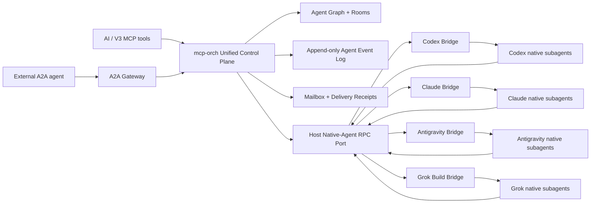
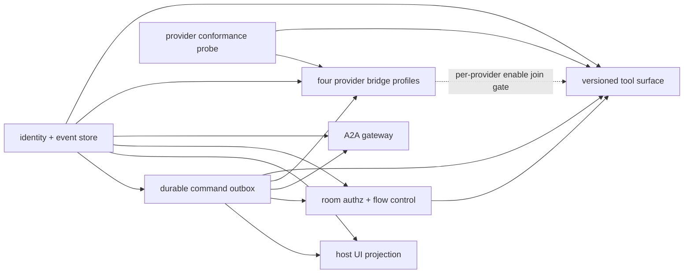

# 统一原生 Subagent 控制面设计

Date: 2026-07-11

Status: revised after two full-stack research agents, reciprocal cross-review, and root adjudication; awaiting user review

Baseline: `ae9282e40`

Scope: V3 对 Codex、Claude Code、Google Antigravity、Grok Build 官方 CLI 及其原生 subagent 的统一编排控制面。

## 1. 决策摘要

采用方案 C：**强制统一控制面**。

官方 CLI 继续拥有模型调用、上下文压缩、工具循环和原生 subagent 执行优化；V3 不用第三方 SDK 重写这些执行引擎。V3 在其上增加一层 provider-native bridge，把根会话、官方原生 subagent 和 V3 托管 agent 映射进同一棵 Agent Graph，并统一提供身份、事件、消息、打断、历史、等待、恢复和会议能力。

“强制统一”具有三个不可拆分的含义：

1. 所有可观察到的官方原生 subagent 都必须登记为稳定的 V3 `agent_id`，不得留在控制面之外形成影子 agent。
2. AI 只使用一套 V3 编排工具；provider 差异通过显式 capability 暴露，不让模型猜测厂商行为。
3. V3 不伪造厂商没有提供的控制能力。缺少中途注入、打断、实时输出或恢复能力时，相关操作必须返回结构化 `capability_not_supported`，不得通过 TUI 抓取、终端按键模拟或静默降级制造假成功。

它还受六个硬前置约束：

1. provider identity、状态历史和命令意图分别只能有一个可写 owner；其他表、内存态和 UI 只能是带 source cursor 的可重建投影。
2. 所有会改变 provider 状态的跨进程命令必须先形成 durable command intent，并通过 lease/outbox/saga 执行；普通 RPC 成功路径不能代替崩溃恢复协议。
3. control level 由重启后仍可证明的最弱原子 capability 决定，不由产品 UI 演示、父 agent 内部能力或单次正常路径成功决定。
4. SQLite transaction 只覆盖同一数据库 owner 内的 reservation、command、event 和 CAS 更新；host RPC 与 provider 执行永远不被描述成跨进程原子事务。
5. event log 只能重建逻辑状态与持久投影；`exec.Cmd`、process guard、queue、连接和状态机实例必须重新创建或 attach，不能伪装成已从事件恢复。
6. peer read、room、send、interrupt 和工具调用都从 transport-authenticated principal 授权；工具面只在不可变 server profile bootstrap 选择。当前长连接协议可以绑定 connection，未来 sessionless 协议必须逐请求验证。客户端 metadata、工具 arguments 和可猜测的 `agent_id` 不能建立调用者身份。

本设计把 A2A 放在外部互操作边界，不把 A2A 当作 V3 内部强控制协议。A2A 的 Agent Card、Task、Message、streaming 和 extension 适合跨系统任务委派；正在运行的本地子代理中途注入、精确打断、游标化输出和会议轮次由 V3 内部控制契约负责。

## 2. 当前事实与缺口

### 2.1 已有能力

当前 `cmd/mcp-orch` 已经具备：

- `launch_agent`、`send_message`、`stop_agent`、`recover_agent`、`interrupt_agent`、`list_agents`；
- 单 agent `get_agent_report(after_report_seq)` 和批量 `get_agent_reports`；
- agent 父子标识、远程 thread/agent identity、状态机、恢复和持久化 report 水位；
- DAG、workspace、shared file、provider runtime 和远程控制面桥接。

源码事实：

- `cmd/mcp-orch/orchestration/launcher.go:29-36` 的 `AgentLauncher` 只抽象会话启动、停止、归档、打断、提交 turn 和运行态判断。
- `cmd/mcp-orch/orchestration/service_launcher_bridge.go:568-582` 先尝试远程提交 turn，否则进入本地队列。
- `cmd/mcp-orch/orchestration/service_launcher_bridge.go:650-672` 的远程消息会直接调用 launcher `SubmitTurn`；永久失败会显式停止远端 agent。
- `cmd/mcp-orch/orchestration/service_launcher_bridge.go:741-770` 的本地消息只是加入下一 turn 队列，不是运行中注入。
- `cmd/mcp-orch/orchestration/launcher.go:104-106` 明确只允许远程 Codex agent 执行当前 `interrupt_agent`。
- `cmd/mcp-orch/tools/orchestration_report_tool.go:160-196` 使用 50ms ticker 等待批量 report，并且只支持 all 语义。
- `internal/module/uistate/projector_handlers.go:469-493` 会接收实时 `TurnOutputDelta`，但只把 message delta 拼进 UI `lastMessage`，没有成为 mcp-orch 可读取的历史流。
- `internal/module/thread/spawn.go:496-519` 与 `internal/module/turn/factory.go:271-294` 在 managed subagent 默认开启时隐藏原生 `spawn_agent`，当前策略是“二选一”，不是“纳管官方原生 subagent”。
- `internal/store/binding/store.go:72-108` 的现有 host/store path 仍可直接 Upsert provider binding；统一 identity owner 落地前必须先收口这些 writer。
- `cmd/mcp-orch/orchestration/persistent_runtime_rehydrate.go:119-219` 当前只恢复 Codex binding，并把内存状态重建为 Idle、新 queue 和新状态机，不能作为任意 provider live runtime 已恢复的证明。
- `internal/mcpserver/common/scope.go:33-74` 从 `tools/call` 顶层私有 metadata 构造 ToolScope；它已隔离 arguments，但尚不能代替 transport-authenticated caller identity。
- `internal/mcpserver/common/server.go:349-360` 的 `tools/list` 没有业务 session selector，因此版本化工具面必须绑定进程/connection，而不是每次 list 动态选择。
- `internal/platform/db/module.go:234-249` 的共享 DB lifecycle 会执行同一个 `RunMigrations` 与 schema gate；设计需要的是单 DDL/runner implementation 和并发安全，而不是假定只有一个进程会调用迁移。

### 2.2 现有能力不能满足的场景

| 需求 | 当前状态 | 根因 |
| --- | --- | --- |
| 查看最近 N 条输出 | 不满足 | 只有最新完成 report，没有追加式历史 |
| 查看运行中实时输出 | 不满足 | delta 只投影到 UI，mcp-orch 无游标读取口 |
| Agent 直接查看其他 Agent | 不满足 | 只能由主控读取后转发，没有授权后的 peer read |
| 运行中发送补充指令 | 厂商不一致 | 本地排队、远程忙态和官方 native 行为没有统一语义 |
| 精确打断当前 turn | 部分满足 | 当前只支持远程 Codex，缺少 capability 与 turn fence |
| any/quorum/first_success 等待 | 不满足 | 批量 report 只有 all，且依赖轮询 |
| 多 Agent 会议/广播 | 不满足 | 没有 room、participant、broadcast、round、共享 cursor |
| 官方 CLI 原生 subagent 纳管 | 不满足 | 现有策略隐藏原生入口，没有 native identity/event bridge |
| 跨进程重启继续读取 | 部分满足 | report 可恢复，但没有持久事件游标与消息 receipt |

## 3. 目标与非目标

### 3.1 目标

1. 统一 V3 agent identity：根会话、V3 托管 agent、官方原生 subagent 都使用稳定 `agent_id`。
2. 统一追加式事件流：生命周期、输出、工具、消息、打断、错误和会议事件可历史读取、tail 和 follow。
3. 统一显式消息语义：运行中注入、边界投递、新 turn、排队和 interrupt-then-send 不再混为一个模糊操作。
4. 统一能力协商：每个 provider/session/agent 都返回经过主动探测的原子 capability 和证据水位。
5. 统一会议模型：支持 room、参与者、广播、轮询发言、any/all/quorum/first_success 等待和共享 transcript。
6. 统一持久性：mcp-orch 重启后恢复 Agent Graph、事件 cursor、room、message receipt 和 capability generation。
7. 保留官方 CLI 优化：模型交互与原生 subagent 执行继续走官方 CLI、插件、hook、ACP 或 SDK 的最强原生路径。
8. 提供 A2A 北向网关，使外部厂商 agent 能以标准任务/消息协议接入，而不削弱内部控制能力。

### 3.2 非目标

1. 不用统一 SDK 替代 Codex、Claude、Antigravity 或 Grok Build 官方 CLI。
2. 不把 `cmd/mcp-orch` 嵌入 desktop host，也不允许它直接 import `internal/provider`。
3. 不以 shell/TUI 屏幕抓取、键盘注入或解析非机器输出作为受支持控制协议。
4. 不承诺所有 provider 拥有同样能力；统一的是模型和错误语义，不是虚构能力。
5. 不默认暴露模型私有 reasoning；默认只暴露 message、tool status、tool result 和 lifecycle。
6. 不在第一阶段删除现有 report 文件或 legacy MCP 工具；它们只能作为带 source cursor 的兼容投影，不再扩展为第二套事实源。
7. 不把会议升级为分布式共识、投票治理或长期团队组织系统。

## 4. 方案比较

### 4.1 方案 A：只统一顶层 CLI，原生 subagent 视为黑盒

优点是实现快、对厂商内部 API 依赖少。缺点是无法直接查看、发消息或打断官方子代理，也无法建立真实会议和跨 agent 输出游标。它不能满足本次目标。

### 4.2 方案 B：尽力观察，主控模拟会议与转发

通过 report 轮询、transcript tail 和父 agent 转发可以补部分能力，但延迟高、打断不精确、消息 receipt 不可信，并会把主控变成所有通信的串行瓶颈。它只适合作为迁移期观测模式。

### 4.3 方案 C：provider-native bridge + V3 强制统一控制面

每个 provider 使用可用的官方插件、hook、ACP、SDK 或直接机器协议接入 V3。所有 native child 自动登记，控制命令和事件进入同一契约；能力不足时显式失败。

本设计采用方案 C。方案 B 仅保留为 `observed` 能力等级，不能标记为 fully controlled；方案 A 不作为目标架构。

## 5. 总体架构



### 5.1 依赖方向

- `internal/provider/<provider>` 拥有 provider-native bridge，实现官方协议适配，不依赖 `cmd/mcp-orch`。
- `internal/contract` 只放窄的 native agent command/event DTO 与 port，不放 provider 分支逻辑。
- `internal/app` 负责把 provider bridge 适配到 host JSON-RPC/bootstrap 边界。
- `cmd/mcp-orch` 继续作为独立 sidecar，拥有统一编排模型、MCP 工具、Agent Graph、room 和事件存储。
- provider 事件和控制命令通过 host RPC/notify 契约跨边界，不通过 Go import 穿透。
- A2A gateway 是 mcp-orch 的外部 adapter；内部工具和状态机不以 A2A 类型为领域模型。

### 5.2 单一事实源

| 事实 | 权威来源 |
| --- | --- |
| V3 identity reservation | `orchestration_agent_identity_reservations`，由 sidecar identity repository 在 provider 调用前预留 |
| 已确认的 provider/session/native child identity mapping | 现有 `agent_provider_binding`，扩展 provider instance、provider session epoch、native child 唯一键 |
| V3 thread/session 配置 | 现有 `agent_threads` |
| 编排父子拓扑与 workspace/run/room scope | `orchestration_agent_nodes`，只引用 `agent_id`，不复制 provider identity |
| 状态、输出、生命周期、命令和会议历史 | `orchestration_agent_events` |
| 跨进程命令意图和执行阶段 | `orchestration_commands` durable outbox |
| 消息投递状态 | event/outbox 派生的 `orchestration_message_receipts` 只读投影 |
| room 与成员关系 | `orchestration_rooms`、`orchestration_room_members` |
| 最新 report | agent event log 的 materialized projection，携带 `source_cursor` |
| provider 当前能力 | capability handshake/lease；版本、transport 或 bridge lease generation 改变后必须重新探测 |
| SQLite DDL 与 schema version | 现有 `internal/platform/db/sqlite/migrations`、baseline 和 schema gate |
| mcp-orch typed query | `cmd/mcp-orch/sql/queries` 生成到 `cmd/mcp-orch/store/sqlc`，不拥有 DDL |

identity repository 是 reservation 与 committed binding 的唯一写入口：它在同一 SQLite transaction 预留 `agent_id`、spawn command 和 accepted event；provider 返回 identity 后，再以 reservation id、command id、provider session epoch 和 bridge lease generation 做 CAS，把映射提交到 `agent_provider_binding`。host bridge 只回传观察结果，不直接写 binding，也不与 sidecar transaction 共享 `sql.Tx`。

`orchestration_agent_nodes` 不保存可独立修改的 provider/session/native identity，也不拥有状态历史；其 current state、active turn、control level 和 last cursor 都是带 `source_cursor` 的事件投影。`agentRuntime` 不是持久事实源；只有其 identity、逻辑状态、水位和可恢复配置能够从持久投影重建。进程、连接、guard、queue 和状态机实例必须重新 attach 或创建，reconcile 成功前保持 `identity_unverified` 或 `control_degraded` 并拒绝写操作。

现有 `agent_provider_binding.parent_agent_id` 与 `agent_threads` 中可恢复的 parent/state 字段在迁移期降为兼容投影。子规格必须先列出 host sqlc、mcp-orch store、thread status、archive、report 和 binding 的完整 writer inventory，再通过版本化 owner API 与 writer fence 收口：parent 只由 node topology projector 写，state 只由 event projector 写。`persistent_agents` 恢复路径切到 node/event projection 后，旧 parent/state 列进入只读兼容期并在退出 migration 中删除或停止消费；legacy 与 unified identity namespace 不得并发写同一记录。

现有 report 文件在迁移期也是只读兼容投影，不允许与事件流各自独立推进。新事件必须先持久化，由 mcp-orch 内的 DB projector 更新 node/report；desktop host 的 UI projector 是另一个进程消费者，必须通过持久 cursor、ack、replay 和 gap 语义从同一事件源恢复，不能被称为“同一 projector”。迁移期只允许“新 owner 单写、旧表双读”，发现 owner 与投影冲突必须阻断，不能按时间戳或最后写入静默裁决。

## 6. Provider-native Bridge

### 6.1 Bridge 职责

每个 bridge 只负责五件事：

1. 启动时探测官方 CLI 版本、机器协议和 native subagent 能力。
2. 通过 host RPC 回传 `ProviderIdentityObserved`。V3 发起的 spawn 必须携带 reservation/command id；provider 自发创建、legacy hook 或 reconcile 首次发现的 child 携带 `origin=provider`、稳定 provider identity 与 evidence，不得伪造 spawn command。两类 observation 都由 sidecar identity repository 幂等裁决并返回稳定 V3 `agent_id`，bridge 不直接写 binding。
3. 把官方事件规范化为 V3 agent event，不在 provider adapter 内实现会议或等待逻辑。
4. 执行已经持久化并由 lease claim 的 V3 command，返回 provider request/receipt evidence；bridge 自身不拥有 command intent。
5. 只有声明并通过 `session.reconcile` conformance 时，重连后才列举或对账 provider 原生 child；否则报告 reconciliation unsupported，不猜测 child 已丢失。

### 6.2 Transport 优先级

为避免模拟带来的延迟和脆弱性，bridge 必须按以下顺序选择数据面：

1. 官方 SDK、ACP 或直接双向机器协议；
2. provider plugin 内的 MCP/RPC bridge；
3. HTTP/command hook，用于生命周期捕获、策略门禁和低频控制；
4. transcript 仅用于启动对账和审计补偿。

TUI 文本、alternate-screen、键盘快捷键和未声明日志格式不属于受支持 transport。

Hook 不是默认实时数据总线。若 provider 能提供 streaming/ACP，output delta 必须直接进入长连接；不能为每个 token 启动 hook 进程。Hook 适合 `subagent_start`、`subagent_stop`、tool boundary 和 stop policy 等离散事件。

### 6.3 Handshake

bridge 启动时必须返回 capability lease。下面只展示 envelope 形状，不代表 Codex 或任何具体 provider 已经具备这些能力：

```json
{
  "provider": "provider-under-probe",
  "provider_version": "provider-version",
  "transport": "native_rpc",
  "session_id": "provider-session-id",
  "provider_session_epoch": "pse_01J2X9",
  "bridge_lease_generation": 4,
  "tool_surface_lease": {
    "profile": {
      "server_profile_id": "orch-unified-v2",
      "mcp_core_revision": "2025-11-25",
      "orchestration_api_version": "unified_v2",
      "manifest_hash": "sha256:tool-manifest"
    },
    "capabilities": [
      "native_tool_suppression.exact_set"
    ],
    "probe_evidence": {
      "evidence_cursor": "probe_tool_surface_7",
      "native_tool_set_hash": "sha256:native-tools"
    },
    "expires_at": "2026-07-11T13:00:00Z"
  },
  "capabilities": [
    "native_child.identity",
    "native_child.list",
    "native_child.spawn",
    "native_child.lifecycle",
    "message.new_turn",
    "message.next_boundary",
    "message.mid_turn",
    "message.provider_ack",
    "message.observed_in_context",
    "turn.interrupt",
    "turn.interrupt_fence",
    "output.history",
    "output.live_cursor",
    "session.resume",
    "session.reconcile"
  ],
  "probe_evidence": {
    "probe_version": 1,
    "evidence_cursor": "probe_evt_42",
    "result_hash": "sha256:probe-result",
    "observed_at": "2026-07-11T12:00:00Z"
  },
  "expires_at": "2026-07-11T13:00:00Z"
}
```

`provider_session_epoch` 在同一个官方 provider session 的 resume/reconnect 期间保持稳定，只在确认创建了新的 provider session 或检测到 provider id reuse 时改变；它属于 durable identity。`bridge_lease_generation` 每次 bridge 连接/租约更替时递增，只用于命令和事件 fence，不参与稳定 identity。

`tool_surface_lease` 与 agent/session capability lease 独立失效。`native_tool_suppression.exact_set` 证据必须绑定 provider/version/transport、server profile id、MCP core revision、orchestration API version、manifest hash、bridge lease generation、native tool-set evidence hash 和 expiry；任一字段改变立即失效。不能把 exact tool suppression 外推为 child control 能力，也不能把 agent capability lease 反向当作工具面证据。

`provider_version`、`transport`、`bridge_lease_generation`、probe version 或 evidence hash 改变时，旧 capability lease 立即失效。provider 无法证明 session epoch 连续性、lease 到期或尚未重探测时，agent 降为 `identity_unverified` 并拒绝写操作。V3 不从 provider 名称、产品 UI 或静态文档表硬编码能力。

### 6.4 准入等级

| 等级 | 必需能力 | 允许行为 |
| --- | --- | --- |
| `root_only` | 根 session launch/prompt/output | 可作为 V3 顶层 agent；native child 不承诺可见 |
| `observed` | `native_child.identity` + `native_child.lifecycle` | child 出现在 Agent Graph，可看已证明状态；控制操作 fail-fast |
| `managed` | observed + `message.new_turn` + `output.history` 或 `output.live_cursor` | 只允许已逐项证明的消息和输出能力 |
| `fully_controlled` | managed + `native_child.list` + `native_child.spawn` + `message.mid_turn` + `message.provider_ack` + `turn.interrupt` + `turn.interrupt_fence` + `session.reconcile` | 可用于强制统一调度、需要对应能力的会议和 SLA；不等价于已经证明模型消费了消息 |

厂商根 Agent 可以在 `root_only` 级别接入。官方原生 subagent 只有达到 `fully_controlled` 才能作为 V3 默认可调度 child。`observed`/`managed` child 必须在 `list_agents` 中带等级和缺失 capability，不能显示成完整受控。

如果 provider 支持在 native spawn 前阻断，bridge 注册失败必须阻断 spawn。如果 provider 的 start hook 不可阻断，child 可以先以 `observed_pending` 登记；若在限定 handshake 窗口内无法建立 identity 与事件通道，父 session 标记为 `control_degraded`，后续 native spawn 被禁用或显式拒绝。

## 7. 统一身份与 Agent Graph

### 7.1 Identity key

provider 原生身份的唯一映射键为：

```text
(provider, provider_instance_id, provider_session_id, provider_session_epoch, native_child_id)
    -> v3_agent_id
```

该唯一键只由 identity repository 写入和裁决。`bridge_lease_generation` 不属于唯一键。`v3_agent_id` 创建后不可因展示名、bridge 重连或父 agent rename 改变；provider 无法证明原 session epoch 时不得猜测复用旧 identity。相同 provider identity 的重复 hook/event 必须命中同一 `agent_id`；不同 identity 竞争同一 `agent_id` 时 fail-fast。

### 7.2 Node 类型

- `provider_session`：官方 CLI 根会话。
- `native_subagent`：由官方 CLI 原生机制创建的 child。
- `managed_agent`：由 V3 启动并独立管理的 CLI/session。
- `a2a_remote_agent`：经 A2A gateway 连接的外部 agent。

每个 node 至少保存：

- `agent_id`、`parent_agent_id`、`root_agent_id`；
- `kind` 与 workspace/run/room scope；
- event-derived `state`、`active_turn_id`、`control_level`、原子 capabilities；
- `state_source_cursor`、`capability_evidence_cursor`、provider session epoch、bridge lease generation、lease expiry；
- `created_at`、`updated_at`、`last_event_cursor`；
- binding 引用只使用 `agent_id`，不复制 provider session/native identity，不保存 API key 或 provider secret。

父子关系表示执行来源，不限制通信路由。消息授权可以允许父子、祖先、同 room 或显式 grant；知道 `agent_id` 本身不等于拥有访问权。

## 8. 追加式事件与游标

### 8.1 事件 envelope

```json
{
  "cursor": "evt_00000000000042",
  "event_id": "provider-or-v3-event-id",
  "agent_id": "agent_123",
  "root_agent_id": "agent_root",
  "provider": "claude",
  "provider_session_id": "session_abc",
  "provider_session_epoch": "pse_01J2X9",
  "bridge_lease_generation": 2,
  "turn_id": "turn_9",
  "type": "output.delta",
  "stream": "message",
  "payload": {"text": "partial output"},
  "provider_at": "2026-07-11T12:00:00.100Z",
  "observed_at": "2026-07-11T12:00:00.120Z"
}
```

`cursor` 是 V3 持久事件流的单调水位，调用方只比较和回传，不解析其内部格式。provider timestamp 缺失或非法时不能用 `time.Now()` 伪装；必须保留 `provider_at=null`，由 `observed_at` 表示 V3 接收时间。

### 8.2 事件类型

第一阶段固定支持：

- `agent.reserved`、`agent.discovered`、`agent.capabilities_changed`；
- `agent.state_changed`、`agent.identity_unverified`、`agent.reconciliation_unsupported`、`agent.reconciliation_failed`、`agent.lost`、`agent.reconciled`；
- `command.accepted`、`command.dispatched`、`command.provider_acknowledged`、`command.completed`、`command.outcome_unknown`、`command.rejected`、`command.failed`；
- `turn.started`、`turn.interrupted`、`turn.completed`、`turn.failed`；
- `output.delta`、`output.completed`、`output.gap`；
- `tool.started`、`tool.completed`、`tool.failed`；
- `message.accepted`、`message.provider_acknowledged`、`message.observed_in_context`、`message.outcome_unknown`、`message.rejected`；
- `room.joined`、`room.left`、`room.broadcast`、`room.round_completed`。

reasoning stream 不进入默认读结果。只有 provider 明确允许、V3 policy 显式授权并且请求者具备 `output.reasoning.read` 时才可请求。

### 8.3 一致性与去重

- provider 有稳定 event id 时，唯一键使用 provider identity + event id。
- provider 只有跨重连稳定的 source sequence 时，唯一键使用 provider session epoch + source sequence。
- provider sequence 每次连接重置时，唯一键使用 provider session epoch + bridge lease generation + bridge sequence。
- 两者都没有时，bridge 必须在首次接收处生成并持久化 bridge sequence；不能依靠可碰撞的文本 hash 作为唯一真相。
- 事件 ingestion 采用 at-least-once，store/projector 必须幂等。
- `get_agent_events(follow=true)` 使用事件通知唤醒，不在 tool handler 内固定间隔轮询。
- cursor 过旧且已经被 retention 清理时返回 `cursor_expired`，并提供最早可用 cursor；不得从“最新”静默继续。

### 8.4 Delta ingress、背压与批写

`output.delta` 在分配持久 cursor 前先按 agent/turn/stream 合并为 chunk，避免每个 token 单独写 SQLite：

- 达到 50ms 或 8KiB 任一阈值立即 flush；单 chunk 上限 64KiB，超出时切分但保留连续 source-sequence range。
- 第一版每个 agent 最多缓存 64 个 chunk 或 4MiB、每个 provider 最多 16MiB、mcp-orch 全局最多 64MiB，以先达到者为准；活动 streaming agent 总数上限为 64。
- lifecycle、error、command receipt 使用独立的 8MiB 全局高优先级预算，不被 output delta 挤占；高优先级预算耗尽时必须断开/降级对应 bridge 并产生结构化错误，不能静默丢失控制事件。
- writer 使用有界批量事务，批内仍按 agent source sequence 排序；cursor 只在事务提交时生效。
- writer 在 agent 之间采用公平调度，单个高速 stream 不得长期占满 provider 或全局预算。
- provider transport 支持流控时，队列达到上限必须向上游施加 backpressure。
- transport 不支持流控且数据不可避免丢失时，恢复写入后追加 `output.gap`，记录丢失 source-sequence range，并立即撤销该 agent 的 `output.history`、`output.live_cursor` capability，直到 reconciliation/conformance 重新证明完整性。禁止静默丢弃。

压测必须同时记录 follow latency、SQLite commit latency、WAL 增长、队列水位、chunk 大小和 gap 数量。100ms p95 目标只有在无 `output.gap` 且 capability 未撤销时才算通过。

### 8.5 Retention

- lifecycle、message receipt、room membership 和 final output 默认长期保留。
- 高频 output delta 按显式 retention policy 压缩为 chunk，不影响 final output 和 cursor fence。
- 压缩必须生成可审计的 compaction event，并保持“旧 cursor 已过期”语义，不能让 cursor 指向不同内容。

## 9. 消息与打断语义

### 9.1 `send_message` 必须显式选择 delivery

```json
{
  "target": "agent:agent_123",
  "message": "停止当前假设，先验证数据库 schema",
  "delivery": "mid_turn",
  "expected_turn_id": "turn_9",
  "expected_provider_session_epoch": "pse_01J2X9",
  "expected_bridge_lease_generation": 4,
  "idempotency_key": "review-17-correction-1"
}
```

`send_message` 是以 `delivery` 为 discriminator 的判别联合，不允许把其他分支字段混入当前分支：

- `mid_turn`：必须携带 `expected_turn_id`、provider session epoch 和 bridge lease generation；缺少 `message.mid_turn` 或 fence 不匹配时失败，禁止出现 `busy_policy`。
- `next_boundary`：必须携带 `expected_turn_id`、`after_cursor` 和两个 session fence；只在 provider 能证明下一模型/工具边界并声明 `message.next_boundary` 时可用，禁止出现 `busy_policy`。
- `new_turn`：必须携带 `busy_policy`，并校验 provider session epoch 与 bridge lease generation。

`new_turn.busy_policy` 也是判别联合：

- `{"action":"fail"}`：立即返回 busy。
- `{"action":"queue"}`：持久化到 mailbox，当前 turn 结束后创建新 turn。
- `{"action":"interrupt_then_send","expected_turn_id":"turn_9"}`：只打断指定 turn，确认收口后再创建新 turn；缺少 turn fence 时 schema validation 直接失败。

不提供 `auto`，也不允许 handler 把一个分支改写成另一个分支。V3 不根据 provider 猜测最接近的行为。

### 9.2 Delivery receipt

返回值必须包含：

```json
{
  "message_id": "msg_123",
  "status": "accepted",
  "delivery": "mid_turn",
  "target_agent_id": "agent_123",
  "target_turn_id": "turn_9",
  "accepted_cursor": "evt_42"
}
```

receipt 状态固定为 `accepted|provider_acknowledged|observed_in_context|rejected|outcome_unknown`：

- `accepted` 只表示 V3 已持久化 command/message，不能解释为 provider 已收到。
- `provider_acknowledged` 只在 provider 返回可关联到 command/message 的稳定 receipt 后产生，并附 `provider_receipt_id`；只有通过对应 conformance 才能声明 `message.provider_ack`。
- `observed_in_context` 只在 provider 协议明确证明消息进入目标 child/turn 的上下文后产生，并要求独立的 `message.observed_in_context` capability。
- V3 不生成泛化的 `consumed`，也不从下一次输出、时间经过或父 Agent 行为推断模型已经消费消息。

### 9.3 Durable command intent、outbox 与 saga

所有会改变 provider 状态的操作，包括 spawn、send、interrupt、stop 和 recover，都先写入 `orchestration_commands`。至少保存：

- `command_id`、typed command kind/payload、target agent、target provider session epoch 与 bridge lease generation；
- expected turn fence、idempotency key、provider request/receipt id；
- `phase`、`attempt_generation`、lease owner/expiry；
- accepted/dispatched/provider-acknowledged/completed/outcome-unknown/error cursor 与最后错误。

执行规则：

1. 同一 SQLite transaction 写 command intent 与 `command.accepted`/`message.accepted` event；事务失败时不 dispatch。
2. dispatcher 通过 lease claim command，使用 `attempt_generation` 防止过期 worker 写回。
3. provider ack 与 `command.provider_acknowledged`/`message.provider_acknowledged` event 在同一 transaction 落库；进程在 provider 已执行但 ack 未落库时，command 进入 `outcome_unknown`，不能伪造 acknowledged。
4. provider 同时支持稳定 idempotency key 与 receipt query 时，允许按原 key 对账和受控重试。
5. 只有 receipt query 时只查询、不重放；只有 idempotency key 时，必须先由 conformance 证明其跨重启作用域和持久性，才能复用原 key。
6. 两者都没有时禁止自动重发；消息返回 `delivery_outcome_unknown`，其他命令返回 `command_outcome_unknown`。该操作不能支撑 `fully_controlled` 或 `message.provider_ack` capability。

`interrupt-then-send` 是持久 saga，phase 固定为 `interrupt_requested -> interrupt_confirmed -> send_requested -> send_confirmed`。任一 phase 失败或超时都保留 fence 和证据，不跳过中间阶段。Native spawn 在调用 provider 前先预留 binding identity 与 spawn command；外部 child 已创建但 discovered 未落库时，通过同一 command/reconciliation 找回，不能产生无 owner 的影子 child。

Outbox 只提供 durable intent、受控重试和可审计阶段，不承诺 exactly-once；exactly-once 不能由本地事务跨 provider 边界凭空产生。

### 9.4 Command、event、receipt 与错误映射

第一阶段固定映射，子规格只能增加 provider evidence 字段，不能另起同义状态：

| command phase | 必须事件 | message receipt | public error/result |
| --- | --- | --- | --- |
| `accepted` | `command.accepted`，消息同时有 `message.accepted` | `accepted` | 接受成功，不代表外部执行 |
| `leased|dispatched` | 首次 dispatch 写 `command.dispatched` | 保持 `accepted` | pending |
| `provider_acknowledged` | `command.provider_acknowledged`，消息同时有 `message.provider_acknowledged` | `provider_acknowledged` | acknowledged |
| `completed` | `command.completed`；仅有协议证据时写 `message.observed_in_context` | `observed_in_context` 或保持 `provider_acknowledged` | completed |
| `outcome_unknown` | `command.outcome_unknown`，消息同时有 `message.outcome_unknown` | `outcome_unknown` | `command_outcome_unknown` 或 `delivery_outcome_unknown` |
| `rejected|failed` | `command.rejected|command.failed`，消息使用 `message.rejected` | `rejected` | typed provider/capability/delivery error |

DB phase、事件名、receipt 和 wire error 只能按此单向映射；wire error 必须使用 `command_outcome_unknown` 或 `delivery_outcome_unknown`，禁止旧模糊别名或把 provider acknowledged 等同为模型已处理。

### 9.5 `interrupt_agent`

打断请求必须携带当前 turn fence：

```json
{
  "target": "agent:agent_123",
  "expected_turn_id": "turn_9",
  "expected_provider_session_epoch": "pse_01J2X9",
  "expected_bridge_lease_generation": 4,
  "reason": "会议主持人要求暂停并等待统一结论"
}
```

若 active turn 已改变，返回 `turn_conflict`；不得打断新 turn。provider 接受打断后，工具等待明确的 interrupted/idle/failed 状态事件或超时。超时返回当前快照和最后 cursor，不强制伪造 idle。

## 10. AI 优先的统一 MCP 工具面

统一工具沿用已有高频动词，避免再创造一套同义命名：

| Tool | 统一职责 |
| --- | --- |
| `launch_agent` | 以 `kind=provider_session|native_subagent|managed_agent|a2a_remote_agent` 创建 agent，并声明 required capabilities |
| `send_message` | 显式 delivery/busy_policy 判别联合与 session/turn fence 的点对点消息，返回 receipt |
| `interrupt_agent` | 带 active turn fence 的精确打断 |
| `stop_agent` | 停止 session/child；不等价于 interrupt turn |
| `recover_agent` | 恢复可恢复 agent，并完成 provider reconciliation |
| `list_agents` | 返回 Agent Graph、状态、capabilities、control level、active turn、provider session epoch、bridge lease generation 和 last cursor |
| `get_agent_events` | latest completed、最近 N 条、按 cursor 增量读取或 long-follow；支持单/多 agent |
| `wait_agents` | any/all/quorum/first_success，按状态、事件类型或 final output 等待 |
| `manage_agent_room` | typed action：create/get/join/leave/close |
| `broadcast_message` | 向 room 成员 fan-out，返回每个成员 receipt |
| `run_agent_round` | 按顺序或并行发言，使用共享 round cursor 与完成条件 |

### 10.1 不同时暴露两套工具

迁移期存在 `legacy_v1` 和 `unified_v2` 两种 tool surface，但一个不可变的 MCP server profile 只能发布一种，`tools/list` 不得同时暴露 legacy 与 unified 同义工具。对当前 stdio 形态，一个 profile 对应一个 server process/connection；对共享 HTTP 形态，一个 profile 对应独立 endpoint/deployment。要求不同 API version 或 manifest hash 的业务 session 不能复用同一 profile。

- 新增独立的 `OrchestrationToolAPIVersion=legacy_v1|unified_v2`。它与现有 `ToolSurfaceMode=chat|auto|agent` 正交，禁止复用或扩展后者的枚举语义。
- stdio mcp-orch 在进程启动时通过强校验配置固定 API version 与 manifest hash，一进程只服务一条 stdio connection。对于当前仓库及 MCP 2025-11-25 这类 initialize-based revision，`initialize` 在 `capabilities.experimental.v3_orchestration` 回显二者，客户端不匹配立即终止；HTTP/peer mode 使用独立 authenticated endpoint profile，不能把业务 session id 塞进 `tools/list` 临时选面。
- `versioned-tool-surface-rollout-spec` 必须固定支持的 MCP core revision。若以后采用取消 `initialize` 且 list 不再按 connection 变化的 MCP revision，则改用该 revision 的 discovery/extension 协商，并继续以独立 server profile/endpoint 固定 exact tool set；不得继续套用 initialize 文案，也不得把 draft 行为冒充当前稳定契约。
- `legacy_v1` 保持现有 schema，用于回归和安全迁移。
- `unified_v2` 使用本设计 schema；`get_agent_report(s)` 的能力折叠到 `get_agent_events(view=latest_completed)` 和 `wait_agents`。
- `unified_v2` 的 canonical tools 和完整 kind enum 始终稳定可见。`launch_agent(kind=native_subagent)` 在目标 lease 缺少 `native_child.spawn` 时由 handler 返回结构化 `capability_not_supported`；schema 不按当前 provider 动态删除 kind。
- `list_agents` 返回每个 node 的原子 capabilities、control level、probe evidence cursor、expiry 和 `supported_kinds`，供 AI 在调用前发现能力。
- provider 官方的同义 spawn/send 工具由 `internal/contract` 中唯一的版本化 orchestration tool registry 生成 tool name/capability manifest；`cmd/mcp-orch`、thread/turn manifest、toolbridge deny policy 和 provider native suppress policy 都只消费该 registry，不再各自手写隐藏规则。registry 只定义契约事实，不承载 provider 或 store 实现。
- `native_tool_suppression.exact_set` 是独立的 connection capability。它必须同时证明 V3 MCP `tools/list` exact set 和 provider 内建/模型侧同义 agent tools 已被抑制或隔离；只验证 mcp-orch 自身列表不算通过。
- `legacy_v1` 中由官方 spawn 工具创建的 child 可以被 hook 自动登记为 `observed`，但不能因此宣称统一调度已经完成。切换到 `unified_v2` 前必须先补齐 native spawn/control bridge。
- server profile bootstrap 时冻结 orchestration API version、exact tool set 与 manifest hash；业务 session 持久化所绑定的 tool-surface profile，resume 时不匹配立即失败。Claude、Codex、Antigravity、Grok 都必须通过 MCP 与 native 两侧 exact-set conformance，不能把 Codex 当前消费面冒充跨 provider SSOT。
- provider 无法证明 `native_tool_suppression.exact_set` 时，不得为该 profile 启用 strict `unified_v2`；可以保持 `legacy_v1` 或 observed/managed 接入，但 UI 和能力结果必须明确显示“非单一工具面”。
- 稳定期删除 legacy 注册和双路径测试，不长期维护两套行为。

MCP 参考：<https://modelcontextprotocol.io/specification/2025-11-25/basic/lifecycle>、<https://modelcontextprotocol.io/specification/draft/changelog>。后者是前瞻性 draft，只用于设计兼容门，不是本规格的当前 wire baseline。

### 10.2 `get_agent_events`

一个工具覆盖三种读取，不再新增 report/history/tail 三个同义工具：

```json
{
  "agent_ids": ["agent_a", "agent_b"],
  "view": "events",
  "event_types": ["output.delta", "output.completed", "turn.failed"],
  "after_cursor_by_agent": {"agent_a": "evt_10", "agent_b": "evt_25"},
  "limit": 50,
  "follow": true,
  "timeout_ms": 30000
}
```

`view`：

- `latest_completed`：替代最后 report。
- `events`：读取最近 N 条或 cursor 后事件。
- `output`：只返回允许的 output stream，适合直接查看 agent 最近输出。

多 agent 返回每个 agent 的 `next_cursor`、`events`、`state`、`has_more` 和 item-level error。一个 agent 的 capability 错误不伪装成全局成功。

### 10.3 `wait_agents`

```json
{
  "agent_ids": ["agent_a", "agent_b", "agent_c"],
  "condition": "first_success",
  "until": {"event_types": ["output.completed", "turn.failed"]},
  "success_predicate": {
    "terminal_states": ["completed"],
    "required_event_type": "output.completed",
    "require_nonempty_output": true
  },
  "after_cursor_by_agent": {
    "agent_a": "evt_10",
    "agent_b": "evt_20",
    "agent_c": "evt_30"
  },
  "timeout_ms": 60000
}
```

`condition` 固定为 `any|all|quorum|first_success`。使用 `first_success` 时 `success_predicate` 必填，字段只允许 terminal states、required event/result kind、是否要求非空 output 和可选的 typed result schema id；禁止执行任意表达式。失败 agent 作为 item 结果返回但不提前宣告成功；所有 agent terminal 且无人满足 predicate 时返回结构化 aggregate failure。

## 11. Agent Room 与会议

### 11.1 Room 不是模拟群聊

Room 是持久控制面对象，拥有：

- `room_id`、owner、workspace/run scope、TTL；
- participant 与 role；
- shared event cursor；
- broadcast/round message 与逐 agent 分层 receipt；
- close reason 和 final room transcript projection。

主控不需要逐个读取后手工复制消息。`broadcast_message` 在控制面一次接受，在同一 transaction 固化 participant snapshot 并为每个目标写 durable command intent；dispatcher 再并发 claim/fan-out。每个目标独立返回 accepted/provider-acknowledged/observed-in-context/rejected/outcome-unknown/capability error，Room service 不绕过 outbox 直接调用 provider。

### 11.2 授权

所有 room/peer 操作先从已认证 transport context 构造不可由工具参数覆盖的 `CallerPrincipal`，至少包含 `subject_agent_id`、provider instance、provider session epoch、bridge lease generation、workspace/run scope、roles/grants、auth context id 和 expiry。当前 stdio/有状态 HTTP 可以把 principal 绑定到进程/connection；采用 sessionless revision 时必须由每个请求的已认证 identity/capability 重建。`_agentId`、`_threadId`、`requester_id` 等 metadata 只用于相关性校验；与 principal 不一致时返回 `caller_scope_mismatch`，缺少 principal 时 fail-closed。

provider bridge principal 必须绑定现有 loopback/session token/generation lease 或其正式替代契约；不能为四家各自发明互不兼容的“可信 metadata”。A2A principal 使用独立外部 authn，但进入领域层后映射为同一 principal/grant 模型。

默认允许：

- parent/ancestor 读取 descendant 的非 reasoning 输出；
- 同 room participant 读取 room 创建后的共享 output projection；
- controller 读取其 orchestration run 内的 agent；
- 显式 grant 授予跨树读取或消息权限。

默认拒绝：

- 仅凭猜到 `agent_id` 读取其他 workspace/run；
- room 加入前的完整 transcript 回溯；
- reasoning/private trace；
- 向 killed/archived agent 发送消息。

### 11.3 Round

`run_agent_round` 支持：

- `parallel`：同时向所有 participant 发题，按 any/all/quorum/first_success 收口。
- `ordered`：按 participant 顺序发言，后一个 agent 可读取此前 room round projection。

每轮必须有 `round_id`、起始 cursor、参与者快照、timeout 和 completion condition。成员中途加入只参与下一轮；成员离开或失败作为明确 item 结果，不能修改本轮 denominator。

为防止消息风暴，第一版限制每 room 最多 16 个活动 participant，并要求 broadcast/round 带 idempotency key。扩大规模必须以压测证据修改限制。

## 12. Provider 接入判断

以下是 2026-07-11 的设计时证据分层。`product_behavior` 只能说明厂商产品内部可能具备某种能力；只有 `documented_external_machine_contract` 与 V3 主动 probe 结果才能产生 capability lease。

| Provider | product behavior / local observation | documented external machine contract | V3 native-child probe | 设计时分类 |
| --- | --- | --- | --- | --- |
| Codex CLI | 当前任务树内可 spawn/send/followup/interrupt/list/wait；本机 hooks 与 multi-agent feature 可用 | app-server 覆盖 root thread list/read/resume、turn steer/interrupt 和 collab events，并有实验性的 persisted spawn edge/child lineage 读取；这些只证明历史关系，不证明 child 当前存活、direct external native-child spawn/control 或 restart reconciliation | 未执行 V3 conformance probe | `probe_required` |
| Claude Code | Agent/Teams 产品内可以创建 child、发送消息或在 UI 管理；Teams 仍有实验性与 resume 限制 | Hooks 提供 start/stop identity/transcript；SDK 有 root interrupt、task stop 与 transcript helper，但不能外推为 fenced native-child mid-turn control、live cursor 或 reconcile | 未执行 V3 conformance probe | `probe_required` |
| Antigravity | 产品内 parent/peer 可 message/interrupt/kill，idle auto-wake，共享 transcript；官方产品入口宣传 SDK programmatic subagent spawning | 公共 SDK README 文档化 root `Agent`/`Conversation` streaming、history、hooks/triggers；可调用的 native-child spawn/attach API、CLI/desktop/SDK child identity 同源性、receipt/fence 与跨重启对账仍未证实 | 未执行 V3 conformance probe | `probe_required` |
| Grok Build | 产品声明 subagent 是独立 child session，插件可包含 agents/hooks/MCP | ACP 明确 root session JSON-RPC 与 `session/update` streaming；稳定 child list/send/interrupt/kill/reconcile 机器契约未证实 | 未执行 V3 conformance probe | `probe_required` |

官方参考：

- Codex App Server：<https://developers.openai.com/codex/app-server>
- Codex Hooks：<https://developers.openai.com/codex/hooks>
- Codex Multi-Agent：<https://developers.openai.com/codex/multi-agent>
- Claude Code Hooks：<https://code.claude.com/docs/en/hooks>
- Claude Agent Teams：<https://code.claude.com/docs/en/agent-teams>
- Claude Agent SDK Hooks：<https://code.claude.com/docs/en/agent-sdk/hooks>
- Antigravity Hooks：<https://www.antigravity.google/docs/hooks>
- Antigravity Subagents：<https://antigravity.google/docs/subagents>
- Antigravity SDK：<https://www.antigravity.google/docs/sdk-overview>
- Antigravity 产品入口与公共 SDK：<https://www.antigravity.google/docs/home>、<https://github.com/google-antigravity/antigravity-sdk-python>
- Grok Build Headless/ACP：<https://docs.x.ai/build/cli/headless-scripting>
- Grok Build Plugins/Subagents：<https://docs.x.ai/build/features/skills-plugins-marketplaces>

任何 provider 升级都可能改变这些事实，因此生产判断只相信未过期的 handshake lease 与 conformance probe。静态表、产品 UI、本机会话观察和 provider 名称都不能直接升级 control level。

## 13. A2A 边界

A2A gateway 负责：

- 发布 V3 Agent Card 和可用 skills/capabilities；
- 把 binding-neutral `SendMessage`、`SendStreamingMessage` 映射为 V3 launch/send/wait；
- 把 A2A Task lifecycle 与 artifact/status stream 映射为 V3 agent events；
- 使用 A2A extension 声明可选的 V3 cursor、interrupt 和 room metadata。

A2A gateway 不负责：

- 作为 provider-native hook transport；
- 代替 V3 message receipt 或 turn fence；
- 把不支持 interrupt/room 的 A2A peer 宣称为 fully controlled；
- 让远程 A2A agent 获得本地 workspace 默认权限。

A2A 核心规范支持 Agent Card、stateful Task、Message、streaming、push notification 和 extension，但 V3 特有的 mid-turn delivery、agent event cursor、room/round 必须通过 capability-negotiated extension 表达。对端不声明扩展时，相关 V3 操作返回 capability error。

本总规格只使用 binding-neutral operation 名，不授权直接实现 wire adapter。设计时证据基于 A2A 1.0；独立 `a2a-gateway-spec` 仍必须固定部署时 core version、REST/gRPC/JSON-RPC binding、typed operation 映射和带版本 extension URI。该子规格获批前不得从本文件生成 A2A 实现计划。`CancelTask` 只能映射为尽力取消 task，不能冒充 V3 turn-fenced interrupt。

规范参考：<https://a2a-protocol.org/latest/specification/>

## 14. 核心数据流

### 14.1 官方 native child 创建

1. sidecar identity repository 在同一 SQLite transaction 写 identity reservation、`agent.reserved`、typed spawn command intent 与 `command.accepted` event；DB projector 仅从 `agent.reserved` 投影 provisional node，此时不伪造尚未取得的 provider identity。
2. dispatcher claim command lease 后，通过 provider bridge 执行 native spawn。
3. provider 的 native spawn 同时被 direct protocol/plugin/hook 观察或门禁；bridge 取得 provider session id/epoch、native child id、parent identity、bridge lease generation 和 provider receipt evidence。
4. host 通过窄 RPC 回传 `ProviderIdentityObserved(reservation_id, command_id, identity, evidence)`，不直接执行 binding SQL。
5. identity repository 在第二个本地 transaction 以 reservation/command/session epoch/lease generation 做 CAS，提交 `agent_provider_binding`，同时写 `command.provider_acknowledged` 与 `agent.discovered`；CAS 冲突 fail-fast，不能最后写入覆盖。
6. node projector 更新拓扑；capability probe 结束后 append `agent.capabilities_changed`。
7. `list_agents` 和 `get_agent_events(follow=true)` 被事件通知唤醒。
8. 外部 child 已创建但第 5 步尚未提交时，spawn command 保持 `outcome_unknown` 并按 provider receipt/reconcile 矩阵对账；不得创建第二个 identity 或无 owner 的影子 child。
9. 登记失败时按 provider 的可阻断能力阻止 spawn，或把 parent 标成 `control_degraded`。

步骤 1 和步骤 5 是两个可恢复的本地事务，中间跨越 provider 副作用；本设计不宣称二者构成分布式原子事务。

### 14.2 Provider-originated child 首次发现

1. 官方 CLI 自发创建、legacy 工具创建、hook 或 reconcile 首次看到 child 时，host bridge 采集稳定 provider identity、parent identity、provider session epoch、bridge lease generation、origin 和 evidence；此路径没有 V3 spawn command。
2. host 发送 `ProviderIdentityObserved(origin=provider, reservation_id=null, command_id=null, ...)`，不得伪造 command receipt。
3. identity repository 先按稳定 identity 查 committed binding/reservation；已存在时幂等返回同一 `agent_id`。
4. identity 尚不存在且证据充分时，在同一 SQLite transaction 创建 reservation，依次追加 `agent.reserved`，以 CAS 提交 binding，再追加 `agent.discovered`；DB projector 从事件创建 provisional/final node，全程不直接写 node。
5. identity 证据不足时只保留 pending reservation，并追加 `agent.reserved` 与 `agent.identity_unverified`；该 node 不可写，直到后续 observation/reconcile 以 CAS 完成 binding。
6. 相同 identity 竞争不同 parent/agent、或相同 provider id 在不同 session epoch 复用时 fail-fast 并标记 parent `control_degraded`，不得按最后观察覆盖。

### 14.3 运行中补充指令

1. AI 调用带 expected turn、provider session epoch 和 bridge lease generation 的 `send_message(delivery=mid_turn)`。
2. mcp-orch 从 transport-authenticated principal 校验 scope、target state、全部 fence 和 `message.mid_turn` capability。
3. 同一 transaction 写 typed command intent、message receipt=`accepted` 和对应事件。
4. dispatcher claim lease 后调用 host bridge；bridge 不接受未持久化 command。
5. provider ack 后在同一 transaction 写 `command.provider_acknowledged`、`message.provider_acknowledged` 与 provider receipt；只有 provider 能证明进入目标上下文且 lease 声明 `message.observed_in_context` 时，才追加 `message.observed_in_context`。
6. 任一步失败都保留 command phase、attempt generation、fence、receipt、错误码、provider evidence 和 cursor。

### 14.4 Room broadcast

1. mcp-orch 固化 room participant snapshot 和 broadcast idempotency key。
2. 对每个 participant 独立执行 capability/state 校验。
3. 同一 transaction 为每个 participant 写 typed command intent；dispatcher 并发 claim 后 fan-out，生成逐 agent receipt。
4. 达到调用方声明的 completion condition 后返回；未完成项保持 pending，不丢失。
5. room event stream 保存 broadcast、receipt 和随后输出，participant 可用共享 cursor 读取。

### 14.5 mcp-orch 或 provider 重启

1. mcp-orch 从 SQLite 恢复 Agent Graph、cursor、mailbox、room 和 `agentRuntime` 的逻辑快照；进程、连接、queue、guard 和状态机实例仍未恢复。
2. host bridge 对每个 provider session 重新 handshake；建立新的 bridge lease generation 并使旧 lease 失效，同时独立证明 provider session epoch 是否连续。
3. epoch 无法证明连续时 append `agent.identity_unverified` 并阻断写操作；不得仅凭相同 thread id 或展示名复用旧 binding。
4. bridge 只有通过 `session.reconcile` conformance 时才使用官方 list/session/transcript 对账 native child，并重新 attach/创建运行资源。
5. 权威 enumerate 明确证明存在的 child append `agent.reconciled`；权威结果明确证明不存在时才 append `agent.lost`。
6. provider 不支持 reconcile 时 append `agent.reconciliation_unsupported`；执行失败 append `agent.reconciliation_failed`。这些状态都保留 node、降低 control level 并阻断写操作，不能改写成 lost/stopped。
7. pending command 按 idempotency/receipt query 矩阵对账；不满足受控重试条件时写 `command.outcome_unknown`，消息同时写 `message.outcome_unknown`，不得无证据重复发送。

## 15. 错误模型与 Fail-Fast

统一错误至少包含：

```json
{
  "code": "capability_not_supported",
  "message": "provider grok does not support message.mid_turn for agent agent_123",
  "provider": "grok",
  "agent_id": "agent_123",
  "required_capability": "message.mid_turn",
  "control_level": "observed",
  "state": "turn_running",
  "active_turn_id": "turn_9",
  "last_cursor": "evt_42",
  "retryable": false
}
```

第一阶段固定错误码：

- `capability_not_supported`；
- `provider_bridge_unavailable`；
- `provider_protocol_violation`；
- `agent_not_found`、`agent_not_controllable`；
- `agent_busy`、`turn_conflict`、`invalid_state_transition`；
- `delivery_rejected`、`delivery_outcome_unknown`；
- `command_lease_lost`、`command_outcome_unknown`；
- `cursor_expired`、`cursor_ahead`；
- `output_gap`；
- `room_not_found`、`room_closed`、`room_access_denied`；
- `caller_principal_missing`、`caller_scope_mismatch`；
- `tool_surface_version_mismatch`、`tool_surface_suppression_unavailable`；
- `reconciliation_required`、`reconciliation_unsupported`、`reconciliation_failed`、`identity_unverified`。

禁止：

- mid-turn 不支持时自动改为 queue；
- interrupt 失败时 kill 整个 session；
- live cursor 不支持时自动解析 TUI；
- provider timestamp 缺失时伪造 provider 时间；
- hook ingestion 失败时只打 warning 后继续把 parent 标成 fully controlled。

## 16. 安全与隔离

1. 每个 provider connection 使用绑定 provider instance、session epoch、bridge lease generation、workspace/run scope 与 expiry 的短期 principal credential；优先复用现有 loopback/session token/generation lease。hook/plugin 通过本地受限 IPC 携带 credential，未知、过期或 scope 不匹配立即拒绝。
2. transcript path 必须 canonicalize，并限制在声明的 provider home/session root；symlink 越界立即拒绝。
3. hook payload、message 和 output 进入日志前执行既有 secret scrub；原始 secret 不写 agent event payload。
4. native child 继承 provider 官方 permission/sandbox；V3 只能进一步收窄，不能通过 bridge 提权。
5. peer read、room read 和写命令只从 server-side `CallerPrincipal` 与 grant 授权；客户端 metadata 只能缩小 scope，不能扩大或替换 principal，不以全局 agent id 作为授权凭据。
6. A2A remote agent 使用独立 authn/authz 和最小 scope，默认没有本地文件、命令或 transcript 权限。
7. reasoning/private trace 默认拒绝，并与普通 output capability 分离。

## 17. 可观测性与延迟目标

延迟分成两段统计，避免把 provider 模型耗时算进 V3 控制面：

| 指标 | 第一版目标 |
| --- | --- |
| bridge 已发事件 -> V3 follow 可见 | 本机 p95 <= 100ms |
| V3 command 接受并持久化 receipt | 本机 p95 <= 50ms |
| V3 command -> provider bridge dispatch | 本机 p95 <= 100ms |
| 16 participant broadcast 接受与 fan-out | 本机 p95 <= 200ms |
| mcp-orch 重启后图与 cursor 可查询 | <= 2s，不含 provider 重连 |

每条 command/event 记录 `trace_id`、`message_id`/`event_id`、agent identity、provider、provider session epoch、bridge lease generation 和 cursor。不得记录完整 prompt/output、principal credential 或 provider receipt secret 作为默认结构化日志字段；内容留在授权事件存储。

## 18. 测试与验收

### 18.1 Contract/conformance

每个 provider bridge 共享一套 conformance suite：

- stable identity：重复 start/replay 不创建第二个 V3 agent；
- discovery origin：V3 spawn 与 provider-originated child 都只通过 reservation/event/CAS 建 node；provider-originated 路径不生成虚假 spawn command；
- atomic capability：分别验证 `native_child.identity/list/spawn/lifecycle`、`message.new_turn/next_boundary/mid_turn/provider_ack/observed_in_context`、`turn.interrupt/interrupt_fence`、`output.history/live_cursor`、`session.reconcile` 和 `native_tool_suppression.exact_set`，禁止用粗粒度 root thread/list capability 推导 native-child 能力；
- lifecycle：spawn/running/idle/stopped/failed 映射无非法跳转；
- message：每种声明 capability 都必须产生对应层级的真实 provider evidence 或明确的 capability error；provider ack 不能冒充 observed-in-context；
- interrupt：turn fence 正确拒绝迟到打断；
- output：history、tail、follow cursor 无重复、无倒退、无静默 gap；
- reconciliation：bridge/mcp-orch 重启后稳定 identity/parent edge，不丢 node，不无证据重复消息；
- negative path：unsupported、expired lease、重复/迟到事件和 provider protocol violation 都产生结构化错误；
- downgrade：provider 版本改变或 probe 失败后，能力立即收窄且操作 fail-fast。

provider 只有通过对应测试，才能在 handshake 中声明 capability。测试跳过等价于能力未支持，不能以 skip 后仍声明。agent/session capability lease 必须绑定 provider/version/transport/provider session epoch/bridge lease generation/probe version/evidence cursor/result hash/expiry；tool-surface lease 另行绑定 server profile id、MCP core revision、orchestration API version、manifest hash、native tool-set evidence hash 与 expiry。

### 18.2 Event/store

- 重复、乱序、迟到事件幂等；
- concurrent append cursor 单调；
- DB projector 可从 cursor 全量重建 node/latest report；host UI projector 可从自己的 ack cursor replay，断档产生显式 gap；
- retention 后旧 cursor 返回 `cursor_expired`；
- follow 使用事件唤醒，不依赖 50ms polling；
- identity owner 与 node/report/UI 投影冲突、legacy/unified writer fence 冲突时 fail-fast；
- fresh/upgrade migration、baseline、required-table/schema-version gate 和 standalone mcp-orch smoke 通过；
- 同一 transaction 覆盖 reservation + command intent + accepted event，以及 binding CAS + provider ack + acknowledged/discovered event；测试不得把两个 transaction 与中间 provider 调用伪装成一个原子步骤；
- 在 accepted 前、dispatch 后、ack 前、saga 每个 phase 强制崩溃后都能恢复为可证明状态；
- 无 provider idempotency/receipt query 时不自动重放；
- 16-agent token stream 与 64-active-stream 压测覆盖 per-agent/provider/global byte+chunk budget、公平调度、高优先级预算、backpressure、WAL 增长和 `output.gap` capability 撤销；
- store 失败时 command 不 dispatch，避免“已执行但无审计记录”。

### 18.3 Room

- broadcast 逐成员 receipt；
- any/all/quorum/first_success 收口正确；
- `first_success` 缺少 typed predicate 时 schema rejection；全部 terminal 且无人满足时返回 aggregate failure；
- ordered round 不让后发言者越过 round cursor；
- 中途 join/leave 不改变当前 round participant snapshot；
- 缺少 transport-authenticated principal、伪造/冲突 metadata、未授权 peer read、跨 workspace message 和 reasoning read 被拒绝；
- 16 participant 并发压测达到延迟目标且无消息风暴。

### 18.4 端到端验收

端到端验收按 capability level 分层，不能在 Phase 0 probe 前无条件要求两个 fully-controlled provider：

1. `root_only` 跨厂商门：至少两个 provider 根 agent 完成真实任务、输出 cursor 和结构化失败验证。
2. `observed` 门：每个声明 observed 的 provider 分别证明 native child identity/lifecycle；child 在 100ms 控制面预算内进入 Agent Graph，不要求写控制。
3. `managed` 门：每个声明 managed 的 provider 只验证自己 lease 中的 message/output 能力；未声明 mid-turn 时必须返回 capability error，不能改成 queue。
4. `fully_controlled` 强控制发布门：只有 provider 完整通过 native spawn/list、mid-turn provider ack、fenced interrupt、output cursor 和 restart reconciliation 后，才为该 provider 开启 strong-control GA。Phase 0 若没有正例，产品仍可按 root/observed/managed 发布，但不得宣称 strong-control；在第二个 provider 也通过前，不宣称“两厂商 full-control parity”。
5. 跨厂商 room/meeting 只使用所有参与者 capability 交集；需要 mid-turn 或 interrupt 的 round 必须在创建时拒绝缺能力成员。
6. mcp-orch 重启后使用旧 cursor 继续读取，不重放已确认完成或 provider-acknowledged 的命令；对 unknown outcome 保留证据而不伪造成功。

## 19. 分阶段交付

### Gate S0：必须先拆分并批准子规格

本文件是总架构规格，不直接生成一个覆盖全部子系统的实现计划。进入相应实现前必须完成八份子规格：

1. `agent-identity-and-event-store-spec`：reservation/binding 唯一 owner、provider session epoch、node/event DB projection、writer inventory/fence、cursor、retention、delta flow control、SQLite migration/sqlc。
2. `durable-native-command-outbox-spec`：spawn/send/interrupt/stop/recover 的 command intent、lease、idempotency、receipt query、saga 与崩溃窗口。
3. `provider-conformance-probe-spec`：四个 provider 的独立 fixture、原子 capability lease、expiry 与负向测试。
4. `provider-native-bridge-profiles-spec`：Codex、Claude Code、Antigravity、Grok Build 四个规范 profile，分别固定进程模型、transport、安装升级、identity extraction、command/receipt 映射、output cursor、reconnect/reconcile、安全与降级。
5. `versioned-tool-surface-rollout-spec`：`OrchestrationToolAPIVersion`、MCP core revision profile、server profile bootstrap/freeze、稳定 schema、manifest hash、registry-derived suppress policy、native exact-set probe 和 legacy 删除门。
6. `agent-room-authz-and-flow-control-spec`：transport-authenticated CallerPrincipal、connection/request binding、membership snapshot、ACL/grant、receipt、per-agent/provider/global budget、16 participant 限制、消息风暴与 reasoning policy。
7. `agent-ui-projection-spec`：host UI event consumer、cursor/ack/replay/gap、Agent Graph、capability downgrade、receipt 与 unknown outcome 展示。
8. `a2a-gateway-spec`：core version、binding、typed operation、extension URI、authn/authz、限流和断线恢复。

identity/event 与 outbox 必须先于任何会改变 provider 状态的 bridge、unified tool surface、room 或 A2A 写路径。任一子规格未批准时，只阻断依赖它的 phase，不得用本总规格中的概览段落代替精确表结构或协议。

子规格依赖关系固定为：



`provider-conformance-probe-spec` 与 identity/event/outbox 的 provider-neutral 设计并行，不形成 `conformance -> outbox` 依赖。Provider bridge profile 的批准必须同时等待 identity/event、outbox 与已批准的 conformance contract；不要求 provider 已经通过 probe。Tool surface 的 base schema 等待 identity/event、outbox 与 conformance，最终 registry 还等待 room tool contract；某个 provider 的 strict `unified_v2` 启用必须通过该 bridge profile 和 `native_tool_suppression.exact_set` runtime join gate。Room 等待 identity/event 与 outbox，A2A gateway 等待 event/command contract 稳定。

### Phase 0：协议与主动探测

- 定义 native agent contract、identity、capability、event/error envelope；
- 建 provider conformance harness；
- 对 Codex、Claude、Antigravity、Grok 做只读 probe，形成可执行 capability matrix；
- 为四家建立 bridge profile 草案，但不在 probe 前写死支持能力；
- 不改变当前工具面。

验收门：没有经过测试的 capability 不进入生产 handshake。

### Phase 1：Identity、Event Log 与 Durable Command 基础

- 新增 identity reservation，并把 reservation/binding 写入收口到 sidecar identity repository；
- 新增 agent node/event/command outbox/message receipt projection store，并锁入共享 SQLite migration/sqlc 链；
- 实现 delta chunk、bounded ingress、batch writer、backpressure 和 gap 语义；
- 实现 command lease、attempt generation、receipt/idempotency 对账和 spawn/interrupt-send saga；
- 证明 node/report 等逻辑投影可从 event cursor 重建，并证明不可持久化 runtime resource 在 reconcile 前不会被标记可写；

验收门：writer inventory 已收口，owner/CAS/fence 冲突 fail-fast，所有命令崩溃窗口可恢复，SQLite fresh/upgrade/concurrent-start/standalone smoke 和压力门通过。

### Phase 2：V3 Managed Agent 读取/等待

- 接通现有 V3 managed agent 的 lifecycle、turn、delta 和 report；
- 实现 `get_agent_events`、`wait_agents`；
- 把现有 report 变成带 source cursor 的投影；
- 消除新路径的 report polling。

验收门：即使尚未接官方 native child，V3 自有 agent 已支持最近 N 条、live follow、any/all/quorum/first_success。

### Phase 3：Provider-native Bridges

- 先完成 Codex 外部控制可行性 probe；若只能观察，按 `observed` 交付，不扩大声明；
- 批准四家 bridge profile 后，按各自 conformance 结果接入 Antigravity、Claude、Grok；
- 实现 native child 自动登记、message、interrupt 和 reconciliation；
- provider 逐个独立启用，不用最低共同能力阻塞其他 provider。

验收门：只有 fully controlled provider 才能成为 unified native-subagent 默认调度目标；若没有 provider 完整通过，只发布已证明的 root/observed/managed 能力，不发布强控制。至少一个 provider 完整通过后才可发布该 provider 的 strong-control GA，不伪造跨厂商 parity。

### Phase 4：统一工具面与 Room

- 发布 `unified_v2` tool surface；单 MCP server profile 不同时暴露 legacy/v2；
- 实现 room、broadcast、round 和 peer-read scope；
- 实现 host UI cursor/ack/replay projector，展示 capability downgrade、receipt、gap 和 unknown outcome；
- 完成 AI tool description、schema example 和错误恢复提示；
- 稳定后删除 legacy report tool 注册。

验收门：会议不需要主控逐条转发，且每个消息都有 receipt/cursor。

### Phase 5：A2A Gateway

- 发布 V3 Agent Card；
- 映射 A2A Task/Message/stream；
- 定义 V3 cursor/interrupt/room extension；
- 完成远程 authn/authz、限流和断线恢复。

验收门：外部 A2A peer 能接入 V3，但不能绕过本地 capability 和授权模型。

## 20. 受影响边界与守卫

实现计划必须优先锁定这些边界：

- `cmd/mcp-orch` 继续不依赖 `internal/app`、`internal/module`、`internal/provider` 或 desktop host；
- provider adapter 不拥有 room、wait 或全局 Agent Graph；
- `internal/contract` 只允许窄 command/event DTO 与 ports，不放 store/provider 实现；
- sidecar identity repository 是 reservation/binding 唯一 writer；host bridge 只回传 identity observation。event store 是状态历史真相；nodes/report 是 DB projector，UI 是跨进程 cursor projector，`agentRuntime` 只有逻辑快照可重建；
- 所有新 DDL 只进入 `internal/platform/db/sqlite/migrations` 与既有 schema gate；host 与 mcp-orch 可以调用同一个共享、串行安全的 migration implementation，但不得建立第二套 DDL 来源或自定义 runner。mcp-orch 只拥有 typed queries/store，并必须验证 concurrent startup；
- 所有 provider 写命令先进入 durable command intent/outbox；bridge 不能直接执行未持久化命令；
- 新 MCP tool schema 使用 typed input、严格枚举和 unknown-field rejection；
- `OrchestrationToolAPIVersion` 与既有 `ToolSurfaceMode` 正交，canonical registry 单向生成工具、manifest 和 native suppress policy；API version 与 manifest hash 在不可变 server profile bootstrap 冻结，并显式绑定 MCP core revision；
- stdio MCP stdout 只输出协议帧，bridge/provider 日志走 stderr 或现有日志设施；
- capability 缺失、hook 配置缺失、未知 provider 事件和半成功注册全部 fail-fast；
- archtest 防止 mcp-orch/provider 反向依赖、宽 port、第二套事件 store、第二套 DDL/migration implementation 和绕过 identity owner 的 writer。

## 21. 规格完成条件

本规格不再保留开放语义：

- 统一方案已确定为 C；
- provider 准入采用 root 可接入、native child 按 `root_only/observed/managed/fully_controlled` 分级；
- 所有 provider 的 native-child 初始分类都是 `probe_required`；product behavior、UI、本机会话观察不能直接产生 lease；
- full control 的原子领域固定为 identity/list/spawn/lifecycle、message/receipt、interrupt/fence、output cursor、restart reconciliation；
- stable provider session epoch 与 bridge lease generation 已分离；前者参与 identity，后者只用于 fence；
- provider identity、状态历史和 command intent 分别只有一个可写 owner；
- provider 副作用前后的两个 SQLite transaction 通过 reservation/CAS/saga 连接，不宣称跨 RPC 原子性；
- durable outbox 只承诺可审计阶段和受控重试，不宣称 exactly-once；
- control level 由重启后仍可证明的最弱 capability 决定；
- A2A 固定为北向 adapter；
- 内部数据面优先官方双向机器协议，hook 只承担适合的离散事件和门禁；
- 不提供隐式 delivery fallback；
- receipt 不使用无法普遍证明的 `consumed`；provider ack 与 observed-in-context 分级；
- 单 MCP server profile 不同时暴露 legacy 与 unified 工具面；稳定 unified schema 不按 provider 动态删除 kind；strict unified 还要求 native exact-set suppression probe；
- room/peer/write 权限只接受 transport-authenticated CallerPrincipal，不接受客户端 metadata 建立身份；
- event log 是历史单一事实源；
- DB 与 host UI 使用独立 projector，共享事件源但各自拥有 cursor/ack/replay；
- room 第一版上限固定为 16 个活动 participant；
- 本总规格必须先拆成 Gate S0 的八份子规格，不能直接生成单一全量实现计划。

用户批准本书面总规格后，下一步先按 Gate S0 对八份子规格逐份执行“头脑风暴 -> 书面规格 -> 用户审阅”。每份子规格获批后，才对该子规格单独使用“编写计划”技能拆出精确文件、TDD 步骤、验证命令和提交边界；本总规格不能直接进入单一全量实现计划。
