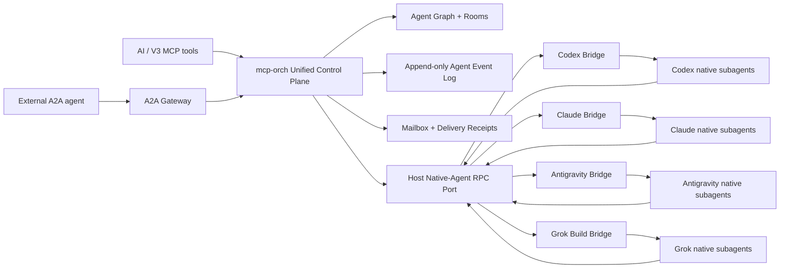
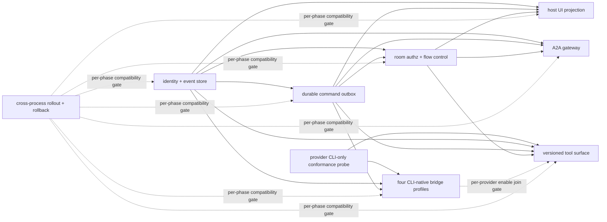

# 统一原生 Subagent 控制面设计

Date: 2026-07-11

Last revised: 2026-07-12

Status: revised against latest `main` after two full-stack research agents, reciprocal cross-review, root adjudication, and strict CLI-only correction; awaiting user re-review

Baseline: `a4334bc8884c29303568fe6461794856e910d1b8`

Provider evidence snapshot: official CLI sources rechecked on 2026-07-12; all native-child control claims remain `probe_required` until version-pinned V3 conformance evidence exists.

Scope: V3 对 Codex、Claude Code、Google Antigravity、Grok Build 官方 CLI 及其原生 subagent 的统一编排控制面。

## 1. 决策摘要

采用方案 C：**强制统一控制面**。

官方 CLI 继续拥有模型调用、上下文压缩、工具循环和原生 subagent 执行优化；V3 不用任何 SDK、Desktop App、Web App 或独立 API runtime 重写、旁路或替换这些 CLI 执行引擎。V3 只在官方 CLI executable 及其自身暴露的子命令、机器协议、插件和 hook 上增加 provider CLI-native bridge，把根会话、官方原生 subagent 和 V3 托管 CLI agent 映射进同一棵 Agent Graph，并统一提供身份、事件、消息、打断、历史、等待、恢复和会议能力。

“强制统一”具有三个不可拆分的含义：

1. 所有可观察到的官方原生 subagent 都必须登记为稳定的 V3 `agent_id`，不得留在控制面之外形成影子 agent。
2. AI 只使用一套 V3 编排工具；provider 差异通过显式 capability 暴露，不让模型猜测厂商行为。
3. V3 不伪造厂商没有提供的控制能力。缺少中途注入、打断、实时输出或恢复能力时，相关操作必须返回结构化 `capability_not_supported`，不得通过 TUI 抓取、终端按键模拟或静默降级制造假成功。

它还受十三个硬前置约束：

1. all-kind external execution identity、状态/控制健康/capability 历史和命令意图分别只能有一个可写 owner；其他表、内存态和 UI 只能是带 source cursor 的可重建投影。
2. 所有会改变 external runtime 或控制面状态的跨进程命令必须先形成 durable command intent，并通过 lease/outbox/saga 执行；普通 RPC 成功路径不能代替崩溃恢复协议。
3. control level 由重启后仍可证明的最弱原子 capability 决定，不由产品 UI 演示、父 agent 内部能力或单次正常路径成功决定。
4. SQLite transaction 只覆盖同一数据库 owner 内的 reservation、command、event 和 CAS 更新；host/gateway RPC 与 external execution 永远不被描述成跨进程原子事务。
5. event log 只能重建逻辑状态与持久投影；`exec.Cmd`、process guard、queue、连接和状态机实例必须重新创建或 attach，不能伪装成已从事件恢复。
6. peer read、room、send、interrupt 和工具调用都从 transport-authenticated principal 授权；工具面只在不可变 server profile bootstrap 选择。当前长连接协议可以绑定 connection，未来 sessionless 协议必须逐请求验证。普通客户端 metadata、工具 arguments 和可猜测的 `agent_id` 不能建立调用者身份；共享 connection 也不能自动证明某个 native child。唯一例外是经 profile 协商、由 auth middleware 在 ToolScope 之前验证的 namespaced signed credential carrier，它产生独立 child caller attribution 证据。
7. 每条 capability lease 都必须声明 `scope`、`subject`、`constraints`、evidence 和 expiry。connection、provider instance/session、runtime profile、gateway、agent、turn 各 scope 不互相继承；control level/admission 只能对目标 operation 求适用证据的显式 join。
8. 稳定逻辑 `agent_id` 与一次 kind-specific external execution incarnation 分离。新 session/runtime/task、recover/relaunch 和旧 epoch 迟到事件都通过不可变 incarnation fence 裁决，不能覆盖历史 binding 后继续把旧事件投影到当前状态。
9. external source -> bridge/launcher/gateway -> sidecar 的事件进入 event SSOT 前必须有 raw custody/materialization ack 与可重放来源。上游 replay 或有界 durable relay spool 至少存在一个；两者都没有时不得宣称 at-least-once、live cursor 或 fully controlled。
10. `get_agent_events(follow=true)` 与 `wait_agents` 不得占住同一控制连接的读循环；cancel、disconnect 和 timeout 必须释放 watcher，等待中的 agent 仍可被 `interrupt_agent` 或 `send_message` 控制。
11. passive probe 只产生无副作用 discovery 证据。任何需要真实 session/child/output/receipt 的 identity/list/lifecycle/launch/fork/stop/recover/message/interrupt/output/caller-attribution/resume/reconcile 能力，都只能由隔离、可清理、有预算上限的 stateful conformance fixture 证明。
12. room 与 round 的 create/start/close/expire/abort、participant snapshot 和 delivery plan 都必须进入事件历史；room 表和 UI 只能从这些事件重建，不能成为第二套会议事实源。
13. 所有本地模型 execution surface 固定为 `official_cli`。每条 provider session、native child 或 managed CLI capability evidence 都必须证明命令与事件来自 version-pinned 官方 CLI executable 及同一 CLI runtime/session identity；`codex app-server`、`grok agent stdio` 这类 CLI 自身子命令属于 CLI surface。SDK、Desktop App、Web App、共享 harness、同模型 API 或另起的 runtime 即使由同一厂商发布，也不得进入 bridge、probe、capability lease 或 production fallback。A2A remote execution 是独立北向 kind，不伪造本地 CLI surface。

本设计把 A2A 放在外部互操作边界，不把 A2A 当作 V3 内部强控制协议。A2A 的 Agent Card、Task、Message、streaming 和 extension 适合跨系统任务委派；正在运行的本地子代理中途注入、精确打断、游标化输出和会议轮次由 V3 内部控制契约负责。

## 2. 当前事实与缺口

### 2.1 已有能力

当前 `cmd/mcp-orch` 已经具备：

- `launch_agent`、`send_message`、`stop_agent`、`recover_agent`、`interrupt_agent`、`list_agents`；
- 单 agent `get_agent_report(after_report_seq)` 和批量 `get_agent_reports`；
- agent 父子标识、远程 thread/agent identity、状态机、恢复和持久化 report 水位；
- DAG、workspace、shared file、provider runtime 和远程控制面桥接。

源码事实：

- `cmd/mcp-orch/orchestration/launcher.go:29-36` 的 `AgentLauncher` 抽象 launch、fork、stop、archive、interrupt、submit turn 和运行态判断；`service_launcher_bridge.go:181-186` 以 `ContextMode=forked` 选择 Fork，remote launcher 再调用 `thread/fork`。该现有分支必须按 source profile 映射为独立 `session.fork|managed_agent.fork` contract/conformance，不能从 profile 或能力清单遗漏，也不能混同 recover。
- `cmd/mcp-orch/orchestration/service_launcher_bridge.go:568-582` 先尝试远程提交 turn，否则进入本地队列。
- `cmd/mcp-orch/orchestration/service_launcher_bridge.go:650-672` 的远程消息会直接调用 launcher `SubmitTurn`；永久失败会显式停止远端 agent。
- `cmd/mcp-orch/orchestration/service_launcher_bridge.go:741-770` 的本地消息只是加入下一 turn 队列，不是运行中注入。
- `cmd/mcp-orch/orchestration/launcher.go:104-106` 明确只允许远程 Codex agent 执行当前 `interrupt_agent`。
- `cmd/mcp-orch/tools/orchestration_report_tool.go:160-196` 使用 50ms ticker 等待批量 report，并且只支持 all 语义。
- `internal/module/uistate/projector_handlers.go:469-493` 会接收实时 `TurnOutputDelta`，但只把 message delta 拼进 UI `lastMessage`，没有成为 mcp-orch 可读取的历史流。
- `internal/module/thread/spawn.go:496-519` 与 `internal/module/turn/factory.go:271-294` 在 managed subagent 默认开启时隐藏原生 `spawn_agent`，当前策略是“二选一”，不是“纳管官方原生 subagent”。
- `internal/store/binding/store.go:72-108` 的现有 host/store path 仍可直接 Upsert provider binding；统一 identity owner 落地前必须先收口这些 writer。
- `cmd/mcp-orch/orchestration/persistent_runtime_rehydrate.go:119-219` 当前只恢复 Codex binding，并把内存状态重建为 Idle、新 queue 和新状态机，不能作为任意 provider live runtime 已恢复的证明。
- `internal/mcpserver/common/scope.go:33-74` 从 `tools/call` 顶层私有 metadata 构造 ToolScope；它已隔离 arguments，但尚不能代替 transport-authenticated caller identity。
- `internal/mcpserver/common/server.go:349-360` 的 `tools/list` 没有业务 session selector，因此版本化工具面必须绑定进程/connection，而不是每次 list 动态选择。
- `internal/platform/db/module.go:234-249` 的共享 DB lifecycle 会执行同一个 `RunMigrations` 与 schema gate；设计需要的是单 DDL/runner implementation 和并发安全，而不是假定只有一个进程会调用迁移。
- `internal/mcpserver/common/server.go:211-257,285-322,362-418` 当前在一个 stdio 主循环内同步 dispatch 并等待 tool handler；普通 30-60 秒 long-follow 会阻塞同连接后续打断、消息和取消，`unified_v2` 不能直接复用该串行行为。
- `internal/dto/agent/state.go:11-20,88-122` 的 canonical `AgentState` 没有 `completed`；turn 成功后 agent 回到 `idle`，等待工具必须按 agent/turn/command/event 判别联合建 fence，不能创造第二套 agent state。
- `internal/app/modules.go:100-104` 当前 production Fx 图启用 `codexapp.Module`，`claudecli.Module` 仍被注释，且没有 Antigravity/Grok production adapter；四家 profile 必须覆盖从 provider 注册、安装和 UI 路由到 bridge 的完整接线，而不是假定只差 child hook。
- `internal/provider/shared/hooks.go:46-69` 与 `internal/app/modules.go:148-174` 已用 `RuntimeHooksReady` 和根图 provider 阻断缺失的 tool-result capture/reset hook；这是应复用的 production fail-fast readiness 模式，但它不证明 native-child caller attribution、durable ingress 或四家 bridge 已接通。

### 2.2 现有能力不能满足的场景

| 需求 | 当前状态 | 根因 |
| --- | --- | --- |
| 查看最近 N 条输出 | 不满足 | 只有最新完成 report，没有追加式历史 |
| 查看运行中实时输出 | 不满足 | delta 只投影到 UI，mcp-orch 无游标读取口 |
| Agent 直接查看其他 Agent | 不满足 | 只能由主控读取后转发，没有授权后的 peer read |
| 运行中发送补充指令 | 厂商不一致 | 本地排队、远程忙态和官方 native 行为没有统一语义 |
| 精确打断当前 turn | 部分满足 | 当前只支持远程 Codex，缺少 capability 与 turn fence |
| any/quorum/first_success 等待 | 不满足 | 批量 report 只有 all，且依赖轮询 |
| 多 Agent 会议/广播 | 不满足 | 没有 room、participant、broadcast、round、共享 cursor |
| 官方 CLI 原生 subagent 纳管 | 不满足 | 现有策略隐藏原生入口，没有 native identity/event bridge |
| 跨进程重启继续读取 | 部分满足 | report 可恢复，但没有持久事件游标与消息 receipt |

## 3. 目标与非目标

### 3.1 目标

1. 统一 V3 agent identity：根会话、V3 托管 agent、官方原生 subagent 都使用稳定 `agent_id`。
2. 统一追加式事件流：生命周期、输出、工具、消息、打断、错误和会议事件可历史读取、tail 和 follow。
3. 统一显式消息语义：运行中注入、边界投递、新 turn、排队和 interrupt-then-send 不再混为一个模糊操作。
4. 统一能力协商：每个 provider/session/agent 都返回经过主动探测的原子 capability 和证据水位。
5. 统一会议模型：支持 room、参与者、广播、轮询发言、any/all/quorum/first_success 等待和共享 transcript。
6. 统一持久性：mcp-orch 重启后恢复 Agent Graph、事件 cursor、room、message receipt 和 capability generation。
7. 保留官方 CLI 优化：模型交互与原生 subagent 执行继续走官方 CLI executable 自身暴露的子命令、stdio/JSON-RPC/ACP、插件、MCP/RPC bridge 或 hook。
8. 提供 A2A 北向网关，使外部厂商 agent 能以标准任务/消息协议接入，而不削弱内部控制能力。

### 3.2 非目标

1. 不使用任何 SDK、Desktop App、Web App 或独立 API runtime 替代、旁路或补足 Codex、Claude Code、Antigravity 或 Grok Build 官方 CLI；这些相邻产品面只能作为非授权背景资料，不能参与 CLI bridge、probe、lease 或 fallback。
2. 不把 `cmd/mcp-orch` 嵌入 desktop host，也不允许它直接 import `internal/provider`。
3. 不以 shell/TUI 屏幕抓取、键盘注入或解析非机器输出作为受支持控制协议。
4. 不承诺所有 provider 拥有同样能力；统一的是模型和错误语义，不是虚构能力。
5. 不默认暴露模型私有 reasoning；默认只暴露 message、tool status、tool result 和 lifecycle。
6. 不在第一阶段删除现有 report 文件或 legacy MCP 工具；它们只能作为带 source cursor 的兼容投影，不再扩展为第二套事实源。
7. 不把会议升级为分布式共识、投票治理或长期团队组织系统。

## 4. 方案比较

### 4.1 方案 A：只统一顶层 CLI，原生 subagent 视为黑盒

优点是实现快、对厂商内部 API 依赖少。缺点是无法直接查看、发消息或打断官方子代理，也无法建立真实会议和跨 agent 输出游标。它不能满足本次目标。

### 4.2 方案 B：尽力观察，主控模拟会议与转发

通过 report 轮询、transcript tail 和父 agent 转发可以补部分能力，但延迟高、打断不精确、消息 receipt 不可信，并会把主控变成所有通信的串行瓶颈。它只适合作为迁移期观测模式。

### 4.3 方案 C：provider CLI-native bridge + V3 强制统一控制面

每个 provider 只使用官方 CLI executable 自身暴露的子命令、直接机器协议、插件、MCP/RPC bridge 或 hook 接入 V3。所有 native child 自动登记，控制命令和事件进入同一契约；CLI 没有暴露所需能力时显式失败，不改走 SDK、App 或独立 API runtime。

本设计采用方案 C。方案 B 仅保留为 `observed` 能力等级，不能标记为 fully controlled；方案 A 不作为目标架构。

## 5. 总体架构



### 5.1 依赖方向

- `internal/provider/<provider>` 拥有 provider CLI-native bridge，只实现官方 CLI 协议适配，不依赖 `cmd/mcp-orch`。
- `internal/contract` 只放窄的 native agent command/event DTO 与 port，不放 provider 分支逻辑。
- `internal/app` 负责把 provider bridge 适配到 host JSON-RPC/bootstrap 边界。
- `cmd/mcp-orch` 继续作为独立 sidecar，拥有统一编排模型、MCP 工具、Agent Graph、room 和事件存储。
- provider 事件和控制命令通过 host RPC/notify 契约跨边界，不通过 Go import 穿透。
- A2A gateway 是 mcp-orch 的外部 adapter；内部工具和状态机不以 A2A 类型为领域模型。

### 5.2 单一事实源

| 事实 | 权威来源 |
| --- | --- |
| V3 identity reservation | `orchestration_agent_identity_reservations`，由 sidecar identity repository 在 provider 调用前预留 |
| 不可变 external execution incarnation 与 identity mapping | `orchestration_agent_incarnations`，保存 kind-discriminated execution identity、runtime/session epoch、有效 cursor range 与 incarnation fence，覆盖 provider session/native child/managed/A2A 四种 kind |
| all-kind current/last-closed binding CAS | 新 `orchestration_agent_current_bindings(agent_id,active_incarnation_id,last_closed_incarnation_id,binding_version,source_cursor)`；只由 identity repository 与 activation/close event 同 transaction 写，active incarnation 受 per-agent unique constraint |
| legacy provider binding | 现有 `agent_provider_binding` 只是从 all-kind current binding 派生的 provider-only 兼容投影，不覆盖 managed/A2A，也不参与 CAS |
| V3 thread/session 配置 | 现有 `agent_threads` |
| 编排父子拓扑与 workspace/run scope | reservation + `agent.reserved` 固定 immutable parent/root/kind/workspace/run fields；第一版不允许 reparent/rescope，room membership 另走 room event；`orchestration_agent_nodes` 只是带 source cursor 的只读投影 |
| 状态、输出、生命周期、命令和会议历史 | `orchestration_agent_events` |
| ingress source 水位与 durable 去重 | event-store owner 内部的 `orchestration_ingress_source_state` + `orchestration_event_ingress_tombstones`；保存 deployment/source epoch、next/acked/materialized watermark、hole/quarantine 状态及逐 sequence envelope hash/canonical range，业务不可写 |
| sidecar 已接管但尚未按 source 顺序 materialize 的 ingress | 同一 owner 的 `orchestration_event_ingress_receipts` staging journal；逐 source/sequence 保存 payload/mapping 与 materialization status，不对业务查询开放。payload 可按 GC 删除，但 hash tombstone 不随 payload 消失 |
| 跨进程命令意图和执行阶段 | `orchestration_commands` durable outbox |
| room operation intent/idempotency/status | `orchestration_room_operations`，保存 operation id/version、principal/key/intent hash、room/round discriminator、kind-specific phase 与各 cursor；与 room domain event/target command 同 transaction 更新 |
| 消息投递状态 | event/outbox 派生的 `orchestration_message_receipts` 只读投影 |
| room 与成员当前视图 | event-derived `orchestration_rooms`、`orchestration_room_members` 只读投影，权威历史仍是 `orchestration_agent_events` |
| 最新 report | agent event log 的 materialized projection，携带 `source_cursor` |
| runtime/agent 当前控制能力 | bridge/host/gateway probe 只产生 candidate evidence；sidecar capability repository 校验并 commit 到同一 event store 的最新未过期 `runtime.capabilities_changed`（provider-instance/runtime-profile/gateway pre-agent admission）或 `agent.capabilities_changed`（provider-session/agent/turn）lease-set event 才是授权与投影权威。connection tool-surface lease 由不可变 server profile/initialize contract 单独拥有 |
| SQLite DDL 与 schema version | 现有 `internal/platform/db/sqlite/migrations`、baseline 和 schema gate |
| mcp-orch typed query | `cmd/mcp-orch/sql/queries` 生成到 `cmd/mcp-orch/store/sqlc`，不拥有 DDL |

identity repository 是 reservation、incarnation 与 all-kind current-binding CAS 表的唯一写入口：它在同一 SQLite transaction 预留 `agent_id`、typed launch command 和 accepted event；外部 runtime 返回 identity 后，再以 reservation id、command id 与 kind-specific source/binding fence 做 CAS，创建不可变 `execution_incarnation_id`，并写 `orchestration_agent_current_bindings`；node/legacy binding 才是投影。host bridge/A2A gateway 只回传观察结果，不直接写 binding/incarnation，也不与 sidecar transaction 共享 `sql.Tx`。

reservation state machine 固定为 `reserved|claimed|identity_pending|activation_pending|outcome_unknown|activated|rejected|failed|expired`。前五种非 terminal；`activated|rejected|failed|expired` terminal 且不可逆。claim-time admission 失败在同一 transaction 写 command rejected + reservation rejected；external side effect 尚未开始且被证明失败时写 command/reservation failed；未 dispatch 且 TTL 到期必须在同一 transaction 写 `agent.reservation_expired + command.rejected(reason=reservation_expired)`，不能留下 accepted command 或发明未注册的 command-expired phase。external side effect 可能已发生但 activation 尚未确认时只能进入 outcome-unknown 并强制 reconcile，不能用 expiry 清理。reservation terminal status 本身不直接改 canonical AgentState；是否 preserve 或追加 `agent.state_changed` 由 operation/source 分支决定。迟到 observation 不能激活 terminal reservation，只能 quarantine 并按 orphan stop/reconcile 处理。

`orchestration_agent_nodes` 不保存可独立修改的 external runtime identity，也不拥有状态历史；其 active incarnation、canonical state、control status、active turn、control level 和 last cursor 都是带 `source_cursor` 的事件投影。已经绑定 external execution 的事件、以现有 execution 为目标的 command 和对应 receipt 必须携带完整 `execution_fence`。所有 pre-incarnation identity/command event 使用判别联合：V3 launch 保存 `reservation_id`，recover accepted 保存 typed `recover_source + new reservation_id`，provider-originated discovery 保存稳定 `identity_observation_id + provider identity tuple`；identity-unverified/outcome-unknown 等后续事件沿用原 discriminator。append-only 历史永不回填 incarnation；CAS 成功后由新的 `agent.incarnation_activated`/command event 写 `result_execution_incarnation_id`。

旧 incarnation 的任何迟到事件都不能推进 active node。terminal/reconcile event 所属 incarnation 必须在同一 identity-repository CAS 时仍是 active：stop close 原子把 current binding/active incarnation 清空并保存 `last_closed_incarnation_id`，recover switch 原子把 old active 替换为 new；CAS 不匹配只追加旧 incarnation 审计/close outcome，不改 current projection。指向非 active incarnation 的新 command accept/claim 一律以 `stale_incarnation` 拒绝；已经合法 dispatch 且 attempt generation/fence 匹配的迟到 provider ack/completion 仍写入旧 incarnation 的 command/audit/receipt，但不推进 active node、不触发重试。

`agentRuntime` 不是持久事实源；只有其 logical identity、active incarnation、canonical state、control status、水位和可恢复配置能够从持久投影重建。进程、连接、guard、queue 和状态机实例必须重新 attach 或创建，reconcile 成功前保持 `control_status=identity_unverified|reconciliation_required|degraded` 并拒绝写操作。

同一官方 provider session 的 resume/reconnect 只有在 session epoch 连续且 conformance 可证明时复用 incarnation。创建了新的 provider session、child id 被复用或 continuity 无法证明时必须新建 incarnation；只有带原 `agent_id`/command fence 的显式 recover/relaunch saga 才能把新 incarnation 激活到同一 logical agent。provider 自发出现且无法关联 recover intent 的新 child 创建新 `agent_id`，需要表达延续关系时追加 successor edge，禁止猜测复用。

现有 `agent_provider_binding` 单行模型、其 `parent_agent_id` 与 `agent_threads` 中可恢复的 parent/state 字段在迁移期降为兼容投影。子规格必须先列出 host sqlc、mcp-orch store、thread status、archive、report 和 binding 的完整 writer inventory，再通过版本化 owner API 与 writer fence 收口：identity repository 写 incarnation/current binding，parent 只由 node topology projector 写，state 只由 event projector 写。`persistent_agents` 恢复路径切到 node/event/incarnation projection 后，旧 parent/state 列进入只读兼容期并在退出 migration 中删除或停止消费；legacy 与 unified identity namespace 不得并发写同一记录。

现有 report 文件在迁移期也是只读兼容投影，不允许与事件流各自独立推进。新事件必须先持久化，由 mcp-orch 内的 DB projector 更新 node/report；desktop host 的 UI projector 是另一个进程消费者，必须通过持久 cursor、ack、replay 和 gap 语义从同一事件源恢复，不能被称为“同一 projector”。迁移期只允许“新 owner 单写、旧表双读”，发现 owner 与投影冲突必须阻断，不能按时间戳或最后写入静默裁决。

## 6. Provider CLI-native Bridge

### 6.1 Bridge 职责

每个 bridge 只负责五件事：

1. 启动时探测官方 CLI 版本、机器协议和 native subagent 能力。
2. 通过 host RPC 回传 `ProviderIdentityObserved`。V3 发起的 spawn 必须携带 reservation/command id；provider 自发创建、legacy hook 或 reconcile 首次发现的 child 携带 `origin=provider`、稳定 provider identity 与 evidence，不得伪造 spawn command。两类 observation 都由 sidecar identity repository 幂等裁决并返回稳定 V3 `agent_id` 与 `execution_incarnation_id`，bridge 不直接写 incarnation/current binding。
3. 把官方事件规范化为 V3 agent event，不在 provider adapter 内实现会议或等待逻辑。
4. 执行已经持久化并由 lease claim 的 V3 command，返回 provider request/receipt evidence；bridge 自身不拥有 command intent。
5. 只有声明并通过 `session.reconcile` conformance 时，重连后才列举或对账 provider 原生 child；否则报告 reconciliation unsupported，不猜测 child 已丢失。

### 6.2 CLI-owned transport 资格门与按 lane 选路

bridge 先过 `same_cli_runtime_identity` 资格门，再比较 transport。候选必须由目标官方 CLI executable 启动或 attach，能够回显同一 CLI runtime/session/child identity，并在 stateful fixture 中证明事件与命令落到该 incarnation。共享模型、共享 harness、共享配置或同厂商签名都不构成同一 CLI runtime 证据；未过门的候选不能进入排序。

通过资格门后，不设“某种 transport 全局优先”的单链降级。identity/lifecycle、control、output、receipt/reconcile 各 lane 按 identity fidelity、fence、replay、directionality 和 latency 独立选择，可组合多个合格的 CLI-owned surface：

1. CLI 自身的双向机器子命令或协议，例如 `codex app-server`、`grok agent stdio`、stdio/JSON-RPC/ACP；
2. 绑定同一 CLI runtime/session identity 的 CLI plugin、MCP/RPC bridge；
3. CLI command/headless JSON contract，以及 CLI hook，用于其官方 schema 明确覆盖的生命周期、边界门禁、receipt 或低频控制；
4. CLI transcript/history 只用于启动对账、审计补偿或已声明的 history 能力，不能伪造 live cursor。

SDK、Desktop App、Web App、独立 API runtime、TUI 文本、alternate-screen、键盘快捷键和未声明日志格式不属于受支持 transport，也不得作为 production fallback。Hook 不是默认实时数据总线；若 CLI 提供 streaming/ACP，output delta 必须直接进入长连接，不能为每个 token 启动 hook 进程。Hook 只承担 `subagent_start`、`subagent_stop`、tool boundary 和 stop policy 等官方 schema 覆盖的离散事件。

### 6.3 Handshake

bridge 启动时必须返回 connection/provider-session capability lease；native child 被发现后，再通过同一 contract 返回 agent/incarnation-scoped lease。下面只展示 envelope 形状，不代表 Codex 或任何具体 provider 已经具备这些能力：

```json
{
  "provider": "provider-under-probe",
  "provider_version": "provider-version",
  "execution_surface": "official_cli",
  "cli_executable": "provider-cli",
  "cli_runtime_instance_id": "cli-runtime-instance-id",
  "machine_surface": "cli-owned-stdio-jsonrpc",
  "transport": "stdio",
  "session_id": "provider-session-id",
  "provider_session_epoch": "pse_01J2X9",
  "bridge_lease_generation": 4,
  "tool_surface_lease": {
    "profile": {
      "server_profile_id": "orch-unified-v2",
      "mcp_core_revision": "2025-11-25",
      "orchestration_api_version": "unified_v2",
      "tool_manifest_hash": "sha256:tool-manifest"
    },
    "capability_leases": [{
      "name": "native_tool_suppression.exact_set",
      "scope": "connection",
      "subject": {"kind": "server_profile", "id": "orch-unified-v2"},
      "constraints": {"exact_tool_manifest_hash": "sha256:tool-manifest"},
      "evidence_cursor": "probe_tool_surface_7",
      "expires_at": "2026-07-12T13:00:00Z"
    }],
    "probe_evidence": {
      "evidence_cursor": "probe_tool_surface_7",
      "native_tool_set_hash": "sha256:native-tools"
    },
    "expires_at": "2026-07-12T13:00:00Z"
  },
  "capability_leases": [{
    "name": "native_child.spawn",
    "scope": "provider_session",
    "subject": {"kind": "provider_session", "id": "provider-session-id"},
    "constraints": {"parent_session_epoch": "pse_01J2X9"},
    "evidence_cursor": "probe_evt_42",
    "expires_at": "2026-07-12T13:00:00Z"
  }, {
    "name": "message.mid_turn",
    "scope": "agent",
    "subject": {"kind": "execution_incarnation", "id": "inc_123"},
    "constraints": {"requires_turn_fence": true},
    "evidence_cursor": "probe_evt_43",
    "expires_at": "2026-07-12T13:00:00Z"
  }],
  "probe_evidence": {
    "probe_version": 1,
    "evidence_cursor": "probe_evt_42",
    "result_hash": "sha256:probe-result",
    "observed_at": "2026-07-12T12:00:00Z"
  },
  "expires_at": "2026-07-12T13:00:00Z"
}
```

`execution_surface` 对 provider session、native child 和 production managed agent 只接受 `official_cli`。`cli_executable`、CLI version/hash、`cli_runtime_instance_id`、`machine_surface` 和 CLI session identity contract 共同形成 local model execution candidate lease 的 eligibility evidence；任一字段缺失或不能证明同一 CLI incarnation 时，bridge/runtime handshake 失败且不尝试 SDK/App fallback。A2A remote lease 不含这些 CLI 字段。`provider_session_epoch` 在同一个官方 CLI provider session 的 resume/reconnect 期间保持稳定，只在确认创建了新的 provider session 或检测到 provider id reuse 时改变；它属于 durable identity。`bridge_lease_generation` 每次 bridge 连接/租约更替时递增，只用于命令和事件 fence，不参与稳定 identity。

每个本地 provider/native/managed capability lease 固定包含 `execution_surface=official_cli`、CLI executable/version/hash、CLI runtime instance、machine surface，再包含 `name`、`scope=connection|provider_instance|provider_session|runtime_profile|gateway|agent|turn`、不可变 `subject.kind/id`、typed `constraints`、provider/runtime/version/transport/epoch/generation、probe version、evidence cursor/result hash、observed time 与 expiry。A2A lease 不伪造 CLI 字段。合法矩阵固定为：connection -> connection/server-profile，provider-instance -> provider instance，provider-session -> provider session node，runtime-profile -> managed CLI runtime profile，gateway -> A2A gateway，agent -> execution incarnation，turn -> incarnation + turn。

candidate issuer 矩阵也固定且只能作用于自己拥有的 source fence/execution：provider bridge 可提交 connection/provider-instance/provider-session，以及其已 CAS provider/native execution 的 agent/turn candidate；host runtime owner 可提交 runtime-profile，以及其已 CAS managed execution 的 agent/turn candidate；A2A gateway 可提交 gateway，以及其已 CAS remote execution/task 的 agent/turn candidate。identity CAS 前，三者都只能提交各自 pre-agent scope，不能预签 agent/turn lease；post-CAS candidate 必须绑定完整 execution/source fence、runtime/remote task epoch 与 evidence。sidecar capability repository 校验 issuer ownership、subject、evidence、epoch/generation 后，将 provider-instance/runtime-profile/gateway lease commit 为 versioned `runtime.capabilities_changed`，将 provider-session/agent/turn lease commit 为 `agent.capabilities_changed`；commit 失败不得进入内存、node、AI 输出、admission 或 dispatch。没有明确 scope/subject 的粗粒度 boolean capability 不进入决策。

session capability 不能自动向 child 继承，root thread 正例也不能替代 agent/incarnation 正例。`native_child.spawn/list` 等 session operation 与 `message.mid_turn`、`turn.interrupt` 等 target operation 在计算某个 agent 的等级时做显式 join；任一 lease 的 subject、constraint、epoch、generation 或 expiry 不适用于目标时，该原子能力视为缺失。fork 是独立可选 admission：provider/native source 使用 applicable provider-session `session.fork`，managed CLI source 使用 agent-scoped `managed_agent.fork`；constraints 都必须固定 source/target kind、execution/thread/session、copy/context semantics 和 fence。fork 不由 spawn 推导，也不是 `fully_controlled` 的默认门，只有 `launch_agent(creation=fork)` 请求时才必需。

`tool_surface_lease` 与 agent/session capability lease 独立失效。`native_tool_suppression.exact_set` 证据必须绑定 provider/version/transport、server profile id、MCP core revision、orchestration API version、`tool_manifest_hash`、bridge lease generation、native tool-set evidence hash 和 expiry；任一字段改变立即失效。strict unified connection 必须原子停止新 mutation admission、标记 profile mismatch 并主动 drain/terminate；已 accepted/dispatched command 按 durable outbox 保留审计并收口，不能继续给模型一个可能重新出现同义原生工具的连接。resume 必须创建新 connection，重新 initialize/exact-set probe 后才能恢复。不能把 exact tool suppression 外推为 child control 能力，也不能把 agent capability lease 反向当作工具面证据。

`provider_version`、CLI executable/hash、CLI runtime instance、machine surface、`transport`、`bridge_lease_generation`、probe version 或 evidence hash 改变时，旧 capability lease 立即失效。这里的失效禁止新的 observation、command 与 capability 决策；旧 generation 已写入 durable spool/token state 的 immutable envelope 仍可携原 generation 按原 source sequence 幂等提交，不能因重连丢弃。provider 无法证明 CLI session epoch 连续性、lease 到期或尚未重探测时，agent 设置 `control_status=identity_unverified` 并拒绝写操作。V3 不从 provider 名称、产品 UI、SDK/App 行为或静态文档表硬编码能力。

### 6.4 Kind-discriminated control profile、能力目录与等级

`internal/contract` 必须提供唯一的版本化 `capability_catalog`、`control_profile_requirements` 和 `launch_admission_requirements` registry。catalog 的每个原子能力固定合法 scope/subject、typed constraints schema 与 `passive|isolated_profile|stateful` evidence mode；profile registry 只描述“已经存在的 execution 当前能被怎样控制”，launch registry 只描述“能否创建/派生新的 execution”。下表、probe fixture、missing requirements、`list_agents` launch profile、文档清单与测试向量都从这三份 registry 生成并共享独立的 `capability_manifest_hash`，禁止再手写平行列表。它与 MCP exact tool registry 的 `tool_manifest_hash` 是两个失效域；server profile 可以同时绑定二者，但 capability requirement 变化不伪装成 tool-set 变化，tool suppression lease 也不拿 capability hash 代替 tool hash。

每个 node 必须保存 `control_profile=provider_session|native_subagent|managed_agent|a2a_remote_agent`。公共 label `control_level=none|root_only|observed|managed|fully_controlled` 只是按对应 profile requirement AST（支持 `all_of/any_of`）计算的 derived display/routing 值，不是跨 kind 的授权 shortcut；handler 始终 join 原始 scoped leases。provisional、identity-unverified、lease 已过期或未满足该 profile 最低 tier 时固定为 `none`，排序低于 observed，写操作 fail-fast；原因只由 `control_status` 与 missing requirements表达。pre-agent launch/readiness lease 过期只关闭对应 launch admission，不能降低仍有有效 target-operation lease 的既存 node；反过来 node 达到某个 control level 也不授权 launch。调度策略若同时要求“可创建后继 + 可强控目标”，必须显式 join 两个独立结果并分别返回缺项。

| profile | `root_only` | `observed` | `managed` | `fully_controlled` |
| --- | --- | --- | --- | --- |
| `provider_session` | `session.identity` + `message.new_turn` + `output.history|live_cursor` | + `session.lifecycle` | + `session.stop/recover/resume/reconcile` | + `message.mid_turn/provider_ack`、`turn.interrupt/interrupt_fence`、`output.live_cursor` |
| `native_subagent` | 不适用 | `native_child.identity/lifecycle` | + `message.new_turn` + `output.history|live_cursor` | + target `native_child.stop/recover`、`message.mid_turn/provider_ack`、`turn.interrupt/interrupt_fence`、`output.live_cursor`、applicable `session.resume/reconcile` |
| `managed_agent` | 不适用 | `managed_agent.identity/lifecycle` | + `message.new_turn` + `output.history|live_cursor` | + `managed_agent.stop/recover/reconcile`、`message.mid_turn/provider_ack`、`turn.interrupt/interrupt_fence`、`output.live_cursor` |
| `a2a_remote_agent` | 不适用 | `a2a.agent.identity` + `a2a.task.lifecycle` | + `a2a.message.send`、`a2a.task.status`、`a2a.task.snapshot_rehydrate`、`a2a.artifact.read|stream` | + `a2a.task.cancel`（或更强 versioned task-stop extension）、`a2a.v3.message.mid_turn/provider_ack`、`a2a.v3.turn.interrupt/interrupt_fence`、`a2a.v3.output.live_cursor`、`a2a.v3.session.resume/reconcile`；core CancelTask 必需但单独不充分 |

厂商根 Agent 可以在 `root_only` 级别接入。官方原生 subagent 和 managed agent 只有按自己的 profile 达到 `fully_controlled` 才能成为默认强控制调度目标；A2A 缺任一 V3 strong-control extension 时最高为 `managed`。任何 `observed`/`managed` node 都必须在 route view 返回 control profile/level 与缺失 requirement，并在 diagnostic view 返回完整 applicable scoped leases，不能显示成完整受控。`peer_capable` 是正交 join gate：还必须有适用于该 kind 的 caller attribution、有效 CallerPrincipal/grant 和 room tool exact-set 证据；缺少时 node 仍可由 controller 控制，但不能主动 peer-read/room-write。

canonical `capability_catalog` 至少包含以下完整分组；表中的 alternatives 由 requirement AST 表达，不能把字符串中的 `/` 或 `|` 当成一个能力名：

| 合法 scope/subject | 原子能力 | evidence mode |
| --- | --- | --- |
| connection/server profile | `native_tool_suppression.exact_set` | isolated_profile |
| provider-instance/provider instance | `provider_session.launch` | stateful |
| provider-instance/provider instance | `provider_session.tool_surface_profile_ready` | isolated_profile |
| provider-session/provider session | `session.identity/lifecycle/stop/recover/resume/reconcile/fork`、`native_child.list/spawn` | stateful |
| runtime-profile/runtime profile | `managed_agent.launch` | stateful |
| runtime-profile/runtime profile | `managed_agent.tool_surface_profile_ready` | isolated_profile |
| gateway/gateway instance | `a2a.task.create` | stateful |
| agent/execution incarnation | `native_child.identity/lifecycle/stop/recover`、`managed_agent.identity/lifecycle/stop/recover/reconcile/fork`、`a2a.agent.identity`、`a2a.task.lifecycle/cancel/status/snapshot_rehydrate`、`a2a.message.send`、`a2a.artifact.read/stream`、`a2a.v3.message.provider_ack`、`a2a.v3.output.live_cursor`、`a2a.v3.session.resume/reconcile`、`message.new_turn/next_boundary/provider_ack/observed_in_context`、`output.history/live_cursor`、`session.resume/reconcile`、profile-constrained `caller.attribution` | stateful |
| turn/incarnation + turn | `message.mid_turn`、`turn.interrupt/interrupt_fence`、`a2a.v3.message.mid_turn`、`a2a.v3.turn.interrupt/interrupt_fence` | stateful |

同名 `session.resume/reconcile` 只有在 catalog constraint 明确其 target profile、provider session 与 execution incarnation 时才可用于 agent level；provider-session fleet lease 不自动下沉。passive discovery 只能发现 tool/version/schema candidate，不能签发上表任何标为 stateful 的行为 lease。新增或删除 profile requirement 时，registry validator 必须证明它引用了 catalog 中唯一能力、存在合法 issuer/fixture/phase owner，并同步改变 `capability_manifest_hash`；否则构建失败。

如果 provider 支持在 native spawn 前阻断，bridge 注册失败必须阻断 spawn。如果 provider 的 start hook 不可阻断，child 可以先以 canonical `state=provisioning,control_status=pending` 登记；若在限定 handshake 窗口内无法建立 identity 与事件通道，父 session 设置 `control_status=degraded`，后续 native spawn 被禁用或显式拒绝。

## 7. 统一身份与 Agent Graph

### 7.1 Identity key

所有 `launch_agent` kind 都先创建 logical `agent_id` reservation、typed command/outbox 和 accepted event，外部副作用完成后才 CAS 创建 incarnation。`execution_identity` 是按 node kind 的判别联合：

```text
provider_session:
  (provider, provider_instance_id, provider_session_id, provider_session_epoch, role=root)
native_subagent:
  (provider, provider_instance_id, provider_session_id, provider_session_epoch,
   native_child_id, native_child_lifecycle_epoch)
managed_agent:
  (v3_run_id, launch_command_id, persisted_runtime_instance_id)
a2a_remote_agent:
  (gateway_instance_id, remote_agent_identity, remote_task_or_session_id, remote_epoch)

execution_identity -> execution_incarnation_id -> v3_agent_id
```

`native_child_lifecycle_epoch` 优先使用 provider 提供的不可复用 creation/lifecycle id。provider 只有可证明的 durable child-start event 时，bridge 才能以该 start event 的 `(ingress_source_id,source_sequence)` 持久派生 V3 occurrence token；同一 start replay 必须复用 token，且只有 previous incarnation 已 terminal 才能为复用的 `native_child_id` 创建新 token。缺少可证明 start fence、previous 仍可能 active 或 provider id reuse 无法区分时，禁止猜测新 incarnation 并设置 session `control_status=degraded`；不能通过本地计数或展示时间伪造 epoch。

managed agent 的 `persisted_runtime_instance_id` 在 process spawn 前写入 command；provider 后续返回的 thread/session id 作为 evidence 附加，不能替代该 identity。A2A discriminator 只在 `a2a-gateway-spec` 固定 core/binding 后启用。所有 execution identity 到 incarnation 的唯一键只由 identity repository 写入和裁决；bridge/gateway generation 不属于稳定 identity，只参与 incarnation 上的写 fence。`v3_agent_id` 创建后不可因展示名、同 epoch 重连或父 agent rename 改变；无法证明原 epoch/lifecycle epoch 时不得猜测复用旧 incarnation。相同 external identity 的重复 event 必须命中同一 incarnation；不同 identity 竞争同一 active incarnation 或未经 recover intent 竞争同一 `agent_id` 时 fail-fast。

所有 public tool、command、room delivery、bound-execution event 与 node projection 复用 `execution_fence` 唯一判别联合。公共字段为 `execution_kind`、logical agent id、execution incarnation id 和 optional turn id；kind 分支固定为：

```text
provider_session:
  provider, provider_instance_id, provider_session_id, provider_session_epoch, bridge_lease_generation
native_subagent:
  provider, provider_instance_id, provider_session_id, provider_session_epoch,
  native_child_id, native_child_lifecycle_epoch, bridge_lease_generation
managed_agent:
  v3_run_id, persisted_runtime_instance_id, runtime_supervisor_instance_id, runtime_generation
a2a_remote_agent:
  gateway_instance_id, gateway_auth_generation,
  remote_agent_identity_or_stable_hash, remote_task_or_session_id, remote_epoch
```

不适用字段必须 absent。`source_fence` 给 pre-agent ingress/principal issuer 使用相同思想，分为 `provider_bridge(provider/session epoch/bridge generation)`、`managed_runtime(supervisor instance/runtime generation)`、`a2a_gateway(gateway/auth generation/remote epoch)` 与 `internal_owner(service instance/deployment epoch/writer generation)`；lane source id、stale-writer 拒绝和 restore provenance 都复用它。

recover command 的 public `source_ref` 是 `kind=handle|full_source` 判别联合。handle 分支使用 route view 对 `active_execution|last_closed_execution|failed_reservation` 签发的 typed `source_handle`；full-source 分支中 active/last-closed 携完整 execution fence，failed-reservation 携 terminal reservation id/version。admission 必须先把两种输入解析成唯一 canonical `recover_source`，command intent/idempotency hash 只保存解析后的 full source，不保存原 handle。activation event 再保存 `binding_fence`：`first_launch` 要求 active/last-closed 均空，`provider_discovery` 要求 identity observation 与 active 为空，`active_recover` 要求 expected active source，`closed_relaunch` 要求 active 为空且 expected last-closed source，`failed_reservation_retry` 要求 terminal source reservation且 active 为空。每个分支都保存 CAS outcome；相同 key 改变 source kind/id/fence 必须冲突，不能按 nullable 字段猜分支。

`launch_agent` admission 按 kind 固定，schema 可见不等于分支已启用：

| kind | 必须 admission/readiness | 启用阶段 |
| --- | --- | --- |
| `provider_session` | provider-instance-scoped `provider_session.launch` lease、已验证 `execution_surface=official_cli` 的 executable/version/hash/runtime profile、workspace/run grant；strict unified pre-launch 另要求 `provider_session.tool_surface_profile_ready` | 对应 provider bridge 在 Phase 3 通过后 |
| `native_subagent` | active parent agent/incarnation/session fence + applicable provider-session `native_child.spawn` lease；strict unified 必须继承仍有效的 parent connection exact-set lease；强发现调度另 join `native_child.list`，但不写入既存 child 的 control level | 对应 provider bridge 在 Phase 3 通过后 |
| `managed_agent` | host runtime-profile-scoped `managed_agent.launch` readiness lease、已验证 `execution_surface=official_cli` 的 executable/version/hash、workspace/run grant、预持久化 runtime instance；strict unified pre-launch 另要求 `managed_agent.tool_surface_profile_ready` | provider-neutral core 在 Phase 1，现有 V3 managed CLI adapter 在 Phase 2 通过后 |
| `a2a_remote_agent` | gateway-scoped `a2a.task.create` lease、remote Agent Card/auth/binding evidence、workspace/run grant | `a2a-gateway-spec` 与 Phase 5 通过后 |

`creation=fork` 再按 source profile join 独立 admission；不能拿目标 kind、launch readiness 或 control level 代替 source lease：

| source profile | 必须 fork lease | issuer / scope | 当前默认 |
| --- | --- | --- | --- |
| `provider_session` | `session.fork`，constraints 绑定 source provider session/thread、target kind 与 copy/context semantics | provider bridge / provider-session | conformance 后可启用 |
| `native_subagent` | parent/session 的 `session.fork`，constraints 还绑定 source child incarnation；session lease不自动继承，必须显式适用于该 child | provider bridge / provider-session | conformance 后可启用 |
| `managed_agent` | `managed_agent.fork`，constraints 绑定 persisted runtime instance、source CLI session/thread、target kind 与 copy/context semantics | host runtime owner / agent execution incarnation | Phase 2 stateful fixture 后可启用 |
| `a2a_remote_agent` | A2A 1.0 core 无 fork；当前 catalog 不注册 fork lease | 不适用 | 固定 `capability_not_supported`；未来只能通过另行批准的 versioned extension 增加 |

`creation=fork` 的 public `source_ref` 接受 route view 的 typed `source_handle` 或 diagnostic full source；handle 必须绑定 fork-source logical agent/incarnation/thread/session 与当时的 binding role，admission 解析后按上表校验 lease并把 full source fence 写入 command。strict unified 的 tool-surface 是两段门：pre-launch 的 `isolated_profile` readiness 只证明配置可启动；external process/connection 与 identity 已建立、但 exact-set 尚未通过时保持 reservation `activation_pending(reason=tool_surface_exact_set)`、node `provisioning/none`，禁止发送首个模型 turn，直到实际 connection 完成 initialize 且 commit `native_tool_suppression.exact_set`。已有 daemon connection 可走同一契约的快路径。post-launch exact probe 失败时先阻断 prompt 并按 provider stop/terminal reservation saga 收口；stop outcome 不可证明则进入 outcome-unknown/reconcile，不能激活后再静默降级。Phase 1 只实现四种 kind 的 typed schema、reservation/outbox/incarnation core，所有 external dispatch branch 默认 disabled；未到启用阶段统一返回 `capability_not_supported`，不能因 enum 已发布就尝试外部副作用。

### 7.2 Node 类型

- `provider_session`：官方 CLI 根会话。
- `native_subagent`：由官方 CLI 原生机制创建的 child。
- `managed_agent`：由 V3 启动并独立管理的 CLI/session。
- `a2a_remote_agent`：经 A2A gateway 连接的外部 agent。

每个 node 至少保存：

- `agent_id`、`parent_agent_id`、`root_agent_id`、nullable active `execution_incarnation_id`、audit-only `last_closed_incarnation_id`；
- `kind`、`control_profile` 与 workspace/run/room scope；
- event-derived canonical `state`、正交 `control_status`、`active_turn_id`、`control_level`、完整 applicable scoped capability leases，以及只用于展示/路由的 derived capability names/missing requirements；
- `state_source_cursor`、`control_status_source_cursor`、capability lease-set version/evidence cursor、active `execution_fence_ref={execution_incarnation_id,fence_version,source_cursor}`、lease expiry；
- `created_at`、`updated_at`、`last_event_cursor`；
- topology、room 和 thread projection 引用 logical `agent_id`，active execution 另带 `execution_incarnation_id`；不复制 provider session/native identity，不保存 API key 或 provider secret。

`list_agents`/command acceptance 通过 immutable incarnation owner、current source-generation projection 与 lease repository 在同一 snapshot join 出完整 `execution_fence`；node 表只缓存上面的 ref，不复制 external identity。join 的 fence version/source cursor 必须回显，任一 owner snapshot 不一致时返回 `reconciliation_required`，不能用 node 缓存猜测。

父子关系表示执行来源，不限制通信路由。消息授权可以允许父子、祖先、同 room 或显式 grant；知道 `agent_id` 本身不等于拥有访问权。

`state` 只能取 `internal/dto/agent` canonical registry 的 `provisioning|idle|turn_queued|turn_starting|turn_running|awaiting_user_input|recovering|stopping|stopped|failed`。`control_status` 固定为 `pending|verified|degraded|identity_unverified|reconciliation_required|reconciliation_unsupported|reconciliation_failed|lost`，由 identity/capability/reconcile event 更新，不属于 AgentState。`wait_agents.fence.kind=agent_state` 永不接受 control-status 值；等待控制健康变化使用对应 event fence。

### 7.3 AI 路由句柄

AI 的默认读取/控制链不能要求复制 provider-specific fence。`list_agents(view=route)` 为 active execution 签发 `execution_handle`、为 active turn 签发 `turn_handle`，并在 `next_actions[]` 为 fork/recover/relaunch 签发 typed `source_handle`；launch/recover response 还可为 pending/failed reservation 签发 reservation source handle。三者都是带版本、server-profile key MAC 和最长 10 分钟 TTL 的 self-contained opaque locator：execution handle 绑定 server profile、workspace/run、logical agent、active execution incarnation、fence version/source cursor 和 expiry；turn handle 再绑定 execution handle、turn id、turn source cursor 和 expiry；source handle 以 `active_execution|last_closed_execution|failed_reservation|fork_source` 为 discriminator，绑定相应 execution/thread/session full source 或 terminal reservation id/version、expected binding role/source cursor 和 expiry。handle key rotation 立即使旧 handle 失效并要求重新 list；token 不含 secret/credential。句柄不是 secret、principal、grant 或 capability lease，泄露句柄不会赋权。

作用于既存 execution 的 mutation 使用 `target_ref=handle|full_fence`；launch fork/recover/relaunch 使用 `source_ref=handle|full_source`。handler 必须在 command admission transaction 的同一 snapshot 中解析 handle，重新验证 transport principal、grant、expected active/last-closed/reservation binding、active turn、lease、revocation epoch 与 expiry，再把解析后的完整 execution/turn/source fence 写入 command intent。dispatcher 不信任 handle，仍按持久化 full fence 二次校验。full-fence/full-source 只供 diagnostic、gateway 或低层客户端使用。

handle 格式/version/MAC 不合法返回 `invalid_handle`；已过期或 key 已轮换返回 `handle_expired`；target/fork-source incarnation 或 expected binding role 已改变返回 `stale_incarnation`；turn 已切换返回 `turn_conflict`；failed-reservation version/state 或 profile/source cursor 无法一致解析返回 `reconciliation_required`。服务端不得把 handle 自动重绑定到新 incarnation/turn/source，也不得在失败后改走模糊 `agent_id` 路径。mutation response 回显 command/operation fence、可继续使用的 source handle 与当前 cursor，不回显 provider-specific fence，除非调用方显式选择 diagnostic view。

## 8. 追加式事件与游标

### 8.1 事件 envelope

```json
{
  "schema_version": "v3.orchestration.event.v2",
  "cursor": "evt_00000000000042",
  "event_id": "provider-or-v3-event-id",
  "root_agent_id": "agent_root",
  "execution_fence": {
    "execution_kind": "provider_session",
    "agent_id": "agent_123",
    "execution_incarnation_id": "inc_123",
    "provider": "claude",
    "provider_instance_id": "claude-local",
    "provider_session_id": "session_abc",
    "provider_session_epoch": "pse_01J2X9",
    "bridge_lease_generation": 2,
    "turn_id": "turn_9"
  },
  "source_fence": {
    "kind": "provider_bridge",
    "provider_instance_id": "claude-local",
    "provider_session_epoch": "pse_01J2X9",
    "bridge_lease_generation": 2
  },
  "ingress_source_id": "claude-session-abc:control",
  "ingress_lane": "control",
  "source_sequence": 91,
  "type": "output.delta",
  "stream": "message",
  "payload": {"text": "partial output"},
  "provider_at": "2026-07-12T12:00:00.100Z",
  "observed_at": "2026-07-12T12:00:00.120Z"
}
```

`cursor` 是 V3 持久事件流的单调水位，调用方只比较和回传，不解析其内部格式。envelope 以 `type` 判别：已经绑定 execution 的 agent/turn/command/message/output 事件必须携带 logical `agent_id` 与完整 typed `execution_fence`；所有 pre-incarnation identity/command event（包括 reserved、identity-unverified、accepted、outcome-unknown）沿用创建时 discriminator：V3 launch 使用 `reservation_id`，recover 使用 typed `recover_source + reservation_id`，provider-originated discovery 使用 `identity_observation_id + provider identity tuple`。成功 CAS 不改写旧 event，而在 activation/completion event 中写 `result_execution_incarnation_id`。room-level lifecycle 事件必填 `room_id` 与 typed `actor_principal`，顶层 agent/incarnation 可以为空，但 participant/per-target item 必须保存各自 logical agent/execution fence。V3 自产事件使用 durable owner 的 ingress source/sequence，provider 事件使用 bridge ingress。上方 JSON 只是 provider-session fence 分支示例；managed/A2A event 中 provider 字段必须 absent。provider timestamp 缺失或非法时不能用 `time.Now()` 伪装；必须保留 `provider_at=null`，由 `observed_at` 表示 V3 接收时间。

`agent.state_changed` 的 subject 是判别联合：`bound_execution` 携完整 execution fence；`pre_incarnation` 只允许 terminal reservation 对 provisional `provisioning` 追加 canonical `launch_failed -> failed`，携 logical agent id 与 reservation/identity-observation origin fence，execution fields必须 absent。projector 按该显式 branch更新，不能为失败前尚不存在的 incarnation 伪造 fence。

### 8.2 事件类型

第一阶段固定支持：

- `agent.reserved`、`agent.reservation_claimed`、`agent.reservation_identity_pending`、`agent.reservation_activation_pending`、`agent.reservation_outcome_unknown`、`agent.reservation_activated`、`agent.reservation_rejected`、`agent.reservation_failed`、`agent.reservation_expired`；
- `agent.discovered`、`agent.incarnation_activated`、`agent.incarnation_closed`、`runtime.capabilities_changed`、`agent.capabilities_changed`；
- `agent.state_changed`、`agent.identity_unverified`、`agent.control_degraded`、`agent.reconciliation_required`、`agent.reconciliation_unsupported`、`agent.reconciliation_failed`、`agent.lost`、`agent.reconciled`；
- `command.accepted`、`command.dispatched`、`command.provider_acknowledged`、`command.provider_receipt_observed`、`command.completed`、`command.outcome_unknown`、`command.rejected`、`command.failed`；
- `turn.started`、`turn.interrupted`、`turn.completed`、`turn.failed`；
- `output.delta`、`output.completed`、`output.gap`、`output.compacted`、`content.failed`；
- `tool.started`、`tool.completed`、`tool.failed`；
- `message.accepted`、`message.provider_acknowledged`、`message.observed_in_context`、`message.outcome_unknown`、`message.rejected`；
- `room.created`、`room.joined`、`room.left`、`room.closing`、`room.closed`、`room.expired`；
- `room.broadcast`、`room.broadcast_completed`、`room.broadcast_aggregate_failed`、`room.broadcast_timed_out`、`room.round_started`、`room.round_completed`、`room.round_aborted`、`room.round_timed_out`。

`agent.incarnation_activated` 固定 reservation/observation discriminator、new execution identity、`result_execution_incarnation_id`、activated cursor、typed `binding_fence`/CAS outcome 与 `resulting_control_status=verified`；它是初次 identity/ingress channel CAS 成功后 `pending -> verified` 的唯一映射，control level 仍由独立 lease-set event 计算。`agent.incarnation_closed` 固定 target execution fence、valid-to cursor/reason、`current_binding_action=clear|replace`、replacement incarnation（replace 时）与 expected-active CAS outcome；只有 CAS-applied event 可清空/替换 current binding/active id，CAS-mismatch event 只更新历史审计。二者都不能回填旧事件。

reservation event 全部沿用 reservation/observation discriminator。dispatch 已开始且 provider 明确接受创建、但 execution identity/CAS 尚未完成时追加 `agent.reservation_identity_pending`，固定 command/attempt/provider receipt 与 identity-handshake deadline。identity 已证明、但 activation 前置条件尚未满足时追加 `agent.reservation_activation_pending`，其 `reason=tool_surface_exact_set|identity_channel|execution_bind_ready` 判别分支各自固定 evidence、deadline 与缺失 requirement，禁止伪造 provider receipt 或 identity pending；`execution_bind_ready` 只指创建 incarnation/current-binding 所需的最小稳定 endpoint/epoch evidence，严格早于且不同于 activation 后用于 command completed/idle 的 operational `runtime_ready`。deadline 到期且 external 副作用无法裁决时再进入 `agent.reservation_outcome_unknown`。`agent.reservation_activated` 必须与 first `agent.incarnation_activated` 同 transaction；rejected/failed/expired 固定 terminal reason、origin-specific fence 与 `node_state_action=preserve|append_transition`：V3 launch/recover branch 携 command/attempt fence，provider-originated branch 携 identity observation id + provider identity/source fence且 command fields必须 absent。projector 不得从 reservation status 猜 AgentState。first launch/fork/provider-discovery provisional failure 在同 transaction 另追加 `agent.state_changed(trigger=launch_failed,provisioning->failed)`；recover pre-claim rejected/expired 固定 preserve；recover post-claim confirmed failure另追加 `launch_failed,recovering->failed`。`agent.reservation_outcome_unknown` 固定 reconcile deadline/evidence，不是 terminal。terminal reservation 的迟到 activation CAS 必须失败。

`agent.reserved` 固定 logical agent id、nullable parent、root、kind、workspace/run scope、creation origin 与 reservation/version；这些拓扑/scope 字段第一版 immutable，projector 只能从该 event 重建，不能从 node 表反向写回。room scope 只由独立 room membership event 表达。

`runtime.capabilities_changed` 与 `agent.capabilities_changed` 都固定 subject kind/id、`lease_set_version`、previous version、change reason、effective cursor，以及 full scoped lease snapshot 或带 base-version 的 deterministic delta。前者只承载 provider-instance/runtime-profile/gateway pre-agent admission lease，后者只承载 provider-session/agent/turn lease。issuance、revocation、expiry、probe downgrade、generation/version change 和 `output.gap` 撤权都必须追加对应事件；进程停机期间到期的 lease 在恢复写服务前先补 append，不能只改内存或 projection 表。

`agent.reconciliation_required|unsupported|failed|reconciled|lost` 与 bound-execution `agent.control_degraded` 必须携带 target incarnation 和 resulting `control_status`。`agent.identity_unverified` 是判别联合：`pre_incarnation` 分支沿用 reservation id，或 identity observation id + provider tuple，只更新 provisional node/control status且不得伪造 incarnation；`bound_execution` 分支才携 target incarnation。projector 只按固定映射更新 control status，不改 canonical AgentState；没有对应 event 不得只改内存/node 表。

`room.created` 固定 owner/scope/TTL、initial `dispatch_generation=1` 与 membership revision，`room.closing` 固定 expected/new dispatch generation、terminal intent/reason、cutoff cursor 与 drain deadline，`room.closed|expired` 固定 terminal reason/cursor。`room.broadcast` 固定 room operation id/version、participant snapshot/hash、completion condition、per-target command mapping 与 start cursor；broadcast completed/aggregate-failed/timed-out 只引用 start event/operation fence，保存最终 denominator/condition outcome且不改 item receipt。`room.round_started` 必须携带不可变 participant snapshot/hash、mode、completion condition、per-target delivery plan 与 start cursor；completed/aborted/timed-out 只引用该 start event，不重新计算 denominator。缺少这些事件时 room 表不得被称为 event projection。

所有 canonical event envelope 的 serialized 上限固定为 256KiB。单个 message/final output/tool result/artifact 等授权内容超过 64KiB inline 门时，由同一 event-store owner 先写按 64KiB 分块、带总 size/hash/media type/retention policy 的 content object，event 只保存 bounded `content_ref`；content object 与 event 在同一提交边界可验证，不得成为第二套状态真相。第一版 message/final output/tool result 单 object 上限 8MiB，本地 artifact 上限 64MiB；A2A 更大 artifact 默认只保留经过授权、带 expiry/hash/size 的 remote reference，不自动全量拉取。每 principal 最多 2 个并发 content ingest、每 workspace retained content 最多 1GiB、进程全局最多 4GiB；streaming 写入边算 size/hash，越界立即 abort、删除临时分块并触发 backpressure。room snapshot/delivery plan、capability snapshot 和错误详情也必须在 envelope cap 内，必要时使用版本化 delta/独立受限 content object，不能无限内嵌。没有合法 externalized-content schema、超过 object/quota cap 或 envelope 仍超限分别返回 `event_too_large|content_too_large|content_quota_exceeded`，原 transaction 不提交。

`output.compacted` 固定 replaced cursor start/end、replacement chunk cursor/hash、policy id/version、compacted streams 和 `expired_before_cursor`；只有该 event 与 replacement chunk 同 transaction 提交后才可删除旧 delta payload，cursor 本身不重绑定到不同内容。

reasoning stream 不进入默认读结果。只有 provider 明确允许、V3 policy 显式授权并且请求者具备 `output.reasoning.read` 时才可请求。

### 8.3 一致性与去重

- raw ingress 的首要唯一键固定为 `(ingress_source_id, source_sequence)`，其中 `source_sequence` 是 bridge 为该 source 分配的 dense contiguous relay sequence；`orchestration_event_ingress_receipts` 为每一 sequence 持久化 envelope hash、payload/mapping 与 receipt/materialization status。在 source 的 retained dedup window 内，相同 key 内容不一致属于 protocol violation；低于 durable `dedup_floor_sequence` 的 replay 一律以 `ingress_replay_expired` 拒绝且永不重新 materialize。
- provider event id/sequence 只作为 evidence 和辅助去重键，不直接充当 relay sequence。provider event id 的辅助唯一约束包含 provider identity tuple 与 execution incarnation；乱序或稀疏 provider sequence 不影响 relay ack 前缀。
- bridge 在首次观察时分配并在 relay spool/token state 中持久化 next relay sequence 与 provider-evidence mapping，再向 sidecar 发送；重放必须复用原 relay sequence，不能重新编号，也不能依靠可碰撞的文本 hash 去重。
- 只有满足 8.4 的 durable source/custody-ack/replay 后，事件 ingestion 才能声明 at-least-once；raw receipt、event materializer 和 projector 对重复 ingress key/range 必须幂等。canonical event cursor 只在某 lane source 的连续 raw prefix 可按序 materialize时分配；高 sequence hole 只能持久化该 lane 的 staging receipt/payload，不能越过同 lane hole。control lane 可在无显式依赖时越过 output/content lane 的 hole；跨 lane 因果只由 envelope 中固定的 dependency watermark 裁决，不能靠 arrival time 猜测。
- materialized raw payload 只有在 canonical cursor/range 已提交且 rollback checkpoint 越过该 range 后才可 GC；GC transaction 必须先保留逐 sequence envelope-hash tombstone 与 canonical mapping。tombstone 可按固定 segment 压成可按 sequence 查 leaf hash 的 immutable hash vector/root，不能只留不可做 membership 校验的总 hash。只有 provider/bridge replay watermark、event retention 与 rollback window 都越过 segment 后，才能归档 segment root并原子推进 `dedup_floor_sequence`；此后任何低于 floor 的 replay 都拒绝。这样保留有界 dedup window 而不允许旧 sequence 被重新接受。
- `get_agent_events(follow=true)` 使用事件通知唤醒，不在 tool handler 内固定间隔轮询。
- cursor 过旧且已经被 retention 清理时返回 `cursor_expired`，并提供最早可用 cursor；不得从“最新”静默继续。

### 8.4 Bridge ingress ack 与重放

event store 是历史 SSOT，但 host bridge 在 sidecar custody ack 前必须承担非权威 delivery responsibility：

1. 每个 transport/session epoch 至少固定并持久化 `control|output|content` 三个 lane source；`ingress_source_id=(transport/session epoch,lane,lane epoch)`，每个 lane 独立维护 dense contiguous `source_sequence`、acked/materialized watermark、spool quota 与 dedup floor。identity/lifecycle/capability/command receipt/turn-control 进入 control lane，delta 进入 output lane，大内容 frame 进入 content lane。无论 provider 是否提供 event id/sequence，bridge 都先固定对应 lane 的 relay sequence，并在发送前写入有界 durable relay spool 或 durable provider-replay token/mapping state。

大内容在 custody 前就必须 framing，不能把完整 payload 先塞进单条 spool/raw row：bridge/gateway 以 streaming decoder 在 content lane 生成 `content.begin(expected_total_size?,enforced_max_size,assembly_deadline)`、若干不超过 64KiB 的 immutable `content.frame(content_id,offset,frame_hash)`，最后生成 `content.commit(actual_total_size,full_hash)` 或 `content.abort(reason,received_range,actual_size,rolling_hash)`；每 frame 占连续 source sequence 并绑定 owning event discriminator。sidecar 逐 frame写 raw receipt/hash，只有 continuous prefix、actual size/full hash/commit 全部匹配，且 optional expected size相等、hard cap 未超时，才组装 content object 并 materialize 带 `content_ref` 的 canonical event。正常 abort 原子保留 receipt/hash tombstone、删除临时分块、追加 `content.failed` 并安全推进已接收 prefix；oversize、decoder error 与 provider disconnect 都必须尽力写 abort。

若 bridge 崩溃导致 terminal frame 永不到达，sidecar 在 durable assembly deadline 后以 event-store owner 的内部 operation append `content.failed(reason=assembly_timeout,raw_through=last_contiguous)`、tombstone content id并清理分块；它不伪造 provider source frame，也不能越过真实 sequence hole。后续新 object 可以继续；迟到 frame/commit 命中 tombstone 后 quarantine 且不得复活内容。中途崩溃重放必须复用相同 sequence/frame hash。provider 只给不可流式大对象时，adapter 必须使用 owner-only encrypted temp/chunk decoder并在 object hard cap 前中止；无法在分配前施加 hard cap 的 transport 不接收该大内容 capability，不能先无界读入内存再切块。content abort/gap 立即撤销受影响的 artifact/output completeness capability，直到重新 probe/reconcile。

跨 lane 因果使用显式 `dependencies[] = {ingress_source_id,materialized_through_sequence,relation}`。interrupt/stop/message receipt 等没有 output 依赖的 control event 可先收口；若 terminal control event 声称 final output/artifact 已完整，则必须依赖对应 output/content watermark。否则它只能标记 `content_status=pending|gapped`，随后由独立 `output.completed`/artifact event 收口，`latest_completed` 与 final-output wait 不得把仅 turn terminal 冒充内容完整。这样 output/content 洪峰或 hole 不阻塞控制面，同时也不牺牲跨 lane 因果真实性。

2. relay spool 只保存尚未被 sidecar custody-ack 的规范化 envelope，不提供业务查询、不运行 projector、不改写事件，因此不是第二套 event store。spool 记录必须绑定 typed `source_fence`，bound execution 另绑定完整 `execution_fence`；pre-incarnation V3 spawn observation 绑定 reservation/command fence，provider-originated discovery 绑定不可变 `identity_observation_id` + provider identity tuple，等待 sidecar CAS 返回 reservation/incarnation。managed/A2A source 不得伪造 provider session epoch/bridge generation。
3. sidecar 只有在 raw receipt/payload transaction 提交、delivery custody 已转移后才按 lane 返回 `{ingress_source_id, acked_through_sequence, materialized_through_sequence, committed_cursor?}`。`acked_through_sequence` 只能推进“从 1 开始无缺口、已持久接管或已幂等确认”的连续前缀；`materialized_through_sequence` 只能推进该 lane 已按序生成 canonical event/content object 的连续前缀，`committed_cursor` 在尚无新 materialized event 时为空。乱序高 sequence 先记为 staging hole，不能越过同 lane 缺口 ack；跨 lane dependency 未满足的 envelope 保持 staged。bridge 收到 custody 前缀 ack 后才能删除对应 spool range；sidecar staging journal 随后承担重放责任。
4. provider 自身支持可验证 replay 时可以作为 durable source，relay spool 仅保存 replay token/ack；provider 不支持 replay 时必须使用本地 spool。两者都不可用时，该 transport 不得声明 lifecycle completeness、`output.live_cursor`、`output.history` 或 `fully_controlled`。
5. output 丢失产生 `output.gap`；lifecycle、identity、capability、command receipt 等控制事件出现不可恢复 gap 时追加 `agent.control_degraded`/protocol error，撤销写能力并 fail closed，不能只记录 warning 后继续控制。
6. relay spool 使用独立的高优先级字节/记录上限、fsync 与磁盘耗尽测试；达到上限先阻断或降级 provider ingress，不允许无界增长。具体容量由 `agent-identity-and-event-store-spec` 按压测固定。
7. sidecar unmaterialized staging 第一版每 source 上限 4096 rows 或 16MiB、全局上限 65536 rows 或 256MiB、oldest unresolved hole age 上限 30 秒，以先达到者为准。越界先施加 backpressure并把 source 标为 quarantined；output gap 只能走显式 adjudication，控制 gap fail closed。hash tombstone/segment 不计入 payload staging 上限，但必须有独立磁盘 quota、source retirement 和压缩门，禁止无界行数增长。

### 8.5 Delta ingress、背压与批写

`output.delta` 先逐 sequence 进入 raw ingress staging，再由 materializer 在不跨 hole、同 agent/incarnation/turn/stream 的连续 prefix 内合并为 chunk，避免每个 token 单独成为 canonical event：

- 达到 50ms 或 8KiB 任一阈值立即 flush；单 chunk 上限 64KiB，超出时切分。chunk 固定保存 `ingress_source_id`、`source_sequence_start/end`、成员 count/hash，raw receipt 保留逐 sequence 去重映射；同一 range 只能 materialize 一次。
- 第一版每个 agent 最多缓存 64 个 chunk 或 4MiB、每个 provider 最多 16MiB、mcp-orch 全局最多 64MiB，以先达到者为准；活动 streaming agent 总数上限为 64。
- control lane 使用独立的 8MiB 全局高优先级预算，不被 output/content lane 挤占；其中保留 1MiB emergency reserve 只供 interrupt/stop/cancel/terminal receipt。每 source 最多 1024 rows/1MiB pending、每 provider 最多 4096 rows/2MiB，并施加按事件类型的 rate cap 与 weighted-fair drain；超限先 quarantine offending source/provider，不得耗尽其他 provider 份额。只有共享 DB/磁盘真实耗尽才触发全局 fail-closed。任何控制事件都不能静默丢失。
- writer 使用有界批量事务，各 lane 严格按自己的 continuous prefix materialize，跨 lane 只等待显式 dependency watermark；output chunk 只合并已连续接管的安全 range。canonical cursor 只在 materialization transaction 提交时生效，raw arrival order 不得重排同 lane lifecycle/control state。
- writer 在 agent 之间采用公平调度，单个高速 stream 不得长期占满 provider 或全局预算。
- provider transport 支持流控时，队列达到上限必须向上游施加 backpressure。
- transport 不支持流控且 output 数据不可避免丢失时，只有显式 gap adjudication 才能把缺失 range materialize 为 `output.gap` 并推进该 source prefix，同时立即撤销该 agent 的 `output.history`、`output.live_cursor` capability，直到 reconciliation/conformance 重新证明完整性。identity/lifecycle/capability/receipt 等控制 range 缺失时禁止跳洞，必须 quarantine source、设置 `control_status=degraded` 并 fail closed。

压测必须同时记录 follow latency、SQLite commit latency、WAL 增长、队列水位、chunk 大小和 gap 数量。100ms p95 目标只有在无 `output.gap` 且 capability 未撤销时才算通过。

### 8.6 Retention

- lifecycle、message receipt、room membership 和 final output 默认长期保留。
- 高频 output delta 按显式 retention policy 压缩为 chunk，不影响 final output 和 cursor fence。
- 压缩必须生成上述 `output.compacted` event，并保持“旧 cursor 已过期”语义，不能让 cursor 指向不同内容。

## 9. 消息与打断语义

### 9.1 `send_message` 必须显式选择 delivery

```json
{
  "target_ref": {
    "kind": "handle",
    "execution_handle": "eh_01J2X9",
    "turn_handle": "th_01J2XA"
  },
  "message": "停止当前假设，先验证数据库 schema",
  "delivery": "mid_turn",
  "idempotency_key": "review-17-correction-1"
}
```

`send_message` 是以 `delivery` 为 discriminator 的判别联合，不允许把其他分支字段混入当前分支。默认使用上面的 handle target；`kind=full_fence` 时字段形状复用 7.1 的完整 execution fence。两种输入都必须在 admission snapshot 中解析为同一个 canonical full fence，command/event/receipt 永远保存 full fence 而不是 handle：

- `mid_turn`：handle 分支必须携带 execution + turn handle，full-fence 分支必须携带含 turn id 的完整 fence；缺少该 profile 的 `message.mid_turn`（A2A 为 versioned V3 extension）或任一 fence 不匹配时失败，禁止出现 `busy_policy`。
- `next_boundary`：必须解析出含 turn id 的完整 fence并携带 `after_cursor`；只在 target profile 能证明下一模型/工具边界并声明 `message.next_boundary` 时可用，禁止出现 `busy_policy`。
- `new_turn`：handle 分支只携 execution handle，full-fence 分支携不含旧 turn 假设的完整 fence，并且两者都必须携带 `busy_policy`；provider/runtime/gateway 分支各自校验 epoch/generation。目标已切换 incarnation 时返回 `stale_incarnation`，不能把消息送入新执行；A2A core send 只映射此分支，除非协商 V3 mid-turn extension。

`new_turn.busy_policy` 也是判别联合：

- `{"action":"fail"}`：立即返回 busy。
- `{"action":"queue"}`：持久化到 mailbox，当前 turn 结束后创建新 turn。
- `{"action":"interrupt_then_send","expected_turn_handle":"th_01J2XA"}`：handle 分支只打断句柄固定的 turn，确认收口后再创建新 turn；full-fence 分支改为 `expected_turn_id` 并由完整 fence 固定 turn。任一分支缺少 turn fence 时 schema validation 直接失败。

不提供 `auto`，也不允许 handler 把一个分支改写成另一个分支。V3 不根据 provider 猜测最接近的行为。

### 9.2 Delivery receipt

返回值必须包含：

```json
{
  "message_id": "msg_123",
  "status": "accepted",
  "delivery": "mid_turn",
  "target_agent_id": "agent_123",
  "target_execution_incarnation_id": "inc_123",
  "target_turn_id": "turn_9",
  "accepted_cursor": "evt_42",
  "command_fence": {
    "command_id": "cmd_123",
    "command_version": 1,
    "accepted_cursor": "evt_42",
    "subject_selector": {"kind": "execution", "execution_incarnation_id": "inc_123"}
  }
}
```

receipt 状态固定为 `accepted|provider_acknowledged|observed_in_context|rejected|outcome_unknown`：

- `accepted` 只表示 V3 已持久化 command/message，不能解释为 provider 已收到。
- `provider_acknowledged` 只在 provider 返回可关联到 command/message 的稳定 receipt 后产生，并附 `provider_receipt_id`；只有通过对应 conformance 才能声明 `message.provider_ack`。
- `observed_in_context` 只在 provider 协议明确证明消息进入目标 child/turn 的上下文后产生，并要求独立的 `message.observed_in_context` capability。
- V3 不生成泛化的 `consumed`，也不从下一次输出、时间经过或父 Agent 行为推断模型已经消费消息。

所有 agent/external-runtime mutation 与 room fan-out accepted item 都返回 `command_fence={command_id,command_version,subject_selector,accepted_cursor}`；launch/fork 另回 reservation selector。command fence 由 `wait_agents.fence.kind=command` 续查。room lifecycle/broadcast/round 顶层改为返回 room-operation fence，并由 `manage_agent_room(action=get)` 续查，不能伪造 command id。自动安全重试不会改变 command-level fence。第一版不公开 attempt fence；attempt generation 只作为 command/event 内部审计与迟到写 fence，避免建立第二套公开生命周期。

### 9.3 Durable command intent、outbox 与 saga

所有 agent/external-runtime mutation——四种 kind 的 launch/fork、send、interrupt、stop、recover，以及 broadcast/round 的每目标 external command——都先写入 `orchestration_commands`。room 顶层 create/join/leave/close/broadcast/round intent 只写 `orchestration_room_operations`，并与对应 domain event/target commands 同 transaction；不得双写两个 intent owner。command 至少保存：

- `command_id`、typed command kind/payload、canonical client-intent hash、target logical agent；已有 execution 的命令保存完整 typed target `execution_fence`，launch 保存 reservation 与 kind-specific launch/source fence，recover 保存 typed `recover_source + new reservation`；room-derived command 另存 room id/dispatch-generation/membership-snapshot/cutoff fence，并让每目标 plan 复用同一 execution-fence schema；
- expected turn fence、idempotency key/namespace、provider request/receipt id；
- caller principal subject、auth context id/expiry、authorization decision id、grant version/revocation epoch、capability evidence cursor/expiry；
- `phase`、`attempt_generation`、lease owner/expiry；
- accepted/dispatched/provider-acknowledged/completed/outcome-unknown/error cursor 与最后错误。

prompt/message/broadcast/tool input 等敏感 command body 不直接复制进 command JSON、outbox、mailbox、event、receipt 或 room transcript projection。accept transaction 先由同一 event-store/content owner 写获批 encrypted content object，再让这些记录只保存 immutable `content_ref + keyed_intent_digest + size/media/retention policy`；queue、retry、broadcast items 和事件复用同一个 ref，不能各存一份明文。canonical client-intent hash 对敏感正文使用 workspace-scoped keyed digest，避免低熵内容被离线枚举。content 写入与 command accept 必须在可恢复的同一提交边界，失败不产生可 dispatch command；orphan prepared content 由 fenced GC 清理。dispatcher 只有在 dispatch-time auth/lease 重查通过后才能解密读取，撤权后不得继续读取。

所有 public side-effect mutation——launch/fork/send/interrupt/stop/recover、broadcast/round、room create/join/leave/close——input 都必须携 caller-stable `idempotency_key`；缺失是 schema error。响应丢失后相同 principal/key/intent 必须找回同一 operation/command fence。server-generated key 只允许明确 non-retriable 的 internal scheduler job，并由 service/job/fence 确定性派生，不能作为 public 默认。

执行规则：

1. 同一 SQLite transaction 校验 principal/grant/capability/target fence，写 command intent 与 `command.accepted`/`message.accepted` event；事务失败时不 dispatch。
2. dispatcher 通过 lease claim command，使用 `attempt_generation` 防止过期 worker 写回。claim transaction 必须再次校验 command-specific target fence：已有 execution 按 provider/native/managed/A2A branch 校验完整 `execution_fence`；launch 校验 kind-specific reservation/bootstrap/parent/gateway fence；recover 按 active/last-closed/failed-reservation branch 重查 `recover_source`；room-derived command 还校验 `dispatch_generation` 仍 active 且未越过 closing cutoff。同时重查 capability lease、grant revocation epoch 与 auth expiry，任何一个已失效都写 `command.rejected`，不得调用 provider。
3. dispatch claim 原子记录本 attempt 使用的 authorization/capability generation。撤权在 claim 前提交则阻断；external 副作用已开始后发生的撤权不能伪装成“未执行”，而是保留 attempt/receipt 并禁止后续 attempt。
4. idempotency namespace 按 command kind 判别。已有 execution 的命令使用 `(principal_subject,operation,target_agent_id,execution_incarnation_id,idempotency_key)`，其 canonical intent hash 必含完整 execution fence；recover 使用 `(principal_subject,recover,target_agent_id,recover_source.kind,recover_source.id,idempotency_key)`；launch 使用 `(principal_subject,launch,requested_kind,creation,canonical_launch_scope_key,source_execution_fence?,idempotency_key)`。room operation 不使用一个错误的通用 tuple，只引用 11.1 的 action-specific registry：create 绑定 workspace/run scope，join/leave 绑定 expected membership revision，close/broadcast/round 绑定 dispatch generation 与适用 round/selector。`canonical_launch_scope_key` 对 provider session 是 provider instance/bootstrap profile + workspace/run，对 native child 是 parent execution fence，对 managed agent 是 workspace/run + runtime profile，对 A2A 是 gateway instance + remote-agent scope；fork 分支还必须包含完整 source execution/thread/session fence。namespace 命中后才复用已生成 reservation/command/room operation，并始终比较 canonical client-intent hash；相同 key 改变 source kind/id、任一 fence 或 payload 都返回 `idempotency_conflict`，不能另建 reservation、重新取 snapshot、复用旧结果或泄露其他 principal 的 command 状态。
5. provider ack 与 `command.provider_acknowledged`/`message.provider_acknowledged` event 在同一 transaction 落库；进程在 provider 已执行但 ack 未落库时，command 进入 `outcome_unknown`，不能伪造 acknowledged。若 command 已在旧 incarnation 合法 dispatch，迟到且 attempt fence 匹配的 ack/completion 仍落入该旧 command/incarnation 审计，但不推进 active node、不产生新 attempt。
6. provider 同时支持稳定 idempotency key 与 receipt query 时，允许按原 key 对账和受控重试。
7. 只有 receipt query 时只查询、不重放；只有 idempotency key 时，必须先由 conformance 证明其跨重启作用域和持久性，才能复用原 key。
8. 两者都没有时禁止自动重发；消息返回 `delivery_outcome_unknown`，其他命令返回 `command_outcome_unknown`。该操作不能支撑 `fully_controlled` 或 `message.provider_ack` capability。

`interrupt-then-send` 是持久 saga，phase 固定为 `interrupt_requested -> interrupt_confirmed -> send_requested -> send_confirmed`。任一 phase 失败或超时都保留 fence 和证据，不跳过中间阶段。任一 `launch_agent` kind 在调用 external runtime 前都先预留 logical agent/reservation 与 typed launch/fork command；外部 execution 已创建但 incarnation/activation 未落库时，通过同一 reservation、command 和 kind-specific reconcile 找回，不能产生无 owner 的影子 execution。

Outbox 只提供 durable intent、受控重试和可审计阶段，不承诺 exactly-once；exactly-once 不能由本地事务跨 provider 边界凭空产生。

### 9.4 Command、event、receipt 与错误映射

第一阶段固定映射，子规格只能增加 provider evidence 字段，不能另起同义状态：

| command phase | 必须事件 | message receipt | public error/result |
| --- | --- | --- | --- |
| `accepted` | `command.accepted`，消息同时有 `message.accepted` | `accepted` | 接受成功，不代表外部执行 |
| `leased|dispatched` | 首次 dispatch 写 `command.dispatched` | 保持 `accepted` | pending |
| `provider_acknowledged` | `command.provider_acknowledged`，消息同时有 `message.provider_acknowledged` | `provider_acknowledged` | acknowledged |
| `completed` | `command.completed`；仅有协议证据时写 `message.observed_in_context` | `observed_in_context` 或保持 `provider_acknowledged` | completed |
| `outcome_unknown` | `command.outcome_unknown`，消息同时有 `message.outcome_unknown` | `outcome_unknown` | `command_outcome_unknown` 或 `delivery_outcome_unknown` |
| `rejected|failed` | `command.rejected|command.failed`，消息使用 `message.rejected` | `rejected` | typed provider/capability/delivery error |

DB phase、事件名、receipt 和 wire error 只能按此单向映射；wire error 必须使用 `command_outcome_unknown` 或 `delivery_outcome_unknown`，禁止旧模糊别名或把 provider acknowledged 等同为模型已处理。

`provider_acknowledged` 是可选 milestone，不是 completed 的必经前态：没有独立稳定 receipt、但 kind-specific identity/runtime terminal evidence 充分时，command 可由 dispatched 直接 completed。receipt 在 command 已 completed/failed/rejected 后迟到，只追加 `command.provider_receipt_observed(late=true,phase_applied=false,terminal_phase=...)` 审计 evidence，绝不伪造 phase-transition event或让 terminal phase回退；outcome-unknown 只有 receipt-query/reconcile contract 允许时才推进到 acknowledged/completed，否则也只记 observed。terminal reservation 冲突的 receipt 还必须 quarantine。command record 因此同时保存 current terminal/active phase、optional provider-ack cursor 与 late-receipt audit cursor。

### 9.5 `interrupt_agent`

打断请求必须解析到当前 turn fence；AI 默认传递 route view 返回的两个 handle：

```json
{
  "target_ref": {
    "kind": "handle",
    "execution_handle": "eh_01J2X9",
    "turn_handle": "th_01J2XA"
  },
  "reason": "会议主持人要求暂停并等待统一结论",
  "idempotency_key": "room-7-interrupt-agent-123-turn-9"
}
```

`kind=full_fence` 仍可直接提交 7.1 的完整 execution/turn fence。handle 先按 7.3 解析；若 active incarnation 已改变，返回 `stale_incarnation`；若 active turn 已改变，返回 `turn_conflict`。两种情况都不得打断新执行。provider 接受打断后，工具等待对应 incarnation/turn 的 interrupted/idle/failed 状态事件或超时。超时返回当前快照和最后 cursor，不强制伪造 idle。

## 10. AI 优先的统一 MCP 工具面

统一工具沿用已有高频动词，避免再创造一套同义命名：

AI 的 canonical 高频链固定为 `list_agents(view=route) -> mutation(handle) -> wait_agents/get_agent_events`。route payload 不暴露 provider fence 细节；只有诊断或 bridge/gateway 客户端显式请求 `view=diagnostic` 并选择 `kind=full_fence` 时处理底层字段。

| Tool | 统一职责 |
| --- | --- |
| `launch_agent` | 以 `kind=provider_session|native_subagent|managed_agent|a2a_remote_agent` 和 `creation=launch|fork` 创建 agent；fork 默认消费 typed source handle，服务端解析完整 source execution/thread fence 后校验 applicable fork lease |
| `send_message` | 显式 delivery/busy_policy 判别联合；默认消费 execution/turn handle，服务端解析并持久化 all-kind full fence，返回 receipt |
| `interrupt_agent` | 默认消费 active execution/turn handle，服务端解析 full fence 后精确打断 |
| `stop_agent` | 带 expected incarnation/profile fence，按 control profile 映射 provider session、native child、managed runtime 或 A2A task 的 stop/cancel lease；不等价于 interrupt turn，A2A CancelTask 仅在权威 terminal status 后完成 |
| `recover_agent` | 默认消费 `active_execution|last_closed_execution|failed_reservation` typed source handle，服务端解析 full source 后按 source-specific CAS 创建并激活新 incarnation，再完成 provider reconciliation |
| `list_agents` | 默认 `view=route` 分页返回紧凑 launch/routing profile、Agent Graph、supported/next actions、execution/turn/source handle 与 last cursor；`view=diagnostic` 才返回完整 lease/evidence/incarnation history |
| `get_agent_events` | 按 execution、active、last-closed、reservation 或 identity-observation selector 读取 latest completed、最近 N 条、cursor 增量或 bounded long-follow；支持单/多 target |
| `wait_agents` | any/all/quorum/first_success，按状态、事件类型或 final output 等待 |
| `manage_agent_room` | typed action：create/get/join/leave/close；get 按 room/round/operation selector 提供 cursor/history/bounded-follow，mutation 返回 room-operation fence |
| `broadcast_message` | 向 room 成员 fan-out，返回 room-operation fence 与每个成员 command fence/receipt |
| `run_agent_round` | 按顺序或并行发言，返回可恢复的 round-operation fence，使用共享 round cursor 与完成条件 |

### 10.1 不同时暴露两套工具

迁移期存在 `legacy_v1` 和 `unified_v2` 两种 tool surface，但一个不可变的 MCP server profile 只能发布一种，`tools/list` 不得同时暴露 legacy 与 unified 同义工具。对当前 stdio 形态，一个 profile 对应一个 server process/connection；对共享 HTTP 形态，一个 profile 对应独立 endpoint/deployment。要求不同 API version 或 `tool_manifest_hash` 的业务 session 不能复用同一 profile。

- 新增独立的 `OrchestrationToolAPIVersion=legacy_v1|unified_v2`。它与现有 `ToolSurfaceMode=chat|auto|agent` 正交，禁止复用或扩展后者的枚举语义。
- stdio mcp-orch 在进程启动时通过强校验配置固定 API version 与 `tool_manifest_hash`，一进程只服务一条 stdio connection。对于当前仓库及 MCP 2025-11-25 这类 initialize-based revision，`initialize` 在 `capabilities.experimental.v3_orchestration` 回显二者，客户端不匹配立即终止；HTTP/peer mode 使用独立 authenticated endpoint profile，不能把业务 session id 塞进 `tools/list` 临时选面。
- `versioned-tool-surface-rollout-spec` 必须固定支持的 MCP core revision。若以后采用取消 `initialize` 且 list 不再按 connection 变化的 MCP revision，则改用该 revision 的 discovery/extension 协商，并继续以独立 server profile/endpoint 固定 exact tool set；不得继续套用 initialize 文案，也不得把 draft 行为冒充当前稳定契约。
- `legacy_v1` 保持现有 schema，用于回归和安全迁移。
- `unified_v2` 使用本设计 schema；`get_agent_report(s)` 的能力折叠到 `get_agent_events(view=latest_completed)` 和 `wait_agents`。
- `unified_v2` 的 canonical tools 和完整 kind enum 始终稳定可见。`launch_agent(kind=native_subagent)` 在目标 lease 缺少 `native_child.spawn` 时由 handler 返回结构化 `capability_not_supported`；schema 不按当前 provider 动态删除 kind。
- `list_agents(view=route)` 是默认 AI 路由面。即使 Agent Graph 为空，顶层也返回紧凑 `launch_profiles[]`：profile id、kind、provider/runtime/gateway label、supported creation modes、enabled/status 与 missing requirement names。node 只返回 logical/topology id、kind、display label、canonical state/control status、control level、derived supported actions、missing requirement names、nullable active execution/turn handle、last cursor，以及 `next_actions[]` 中的 `{action,source_kind?,source_handle?,handle_expires_at,required_inputs}`；last-closed/failed-reservation/fork source 的 provider fence 不直接暴露。derived 字段和 handle 都不授权，handler/dispatcher 必须重新 join capability repository 中的原始 lease。
- `list_agents(view=diagnostic)` 返回顶层完整 `launch_profiles[]/runtime_capability_leases[]`：subject、kind、provider/runtime/gateway profile、constraints、lease-set version、evidence/expiry、missing requirements、enabled phase/status 和 supported creation mode。每个 node 另返回 applicable `capability_leases[]`、nullable active/last-closed incarnation、完整 current fence 与按 newest-first 分页的 `{execution_incarnation_id,state,opened_cursor,closed_cursor}` history summary；recover/relaunch source fence 可从这里取得明确 id。
- 两种 view 都支持 workspace/run/room/kind/state/control-profile filter 和 opaque page cursor。route view 每页最多 100 nodes、launch profiles 最多 32、encoded `CallToolResult` 上限 192KiB、兼容 text 上限 8KiB；diagnostic view 每页最多 200 nodes、incarnation summary 每 node 最多 8、launch/runtime profiles 最多 64、encoded result 上限 768KiB、兼容 text 上限 16KiB。达到 byte/page cap 返回 `has_more` 与对应 next cursor，不截断 item；route 单 item 超过 32KiB、diagnostic 单 item超过 256KiB 时返回 `result_item_too_large`。兼容 text 不复制 structured payload。
- provider 官方的同义 spawn/send 工具由 `internal/contract` 中唯一的版本化 orchestration tool registry 生成 tool name/capability manifest；`cmd/mcp-orch`、thread/turn manifest、toolbridge deny policy 和 provider native suppress policy 都只消费该 registry，不再各自手写隐藏规则。registry 只定义契约事实，不承载 provider 或 store 实现。
- `native_tool_suppression.exact_set` 是独立的 connection capability。它必须同时证明 V3 MCP `tools/list` exact set 和 provider 内建/模型侧同义 agent tools 已被抑制或隔离；只验证 mcp-orch 自身列表不算通过。
- `legacy_v1` 中由官方 spawn 工具创建的 child 可以被 hook 自动登记为 `observed`，但不能因此宣称统一调度已经完成。切换到 `unified_v2` 前必须先补齐 native spawn/control bridge。
- server profile bootstrap 时冻结 orchestration API version、exact tool set 与 `tool_manifest_hash`；业务 session 持久化所绑定的 tool-surface profile，resume 时不匹配立即失败。Claude、Codex、Antigravity、Grok 都必须通过 MCP 与 native 两侧 exact-set conformance，不能把 Codex 当前消费面冒充跨 provider SSOT。
- provider 无法证明 `native_tool_suppression.exact_set` 时，不得为该 profile 启用 strict `unified_v2`；可以保持 `legacy_v1` 或 observed/managed 接入，但 UI 和能力结果必须明确显示“非单一工具面”。
- 稳定期删除 legacy 注册和双路径测试，不长期维护两套行为。

MCP 参考：<https://modelcontextprotocol.io/specification/2025-11-25/basic/lifecycle>、<https://modelcontextprotocol.io/specification/2025-11-25/basic/utilities/cancellation>、<https://modelcontextprotocol.io/specification/2025-11-25/basic/utilities/tasks>、<https://modelcontextprotocol.io/specification/draft/changelog>。2025-11-25 task 仍是 experimental，draft changelog 只用于设计兼容门；二者都不是 `unified_v2` long-follow 的生产前提。

### 10.2 `get_agent_events`

一个工具覆盖三种读取，不再新增 report/history/tail 三个同义工具：

```json
{
  "targets": [{
    "target_ref": {"kind": "handle", "execution_handle": "eh_agent_a"},
    "after_cursor": "evt_10"
  }, {
    "agent_id": "agent_pending",
    "selector": {"kind": "reservation", "reservation_id": "res_01J2"},
    "after_cursor": "evt_25"
  }],
  "view": "events",
  "event_types": ["output.delta", "output.completed", "turn.failed"],
  "content_mode": "inline_chunks",
  "content_reads": [{"content_ref": "content_01J2", "after_content_cursor": null, "limit_chunks": 8}],
  "limit": 50,
  "follow": true,
  "timeout_ms": 30000
}
```

`view`：

- `latest_completed`：替代最后 report。
- `events`：读取最近 N 条或 cursor 后事件。
- `output`：只返回允许的 output stream，适合直接查看 agent 最近输出。

`content_mode=metadata|inline_chunks` 默认 `metadata`。`inline_chunks` 允许同一次 `latest_completed|events|output` 读取在全局 768KiB encoded-result budget 内返回授权 content 的完整 64KiB chunks；后续调用可在同一 target 下提交最多 8 个 `content_reads`，每项固定 `content_ref`、opaque `after_content_cursor` 与 `limit_chunks<=32`。返回逐 chunk offset/hash、`content_next_cursor/content_has_more`；event cursor 与 content cursor 永远分离，翻页 content 不重放或推进 event cursor。server 必须从 content reference 反查 owning event/selector/workspace/retention 并重新授权，不能把不可猜测 ref 当 capability。remote-only A2A artifact 默认只返回 metadata；只有 `a2a.artifact.read|stream` lease、remote auth 与本地 quota 都通过才可代理分块读取。

多 target 返回每个 selector 的 `next_cursor`、`events`、`selector_snapshot`、可选 `current_node_snapshot`、`has_more` 和 item-level error。`selector_snapshot={discriminator,state,control_status,source_cursor,terminal}` 只由该 execution/reservation/observation 自己截至 response cutoff 的事件投影；历史/last-closed selector 绝不混入 logical agent 的新 active state。`current_node_snapshot={active_execution_incarnation_id,state,control_status,source_cursor}` 只供导航，不能参与本次 predicate/fence。一个 target 的 capability 错误不伪装成全局成功。

`targets[]` 优先使用 handle target：`target_ref.kind=handle` 的 execution handle 在 acceptance snapshot 解析为固定 `selector.kind=execution`；`target_ref.kind=source_handle` 把 `active_execution|last_closed_execution|fork_source` 解析为固定 execution selector，把 `failed_reservation` 解析为 reservation selector。handle/source-handle 分支禁止再传 `agent_id/selector`，并在结果回显解析后的 logical agent/source summary而不暴露 full fence。identity observation、任意历史 incarnation 和低层 diagnostic 读取继续使用显式 `agent_id + selector`。所有分支都固定 selector，handle 读取不会在 recover 后跳到新 incarnation。

单次最多 32 targets、每 target `limit<=200`、全局最多 1000 events 或 768KiB encoded `CallToolResult`，以先达到者为准。acceptance 固定 target 顺序后使用 deficit round-robin 直到 wire budget 耗尽；响应返回绑定 target-set/order hash 的 opaque `target_page_cursor`，下一次从上次未服务 target 开始，因此跨页有界避免饥饿，但不承诺一页容纳全部 target。每项 event cursor 独立。达到全局 byte/count cap 时在完整 event 边界停止并返回逐 target `has_more/next_cursor` 与 top-level page cursor，绝不截断单个 event 或 output chunk。写入侧通用 256KiB envelope cap 与 bounded content reference 保证单 event 有界；违反 durable schema 的 event 使读取 fail-fast，不能让 response writer 无界分配。

`selector` 是 `active|last_closed|execution|reservation|identity_observation` 判别联合。`execution` 必填 incarnation id；`reservation` 必填 reservation id；`identity_observation` 必填 observation id 与 provider-identity hash fence。`active|last_closed` 在 request acceptance 解析为具体 id 并回显；缺少对应 binding 返回 typed `no_active_incarnation|no_last_closed_incarnation`，绝不在二者之间自动 fallback。selector 整体省略等价于 `active`。execution follow 期间即使 recover 产生新 incarnation也不跳转；reservation/observation follow 只读相同 pre-incarnation discriminator，activation item 返回 `result_execution_incarnation_id`，后续读取必须由调用方显式切换 selector。这样 failed-before-identity 的 launch 仍可完整查询，且不会被后来 execution 污染。

`follow=true` 是 bounded long-poll，不是连续 stream：acceptance 时 cursor 后已有匹配事件就立即返回至 `limit`；否则注册 watcher，首个匹配 event commit 后最多 coalesce 10ms 或达到 `limit` 即冻结单次 result、注销 watcher并回包。无事件时最多等待 60 秒，返回 `isError=false,status="timeout"`、每 item 的固定 selector snapshot/next cursor；客户端要持续跟随必须携 cursor 发起下一次调用。100ms follow SLA 只统计默认 metadata/event envelope 从 commit 到 result 写入完成，不能等满 timeout 才返回首事件；`inline_chunks` 和 remote content 使用独立指标且不阻塞 metadata 可见。

### 10.3 `wait_agents`

```json
{
  "targets": [{
    "target_ref": {"kind": "handle", "execution_handle": "eh_agent_a"},
    "fence": {"kind": "turn", "turn_handle": "th_agent_a9", "after_cursor": "evt_10"}
  }, {
    "target_ref": {"kind": "handle", "execution_handle": "eh_agent_b"},
    "fence": {"kind": "turn", "turn_handle": "th_agent_b7", "after_cursor": "evt_20"}
  }, {
    "agent_id": "agent_pending",
    "selector": {"kind": "reservation", "reservation_id": "res_01J2"},
    "fence": {"kind": "command", "command_id": "cmd_launch_1", "command_version": 1, "after_cursor": "evt_30"}
  }],
  "condition": "first_success",
  "success_predicate": {
    "required_event_type": "output.completed",
    "require_nonempty_output": true
  },
  "timeout_ms": 60000
}
```

每个 target 的 `fence` 是判别联合：

- `agent_state`：必须给 canonical `AgentState` 集合和 `after_cursor`；只允许 `internal/dto/agent` registry 中的值，不存在 `completed` agent state。
- `turn`：handle target 必须给同一 execution 下的 `turn_handle` 与 `after_cursor`；显式 selector target 必须给 `turn_id` 与 `after_cursor`。两者都把匹配范围固定在解析后的同一 turn；显式 success predicate 可匹配该 turn 内 output/result/terminal event，未来或其他 turn 永不满足。没有显式 predicate 时默认 success 为 `turn.completed`。
- `command`：必须给 mutation 返回的 `command_id`、`command_version` 与 `after_cursor`；只匹配 command row 的 authoritative terminal event，结果回显 winning `attempt_generation`，迟到旧 attempt audit 不满足。
- `event`：必须给非空 `event_types` 与 `after_cursor`，只匹配同 selector discriminator 的事件。

target 使用与 `get_agent_events` 相同的 execution-handle/source-handle/selector 判别联合并在 acceptance 固定。handle 分支解析为 execution 或 reservation selector并重新验证 scope/MAC/expiry/source binding；reservation/identity-observation selector 只允许 `command|event` fence；launch command fence 必须绑定相同 reservation/observation discriminator，activation 成功项返回新 incarnation id。`active|last_closed` 为空时返回 typed item error，不猜测其他 incarnation。每个结果使用同样分离的 `selector_snapshot` 与仅导航用 `current_node_snapshot`；只有前者可满足 condition。

terminality 由同一 versioned wait registry 按 `(selector_kind,fence_kind,predicate)` 生成，不能分别看 selector 或 fence 后由 handler 猜测：

| `(selector,fence,predicate)` | 满足条件 | 未匹配时的 definitive terminal |
| --- | --- | --- |
| `(*,command,command result)` | authoritative command terminal 符合 predicate | command `completed|rejected|failed`；selector 的其他 terminal 不参与 |
| `(reservation|identity_observation,command,launch result)` | 同上，成功时回 result incarnation | reservation activated/observation bound 只是中间 snapshot；runtime-ready 前不得 aggregate-fail |
| `(execution,turn,turn terminal)` | 指定 turn terminal state/event 符合 predicate | `completed|failed|interrupted` 可直接裁决 terminal-state predicate |
| `(execution,turn,output/result)` | 指定 turn 内 output/result event 符合 predicate | 任一 terminal control event 都先 join content dependency：pending=indeterminate；complete 后未满足=definitive failure；gapped/failed/expired=typed gap/failure/cursor error |
| `(reservation,event,reservation status)` | requested reservation event | `activated|rejected|failed|expired` |
| `(identity_observation,event,observation status)` | requested bound/rejected/quarantined event | projection `bound|rejected|quarantined`；quarantine 由 observation-discriminated reservation rejection/protocol evidence 固定 |
| `(execution,agent_state,state set)` | requested canonical state | definitive `incarnation_closed|lost` 且 canonical reachability table 证明目标 state 不可达 |
| `(*,event,event type)` | requested event type | 默认 success-only/timeout；只有 registry 为该 event type 定义 definitive impossibility fence 时才计 terminal |

reservation/command 的 `outcome_unknown` 与所有 reconciliation-pending 状态都是仍可被 receipt-query/reconcile 推进的 indeterminate snapshot，绝不满足 terminal 或 aggregate-failure denominator。`return_on_indeterminate=true` 时单次 wait 可提前返回 `isError=false,status="indeterminate"` 和 next cursor，调用方随后续等。room close 把 frozen-unknown item 视为 drain-saga terminal 只影响 room cutoff，不改变 underlying command terminal set。

`condition` 固定为 `any|all|quorum|first_success`；`quorum` 分支必须额外给 `quorum_count`，其他分支禁止该字段。使用 `first_success` 时 `success_predicate` 必填，字段只允许 required event/result kind、是否要求非空 output 和可选 typed result schema id，禁止执行任意表达式。失败 target 作为 item 结果返回但不提前宣告成功；只有所有 target 都进入上述 selector-specific terminal set 且无人满足 predicate 时才返回结构化 aggregate failure。未来 turn、其他 incarnation/reservation 或无关 command 的同名事件不能误满足本次 wait。timeout 不是失败：返回 `isError=false,status="timeout"`，保留每个 target 的原 selector/fence、selector snapshot、matched event summary 与 `next_cursor`，调用方可续等；它与 terminal aggregate failure/indeterminate 明确区分。

单次 `wait_agents` 最多 32 targets；每 target 最多回传 8 条 matched event summary（event id/type/cursor/content ref，不内联 content），全局最多 256 条 summary 或 768KiB encoded `CallToolResult`。超 target/input cap 在 admission 返回 `invalid_argument`；内部结果必须在完整 target item 边界组装，更多匹配通过每项 `next_cursor/has_more` 交给 `get_agent_events` 读取，不能让 timeout result 绕过 watcher/response budget。

### 10.4 Long-running tool concurrency、取消与慢消费者

`unified_v2` 在 MCP 2025-11-25 baseline 上采用普通 request + 有界并发 request registry，不依赖实验性 task 才能工作：

transport 复用当前 `internal/mcpserver/common.MaxStdioMessageBytes=1MiB`，在 JSON decode/worker admission 前同时限制 stdio 单 frame 与 HTTP aggregate body 为 1MiB（HTTP 超限返回 413；stdio 只有在 bounded prefix 内能安全取得 id 时返回 protocol invalid-request，否则关闭 offending connection）。每个 encoded `CallToolResult` 连同 wrapper/兼容 text 必须不超过 768KiB，为 shared writer framing 留余量；不能把业务 cap 设成大于 wire cap。进入 handler 后，tool arguments 总 serialized 上限 512KiB，单 message/launch prompt/broadcast item UTF-8 上限 64KiB，targets/arrays 继续受各工具独立 count cap；typed field 超限返回 `invalid_argument`。第一版不提供隐式大输入/content upload，未来需要时必须单独批准带 quota/hash/abort 的 upload contract，不能把输出 `content_ref` 当上传入口。

1. stdio/HTTP server 的 read loop 只负责 decode 和登记普通 request；tool handler 在受控 worker 中运行，response 通过单一序列化 writer 按 request id 回写。`initialize -> notifications/initialized -> normal operations` 是 connection-level 串行 startup barrier，不能进入普通 worker 池或被后续 pipelined request 越过。MCP 2025-11-25 不定义 `shutdown`/`exit` protocol methods：stdio shutdown 由 host 关闭 stdin/transport并等待进程退出，HTTP 由连接关闭/部署生命周期触发。transport EOF/close 后停止 admission、取消 active registry、释放 watcher/worker；connection 已关闭时不尝试回包。legacy profile 若保留当前私有 shutdown/exit 兼容，只能留在 `legacy_v1`，不得写进 `unified_v2` wire contract。long-follow/wait 不占住读循环。
2. active request registry 的键固定为 `(connection_or_session_id, direction, jsonrpc_id_type, jsonrpc_id_value)`，保留 string/number 类型；duplicate active id 返回 protocol invalid-request，不覆盖旧 context。request state 使用 `running|response_queued|cancelled|completed` 原子 CAS，cancel 与 response enqueue 只有一个胜者。
3. 实现 `notifications/cancelled` request-id 取消；cancel admission 使用独立高优先级路径，不受 worker/watcher 上限阻塞。只允许同 direction、已登记且仍 in-progress 的 request；initialize 不可取消，unknown/completed/malformed/late cancel 按协议忽略。client cancel 或 connection close 赢得 `running -> cancelled` CAS 后禁止写 response，并取消 watcher context/释放 goroutine。
4. internal deadline 不是 protocol cancel：它与首事件/condition completion 竞争 `running -> response_queued`，赢得后生成 typed timeout result，再取消 watcher child context做清理；principal/grant 在连接仍可回复时失效则排队 typed `authorization_revoked` tool result，连接已关闭时才无响应。禁止把 timeout 标成 cancelled 后又回包。
5. 第一版每个 principal 最多 4 个 active follow/wait、每 connection 最多 8 个并发普通 request、全局最多 128 个 watcher；超限返回 `subscriber_limit_exceeded`。普通 wait/follow 单次 `timeout_ms` 上限 60000。
6. 每个 watcher buffer 上限为 256 events 或 1MiB，以先达到者为准。慢消费者溢出时结束请求并返回 `subscriber_overrun`、最后成功交付 cursor 与可重连提示，禁止静默丢事件或阻塞全局 notifier。
7. 同一 agent/incarnation 的 provider mutation 仍由 durable command outbox/fence 串行裁决；并发 transport 不能绕过 command ordering。只读 wait/follow 不持有 mutation lock，因此等待期间必须能完成 `interrupt_agent`、`send_message` 和 `list_agents`。
8. 若未来协商 MCP task-augmented request，可以把同一 watcher contract 映射为 task；未协商时继续使用上述稳定 request/cancellation 语义，不能把 draft 当成生产前提。

强制 E2E：同一 stdio connection 上启动 60 秒 `wait_agents`，随后执行 `interrupt_agent` 并取消 wait；打断必须在控制面 SLA 内完成，watcher/worker/buffer 归零，response 不串线。

## 11. Agent Room 与会议

### 11.1 Room 不是模拟群聊

Room 是持久控制面对象，拥有：

- `room_id`、owner、workspace/run scope、TTL、`dispatch_generation`；
- participant 与 role、独立 `membership_revision`/snapshot hash；
- shared event cursor；
- broadcast/round message 与逐 agent 分层 receipt；
- close reason 和 final room transcript projection。

`room.created` 把 `dispatch_generation` 初始化为 1；join/leave 只递增 `membership_revision` 并生成新 snapshot hash，不改变 dispatch generation，也不使已固化 round/broadcast command 失效。dispatch generation 只在 active -> closing/cutover CAS 时递增，递增后永不复用，用来阻断旧 generation 的新 claim。

`orchestration_room_operations` 是 room-operation fence 的 durable owner/idempotency index。首次 accept 固定 principal、idempotency namespace/key、canonical intent hash、room/round discriminator、operation version 与 accepted cursor；kind-specific phase 及各 cursor 只能与对应 room domain event 和 target commands 在同一 transaction 推进。响应前崩溃后按相同 key/intent 返回同一 operation；不同 intent conflict。projector/event replay 可校验 operation，但不能反向生成新 operation id。

每个 create/join/leave/close/broadcast/round mutation 返回 `room_operation_fence={room_id,operation_id,operation_kind,operation_version,accepted_cursor,round_id?}`；broadcast/round 的有效 target 另回各自 command fence。`manage_agent_room(action=get)` 是 room 的唯一 public cursor reader，selector 固定为 `room(room_id)|round(room_id,round_id)|room_operation(room_id,operation_id,operation_version)`，并支持 `after_cursor`、`limit<=200`、`follow`、`timeout_ms<=60000` 以及与 `get_agent_events` 相同的 metadata/content-read contract。单次 encoded result 同样上限 768KiB，返回 immutable selector、room projection、events/transcript items、`next_cursor/has_more` 与 operation terminal/indeterminate status；follow 复用同一个 watcher/cancellation/slow-consumer contract。

room selector terminality 固定：create/join/leave operation 为 applied/rejected/failed；round 为 completed/aborted/timed_out；close 为 closed/expired/failed，closing/outcome-unknown 仍 indeterminate。broadcast 在 snapshot + per-target command/rejection 原子持久化后为 applied；caller completion condition 仅为 accepted 时 applied 即 terminal，否则进入 completion_pending，并以 satisfied/aggregate_failure/timed_out 为 operation terminal。per-target command fence 始终是最终 delivery truth，broadcast aggregate terminal 不改写 item receipt，indeterminate/outcome-unknown 仍可由 get cursor 续查。get 每次重新校验 CallerPrincipal、room membership/grant 与 content ACL；cursor 只允许读取调用者授权区间，不能因后来加入 room 回溯此前 transcript。取消、connection 断开或 mcp-orch 重启后，AI 使用原 room-operation fence 与 next cursor 继续，不必重新发 mutation。`wait_agents` 只等待 agent/reservation/command selector，不伪装 room wait。

主控不需要逐个读取后手工复制消息。`broadcast_message` 在控制面一次接受，在同一 transaction 固化 participant snapshot、typed delivery plan，并为每个有效目标写 durable command intent；dispatcher 再并发 claim/fan-out。每个目标独立返回 accepted/provider-acknowledged/observed-in-context/rejected/outcome-unknown/capability error，Room service 不绕过 outbox 直接调用 provider。

`delivery_plan` 是 `uniform|per_target` 判别联合。`uniform` 只表示调用方显式选择同一 delivery/busy policy，服务端仍必须在接受 transaction 中把它展开为逐目标不可变 item；`per_target` 为每个 participant 明确给出完整 typed `execution_fence`、delivery 分支、capability evidence cursor 和授权 decision。禁止 room 根据当前 busy 状态自动选择 mid-turn、queue 或 interrupt，也禁止 managed/A2A item 伪造 provider session字段。

participant snapshot 与 delivery plan 一起进入 `room.broadcast`/`room.round_started` 事件。验证失败的 participant 在同一事件中形成 item-level rejection 且不创建 outbox command；有效 participant 可以入队，顶层返回 `status=partial` 与完整 item 列表，不能把部分成功冒充全局成功，也不能因为一个目标不支持某能力就静默更改其他目标的投递语义。

broadcast/round 首次接受时按 room-operation idempotency namespace 先查已有 operation；未命中才从 canonical client intent（message/selector/delivery/completion，不含 server-resolved membership/capability）计算 request payload hash，并持久化 broadcast/round id、membership revision、participant snapshot、resolved plan hash 和完整 item/command mapping。命中后只比较 canonical client-intent hash并返回原 operation/items；即使成员、incarnation 或 capability 已变化，也不能重算 snapshot/plan、新增目标或二次 fan-out。相同 namespace/key 不同 client intent 返回 `idempotency_conflict`。

`manage_agent_room` mutation 同样强制 idempotency：create 使用 `(principal_subject,workspace/run scope,create,key)` 并稳定返回首次生成的 room id；join/leave 使用 `(principal_subject,room_id,action,expected_membership_revision,key)`；close 使用 `(principal_subject,room_id,close,expected_dispatch_generation,key)` 并稳定返回原 terminal saga。namespace lookup 先于 current-revision 校验，合法 retry 不重复递增 membership revision或重启 close；新 key 携 stale fence 返回 conflict。`get` 是纯读不要求 key；TTL scheduler 使用 `(system service/job,room_id,expire,expected_dispatch_generation)`。

close/TTL-expire 使用 durable room terminal saga：

1. 以 expected active `dispatch_generation` 做 CAS，递增 generation、追加 `room.closing` 并冻结 cutoff cursor；该 transaction 之后拒绝新 broadcast/round，dispatcher 也不能 claim 旧 generation 的未开始 command。
2. 对 active round 追加 `room.round_aborted(reason=room_closing|expired)`；尚未开始 external 副作用的 accepted/claimed item 写 `command.rejected`/`message.rejected`，保留原 receipt。
3. 已开始 external 副作用的 item 不能假装撤回；在 drain deadline 内收集 receipt，超时写 `command.outcome_unknown`/`message.outcome_unknown`，且不得重试。
4. 只有 pre-cutoff item 都进入 completed/rejected/outcome-unknown 后才追加 `room.closed|room.expired`。terminal event 之后任何迟到 receipt 只更新原 item 审计，不重新打开 room、改变 round denominator 或触发新 fan-out。

### 11.2 授权

room event 的 `actor_principal` 是判别联合：`authenticated_subject` 分支引用完整 CallerPrincipal/auth decision；`system_scheduler` 分支只允许受信任 sidecar 生成，必须保存 service instance、job id、deployment epoch 和最小 `room.expire|cleanup` scope，不携带或伪造 agent/incarnation。system scheduler 不能 join、read、broadcast、start round 或代表 participant，所有用户/agent room 操作仍必须通过 CallerPrincipal。

所有 room/peer 操作先由 transport/auth middleware 构造不可由工具参数覆盖的 `CallerPrincipal`，再进入 ToolScope/handler。公共字段只有 subject kind/id、agent subject 时的完整 execution fence、workspace/run scope、roles/grants、auth context id/expiry；`issuer_binding` 是 `provider_bridge|managed_runtime|a2a_gateway|controller_connection` 判别联合并复用对应 `source_fence`/connection/deployment generation。不适用 issuer 字段必须 absent。当前 stdio/有状态 HTTP 可以把 principal 绑定到进程/connection；采用 sessionless revision 时必须由每个请求的已认证 identity/capability 重建。unsigned `_agentId`、`_threadId`、`requester_id` 等普通 metadata 只用于相关性校验；与 principal 不一致时返回 `caller_scope_mismatch`，缺少 principal 时 fail-closed。

provider bridge principal 必须绑定现有 loopback/session token/generation lease 或其正式替代契约；managed runtime 绑定 supervisor/runtime generation，A2A 使用独立外部 authn 并绑定 gateway/auth generation，controller 绑定 authenticated connection/deployment fence。它们进入领域层后映射为同一 principal/grant 模型，不能为四家各自发明互不兼容的“可信 metadata”或填充假 provider 字段。

native child caller attribution 只允许三种模式，并由 provider conformance 固定选择：

1. child 拥有独立、已认证 connection，其 credential 绑定 provider identity tuple、`execution_incarnation_id`、audience、scope 与 expiry；
2. 共享 connection 上每次调用携带 issuer 签名的短期 child capability token。stdio/MCP 只允许放在 initialize 协商过的 `_meta["io.super-dolphin/caller-credential"]` credential extension，HTTP 优先使用 Authorization/mTLS 等 transport carrier；auth middleware 必须在 ToolScope 与工具参数解码前验证 signature、request hash、nonce、audience、agent/execution fence、对应 issuer-binding generation 与 expiry并防重放。该已验证 credential carrier 不是可信普通 metadata 的豁免口；原 token 不进入业务 event/log；
3. `controller_only`：child 不直接获得 peer/room tool，controller 只能以自己的 principal 配合显式、可撤销、可审计的 `on_behalf_of` grant 发起操作，事件同时保存 controller 与 beneficiary，绝不把 controller 冒充成 child。

provider 无法提供前两种不可伪造归因时必须使用 `controller_only`，该 execution 不获得适用于其 control profile 的 `caller.attribution` lease 或 `peer_capable`；任何直接 peer/room 调用返回 `caller_attribution_unavailable`。provider session、native child、managed agent 与 A2A 都使用同一原子能力名，但 constraints 必须固定 profile、mechanism、connection/token/gateway issuer 与 subject incarnation，任一 kind 的正例不能外推另一 kind。

默认允许：

- parent/ancestor 读取 descendant 的非 reasoning 输出；
- 同 room participant 读取 room 创建后的共享 output projection；
- controller 读取其 orchestration run 内的 agent；
- 显式 grant 授予跨树读取或消息权限。

默认拒绝：

- 仅凭猜到 `agent_id` 读取其他 workspace/run；
- room 加入前的完整 transcript 回溯；
- reasoning/private trace；
- 向 killed/archived agent 发送消息。

### 11.3 Round

`run_agent_round` 支持：

- `parallel`：同时向所有 participant 发题，按 any/all/quorum/first_success 收口。
- `ordered`：按 participant 顺序发言，后一个 agent 可读取此前 room round projection。

每轮必须先追加 `room.round_started`，固定 `round_id`、起始 cursor、参与者快照/hash、逐目标 delivery plan、timeout 和 completion condition；后续 completed/aborted/timed-out 事件只引用该 start cursor。成员中途加入只参与下一轮；成员离开或失败作为明确 item 结果，不能修改本轮 denominator，也不能在 dispatch 时重新选择 delivery。

为防止消息风暴，第一版限制每 room 最多 16 个活动 participant，并要求 broadcast/round 带 idempotency key。扩大规模必须以压测证据修改限制。

## 12. Provider 接入判断

以下是截至 2026-07-12 的 CLI-only 设计时证据分层。只有由目标官方 CLI executable 自身暴露、且能绑定同一 CLI runtime/session identity 的 documented machine contract，才可进入 stateful probe；probe 通过后仍须由 sidecar commit capability lease。TUI 展示只能作为 `cli_product_behavior`，SDK、Desktop App、Web App 和独立 API runtime 明确排除，不在下表中补足任何缺口。

| CLI provider | 官方 executable / CLI-owned surface | 已文档化的根会话机器能力 | 已文档化的 native-child CLI 能力与缺口 | V3 probe / 分类 |
| --- | --- | --- | --- | --- |
| Codex CLI | `codex`；`codex app-server` 是 Codex CLI 自身子命令，提供 stdio JSONL、Unix socket 和实验性 WebSocket；另有 CLI hooks | `thread/start|resume|fork|read|list`、`turn/start|steer|interrupt`、turn/item streaming、approval/tool server requests；CLI 可按当前版本生成 schema | CLI 支持 subagent；app-server 暴露 collab item/event 与持久 parent/ancestor lineage，但这些不证明 child 当前存活，也未文档化可供外部 bridge 直接执行的 native-child spawn/list/send/interrupt/reconcile 完整机器契约 | 未执行 version-pinned V3 conformance；`probe_required` |
| Claude Code CLI | `claude`；`claude -p` JSON/stream-json、CLI hooks、`claude agents`/`attach`/`logs`/`stop` 等 CLI 命令 | 根/后台 session 可由 CLI 创建、JSON list、attach、读取近期输出、stop、resume/fork；stream-json 可输出增量与 hook event | `SubagentStart`/`SubagentStop` hooks 提供 `agent_id`、agent type 与独立 transcript，可证明 observation；Agent View 明确不把 session 内 subagent 列为独立 row，未文档化 native-child direct send/interrupt/recover/reconcile 机器命令 | 未执行 version-pinned V3 conformance；`probe_required` |
| Antigravity CLI | `agy`；CLI commands、CLI hooks、statusline JSON；`/agents` 属于 TUI 行为而非外部机器 transport | CLI 文档覆盖 conversation/history/continue/fork 与 hook/statusline 的 root conversation/transcript 状态；尚未发现公开 CLI JSON-RPC/ACP control endpoint | `/agents` 可观察 subagent 状态/详情并执行 TUI 操作，hook/statusline 可提供边界或状态证据；尚未发现可由外部 bridge 调用的 native-child list/send/interrupt/kill/reconcile 稳定机器契约 | 未执行 version-pinned V3 conformance；`probe_required`，当前不得宣称直接 child control |
| Grok Build CLI | `grok`；headless JSON/streaming-json；`grok agent stdio` 是 Grok CLI 自身 ACP JSON-RPC 子命令 | headless session-id/resume/continue 与 ACP root session；assistant 增量通过 `session/update` 到达 | CLI plugins 可包含 agents/hooks/MCP，但尚未文档化稳定的 native-child list/send/interrupt/kill/reconcile 机器契约 | 未执行 version-pinned V3 conformance；`probe_required` |

官方参考（最后核验：2026-07-12）：

- Codex CLI 与 CLI 子命令：<https://developers.openai.com/codex/cli>、<https://developers.openai.com/codex/app-server>、<https://developers.openai.com/codex/hooks>、<https://developers.openai.com/codex/multi-agent>
- Claude Code CLI：<https://code.claude.com/docs/en/cli-usage>、<https://code.claude.com/docs/en/agent-view>、<https://code.claude.com/docs/en/hooks>、<https://code.claude.com/docs/en/sessions>
- Antigravity CLI：<https://github.com/google-antigravity/antigravity-cli>、<https://antigravity.google/docs/cli-overview>、<https://antigravity.google/docs/cli-reference>、<https://antigravity.google/docs/cli-subagents>、<https://antigravity.google/docs/cli-conversations>、<https://antigravity.google/docs/hooks>、<https://antigravity.google/docs/cli-statusline>
- Grok Build CLI：<https://docs.x.ai/build/overview>、<https://docs.x.ai/build/cli/reference>、<https://docs.x.ai/build/cli/headless-scripting>、<https://docs.x.ai/build/features/skills-plugins-marketplaces>

任何 provider CLI 升级都可能改变这些事实，因此生产判断只相信由 version-pinned CLI conformance evidence 支撑、且 sidecar 已 commit 的最新未过期 lease-set event。raw handshake candidate、静态表、TUI、本机会话观察、SDK/App 行为和 provider 名称都不能直接授权或升级 control level。

## 13. A2A 边界

A2A gateway 负责：

- 发布 V3 Agent Card 和可用 skills/capabilities；
- 把 binding-neutral `SendMessage`、`SendStreamingMessage` 映射为 V3 launch/send/wait；
- 把 A2A Task lifecycle 与 artifact/status stream 映射为 V3 agent events；
- 使用 A2A extension 声明可选的 V3 cursor、interrupt 和 room metadata。

A2A gateway 不负责：

- 作为 provider CLI-native hook transport；
- 代替 V3 message receipt 或 turn fence；
- 把不支持 interrupt/room 的 A2A peer 宣称为 fully controlled；
- 让远程 A2A agent 获得本地 workspace 默认权限。

A2A 核心规范支持 Agent Card、stateful Task、Message、streaming、push notification 和 extension。`SubscribeToTask` 重连只先返回当前 Task snapshot，再继续接收后续事件；核心协议不保证断线期间完整 event replay，也没有 V3 event cursor。因此 `a2a.task.snapshot_rehydrate` 只证明 `GetTask`/current Task + artifact/status 对账，不产生 lossless history/live-cursor lease。V3 特有的 mid-turn delivery、agent event cursor、room/round 必须通过 capability-negotiated versioned extension 表达；对端不声明扩展时，相关 V3 操作返回 capability error。

本总规格只使用 binding-neutral operation 名，不授权直接实现 wire adapter。设计时证据基于 A2A 1.0；独立 `a2a-gateway-spec` 仍必须固定部署时 core version、REST/gRPC/JSON-RPC binding、typed operation 映射和带版本 extension URI。该子规格获批前不得从本文件生成 A2A 实现计划。`CancelTask` 只能映射为尽力取消 task，不能冒充 V3 turn-fenced interrupt。

`stop_agent(a2a_remote_agent)` 只有在 target lease 含 `a2a.task.cancel` 或更强 versioned task-stop extension 时可 dispatch。对端接受 CancelTask 只产生 `command.provider_acknowledged`，不能完成 stop；只有同 remote task/session id、remote epoch 与 attempt fence 的权威 terminal task status 才能写 `process_exited -> stopped` 并关闭 incarnation。明确拒绝走 `stop_failed`；timeout 保持 outcome-unknown，迟到 terminal status 可按原 attempt 补写旧 incarnation completion但不能影响 replacement incarnation。上述 stop 能力是 A2A fully-controlled 的必要非充分条件。

规范参考：<https://a2a-protocol.org/latest/specification/>

## 14. 核心数据流

### 14.1 所有 kind 的 launch/fork（以官方 native child 为例）

四种 `launch_agent` kind 都执行 reservation -> typed outbox -> external side effect -> kind-specific execution identity observation -> incarnation CAS/activation；下列步骤用 native child 展开。provider session 使用 bootstrap lease，managed agent 使用预持久化 runtime instance id，A2A 使用 gateway/remote scope；`creation=fork` 还按 7.1 的 source-profile matrix 校验 source handle/full fence 与 `session.fork|managed_agent.fork` lease，A2A core 固定不支持，任何分支都不能绕过同一流程。

1. sidecar identity repository 在同一 SQLite transaction 写 identity reservation、`agent.reserved`、typed launch/fork command intent 与 `command.accepted` event；DB projector 仅从 `agent.reserved` 投影 provisional node，此时不伪造尚未取得的 external identity。
2. dispatcher 按 kind-specific fence claim command lease，并在 claim transaction 写 `agent.reservation_claimed`；admission/fence 失败则原子写 command rejected + `agent.reservation_rejected`。claim 成功后才通过 provider bridge、managed runtime launcher 或 A2A gateway 执行 launch/fork。
3. provider 的 native spawn 可被 RPC receipt 与 direct protocol/plugin/hook 独立观察，二者允许任意先后或同一 ingress frame到达。bridge 分别采集稳定 provider-accept receipt（若协议提供）和 provider session id/epoch、native child id/lifecycle epoch、parent identity、bridge lease generation/identity evidence；accept receipt 与 identity observation 不能互相冒充。
4. bridge 把每项 evidence 先放入可重放 control ingress。receipt handler 同时按 reservation version 与 command phase 做 CAS：reservation `claimed -> identity_pending` 且 command dispatched 时，原子写 `command.provider_acknowledged + agent.reservation_identity_pending`；already acknowledged/identity-pending 幂等。reservation 已 activated 时，command 仍 dispatched 才推进 provider-acknowledged；command completed/failed/rejected 时只写 attempt-matched `command.provider_receipt_observed`，不回退 phase；outcome-unknown 仅按 receipt-query/reconcile contract推进，否则也只记 observed。terminal reservation 的冲突 receipt 进入 protocol-audit/quarantine。提交后才 ack receipt ingress。
5. identity handler 同样可交换：reservation 为 claimed（无独立 receipt）或 identity-pending 时，若全部 activation precondition 已满足就进入 activation CAS；前者 command 保持 dispatched，绝不伪造 provider ack。strict tool exact-set、identity channel 或 execution-bind minimum evidence 尚缺时转为 `activation_pending` 并固定 reason/deadline，证据满足后再 CAS。已经 activated 时幂等返回同一 incarnation；terminal 时只 quarantine/orphan-stop。receipt 与 identity 同帧时可在一个 transaction 先记录 ack/pending evidence，再按 precondition activation 或 activation-pending；所有顺序都收敛到同一 reservation/command/incarnation。
6. identity repository 在 activation transaction 以 reservation/command、kind-specific identity/source fence 与 typed `binding_fence` 做 CAS，创建不可变 `execution_incarnation_id`、写 all-kind current-binding CAS 表，同时写 `agent.reservation_activated`、`agent.discovered` 与 `agent.incarnation_activated(result_execution_incarnation_id=...,binding_fence=...,cas_outcome=applied,resulting_control_status=verified)`；host 不直接执行 binding/incarnation SQL，transaction 提交后才 ack identity ingress custody。CAS 冲突 fail-fast，不能最后写入覆盖。
7. activation 不等于 launch completed。只有 kind-specific runtime-ready/lifecycle evidence 到达后，才在同一 transaction 写 `command.completed` 与 canonical `agent.state_changed(trigger=launch_succeeded,provisioning|recovering -> idle)`；initial prompt/active turn 通过后续独立 turn events推进。ready 前失败写 `command.failed` 与 `agent.state_changed(trigger=launch_failed,... -> failed)`。
8. node projector 更新拓扑、active incarnation、canonical state/control status；stateful capability probe 结束后 append scoped `agent.capabilities_changed`。
9. `list_agents` 和 `get_agent_events(follow=true)` 被事件通知唤醒。
10. 只有“没有稳定 accept receipt，且 external execution existence/identity 也无法证明”时，才从 dispatched 原子写 command outcome-unknown + `agent.reservation_outcome_unknown`。无独立 receipt 但 identity/runtime evidence 已证明时允许 activation并从 dispatched 直接完成，仍不产生 provider-ack milestone；已有稳定 receipt但 identity 超时则从 identity-pending 进入 outcome-unknown。所有分支按原 reservation、ingress evidence 与 kind-specific reconcile 矩阵对账，不得创建第二个 logical identity/incarnation 或无 owner 的影子 execution。
11. external side effect 前/已证明未发生的登记或 ready 失败，分别原子写 reservation rejected/failed 与对应 command rejected/failed；只有未 dispatch TTL 到期走 `reservation_expired + command.rejected(reason=reservation_expired)`。external side effect 不确定时不得 expire。失败路径按 provider 的可阻断能力阻止 spawn，或把 parent 设置为 `control_status=degraded`；不得直接改 node state。terminal reservation 后到达的 observation 只进入 orphan quarantine/stop-reconcile，不能激活。

步骤 1、receipt（如有）、identity activation 与 runtime-ready terminal 是多个可恢复的本地事务，中间跨越 external 副作用；本设计不宣称它们构成分布式原子事务。

### 14.2 Provider-originated child 首次发现

1. 官方 CLI 自发创建、legacy 工具创建、hook 或 reconcile 首次看到 child 时，host bridge 采集稳定 provider identity、native child lifecycle epoch/可证明 start fence、parent identity、provider session epoch、bridge lease generation、origin 和 evidence；此路径没有 V3 spawn command。bridge 在首次观察时生成并持久化 `identity_observation_id`，重放复用原值。
2. host 发送 `ProviderIdentityObserved(origin=provider, identity_observation_id=..., reservation_id=null, command_id=null, ...)`，不得伪造 command receipt。
3. identity repository 先按稳定 identity tuple 查 committed incarnation/reservation；已存在时幂等返回同一 `execution_incarnation_id` 与 `agent_id`。
4. identity 尚不存在且证据充分时，在同一 SQLite transaction 创建 reservation，依次追加 `agent.reserved`，以 `binding_fence.kind=provider_discovery` CAS 创建 incarnation、更新 current binding，再追加 `agent.reservation_activated`、`agent.discovered` 与 `agent.incarnation_activated(result_execution_incarnation_id=...,binding_fence=...,cas_outcome=applied,resulting_control_status=verified)`；DB projector 从事件创建 provisional/final node，全程不直接写 node。
5. provider-originated 路径没有 launch command，但仍不能由 projector 猜 state。authoritative snapshot 证明 idle 时 append canonical provisioning -> idle state event；证明 active turn 且提供 turn identity/evidence 时先 append provisioning -> idle，再按 canonical turn events推进；证据不足则保持 provisioning 并通过 control status/capability限制写操作。
6. identity 证据不足时只保留 pending reservation，并追加 `agent.reserved` 与 `agent.identity_unverified`、投影 `control_status=identity_unverified`；该 node 不可写，直到后续 observation/reconcile 以 CAS 完成 incarnation/current binding。
7. 相同 identity 竞争不同 parent/agent、相同 provider id 在不同 session epoch 复用，或 provider-originated child 没有 recover intent 却声称沿用旧 logical agent 时 fail-fast 并设置 parent `control_status=degraded`；新 identity 默认创建新 `agent_id`，不得按最后观察覆盖。

### 14.3 运行中补充指令

1. AI 调用携 `execution_handle + turn_handle` 的 `send_message(delivery=mid_turn)`；低层客户端也可显式提交 full fence。
2. mcp-orch 在同一 admission snapshot 解析 handle，并从 transport-authenticated principal 校验 scope、target state、完整 execution/turn fence 和 `message.mid_turn` capability。
3. 同一 transaction 写 typed command intent、message receipt=`accepted` 和对应事件。
4. dispatcher claim lease 时重新校验 incarnation、principal/grant、capability expiry 与 revocation epoch，再调用 host bridge；bridge 不接受未持久化 command。
5. provider ack 后在同一 transaction 写 `command.provider_acknowledged`、`message.provider_acknowledged` 与 provider receipt；只有 provider 能证明进入目标上下文且 lease 声明 `message.observed_in_context` 时，才追加 `message.observed_in_context`。
6. 任一步失败都保留 command phase、attempt generation、fence、receipt、错误码、provider evidence 和 cursor。

### 14.4 Room broadcast

1. mcp-orch 校验 caller attribution，固化 room participant snapshot/hash、broadcast idempotency key 与 `uniform|per_target` delivery plan。
2. 对每个 participant 独立按 kind 校验完整 execution fence、delivery 分支、capability lease 与 grant；禁止隐式 fallback。
3. 同一 transaction 写 room operation applied/completion-pending phase、追加 `room.broadcast`，为有效 participant 写 typed command intent，为无效 participant 写 item-level rejection；顶层结果明确为 complete/partial/rejected 并返回 room-operation/per-target command fences。
4. dispatcher 对有效 command 重新校验并发 claim 后 fan-out，生成逐 agent receipt；达到 caller completion condition、全部 definitive failure 或 operation timeout 时，分别与 `room.broadcast_completed|room.broadcast_aggregate_failed|room.broadcast_timed_out` 同 transaction 更新 operation phase。未完成/indeterminate item 保留自己的 command truth，不丢失或被 aggregate 覆盖。
5. room event stream 保存不可变 snapshot/delivery plan、receipt 和随后输出，participant 通过 `manage_agent_room(action=get)` 的 room/operation selector与共享 cursor读取；projector 重放后必须得到相同 denominator、operation terminality与每目标语义。

### 14.5 mcp-orch 或 provider 重启

1. mcp-orch 从 SQLite 恢复 Agent Graph、active incarnation、cursor、mailbox、room 和 `agentRuntime` 的逻辑快照；进程、连接、queue、guard 和状态机实例仍未恢复。开放任何 mutation 前，capability repository 先为 provider-instance/runtime-profile/gateway admission subject append `runtime.capabilities_changed(reason=restart_revalidation,empty_or_read_only_lease_set)`，并为每个 active incarnation append `agent.reconciliation_required(control_status=reconciliation_required)` 与撤销写 lease 的 `agent.capabilities_changed`。只有对应 bridge/host/gateway readiness 重新提交并 commit candidate 后，pre-agent launch admission 才恢复；工具 schema 可见但 handler fail-fast。
2. sidecar 先恢复并 materialize 自己已 custody 的 raw ingress staging；对应 bridge/supervisor/gateway 再从 `acked_through_sequence` 之后重放 relay spool/provider replay。控制事件存在不可恢复 gap 时 append `agent.control_degraded`，设置 `control_status=degraded` 并阻断写操作。
3. reconciliation 必须按 node kind 使用以下判别矩阵，不能把 provider-session 语义套到 managed/A2A：

| kind | continuity/identity 权威证据 | reattach 与 replay | pending-command 对账 |
| --- | --- | --- | --- |
| `provider_session` | 官方 session status/handshake、稳定 provider session epoch、new bridge generation | 重新 attach session event/output cursor；仅在 `session.reconcile` 已 conformance 时读取官方 session/transcript | provider receipt query + session/idempotency fence |
| `native_subagent` | parent session continuity、child lifecycle epoch、权威 child enumerate/start evidence | 重新 attach child event/output subscription，从 child/source cursor replay；不得只靠展示 child id | child-scoped receipt query + incarnation/turn fence |
| `managed_agent` | `persisted_runtime_instance_id`、runtime supervisor instance/generation、process continuity/readiness evidence | supervisor 只 attach 已持久化的同一 runtime instance 与 log/event cursor；不得在 reconcile 中暗自 spawn 替代进程 | runtime receipt/idempotency journal + incarnation fence |
| `a2a_remote_agent` | gateway/auth generation、remote agent identity、task/session id 与 remote epoch、`GetTask`/status evidence | core 只以 `GetTask`/初始 current Task snapshot + artifact/status 重新对账后恢复 stream/push；只有协商 `a2a.v3.output.live_cursor` extension 才能按 V3 cursor replay，不能从 core 推导 | remote task/message idempotency/receipt/status + incarnation fence |

4. 每行只有在对应 capability catalog fixture 与 kind-specific reconcile contract 通过后，才能 append `agent.reconciled`、设置 `control_status=verified` 并 commit 新 target-operation lease-set。权威结果明确证明 execution 不存在时才 append `agent.lost`；协议根本不支持所需对账时 append `agent.reconciliation_unsupported`；可重试执行错误 append `agent.reconciliation_failed`；epoch/identity 连续性无法证明时 append `agent.identity_unverified`。这些事件只更新正交 control status、保留 node、降低 control level 并阻断写操作，不能写入非 canonical AgentState、猜测 stopped，或仅凭相同 thread/child/task/display id 复用旧 incarnation。
5. pending command 必须走矩阵对应的 receipt/status source，并继续校验原 incarnation/attempt/idempotency fence。不满足受控重试条件时写 `command.outcome_unknown`，消息同时写 `message.outcome_unknown`，不得无证据重复发送。旧 incarnation 的迟到 event/receipt 只进旧历史，不能推进新 incarnation投影。
6. 显式 recover/relaunch 成功时为同一 logical agent 创建新 incarnation；其他新 identity 创建新 agent。reconcile 只能 reattach 已证明连续的 execution，不能把“创建替代 execution”伪装为恢复。

### 14.6 Stop、recover 与 relaunch 的 incarnation 切换

1. stop accept 只校验 canonical registry 中可触发 `stop_requested` 的 `idle|turn_queued|turn_starting|turn_running|awaiting_user_input|failed`，并持久化 command intent/accepted event，不提前改 state。dispatcher claim transaction 重新校验 auth/capability/fence；claim 前被拒只写 `command.rejected`，logical agent 保持原 state。只有 claim 成功、即将调用 provider 时，才在同一 transaction 写 `command.dispatched` 与 `agent.state_changed(trigger=stop_requested,... -> stopping)`。
2. provider terminal receipt 与 target incarnation fence 匹配时，identity repository 才以 expected active 做 CAS，并在同一 transaction 写 `command.completed`、`agent.state_changed(trigger=process_exited,stopping -> stopped)`、`agent.incarnation_closed(current_binding_action=clear)`，清空 current binding/active incarnation 并保存 last closed id。provider 明确永久拒绝/失败且能证明 stop side effect 未发生时，同一 transaction 写 `command.failed` 与 `agent.state_changed(trigger=stop_failed,stopping -> failed)`；timeout/unknown/CAS mismatch 保持 stopping 和 active incarnation，等待 reconcile 最终裁决为 `process_exited` 或 `stop_failed`，不能伪造 stopped。
3. 当前 baseline registry 尚无 `stop_failed`；Phase 1 在启用 unified stop 前必须把这个唯一 trigger、`stopping -> failed` transition、registry/schema version、allowed/forbidden table tests 和 UI projection 一并加入 `internal/dto/agent` canonical registry。禁止只在 orchestration 私有代码里发明第二套状态或让永久失败卡在 stopping。
4. recover source 是判别联合：`active_execution` 必填 source incarnation 且 `expected_active=source`；`last_closed_execution` 必填 list 返回的 source id、`expected_active=null`、`expected_last_closed=source`；`failed_reservation` 必填从未激活过的 terminal reservation id、`expected_active=null`。recover accept 只校验 source 与可触发 `recover_requested` 的 `idle|turn_queued|turn_starting|turn_running|awaiting_user_input|stopped|failed`，写 command/new reservation但不提前改 state。claim 前拒绝保持原 state；claim 成功且即将创建 external execution 时，claim transaction 才写 `recover_requested -> recovering`。provider 明确创建失败时同一 terminal transaction 写 `command.failed`、reservation failed 与 `agent.state_changed(trigger=launch_failed,recovering -> failed)`。
5. 新 external execution 已可控后，identity repository 按 source 分支 CAS。active-source 成功时同一 transaction 追加旧 `agent.incarnation_closed(current_binding_action=replace,replacement=...)`、new `agent.incarnation_activated` 并替换 current binding；closed-source 只校验 active 仍为空且 last-closed 未变，追加 new activation并设置 current binding，绝不重复关闭旧 incarnation；failed-reservation source 校验该 reservation terminal 且仍无 active，再追加 new activation；首次 launch 则要求 active/last-closed 均为空且没有 source。四个分支都与 new `agent.reservation_activated` 同 transaction，且返回 `result_execution_incarnation_id`。
6. runtime-ready evidence 随后在同一 terminal transaction 写 `command.completed` 与 `agent.state_changed(trigger=launch_succeeded,recovering -> idle)`。旧 active execution 仍可能运行且 provider 无法 fence 时，active-source recover 必须失败而不是形成双 active。任一 CAS 失败的新 external execution进入 outcome-unknown/reconcile/stop，不得覆盖 current binding。
7. 切换后的旧 attempt 若已合法 dispatch，可以按原 attempt fence 补写旧 incarnation receipt；新 accept/claim 指向旧 incarnation则返回 `stale_incarnation`，两者都不能推进新 active node。recover/stop outcome-unknown 保持最后可证明 canonical state/control status，不能猜 idle/stopped。

## 15. 错误模型与 Fail-Fast

`internal/contract` 提供唯一 versioned `error_catalog`，生成 tool output schema、code enum、subject-specific fields、AI description、文档 snapshot 与正负测试；任何正文引用但 catalog 未注册的 code 使构建失败。错误公共 envelope 只固定 `schema/code/message/retryable/trace_id/subject`，其中 `subject` 是 `execution|reservation|identity_observation|provider_instance|runtime_profile|gateway|room|content|request` 判别联合；state/control/turn/provider/generation/cursor/capability 等只在适用 subject/context 分支出现，不得为 pre-incarnation、runtime launch、room 或 request error 伪造 execution identity。

execution 分支示例：

```json
{
  "schema": "v3.orchestration.error.v1",
  "code": "capability_not_supported",
  "message": "remote A2A peer does not advertise a2a.v3.message.mid_turn for agent agent_123",
  "retryable": false,
  "trace_id": "trace_123",
  "subject": {
    "kind": "execution",
    "execution_fence": {
      "execution_kind": "a2a_remote_agent",
      "agent_id": "agent_123",
      "execution_incarnation_id": "inc_123",
      "gateway_instance_id": "gw_1",
      "gateway_auth_generation": 7,
      "remote_agent_identity_or_stable_hash": "sha256:remote-agent",
      "remote_task_or_session_id": "task_9",
      "remote_epoch": "remote_2",
      "turn_id": "turn_9"
    }
  },
  "context": {
    "required_capability": "a2a.v3.message.mid_turn",
    "control_level": "managed",
    "state": "turn_running",
    "control_status": "verified",
    "last_cursor": "evt_42"
  }
}
```

第一阶段 generated catalog snapshot 至少包含：

- `invalid_argument`、`aggregate_failure`；
- `capability_not_supported`；
- `provider_bridge_unavailable`；
- `provider_protocol_violation`；
- `agent_not_found`、`agent_not_controllable`、`invalid_handle`、`handle_expired`、`stale_incarnation`、`no_active_incarnation`、`no_last_closed_incarnation`；
- `agent_busy`、`turn_conflict`、`invalid_state_transition`；
- `delivery_rejected`、`delivery_outcome_unknown`；
- `command_lease_lost`、`command_outcome_unknown`、`idempotency_conflict`、`authorization_revoked`；
- `cursor_expired`、`cursor_ahead`；
- `output_gap`、`ingress_gap`、`ingress_replay_expired`；
- `event_too_large`、`content_too_large`、`content_quota_exceeded`、`content_unavailable`、`result_item_too_large`；
- `room_not_found`、`room_closing`、`room_closed`、`room_access_denied`；
- `caller_principal_missing`、`caller_scope_mismatch`、`caller_attribution_unavailable`；
- `subscriber_limit_exceeded`、`subscriber_overrun`；
- `tool_surface_version_mismatch`、`tool_surface_suppression_unavailable`；
- `reconciliation_required`、`reconciliation_unsupported`、`reconciliation_failed`、`identity_unverified`。

### 15.1 MCP wire 映射

`unified_v2` 的 tool result 固定使用 output schema `v3.orchestration.tool_result.v2`。只有未知 method/tool、无法解析 JSON-RPC、外层 `CallToolRequest` 不合法或 transport/server exceptional condition 使用 JSON-RPC error；已经进入某个 tool handler 的 capability、授权、状态、fence、provider、cursor 和业务参数错误都返回 `CallToolResult{isError:true}`，并在 `structuredContent` 放 `{schema,status:"error",error,items?,next_cursor?}`，同时提供兼容 text content。

多目标调用中至少一个 read item 成功或 mutation item 已被有效接受时，顶层 `isError=false,status="partial"`，每个 item 独立携带 result/receipt 或 typed error；全局 principal/grant 失败、tool argument/business schema validation 失败或所有目标均被拒绝时返回 `isError=true`。外层 JSON-RPC/`CallToolRequest` malformed 才使用 protocol error。`get_agent_events`/`wait_agents` 到时未满足返回 `isError=false,status="timeout"` 与 items/fence/next cursor；“全部 fence terminal 但 predicate 未满足”使用 `isError=true,status="aggregate_failure",error.code="aggregate_failure"`。取消通知按 MCP 规则不再回写被取消 request 的 response；task-augmented request 若未来启用则改用 `tasks/cancel`，不能混用两种取消语义。

禁止：

- mid-turn 不支持时自动改为 queue；
- interrupt 失败时 kill 整个 session；
- live cursor 不支持时自动解析 TUI；
- provider timestamp 缺失时伪造 provider 时间；
- hook ingestion 失败时只打 warning 后继续把 parent 标成 fully controlled。

## 16. 安全与隔离

1. 每个 authenticated connection 使用绑定 typed issuer/source fence、workspace/run scope 与 expiry 的短期 principal credential；provider bridge 优先复用现有 loopback/session token/generation lease，managed/A2A/controller 使用各自正式 issuer binding。hook/plugin 通过本地受限 IPC 携带 credential，未知、过期或 scope 不匹配立即拒绝；connection credential 本身不证明具体 execution，仍需 caller-attribution fence。
2. principal credential、signed child token、route-handle MAC key、Authorization/mTLS material、API key 和 provider session secret 永不序列化进 canonical envelope、relay spool、provider-replay token mapping、raw-ingress staging、command/outbox/mailbox、event/receipt/room payload 或结构化日志。opaque handle 只出现在 tool wire input/output；command/event 持久化解析后的 full fence/source，结构化日志至多记录不可逆 handle digest。auth middleware/bridge 先验证 credential，再只把不可逆 auth-context/decision id 交给业务 envelope。
3. provider ingress 在任何 spool/staging append 之前，必须通过按 event type/version 固定的 typed allowlist normalization 与 secret scrub；未知字段 fail-fast/quarantine，不能先原样落盘再异步脱敏。provider receipt secret 默认丢弃；确需后续查询时只保存指向获批 encrypted secret store 的 opaque reference，业务 payload 不保存 secret 值。
4. relay/token state、raw staging、共享 DB 中的 command/outbox/mailbox/message receipt/room projection、transcript cache 与 event/content store 使用 owner-only local ACL（目录 `0700`、文件 `0600` 或平台等价约束），继承同一获批的 at-rest encryption/key-rotation policy、retention class、backup boundary 与 secure-delete/crypto-erasure 规则。正文统一引用 encrypted content object，DB 投影不保留明文副本。权限、加密或 key availability 不满足时 accept/ingestion fail closed，不能退回明文临时文件。
5. transcript path 必须 canonicalize，并限制在声明的 provider home/session root；symlink 越界立即拒绝。hook payload、message 和 output 在进入授权内容存储或日志前继续执行既有 secret scrub；原始 secret 不写 agent event payload。
6. native child 继承 provider 官方 permission/sandbox；V3 只能进一步收窄，不能通过 bridge 提权。
7. peer read、room read 和写命令只从 server-side `CallerPrincipal` 与 grant 授权；child 必须使用独立 connection、逐请求签名 token 或明确的 `controller_only/on_behalf_of` 模式。客户端 metadata 只能缩小 scope，不能扩大或替换 principal，不以全局 agent id 作为授权凭据。
8. A2A remote agent 使用独立 authn/authz 和最小 scope，默认没有本地文件、命令或 transcript 权限。
9. reasoning/private trace 默认拒绝，并与普通 output capability 分离。

## 17. 可观测性与延迟目标

延迟分成两段统计，避免把 provider 模型耗时算进 V3 控制面：

| 指标 | 第一版目标 |
| --- | --- |
| event commit -> metadata/event envelope follow 可见 | 本机 p95 <= 100ms |
| local content request -> 首个完整 chunk 写入 | 本机基准 p95 <= 150ms |
| remote A2A content proxy | 独立记录 first-byte/complete latency，默认 timeout <= 30s；不计入控制面 100ms SLA |
| V3 command 接受并持久化 receipt | 本机 p95 <= 50ms |
| V3 command -> provider bridge dispatch | 本机 p95 <= 100ms |
| 16 participant broadcast 接受与 fan-out | 本机 p95 <= 200ms |
| mcp-orch 重启后图与 cursor 可查询 | <= 2s，不含 provider 重连 |

可观测记录先按 `record_kind=command|event` 判别：command record 保存 `command_id`、current phase 与各 phase cursor，不伪造单一 event id/cursor；event record 保存唯一 `event_id/cursor`。二者共享 typed subject 与 `provenance` 判别联合，其他字段只在适用分支出现：authenticated command/event 保存 `trace_id`、message id、principal/auth-context 与 authorization decision id；provider ingress 保存 verified connection id、ingress source/sequence 和 provider evidence；conformance probe 保存 fixture run/evidence id；system scheduler 保存 service principal、job/deployment id；compaction/projector/recovery 等内部操作保存 internal operation id、component/build/deployment fence。非适用字段必须 absent，禁止为 provider output、probe capability、scheduler expiry 或 compaction 伪造 authorization decision。bound execution 记录 logical agent 与完整 typed execution fence；pre-agent `runtime.capabilities_changed` 记录 provider-instance/runtime-profile/gateway subject 与对应 source fence，不伪造 agent identity。content 读取另记 `content_status/content_cursor/content_ref` 与 local/remote first-byte/complete latency，不能把远端内容延迟算作 metadata 控制面失败。不得记录完整 prompt/output、principal credential、signed child token 或 provider receipt secret 作为默认结构化日志字段；内容留在授权事件存储。

## 18. 测试与验收

### 18.1 Contract/conformance

每个 provider bridge 共享一套 conformance suite：

- CLI-only eligibility：provider session、native child 与 managed CLI fixture 必须固定官方 executable path/version/hash、argv/subcommand、runtime instance、machine surface 与 session/child identity round-trip；替换为 SDK、Desktop/Web App、独立 API runtime、共享 harness 模拟或不同 CLI incarnation 必须在 candidate lease 前失败，且不产生 command dispatch、event observation 或 capability lease；
- stable identity/incarnation：同 identity tuple/start-event replay 命中同一 incarnation；新 session epoch、recover/relaunch 与带可证明 child lifecycle epoch 的 provider id reuse 按规则创建新 incarnation，模糊 reuse fail closed，旧事件不能推进 active projection；
- discovery origin：四种 kind 的 launch/fork 都只通过 reservation/outbox/activation CAS 建 node；provider-originated child 不生成虚假 launch command；
- catalog closure：从唯一 registry 生成 `capability -> legal scope/subject -> constraints schema -> evidence_mode -> issuer -> fixture -> phase owner` matrix；每个 control-profile/admission requirement 都必须解析到唯一 catalog row，每个 row 都有正/负 fixture，孤儿、重名、错误 scope 或无 phase owner 使构建失败。生成 matrix、probe vectors、`list_agents` missing requirements、capability profile manifest 与文档 snapshot 共用同一 `capability_manifest_hash`，禁止手写第二份 atomic list；
- issuer ownership：provider bridge、managed runtime owner、A2A gateway 在 pre-agent 阶段只能签各自 connection/provider/runtime/gateway scope，identity CAS 后才可为自己 source-fence 绑定的 execution/turn 签 lease；跨 owner、跨 incarnation、伪造 provider 字段或 pre-CAS agent candidate 全部拒绝；
- probe isolation：每个 capability 都在生成 matrix 中声明 `passive|isolated_profile|stateful`；凡需要真实 session/child/output/receipt 的能力都在隔离 workspace/home、固定预算、可重复清理的 stateful fixture 中验证，skip 即 unsupported。table-driven suite 遍历 catalog 全部 connection/provider-instance/runtime-profile/provider-session/agent/turn/gateway rows，禁止用粗粒度 root/list、另一 execution 或另一 kind 的正例推导能力；
- profile/admission separation：attach 的既存 provider root 在 `provider_session.launch` lease 到期后维持由 target leases 算出的 node level，但新 launch fail-fast；parent `native_child.spawn` 撤销不降低既存 child level，但阻断新 child；managed runtime readiness 撤销同理。provider/native `session.fork`、managed `managed_agent.fork` 分别验证 issuer/scope/source constraint，A2A core fork 与跨 profile 复用明确拒绝。scheduler 只有显式 join 两个结果时才报告 strong-control launch/fork eligible；
- all-kind fence schema：provider session、native child、managed runtime、A2A task 的 execution/source/issuer fence 分别通过正例；缺 branch 字段、混入另一 branch 字段、stale generation/epoch 与 A2A remote-agent identity mismatch 都被拒绝。send/interrupt/stop/room/outbox/event/node read 使用同一 generated schema；
- AI route handle：`list_agents(view=route)` 生成的 execution/turn/source handle 可直接完成 send/interrupt/fork/recover/wait/read 高频链；handle expiry、profile/source-cursor drift、binding/incarnation/turn replacement、reservation version、跨 workspace/run 与伪造 handle 分别返回 typed error且不 dispatch。`view=diagnostic + full_fence/full_source` 与 handle 解析后必须产生相同 canonical command intent hash/full fence；handle 永不绕过 principal、grant、lease 或 dispatch-time revalidation；
- lifecycle：表驱动遍历 canonical AgentState registry 的 allowed/forbidden trigger；launch activation 后必须由 runtime-ready evidence 原子完成 command terminal + provisioning/recovering→idle。stop/recover accept 后、dispatch claim 前撤权保持原 state；claim 与 stop-requested/recover-requested 原子，confirmed stop failure 走唯一 `stop_failed: stopping->failed`，confirmed recover failure 走 `launch_failed: recovering->failed`，outcome-unknown 经 reconcile 最终裁决；非法 from-state 返回 `invalid_state_transition`。provider-originated snapshot 只能按真实 evidence append canonical transitions，identity-unverified/degraded/reconciliation/lost 只更新正交 control status，不能进入 agent-state fence；
- message：每种声明 capability 都必须产生对应层级的真实 provider evidence 或明确的 capability error；provider ack 不能冒充 observed-in-context；
- interrupt：turn fence 正确拒绝迟到打断；
- output：history、tail、follow cursor 无重复、无倒退、无静默 gap；
- reconciliation：bridge/mcp-orch 重启后稳定 identity/parent edge，不丢 node，不无证据重复消息；
- activation/close：pre-incarnation event 永不回填；first launch/provider-originated discovery 的 activation 唯一完成 pending→verified，active-source recover close+replace 与 stop clear current-binding CAS 可全量重放。stop→relaunch 使用 `expected_active=null + expected_last_closed=source`，只激活新 execution、不重复 close；failed-reservation 与 first-launch 分支分别校验自己的空 binding/source fence。旧 incarnation 永不推进 active projection；
- reservation terminal：claim admission rejection、provider accept 后 `command.provider_acknowledged + reservation_identity_pending`、identity-known/tool-exact-not-ready 的 activation-pending、external-before-identity confirmed failure、handshake/precondition timeout/outcome-unknown、terminal 后 late evidence 分别得到对应 event 与 rejected/failed/unknown+reconcile/quarantine。hook-identity-first/no-receipt、receipt-first、same-frame、各 transaction 后崩溃/重放和 receipt-after-completed/failed/outcome-unknown 全矩阵收敛同一 reservation/command/incarnation，不重复 spawn/ack、不回退 terminal phase；
- reservation origin/state effect：launch/recover terminal 使用 command fence，provider-originated terminal 只使用 observation/provider source fence且 command fields absent；first provisional failure另写 provisioning→failed，recover pre-claim rejection/expiry preserve 原 state，post-claim failure写 recovering→failed；projector 不从 reservation status猜 AgentState；
- caller attribution：`caller.attribution` fixture 分别覆盖 provider-session/native/managed/A2A 的独立 connection、signed per-call token 或 gateway identity正例，以及 nonce replay、request-hash/agent/incarnation/audience/expiry mismatch；任一 kind 正例不外推，unsupported profile 必须验证 `controller_only` 与 direct peer rejection；
- dispatch revalidation：accept 后、claim 前撤销 grant/capability 或切换 incarnation 必须阻断 provider 调用；相同 idempotency key 的跨 principal/payload 冲突不能复用结果；
- public idempotency：launch/fork/send/interrupt/stop/recover、broadcast/round 与 room create/join/leave/close 缺 caller-stable key 时 schema rejection；response-before-delivery crash 后原 key/intent找回同一 command/room-operation fence，不重复 external side effect；
- recover source/idempotency：active execution、last-closed execution、failed reservation 三分支分别重试幂等；相同 key 改 source kind/id/fence 返回 conflict，stop→closed relaunch 与 failed-before-identity retry 不要求伪造 source incarnation；
- mutation-to-wait：send/interrupt/stop/recover/launch 与每个 room item 返回的 command-level fence 可直接交给 wait；安全 retry 改变 attempt generation 仍由 authoritative command terminal 满足，旧 attempt audit 不满足；public v2 不暴露无独立持久生命周期的 attempt fence；
- negative path：unsupported、expired lease、重复/迟到事件和 provider protocol violation 都产生结构化错误；
- error catalog closure：正文/tool handlers 引用的每个 code 都存在于唯一 versioned catalog，execution/reservation/observation/provider/runtime/gateway/room/content/request subject 正负 schema 通过，非适用 identity/state 字段必须 absent；generated enum、output schema、AI description 与文档 snapshot hash一致；
- downgrade：provider/runtime/gateway 版本改变、lease expiry、output gap 或 probe 失败都按 subject 追加 versioned `runtime.capabilities_changed` 或 `agent.capabilities_changed` snapshot/delta，重放得到同一 lease set/control level/admission，操作立即 fail-fast。strict unified exact-set 在 mid-session expiry、provider upgrade 或 native-tool reappearance 时停止新 mutation并 drain/terminate connection；新 connection 未重新 probe 前不得 resume；managed CLI 与 provider-session 都覆盖负例。

issuer 只有通过 capability matrix 指定的 fixture，才能提交 candidate lease；sidecar commit 对应 lease-set event 后才生效。测试跳过等价于能力未支持，不能以 skip 后仍声明。每条本地模型 lease 都额外绑定 `execution_surface=official_cli`、CLI executable/version/hash、runtime instance 与 machine surface，再绑定 scope/subject/constraints、issuer/version/transport、probe version/evidence cursor/result hash/expiry，并按 owner/subject 携带适用 source fence：provider-owned instance/session/agent/turn 使用 provider/bridge branch，managed CLI runtime-profile/agent/turn 使用 runtime supervisor branch，A2A gateway/agent/turn 使用 gateway/auth/remote-epoch branch且不伪造 CLI 字段；不适用字段必须 absent，不能伪造空值。tool-surface lease 另行绑定 server profile id、MCP core revision、orchestration API version、`tool_manifest_hash`、native tool-set evidence hash 与 expiry。

### 18.2 Event/store

- raw ingress 按 control/output/content lane 各自 dense source/sequence/hash 逐条幂等；稀疏/乱序只进入该 lane staging，canonical event cursor 与 projector 只按同 lane continuous prefix及显式跨 lane dependency 推进；旧 incarnation 事件只能保留审计历史；
- concurrent append cursor 单调；
- DB projector 可从 cursor 全量重建 node/latest report/room/round；host UI projector 可从自己的 ack cursor replay，断档产生显式 gap；
- retention/compaction 原子写 replacement chunk + `output.compacted`；重放保持相同 hash/policy/expired-before cursor，旧 cursor 返回 `cursor_expired`且不重绑定；
- follow 使用事件唤醒，不依赖 50ms polling；
- identity owner 与 node/report/UI 投影冲突、legacy/unified writer fence 冲突时 fail-fast；
- fresh/upgrade migration、baseline、required-table/schema-version gate 和 standalone mcp-orch smoke 通过；
- 分别验证四个原子边界：reservation + command intent + accepted event；存在稳定 receipt 时 command ack + reservation identity-pending；incarnation/current-binding CAS + reservation-activated/discovered/incarnation-activated；runtime-ready command-completed + canonical state event。只有 same-frame evidence 可合并相邻边界；receipt-first、identity-first、no-receipt、same-frame 与各边界崩溃都收敛，测试不得把跨 external runtime 的多个 transaction 伪装成一个原子步骤；
- 在 accepted 前、dispatch 后、ack 前、saga 每个 phase 强制崩溃后都能恢复为可证明状态；
- provider 不可 replay 时覆盖 relay spool append/fsync、raw custody/materialization ack 前后、bridge/sidecar 双边崩溃、重复重放、磁盘满与控制事件 gap；custody ack 前不得删除 relay，raw staging 未 materialize 前不得丢 payload；
- secret fixture 必须在 provider ingress 与 prompt/message/broadcast/tool-input command path 注入 API key、Authorization、signed caller token、provider session/receipt secret 与未知字段，并扫描 relay/token state、raw staging、command/outbox/mailbox/message receipt/room projection、event/content store、backup 和结构化日志；除获批 encrypted content/secret reference 外零明文命中，queue/retry/fan-out 不复制正文。ACL `0700/0600`、at-rest key unavailable/rotation、retention、secure-delete/crypto-erasure 与崩溃恢复都覆盖 fail-closed；
- 稀疏/乱序 provider sequence 映射为各 lane dense relay sequence；sidecar 先持久化高 sequence 时该 lane ack/materialized watermark 不越过 hole，补齐后才按序生成 cursor。output chunk 与 content frame 的 start/end/member hash、逐 sequence receipt 重放一致；control 不越过 control-lane hole，但无 dependency 时可越过 output/content hole；
- raw payload GC 前生成可查 sequence hash tombstone/canonical mapping；GC 后相同 hash 重放幂等、不同 hash protocol violation，低于 dedup floor 返回 `ingress_replay_expired` 且永不 materialize。source-state/tombstone checkpoint、segment compaction/retire 和 rollback 恢复一致；
- per-source/global staging row+byte 与 hole-age 上限、tombstone disk quota 分别触发 backpressure/quarantine；output gap adjudication 与 control-gap fail-closed 不串用；
- 无 provider idempotency/receipt query 时不自动重放；
- 16-agent token stream 与 64-active-stream 压测覆盖 per-agent/provider/global byte+chunk budget、公平调度、高优先级预算、backpressure、WAL 增长和 `output.gap` capability 撤销；
- 通用 event envelope 256KiB、inline content/frame 64KiB、content object/quota、content-ref hash/retention 与 room/capability snapshot 上限覆盖边界、超限、崩溃和重放；大 payload 在 begin/frame/commit/abort 任一点崩溃后复用原 sequence/hash，oversize/timeout产生 durable `content.failed`，late commit 与 frame mismatch quarantine且后续 content 不被永久堵塞。output/content 洪峰或 hole 期间 interrupt/receipt 仍满足控制 SLA；单一 provider control 洪峰触发本 source quarantine，其他三家仍满足 interrupt/receipt SLA；声明 final-content-complete 的 terminal 必须等待 dependency watermark。恶意 query `limit`、大 output、多 target/agent 覆盖 list/get/wait 的 count+768KiB encoded-result cap，并验证 wrapper+16KiB text 后仍小于 shared 1MiB wire cap；分页 cursor 无丢重且 response writer 内存有界；
- store 失败时 command 不 dispatch，避免“已执行但无审计记录”；
- restart 在开放 mutation 前持久化 provider-instance/runtime-profile/gateway `runtime.capabilities_changed` revalidation downgrade，以及 active incarnation 的 `agent.reconciliation_required`/write-lease downgrade；provider root/native、managed runtime supervisor、A2A gateway/task 分别以自己的 continuity/reattach/receipt matrix 收口到 reconciled/lost/unsupported/failed/identity-unverified，event/capability replay 不得短暂恢复 pre-agent launch 或 agent write admission；
- bounded long-poll 覆盖“已有事件立即返回”“首个 metadata event commit 后 100ms 内单次回包”“10ms coalesce/limit/cursor 无丢重”“无事件 typed timeout”；wait registry 表驱动验证 reservation/command/turn/execution/state/event terminality，outcome-unknown/reconciliation-pending 只返回 indeterminate且绝不触发 aggregate failure；
- 同一 stdio connection 上 long-follow/wait 与 `interrupt_agent`/`send_message` 并行，覆盖 initialize/initialized startup barrier、stdio EOF/HTTP disconnect shutdown、拒绝 unified 私有 shutdown/exit、1MiB stdio/HTTP oversized frame/body、512KiB args/64KiB typed field gate、type-preserving duplicate active id、cancel admission、initialize 不可取消、unknown/late cancel、client-cancel/event/deadline 三方 CAS、typed timeout 后仅清 watcher、disconnect cleanup、writer 串行、watcher 上限、慢消费者逐出与 cursor resume；结束后无 watcher/goroutine/buffer 泄漏。

### 18.3 Room

- broadcast 的 uniform/per-target delivery plan 都按 snapshot 展开，逐成员 receipt 与 command fence 可由事件重放；不支持目标产生 item rejection，其他目标保持原语义并返回 partial；
- broadcast operation 对 accepted-only/applied、completion-pending、satisfied、aggregate-failure、timed-out/indeterminate 分支生成对应 durable phase/event；aggregate 结果不改写 per-target command receipt，operation selector重启后得到相同 denominator；
- any/all/quorum/first_success 收口正确；
- `first_success` 缺少 typed predicate 时 schema rejection；全部 terminal 且无人满足时返回 aggregate failure；
- ordered round 不让后发言者越过 round cursor；
- create/join/leave/closing/close/expire 与 round started/completed/aborted/timed-out 全量重放后 room projection 一致；closing generation/cutoff/drain-deadline 在崩溃恢复后拒绝新 claim，中途 join/leave 不改变当前 round participant snapshot；
- close/expire 在 active round、unclaimed、claimed-before-side-effect、dispatched/late-receipt 四种窗口分别得到 aborted/rejected/drained/outcome-unknown，terminal 后不重开 room 或 fan-out；
- 相同 room-operation key 在 membership/incarnation drift 后仍返回原 snapshot/items且不二次 fan-out；canonical client intent 改变返回 `idempotency_conflict`，server-resolved snapshot drift 不改变 request hash；
- create/join/leave/close 在 response 前崩溃后以原 key 返回同一 room/membership revision/terminal saga且不重复副作用；新 key + stale membership/dispatch fence 被拒绝，get 保持无副作用；
- `orchestration_room_operations` 与 room event/target commands 同 transaction，operation id/version/intent hash/phase cursor 可在重启后按 fence找回；get 的 room/round/operation cursor follow在取消、断连、重启后续读无丢重，未授权历史/content ref 被拒绝；
- system scheduler actor 只能 expire/cleanup；伪造 system actor 或尝试 join/read/broadcast/start-round 被拒绝并审计；
- 缺少 transport-authenticated principal/profile-constrained `caller.attribution`、伪造或重放 signed token、伪造/冲突 metadata、未授权 peer read、跨 workspace message 和 reasoning read 被拒绝；controller `on_behalf_of` 同时记录 controller 与 beneficiary；
- 16 participant 并发压测达到延迟目标且无消息风暴。

### 18.4 端到端验收

端到端验收按 capability level 分层，不能在 Phase 0 probe 前无条件要求两个 fully-controlled provider：

1. `provider_session/root_only` 跨厂商门：至少两个 provider 的既存根 agent 以 target-operation lease 完成真实任务、输出 cursor 和结构化失败验证；launch admission 单独报告，不参与 node level。
2. `observed` 门：每个发布该等级的 native/managed/A2A profile 分别证明自己 requirement AST 中的 identity/lifecycle；新 execution 在 100ms 控制面预算内进入 Agent Graph，不要求写控制。
3. `managed` 门：每个发布该等级的 profile 只验证 registry 要求的 message/output/task/artifact 能力；未声明 mid-turn 时必须返回 capability error，不能改成 queue。
4. `fully_controlled` 门按 profile 独立生成：provider session、native child、managed agent 分别通过其 target stop/recover、mid-turn provider ack、fenced interrupt、live output cursor 与 restart reconciliation；native 的默认“可继续派生 child”调度再独立 join parent list/spawn admission。A2A 只有完整通过 task cancel/strong-stop 与 versioned V3 strong-control extensions 才能超过 managed，core `CancelTask` 单独不足；cancel reject、accept 后迟到 terminal 和错误 task/epoch status 都有负向 E2E。Phase 0 若没有正例，只发布已证明等级；第二个 provider 通过前不宣称“两厂商 full-control parity”。
5. 跨厂商 room/meeting 只使用所有参与者的 scoped capability lease 交集与逐目标 delivery plan；需要 mid-turn 或 interrupt 的 round 必须在 start transaction 中对缺能力成员形成明确 rejection，不能隐式 queue。
6. mcp-orch 重启后，provider session/native child、managed runtime instance 与 A2A task 各跑一次 kind-specific E2E：旧 cursor 可续读，已确认命令不重放，unknown outcome 不伪造成功，新 incarnation 不消费旧 fence。
7. 新客户端在 stop 后只靠 `list_agents(view=route).next_actions[].source_handle` 即可读取 final/recent output并发起 recover/relaunch；fork 同样只消费 route source handle。old-inc follow 跨 recover 不跳到新 execution。pending/failed launch response 返回 reservation source handle，并以相同 discriminator follow/wait 后分别覆盖 rejected、failed、outcome-unknown 与 activated-result-incarnation。
8. 即使 Agent Graph 为空，`list_agents(view=route)` 仍返回紧凑 launch profiles；route view 的 execution/turn/source handle 直接驱动 send/interrupt/fork/recover/wait/read，且在过期、binding/incarnation/turn 切换、跨 scope 时 fail-fast。`view=diagnostic` 返回完整 runtime leases/fence/history；两种 view 的 lease downgrade/expiry、missing requirements 和 canonical command intent 结论一致，derived names/handles 不授权。
9. 同一控制 connection 上 wait/follow、interrupt/send 与 cancellation 并发通过；一个等待请求不能阻塞会议主持、打断或消息操作。

## 19. 分阶段交付

### Gate S0：必须先拆分并批准子规格

本文件是总架构规格，不直接生成一个覆盖全部子系统的实现计划。Gate S0 先建立以下九份子规格 backlog；进入某个 phase 前，必须批准依赖图中该 phase 的全部 ancestor 子规格以及 rollout/rollback 骨架，不要求 Phase 0 前一次性写完九份。系统级最终 GA 与 umbrella 关闭前九份都必须批准并有对应证据：

1. `agent-identity-and-event-store-spec`：all-kind reservation/incarnation/`orchestration_agent_current_bindings` 唯一 owner与 CAS schema、kind-specific execution identity、bridge dense relay sequence、ingress source-state/dedup floor/hash tombstone、bounded raw staging/custody/materialization ack、relay spool/replay、activation/close/capability/room event、node/report/room DB projection、writer inventory/fence、cursor、retention、delta flow control、SQLite migration/sqlc。
2. `durable-native-command-outbox-spec`：四种 kind 的 launch/fork、send、interrupt、stop/recover 的 command intent、dispatch-time auth/capability revalidation、incarnation fence、idempotency namespace/payload hash、receipt query、saga 与崩溃窗口。
3. `provider-conformance-probe-spec`：四个 provider 的 CLI-only eligibility、capability→evidence-mode matrix、passive discovery/isolated_profile/stateful fixture、scoped capability lease、provider/native `session.fork`、managed CLI `managed_agent.fork`、A2A core fork rejection、child caller attribution、expiry，以及 SDK/App/API/different-runtime 拒绝负例。
4. `provider-cli-native-bridge-profiles-spec`：Codex、Claude Code、Antigravity、Grok Build 四个规范 profile，分别固定官方 executable/version/hash、CLI-owned subcommand/machine surface、runtime/session identity、transport lane 组合、安装升级、identity extraction、launch/fork/command/receipt 映射、output cursor、reconnect/reconcile、安全与降级，并列出 Fx/module、factory、provider home、CLI installer、UI routing、registry/toolbridge/native suppress/mirror、`RuntimeHooksReady`/root-graph contract 的 production registration checklist；SDK/App/API fallback 明确禁止。
5. `versioned-tool-surface-rollout-spec`：`OrchestrationToolAPIVersion`、MCP core revision profile、server profile bootstrap/freeze、稳定 schema、`tool_manifest_hash`、registry-derived suppress policy、native exact-set probe、bounded long-poll、并发 request/lifecycle barrier/cancellation race、MCP wire error mapping 和 legacy 删除门。
6. `agent-room-authz-and-flow-control-spec`：`orchestration_room_operations` owner/schema、action-specific idempotency 与 operation fence/terminality/crash recovery、room/round/operation selector cursor reader、transport-authenticated CallerPrincipal、三种 child attribution 模式、connection/request binding、membership snapshot、逐目标 delivery plan、room closing generation/cutoff/drain saga、ACL/grant、receipt、per-agent/provider/global budget、16 participant 限制、消息风暴与 reasoning policy。
7. `agent-ui-projection-spec`：host UI event consumer、cursor/ack/replay/gap、logical agent/active incarnation、Agent Graph、room lifecycle、capability downgrade、receipt 与 unknown outcome 展示。
8. `a2a-gateway-spec`：core version、binding、typed operation、extension URI、authn/authz、限流和断线恢复。
9. `cross-process-rollout-and-rollback-spec`：host/sidecar/provider bridge/DB schema/event/tool/profile 的兼容窗口、expand/contract、迁移 leader/fence、混合版本矩阵、backup/restore、kill switch、降级拒绝与 rollback 演练。

identity/event 与 outbox 必须先于任何会改变 external runtime 状态的 bridge、unified tool surface、room 或 A2A 写路径。任一子规格未批准时，只阻断依赖它的 phase，不得用本总规格中的概览段落代替精确表结构或协议。

子规格依赖关系固定为：



`provider-conformance-probe-spec` 与 identity/event/outbox 的 provider-neutral 设计并行，不形成 `conformance -> outbox` 依赖。Provider bridge profile 的批准必须同时等待 identity/event、outbox 与已批准的 conformance contract；不要求 provider 已经通过 probe。Tool surface 的 base schema 等待 identity/event、outbox 与 conformance，最终 registry 还等待 room tool contract；某个 provider 的 strict `unified_v2` 启用必须通过该 bridge profile 和 `native_tool_suppression.exact_set` runtime join gate。Room 等待 identity/event 与 outbox；UI 的 room projection和 A2A 的 room extension 都必须等待 room contract，A2A 还等待 event/command contract稳定。Rollout spec 的骨架在 Phase 0 批准，每个子规格冻结版本字段后补齐对应兼容矩阵；没有该 phase 的混版/回滚证据时不得 production enable。

### Cross-process rollout 与 rollback 硬门

1. DB schema、event envelope、command payload、capability lease、tool manifest 和 provider profile 都有显式版本与 `min_reader/min_writer`；进程遇到高于自己支持范围的 durable 数据必须拒绝启动或进入只读诊断，不能忽略未知字段继续写。
2. SQLite 采用 expand -> backfill -> read-switch -> contract；共享 migration implementation 使用 DB leader lock/fence 与可恢复 checkpoint。迁移期只允许新 owner 单写、旧/新 reader 双读，禁止 legacy/unified 双写同一事实。destructive contract 只有在所有活跃 binary/profile 已越过最低版本且 rollback window 关闭后执行。
3. host、mcp-orch sidecar、provider bridge 与 UI projector 分别声明 build/profile version 和 event/tool compatibility range；handshake 不相容立即失败。既有 connection 不原地切 tool surface，`legacy_v1` 与 `unified_v2` 用独立 profile/process/endpoint 排空迁移。
4. backup/restore 与 rollback 使用 fenced cutover。先提升 deployment fence 并停止新 accept/claim，冻结 bridge ingress、dispatcher、projector、content writer/GC 与 key rotation，撤销或排空 command lease，记录 DB event cursor、每 lane source ack/materialized watermark、relay/staging spool watermark、content commit watermark/incomplete assembly、encryption key version、active attempt 与 provider receipt；已开始外部副作用但未收口的 attempt 标为 outcome-unknown。backup 必须把 DB、raw ingress staging、relay/token state、content objects/hash index/incomplete frame state、所需 key-version inventory 和 profile/lease inventory 作为同一可恢复 checkpoint，禁止用旧 DB backup 搭配已删除 post-backup spool/content。
5. restore 后再次提升 deployment/bridge epoch：旧 connection/writer credential、旧 generation 新观察、新 command/lease writeback 一律拒绝。独立 recovery lane 只接受 checkpoint-owned immutable replay：raw/relay envelope 必须命中 checkpoint source/sequence/hash/provenance；合法旧 attempt 的 late receipt 必须命中 checkpoint 中已 dispatched command/attempt generation/provider receipt evidence，且只写旧 incarnation 审计。直接来自 stale writer 的 late write 先隔离，由新 generation reconciler 验证后导入；不匹配 checkpoint 的 event/ack 永不推进 projector。恢复时逐个验证 committed event 的 `content_ref` 对应 object size/hash/retention/key version，缺 object、hash mismatch 或旧 key 不可用都拒绝开放写入并进入只读诊断，不能返回空内容。匹配 checkpoint 后先 replay raw/relay/content frame，再按 receipt query/reconcile 处理 outcome-unknown，最后才重新开放 accept/claim。
6. kill switch 只停止新 unified mutation 并保留查询/审计，不在同一 connection 静默回退到 legacy。binary rollback 只有在当前 schema/event min-reader 仍兼容时允许，否则执行上述演练过的 data restore。强制矩阵覆盖 fresh install、N-1 upgrade、new host/old sidecar、old host/new sidecar、bridge 独立升级、迁移中崩溃/重入、双进程抢 migration、mixed tool profile、cutover 中崩溃、restore 后 checkpoint replay/stale-writer late ack/event/quarantine import、event 已提交但 content 缺失/旧 key 不可用、rollback 前后 ingress/cursor/content/command/room 重放与 incompatible downgrade refusal。每项保存命令、exit、版本、deployment/bridge epoch、DB/event/source/spool/content watermark 和恢复证据。

### Phase 0：协议、passive discovery 与隔离 stateful conformance

- 定义 unified execution contract、identity、capability、event/error envelope；
- 建 provider conformance harness，分离无副作用 passive discovery 与有预算、可清理的 stateful fixture，并冻结完整 `capability -> evidence_mode` 矩阵；
- 对 `codex`、`claude`、`agy`、`grok` 四个官方 executable 做 passive probe；自动遍历 `capability_catalog` 中 `fixture_phase=0` 的全部 entry 并按各自 evidence mode 运行 fixture，不能在 phase 文案再复制能力枚举。任何 provider session/native child/managed CLI/message/output/caller/tool-surface requirement 只要引用 catalog，就必须在生成向量中出现；SDK/App/API/different-runtime candidate 是必跑拒绝向量；A2A entry 的 schema 在此冻结，fixture 留给 Phase 5；
- 为四家建立 CLI-native bridge profile 草案，但不在 probe 前写死支持能力；
- 批准 cross-process rollout/rollback 骨架与版本字段；
- 不改变当前工具面。

验收门：任何 lease 没有通过其 evidence-mode fixture 就不得进入 candidate handshake/lease-set event；skip 等价于 unsupported。passive discovery 证据不能外推真实 child/session/output 能力或升级 control level。

### Phase 1：Identity、Event Log 与 Durable Command 基础

- 新增 identity reservation/incarnation，并把 reservation/incarnation/current binding 写入收口到 sidecar identity repository；
- 新增 agent node/event/raw-ingress-staging/command outbox/message receipt projection store，并锁入共享 SQLite migration/sqlc 链；
- 实现 bridge dense relay sequence、durable relay spool、raw custody/materialization ack/replay、delta chunk、bounded ingress、batch writer、backpressure 和 gap 语义；
- 实现 command lease、attempt generation、receipt/idempotency 对账和 all-kind launch/fork/interrupt-send provider-neutral saga core；所有 external dispatch branch 默认 disabled；
- 证明 node/report 等逻辑投影可从 event cursor 重建，并证明不可持久化 runtime resource 在 reconcile 前不会被标记可写；

验收门：writer inventory 已收口，owner/CAS/incarnation fence 冲突 fail-fast，所有命令和 ingress ack 崩溃窗口可恢复，SQLite fresh/upgrade/concurrent-start/standalone smoke、N-1/mixed-version/rollback 与压力门通过。

### Phase 2：V3 Managed CLI Agent 读取/等待

- 接通现有 V3 managed CLI agent 的 lifecycle、turn、delta 和 report，并先通过 `execution_surface=official_cli` eligibility；
- 自动遍历 `capability_catalog` 中 `fixture_phase=2` 的全部 managed/runtime-profile entry；通过 host runtime-profile launch readiness、managed identity/lifecycle/control、agent-scoped `managed_agent.fork` 与适用 strict tool-profile fixture 后，才启用对应内部 branch/level；
- 实现 `get_agent_events`、`wait_agents` 的内部 service/handler contract 与测试，但不注册或发布 `unified_v2` MCP tools；legacy tool schema 保持不变，外部 MCP profile/E2E 等待 Phase 4 完整 manifest；
- 把 MCP request dispatch 改为有界并发、单 writer 回包，接通 cancellation、watcher limit、slow-consumer eviction 与 typed wire error；
- 把现有 report 变成带 source cursor 的投影；
- 消除新路径的 report polling。

验收门：即使尚未接官方 native child，内部 contract/service 测试已证明 V3 managed CLI agent 的最近 N 条、live follow、any/all/quorum/first_success、managed fork scope 与 watcher cancellation；本阶段不声称客户端可在 MCP `tools/list` 看到这些工具，也不以内部绿灯替代 Phase 4 同 connection E2E。

### Phase 3：Provider CLI-native Bridges

- 对 `codex`、`claude`、`agy`、`grok` 分别完成 CLI runtime identity 与外部控制 stateful probe；任一家若只能观察，就只按 `observed` 交付，不扩大声明；
- 批准四家 bridge profile 后，按各自 conformance 结果独立接入，不用一家产品行为外推另一家协议能力；
- 按每家通过的 lease 启用 `provider_session`/`native_subagent` launch、provider/native `session.fork`、自动登记、message、interrupt 和 reconciliation；managed `managed_agent.fork` 仍由 Phase 2 host-runtime owner，不由 provider bridge签发；
- 逐家完成 Fx/module、factory、provider home、installer、UI routing、registry/toolbridge/native suppress/mirror、`RuntimeHooksReady`/root-graph contract 的 production registration checklist；
- provider 逐个独立启用，不用最低共同能力阻塞其他 provider；任何 CLI surface 缺口都返回 capability error，不改走 SDK、App 或 API runtime。

验收门：只有 fully controlled provider 才能成为 unified native-subagent 默认调度目标；若没有 provider 完整通过，只发布已证明的 root/observed/managed 能力，不发布强控制。至少一个 provider 完整通过后才可发布该 provider 的 strong-control GA，不伪造跨厂商 parity。

### Phase 4：统一工具面与 Room

- 发布 `unified_v2` tool surface；单 MCP server profile 不同时暴露 legacy/v2；
- 实现 `list_agents(view=route|diagnostic)`、server-minted execution/turn/source handle、target/source handle 与 full-fence/full-source 判别联合、handle stale/expiry 错误与 command intent canonicalization；
- 实现 room 完整 lifecycle event、逐目标 delivery plan、broadcast/round 和三种 caller-attribution/peer-read scope；
- 实现 host UI cursor/ack/replay projector，展示 capability downgrade、receipt、gap 和 unknown outcome；
- 完成 AI tool description、schema example 和错误恢复提示；
- 稳定后删除 legacy report tool 注册。

验收门：发布完整稳定 `unified_v2` manifest 后，AI 使用 route view 的紧凑句柄完成 list -> send/interrupt/fork/recover -> wait/read，不接触 provider-specific fence；diagnostic/full-fence 路径产生相同 canonical command intent 且不能绕过授权。同一 MCP connection 的 wait/follow 不阻塞 interrupt/send，取消后无 watcher 泄漏。会议不需要主控逐条转发，每个消息都有不可变 participant snapshot、delivery plan、receipt/cursor；room/round 可从事件全量重建，无法归因的 child 不能直接冒充 caller。

### Phase 5：A2A Gateway

- 发布 V3 Agent Card；
- 映射 A2A Task/Message/stream；
- 自动遍历 `capability_catalog` 中 `fixture_phase=5` 的全部 A2A gateway/agent/turn entry；通过 gateway launch/auth/binding fixture 后才启用 `a2a_remote_agent` launch branch，各 control level 只按生成 requirement vectors开放；
- 定义带版本 URI 的 `a2a.v3.output.live_cursor`、interrupt 和 room extension；core 只实现 current Task snapshot rehydrate，不声明 lossless cursor；
- 完成远程 authn/authz、限流和断线恢复。

验收门：外部 A2A peer 能接入 V3，但不能绕过本地 capability 和授权模型。

## 20. 受影响边界与守卫

实现计划必须优先锁定这些边界：

- `cmd/mcp-orch` 继续不依赖 `internal/app`、`internal/module`、`internal/provider` 或 desktop host；
- provider adapter 不拥有 room、wait 或全局 Agent Graph；
- `internal/contract` 只允许窄 command/event DTO 与 ports，不放 store/provider 实现；
- sidecar identity repository 是 all-kind reservation/incarnation/current binding 唯一 writer；host bridge/A2A gateway 只回传 identity observation。event store 是状态历史真相；relay spool 只承担 custody ack 前的非权威 delivery responsibility，raw-ingress staging 是同一 event-store owner 的不可查询内部 journal，只有 materialized event 才推进业务 projector。nodes/report/room 是 DB projector，UI 是跨进程 cursor projector，`agentRuntime` 只有逻辑快照可重建；
- 所有新 DDL 只进入 `internal/platform/db/sqlite/migrations` 与既有 schema gate；host 与 mcp-orch 可以调用同一个共享、串行安全的 migration implementation，但不得建立第二套 DDL 来源或自定义 runner。mcp-orch 只拥有 typed queries/store，并必须验证 concurrent startup；
- 所有 external-runtime/control mutation 先进入 durable command intent/outbox；bridge、managed launcher、A2A gateway 不能直接执行未持久化命令；
- 新 MCP tool schema 使用 typed input、严格枚举和 unknown-field rejection；
- mcp-orch 的 bounded long-poll/wait 必须使用有界并发 registry、lifecycle barrier、单序列化 writer、type-preserving request-id registry 与 cancellation CAS；`internal/mcpserver/common` 若承载该能力，必须用既有 MCP sidecar contract/regression 证明不会破坏 mcp-lsp 等其他消费者，不能为 mcp-orch 修复 HOL 后制造共享 server 回归；
- `OrchestrationToolAPIVersion` 与既有 `ToolSurfaceMode` 正交，canonical registry 单向生成工具、manifest 和 native suppress policy；API version 与 `tool_manifest_hash` 在不可变 server profile bootstrap 冻结，并显式绑定 MCP core revision；
- stdio MCP stdout 只输出协议帧，bridge/provider 日志走 stderr 或现有日志设施；
- capability 缺失、hook 配置缺失、未知 provider 事件和半成功注册全部 fail-fast；
- provider handshake/probe 只产生 candidate lease evidence；sidecar commit versioned capability event 后才可授权。auth middleware 必须在 ToolScope 前验证 negotiated signed credential carrier；普通 metadata 永不建立 principal；
- provider/native/managed CLI handshake 与 guard 必须固定 `execution_surface=official_cli`、官方 executable/version/hash、runtime instance 与 machine surface；SDK/App/API/different-runtime candidate 在 lease commit 和 external dispatch 前 fail-fast；
- 四家 provider production profile 必须由 guard 检查 Fx/module、factory、provider home、installer、UI routing、registry/toolbridge/native suppress/mirror、`RuntimeHooksReady`/root-graph contract 接线完整性，禁止“测试 adapter 存在但 production 图不可达”；
- archtest 防止 mcp-orch/provider 反向依赖、宽 port、第二套事件 store、把 relay/raw staging 变成业务查询 store、materialization 之前更新 projector、第二套 DDL/migration implementation 和绕过 identity owner 的 writer；
- 每个 phase 的 production enable 必须附 cross-process mixed-version、migration/backup、rollback/kill-switch 证据；不兼容 binary/schema/profile 组合 fail-fast，不以静默降级完成发布。

## 21. 规格完成条件

本规格不再保留开放语义：

- 统一方案已确定为 C；
- 所有本地模型 execution 固定使用 `codex|claude|agy|grok` 官方 CLI executable 及其 CLI-owned surface；SDK、Desktop/Web App、独立 API runtime 和不同 CLI incarnation 不进入 bridge、probe、lease 或 fallback；
- provider session 可从 `none` 升到 `root_only|observed|managed|fully_controlled`；native/managed/A2A 从 `none|observed|managed|fully_controlled` 按各自 profile 分级，native child 不伪造不适用的 `root_only`；
- 所有 provider 的 native-child 初始分类都是 `probe_required`；product behavior、UI、本机会话观察不能直接产生 lease；
- full control 的原子领域固定为 identity/list/spawn/lifecycle/stop/recover、message/receipt、interrupt/fence、live output cursor、resume/restart reconciliation；provider/native `session.fork` 与 managed `managed_agent.fork` 是按 source profile/request 启用的独立 admission，A2A core fork unsupported，peer caller attribution 是正交 gate；
- 四种 launch kind 共用 reservation/outbox/incarnation 流；stable logical agent、kind-specific execution identity、不可变 execution incarnation、provider/runtime epoch 与 bridge/gateway generation 已分离；generation 只用于 fence；
- external identity、all-kind current/last-closed binding CAS、状态历史、control status/capability lease-set、external command intent 与 room-operation intent 分别只有一个可写 owner；node/legacy binding/room view 都只是投影；
- external 副作用前后的两个 SQLite transaction 通过 reservation/CAS/saga 连接，不宣称跨 RPC 原子性；
- durable outbox 只承诺可审计阶段和受控重试，不宣称 exactly-once；
- canonical AgentState 与 `control_status` 正交；identity/reconciliation/lost 不进入 agent-state fence；
- control level 由 sidecar event-committed、subject/scope/constraints/expiry 都适用于目标的最弱 capability lease 决定；passive probe 不能证明任何需要真实 session/child/output 的能力；
- A2A 固定为北向 adapter；core 只提供 current Task snapshot rehydrate，lossless V3 cursor 必须通过 `a2a.v3.output.live_cursor` versioned extension；
- 内部数据面先过同一官方 CLI runtime identity 资格门，再按 identity/control/output/receipt lane 选择 CLI-owned 双向机器协议、plugin/bridge、command/hook 或 transcript；hook 只承担适合的离散事件和门禁；
- AI 默认通过 `list_agents(view=route)` 获取 execution/turn/source handle 并完成 send/interrupt/fork/recover/wait/read；full fence/source 只在显式 diagnostic/low-level path 暴露，handle 无授权含义且服务端始终重做 principal/lease/binding/incarnation 校验；
- 不提供隐式 delivery fallback；
- receipt 不使用无法普遍证明的 `consumed`；provider ack 与 observed-in-context 分级；
- 单 MCP server profile 不同时暴露 legacy 与 unified 工具面；稳定 unified schema 不按 provider 动态删除 kind；strict unified 还要求 native exact-set suppression probe；
- room/peer/write 权限只接受 transport-authenticated CallerPrincipal；普通客户端 metadata 不建立身份，只有在 ToolScope 前验证的 negotiated signed credential carrier 可建立逐请求 principal。native child 只能使用独立 connection、逐请求签名 token 或 controller-only/on-behalf-of 三种归因模式；
- event log 是历史单一事实源；
- bridge 到 sidecar 通过 provider replay 或 durable relay spool 保证 custody ack 前可重放；control/output/content lane 分别持有 dense sequence、raw receipt 与 watermark，projector 不跨同 lane hole或显式 dependency，控制 lane 不被 output/content hole无因果阻塞；控制事件 gap 撤销写能力；
- DB 与 host UI 使用独立 projector，共享事件源但各自拥有 cursor/ack/replay；
- follow 使用“已有即返/首事件+10ms coalesce/typed timeout”的 bounded long-poll；wait/follow 使用有界并发、lifecycle barrier、request cancellation 和慢消费者逐出，不阻塞同连接 send/interrupt；MCP domain error 使用 typed `CallToolResult`；
- room/round/broadcast operation lifecycle、closing generation/cutoff/drain、participant snapshot 与逐目标 delivery plan 全部进入事件历史；`manage_agent_room(get)` 可按 room/round/operation fence从 cursor恢复读取；
- room 第一版上限固定为 16 个活动 participant；
- host/sidecar/bridge/DB/event/tool/profile 的混合版本、expand/contract、backup/restore、降级拒绝与 rollback 是 production 硬门；
- 本总规格必须先建立 Gate S0 的九份子规格 backlog；每个 phase 只在 DAG ancestors + rollout skeleton 获批后实施，不能直接生成单一全量实现计划。

用户批准本书面总规格后，下一步先建立 Gate S0 九份 backlog，并按依赖顺序对当前 phase 的 ancestors 执行“头脑风暴 -> 书面规格 -> 用户审阅”。每份子规格获批后，才对该子规格单独使用“编写计划”技能拆出精确文件、TDD 步骤、验证命令和提交边界；本总规格不能直接进入单一全量实现计划。
