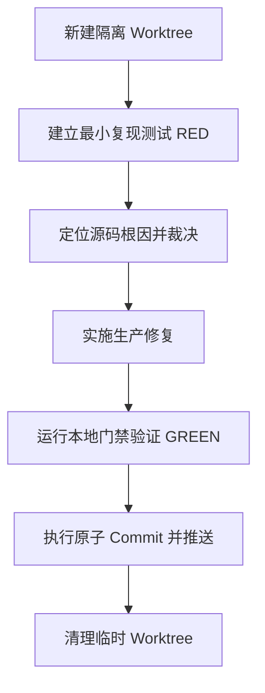

# 团队工作区原子提交规范 (Atomic Commit & Workspace Convention)

本规范定义了在 `super-agent-v3` 项目中，人类开发者与 AI 智能体（Agent）协作进行代码编写、Bug 修复及版本提交时的核心行为契约。旨在通过严格的工作区隔离与原子化提交，彻底杜绝 **“上下文污染（Context Pollution）”**，并解决 **“堆积代码、迟滞提交（磨洋工）”** 的效率痛点。

---

> [!IMPORTANT]
> **核心原则：单工作区只做单任务，小步跑完 RED-GREEN 立即提交，严禁跨任务脏代码堆积。**

---

## 一、 上下文污染与“压单”的危害定义

在人机协同开发中，“本地堆积大量未提交代码，最后一次性批量提交/拆分提交”的行为会带来严重的系统性风险：

1.  **AI 上下文脏污染 (Dirty Context Pollution)**：未提交的临时修改（特别是存在潜在缺陷的半成品代码）会混入源文件中。当 AI 被指派新任务读取该文件时，会被这些脏代码误导，导致生成的逻辑与旧任务发生冲突，产生二次 Bug。
2.  **Git Diff 噪声干扰 (Git Diff Noise)**：AI 编程工具在分析上下文时频繁依赖 `git diff`。若 diff 中混杂了多个不相干任务的改动，AI 的注意力机制（Attention）会被噪声分散，从而产生代码幻觉。
3.  **回滚与调试粘连 (Rollback Entanglement)**：没有 Commit 隔离的代码，一旦在联调中测试失败，AI 无法通过 `git checkout` 安全回退单个任务，导致人工和 AI 必须花大量时间手动拆解冲突，陷入调试死循环。

---

## 二、 团队工作区原子提交契约

为保证 Git 树的绝对清晰和 AI 提示词上下文的纯净，所有协作成员必须遵守以下原子提交规则：

### 1. 提交原子化 (Atomic Commits)
*   每个 Commit 必须**有且仅有一个明确的逻辑意图**（例如：单个 Bug 修复、单个 API 实现、单个页面的样式重构或单个测试夹具的添加）。
*   严禁将不相关的重构、格式化、无关依赖升级与当前修复混合在一个 Commit 中推送。
*   每一个提交必须是一个**完整的、可运行的、能通过门禁的**物理节点。

### 1.5 正常功能变更与特性的原子分步 (Atomicity of Normal Feature Changes)
*   **严禁单次大包提交**：严禁在单个 Commit 中包含整个大功能特性的修改。一个新功能或正常变更，必须按照架构分层拆分为原子化的子提交逐步推进。例如：
    1.  `Commit 1`：数据库 Schema 迁移与 SQLc 映射生成（含 sqlc-verify 验证）。
    2.  `Commit 2`：后端核心业务逻辑/契约 Service 实现（含单元测试）。
    3.  `Commit 3`：前端 Data Store/API 桥接层（含状态测试）。
    4.  `Commit 4`：前端 UI 视图组件与集成端到端测试。
*   **分步编译与测试通过**：每个子步骤提交时，都必须保证通过 `make guard` 且对应包的单体测试全部转绿，绝对不允许提交编译失败或带有已知红测失败的代码。
*   **特性分支隔离**：新功能开发必须在独立的 Feature 分支中进行，禁止与其他不相干的功能特性或 Bug 修复混用同一个本地工作区（Working Tree）。

### 2. 工作区彻底隔离 (Workspace Isolation)
*   **多任务并行时**：如果需要同时或交替处理多个 Bug（如 F01 和 F03）或开发多个独立功能，**禁止在同一个 Working Tree 下进行**。
*   必须使用 **Git 工作区（Git Worktree）** 机制为每个任务创建独立的物理目录。
    *   *规范路径*：在隔离工作区（如 `.worktrees/fix-f01`）内开发。
    *   *基线一致*：工作区分支必须基于最新的稳定 `main` 检出。
*   当一个任务完成并合并后，对应的工作区必须被安全清理，不留残留资源。

### 3. 禁止“压单”与高频同步 (No Commit Hoarding)
*   **小步快跑**：在 Bug Fix 过程中，一旦完成 **最小复现（RED） $\rightarrow$ 生产修复 $\rightarrow$ 测试转绿（GREEN）** 的闭环，且本地 `make guard` 通过，必须**立即提交并推送**。
*   严禁在本地工作区累积多个已修复但未 Commit 的任务。
*   如果在 2 小时以上的开发周期内没有任何 Commit 产出，必须在交接文档或状态追踪中说明阻断原因（如进入 React DOM 视口微调的死循环、或者等待外部契约对齐）。

---

## 三、 规范化 Bug 修复与提交工作流

所有 Bug 修复任务必须遵循以下标准流水线，严禁跳过任何阶段：

### 1. RED 阶段：建立最小复现
*   在修改任何生产代码前，必须编写一个能稳定复现缺陷的单元测试或集成测试，并确保其稳定运行失败（RED）。
*   *红线*：缺少复现日志/现象和复现用例时，禁止直接修改生产代码。

### 2. FIX 阶段：实施最小修复
*   只修改导致该 Bug 的最窄路径代码。
*   **禁止静默降级**：遇到异常、配置为空或数据缺失时，必须立即报错并阻断（Fail-Fast），严禁使用静默降级、默认配置、吞错捕获等隐式兜底逻辑。

### 3. GREEN 阶段：验证与代码守卫
在准备 Commit 前，必须按改动面运行最低限度的本地验证命令：

| 修改面 | 最低验证命令 | 说明 |
| :--- | :--- | :--- |
| **Go 业务/平台代码** | `./scripts/test_with_guard.sh <affected packages> -count=1` | 跨层契约变更需加跑 `make build-plain` |
| **架构守卫与基线** | `make guard` | `baseline.json` 的任何变化必须在 commit msg 中解释，禁止直接用 `--freeze` 覆盖 |
| **SQL 与 Store** | `make sqlc-verify` + 对应 Go 包测试 | 校验 sqlc 代码生成与 schema 幂等性 |
| **前端 React UI** | `cd frontend-app && npm run lint && npm test && npm run build` | 涉及 UI 变更需配合截图或 Playwright 验证 |

---

## 四、 中断与续跑交接规范 (Handoff Protocol)

如果任务在中途由于外部依赖、权限阻断或工时结束需要交接，必须在工作区留下明确的交接记录，包含以下五项要素：

> [!NOTE]
> **交接记录模板**
> 1. **工作树状态**：列出 `git status --short` 中 owned（已改）和 unrelated（未改）的文件。
> 2. **当前所处阶段**：标明处于 `repro`（复现中）、`RED`（红测已建立）、`fixing`（修复中）、`GREEN`（已转绿待整理）中的哪一步。
> 3. **红测状态**：详细列出每一条复现用例的 Pass/Fail 状态。
> 4. **生产改动清单**：列出目前已修改的生产文件路径。
> 5. **下一步明确指示**：继续修复红测、补强测试、或是直接清理并提 PR。

---

## 五、 Review 拒绝合并红线 (Rejection Conditions)

若提交的代码合并请求（PR）包含以下任一情况，将直接予以拒绝（Rejection）：

*   ❌ **无回归测试**：只有代码修改，但没有配套的 Bug-locking 测试、回归用例或等价的自动化验收证据。
*   ❌ **混合无关变更**：在修复 Commit 中夹带了无关的重构、代码格式化（如对未修改文件跑 gofmt）、或者历史清理。
*   ❌ **隐式降级遮丑**：通过返回默认值、空结果、静默日志或忽略错误来让测试碰巧变绿。
*   ❌ **绕过门禁守卫**：未经授权擅自修改 `baseline.json` 阈值、规避 `make guard` 报错或使用 `--no-verify` 绕过 Git Hooks。
*   ❌ **多任务混杂合并**：在同一个 PR 中塞入了多个相互独立的 Bug 修复，且没有提供逐条转绿的对比矩阵。

---
《团队工作区原子提交规范》已作为项目的长期开发契约归档。
落点路径：`docs/契约/atomic-commit-convention.md`
