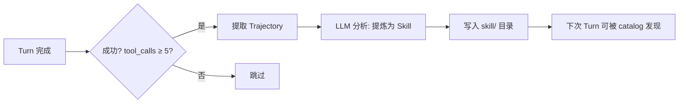

# P0: 自学习 Skill 闭环

## 目标
Agent 自动将成功经验（Trajectory）提炼为可复用 Skill，写入本地持久化供后续使用。

## 架构设计


## 现状校准

- 当前仓库已经具备 Skill 写入基础能力：`skills/local/write`、`skills/local/importDir`、`WriteSkillContent`、`WriteSummary`，以及 `SkillsChanged` 事件广播。
- 其中 `skills/local/write` 是 `cwd` + scope 感知的；但 `WriteSkillContent` / `WriteSummary` 当前直接写全局 `s.root`，不适合直接拿来做 project-scope 自学习沉淀。
- 当前 `skill/rpc.go` 注册的是宿主/UI JSON-RPC，不是 agent 直接可见的 MCP/dynamic tool；若希望模型在运行中主动“创建 skill”，必须单独打通 `cmd/mcp-orch/tools` + toolbridge 暴露链。
- `internal/module/turn/tracker.go` 目前只维护 turn 的本地状态与句柄，不记录完整 `tool_calls/results` 轨迹；不应把它扩展成事件流水仓库。
- 自动化提炼更适合复用现有 bus 订阅模式，参考 `internal/module/memory/module.go` 与 auto-dream 的做法。
- 如果后续需要用模型做离线归纳，可把 `contract.DreamExecutor` 作为可选接入点，但当前 provider 实现都返回 `ErrDreamExecutorNotConfigured`，不能作为近期默认依赖。

## 实施阶段

### Phase 1: Agent 主动创建 Skill（基础能力）
在提示词或工具面引导 Agent 主动沉淀经验。

| 模块 | 文件落点 | 说明 |
|---|---|---|
| Agent 友好创建封装 | `internal/module/skill/{contract.go,service.go}` | 在现有 `WriteLocal` 之上新增窄接口，例如 `CreateSkill(ctx, params)`，负责 `name -> .agent/skills/<slug>/SKILL.md` 的路径映射、scope 选择与基础校验 |
| 类型定义 | `internal/module/skill/rpc_skill_types.go` | 新增 `createSkillParams{Name, Content, Scope, CWD}`；继续沿用当前 `xxxParams` 风格 |
| Host RPC 包装 | `internal/module/skill/rpc.go` | 如需新增宿主侧入口，使用 slash 风格方法名，例如 `skills/create`；不要引入 `skill_create` 这类下划线命名 |
| Agent 可见工具 | `cmd/mcp-orch/tools/*` + toolbridge | 如果目标是“模型在运行中可直接调用”，则必须新增 agent-visible MCP/dynamic tool，而不是只改 host RPC |
| 引导提示 | `internal/module/prompt/*` 或 prompt template | 在 prompt 动态 section / template 中加入“何时提炼、如何命名、默认写入 project scope”指导，而不是挂到 `turn/prompt_context.go` |

> **入口边界**：`skills/create` 这类 slash 命名适合作为宿主/UI JSON-RPC 包装；若文档写“Agent 主动调用工具”，那对应的必须是 `mcp-orch`/toolbridge 暴露给模型的 agent-visible tool。两者不要混写。
>
> **命名与复用原则**：当前 Skill host RPC 家族已经统一使用 slash 风格，如 `skill/expand`、`skills/local/write`、`skills/readResource`。P0 应优先复用现有写路径；若需要降低 agent 使用门槛，再加一个窄包装入口，而不是重新发明一套下划线 RPC 名。
>
> **落盘约束**：若目标是 project scope，自学习入口必须走 `cwd` 感知路径解析，不能简单调用当前的 `WriteSkillContent`，否则会把项目经验错误写入全局技能根。

#### System Prompt 引导模板

```text
## Skill 提炼指导

当你成功完成一个复杂任务后，如果该解决方案具有通用性（例如排错流程、配置模式、
代码生成模板），你应当主动沉淀为可复用 Skill。

如果当前运行环境暴露了 agent-visible skill create 工具，则直接调用它；
否则只在宿主/UI 路径提供 `skills/create` 包装，不要假定模型自己能看到该方法。

Skill 内容应遵循 SKILL.md 格式：
- 包含 YAML frontmatter (name, description)
- 提供清晰的步骤说明
- 抽象为通用模式，移除项目特定细节
- 默认写入 project scope，避免把项目偶发经验误沉淀到全局 system scope
```

**Hermes 源码对照点**:
- `tools/skill_manager_tool.py:304-358` — `_create_skill()`
- `tools/skill_manager_tool.py:687-774` — Schema 定义
- `tools/skills_tool.py:666-731` — `skills_list()` 逻辑

### Phase 2: 自动提炼闭环（高阶）
不依赖 Agent 主动调用，由外部框架在 Turn 结束时监听轨迹并自动化分析。

| 模块 | 文件落点 | 说明 |
|---|---|---|
| 轨迹收集器 | `internal/module/turn/trajectory_collector.go` [NEW] | 订阅 `turndto.Turn*`、`tooldto.ToolCall*`、必要时 `dto.BusRawProviderEvent`，按 `turn_id` 聚合轨迹 |
| 启发评估器 | `internal/module/turn/skill_evaluator.go` [NEW] | 判定是否有提炼价值，例如成功、无人工拒批、tool call 次数达阈值、存在有效 diff/结果 |
| LLM 提炼器 | `internal/module/turn/skill_extractor.go` [NEW] | 将轨迹归纳为标准 `SKILL.md`；`DreamExecutor` 仅作 feature-gated 可选接入，当前默认应视为不可用 |
| 生命周期接线 | `internal/module/turn/module.go` | 按 memory 模块现有模式注册 bus 订阅与后台 flush，而不是把逻辑塞进 `watchTurn()` 或 `tracker.go` |
| 落库/落盘 | `internal/module/skill/service.go` | 统一通过 `CreateSkill` 或既有写接口写入，并复用 `SkillsChanged` 事件 |

## 发现与加载语义

- 写入 `SKILL.md` 后，下次 turn 最多保证“可被 Skill catalog 扫描到”。
- 是否真的进入模型上下文，取决于 progressive-disclosure、manual selection、provider native skill 机制、trust/approval，以及后续 `expand/read` 链路。
- 当前没有 runtime auto-match 的完整闭环；“自动加载”不能表述成“下一轮一定自动注入模型”。

## 关键实现约束

- 不要把完整轨迹长期堆在 `turnTracker` 里；它是运行态状态表，不是审计流水。
- 自动提炼默认仅写 project scope；system scope 必须显式批准。
- 创建入口必须显式携带 `cwd`；当前 `skill` 模块的大多数安全路径都依赖 `WithCWD(...)` 进行 scope 约束。
- project scope 的真实目标路径应明确为 `<canonical cwd>/.agent/skills/<slug>/SKILL.md`；绝对路径只能落在当前允许的 skill roots 内。
- `SkillsChanged` 事件当前不携带完整 scope/cwd 语义，不能把它当成 project-vs-system 的权威来源，除非同步扩展 payload。
- 轨迹聚合应按 `turn_id` 终态回收，避免后台 map 无界增长。
- 自动提炼必须 feature-gate；当前 `DreamExecutor` 未配置时应安静降级，而不是每个 turn 结束都失败刷日志。
- 提炼失败不能反向影响主 turn 成功与否，必须是 best-effort side effect。

**Hermes 源码对照点**:
- `agent/insights.py:299-373` — `_get_skill_usage()` 追踪频率
- `trajectory_compressor.py:1-50` — 轨迹压缩
