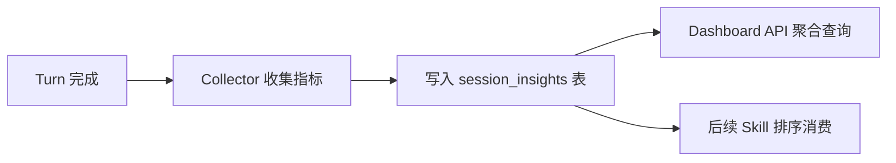

# P3: Session Insights 遥测

## 目标
在 Turn/Session 结束时自动收集使用指标（Skill 命中率、工具调用频率、平均 Turn 时长等），为自学习闭环和运维提供数据支撑。

## 架构设计


## 现状校准

- 当前 typed event bus 已经暴露 `turndto.Turn*`、`tooldto.ToolCall*`、`uidto.UITokensUpdated` 等事件，但不同事件头部并不等价完整；不能假定每条事件都天然带齐 `thread_id/agent_id/turn_id`。
- 当前并没有一个现成的 typed event 专门给出“本次 turn 最终命中了哪些 skill”；`skills_used` 如需入库，需要从 `PrepareTurn`/`dto.TurnRequest.Skills` 侧显式带出，或补一个专门事件。
- dashboard 模块已经能展示 `taskTraces`、`system logs`、`skills` 等监控页；P3 更适合新增聚合数据源并接入现有 dashboard。
- 当前仓库持久化统一走 Postgres/sqlc，不应再引入 SQLite `insights` 表旁路。

## 改动清单

| 模块 | 文件落点 | 说明 |
|---|---|---|
| 指标收集模块 | `internal/module/insight/{module.go,collector.go,service.go}` [NEW] | 订阅 typed event，按 `turn_id` 聚合 turn 级指标并落库 |
| 存储层 | `internal/store/insight/{contract.go,module.go,store.go}` [NEW] | 基于 sqlc 读写 `session_insights` |
| DDL + 查询 | `migrations/00X_session_insights.sql`、`sql/queries/session_insight.sql` [NEW] | 建表、聚合查询、按时间窗筛选 |
| Dashboard API | `internal/module/dashboard/{module.go,contract.go,service.go,ui_page.go,rpc.go}` | 新增 dashboard insights 查询入口，而不是单独旁路模块 |
| 模块接线 | `internal/store/module.go`、`internal/app/modules.go`、对应 `sqlc.yaml` | 把新 store / module 接进 DI 与 sqlc 生成面 |
| 后续消费 | `internal/module/turn/skills.go` 或新 scorer 模块 | 为未来 skill ranking / recommendation 提供数据源，但不要求本期立刻改匹配算法 |

### DDL 设计

```sql
CREATE TABLE IF NOT EXISTS session_insights (
    id                 BIGSERIAL PRIMARY KEY,
    thread_id          TEXT NOT NULL,
    agent_id           TEXT NOT NULL DEFAULT '',
    session_id         TEXT NOT NULL DEFAULT '',
    provider           TEXT NOT NULL DEFAULT '',
    local_turn_id      TEXT NOT NULL DEFAULT '',
    provider_turn_id   TEXT NOT NULL DEFAULT '',
    started_at         TIMESTAMPTZ,
    completed_at       TIMESTAMPTZ,
    duration_ms        INTEGER NOT NULL DEFAULT 0,
    success            BOOLEAN,
    status             TEXT NOT NULL DEFAULT 'unknown',
    stop_reason        TEXT NOT NULL DEFAULT '',
    tool_calls         INTEGER NOT NULL DEFAULT 0,
    tool_failures      INTEGER NOT NULL DEFAULT 0,
    approval_requests  INTEGER NOT NULL DEFAULT 0,
    token_input        INTEGER NOT NULL DEFAULT 0,
    token_output       INTEGER NOT NULL DEFAULT 0,
    token_total        INTEGER NOT NULL DEFAULT 0,
    context_window_tokens INTEGER NOT NULL DEFAULT 0,
    token_scope        TEXT NOT NULL DEFAULT '',
    token_source       TEXT NOT NULL DEFAULT '',
    skills_used        JSONB NOT NULL DEFAULT '[]'::jsonb,
    created_at         TIMESTAMPTZ NOT NULL DEFAULT NOW(),
    updated_at         TIMESTAMPTZ NOT NULL DEFAULT NOW()
);

CREATE INDEX idx_session_insights_thread_created
    ON session_insights(thread_id, created_at DESC);

CREATE INDEX idx_session_insights_created
    ON session_insights(created_at DESC);

CREATE UNIQUE INDEX uq_session_insights_provider_turn
    ON session_insights(provider, agent_id, provider_turn_id)
    WHERE provider_turn_id <> '';
```

> 不建议把单个 `turn_id` 直接当主键。当前系统同时存在 local turn id、provider turn id，以及部分事件头缺字段的情况；P3 需要允许“先缓存、后补齐”的聚合过程。

## 收集来源建议

- `turndto.TurnStarted` / `TurnCompleted`：确定起止时间、成功状态、stop reason
- `turndto.TurnInterrupted` / provider 翻译后的 aborted/failed 终态：补足非 completed 的 terminal 状态
- `tooldto.ToolCallBegin` / `ToolCallEnd`：统计工具调用次数、失败次数、耗时
- `tooldto.ToolApprovalRequested`：统计审批请求次数
- `uidto.UITokensUpdated`：记录 token snapshot，但应按“最后一次快照覆盖”处理，不要简单累加事件次数；同时保留 `token_total/context_window/source/scope`
- `PrepareTurn` instrumentation 或新增 `turn skills selected` 事件：提供 `skills_used`
- `uidto.SkillsChanged` 不属于单次 turn 指标，不建议直接写入 insights

## 指标来源矩阵

- 直接可得：turn started/completed/interrupted 时间戳、terminal status、tool 调用次数、tool failure、approval request/resolution。
- 条件可得：duration、stop_reason、部分 provider 的 token snapshot、tool elapsed_ms。
- 当前无现成来源：`skills_used`、candidate skill hit rate、per-turn `skill_expand` 归属、统一的 local/provider turn id 对照。

## 关键实现约束

- collector 应通过 bus 订阅聚合，不要把统计逻辑塞进 `turnTracker`。
- collector 应按“surrogate row + local/provider turn ids”聚合，并对 `thread_id/agent_id/session_id` 采取“最后非空值覆盖”策略，不要假设每一种 provider 事件都携带完美完整的头部。
- `session_insights` 只存聚合指标；原始 payload 调试继续看 raw provider event、task trace、system log。
- 当前 skill 匹配主逻辑位于 `internal/module/turn/skills.go`，所以后续若要消费 insights 做排序/权重，也应改那一层或抽新 scorer，不应误挂到纯文件读写的 `skill/service.go`。
- `success` 不应默认 true。对于只有 started、无终态或 crash 中断的 turn，应保持 unknown / null，而不是误记为成功。
- token 要区分 per-turn 与 thread/session snapshot；当前 `UITokensUpdated` 尤其在 Claude 路径上更接近 session/thread 视角，不能无条件归到单个 turn。
- dashboard 查询优先复用现有 `dashboard/*` 风格接口，不新开一套只给 insights 的独立 transport。
- 文档图里的 “Skill 权重更新” 只代表后续消费方向，不应作为 P3 首期必交 side effect。

## Hermes 源码对照点
- `agent/insights.py:1-120` — InsightManager 核心统计
- `agent/insights.py:299-373` — `_get_skill_usage()` 追踪调用频率
- `tools/insights_tool.py` — 暴露给用户的查询接口
