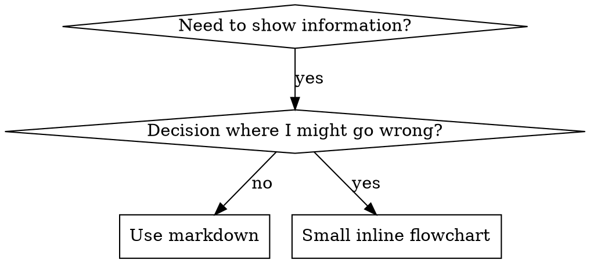

# 编写技能

## 概览

**编写技能就是把测试驱动开发应用到流程文档。**

**个人技能由 Super-Dolphin 统一管理；项目级 canonical 位于 `<cwd>/.agents/skills`，个人生效目录是 `~/.super-dolphin/skills/personal/{user,agent,imported}`；`personal/hub` 仅作目录/市场来源，不参与扫描、mirror 或 provider 调用。Claude/Codex 目录只是自动生成的 mirror。**

你编写测试用例（用子代理制造压力场景），看它们失败（基线行为），编写技能（文档），看测试通过（代理遵循），然后重构（堵住漏洞）。

**核心原则：** 如果你没有看到代理在没有技能时失败，就不知道这个技能是否教会了正确内容。

**必需背景：** 使用此技能前，必须理解 superpowers:测试驱动开发。该技能定义基础的 RED-GREEN-REFACTOR 循环。本技能把 TDD 应用于文档。

**官方指南：** Anthropic 官方技能编写最佳实践见 Anthropic最佳实践.md。本文档提供额外模式和指南，用于补充此技能中的 TDD 方法。

## 什么是技能？

**技能** 是经过验证的技术、模式或工具的参考指南。技能帮助未来的 Claude 实例找到并应用有效方法。

**技能是：** 可复用技术、模式、工具、参考指南

**技能不是：** 关于你曾经如何解决某个问题的叙事

## 技能的 TDD 映射

| TDD 概念 | 技能创建 |
|-------------|----------------|
| **测试用例** | 使用子代理的压力场景 |
| **生产代码** | 技能文档（SKILL.md） |
| **测试失败（RED）** | 没有技能时代理违反规则（基线） |
| **测试通过（GREEN）** | 有技能时代理遵循规则 |
| **重构** | 在保持遵循的前提下堵住漏洞 |
| **先写测试** | 写技能前先运行基线场景 |
| **看它失败** | 记录代理使用的精确合理化借口 |
| **最小代码** | 编写只针对这些具体违规的技能 |
| **看它通过** | 验证代理现在遵循 |
| **重构循环** | 找到新合理化 → 堵住 → 重新验证 |

整个技能创建过程都遵循 RED-GREEN-REFACTOR。

## 何时创建技能

**在以下情况创建：**
- 技术对你来说并非直觉显然
- 你会在跨项目中再次引用它
- 模式适用范围广（不是项目专属）
- 其他人会受益

**不要为以下内容创建：**
- 一次性解决方案
- 已在其他地方充分记录的标准实践
- 项目特定约定（放入 CLAUDE.md）
- 机械约束（如果能用 regex/validation 强制，就自动化；文档留给判断性工作）

## 技能类型

### 技术
有具体步骤的方法（condition-based-waiting、root-cause-tracing）

### 模式
思考问题的方式（flatten-with-flags、test-invariants）

### 参考
API 文档、语法指南、工具文档（office docs）

## 目录结构

```
skills/
  skill-name/
    SKILL.md              # Main reference (required)
    supporting-file.*     # Only if needed
```

**扁平命名空间**：所有技能放在一个可搜索命名空间中

**单独文件适用于：**
1. **重型参考**（100+ 行）：API 文档、完整语法
2. **可复用工具**：脚本、实用工具、模板

**保持内联：**
- 原则和概念
- 代码模式（< 50 行）
- 其他所有内容

## SKILL.md 结构

**Frontmatter（YAML）：**
- 两个必需字段：`name` 和 `description`（所有支持字段见 [agentskills.io/specification](https://agentskills.io/specification)）
- 总计最多 1024 个字符
- `name`：只使用字母、数字和连字符（不要使用括号或特殊字符）
- `description`：第三人称，只描述何时使用（不是它做什么）
  - 以 “Use when...” 开头，聚焦触发条件
  - 包含具体症状、情况和上下文
  - **绝不要概括技能的流程或工作流**（原因见 CSO 章节）
  - 尽量控制在 500 字符以内

```markdown
---
name: Skill-Name-With-Hyphens
description: Use when [specific triggering conditions and symptoms]
---

# Skill Name

## Overview
What is this? Core principle in 1-2 sentences.

## When to Use
[Small inline flowchart IF decision non-obvious]

Bullet list with SYMPTOMS and use cases
When NOT to use

## Core Pattern (for techniques/patterns)
Before/after code comparison

## Quick Reference
Table or bullets for scanning common operations

## Implementation
Inline code for simple patterns
Link to file for heavy reference or reusable tools

## Common Mistakes
What goes wrong + fixes

## Real-World Impact (optional)
Concrete results
```

## Claude 搜索优化（CSO）

**对发现至关重要：** 未来的 Claude 需要找到你的技能。

### 1. 丰富的 Description 字段

**目的：** Claude 会读取 description 来决定是否为给定任务加载某个技能。它应该回答：“我现在应该读这个技能吗？”

**格式：** 以 “Use when...” 开头，聚焦触发条件。

**关键：Description = 何时使用，而不是技能做什么**

description 只应描述触发条件。不要在 description 中概括技能流程或工作流。

**为什么重要：** 测试显示，当 description 概括技能工作流时，Claude 可能会遵循 description，而不是读取完整技能内容。一个写着 “code review between tasks” 的 description 让 Claude 只做了一次审查，尽管技能流程图清楚写了两次审查（先规格符合性，再代码质量）。

当 description 改为 “Use when executing implementation plans with independent tasks”（没有工作流总结）时，Claude 正确读取流程图并遵循两阶段审查流程。

**陷阱：** 概括工作流的 description 会创建 Claude 会采用的捷径。技能正文会变成 Claude 跳过的文档。

```yaml
# ❌ BAD: Summarizes workflow - Claude may follow this instead of reading skill
description: Use when executing plans - dispatches subagent per task with code review between tasks

# ❌ BAD: Too much process detail
description: Use for TDD - write test first, watch it fail, write minimal code, refactor

# ✅ GOOD: Just triggering conditions, no workflow summary
description: Use when executing implementation plans with independent tasks in the current session

# ✅ GOOD: Triggering conditions only
description: Use when implementing any feature or bugfix, before writing implementation code
```

**内容：**
- 使用能表明技能适用的具体触发词、症状和场景
- 描述*问题*（竞态条件、不一致行为），而不是*语言特定症状*（setTimeout、sleep）
- 除非技能本身是技术特定的，否则保持技术无关
- 如果技能是技术特定的，在触发条件中明确说明
- 使用第三人称（会注入系统提示）
- **绝不要概括技能流程或工作流**

```yaml
# ❌ BAD: Too abstract, vague, doesn't include when to use
description: For async testing

# ❌ BAD: First person
description: I can help you with async tests when they're flaky

# ❌ BAD: Mentions technology but skill isn't specific to it
description: Use when tests use setTimeout/sleep and are flaky

# ✅ GOOD: Starts with "Use when", describes problem, no workflow
description: Use when tests have race conditions, timing dependencies, or pass/fail inconsistently

# ✅ GOOD: Technology-specific skill with explicit trigger
description: Use when using React Router and handling authentication redirects
```

### 2. 关键词覆盖

使用 Claude 可能搜索的词：
- 错误消息：“Hook timed out”、“ENOTEMPTY”、“race condition”
- 症状：“flaky”、“hanging”、“zombie”、“pollution”
- 同义词：“timeout/hang/freeze”、“cleanup/teardown/afterEach”
- 工具：实际命令、库名、文件类型

### 3. 描述性命名

**使用主动语态，动词优先：**
- ✅ `creating-skills` 而不是 `skill-creation`
- ✅ `condition-based-waiting` 而不是 `async-test-helpers`

### 4. Token 效率（关键）

**问题：** getting-started 和频繁引用的技能会加载进每个对话。每个 token 都重要。

**目标词数：**
- getting-started 工作流：每个 <150 词
- 频繁加载技能：总计 <200 词
- 其他技能：<500 词（仍需简洁）

**技术：**

**把细节移到工具帮助里：**
```bash
# ❌ BAD: Document all flags in SKILL.md
search-conversations supports --text, --both, --after DATE, --before DATE, --limit N

# ✅ GOOD: Reference --help
search-conversations supports multiple modes and filters. Run --help for details.
```

**使用交叉引用：**
```markdown
# ❌ BAD: Repeat workflow details
When searching, dispatch subagent with template...
[20 lines of repeated instructions]

# ✅ GOOD: Reference other skill
始终使用子代理 (50-100x context savings). 强制要求: Use [other-skill-name] for workflow.
```

**压缩示例：**
```markdown
# ❌ BAD: Verbose example (42 words)
your human partner: "How did we handle authentication errors in React Router before?"
You: I'll search past conversations for React Router authentication patterns.
[Dispatch subagent with search query: "React Router authentication error handling 401"]

# ✅ GOOD: Minimal example (20 words)
Partner: "How did we handle auth errors in React Router?"
You: Searching...
[Dispatch subagent → synthesis]
```

**消除冗余：**
- 不要重复交叉引用技能中的内容
- 不要解释命令本身显而易见的内容
- 不要为同一种模式包含多个示例

**验证：**
```bash
wc -w skills/path/SKILL.md
# getting-started workflows: aim for <150 each
# Other frequently-loaded: aim for <200 total
```

**按你要做什么或核心洞察命名：**
- ✅ `condition-based-waiting` > `async-test-helpers`
- ✅ `using-skills` 而不是 `skill-usage`
- ✅ `flatten-with-flags` > `data-structure-refactoring`
- ✅ `root-cause-tracing` > `debugging-techniques`

**动名词（-ing）适合流程：**
- `creating-skills`、`testing-skills`、`debugging-with-logs`
- 主动，描述你正在采取的动作

### 4. 交叉引用其他技能

**编写引用其他技能的文档时：**

只使用技能名称，并使用明确的要求标记：
- ✅ 好：`**强制要求子技能:** Use superpowers:测试驱动开发`
- ✅ 好：`**强制要求背景知识:** 你必须理解 superpowers:系统化调试`
- ❌ 坏：`See skills/testing/测试驱动开发`（不清楚是否必需）
- ❌ 坏：`@skills/testing/测试驱动开发/SKILL.md`（强制加载，消耗上下文）

**为什么不用 @ 链接：** `@` 语法会立即强制加载文件，在你需要前就消耗 200k+ 上下文。

## 流程图使用



**只在以下情况使用流程图：**
- 非显而易见的决策点
- 你可能太早停止的流程循环
- “何时用 A vs B” 决策

**绝不要为以下内容使用流程图：**
- 参考资料 → 表格、列表
- 代码示例 → Markdown 代码块
- 线性指令 → 编号列表
- 没有语义意义的标签（step1、helper2）

Graphviz 样式规则见 @graphviz-conventions.dot。

**为你的协作者可视化：** 使用本目录中的 `render-graphs.js` 将技能流程图渲染为 SVG：
```bash
./render-graphs.js ../some-skill           # Each diagram separately
./render-graphs.js ../some-skill --combine # All diagrams in one SVG
```

## 代码示例

**一个优秀示例胜过多个平庸示例。**

选择最相关的语言：
- 测试技术 → TypeScript/JavaScript
- 系统调试 → Shell/Python
- 数据处理 → Python

**好示例：**
- 完整且可运行
- 注释良好，解释为什么
- 来自真实场景
- 清楚展示模式
- 易于改造（不是通用模板）

**不要：**
- 用 5 种以上语言实现
- 创建填空模板
- 编写刻意编造的示例

你擅长移植：一个好示例就足够。

## 文件组织

### 自包含技能
```
defense-in-depth/
  SKILL.md    # Everything inline
```
适用：所有内容都能放下，不需要重型参考

### 带可复用工具的技能
```
condition-based-waiting/
  SKILL.md    # Overview + patterns
  example.ts  # Working helpers to adapt
```
适用：工具是可复用代码，而不只是叙述

### 带重型参考的技能
```
pptx/
  SKILL.md       # Overview + workflows
  pptxgenjs.md   # 600 lines API reference
  ooxml.md       # 500 lines XML structure
  scripts/       # Executable tools
```
适用：参考资料太大，不适合内联

## 铁律（与 TDD 相同）

```
NO SKILL WITHOUT A FAILING TEST FIRST
```

这适用于新技能和对现有技能的编辑。

先写技能再测试？删除它。重新开始。
未测试就编辑技能？同样违规。

**没有例外：**
- “简单补充”也不例外
- “只是加一节”也不例外
- “文档更新”也不例外
- 不要把未测试变更保留为“参考”
- 不要在运行测试时“改造”
- 删除就是删除

**必需背景：** superpowers:测试驱动开发 技能解释了为什么这重要。同样原则适用于文档。

## 测试所有技能类型

不同技能类型需要不同测试方法：

### 强制纪律类技能（规则/要求）

**示例：** TDD、完成前验证、designing-before-coding

**测试方式：**
- 学术问题：代理是否理解规则？
- 压力场景：代理是否在压力下遵守？
- 组合多重压力：时间 + 沉没成本 + 疲惫
- 识别合理化，并添加明确反制

**成功标准：** 代理在最大压力下仍遵守规则

### 技术类技能（how-to 指南）

**示例：** condition-based-waiting、root-cause-tracing、defensive-programming

**测试方式：**
- 应用场景：代理能否正确应用技术？
- 变体场景：是否能处理边界情况？
- 信息缺失测试：指令是否有缺口？

**成功标准：** 代理能把技术成功应用到新场景

### 模式类技能（心智模型）

**示例：** reducing-complexity、information-hiding concepts

**测试方式：**
- 识别场景：代理是否识别模式何时适用？
- 应用场景：能否使用该心智模型？
- 反例：是否知道何时不该应用？

**成功标准：** 代理正确识别何时/如何应用模式

### 参考类技能（文档/API）

**示例：** API 文档、命令参考、库指南

**测试方式：**
- 检索场景：能否找到正确信息？
- 应用场景：能否正确使用找到的信息？
- 缺口测试：常见用例是否覆盖？

**成功标准：** 代理找到并正确应用参考信息

## 跳过测试的常见合理化

| 借口 | 现实 |
|--------|---------|
| “技能显然很清楚” | 对你清楚 ≠ 对其他代理清楚。测试它。 |
| “这只是参考” | 参考也会有缺口和不清楚章节。测试检索。 |
| “测试太过了” | 未测试技能总有问题。始终如此。15 分钟测试节省数小时。 |
| “有问题再测试” | 问题 = 代理无法使用技能。部署前测试。 |
| “测试太麻烦” | 测试比在生产中调试坏技能轻松。 |
| “我确信它很好” | 过度自信保证出问题。仍然测试。 |
| “学术审查足够” | 阅读 ≠ 使用。测试应用场景。 |
| “没时间测试” | 部署未测试技能会在之后浪费更多时间修它。 |

**这些都意味着：部署前测试。没有例外。**

## 让技能抵抗合理化

强制纪律的技能（如 TDD）需要抵抗合理化。代理很聪明，在压力下会找到漏洞。

**心理学说明：** 理解为什么说服技巧有效，有助于系统性使用它们。研究基础见 说服力原则.md（Cialdini, 2021；Meincke 等，2025），涉及权威、承诺、稀缺性、社会认同和共同体原则。

### 明确堵住每个漏洞

不要只陈述规则：要禁止具体规避方式。

<Bad>
```markdown
Write code before test? Delete it.
```
</Bad>

<Good>
```markdown
Write code before test? Delete it. Start over.

**绝无例外:**
- Don't keep it as "reference"
- Don't "adapt" it while writing tests
- Don't look at it
- Delete means delete
```
</Good>

### 处理“精神 vs 字面”争论

在前面加入基础原则：

```markdown
**Violating the letter of the rules is violating the spirit of the rules.**
```

这会切断整类“我遵循的是精神”的合理化。

### 构建合理化表

从基线测试捕获合理化（见下方测试章节）。代理提出的每个借口都放进表里：

```markdown
| Excuse | Reality |
|--------|---------|
| "Too simple to test" | Simple code breaks. Test takes 30 seconds. |
| "I'll test after" | Tests passing immediately prove nothing. |
| "Tests after achieve same goals" | Tests-after = "what does this do?" Tests-first = "what should this do?" |
```

### 创建红旗列表

让代理容易在合理化时自检：

```markdown
## Red Flags - STOP and Start Over

- Code before test
- "I already manually tested it"
- "Tests after achieve the same purpose"
- "It's about spirit not ritual"
- "This is different because..."

**All of these mean: Delete code. Start over with TDD.**
```

### 为违规症状更新 CSO

把你即将违反规则时的症状加入 description：

```yaml
description: use when implementing any feature or bugfix, before writing implementation code
```

## 技能的 RED-GREEN-REFACTOR

遵循 TDD 循环：

### RED：编写失败测试（基线）

在没有技能的情况下，用子代理运行压力场景。记录精确行为：
- 它们做出了什么选择？
- 它们使用了什么合理化（逐字记录）？
- 哪些压力触发了违规？

这就是“看测试失败”：写技能前你必须看到代理自然会做什么。

### GREEN：编写最小技能

编写能处理这些具体合理化的技能。不要为假设情况添加额外内容。

带着技能运行相同场景。代理现在应当遵守。

### REFACTOR：堵住漏洞

代理发现新的合理化？添加明确反制。重新测试直到稳固。

**测试方法：** 完整测试方法见 @使用子代理测试技能.md：
- 如何编写压力场景
- 压力类型（时间、沉没成本、权威、疲惫）
- 系统性堵洞
- 元测试技术

## 反模式

### ❌ 叙事示例
“在 2025-10-03 的会话中，我们发现空 projectDir 导致……”
**为什么坏：** 太具体，不可复用

### ❌ 多语言稀释
example-js.js、example-py.py、example-go.go
**为什么坏：** 质量平庸，维护负担

### ❌ 流程图里写代码
```dot
step1 [label="import fs"];
step2 [label="read file"];
```
**为什么坏：** 无法复制粘贴，难读

### ❌ 通用标签
helper1、helper2、step3、pattern4
**为什么坏：** 标签应有语义意义

## 停止：进入下一个技能前

**写完任何技能后，你必须停止并完成部署流程。**

**不要：**
- 未逐个测试就批量创建多个技能
- 当前技能验证前进入下一个技能
- 因为“批处理更高效”而跳过测试

**下面的部署检查清单对每个技能都是强制性的。**

部署未测试技能 = 部署未测试代码。违反质量标准。

## 技能创建检查清单（TDD 适配）

**重要：使用 TodoWrite 为下面每个检查项创建 todo。**

**RED 阶段：编写失败测试：**
- [ ] 创建压力场景（纪律技能需要 3+ 种组合压力）
- [ ] 在没有技能的情况下运行场景：逐字记录基线行为
- [ ] 识别合理化/失败模式

**GREEN 阶段：编写最小技能：**
- [ ] 名称只使用字母、数字、连字符（无括号/特殊字符）
- [ ] YAML frontmatter 包含必需的 `name` 和 `description` 字段（最多 1024 字符；见 [spec](https://agentskills.io/specification)）
- [ ] Description 以 “Use when...” 开头，并包含具体触发词/症状
- [ ] Description 使用第三人称
- [ ] 全文包含用于搜索的关键词（错误、症状、工具）
- [ ] 清晰概览和核心原则
- [ ] 处理 RED 中识别的具体基线失败
- [ ] 代码内联，或链接到单独文件
- [ ] 一个优秀示例（不是多语言）
- [ ] 带着技能运行场景：验证代理现在遵守

**REFACTOR 阶段：堵住漏洞：**
- [ ] 从测试中识别新的合理化
- [ ] 添加明确反制（如果是纪律技能）
- [ ] 从所有测试迭代构建合理化表
- [ ] 创建红旗列表
- [ ] 重新测试直到稳固

**质量检查：**
- [ ] 只在决策不明显时使用小流程图
- [ ] 快速参考表
- [ ] 常见错误章节
- [ ] 不写叙事故事
- [ ] 支撑文件只用于工具或重型参考

**部署：**
- [ ] 将技能提交到 git 并推送到你的 fork（如已配置）
- [ ] 如果广泛有用，考虑通过 PR 贡献回去

## 发现工作流

未来 Claude 如何找到你的技能：

1. **遇到问题**（“tests are flaky”）
3. **找到 SKILL**（description 匹配）
4. **扫描概览**（这相关吗？）
5. **读取模式**（快速参考表）
6. **加载示例**（只在实现时）

**为这个流程优化**：把可搜索词尽早、经常放入文档。

## 底线

**创建技能就是流程文档的 TDD。**

同一条铁律：没有失败测试，就没有技能。
同一循环：RED（基线）→ GREEN（写技能）→ REFACTOR（堵住漏洞）。
同一收益：更高质量、更少意外、更稳固结果。

如果你对代码遵循 TDD，也要对技能遵循 TDD。它是同一种纪律在文档上的应用。
